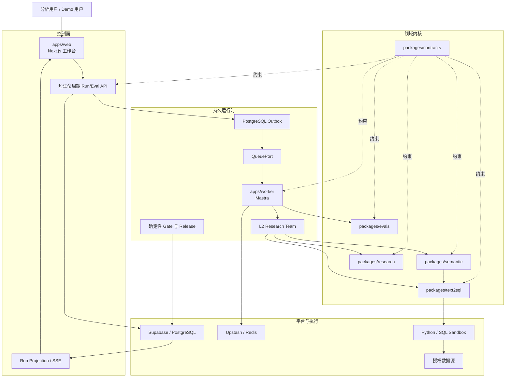
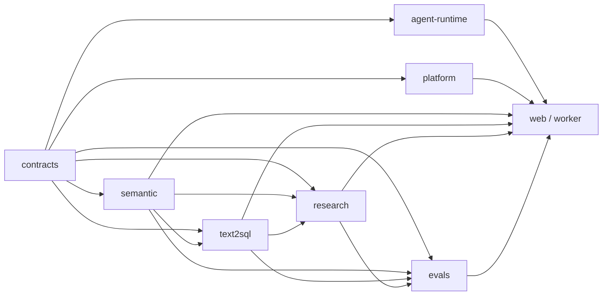

# Data Agent L2 纵向切片架构设计

## 1. 文档目的

本文把 `prd.md` 中原始 R1–R8 和待审 R9a–R9d 转换为可实施架构。首版仍只实现
“L2 多步研究分析师 + 强 Text2SQL + 评测闭环”，L3–L5 只保留稳定扩展契约。

状态边界：R1–R8 与既有 U1–U9 的历史记录继续有效；本文件中的 R9/U10/U11/U13 是
Ontology 修订候选，不代表已经实现，也不授权在用户审核前开始产品代码、Migration 或
运行时激活。

对应的实施级计划：

- 原始纵向切片基线：
  `docs/plans/2026-07-25-001-refactor-data-agent-l2-vertical-slice-plan.md`
- 当前待审修订主计划：
  `docs/plans/2026-07-30-001-refactor-governed-semantic-control-plane-plan.md`

本轮研究依据：

- `/Users/lienli/Documents/work/深度调研/research/data-agent-system-design/answers/RQ080-如何把空白重置仓库规划为以-Mastra-为-Agent-内核-以-L2-多步研究分析师和强-Text2SQL-为首版纵向切片-以内建-Benchmark-驱动开发并兼容托管与.md`
- `RQ092` Reader Answer SHA-256
  `8d6b6b22f4edaa53579b7a5f4710421f96967052a0bf7078ad4fb68a65b9df3b`，
  FullAnswerRecertification 为
  `RQ092-8d6b6b22f4ed-4a1ab76b73fb-recertification.md`，`decision=closed`。
- 仓库内冻结投影：
  `docs/design/u6-research-authority-contract.md`、
  `docs/design/u6-research-planning-payload-contract.md` 与
  `docs/design/u6-research-oed-v2-contract.md`、
  `docs/design/u6-research-wire-payload-contract.md`；派生 Wire/回执、平台事务、资源调用与
  受控 Oracle 分别冻结在 `u6-research-derivation-wire-contract.md`、
  `u6-research-derivation-receipt-contract.md`、
  `u6-research-platform-contract.md`、
  `u6-research-database-surface-contract.md`、
  `u6-research-migration-safety-contract.md`、
  `u6-research-execution-storage-contract.md`、
  `u6-terminal-reference-graph-contract.md`、
  `u6-research-resource-invocation-contract.md`、
  `u6-invocation-state-contract.md`、
  `u6-invocation-result-crypto-contract.md`、
  `u6-result-key-lifecycle-contract.md`、
  `u6-system-record-lifecycle-contract.md`、
  `u6-app-lifecycle-cleanup-contract.md` 与
  `u6-controlled-fixture-contract.md`。

## 2. 架构目标

- 让一次分析从问题到报告形成可重放的 Artifact 链，而不是一段不可检查的 Agent 对话。
- 让 Mastra 负责 Agent/Workflow 生命周期，但不拥有 SQL、Evidence 或 Release 的正确性。
- 让不同模型 Provider、外部编码 Agent 与多 Agent Team 在统一能力契约下工作。
- 让 Text2SQL 从“生成 SQL 的工作流”升级为“受业务语义和数据语义双重约束的查询编译器”。
- 让 `BusinessOntology` 提供业务意义、稳定身份与候选范围，但不越权拥有公式、Join、
  物理绑定、数据质量、Policy、贡献数值或因果关系。
- 让受 Ontology 约束的描述性贡献先在 Fixture 证明端点证据、分区与闭合可行，再在完整
  PostgreSQL 发布控制面之后注册为非因果产品能力。
- 让 Benchmark 成为开发、发布与产品 Demo 共用的正式能力，同时隔离 Demo、Tuning 与 Holdout。
- 让 Vercel/Supabase/Upstash 和 Docker 使用同一领域契约、状态语义与验证套件。
- 让多个应用可以安全共享一个 Supabase Project，避免 Schema、数据、Migration、Storage 与 Redis 串扰。

## 3. 非目标

- 首版不实现 L3 Experiment DAG、L4 主动观察、L5 因果识别。
- M1 不注册产品归因 Route，不把 Fixture Kernel 的可行性证据包装成已发布能力。
- 不把 Ontology、Lineage、Topology、贡献排序或相关性自动升级为根因或因果证据。
- 不实现 L6 生产写操作。
- 不兼容旧 LangGraph State、旧 NestJS 模块结构或旧 API。
- 不自动迁移生产数据。
- 不把公共 Benchmark 或 LLM Judge 分数当成真实生产效果。

## 4. 总体拓扑



### 4.1 控制面

Vercel/Next.js 只处理：

- 鉴权和应用上下文解析。
- 接收 Run/Eval Command。
- 在一个 PostgreSQL 事务中写入 Command、Idempotency Record、Initial Event 与 Outbox。
- 查询和流式投影持久状态。
- 接收 Cancel、Resume、Replay、Clarification 等短命令。

控制面不在 HTTP 请求内执行长分析、SQL、Python 或完整 Benchmark。

### 4.2 持久 Worker 面

Worker 负责：

- 默认从 PostgreSQL Lease Queue 通过 `FOR UPDATE SKIP LOCKED` 获取带 Fence 的 Lease；`QueuePort` 允许后续替换 Adapter。
- 恢复 Mastra Workflow Snapshot。
- 调用 Model、Tool、Text2SQL、Research 与 Eval Kernel。
- 将每个权威 Artifact 以新 Revision 事务化提交。
- 在 Side Effect 成功后保存 Receipt，再确认 Queue。
- 处理 Retry、Cancel、Stale Worker 与 Replay。

### 4.3 领域内核

领域内核不依赖 Mastra、Next.js、Supabase SDK 或 Redis SDK，只依赖：

- `packages/contracts`
- 显式 Port
- 领域值对象与纯验证逻辑

这样才能在替换框架、部署形态或 Provider 时保持业务正确性。

## 5. Package 依赖规则



禁止关系：

- `contracts` 不得导入任何运行时或平台 SDK。
- `semantic`、`text2sql`、`research`、`evals` 不得导入 Mastra。
- `semantic` 只定义 Source、Compiler、Validation 与发布投影合同；它不能导入 U6 并改写
  `VersionFrontier`，也不能通过旁路执行 U5 无法 lower 的公式。
- `platform` 不得导入领域 Workflow。
- App 不得定义领域真值或绕过 Gate 写入成功状态。

由 `dependency-boundaries.spec.ts` 和 Lint Rule 强制执行。

## 6. Artifact 与权威链

首版 Artifact 链：

```text
QuestionFrame
→ ResearchBrief@2
→ HypothesisSet@2
→ EvidencePlan@2（逻辑 ProofObligationSet）
→ QueryContract + ObligationExecutionDecision@2
→ GroundingPackage
→ SemanticQuery
→ LogicalPlan
→ SqlArtifact
→ ValidationReceipt
→ ExecutionReceipt
→ QueryEvidence@2
→ AtomicClaim@2 / EvidenceRelation / EvidenceCheckReceipt
→ SupportDecision / HypothesisAssessment
→ CoverageState / ResearchStopDecision
→ ReportManifest@2 / AnalysisReport@2 / ReportProjectionReceipt
→ 4 × EvidenceGateReceipt
→ ReportReadyCertificate@3
→ consumeCurrentReady
→ READY / ReportReadGrant
→ 可选 ReadinessRevocationReceipt
```

R9 增量不改写上面的 U6 Wire，而是在它上游和旁路增加两条显式链：

```text
SemanticSourceBundle@1（六平面 Source）
→ Candidate / Compile / Validation / Human Review
→ PostgreSQL SourceRelease + ActivePointerGeneration
→ GroundingAuthorityMaterializer
→ 现有 U5 SemanticRelease + SchemaSnapshot + PolicyReceipt
→ 现有 U6 QueryEvidence@2 / AtomicClaim@2
```

```text
M1: U7 ContributionTruthContract@1
→ Fixture DescriptiveContributionProfileProjection
→ EndpointExecutionTemplate[] → EndpointExecutionBinding[] → 现有 U5/U6 QueryEvidence@2
→ U13.1 AttributionKernelEvidence@1
→ U7 post-Kernel AttributionFeasibilityVerdict
→ U8 Fixture Evidence Demo

M1 固定状态：Core L2=HOLD；Attribution F9=NOT_REGISTERED；Fixture Evidence=HOLD

M2（必须晚于 U10.3）: PostgreSQL active exact release/profile
→ EndpointExecutionTemplate[] → EndpointExecutionBinding[] → 现有 U5/U6 QueryEvidence@2
→ ContributionClosureReceipt → ContributionItemSet（最高 CONTRIBUTION）
```

M1 链不产生 F9 产品 Route；M2 链也不增加 U6 Artifact Type 或
`SEMANTIC × SCHEMA × DATA × POLICY × IDENTITY` 之外的新 Version Frontier 轴。

### 6.1 ArtifactEnvelope

所有 Artifact 使用同一个 Envelope：

```text
artifact_id
artifact_type
app_id
tenant_id
run_id
revision
attempt_id
producer
input_refs[]
schema_version
semantic_version
policy_version
model_profile_version
content_hash
status
created_at
```

约束：

- 内容或语义变化产生新 Revision，不允许原地覆盖。
- `input_refs` 必须属于同一 App/Tenant/Run，除非显式 Cross-Scope Policy 允许。
- 迟到 Worker 只能归档结果，不能覆盖 Active Revision。
- Artifact 的状态只能由拥有该状态的确定性组件提交。

### 6.2 Run 状态

公开终态：

- `READY`
- `PARTIAL`
- `NEEDS_CLARIFICATION`
- `NEEDS_MORE_RESEARCH`
- `INCONCLUSIVE`
- `POLICY_BLOCKED`
- `FAILED`
- `CANCELLED`
- `STALE`
- `REPLAY_UNAVAILABLE`

发布决策独立为：

- `GO`
- `HOLD`
- `NO_GO`
- `ROLLBACK`

禁止把 Run 成功自动映射为 Release `GO`。

## 7. Mastra、模型与多 Agent

### 7.1 Mastra 的职责

Mastra 负责：

- Agent 与 Supervisor 生命周期。
- Workflow、Suspend/Resume 与 Snapshot。
- Tool Invocation。
- Model Routing 与 Streaming。
- 通用 Trace/Scorer 集成。

Mastra 不负责：

- 决定 SQL 是否语义正确。
- 决定 Evidence 是否真正支持 Claim。
- 签发 `ReportReadyCertificate@3`。
- 决定 Release `GO`。

### 7.2 ModelProviderAdapter

按 Capability 选择 Model，而不是在业务代码中写 Provider 分支。能力字段至少包含：

- Structured Output
- Tool Calling
- Streaming
- Context Window
- Vision
- Reasoning Mode
- Region/Privacy
- Cost/Budget
- Fallback Compatibility

Provider 名称是配置，不是领域分支。

首版必须为 OpenAI、Anthropic/Claude、DeepSeek、GLM、Kimi、Grok、Gemini 提供真实 `ModelProfile` 与 Adapter 配置。七类 Adapter 均做离线 Request/Structured Output/Tool/Stream/Error Conformance；只有完成带真实凭据 Smoke 并保存 Model Receipt 的 Provider 才能显示为 `AVAILABLE`。

### 7.3 ExternalAgentAdapter

Claude Code 等外部执行 Agent 使用不同契约：

- Workspace
- Process/Session
- Permission Envelope
- Allowed Command/Tool
- Cancellation
- Event Stream
- Output Artifact
- Audit Receipt

External Agent 不能注册为 Model，也不能继承 Model Tool 的默认权限。

### 7.4 多 Agent Team

首版最小 Team：

- Research Supervisor
- Semantic/SQL Worker
- Evidence Worker
- Report Projector

Agent 间只传递 `TaskEnvelope`、Artifact Reference、预算与策略，不共享无限 Raw Memory。每次 Handoff 产生 `HandoffReceipt`。

## 8. 强 Text2SQL 编译器

### 8.1 编译阶段

1. `QuestionFrame`：冻结原始问题、用户范围和预期结果。
2. `QueryContract`：明确 Metric、Dimension、Grain、Time、Unit、Filter、Datasource、Result Contract。
3. `GroundingPackage`：ACL 过滤后检索业务语义、数据语义、Verified Query 和 Join Bridge。
4. `SemanticQuery`：把业务概念解析为稳定语义对象。
5. `LogicalPlan`：生成与 SQL Dialect 无关的计划。
6. `SqlArtifact`：按 Dialect 编译 SQL。
7. `ValidationReceipt`：分别执行七道 Gate。
8. `ExecutionReceipt`：在 Sandbox 中受控执行。
9. `QueryEvidence`：保存结果、版本、不变量与 Result Oracle 结论。

首版发布级 Dialect 只包含 PostgreSQL；其他 Dialect 只能通过 `SqlDialectPort` 返回明确的 `UNSUPPORTED_DIALECT`。`ExecutionReceipt` 还必须绑定 Datasource Identity、Schema Version、Snapshot Token/Watermark、Observed Time 与 Query Hash；数据源无法提供可重放快照时，界面与 API 必须显示受限重放或 `REPLAY_UNAVAILABLE`。

### 8.2 七道 Gate

| Gate | 判定内容 | 失败处理 |
| --- | --- | --- |
| Intent | 是否回答冻结问题 | 澄清或重新规划 |
| Semantic | Metric/Grain/Time/Unit/Join 是否正确 | 澄清或重新 Grounding |
| Structural | AST、Dialect、Schema Reference 是否有效 | 有界实现修复 |
| Policy | ACL、RLS、数据范围、敏感字段是否允许 | 失败关闭 |
| Resource | Row/Cost/Time/Scan Budget 是否允许 | 拒绝或缩小计划 |
| Execution | Sandbox 执行是否成功且 Receipt 完整 | 有界技术重试 |
| Result | 结果是否满足业务不变量与结果契约 | 有界修复或非 Ready |

Repair 只能修改实现细节，不能改变 `QueryContract` 中的 Metric、Filter、Join、Policy 或 Result Contract。

### 8.3 六平面语义 Authority（R9 待审增量）

`SemanticSourceBundle@1` 采用六个互不越权的平面。`BusinessOntology` 是业务意义骨架，
不是完整语义层：

| 平面 | 唯一拥有的属性 | 明确不拥有 |
| --- | --- | --- |
| `BusinessOntology` | Domain、业务实体/事件/术语/关系类型、稳定逻辑 ID、alias、owner、lifecycle、业务 `domain/range` | Formula、分析 Join、表列坐标、数据正确性、Policy、贡献值、因果边 |
| `AnalyticalSemantics` | Measure、Dimension、Metric、FormulaAST、Grain、Unit、TimeDomain、Additivity | Join 安全、物理 currentness、访问授权 |
| `RelationshipRegistry` | join key、cardinality、grain transition、fanout proof、AnalyticalJoin/PhysicalJoin/FormulaDependency | 业务名称权威、表列存在性、因果关系 |
| `PhysicalBinding` | 逻辑对象到 datasource/schema/table/column 的坐标与 binding lifecycle | 指标公式、业务关系、数据值真值 |
| `CatalogGovernance` | table/column/constraint/snapshot currentness、catalog fence、数据质量/结果 Oracle 引用 | 业务含义、访问扩权 |
| `RuntimeAuthorization` | 分类、用途与附加 DENY/RESTRICT；由 Policy Authority 计算与平台策略的最终交集 | 数据库授权、独立签发 `PolicyReceipt`、任何访问扩权 |

`DescriptiveContributionProfileProjection` 不是第七个 Source Authority，而是下列 canonical
source paths 的确定性跨平面编译产物：identity/eligibility/driver ontology refs 归
`BusinessOntology`；decomposition kind/measure AST/formula/unit/grain/witness 归
`AnalyticalSemantics`；partition predicates/join safety 归 `RelationshipRegistry`；endpoint
table/column/expression 归 `PhysicalBinding`；snapshot/currentness 归 `CatalogGovernance`；
principal scope/restriction 归 `RuntimeAuthorization`。`ContributionMethodAuthority`、
`ContributionReleaseAuthority`、`ConclusionPolicyAuthority` 与未来
`InvestigationPolicyAuthority` 只拥有各自治理状态，不新增语义平面或 U6 version 轴。

U13 的 owner 不能只停留在上述分类文本。实现必须冻结版本化
`U13PropertyOwnerMapRelease@1`：

```text
U13PropertyOwnerMapRelease@1 = {
  release_id / generation / scope,
  canonical_path_version,
  entries: [{
    canonical_path_pattern,
    owner_capability,
    required_signer_roles,
    quorum,
    proof_verifier_roles,
    delegation_policy_ref/hash
  }],
  previous_release_ref/hash,
  activation_sequence,
  status: ACTIVE | SUPERSEDED | REVOKED
}
```

具体 capability 固定为：A2 领域负责人使用
`semantic.owner_map.review` / `semantic.target_property.approve`，A6 独立验证器使用
`semantic.promotion.verify`，A8 只使用 `semantic.owner_map.publish` 在已批准 packet 上做 CAS
发布；A7、普通 Worker 与 A8 都没有 review/verify capability。Conclusion 侧另设
`CONCLUSION_POLICY_OWNER`、`CONCLUSION_DECISION_SIGNER` 与
`CONCLUSION_DECISION_VERIFIER` 三个不可互换的 semantic role，后两者由不同的 A6
deterministic service identity 承担，Verifier 不持 signing key，Signer 不能修改 Policy、owner
map 或 Receipt subject。

Property-level owner 必须在编译前按 canonical property path 唯一确定；alias/rename 先解析
到 canonical target 再做 owner/conflict 检查，同名或跨 ID 冲突不能用后写覆盖。跨平面把
业务关系晋级为可分析或可执行关系时，必须提交 `RelationshipPromotionReceipt`，至少绑定：

```text
canonical_source_property_path / canonical_target_property_path
owner_map_release_ref/hash
source_release_ref/hash / target_release_ref/hash
promotion_rule_image / verifier_image
proof_refs/hashes
required_signer_roles / actual_signer_verifier_pairs
parent_receipt_ref / sequence
projection_release_ref / published_projection_digest
validity / revocation / supersession
decision / reason_codes[]
```

Consumer 必须从 frozen target path/owner map 反查 target owner，分别重验 source release
authority、target property owner、proof/rule verifier、delegation/quorum/rotation 与 current
proof，不能相信 Receipt 自报 capability。除非 frozen policy 明确允许且满足 quorum，同一
signer 不能兼任 proposal、target approval 与 proof verification。Consumer 在 exact active
release 上重验 receipt chain、
revocation/supersession 与 rollback generation。缺失 owner、proof、current snapshot，或任一
引用 stale 时，晋级失败关闭；
`BusinessRelationship`、Ontology path、Lineage 或表中存在同名 key 都不能自行生成安全 Join。

独立 10620 reviewed Authority migration 必须持久化 immutable
`semantic_u13_owner_map_release`、单行 CAS
`semantic_u13_owner_map_pointer`、append-only `semantic_u13_owner_map_status_event` 与
`semantic_relationship_promotion_receipt`。四者都带完整 scope composite key；Promotion
Receipt 必须引用 exact owner-map release，而不是复制 owner/role 字符串。Owner-map publish 与
Promotion submit 必须走同一 reviewed Authority transaction 和 scope authority fence；它们不与
10610 Source Release 共用 active pointer 或 transaction。stale map、delegation、assignment 或
activation sequence 一律失败关闭。

### 8.4 Source、推理与唯一权威

PUBLISHED/production 的 canonical `SemanticSourceBundle@1`、Candidate、Review、Release、
Active Pointer、Rollback、Profile 与 Closure Receipt 的唯一写入 Authority 是 PostgreSQL；
M1 `origin=FIXTURE` 明确使用 checked-in、hash-pinned fixture authority，不查询 production
pointer。Source Revision 使用不可变 canonical JSONB；对象/边/依赖的展开表只是带
`source_revision_id/release_generation` 的可重建索引。Compiler 必须额外输出 content-addressed
`descriptive_contribution_profile_projection`；10610 的 `semantic_source_release` 在同一发布
事务绑定 semantic、relationship、runtime-restriction 与 contribution-profile 四个 projection
ID/digest。Profile projection 缺失、hash mismatch 或未随 release 原子提交时，该 release 对 F9
固定为 `NOT_REGISTERED`，运行时不得从 Source Revision 临时重编译补齐。该 profile projection
完全随 Source Release 生成、激活、回滚与 supersede，不拥有独立 active pointer；profile 内容
变化必须发布新的 Source Release。

F9 分支在 10610 Source Authority 之后、U13.2 之前安装独立 10620 reviewed Authority
foundation（编号实现前复核 registry）；它不是 U10.3 或 M2-Core 的进入条件，也不注册 F9。
10620 保存不可变
`ContributionClosureReceipt@1`、append-only `ContributionReceiptStatusEvent@1`、
`ConclusionPolicyDecisionEnvelope@1` 与 append-only `ConclusionPolicyDecisionStatusEvent@1`，
并通过 reviewed Authority transaction 保存 `U13PropertyOwnerMapRelease@1`、
`ConclusionPolicyRelease@1`、`ConclusionSignerAssignment@1`、
`ConclusionVerificationKeyRevision@1`、各自 active pointer/status 与 nonce consumption ledger。
这些 Authority release 的 generation 独立于 Source Release；owner-map、policy、assignment 或
key rotation 不重发 Source、不修改 source/profile digest。运行时 Binding/Decision subject 才
同时绑定 exact Source Release/Profile 与 current Authority release。两类 status event 都绑定
subject digest、单调 sequence、previous-event hash、replacement/rollback reason 和 signer；窄
RPC 在同一事务读取 current owner-map/policy/assignment/key、Contribution Receipt status 与
Conclusion Decision status、原子消费 nonce，并生成单一 `AttributionConclusionUseDecision@1`。
该 Decision 不是 bearer authorization，必须绑定 server-resolved principal、app/tenant/environment/
domain/datasource、run、report/segment 或 response hash、route、purpose、audience、issued-at/
expiry、两类 status sequence 与 nonce-consumption transaction；每次渲染重新鉴权，不可跨上下文
复用。Upstash/Neo4j 不能提交或覆盖这些
状态；它们不修改 U6 wire。

- OWL/RDF 只作为版本化交换和推理投影。开放世界与无 Unique Name Assumption 的推理只能
  产生带 axiom、reasoner、profile 和 provenance 的候选，不能直接变更发布内容。
- SHACL 只对 exact candidate/data graph、冻结 entailment regime 和 processor/version
  生成 conformance receipt；它不证明数据值、Join、Policy 或业务事实为真。
- `ProvenanceAuthority` 拥有 `used/generated/derived` 溯源关系；PROV 只是交换投影，不拥有
  公式、Join、业务关系、发布权或因果边。
- Neo4j 不属于 U10/U11/U13。它保持 `U12 / DEFERRED/HOLD`；未来即使准入，也只能返回
  candidate ID，运行时必须回 PostgreSQL 重验 exact generation。缺失、stale、down 或
  digest mismatch 都不能改变发布结果。

### 8.5 Endpoint Contribution Profile 与闭合合同

M1 只允许同一 `SemanticSourceBundle@1` 编译出的、U5-compatible 的有界
`DescriptiveContributionProfileProjection`。它不是动态分析 DSL，关键结构为：

```text
EndpointExecutionTemplate = {
  additive_metric_ref,
  fixed_predicate_ast,
  fixed_predicate_hash,
  baseline_query_contract_template,
  followup_query_contract_template,
  expected_row0_cell,
  datasource,
  unit,
  grain,
  time_domain
}

EndpointExecutionBinding = {
  endpoint_template_hash,
  baseline_query_contract_ref_hash,
  followup_query_contract_ref_hash,
  version_frontier_ref_hash,
  principal_scope,
  snapshot_visibility_ref_hash,
  policy_receipt_ref_hash,
  run_driver_budget_admission_ref_hash
}

DescriptiveContributionProfileProjection = {
  subject_metric_ref,
  declared_universe_ref,
  decomposition_kind: ROW_PARTITION | FORMULA_IDENTITY,
  outcome: EndpointExecutionTemplate,
  drivers: [{ ontology_ref, endpoint: EndpointExecutionTemplate, stable_order }],
  independently_observed_residual: EndpointExecutionTemplate,
  accounting_identity_witness:
    RowPartitionWitness | FormulaEquivalenceWitness,
  declared_max_drivers,
  static_driver_capacity_proof: StaticDriverCapacityProof@1,
  numeric_profile: SAFE_INTEGER_MINOR_UNIT_TOLERANCE_ZERO,
  conclusion_ceiling: CONTRIBUTION
}

StaticDriverCapacityProof@1 = {
  u6_wire_limits_digest,
  endpoint_sql_cost: 2,
  declared_max_drivers,
  static_effective_max_drivers,
  compiler_bundle_ref/hash
}

RunDriverBudgetAdmission@1 = {
  run_id,
  run_fence,
  question_contract_ref/hash,
  profile_ref/hash,
  reservation_id / idempotency_key / admission_sequence,
  admitted_at / expires_at,
  static_capacity_proof_ref/hash,
  budget_snapshot_ref/hash,
  available_sql_executions,
  available_obligations,
  available_artifact_inputs,
  requested_driver_count,
  reserved_cost,
  decision: ADMITTED | REFUSED,
  reservation_state: RESERVED | CONSUMED | RELEASED | EXPIRED,
  reason_codes[]
}
```

`EndpointExecutionTemplate` 只包含可进入 `ExecutableSemanticContentDigest` 的静态语义与
QueryContract 模板；`EndpointExecutionBinding` 在每次 Run 中实例化两窗、principal、
snapshot、PolicyReceipt 和 U6 五轴，只进入 lowering certificate 与 Contribution
subject，不进入 profile digest。因此 M1/M2 可重现同一静态 profile digest，同时对各自
运行时 frontier 失败关闭。

`StaticDriverCapacityProof@1` 只由版本化 U6 hard limit、每 endpoint 固定 SQL 成本、
`declared_max_drivers` 和 compiler bundle 推导，并作为静态 profile 的一部分进入
`ExecutableSemanticContentDigest`。`RunDriverBudgetAdmission@1` 才读取当前 Run 的剩余 SQL、
obligation 与 artifact-input 预算；它必须在创建任一 endpoint QueryContract 前完成原子预留，
并与 U4 lease/fence、Run budget ledger 在同一事务维护 `RESERVED→CONSUMED | RELEASED |
EXPIRED`。同 fence+idempotency key 的 retry 返回同一 reservation；crash-before-consume 可恢复/
过期释放，crash-after-consume 保持计费；新 fence 重新准入，不可复用或双重扣减。它只进入
runtime binding/Receipt subject，不进入 profile digest。每个
outcome/driver/residual 需要 baseline + follow-up 两次 SQL，所以运行时至少验证
`2 * (driver_count + 2) <= available_sql_executions`。当前整个 Run 都可用
`max_sql_executions=16` 且每 endpoint 正好一条 SQL 的窄前提下，driver 绝对上限为 6；
实际上限取 static proof、当前预算与 requested count 的交集。任一阶段多一个 driver 都返回
`CONTRIBUTION_DRIVER_BUDGET_EXCEEDED`，不截断、事后借预算或分批伪装为单一 closure。

每个 baseline/follow-up endpoint 都必须分别走现有 U5 QueryContract、七道 Gate 和 U6
`QueryEvidence@2`，并绑定同一 datasource、unit、grain、time、snapshot visibility 与
policy scope，以及完全相同的 U6 `SEMANTIC × SCHEMA × DATA × POLICY × IDENTITY` 五轴
frontier。每个 baseline/follow-up endpoint 还必须由独立 verifier 签发
`EndpointLoweringCertificate@1`，绑定 canonical predicate/FormulaAST path、QueryContract、
GroundingPackage/LogicalPlan、SqlArtifact/parameters、NULL/cast/collation/time 语义与实际
QueryEvidence。Generator 自产的自洽 witness/template 或 compiler digest 不能替代逐次
translation validation。Kernel 只能从 endpoint evidence 计算 signed delta；Agent、Ontology、
图或 Profile 不能提交数值。

逐次 translation validation 使用冻结的 `EndpointLoweringRuleSet@1`，而不是 verifier 内部的
隐式分支：

```text
EndpointLoweringRuleSet@1 = {
  rule_set_id / version / content_hash,
  canonicalization_version,
  supported_source_node_kinds,
  rules: [{
    rule_id,
    source_ast_pattern,
    query_contract_mapping,
    semantic_predicate_mapping,
    logical_plan_mapping,
    sql_parameter_mapping,
    null_cast_collation_timezone_semantics
  }]
}
```

Certificate 必须绑定 exact rule-set ref/hash，并保存从 source AST node/path 到 QueryContract
filter、TypedPredicate、LogicalPlan operation 与 SQL placeholder 的完整 correspondence；任一
source node 未消费、target node 无来源、参数类型/authority 变化或规则版本漂移都返回
`CONTRIBUTION_LOWERING_EQUIVALENCE_UNPROVEN`。Generator 与 verifier 不得共享私有的未版本化
translation helper 作为唯一 Oracle。

双窗 subtraction 由 U13-owned、不可变 `DerivedDeltaObservationSet@1` 表达：

```text
DerivedDeltaObservationSet@1 = {
  profile_ref/hash,
  endpoint_items: [{
    endpoint_role: OUTCOME | DRIVER | OBSERVED_RESIDUAL,
    stable_id / stable_order,
    baseline_query_evidence_ref/result_cell_hash,
    followup_query_evidence_ref/result_cell_hash,
    subtraction_direction: FOLLOWUP_MINUS_BASELINE,
    unit,
    derived_delta,
    derivation_hash
  }],
  verifier_image,
  version_frontier_ref/hash
}
```

每个 `derived_delta` 必须由 verifier 从两张 exact QueryEvidence 重放；它不是 Agent 输入，也
不能写回任一 U6 Observation Binding。该 Set、两端证据与 subtraction rule 全部进入
Contribution subject。

U13.1 唯一对外产物是 sealed `AttributionKernelEvidence@1`；DerivedDelta、lowering、budget、
accounting、closure Receipt 与 typed fixture conclusion candidate 均作为它绑定的内部证据，不得
各自冒充 Verdict 或产品发布状态：

```text
AttributionKernelEvidence@1 = {
  evidence_id / fixture_scope,
  contribution_truth_contract_ref/hash,
  fixture_profile_ref/hash,
  endpoint_execution_binding_refs/hashes,
  endpoint_lowering_certificate_refs/hashes,
  run_driver_budget_admission_ref/hash,
  derived_delta_observation_set_ref/hash,
  accounting_identity_witness_ref/hash,
  contribution_subject_manifest_ref/hash,
  contribution_closure_receipt_ref/hash/subject_digest,
  fixture_conclusion_candidate_ref/hash,
  closure_verdict: PASS | HOLD | REFUSE,
  explicit_absence: attribution_feasibility_verdict,
  kernel_status: KERNEL_CANDIDATE_ONLY | HOLD,
  release_states: {
    core_l2: HOLD,
    attribution_f9: NOT_REGISTERED,
    fixture_evidence: HOLD
  }
}
```

后置 U7 只消费 exact `AttributionKernelEvidence@1` ref/hash；U13.1 不向它传自由参数，也不
单独产出 Feasibility、Safety、User Value 或 Release Verdict。

`ROW_PARTITION` 要求 outcome、drivers、residual 使用同一 `SameMeasureWitness`：canonical
measure AST/hash、aggregation algebra、grain、unit、null policy 与 universe hash 完全一致，
endpoint 只允许 predicate 不同；metric/formula ref 只是证明输入。`RowPartitionWitness` 在 explicit universe 上证明
driver + residual predicates 互斥完备，并冻结 NULL/UNKNOWN、cast、collation、开放枚举和
`OTHER/complement`。`FORMULA_IDENTITY` 的 `FormulaEquivalenceWitness` 对 canonical
FormulaAST 签发 signed terms、unit/grain 等价证明，并要求 leaf/formula-role 到 exact metric
binding/endpoint 的映射完整、无重复遗漏。Residual 只能是显式 complement
endpoint 或公式独立项；其他值只能叫 `unexplained_remainder` 并阻止 `CONTRIBUTION`。
任一 witness 或 lowering certificate 都不能被一次数值闭合替代。M1 的确定性公式固定为：

```text
computed_closure_error =
  delta(outcome)
  - sum(delta(driver))
  - delta(independently_observed_residual)

PASS iff computed_closure_error == 0
```

`independently_observed_residual_delta`、`computed_closure_error` 与
`unexplained_remainder` 是三个不同字段。Closure Error 不得回写 residual，也不得为了
“凑平”而修改 endpoint evidence。缺任一 endpoint、proof、exact ref 或数值范围不兼容时，
返回 typed failure，不进行 LLM 修补。

先构造单一 `ContributionSubjectManifest@1`，其 canonical digest 才是
`ContributionReceiptSubject@1`。Manifest 覆盖 exact profile/release、每个 endpoint template hash、
runtime binding hash、逐端 lowering certificate、两端 QueryEvidence ref/result hash、accounting proof ref/content hash/version、method/kernel/compiler/verifier
image、完整 semantic/schema/data/policy/identity frontier、principal/scope、input/output hash
与 `closure_verdict=PASS | HOLD | REFUSE`，并冻结数组顺序、duplicate rejection 与 exact decimal
encoding；该字段只表示 Kernel closure，绝不是 `AttributionFeasibilityVerdict`。Verifier 只从
该 subject closure 重放；签发和消费按 origin 重验对应边界，调用方不得拼接另一组
evidence。`FIXTURE` 只重验 answer packet 中 checked-in immutable fixture manifest exact digest，
禁止查询 production active pointer；`PUBLISHED` 才重验 PostgreSQL active
source/profile、activation sequence、append-only status ledger、revocation/supersession 与
rollback。Production v1 由不可变 `ContributionClosureReceipt@1`、append-only
`ContributionReceiptStatusEvent@1` 与消费时统一的 `AttributionConclusionUseDecision@1` 组成，状态事件绑定
subject digest、单调 sequence、previous-event hash、replacement/rollback reason 与 signer。
旧 Receipt 只保留审计效力；对应 currentness lookup 不可用或 generation 不匹配时失败关闭。

### 8.6 U13 里程碑与 U6 兼容边界

| 单元 | 能力 | 允许状态 | 禁止事项 |
| --- | --- | --- | --- |
| U13.0 | 冻结 Profile、Reason Code、decomposition/lowering/frontier witness、Receipt subject、owner roles 与 ConclusionPolicyDecisionEnvelope | Contract/Registry only | 不激活执行器，不改 U5/U6 Wire |
| U7 Truth Contract（M1 前置） | 冻结独立 `retail-revenue-contribution-v1` Fixture/Oracle/Mutation 与 ArithmeticPartitionTruth | `TRUTH_CONTRACT_READY` | 不运行 Kernel、不签发 Eval Verdict、不复用 U6 字面期望值 |
| U13.1 Kernel（M1） | 消费前置 Truth Contract，在 hash-pinned `origin=FIXTURE` 上验证 endpoint、derived delta、accounting/lowering/frontier witness、Fixture status 与 closure Kernel | 唯一对外产物 `AttributionKernelEvidence@1` | 不注册 F9、不签发 AttributionFeasibilityVerdict、不读 active published profile、不发布产品 `ContributionItemSet` |
| U7 Eval Verdict（M1 后置） | 对已闭合 `AttributionKernelEvidence@1` 运行独立 Oracle/mutation/holdout | `AttributionFeasibilityVerdict` | 不修改 Kernel 数字、Evidence 或 Truth Contract |
| U8 M1 Demo | 展示 Fixture evidence、Verdict 与固定三状态 | Core L2=`HOLD`；Attribution F9=`NOT_REGISTERED`；Fixture Evidence=`HOLD` | 不渲染 Published F9 或产品 ContributionItemSet |
| 10620 Authority Foundation（M2） | 在独立 reviewed transaction 发布 owner-map/policy/assignment/key 与 pointer/status | Authority ready；F9 仍 `NOT_REGISTERED` | 不与 Source Release 共事务；rotation 不重发 Source；不创建 F9 Run |
| U13.2（M2-F9） | 消费 PostgreSQL active exact release/profile 与 current 10620 authorities，提供 Agent/API/UI Trace | 最高 `CONTRIBUTION`；单独的 Safety 与 User Value Verdict | 必须晚于 U10.3；失败不阻断 M2-Core；不能生成根因或因果支持 |
| U13.3 | Ratio/PVM/LMDI/Shapley、Topology RCA 等高级方法 | `DEFERRED/HOLD` | 不得因注册表有方法名而绕过适用性、执行与评测门禁 |

M1-F9 的内部依赖顺序固定为；它在共享 U10.1a/U6 地基后独立运行，不是 M1-Core、U10.1b
或 M2-Core 的进入条件：

```text
U7 Truth Fixture/Oracle/Mutation Contract
→ U13.1 Kernel
→ U7 Attribution Eval Verdict
→ U8 M1 Fixture Evidence Demo
```

Truth Contract 可以先冻结输入与 Oracle；只有 U13.1 执行器提交 `AttributionKernelEvidence@1`
后，后置 U7
才能计算 `AttributionFeasibilityVerdict`。任何文档、测试或 commit gate 都不得要求 U13.1 在
自身之前消费后置 Verdict。

U13 与既有 U6 的兼容投影固定为：

```text
ResearchBrief@2
→ HypothesisSet@2
→ EvidencePlan@2
→ QueryEvidence@2
→ DerivedDeltaObservationSet@1 + fixture ContributionClosureReceipt@1（Evidence 内部引用）
→ AttributionKernelEvidence@1（U13.1 唯一对外产物）

U13.2 Published Decision
→ 可选 AtomicClaim@2 compatibility summary + ConclusionProjectionBinding@1
```

现有 `AtomicClaim@2(DIAGNOSTIC, SUM_EQUALS/SHARE_OF)` 的 Observation Binding 只绑定单张
QueryEvidence Result Cell，不能无损表示 baseline/follow-up subtraction。因此它只能是带
`L2_NON_CAUSAL`、`BOUNDED_HYPOTHESIS_UNIVERSE` 和
`U13_COMPATIBILITY_SUMMARY_NON_AUTHORITATIVE` limitation 的兼容摘要，不能成为 delta closure、
Contribution Receipt 或产品 F9 的 Authority。该方案不新增 U6 Artifact、不修改冻结 Wire/
Receipt，也不给 `VersionFrontier` 新增 Ontology/Profile 轴；权威双窗值只存在于 U13 sidecar。

### 8.7 贡献项、调查候选与结论等级

`ContributionItemSet` 与 `InvestigationCandidateSet` 是不可互换的类型：

`DESCRIPTIVE_ACCOUNTING` 只作为 `ContributionClosureReceipt` authority class，不进入
`CHANGE → CONTRIBUTION → ...` 的结论等级枚举。

- `ContributionItemSet` 只在 U13.2 发布，且只包含同一 accounting identity 下的 signed
  items；排序为 absolute contribution → profile stable order → stable ID，结论最高
  `CONTRIBUTION`。
- Topology、event、anomaly、association 等线索属于未来 `InvestigationCandidateSet`；每个
  `candidate_kind` 使用自己的资格、score 与不确定性，不按贡献绝对值或 path length 做跨类
  统一排序，也不能自动成为 `ROOT_CAUSE_CANDIDATE`。

结论等级只允许逐级提升：

```text
CHANGE
→ CONTRIBUTION
→ ASSOCIATED_DRIVER
→ ROOT_CAUSE_CANDIDATE
→ CAUSAL_SUPPORT
```

Ontology link、FormulaDependency、Lineage、Topology score、相关性或 contribution closure
都不能自动生成 causal edge。`CAUSAL_SUPPORT` 必须由独立 causal model、identification、
estimation、support、sensitivity/refutation 合同证明，不属于 L2。

Authoritative report 使用判别联合
`ASSERT { claim_ast, evidence_selector } | ABSTAIN { reason_codes, unresolved_fields } |
REFUSE { reason_codes, violated_policy }`。只有 `ASSERT.claim_ast` 拥有 Claim Authority；
ABSTAIN/REFUSE 不携带可渲染为断言的 ClaimAST。`ASSERT` 的 nested `ClaimAST` 冻结 subject/predicate/object、
relation/direction、span/scope、polarity、modality/realis、source chain/quotation、conditional/
counterfactual、channel、conclusion level 与 evidence selector/ref。LLM prose、引文、
retrieved text、table/code 只能是 non-authoritative commentary，不能再解析回 Authority；
它新增关系/modality、无法解析 source/scope/polarity 或 checker abstain 时必须删除、降级或
拒绝。

M1 与 Published 使用不同的结论闭包。M1 的 U13.1 只生成 typed
`FixtureConclusionCandidate@1`；后置 U7 依据 checked-in
`FixtureConclusionPolicyManifest@1`，把 exact Truth Contract、Kernel Evidence、candidate 与
checker version seal 为内容寻址 `FixtureConclusionDecisionSeal@1`。该 Seal 不含 key、nonce、
rotation 或 UseDecision，只是 `NON_PRODUCT_FIXTURE_EVIDENCE`，不能被产品 resolver 接受。

Published 才先构造 `ConclusionSubjectManifest@1`，绑定 exact
`ContributionReceiptSubject@1`、完整 payload/ClaimAST、Conclusion Policy release/digest、
rule/model/data/verifier image、全部 input attestation/evidence selector、terminal/result、
principal/scope、render-segment mapping 与 activation sequence；再由允许的 signer/verifier pair
签发 `ConclusionPolicyDecisionEnvelope@1`。Envelope 另冻结 signer principal/capability、key id、
algorithm、signature bytes、verifier identity/image、issued-at、expiry、single-use nonce 与 owner-map/
policy activation sequence，并按 PostgreSQL active policy、key rotation 和 append-only
`ConclusionPolicyDecisionStatusEvent@1` 重验 currentness。`AuthoritativeConclusionArtifact` 只能
消费 Envelope subject 闭合的 payload；伪造签名、wrong-role、nonce replay、expired/rotated key、
字段替换或 lookup 不可用均失败关闭。

`ConclusionSignatureAuthority@1` 冻结真正被签名和验签的 bytes：

```text
domain_separator("data-agent/conclusion-policy-decision/v1")
|| schema_version
|| conclusion_subject_digest
|| signer_principal/capability
|| key_id/algorithm
|| issued_at/expiry/single_use_nonce
|| owner_map_release/generation/activation_sequence
|| conclusion_policy_release/generation/activation_sequence
```

`ConclusionPolicyRelease@1` 冻结允许的 payload schema、rule/model/data/verifier image、算法与
signer/verifier pair；`ConclusionSignerAssignment@1` 将 server-resolved principal/capability
绑定到 scope 与有效期；`ConclusionVerificationKeyRevision@1` 保存 public trust root、算法、
rotation/revocation sequence，不保存可导出的 private key。这些能力只在 M2/10620 实例化；
M1 的 manifest/seal 不冒充 Signature Authority。M2 由 PostgreSQL 在同一 transaction 锁定
current policy/assignment/key、Contribution Receipt status 与 Conclusion status，验证 signature，
原子 check-and-consume nonce 并生成 `AttributionConclusionUseDecision@1`。任一 lookup 不可用
都不降级。

若 F9 内容进入既有 U6 `AnalysisReport@2`，必须额外提交
`ConclusionProjectionBinding@1`：

```text
ConclusionProjectionBinding@1 = {
  atomic_claim_ref/hash,
  report_manifest_ref/hash,
  analysis_report_ref/hash,
  rendered_segment_id/hash,
  conclusion_decision_envelope_ref/hash,
  attribution_conclusion_use_decision_ref/hash,
  projection_renderer_version,
  status: AUTHORITATIVE | NON_AUTHORITATIVE
}
```

F9 renderer/API/Tool/UI 必须先验证该 Binding；它同时闭合 Contribution Receipt 与 Conclusion
Decision 的消费时 currentness。缺失、segment/hash 不一致、UseDecision
stale 时只能删除该 segment 或显示 non-authoritative commentary。不能通过修改 U6
AtomicClaim/ReportManifest wire 偷塞 Decision ref。

### 8.8 验证、Truth 与失败矩阵

U7 必须按真值类型分别判定，不能互相转换或平均成一个总分：

| Truth | 只判定 | 不得推出 |
| --- | --- | --- |
| `ArithmeticPartitionTruth` | 两窗 endpoint、decomposition kind、kind-specific accounting witness、declared universe/FormulaAST、signed driver、observed residual、expected closure | 注入故障身份、调查优先级、因果效应 |
| `InjectedFaultTruth` | fault/service/indicator 与注入 provenance | 业务贡献恒等式、自然数据因果结论 |
| `ExpertInvestigationPriorityLabel` | 专家优先级、分歧和适用业务域 | 数值贡献或已证根因 |
| `SCMCausalTruth` | 独立 SCM/干预 Case 的 estimand、机制和 causal provenance | 普通描述性 Case 的因果真值 |

Conclusion Policy Authority 必须冻结独立 owner、允许的 signer/verifier pair、input/output schema、clause/span、
relation、modality、speaker/quotation、negation/counterfactual、规则/模型/数据版本、
abstain/refuse receipt 和人工争议流程。Contrast set 覆盖显式/隐式因果、否定、引述、
反驳、跨句、中文同义/委婉表达、表格/code 与 prompt injection；按 domain/language 在独立
holdout/red-team 上以预注册 false-negative 上界判定。不能以一次正则或有限样本 known
misses=0 宣称“因果越权为零”。

| 条件 | 结果 |
| --- | --- |
| Endpoint bundle 不完整、row0/metric/predicate/hash 不匹配 | `CONTRIBUTION_ENDPOINT_BUNDLE_INCOMPLETE` / `HOLD` |
| 未知、非法或混合 decomposition kind | `CONTRIBUTION_DECOMPOSITION_KIND_UNSUPPORTED` / `HOLD` |
| 已知 kind 的 witness 缺失、类型不匹配或等价证明失败 | `CONTRIBUTION_ACCOUNTING_IDENTITY_UNPROVEN` / `HOLD` |
| Row Partition 不同 measure、NULL/UNKNOWN/OTHER/cast/collation、互斥或完备性未证明 | `CONTRIBUTION_PARTITION_PROOF_INVALID` / `HOLD` |
| Formula Identity 的 sign/unit/grain/equivalence 未证明 | `CONTRIBUTION_ACCOUNTING_IDENTITY_UNPROVEN` / `HOLD` |
| Endpoint lowering certificate 缺失、source/target/parameter/artifact 不一致 | `CONTRIBUTION_LOWERING_EQUIVALENCE_UNPROVEN` 或 `...LOWERING_SUBJECT_MISMATCH` / `HOLD` |
| Datasource、unit、grain、time 或五轴 VersionFrontier 不同 | typed mismatch / `HOLD` |
| Closure Error 非零或 residual 被回填 | `CONTRIBUTION_CLOSURE_FAILED` / `HOLD` |
| Receipt subject 被替换、stale/revoked/superseded/wrong-scope/rollback | `CONTRIBUTION_RECEIPT_SUBJECT_MISMATCH` 或 `...STALE_OR_REVOKED` / `HOLD` |
| Conclusion payload/policy subject 被替换、signer/verifier 不允许或 policy stale | `CONCLUSION_POLICY_SUBJECT_MISMATCH`、`...STALE_OR_REVOKED` 或 `...SIGNER_VERIFIER_NOT_ALLOWED` / 拒绝发布 |
| Grouped row、动态两窗、ratio 或 post-aggregate expression 无法由 U5 lower | `CONTRIBUTION_FORMULA_NOT_LOWERABLE` / `DEFERRED` |
| Typed payload 之外出现新关系/modality，或 checker abstain/超出漏检上界 | `CONTRIBUTION_CAUSAL_CLAIM_FORBIDDEN` / 拒绝发布 |

必测 Good/Base/Bad Case 包括：`+20/-15/residual 0/outcome +5`、signed cancellation、
unknown/mixed kind、不同 metrics 偶然闭合及下一 snapshot 失配、NULL/UNKNOWN/overlap/gap/
OTHER/cast/collation/open enum、Formula sign/equivalence、missing/duplicate/sign-flip/extra
driver、wrong row/snapshot、Receipt subject 替换/stale/revoked/superseded/rollback、
cross-profile double count、stable tie、graph candidate injection、Agent number mutation、
truth-kind 转换与显式/隐式/否定/引述/反驳/跨句因果语言。

### 8.9 Capability、Eligibility 与恢复合同

Capability discovery 与问题级准入是两个不同阶段，禁止复用一个含混的
`AttributionCapabilityView`：

```text
list_attribution_capabilities(
  server_principal, app_id, tenant_id, environment, domain, datasource, scope, current_policy
) -> AttributionCapabilityDirectory@1

evaluate_attribution_eligibility(
  frozen_question_ref/hash,
  capability_directory_ref/hash,
  current_release/profile/policy/snapshot
) -> AttributionEligibilityDecision@1
```

`AttributionCapabilityDirectory@1` 在 F9 产品分支安装后从标准 L2 工作台可达，分别返回
`core_l2.release_state` 与 `attribution_f9.release_state`；两个字段都使用
`NOT_REGISTERED | HOLD | DEFERRED | GO`，必须并排显示且互不继承。Directory 的 profile、metric、
window、grain、freshness 与 next-action 条目必须按 server-resolved principal、app、tenant、
environment、scope 与 current policy 过滤；对无 discover 权限的资源既不返回 ID/name，也不
返回可推断其存在的 count、reason detail 或 timing 差异。Directory、Eligibility、
ProfileRequest 与其 UI/API/Tool 都是 U8/U11/U9 的 F9 delta，不是 M2-Core 发布前提；F9
未安装时 Core 只提供标准 L2，不显示一个假装可用的空 Directory。

`AttributionEligibilityDecision@1` 只在 `QuestionFrame` 与授权 Scope 冻结后生成，至少绑定
question ref/hash、Directory ref/hash、server-resolved principal/app/tenant/environment/domain/
datasource/scope、exact release/profile/policy/snapshot、
decision、reason codes、next actions 与 expiry。只有 `decision=SUPPORTED` 可以创建 F9
execution；`NO_PROFILE | NOT_LOWERABLE | STALE | UNAVAILABLE_FOR_PRINCIPAL |
F9_NOT_REGISTERED` 都保留
`original_question_ref`，继续 Core L2 或进入恢复动作，绝不能把 Core 状态改成 F9 HOLD。
Eligibility 必须先按上述六轴与 current policy 鉴权再查找：只有已授权可见 metric 可返回
`NO_PROFILE | NOT_LOWERABLE | STALE` 和 exact ref；猜测 ref、未授权、不存在或 policy
不确定统一返回外部等价 `UNAVAILABLE_FOR_PRINCIPAL`，不含 object ref/name/count、精确原因，
并采用同一错误大小与 timing bucket。
Question、scope、policy、release/profile generation 任一变化都会使旧 Eligibility stale 并要求
重新判定。

Profile request 是有状态恢复对象，不是 Candidate/Review/Publish 的第二套治理状态机：

```text
AttributionProfileRequest@1 = {
  request_id / scope / requester_principal,
  original_question_ref/hash,
  eligibility_decision_ref/hash,
  requested_metric/window/grain/comparison,
  sanitized_reason_codes,
  owner_route,
  dedupe_key,
  canonical_request_digest?, // server-only
  linked_semantic_candidate_ref/hash?,
  state,
  submitted_at / expires_at,
  notification_sequence,
  published_profile_release_ref/hash?
}

state:
  DRAFT | SUBMITTED | DEDUPED | TRIAGED | LINKED
  | DECLINED | CLOSED | EXPIRED | WITHDRAWN

transition:
  DRAFT → SUBMITTED
  SUBMITTED → DEDUPED | TRIAGED
  TRIAGED → LINKED | DECLINED
  LINKED → CLOSED
  submitted_nonterminal → EXPIRED
  DRAFT | SUBMITTED | TRIAGED | LINKED → WITHDRAWN
```

actor/guard 固定为：requester 提交/撤回自己的 request；Request Authority 做 dedupe/triage；
profile owner 只能签发 typed `DECLINED`；A7 只能通过既有 U10 Candidate API 创建/关联 exact
Candidate 并进入 `LINKED`；Request Authority 只消费既有 U10 Candidate/Review/Publish terminal
receipt 进入 `CLOSED(outcome=PROFILE_PUBLISHED | GOVERNANCE_REJECTED | GOVERNANCE_ABANDONED)`；
expiry sweeper 只按 deadline CAS。`DEDUPED/DECLINED/CLOSED/EXPIRED/WITHDRAWN` 为终态。
所有状态与 Outbox/notification 同事务，exact retry 幂等，冲突 retry 和非法倒退拒绝；撤回
request 不撤销已建 Candidate。

`owner_route` 从 `U13PropertyOwnerMapRelease@1` 和 U11 reviewer assignment 服务端解析，并进入
U11 Inbox；请求者不能指定 reviewer。相同 scope、normalized question intent、metric/window/
grain/comparison 与 active request 生成同一 `dedupe_key`：后续 request 以 `DEDUPED` 终结，并
创建独立 `AttributionProfileSubscription@1`。Raw canonical row、requester/original question、
reason 与 Candidate lineage 仅 owner/reviewer/request-read capability 可经 FORCE RLS + 窄 RPC
读取；普通 requester 只持 opaque subscription ref 与脱敏 `ACTIVE | TERMINAL` 状态投影，不得
获得 canonical ref。Canonical terminal 只触发订阅通知和 Eligibility recheck，不复制 U10
Review/Publish 状态。Profile 发布或 request terminal 后通知订阅者；发布新 generation 时系统重新运行
Attribution Capability Directory + Eligibility，并允许从 `original_question_ref` 显式 replay，
不能静默自动执行 F9。

Reason code 到恢复动作使用一个版本化矩阵，UI、API 与 Tool 只投影同一结果：

| Reason code | `next_actions` | 恢复边界 |
| --- | --- | --- |
| `F9_NOT_REGISTERED` | `CONTINUE_L2`, `ABANDON` | 不创建 F9 Run |
| `NO_PROFILE` | `REQUEST_PROFILE`, `CONTINUE_L2`, `ABANDON` | 保留 original question |
| `NOT_LOWERABLE` | `NARROW_SCOPE`, `CONTINUE_L2`, `VIEW_EVIDENCE` | 不用 sidecar 绕过 U5 |
| `STALE` | `REFRESH_ELIGIBILITY`, `CONTINUE_L2`, `VIEW_EVIDENCE` | 新 generation 后重新 Eligibility |
| `UNAVAILABLE_FOR_PRINCIPAL` | `CONTINUE_L2`, `ABANDON` | 不暴露被拒绝资源的存在性或细节 |
| `PROFILE_REQUEST_DUPLICATE` | `VIEW_REQUEST_STATUS`, `WITHDRAW_SUBSCRIPTION` | 只读脱敏订阅投影，不创建重复 Candidate |
| `PROFILE_REQUEST_REJECTED/EXPIRED` | `REFRESH_ELIGIBILITY`, `CONTINUE_L2`, `REQUEST_PROFILE` | 新请求仍须重新授权与 dedupe |
| `PROFILE_REQUEST_PUBLISHED` | `REFRESH_ELIGIBILITY`, `REPLAY_ORIGINAL_QUESTION`, `CONTINUE_L2` | replay 前必须获得新 `SUPPORTED` Decision |

所有 `next_actions` 再经过当前 principal capability 过滤；不可执行动作不展示，也不能通过 Tool
手工传 action name 绕过。Good Case 是 pre-question Directory 显示 Core GO/F9 GO，冻结问题后
Eligibility SUPPORTED 并进入 F9；Base Case 是 Core GO/F9 NOT_REGISTERED，问题仍进入标准 L2；
Bad Case 是 cross-scope profile、stale Eligibility、重复 request 或隐藏资源枚举全部失败关闭。

F9 上线前的 Safety/User Value/Hosted-Docker Gate 不调用产品 execution Route。独立
`attribution_release_candidate_evaluator` principal 只可读取 hash-pinned release candidate 并
写入 Release Evidence；它不属于 Web/API/Agent 产品 scope，不能注册 Route、修改 Candidate
或生成用户可见权威结论。User Value 参与者只通过 `AttributionEvaluationSession@1` 的
participant-scoped preview 访问：Session 绑定 participant、study protocol、candidate/data/policy
digest、TTL 与审计事件，固定 watermark=`NON_AUTHORITATIVE_EVALUATION_ONLY`，禁用导出、分享、
产品 Tool 和 U6 authority projection；观察结果只进入 Release Evidence。全部 Gate 通过且 F9 status transaction 提交 `GO` 后，产品 Route
才接受 current `SUPPORTED` Decision，因而不会形成“先 GO 才能验证是否可 GO”的循环。

错误做法是“执行后才用一个 AttributionCapabilityView 返回 unsupported，并把整个产品标成
HOLD”；正确做法是“先显示按 principal 过滤的双状态 Directory，再对 frozen question 签发
Eligibility，失败只驱动可恢复的 next action”。必须有 Contract、integration 与 E2E 测试覆盖
Directory 防枚举、question/scope mutation、双状态独立显示、AttributionProfileRequest 全状态迁移、dedupe/
withdraw/expire/owner routing/notification，以及 profile publish 后的 recheck + explicit replay。

## 9. L2 多步研究循环

研究循环以 Proof Obligation 驱动：

1. 编译 `ResearchBrief@2`；首版只允许 `QUERY + DETERMINISTIC`。
2. 建立有界、可区分的 `HypothesisSet@2`，并披露候选宇宙。
3. 用 `EvidencePlan@2` 物化 Proof Obligation、依赖和 Observation Contract。
4. 在 Sandbox 前提交 `ObligationExecutionDecision@2`，证明 QueryContract 没有偷换
   metric、window、join、predicate、cohort、NULL 或授权 Scope。
5. 调用 Text2SQL/Sandbox，将已品牌化结果转为 `QueryEvidence@2`；Q2 必须精确引用
   Q1 Evidence Revision。
6. 生成 `AtomicClaim@2` 与 Evidence Relation；Claim 不自带支持态。
7. 从确定性 Check 派生 `SupportDecision` 与 `HypothesisAssessment`。
8. 按 `STALE > FAILED > BLOCKED > SATISFIED > OPEN` 重算 Coverage。
9. 按 Hard Gate、Coverage、合法 Query、外部等待与硬预算顺序提交六分支 Stop
   Decision；禁止无条件 `STOP_PARTIAL`。
10. 只从已提交 Claim/Assessment/Conflict 投影 `ReportManifest@2`、
    `AnalysisReport@2` 与 Projection Receipt。
11. Support、Conflict、Freshness、Source Independence 四张 Gate 分别重算并提交。
12. Readiness Authority 签发 `ReportReadyCertificate@3`。
13. PostgreSQL `consumeCurrentReady` 在同一事务中核验 Certificate、Version Frontier
    并在已锁 Current 行上校验内嵌 revocation seq/receipt，随后才提交公共
    `READY` 或单次 `ReportReadGrant`。

Writer、Supervisor、普通 Schema Parse、Mastra Checkpoint、Redis Cache，以及
legacy protocol-null V1、
`ReportManifest/1.0.0/report-manifest@1.0.0`、
`ReportReadyCertificate/2.0.0/report-ready@2.0.0` 等 historical tuple 都不能绕过
上述链路。current-ready 只接受当前
`ReportReadyCertificate/3.0.0/report-ready@3.0.0`，其闭包中的 Manifest 只能是
`ReportManifest/2.0.0/report-manifest@2.0.0`。`SourceEvidence` 与 Benchmark Adapter
属于后续独立单元，不在 U6 首版中预建。

### 9.1 研究终态 Owner

| 分支 | Owner |
| --- | --- |
| `READY` | Research Readiness Authority |
| `PARTIAL / NEEDS_MORE_RESEARCH / INCONCLUSIVE` | Research Stop Authority |
| `STALE` | Revocation Authority |
| `NEEDS_CLARIFICATION` | Brief/Semantic Authority |
| `POLICY_BLOCKED` | Policy Authority |
| `FAILED / CANCELLED / REPLAY_UNAVAILABLE` | Runtime/Sandbox Authority |

完整冻结合同见 `docs/design/u6-research-authority-contract.md`。

## 10. Benchmark 架构

### 10.1 统一运输对象

- `EvalCase`
- `EvalRun`
- `ScoreCard`
- `ReleaseDecision`

### 10.2 保留不同真值

- InsightBench：分析与报告质量 Oracle。
- DAB：数据任务、结果等价与过程指标。
- RCAEval：Root Cause Ranking/Diagnosis Oracle。
- 自建可控贡献：`ArithmeticPartitionTruth` 按 `decomposition_kind` 分别验证 endpoint 与
  `SameMeasureWitness`、`RowPartitionWitness | FormulaEquivalenceWitness`、逐端
  `EndpointLoweringCertificate@1` 与 `SameFrontierWitness`，再独立检查数值 closure；
  `ContributionSubjectManifest@1` 的单一 digest 还必须成为 Receipt subject、绑定完整输入/
  证明闭包，并按 origin 重验 Fixture manifest/status 或 Published active/status ledger。
  `InjectedFaultTruth`、
  `ExpertInvestigationPriorityLabel` 与 `SCMCausalTruth` 各自只在声明的 Case 域内成立，不把
  描述性贡献自动等同于调查优先级、Counterfactual 或因果归因。

不允许用一个 Suite 的分数满足另一个 Suite 的通过条件。

U13.2 另设 `ATTRIBUTION_USER_VALUE`，以标准 L2 AnalysisReport 为 baseline、Published F9
为 candidate；在看结果前冻结目标角色、样本量、最小效应、阈值、CI 与停止规则，并由
目标用户/领域专家在上述隔离 `AttributionEvaluationSession@1` 中盲测主贡献项识别、证据导航、time-to-insight、非因果边界理解、合理
下一步选择、信心校准和拒绝后任务恢复。它与 arithmetic/safety ScoreCard 分栏，失败只令
F9 `HOLD`，不阻断 M2-Core。

### 10.3 开发与产品使用

- PR：固定 Smoke Slice。
- Nightly：更大固定 Suite。
- Release：Paired Baseline/Candidate + Safety Counter。
- Demo：独立的已授权、脱敏、可公开 Case。
- Holdout：与 Demo/Tuning 分离，按 Digest 防污染。

完整 Run Manifest 必须绑定 Code、Data、Schema、Semantic、Policy、Model、Prompt、Workflow、Evaluator、Seed 和 Budget。

### 10.4 首个可控 Demo

首个项目自有样例固定为 `retail-revenue-investigation-v1`：

- PostgreSQL 合成数据包含订单、退款、促销、商品、区域与履约事件。
- 问题为“2025 年第一季度华南区净收入同比为什么下降？哪些竞争解释得到数据支持，哪些仍不能确认？”
- U6-owned protocol fixture 固定两次互相依赖的查询、一个 `REFUTED` 与一个
  `SURVIVED` Hypothesis，以及字面期望行、阈值、14 个 Mutation、Crash 与
  Revocation Oracle；只证明 Research Authority 协议。
- U7 可以复用业务域与数据生成器，但必须拥有独立 Benchmark Manifest、
  Answer/Oracle、Demo/Holdout 身份与评分；不得用 U6 期望行或阈值冒充 Benchmark
  真值。
- U7 先冻结 `retail-revenue-contribution-v1` Truth Fixture/Oracle/Mutation Contract，U13.1
  只输出 sealed `AttributionKernelEvidence@1`，后置 U7 Eval 才签发
  `AttributionFeasibilityVerdict`；只有 U10.3 后的 U13.2 才能用 active exact profile 注册
  F9 产品体验，且还需 Attribution Feasibility、Safety 与 User Value 三个独立 Gate。失败
  只保持 F9 HOLD，M2-Core 可继续。两个阶段即使复用数据生成器，也必须使用不同的能力状态和发布判定。
- L2 只允许贡献分解和证据支持，不得声称因果识别。

### 10.5 分析工作台

工作台不以聊天气泡作为主信息架构，固定按以下优先级组织：

1. Run Header：权威状态、版本、新鲜度、预算和当前可执行动作。
2. Question/Scope/Clarification：冻结问题、授权数据范围与待回答澄清。
3. Report/Claim–Evidence：结论、支持、冲突与局限。
4. Hypothesis/SQL/Receipt：竞争解释、查询实现、Gate 与执行追踪。
5. Eval Comparison：Suite-Specific Verdict、Baseline/Candidate 和 Release State。

F9 产品分支安装后，提问前显示按 principal/app/scope/policy 过滤的
`AttributionCapabilityDirectory@1`，并将 Core L2 与
Attribution F9 的 `NOT_REGISTERED/HOLD/DEFERRED/GO` 分开呈现。冻结问题后再签发
`AttributionEligibilityDecision@1`；只有 `SUPPORTED` 才进入 U13.2 execution。
`NO_PROFILE | NOT_LOWERABLE | STALE | UNAVAILABLE_FOR_PRINCIPAL | F9_NOT_REGISTERED` 保留原问题，并按
版本化恢复矩阵提供标准 L2 fallback、recheck 或完整 AttributionProfileRequest 生命周期。贡献视图还必须
显示 exact metric/profile、Ontology path、每个 endpoint 的 QueryEvidence、signed waterfall、
independently observed residual、closure error、alternatives/gaps 和 `L2_NON_CAUSAL` badge；若内容
进入 U6 AnalysisReport，还必须显示可导航的 `ConclusionProjectionBinding@1`。M1 Fixture
feasibility 不得伪装成同一产品页。

每个交互面都必须定义 Loading、Empty、Error、Partial、Stale、Permission-Denied 与 Success；支持键盘完成 Launch、Clarify、Cancel、Resume、Replay 和 Artifact Navigation，状态变化可被 Screen Reader 宣告，Modal/Drawer 关闭后恢复 Focus，并提供窄屏与触屏布局。

## 11. 共享 Supabase 设计

### 11.1 Schema 分层

- `platform`：App Registry、Schema Registry、共享最小基础设施。
- `api`：对 Data API 暴露的窄 RPC/View，名称使用 `<app_slug>__<operation>`。
- `app_data_agent`：本应用私有表。
- 其他项目使用各自 `app_<slug>` 私有 Schema。

### 11.2 多层隔离

1. 服务端解析不可伪造的 `app_id`。
2. Supabase Auth Token 只提供签名用户身份；服务端从 Deployment Mapping 与 App 私有 Membership 表解析 App、Tenant、Role，拒绝客户端 Header/Claim 覆盖。
3. Repository 要求 App Capability。
4. Grant 只允许访问窄 `api` Surface；`public` Schema 不承载业务对象并撤销非必要 Create/Usage。
5. RLS 同时检查 App、Tenant、Principal。
6. Migration 拥有独立目录、Ledger、Checksum、Lock。
7. Storage 使用 App/Tenant 前缀。
8. Redis Adapter 强制 App/Environment 前缀。
9. Backup/Restore/Export/Delete 都接收 App Capability 并生成 Receipt。

Repository 只能通过 Registry 白名单选择私有 Schema，并在事务内固定 `search_path`；客户端提供的 Schema 名称不能进入 SQL 标识符拼接。Run、Artifact、SSE、Export 与 Delete 均执行对象级 App/Tenant/Principal 授权。

公开 Demo 使用独立、限流、只读的 `demo_principal`，只能访问登记的合成 Dataset；它不能发现真实 Datasource、Secret、其他 App 或 Hidden Holdout。

`service_role` 永不进入 Browser；即使测试连接可以绕过 RLS，Repository 仍必须拒绝缺少 App Capability 的调用。

## 12. 部署拓扑

### 12.1 托管形态

- Vercel：Web 与短 API。
- Supabase：PostgreSQL、Auth、Storage。
- Upstash：Redis 兼容协调、Rate Limit、Cache。
- Durable Worker：运行同一 OCI Image 的独立常驻进程，默认轮询 PostgreSQL Lease Queue。
- Sandbox：受限 SQL/Python 执行服务。

### 12.2 Docker 形态

`compose.yaml` 一条命令启动：

- Web
- Worker
- Sandbox
- PostgreSQL
- Redis 兼容服务

两种形态通过同一 Port Contract 和 Deployment Contract Test。若没有真实 Hosted Secret，只能得到 `HOLD`，不能得到虚假 `GO`。

## 13. 安全模型

- 所有 Schema Comment、Retrieved Source、Benchmark Bundle、SQL Value 和 Tool Output 都是不可信数据。
- 不可信数据不能生成新 Instruction、Tool、Credential、Network Access 或 App Scope。
- Sandbox 默认无网络、只读挂载，并限制 CPU、Memory、Time、Row、Byte 与 Output。
- Secret 只在 Server/Worker 使用，Audit Projection 只保留 Hash 与授权 Reference。
- 数据库只保存 `SecretRef`、Owner、Environment、Rotation/Revocation Metadata；托管环境使用受管 Secret Store，Docker 使用不可提交的 Secret File 或 Environment Injection。
- Datasource Connection 必须通过 Host Allowlist、DNS 解析与 Private/Loopback/Link-Local/Metadata IP 拒绝，防止 SSRF 与 DNS Rebinding。
- Benchmark Archive 在解包前校验 Digest、License 与 Path；解包过程禁止执行 Hook。
- Agent 不能自行批准 Semantic Release、Private Threshold 或生产写权限。

## 14. 失败与恢复

| 故障 | 恢复策略 | 权威证据 |
| --- | --- | --- |
| Provider 暂时失败 | 同 Task Contract 内按 Capability Fallback | 两次 Model Receipt |
| Command 已提交但未发布 | Outbox Publisher 重试 | Command、Outbox、Delivery Receipt |
| Worker 崩溃 | 新 Worker 获取 Fence，从 Snapshot/Artifact 恢复 | Lease 与 Replay Hash |
| 迟到 Worker 提交 | Active Revision/Fence 拒绝 | Stale Commit Receipt |
| SQL 执行失败 | 技术重试或有界 Repair | Validation/Execution Receipt |
| Ontology/Relationship property owner 冲突或晋级 proof 缺失 | 拒绝 Candidate/Promotion | Validation + RelationshipPromotionReceipt |
| Capability Directory 命中无 discover 权限资源 | 过滤该条目且不泄露 count/ID/timing | CapabilityDirectory filtering receipt |
| Frozen question 不满足 F9 Eligibility | 保留 original question，执行 reason→next-actions 恢复 | AttributionEligibilityDecision |
| ProfileRequest 重复、撤回、过期或 owner route 变化 | 连接 canonical request 或进入明确 terminal；不重复建 Candidate | ProfileRequest state/outbox receipt |
| Contribution endpoint、kind-specific accounting witness 或 Receipt subject/currentness 不完整 | `HOLD`，不运行或不发布 Kernel 结果 | Endpoint/Accounting/Currentness Validation Receipt |
| Run budget admission 与 static capacity proof 不一致 | 执行前拒绝并释放预留 | RunDriverBudgetAdmission |
| Conclusion key/policy/assignment/nonce 不 current | 原子拒绝，不生成 `AttributionConclusionUseDecision@1` | ConclusionSignatureAuthority receipt |
| Contribution 闭合失败或 authoritative `ConclusionPayload` 越权 | `HOLD`/拒绝发布，不回填 residual；自由 prose 只能降级为 commentary | Closure/Conclusion Policy Receipt |
| Neo4j 缺失、stale、down 或 digest mismatch | 回退 PostgreSQL，不改变 active release | Projection/Fallback Receipt |
| 硬预算封顶且存在可披露受支持子集 | `PARTIAL` | ResearchStopDecision |
| 存在合法路径但等待新预算/权限 | `NEEDS_MORE_RESEARCH` | ResearchStopDecision |
| 无 admissible distinguishing test | `INCONCLUSIVE` | ResearchStopDecision |
| Policy/Isolation 不确定 | `POLICY_BLOCKED` | Policy/Isolation Receipt |
| Hosted 证据缺失 | Release `HOLD` | Missing-Evidence Manifest |

## 15. 旧项目迁移策略

只迁移：

- Query/Receipt/Oracle/Release 等领域不变量。
- 输入输出 Fixture。
- 可判定 Terminal Semantic。
- Characterization Test。

不迁移：

- LangGraph Graph Wiring。
- 旧 Conversation State。
- NestJS Module Shape。
- 仅为旧 UI 或旧编排存在的 Adapter。

迁移以 `text2sql@c36aca8` 固定提交为来源；新行为若更严格，必须记录显式差异与批准。

## 16. 决策追踪

| 决策 | 需求 | 实施单元 |
| --- | --- | --- |
| L2 真实、L3–L5 仅契约 | R3 | U1、U6、U8 |
| Mastra 非正确性权威 | R2、R4 | U1、U3、U4、U5、U6 |
| Model 与 External Agent 分离 | R2 | U3 |
| PostgreSQL 权威、Redis 非权威 | R5、R6 | U2、U4 |
| 共享 Supabase 窄 API + 私有 Schema | R5 | U2、U9 |
| 七道 Text2SQL Gate | R4 | U5 |
| Suite 运输统一、Oracle 分离 | R6 | U7 |
| 托管控制面与 Worker 分离 | R2、R5 | U4、U9 |
| PostgreSQL Lease Queue 为首版默认 | R2、R5 | U2、U4、U9 |
| PostgreSQL 为首版唯一发布级 Dialect | R4 | U5、U9 |
| SecretRef、Egress 与对象级授权 | R2、R5 | U2、U3、U8、U9 |
| Characterization Migration | R1 | U5 |
| Trace/Artifact 一等产品界面 | R3、R6 | U6、U8 |
| Ontology 只拥有业务意义，完整语义层由六平面 Authority 组成 | R4、R9b、R9d | U10.1a、U10.1b、U10.2 |
| Property-level owner 与 RelationshipPromotionReceipt | R4、R5、R9b | U13.0、10620 Authority Foundation |
| EndpointExecutionTemplate/Binding + SameMeasure/SameFrontier + kind-specific accounting/lowering witness + 独立 residual + immutable Receipt subject | R4、R6、R9d | U10.1a、U13.0、U13.1 |
| U13.1 只产 AttributionKernelEvidence，F9 必须由 U10.3 后的 U13.2 注册 | R3、R4、R6、R9d | U13.1、U10.3、U13.2 |
| ContributionItemSet 与 InvestigationCandidateSet 分型，因果独立证明 | R3、R6、R9d | U13.0–U13.3 |
| Ontology/Profile 不增加 U6 Wire/VersionFrontier 轴 | R4、R5、R9b、R9d | U10.1a、U10.3、U13.0 |
| Neo4j 仅可重建投影且保持 DEFERRED/HOLD | R5、R6、R9 | U12（Deferred） |
| F9 失败不阻断 Governed L2 Core | R3、R9d | M1、U13.2、M2-Core |
| Capability/Fallback 与 ATTRIBUTION_USER_VALUE 独立 Gate | R3、R6、R8、R9d | U7、U8、U13.2 |
| U7 Truth Contract → U13.1 Kernel → U7 Eval Verdict → U8 Demo | R6、R8、R9d | U7、U13.1、U8 |
| 双窗 delta 使用 U13 DerivedDeltaObservationSet，AtomicClaim 仅兼容摘要 | R4、R6、R9d | U13.0、U13.1 |
| StaticDriverCapacityProof 与 RunDriverBudgetAdmission 分离 | R4、R6、R9d | U13.0、U13.1 |
| CapabilityDirectory 与 AttributionEligibilityDecision 分阶段，且只属于 F9 delta | R3、R5、R8、R9d | U8-F9、U11-F9、U13.2 |
| Core L2 与 Attribution F9 独立发布状态和恢复动作 | R3、R8、R9d | U8、U13.2、M2 |
| Profile 随 Source Release；owner-map/key/policy/assignment 走独立 10620 reviewed Authority | R4、R5、R9b、R9d | U10.2、10620 Authority Foundation、U13.2 |

## 17. 设计验收

- 原始 R1–R8 与待审 R9a–R9d 都有架构所有者和实施单元；R9 未经用户批准不视为已实施。
- 每个权威状态都有唯一提交者。
- 每个外部 Side Effect 都有 Idempotency/Fence/Receipt。
- 七类 Model Provider 均有离线 Conformance；对外显示可用的 Provider 具有真实 Certification Receipt。
- Text2SQL 首版 Dialect 和数据快照/受限重放语义明确。
- 共享 Supabase 的 Database、Migration、Storage、Redis、Backup、Restore、Delete 均有 App Boundary。
- L3–L5 不存在可执行 Route 或成功状态。
- 六个语义平面的 property-level owner 唯一；所有跨平面关系晋级都能由
  `RelationshipPromotionReceipt` 追溯，Ontology/OWL/SHACL/PROV 均不能越权授权 Join、
  Policy、数据真值或因果边。
- Content-addressed contribution-profile projection 只随 `semantic_source_release` 发布；
  owner-map/key/policy/assignment 由独立 10620 reviewed Authority transaction 管理，rotation
  不重发 Source 或改变 source/profile digest。
- U7 Truth Fixture/Oracle/Mutation Contract 先于 U13.1；U13.1 只在 hash-pinned Fixture 上
  产生唯一 `AttributionKernelEvidence@1`，后置 U7 Eval 才能签发
  AttributionFeasibilityVerdict；M1 固定为 Core L2=`HOLD`、Attribution F9=`NOT_REGISTERED`、
  Fixture Evidence=`HOLD`，F9 Route 仍不存在；U13.2 必须证明依赖 U10.3 active exact release
  后才能注册 F9。
- Endpoint outcome、每个 driver 与 independently observed residual 都有独立
  baseline/follow-up QueryEvidence；`SameFrontierWitness` 固定完整五轴，逐端
  `EndpointLoweringCertificate@1` 证明 canonical AST 到实际 U5 artifact/evidence 的等价；
  `ROW_PARTITION` 以 `SameMeasureWitness + RowPartitionWitness` 证明同一
  canonical measure/universe 上的互斥完备，`FORMULA_IDENTITY` 以
  `FormulaEquivalenceWitness` 证明 canonical FormulaAST 的 sign/unit/grain 恒等；数值
  closure 只作独立回归检查，且 `computed_closure_error` 从不回填 residual/remainder。
- `ContributionSubjectManifest@1` 的单一 digest 作为 Receipt subject，绑定 exact
  profile/release、全部 endpoint/lowering/evidence/proof、verifier/compiler image、frontier、
  principal/scope 与 `closure_verdict=PASS | HOLD | REFUSE`（非 Attribution Feasibility）；
  消费者按 origin 重验 Fixture manifest digest 或 Published currentness，拒绝
  stale、revoked、superseded、wrong-scope 或 rollback subject，旧 Receipt 只保留审计效力。
- `ContributionItemSet` 与 `InvestigationCandidateSet` 无隐式或自动类型提升；产品结论
  最高为 `CONTRIBUTION`。
- `ArithmeticPartitionTruth`、`InjectedFaultTruth`、`ExpertInvestigationPriorityLabel`、
  `SCMCausalTruth` 分栏判定；authoritative report 只能由已验签且 current 的
  `ConclusionPolicyDecisionEnvelope@1` 闭合的判别联合确定性渲染，且只有
  `ASSERT.claim_ast` 有 Claim Authority。
  Conclusion Policy Authority 冻结 clause/span、relation/direction、polarity、modality/
  realis、source chain、channel 与 payload ref，并以独立 holdout/red-team 的预注册 FN 上界、
  contrast-family 一致性及人工争议流程判定，不能用有限 golden cases 冒充完备证明。
- PostgreSQL 是唯一发布与运行时重验 Authority；Upstash 可丢失重建，Neo4j/U12 缺失或
  失效不影响 PostgreSQL-only 正确性。
- Attribution 非 FEASIBLE 或 U13.2 失败只让 F9 保持 `HOLD`，不阻断 M2-Core；U10.1b 的
  依赖不得包含 AttributionFeasibility。F9 发布前 Web/API/Agent 必须对等完成按 principal
  过滤的 CapabilityDirectory、frozen-question Eligibility、标准 L2 fallback、ProfileRequest
  全生命周期与 reason→next-actions 恢复，且独立 `ATTRIBUTION_USER_VALUE` 盲测通过。
- Hosted 与 Docker 使用相同公开契约。
- Benchmark Demo、Tuning、Holdout 不共享 Registry。
- `retail-revenue-investigation-v1` 可以共享业务域与生成器；U6 protocol fixture 与
  U7 Benchmark Manifest/Answer/Oracle 分开，UI/部署只消费各自已提交 Artifact，所有
  路径保持非因果边界。
- 所有主要失败都能映射为类型化终态和恢复策略。
