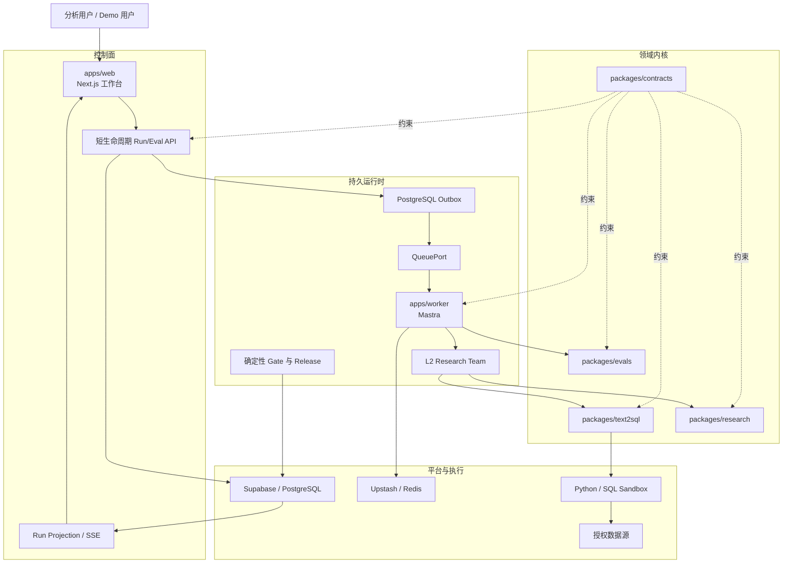
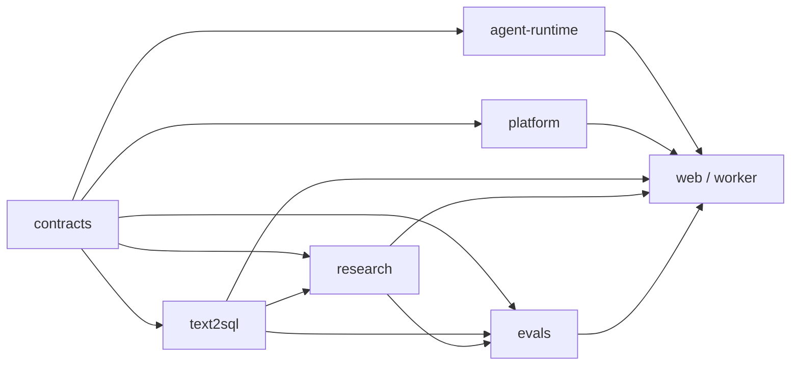

# Data Agent L2 纵向切片架构设计

## 1. 文档目的

本文把 `prd.md` 中的 R1–R8 转换为可实施架构。首版只实现“L2 多步研究分析师 + 强 Text2SQL + 评测闭环”，L3–L5 只保留稳定扩展契约。

对应的实施级主计划：

- `docs/plans/2026-07-25-001-refactor-data-agent-l2-vertical-slice-plan.md`

本轮研究依据：

- `/Users/lienli/Documents/work/深度调研/research/data-agent-system-design/answers/RQ080-如何把空白重置仓库规划为以-Mastra-为-Agent-内核-以-L2-多步研究分析师和强-Text2SQL-为首版纵向切片-以内建-Benchmark-驱动开发并兼容托管与.md`
- `RQ092` Reader Answer SHA-256
  `8d6b6b22f4edaa53579b7a5f4710421f96967052a0bf7078ad4fb68a65b9df3b`，
  FullAnswerRecertification 为
  `RQ092-8d6b6b22f4ed-4a1ab76b73fb-recertification.md`，`decision=closed`。
- 仓库内冻结投影：
  `docs/design/u6-research-authority-contract.md`、
  `docs/design/u6-research-planning-payload-contract.md` 与
  `docs/design/u6-research-wire-payload-contract.md`；平台事务、资源调用与受控 Oracle
  分别冻结在 `u6-research-platform-contract.md`、
  `u6-research-resource-invocation-contract.md`、
  `u6-invocation-state-contract.md`、
  `u6-system-record-lifecycle-contract.md` 与
  `u6-controlled-fixture-contract.md`。

## 2. 架构目标

- 让一次分析从问题到报告形成可重放的 Artifact 链，而不是一段不可检查的 Agent 对话。
- 让 Mastra 负责 Agent/Workflow 生命周期，但不拥有 SQL、Evidence 或 Release 的正确性。
- 让不同模型 Provider、外部编码 Agent 与多 Agent Team 在统一能力契约下工作。
- 让 Text2SQL 从“生成 SQL 的工作流”升级为“受业务语义和数据语义双重约束的查询编译器”。
- 让 Benchmark 成为开发、发布与产品 Demo 共用的正式能力，同时隔离 Demo、Tuning 与 Holdout。
- 让 Vercel/Supabase/Upstash 和 Docker 使用同一领域契约、状态语义与验证套件。
- 让多个应用可以安全共享一个 Supabase Project，避免 Schema、数据、Migration、Storage 与 Redis 串扰。

## 3. 非目标

- 首版不实现 L3 Experiment DAG、L4 主动观察、L5 因果识别。
- 不实现 L6 生产写操作。
- 不兼容旧 LangGraph State、旧 NestJS 模块结构或旧 API。
- 不自动迁移生产数据。
- 不把公共 Benchmark 或 LLM Judge 分数当成真实生产效果。

## 4. 总体拓扑



### 4.1 控制面

Vercel/Next.js 只处理：

- 鉴权和应用上下文解析。
- 接收 Run/Eval Command。
- 在一个 PostgreSQL 事务中写入 Command、Idempotency Record、Initial Event 与 Outbox。
- 查询和流式投影持久状态。
- 接收 Cancel、Resume、Replay、Clarification 等短命令。

控制面不在 HTTP 请求内执行长分析、SQL、Python 或完整 Benchmark。

### 4.2 持久 Worker 面

Worker 负责：

- 默认从 PostgreSQL Lease Queue 通过 `FOR UPDATE SKIP LOCKED` 获取带 Fence 的 Lease；`QueuePort` 允许后续替换 Adapter。
- 恢复 Mastra Workflow Snapshot。
- 调用 Model、Tool、Text2SQL、Research 与 Eval Kernel。
- 将每个权威 Artifact 以新 Revision 事务化提交。
- 在 Side Effect 成功后保存 Receipt，再确认 Queue。
- 处理 Retry、Cancel、Stale Worker 与 Replay。

### 4.3 领域内核

领域内核不依赖 Mastra、Next.js、Supabase SDK 或 Redis SDK，只依赖：

- `packages/contracts`
- 显式 Port
- 领域值对象与纯验证逻辑

这样才能在替换框架、部署形态或 Provider 时保持业务正确性。

## 5. Package 依赖规则



禁止关系：

- `contracts` 不得导入任何运行时或平台 SDK。
- `text2sql`、`research`、`evals` 不得导入 Mastra。
- `platform` 不得导入领域 Workflow。
- App 不得定义领域真值或绕过 Gate 写入成功状态。

由 `dependency-boundaries.spec.ts` 和 Lint Rule 强制执行。

## 6. Artifact 与权威链

首版 Artifact 链：

```text
QuestionFrame
→ ResearchBrief@2
→ HypothesisSet@2
→ EvidencePlan@2（逻辑 ProofObligationSet）
→ QueryContract + ObligationExecutionDecision
→ GroundingPackage
→ SemanticQuery
→ LogicalPlan
→ SqlArtifact
→ ValidationReceipt
→ ExecutionReceipt
→ QueryEvidence@2
→ AtomicClaim@2 / EvidenceRelation / EvidenceCheckReceipt
→ SupportDecision / HypothesisAssessment
→ CoverageState / ResearchStopDecision
→ ReportManifest / AnalysisReport@2 / ReportProjectionReceipt
→ 4 × EvidenceGateReceipt
→ ReportReadyCertificate@2
→ consumeCurrentReady
→ READY / ReportReadGrant
→ 可选 ReadinessRevocationReceipt
```

### 6.1 ArtifactEnvelope

所有 Artifact 使用同一个 Envelope：

```text
artifact_id
artifact_type
app_id
tenant_id
run_id
revision
attempt_id
producer
input_refs[]
schema_version
semantic_version
policy_version
model_profile_version
content_hash
status
created_at
```

约束：

- 内容或语义变化产生新 Revision，不允许原地覆盖。
- `input_refs` 必须属于同一 App/Tenant/Run，除非显式 Cross-Scope Policy 允许。
- 迟到 Worker 只能归档结果，不能覆盖 Active Revision。
- Artifact 的状态只能由拥有该状态的确定性组件提交。

### 6.2 Run 状态

公开终态：

- `READY`
- `PARTIAL`
- `NEEDS_CLARIFICATION`
- `NEEDS_MORE_RESEARCH`
- `INCONCLUSIVE`
- `POLICY_BLOCKED`
- `FAILED`
- `CANCELLED`
- `STALE`
- `REPLAY_UNAVAILABLE`

发布决策独立为：

- `GO`
- `HOLD`
- `NO_GO`
- `ROLLBACK`

禁止把 Run 成功自动映射为 Release `GO`。

## 7. Mastra、模型与多 Agent

### 7.1 Mastra 的职责

Mastra 负责：

- Agent 与 Supervisor 生命周期。
- Workflow、Suspend/Resume 与 Snapshot。
- Tool Invocation。
- Model Routing 与 Streaming。
- 通用 Trace/Scorer 集成。

Mastra 不负责：

- 决定 SQL 是否语义正确。
- 决定 Evidence 是否真正支持 Claim。
- 签发 `ReportReadyCertificate`。
- 决定 Release `GO`。

### 7.2 ModelProviderAdapter

按 Capability 选择 Model，而不是在业务代码中写 Provider 分支。能力字段至少包含：

- Structured Output
- Tool Calling
- Streaming
- Context Window
- Vision
- Reasoning Mode
- Region/Privacy
- Cost/Budget
- Fallback Compatibility

Provider 名称是配置，不是领域分支。

首版必须为 OpenAI、Anthropic/Claude、DeepSeek、GLM、Kimi、Grok、Gemini 提供真实 `ModelProfile` 与 Adapter 配置。七类 Adapter 均做离线 Request/Structured Output/Tool/Stream/Error Conformance；只有完成带真实凭据 Smoke 并保存 Model Receipt 的 Provider 才能显示为 `AVAILABLE`。

### 7.3 ExternalAgentAdapter

Claude Code 等外部执行 Agent 使用不同契约：

- Workspace
- Process/Session
- Permission Envelope
- Allowed Command/Tool
- Cancellation
- Event Stream
- Output Artifact
- Audit Receipt

External Agent 不能注册为 Model，也不能继承 Model Tool 的默认权限。

### 7.4 多 Agent Team

首版最小 Team：

- Research Supervisor
- Semantic/SQL Worker
- Evidence Worker
- Report Projector

Agent 间只传递 `TaskEnvelope`、Artifact Reference、预算与策略，不共享无限 Raw Memory。每次 Handoff 产生 `HandoffReceipt`。

## 8. 强 Text2SQL 编译器

### 8.1 编译阶段

1. `QuestionFrame`：冻结原始问题、用户范围和预期结果。
2. `QueryContract`：明确 Metric、Dimension、Grain、Time、Unit、Filter、Datasource、Result Contract。
3. `GroundingPackage`：ACL 过滤后检索业务语义、数据语义、Verified Query 和 Join Bridge。
4. `SemanticQuery`：把业务概念解析为稳定语义对象。
5. `LogicalPlan`：生成与 SQL Dialect 无关的计划。
6. `SqlArtifact`：按 Dialect 编译 SQL。
7. `ValidationReceipt`：分别执行七道 Gate。
8. `ExecutionReceipt`：在 Sandbox 中受控执行。
9. `QueryEvidence`：保存结果、版本、不变量与 Result Oracle 结论。

首版发布级 Dialect 只包含 PostgreSQL；其他 Dialect 只能通过 `SqlDialectPort` 返回明确的 `UNSUPPORTED_DIALECT`。`ExecutionReceipt` 还必须绑定 Datasource Identity、Schema Version、Snapshot Token/Watermark、Observed Time 与 Query Hash；数据源无法提供可重放快照时，界面与 API 必须显示受限重放或 `REPLAY_UNAVAILABLE`。

### 8.2 七道 Gate

| Gate | 判定内容 | 失败处理 |
| --- | --- | --- |
| Intent | 是否回答冻结问题 | 澄清或重新规划 |
| Semantic | Metric/Grain/Time/Unit/Join 是否正确 | 澄清或重新 Grounding |
| Structural | AST、Dialect、Schema Reference 是否有效 | 有界实现修复 |
| Policy | ACL、RLS、数据范围、敏感字段是否允许 | 失败关闭 |
| Resource | Row/Cost/Time/Scan Budget 是否允许 | 拒绝或缩小计划 |
| Execution | Sandbox 执行是否成功且 Receipt 完整 | 有界技术重试 |
| Result | 结果是否满足业务不变量与结果契约 | 有界修复或非 Ready |

Repair 只能修改实现细节，不能改变 `QueryContract` 中的 Metric、Filter、Join、Policy 或 Result Contract。

## 9. L2 多步研究循环

研究循环以 Proof Obligation 驱动：

1. 编译 `ResearchBrief@2`；首版只允许 `QUERY + DETERMINISTIC`。
2. 建立有界、可区分的 `HypothesisSet@2`，并披露候选宇宙。
3. 用 `EvidencePlan@2` 物化 Proof Obligation、依赖和 Observation Contract。
4. 在 Sandbox 前提交 `ObligationExecutionDecision`，证明 QueryContract 没有偷换
   metric、window、join、predicate、cohort、NULL 或授权 Scope。
5. 调用 Text2SQL/Sandbox，将已品牌化结果转为 `QueryEvidence@2`；Q2 必须精确引用
   Q1 Evidence Revision。
6. 生成 `AtomicClaim@2` 与 Evidence Relation；Claim 不自带支持态。
7. 从确定性 Check 派生 `SupportDecision` 与 `HypothesisAssessment`。
8. 按 `STALE > FAILED > BLOCKED > SATISFIED > OPEN` 重算 Coverage。
9. 按 Hard Gate、Coverage、合法 Query、外部等待与硬预算顺序提交六分支 Stop
   Decision；禁止无条件 `STOP_PARTIAL`。
10. 只从已提交 Claim/Assessment/Conflict 投影 `ReportManifest`、
    `AnalysisReport@2` 与 Projection Receipt。
11. Support、Conflict、Freshness、Source Independence 四张 Gate 分别重算并提交。
12. Readiness Authority 签发 `ReportReadyCertificate@2`。
13. PostgreSQL `consumeCurrentReady` 在同一事务中核验 Certificate、Version Frontier
    与 Revocation Head，随后才提交公共 `READY` 或单次 `ReportReadGrant`。

Writer、Supervisor、普通 Schema Parse、Mastra Checkpoint、Redis Cache 或历史 V1
Certificate 都不能绕过上述链路。`SourceEvidence` 与 Benchmark Adapter 属于后续
独立单元，不在 U6 首版中预建。

### 9.1 研究终态 Owner

| 分支 | Owner |
| --- | --- |
| `READY` | Research Readiness Authority |
| `PARTIAL / NEEDS_MORE_RESEARCH / INCONCLUSIVE` | Research Stop Authority |
| `STALE` | Revocation Authority |
| `NEEDS_CLARIFICATION` | Brief/Semantic Authority |
| `POLICY_BLOCKED` | Policy Authority |
| `FAILED / CANCELLED / REPLAY_UNAVAILABLE` | Runtime/Sandbox Authority |

完整冻结合同见 `docs/design/u6-research-authority-contract.md`。

## 10. Benchmark 架构

### 10.1 统一运输对象

- `EvalCase`
- `EvalRun`
- `ScoreCard`
- `ReleaseDecision`

### 10.2 保留不同真值

- InsightBench：分析与报告质量 Oracle。
- DAB：数据任务、结果等价与过程指标。
- RCAEval：Root Cause Ranking/Diagnosis Oracle。
- 自建可控归因：生成机制已知，可验证归因与 Counterfactual。

不允许用一个 Suite 的分数满足另一个 Suite 的通过条件。

### 10.3 开发与产品使用

- PR：固定 Smoke Slice。
- Nightly：更大固定 Suite。
- Release：Paired Baseline/Candidate + Safety Counter。
- Demo：独立的已授权、脱敏、可公开 Case。
- Holdout：与 Demo/Tuning 分离，按 Digest 防污染。

完整 Run Manifest 必须绑定 Code、Data、Schema、Semantic、Policy、Model、Prompt、Workflow、Evaluator、Seed 和 Budget。

### 10.4 首个可控 Demo

首个项目自有样例固定为 `retail-revenue-investigation-v1`：

- PostgreSQL 合成数据包含订单、退款、促销、商品、区域与履约事件。
- 问题为“2025 年第一季度华南区净收入同比为什么下降？哪些竞争解释得到数据支持，哪些仍不能确认？”
- U6-owned protocol fixture 固定两次互相依赖的查询、一个 `REFUTED` 与一个
  `SURVIVED` Hypothesis，以及字面期望行、阈值、14 个 Mutation、Crash 与
  Revocation Oracle；只证明 Research Authority 协议。
- U7 可以复用业务域与数据生成器，但必须拥有独立 Benchmark Manifest、
  Answer/Oracle、Demo/Holdout 身份与评分；不得用 U6 期望行或阈值冒充 Benchmark
  真值。
- L2 只允许贡献分解和证据支持，不得声称因果识别。

### 10.5 分析工作台

工作台不以聊天气泡作为主信息架构，固定按以下优先级组织：

1. Run Header：权威状态、版本、新鲜度、预算和当前可执行动作。
2. Question/Scope/Clarification：冻结问题、授权数据范围与待回答澄清。
3. Report/Claim–Evidence：结论、支持、冲突与局限。
4. Hypothesis/SQL/Receipt：竞争解释、查询实现、Gate 与执行追踪。
5. Eval Comparison：Suite-Specific Verdict、Baseline/Candidate 和 Release State。

每个交互面都必须定义 Loading、Empty、Error、Partial、Stale、Permission-Denied 与 Success；支持键盘完成 Launch、Clarify、Cancel、Resume、Replay 和 Artifact Navigation，状态变化可被 Screen Reader 宣告，Modal/Drawer 关闭后恢复 Focus，并提供窄屏与触屏布局。

## 11. 共享 Supabase 设计

### 11.1 Schema 分层

- `platform`：App Registry、Schema Registry、共享最小基础设施。
- `api`：对 Data API 暴露的窄 RPC/View，名称使用 `<app_slug>__<operation>`。
- `app_data_agent`：本应用私有表。
- 其他项目使用各自 `app_<slug>` 私有 Schema。

### 11.2 多层隔离

1. 服务端解析不可伪造的 `app_id`。
2. Supabase Auth Token 只提供签名用户身份；服务端从 Deployment Mapping 与 App 私有 Membership 表解析 App、Tenant、Role，拒绝客户端 Header/Claim 覆盖。
3. Repository 要求 App Capability。
4. Grant 只允许访问窄 `api` Surface；`public` Schema 不承载业务对象并撤销非必要 Create/Usage。
5. RLS 同时检查 App、Tenant、Principal。
6. Migration 拥有独立目录、Ledger、Checksum、Lock。
7. Storage 使用 App/Tenant 前缀。
8. Redis Adapter 强制 App/Environment 前缀。
9. Backup/Restore/Export/Delete 都接收 App Capability 并生成 Receipt。

Repository 只能通过 Registry 白名单选择私有 Schema，并在事务内固定 `search_path`；客户端提供的 Schema 名称不能进入 SQL 标识符拼接。Run、Artifact、SSE、Export 与 Delete 均执行对象级 App/Tenant/Principal 授权。

公开 Demo 使用独立、限流、只读的 `demo_principal`，只能访问登记的合成 Dataset；它不能发现真实 Datasource、Secret、其他 App 或 Hidden Holdout。

`service_role` 永不进入 Browser；即使测试连接可以绕过 RLS，Repository 仍必须拒绝缺少 App Capability 的调用。

## 12. 部署拓扑

### 12.1 托管形态

- Vercel：Web 与短 API。
- Supabase：PostgreSQL、Auth、Storage。
- Upstash：Redis 兼容协调、Rate Limit、Cache。
- Durable Worker：运行同一 OCI Image 的独立常驻进程，默认轮询 PostgreSQL Lease Queue。
- Sandbox：受限 SQL/Python 执行服务。

### 12.2 Docker 形态

`compose.yaml` 一条命令启动：

- Web
- Worker
- Sandbox
- PostgreSQL
- Redis 兼容服务

两种形态通过同一 Port Contract 和 Deployment Contract Test。若没有真实 Hosted Secret，只能得到 `HOLD`，不能得到虚假 `GO`。

## 13. 安全模型

- 所有 Schema Comment、Retrieved Source、Benchmark Bundle、SQL Value 和 Tool Output 都是不可信数据。
- 不可信数据不能生成新 Instruction、Tool、Credential、Network Access 或 App Scope。
- Sandbox 默认无网络、只读挂载，并限制 CPU、Memory、Time、Row、Byte 与 Output。
- Secret 只在 Server/Worker 使用，Audit Projection 只保留 Hash 与授权 Reference。
- 数据库只保存 `SecretRef`、Owner、Environment、Rotation/Revocation Metadata；托管环境使用受管 Secret Store，Docker 使用不可提交的 Secret File 或 Environment Injection。
- Datasource Connection 必须通过 Host Allowlist、DNS 解析与 Private/Loopback/Link-Local/Metadata IP 拒绝，防止 SSRF 与 DNS Rebinding。
- Benchmark Archive 在解包前校验 Digest、License 与 Path；解包过程禁止执行 Hook。
- Agent 不能自行批准 Semantic Release、Private Threshold 或生产写权限。

## 14. 失败与恢复

| 故障 | 恢复策略 | 权威证据 |
| --- | --- | --- |
| Provider 暂时失败 | 同 Task Contract 内按 Capability Fallback | 两次 Model Receipt |
| Command 已提交但未发布 | Outbox Publisher 重试 | Command、Outbox、Delivery Receipt |
| Worker 崩溃 | 新 Worker 获取 Fence，从 Snapshot/Artifact 恢复 | Lease 与 Replay Hash |
| 迟到 Worker 提交 | Active Revision/Fence 拒绝 | Stale Commit Receipt |
| SQL 执行失败 | 技术重试或有界 Repair | Validation/Execution Receipt |
| 硬预算封顶且存在可披露受支持子集 | `PARTIAL` | ResearchStopDecision |
| 存在合法路径但等待新预算/权限 | `NEEDS_MORE_RESEARCH` | ResearchStopDecision |
| 无 admissible distinguishing test | `INCONCLUSIVE` | ResearchStopDecision |
| Policy/Isolation 不确定 | `POLICY_BLOCKED` | Policy/Isolation Receipt |
| Hosted 证据缺失 | Release `HOLD` | Missing-Evidence Manifest |

## 15. 旧项目迁移策略

只迁移：

- Query/Receipt/Oracle/Release 等领域不变量。
- 输入输出 Fixture。
- 可判定 Terminal Semantic。
- Characterization Test。

不迁移：

- LangGraph Graph Wiring。
- 旧 Conversation State。
- NestJS Module Shape。
- 仅为旧 UI 或旧编排存在的 Adapter。

迁移以 `text2sql@c36aca8` 固定提交为来源；新行为若更严格，必须记录显式差异与批准。

## 16. 决策追踪

| 决策 | 需求 | 实施单元 |
| --- | --- | --- |
| L2 真实、L3–L5 仅契约 | R3 | U1、U6、U8 |
| Mastra 非正确性权威 | R2、R4 | U1、U3、U4、U5、U6 |
| Model 与 External Agent 分离 | R2 | U3 |
| PostgreSQL 权威、Redis 非权威 | R5、R6 | U2、U4 |
| 共享 Supabase 窄 API + 私有 Schema | R5 | U2、U9 |
| 七道 Text2SQL Gate | R4 | U5 |
| Suite 运输统一、Oracle 分离 | R6 | U7 |
| 托管控制面与 Worker 分离 | R2、R5 | U4、U9 |
| PostgreSQL Lease Queue 为首版默认 | R2、R5 | U2、U4、U9 |
| PostgreSQL 为首版唯一发布级 Dialect | R4 | U5、U9 |
| SecretRef、Egress 与对象级授权 | R2、R5 | U2、U3、U8、U9 |
| Characterization Migration | R1 | U5 |
| Trace/Artifact 一等产品界面 | R3、R6 | U6、U8 |

## 17. 设计验收

- 每项 R1–R8 都有架构所有者和实施单元。
- 每个权威状态都有唯一提交者。
- 每个外部 Side Effect 都有 Idempotency/Fence/Receipt。
- 七类 Model Provider 均有离线 Conformance；对外显示可用的 Provider 具有真实 Certification Receipt。
- Text2SQL 首版 Dialect 和数据快照/受限重放语义明确。
- 共享 Supabase 的 Database、Migration、Storage、Redis、Backup、Restore、Delete 均有 App Boundary。
- L3–L5 不存在可执行 Route 或成功状态。
- Hosted 与 Docker 使用相同公开契约。
- Benchmark Demo、Tuning、Holdout 不共享 Registry。
- `retail-revenue-investigation-v1` 可以共享业务域与生成器；U6 protocol fixture 与
  U7 Benchmark Manifest/Answer/Oracle 分开，UI/部署只消费各自已提交 Artifact，所有
  路径保持非因果边界。
- 所有主要失败都能映射为类型化终态和恢复策略。
