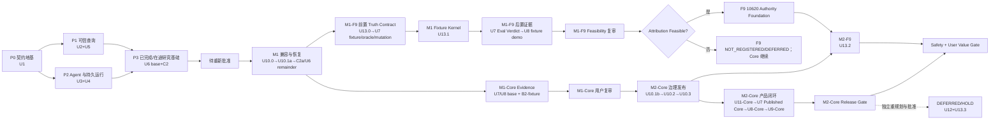

# Data Agent L2 纵向切片实施路线

## 1. 当前状态

- 当前任务状态：`HUMAN_REVIEW_REQUIRED`。已完成单元的历史状态不变；未开始或未闭合的
  产品实施已停在用户审核门，不能继续执行。
- 用户于 2026-07-25 选择方案 2 并批准原 R1–R8、U1–U9 纵向切片；该批准只解释下文
  U1–U6 的既有实现与证据，不能自动授权 2026-07-30/2026-08-02 新增的
  R9a–R9d、U10、U11、U13 或恢复 U6-C2a。
- 当前待审权威是
  `docs/plans/2026-07-30-001-refactor-governed-semantic-control-plane-plan.md`：它在 RQ310
  基础上把 Ontology 限定为业务意义骨架，并新增描述性贡献纵切。用户重新批准前，
  Trellis 与 Compound Engineering 只可完成调研、计划同步和 Codex 文档审查，不得开始
  新产品代码、Migration、测试实现或运行时激活。
- U1 已完成并固定在 `13824db`，U2 已完成并固定在 `c5319e4`，U3 已完成并固定在
  `2f31e9e`，U4 已完成并固定在 `55a4e24`。
- U5 的 Artifact Authority 基线已固定在 `4bc011f`，ACL-first Grounding、Typed IR
  与 PostgreSQL Authority Persistence 已固定在 `3249ea2`；PostgreSQL Dialect
  Compiler、七道 Gate 与受治理执行 Authority 已固定在 `fa3180b`，Bounded Repair
  已固定在 `029097e`；Metamorphic Result Oracle 已固定在 `60de42d` 并通过完整本地
  门禁与 Codex 复审。RQ091 已冻结并指导完成真实 PostgreSQL Sandbox、Snapshot
  Protocol、耐久 System Store、受控 Mutation 与 Streaming Cutoff；U5 Unit 5
  已完成实现并闭合真实 PostgreSQL 全链验证。Release 仍为 `HOLD`：尚缺已签名的本地
  门禁证据，且 U6–U9 尚未完成，不能用未签名测试日志或 U5 局部门禁替代发布证据。
- 云资源写入仍需对应部署单元的明确契约与凭据；缺少托管证据时必须保持 `HOLD`。
- 历史证据仍以
  `docs/plans/2026-07-25-001-refactor-data-agent-l2-vertical-slice-plan.md` 的原
  U1–U9 为解释依据；用户批准修订后，剩余实施顺序、R9 验收与完成定义改由
  `docs/plans/2026-07-30-001-refactor-governed-semantic-control-plane-plan.md` 约束。
- R9d/U13 当前状态：`PLANNED / NOT_AUTHORIZED`。M1-F9 只允许 U13.1 在受控 Fixture 输出
  唯一 sealed `AttributionKernelEvidence@1`，再由后置 U7 Eval 输出
  `AttributionFeasibilityVerdict`；M1-F9 固定为 Core L2=`HOLD`、Attribution F9=`NOT_REGISTERED`、
  Fixture Evidence=`HOLD`。这些都不是 F9 产品归因，也不得输出
  `PublishedAttributionSafetyVerdict`。后者只能由 U10.3 之后的 U13.2 生成。

### U2 关闭证据（2026-07-25）

- PostgreSQL 17 clean migration、Checksum、双 App×双 Tenant、RLS/Grant、Storage、
  Lifecycle、Secret、Egress 与 Migration Lock 烟测通过。
- Browser RPC 与 Backend Repository 对同一命令完成跨入口 Canonical Hash 重放；
  同 Tenant 不同 Principal 可独立使用相同 Idempotency Key。
- 冻结后的 READ 保留，WRITE 失败关闭；Policy Revoke 与 Approval Consume 的并发竞态
  由 Policy Lock 保证撤销优先。
- `pnpm lint`、`pnpm typecheck`、`pnpm build` 通过。
- 根级 Unit 157/157、Contract 9/9、Platform Tenancy 19/19、Security 32/32、
  PostgreSQL Integration 9/9 通过。
- 外部 Secret/Lifecycle 签名验证器、真实固定 IP Socket Adapter 与实际资源删除/恢复
  仍属于后续部署单元；U2 对相关成功终态保持 fail-closed/HOLD，不把合成 Receipt
  误报为真实外部成功。

### U3 关闭证据（2026-07-25）

- `@mastra/core`、七类 Provider SDK 与项目自有 `ModelProviderPort` 完成精确版本锁定；
  Worker 只暴露项目组合入口，不向领域层或 Package 根泄漏 Mastra 原始构造器。
- OpenAI、Anthropic/Claude、DeepSeek、GLM、Kimi、Grok、Gemini 的真实 SDK
  Request Shape、Structured Output、Tool Call、Stream 与 Error Normalization 离线
  Conformance 通过；Model Router 对未验证的 Context、Region/Privacy、Pricing 与
  Fallback Constraint 全部失败关闭。
- 类型化 L2 Team、Scoped Context Projection、Handoff Receipt、Tool Allowlist 与
  Budget Replay 已实现；Claude Code 保持独立 External Agent Adapter 且默认关闭，
  不能注册为普通 Model Provider。
- Credentialed Smoke 采用显式联网命令；只有 production Live Smoke 产生的品牌化
  Probe/Draft 能经 Worker 内部 PostgreSQL Store 提交、回读和授权为 `AVAILABLE`。
  Duplicate Provider、伪 Store、raw/spread Claims、任意 Smoke Callback 与测试
  Authority 子路径均被负例拒绝。
- `pnpm lint`、`pnpm typecheck`、`pnpm build`、根级 Unit、Contract、Provider、
  Integration、Security 与 Tenancy 门禁通过；PostgreSQL 17 集成中 Platform 9/9、
  Worker Credential Receipt 1/1 通过，三路 Codex 冻结复核均无 P0–P2。
- 当前环境未配置真实 Provider Credential，因此在线认证保持 `NOT_RUN`，七类
  Provider 均为 `UNVERIFIED`；这不影响 U3 实现边界关闭，但发布决策继续保持
  `HOLD`，不能声称已有真实 Provider `AVAILABLE` 证据。

### U4 关闭证据（2026-07-26）

- PostgreSQL Durable Run Runtime 已实现 Command Acceptance、严格每 Run FIFO、
  Lease/Heartbeat/Fence、Attempt、Event/Projection、Retry/Takeover、Cancel、
  Resume/Replay、Checkpoint 与内容寻址 Side Effect Receipt；Redis 仍是可丢失的
  唤醒/缓存层，不承担恢复权威。
- 同一 Run 的并发接受、Resume/Accept 并发、Claim 后未投影崩溃、第 5 次预算耗尽、
  Busy Tenant 清理饥饿、Stale Worker、Cancel Race、Receipt 重用与终态原子结算均有
  PostgreSQL 失败关闭或恢复测试。旧通用 Outbox Claim/Publish/Retry/Fence API 与
  TypeScript Adapter 已撤权并移除，Worker 只能调用 U4 窄函数。
- Mastra Snapshot Hash 改为 PostgreSQL Commit/Load 权威签发与重算；测试明确覆盖
  TypeScript 与 PostgreSQL Canonical Bytes 不同的数值反例，并证明数据库 Hash 在
  Commit → Checkpoint Event → Load → Resume 全链一致。Checkpoint Event 还严格绑定
  提交时 Projection Version 与同一 Active Artifact，拒绝 intervening Event 和换绑。
- `pnpm lint`、`pnpm typecheck`、`pnpm build`、Unit 361/361、Contract 39/39、
  Provider 59/59、Integration（Agent 14/14、Platform 9/9、Worker 9/9）、
  Security、Tenancy 与独立 PostgreSQL 17 Smoke 均通过；本地 Projection Reducer、
  PostgreSQL 并发 Marker 与 Artifact 绑定失败也统一映射为稳定、可判定是否重试的
  公开错误契约。最终 Codex 多视角复审作为本单元提交前门禁。
- U4 是 reset-only Runtime Schema；已有生产数据不能原地重放这些 Migration。
  Hosted Migrator、真实 Worker Daemon、OCI/Compose、Backup/Restore 与生产规模
  Autovacuum/锁/WAL 证据仍属 U9，因此发布判断继续保持 `HOLD`。

### U5 Unit 2 关闭证据（2026-07-26）

- `QuestionFrame -> QueryContract -> GroundingPackage -> SemanticQuery -> LogicalPlan`
  已形成内容寻址、递归上游核验与不可变快照链；L2 公共 API 不暴露可跨事务转移的
  Authority Brand，Platform 提交在 Run Fence 与 Active Revision 替换前完成完整
  Committer、Input、Scope、Principal 与语义验证。
- Catalog、SemanticRelease、SchemaSnapshot 与 PolicyReceipt 固定
  App/Tenant/Environment/Run/Datasource/Version；ACL-first Grounding 先求
  AllowedSchema 交集，再选择 Metric、Dimension、Join Path 与 Candidate，高分越权
  对象不会进入结果、Hash 材料或冲突集。
- Typed IR 只接受类型化 Field、Predicate、Parameter、Scan、Filter、Join、
  Preaggregate、Aggregate 与 Project；首版不暴露没有 QueryContract 语义的
  Sort/Limit。Join Closure 固定事实表 Root、Preserved Side、复合 Key、Cardinality
  与 Fan-out 失败协议。
- `<table_id>.<column_id>` 在 Catalog、Metric、Dimension、Relationship、Policy、
  Grounding Preaggregation 与 Scan 全链强制归属一致；Table/Column/Metric/Dimension/
  Relationship/Predicate/Candidate/Measure 重复身份、Metric/Dimension 跨类型同名与
  Project 重复 Alias 全部失败关闭。多路检索的重复 Hit 按最高分稳定去重。
- Grounding Authority 三个公开分支 Schema 与联合 Schema 共享 Scope、Hash、
  Revision、唯一性和分支语义 Refinement；PolicyReceipt 必须绑定已提交且一致的
  SemanticRelease/SchemaSnapshot，并由受信 Producer/Authority/Principal 提交。
- 根级 `lint`（195 files）、`build`（5/5）、`typecheck`（8/8）、
  Unit（466/466）、Contract（45/45）与 Text2SQL Security（5/5）门禁通过；
  三路独立 Codex 正确性/Authority/系统提交复审均为 READY，无剩余 P0/P1。
- PostgreSQL Compiler、七道 Gate、Bounded Repair、Sandbox 与 ExecutionReceipt
  属于后续 U5 单元。当前 OWNER-only Authority Persistence 已证明失败关闭，但普通
  ANALYST 请求所需的服务端 PolicyReceipt Issuer/Store 组合尚未接入；在该集成完成前
  不声明 Analyst 端到端 Text2SQL 已交付。

### U5 Unit 3 关闭证据（2026-07-26）

- 确定性 PostgreSQL Compiler 只消费同进程品牌化、已提交且与当前 Principal/Scope
  精确绑定的 LogicalPlan；服务端重编译并逐字核验 SQL、Parameters、Compiler Version、
  AST Hash 与 Query Hash。最终输出 Alias 精确等于 QueryContract，标识符只来自
  Grounding Physical Name，所有 Literal/Policy/Time 值参数化。
- `INTENT -> SEMANTIC -> STRUCTURAL -> POLICY -> RESOURCE -> EXECUTION -> RESULT`
  七道 Gate 形成固定 Authority Chain。前五道 PASS 才能签发绑定 PolicyReceipt、
  ResourceAdmission、Datasource/Schema/Settings 与五维预算的 ExecutionPermit；
  后两道只接受权威 Sandbox Evidence 与 ResultOracleReceipt，Validation 不能混用
  另一轮 Gate 或改写时间、证据与结果。
- PolicyReceipt 改由服务端 Issuer/Store 签发；ResourceAdmission、ResultOracle、
  SandboxExecutionReceipt 与 SandboxResult 走专用 System Store Verifier，不要求在
  通用 Artifact Store 制造镜像行。Compiler/Gate/Oracle 与 Sandbox 的高权入口分别只从
  `@data-agent/text2sql/server`、`@data-agent/contracts/server` 暴露，普通根 API
  继续拒绝结构 callback、clone 与自签品牌。
- Sandbox Request 精确绑定 Permit、SqlArtifact、Parameters、Admission 与 Settings；
  Resolver 返回的 Payload 必须通过 Reference Exact Revision Verifier，Reference A
  不能为 Payload B 背书。事务开始时重验证 Principal/Policy、Authority Epoch 与 Fence，
  Claim、Fence 和真实 Operation 必须处于同一事务。
- Sandbox 幂等键按 `App/Tenant/Environment/Principal/Key` 原子 Claim/Load：同输入
  并发只执行一次并重放结果，异输入在 Operation 前冲突，不同 Principal 互不碰撞。
  Pending 撤权立即阻断新事务，已越过 Fence 的旧事务仍可在预算内完成。
- Permit 以事务开始时刻判断有效；到期前开始的事务允许跨过 `expires_at`，但权威墙钟
  跨度和服务端 `elapsed_ms` 都必须受 Timeout Budget 约束。Query/Gate/Sandbox/Oracle
  共享 256 列、10,000 行、64 MiB Result、512 MiB 峰值内存上限与 PostgreSQL
  63-byte ASCII Alias；EXPLAIN 保留真实、唯一、有序的 Node Type。
- 根级 `lint`（213 files）、`build`（5/5）、`typecheck`（8/8）、Unit（563/563）与
  Contract（45/45）门禁通过；其中 Contracts 183/183、Text2SQL 117/117、
  Platform 112/112、Agent Runtime 111/111、Worker 40/40。
- 当前单元关闭的是 Compiler、Gate、System Evidence 与 Sandbox Authority Contract，
  不是生产数据库执行器。首次 Artifact 提交绑定 PostgreSQL `transaction_timestamp()`
  的新鲜度强化、超过 9 个占位符的 JSONB→Driver 顺序测试、真实 EXPLAIN/SQL Adapter、
  大字段在物化前的 Streaming Byte/Memory 截断与 Metamorphic Oracle 属于后续单元；
  因此发布判断继续保持 `HOLD`。
- Bounded Repair 已收窄为冻结 Artifact Bundle 上的 deterministic recompilation：
  只允许恢复 SQL/参数、Compiler Metadata 与 Query Hash 四类实现字段，最多两次
  Attempt、每次最多四个无值 Patch Op；语义、权限与结果合同变化直接路由。
- Repair Episode 只由 Scope/Run 与冻结 Query/Grounding/Semantic/Plan/Policy 内容
  身份派生，不以 repair_id、Principal 或 Root Reference 加盐；服务端 Session Store
  对 `episode_hash + trace_hash + attempt_count` 执行 CAS，阻止复制 Root、换
  Principal、Child Revision 重封 Root、旧 Head 重放与并发分叉。Root Artifact 固定
  revision 1，当前 Parent 只沿同一 Artifact 的连续 Revision 前进。
- CAS 原子保存完整 Trace/Receipt/Candidate；重启恢复必须重新授权 Compiler Input，
  重放 deterministic compiler、Patch Derivation、Gate→Outcome 状态机与完整
  History，只同步重算公开 SHA 不能重新品牌化任意 SQL。第二次 Attempt 形成的终态
  吸收后续重放；loser/旧 Head 只返回 `STALE_HEAD`。
- Compiler Input 必须保留同进程 LogicalPlan Authority 品牌、拒绝 Accessor，并对解析后
  的 Grounding 内容重算 `grounding_hash`；重放与 live compile 复用同一深冻结规范快照。
  clone/plain/Schema 非法输入与“内容漂移但复用旧声明 Hash”都在 Attempt/CAS 前失败
  关闭，不能伪装成 Compiler Unavailable、消费预算或写终态；Receipt 的 Candidate、
  Route 与 Terminal 字段穷尽互斥，Session 吸收原因不能持久成新的 Attempt Receipt。
- Frozen Artifact、当前 Parent 与失败 Gate 都通过服务端 Exact Revision Verifier
  闭合，Reference A 不能为 Payload B 背书。失败来源只能是已提交且 Hash 可重算的
  FAIL/UNAVAILABLE GateReceipt。输出只叫 `CANDIDATE/NEEDS_FULL_REVALIDATION`，
  不能签发 Gate PASS、Permit 或 Validation。
- 根级 `build`（5/5）、`lint`（219 files）、`typecheck`（8/8）、Unit（577/577）与
  Contract（45/45）门禁通过；其中 Contracts 183/183、Text2SQL 131/131、
  Platform 112/112、Agent Runtime 111/111、Worker 40/40。最终 Codex 复审作为
  本单元提交前门禁。

### U5 Unit 4 关闭证据（2026-07-26）

- 先在 `research/data-agent-system-design` 完成 RQ090，固定
  `MetamorphicFixtureReceipt -> SandboxResult -> MetamorphicOracleReceipt ->
  ResultOracleReceipt -> RESULT Gate -> Validation -> QueryEvidence` 的不可自证
  Authority Chain；实现只消费该研究结论，不把合成验证误写成真实生产证据。
- `FixtureMutationRecord`、`MetamorphicFixtureReceipt` 与
  `MetamorphicOracleReceipt` 作为专用 System Artifact。Fixture Authority 从当前已提交
  的 Query/Grounding/Semantic/Plan/SQL 五段链固定推导 Applicability，不接受
  `verify(): true` 或 Applicability Callback；Fixture、Meta、Result 三条 Authority
  的判定算法已下沉到 contracts 固定 kernel，server Composition API 只接收
  Identity、System Store、Sandbox 与上游 Authority，不暴露 callback-bearing
  registrar；首版只支持非 DISTINCT 的整数 SUM 与普通 COUNT。
- Fixture 与 Meta 按固定顺序封存
  `FAN_OUT`、`NULL_ANTI_MEMBERSHIP`、`HALF_OPEN_ADDITIVE_PARTITION` 与
  `SAME_VALUED_DISTINCT_FACT` 四类非空 Relation；每项有 kind-specific Witness、
  `sample_hash`，总 Receipt 有 `evidence_hash/receipt_hash`。三个单变换 Case 必须
  绑定严格 `relation_kind` 判别的 Mutation Record，Record 的 Scope、Run、Case、
  Baseline/Follow-up Snapshot 与 Witness 必须逐字段匹配，并绑定恰好一行的 Selection
  Probe；半开分区以 Meta Baseline 为 whole，left/right 必须绑定同一 Snapshot 上三个
  互异 SqlArtifact/Permit 的真实 Query/Input Hash。Verifier 还从 QueryContract 与
  Witness 固定 `[start, midpoint)` 和 `[midpoint, end)`，要求三份编译 SQL、AST、
  Plan 与参数键一致，只允许两个时间参数按 whole/left/right 语义变化并重算 Query
  Hash；仅追加注释、复用 Baseline 参数或改动非时间参数均失败。Baseline 与 Follow-up
  的完整 Sandbox Receipt/Result、Scope/Run、Schema、Execution、Resource Usage、
  完成时间和 `snapshot_token` 都精确闭合。
- 服务端 Metamorphic Verifier 从已提交的原始 Sandbox rows 重算关系；SQL 结果按保留
  重复项的无序 Multiset 比较，`group_key=[]` 可表示全局聚合。分组 SUM/COUNT 的
  half-open left 可以为空，但仅在 `whole = right` 时成立；空 right 与全局聚合零行
  均失败关闭。普通对象、结构克隆、未提交引用、Reference A/Payload B、合法双 Hash
  但错绑 Case/Relation/Snapshot/Witness、空/多行 Probe、伪 Query Variant 与四类
  Mutant 均不能获得 PASS。每项声明 Verdict 必须等于固定 Verifier 的计算 Verdict，
  总 Verdict 必须等于四项聚合结果；声明/计算不一致不能被降格为一张“权威 FAIL”。
- Fixture、Sandbox、Metamorphic Verifier 与 Result Producer 使用四个独立品牌与稳定
  Identity；`authority_id/principal_id/key_id` 分别两两互异，UUID 大小写先规范化。
  Fixture 不得晚于 Meta，Meta 不得晚于 Result；L2 单次根核验只解析一次 Meta，并把
  同一个品牌对象传给 Result Resolver。
- `ResultOracleReceipt` 必须绑定 Metamorphic Receipt 与其 Verdict；成功 RESULT
  与 observed FAIL 的 evidence 都精确有序为
  `[当前 SandboxResult, MetamorphicOracleReceipt, ResultOracleReceipt]`；Meta/普通
  不变量失败分别映射 `RESULT_METAMORPHIC_FAILED`/`RESULT_INVARIANT_FAILED`。
  RESULT Gate 只经 Result Authority 自有 System Store 的 Commit/Exact Revision 与
  fixed kernel 取得品牌；通用 Artifact Store 镜像、Reference A/Payload B 与 Exact
  Revision 拒绝不能产生 PASS/observed FAIL。只有 Oracle 缺失时才可把
  `RESULT_ORACLE_UNAVAILABLE` 与单一 `ExecutionReceipt` 投影成 GateReceipt；该路径
  不能封 Validation 或 QueryEvidence。
- Platform 在同一提交事务内把 Metamorphic Reference 路由到专用 System Store
  Resolver，并绑定同一 Capability 与 SQL Client；只接受领域 Authorizer 签发且完整
  Reference 一致的不可克隆品牌。缺任一 Authority、错 Revision、Resolver 回传普通
  JSON 或试图查询通用 `artifacts` 镜像都失败关闭。ReleaseManifest 同时显式拒绝
  Fixture/Metamorphic 合成 Receipt 冒充 Hosted、Docker 或 Signed Outcome Evidence。
- 根级 `build`（5/5）、`lint`（227 files）、`typecheck`（8/8）、Unit（654/654）与
  Contract（45/45）门禁通过；其中 Contracts 203/203、Text2SQL 183/183、
  Platform 117/117、Agent Runtime 111/111、Worker 40/40；Text2SQL Security 5/5
  另行通过。根级 Integration、Tenancy 与 Security 也在 PostgreSQL 17 容器中通过：
  Agent Runtime Integration 14/14、Platform Integration 9/9、Worker Integration
  9/9、Platform Tenancy 19/19、Agent Runtime Security 58/58、Platform Security
  32/32，并完成两轮 Supabase/PostgreSQL Smoke。
- 当前关闭的是 Metamorphic Contract、确定性 Verifier、RESULT Authority 与
  Platform 注入缝；测试 Store 仍是内存 Fixture。真实 PostgreSQL 执行、Append-only
  耐久 System Store/Migration、受控数据变换生成器与 Streaming Resource Cutoff
  属于下一 U5 单元，U9 仍需交付类型化部署回执，因此发布判断继续保持 `HOLD`。
  `pnpm verify:release` 已按预期输出 `RELEASE_EVIDENCE_INCOMPLETE`、缺 U5–U9 并以
  状态码 2 退出。

#### Trellis 跨层检查

- Contract：严格 Schema、规范 Hash、System Artifact 路由、不可克隆品牌和稳定 Reason
  Code 已形成唯一真值；普通 Candidate 不能通过 Zod Parse 自签成功。
- Domain：Text2SQL Verifier 固定推导 Applicability、Selection/Mutation、半开参数分区、
  Multiset 与 declared/computed Verdict，不接受调用方布尔回调。
- Persistence：Platform 只在同一事务 Client 与 AppCapability 中转发完整 Reference；
  Result Resolver 收到的必须是 L2 本次根核验解析出的同一个 Meta 品牌对象。
- Consumer：RESULT Gate、Validation 与 QueryEvidence 只消费精确三元组，Release
  Manifest 拒绝将测试 Oracle 当作部署证据；普通 package root 不导出 Registrar 或
  Authorizer。
- Failure：缺品牌、错 Scope/Revision、Hash/时间/角色漂移、恒真闭包注入、Mutation
  错绑、注释伪变体、Resolver 返回结构克隆、通用 Store 镜像或专用 System Store 缺失
  均失败关闭；没有发现跨层静默降级路径。
- Verification：Build、Typecheck、Lint、Unit、Contract、Integration、Tenancy、
  Security、PostgreSQL Smoke 与预期 `HOLD` 均已重新执行；Trellis Check 结论为
  `PASS（U5 Unit 4 范围）`。

### U5 Unit 5 研究冻结（2026-07-27）

- RQ091 当前全文已经绑定 16 个 supported Claim、27 个 Evidence、closed Answer
  Runtime、`validate-ready: true` 与
  `RQ091-FULL-ANSWER-EXTENSION@1.0.0` FullAnswerRecertification；两轮 Codex-only
  文档复审最终 `remaining blockers: NONE`，未调用 Claude Code。
- 原 Unit 3 的“Claim、真实 Operation 与完成记录共享同一 SQL transaction”只能表示
  Authority DB 与 Datasource 共用同一连接的演示路径，不能外推到独立 Python
  Datasource。Unit 5 固定为三个本地事务：
  `Authority Claim -> Datasource RR/RO Execute -> Authority CAS Finalize`；跨库只保证
  Authority 本地原子与 Fence/CAS，不声明 exactly-once。
- `CONTROLLED_REVISION` 是 U5 唯一 `REPLAYABLE` Snapshot Strategy。完整 schema/data
  manifest、精确 Relation/OID 锁定和查询必须共享同一 RR/RO transaction/snapshot，
  防止 manifest/query TOCTOU；Owner/Admin 漂移属于 Authority Breach。
- TypeScript Platform 只拥有 Exact Revision、Claim/Lease/Fence/Cancel Epoch、
  Grant、Outcome Binding 与 Finalize 权限。Python `services/sandbox` 使用
  `psycopg>=3.2` 的 `AsyncRawServerCursor` 原生消费 `$1…$n`，固定
  `fetchmany()`、逐批 Row/Byte/Deadline Cutoff，并以干净 Rollback 结束所有只读
  Datasource Transaction。
- U5 本地 Transport 是每进程单 Execution 的双向 NDJSON。Outcome 精确绑定
  Grant/Input/Execution/Attempt/Fence/SQL/Snapshot；Cancel Epoch 按单调规则核验。
  late cancel 丢弃候选并进入 `CANCELLED`，不能伪称 query cancel confirmed；旧 Attempt
  stdout 不能提交到新 Fence。
- 新 Migration 必须包含专用 append-only System Artifact Store、可恢复 Claim/Event
  投影与每 Attempt 一条的不可变 Execution Record。领域 Content Hash 与完整 Payload
  Checksum 分离，通用 `artifacts` 镜像没有 System Authority。
- 三个数据变换 `FAN_OUT`、`NULL_ANTI_MEMBERSHIP`、
  `SAME_VALUED_DISTINCT_FACT` 分别从同一 sealed Baseline clone，并用全 Snapshot
  manifest 证明 exact delta；`HALF_OPEN_ADDITIVE_PARTITION` 只改变查询窗口，不进入
  数据 Mutation。
- 本节是研究合同冻结，不是实现关闭证据。PG17 设计期容器日志只标记为
  `SYNTHETIC_POSTGRESQL_17_PROOF`；在 Python/TypeScript/Migration/Integration Gate
  全部绿色前，`pnpm test:sandbox` 与 Release 继续保持 `HOLD`。

### U5 Unit 5 实现关闭证据（2026-07-27）

- Contracts 已交付严格版本化的 `ExecutionGrant`、`SandboxExecutionOutcome`、
  Claim/Transition/Cancel/Recovery Schema 与服务端
  `prepareSandboxExecution`、`finalizeSandboxExecution`、
  `failSandboxExecution`、`cancelSandboxExecution` Authority API；成功 Outcome
  的行数、规范字节、当前批次和保留字节必须与 `SandboxResult` 精确一致。
- Platform 已交付 PostgreSQL Authority Adapter、三段式 Coordinator、单 Execution
  双向 NDJSON Python Client 和 PostgreSQL AST 失败关闭门禁。SqlArtifact 必须使用
  `postgresql-compiler@1.1.0`，编译产物中的所有 SQL Primitive、Operator 与 Cast
  都显式限定到 `pg_catalog`；多语句、DML CTE、危险函数、子查询、越界关系、自定义
  Operator/Cast 与非参数化业务常量都会在创建 Claim、启动子进程或连接 Datasource
  之前被拒绝。
- PostgreSQL 17 Migration 已交付 append-only `text2sql_system_artifacts`、可恢复
  Claim/Event Projection 与每 Attempt 唯一的不可变 Execution Record。Backend 仅有
  同 Scope 读取和窄函数执行权限；Browser 角色无权读取或写入。Idempotency 只绑定
  不变请求身份，Lease Recovery 使用 PostgreSQL 数据库时钟，Worker 的未来时间不能
  抢占尚未到期的 Lease。`FAILED/CANCELLED` 与 `COMPLETED` 一样在 Authority 重启后
  稳定重放且不会再次执行 Datasource；同键异输入仍在 Datasource Operation 前冲突。
- Python `services/sandbox` 已在同一 `REPEATABLE READ READ ONLY` Transaction 内重算
  完整 schema/data manifest、锁定 Relation/OID、按原生 `$1…$n` 执行查询，并以
  增量 O(n) 规范化、固定 `fetchmany()`、Row/Byte/Deadline Cutoff 和干净 Rollback
  形成 Outcome。完整 Snapshot Manifest 使用真正的 PostgreSQL named server-side
  cursor，并受独立固定 Runtime Ceiling 约束：最多 256 个 Relation、每 Relation
  256 列、跨全部 Relation 合计 10,000 行与 64 MiB JCS Digest Material；它与
  Request 的 Result Budget 分离，不能被调用方放大。执行器强制
  `NONE = [pg_catalog]`、
  `CONTROLLED_REVISION = [sealed_schema,pg_catalog]`，并在连接后、事务前通过
  `data_agent_sandbox_control.datasource_identity` 核对实际
  `datasource_id/fingerprint`。Authority Prepare 重验证时间允许早于 Datasource
  `started_at` 但不能晚于它；Permit 仍按实际 `started_at` 验证。JSON/JSONB 递归值、
  int8/numeric、列/行/字节边界、Cancel 与 Snapshot Mutation 均有真实 PG17 反例。
- 真实端到端测试已覆盖
  `Coordinator -> PostgreSQL Authority -> Python child -> 同一 PostgreSQL Datasource
  -> 耐久 Receipt/Result -> Authority 重启后 replay`，并断言重放不会第二次启动
  Python。提交前最终 `pnpm test:sandbox` 已通过：Contracts 220/220、Platform Unit
  185/185、PostgreSQL/Supabase Smoke、Platform Integration 11/11、Worker
  Integration 9/9、Python PG17 70/70、TypeScript↔Python Process Integration 1/1。
- U5 只交付可运行、可验证的本地 Sandbox，不把逻辑峰值内存估计冒充 cgroup 硬隔离。
  `cgroup_memory_limit_enforced=false` 是当前真实观测；Hosted/Docker OCI、CPU/Memory/
  Filesystem/Network 硬隔离与签名部署 Outcome 仍属 U9。`pnpm verify:release` 必须因
  已签名本地门禁证据缺失及 U6–U9 未完成，以
  `RELEASE_EVIDENCE_INCOMPLETE` 和状态码 2 返回 `HOLD`。

## 2. 执行原则

- 按纵向能力闭环推进，而不是先堆满所有基础设施。
- 每个阶段先冻结 Contract 与 Fixture，再实现 Adapter/Workflow。
- Agent 输出永远是 Candidate；Gate/Compiler/Executor/Verifier 提交权威状态。
- PostgreSQL 是 Run/Artifact/Event/Outbox/Eval 的权威存储；Redis 不是。
- 先有可失败、可重放的端到端 Case，再扩大 Provider、Benchmark 与部署覆盖。
- 任一阶段若无法保留 App Isolation、Artifact Provenance 或 Suite Oracle，应停止并修订计划。
- Ontology 只拥有业务对象、事件、关系语义与 profile identity/eligibility/driver refs；
  decomposition/measure/formula、partition/join safety、Physical Binding、snapshot currentness、
  Policy 与 Provenance 分别由六平面 owner 管理，Profile 只是跨平面编译投影。OWL/RDF 或
  Neo4j 都不能成为运行时数值、授权或因果真相。
- 描述性贡献必须复用现有 U5→U6 QueryEvidence：Kernel 只从 outcome、每个 driver 与
  independently observed residual 的 baseline/follow-up endpoint 计算 signed delta；
  静态 `EndpointExecutionTemplate` 进入 semantic digest，运行时
  `EndpointExecutionBinding` 才绑定 QueryContract instance、principal/snapshot/PolicyReceipt 和
  U6 五轴，只进入 certificate/Receipt subject。双窗 subtraction 由 U13-owned
  `DerivedDeltaObservationSet@1` 无损绑定两端 QueryEvidence；现有 AtomicClaim@2 只能生成
  `U13_COMPATIBILITY_SUMMARY_NON_AUTHORITATIVE` 兼容摘要，不能作为 delta closure Authority；
  `decomposition_kind` 必须判别 `ROW_PARTITION | FORMULA_IDENTITY`，分别以
  `RowPartitionWitness | FormulaEquivalenceWitness` 证明集合分割或公式恒等，以
  `SameMeasureWitness`/`SameFrontierWitness` 固定测度与 U6 五轴，并由独立 verifier 为每端
  按 `EndpointLoweringRuleSet@1` 签发 `EndpointLoweringCertificate@1`。静态 profile 只包含
  `StaticDriverCapacityProof@1`；每次 Run 另生成并原子预留
  `RunDriverBudgetAdmission@1`，后者不得进入 profile digest。一次 snapshot 的数值 closure 只作独立回归检查，
  closure error 不能回填 residual。
- 每次可发布计算都先构造单一 `ContributionSubjectManifest@1` canonical hash，再把该
  digest 作为 `ContributionReceiptSubject@1`，绑定 exact profile/release、endpoint/
  evidence/lowering/accounting proof、verifier/compiler image、frontier、principal/scope 与
  verdict；消费时按 origin 重验 currentness，Fixture 禁止查询 production active pointer，
  Published 才重验 active/activation sequence/revocation/supersession/rollback。旧 Receipt
  只能审计、不能授权当前结论。权威结论另由 `ConclusionSubjectManifest@1 →
  ConclusionPolicyDecisionEnvelope@1` 绑定 exact payload/policy/signer-verifier、key/algorithm/
  signature、issued-at/expiry/nonce、inputs/result/currentness；`ConclusionSignatureAuthority@1`
  冻结 domain-separated signing bytes、PolicyRelease、SignerAssignment、VerificationKeyRevision/
  trust root 与 Published nonce/currentness policy；M1 只用 checked-in
  `FixtureConclusionPolicyManifest@1` 与后置 U7 的内容寻址
  `FixtureConclusionDecisionSeal@1` 验证 typed candidate，不实现 key/nonce/rotation 或消费授权。
  M2 由 PostgreSQL Authority 完成生产事务。只有 Published F9 能消费已验签且 current 的
  envelope。F9 内容若
  进入 U6 AnalysisReport，必须由 `ConclusionProjectionBinding@1` 绑定 exact AtomicClaim、
  Manifest、rendered segment、Decision 与 `AttributionConclusionUseDecision@1`。
- `ContributionItemSet` 只表达同一 accounting identity 下的贡献对账；未来 topology、
  event、anomaly 或 association 候选进入独立 `InvestigationCandidateSet`，不得混排或
  借贡献值升级为根因/因果结论。
- 每个大任务必须形成独立、测试闭合的 Git commit；不得以跨单元大提交、先提交后补测
  或未闭合门禁的临时提交冒充完成。

## 3. 阶段总览



## 4. Phase 0：契约地基

### 目标

完成 U1，让后续实现共享稳定 Artifact、状态、Port 和能力边界。

### 工作包

1. 初始化 pnpm/Turbo TypeScript Monorepo。
2. 建立 `packages/contracts`。
3. 定义 `ArtifactEnvelope`、Artifact Reference、Run Terminal、Release Decision。
4. 定义 Storage、Queue、Cache、Sandbox、Model、External Agent、Eval Port。
5. 定义真实 L2 Schema 与只读 L3–L5 Capability Descriptor。
6. 建立依赖边界 Test 与根级验证命令。
7. 实现 Dependency/Provider Capability Probe。

### 关键测试

- Artifact 不能跨 App/Revision 错引。
- L3–L5 不能产生“已交付”Receipt。
- Public Error/Terminal 稳定序列化。
- In-Memory Port Adapter 通过 Conformance。
- 领域 Package 不能导入 Mastra/平台 SDK。

### Release Gate

- `pnpm lint`
- `pnpm typecheck`
- `pnpm test:unit --filter contracts`
- `pnpm test:contract`

### 回滚点

若 Contract 不能同时表达 Hosted/Docker、Model/External Agent 或 L2/L3–L5 边界，停止后续单元，修改 U1；此时没有持久数据或外部资源需要迁移。

## 5. Phase 1：可信查询与共享数据边界

### 目标

完成 U2 与 U5：先证明多应用隔离和强 Text2SQL，而不是把 Agent 自由度建立在不可信地基上。

### U2 工作包

1. 建立 Platform/App Registry。
2. 建立私有 `app_data_agent` Schema 与窄 `api` RPC/View。
3. 实现 App-Aware Repository、Grant、RLS。
4. 实现独立 Migration Ledger/Checksum/Lock。
5. 实现 Storage/Redis Namespace Adapter。
6. 实现 Transactional Outbox。
7. 实现 App Freeze/Export/Delete/Restore 流程。
8. 实现 `SecretRef`、轮换/撤销、Datasource Host Allowlist、DNS/Private IP 检查。
9. 实现带 App 前缀的公开 RPC、固定 `search_path` 与 Run/Artifact/SSE/Export/Delete 对象级授权。
10. 使用 Supabase Auth 验证用户身份，但从服务端 Deployment Mapping 与 App 私有 Membership 表解析 App/Tenant/Role；公开 Demo 使用独立只读 `demo_principal`。

### U5 工作包

1. 从 `text2sql@c36aca8` 提取选定 Characterization Fixture。
2. 定义 `QuestionFrame` 与冻结的 `QueryContract`。
3. 实现 ACL-First Grounding 与 Join Closure。
4. 实现 `SemanticQuery`、`LogicalPlan` 与首版 PostgreSQL Dialect Compiler。
5. 实现 Intent、Semantic、Structural、Policy、Resource、Execution、Result Gate。
6. 实现只允许语义保持的 Bounded Repair。
7. 在 U5 交付最小 SQL Sandbox 与 Snapshot Protocol；U9 只做生产加固。
8. 实现绑定 Datasource/Schema/Snapshot/Watermark/Observed Time/Query Hash 的 `ExecutionReceipt` 与 `QueryEvidence`。

### 关键测试

- 两个 App、每个两个 Tenant，覆盖 Direct/RPC/Storage/Redis/Migration/Export/Delete。
- 高权限连接仍不能绕过 Repository App Capability。
- 同名公开 RPC 不碰撞；无权对象标识、Secret 泄漏与 SSRF/DNS Rebinding Fixture 全部失败。
- 伪造 App/Tenant/Role Header 或 Claim 无效；Membership 撤销即时生效；Demo Principal 不能发现真实数据或 Hidden Holdout。
- 七道 Gate 各有正例和失败关闭例。
- PostgreSQL 是唯一可发布 Dialect；无快照能力的数据源进入受限重放状态。
- Metamorphic Fixture 捕获 Fan-Out、Null、时间边界和错误去重。
- 旧 Fixture 差异必须被记录和批准。

### Release Gate

- `pnpm test:tenancy`
- `pnpm test:integration --filter persistence`
- `pnpm test:unit --filter text2sql`
- `pnpm test:integration --filter text2sql`
- `pnpm test:sandbox`
- `pnpm test:security`

### 回滚点

- 若共享 Supabase 任一边界不能失败关闭，回滚 U2 Schema/API 设计，不进入 Hosted 接入。
- 若 Repair 会改变 QueryContract，删除该 Repair Route，不接受“更高通过率”作为理由。

## 6. Phase 2：Provider-Neutral Agent 与持久运行

### 目标

完成 U3 与 U4：让多模型、多 Agent、暂停恢复和长任务具备明确边界。

### U3 工作包

1. 用项目 Port 封装 Mastra。
2. 建立 `ModelProfile` 与 Capability Router。
3. 为 OpenAI、Anthropic/Claude、DeepSeek、GLM、Kimi、Grok、Gemini 实现真实 Profile/Adapter 配置，并全部通过 CI 离线 Conformance。
4. 建立 `ExternalAgentAdapter`，默认不启用 Claude Code。
5. 定义 L2 Team、`TaskEnvelope`、`HandoffReceipt` 与 Context Projection。
6. 强制 Tool Allowlist、Budget 与 Untrusted Context Boundary。

### U4 工作包

1. 控制面实现 Command Acceptance 与 Outbox。
2. Worker 默认使用 PostgreSQL Lease Queue，实现 `FOR UPDATE SKIP LOCKED`、Fence、Heartbeat 与 Retry。
3. Mastra Snapshot 绑定 Active Artifact Revision。
4. 建立 Event Projection 与 SSE。
5. 实现 Cancel、Resume、Replay。
6. SQL/Eval Side Effect 采用 Content-Addressed Receipt。

### 关键测试

- Provider Capability 不满足时明确失败或按策略 Fallback。
- 只有完成真实 Credentialed Smoke 并保存 Model Receipt 的 Provider 才显示 `AVAILABLE`；没有凭据时显示 `UNVERIFIED`。
- External Agent 不能注册为 Model 或扩大 Workspace/Permission。
- Agent Handoff 不传递无限 Raw Memory。
- Prompt Injection Fixture 不能引入 Instruction、Tool、Credential、Network 或 App Scope。
- Duplicate Delivery、Crash/Resume、Cancel Race、Stale Worker、Replay 全部确定。

### Release Gate

- `pnpm test:unit --filter agent-runtime`
- `pnpm test:providers`
- `pnpm test:integration --filter runtime`
- `pnpm test:security`
- Capability Probe 报告固定 Mastra 与 Provider 行为。

### 回滚点

- 若 Mastra Snapshot 无法可靠映射 Artifact Revision，保留 Mastra 作为单步 Agent Runtime，Workflow Durable State 退回项目自有状态机，不能把 Snapshot 当作权威。
- 若 Queue Adapter 无法保证至少一次投递下的 Fence/Idempotency，保留 Port，替换 Adapter。

## 7. Phase 3：L2 研究与评测闭环

### 目标

本节保留原 U6 Research Authority 与 U7 Benchmark 的合同、实施检查点和历史证据。
U6 单独完成不等于首版纵向切片完成；RQ310 修订后，U6 remainder 的恢复与 U7 的后续
执行必须改走第 8 节顺序，不能因为本节已有工作包就绕过当前用户审核门。

### U6 工作包

设计已通过 RQ092、`docs/design/u6-research-authority-contract.md`、
`docs/design/u6-research-planning-payload-contract.md` 与
`docs/design/u6-research-oed-v2-contract.md`、
`docs/design/u6-research-wire-payload-contract.md`、
`docs/design/u6-research-derivation-wire-contract.md`、
`docs/design/u6-research-derivation-receipt-contract.md`、
`docs/design/u6-research-platform-contract.md`、
`docs/design/u6-research-database-surface-contract.md`、
`docs/design/u6-research-migration-safety-contract.md`、
`docs/design/u6-research-execution-storage-contract.md`、
`docs/design/u6-terminal-reference-graph-contract.md`、
`docs/design/u6-research-resource-invocation-contract.md`、
`docs/design/u6-invocation-state-contract.md`、
`docs/design/u6-invocation-result-crypto-contract.md`、
`docs/design/u6-result-key-lifecycle-contract.md`、
`docs/design/u6-system-record-lifecycle-contract.md`、
`docs/design/u6-app-lifecycle-cleanup-contract.md` 与
`docs/design/u6-controlled-fixture-contract.md` 共同约束 U6；其中数据库函数面与
Result Crypto 的 U6-B0 合同再认证已冻结。U6-A 纯 Research Kernel 已实现；
PostgreSQL Authority、CurrentReadiness、资源事务与 Worker 组合仍未实现，因此 U6
整体未完成。

1. 实现 current tuple：`ResearchBrief/HypothesisSet/EvidencePlan/QueryEvidence/
   AtomicClaim/EvidenceRelation/AnalysisReport` 采用 V2；Manifest 固定为
   `ReportManifest/2.0.0/report-manifest@2.0.0`，Certificate 固定为
   `ReportReadyCertificate/3.0.0/report-ready@3.0.0`。legacy protocol-null V1、
   `ReportManifest/1.0.0/report-manifest@1.0.0` 与
   `ReportReadyCertificate/2.0.0/report-ready@2.0.0` 只允许 historical read。
2. 增加 `ObligationExecutionDecision@2`，在 Sandbox 前逐项验证 QueryContract 与
   Obligation 的 metric/formula/window/timezone/grain/grouping/join/predicate/cohort/
   null/authorization Scope。
3. 实现 QUERY-only 的 Proof Obligation、竞争假设与依赖查询；不实现
   `SourceEvidence`、Source Fetch 或 Benchmark Adapter。
4. 从权威结果与预注册 Observation Contract 派生 `SupportDecision` 和
   `HypothesisAssessment`，从 `AtomicClaim@2` 删除自报支持态。
5. 按 `STALE > FAILED > BLOCKED > SATISFIED > OPEN` 重算 Coverage，并让未解决
   material conflict 阻断 `SATISFIED/STOP_READY`。
6. 实现 Stop 六分支；只有硬预算封顶且存在可披露受支持子集才能
   `STOP_PARTIAL`，不提供兜底 Partial。
7. 从 `ReportManifest@2` 确定性投影中文 `AnalysisReport@2` 与
   `ReportProjectionReceipt`。
8. 分别实现 Support、Conflict、Freshness、Source Independence Gate，并由
   server-only Readiness Authority 签发 `ReportReadyCertificate@3`。
9. 在 PostgreSQL 增加 current readiness（内嵌 revocation seq/receipt）、
   `RevocationOperation`、单次 `ReportReadGrant` 与固定锁序。
10. 用 `consumeCurrentReady` 在同一事务内核验 exact Certificate、Version Frontier
    与 Revocation，再提交公共 `READY`；相同幂等键重放也必须重新检查撤权。
11. 接入 `RESEARCH_RUNTIME_LIMITS@1`、tenant/principal 原子预算 reservation 和
    `AgentDataProjectionReceipt`。
12. 在 `apps/worker` 组合 Mastra Team、Research Kernel、Text2SQL、Sandbox 与
    PostgreSQL Authority；Checkpoint 只保存执行位置和精确引用。

#### U6 设计冻结证据（2026-07-27）

- RQ092 来源链已闭合：Reader Answer
  `8d6b6b22f4edaa53579b7a5f4710421f96967052a0bf7078ad4fb68a65b9df3b`、
  Answer Runtime
  `6fd834e3e2228bf270c6b3556bb0ca23fdc90336950715e7fc59879a20e89eb9`、
  Synthetic Contract Proof
  `0908d49c91598999e40c3ecebd946b5a72317283dad6368e418ade660ac6df5b`，
  Run 为 `RUN20260727-070114-u6-l2-research-loop-repo-b73fca`。合成证明只校验合同，
  不属于产品、Benchmark 或 Release Evidence。
- 初次冻结时，Trellis `implement.jsonl` 与 `check.jsonl` 各注入 14 个相同且不重复的文件；
  `task.py validate` 无 Warning，所有文件都小于 32768 bytes，最大文件为
  `u6-research-wire-payload-contract.md` 的 32671 bytes。8 个 U6 设计文件中的
  35 个 TypeScript 代码块均通过语法解析，JSONL 与 `git diff --check` 通过。
- 两轮独立 Codex-only 契约审查与最终 Trellis 跨层审查均要求
  `remaining_p0_p1.p0=[]`、`remaining_p0_p1.p1=[]`；全程未调用 Claude Code。
- 冻结后的仓库门禁通过：`pnpm lint`（243 files）、`pnpm typecheck`（8/8）和
  `pnpm test:contract`（Contracts 7/7、Text2SQL 6/6、Platform 2/2、
  Agent Runtime 30/30）。
- 本节记录设计冻结时点；当时代码、Migration、PostgreSQL 竞态、Worker 恢复与
  Controlled Case 均未实现。后续 U6-A 状态以下一节为准；Release 始终保持 `HOLD`。

#### U6-A 纯 Research Kernel 实施证据（2026-07-27）

- 新增只依赖 `@data-agent/contracts` 的 `packages/research`，实现
  `ResearchBrief → HypothesisSet → EvidencePlan → OED → QueryEvidence →
  Claim/Relation/Check/Support/Assessment → Coverage → Stop → Report →
  四 Gate → ReportReadyCertificate` 的 Document-backed Candidate 链。
- 当前 Writer tuple 固定为
  `ReportManifest/2.0.0/report-manifest@2.0.0` 与
  `ReportReadyCertificate/3.0.0/report-ready@3.0.0`；对应 versioned historical
  tuple 分别为 Manifest 1 与 Certificate 2，旧无版本公共别名继续绑定 V1。历史文档
  只能返回 `HISTORICAL_READ_ONLY`，不能进入 current parser/Authority。
- Controlled mixed/all-refuted 两查询链、14 个 Mutation、16 个 Partial
  `CONTINUE/REPLAN` 配对和全反驳空 Supported 集合均走同一生产内核；成功结果仍只得到
  `ReportReady Candidate`，没有持久化、Public `READY`、SQL 执行或 Release 权限。
- Request-local verified replay 仅以同一请求持有且递归冻结的对象 identity 为 key；
  成功且冻结后才发布 cache，失败、异常与同步 throw 均可重试。性能门禁固定
  digest/Document miss、elapsed 与 RSS 上限，`test:research` 禁止 Turbo cache。
- Evidence 与 Readiness 已按 Artifact owner 拆分；typed Document resolver、
  Reference identity/value-shape 与 transient OED assurance registry 位于中性 internal
  层。架构门禁禁止 raw reducer 跨 owner、Evidence 反向依赖 Server、production 使用
  兼容门面、identity `as never` 及 owner 循环。
- 最终门禁通过：`pnpm test:research`（18 files / 129 tests）、
  `pnpm test:architecture`（10/10）、`pnpm test:unit`（9/9 Workspace Tasks）、
  `pnpm typecheck`（9/9）、`pnpm lint`（314 files）、`pnpm test:contract`（7/7
  Workspace Tasks）与 `pnpm test:integration`。Trellis 注入验证零 Warning，
  `git diff --check` 无输出。
- Compound Engineering 全程仅使用 Codex 多角色复审；Correctness、Maintainability、
  Testing、Security、Adversarial、Performance、API Contract、Project Standards、
  Reliability 与 Agent-native 的最终阻塞 Finding 均清零，未调用 Claude Code。
- 本节只关闭 U6-A 纯内核。Migration、PostgreSQL exact-revision Committer、
  CurrentReadiness/Revocation/Grant、Resource/Invocation、Mastra Worker 组合、
  Crash-Recovery 与真实部署证据仍为 `NOT_IMPLEMENTED`；`pnpm verify:release`
  必须继续返回 `HOLD / RELEASE_EVIDENCE_INCOMPLETE`。

#### U6-B0 PostgreSQL 生命周期合同再认证证据（2026-07-28）

- 当前完整 source map 为 16 份 U6 设计分册与一个 compact 实施合同；Trellis
  `implement.jsonl`/`check.jsonl` 各有 22 个同序、唯一且存在的条目，`task.py validate`
  为 22/22、零 Warning。16 份分册中的 48 个 TypeScript fenced block 均通过
  TypeScript 7 `--noCheck --noEmit` 语法解析。
- 最终单文件注入上限为 32768 bytes，实际最大注入文件为
  `u6-research-platform-contract.md` 的 32427 bytes。真实 Implement/Check Hook 分别
  生成 514579 / 514579 bytes、各 25 个顶层 block，
  均低于 786432 bytes，且没有 truncated、not-inlined 或 binary notice。
- 两轮独立 Codex-only 语义审查与一轮 relation/cleanup inventory 审计最终均为
  `remaining_p0_p1={"p0":[],"p1":[]}`；覆盖 CurrentReadiness 内嵌撤权、Core RLS
  locking ACL、Cleanup Platform helper、Terminal 引用图、Key predecessor、Legal
  Hold、destructive replay 与双连接死锁边界。全程未调用 Claude Code。
- 外部依据均已进入 RQ092 内容寻址链：PostgreSQL 17 官方文档
  `Wf5529841bd6e`（SHA-256
  `49b00fb9f163e6bfd18632d3140f1525147025fbfca8432f68feda47d1215c9f`）、
  `REL_17_STABLE` 固定源码 `Wfcfbbd00005e`（SHA-256
  `04567a0d2692a1218be2dc4cbba7656ca6658035fc11e87597faa5fc34961d54`）与
  Supabase Hosted postgres role 文档 `W3bdea3603fcd`（SHA-256
  `35bb8ea389cde1458e38c0734dc5ae64b224d84104a74564437789d49be700f0`）。
- 代码回归门禁通过：`pnpm lint`、`pnpm typecheck`、`pnpm test:contract`、
  `pnpm test:architecture`、`pnpm test:research`（18 files / 129 tests）、
  `pnpm test:unit`（9/9 Workspace Tasks）、`pnpm test:integration` 与
  `pnpm test:security`；`git diff --check` 通过。
- 本节只冻结设计合同，不是实现证据。`10590` 尚不存在，PostgreSQL Authority、
  CurrentReadiness、Result Crypto、Hosted Supabase、Docker 与 Worker 组合仍为
  `NOT_IMPLEMENTED`；`pnpm verify:release` 按预期以 exit 2 返回
  `HOLD / RELEASE_EVIDENCE_INCOMPLETE`，没有把合同门禁冒充发布证据。

#### U6-C1 PostgreSQL 数据库 Surface 实施证据（2026-07-28）

- 新增由 15 个有序 source segment 确定性生成的单一 `10590` migration；renderer
  同时冻结 migration SHA-256、维护窗口 manifest、54 个清理/控制关系和 56 个函数属性，
  `--verify` 会拒绝生成物、segment 顺序、Owner、函数签名或属性漂移。
- PostgreSQL 17 clean install、既有 migration smoke、静态 SQL 门禁和平台集成通过；
  U6 relation 使用精确 Owner、`FORCE RLS`、短政策名与 DML denylist，Browser 角色无
  底表读写权，Backend/Owner/Provisioner/Cleanup 权限分离。
- `ResearchArtifactAuthorityPort` 与 PostgreSQL Adapter 已建立 strict input/result
  契约；current Writer tuple、exact revision/idempotency 与 historical tuple filter
  已进入数据库函数面，通用 Repository 同时拒绝全部 U6-owned tuple 旁路。
- C1 只向 `data_agent_backend` 激活三个 fixed fail-closed Root RPC：
  `commitResearchStopTerminal/publishCurrentReadiness/consumeCurrentReady`。其余
  mutation/resolver 在 strict DB verifier、正向 PG17 Oracle 与并发证据完成前均无
  Backend EXECUTE；Dormant SQL 不能计入交付能力。
- PG17 Oracle 断言调用三个已激活入口后，Domain Terminal、Current Readiness、
  Publication、Consumption 与 Grant 五类状态表保持零写入。
- 本检查点通过 `pnpm lint`、`pnpm typecheck`、`pnpm test:contract`、
  `pnpm test:architecture`、`pnpm test:research`、Platform/Contracts 单测、
  renderer test、static SQL、PG17 smoke、platform integration、Trellis 22/22 和
  `git diff --check`；并由三路独立 Codex 审查 SQL、RPC 与 TypeScript/生成链。
- 本节不把清理/函数投影冒充完整 Schema Inventory。列/default/PK/UQ/FK/CHECK/
  Index/ACL/RLS/Policy 的 `pg_catalog` exact snapshot、Backend 正向/读取入口、
  DB-owned receipts、Result Crypto、Worker 与 Hosted/Docker 仍为
  `NOT_IMPLEMENTED`，Release 继续 `HOLD`。

#### U6-C2 派生回执合同冻结（2026-07-28）

- 新建 Derivation Wire/Receipt 两分册，固定 TypeScript/PostgreSQL 共同 Research Hash、
  拒重排序、v2/Attestation、Budget Event 双水位，以及 DB-owned
  Budget/Coverage/Candidate/Stop/Input Watermark Receipt。
- C2a 改为先由 DB 签发有界 Budget Snapshot，Coverage/Stop 只绑定已存在 Snapshot；
  Root 锁内重验 TTL、elapsed class 与双水位后，同一事务生成 Coverage/Candidate/Stop
  三张 Receipt 并提交
  `PARTIAL|NEEDS_MORE_RESEARCH|INCONCLUSIVE`；C2b 的 Input Watermark 与
  ReportReady Receipt 完成前，Publish/Consume 保持固定 fail closed。
- 该两阶段切分是为消除预提交 Artifact 无法预知未来 Root `evaluated_at/elapsed_ms` 的
  不可满足时间环；不是放宽 currentness，过龄/跨预算边界/事件变化都必须新 Snapshot 与
  Artifact revision。
- `10600` 的 pre-DDL 必须断言 v2 Operation、StopCommit、non-ready Stop Terminal 为零，
  不合成历史 Receipt；immutable guard 以 platform→app migration lock 串行、保持 OID，
  先证明 10590 cleanup RPC 在破坏性写前固定 HOLD，再同事务替换 RPC+guard；仅向
  Cleanup Owner 的 33 表 DELETE + 四项可信事务 binding 开例外，UPDATE 永拒；其中
  后增的 5 张是 variable Reference parent-specific companion。
- 当前只完成设计与 RQ122 源码审计；forward-only `10600`、TS v2 Wire、正向 Root、
  PG17 Oracle 与 Hosted/Docker 尚未实现，不得把本检查点标记为产品能力。

#### U6-C2 TypeScript 派生原语实施证据（2026-07-28）

- `@data-agent/contracts` 成为 strict `ResearchHashJson`、Research Hash v2 与
  `orderedDistinctReferencesV2` 的唯一实现 Owner；Research 只保留 internal facade，
  root/server 公共导出与 v1 Hash/Map 去重语义不变。
- v2 Hash 校验完整 `{hash_domain,value}` 前像，只接受 SafeInteger、合法 Unicode
  scalar sequence、dense Array 与 inert plain object；accessor、Symbol、自定义
  prototype、cycle、非法反射和 duplicate Reference identity 全部失败关闭。
- 校验过程从 data descriptor 构建 fresh projection，SHA-256 不再二次读取原始
  Object/Array；Proxy 的 descriptor/get 视图漂移不能把 float 或 `undefined` 注入
  strict digest。
- 资源政策直接复用 `U6_WIRE_LIMITS`：深度、单容器宽度、展开后的
  container/value occurrence 与 canonical bytes 都在进入 SHA-256 前检查，共享 DAG
  按每次展开计费。
- 四组冻结 golden vector、UTF-16 key 排序、v1 last-value-wins compatibility、
  Object/Array Proxy、深度、共享 DAG、宽度与 bytes 预算均有回归测试；两项 Codex P1
  finding 经独立验证、修复后 correctness/performance/testing 定向复审全部关闭。
- 本检查点通过 `pnpm lint`、`pnpm typecheck`、`pnpm test:contract`、
  `pnpm test:architecture`、`pnpm test:research`、`pnpm test:unit` 与
  `git diff --check`。raw JSON duplicate-key、PostgreSQL 17 parity、`10600`、
  Receipt/Root 与 Hosted/Docker 仍属于后续切片，不得据此宣称 C2 完成交付。

#### U6-C2 候选迁移作者管线实施证据（2026-07-28）

- 新增独立 C2 maintenance manifest、15 段硬编码闭集与候选 renderer；renderer
  只在内存中生成候选，不提供写入口。旧 C1 renderer 的默认 CLI 与模块导出均改为
  verify-only，无法再覆盖 immutable `10590` migration 或 baseline Inventory。
- C2 checksum 只归零文件 marker 与冻结的最终
  `platform.assert_migration_checksum` 参数；最终 ledger/`COMMIT` 必须处于可执行
  SQL 顶层语句边界。lexer 递归检查可执行 `DO`/function dollar body，拒绝
  `EXPLAIN` 包裹、第二次 ledger 调用、single-quoted executable body，以及 physical
  descriptor 尚未冻结的 Unicode escaped identifier 与动态 `EXECUTE`；后者只精确
  放行顶层 ACL 和静态 `CREATE TRIGGER ... EXECUTE FUNCTION/PROCEDURE`。行注释、
  块注释、普通 `SELECT`、伪 `COMMIT` 与可生成隐藏事务控制的 psql meta-command
  同样失败关闭；完整 migration 只允许首条 `BEGIN` 和最终 ledger 后的 `COMMIT`。
  正式 `10600` 进入 migration 目录后，静态门先按完整路径拒绝 Platform 第二链，再走
  C2 专用 verifier，不使用全文件 Hash 替换算法。
- baseline Inventory 以完整 canonical hash
  `sha256:a400586a8bae3b5bc843cda0355b404c444b6a976f56ab7eca0dd05e1f34593e`
  冻结；C2 manifest hash 固定为
  `sha256:d28f8ac324e5453961c2636a7741c1feb36709908f84c7f03f9b9454ed87cced`。
  Candidate Inventory 明示 `installable=false`，固定 `10590→10600`，C2 hash 必须
  来自同次 segment 渲染；重复 addition、baseline collision、未冻结 replacement
  与尚未冻结的 constraint/index addition 全部拒绝。
- 本检查点通过全量 `pnpm lint`、`pnpm typecheck`、30/30 C1+C2 renderer tests、
  Supabase SQL static checks 与 `git diff --check`；多轮两路 Codex 复审发现的
  ledger 注释/`EXPLAIN`/dollar-body 绕过、静态 checksum 不兼容、第二迁移链、
  浅冻结 allowlist、基线删减绕过和测试缺口均已修复并进入负向回归。
- 该产物只是不可安装的候选作者管线。`migration-sources/10600`、正式 migration、
  Catalog exact physical descriptor、升级后的 live Inventory、C2a Receipt/Root、
  PG17 parity 与 Hosted/Docker 仍未实现，Release 保持 `HOLD`。

#### U6-C2 TypeScript v2 Wire、Budget Snapshot 与 Attestation 实施证据（2026-07-28）

- Research Registry 已新增
  `CoverageState/2.0.0/coverage-state@2.0.0` 与
  `ResearchStopDecision/2.0.0/research-stop@2.0.0`。现有 Research Kernel 在 C2a
  DB-owned Snapshot/Receipt 接通前仍产出对应 v1，因此两项 v1 暂列显式
  `L2_RESEARCH_TRANSITIONAL_WRITABLE_TUPLES`；C2a 必须同步切换 Kernel/Root 后再原子
  退役，避免用“Registry 先升级”破坏全量 Research Gate。
- `ResearchBudgetLedgerBindingV2` 闭合九字段 Usage、七轴
  actual/hold/charged/remaining/overage 方程并提供 exact ledger hash verifier。
  Budget input 拒绝超过单容器 256 项、重复 reservation ID/seq、seq/watermark 缺口、
  Event Head 不匹配，以及无权威 OutcomeUsage 的非零 CANCELLED actual；Event Hash Chain
  按 event seq 保序，不按随机 digest 字典序重排。
- 五类 Receipt 均有 strict schema、逐 kind input domain、receipt domain 与统一
  `verifyDerivationReceipt(receipt,inputMaterial,subordinateContext)`；verifier 同时检查
  input projection 重复字段、Budget Ledger、Runtime Limits/Tenant Policy/Brief
  `effective_limit`/Outstanding Set、Candidate Attestation/Assessment/Universe/Set、
  Version Frontier、Supported Subset 与 Receipt self-hash。Budget、Candidate、Stop 的
  subordinate context 必填；Stop verifier 递归重验 Candidate Receipt →
  Attestation → Coverage/Budget，并 exact 绑定 Stop candidate projection、issuer、
  version、decision 与三张上游 Receipt。其余 kind 拒绝多余 context。DB-owned 时间
  固定为 UTC RFC3339 六位小数，issuer principal 固定 UUID。
- `verifyCandidateEnumeratorAttestation` 的 Budget Receipt 参数改为必填；验证链先重算
  Budget Ledger/Receipt，再检查 Receipt ID/Hash、Budget input hash、Scope/Run，最后逐项
  重算 Candidate Assessment、逐 Obligation 一一对应的 NoCandidate Assessment，以及
  command/universe/candidate-set/input/attestation 五层 Hash。旧
  `u6-candidate-set@1` 三字段兼容域保持不变；仅重算外层 Hash 不能掩盖内层
  Assessment mutation。
- Codex 可维护性复审要求把版本化领域和完整验证路径继续拆开：当前
  `derivation-contracts.ts`/`derivation-receipts.ts` 只保留 32/38 行显式兼容导出；
  Budget、Decision、Receipt Contract、Receipt Verifier 分别为 415/641/472/608 行
  单向叶模块。无 `export *`，包根公开 API 与既有 import path 不变，叶模块不回指
  facade、`wire`、`platform` 或 `index`。
- Derivation Policy 明确分开两个 codec：Manifest 使用
  `research_kernel_sha256("u6-derivation-policy-manifest@1",...)`；Provision request
  使用部署统一 codec
  `SHA256(protocol_version || NUL || JCS(strict command without request_hash))`，顶层
  字段固定为 `protocol_version`。
- focused Contracts 回归当前为 4 files / 59 tests，Contracts unit 为
  22 files / 331 tests；workspace typecheck 9/9、build 6/6、lint、contract、
  architecture、research 19 files / 133 tests 与
  `git diff --check` 均通过。攻击测试覆盖 256/257 边界、Reservation 七态/重复、
  Stop admissibility/resume、SupportedSubset 成对顺序、Manifest 子 Hash、
  Receipt/Ledger mutation、Candidate 跨 Scope/Run/预算换绑、Attestation Budget
  substitution、内层 Hash substitution，以及“同时重算所有外层 Hash”仍无法把
  篡改后的 NoCandidate/Stop closure 换绑到另一张 Candidate Receipt。
- 本检查点只交付 TypeScript codec/verifier 与 Registry。无密钥 Hash 不证明数据库
  Authority；`ArtifactReference` 的 exact version 仍由 Registry/DB resolver 证明。
  `10600`、DB-owned Receipt 表、PG17 parity、C2a Root、Hosted/Docker 仍未实现，
  Release 保持 `HOLD`。

#### U6-C2 物理 Schema Descriptor 冻结证据（2026-07-28）

- `u6-c2-physical-schema-descriptor@1.0.0` 已冻结 15 张语义核心表、5 张
  parent-specific variable-reference companion 表，以及 11 张 existing relation 的
  ALTER/ACL/FK/lock maintenance 投影；15 张 SQL source segment 与 15 张语义表明确是
  两个独立闭集。
- Descriptor 同时冻结列与真实 `attnum`、PK/UQ/FK/CHECK、backing/supporting index、
  immutable trigger、FORCE RLS、Policy、ACL、cleanup rank 和 replay requirement。
  五张 companion 均以 parent id+hash exact FK 绑定父 Receipt/Attestation，并以完整
  Artifact identity exact FK 绑定 `artifacts`；Candidate 两张 companion 的
  `binding_group` 同时区分 Query Contract 与 Embedded Reference identity。
- Candidate/target Inventory 固定为 v2；renderer 不再接受调用方注入
  `surface_delta/replacement_allowlist`，只能从已校验且深冻结的 descriptor 确定性派生。
  Candidate Receipt 升级为 v2 并持久绑定 `enumerator_head_version`；Budget companion
  的 Artifact 字段在 EVENT/RESERVATION 分支保持可空。
- strict parser 先拒绝顶层与递归 shape/闭集漂移，再验证语义不变量；随后分别校验 raw
  内嵌 hash 和独立 committed frozen hash。当前物理描述符 hash 为
  `sha256:b848930cc4cd97148cf5209983b1d4637f8550c219d697be08fe0dd2c657f8d9`。
- 该检查点仍是 `installable=false / HOLD`：正式 `10600` bytes、函数签名/body hash、
  preflight query hash、PG17 live Catalog 和 Hosted/Docker parity 尚未闭合，不能把
  frozen table surface 冒充已安装数据库能力。

### U7 工作包（原基线 + RQ310 待审增量）

以下工作包按依赖拆分执行，不再把 U7 Contribution Lane 作为一个后置整体：基础 Adapter/
Manifest 先闭合；`retail-revenue-contribution-v1` Truth Contract 在 U13.1 前闭合；Eval Verdict
在 U13.1 后闭合；published-governance、Safety 与 User Value 仍在 U13.2 后闭合。

1. 定义 `EvalCase`、`EvalRun`、`ScoreCard`、`ReleaseDecision`。
2. 实现 InsightBench、DAB、RCAEval、可控归因 Adapter。
3. 各 Suite 使用自己的 Oracle。
4. 固定完整 Run Manifest 与 Replay。
5. 建立 Baseline/Candidate Paired Comparison。
6. 分离 Demo、Tuning、Holdout Registry。
7. 建立 Bundle Digest、License、Path 与 Hook 安全校验。
8. 创建 U7-owned `retail-revenue-investigation-v1` Benchmark Manifest，固定
   Dataset、Semantic Release、主问题、Answer/Oracle、Mutation、Budget、License、
   Demo/Holdout 身份与 L2 非因果边界；可以复用 U6 业务域/生成器，禁止读取 U6
   protocol fixture 的字面期望行或阈值作为 Benchmark 分数。
9. 在 U13.1 前建立 U7-owned `retail-revenue-contribution-v1` Truth Contract，冻结独立
   Fixture、`ArithmeticPartitionTruth`、Oracle、Mutation、Dataset/Profile digest 与
   Demo/Holdout 身份；不得复用 U6 controlled fixture 的字面期望值或阈值充当
   Benchmark/Release Evidence。
10. 将 `ArithmeticPartitionTruth`、`InjectedFaultTruth`、
    `ExpertInvestigationPriorityLabel`、`SCMCausalTruth` 分开存储、评分和展示；算术 closure
    只能证明描述性对账，RCAEval injected-fault Top-k 不能证明业务根因或因果效应。
11. 分离 `GROUNDING_CAUSAL`、`END_TO_END_PRODUCT`、`AUTHORIZATION_PRODUCT` 与
    Contribution Lane；每个 Lane 保留自己的 Oracle、阈值、污染检测和 Release 判定。
12. U13.1 `AttributionKernelEvidence@1` 完成后，Contribution Lane 才运行后置
    Oracle/mutation/holdout 并签发 `AttributionFeasibilityVerdict`；该步骤不得修改 Truth
    Contract、Kernel 数值或 Evidence。
13. U13.2 后再补 published-governance、Attribution Safety 与
    `ATTRIBUTION_USER_VALUE`，任何分数不能抵消另一 Gate 的失败。

### 关键测试

- Controlled L2 Case 到达 `READY`。
- 两次依赖查询中一个假设 `SURVIVED`、一个 `REFUTED`；Q2 精确引用 Q1 Evidence。
- Coverage 五态、Stop 六分支和 14 个预注册 Mutation 获得确定 Owner、终态与
  Reason Code。
- SQL 成功但 metric/window/join/predicate/cohort/null 语义错误时失败关闭。
- Citation 只相关、Conflict 隐藏、同源伪装多源或假设宇宙披露缺失时不能 Ready。
- SQL Receipt 提交后崩溃的恢复不重复执行 SQL；旧 Fence 和伪造 Checkpoint 不能提交。
- current-ready 与撤权竞态中，撤权先胜出时不提交 READY 或 ReportReadGrant；
  仅正在竞争的 `DOMAIN_TERMINAL` consume 可在同一事务追加唯一
  `STALE/RUN_STALE`。独立 revoke 不创建 Terminal。
- legacy protocol-null V1、
  `ReportManifest/1.0.0/report-manifest@1.0.0` 与
  `ReportReadyCertificate/2.0.0/report-ready@2.0.0` 只能显式 historical read；
  current-ready 只接受 `ReportReadyCertificate/3.0.0/report-ready@3.0.0`，并递归
  要求 `ReportManifest/2.0.0/report-manifest@2.0.0` 和其余 current matrix。
- Tenant Burst、Provider Cost、SQL Result Amplification 与 Cancel Reservation Leak
  Oracle 全部通过。
- 四类 Adapter 不丢失 Suite 字段。
- 一个 Suite 的分数不能满足另一个 Suite 的 Oracle。
- contribution closure、metamorphic、typed refusal、non-causal language checker 分开通过；
  truth-kind mutation、Agent 数字注入、graph candidate injection 与因果越权文案失败关闭。
- U7 Truth Contract 可在没有 U13.1 runner 时独立校验 schema/hash/oracle/mutation；U13.1
  只消费其 exact digest，后置 Eval 只消费 exact `AttributionKernelEvidence@1`，三者任一错配
  都失败。
- 缺少签名代表性 Pair 时 Release 只能 `HOLD`。

### U6 Contract Gate

- `pnpm test:research`
- `pnpm test:unit`
- `pnpm test:integration`
- `pnpm test:architecture`
- Controlled、14 Mutation、Coverage/Stop、Crash-Recovery、Resource、
  Historical Tuple Read-Deny、
  current-ready Revocation Race 全通过。
- `pnpm verify:release`（预期仍为 `HOLD`）

### U7 Eval Gate

- `pnpm eval:smoke`
- 四类 Adapter Conformance、Oracle Separation、Manifest Replay 与 Holdout
  Contamination 全通过。
- `pnpm verify:release`（U7 完成后仍应诚实为 `HOLD`）

### 回滚点

- 若 Report 不能只从已提交 Claim 投影，停止 UI 工作，先修正 Artifact Authority。
- 若 Suite Adapter 需要丢失原有 Oracle 才能统一，撤销统一字段，保留 Suite-Specific Extension。

## 8. RQ310 修订后的恢复与实施顺序（待重新批准）

本节是剩余工作的实施台账，不是开工授权。原 U1–U6 证据保持原样；用户明确批准
R9d/U13 修订前，以下所有条目均为 `PLANNED / NOT_AUTHORIZED`。

### 8.1 顺序不变量

严格执行以下两条独立泳道；每条泳道内的箭头表示前一单元 Contract、Test、Docs、Codex
审核与独立 Git commit 全部闭合后才可进入下一单元。F9 泳道不是 Core 泳道的门禁：

```text
Core 泳道：
U10.0
  → U10.1a 四项兼容门禁
  → U6-C2a / U6 remainder
  → U7 base / B2-fixture
  → U8 base / M1-Core Evidence Demo
  → M1-Core 用户复审
  → U10.1b
  → U10.2
  → U10.3 Published-only Bridge
  → U11
  → U7 published-governance delta
  → U8 Core L2 工作台
  → U9
  → M2-Core Release Gate

F9 泳道（可在共享地基后并行，未闭合不阻断 Core）：
U10.1a + U6-C2a/base
  → U13.0
  → U7 retail-revenue-contribution-v1 Truth Fixture/Oracle/Mutation Contract
  → U13.1 Fixture Endpoint Kernel Feasibility
  → U7 Attribution Eval Verdict
  → U8 M1-F9 Fixture Evidence Demo
  → M1-F9 Feasibility 复审

仅当 Attribution=FEASIBLE 且 Core 已到 U10.3：
U10.2 + U10.3 + M1-F9 Attribution Gate
  → 10620 reviewed Authority foundation（不注册 F9）
  → principal-filtered CapabilityDirectory/ProfileRequest/恢复矩阵
  → frozen-question AttributionEligibilityDecision=SUPPORTED
  → U13.2 Published F9
  → U7 Attribution Safety/User Value
  → U8 F9 Trace/ConclusionProjectionBinding
  → M2-F9 Release Gate
```

禁止把 U13.0/U13.1 接到 Draft 或 raw Ontology，禁止在 U10.3 前注册 F9。两条泳道可以在
共享 U10.1a/U6 地基后并行，但各自不得跨越自己的复审门。F9 分支失败只保持自身 HOLD，不阻断 M2-Core。U12 与
U13.3 不在这条主链内。`AttributionFeasibilityVerdict` 只授权 U13.2/F9，绝不是 U10.1b、
U10.2、U10.3 或 M2-Core 的依赖。

### 8.2 M1 兼容地基：U10.0 → U10.1a

1. **U10.0 Production Grounding Authority Materializer**
   - 补齐 Semantic/Schema/Policy 三类独立 issuer 与只验证 sealed fact 的 coordinator；
   - 保持 U5 Document wire、producer/authority identity 与 PostgreSQL 单库原子提交；
   - Fixture 与 Published origin 必须是失败关闭的判别联合；
   - 完成 full U5 regression 后独立提交
     `feat(text2sql): add production grounding authority materializer`。
2. **U10.1a U5-Compatible Source/Lowering/Projection**
   - 冻结唯一 `SemanticSourceBundle@1`，只编译 U5 当前能表达的 metric、dimension、
     relationship、binding、最小 runtime restriction 与 contribution profile；
     compiler 输出 content-addressed `descriptive_contribution_profile_projection`，后续
     `semantic_source_release` 必须与其他三个 projection 在同一事务绑定其 ID/digest，运行时
     禁止从 Source Revision 临时重编译补齐；
   - Ontology 只提供业务对象/事件/关系意义和 profile eligibility，不能签发数值、Policy、
     Join correctness 或因果结论；
   - outcome、每个 driver 与 independently observed residual 必须分别拥有完整
     静态 `EndpointExecutionTemplate`；运行时 binding/frontier 不得进入 profile digest。
     `ROW_PARTITION` 由独立 `RowPartitionWitness` 证明同一
     canonical measure/aggregation/grain/unit/null policy 与 explicit universe 上 predicate
     两两不交且并集覆盖，`FORMULA_IDENTITY` 由 `FormulaEquivalenceWitness` 证明 canonical
     FormulaAST 的 sign/unit/grain 恒等；profile 只携带由 U6 hard limits、endpoint cost 与
     declared bound 推导的 `StaticDriverCapacityProof@1`，不携带任何 Run 剩余预算；
   - 以两个独立 commit 关闭 Source Contract 与 relationship/restriction projection。

U10.1a 进入下一阶段前必须同时通过四项兼容门禁：

- `Projection Compatibility`：U10 projection 经 U10.0 物化后通过当前 U5 schema/hash；
- `U5 Regression`：现有 QueryContract、Grounding、IR、SQL、Gate、Sandbox 行为零未批准
  差异；
- `U6 Wire Compatibility`：不新增 U6 Artifact、VersionFrontier 字段或 10600 migration；
- `Fixture/Published Isolation`：Fixture 不能 publish/activate，production resolver 不能
  消费 Fixture ref。

任一项失败，保持 `HOLD` 并回到 U10.0/U10.1a 修订；不得恢复 C2a。

### 8.3 恢复 U6-C2a 与 U6 remainder

- 只有用户批准且上述四项兼容门禁全绿，才恢复已暂停的 U6-C2a/10600；
- 不修改已冻结 `VersionFrontier`，U10.0/U10.1a 不插入数据库 migration；10600 闭合后
  才允许 10610；
- 完成 DB-owned Receipt/Root、CurrentReadiness/Revocation/Grant、Resource/Invocation、
  Worker 组合、Crash-Recovery 与 Controlled Fixture；
- C2 descriptor 在正式安装前保持 `NOT_INSTALLABLE`，U6 remainder 未闭合时 Release
  继续 `HOLD`；
- C2a 与后续每个 U6 大任务分别提交，沿用“大任务一个测试闭合 commit”的历史节奏。

### 8.4 U13.0：贡献合同与 Profile 门禁

- `DescriptiveContributionProfileProjection` 必须属于同一
  `SemanticSourceBundle@1`，进入 `ExecutableSemanticContentDigest`，不得建立第二套
  Source、active pointer 或版本轴；compiler 必须产出 content-addressed profile projection，
  10610 `semantic_source_release` 同事务绑定其 ID/digest，缺失时 F9=`NOT_REGISTERED`。Profile
  随 Source Release 生成/激活/回滚/supersede，内容变化必须新发 Source Release；
- 冻结纯值合同、Reason Code、method applicability、conclusion level、endpoint template/
  runtime binding、
  `decomposition_kind`、`SameMeasureWitness`、`RowPartitionWitness |
  FormulaEquivalenceWitness`、`SameFrontierWitness`、逐端
  `EndpointLoweringCertificate@1`、stable ordering、只由 U6 hard limits/endpoint cost/
  declared bound 推导且进入静态 digest 的 `StaticDriverCapacityProof@1`、只进入 runtime
  Binding/Receipt 并原子预留当前预算的 `RunDriverBudgetAdmission@1` 与
  `ContributionSubjectManifest@1 → ContributionReceiptSubject@1`
  canonicalization/origin-currentness 规则；
- 冻结 `EndpointLoweringRuleSet@1`：逐节点定义 source predicate/FormulaAST 到 QueryContract
  filter、SemanticQuery TypedPredicate、LogicalPlan operation、SqlArtifact placeholder/parameter
  的映射与 NULL/cast/collation/timezone 语义；Certificate 必须绑定 exact rule-set digest 和完整
  source-target correspondence，generator/verifier 不得只共享同一隐式 helper；
- 冻结 `U13PropertyOwnerMapRelease@1`、active pointer/status、canonical path → owner
  capability → required signer roles/quorum/proof-verifier roles/delegation 映射，以及
  `RelationshipPromotionReceipt`；它们在独立 10620 reviewed Authority transaction 持久化，
  不进入 10610 Source Release transaction。A2 使用 review/target-approval capability，A6 使用
  独立 proof verify capability，A8 只做已批准 owner-map CAS publish，A7/Worker 不持这些
  capability；
- 冻结判别联合
  `ASSERT { claim_ast } | ABSTAIN { reason_codes, unresolved_fields } | REFUSE {
  reason_codes, violated_policy }`；只有 ASSERT ClaimAST 有 Authority，并由
  `ConclusionSubjectManifest@1 → ConclusionPolicyDecisionEnvelope@1` 绑定 exact Receipt、
  payload、policy、signer/verifier、key/algorithm/signature、issued-at/expiry/nonce、inputs/
  result/currentness；`ConclusionSignatureAuthority@1` 另冻结 domain-separated canonical signing
  bytes、`ConclusionPolicyRelease@1`、SignerAssignment、VerificationKeyRevision/trust root、
  algorithm policy、status 与 origin-discriminated nonce policy（Fixture test-only durable
  append-only store atomic check-and-consume；Published PostgreSQL atomic check-and-consume）；
- 双窗值冻结为 U13-owned `DerivedDeltaObservationSet@1`，逐项绑定 baseline/follow-up
  QueryEvidence/result-cell hash、`FOLLOWUP_MINUS_BASELINE`、unit、delta 与 derivation hash。
  现有 `AtomicClaim@2(DIAGNOSTIC, SUM_EQUALS/SHARE_OF)` 不改 wire，只允许生成带
  `U13_COMPATIBILITY_SUMMARY_NON_AUTHORITATIVE` limitation 的兼容摘要；若 F9 内容进入 U6
  AnalysisReport，必须由 `ConclusionProjectionBinding@1` 绑定 exact AtomicClaim、
  ReportManifest、rendered segment、Decision 与 `AttributionConclusionUseDecision@1`；
- ratio、grouped/dynamic decomposition、Kitagawa/PVM/LMDI/Shapley/topology RCA 只能登记
  eligibility 与 typed refusal，activation 维持 `DEFERRED/HOLD`；
- Contract、lowerability、U5 projection compatibility 与 U6 wire zero-diff 全绿后，独立
  提交 `feat(semantic): add u5-compatible contribution profiles`。

U13.0 的静态 Source/Compiler/Lowerability 仍属于 `packages/semantic`；
`AttributionKernelEvidence@1`、`DerivedDeltaObservationSet@1`、
`EndpointLoweringCertificate@1`、
`ConclusionPolicyDecisionEnvelope@1`、`ConclusionProjectionBinding@1` 等 U13 schema 属于
`packages/contracts`，需要 QueryEvidence/SqlArtifact/current status 的逐次 verifier 属于
`packages/research`/worker 或后续中性 verification 包。`semantic` 不得因 U13 导入 U6，
也不复制第二套运行时 Authority schema。

### 8.5 U7 前置 Truth Fixture/Oracle/Mutation Contract

- 在没有 U13.1 runner 的前提下，独立冻结并校验
  `retail-revenue-contribution-v1` Dataset/Profile/Fixture manifest、
  `ArithmeticPartitionTruth`、Oracle、Mutation、Budget 与 Demo/Holdout identity；
- Truth Contract 只声明输入和预期关系，不保存 Kernel 未来输出或 Verdict；U6 controlled
  fixture 的字面行、阈值与 protocol mutation 不得作为 U7 score truth；
- 产出 content-addressed `ContributionTruthContract@1` 与 `TRUTH_CONTRACT_READY` receipt，
  U13.1 必须逐字消费其 ref/hash；missing、changed 或 cross-scope Contract 失败关闭；
- schema/hash/oracle/mutation 自测通过后独立提交 U7 Truth Contract，后置 Eval Verdict 不得
  与该 commit 合并。

### 8.6 U13.1：只做 Fixture Endpoint Kernel Feasibility

- 输入只能是 hash-pinned `origin=FIXTURE` profile 与上一单元冻结的 exact
  `ContributionTruthContract@1` ref/hash；enumerator 只能展开 profile 中预声明的有界
  closure，不能 raw ontology/graph search，也不能接受 Agent 提供的新 driver 或数字；
- outcome、每个 driver 与 independently observed residual 的 baseline/follow-up 必须分别
  走当前 U5→U6 QueryEvidence 链；每个静态 template 先实例化为运行时
  `EndpointExecutionBinding`，由 binding 携带 exact 五轴 VersionFrontier ref/hash，
  `SameFrontierWitness` 防止 IDENTITY/principal 等跨轴拼接；独立 verifier 必须逐节点按
  exact `EndpointLoweringRuleSet@1` 证明 canonical AST → QueryContract →
  GroundingPackage/LogicalPlan → SqlArtifact/parameters → QueryEvidence，并签发
  `EndpointLoweringCertificate@1`。Kernel 只从两端证据计算 signed delta，产出可精确重放的
  `DerivedDeltaObservationSet@1`；
- 编译期只重验 `StaticDriverCapacityProof@1` 与 profile/source-release digest；执行期再按
  当前 Run 的 SQL、obligation、artifact-input 等剩余预算创建
  `RunDriverBudgetAdmission@1`。它绑定 run fence、question/profile hash、reservation id、
  idempotency key、admission sequence/expiry，并与 U4 lease/fence、Run budget ledger 同事务
  check-and-reserve，维护 `RESERVED→CONSUMED | RELEASED | EXPIRED`。同 fence retry 幂等；
  crash-before-consume 可恢复/过期释放，crash-after-consume 保持计费；新 fence 重新准入，
  不得双扣或遗留永久 reservation。只有 runtime admission
  进入 `EndpointExecutionBinding`/Receipt，不回写静态 profile。当前整个 Run 可用 16 SQL
  且每 endpoint 一条 SQL 时绝对上限为 6 drivers；实际预算更小时继续收紧，超限返回
  `CONTRIBUTION_DRIVER_BUDGET_EXCEEDED`；
- `computed_closure_error`、`independently_observed_residual_delta` 与
  `unexplained_remainder` 是三个不同字段，任何路径都不得把 closure error 当平衡项回填；
- Budget integration 覆盖 reserve 前/后崩溃、consume 前/后崩溃、同 fence 幂等 retry、新 fence
  重新准入、expiry/release 与重复扣减拒绝；
- M1 只用 checked-in `FixtureConclusionPolicyManifest@1` 检查 typed candidate，并由后置 U7
  生成内容寻址 `FixtureConclusionDecisionSeal@1`；只有 `ASSERT.claim_ast` 能确定性生成
  Fixture 断言，ABSTAIN/REFUSE 不携带可渲染 ClaimAST。自由 LLM prose、引文、retrieved
  text、table/code 只能标为 non-authoritative commentary，不能新增 relation、polarity、
  modality 或 conclusion level，也不能再解析回 Authority。U13.1 只测试 manifest/candidate/
  seal tamper、mismatch、checker abstention/refusal；生产验签、wrong-role、nonce replay、key
  rotation/current status 全部属于 U13.2/10620，禁止在本单元实现替身 Authority；
- `AttributionKernelEvidence@1` 内部绑定的 fixture Receipt subject 必须闭合，只重验 checked-in
  immutable fixture/profile/policy manifest 与 exact digest，禁止查询 production active pointer、
  连接 10620 或生成 UseDecision。U13.1 只输出 typed `FixtureConclusionCandidate@1`；后置 U7
  才能把 exact Truth Contract、Kernel Evidence、candidate 与 checker version seal 为
  `FixtureConclusionDecisionSeal@1`。该 Seal 不含 key/nonce/rotation，不是 bearer/产品授权；
  wrong-scope、manifest/candidate/seal mismatch 一律 `HOLD`；
- `ContributionItemSet` 与 `InvestigationCandidateSet` 分离；M1 不生成可供产品消费的
  Contribution Item、Root Cause Candidate 或 Causal Support；
- U13.1 的唯一对外产物是 sealed `AttributionKernelEvidence@1`；它绑定 exact Truth
  Contract、profile、Endpoint Binding/Lowering、Run Budget Admission、
  `DerivedDeltaObservationSet@1`、accounting witness、subject manifest、exact
  `ContributionClosureReceipt` ref/hash/subject digest、typed fixture conclusion candidate、
  `closure_verdict=PASS | HOLD | REFUSE` 与
  `explicit_absence=attribution_feasibility_verdict`；内部证据不得另作 Verdict 或 Release 输出。Evidence 固定携带
  Core L2=`HOLD`、Attribution F9=`NOT_REGISTERED`、Fixture Evidence=`HOLD`，本单元不得签发
  `AttributionFeasibilityVerdict`，不注册 F9、不产生 `PublishedAttributionSafetyVerdict`，也
  不能被 UI 改写成“产品归因已完成”；
- 通过 Research/Worker、U5/U6 regression、前置 Truth Contract 与 conclusion ceiling 后，
  独立提交
  `feat(research): add deterministic ontology contribution kernel`。

### 8.7 U7 后置 Eval Verdict、U8 M1 Demo 与用户复审门

U13.1 完成后，U7 才可将前置 Truth Contract 与 exact `AttributionKernelEvidence@1` 交给
独立 Oracle/Mutation runner，并签发
`AttributionFeasibilityVerdict=FEASIBLE_FOR_PUBLISHED_INTEGRATION | NARROW_SCOPE |
EXPAND_IR | STOP`。随后 U8 才交付 M1-F9 Fixture Evidence Demo，并固定显示 Core L2
`HOLD`、Attribution F9 `NOT_REGISTERED`、Fixture Evidence `HOLD`；形成可重放的 Attribution
Verdict、Oracle、Trace 后进入 M1-F9 独立复审。M1-Core 的 Execution Value、Governance Need、IR
Capability 与用户复审由 Core lane 自行完成，不等待本节；它们也不能替 U7 签发归因 Verdict
或归因安全结论。

- Core L2 只有 Execution=`GO`、Need=`REQUIRED` 且核心 Authority/Safety 证据完整，用户再次
  明确批准后，才能进入 U10.1b；Attribution Verdict 不得替 Core L2 签发 GO，也不得反向
  卡死已闭合的 Core 主线；
- Attribution=`FEASIBLE_FOR_PUBLISHED_INTEGRATION` 只授权在 U10.3 后进入 U13.2/F9；
- Attribution=`NARROW_SCOPE` 时缩小 profile/Fixture 并重跑其独立 Gate，Core 可继续；
- Attribution=`EXPAND_IR` 时另行计划 U5 IR 变更并重新批准，不能 sidecar 绕过，F9 保持
  `NOT_REGISTERED/DEFERRED`，Core 可继续；
- Attribution=`STOP` 只停止 U13.2/F9；Execution/Need/Core Safety 任一 STOP 或证据不完整
  才阻断治理发布阶段。

### 8.8 M2-Core 治理发布与独立 F9 Authority Foundation

1. **U10.1b** 激活同一 Source envelope 的六平面、五类关系与 bounded closure；不扩当前
   U5 可执行 IR，不另建 Source schema。
2. **U10.2** 在 C2a/10600 后交付 10610 Candidate/Review/Decision/Publish/Rollback
   PostgreSQL Source Authority、RLS/roles、CAS 与 Outbox；`semantic_source_release` 原子绑定
   content-addressed contribution-profile projection，但不保存 U13 owner-map/key/policy/
   assignment。Agent 仍只能 propose/submit。
3. **U10.3** 接通 U5/U6 published-only bridge 与共享 Semantic API；Draft、Fixture、
   Rejected、Stale 或未获批 projection 都不能进入运行时。
4. **10620 Authority Foundation（F9 独立分支）** 可在 U10.2 后安装，但不属于 U10.3 或
   M2-Core Gate；只有 M1-F9=`FEASIBLE` 且准备进入 U13.2 时，才在独立 reviewed Authority
   transaction 发布 OwnerMapRelease/RelationshipPromotionReceipt、Conclusion Policy/Signer
   Assignment/Verification Key 及各自 pointer/status。F9 仍 `NOT_REGISTERED`，rotation 不重发
   Source。

每个单元按主 Roadmap 列出的 commit 边界独立提交；U10.3 full U5/U6 regression、发布
exact-release resolver 与 bridge crash/replay 未闭合前，不得开始 U13.2。

### 8.9 U13.2：Published F9 与产品归因安全

- 只有 M1 Attribution=`FEASIBLE_FOR_PUBLISHED_INTEGRATION` 才进入；其他结果保持 F9
  `NOT_REGISTERED/DEFERRED`，不阻断 M2-Core；U13.2 已注册后的 Safety/currentness 失败才进入
  F9 `HOLD`；
- 只消费 PostgreSQL active exact `semantic_source_release` 原子绑定的 content-addressed
  `descriptive_contribution_profile_projection`；未登记显示 F9 `NOT_REGISTERED`，禁止运行时
  重编译或从 Registry/Graph 猜 profile。执行必须重现 M1 的 projection/profile content
  digest、endpoint closure 与 ordering；静态 template/profile digest 保持一致，运行时
  `EndpointExecutionBinding` 的 context/frontier ref/hash/version 差异必须有 lineage 且只进入
  certificate/subject；
- 提问前 `AttributionCapabilityDirectory@1` 只返回 principal/app/tenant/env/domain/datasource/
  scope/policy 当前可见的能力，
  对不可见 metric/profile/name/id/count/timing 采用一致的 anti-enumeration 行为；冻结
  `original_question_ref` 后才签发 `AttributionEligibilityDecision@1`。Decision 必须绑定同一
  六轴与 Directory ref/hash，并先鉴权后查找：只有已授权可见 metric 可返回
  `NO_PROFILE | NOT_LOWERABLE | STALE` 与 exact ref；猜测 ref、未授权、不存在或 policy
  不确定统一返回无 object ref/name/count、精确原因、错误大小或 timing 差异的外部等价
  `UNAVAILABLE_FOR_PRINCIPAL`。只有 `SUPPORTED` 能
  创建 F9 Run。`NOT_REGISTERED | HOLD | DEFERRED | GO` 必须与 Core L2 的同名状态分别存储、
  分别展示，不得互相覆盖；
- 只有本单元可以注册 F9、签发
  `PublishedAttributionSafetyVerdict=GO | HOLD | STOP`，产品结论上限仍为
  `CONTRIBUTION`；
- 发布前的 Safety/User Value/Hosted-Docker 套件只能使用
  `attribution_release_candidate_evaluator` service principal 调用 hash-pinned candidate；该
  principal 不属于 Web/API/Agent 产品 scope，只能写 Release Evidence，不能注册 Route、
  修改 Candidate 或生成用户可见权威结论。目标用户/领域专家只通过邀请制
  `AttributionEvaluationSession@1` 的 participant-scoped preview 盲测；Session 绑定 participant、
  protocol、candidate/data/policy digest、TTL/审计，固定 `NON_AUTHORITATIVE_EVALUATION_ONLY`
  watermark，禁用导出、分享、产品 Tool 与 U6 权威投影。全部 Gate 通过并原子提交 F9=`GO` 后，产品
  Route 才接受 current `SUPPORTED` Decision；测试必须同时断言 pre-GO 产品 Route 拒绝、
  evaluator 可运行、post-GO 产品 Route 才开放；
- 消费并补齐已独立安装的 `10620_contribution_authority.sql`（名称在实现前以 migration
  registry 复核），但不把 migration installed 等同于 F9 activated：
  PostgreSQL 不可变 `ContributionClosureReceipt@1`、append-only
  `ContributionReceiptStatusEvent@1`、`U13PropertyOwnerMapRelease@1`/pointer/status、
  `RelationshipPromotionReceipt@1`、`ConclusionPolicyRelease@1`、
  `ConclusionSignerAssignment@1`、`ConclusionVerificationKeyRevision@1`/trust root、active
  pointer、`ConclusionPolicyDecisionEnvelope@1`、append-only status event 与 nonce ledger；
  owner-map/key/policy/assignment 的 publish/rotate/revoke 必须走独立 reviewed Authority
  transaction 与各自 generation，不与 10610 Source Release 共事务。它们的 rotation 不重发
  Source，也不改变 source/profile digest；runtime subject 才绑定 exact source/profile 与 current
  Authority releases；
  Decision envelope 冻结 domain-separated canonical signing bytes、subject digest、policy/
  owner-map generation、signer principal/capability、key revision/algorithm/signature bytes、
  verifier identity/image、issued-at/expiry/nonce 与 activation sequence。事件以 subject digest、
  单调 sequence、previous-event hash、replacement/rollback reason 和 signer 线性化；窄 RPC
  必须在同一 PostgreSQL 事务校验 current Policy/Assignment/Key/Owner Map/status/scope/expiry，
  原子 check-and-consume nonce，再生成单一 `AttributionConclusionUseDecision@1`。它同时
  冻结 Contribution Receipt 与 Conclusion Decision 的 current status sequence，以及
  server-resolved principal、app/tenant/environment/domain/datasource、run、report/segment 或
  response hash、route、purpose、audience、issued-at/expiry 和 nonce-consumption transaction；
  它不是 bearer authorization，每次权威渲染重新鉴权，跨调用者/Run/目标/Route/purpose 或撤权后
  重放都拒绝。任一步失败即拒绝，不能先验签后异步记 nonce；它是 U13
  Authority，不修改 U6 wire；
- 若 F9 权威结论进入 U6 `AnalysisReport`，renderer 必须同时生成并验证
  `ConclusionProjectionBinding@1`，绑定 exact `AtomicClaim@2`、ReportManifest、
  AnalysisReport、rendered segment、Decision Envelope、同时重验 Receipt/Conclusion status 的
  `AttributionConclusionUseDecision@1`、renderer version 与 authority status；原生 F9 response
  也必须把同一 UseDecision 绑定 exact response hash，不能只保护 U6 投影。`AtomicClaim@2` 只保留带 limitation 的 non-authoritative compatibility
  summary，不能替代 `DerivedDeltaObservationSet@1` 或 Decision Authority；
- Agent 只获 plan/status/explain 窄 Tool，不获 profile mutation、approve/publish、数字
  编辑、raw SQL 或 Cypher；
- Web/API/Tool 对等提供 `list_attribution_capabilities` 与
  `evaluate_attribution_eligibility`，但返回的 `next_actions` 仍须按调用者 capability 二次过滤；
  `F9_NOT_REGISTERED → CONTINUE_L2 | ABANDON`，
  `NO_PROFILE → REQUEST_PROFILE | CONTINUE_L2 | ABANDON`，
  `NOT_LOWERABLE → NARROW_SCOPE | CONTINUE_L2 | VIEW_EVIDENCE`，
  `STALE → REFRESH_ELIGIBILITY | CONTINUE_L2 | VIEW_EVIDENCE`，
  `UNAVAILABLE_FOR_PRINCIPAL → CONTINUE_L2 | ABANDON`，
  `PROFILE_REQUEST_DUPLICATE → VIEW_REQUEST_STATUS | WITHDRAW_SUBSCRIPTION`，
  `PROFILE_REQUEST_REJECTED/EXPIRED → REFRESH_ELIGIBILITY | CONTINUE_L2 | REQUEST_PROFILE`，
  `PROFILE_REQUEST_PUBLISHED → REFRESH_ELIGIBILITY | REPLAY_ORIGINAL_QUESTION | CONTINUE_L2`。
  所有拒绝保留
  `original_question_ref`，禁止返回越权 recovery action；
- `AttributionProfileRequest@1` 完整状态为
  `DRAFT | SUBMITTED | DEDUPED | TRIAGED | LINKED | DECLINED | CLOSED | EXPIRED | WITHDRAWN`，
  不复制 U10 Candidate/Review/Publish 状态。合法迁移固定为 requester `DRAFT→SUBMITTED`；
  Request Authority `SUBMITTED→DEDUPED|TRIAGED`；profile owner 独占 `TRIAGED→DECLINED` 窄
  RPC；A7 独占通过既有 U10 API 的 `TRIAGED→LINKED` 窄 RPC；Request Authority 只消费既有
  U10 terminal receipt 执行 `LINKED→CLOSED`。Expiry sweeper 可把
  `SUBMITTED/TRIAGED/LINKED` 置为 `EXPIRED`；requester 只可把自己的
  `DRAFT/SUBMITTED/TRIAGED/LINKED` 置为 `WITHDRAWN`。每条 RPC 在同一事务重验 server-resolved
  actor、current Owner Map/assignment、scope 与 expected state；交叉角色调用全部拒绝。
  `DEDUPED/DECLINED/CLOSED/EXPIRED/WITHDRAWN` 为终态；所有状态使用 expected-state CAS 与
  Outbox/notification 同事务提交。DEDUPED 仅创建 requester-scoped opaque
  `AttributionProfileSubscription@1`；raw canonical/requester/question/reason/lineage 由 FORCE
  RLS + request-read capability 隔离，普通订阅者只见脱敏 `ACTIVE | TERMINAL` 投影。exact retry
  幂等、冲突 retry 拒绝，撤回 request/subscription 不撤销已建 Candidate。profile 发布后
  只触发 eligibility recheck 通知，必须由用户显式 replay，不能静默创建 F9；
- Web/API/Tool 对等展示 QueryEvidence、signed waterfall、observed residual、alternatives、
  gaps 与非因果 badge；PostgreSQL-only 是 READY 基线，Upstash/Neo4j 不参与正确性；
- U7 新增与 Safety 分栏的 `ATTRIBUTION_USER_VALUE`：以标准 L2 Report 为 baseline、F9 为
  candidate，预注册目标角色、样本量、最小效应、阈值、CI/停止规则，并至少一次目标用户/
  领域专家在隔离 `AttributionEvaluationSession@1` 中盲测贡献项识别、证据导航、time-to-insight、非因果理解、下一步选择、校准与
  拒绝后恢复；未通过只令 F9 `HOLD`；
- Worker、Eval、Web 与 PostgreSQL-only Hosted/Docker parity 各自形成主 Roadmap 指定的
  独立测试闭合 commit。

### 8.10 Core 与 F9 的 U11/U7/U8/U9 独立 Delta → M2

- **U11-Core：** 接入 Agent-native Semantic Services 与 Human Review Workspace，保持
  propose/approve/publish/rollback 权限分离和 UI/API/Agent exact digest 对等；
- **U11-F9：** 只在 F9 分支新增 Profile Request Inbox，由 Owner Map/assignment 完成 owner
  routing、dedupe、review、withdraw/expire、notification 与 publish-triggered recheck，不能把
  publish 权限下放给 requester/Agent；该 delta 不进入 M2-Core Gate；
- **U7 Published Delta：** 在 M1 已完成的 base/Fixture Lane 上补 published-governance case；
  继续分离 Grounding、End-to-End Product、Authorization 与 Contribution Lane；
  contribution truth 必须区分 `ArithmeticPartitionTruth`、`InjectedFaultTruth`、
  `ExpertInvestigationPriorityLabel` 与 `SCMCausalTruth`，不能跨类型借分；Contribution Lane
  还必须覆盖 kind-specific accounting witness、Receipt subject/currentness 与 typed
  conclusion authority 的独立 holdout/red-team 门禁；
- **U8-Core：** 交付标准 L2 工作台、Semantic Review/Diff/Impact/Lineage、独立 Core 状态以及
  loading/empty/error/partial/stale/permission-denied、键盘、读屏、窄屏与 SSE 恢复；
- **U8-F9：** 保留 M1 页面固定显示 U7 后置 Fixture feasibility、Core L2=`HOLD`、Attribution
  F9=`NOT_REGISTERED`、Fixture Evidence=`HOLD` 的冻结行为；在 U13.2 前交付 pre-question
  CapabilityDirectory、ProfileRequest/recovery，并在问题冻结后显示 Eligibility admission；
  U13.2 后才新增 Published F9 Trace。该 delta 不进入 M2-Core Gate；
- **U9-Core：** 只对 10600→10610、标准 L2 与 Semantic Governance 完成 PostgreSQL-only
  pre-activation Hosted/Docker parity；只有
  `GovernanceReadinessVerdict=READY` 后才运行 activation/rollback/reactivation smoke；
- **U9-F9：** 独立验证 10620、Conclusion Signature Authority、nonce/currentness、F9
  Hosted/Docker parity 与 rollback；该 suite 不参与 `GovernanceReadinessVerdict` 或 M2-Core；
- **M2-Core：** R9b/R9c、U10.1b/U10.2/U10.3、U11-Core、U7 Published Core、U8-Core 与
  U9-Core Gate 闭合后才能决定 Governed L2 Release。10620、CapabilityDirectory、Eligibility、
  ProfileRequest Inbox/recovery、Attribution signature/nonce 与 U13.2 均不在该 Gate；
- **M2-F9：** 10620、U11-F9、U8-F9、U9-F9、U13.2、Attribution Safety、CapabilityDirectory/
  Eligibility、ProfileRequest/Recovery 与 User Value 全闭合后才单独注册 F9。证据缺失保持 F9
  `HOLD`，不能用 Neo4j、缓存或 Demo 成功替代。

### 8.11 Deferred 单元

- U12 Neo4j 只允许作为 PostgreSQL 发布状态的可重建投影，继续
  `CONDITIONAL / DEFERRED / HOLD`；缺失或 stale 不影响 PostgreSQL-only READY。
- U13.3 ratio/Kitagawa/PVM/LMDI/Shapley/topology RCA 继续 `DEFERRED/HOLD`；只有独立
  Roadmap、方法适用性/不确定性/预算/因果边界证据与用户重新批准后才能实施。

## 9. Phase 4：产品体验与双部署闭环

### 目标

保留原 U8/U9 产品与部署目标，并按第 8 节的新顺序完成增量：M1 只展示 Fixture
feasibility/HOLD；U11-Core/U7 Published Core/U8-Core/U9-Core 闭合后可进入 M2-Core。
U11-F9/U8-F9/U9-F9、10620 与 U13.2 的独立分支通过 Safety/User Value 后，才展示并注册
Published F9。

### U8 工作包

1. 建立围绕 Run Projection 的分析工作台。
2. 支持新问题与已授权 Demo Case。
3. 显示 Hypothesis、SQL、Gate Receipt、Execution Receipt、Claim–Evidence、Conflict、Limitation。
4. 支持 Clarification、Cancel、Resume、Replay。
5. 支持 Eval Paired Comparison。
6. 明确标记 Demo License/Version/Experience-Only。
7. L3–L5 Route 与文案显示未交付。
8. 固定信息层级：权威状态/当前动作 → Question/Scope/Clarification → Report/Claim–Evidence → Hypothesis/SQL/Receipt → Eval。
9. 为全部交互定义 Loading、Empty、Error、Partial、Stale、Permission-Denied，并支持键盘、Screen Reader、Focus Recovery、窄屏与触屏。
10. SSE 断开后从 PostgreSQL Projection Version 恢复并补齐事件，不依赖 Redis 信号完整性。
11. M1 页面只展示 U7 在 `AttributionKernelEvidence@1` 之后签发的
    `AttributionFeasibilityVerdict`，并固定显示 Core L2=`HOLD`、Attribution
    F9=`NOT_REGISTERED`、Fixture Evidence=`HOLD`；不得从 U13.1 Kernel 自行推导 Verdict，也
    不得渲染 Published F9、产品 Contribution Item 或“归因已完成”文案。
12. **U8-F9（非 Core Gate）：** U13.2 前，提问入口先提供按 principal/app/tenant/env/scope/policy 过滤且
    anti-enumeration 的 `AttributionCapabilityDirectory@1`；冻结问题后签发
    `AttributionEligibilityDecision@1`，只有 `SUPPORTED` 可进入 F9。Core L2/F9 分别展示
    `NOT_REGISTERED/HOLD/DEFERRED/GO`；拒绝后保留原问题，并按 reason-code recovery matrix
    提供获授权的标准 L2 fallback、AttributionProfileRequest 或 recheck/replay；Web/API/Tool 必须对同一
    digest、terminal、next_actions 与 conclusion level 给出等价结果。
13. U13.2 后才展示 active exact release 的 signed contribution、observed residual、
    alternatives/gaps、Ontology path、QueryEvidence 与 `PublishedAttributionSafetyVerdict`。
14. **U8-F9（非 Core Gate）：** AttributionProfileRequest UI/API/Tool 覆盖 DRAFT、SUBMITTED、DEDUPED、TRIAGED、LINKED、
    DECLINED、CLOSED、WITHDRAWN、EXPIRED；LINKED 后只投影既有 U10 治理状态，不复制其
    状态机。普通 requester 只见 opaque subscription 与脱敏状态，owner/reviewer 才能查看
    canonical/lineage；显示 Owner Inbox routing、通知与显式 replay；
    requester 无 reviewer 选择或 publish 控件。

### U9 工作包

1. 建立 Python/SQL Sandbox Resource Policy。
2. 配置 Vercel Web、Supabase、Upstash 与运行同一 OCI Image 的 Durable Worker；默认 Queue 为 PostgreSQL Lease Queue。
3. 建立 `compose.yaml` 的一键启动。
4. Hosted/Docker 使用同一 Migration Manifest 与 Contract Test。
5. 演练 Worker Restart、Outbox Recovery、Backup/Restore。
6. 汇总 Release Manifest 与 `verify:release`。
7. 编写运维 Runbook。
8. **U9-Core：** 在 10600 后安装独立 10610 semantic migration，并验证 Hosted/Docker 的 role、
   RLS、review/publish/rollback、source-bound profile projection 与 published-only bridge；10610
   不保存 owner-map/key/policy/assignment，也不要求 F9 parity。
9. **U9-F9（非 Core Gate）：** 验证已在 U10.2 后独立安装、但尚未激活 F9 的 10620 contribution authority migration：Receipt/
   status、OwnerMapRelease/RelationshipPromotionReceipt、PolicyRelease、SignerAssignment、
   VerificationKeyRevision/trust root、active pointer、DecisionEnvelope、nonce ledger 与
   `AttributionConclusionUseDecision@1`
   的 RLS、review/quorum/delegation、currentness、key rotation、nonce replay、rollback、atomic
   check-and-consume 与 parity；断言 key/owner-map/policy/assignment rotation 不重发 Source。
10. pre-activation smoke 不切换 `PUBLISHED_ONLY`；只有 Governance Readiness 为 `READY`
   后才执行 activate→application rollback→reactivate。
11. Upstash 可丢失重建，Neo4j 缺失/stale/down 不影响 PostgreSQL-only READY，也不能被
    Release Manifest 当作权威成功证据。

### 关键测试

- UI 对所有 Run Terminal 和 Release State 如实呈现。
- M1 E2E 断言 U13.1 唯一输出为 `AttributionKernelEvidence@1`、F9 Route 不存在，且
  Core L2=`HOLD`、Attribution F9=`NOT_REGISTERED`、Fixture Evidence=`HOLD`；M2 E2E 断言
  只有 U13.2 published resolver 能提供 F9。
- F9 Contract/Integration/E2E（不进入 Core Gate）覆盖 CapabilityDirectory anti-enumeration、frozen-question
  Eligibility、Core/F9 独立状态、reason-code→next_actions capability filtering，以及
  ProfileRequest dedupe/route/withdraw/expire/notify/recheck/explicit replay。
- F9 进入 U6 报告时，缺失、stale 或跨 subject 的 `ConclusionProjectionBinding@1` 必须阻止
  authority rendering；AtomicClaim compatibility summary 不得单独使报告变为权威。
- Claim 可以导航至 Evidence、SQL、Receipt 与 Version Tuple。
- L2 Ready/Clarification/Cancel-Resume/Eval/Deferred Capability E2E 通过。
- Clean Compose 完成 Migration、Demo、Eval、Restart、Replay。
- Hosted 有凭据时通过 Contract；无凭据时明确 `HOLD`。
- Restore 一个 App 不改变另一个 App。

### Release Gate

- `pnpm test:e2e`
- `pnpm test:sandbox`
- `pnpm test:deploy:docker`
- `pnpm test:deploy:hosted`
- `pnpm verify:release`

### 回滚点

- Docker 与 Hosted 公开语义不一致时，不分别修补 UI；回到 Port/Contract 层修复。
- 真实 Hosted Evidence 缺失时保持 `HOLD`，不通过跳过测试获得 `GO`。

## 10. 全局验证命令

```bash
pnpm lint
pnpm typecheck
pnpm test:unit
pnpm test:contract
pnpm test:providers
pnpm test:integration
pnpm test:tenancy
pnpm test:sandbox
pnpm test:e2e
pnpm eval:smoke
pnpm test:security
pnpm test:deploy:docker
pnpm test:deploy:hosted
pnpm verify:release
```

这些命令是全局验收契约。U1–U5 对应命令已经接入真实实现，U6 只有上文明确记录的
检查点可以声明完成；U6 remainder、U7–U13 尚未实现的命令必须通过 `pending-gate` 或
`verify:release` 明确返回 `HOLD`/非零退出，不能静默通过。用户重新批准前，不运行计划中
尚不存在的 U10/U13 产品门禁来制造“伪通过”证据。

## 11. 阶段性证据要求

每个阶段必须保存：

- Source Commit。
- Dependency/Model/Prompt/Workflow Version。
- Migration Manifest 或 Schema Hash。
- Test Command 与结果。
- Artifact/Run/Eval Fixture Digest。
- 已知失败与 Reason Code。
- Release Decision。
- 若为 `HOLD`，明确缺失证据及解除条件。
- 独立的大任务 Git commit；commit 必须同时包含该单元的 Contract、Test、Docs 和门禁
  结果，不能把多个大任务压成一个不可审计提交。

## 12. 范围控制

实现过程中不得顺手加入：

- L3 实验执行器。
- L4 Scheduler/Observer。
- L5 Causal Estimator。
- L6 生产写 Tool。
- 旧 API 兼容层。
- 没有评测问题支撑的 Provider 特殊分支。
- 把 RCAEval Full Suite 提升为首版 Release Gate。
- 把 Ontology/OWL/Neo4j 变成数值、Policy、Join、Data Quality 或因果 Authority。
- 在 U13.1 注册 F9、输出 `PublishedAttributionSafetyVerdict` 或把 Fixture feasibility
  包装成产品归因。
- 让 U13.1 Kernel 自行签发 `AttributionFeasibilityVerdict`，或让该 Verdict 成为
  U10.1b/U10.2/U10.3/M2-Core 的进入条件。
- 以单一 `AttributionCapabilityView` 混合 pre-question discovery 与 frozen-question
  eligibility，或向未授权 principal 泄露隐藏 profile/metric 的 id、名称、数量或存在性。
- 把 `computed_closure_error` 回填为 independently observed residual，或把
  `ContributionItemSet` 与 `InvestigationCandidateSet` 混排。
- 在没有独立 Roadmap 与批准时实现 U12 或 U13.3。

如确有必要，先更新 `prd.md`、`design.md` 与主计划，再请求用户批准。

## 13. 最终完成条件

- 原 U1–U9 历史目标与新增 U10、U11、U13.0–U13.2 均有实现 Diff、测试闭合的独立
  commit 与通过证据；U12/U13.3 明确保持 `DEFERRED/HOLD`，不伪装为完成。
- R1–R9、F1–F9 与主 Roadmap 要求的 AE 均可追踪；M1/M2 证据和 verdict 不混用。
- Controlled L2 Case 可重放到 `READY`，Mutation Case 正确失败。
- 七道 Text2SQL Gate 均有正例与失败关闭例。
- 七类 Model Provider 均通过离线 Conformance；标记为可用的 Provider 有真实 Certification Receipt。
- PostgreSQL 是首版唯一发布级 Dialect，普通 Run 明确绑定数据快照或受限重放状态。
- 四个 Benchmark Adapter 保留独立 Oracle。
- 独立 contribution Suite 证明 endpoint evidence、`RowPartitionWitness |
  FormulaEquivalenceWitness`、SameMeasure/SameFrontier/逐端 lowering、signed closure、
  exact `EndpointLoweringRuleSet@1`、template/runtime binding 分离、
  `StaticDriverCapacityProof@1`/带 fence、idempotency 与 reservation lifecycle 的
  `RunDriverBudgetAdmission@1`、
  `DerivedDeltaObservationSet@1`、independently observed residual、origin-discriminated Receipt
  subject/currentness、typed refusal 与非因果 conclusion ceiling；authoritative prose 只来自已验签
  且 current 的 `ConclusionPolicyDecisionEnvelope@1` 闭合判别联合，且只有 ASSERT ClaimAST
  有 Authority，不同 truth kind 不跨 Lane 借分。
- M1 checked-in fixture 只实现 `FixtureConclusionPolicyManifest@1 →
  FixtureConclusionCandidate@1 → FixtureConclusionDecisionSeal@1` 的确定性内容闭包与篡改测试；
  Seal 由后置 U7 生成，不含 key/nonce/rotation，不是 production/database Authority 或消费授权。
  M2 PostgreSQL `ConclusionSignatureAuthority@1` 才在同一 transaction 做 current lookup 与 nonce atomic
  check-and-consume。F9 进入 U6 报告还必须有 current `ConclusionProjectionBinding@1`。
- Attribution 非 FEASIBLE 或 U13.2 任一 Safety/User Value Gate 失败只保持 F9 `HOLD`，
  不阻断 M2-Core；若注册 F9，principal-filtered `AttributionCapabilityDirectory@1`、frozen-question
  `AttributionEligibilityDecision@1`、Core/F9 独立状态、reason-code recovery、完整
  AttributionProfileRequest lifecycle、目标用户/领域专家盲测和 Hosted/Docker parity 必须全部有签名证据。
- 两个逻辑应用共享 Supabase 时通过完整隔离与恢复测试。
- Docker 一键启动并完成 L2 Demo/Eval Smoke。
- Hosted 路径要么有签名通过证据，要么保持 `HOLD`。
- 工作台覆盖全部交互状态、键盘/Screen Reader、窄屏和 SSE 断线恢复。
- 所有 UI/API 文案均不声称 L3–L5 已交付。
- M1-F9 固定按 U7 Truth Contract → U13.1 Kernel → U7 Eval Verdict → U8 Demo 推进；该顺序
  不阻断 M1-Core。Kernel 只留下 sealed `AttributionKernelEvidence@1`，其内部绑定
  DerivedDelta/Closure Receipt/typed fixture conclusion candidate，后置 U7 另生成
  `FixtureConclusionDecisionSeal@1`，
  `AttributionFeasibilityVerdict` 只能由后置 U7 Eval 签发；U13.2 才能在 active exact
  published release 上生成 `PublishedAttributionSafetyVerdict` 与 F9。M1-F9 三状态固定为 Core
  L2=`HOLD`、Attribution F9=`NOT_REGISTERED`、Fixture Evidence=`HOLD`。
- PostgreSQL 是 PUBLISHED/production 语义、发布、贡献 profile 与证据引用的唯一权威；M1
  `origin=FIXTURE` 使用 checked-in、hash-pinned authority。Upstash 可丢失，Neo4j 可缺失且
  不能改变 READY、数值、排序或结论等级；`semantic_source_release` 必须原子绑定
  content-addressed `descriptive_contribution_profile_projection`，缺失时 F9=`NOT_REGISTERED`。
  Owner-map/key/policy/assignment 由独立 10620 reviewed Authority transaction 管理，rotation
  不重发 Source。
- U10.1a 四项兼容门禁、M1-Core 用户复审、M1-F9 独立复审、U10.3 published-only bridge、U13.2 Published F9
  和 M2 Release Gate 均有独立可审计证据。

## 14. 批准门

- **历史批准：已通过。** 用户在 2026-07-25 对原方案 2 的批准解释 U1–U6 已完成或在途
  工作；这些 commit、测试结果与关闭证据不得删除、重写或倒推为未授权。
- **当前 R9d/U13 修订：等待重新批准。** RQ310 驱动的 Ontology 语义层、描述性贡献、
  U10/U11/U13、恢复 C2a 及第 8 节顺序都尚未获得新的开工授权。
- 用户明确批准前，状态保持 `HUMAN_REVIEW_REQUIRED / HOLD`；不得启动 `ce-work`、写产品
  代码、安装 Migration、实现新测试或激活运行时。
- 用户批准后，从 U10.0 开始，严格执行第 8.1 节顺序；每完成一个大任务先通过 Codex
  复审和全部门禁，再创建独立 Git commit，最后更新本台账的证据与状态。
