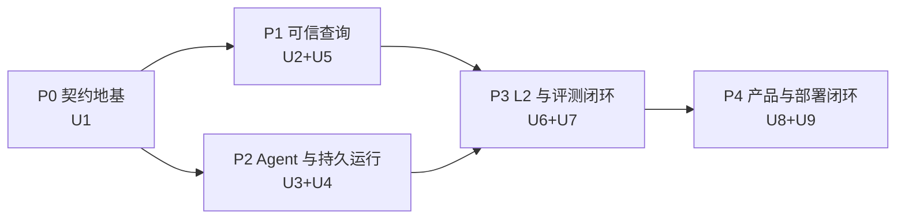

# Data Agent L2 纵向切片实施路线

## 1. 当前状态

- 当前任务状态：`in_progress`。
- 用户已于 2026-07-25 选择执行方案 2，批准以 `/goal` 运行本实施路线。
- Trellis 规划清单与 Compound Engineering 文档审查已通过；产品代码按 U1–U9 依赖顺序实施。
- U1 已完成并固定在 `13824db`，U2 已完成并固定在 `c5319e4`，U3 已完成并固定在
  `2f31e9e`，U4 已完成并固定在 `55a4e24`。
- U5 的 Artifact Authority 基线已固定在 `4bc011f`，ACL-first Grounding、Typed IR
  与 PostgreSQL Authority Persistence 已固定在 `3249ea2`；PostgreSQL Dialect
  Compiler、七道 Gate 与受治理执行 Authority 已固定在 `fa3180b`，Bounded Repair
  已固定在 `029097e`；Metamorphic Result Oracle 已固定在 `60de42d` 并通过完整本地
  门禁与 Codex 复审。RQ091 已冻结并指导完成真实 PostgreSQL Sandbox、Snapshot
  Protocol、耐久 System Store、受控 Mutation 与 Streaming Cutoff；U5 Unit 5
  已完成实现并闭合真实 PostgreSQL 全链验证。Release 仍为 `HOLD`：尚缺已签名的本地
  门禁证据，且 U6–U9 尚未完成，不能用未签名测试日志或 U5 局部门禁替代发布证据。
- 云资源写入仍需对应部署单元的明确契约与凭据；缺少托管证据时必须保持 `HOLD`。
- 实施时以 `docs/plans/2026-07-25-001-refactor-data-agent-l2-vertical-slice-plan.md` 的 U1–U9、Verification Contract 和 Definition of Done 为权威。

### U2 关闭证据（2026-07-25）

- PostgreSQL 17 clean migration、Checksum、双 App×双 Tenant、RLS/Grant、Storage、
  Lifecycle、Secret、Egress 与 Migration Lock 烟测通过。
- Browser RPC 与 Backend Repository 对同一命令完成跨入口 Canonical Hash 重放；
  同 Tenant 不同 Principal 可独立使用相同 Idempotency Key。
- 冻结后的 READ 保留，WRITE 失败关闭；Policy Revoke 与 Approval Consume 的并发竞态
  由 Policy Lock 保证撤销优先。
- `pnpm lint`、`pnpm typecheck`、`pnpm build` 通过。
- 根级 Unit 157/157、Contract 9/9、Platform Tenancy 19/19、Security 32/32、
  PostgreSQL Integration 9/9 通过。
- 外部 Secret/Lifecycle 签名验证器、真实固定 IP Socket Adapter 与实际资源删除/恢复
  仍属于后续部署单元；U2 对相关成功终态保持 fail-closed/HOLD，不把合成 Receipt
  误报为真实外部成功。

### U3 关闭证据（2026-07-25）

- `@mastra/core`、七类 Provider SDK 与项目自有 `ModelProviderPort` 完成精确版本锁定；
  Worker 只暴露项目组合入口，不向领域层或 Package 根泄漏 Mastra 原始构造器。
- OpenAI、Anthropic/Claude、DeepSeek、GLM、Kimi、Grok、Gemini 的真实 SDK
  Request Shape、Structured Output、Tool Call、Stream 与 Error Normalization 离线
  Conformance 通过；Model Router 对未验证的 Context、Region/Privacy、Pricing 与
  Fallback Constraint 全部失败关闭。
- 类型化 L2 Team、Scoped Context Projection、Handoff Receipt、Tool Allowlist 与
  Budget Replay 已实现；Claude Code 保持独立 External Agent Adapter 且默认关闭，
  不能注册为普通 Model Provider。
- Credentialed Smoke 采用显式联网命令；只有 production Live Smoke 产生的品牌化
  Probe/Draft 能经 Worker 内部 PostgreSQL Store 提交、回读和授权为 `AVAILABLE`。
  Duplicate Provider、伪 Store、raw/spread Claims、任意 Smoke Callback 与测试
  Authority 子路径均被负例拒绝。
- `pnpm lint`、`pnpm typecheck`、`pnpm build`、根级 Unit、Contract、Provider、
  Integration、Security 与 Tenancy 门禁通过；PostgreSQL 17 集成中 Platform 9/9、
  Worker Credential Receipt 1/1 通过，三路 Codex 冻结复核均无 P0–P2。
- 当前环境未配置真实 Provider Credential，因此在线认证保持 `NOT_RUN`，七类
  Provider 均为 `UNVERIFIED`；这不影响 U3 实现边界关闭，但发布决策继续保持
  `HOLD`，不能声称已有真实 Provider `AVAILABLE` 证据。

### U4 关闭证据（2026-07-26）

- PostgreSQL Durable Run Runtime 已实现 Command Acceptance、严格每 Run FIFO、
  Lease/Heartbeat/Fence、Attempt、Event/Projection、Retry/Takeover、Cancel、
  Resume/Replay、Checkpoint 与内容寻址 Side Effect Receipt；Redis 仍是可丢失的
  唤醒/缓存层，不承担恢复权威。
- 同一 Run 的并发接受、Resume/Accept 并发、Claim 后未投影崩溃、第 5 次预算耗尽、
  Busy Tenant 清理饥饿、Stale Worker、Cancel Race、Receipt 重用与终态原子结算均有
  PostgreSQL 失败关闭或恢复测试。旧通用 Outbox Claim/Publish/Retry/Fence API 与
  TypeScript Adapter 已撤权并移除，Worker 只能调用 U4 窄函数。
- Mastra Snapshot Hash 改为 PostgreSQL Commit/Load 权威签发与重算；测试明确覆盖
  TypeScript 与 PostgreSQL Canonical Bytes 不同的数值反例，并证明数据库 Hash 在
  Commit → Checkpoint Event → Load → Resume 全链一致。Checkpoint Event 还严格绑定
  提交时 Projection Version 与同一 Active Artifact，拒绝 intervening Event 和换绑。
- `pnpm lint`、`pnpm typecheck`、`pnpm build`、Unit 361/361、Contract 39/39、
  Provider 59/59、Integration（Agent 14/14、Platform 9/9、Worker 9/9）、
  Security、Tenancy 与独立 PostgreSQL 17 Smoke 均通过；本地 Projection Reducer、
  PostgreSQL 并发 Marker 与 Artifact 绑定失败也统一映射为稳定、可判定是否重试的
  公开错误契约。最终 Codex 多视角复审作为本单元提交前门禁。
- U4 是 reset-only Runtime Schema；已有生产数据不能原地重放这些 Migration。
  Hosted Migrator、真实 Worker Daemon、OCI/Compose、Backup/Restore 与生产规模
  Autovacuum/锁/WAL 证据仍属 U9，因此发布判断继续保持 `HOLD`。

### U5 Unit 2 关闭证据（2026-07-26）

- `QuestionFrame -> QueryContract -> GroundingPackage -> SemanticQuery -> LogicalPlan`
  已形成内容寻址、递归上游核验与不可变快照链；L2 公共 API 不暴露可跨事务转移的
  Authority Brand，Platform 提交在 Run Fence 与 Active Revision 替换前完成完整
  Committer、Input、Scope、Principal 与语义验证。
- Catalog、SemanticRelease、SchemaSnapshot 与 PolicyReceipt 固定
  App/Tenant/Environment/Run/Datasource/Version；ACL-first Grounding 先求
  AllowedSchema 交集，再选择 Metric、Dimension、Join Path 与 Candidate，高分越权
  对象不会进入结果、Hash 材料或冲突集。
- Typed IR 只接受类型化 Field、Predicate、Parameter、Scan、Filter、Join、
  Preaggregate、Aggregate 与 Project；首版不暴露没有 QueryContract 语义的
  Sort/Limit。Join Closure 固定事实表 Root、Preserved Side、复合 Key、Cardinality
  与 Fan-out 失败协议。
- `<table_id>.<column_id>` 在 Catalog、Metric、Dimension、Relationship、Policy、
  Grounding Preaggregation 与 Scan 全链强制归属一致；Table/Column/Metric/Dimension/
  Relationship/Predicate/Candidate/Measure 重复身份、Metric/Dimension 跨类型同名与
  Project 重复 Alias 全部失败关闭。多路检索的重复 Hit 按最高分稳定去重。
- Grounding Authority 三个公开分支 Schema 与联合 Schema 共享 Scope、Hash、
  Revision、唯一性和分支语义 Refinement；PolicyReceipt 必须绑定已提交且一致的
  SemanticRelease/SchemaSnapshot，并由受信 Producer/Authority/Principal 提交。
- 根级 `lint`（195 files）、`build`（5/5）、`typecheck`（8/8）、
  Unit（466/466）、Contract（45/45）与 Text2SQL Security（5/5）门禁通过；
  三路独立 Codex 正确性/Authority/系统提交复审均为 READY，无剩余 P0/P1。
- PostgreSQL Compiler、七道 Gate、Bounded Repair、Sandbox 与 ExecutionReceipt
  属于后续 U5 单元。当前 OWNER-only Authority Persistence 已证明失败关闭，但普通
  ANALYST 请求所需的服务端 PolicyReceipt Issuer/Store 组合尚未接入；在该集成完成前
  不声明 Analyst 端到端 Text2SQL 已交付。

### U5 Unit 3 关闭证据（2026-07-26）

- 确定性 PostgreSQL Compiler 只消费同进程品牌化、已提交且与当前 Principal/Scope
  精确绑定的 LogicalPlan；服务端重编译并逐字核验 SQL、Parameters、Compiler Version、
  AST Hash 与 Query Hash。最终输出 Alias 精确等于 QueryContract，标识符只来自
  Grounding Physical Name，所有 Literal/Policy/Time 值参数化。
- `INTENT -> SEMANTIC -> STRUCTURAL -> POLICY -> RESOURCE -> EXECUTION -> RESULT`
  七道 Gate 形成固定 Authority Chain。前五道 PASS 才能签发绑定 PolicyReceipt、
  ResourceAdmission、Datasource/Schema/Settings 与五维预算的 ExecutionPermit；
  后两道只接受权威 Sandbox Evidence 与 ResultOracleReceipt，Validation 不能混用
  另一轮 Gate 或改写时间、证据与结果。
- PolicyReceipt 改由服务端 Issuer/Store 签发；ResourceAdmission、ResultOracle、
  SandboxExecutionReceipt 与 SandboxResult 走专用 System Store Verifier，不要求在
  通用 Artifact Store 制造镜像行。Compiler/Gate/Oracle 与 Sandbox 的高权入口分别只从
  `@data-agent/text2sql/server`、`@data-agent/contracts/server` 暴露，普通根 API
  继续拒绝结构 callback、clone 与自签品牌。
- Sandbox Request 精确绑定 Permit、SqlArtifact、Parameters、Admission 与 Settings；
  Resolver 返回的 Payload 必须通过 Reference Exact Revision Verifier，Reference A
  不能为 Payload B 背书。事务开始时重验证 Principal/Policy、Authority Epoch 与 Fence，
  Claim、Fence 和真实 Operation 必须处于同一事务。
- Sandbox 幂等键按 `App/Tenant/Environment/Principal/Key` 原子 Claim/Load：同输入
  并发只执行一次并重放结果，异输入在 Operation 前冲突，不同 Principal 互不碰撞。
  Pending 撤权立即阻断新事务，已越过 Fence 的旧事务仍可在预算内完成。
- Permit 以事务开始时刻判断有效；到期前开始的事务允许跨过 `expires_at`，但权威墙钟
  跨度和服务端 `elapsed_ms` 都必须受 Timeout Budget 约束。Query/Gate/Sandbox/Oracle
  共享 256 列、10,000 行、64 MiB Result、512 MiB 峰值内存上限与 PostgreSQL
  63-byte ASCII Alias；EXPLAIN 保留真实、唯一、有序的 Node Type。
- 根级 `lint`（213 files）、`build`（5/5）、`typecheck`（8/8）、Unit（563/563）与
  Contract（45/45）门禁通过；其中 Contracts 183/183、Text2SQL 117/117、
  Platform 112/112、Agent Runtime 111/111、Worker 40/40。
- 当前单元关闭的是 Compiler、Gate、System Evidence 与 Sandbox Authority Contract，
  不是生产数据库执行器。首次 Artifact 提交绑定 PostgreSQL `transaction_timestamp()`
  的新鲜度强化、超过 9 个占位符的 JSONB→Driver 顺序测试、真实 EXPLAIN/SQL Adapter、
  大字段在物化前的 Streaming Byte/Memory 截断与 Metamorphic Oracle 属于后续单元；
  因此发布判断继续保持 `HOLD`。
- Bounded Repair 已收窄为冻结 Artifact Bundle 上的 deterministic recompilation：
  只允许恢复 SQL/参数、Compiler Metadata 与 Query Hash 四类实现字段，最多两次
  Attempt、每次最多四个无值 Patch Op；语义、权限与结果合同变化直接路由。
- Repair Episode 只由 Scope/Run 与冻结 Query/Grounding/Semantic/Plan/Policy 内容
  身份派生，不以 repair_id、Principal 或 Root Reference 加盐；服务端 Session Store
  对 `episode_hash + trace_hash + attempt_count` 执行 CAS，阻止复制 Root、换
  Principal、Child Revision 重封 Root、旧 Head 重放与并发分叉。Root Artifact 固定
  revision 1，当前 Parent 只沿同一 Artifact 的连续 Revision 前进。
- CAS 原子保存完整 Trace/Receipt/Candidate；重启恢复必须重新授权 Compiler Input，
  重放 deterministic compiler、Patch Derivation、Gate→Outcome 状态机与完整
  History，只同步重算公开 SHA 不能重新品牌化任意 SQL。第二次 Attempt 形成的终态
  吸收后续重放；loser/旧 Head 只返回 `STALE_HEAD`。
- Compiler Input 必须保留同进程 LogicalPlan Authority 品牌、拒绝 Accessor，并对解析后
  的 Grounding 内容重算 `grounding_hash`；重放与 live compile 复用同一深冻结规范快照。
  clone/plain/Schema 非法输入与“内容漂移但复用旧声明 Hash”都在 Attempt/CAS 前失败
  关闭，不能伪装成 Compiler Unavailable、消费预算或写终态；Receipt 的 Candidate、
  Route 与 Terminal 字段穷尽互斥，Session 吸收原因不能持久成新的 Attempt Receipt。
- Frozen Artifact、当前 Parent 与失败 Gate 都通过服务端 Exact Revision Verifier
  闭合，Reference A 不能为 Payload B 背书。失败来源只能是已提交且 Hash 可重算的
  FAIL/UNAVAILABLE GateReceipt。输出只叫 `CANDIDATE/NEEDS_FULL_REVALIDATION`，
  不能签发 Gate PASS、Permit 或 Validation。
- 根级 `build`（5/5）、`lint`（219 files）、`typecheck`（8/8）、Unit（577/577）与
  Contract（45/45）门禁通过；其中 Contracts 183/183、Text2SQL 131/131、
  Platform 112/112、Agent Runtime 111/111、Worker 40/40。最终 Codex 复审作为
  本单元提交前门禁。

### U5 Unit 4 关闭证据（2026-07-26）

- 先在 `research/data-agent-system-design` 完成 RQ090，固定
  `MetamorphicFixtureReceipt -> SandboxResult -> MetamorphicOracleReceipt ->
  ResultOracleReceipt -> RESULT Gate -> Validation -> QueryEvidence` 的不可自证
  Authority Chain；实现只消费该研究结论，不把合成验证误写成真实生产证据。
- `FixtureMutationRecord`、`MetamorphicFixtureReceipt` 与
  `MetamorphicOracleReceipt` 作为专用 System Artifact。Fixture Authority 从当前已提交
  的 Query/Grounding/Semantic/Plan/SQL 五段链固定推导 Applicability，不接受
  `verify(): true` 或 Applicability Callback；Fixture、Meta、Result 三条 Authority
  的判定算法已下沉到 contracts 固定 kernel，server Composition API 只接收
  Identity、System Store、Sandbox 与上游 Authority，不暴露 callback-bearing
  registrar；首版只支持非 DISTINCT 的整数 SUM 与普通 COUNT。
- Fixture 与 Meta 按固定顺序封存
  `FAN_OUT`、`NULL_ANTI_MEMBERSHIP`、`HALF_OPEN_ADDITIVE_PARTITION` 与
  `SAME_VALUED_DISTINCT_FACT` 四类非空 Relation；每项有 kind-specific Witness、
  `sample_hash`，总 Receipt 有 `evidence_hash/receipt_hash`。三个单变换 Case 必须
  绑定严格 `relation_kind` 判别的 Mutation Record，Record 的 Scope、Run、Case、
  Baseline/Follow-up Snapshot 与 Witness 必须逐字段匹配，并绑定恰好一行的 Selection
  Probe；半开分区以 Meta Baseline 为 whole，left/right 必须绑定同一 Snapshot 上三个
  互异 SqlArtifact/Permit 的真实 Query/Input Hash。Verifier 还从 QueryContract 与
  Witness 固定 `[start, midpoint)` 和 `[midpoint, end)`，要求三份编译 SQL、AST、
  Plan 与参数键一致，只允许两个时间参数按 whole/left/right 语义变化并重算 Query
  Hash；仅追加注释、复用 Baseline 参数或改动非时间参数均失败。Baseline 与 Follow-up
  的完整 Sandbox Receipt/Result、Scope/Run、Schema、Execution、Resource Usage、
  完成时间和 `snapshot_token` 都精确闭合。
- 服务端 Metamorphic Verifier 从已提交的原始 Sandbox rows 重算关系；SQL 结果按保留
  重复项的无序 Multiset 比较，`group_key=[]` 可表示全局聚合。分组 SUM/COUNT 的
  half-open left 可以为空，但仅在 `whole = right` 时成立；空 right 与全局聚合零行
  均失败关闭。普通对象、结构克隆、未提交引用、Reference A/Payload B、合法双 Hash
  但错绑 Case/Relation/Snapshot/Witness、空/多行 Probe、伪 Query Variant 与四类
  Mutant 均不能获得 PASS。每项声明 Verdict 必须等于固定 Verifier 的计算 Verdict，
  总 Verdict 必须等于四项聚合结果；声明/计算不一致不能被降格为一张“权威 FAIL”。
- Fixture、Sandbox、Metamorphic Verifier 与 Result Producer 使用四个独立品牌与稳定
  Identity；`authority_id/principal_id/key_id` 分别两两互异，UUID 大小写先规范化。
  Fixture 不得晚于 Meta，Meta 不得晚于 Result；L2 单次根核验只解析一次 Meta，并把
  同一个品牌对象传给 Result Resolver。
- `ResultOracleReceipt` 必须绑定 Metamorphic Receipt 与其 Verdict；成功 RESULT
  与 observed FAIL 的 evidence 都精确有序为
  `[当前 SandboxResult, MetamorphicOracleReceipt, ResultOracleReceipt]`；Meta/普通
  不变量失败分别映射 `RESULT_METAMORPHIC_FAILED`/`RESULT_INVARIANT_FAILED`。
  RESULT Gate 只经 Result Authority 自有 System Store 的 Commit/Exact Revision 与
  fixed kernel 取得品牌；通用 Artifact Store 镜像、Reference A/Payload B 与 Exact
  Revision 拒绝不能产生 PASS/observed FAIL。只有 Oracle 缺失时才可把
  `RESULT_ORACLE_UNAVAILABLE` 与单一 `ExecutionReceipt` 投影成 GateReceipt；该路径
  不能封 Validation 或 QueryEvidence。
- Platform 在同一提交事务内把 Metamorphic Reference 路由到专用 System Store
  Resolver，并绑定同一 Capability 与 SQL Client；只接受领域 Authorizer 签发且完整
  Reference 一致的不可克隆品牌。缺任一 Authority、错 Revision、Resolver 回传普通
  JSON 或试图查询通用 `artifacts` 镜像都失败关闭。ReleaseManifest 同时显式拒绝
  Fixture/Metamorphic 合成 Receipt 冒充 Hosted、Docker 或 Signed Outcome Evidence。
- 根级 `build`（5/5）、`lint`（227 files）、`typecheck`（8/8）、Unit（654/654）与
  Contract（45/45）门禁通过；其中 Contracts 203/203、Text2SQL 183/183、
  Platform 117/117、Agent Runtime 111/111、Worker 40/40；Text2SQL Security 5/5
  另行通过。根级 Integration、Tenancy 与 Security 也在 PostgreSQL 17 容器中通过：
  Agent Runtime Integration 14/14、Platform Integration 9/9、Worker Integration
  9/9、Platform Tenancy 19/19、Agent Runtime Security 58/58、Platform Security
  32/32，并完成两轮 Supabase/PostgreSQL Smoke。
- 当前关闭的是 Metamorphic Contract、确定性 Verifier、RESULT Authority 与
  Platform 注入缝；测试 Store 仍是内存 Fixture。真实 PostgreSQL 执行、Append-only
  耐久 System Store/Migration、受控数据变换生成器与 Streaming Resource Cutoff
  属于下一 U5 单元，U9 仍需交付类型化部署回执，因此发布判断继续保持 `HOLD`。
  `pnpm verify:release` 已按预期输出 `RELEASE_EVIDENCE_INCOMPLETE`、缺 U5–U9 并以
  状态码 2 退出。

#### Trellis 跨层检查

- Contract：严格 Schema、规范 Hash、System Artifact 路由、不可克隆品牌和稳定 Reason
  Code 已形成唯一真值；普通 Candidate 不能通过 Zod Parse 自签成功。
- Domain：Text2SQL Verifier 固定推导 Applicability、Selection/Mutation、半开参数分区、
  Multiset 与 declared/computed Verdict，不接受调用方布尔回调。
- Persistence：Platform 只在同一事务 Client 与 AppCapability 中转发完整 Reference；
  Result Resolver 收到的必须是 L2 本次根核验解析出的同一个 Meta 品牌对象。
- Consumer：RESULT Gate、Validation 与 QueryEvidence 只消费精确三元组，Release
  Manifest 拒绝将测试 Oracle 当作部署证据；普通 package root 不导出 Registrar 或
  Authorizer。
- Failure：缺品牌、错 Scope/Revision、Hash/时间/角色漂移、恒真闭包注入、Mutation
  错绑、注释伪变体、Resolver 返回结构克隆、通用 Store 镜像或专用 System Store 缺失
  均失败关闭；没有发现跨层静默降级路径。
- Verification：Build、Typecheck、Lint、Unit、Contract、Integration、Tenancy、
  Security、PostgreSQL Smoke 与预期 `HOLD` 均已重新执行；Trellis Check 结论为
  `PASS（U5 Unit 4 范围）`。

### U5 Unit 5 研究冻结（2026-07-27）

- RQ091 当前全文已经绑定 16 个 supported Claim、27 个 Evidence、closed Answer
  Runtime、`validate-ready: true` 与
  `RQ091-FULL-ANSWER-EXTENSION@1.0.0` FullAnswerRecertification；两轮 Codex-only
  文档复审最终 `remaining blockers: NONE`，未调用 Claude Code。
- 原 Unit 3 的“Claim、真实 Operation 与完成记录共享同一 SQL transaction”只能表示
  Authority DB 与 Datasource 共用同一连接的演示路径，不能外推到独立 Python
  Datasource。Unit 5 固定为三个本地事务：
  `Authority Claim -> Datasource RR/RO Execute -> Authority CAS Finalize`；跨库只保证
  Authority 本地原子与 Fence/CAS，不声明 exactly-once。
- `CONTROLLED_REVISION` 是 U5 唯一 `REPLAYABLE` Snapshot Strategy。完整 schema/data
  manifest、精确 Relation/OID 锁定和查询必须共享同一 RR/RO transaction/snapshot，
  防止 manifest/query TOCTOU；Owner/Admin 漂移属于 Authority Breach。
- TypeScript Platform 只拥有 Exact Revision、Claim/Lease/Fence/Cancel Epoch、
  Grant、Outcome Binding 与 Finalize 权限。Python `services/sandbox` 使用
  `psycopg>=3.2` 的 `AsyncRawServerCursor` 原生消费 `$1…$n`，固定
  `fetchmany()`、逐批 Row/Byte/Deadline Cutoff，并以干净 Rollback 结束所有只读
  Datasource Transaction。
- U5 本地 Transport 是每进程单 Execution 的双向 NDJSON。Outcome 精确绑定
  Grant/Input/Execution/Attempt/Fence/SQL/Snapshot；Cancel Epoch 按单调规则核验。
  late cancel 丢弃候选并进入 `CANCELLED`，不能伪称 query cancel confirmed；旧 Attempt
  stdout 不能提交到新 Fence。
- 新 Migration 必须包含专用 append-only System Artifact Store、可恢复 Claim/Event
  投影与每 Attempt 一条的不可变 Execution Record。领域 Content Hash 与完整 Payload
  Checksum 分离，通用 `artifacts` 镜像没有 System Authority。
- 三个数据变换 `FAN_OUT`、`NULL_ANTI_MEMBERSHIP`、
  `SAME_VALUED_DISTINCT_FACT` 分别从同一 sealed Baseline clone，并用全 Snapshot
  manifest 证明 exact delta；`HALF_OPEN_ADDITIVE_PARTITION` 只改变查询窗口，不进入
  数据 Mutation。
- 本节是研究合同冻结，不是实现关闭证据。PG17 设计期容器日志只标记为
  `SYNTHETIC_POSTGRESQL_17_PROOF`；在 Python/TypeScript/Migration/Integration Gate
  全部绿色前，`pnpm test:sandbox` 与 Release 继续保持 `HOLD`。

### U5 Unit 5 实现关闭证据（2026-07-27）

- Contracts 已交付严格版本化的 `ExecutionGrant`、`SandboxExecutionOutcome`、
  Claim/Transition/Cancel/Recovery Schema 与服务端
  `prepareSandboxExecution`、`finalizeSandboxExecution`、
  `failSandboxExecution`、`cancelSandboxExecution` Authority API；成功 Outcome
  的行数、规范字节、当前批次和保留字节必须与 `SandboxResult` 精确一致。
- Platform 已交付 PostgreSQL Authority Adapter、三段式 Coordinator、单 Execution
  双向 NDJSON Python Client 和 PostgreSQL AST 失败关闭门禁。SqlArtifact 必须使用
  `postgresql-compiler@1.1.0`，编译产物中的所有 SQL Primitive、Operator 与 Cast
  都显式限定到 `pg_catalog`；多语句、DML CTE、危险函数、子查询、越界关系、自定义
  Operator/Cast 与非参数化业务常量都会在创建 Claim、启动子进程或连接 Datasource
  之前被拒绝。
- PostgreSQL 17 Migration 已交付 append-only `text2sql_system_artifacts`、可恢复
  Claim/Event Projection 与每 Attempt 唯一的不可变 Execution Record。Backend 仅有
  同 Scope 读取和窄函数执行权限；Browser 角色无权读取或写入。Idempotency 只绑定
  不变请求身份，Lease Recovery 使用 PostgreSQL 数据库时钟，Worker 的未来时间不能
  抢占尚未到期的 Lease。`FAILED/CANCELLED` 与 `COMPLETED` 一样在 Authority 重启后
  稳定重放且不会再次执行 Datasource；同键异输入仍在 Datasource Operation 前冲突。
- Python `services/sandbox` 已在同一 `REPEATABLE READ READ ONLY` Transaction 内重算
  完整 schema/data manifest、锁定 Relation/OID、按原生 `$1…$n` 执行查询，并以
  增量 O(n) 规范化、固定 `fetchmany()`、Row/Byte/Deadline Cutoff 和干净 Rollback
  形成 Outcome。完整 Snapshot Manifest 使用真正的 PostgreSQL named server-side
  cursor，并受独立固定 Runtime Ceiling 约束：最多 256 个 Relation、每 Relation
  256 列、跨全部 Relation 合计 10,000 行与 64 MiB JCS Digest Material；它与
  Request 的 Result Budget 分离，不能被调用方放大。执行器强制
  `NONE = [pg_catalog]`、
  `CONTROLLED_REVISION = [sealed_schema,pg_catalog]`，并在连接后、事务前通过
  `data_agent_sandbox_control.datasource_identity` 核对实际
  `datasource_id/fingerprint`。Authority Prepare 重验证时间允许早于 Datasource
  `started_at` 但不能晚于它；Permit 仍按实际 `started_at` 验证。JSON/JSONB 递归值、
  int8/numeric、列/行/字节边界、Cancel 与 Snapshot Mutation 均有真实 PG17 反例。
- 真实端到端测试已覆盖
  `Coordinator -> PostgreSQL Authority -> Python child -> 同一 PostgreSQL Datasource
  -> 耐久 Receipt/Result -> Authority 重启后 replay`，并断言重放不会第二次启动
  Python。提交前最终 `pnpm test:sandbox` 已通过：Contracts 220/220、Platform Unit
  185/185、PostgreSQL/Supabase Smoke、Platform Integration 11/11、Worker
  Integration 9/9、Python PG17 70/70、TypeScript↔Python Process Integration 1/1。
- U5 只交付可运行、可验证的本地 Sandbox，不把逻辑峰值内存估计冒充 cgroup 硬隔离。
  `cgroup_memory_limit_enforced=false` 是当前真实观测；Hosted/Docker OCI、CPU/Memory/
  Filesystem/Network 硬隔离与签名部署 Outcome 仍属 U9。`pnpm verify:release` 必须因
  已签名本地门禁证据缺失及 U6–U9 未完成，以
  `RELEASE_EVIDENCE_INCOMPLETE` 和状态码 2 返回 `HOLD`。

## 2. 执行原则

- 按纵向能力闭环推进，而不是先堆满所有基础设施。
- 每个阶段先冻结 Contract 与 Fixture，再实现 Adapter/Workflow。
- Agent 输出永远是 Candidate；Gate/Compiler/Executor/Verifier 提交权威状态。
- PostgreSQL 是 Run/Artifact/Event/Outbox/Eval 的权威存储；Redis 不是。
- 先有可失败、可重放的端到端 Case，再扩大 Provider、Benchmark 与部署覆盖。
- 任一阶段若无法保留 App Isolation、Artifact Provenance 或 Suite Oracle，应停止并修订计划。

## 3. 阶段总览



## 4. Phase 0：契约地基

### 目标

完成 U1，让后续实现共享稳定 Artifact、状态、Port 和能力边界。

### 工作包

1. 初始化 pnpm/Turbo TypeScript Monorepo。
2. 建立 `packages/contracts`。
3. 定义 `ArtifactEnvelope`、Artifact Reference、Run Terminal、Release Decision。
4. 定义 Storage、Queue、Cache、Sandbox、Model、External Agent、Eval Port。
5. 定义真实 L2 Schema 与只读 L3–L5 Capability Descriptor。
6. 建立依赖边界 Test 与根级验证命令。
7. 实现 Dependency/Provider Capability Probe。

### 关键测试

- Artifact 不能跨 App/Revision 错引。
- L3–L5 不能产生“已交付”Receipt。
- Public Error/Terminal 稳定序列化。
- In-Memory Port Adapter 通过 Conformance。
- 领域 Package 不能导入 Mastra/平台 SDK。

### Release Gate

- `pnpm lint`
- `pnpm typecheck`
- `pnpm test:unit --filter contracts`
- `pnpm test:contract`

### 回滚点

若 Contract 不能同时表达 Hosted/Docker、Model/External Agent 或 L2/L3–L5 边界，停止后续单元，修改 U1；此时没有持久数据或外部资源需要迁移。

## 5. Phase 1：可信查询与共享数据边界

### 目标

完成 U2 与 U5：先证明多应用隔离和强 Text2SQL，而不是把 Agent 自由度建立在不可信地基上。

### U2 工作包

1. 建立 Platform/App Registry。
2. 建立私有 `app_data_agent` Schema 与窄 `api` RPC/View。
3. 实现 App-Aware Repository、Grant、RLS。
4. 实现独立 Migration Ledger/Checksum/Lock。
5. 实现 Storage/Redis Namespace Adapter。
6. 实现 Transactional Outbox。
7. 实现 App Freeze/Export/Delete/Restore 流程。
8. 实现 `SecretRef`、轮换/撤销、Datasource Host Allowlist、DNS/Private IP 检查。
9. 实现带 App 前缀的公开 RPC、固定 `search_path` 与 Run/Artifact/SSE/Export/Delete 对象级授权。
10. 使用 Supabase Auth 验证用户身份，但从服务端 Deployment Mapping 与 App 私有 Membership 表解析 App/Tenant/Role；公开 Demo 使用独立只读 `demo_principal`。

### U5 工作包

1. 从 `text2sql@c36aca8` 提取选定 Characterization Fixture。
2. 定义 `QuestionFrame` 与冻结的 `QueryContract`。
3. 实现 ACL-First Grounding 与 Join Closure。
4. 实现 `SemanticQuery`、`LogicalPlan` 与首版 PostgreSQL Dialect Compiler。
5. 实现 Intent、Semantic、Structural、Policy、Resource、Execution、Result Gate。
6. 实现只允许语义保持的 Bounded Repair。
7. 在 U5 交付最小 SQL Sandbox 与 Snapshot Protocol；U9 只做生产加固。
8. 实现绑定 Datasource/Schema/Snapshot/Watermark/Observed Time/Query Hash 的 `ExecutionReceipt` 与 `QueryEvidence`。

### 关键测试

- 两个 App、每个两个 Tenant，覆盖 Direct/RPC/Storage/Redis/Migration/Export/Delete。
- 高权限连接仍不能绕过 Repository App Capability。
- 同名公开 RPC 不碰撞；无权对象标识、Secret 泄漏与 SSRF/DNS Rebinding Fixture 全部失败。
- 伪造 App/Tenant/Role Header 或 Claim 无效；Membership 撤销即时生效；Demo Principal 不能发现真实数据或 Hidden Holdout。
- 七道 Gate 各有正例和失败关闭例。
- PostgreSQL 是唯一可发布 Dialect；无快照能力的数据源进入受限重放状态。
- Metamorphic Fixture 捕获 Fan-Out、Null、时间边界和错误去重。
- 旧 Fixture 差异必须被记录和批准。

### Release Gate

- `pnpm test:tenancy`
- `pnpm test:integration --filter persistence`
- `pnpm test:unit --filter text2sql`
- `pnpm test:integration --filter text2sql`
- `pnpm test:sandbox`
- `pnpm test:security`

### 回滚点

- 若共享 Supabase 任一边界不能失败关闭，回滚 U2 Schema/API 设计，不进入 Hosted 接入。
- 若 Repair 会改变 QueryContract，删除该 Repair Route，不接受“更高通过率”作为理由。

## 6. Phase 2：Provider-Neutral Agent 与持久运行

### 目标

完成 U3 与 U4：让多模型、多 Agent、暂停恢复和长任务具备明确边界。

### U3 工作包

1. 用项目 Port 封装 Mastra。
2. 建立 `ModelProfile` 与 Capability Router。
3. 为 OpenAI、Anthropic/Claude、DeepSeek、GLM、Kimi、Grok、Gemini 实现真实 Profile/Adapter 配置，并全部通过 CI 离线 Conformance。
4. 建立 `ExternalAgentAdapter`，默认不启用 Claude Code。
5. 定义 L2 Team、`TaskEnvelope`、`HandoffReceipt` 与 Context Projection。
6. 强制 Tool Allowlist、Budget 与 Untrusted Context Boundary。

### U4 工作包

1. 控制面实现 Command Acceptance 与 Outbox。
2. Worker 默认使用 PostgreSQL Lease Queue，实现 `FOR UPDATE SKIP LOCKED`、Fence、Heartbeat 与 Retry。
3. Mastra Snapshot 绑定 Active Artifact Revision。
4. 建立 Event Projection 与 SSE。
5. 实现 Cancel、Resume、Replay。
6. SQL/Eval Side Effect 采用 Content-Addressed Receipt。

### 关键测试

- Provider Capability 不满足时明确失败或按策略 Fallback。
- 只有完成真实 Credentialed Smoke 并保存 Model Receipt 的 Provider 才显示 `AVAILABLE`；没有凭据时显示 `UNVERIFIED`。
- External Agent 不能注册为 Model 或扩大 Workspace/Permission。
- Agent Handoff 不传递无限 Raw Memory。
- Prompt Injection Fixture 不能引入 Instruction、Tool、Credential、Network 或 App Scope。
- Duplicate Delivery、Crash/Resume、Cancel Race、Stale Worker、Replay 全部确定。

### Release Gate

- `pnpm test:unit --filter agent-runtime`
- `pnpm test:providers`
- `pnpm test:integration --filter runtime`
- `pnpm test:security`
- Capability Probe 报告固定 Mastra 与 Provider 行为。

### 回滚点

- 若 Mastra Snapshot 无法可靠映射 Artifact Revision，保留 Mastra 作为单步 Agent Runtime，Workflow Durable State 退回项目自有状态机，不能把 Snapshot 当作权威。
- 若 Queue Adapter 无法保证至少一次投递下的 Fence/Idempotency，保留 Port，替换 Adapter。

## 7. Phase 3：L2 研究与评测闭环

### 目标

分别完成 U6 Research Authority 工程单元与 U7 Benchmark 工程单元。U6 单独完成不等于
首版纵向切片完成；只有 U5–U9 及其签名证据共同闭合，才形成可演示、可量化、可迭代
的完整纵向切片。

### U6 工作包

设计已通过 RQ092、`docs/design/u6-research-authority-contract.md`、
`docs/design/u6-research-planning-payload-contract.md` 与
`docs/design/u6-research-wire-payload-contract.md`、
`docs/design/u6-research-platform-contract.md`、
`docs/design/u6-research-resource-invocation-contract.md`、
`docs/design/u6-invocation-state-contract.md`、
`docs/design/u6-system-record-lifecycle-contract.md` 与
`docs/design/u6-controlled-fixture-contract.md` 冻结；当前状态仅为
`FROZEN_DESIGN_CONTRACT`，不是实现完成。

1. 升级 `ResearchBrief/HypothesisSet/EvidencePlan/QueryEvidence/AtomicClaim/
   AnalysisReport/ReportReadyCertificate` V2 Schema；V1 只允许历史读取。
2. 增加 `ObligationExecutionDecision`，在 Sandbox 前逐项验证 QueryContract 与
   Obligation 的 metric/formula/window/timezone/grain/grouping/join/predicate/cohort/
   null/authorization Scope。
3. 实现 QUERY-only 的 Proof Obligation、竞争假设与依赖查询；不实现
   `SourceEvidence`、Source Fetch 或 Benchmark Adapter。
4. 从权威结果与预注册 Observation Contract 派生 `SupportDecision` 和
   `HypothesisAssessment`，从 `AtomicClaim@2` 删除自报支持态。
5. 按 `STALE > FAILED > BLOCKED > SATISFIED > OPEN` 重算 Coverage，并让未解决
   material conflict 阻断 `SATISFIED/STOP_READY`。
6. 实现 Stop 六分支；只有硬预算封顶且存在可披露受支持子集才能
   `STOP_PARTIAL`，不提供兜底 Partial。
7. 从 `ReportManifest` 确定性投影中文 `AnalysisReport@2` 与
   `ReportProjectionReceipt`。
8. 分别实现 Support、Conflict、Freshness、Source Independence Gate，并由
   server-only Readiness Authority 签发 `ReportReadyCertificate@2`。
9. 在 PostgreSQL 增加 current readiness、Revocation Head、
   `RevocationOperation`、单次 `ReportReadGrant` 与固定锁序。
10. 用 `consumeCurrentReady` 在同一事务内核验 exact Certificate、Version Frontier
    与 Revocation，再提交公共 `READY`；相同幂等键重放也必须重新检查撤权。
11. 接入 `RESEARCH_RUNTIME_LIMITS@1`、tenant/principal 原子预算 reservation 和
    `AgentDataProjectionReceipt`。
12. 在 `apps/worker` 组合 Mastra Team、Research Kernel、Text2SQL、Sandbox 与
    PostgreSQL Authority；Checkpoint 只保存执行位置和精确引用。

#### U6 设计冻结证据（2026-07-27）

- RQ092 来源链已闭合：Reader Answer
  `8d6b6b22f4edaa53579b7a5f4710421f96967052a0bf7078ad4fb68a65b9df3b`、
  Answer Runtime
  `6fd834e3e2228bf270c6b3556bb0ca23fdc90336950715e7fc59879a20e89eb9`、
  Synthetic Contract Proof
  `0908d49c91598999e40c3ecebd946b5a72317283dad6368e418ade660ac6df5b`，
  Run 为 `RUN20260727-070114-u6-l2-research-loop-repo-b73fca`。合成证明只校验合同，
  不属于产品、Benchmark 或 Release Evidence。
- Trellis `implement.jsonl` 与 `check.jsonl` 各注入 14 个相同且不重复的文件；
  `task.py validate` 无 Warning，所有文件都小于 32768 bytes，最大文件为
  `u6-research-wire-payload-contract.md` 的 32671 bytes。8 个 U6 设计文件中的
  35 个 TypeScript 代码块均通过语法解析，JSONL 与 `git diff --check` 通过。
- 两轮独立 Codex-only 契约审查与最终 Trellis 跨层审查均要求
  `remaining_p0_p1.p0=[]`、`remaining_p0_p1.p1=[]`；全程未调用 Claude Code。
- 冻结后的仓库门禁通过：`pnpm lint`（243 files）、`pnpm typecheck`（8/8）和
  `pnpm test:contract`（Contracts 7/7、Text2SQL 6/6、Platform 2/2、
  Agent Runtime 30/30）。
- 本节只关闭设计冻结；代码、Migration、PostgreSQL 竞态、Worker 恢复与 Controlled
  Case 尚未实现，状态仍是 `NOT_IMPLEMENTED`，Release 必须保持 `HOLD`。

### U7 工作包

1. 定义 `EvalCase`、`EvalRun`、`ScoreCard`、`ReleaseDecision`。
2. 实现 InsightBench、DAB、RCAEval、可控归因 Adapter。
3. 各 Suite 使用自己的 Oracle。
4. 固定完整 Run Manifest 与 Replay。
5. 建立 Baseline/Candidate Paired Comparison。
6. 分离 Demo、Tuning、Holdout Registry。
7. 建立 Bundle Digest、License、Path 与 Hook 安全校验。
8. 创建 U7-owned `retail-revenue-investigation-v1` Benchmark Manifest，固定
   Dataset、Semantic Release、主问题、Answer/Oracle、Mutation、Budget、License、
   Demo/Holdout 身份与 L2 非因果边界；可以复用 U6 业务域/生成器，禁止读取 U6
   protocol fixture 的字面期望行或阈值作为 Benchmark 分数。

### 关键测试

- Controlled L2 Case 到达 `READY`。
- 两次依赖查询中一个假设 `SURVIVED`、一个 `REFUTED`；Q2 精确引用 Q1 Evidence。
- Coverage 五态、Stop 六分支和 14 个预注册 Mutation 获得确定 Owner、终态与
  Reason Code。
- SQL 成功但 metric/window/join/predicate/cohort/null 语义错误时失败关闭。
- Citation 只相关、Conflict 隐藏、同源伪装多源或假设宇宙披露缺失时不能 Ready。
- SQL Receipt 提交后崩溃的恢复不重复执行 SQL；旧 Fence 和伪造 Checkpoint 不能提交。
- current-ready 与撤权竞态中，撤权先胜出时不提交 READY 或 ReportReadGrant；
  仅正在竞争的 `DOMAIN_TERMINAL` consume 可在同一事务追加唯一
  `STALE/RUN_STALE`。独立 revoke 不创建 Terminal。
- V1 可历史读取但不能进入 V2 current-ready。
- Tenant Burst、Provider Cost、SQL Result Amplification 与 Cancel Reservation Leak
  Oracle 全部通过。
- 四类 Adapter 不丢失 Suite 字段。
- 一个 Suite 的分数不能满足另一个 Suite 的 Oracle。
- 缺少签名代表性 Pair 时 Release 只能 `HOLD`。

### U6 Contract Gate

- `pnpm test:research`
- `pnpm test:unit`
- `pnpm test:integration`
- `pnpm test:architecture`
- Controlled、14 Mutation、Coverage/Stop、Crash-Recovery、Resource、V1 Read-Deny、
  current-ready Revocation Race 全通过。
- `pnpm verify:release`（预期仍为 `HOLD`）

### U7 Eval Gate

- `pnpm eval:smoke`
- 四类 Adapter Conformance、Oracle Separation、Manifest Replay 与 Holdout
  Contamination 全通过。
- `pnpm verify:release`（U7 完成后仍应诚实为 `HOLD`）

### 回滚点

- 若 Report 不能只从已提交 Claim 投影，停止 UI 工作，先修正 Artifact Authority。
- 若 Suite Adapter 需要丢失原有 Oracle 才能统一，撤销统一字段，保留 Suite-Specific Extension。

## 8. Phase 4：产品体验与双部署闭环

### 目标

完成 U8 与 U9，让同一 L2 能力可在产品 UI、Docker 与托管环境中验证。

### U8 工作包

1. 建立围绕 Run Projection 的分析工作台。
2. 支持新问题与已授权 Demo Case。
3. 显示 Hypothesis、SQL、Gate Receipt、Execution Receipt、Claim–Evidence、Conflict、Limitation。
4. 支持 Clarification、Cancel、Resume、Replay。
5. 支持 Eval Paired Comparison。
6. 明确标记 Demo License/Version/Experience-Only。
7. L3–L5 Route 与文案显示未交付。
8. 固定信息层级：权威状态/当前动作 → Question/Scope/Clarification → Report/Claim–Evidence → Hypothesis/SQL/Receipt → Eval。
9. 为全部交互定义 Loading、Empty、Error、Partial、Stale、Permission-Denied，并支持键盘、Screen Reader、Focus Recovery、窄屏与触屏。
10. SSE 断开后从 PostgreSQL Projection Version 恢复并补齐事件，不依赖 Redis 信号完整性。

### U9 工作包

1. 建立 Python/SQL Sandbox Resource Policy。
2. 配置 Vercel Web、Supabase、Upstash 与运行同一 OCI Image 的 Durable Worker；默认 Queue 为 PostgreSQL Lease Queue。
3. 建立 `compose.yaml` 的一键启动。
4. Hosted/Docker 使用同一 Migration Manifest 与 Contract Test。
5. 演练 Worker Restart、Outbox Recovery、Backup/Restore。
6. 汇总 Release Manifest 与 `verify:release`。
7. 编写运维 Runbook。

### 关键测试

- UI 对所有 Run Terminal 和 Release State 如实呈现。
- Claim 可以导航至 Evidence、SQL、Receipt 与 Version Tuple。
- L2 Ready/Clarification/Cancel-Resume/Eval/Deferred Capability E2E 通过。
- Clean Compose 完成 Migration、Demo、Eval、Restart、Replay。
- Hosted 有凭据时通过 Contract；无凭据时明确 `HOLD`。
- Restore 一个 App 不改变另一个 App。

### Release Gate

- `pnpm test:e2e`
- `pnpm test:sandbox`
- `pnpm test:deploy:docker`
- `pnpm test:deploy:hosted`
- `pnpm verify:release`

### 回滚点

- Docker 与 Hosted 公开语义不一致时，不分别修补 UI；回到 Port/Contract 层修复。
- 真实 Hosted Evidence 缺失时保持 `HOLD`，不通过跳过测试获得 `GO`。

## 9. 全局验证命令

```bash
pnpm lint
pnpm typecheck
pnpm test:unit
pnpm test:contract
pnpm test:providers
pnpm test:integration
pnpm test:tenancy
pnpm test:sandbox
pnpm test:e2e
pnpm eval:smoke
pnpm test:security
pnpm test:deploy:docker
pnpm test:deploy:hosted
pnpm verify:release
```

这些命令是全局验收契约。U1–U5 对应命令已经接入真实实现；U6–U9 尚未实现的命令必须
通过 `pending-gate` 或 `verify:release` 明确返回 `HOLD`/非零退出，不能静默通过。

## 10. 阶段性证据要求

每个阶段必须保存：

- Source Commit。
- Dependency/Model/Prompt/Workflow Version。
- Migration Manifest 或 Schema Hash。
- Test Command 与结果。
- Artifact/Run/Eval Fixture Digest。
- 已知失败与 Reason Code。
- Release Decision。
- 若为 `HOLD`，明确缺失证据及解除条件。

## 11. 范围控制

实现过程中不得顺手加入：

- L3 实验执行器。
- L4 Scheduler/Observer。
- L5 Causal Estimator。
- L6 生产写 Tool。
- 旧 API 兼容层。
- 没有评测问题支撑的 Provider 特殊分支。
- 把 RCAEval Full Suite 提升为首版 Release Gate。

如确有必要，先更新 `prd.md`、`design.md` 与主计划，再请求用户批准。

## 12. 最终完成条件

- U1–U9 均有实现 Diff 与通过证据。
- R1–R8、F1–F7、AE1–AE12 均可追踪。
- Controlled L2 Case 可重放到 `READY`，Mutation Case 正确失败。
- 七道 Text2SQL Gate 均有正例与失败关闭例。
- 七类 Model Provider 均通过离线 Conformance；标记为可用的 Provider 有真实 Certification Receipt。
- PostgreSQL 是首版唯一发布级 Dialect，普通 Run 明确绑定数据快照或受限重放状态。
- 四个 Benchmark Adapter 保留独立 Oracle。
- 两个逻辑应用共享 Supabase 时通过完整隔离与恢复测试。
- Docker 一键启动并完成 L2 Demo/Eval Smoke。
- Hosted 路径要么有签名通过证据，要么保持 `HOLD`。
- 工作台覆盖全部交互状态、键盘/Screen Reader、窄屏和 SSE 断线恢复。
- 所有 UI/API 文案均不声称 L3–L5 已交付。

## 13. 批准门

批准门已通过：用户选择执行方案 2，Compound Engineering `ce-work` 与 Trellis 开发任务已经启动。后续进度只记录在 Git、Trellis 任务状态和验证证据中，不回写主计划正文。
