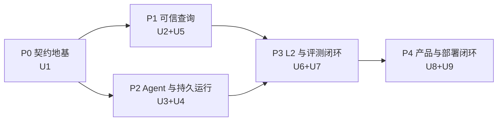

# Data Agent L2 纵向切片实施路线

## 1. 当前状态

- 当前任务状态：`in_progress`。
- 用户已于 2026-07-25 选择执行方案 2，批准以 `/goal` 运行本实施路线。
- Trellis 规划清单与 Compound Engineering 文档审查已通过；产品代码按 U1–U9 依赖顺序实施。
- U1 已完成并固定在 `13824db`，U2 已完成并固定在 `c5319e4`，U3 已完成并固定在
  `2f31e9e`；U4 实现与本地验证已经完成，下一实施单元为 U5。
- 云资源写入仍需对应部署单元的明确契约与凭据；缺少托管证据时必须保持 `HOLD`。
- 实施时以 `docs/plans/2026-07-25-001-refactor-data-agent-l2-vertical-slice-plan.md` 的 U1–U9、Verification Contract 和 Definition of Done 为权威。

### U2 关闭证据（2026-07-25）

- PostgreSQL 17 clean migration、Checksum、双 App×双 Tenant、RLS/Grant、Storage、
  Lifecycle、Secret、Egress 与 Migration Lock 烟测通过。
- Browser RPC 与 Backend Repository 对同一命令完成跨入口 Canonical Hash 重放；
  同 Tenant 不同 Principal 可独立使用相同 Idempotency Key。
- 冻结后的 READ 保留，WRITE 失败关闭；Policy Revoke 与 Approval Consume 的并发竞态
  由 Policy Lock 保证撤销优先。
- `pnpm lint`、`pnpm typecheck`、`pnpm build` 通过。
- 根级 Unit 157/157、Contract 9/9、Platform Tenancy 19/19、Security 32/32、
  PostgreSQL Integration 9/9 通过。
- 外部 Secret/Lifecycle 签名验证器、真实固定 IP Socket Adapter 与实际资源删除/恢复
  仍属于后续部署单元；U2 对相关成功终态保持 fail-closed/HOLD，不把合成 Receipt
  误报为真实外部成功。

### U3 关闭证据（2026-07-25）

- `@mastra/core`、七类 Provider SDK 与项目自有 `ModelProviderPort` 完成精确版本锁定；
  Worker 只暴露项目组合入口，不向领域层或 Package 根泄漏 Mastra 原始构造器。
- OpenAI、Anthropic/Claude、DeepSeek、GLM、Kimi、Grok、Gemini 的真实 SDK
  Request Shape、Structured Output、Tool Call、Stream 与 Error Normalization 离线
  Conformance 通过；Model Router 对未验证的 Context、Region/Privacy、Pricing 与
  Fallback Constraint 全部失败关闭。
- 类型化 L2 Team、Scoped Context Projection、Handoff Receipt、Tool Allowlist 与
  Budget Replay 已实现；Claude Code 保持独立 External Agent Adapter 且默认关闭，
  不能注册为普通 Model Provider。
- Credentialed Smoke 采用显式联网命令；只有 production Live Smoke 产生的品牌化
  Probe/Draft 能经 Worker 内部 PostgreSQL Store 提交、回读和授权为 `AVAILABLE`。
  Duplicate Provider、伪 Store、raw/spread Claims、任意 Smoke Callback 与测试
  Authority 子路径均被负例拒绝。
- `pnpm lint`、`pnpm typecheck`、`pnpm build`、根级 Unit、Contract、Provider、
  Integration、Security 与 Tenancy 门禁通过；PostgreSQL 17 集成中 Platform 9/9、
  Worker Credential Receipt 1/1 通过，三路 Codex 冻结复核均无 P0–P2。
- 当前环境未配置真实 Provider Credential，因此在线认证保持 `NOT_RUN`，七类
  Provider 均为 `UNVERIFIED`；这不影响 U3 实现边界关闭，但发布决策继续保持
  `HOLD`，不能声称已有真实 Provider `AVAILABLE` 证据。

### U4 关闭证据（2026-07-26）

- PostgreSQL Durable Run Runtime 已实现 Command Acceptance、严格每 Run FIFO、
  Lease/Heartbeat/Fence、Attempt、Event/Projection、Retry/Takeover、Cancel、
  Resume/Replay、Checkpoint 与内容寻址 Side Effect Receipt；Redis 仍是可丢失的
  唤醒/缓存层，不承担恢复权威。
- 同一 Run 的并发接受、Resume/Accept 并发、Claim 后未投影崩溃、第 5 次预算耗尽、
  Busy Tenant 清理饥饿、Stale Worker、Cancel Race、Receipt 重用与终态原子结算均有
  PostgreSQL 失败关闭或恢复测试。旧通用 Outbox Claim/Publish/Retry/Fence API 与
  TypeScript Adapter 已撤权并移除，Worker 只能调用 U4 窄函数。
- Mastra Snapshot Hash 改为 PostgreSQL Commit/Load 权威签发与重算；测试明确覆盖
  TypeScript 与 PostgreSQL Canonical Bytes 不同的数值反例，并证明数据库 Hash 在
  Commit → Checkpoint Event → Load → Resume 全链一致。Checkpoint Event 还严格绑定
  提交时 Projection Version 与同一 Active Artifact，拒绝 intervening Event 和换绑。
- `pnpm lint`、`pnpm typecheck`、`pnpm build`、Unit 361/361、Contract 39/39、
  Provider 59/59、Integration（Agent 14/14、Platform 9/9、Worker 9/9）、
  Security、Tenancy 与独立 PostgreSQL 17 Smoke 均通过；本地 Projection Reducer、
  PostgreSQL 并发 Marker 与 Artifact 绑定失败也统一映射为稳定、可判定是否重试的
  公开错误契约。最终 Codex 多视角复审作为本单元提交前门禁。
- U4 是 reset-only Runtime Schema；已有生产数据不能原地重放这些 Migration。
  Hosted Migrator、真实 Worker Daemon、OCI/Compose、Backup/Restore 与生产规模
  Autovacuum/锁/WAL 证据仍属 U9，因此发布判断继续保持 `HOLD`。

## 2. 执行原则

- 按纵向能力闭环推进，而不是先堆满所有基础设施。
- 每个阶段先冻结 Contract 与 Fixture，再实现 Adapter/Workflow。
- Agent 输出永远是 Candidate；Gate/Compiler/Executor/Verifier 提交权威状态。
- PostgreSQL 是 Run/Artifact/Event/Outbox/Eval 的权威存储；Redis 不是。
- 先有可失败、可重放的端到端 Case，再扩大 Provider、Benchmark 与部署覆盖。
- 任一阶段若无法保留 App Isolation、Artifact Provenance 或 Suite Oracle，应停止并修订计划。

## 3. 阶段总览



## 4. Phase 0：契约地基

### 目标

完成 U1，让后续实现共享稳定 Artifact、状态、Port 和能力边界。

### 工作包

1. 初始化 pnpm/Turbo TypeScript Monorepo。
2. 建立 `packages/contracts`。
3. 定义 `ArtifactEnvelope`、Artifact Reference、Run Terminal、Release Decision。
4. 定义 Storage、Queue、Cache、Sandbox、Model、External Agent、Eval Port。
5. 定义真实 L2 Schema 与只读 L3–L5 Capability Descriptor。
6. 建立依赖边界 Test 与根级验证命令。
7. 实现 Dependency/Provider Capability Probe。

### 关键测试

- Artifact 不能跨 App/Revision 错引。
- L3–L5 不能产生“已交付”Receipt。
- Public Error/Terminal 稳定序列化。
- In-Memory Port Adapter 通过 Conformance。
- 领域 Package 不能导入 Mastra/平台 SDK。

### Release Gate

- `pnpm lint`
- `pnpm typecheck`
- `pnpm test:unit --filter contracts`
- `pnpm test:contract`

### 回滚点

若 Contract 不能同时表达 Hosted/Docker、Model/External Agent 或 L2/L3–L5 边界，停止后续单元，修改 U1；此时没有持久数据或外部资源需要迁移。

## 5. Phase 1：可信查询与共享数据边界

### 目标

完成 U2 与 U5：先证明多应用隔离和强 Text2SQL，而不是把 Agent 自由度建立在不可信地基上。

### U2 工作包

1. 建立 Platform/App Registry。
2. 建立私有 `app_data_agent` Schema 与窄 `api` RPC/View。
3. 实现 App-Aware Repository、Grant、RLS。
4. 实现独立 Migration Ledger/Checksum/Lock。
5. 实现 Storage/Redis Namespace Adapter。
6. 实现 Transactional Outbox。
7. 实现 App Freeze/Export/Delete/Restore 流程。
8. 实现 `SecretRef`、轮换/撤销、Datasource Host Allowlist、DNS/Private IP 检查。
9. 实现带 App 前缀的公开 RPC、固定 `search_path` 与 Run/Artifact/SSE/Export/Delete 对象级授权。
10. 使用 Supabase Auth 验证用户身份，但从服务端 Deployment Mapping 与 App 私有 Membership 表解析 App/Tenant/Role；公开 Demo 使用独立只读 `demo_principal`。

### U5 工作包

1. 从 `text2sql@c36aca8` 提取选定 Characterization Fixture。
2. 定义 `QuestionFrame` 与冻结的 `QueryContract`。
3. 实现 ACL-First Grounding 与 Join Closure。
4. 实现 `SemanticQuery`、`LogicalPlan` 与首版 PostgreSQL Dialect Compiler。
5. 实现 Intent、Semantic、Structural、Policy、Resource、Execution、Result Gate。
6. 实现只允许语义保持的 Bounded Repair。
7. 在 U5 交付最小 SQL Sandbox 与 Snapshot Protocol；U9 只做生产加固。
8. 实现绑定 Datasource/Schema/Snapshot/Watermark/Observed Time/Query Hash 的 `ExecutionReceipt` 与 `QueryEvidence`。

### 关键测试

- 两个 App、每个两个 Tenant，覆盖 Direct/RPC/Storage/Redis/Migration/Export/Delete。
- 高权限连接仍不能绕过 Repository App Capability。
- 同名公开 RPC 不碰撞；无权对象标识、Secret 泄漏与 SSRF/DNS Rebinding Fixture 全部失败。
- 伪造 App/Tenant/Role Header 或 Claim 无效；Membership 撤销即时生效；Demo Principal 不能发现真实数据或 Hidden Holdout。
- 七道 Gate 各有正例和失败关闭例。
- PostgreSQL 是唯一可发布 Dialect；无快照能力的数据源进入受限重放状态。
- Metamorphic Fixture 捕获 Fan-Out、Null、时间边界和错误去重。
- 旧 Fixture 差异必须被记录和批准。

### Release Gate

- `pnpm test:tenancy`
- `pnpm test:integration --filter persistence`
- `pnpm test:unit --filter text2sql`
- `pnpm test:integration --filter text2sql`
- `pnpm test:sandbox`
- `pnpm test:security`

### 回滚点

- 若共享 Supabase 任一边界不能失败关闭，回滚 U2 Schema/API 设计，不进入 Hosted 接入。
- 若 Repair 会改变 QueryContract，删除该 Repair Route，不接受“更高通过率”作为理由。

## 6. Phase 2：Provider-Neutral Agent 与持久运行

### 目标

完成 U3 与 U4：让多模型、多 Agent、暂停恢复和长任务具备明确边界。

### U3 工作包

1. 用项目 Port 封装 Mastra。
2. 建立 `ModelProfile` 与 Capability Router。
3. 为 OpenAI、Anthropic/Claude、DeepSeek、GLM、Kimi、Grok、Gemini 实现真实 Profile/Adapter 配置，并全部通过 CI 离线 Conformance。
4. 建立 `ExternalAgentAdapter`，默认不启用 Claude Code。
5. 定义 L2 Team、`TaskEnvelope`、`HandoffReceipt` 与 Context Projection。
6. 强制 Tool Allowlist、Budget 与 Untrusted Context Boundary。

### U4 工作包

1. 控制面实现 Command Acceptance 与 Outbox。
2. Worker 默认使用 PostgreSQL Lease Queue，实现 `FOR UPDATE SKIP LOCKED`、Fence、Heartbeat 与 Retry。
3. Mastra Snapshot 绑定 Active Artifact Revision。
4. 建立 Event Projection 与 SSE。
5. 实现 Cancel、Resume、Replay。
6. SQL/Eval Side Effect 采用 Content-Addressed Receipt。

### 关键测试

- Provider Capability 不满足时明确失败或按策略 Fallback。
- 只有完成真实 Credentialed Smoke 并保存 Model Receipt 的 Provider 才显示 `AVAILABLE`；没有凭据时显示 `UNVERIFIED`。
- External Agent 不能注册为 Model 或扩大 Workspace/Permission。
- Agent Handoff 不传递无限 Raw Memory。
- Prompt Injection Fixture 不能引入 Instruction、Tool、Credential、Network 或 App Scope。
- Duplicate Delivery、Crash/Resume、Cancel Race、Stale Worker、Replay 全部确定。

### Release Gate

- `pnpm test:unit --filter agent-runtime`
- `pnpm test:providers`
- `pnpm test:integration --filter runtime`
- `pnpm test:security`
- Capability Probe 报告固定 Mastra 与 Provider 行为。

### 回滚点

- 若 Mastra Snapshot 无法可靠映射 Artifact Revision，保留 Mastra 作为单步 Agent Runtime，Workflow Durable State 退回项目自有状态机，不能把 Snapshot 当作权威。
- 若 Queue Adapter 无法保证至少一次投递下的 Fence/Idempotency，保留 Port，替换 Adapter。

## 7. Phase 3：L2 研究与评测闭环

### 目标

完成 U6 与 U7，形成首个真正可演示、可量化、可迭代的纵向切片。

### U6 工作包

1. 编译 `ResearchBrief` 与 Proof Obligation。
2. 生成可区分的竞争性 Hypothesis。
3. 建立 Evidence Plan，调用 Text2SQL/Source Tool。
4. 建立 `QueryEvidence`、Atomic Claim 与 Evidence Relation。
5. 实现 Support、Conflict、Freshness、Source Independence Gate。
6. 实现 Coverage/Information Gain/Budget Stop。
7. 从已提交 Claim 投影 `AnalysisReport`。
8. 由独立 Gate 签发 `ReportReadyCertificate`。

### U7 工作包

1. 定义 `EvalCase`、`EvalRun`、`ScoreCard`、`ReleaseDecision`。
2. 实现 InsightBench、DAB、RCAEval、可控归因 Adapter。
3. 各 Suite 使用自己的 Oracle。
4. 固定完整 Run Manifest 与 Replay。
5. 建立 Baseline/Candidate Paired Comparison。
6. 分离 Demo、Tuning、Holdout Registry。
7. 建立 Bundle Digest、License、Path 与 Hook 安全校验。
8. 固定 `retail-revenue-investigation-v1` 的合成 Dataset、Semantic Release、主问题、Mutation、Budget 与 L2 非因果边界。

### 关键测试

- Controlled L2 Case 到达 `READY`。
- 删除、过期或篡改任一关键 Artifact，Certificate 失效。
- Citation 只相关但不支持 Claim 时失败。
- Conflict 与 Source Dependence 不被隐藏。
- 四类 Adapter 不丢失 Suite 字段。
- 一个 Suite 的分数不能满足另一个 Suite 的 Oracle。
- 缺少签名代表性 Pair 时 Release 只能 `HOLD`。

### Release Gate

- `pnpm test:unit --filter research`
- `pnpm test:unit --filter evals`
- `pnpm test:integration --filter research`
- `pnpm test:integration --filter evals`
- `pnpm eval:smoke`

### 回滚点

- 若 Report 不能只从已提交 Claim 投影，停止 UI 工作，先修正 Artifact Authority。
- 若 Suite Adapter 需要丢失原有 Oracle 才能统一，撤销统一字段，保留 Suite-Specific Extension。

## 8. Phase 4：产品体验与双部署闭环

### 目标

完成 U8 与 U9，让同一 L2 能力可在产品 UI、Docker 与托管环境中验证。

### U8 工作包

1. 建立围绕 Run Projection 的分析工作台。
2. 支持新问题与已授权 Demo Case。
3. 显示 Hypothesis、SQL、Gate Receipt、Execution Receipt、Claim–Evidence、Conflict、Limitation。
4. 支持 Clarification、Cancel、Resume、Replay。
5. 支持 Eval Paired Comparison。
6. 明确标记 Demo License/Version/Experience-Only。
7. L3–L5 Route 与文案显示未交付。
8. 固定信息层级：权威状态/当前动作 → Question/Scope/Clarification → Report/Claim–Evidence → Hypothesis/SQL/Receipt → Eval。
9. 为全部交互定义 Loading、Empty、Error、Partial、Stale、Permission-Denied，并支持键盘、Screen Reader、Focus Recovery、窄屏与触屏。
10. SSE 断开后从 PostgreSQL Projection Version 恢复并补齐事件，不依赖 Redis 信号完整性。

### U9 工作包

1. 建立 Python/SQL Sandbox Resource Policy。
2. 配置 Vercel Web、Supabase、Upstash 与运行同一 OCI Image 的 Durable Worker；默认 Queue 为 PostgreSQL Lease Queue。
3. 建立 `compose.yaml` 的一键启动。
4. Hosted/Docker 使用同一 Migration Manifest 与 Contract Test。
5. 演练 Worker Restart、Outbox Recovery、Backup/Restore。
6. 汇总 Release Manifest 与 `verify:release`。
7. 编写运维 Runbook。

### 关键测试

- UI 对所有 Run Terminal 和 Release State 如实呈现。
- Claim 可以导航至 Evidence、SQL、Receipt 与 Version Tuple。
- L2 Ready/Clarification/Cancel-Resume/Eval/Deferred Capability E2E 通过。
- Clean Compose 完成 Migration、Demo、Eval、Restart、Replay。
- Hosted 有凭据时通过 Contract；无凭据时明确 `HOLD`。
- Restore 一个 App 不改变另一个 App。

### Release Gate

- `pnpm test:e2e`
- `pnpm test:sandbox`
- `pnpm test:deploy:docker`
- `pnpm test:deploy:hosted`
- `pnpm verify:release`

### 回滚点

- Docker 与 Hosted 公开语义不一致时，不分别修补 UI；回到 Port/Contract 层修复。
- 真实 Hosted Evidence 缺失时保持 `HOLD`，不通过跳过测试获得 `GO`。

## 9. 全局验证命令

```bash
pnpm lint
pnpm typecheck
pnpm test:unit
pnpm test:contract
pnpm test:providers
pnpm test:integration
pnpm test:tenancy
pnpm test:sandbox
pnpm test:e2e
pnpm eval:smoke
pnpm test:security
pnpm test:deploy:docker
pnpm test:deploy:hosted
pnpm verify:release
```

这些命令是全局验收契约。U1–U4 对应命令已经接入真实实现；U5–U9 尚未实现的命令必须
通过 `pending-gate` 或 `verify:release` 明确返回 `HOLD`/非零退出，不能静默通过。

## 10. 阶段性证据要求

每个阶段必须保存：

- Source Commit。
- Dependency/Model/Prompt/Workflow Version。
- Migration Manifest 或 Schema Hash。
- Test Command 与结果。
- Artifact/Run/Eval Fixture Digest。
- 已知失败与 Reason Code。
- Release Decision。
- 若为 `HOLD`，明确缺失证据及解除条件。

## 11. 范围控制

实现过程中不得顺手加入：

- L3 实验执行器。
- L4 Scheduler/Observer。
- L5 Causal Estimator。
- L6 生产写 Tool。
- 旧 API 兼容层。
- 没有评测问题支撑的 Provider 特殊分支。
- 把 RCAEval Full Suite 提升为首版 Release Gate。

如确有必要，先更新 `prd.md`、`design.md` 与主计划，再请求用户批准。

## 12. 最终完成条件

- U1–U9 均有实现 Diff 与通过证据。
- R1–R8、F1–F7、AE1–AE12 均可追踪。
- Controlled L2 Case 可重放到 `READY`，Mutation Case 正确失败。
- 七道 Text2SQL Gate 均有正例与失败关闭例。
- 七类 Model Provider 均通过离线 Conformance；标记为可用的 Provider 有真实 Certification Receipt。
- PostgreSQL 是首版唯一发布级 Dialect，普通 Run 明确绑定数据快照或受限重放状态。
- 四个 Benchmark Adapter 保留独立 Oracle。
- 两个逻辑应用共享 Supabase 时通过完整隔离与恢复测试。
- Docker 一键启动并完成 L2 Demo/Eval Smoke。
- Hosted 路径要么有签名通过证据，要么保持 `HOLD`。
- 工作台覆盖全部交互状态、键盘/Screen Reader、窄屏和 SSE 断线恢复。
- 所有 UI/API 文案均不声称 L3–L5 已交付。

## 13. 批准门

批准门已通过：用户选择执行方案 2，Compound Engineering `ce-work` 与 Trellis 开发任务已经启动。后续进度只记录在 Git、Trellis 任务状态和验证证据中，不回写主计划正文。
