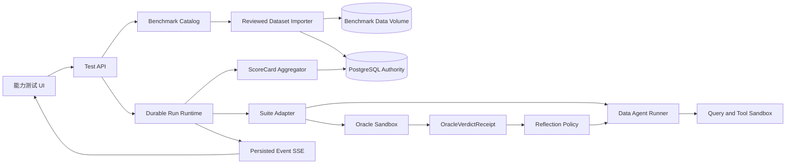

# 能力测试模块技术设计

## Design Goal

在不重做现有 Runtime 和 Eval 合同的前提下，把公开题库接成真实、可重放、可下钻的测试产品，并用外部 Oracle 驱动一次有界反省。题库数据、Agent 执行、Oracle 判分、反省和成绩汇总必须拥有不同的权威边界。

## Architecture



## Boundaries

### Benchmark Catalog

拥有题库身份、版本、来源、许可证、摘要、能力标签、数据状态和 Adapter 能力声明。它不拥有 Agent 答案或成绩。

### Dataset Importer

负责下载、摘要校验、许可证检查、安全解包、目录清单和数据卷安装。它不执行题库脚本，也不自动启用题库。

### Suite Adapter

把外部 Case 转为本项目 `EvalCase`，准备只读运行环境，并调用该 Suite 的 Oracle。不同 Suite 保留不同真值，不能共用一个宽松总分。

### Durable Eval Runtime

复用现有 Queue、Lease、Fence、Checkpoint、Cancel 和 SSE 机制。单题是一个 Case Run；批量运行是冻结 Manifest 的 Parent Run，包含 N 个独立 Child Case Run。

### Oracle Sandbox

执行结果等价、测试用例或规则指标。Oracle 运行环境与 Agent 工具环境隔离，防止 Agent 读取标准答案，也防止第三方验证器修改工作区。

### Reflection Policy

只消费已提交的失败 Verdict 和允许公开的最小反馈，签发 `ReflectionReceipt` 并决定是否允许新 Attempt。它不能改变标准答案、题目版本、数据快照或评分器。

## Penguin Harness 参考映射

本设计参考本地 `penguin-harness` 提交 `047505dccc0cc16ad92be11011347d635f33ceb0`，但只吸收可验证的边界，不引入运行时依赖。

| Penguin 模式 | Data Agent 落地 | 调整原因 |
| --- | --- | --- |
| 一个 Evaluator 请求只执行一个 Case/Run | `EvalCaseRun`/Child Run 作为最小可重放单元；单题是 1 个 Cell，批量展开为 Case × Repeat Cells | 隔离失败、并发和重跑，不让一个 Worker 同时拥有整批隐式状态 |
| `statement/` 与私有 `rubric/` 分离，只把题面复制到独立 Workspace | `PublicCaseBundle` 与 `SealedOracleBundle` 使用不同 Artifact ACL；Agent Sandbox 只挂载前者 | 防止 Gold、Rubric、隐藏测试进入模型上下文 |
| 请求固定 `expected_version`、Provider、Model，完成后核验未变化 | Manifest 固定 Dataset、Agent、Model、Prompt、Workflow、Oracle、Seed、Budget；开始和封存时双重校验 | 让比较具有归因基础，避免并发配置漂移 |
| 错答是有效评分，启动/Trace/评分故障是 Evaluation Failure | `AGENT_FAIL`、`INVALID_CASE`、`INFRA_FAILURE`、`ORACLE_FAILURE` 分开 | 不把系统故障计为 Agent 能力错误，也不因错答重跑原 Attempt |
| 每个 Run 记录 `session_id`，成绩可下钻 Trace | Attempt 绑定耐久 Run ID、Artifact/Receipt 和持久化事件流 | 支持证据审计、刷新恢复和问题定位 |
| `scoreboard.yaml` 保存 Evaluation/Case/Run 聚合 | PostgreSQL 保存不可变原子 Receipt，版本化 Aggregator 生成可重建 ScoreCard | 避免信任模型写入或客户端提供的聚合值 |
| 优化 Candidate 严格涨分才接受，否则回滚 Agent State | MVP 不自动改 Agent State；未来跨题优化使用版本快照、Tuning 选择、Holdout 验收、人工发布 | 避免同题过拟合和单个错题污染长期行为 |

### 明确不复制的现状

- Penguin 当前 Benchmark Server/Web 是只读展示，没有单题/批量启动、取消和实时评测写 API；Data Agent 必须接入既有 Durable Run Runtime。
- Penguin 项目成员可在 Evaluation Center 打开 Rubric；Data Agent 的普通研发用户可以查看 Demo/Tuning Rubric，但 Holdout Rubric/Gold 默认连 UI/API 都不可读，只提供裁剪后的 Verdict。
- Penguin UI 信任 Scoreboard 已写入的 Case/Evaluation 平均值；Data Agent 的 Aggregator 必须从原子 Run/Attempt Receipt 重算并校验 Manifest 覆盖率。
- Penguin 优化流程允许使用同一冻结 Benchmark 的公开题面、分数和 Trace 反复改 Agent；Data Agent 必须把“题内纠错”和“跨题能力优化”拆成两个治理级别。

## Core Data Model

### Reuse

- `EvalCase`：单个标准化题目。
- `EvalRun`：单题的一次冻结评测运行。
- `OracleVerdictReceipt`：确定性/诊断 Verdict。
- `ScoreCard`：单题或批次的聚合结果。
- `BenchmarkManifest`：绑定数据、版本、预算和 Demo/Tuning/Holdout 身份。

### Add

- `BenchmarkCatalogEntry`：题库展示元数据与可运行状态。
- `BenchmarkDatasetSnapshot`：来源、版本、文件清单、总大小、摘要、许可证和安装状态。
- `EvalBatchRun`：批次身份、选择器展开后的 Case 列表和进度计数。
- `EvalCaseRun`：一个 Case × Repeat 的最小耐久执行单元，绑定唯一 Run/Trace；批量父 Run 只编排，不直接作答或判分。
- `EvalAttempt`：Attempt 0 为首答，Attempt 1 为反省后重试；分别绑定答案和执行证据。
- `ReflectionReceipt`：失败分类、证据引用、可修改边界、行动摘要和是否批准重试。
- `BenchmarkImportReceipt`：下载与安装的审计结果。

## Run State Model

```text
BATCH_QUEUED
  -> BATCH_RUNNING
     -> CASE_QUEUED
     -> ATTEMPT_RUNNING
     -> ANSWER_SEALED
     -> ORACLE_RUNNING
        -> PASS
        -> INFRA_FAILURE
        -> INVALID_CASE
        -> FAIL
           -> REFLECTION_RUNNING
           -> RETRY_APPROVED | RETRY_REJECTED
           -> ATTEMPT_RUNNING (max one MVP retry)
  -> BATCH_COMPLETED | BATCH_CANCELLED | BATCH_FAILED
```

基础设施故障不触发反省。只有可归因于 Agent 输出的 `FAIL` 才能进入 Reflection。

## Verifier-Guided Reflection

### Feedback Envelope

反省步骤可见：

- 题目和原始允许上下文；
- 自己的密封答案、SQL 和工具结果；
- 失败 Gate/Oracle 的类型化错误；
- 执行错误、结果形状差异或违反的不变量；
- 允许修改的范围和剩余预算。

反省步骤不可见：

- Holdout Gold SQL/Gold Answer；
- 不必要的完整 Ground Truth；
- 其他题目的隐藏验证器；
- 私有评审备注或未来题目。

### Reflection Output

```text
failure_type
evidence_refs[]
diagnosis_summary
preserved_invariants[]
proposed_actions[]
confidence
retry_recommendation
```

这是可审计行动摘要，不要求或存储私有 Chain-of-Thought。

### Scoring

Attempt 0 永远决定 First-pass 指标。Attempt 1 只影响 Post-reflection、Recovery、False-fix、成本和时延指标。不能用第二次通过回写第一次为 PASS。

每个 `EvalCaseRun` 借鉴 Penguin 保存 `score(0..100)`、`cost`、`duration_ms` 和 Run/Trace 引用，但计分权威不同：Adapter 先签发 Suite 原生 Metric/Verdict Receipt，版本化 Aggregator 再确定性映射到展示分。确定性 SQL 题通常为 PASS=100、FAIL=0；允许部分分的题必须在 Suite Manifest 中声明固定 Rubric 与权重。基础设施失败、无效题目和 Oracle 故障不写 0 分，而是从能力分母排除并单独报告覆盖率。

重复运行时先在同一 Case 内聚合，再在同一 Suite 内按冻结权重聚合。不同 Suite 不直接混成一个总分；总览同时展示各 Suite 原生指标、宏平均、有效样本数和覆盖率。所有聚合都可由原子 Receipt 重建，模型生成的评价文字只能作为诊断说明。

## Suite-specific Oracle

### BIRD Mini-Dev

- Agent 输出 PostgreSQL 或 SQLite SQL。
- 在冻结数据库上执行 Candidate 和 Gold SQL。
- 对结果做列/行规范化、NULL 和数值容差处理。
- 正确性与效率分开；执行通过不能覆盖 Policy/Resource Gate 失败。

### Dr.Spider

- 原题与扰动题使用稳定 Pair ID。
- 报告原题正确率、扰动题正确率、绝对下降和不同 perturbation family 的恢复率。
- 反省只收到当前 Case 的失败类型，不能读取 Pair 的 Gold SQL。

### InsightBench

- 确定性层：输出结构、引用存在性、可执行分析证据、ROUGE/关键词或 planted insight 匹配。
- 诊断层：版本化 LLM Judge 评价报告质量。
- 成绩单同时展示规则指标与 Judge 指标；正式 PASS 需满足不可补偿的确定性最低门槛。

### BIRD-Critic

- Candidate 修复 SQL 在题目专属测试用例中执行。
- SELECT、DBA 操作和性能问题分别使用 Soft EX/Parsing、Test Case、QEP。
- Gold/Test Case 获取流程和访问边界必须写入 Snapshot Manifest。

### DAB

- 将每题 `query.json`、数据源描述、Ground Truth 和 `validate.py` 映射到标准 Case。
- `validate.py` 在 Oracle Sandbox 运行，不直接在 Worker/宿主机执行。
- 许可证未确认时保持 `LICENSE_BLOCKED`，即使数据 URL 可访问也不得安装。

## UI Information Architecture

### `/tests` 题库列表

- 顶部：最近总成绩、First-pass 与 Reflection Recovery 趋势。
- 题库卡：名称、能力类型、题量、许可证、数据版本、下载状态、最近成绩和“进入题库”。
- 下载动作是显式管理操作，展示大小、来源和许可证，不在首次访问时静默下载。

### `/tests/[suiteId]` 题目列表

- 筛选：难度、数据库、能力标签、Demo/Tuning/Holdout、未做/通过/失败。
- 表格：题号、标题/摘要、难度、环境、最近首答结果、反省结果、成本。
- 操作：打开单题、勾选批量、全选当前筛选结果。

### `/tests/[suiteId]/cases/[caseId]` 单题页

- 题目和允许公开的数据/Schema 摘要。
- 运行配置：模型 Profile、是否启用反省、预算、Seed。
- 结果：Attempt 时间线、答案、SQL/工具回执、Oracle Verdict 和结构化反省。
- 材料区借鉴 Penguin 的 Case Browser，可预览题面、Schema、CSV/JSON/SQL/图片/PDF 等允许材料；Rubric/Gold 根据 Split 和角色独立授权，Holdout 永不返回原文。

### `/tests/runs/[runId]` 批量运行页

- 总进度、排队/运行/通过/失败/基础设施错误数。
- 通过持久化 SSE 增量更新；刷新后从 `Last-Event-ID` 或投影版本恢复。
- 支持取消未开始 Case；已完成结果保留。

### `/tests/scorecards/[scorecardId]` 成绩单

- KPI：First-pass、Post-reflection、Recovery、False-fix、Cost/Verified Pass、P50/P95。
- 切片：题库、难度、数据库、失败分类、模型/Prompt 版本。
- 错题表可下钻到 Attempt、Verdict、Reflection 和执行证据。
- 借鉴 Penguin 的 Evaluation -> Case -> Run 渐进展开和 Session Trace 深链；同时增加 First-pass/Reflection 双口径、失败类型和数据切片，不能只显示单一 Score 曲线。

## API Shape

建议资源边界：

- `GET /api/tests/suites`
- `POST /api/tests/suites/:suiteId/install`
- `GET /api/tests/suites/:suiteId/cases`
- `GET /api/tests/suites/:suiteId/cases/:caseId`
- `POST /api/tests/runs`，接受一个或多个 Case ID；单题与批量统一。
- `GET /api/tests/runs/:runId`
- `GET /api/tests/runs/:runId/events`
- `POST /api/tests/runs/:runId/cancel`
- `GET /api/tests/scorecards/:scorecardId`

所有写请求需要 Idempotency Key；响应使用运行时 Schema 解析并返回类型化错误。

## Security and Integrity

- 下载域名允许列表、TLS、版本固定、SHA-256、最大字节数和安全解包。
- 题库数据卷只读挂载；Agent Sandbox 与 Oracle Sandbox 不共享可写目录。
- Validator 默认无网络，使用临时工作目录，超时后销毁。
- Dataset、Schema、Model、Prompt、Workflow、Evaluator、Seed 和 Budget 全部进入 Run Manifest。
- Gold/Validator 引用使用独立访问角色；前端和 Agent Tool Registry 永远拿不到原始密钥或 Holdout 路径。
- 即使是项目成员，Holdout Rubric/Gold API 也默认拒绝；只有受审计的 Benchmark 管理角色可在专用流程中访问，访问事件必须记录。
- 题库更新或摘要漂移时失败关闭，不复用旧 ScoreCard。
- Aggregator 只消费已封存且摘要匹配的 Attempt/Verdict Receipt，拒绝模型、Worker 或客户端提交的 Batch/ScoreCard 聚合值。

## Compatibility and Migration

- 在现有 `packages/evals` 上逐步替换占位 Adapter，不另建重复评测服务。
- 扩展现有 Benchmark Suite Schema 时需同步 Oracle discriminated union、Lane 映射、序列化和测试。
- 现有 `EvalSection` 继续用于工作台单次分析的评测摘要；新 `/tests` 是完整题库与成绩产品，两者共享后端 ScoreCard，不共享临时 UI Store。
- 现有侧栏相关文件存在未提交工作，实施时必须基于当时 HEAD 合并，不覆盖用户修改。

## Rollout

1. Catalog + 安全安装 + BIRD Mini-Dev 10 题技术 Spike。
2. 单题 UI + 真实 Oracle + 成绩单最小闭环。
3. 批量运行 + SSE 恢复 + 30–50 题 Smoke Slice。
4. 一次 Verifier-guided Reflection + Baseline/Candidate 成对成绩。
5. Dr.Spider、InsightBench。
6. BIRD-Critic；DAB 许可证 Gate 通过后再接。

### 2026-08-10 扩展执行顺序

1. 环境系统模型：根 `.env` 加载、DeepSeek/Kimi 稳定 Profile、API 脱敏与不可变 UI。
2. 模型做题：开发环境首次显式运行时执行真实 Provider 探测；生产继续要求 PostgreSQL
   `ModelCertificationReceipt`。优先使用具备官方 USD Context/价格证据的 DeepSeek 系统默认模型。
3. SQL 路线：Dr.Spider Pair/扰动切片，然后 BIRD-Critic Test Case/修复切片。
4. 分析路线：BLADE 决策 JSON，再接 DAB 的合法本地切片。
5. L3/文件路线：DataSciBench、ScienceAgentBench、SpreadsheetBench 2；各自使用无网络、只读输入、
   临时输出和资源上限的 Validator Sandbox，不复用 SQL Oracle。
6. 优化路线：冻结 Baseline -> 仅使用 Tuning 错误生成 Candidate -> 同一 Tuning 复测 -> 完全独立
   Holdout 验收。Candidate 只有在每个有效题库 Holdout 达到 80% 且 Regression 未恶化时才进入人工接受。

### 环境模型初始化合同

```text
Repository .env
  DeepSeekAPIKey -> deepseek / code-frozen model id / system Profile
  KimiAPIKey     -> kimi / code-frozen model id / system Profile

GET /api/models
  -> id, name, provider, modelName, baseUrl, apiKeyMasked,
     active, connected, isSystemDefault, createdAt, updatedAt
```

- 环境变量别名只在服务端规范化到 Provider Binding 的 `DEEPSEEK_API_KEY`/`MOONSHOT_API_KEY`；
  浏览器、数据库、回执和错误正文均不得包含 Secret。
- Profile ID 使用现有 Provider Binding 的稳定 UUID，不以 Key Hash 或启动时间生成。
- 同时存在两个 Key 时 DeepSeek 为 Test Center 的初始 active Profile；可通过服务端
  `TEST_CENTER_MODEL_PROVIDER` 覆盖，但客户端不能提交任意 Provider/URL/Key。
- Kimi/DeepSeek 模型 ID 必须先由对应 `/models` 只读端点或真实 Smoke 验证存在；变更模型 ID 会
  改变 Profile Hash 和历史可比性。

### 80% 优化门禁

- 优化输入：Tuning Case 的公开材料、Agent 答案、类型化 Oracle 反馈、成本/延迟和允许公开的 Trace 摘要。
- 禁止输入：Holdout Gold、隐藏 Validator 源码、其他题目的密封材料、私有 Chain-of-Thought。
- 可修改对象：版本化 Prompt、Planner/Tool Policy、结果校验/修复策略；不直接改模型权重或 Oracle。
- 每次 Candidate 都生成新 `agent_version`/`prompt_version`，Baseline 成绩不可覆盖。
- 验收按题库分别计算 `valid_cases >= 5`、`post_reflection_pass_rate >= 0.80`；并列展示宏平均与覆盖率，
  但任一题库低于门槛时整体仍为 `HOLD`。

每一步都可独立关闭；任何阶段缺少真实 Verdict 时保持 `HOLD`，不能用占位对象表示成功。

## 2026-08-10 Implemented Suite Matrix

| Suite | Source/Gate | Installed Adapter | Oracle | Current proof |
| --- | --- | --- | --- | --- |
| BIRD Mini-Dev | CC-BY-SA-4.0, fixed zip SHA-256 | SQLite 10-case slice | result equivalence | 10-case 80% |
| Dr.Spider | CC-BY-4.0, fixed 168 MB archive | two-database 10-case slice, install-time Gold execution | SQLite result equivalence with legacy DQS compatibility | independent Holdout below target, `HOLD` |
| InsightBench | CC-BY-4.0, fixed HF files | 5-case CSV/report slice | frozen lexical grounding metrics | 5-case 80% first-pass, 100% final |
| BIRD-Critic | public CC-BY-SA-4.0 SQLite statements; hidden test cases require application | no formal scoring install | gated test cases | `ACCESS_GATED` |
| DAB | repository has tasks but no closable top-level redistribution license | none | untrusted external validator | `LICENSE_BLOCKED` |
| BLADE | Apache-2.0 code, ODC-By-1.0 data, fixed archive | 10 datasets × 1 MCQ | exact sealed choice | independent 5-case Holdout 80% |
| DataSciBench | CC-BY-4.0 HF dataset with automatic approval | none | external artifact validator | `ACCESS_GATED` |
| ScienceAgentBench | public annotations; complete artifacts/manual exceptions | none | container artifact grading | `ACCESS_GATED` |
| SpreadsheetBench 2 | MIT HF data with fixed URL/bytes/SHA-256 | source connector only | workbook/checklist sandbox pending | `NOT_DOWNLOADED`, not runnable |

### Added answer/oracle boundary

- `MULTIPLE_CHOICE` is a first-class public capability and answer type; BLADE correct choices use a dedicated
  server-only sealed schema.
- Exact-choice reflection reveals only that the prior choice was wrong. It never serializes the correct choice into
  the public Case API, Oracle feedback, model prompt, or Reflection Receipt.
- SQL Oracle and Dr.Spider install-time validation use the same Node SQLite compatibility options so installation
  cannot pass with a different SQL dialect from runtime scoring.
- SQL Reflection 的 Provider Response 允许有限长度超限以兼容 OpenAI-compatible 端点，但在生成
  权威 Reflection Receipt 前强制压缩为至多 600 字诊断和 4 条、每条 240 字动作；原始冗长推理不写入回执。
- Dataset status is source- and license-aware. A reachable URL alone cannot produce `READY`; runnable remains
  equivalent to a verified Import Receipt and registered Adapter.
