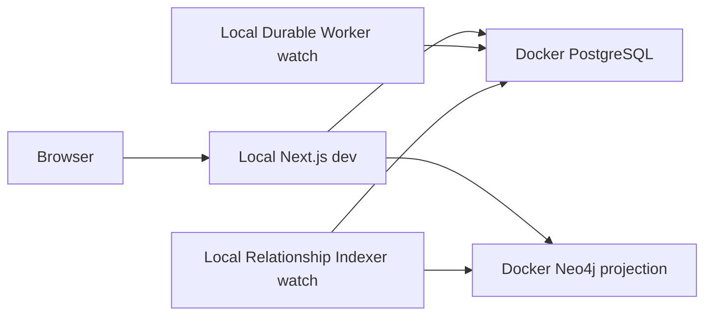
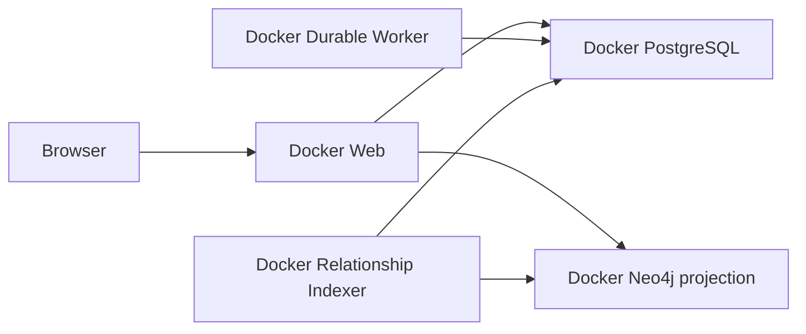

# 本地开发与 Docker 部署双模式 — 技术设计

## 1. 设计目标

用同一份业务代码支持两种明确拓扑：开发时数据库容器化、应用进程本地化；部署时全部
服务容器化。运行入口只实现一次，开发 watch 与 Docker CMD 只负责选择执行方式，避免
“本地能跑、镜像不跑”或“镜像遮蔽本地改动”。

## 2. 运行拓扑

### 2.1 开发模式

- Docker 只运行 `postgres` 与 `neo4j`。
- `web` 使用 Next.js/Turbopack；`worker` 与 `relationship-indexer` 使用 `tsx watch`。
- 本地进程使用宿主机地址：PostgreSQL `127.0.0.1:5432`、Neo4j
  `127.0.0.1:7687`。
- Web 不以 Neo4j 健康作为启动门；Neo4j/Indexer 故障时关系搜索回退 PostgreSQL。

### 2.2 部署模式

- `compose.yaml` 中数据库服务不带 profile；`web`、`worker`、
  `relationship-indexer` 使用 `deploy` profile；`migration` 保持一次性 `migrate`
  profile。
- 开发基础设施命令显式选择两个数据库服务；部署命令显式启用 `deploy` profile。
- 容器进程使用 Compose DNS：`postgres:5432` 与 `neo4j:7687`。

## 3. 命令契约

| 命令 | 行为 | 数据库写入 |
| --- | --- | --- |
| `pnpm dev:infra` | 启动并等待 PostgreSQL、Neo4j 健康 | 否 |
| `pnpm dev:migrate` | 显式运行一次性迁移并验证 Ledger | 是，显式 |
| `pnpm dev:check` | 检查端口、数据库健康、Ledger 和必要 Authority 映射 | 否 |
| `pnpm dev:web` | 只运行本地 Web watch | 仅业务请求 |
| `pnpm dev:worker` | 只运行本地 Durable Worker watch | 是，消费队列 |
| `pnpm dev:indexer` | 只运行本地 Relationship Indexer watch | 是，索引任务/Neo4j 投影 |
| `pnpm dev:apps` | 并行运行三个本地应用进程 | 同上 |
| `pnpm dev` | `dev:infra` + `dev:check` + `dev:apps` | 不自动迁移 |
| `pnpm docker:migrate` | 部署前显式运行迁移并验证 Ledger | 是，显式 |
| `pnpm docker:up` | 构建并启动 `deploy` 完整容器栈，等待健康 | 运行期写入 |
| `pnpm docker:down` | 停止完整容器栈但保留数据卷 | 否 |

`pnpm dev` 遇到缺失迁移时必须停止并打印 `pnpm dev:migrate`，不得尝试重放 SQL。

## 4. 本地进程监督与环境

新增根级开发监督脚本，职责限定为：

1. 使用 Node 24 的环境文件加载能力读取根目录 `.env.local` 与 `.env`；调用者显式注入的
   环境变量优先。
2. 将现有 `DeepSeekAPIKey`、`KimiAPIKey` 兼容别名提升为标准变量，但不输出值。
3. 注入可提交的本地非秘密默认值，例如 Authority UUID、端口、Feature Flag 与本地 DSN。
4. 以继承终端的方式启动选定子进程，给日志添加进程名前缀或保持清晰的结构化来源字段。
5. 转发 `SIGINT`/`SIGTERM`；任一非预期子进程退出时终止其余子进程并返回非零状态。

不新增明文 Secret 示例。文档只列变量名；现有 `.env` 与 `.env.local` 继续被 Git 忽略。

## 5. Durable Worker 可执行入口

新增真正的 Worker daemon 组合入口，而不是让 `dist/index.js` 承担副作用：

1. 严格解析 `DATABASE_URL`、Deployment/Tenant/Principal、Worker ID、轮询间隔、Lease、
   Heartbeat、执行超时与健康端口。
2. 创建 PostgreSQL Pool、Capability Authority，并解析固定的 Server Context。
3. 组合 `createPostgresRunQueue`、`createPostgresRunEventStore`、
   `createPostgresResearchAuthority`、`createResearchWorkflowExecutor` 与
   `createRunWorkerRunner`。
4. 修正 Research Executor 的 Authority Capability 注入，使其使用服务端解析的固定
   Capability，而不是构造空 Capability 占位。
5. 循环调用 `runOnce`：`IDLE` 时按配置退避，有工作时立即继续；每次周期记录不含 Secret
   的结构化结果。
6. 提供 `/live`：只有环境、数据库连接、Authority 和 Runner 完成初始化后返回 200；暴露
   `initialized`、`last_cycle_at` 与最近周期类型，不暴露任务正文或凭据。
7. 收到终止信号后停止领取新任务，关闭 HTTP Server 与 Pool；已领取任务依赖已有
   Lease/Fence 规则安全接管。

开发使用 `tsx watch` 执行该入口；Dockerfile 构建后执行同一入口的 `dist` 文件。

## 6. Relationship Indexer

- 保留现有 `relationship-indexer-cli.ts` 的 `claim -> snapshot -> manifest -> Neo4j stage ->
  verify/seal -> PostgreSQL commit` 流程。
- 本地监督脚本注入宿主机 DSN；部署 Compose 注入服务名 DSN。
- `/live` 继续使用 9090；本地 Worker 使用独立健康端口，避免冲突。
- Indexer 未 Ready、Authority 不匹配或 Neo4j 不可用时，只记录稳定 Reason Code；Web 使用
  PostgreSQL fallback。

## 7. Compose 与迁移

- 更新 `compose.yaml` 顶部说明，移除“本地开发也启动 Web/Worker”的歧义。
- PostgreSQL 与 Neo4j 是默认基础设施；应用服务归入 `deploy` profile。
- 为 Worker 补充 Authority、Runtime、健康端口配置与健康检查。
- `docker:up` 不替代 `docker:migrate`；部署 Runbook 明确先迁移后启动/切换应用。
- `dev:check`/迁移后检查从迁移文件名构建预期 Ledger 集合，并通过容器内 `psql` 对比；
  文件名必须先通过固定正则，避免把路径拼接成 SQL。
- 不执行 `down -v`，除非用户明确选择删除数据；普通停止保留 `pgdata`、`neo4jdata` 与
  `neo4jlogs`。

## 8. 兼容性与回滚

- API、数据库 Schema、语义 Wire Contract 与前端路由不变。
- 旧 `docker compose up` 的含义从“数据库 + 部分应用”收敛为“数据库基础设施”；完整部署
  必须使用仓库记录的 `pnpm docker:up`/`deploy` profile。
- 回滚开发编排只需恢复旧脚本/profile；数据卷不受影响。
- Worker 入口若验证失败，部署必须保持失败关闭，不得恢复为立即退出 0 的假健康容器。

## 9. 验证策略

- 单元：环境解析、命令选择、信号转发、子进程失败传播、Worker IDLE/工作周期与健康状态。
- Worker Integration：真实 PostgreSQL 下领取 Run、Heartbeat、终态、重启后更高 Fence 接管。
- Indexer Integration：真实 PostgreSQL + Neo4j 下 `/live`、`IDLE/INDEXED`、停止后的
  PostgreSQL fallback。
- Compose Contract：默认服务只有 PostgreSQL/Neo4j；`deploy` profile 包含五个长期服务；
  Worker CMD 与健康检查指向真实 daemon。
- 手工/物理 Smoke：开发模式修改 Web、Worker、Indexer 文件分别观察热更新；部署模式从
  构建产物启动并逐服务验证。
