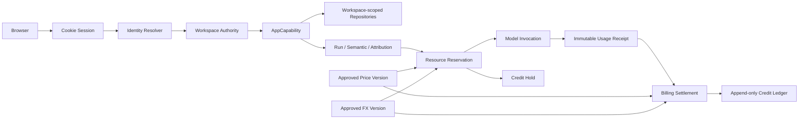

# 工作空间隔离、权限与模型计费技术设计

## 1. 设计目标

本设计在不削弱现有 `AppCapability`、Run、Semantic 和 Research Invocation 权威边界的
前提下，增加全局身份、工作空间产品模型、持久化业务数据、模型价格、人民币汇率和
用户积分账务。核心原则如下：

1. `workspace_id` 是产品概念，底层与现有 `tenant_id` 一一对应，不增加第二级项目容器。
2. 浏览器会话只证明“是谁”；每次业务事务仍从数据库重新证明“能否在这个工作空间做
   这件事”。
3. PostgreSQL 是成员、工作空间、调用用量、价格版本、冻结额和积分账本的唯一权威；
   Redis 和进程内状态只能做可丢弃投影。
4. 模型调用事实复用现有 Research Reservation/Invocation/Outcome Usage，不建立第二套
   调用终态；账务以不可变 usage receipt 为结算输入。
5. 金额与积分不使用浮点数。冻结向上取整，结算按统一精度规则计算并保留可重算快照。

## 2. 总体架构



请求边界固定为：

```text
verified session principal
  -> server-resolved workspace route
  -> active user + active workspace + effective membership revalidation
  -> AppCapability
  -> repository/port transaction with explicit app_id + tenant_id + environment
```

客户端提交的 `principal_id`、角色、余额、单价或汇率都只作为候选输入，不能成为权威。

## 3. 身份、用户和会话

### 3.1 认证适配器

首选 Better Auth PostgreSQL 适配器，启用 email/password 和 Admin 能力，关闭公开注册与
管理员模拟登录。认证表放在独立私有 schema，由审查过的 SQL migration 管理，生产启动
不自动迁移。

认证组件负责：密码散列、登录、HttpOnly/Secure/SameSite Cookie、会话过期、密码重置、
账号封禁和会话撤销。Data Agent 负责：`principal_id`、账号状态、全局系统角色、权限
epoch、工作空间成员和业务审计。

`app_users` 至少包含：

| 字段 | 说明 |
| --- | --- |
| `app_id + environment + principal_id` | 稳定业务身份 |
| `auth_user_id` | 认证库用户外键，唯一 |
| `system_role` | `SUPER_ADMIN` 或 `USER` |
| `status` | `ACTIVE / DISABLED` |
| `authz_epoch` | 停用、系统角色变化时单调递增 |
| `created_by / created_at / disabled_at` | 管理审计字段 |

超级管理员创建用户时生成一次性随机初始密码或一次性设置链接，并要求首次登录修改。
停用、重置密码或系统角色变化必须撤销已有会话；会话撤销失败保留 operation receipt 并
重试，同时业务 authority 已通过 `status/authz_epoch` 立即失败关闭。

### 3.2 工作空间与成员

`workspaces.workspace_id` 与底层 `tenant_id` 使用同一个 UUID。工作空间生命周期为
`ACTIVE / ARCHIVED`；归档拒绝新写入、新运行和外部模型调用，历史只读与超级管理员审计
仍可用。

现有 `memberships` 继续作为 capability 的兼容权威，角色映射：

| 产品角色 | 底层 capability |
| --- | --- |
| `WORKSPACE_ADMIN` | `OWNER` / `owner` |
| `ANALYST` | `ANALYST` / `analyst` |
| `VIEWER` | `VIEWER` / `viewer` |

超级管理员访问工作空间时也必须经过数据库 authority。为兼容现有 Run 外键和事务重验，
成员记录增加“显式分配角色”和“系统角色覆盖”语义：提升为超级管理员时保留原显式角色并
把有效角色提升为 owner；降级时恢复原显式角色，没有显式成员资格则撤销。工作空间创建、
系统角色变更和成员更新都通过单一数据库命令维护，不能由 UI 拼接多次写入。

Authority 事务除现有 membership version 和 app epoch 外，还要验证：用户 `ACTIVE`、
`authz_epoch`、工作空间 `ACTIVE`（写操作）、工作空间 lifecycle version。任一版本变化都
使旧 capability 失效。

### 3.3 权限矩阵

| 操作 | SUPER_ADMIN | WORKSPACE_ADMIN | ANALYST | VIEWER |
| --- | --- | --- | --- | --- |
| 创建/归档/恢复工作空间 | 允许 | 拒绝 | 拒绝 | 拒绝 |
| 创建/停用/重置用户 | 允许 | 拒绝 | 拒绝 | 拒绝 |
| 管理当前空间已有用户的成员角色 | 允许 | 允许 | 拒绝 | 拒绝 |
| 管理数据源与凭证引用 | 允许 | 允许 | 拒绝 | 拒绝 |
| 编辑语义候选 | 允许 | 允许 | 允许 | 拒绝 |
| 审核/发布语义 | 允许 | 允许 | 按现有治理规则 | 拒绝 |
| 创建对话或归因运行 | 允许 | 允许 | 允许 | 拒绝 |
| 查看工作空间结果 | 允许 | 允许 | 允许 | 允许 |
| 管理模型、价格、汇率 | 允许 | 拒绝 | 拒绝 | 拒绝 |
| 调整积分/处理账务复核 | 允许 | 拒绝 | 拒绝 | 拒绝 |

工作空间管理员只能选择已存在且状态正常的用户，不能创建账号、授予 `SUPER_ADMIN`，也
不能修改其他工作空间的成员关系。

## 4. 工作空间数据隔离

### 4.1 持久化对象

把当前 Web 进程内 Map 迁移到 PostgreSQL repository：

- `datasource_connections`、schema scan/snapshot：强制完整 AppScope 和 workspace FK；
  只保存 `SecretRef`，不保存明文凭证。
- `qa_conversations`、`qa_messages`：强制 workspace、owner principal 和单一
  `datasource_id`；消息只属于同一会话。
- attribution/run/result：沿用现有 scope，并增加或校验 `datasource_id` 与工作空间的
  复合外键。
- semantic candidate/release/domain/object/relationship：沿用现有 `tenant_id` 作用域，
  Web runtime 不再读取固定 tenant/principal 环境变量。

所有业务查询显式包含 `app_id + tenant_id + environment`；对象 ID 查询也必须带完整
scope，越权请求统一返回无权限/不存在，不暴露目标是否真实存在。

### 4.2 路由和 DTO

受保护页面采用 `/workspaces/:workspaceId/...`，API 采用
`/api/workspaces/:workspaceId/...`。服务端只从受保护路由解析工作空间，再验证成员关系。
DTO 与 Zod decoder 统一放在 `@data-agent/contracts`，组件不读取原始 JSON。

登录后的默认入口为工作空间选择器；只有一个工作空间时可以自动进入，但仍显示可切换的
工作空间控件。归档空间不出现在普通用户默认列表。

## 5. 模型目录、价格与汇率

### 5.1 模型控制面

模型配置、Provider SecretRef 和可用状态是全局 Data Agent 控制面，只允许超级管理员
变更。现有 workspace-scoped `ModelProfile` 运行契约继续用于 invocation 授权，但其
模型身份与价格引用由全局已批准目录解析，不由工作空间用户自行提交。

建议表：

- `model_catalog_entries`：provider、model id、能力、状态、配置版本、SecretRef。
- `model_price_candidates`：抓取证据、解析器版本、标准化内容、diff、审核状态。
- `model_price_versions`：不可变已批准版本、生效区间、证据引用。
- `model_price_components`：input/output/cache/tool/tier 等维度和适用条件。
- `fx_rate_candidates`、`fx_rate_versions`：官方汇率候选和不可变生效版本。

同一 provider/model/price component 的生效区间不得重叠。激活新版本在单一事务内关闭旧
版本、激活新版本、提升 pricing epoch 并追加 audit。

### 5.2 同步流程

每个 Provider 实现版本化 `PriceSourceAdapter`，输出严格的候选 schema。Worker 定时
抓取官方来源，保存受限大小的原始证据或内容寻址对象、SHA-256、HTTP 元数据、解析器
版本和结构化结果。解析器必须有冻结 fixture；不能用 LLM 抽取结果直接成为价格权威。

```text
FETCHED -> PARSED -> PENDING_REVIEW -> APPROVED | REJECTED | SUPERSEDED
```

内容未变化时按来源哈希幂等；发现模型缺失、异常降为零、币种变化或无法识别的新维度时
标为高风险 diff。抓取失败只告警，不修改 active version。汇率使用相同候选流程。

## 6. 积分与账务

### 6.1 精度和账户

定义 `1 credit = 1,000,000 microcredits`，因此 `1 CNY = 100,000,000 microcredits`。
数据库金额计算使用 `numeric` 或整数最小单位，TypeScript 边界使用 decimal string 和
`bigint`，禁止 `number` 累计。

`credit_accounts` 是带版本的快速余额投影，真实变动来自不可更新、不可删除的
`credit_ledger_entries`。预约冻结由 `credit_holds` 和 append-only hold events 表示，
不会伪装成已经发生的消费。

| 记录 | 关键内容 |
| --- | --- |
| `credit_accounts` | user、settled balance、active held、version |
| `credit_ledger_entries` | `GRANT / ADJUSTMENT / CHARGE / REVERSAL`、signed amount、actor、reason、idempotency |
| `credit_holds` | invocation、reserved amount、state、expiry/review metadata |
| `model_bills` | user、workspace、run/conversation、invocation、funding type、价格/汇率快照、实际 usage、CNY 和积分 |
| `billing_operations` | reserve/settle/release/review 的输入哈希、结果和幂等键 |

账户为全局用户维度，因此这是 app-level 控制面数据，不伪造“系统工作空间”。实施前需要
在数据库规范中明确 app-global 私有对象例外：键至少包含
`app_id + environment + principal_id`；所有 workspace 账单仍包含 `tenant_id`。

### 6.2 冻结与结算

普通用户调用：

```text
1. 解析 active model + price version + FX version
2. 根据最大输入/输出预算及全部可能计价维度计算保守上限
3. 锁定 credit_account，检查 available = settled - active_holds
4. 原子创建 billing reservation + credit hold + audit/outbox
5. 启动现有 Research Resource Reservation / Model Invocation
6. 读取不可变 actual usage receipt
7. 使用冻结价格和 FX 快照计算实际费用
8. 原子写 CHARGE、结算 bill、关闭 hold、更新账户投影
```

预约采用向上取整；结算按固定 microcredit 精度四舍五入并在账单记录舍入差值。任何一次
结算都保存原币金额、汇率分子/精度、人民币成本、积分值和公式版本，可离线重算。

若 actual 超过冻结上限、usage 维度未知、供应商结果不确定或价格快照损坏，状态进入
`REVIEW_REQUIRED` 并保留冻结额，不允许自动产生负余额。超级管理员通过显式复核命令
选择补充积分后结算、按可验证费用结算或释放；处理结果必须有原因和审计。

超级管理员调用使用相同账单和 usage 路径，但 `funding_type=SYSTEM_FUNDED`，不创建用户
积分扣款；仍计算原币和人民币实际成本。

### 6.3 一致性和恢复

- 账户更新使用行锁和 expected version；同用户并发预约串行检查可用额。
- `(app, environment, invocation_id)` 在账单中唯一。
- 每个 operation 使用 principal-scoped idempotency key + canonical input hash；同键异载荷
  冲突。
- PostgreSQL 数据库时间决定 hold expiry；已开始但结果不确定的调用不得自动释放。
- 对账任务比较 invocation terminal、usage receipt、bill、hold 与 ledger；差异进入
  review queue，不在后台静默修正。

## 7. 语义 JSON 导入导出

导出格式使用严格、版本化 schema，例如 `semantic-workspace-export@1.0.0`，包含：当前已
发布 release 的规范化内容、schema version、导出时间、数据源逻辑引用、兼容性元数据和
内容哈希。不包含 workspace id、成员、审批人身份、SecretRef locator 或连接凭证。

导入采用持久化状态机：

```text
UPLOADED -> VALIDATED -> AWAITING_DATASOURCE_MAPPING -> READY
  -> DRAFT_CREATED | FAILED | CANCELLED
```

映射时只允许选择目标工作空间已有且当前可用的数据源。`READY -> DRAFT_CREATED` 在单一
事务内创建完整草稿、导入 receipt 和 audit；校验或写入失败不得留下部分语义对象。导入
后的草稿继续走现有治理与发布流程。

## 8. API 与界面边界

全局超级管理员页面：用户、工作空间、模型配置、价格候选/历史、汇率候选/历史、积分
调账、全局账单和人工复核。工作空间页面：成员、数据源、语义、对话、归因、工作空间
成本。普通用户页面：自己的余额、冻结额和消费明细。

所有变更 API 接受 `Idempotency-Key`，返回稳定 reason code。公开响应不得包含密码、
Cookie、Provider API Key、原始 DSN、完整供应商错误或官方抓取页面中的非必要内容。

## 9. 迁移与发布策略

1. 从 clean install 创建 bootstrap workspace，其 UUID 使用当前环境配置的 `tenant_id`；旧
   开发库直接重建，不扫描、回填或保留已有 semantic/run/research 数据。
2. 通过一次性 CLI 创建首个超级管理员；部署前必须验证至少一个 active superadmin，
   不允许通过公开 HTTP bootstrap。
3. 数据源、Q&A 和模型的内存 Map 不作为需迁移数据；新 PostgreSQL repository 启用后直接
   禁用 Map 写路径，Provider secret 仅以新建 SecretRef 配置。
4. repository 使用一次性 clean cutover，不建设 shadow comparison 或双写。切换后
   旧接口必须要求 session 和 workspace route，旧的固定 tenant/principal 环境变量仅留
   迁移工具使用并最终删除。
5. 计费先运行 `SHADOW`：生成价格快照和账单但不扣用户积分；对账通过后再启用
   `ENFORCED`。模式是服务端部署配置，只有超级管理员可见，不能由请求切换。

## 10. 安全与验证重点

- SQL composite FK、显式 scope predicate、RLS/authority 三层同时验证隔离。
- 单元测试覆盖金额边界、阶梯价格、汇率、舍入和状态机穷尽分支。
- PostgreSQL 集成测试覆盖余额争用、重复回调、事务回滚、权限撤销和归档竞态。
- 浏览器 E2E 覆盖角色矩阵、直接 URL 越权、工作空间切换和管理员专属页面。
- 定期对账证明 `account projection = ledger sum`、`available = settled - active holds`，
  每个已终态模型 invocation 恰好有一个结算账单或明确 review 记录。

## 11. 明确不采用

- 不复制 new-api 的 AGPL 源码或完整数据模型。
- 不允许负余额、浮点账务、内存异步退款或直接覆盖余额。
- 不让自动抓取价格直接生效，不以日志 JSON 代替财务账本。
- 不在 MVP 接支付、充值订单、订阅、渠道倍率、平台加价或自定义 RBAC。
- 不允许单次分析跨数据源查询，也不允许语义导入自动创建连接或凭证。
