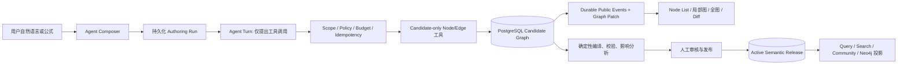
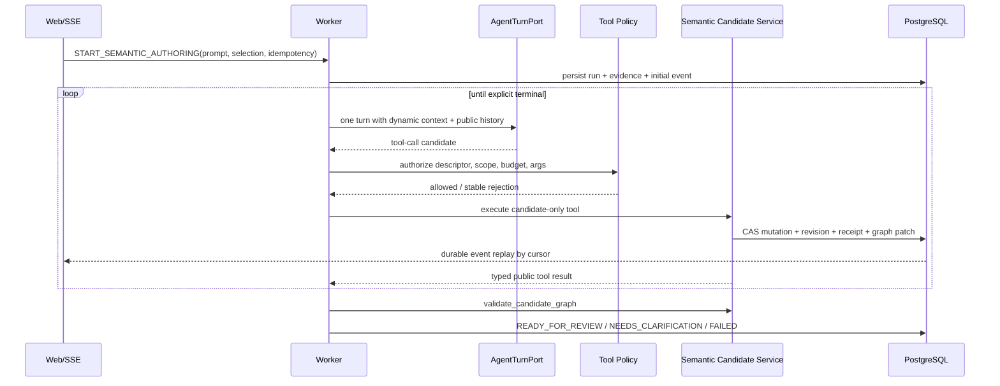

# Agent 原生 Node/Edge 语义图技术设计

## 1. 设计状态

- 状态：`planning`
- 对应 PRD：`prd.md`
- 设计版本：Graph v2 / Agent Semantic Authoring MVP
- 权威边界：PostgreSQL 是发布语义与候选治理的唯一写权威；图索引、community、布局和
  Neo4j 均为可重建投影
- 兼容目标：不就地改写 Graph v1 release，不中断现有 Query Runtime、Review/Publish 和历史
  Query Run 重放

## 2. 设计结论

本次不是给现有 Metric/Dimension 再增加几个可选字段，而是新增一个正式的
`SemanticGraphSource@2`：Node 只保存对象自身属性，Edge 保存所有跨对象关系。Graph v2
通过确定性编译器生成现有查询运行时需要的 executable、relationship index 和 restriction
投影，从而先改变语义创作和图浏览模型，不要求首版同时重写整个查询执行链。

Agent 不直接写活动图，也不在模型供应商侧执行工具。服务端运行一个可恢复的多轮工具循环：
模型只能提出工具调用，Runtime 校验 scope、budget 和 idempotency 后执行候选工具，追加候选
graph patch 与 receipt，再把工具结果交给下一轮。只有显式 `complete_authoring_run`
才能结束创作；发布仍由现有人工审核与确定性 Gate 完成。



## 3. 架构边界

### 3.1 六个技术平面

| 平面 | 职责 | 写 Authority | 明确禁止 |
| --- | --- | --- | --- |
| Source Plane | Graph v2 Node、Edge、类型注册表和 Formula AST | PostgreSQL source/candidate revision | 从前端状态或 Neo4j 反写 |
| Candidate Plane | Agent 创建的可审阅候选、revision、diff、receipt | Candidate RPC / service | Agent 直接发布或硬删除 |
| Release Plane | 审核、验证 receipt、发布与回滚 | 现有 PostgreSQL governance | 自动批准、stale approval 复用 |
| Runtime Plane | 将 Graph v2 编译为查询可执行投影 | 确定性 compiler | 让 LLM 决定 runtime truth |
| Read Plane | List、局部图、全图、impact、lineage、community | 从 release/candidate 重建 | 成为新的发布真相 |
| Interaction Plane | Composer、公开工具阶段、graph patch、review UX | Run/Event APIs | JSON/拖拽直接写语义 |

### 3.2 包边界

- `packages/contracts`：只定义版本化 Zod 合同、端口、错误码和公共事件；不依赖 Next、Mastra、
  PostgreSQL 或图渲染库。
- `packages/semantic`：Graph compiler、candidate reducer、formula validator、read model builder、
  v1→v2 converter 和影响分析。
- `packages/agent-runtime`：Agent turn adapter、工具授权、循环/checkpoint、公开事件投影；模型
  provider 永远不直接执行 mutation。
- `packages/platform`：PostgreSQL graph/candidate/run adapters、窄 RPC 调用、scope hydration 与
  projection repository；不承载领域规则。
- `apps/worker`：领取 authoring run、执行多轮循环、恢复未完成 checkpoint、投递 durable event。
- `apps/web`：Studio shell、server actions/API、SSE consumer、统一 graph store、Node List/局部图/
  全图渲染；不持有语义写权限。
- PostgreSQL migration：只增加通用图结构、projection/ref/receipt/run 所需表或列，不为具体
  业务维度、指标、公式或关系类型加列。

## 4. Graph v2 合同

### 4.1 `SemanticGraphSource@2`

```ts
type SemanticGraphSourceV2 = {
  artifact_type: "SemanticGraphSource@2";
  graph_id: string;
  domain_id: string;
  base_release_id: string | null;
  node_type_registry: SemanticNodeTypeDefinition[];
  edge_type_registry: SemanticEdgeTypeDefinition[];
  nodes: SemanticGraphNodeV2[];
  edges: SemanticGraphEdgeV2[];
  source_evidence: AuthoringEvidenceRef[];
};
```

数组在 canonicalization 前必须按稳定 identity 排序；digest 由 canonical bytes 计算，不接受
前端提供 hash。Graph 内引用使用稳定 ID，不使用显示名称。

### 4.2 Node

`SemanticGraphNodeV2` 使用严格 discriminated union：

- `BUSINESS_SUBJECT`
- `DIMENSION`
- `METRIC`
- `FORMULA`
- `PHYSICAL_TABLE`
- `PHYSICAL_COLUMN`（PhysicalTable 下的支撑身份，不作为第六个一级业务导航）

Node type registry 在 Graph v2 release 中以完整版本快照保存以便重放，但 MVP 的 Node union 由
compiler 版本管理，Agent 不能动态创造任意 Node kind；将来增加 Node kind 需要新合同版本但不需要
新增业务数据库列。Registry 同时声明 `AGENT_AUTHORED` 或 `SYSTEM_MANAGED` origin policy。
PhysicalTable/PhysicalColumn 是由可信 schema snapshot 确定性同步的 `SYSTEM_MANAGED` Node，Agent
只能读取并通过 `BOUND_TO` / `REFERENCES` 连接，不能伪造或修改物理 catalog identity。

所有 Node 共享：`node_id`、`node_version`、`node_type`、`domain_id`、`name`、`description`、`aliases`、
`owner_ref`、`lifecycle`、`source_evidence_refs`、`extensions`。`extensions` 只允许命名空间化的
固有属性，不能含其他 Node ID、table/column binding 或关系数组。

类型特有属性示例：

- Metric：unit、additivity、null/fanout policy。
- Dimension：logical data type、sensitivity、filter semantics。
- Formula：规范化 AST、return type、formula language/version。
- PhysicalTable/Column：固定 datasource/schema snapshot identity 与物理名称。

### 4.3 Edge 与 Edge Registry

每条 Edge 是一等对象：

```ts
type SemanticGraphEdgeV2 = {
  edge_id: string;
  edge_version: number;
  edge_type: string;
  family: "BUSINESS" | "ANALYTICAL" | "FORMULA" | "PHYSICAL" | "JOIN" | "EVIDENCE";
  source_node_id: string;
  target_node_id: string;
  lifecycle: "ACTIVE" | "DEPRECATED" | "RETIRED";
  attributes: Record<string, unknown>;
  source_evidence_refs: string[];
};
```

Node/Edge version 在每次有效更新时单调增加；update/retire 工具同时要求 expected entry digest，
因此旧页面或并发 Agent 不能覆盖新版本。

`node_id`、`node_type`、scope 和 origin policy 创建后不可修改；`edge_id`、`edge_type`、source 和
target 创建后也不可修改。所谓 rebind 必须显式 retire 旧 Edge 再 create 新 Edge，保留审计链。
退役 Node 前必须先处理所有 active incident Edge，否则结构 Gate 拒绝；system-managed 物理 Node/
Edge 只能由新 schema snapshot/drift 流程变更。

`edge_type` 是 registry 中的稳定字符串，而不是 PostgreSQL enum。Registry 为每种类型声明：

- 允许的 source/target Node 类型；
- 方向、基数和是否允许多条平行 Edge；
- 属性 schema 与 family；
- 是否参与 query compilation、lineage、impact 或仅用于证据；
- 是否允许 Agent 创建/修改，还是只能由 schema snapshot 投影生成。

首版内建类型覆盖 PRD 的 `RELATES_TO`、`HAS_DIMENSION`、`HAS_METRIC`、`DEFINED_BY`、
`DEPENDS_ON`、`AT_GRAIN`、`ROLLS_UP_TO`、`CONTAINS_COLUMN`、`FOREIGN_KEY_TO`、`BOUND_TO`、
`REFERENCES`、`JOINABLE_VIA`、`SUPPORTED_BY`、`DERIVED_FROM`。领域关系可注册新 type，不需要 DDL，
但仍需候选、验证和审核。

`CONTAINS_COLUMN`、`FOREIGN_KEY_TO` 等物理事实同样是 `SYSTEM_MANAGED` Edge；Agent 可提出
`BOUND_TO`、`JOINABLE_VIA`、业务/分析/Formula Edge，但不能把自己的推断写成物理 schema 事实。
Node 和 Edge 的 `source_evidence_refs` 指向不可变 evidence/audit registry；首版不支持 Edge 指向
另一条 Edge。`SUPPORTED_BY` / `DERIVED_FROM` 只用于 Node-to-Node provenance。

### 4.4 Formula AST 不内嵌跨 Node 引用

Formula AST 内只使用局部 `slot_id`，例如：

```json
{
  "kind": "aggregate",
  "function": "count_distinct",
  "input": { "kind": "slot", "slot_id": "product" },
  "filter": {
    "kind": "equals",
    "left": { "kind": "slot", "slot_id": "payment_status" },
    "right": { "kind": "literal", "value": "paid" }
  }
}
```

Formula 到 PhysicalColumn、Dimension、Metric 或其他 Formula 的具体依赖由携带 `slot_id` 的
`REFERENCES` / `DEPENDS_ON` Edge 绑定。这样 AST 是可版本化计算结构，依赖身份仍由 Edge 管理，
不会把 `column_id` 换一种形式塞回 Formula Node。

首版 AST 是安全、可验证的分析表达式子集：literal、slot、算术、比较、布尔、case、filter、
聚合、受支持日期粒度。不得执行任意 SQL/Python；若查询运行时需要 SQL，由确定性 compiler
从 AST 与 Edge 生成。

## 5. PostgreSQL 持久化

### 5.1 复用的权威对象

继续复用：

- `semantic_source_revision` 的 append-only source bytes/digest；
- `semantic_candidate` 与 `semantic_candidate_revision` 的候选状态机；
- `semantic_source_release` 的 immutable release 与投影绑定；
- 现有 validation/review/publish/rollback receipt 与 active release 指针；
- 通用 Run、run event、outbox/effect receipt 和 worker ownership 模式。

Graph v2 source 作为新的 artifact version 存入 source revision。为避免 Agent 每创建一条边就复制
完整 10,000 Node 快照，authoring run 使用 `base source + append-only graph patches` 形成候选工作图。
每次 mutation 增加 working revision；在显式完成、提交审核或受控 compact checkpoint 时，系统才
确定性物化完整 Graph v2 source revision 与 candidate revision，并核对物化 digest 等于 working
graph digest。

Working graph digest 不依赖数据库行顺序：registry、每个 Node 和每个 Edge 先独立 canonicalize
并计算 entry digest，再按稳定 identity 排序生成 graph manifest digest。单步 mutation 只更新受影响
entry/manifest；完成时对完整 materialized payload 再计算 canonical source digest并交叉验证。

### 5.2 新增的规范化投影

为高效列表和图查询增加 release/candidate-bound 的规范化投影，而不是把 JSONB 当全图查询库：

- `semantic_graph_projection`：projection identity、source digest、release/candidate revision、
  compiler version、status。
- `semantic_graph_node_projection`：projection + node identity + intrinsic payload/digest。
- `semantic_graph_edge_projection`：projection + edge identity + endpoints + registry type + payload/digest。
- `semantic_graph_community_projection`：release-bound hierarchy、member digest、algorithm/version/seed。
- `semantic_graph_candidate_patch`：candidate/run-bound working revision、单个 typed operation、
  before/after/patch digest 与 base graph digest，append-only。
- `semantic_graph_candidate_node_overlay` / `semantic_graph_candidate_edge_overlay`：当前工作图的增量
  查询缓存；可由 base projection + ordered patches 重建，不是 Authority。
- `semantic_authoring_tool_receipt`：run/turn/tool/idempotency、expected/current revision、before/after digest、
  result/patch digest、public error/terminal。
- 必要的 authoring run checkpoint/clarification 字段；优先扩展现有通用 Run，而不是复制状态机。

这些表全部带 workspace/tenant/environment/domain scope、RLS 与不可变约束。调用方不能自报
principal 或 scope；RPC 从认证上下文解析。

### 5.3 Candidate mutation transaction

一次原子 mutation 的事务顺序：

1. 以 `FOR UPDATE` / CAS 校验 candidate、base release、expected revision 和 run ownership。
2. 按 tool idempotency key 查询已有 receipt；已有 terminal 则返回原结果。
3. 从 base release projection 与 ordered patches 读取当前有效 Node/Edge，执行一个原子 reducer。
4. 运行局部结构校验与 canonicalization，计算 working graph/diff/patch digest。
5. 插入 append-only candidate patch 与 tool receipt，并更新可重建的 Node/Edge overlay cache。
6. CAS 推进 working revision；写 durable public event/outbox。
7. 提交后向 UI 返回 receipt；断线恢复从 PostgreSQL event cursor 重放。

活动 release 和完整 source revision 永远不在该 mutation 事务中改变。`complete_authoring_run` 在
独立事务中重放 patches、物化完整 Graph v2 source、追加 official candidate revision、运行全量
Gate，并校验 source digest 与最后一个 working graph digest 完全一致。

## 6. Graph v2 编译与验证

### 6.1 双投影编译

Graph v2 compiler 产生：

1. `SemanticSourceBundle@1` 兼容投影，供当前 M3/U5 管线和历史比较继续工作；
2. 原生 Graph Explorer/Relationship Projection，供新的 List、局部图、全图和 Agent 读取。

兼容投影是从 Edge 确定性降级得到的只读产物。任何修改必须回到 Graph v2 source；不允许
编辑兼容投影后反向合并。

首版发布使用明确的 runtime compatibility profile：例如一个 Metric 必须恰有一个 active
`DEFINED_BY`，一个运行时 Dimension binding 必须能唯一解析。Graph v2 可以在候选层表达更丰富
的关系，但当前 Query Runtime 无法无损编译的结构必须在发布 Gate 失败关闭；后续原生 runtime
扩展不能通过“挑一条关系”静默降级。

### 6.2 Gate 顺序

验证按失败关闭顺序执行：

1. artifact version、strict schema、canonical digest；
2. Node/Edge identity、scope、悬空端点、registry source/target 和重复约束；
3. lifecycle、必需归属/定义/绑定完整性；
4. Formula AST schema、slot binding、return type、unit、grain、time/filter/null policy；
5. dependency 和 dimension hierarchy cycle；
6. Join cardinality、row preservation、fanout proof；
7. authorization、sensitive binding 和 evidence policy；
8. Graph v2→runtime 编译、现有 projection gate 和影响分析；
9. stale base、exact candidate revision 和 review receipt binding。

局部 mutation 可以先运行便宜的结构 gate，但 `complete_authoring_run` 必须运行全量 gate。Agent
不能覆盖 deterministic error，只能继续修改候选或请求澄清。

## 7. Agent Authoring Runtime

### 7.1 为什么不直接复用当前 `ModelProviderPort`

当前 adapter 只允许一次模型 step，遇到 tool call 只产生候选事件，并拒绝 tool role /
`tool_call_id` 历史。若强行在此接口中加入模型端工具执行，会破坏现有“服务端拥有工具和
Authority”的安全边界。

因此新增 additive `AgentTurnPort@1`：每次只做一个模型 turn，输入支持经过脱敏的
assistant tool-call 与 tool-result 历史，输出只能是 tool-call candidates 或受控 assistant
message。认证 provider、计费和模型治理继续复用现有 runtime；`ModelProviderPort` 保持兼容。

### 7.2 服务端工具循环



运行固定：workspace/tenant/environment/domain、principal、base release、initial selection、model/
prompt/tool/policy version、budget 与 idempotency key。动态上下文每轮从当前 candidate revision、
所选 Node/Edge 和可见 schema 构造，避免把全图塞进 prompt。

若请求没有可继续的 DRAFT candidate，start command 先以 active release 创建一个基线 candidate；
若显式选择了同 scope、同 base release 的 DRAFT，则在权限和 stale 检查后继续。创建/继续操作
本身也使用 idempotency key，模型不能选择任意 candidate ID。基线 candidate revision 直接绑定
active release 的 source revision，不复制 payload；同一 candidate 同时只允许一个 fenced writer
lease，其他 run 必须恢复已有 run 或以 stale working revision 失败。

### 7.3 Agent 工具面

只读工具：

- `list_semantic_node_types`
- `list_semantic_edge_types`
- `search_semantic_nodes`
- `get_semantic_node`
- `get_semantic_edge`
- `get_semantic_neighborhood`
- `get_physical_schema_binding`
- `get_formula_dependencies`
- `get_candidate_graph_diff`
- `analyze_semantic_impact`

候选写工具：

- `create_semantic_node`
- `update_semantic_node`
- `retire_semantic_node`
- `create_semantic_edge`
- `update_semantic_edge`
- `retire_semantic_edge`
- `propose_semantic_edge_type`
- `validate_candidate_graph`
- `request_semantic_clarification`
- `complete_authoring_run`

工具保持原子、typed、可组合。`unlink` 等价于 retire Edge，`rebind` 是 retire 旧 Edge + create
新 Edge 的显式组合，不提供隐藏批量副作用。复合用户意图由 Agent 编排多个工具完成。

工具不接受 raw workspace/principal、SQL、DSN、Neo4j query、publish/approve/rollback 参数；
写工具自动绑定当前 run 的 candidate 和 expected revision。

### 7.4 恢复、澄清和终止

- 每个模型 turn 和工具 terminal 都持久化 checkpoint。
- 工具提交后、事件发送前崩溃：重启通过 tool receipt 发现已提交结果，补写/重放去重事件，
  不重复 mutation。
- `request_semantic_clarification` 将 run 置为 `NEEDS_CLARIFICATION`，保留 candidate revision；
  用户回答以新 evidence 追加并从同一 checkpoint 恢复。
- `complete_authoring_run` 是唯一成功 terminal，必须附 exact candidate revision 与 validation
  receipt；模型只停止输出不算完成。
- cancel 停止后续工具，但保留已发生的候选 revision、receipts 和审计。
- Graph v2 candidate 只有在无 active writer、完整 source 已物化、working/source digest 匹配且
  complete/validation receipt 精确绑定时才能进入现有 review submission；旧的通用提交 API 不能把
  未完成 working patches 或基线 revision 送审。

## 8. Durable Public Events 与共享数据空间

复用现有 PostgreSQL `run_events`、sequence cursor、`Last-Event-ID`、`(run_id, sequence)` 去重、
heartbeat 和终态关闭协议，扩展公共事件类型：

- `semantic_authoring_stage`
- `semantic_tool_started / semantic_tool_completed / semantic_tool_failed`
- `semantic_graph_patch`
- `semantic_validation_result`
- `semantic_clarification_required / semantic_clarification_received`
- `semantic_authoring_terminal`

`semantic_graph_patch` 是 typed、可重放的数据变化，不把 JSON patch 埋在自然语言日志里：

```ts
type SemanticGraphPatch = {
  candidate_id: string;
  from_working_revision: number;
  to_working_revision: number;
  operations: Array<
    | { op: "ADD_EDGE_TYPE"; edge_type: SemanticEdgeTypeDefinition }
    | { op: "ADD_NODE"; node: SemanticGraphNodeV2 }
    | { op: "UPDATE_NODE"; before_digest: string; node: SemanticGraphNodeV2 }
    | { op: "RETIRE_NODE"; node_id: string; after_digest: string }
    | { op: "ADD_EDGE"; edge: SemanticGraphEdgeV2 }
    | { op: "UPDATE_EDGE"; before_digest: string; edge: SemanticGraphEdgeV2 }
    | { op: "RETIRE_EDGE"; edge_id: string; after_digest: string }
  >;
  patch_digest: string;
};
```

UI 的 graph store 以 `release projection + ordered candidate patches` 为唯一数据空间；列表、局部图、
全图和 Diff 订阅同一 store，因此 Agent mutation 立即对所有视图可见。公共事件只显示工具名、
对象、公开结果、证据引用和校验，不包含私有思维链、系统 prompt、secret 或 provider 原始错误。

## 9. 读取模型与图投影

### 9.1 统一查询合同

服务端提供同一 identity/status 语义的读取 API：

- paginated/filtered Node List；
- Node/Edge detail；
- 1-hop/2-hop bounded neighborhood；
- shortest visible path；
- candidate diff 与 impact；
- full graph cluster hierarchy 和按层展开；
- release/candidate consistency metadata。

所有 API 在 PostgreSQL revalidate scope 与 visibility。即使 Neo4j/索引返回 key，也必须由
PostgreSQL hydration；不可见对象不进入节点、边、路径或聚合计数。

### 9.2 Local graph

默认 1-hop，用户可按 Edge family/direction 扩展到 2-hop。服务端硬预算为 250 Node / 500 Edge，
响应带 `truncated`、聚合计数和 continuation token，不能静默丢边。现有关系搜索服务可扩展为
Graph v2 读取后端，保留 sealed-index + PostgreSQL revalidation 模式。

### 9.3 Full graph 与 community

community 是 release-bound、content-addressed 的导航投影：输入为发布 Node/Edge、算法版本和
稳定 seed，输出分层 cluster、成员 digest、摘要计数与关键枢纽。它不创建业务 Edge，也不进入
发布判断。

MVP 的 hierarchy 先按 `domain_id` 分区，再把可见异构图确定性投影为无向加权 simple graph，使用
Graphology Louvain `detailed` 输出的 dendrogram 形成 domain 内层级。Edge family 权重、是否纳入、
排序、resolution、seed/RNG 和算法版本写入 projection receipt；物理/Join Edge 使用较低权重，
Evidence Edge 不参与聚类，避免物理连接淹没业务语义。Cluster 标题和摘要首版由类型计数、稳定
top hubs 和已发布名称确定性生成；任何可选 LLM summary 只作缓存文本，不改变 membership 或
Authority。Graphology 官方实现支持 directed/undirected graph、权重、resolution、seeded RNG 和
dendrogram 输出（[Communities Louvain](https://graphology.github.io/standard-library/communities-louvain.html)）。

Candidate mutation 不在每次工具调用后重算全图 community。新增/修改对象先附着于发布
cluster 或“候选变更”cluster；发布/索引流水线再异步重建正式 hierarchy。任一 zoom 层最多
返回 500 个可视 glyph。

## 10. 前端设计

### 10.1 路由与信息架构

`/semantic` 升级为 Studio shell：

1. `节点`：默认 Node List；
2. `关系图`：当前 Node 的局部图；
3. `全图`：community + semantic zoom；
4. `候选与审核`：保留并整合现有 Review Workspace；
5. `版本与血缘`：保留 release/diff/lineage。

现有 Explorer 和 Review 能力不删除，改为 shell 内的读取/治理视图。Workspace-scoped route 使用
同一组件与 server-resolved context。

### 10.2 Composer 与编辑入口

Composer 在节点、局部图和全图间持久存在，自动携带可见的 domain、active release、candidate、
selected Node/Edge 和 viewport scope。用户可移除显式上下文。所有“新增/编辑/连接/退役”按钮
只负责填充选区与意图模板并聚焦 Composer；没有直接字段保存、任意 JSON textarea 或图连线
写入。

### 10.3 渲染选择

- Node List：服务端分页/筛选 + 客户端虚拟化。
- Local graph 与 Full graph：统一采用 AntV G6 v5 的 client-only adapter，消费同一 Graph v2
  projection/store。Local 使用有向 force 邻域；Full 使用 GraphRAG 风格 cluster-first、semantic
  zoom、Minimap 和按需展开。Canvas/WebGL 图同时保留键盘与读屏表格 fallback。
- 服务端 cluster hierarchy、release-bound layout projection 与 stable seed 决定初始位置；worker 只在
  cluster 展开后做固定预算的局部松弛，不拥有或回写语义/布局 Authority。Candidate 新 Node 初始
  放在已绑定 cluster/邻居质心附近，并用 `node_id` hash 产生稳定微偏移，避免每次 patch 全图跳动。
- React 只管理选择、筛选和生命周期，不为每个图元素创建 DOM/React component。

参考：[AntV G6 官方文档](https://g6.antv.antgroup.com/en/manual/introduction)、
[AntV G6 Gallery](https://g6.antv.antgroup.com/en/examples)。

### 10.4 候选视觉状态

- Added：绿色 + `新增` badge；
- Modified：琥珀色 + `已修改` badge；
- Retired：红色虚线 + `待退役` badge；
- Published/unchanged：灰色 + release badge。

颜色不是唯一信息；Node List、Local、Full、Detail 和 Diff 使用同一 status tokens。局部图/全图
选择只改变上下文，不触发 mutation。

## 11. Graph v1 兼容与迁移

### 11.1 不改写旧 release

旧 Graph v1 source bytes、digest、release 和历史 Query Run 保持原样。读取层提供确定性 v1
adapter，使旧 release 仍可显示；v1→v2 转换生成新的 candidate/release，绝不原地升级。

### 11.2 确定性转换规则

- business entity → `BusinessSubject`；内嵌 relationship types → 独立 business Edge。
- dimension → `Dimension`；table/column → `PhysicalTable` / `PhysicalColumn` 与 `BOUND_TO`；
  parent → `ROLLS_UP_TO`。
- metric → `Metric` + `Formula`；formula/依赖/粒度 → `DEFINED_BY`、`REFERENCES`、
  `DEPENDS_ON`、`AT_GRAIN`。
- physical catalog → PhysicalTable/Column、`CONTAINS_COLUMN`、`FOREIGN_KEY_TO`。
- current physical binding → `BOUND_TO`；table relationship → physical/join family Edge。

转换只使用稳定 schema snapshot identity 和已发布 ID。任何无法唯一映射的名称、公式依赖、
关系方向或 Join proof 进入 `unresolved` 报告与 candidate，不猜测、不发布。

### 11.3 Feature flags 与阶段

1. `graph_v2_read_adapter`：旧 release 可通过统一读取合同显示。
2. `graph_v2_dual_compile`：v1/v2 fixtures 双编译比较，不改变 active runtime。
3. `graph_v2_agent_authoring`：只对 allowlisted workspace 开启候选创作。
4. `graph_v2_publish`：Gate 满足后允许 Graph v2 release 成为 active。
5. `graph_v2_full_graph`：全图 community projection 达到性能基准后开放。

回滚优先关闭 authoring/publish/full-graph flag，继续服务最后一个 active release；不执行破坏性
down migration，不删除 candidate/revision/receipt。

## 12. 安全、可靠性与 Agent 原生性

### 12.1 Agent 原生能力矩阵

| 用户结果 | UI 入口 | Agent 原子能力 | 可观察结果 |
| --- | --- | --- | --- |
| 新增/修改/退役 Node | Composer intent | create/update/retire node | revision + graph patch + diff |
| 连接/断开/重绑 Edge | Composer intent | create/update/retire edge | edge patch + impact |
| 公式新增/修改 | Composer formula intent | Node/Edge 组合 + validate | AST、slot edges、validation |
| 查看关系与影响 | List/Local/Full | read neighborhood/impact | 同一 projection |
| 完成候选 | Run timeline | validate + explicit complete | READY_FOR_REVIEW |

人工 approve/publish 没有 Agent 对等工具，这是有意的治理例外，不是能力缺口；首版 hard delete
同样被 retire 替代。

### 12.2 失败模型

- stable public errors：invalid contract、not visible、stale revision、idempotency mismatch、tool budget、
  validation failed、needs clarification、provider unavailable、cancelled。
- provider timeout/retry 不得重复 mutation；只重试无 receipt 的模型 turn，工具以 receipt terminal
  去重。
- reconnect 由 cursor replay；相同 patch digest 不能重复应用。
- 全图/community/Neo4j 失败不阻断权威 Node List、候选审核或 Query Runtime；降级到 PostgreSQL
  list/local read 与无布局表格视图。

## 13. 关键权衡

### 13.1 选择 Edge registry，而不是数据库关系类型 enum

这是“新增业务关系不做 DDL”的必要条件。代价是必须有严格 registry schema、版本和审核；
通过 release-bound registry 与确定性 endpoint 校验控制风险。

### 13.2 Formula AST 使用 slot + Edge，而不是直接 Node ID

直接在 AST 放 column/node ID 会再次制造跨对象内嵌。slot 让计算结构与依赖身份分离，代价是
compiler 多一次 binding resolve，但能统一处理重绑、血缘和影响分析。

### 13.3 新增 AgentTurnPort，而不是扩大一次性 ModelProviderPort

保持现有 Q&A / M3 调用兼容，并明确服务端工具执行边界。代价是新增 additive port 和 adapter，
但避免让 provider/Mastra 获得 Authority 或丢失 tool history。

### 13.4 Full graph 使用服务端 hierarchy + WebGL 客户端

全量 DOM/SVG 对 10,000 Node 不现实。服务端聚类保证权限、稳定性和可解释数量，WebGL/worker
保证交互；代价是新增 projection pipeline，但它可独立降级且不影响语义 Authority。

## 14. 子任务与依赖

| 顺序 | 子任务 | 直接交付 | 依赖 |
| --- | --- | --- | --- |
| 1 | `08-15-semantic-graph-v2-core` | 合同、AST、存储、compiler、基础 gate | 无 |
| 2 | `08-15-semantic-agent-authoring-runtime` | AgentTurnPort、工具循环、candidate receipts/events | Graph v2 core |
| 3 | `08-15-semantic-graph-read-models` | 统一读 API、local/full/community/impact | Graph v2 core；events 可并行 |
| 4 | `08-15-semantic-studio-graph-ux` | Node List、Local、Full、Composer、overlay | Runtime + read models |
| 5 | `08-15-semantic-graph-migration-rollout` | v1 converter、dual compile、E2E、flags、回滚 | 前四项 |

父任务只持有源需求、跨子任务一致性和最终集成验收，不直接混合实现提交。

## 15. 设计验收

设计完成后的实现必须证明：

1. Graph v2 source 中 Metric/Dimension/BusinessSubject 不含跨 Node ID、表列或公式内嵌字段。
2. “新增商品维度”只产生 Graph source/candidate revision、Node/Edge projection 与 audit receipt，
   不产生业务 schema DDL。
3. Agent mutation 在 crash/retry/reconnect 下至多执行一次，UI patch 可重放。
4. Agent 不能调用 approve/publish/rollback/secret/arbitrary SQL，工具和 UI 创作结果保持能力对等。
5. Graph v2 编译后现有 Query Runtime 正例保持等价，旧 release digest 与历史重放不变。
6. Node List、Local、Full、Diff 对同一 release/candidate 返回相同 identity、方向和状态。
7. local 250/500、full 500 glyph、10,000 Node 基准与授权过滤通过。
8. 关闭 Graph v2 flags 后可继续服务最后一个 active release，投影损坏可重建。
