# AgenticDataBench E-commerce PostgreSQL Production Demo v1 — Technical Design

## 1. Design Objective

在不新增 PostgreSQL 服务、不建立 Demo 专用旁路的前提下，把固定 E-commerce 数据、语义资产、复杂 Data Agent 工作流和确定性评测接入现有 Workspace、PostgreSQL Authority、Durable Run、Sandbox、Semantic Governance、Relationship Index 与 Test Center。

设计优先满足四个不变量：

1. 干净 clone 完成标准迁移与管理员 bootstrap 后，断网也能看到并运行 Demo。
2. Agent 只能看到当前 Workspace、当前 Case 和获准 schema 的公共材料，不能接触控制面、Gold 或隐藏 Rubric。
3. PostgreSQL 保存权威事实；文件 bundle 是固定输入，Neo4j 是可删除重建的关系投影。
4. Node.js 负责调度，分析脚本使用 CPython 3.12；模型生成的 Python 只能在无网络、无数据库凭证、无宿主挂载的一次性 Sandbox 进程中运行。

## 2. Existing-System Evidence and Consequences

| Existing evidence | Design consequence |
|---|---|
| `compose.yaml` 已固定一个 PostgreSQL 17 服务和 `data_agent` 数据库 | 只增加只读 volume/env/role，不新增 PostgreSQL service/database/volume |
| `infra/docker/init-db.sh` 按 migration ledger 应用缺失迁移 | DDL 进入下一可用 migration；seed importer 在迁移后每次幂等核验 |
| `app_data_agent.datasource_connections` 已按 Workspace 保存 datasource，并强制 PostgreSQL SecretRef | Demo datasource 走同一 Repository/SecretRef，不建立免密内部 datasource 类型 |
| Test Center 已有 Catalog、Public/Sealed Case、Runner、ScoreCard 和 PostgreSQL batch persistence | 新增 Adapter/Oracle/异步 binding，保留既有 suite 行为 |
| `dab` suite ID 已指向 `ucbepic/DataAgentBench` 且处于许可阻塞 | AgenticDataBench 必须使用新的 suite ID，不能覆盖或重解释 `dab` |
| Run Runtime 已有 lease、heartbeat、fence、cancel、resume、checkpoint 和 effect receipt | Production Suite 的 Case 执行复用 Durable Run，不在 Web 请求内同步完成 |
| SQL Sandbox 只允许受权 PostgreSQL query；当前 `services/sandbox` 是 Python 3.12 实现的 SQL 执行器，并非任意源码沙箱 | SQL 继续走现有 Sandbox Authority；复用该 Python 工程的协议/构建能力，新增隔离 Python 执行模式，但不与 SQL 进程或 Worker 混跑任意源码 |
| Semantic Source Bundle 已支持 metric、dimension、entity、event、term 与 lineage | E-commerce 作为一个 curated bundle 走 Candidate → Review → Publish |
| Relationship Search 单次结果限制 node ≤250、edge ≤500 | 总图可达 300–450/800–1,300，但 UI 使用分类、搜索和分页，不放宽单次安全上限 |

## 3. Component Architecture

```mermaid
flowchart LR
  U["固定上游 revision"] --> G["Bundle Generator"]
  G --> B["仓库内压缩 Seed Bundle"]
  B --> M["dev:migrate / docker:migrate"]
  M --> RAW["demo_adb_ecommerce_raw"]
  M --> MART["demo_adb_ecommerce_mart"]
  RAW --> Q["质量与摘要校验"]
  MART --> Q
  Q --> BOOT["管理员 Bootstrap"]
  BOOT --> DS["Workspace Datasource + Import Receipt"]
  BOOT --> SG["Semantic Candidate / Review / Publish"]
  SG --> PG["PostgreSQL Semantic Authority"]
  PG --> NEO["Neo4j 可重建投影"]
  DS --> TC["Test Center"]
  TC --> RUN["Durable Case Runs"]
  RUN --> AGENT["E-commerce Data Agent Executor"]
  AGENT --> SQL["授权 SQL Sandbox"]
  AGENT --> PY["无网络 Python Sandbox"]
  SQL --> ART["Artifact / Effect Receipts"]
  PY --> ART
  ART --> ORA["Deterministic Artifact Oracle"]
  ORA --> SCORE["ScoreCard + Production Readiness"]
```



## 4. Repository Bundle

### 4.1 Proposed layout

```text
infra/agenticdatabench/ecommerce-v1/
├── LEGAL.md
├── source-manifest.json
├── bundle-manifest.json
├── seed/
│   ├── raw-0001.sql.gz
│   ├── raw-0002.sql.gz
│   ├── mart-0001.sql.gz
│   └── ...
├── public/
│   ├── official-compatible-cases.jsonl
│   └── production-cases.jsonl
├── sealed/
│   ├── official-oracle.jsonl
│   └── production-oracle.jsonl
└── semantic/
    └── ecommerce-source-bundle.json
```

### 4.2 Generator boundary

- Developer-only generator downloads the exact repository commit and Hugging Face revision, validates Apache-2.0, and rejects redirect/size/path drift.
- Generator imports full Olist/eBay and exactly the first 10,000 physical JSON lines from each Amazon file.
- Output rows are canonicalized before PostgreSQL `COPY`; nested Amazon arrays/objects remain JSONB with stable top-level extraction columns.
- Each compressed chunk is independently hashed and kept below a conservative code-hosting limit; proposed hard cap is 50 MiB per file and 200 MiB combined compressed bundle. Generator fails rather than silently truncating.
- Standard runtime never invokes the downloader. It only reads the reviewed, committed bundle.
- Sealed files are visible to repository maintainers but excluded from browser/API/model inputs. Therefore `LOCAL_HOLDOUT` proves runtime sealing, not official blind-test secrecy.

## 5. PostgreSQL Design

### 5.1 Migration

- Use the next unclaimed migration number, provisionally `10636`; re-check immediately before implementation because parallel work may claim it.
- Follow the source-segment + renderer convention:
  - `migration-sources/10636/*.sql.inc`
  - `scripts/render-10636-migration.ts`
  - rendered migration under `infra/supabase/apps/data-agent/migrations/`
- The migration creates schemas, table contracts, indexes, grants, dataset/workspace receipt authority and benchmark run bindings. Large data does not live inside the migration SQL checksum.
- `init-db.sh` applies ledgered migrations first, then invokes the idempotent E-commerce importer. An applied DDL migration does not imply imported data is healthy.

### 5.2 Physical schemas

`demo_adb_ecommerce_raw` contains exactly 12 source tables:

1. `olist_customers`
2. `olist_geolocation`
3. `olist_order_items`
4. `olist_order_payments`
5. `olist_order_reviews`
6. `olist_orders`
7. `olist_products`
8. `olist_sellers`
9. `olist_category_translation`
10. `amazon_reviews`
11. `amazon_products`
12. `ebay_laptops`

`demo_adb_ecommerce_mart` contains 14 curated tables:

- Dimensions: `dim_customer`, `dim_seller`, `dim_product`, `dim_category`, `dim_geography`, `dim_date`, `dim_platform`.
- Facts: `fact_order`, `fact_order_item`, `fact_payment`, `fact_review`, `fact_delivery`, `fact_market_listing`.
- Matching bridge: `bridge_cross_platform_product_candidate`.

The mart also exposes at least five reviewed views:

- `customer_360`
- `seller_performance`
- `delivery_sla`
- `product_satisfaction`
- `cross_platform_product_comparison`

This yields 26 physical Demo tables. Category, brand, payment type, order status, price band, satisfaction and fulfillment remain semantic dimensions even where represented as attributes rather than separate dimension tables.

### 5.3 Data contracts and matching

- Every mart row carries deterministic source lineage keys and `dataset_version`.
- Time is stored as `timestamptz` or `date` with explicit UTC/business-calendar semantics; money uses numeric, never floating point.
- Olist deterministic relationships become PK/FK constraints where source quality permits.
- Cross-platform product matching is not an FK. The bridge stores normalized title/brand/category, algorithm version, candidate score, evidence JSON, decision (`CANDIDATE|ACCEPTED|REJECTED`) and reviewer metadata.
- Import is transactional per phase: raw staging → raw seal → mart rebuild → parity/quality checks → active digest swap. A failed phase leaves the previous active digest usable.

### 5.4 Read-only database identity

- Create a group role `data_agent_ecommerce_readonly` with `NOLOGIN`, `NOINHERIT`, default read-only behavior and only `USAGE/SELECT` on the two Demo schemas.
- Create/rotate a LOGIN role through an environment-backed secret named `DATA_AGENT_ECOMMERCE_READER_PASSWORD`; production rejects missing/default credentials.
- Workspace SecretRef stores only opaque metadata/provider hash. Web/Worker resolve the environment secret server-side; raw credentials never enter PostgreSQL application rows, API, logs or browser state.
- The same public Demo data may be attached to multiple Workspaces, but each Workspace receives its own datasource/SecretRef binding and cannot see another Workspace's runs, artifacts or scores.

### 5.5 Receipts and readiness

- `AgenticDataBenchImportReceipt` is Workspace-scoped and binds:
  - source commit/revision and bundle digest
  - 12 raw + 14 mart table manifests
  - row/column/null/key/parity hashes
  - relation sizes and import duration
  - datasource fingerprint and Workspace binding
  - semantic source bundle digest
  - installer version and timestamp
- Receipt rows are append-only. A current pointer may advance only after complete revalidation; partial imports never produce `READY`.
- `dev:check` and Test Center Catalog independently revalidate the active receipt against database facts, not merely file presence.

## 6. Bootstrap and Workspace Integration

- Extend the explicitly confirmed superadmin bootstrap so that, after creating the first Workspace, it calls a separate idempotent E-commerce bootstrap service.
- The service uses deterministic UUIDs derived from `workspace_id + dataset_version` for datasource and receipt identities.
- It verifies the physical digest, registers the environment-backed SecretRef, creates the regular PostgreSQL datasource through the existing Workspace repository, triggers a physical schema snapshot, and records the Workspace import receipt.
- The same service is exposed as an explicit admin CLI for existing deployments; it does not recreate users or require a new Workspace.
- The curated semantic bundle is submitted through existing Candidate APIs. The explicit administrator bootstrap confirmation authorizes review/publish of that exact reviewed digest; no AI approval and no direct semantic-table inserts are permitted.

## 7. Semantic Model

### 7.1 Source bundle

- Semantic domain: `ecommerce`.
- Capability profile follows the currently supported executable subset; unsupported formula constructs fail compile rather than falling back to free text.
- Minimum published content:
  - 12 business entities/dimensions
  - 30 metrics
  - 40 Chinese business terms/aliases
  - source bindings for all 26 physical tables and five views
  - join relationships, dimension hierarchies, metric dependencies and raw→mart lineage
- Formula grain, unit, null policy and time semantics are explicit and validated before publish.

### 7.2 Relationship projection

- PostgreSQL release digest is authoritative. Indexer produces a deterministic manifest and stages/reconciles Neo4j using the existing fenced pipeline.
- The total graph target is 300–450 nodes and 800–1,300 edges.
- Existing search safety limits remain node ≤250 and edge ≤500 per response. UI provides category filters, hop limits, search and paged lists; it never requests the entire graph as one response.
- Neo4j disabled/stale/unavailable returns the existing PostgreSQL fallback reason and does not make the Demo or semantic governance unavailable.

## 8. Test Center Integration

### 8.1 Suite identity

Do not reuse `dab`, which already denotes `ucbepic/DataAgentBench`.

- Official-compatible suite ID: `agenticdatabench-ecommerce`
- Project suite ID: `ecommerce-production`
- Initial suite versions: `1.0.0`

Both suites use `DATA_AGENT_END_TO_END`; cases that produce reports also declare `ANALYSIS_REPORT`.

### 8.2 Case contracts

- Extend public cases with a versioned artifact output contract rather than embedding Gold.
- Introduce a server-only sealed Data Agent case containing allowed input relation identities, deterministic expected artifact descriptors, comparator rules and sealed hash.
- Extend answer/result contracts with `ARTIFACT_BUNDLE`, containing content-addressed references to tables, JSON, chart specifications/images and reports. Large artifacts remain outside the inline run document.
- Existing SQL/multiple-choice/InsightBench contracts remain behaviorally unchanged.

### 8.3 Case sets

- `agenticdatabench-ecommerce`: exactly `ecommerce_15`, `ecommerce_16`, `ecommerce_35`.
- `ecommerce-production`: 24 fixed Chinese cases with 8 DEMO, 10 TUNING, 6 HOLDOUT and 6/10/8 difficulty distribution.
- Case manifest records table closure, required tools, output types, difficulty evidence and stable registry assignment.
- Official-compatible output is compared against the fixed upstream-compatible output contract. Production cases use project-authored deterministic artifact rules.

## 9. Durable Agent Execution

### 9.1 Batch and case runs

- Test Center batch creation becomes asynchronous for the two new suites.
- Each selected case creates a normal durable Run using the existing accepted L2 command kind; a new benchmark-case binding selects the E-commerce workflow without adding an ungoverned command path.
- A batch projection aggregates child Run terminal states and immutable ScoreCard inputs. Partial batch creation is resumable/idempotent.
- Existing synchronous suite runners remain unchanged in v1; only the new Data Agent suites use durable case runs.

### 9.2 Workflow executor

`ecommerce-data-agent@1.0.0` runs these bounded stages:

1. Validate frozen case/dataset/schema/semantic/model/evaluator tuple.
2. Load Public Case and approved semantic slice.
3. Ask the certified model for a strict analysis-plan envelope.
4. Resolve join closure and policy gates server-side.
5. Execute one or more read-only SQL artifacts through existing Sandbox Authority.
6. Optionally execute a versioned Python analysis artifact over bounded SQL result artifacts in the Python Sandbox.
7. Commit table/chart/report artifacts and receipts.
8. Run deterministic Oracle.
9. If eligible, expose cropped failure feedback and perform at most one reflection attempt.
10. Commit terminal events and update batch ScoreCard projection.

All model/tool outputs enter as `unknown` and pass strict Zod/Pydantic validation before authority state changes.

### 9.3 SQL sandbox

- Official-compatible cases execute against the sealed `raw` snapshot; Production Suite executes against the sealed `mart` snapshot.
- This preserves the current single-schema `CONTROLLED_REVISION` contract and prevents arbitrary cross-schema search paths.
- Query policy remains single-statement read-only PostgreSQL with bound role, relation manifest, statement/lock timeout, row/byte/memory budgets, cancel and outcome receipt.

### 9.4 Python Script Sandbox

- Add a dedicated `python-sandbox` service to the standard local/deploy topology. This is an execution service, not another PostgreSQL service/database/volume. It has no datasource credentials and never queries PostgreSQL directly.
- Worker stores model-generated source as a content-addressed Artifact and submits a strict `PythonExecutionRequest@1.0.0` through existing Sandbox Authority. The request binds Workspace, Run, Attempt, Fence, source digest, authorized input Artifact digests, entrypoint, output manifest, Python Runtime Digest, dependency lock digest and Policy digest.
- Script contract exposes `def main(context): ...`. It receives a frozen `data_agent_sandbox_sdk` rather than database/file handles: read authorized Arrow/CSV/JSON, use reviewed analysis libraries, emit canonical table/JSON, emit Vega-Lite spec/PNG, and emit sanitized Markdown claims with evidence references.
- v1 image pins CPython 3.12 plus `pandas`, `numpy`, `scipy`, `matplotlib` and `pyarrow`. Imports are denied outside an explicit safe stdlib/package allowlist; `pip`/Conda, runtime download, `ctypes`, arbitrary native loading, `subprocess`, `socket`, multiprocessing and host introspection are unavailable. `scikit-learn` and `statsmodels` remain dependency-review additions, not automatic runtime installs.
- The service container runs with no network namespace, read-only root filesystem, no host project/data directory, Docker socket, application `.env` or database socket mount; the only host-visible mount is a dedicated authenticated Unix-domain IPC directory owned by the supervisor and inaccessible to the executor identity. It also uses non-root identities, dropped Linux capabilities, `no-new-privileges`, PID/memory/CPU limits and ephemeral tmpfs. Worker sends only bounded Artifact bytes and authority metadata.
- Each request starts `python -I` as a fresh child under an execution OS identity distinct from the IPC supervisor. The process gets a fresh job directory with read-only `/input` and writable `/output`, sanitized environment, fixed locale/timezone/hash seed and no inherited open descriptors beyond protocol streams. Process and directory are destroyed after receipt sealing.
- Static AST/import validation rejects modules outside the allowlist, `eval`/`exec`/`compile`/`__import__`, unsafe reflection, dynamic code/module loading, environment/host access, path escape and undeclared output. This is policy/defense in depth; container, OS identity, seccomp/AppArmor and cgroup/rlimit controls remain authoritative if validation is bypassed.
- Parent supervisor enforces wall timeout; child/container enforce CPU, address space, file size, process count and open-file budgets. On timeout, cancel, limit breach or abnormal exit, kill the complete process group, discard `/output`, and return a stable non-success result. v1 admits one execution per constrained replica so its cgroup is an auditable per-execution ceiling.
- Input is limited to Arrow/CSV/JSON. `pickle`, `marshal`, arbitrary Python object deserialization and executable Notebook formats are rejected. Only declared outputs are committed: canonical table/JSON, sanitized Markdown, Vega-Lite specification and rendered PNG; arbitrary archives and executable HTML/SVG are rejected. stdout/stderr are redacted, byte-capped and stored separately from answer artifacts.
- `PythonSandboxReceipt` records sandbox image digest, CPython/package lock/SDK versions, Policy/source/input/output digests, start/end/duration, resource budgets/observations, exit classification, truncation flags and hard-control evidence. Missing network/filesystem/CPU/memory isolation evidence fails closed and marks Production Readiness `HOLD`.

## 10. Oracle and ScoreCard

- Table/CSV/JSON: exact schema plus ordered/unordered row semantics, null rules, numeric tolerance and canonical digest.
- Chart: deterministic chart-spec comparison is authoritative; rendered-image comparison is diagnostic unless a case defines a deterministic structural rule.
- Report: required claim IDs, evidence references, metric values and limitations are rule-checked. An LLM Judge may diagnose wording but cannot create PASS or overturn deterministic FAIL.
- Add Data Agent failure classes without collapsing existing ones: plan invalid, SQL rejected/timeout/execution, Python policy rejected/timeout/resource/execution, artifact mismatch, bad case, Oracle failure, infrastructure failure and cancellation.
- Attempt 0 and Attempt 1 remain separate. Holdout receives no Gold/Rubric/reflection leakage.

## 11. Web Experience

- Workspace data-source page shows both schemas, receipt state, counts, sizes and last verified digest.
- Physical Schema browser defaults to mart but can switch to raw.
- Semantic Explorer adds E-commerce domain summary, type filters and graph counters without widening relationship-response limits.
- Test Center renders separate cards for Official-compatible and Production suites, registry/difficulty filters, asynchronous progress, collapsible public tool stages, artifacts and ScoreCard.
- Add three guided scenarios: customer repeat purchase, seller delivery/SLA, cross-platform product/price matching.
- Production Readiness panel reports dataset/schema/semantic/model/evaluator versions, import receipt, policy budgets, recovery evidence and Holdout gate. It never displays sealed material or private reasoning.

## 12. Compatibility and Migration

- Existing `dab`, BIRD, Dr.Spider, InsightBench and BLADE catalog identities and runners remain unchanged.
- New enum members require exhaustive switch/UI label updates and contract tests.
- New async run response is versioned and used only by new suite routes; existing synchronous route responses remain supported.
- Migration is forward-only. Large seed data is installed after ledger migrations and independently revalidated.
- If the provisional migration number collides with parallel work, renumber source directory, renderer, migration file and tests before implementation; never reorder an applied ledger history.

## 13. Security Review Matrix

| Threat | Required control |
|---|---|
| Arbitrary schema access | server-owned datasource/case binding, single sealed schema manifest, restricted DB role |
| DDL/DML or multi-statement SQL | existing SQL policy + read-only transaction + restricted grants |
| Python escape/network/host file/credential access | dedicated no-network OCI service, distinct OS identity, no host/secret mounts, read-only root, closed input/output protocol, capability/syscall/resource limits and malicious fixtures |
| Cross-Run script state or Artifact leakage | fresh process/job directory, content-addressed input closure, one execution per replica and cleanup before receipt commit |
| Fork bomb/resource exhaustion | cgroup + PID/open-file limits, child process limits, parent process-group kill and partial-output discard |
| Gold/Rubric leakage | sealed bundle only in Worker runtime, strict Public Case DTO, redacted events |
| Cross-Workspace access | transactional capability revalidation and workspace-scoped datasource/run/score bindings |
| Bundle tampering | per-file SHA-256, combined digest, path/size closure, database parity revalidation |
| Late/stale Worker writes | existing lease/fence/effect-receipt checks |
| Semantic self-approval | explicit admin review/publish, digest-bound candidate, no direct table writes |

## 14. Rollout and Rollback

### Rollout

1. Land deterministic bundle generator and reviewed bundle.
2. Land control-plane migration and raw/mart importer; prove offline idempotent install.
3. Attach datasource and publish curated semantic release through explicit admin bootstrap.
4. Enable official-compatible suite, then Production Suite behind independent feature flags.
5. Enable durable certified-model runs after sandbox/security/integration gates pass.
6. Enable guided UI and Production Readiness panel after browser proof.

### Rollback

- Feature flags first disable new suite execution and semantic projection.
- Stop/finish active case runs before datasource disable.
- Remove Neo4j projection freely; PostgreSQL remains authoritative.
- Disable Workspace datasource/SecretRef binding before revoking reader LOGIN.
- Remove the Python script tool from the server allowlist and stop `python-sandbox`; SQL paths remain available and historical receipts/artifacts remain immutable.
- A dedicated allowlisted cleanup command may drop only `demo_adb_ecommerce_raw` and `demo_adb_ecommerce_mart`; it must preserve migrations, import receipts, Run events, artifacts and ScoreCards.
- Never drop `data_agent`, `pgdata`, shared schemas or unrelated roles.

## 15. Design Trade-offs

| Decision | Benefit | Cost |
|---|---|---|
| Bundle committed to repository | offline, deterministic interview startup | larger clone and CI footprint |
| 10k Amazon slices | meaningful cross-source cases at manageable size | only three official-compatible tasks |
| raw + mart | official compatibility plus production modeling | more ETL, lineage and parity work |
| durable Worker for new suites | recovery, audit and real production evidence | async UI and binding migration required |
| isolated CPython source | first-class data-analysis ecosystem and real script capability | larger image, memory footprint and dependency governance surface |
| fixed Sandbox SDK and five reviewed libraries | useful pandas/scipy/Arrow/chart path with deterministic dependency closure | narrower than unrestricted PyPI and requires reviewed image rebuilds |
| one execution per sandbox replica | cgroup becomes a per-execution ceiling and state cannot overlap | lower throughput; scale only with bounded replicas |
| retain graph response caps | preserves existing safety/performance boundary | UI must filter/page a larger total graph |

## 16. Deferred Beyond v1

- Full 3.10 GB E-commerce data and the other 11 official E-commerce tasks.
- Official private-test or leaderboard submission.
- Persistent Python REPL/Notebook, cross-Run kernels and arbitrary pip/Conda/native dependency installation.
- Runtime internet access, GPU workloads and a general-purpose multi-language code sandbox.
- Other AgenticDataBench domains.
- Generic multi-benchmark ETL framework and automatic upstream upgrades.
