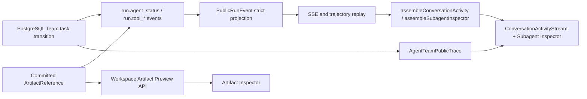

# Q&A Team Agent Status Vertical Slice Design

## Visual Thesis

延续 Data Agent 冷中性色、墨绿 accent 和高密度工作台语言，把执行过程做成回答正文的一部分：
公共 Think、Tool、Context、Subagent 是轻量单行 disclosure，正文在其间自然流动；右侧 Inspector 承载需要持续观察或较大阅读面积的 Subagent live feed 与 Artifact preview。

## Content Plan

```text
Data Agent header
Think · public planning summary                 [RUNNING]
intermediate answer text
Tool · semantic.release.read · release loaded  [COMPLETED]
Subagent · Text2SQL · compiling query           [RUNNING]
  -> nested governed Tool rows when expanded
  -> click Subagent name: right Inspector shows public live events
Artifact · query-evidence.sql
  -> click file: right Inspector shows governed preview
intermediate/final answer text
Subagent · Report · report accepted             [COMPLETED]
```

所有 block 使用稳定的单列文档流；组件不包进 Card，依赖 icon、baseline、留白和细 divider 建立层级。
桌面 Inspector 是 320–520px 可调右栏（默认 360px），中心列小于 640px 时先自动收起右栏；390px Inspector
占据 Composer 之上的主内容区，不覆盖 Composer。

## Interaction Plan

- 当前 RUNNING activity 的状态点使用低幅 opacity pulse；`prefers-reduced-motion` 时静止。
- 状态变更只更新颜色、图标和文本，不改变 disclosure row 高度。
- Disclosure control 展开 Inline details；Subagent 名称和 Artifact/file link 是独立 Inspector action，使用兄弟控件避免 nested button。
- Subagent 展开显示一层 Tool/Artifact children；Inspector 中“在轨迹中查看”跳到对应 sequence。
- Inspector 关闭后焦点返回触发项，切换 Conversation/Run 时关闭 stale target；自动收起只隐藏 panel，不删除当前 selection。

## Cross-Layer Flow



SSE 提供实时顺序和状态，Team Trace 提供最终审计详情，Artifact API 提供较大内容的安全 projection；三者
identity 不一致时 UI 显示 stale/error，不能自行择一成功。Subagent Inspector 不建立第二条事件权威，只过滤同一
Public Run Event replay；SSE connection state 只表达“实时/重连中/已结束”，不能推进 Agent status。

## Runtime Boundary

- `DataAgentTeamRunner` 仍是 `RunWorkflowExecutorPort`，但 production 注入真实
  `DataAgentProductTeamRuntimePort`，禁止 unavailable stub。
- Root orchestrator 通过 `PostgresTeamRunStore` 创建 root/child task、handoff、context epoch、completion、
  verifier/acceptance；每次 status event 必须发生在对应 durable transition 成功之后。
- Semantic 在已有可运行发布时提交 `SKIPPED` status receipt，不调用 candidate write。
- Text2SQL 顺序执行 release read -> compile -> sandbox execute，输出 `QueryEvidence`。
- Report 顺序执行 evidence read -> report project，输出 `AnalysisReport`；只有 Acceptance `ACCEPTED` 才完成 Run。
- Provider、Compiler、Sandbox、Artifact adapters 使用现有 authority ports；缺失能力返回 `BLOCKED/FAILED`，不造假 Artifact。
- Tool terminal event 只有在 Artifact Store commit/hash verify 之后才发布 `artifact_refs`；Inspector 不接受裸 path。

## Event Contract

新增 `run.agent_status`，用于 Subagent activity，payload 固定：

```ts
{
  profile_id: AgentSpecialistProfileId;
  task_id: UUID | null;
  status: "PENDING" | "RUNNING" | "COMPLETED" | "FAILED" |
    "INTERRUPTED" | "SKIPPED" | "BLOCKED";
  phase: VersionIdentifier;
  title: string;
  summary: string;
  duration_ms: number | null;
  error_code: VersionIdentifier | null;
}
```

Team `run.tool_*` payload 增加 first-class nullable `profile_id/task_id` 和 `artifact_refs: ArtifactReference[]`；非 Team
tool identity 为 null，START/无产物时 refs 为 `[]`。Web 禁止解析 input JSON 恢复 identity 或把 output/path 转成
Artifact。Web assembler 以 sequence 将相邻 answer delta 合并为 text block，以 block/call/task identity 折叠
reasoning/tool/subagent lifecycle，产生单一 `ConversationActivityBlock[]`。

## Inspector Contract

```ts
type QAInspectorTarget =
  | {
      kind: "subagent";
      runId: string;
      profileId: AgentSpecialistProfileId;
      taskId: string;
      anchorSequence: number;
    }
  | {
      kind: "artifact";
      runId: string;
      reference: ArtifactReference;
      anchorSequence: number;
    };

function assembleSubagentInspector(
  events: readonly PublicRunEvent[],
  target: Extract<QAInspectorTarget, { kind: "subagent" }>,
): SubagentInspectorSnapshot;
```

- QA store 只保存 selection；Subagent material 从当前 parsed events 派生，Artifact material 从严格 Preview response 派生。
- `task_id=null` 的 PENDING Agent 只有 Inline disclosure；没有 durable task identity 时不创建 Inspector target，也不按 profile 自动绑定未来 task。
- URL 用 `inspect=agent|artifact` 加稳定 identity 恢复 selection；参数未通过 schema 或不属于当前 Conversation 时显示 stale/denied，不猜测替代项。
- Subagent Inspector 分为 Overview、Live events、Artifacts；事件严格按 sequence，Tool/Artifact 只保留一层，不展示 raw SSE frame。
- Artifact Inspector 复用现有 `ArtifactWorkspace` renderer，服务端重新校验 Workspace READ、scope/run/revision/hash 并返回 `no-store`。

## Validation And Error Matrix

| Condition | Required behavior |
| --- | --- |
| Unknown Agent/Tool/ref field | Contract/PostgreSQL rejects before public projection |
| SSE disconnect while Agent RUNNING | Keep authority RUNNING; show reconnecting separately and replay after last sequence |
| Subagent identity absent/stale | Inspector shows explicit stale state; no nearest-Agent fallback |
| PENDING Agent has no durable task id | Inline status remains visible; Inspector action is disabled with accessible reason |
| Artifact ref missing or unsupported | No preview affordance or explicit unsupported state; never parse Tool output/path |
| Artifact scope/hash denied | Public denial/error code only; do not reveal body or existence |
| Inspector cannot fit center >= 640px | Auto-collapse panel, retain selection, keep conversation scroll |
| Conversation/Run switch | Clear stale target and return focus safely |

## Good / Base / Bad Cases

- Good：Text2SQL Tool 提交 SqlArtifact 后发布 exact ref；Inline file link 与 Inspector preview 指向同一 hash。
- Good：刷新后 Subagent Inspector 先用 durable replay 重建，再从最后 sequence 续接，行序与 trajectory 一致。
- Base：旧 Run 没有 `artifact_refs`，仍可查看 Inline/trajectory，但不出现伪 file link。
- Bad：单独订阅 Mastra callback 作为 Subagent SSE，或用 connection close 推断 Agent 已完成。
- Bad：把 Tool output 中看似路径的字符串交给浏览器/宿主打开。

## Tests Required

- Contract/PostgreSQL：Agent identity、Tool lifecycle identity、Artifact scope/revision/hash/exact keys、replay equivalence。
- Worker：persist-before-emit、commit-before-publish、retry/reconcile 不重复 Provider/Tool effect。
- Web assembler/store：Inline 与 Inspector 同源、URL restore、stale target、Conversation/Run switch、focus restore。
- Browser：真实 SSE reconnect、Artifact Preview denied/unsupported、1440x1000/390x844、center scroll 与 Composer 可操作。

## Wrong vs Correct

```ts
// Wrong: a second transient authority and an arbitrary path preview.
setAgentDone(eventSource.readyState === EventSource.CLOSED);
openFile(JSON.parse(tool.output).path);

// Correct: one durable event source plus a committed ArtifactReference.
const snapshot = assembleSubagentInspector(replayedEvents, target);
const preview = await fetchArtifactPreview(target.reference);
```

## Compatibility And Rollback

- 旧 Run 没有 agent event 时只显示已有 reasoning/tool/answer blocks，不补造三个 Agent；若 Team command 已知但
  runtime 无事件，显示一条明确的 Team BLOCKED/等待 block。
- 旧 Run 没有 `artifact_refs` 时不从 path/output 回填，Artifact Inspector 不可用但现有 answer/trajectory 保持可读。
- 新写入使用 `run-runtime-event@2.0.0` / `public-run-event@2.0.0`；v1 decoder 保留并规范化旧 Tool event，数据库 migration 前后原子部署，历史 sequence/row 不改写。
- 回滚 UI 不删除事件；回滚 runtime 时新 Run 明确 BLOCKED，不回退 legacy Research。

## Task Ordering

Contract child -> Runtime child -> UI child -> parent integration review。Inspector 依赖合同中的 Agent identity 与
Artifact locator，不能在第一个子任务前单独落 UI。每个 child 独立测试和提交。
