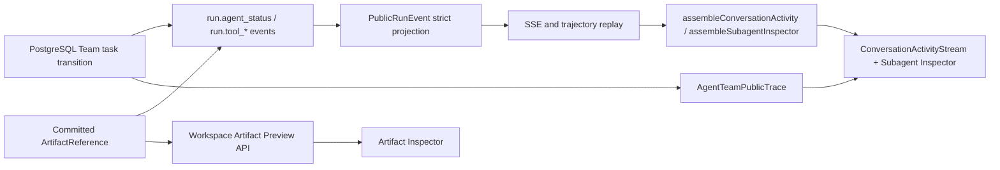
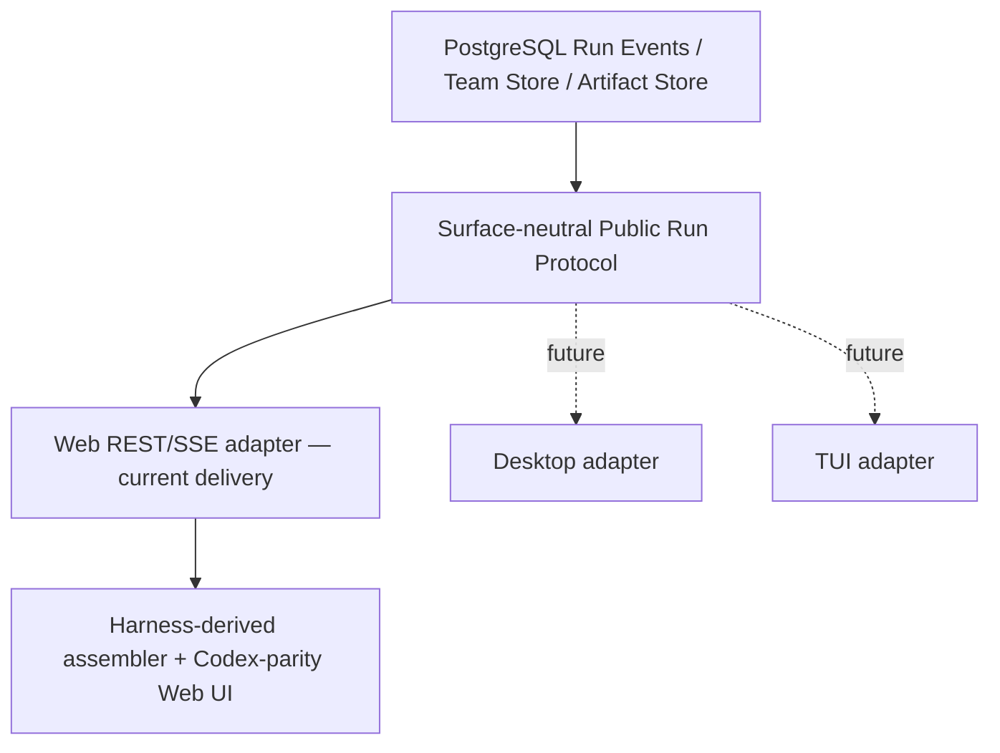

# Q&A Team Agent Status Vertical Slice Design

## Visual Thesis

延续 Data Agent 冷中性色、墨绿 accent 和高密度工作台语言，把执行过程做成回答正文的一部分：
公共 Think、Tool、Context、Subagent 是轻量单行 disclosure，正文在其间自然流动；右侧 Inspector 承载需要持续观察或较大阅读面积的 Subagent live feed 与 Artifact preview。

## Reference Priority And Code Reuse

本纵向切片明确采用三类外部参考，职责不同：

1. **Codex 桌面端 = 功能基准**：以当前可观察交互定义用户体验和验收，不推断其私有实现。
2. **DeepSeek Harness = 主要代码基线**：固定 commit `47f943859bef60e4160492346772ded9b24f765a`，
   在 MIT 条款下优先复制、裁剪和改造可兼容实现，而不是只看界面后重新手写。
3. **Reasonix = 多端分层的次级设计参考**：固定 commit `668cdee703680530901c67ff3908a95b720ad0d2`，
   参考 transport-agnostic Controller + typed event sink + surface adapter 的边界；不把它当主要代码来源。
4. **Data Agent = 权威与视觉边界**：保留 PostgreSQL Run Events、Workspace RBAC、ArtifactReference、现有组件和设计 token。

预计 Inline UI、Inspector shell、assembler/snapshot、Subagent baseline/live merge 与相应测试的大部分代码来自
Harness 移植改造；Data Agent 新写部分主要集中在 v2 事件合同、PostgreSQL validator、Workspace/Artifact authority
和 Semantic/Text2SQL/Report 领域适配。

复用源码或测试时，在目标文件头或仓库第三方来源清单记录 upstream path + commit + modified status，保留
`Copyright (c) 2026 DeepSeek` 与 MIT 许可文本。Codex 只形成行为验收记录。Reasonix 当前只形成架构证据记录；
若后续复制其代码，再单独维护 `Copyright (c) 2026 Reasonix Contributors` 与 MIT 来源条目。

| Data Agent deliverable | DeepSeek Harness primary source | Reuse mode |
| --- | --- | --- |
| event -> keyed block projection | `conversation-assembler.ts`, `chat-snapshot-builder.ts`, `trajectory-snapshot-builder.ts` | 移植状态机/排序/增量刷新结构，替换为 `PublicRunEvent` identity |
| inline Think/Tool disclosure | `ReasoningRow.tsx`, `ToolRow.tsx`, `DisclosureRow` primitives | 移植组件结构、状态语义、键盘与测试，换用 Data Agent token/icon |
| three-column Inspector shell | `AppFrame.tsx`, `columns.ts`, `stores.ts` | 移植 details rail、让步链、resize/persist 逻辑，接入 Workspace shell |
| Inspector material lookup | `DetailsPanel.tsx`, `tool-node-reader.ts` | 移植 selection-in-store/material-from-snapshot 边界，扩展 Agent/Artifact target |
| Subagent baseline + live | `session.ts`, `manager.ts`, `subagent-lineage.ts`, `SubagentCatalogAction.tsx` | 移植 baseline/live merge、状态/耗时/诊断模式，限制为一层 Team depth |
| produced file affordance | `ProducedFiles.tsx`, `turn-deliverables.ts` | 可复用 chip/测宽/可访问交互；把宿主 `openFile(path)` 替换为 Artifact Preview |
| replay/browser proof | Harness assembler、details lifecycle、subagent conversation/interrupt E2E | 移植 fixture 和断言结构，改写为真实 Web + Worker + SSE |

Reasonix 不是“一种跨端 wire protocol”的证据：它的 HTTP/SSE、ACP、Wails 和 TUI transport 不同。可借鉴的是所有
surface 都通过同一个无前端依赖的控制边界发命令并消费类型化事件，且用 layering lint 防止 runtime 反向依赖 UI。
详细证据见 `research/reasonix-multi-surface-protocol-design.md`。

## Content Plan

```text
Data Agent header
Think · public planning summary                 [RUNNING]
intermediate answer text
Tool · semantic.release.read · release loaded  [COMPLETED]
Subagent · Text2SQL · compiling query           [RUNNING]
  -> nested governed Tool rows when expanded
  -> click Subagent name: right Inspector shows public live events
Artifact · query-evidence.sql
  -> click file: right Inspector shows governed preview
intermediate/final answer text
Subagent · Report · report accepted             [COMPLETED]
```

所有 block 使用稳定的单列文档流；组件不包进 Card，依赖 icon、baseline、留白和细 divider 建立层级。
桌面 Inspector 是 320–520px 可调右栏（默认 360px），中心列小于 640px 时先自动收起右栏；390px Inspector
占据 Composer 之上的主内容区，不覆盖 Composer。

## Interaction Plan

- 当前 RUNNING activity 的状态点使用低幅 opacity pulse；`prefers-reduced-motion` 时静止。
- 状态变更只更新颜色、图标和文本，不改变 disclosure row 高度。
- Disclosure control 展开 Inline details；Subagent 名称和 Artifact/file link 是独立 Inspector action，使用兄弟控件避免 nested button。
- Subagent 展开显示一层 Tool/Artifact children；Inspector 中“在轨迹中查看”跳到对应 sequence。
- Inspector 关闭后焦点返回触发项，切换 Conversation/Run 时关闭 stale target；自动收起只隐藏 panel，不删除当前 selection。

## Codex Desktop Parity Matrix

| Observable capability | Required level |
| --- | --- |
| Think/Tool/Subagent 与正文按真实顺序穿插 | MATCH |
| Think、Tool、Subagent 默认折叠及 Enter/Space | MATCH |
| 点击文件/Artifact 在右栏预览并保持对话上下文 | MATCH，文件权威改为 ArtifactReference |
| 点击 Subagent 在右栏观察持续更新的公开活动 | MATCH，数据源改为 durable Run SSE |
| 右栏选择切换、关闭、调宽、刷新恢复 | MATCH |
| running/completed/failed/skipped/blocked、耗时、公开错误 | MATCH |
| 桌面双栏和窄屏可用性、focus return | MATCH/ADAPTED |
| 私有 chain-of-thought、Codex 私有工具协议、任意本地文件系统 | OUT_OF_SCOPE |

来源与对标账本分别维护在 `research/deepseek-harness-source-reuse-ledger.md` 和
`research/codex-desktop-parity-matrix.md`；实现和验收过程中持续补充，不只在最终总结中回忆。

## Cross-Layer Flow



SSE 提供实时顺序和状态，Team Trace 提供最终审计详情，Artifact API 提供较大内容的安全 projection；三者
identity 不一致时 UI 显示 stale/error，不能自行择一成功。Subagent Inspector 不建立第二条事件权威，只过滤同一
Public Run Event replay；SSE connection state 只表达“实时/重连中/已结束”，不能推进 Agent status。

## Multi-Surface Public Run Protocol



这里的 protocol 是版本化领域语义，不强制所有 surface 使用同一网络 envelope：

- `PublicRunEvent@v2`、`QAInspectorTarget`、`ArtifactReference/ArtifactPreviewResult` 是共享 DTO；
- `workspace_id/conversation_id/run_id/sequence` 和 Agent/Tool identity 在所有 adapter 中不变；
- replay cursor、dedupe、terminal closure、cancel/approve 等命令的 authority 语义一致；
- Web 使用 REST/SSE；未来 Desktop/TUI 可使用不同 transport，但只能适配同一 authority 和 projection core；
- surface-local store 只保存选择、布局和连接状态，不能拥有 Model/provider binding 或推进 Agent/Run status。

当前任务增加无 DOM 的 headless conformance fixture，证明 core projection 不依赖 React、浏览器 `EventSource` 或
桌面 host；不交付 Desktop/TUI/ACP 产品面。

## Runtime Boundary

- `DataAgentTeamRunner` 仍是 `RunWorkflowExecutorPort`，但 production 注入真实
  `DataAgentProductTeamRuntimePort`，禁止 unavailable stub。
- Root orchestrator 通过 `PostgresTeamRunStore` 创建 root/child task、handoff、context epoch、completion、
  verifier/acceptance；每次 status event 必须发生在对应 durable transition 成功之后。
- Semantic 在已有可运行发布时提交 `SKIPPED` status receipt，不调用 candidate write。
- Text2SQL 顺序执行 release read -> compile -> sandbox execute，输出 `QueryEvidence`。
- Report 顺序执行 evidence read -> report project，输出 `AnalysisReport`；只有 Acceptance `ACCEPTED` 才完成 Run。
- Provider、Compiler、Sandbox、Artifact adapters 使用现有 authority ports；缺失能力返回 `BLOCKED/FAILED`，不造假 Artifact。
- Tool terminal event 只有在 Artifact Store commit/hash verify 之后才发布 `artifact_refs`；Inspector 不接受裸 path。
- Runtime 和 public event core 不 import Web/Desktop/TUI package；所有 surface 只能通过同一 Run/Workspace command
  authority 与 typed public event port 交互，不能按客户端选择另一套 Model 或执行链。

## Event Contract

新增 `run.agent_status`，用于 Subagent activity，payload 固定：

```ts
{
  profile_id: AgentSpecialistProfileId;
  task_id: UUID | null;
  status: "PENDING" | "RUNNING" | "COMPLETED" | "FAILED" |
    "INTERRUPTED" | "SKIPPED" | "BLOCKED";
  phase: VersionIdentifier;
  title: string;
  summary: string;
  duration_ms: number | null;
  error_code: VersionIdentifier | null;
}
```

Team `run.tool_*` payload 增加 first-class nullable `profile_id/task_id` 和 `artifact_refs: ArtifactReference[]`；非 Team
tool identity 为 null，START/无产物时 refs 为 `[]`。Web 禁止解析 input JSON 恢复 identity 或把 output/path 转成
Artifact。Web assembler 以 sequence 将相邻 answer delta 合并为 text block，以 block/call/task identity 折叠
reasoning/tool/subagent lifecycle，产生单一 `ConversationActivityBlock[]`。

## Inspector Contract

```ts
type QAInspectorTarget =
  | {
      kind: "subagent";
      runId: string;
      profileId: AgentSpecialistProfileId;
      taskId: string;
      anchorSequence: number;
    }
  | {
      kind: "artifact";
      runId: string;
      reference: ArtifactReference;
      anchorSequence: number;
    };

function assembleSubagentInspector(
  events: readonly PublicRunEvent[],
  target: Extract<QAInspectorTarget, { kind: "subagent" }>,
): SubagentInspectorSnapshot;
```

- QA store 只保存 selection；Subagent material 从当前 parsed events 派生，Artifact material 从严格 Preview response 派生。
- `task_id=null` 的 PENDING Agent 只有 Inline disclosure；没有 durable task identity 时不创建 Inspector target，也不按 profile 自动绑定未来 task。
- URL 用 `inspect=agent|artifact` 加稳定 identity 恢复 selection；参数未通过 schema 或不属于当前 Conversation 时显示 stale/denied，不猜测替代项。
- Subagent Inspector 分为 Overview、Live events、Artifacts；事件严格按 sequence，Tool/Artifact 只保留一层，不展示 raw SSE frame。
- Artifact Inspector 复用现有 `ArtifactWorkspace` renderer，服务端重新校验 Workspace READ、scope/run/revision/hash 并返回 `no-store`。

## Validation And Error Matrix

| Condition | Required behavior |
| --- | --- |
| Unknown Agent/Tool/ref field | Contract/PostgreSQL rejects before public projection |
| SSE disconnect while Agent RUNNING | Keep authority RUNNING; show reconnecting separately and replay after last sequence |
| Subagent identity absent/stale | Inspector shows explicit stale state; no nearest-Agent fallback |
| PENDING Agent has no durable task id | Inline status remains visible; Inspector action is disabled with accessible reason |
| Artifact ref missing or unsupported | No preview affordance or explicit unsupported state; never parse Tool output/path |
| Artifact scope/hash denied | Public denial/error code only; do not reveal body or existence |
| Inspector cannot fit center >= 640px | Auto-collapse panel, retain selection, keep conversation scroll |
| Conversation/Run switch | Clear stale target and return focus safely |

## Good / Base / Bad Cases

- Good：Text2SQL Tool 提交 SqlArtifact 后发布 exact ref；Inline file link 与 Inspector preview 指向同一 hash。
- Good：刷新后 Subagent Inspector 先用 durable replay 重建，再从最后 sequence 续接，行序与 trajectory 一致。
- Base：旧 Run 没有 `artifact_refs`，仍可查看 Inline/trajectory，但不出现伪 file link。
- Bad：单独订阅 Mastra callback 作为 Subagent SSE，或用 connection close 推断 Agent 已完成。
- Bad：把 Tool output 中看似路径的字符串交给浏览器/宿主打开。

## Tests Required

- Contract/PostgreSQL：Agent identity、Tool lifecycle identity、Artifact scope/revision/hash/exact keys、replay equivalence。
- Worker：persist-before-emit、commit-before-publish、retry/reconcile 不重复 Provider/Tool effect。
- Web assembler/store：Inline 与 Inspector 同源、URL restore、stale target、Conversation/Run switch、focus restore。
- Browser：真实 SSE reconnect、Artifact Preview denied/unsupported、1440x1000/390x844、center scroll 与 Composer 可操作。
- Reference parity：Codex capability matrix 每行必须有截图、ARIA snapshot 或交互断言；DeepSeek Harness 来源清单中的
  每个复用项必须有对应 Data Agent test，并验证没有带入 host `openFile`、多级 lineage 或私有 event payload。
- Multi-surface conformance：同一 replay fixture 通过 Web wire adapter 与 headless adapter 后保持 event identity、
  sequence、terminal closure、Inspector target 与公开错误码一致；只允许 envelope/view model 不同。

## Wrong vs Correct

```ts
// Wrong: a second transient authority and an arbitrary path preview.
setAgentDone(eventSource.readyState === EventSource.CLOSED);
openFile(JSON.parse(tool.output).path);

// Correct: one durable event source plus a committed ArtifactReference.
const snapshot = assembleSubagentInspector(replayedEvents, target);
const preview = await fetchArtifactPreview(target.reference);
```

## Compatibility And Rollback

- 旧 Run 没有 agent event 时只显示已有 reasoning/tool/answer blocks，不补造三个 Agent；若 Team command 已知但
  runtime 无事件，显示一条明确的 Team BLOCKED/等待 block。
- 旧 Run 没有 `artifact_refs` 时不从 path/output 回填，Artifact Inspector 不可用但现有 answer/trajectory 保持可读。
- 新写入使用 `run-runtime-event@2.0.0` / `public-run-event@2.0.0`；v1 decoder 保留并规范化旧 Tool event，数据库 migration 前后原子部署，历史 sequence/row 不改写。
- 回滚 UI 不删除事件；回滚 runtime 时新 Run 明确 BLOCKED，不回退 legacy Research。
- 回滚或重写已移植的 Harness 代码时保留来源/许可记录；替换实现不等于删除第三方归属历史。
- Reasonix 仅为设计参考；若未来引入 Desktop/TUI，必须新增独立任务和 surface adapter，不得把 transport 条件分支塞入 Team runtime。

## Task Ordering

Contract child -> Runtime child -> UI child -> parent integration review。Inspector 依赖合同中的 Agent identity 与
Artifact locator，不能在第一个子任务前单独落 UI。每个 child 独立测试和提交。
