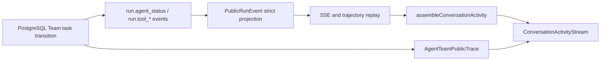

# Q&A Team Agent Status Vertical Slice Design

## Visual Thesis

延续 Data Agent 冷中性色、墨绿 accent 和高密度工作台语言，把执行过程做成回答正文的一部分：
公共 Think、Tool、Context、Subagent 是轻量单行 disclosure，正文在其间自然流动，克制、可扫描、可展开。

## Content Plan

```text
Data Agent header
Think · public planning summary                 [RUNNING]
intermediate answer text
Tool · semantic.release.read · release loaded  [COMPLETED]
Subagent · Text2SQL · compiling query           [RUNNING]
  -> nested governed Tool rows when expanded
intermediate/final answer text
Subagent · Report · report accepted             [COMPLETED]
```

所有 block 使用稳定的单列文档流；桌面和 mobile 只调整缩进、摘要截断和详情宽度。组件不包进 Card，
依赖 icon、baseline、留白和细 divider 建立层级。

## Interaction Plan

- 当前 RUNNING activity 的状态点使用低幅 opacity pulse；`prefers-reduced-motion` 时静止。
- 状态变更只更新颜色、图标和文本，不改变 disclosure row 高度。
- 整行可展开；Subagent 展开显示一层 Tool/Artifact children，轨迹按钮跳到对应 sequence。

## Cross-Layer Flow



SSE 提供实时顺序和状态，Team Trace 提供最终审计详情；两者 identity 不一致时 UI 显示 stale/error，不能自行择一成功。

## Runtime Boundary

- `DataAgentTeamRunner` 仍是 `RunWorkflowExecutorPort`，但 production 注入真实
  `DataAgentProductTeamRuntimePort`，禁止 unavailable stub。
- Root orchestrator 通过 `PostgresTeamRunStore` 创建 root/child task、handoff、context epoch、completion、
  verifier/acceptance；每次 status event 必须发生在对应 durable transition 成功之后。
- Semantic 在已有可运行发布时提交 `SKIPPED` status receipt，不调用 candidate write。
- Text2SQL 顺序执行 release read -> compile -> sandbox execute，输出 `QueryEvidence`。
- Report 顺序执行 evidence read -> report project，输出 `AnalysisReport`；只有 Acceptance `ACCEPTED` 才完成 Run。
- Provider、Compiler、Sandbox、Artifact adapters 使用现有 authority ports；缺失能力返回 `BLOCKED/FAILED`，不造假 Artifact。

## Event Contract

新增 `run.agent_status`，用于 Subagent activity，payload 固定：

```ts
{
  profile_id: AgentSpecialistProfileId;
  task_id: UUID | null;
  status: "PENDING" | "RUNNING" | "COMPLETED" | "FAILED" |
    "INTERRUPTED" | "SKIPPED" | "BLOCKED";
  phase: VersionIdentifier;
  title: string;
  summary: string;
  duration_ms: number | null;
  error_code: VersionIdentifier | null;
}
```

Team `run.tool_*` payload 增加 first-class nullable `profile_id/task_id`；非 Team tool 为 null。Web 禁止解析
input JSON 恢复 identity。Web assembler 以 sequence 将相邻 answer delta 合并为 text block，以 block/call/task identity
折叠 reasoning/tool/subagent lifecycle，产生单一 `ConversationActivityBlock[]`。

## Compatibility And Rollback

- 旧 Run 没有 agent event 时只显示已有 reasoning/tool/answer blocks，不补造三个 Agent；若 Team command 已知但
  runtime 无事件，显示一条明确的 Team BLOCKED/等待 block。
- Public event schema 仍使用版本化严格联合；数据库 migration 前后同时部署，旧 event 保持可读。
- 回滚 UI 不删除事件；回滚 runtime 时新 Run 明确 BLOCKED，不回退 legacy Research。

## Task Ordering

Contract child -> Runtime child -> UI child -> parent integration review。每个 child 独立测试和提交。
