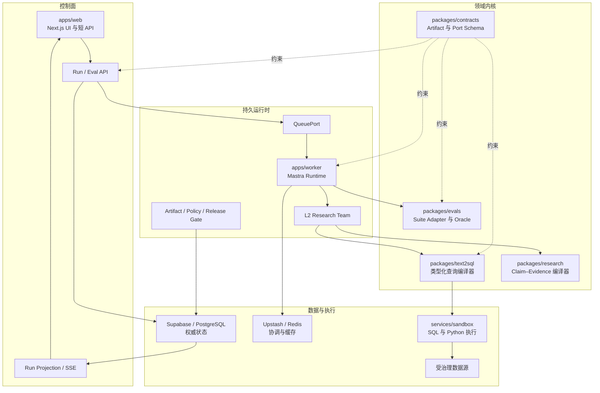
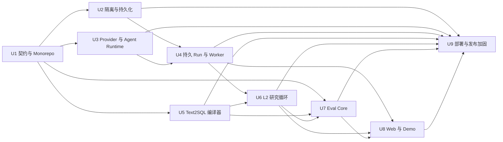

# Data Agent L2 纵向切片彻底重置计划

## 目标胶囊（Goal Capsule）

- **目标：** 用绿地架构替代已重置的 `text2sql` 项目。首版只闭合一个可量化纵向切片：L2 多步研究分析师、强 Text2SQL、评测驱动迭代。
- **权威边界：** 产品契约决定“系统应做什么”，KTD 决定“系统如何实现”；概率型 Agent 只能提出候选，确定性编译器、策略、执行器、验证器和发布门禁才可提交权威状态。
- **执行形态：** pnpm TypeScript Monorepo；Next.js 负责短生命周期控制面；Mastra 运行于持久 Worker；Python 服务承载隔离执行与 Benchmark；Supabase/PostgreSQL 保存权威状态；Redis 兼容层负责非权威协调；同时提供托管与 Docker 适配。
- **停止条件：** 若 Artifact 来源不可追溯、共享 Supabase 不能失败关闭、不同 Benchmark 的 Oracle 被压成一个总分，或实现会让用户误以为 L3–L5 已交付，则停止实现并回到计划审查。
- **后续责任：** 本计划获用户批准前不启动产品实现；执行阶段必须遵循 Verification Contract，并如实生成 `GO/HOLD/NO_GO/ROLLBACK` 证据。

---

## 产品契约（Product Contract）

### 摘要（Summary）

首版将一个分析问题转换为可复现的研究报告。用户可以检查并重放其中的 SQL、执行结果、Claim、Evidence、冲突、局限和发布决策。Mastra 提供 Agent 运行时，但系统正确性来自类型化 Artifact 和确定性门禁，而不是 Agent 自我宣称。

系统通过能力契约接入 OpenAI、Anthropic/Claude、DeepSeek、GLM、Kimi、Grok、Gemini 等模型，并支持多 Agent Team；业务内核不依赖某个 Provider 协议。托管形态使用 Vercel、Supabase、Upstash，Docker 形态实现相同端口与状态语义。

### 问题界定（Problem Frame）

旧项目包含值得迁移的业务语义、SQL 校验、执行 Receipt、成对评测和发布决策，但主 Text2SQL 生命周期被固定 LangGraph 图与旧应用状态绑定。继续增加节点或 Agent，只会让执行结构继续充当产品架构，不能真正分离编排、SQL 正确性与研究正确性。

彻底重置必须先形成可证伪的完整产品。若首版同时实现 L2–L5，会在任何一个能力闭环得到证据之前，同时放大运行时、Sandbox、评测、安全和产品界面的复杂度。因此采用用户确认的纵向切片。

### 角色（Actors）

- A1. **分析用户：** 提交问题、范围、允许使用的数据和预期决策支持；审阅 Claim、Evidence、局限与澄清请求。
- A2. **领域负责人：** 发布 Semantic Release、指标定义、业务不变量、Verified Query 和发布关键评测切片。
- A3. **平台运维者：** 注册应用、Provider 凭据、数据源、预算、迁移所有权与部署策略。
- A4. **研究主管 Agent：** 提出计划并委派类型化任务，但不能扩大策略范围，也不能签发 `ReportReadyCertificate`。
- A5. **SQL/Evidence Worker：** 在声明的能力与预算内产生候选 Artifact 和 Receipt。
- A6. **确定性验证器与发布门禁：** 提交 Policy、SQL、Evidence、租户隔离和 Release Decision。

### 需求（Requirements）

#### 绿地架构与迁移

- R1. 新仓库采用绿地架构，只从 `text2sql@c36aca8` 迁移与框架无关的领域契约、Fixture、不变量与 Characterization Test；不迁移 LangGraph 状态和旧 NestJS 目录结构。

#### 运行时与能力阶梯

- R2. 使用 Mastra 承载模型路由、Agent、Team、Workflow、暂停/恢复、可观察性与通用 Scorer；`ModelProviderAdapter` 与可执行的 `ExternalAgentAdapter` 必须分离。
- R3. 首版交付 L2 多步研究、强 Text2SQL 与评测闭环；L3–L5 只提供稳定 Artifact Schema、Port 和 Capability Descriptor，不提供会被误判为已交付的工作流、成功状态或 UI 入口。

#### Text2SQL 正确性

- R4. Text2SQL 必须把冻结的 Question 与 Semantic Contract 编译为 Grounding、Logical Plan、SQL、Validation、受控 Execution 和 QueryEvidence；Intent、Semantic、Structural、Policy、Resource、Execution、Result 七道门禁独立判定、独立留痕。

#### 部署与隔离

- R5. 托管与 Docker 部署必须实现相同的 Storage、Queue、Cache、Sandbox、Identity 和 Health Contract。多个应用共享一个 Supabase Project 时，数据库、Migration、Storage、Credential 与 Redis 边界必须按应用隔离。

#### 评测与产品体验

- R6. InsightBench、DAB、RCAEval 与自建可控归因数据集必须通过版本化 `BenchmarkSuiteAdapter` 接入，同时保留各自的 Oracle、Run Manifest、Trace、成本、失败分类、Holdout 和 Demo 资格。

#### 可追溯性与工作流

- R7. 架构与实现结论必须追溯到 `data-agent-system-design` 研究链，并区分目标设计、合成验证、固定源码审计、托管验证和签名真实结果。
- R8. Trellis 保存产品与执行上下文，Compound Engineering 负责实施级计划、审查、执行和验证；用户明确批准前不得开始产品代码实现。

### 关键产品决策（Key Product Decision）

- 首版采用“L2 多步研究分析师 + 强 Text2SQL + 评测闭环”的纵向切片，不同时实现 L2–L5。原因是先让一个端到端能力可演示、可测量、可纠错，再引入新的计算内核。该决策约束 R3、R4、R6。

### 关键流程（Key Flows）

- F1. **有证据的分析报告**
  - **触发：** A1 提交问题并选择授权数据范围。
  - **参与者：** A1、A4、A5、A6。
  - **步骤：** 编译 `ResearchBrief`；建立竞争性假设；编译 `QueryContract`；执行已验证 SQL；建立 Claim–Evidence 关系；评估覆盖度；投影报告。
  - **结果：** 只有全部关键 Claim、执行结果、冲突、新鲜度检查和重放引用闭合后才能 `READY`；否则返回类型化的 `PARTIAL`、澄清、阻断或无结论状态。
  - **覆盖：** R2、R3、R4。

- F2. **Text2SQL 澄清与失败关闭**
  - **触发：** 语义编译器发现指标、粒度、时间、Join、权限或结果契约存在未解决歧义。
  - **参与者：** A1、A2、A5、A6。
  - **步骤：** 保存失败 Artifact 与 Reason Code；请求最小必要澄清或拒绝执行；获得输入后生成新 Revision。
  - **结果：** 不在推断或扩大的范围上执行 SQL，旧 Revision 保持可重放。
  - **覆盖：** R4。

- F3. **Provider 与 Agent Team 执行**
  - **触发：** 研究或 SQL 任务需要声明的模型能力或专业 Agent。
  - **参与者：** A3、A4、A5。
  - **步骤：** 解析 `ModelProfile`；创建类型化 `TaskEnvelope`；携带 Artifact 引用与预算委派；保存工具和模型 Receipt；在策略内重试或降级。
  - **结果：** 更换 Provider 不改变领域契约；Claude Code 等外部 Agent 不会误获普通模型 Provider 的权限。
  - **覆盖：** R2。

- F4. **评测驱动开发**
  - **触发：** Code、Prompt、Model、Semantic Release 或 Evaluator Revision 发生变化。
  - **参与者：** A2、A3、A6。
  - **步骤：** 冻结 Candidate/Baseline Manifest；运行 Smoke 或 Full Slice；执行各 Suite 自有 Oracle；进行配对比较；归类回归。
  - **结果：** Release Decision 精确引用关键切片和证据；Demo 子集不能替代 Holdout 或排行榜运行。
  - **覆盖：** R6、R7。

- F5. **托管环境的长任务**
  - **触发：** Vercel 收到分析请求。
  - **参与者：** A1、A3、A4。
  - **步骤：** 鉴权并持久化 `RunRequest`；写入事务化 Outbox；Worker 获取带 Fence 的 Lease；持久化 Artifact 与进度；中断后从 Snapshot 恢复。
  - **结果：** HTTP 请求生命周期不拥有分析生命周期，重复投递不能重复提交 Revision。
  - **覆盖：** R2、R5。

- F6. **共享 Supabase 的应用隔离**
  - **触发：** 应用访问数据库、Storage、Migration 或 Redis。
  - **参与者：** A3、A6。
  - **步骤：** 解析服务端拥有的 `app_id`；绑定 App/Tenant Claim；进入应用命名空间；校验 Grant 与 RLS；校验 Storage/Redis 前缀；记录审计证据。
  - **结果：** 应用 A 的凭据或请求不能枚举、读取、修改、迁移、导出或删除应用 B 的资源。
  - **覆盖：** R5。

- F7. **Docker 对等**
  - **触发：** 运维者启动自托管 Profile。
  - **参与者：** A3。
  - **步骤：** 启动 Web、Worker、Sandbox、PostgreSQL 和 Redis 兼容服务；应用同一 Migration Manifest；运行 Contract 与 Health Probe。
  - **结果：** 同一 L2 Demo 与 Benchmark Smoke 不依赖托管平台的隐含能力即可运行。
  - **覆盖：** R5。

### 验收示例（Acceptance Examples）

- AE1. 覆盖 R3、R4：给定已授权 Demo Question、冻结 Dataset 和 Semantic Release，运行完成后，UI 必须展示 `ResearchBrief`、Hypothesis、SQL Artifact、Validation/Execution Receipt、Claim、Evidence、Conflict、Limitation 和 `ReportReady` 决策。
- AE2. 覆盖 R4：给定两个都合理的收入定义，且请求范围内没有权威定义时，编译器只请求一个必要澄清，并且不执行 SQL。
- AE3. 覆盖 R4：给定语法正确但粒度或业务不变量错误的 SQL，Result Gate 必须拒绝；有限修复不得改变 `QueryContract`。
- AE4. 覆盖 R2：主 Provider 不可用但策略允许兼容的 Fallback 时，任务用 Fallback Profile 恢复，记录两次尝试，但 Artifact 权威性不变。
- AE5. 覆盖 R2：配置 Claude Code Adapter 后，它只能获得 Workspace、Capability、Permission、Cancel 和 Audit Envelope，并被记录为 External Agent，而不是语言模型 Provider。
- AE6. 覆盖 R5：已认证的应用 A 后端请求携带应用 B 标识时，数据库、Storage、Migration 和 Redis 操作均失败，并产生 Isolation Audit Receipt。
- AE7. 覆盖 R5：同一 Source 与 Migration Manifest 分别在托管和 Docker Contract Suite 中运行时，公开 Schema、终态和错误码一致。
- AE8. 覆盖 R6：四类 Benchmark 各导入一个 Case 后，都生成标准 `EvalCase`，但保留不同 Oracle Type 和 Suite Version。
- AE9. 覆盖 R6、R7：合成与公共 Smoke 全绿但缺少签名代表性结果时，Release Decision 必须保持 `HOLD`。
- AE10. 覆盖 R6：用户启动公开 Demo 时，必须看到来源、License、Dataset Version、“仅体验”标记和与 Hidden Holdout 的隔离说明。
- AE11. 覆盖 R2、R5：Worker 在 Execution Receipt 提交后、Report Projection 前崩溃，重新获得 Lease 后复用已提交 Artifact，不再次执行 SQL。
- AE12. 覆盖 R3：UI 或 API 请求 L3–L5 时，首版明确显示“未交付”，且不能合成表示已交付的 Receipt。

### 成功标准（Success Criteria）

- 至少一个 Demo Case 能从 Question 重放到 `ReportReady`，或正确到达类型化非 Ready 终态，并展示所有权威 Artifact。
- Text2SQL 失败分类能定位到具体编译或 Gate 阶段；Smoke Suite 对七道 Gate 各有至少一个正例和一个失败关闭用例。
- Benchmark Manifest 绑定 Code、Data、Schema、Semantic、Policy、Model、Prompt、Workflow、Evaluator 和 Seed 版本。
- 首个内建可控案例固定为 `retail-revenue-investigation-v1`：使用合成零售数据回答“华南区净收入为何下降、哪些解释得到数据支持”，只输出贡献因素与竞争解释，不越界声称因果识别。
- 共享 Supabase 隔离测试证明应用 A 不能跨越应用 B 的数据库、Migration、Storage、Redis、Export 和 Delete 边界。
- 托管与 Docker 通过同一 Contract Suite；缺少真实托管凭据时生成明确 `HOLD`，不能伪造通过。
- 首版任何 API、UI 文案、Receipt 或 Release Manifest 都不得表示 L3–L5 已实现。

### 范围边界（Scope Boundaries）

#### 延后实现

- L3 Experiment DAG、统计假设验证和 `ResultCertificate`。
- L4 定时观察、多重检验控制、新颖性检测和 `DiscoveryReceipt`。
- L5 因果识别、估计、敏感性分析和 `IdentificationCertificate`。
- RCAEval Full Suite 发布门禁；首版只实现 Adapter 与诊断 Smoke Path。

#### 首版之外

- L6 生产写操作或自主业务决策。
- 自动迁移旧生产数据，或兼容旧应用 API。
- 在没有冻结代表性结果前承诺生产准确率、成本、时延或业务收益。
- 用单一总分混合正确性、安全、报告质量和不同 Benchmark Family。

### 依赖（Dependencies）

- 实现开始时锁定 Mastra 与 Provider SDK 的精确版本，并通过 Capability Probe 验证。
- Benchmark Code、Dataset 和 Demo 再分发必须固定版本、Digest 与 License。
- Supabase、Vercel、Upstash 托管验证需要用户提供项目与 Secret；缺失时不阻塞本地开发，但必须阻断托管 `GO`。
- A2 必须批准第一份代表性 Semantic Release、业务不变量与 Private Release Slice，之后才可提出生产能力结论。

---

## 规划契约（Planning Contract）

### 关键技术决策（Key Technical Decisions）

- KTD1. **L2 是真实实现，L3–L5 仅为契约。** `(session-settled: user-directed — 用户选择纵向切片，拒绝首版同时实现 L2–L5；理由是更快达到可演示、可量化、可迭代的闭环。)` L3–L5 只导出版本化 Schema 与 Capability Descriptor；Workflow、UI 成功态和默认 Tool Route 不得实例化这些能力。约束 R3。
- KTD2. **使用 pnpm TypeScript Monorepo，并设置 Python Sandbox 边界。** Next.js 与 Mastra 共用 TypeScript Contract；依赖 Python 生态的 Benchmark 与数据执行通过版本化 Sandbox Protocol 隔离。避免 Python 控制面分叉，也不强迫 Python Benchmark 迁移到 Node。约束 R2、R5、R6。
- KTD3. **Mastra 是执行底座，不是正确性权威。** Mastra 管理 Agent/Workflow 生命周期；`ArtifactStore`、Policy Engine、Compiler、Executor、Verifier 和 Release Gate 提交领域状态。Model 或 Supervisor 不能直接设置 `READY`、`validated`、`executed`。约束 R2、R3、R4。
- KTD4. **分离 `ModelProviderAdapter` 与 `ExternalAgentAdapter`。** Model Profile 描述推理能力与 Fallback；External Agent Profile 描述 Process/Session、Workspace、Permission、Cancellation 和 Event Stream。防止 CLI Agent 绕过 Tool 与 Audit 边界。约束 R2。
- KTD5. **PostgreSQL 保存权威状态，Redis 只做非权威协调。** Supabase/PostgreSQL 保存 Revision Artifact、Event、Lease、Idempotency Key、Eval Manifest 和 Audit Evidence；Redis 处理 Cache、Rate Limit、短期去重与可丢失通知信号，但不能成为 Queue、Run Transition 或 Artifact 的唯一副本。约束 R5、R6。
- KTD6. **共享 Supabase Project 只暴露窄 `api` Schema，业务 Schema 保持私有。** Platform Registry 拥有不可变 `app_id`；API Function/View 在访问私有数据前绑定 App/Tenant Claim。Migration Ledger、Storage Path 和 Redis Key 使用同一应用命名空间。约束 R5。
- KTD7. **托管控制面与持久 Worker 面分离。** Vercel Endpoint 只负责鉴权、持久化、入队、取消和 Projection Stream；Worker 在请求生命周期外 Lease/Resume Mastra Run。Queue 为 At-Least-Once，所有 Transition 与 Side Effect 必须幂等。约束 R2、R5。
- KTD8. **Text2SQL 通过类型化中间 Artifact 编译。** Model 可以提出 Grounding、Logical Plan 和 SQL Candidate，但冻结的 `QueryContract` 与七道独立 Gate 约束执行。Repair 只能改变 SQL 实现，并触发完整重新验证。约束 R4。
- KTD9. **统一 Benchmark 运输协议，不统一 Benchmark 真值。** `EvalCase`、`EvalRun`、`ScoreCard` 共享；InsightBench、DAB、RCAEval 和可控归因保留独立 Oracle 与 Release Slice。确定性 Verdict 与 LLM Judge 诊断分开。约束 R6、R7。
- KTD10. **使用 Characterization Test 迁移旧行为。** 从 `text2sql@c36aca8` 保留 Fixture、输入、权威 Artifact、终态和 Release Semantic；不迁移 LangGraph State 或 NestJS Shape。新系统可以更严格，但差异必须形成明确迁移决策。约束 R1、R4、R6。
- KTD11. **Trace 与 Artifact 是一等产品界面。** Web 使用与 Agent/API 相同的类型化 Run Projection；Demo Launch、Clarification、Cancel、Resume、Evidence Inspection 和 Eval Comparison 不能成为仅 UI 可做的隐藏操作。约束 R3、R6。
- KTD12. **Schema Metadata、检索内容、Benchmark Bundle、SQL Result 与 Tool Output 一律视为不可信数据。** 只有项目拥有的 Instruction 与 Policy Artifact 能指导运行时；不可信数据必须分隔、绑定 Provenance、限制大小，且不能扩大 Tool、Credential、Network 或 App Scope。约束 R2、R4、R5、R6。
- KTD13. **命令接收与 Outbox 发布采用同一事务，首版默认使用 PostgreSQL Lease Queue。** Run Command、Idempotency Record、Initial Event 和 Outbox Record 原子提交；默认 Worker 通过 `FOR UPDATE SKIP LOCKED` 获取带 Fence 的 PostgreSQL Lease，`QueuePort` 保留替换 Vercel Queues/QStash 等 Adapter 的边界。这样关闭 Database/Queue Split-Brain 窗口、避免首版再依赖一个 Queue SaaS，同时不让 Redis 成为权威。约束 R2、R5。
- KTD14. **首版只把 PostgreSQL 作为可发布 SQL Dialect，并显式绑定数据快照能力。** `LogicalPlan` 与 `SqlDialectPort` 保留扩展边界，但 MySQL、ClickHouse 等 Dialect 不在首版支持清单。`ExecutionReceipt` 必须绑定 Datasource Identity、Schema Version、Snapshot Token/Watermark、Observed Time 与 Query Hash；数据源不能提供可重放快照时，Run 必须标记为受限重放或 `REPLAY_UNAVAILABLE`。约束 R4、R7。
- KTD15. **Identity、Credential、连接目标与公开对象访问都使用服务端能力对象。** Supabase Auth Token 只提供经过签名验证的用户身份；`app_id`、Tenant Membership 与 Role 必须由服务端 Deployment Mapping 和 App 私有成员表解析，不能信任客户端 Claim/Header。数据库只保存 `SecretRef`、Owner、Environment、Rotation/Revocation Metadata，不保存可回显明文；托管环境使用受管 Secret Store，Docker 使用不可提交的 Secret File/Environment Injection。Datasource Connection 通过 Egress Allowlist、DNS 解析与 Private/Link-Local IP 拒绝；Run/Artifact/SSE/Export/Delete 逐对象校验 App、Tenant 与 Principal。约束 R2、R5。

### 高层技术设计（High-Level Technical Design）



依赖规则由 Lint 与 Architecture Test 强制执行：

- `packages/contracts` 不依赖任何 Runtime Framework。
- 领域 Package 只依赖 Contract 与显式 Port。
- `packages/agent-runtime` 可以依赖 Mastra，但领域 Package 不得依赖 Mastra。
- `packages/platform` 实现 Storage/Queue/Cache Port，不导入领域 Workflow。
- App 只做组合，不成为领域真值来源。

首版权威 Artifact 链为：

```text
QuestionFrame
→ ResearchBrief
→ HypothesisSet
→ EvidencePlan
→ QueryContract
→ GroundingPackage
→ SemanticQuery
→ LogicalPlan
→ SqlArtifact
→ ValidationReceipt
→ ExecutionReceipt
→ QueryEvidence
→ AtomicClaim / EvidenceRelation
→ AnalysisReport
→ ReportReadyCertificate
```

每个 Artifact 使用 `ArtifactEnvelope`，至少包含 `app_id`、`tenant_id`、`run_id`、`revision`、`attempt_id`、`producer`、`input_refs`、Policy/Semantic/Schema/Model Version、Content Hash、Status 与 Timestamp。语义变化必须产生新 Revision；迟到结果可以归档，但不能覆盖 Active Revision。

### 目标仓库结构（Planned Repository Shape）

```text
apps/
  web/
  worker/
packages/
  contracts/
  agent-runtime/
  platform/
  text2sql/
  research/
  evals/
services/
  sandbox/
benchmarks/
  manifests/
  demo-cases/
infra/
  supabase/
tests/
  contract/
  integration/
  e2e/
compose.yaml
```

### 状态与错误语义（State and Error Semantics）

公开 Run 终态为 `READY`、`PARTIAL`、`NEEDS_CLARIFICATION`、`NEEDS_MORE_RESEARCH`、`INCONCLUSIVE`、`POLICY_BLOCKED`、`FAILED`、`CANCELLED`、`STALE`、`REPLAY_UNAVAILABLE`。Release Decision 独立为 `GO`、`HOLD`、`NO_GO`、`ROLLBACK`；一次 Run 成功不等于 Release `GO`。

Command Acceptance、Idempotency Record、Initial Event 与 Outbox Entry 共用数据库事务。Artifact Commit 在事务内比较 Active Revision 与 Worker Fence，持久提交后才确认 Queue。错误跨层传播时必须携带类型化 Reason Code 与责任 Artifact：

- Provider Failure 可在同一 Task Contract 内重试。
- Semantic Ambiguity 进入 Clarification。
- Policy 或 Isolation 不确定时失败关闭。
- Resource Failure 取消执行。
- Result Oracle 失败才允许进入有界 SQL Repair。
- Evidence Gap 进入 `PARTIAL` 或 `NEEDS_MORE_RESEARCH`。
- Version Tuple 过期会让 Cache 与 Release Evidence 失效。

### 共享 Supabase 隔离契约（Shared Supabase Isolation Contract）

- `platform.app_registry` 与 `platform.schema_registry` 分配不可变应用身份和 Schema Ownership。
- 每个产品应用拥有私有 Schema，例如 `app_data_agent`；私有 Table 不直接通过 Data API 暴露。
- Supabase Auth 的 `auth.uid()` 只作为用户身份输入；每个 App 在私有 Principal/Membership 表中独立映射该用户，服务端根据 Deployment Mapping 解析 `app_id`，拒绝客户端提供的 App/Tenant/Role Header 或 Claim。
- 暴露的 `api` Schema 仅含必要的 App-Aware RPC/View，名称使用 `<app_slug>__<operation>`，避免共享 Project 内不同应用发生 API 名称碰撞；Grant 与 RLS 同时要求服务端解析的 App、Tenant、Principal Context。
- Repository 只能从 Registry 白名单解析 Schema，并用事务内固定 `search_path` 访问；客户端提供的 Schema 名称永远不能进入标识符拼接。
- `public` Schema 不承载业务 Table/Function，并从 Anonymous/Authenticated Role 撤销非必要 Create/Usage；公开 Demo 使用独立、限流、只读的 `demo_principal`，只能访问已登记 Demo Dataset。
- Browser 永远不能获得 `service_role`；Backend Credential 与 Encryption Envelope 按 App 隔离并审计。
- App Migration 使用独立目录、Version Table、Checksum 与 Advisory Lock；只有 Platform Owner 可以迁移共享 Schema。
- Storage Path 使用 `<app_id>/<tenant_id>/<artifact_kind>/<digest>`，Policy 校验前两个 Segment。
- Redis Key 使用 `da:<app_id>:<environment>:<kind>:<id>`，Adapter 在访问 Redis 前拒绝无 Scope Key。
- Backup、Restore、Export、Retention 与 Delete Job 必须接收 App Capability，并产生 Boundary Receipt。
- Audit Projection 对 Credential、受限原始 Row 和敏感 Prompt/Tool Payload 脱敏，同时保留 Content Hash 与授权 Artifact Reference。
- 删除应用采用可恢复分阶段流程：冻结新 Command、枚举 Database/Storage/Redis 资源、按策略 Export 或 Expire、验证无残留引用、最后退役 Registry Entry。

### 评测契约（Benchmark Contract）

`BenchmarkSuiteAdapter` 将不可变 Suite Case 导入 `EvalCase`。`EvalRun` 绑定 Source Commit、Suite Version、Data Snapshot、Semantic/Schema/Policy Version、Model Profile、Prompt/Workflow/Evaluator Version、Seed、Budget 和 Trace。`ScoreCard` 分别报告 Deterministic Verdict、Judge Diagnostic、Latency、Cost、Safety Counter 与 Failure Taxonomy，不平均不兼容的 Oracle Family。

- PR：运行确定性 Smoke Slice。
- Nightly：运行更大的固定 Suite。
- Release Candidate：运行声明阈值的 Paired Baseline/Candidate Slice，并对 Safety Counter 实施零容忍。
- Demo Case：单独审核 License、脱敏、标记与登记；永不进入 Hidden Holdout。

### 首个纵向切片样例（Reference Vertical Slice Fixture）

首个项目自有样例固定为 `retail-revenue-investigation-v1`，避免开发者在实现阶段重新决定演示域：

- **数据：** PostgreSQL 合成快照，包含订单、退款、促销、商品、区域与履约事件；Semantic Release 明确定义毛收入、退款、折扣、净收入、订单粒度、人民币单位和 Asia/Shanghai 时间。
- **主问题：** “2025 年第一季度华南区净收入同比为什么下降？哪些竞争解释得到数据支持，哪些仍不能确认？”
- **L2 边界：** 允许报告贡献分解、相关变化、证据支持和反证；禁止使用“导致”“因果效应”等 L5 结论。
- **正向路径：** 至少需要两次互相依赖的查询、一个竞争性 Hypothesis 被反证、一个被支持，并生成完整 `ReportReadyCertificate`。
- **失败变体：** 收入口径歧义、Join Fan-Out、迟到退款导致 Snapshot 过期、无权限字段、诱导性 Schema Comment、Evidence 冲突与 Budget 耗尽。
- **评测用途：** 同一 Fixture 同时驱动 Text2SQL Gate、L2 Research、可控归因 Adapter、Browser Demo 与 Docker/Hosted Smoke；Demo Copy 必须注明“合成体验样例”。

### 实施顺序（Sequencing）



### 假设（Assumptions）

- U1 的 Capability Probe 完成后再选择精确稳定依赖版本；首版 Provider 支持清单固定为 OpenAI、Anthropic/Claude、DeepSeek、GLM、Kimi、Grok、Gemini，不依赖某个具体模型名称长期不变。
- 首个托管环境可以只使用一个 Supabase Project、一个 Upstash Database 和一个 Worker Deployment，但必须至少测试两个逻辑应用命名空间。
- 首版托管 Worker 发布同一 OCI Image，可运行在任意支持常驻容器与 Health Probe 的平台；默认 Queue 实现为 PostgreSQL Lease Queue，Upstash 只承担 Cache、Rate Limit 与进度通知。
- 首版发布级 SQL Dialect 为 PostgreSQL；其他 Dialect 只有 Port，不得出现在“已支持”清单。
- 每个 Benchmark Case 经 License Review 后才可选择再分发；支持 Adapter 不等于允许进入 Demo。
- `retail-revenue-investigation-v1` 只证明工程闭环；首个真实业务域和私有结果切片仍属于待输入产品资产，在其签名证据出现前 Release 必须诚实保持 `HOLD`。

### 延后问题（Deferred Questions）

- 哪个业务域与 Semantic Release 作为第一份签名代表性结果切片？
- InsightBench、DAB、RCAEval 中哪些 Case 在法律与运维上适合进入产品 Demo Library？
- 经过数据区域和预算审查后，公开 Demo 默认启用哪些 Provider？

这些问题不阻塞实现，因为对应 Port、Manifest 与失败关闭状态已经定义；它们阻塞真实托管 `GO` 或生产能力结论。

### Agent 原生操作分类（Agent-Native Action Classification）

| 操作 | 分类 | 契约 |
| --- | --- | --- |
| 创建、取消、恢复、重放、检查分析 Run | 首版实现 | UI、API、Agent Tool 操作同一持久 Run 与 Artifact |
| 回答澄清并选择授权范围 | 首版实现 | 用户或 Agent 提交类型化 Response；新 Revision 前重新校验 Policy |
| 启动允许的 Demo 或 Eval Slice | 首版实现 | Case List 与 Run Create 原语保留 Manifest、Budget 与 Release State |
| 配置 Provider/Data Source Secret | 仅人工 | Secret Input、OAuth Consent 与 Platform Permission Dialog 不暴露给 Agent |
| 发布 Semantic Release 与批准私有阈值 | 仅人工 | 领域负责人签名；Agent 可准备 Diff，但不能自批 |
| 调度 L4 观察或执行 L3/L5 Kernel | 后续 | 只有 Capability Descriptor，首版没有可调用 Tool 或 Workflow |
| 执行生产写操作 | 首版禁止 | 不发布 L6 Action Port、Credential 或 Success State |

### 系统级影响（System-Wide Impact）

| 范围 | 权威状态 | 主要失败 | 必需保护 |
| --- | --- | --- | --- |
| Identity/Tenancy | PostgreSQL App/Tenant/Principal Context | Confused Deputy 导致跨应用访问 | 服务端 App Identity、Grant、RLS、Scoped Credential |
| Run/Artifact | PostgreSQL Event 与 Artifact Record | 重复或迟到提交 | Idempotency Key、Active Revision、Optimistic Commit、Fence |
| Agent Context | Artifact Reference 与 Task Envelope | Chat History 导致权限或语义漂移 | Typed Handoff、Version Binding、Context Projection |
| SQL Execution | Validation/Execution Receipt | 不安全或语义错误查询 | 七道 Gate、Sandbox、有界 Repair |
| Research Evidence | Claim–Evidence Graph 与 Manifest | 无支持或过期 Claim | Entailment、Conflict、Freshness Gate |
| Cache/Queue | Redis 兼容协调 | 消息丢失、Cache 过期、Lease 重复 | 非权威设计、TTL、Fence、Replay、Outbox |
| Evaluation | Eval Manifest、Run、ScoreCard | 泄漏或误导性平均 | Holdout 隔离、Suite Oracle、Paired Baseline |
| UI/API | 版本化 Run Projection | 权威未闭合但 UI 先显示成功 | Shared Contract、Terminal-State Test |
| Deployment | Source/Migration Manifest | 托管与 Docker 漂移 | Contract Suite、Image Provenance、Migration Checksum |

### 风险与缓解（Risks and Mitigations）

| 风险 | 影响 | 缓解 |
| --- | --- | --- |
| Mastra 或 Provider API 变化 | Runtime 集成失效或 Capability 假设漂移 | 固定版本、Capability Probe、Adapter 隔离、Contract Test |
| 共享 Supabase 的高权限连接绕过 RLS | 跨应用数据泄露 | Browser 不持有 Service Role；Repository 强制 App Capability；覆盖 Direct/RPC 测试 |
| Schema、来源、SQL 值或 Benchmark 中的 Prompt Injection | Tool/Scope 扩权或数据外泄 | KTD12 的 Data/Instruction 分离、Tool Allowlist、Egress Policy、Provenance、对抗 Fixture |
| 私有 App Schema Migration 冲突 | 一个项目破坏另一个项目状态 | 独立 Ledger/Lock；Shared Schema 仅 Platform Owner；Restore 演练 |
| Command 已提交但 Queue 发布失败 | Run 不执行或重试后重复执行 | KTD13 Transactional Outbox、幂等 Publisher、Lease Fence、Stuck-Outbox Alert |
| Queue 重试重复 SQL/Eval | 成本重复或 Evidence 不一致 | Idempotent Command、Content-Addressed Receipt、Fence |
| LLM Judge 波动掩盖确定性失败 | 错误发布信心 | Deterministic Gate 优先；Judge 仅诊断且版本化 |
| Demo Case 泄漏进 Tuning/Holdout | 指标虚高 | 独立 Registry/Digest、Holdout Access Policy、Contamination Check |
| Benchmark Archive 被替换或恶意构造 | Sandbox Escape、结果污染、不可复现 | 固定 Digest/License、隔离导入、解包不执行 Hook、Source Review |
| Python Sandbox 逃逸或失控 | 数据外泄或资源耗尽 | 隔离 Network/Filesystem、Read-Only Mount、CPU/Memory/Time/Output Budget |
| Multi-Agent 增加成本但不提升质量 | 产品更慢更脆弱 | Single Agent/Workflow/Team 成对评测；Net-Benefit Release Gate |
| 整体复制旧实现 | 重新引入 Graph/State 耦合 | Characterization Migration；只允许迁移审查过的资产 |
| CI 无法运行 Hosted 验证 | 对可部署性产生虚假结论 | Local Contract Test + 明确 Hosted `HOLD`，直到有签名 Smoke Receipt |

### 来源（Sources）

- RQ080：`data-agent-system-design` 的目标架构、固定源码审计、Benchmark、部署与共享 Supabase 综合结论。
- `mastra@57b032d:packages/core/src/agent/subagent.ts` 与 `packages/core/src/workflows/utils.ts`：Sub-Agent 与 Suspended Snapshot 边界。
- `text2sql@c36aca8:apps/backend/src/modules/conversation/runtime/langgraph/text2sql-v2-langgraph.graph.ts`：旧固定 Graph 与可迁移 Execution Receipt。
- `text2sql@c36aca8:apps/backend/src/modules/conversation/runtime/evaluation/text2sql-accuracy-evaluation.service.ts`：Version Tuple、Paired Evidence、Safety Counter 和 Release Decision。
- [Mastra Supervisor Agents](https://mastra.ai/docs/agents/supervisor-agents)
- [Supabase API 安全指南](https://supabase.com/docs/guides/api/securing-your-api)
- [Supabase 数据库迁移](https://supabase.com/docs/guides/deployment/database-migrations)
- [Vercel Queues 概念](https://vercel.com/docs/queues/concepts)
- [Upstash Redis TypeScript SDK](https://upstash.com/docs/redis/sdks/ts/overview)
- [InsightBench](https://github.com/ServiceNow/insight-bench)
- [Data Agent Benchmark](https://arxiv.org/html/2603.20576)
- [RCAEval](https://github.com/phamquiluan/RCAEval)

---

## 实施单元（Implementation Units）

### U1. 建立 Monorepo 与权威契约

- **目标：** 建立可构建的仓库基础和所有后续单元共用的版本化 Contract。
- **对应需求：** R1、R2、R3、R5、R6、R8；F3、F5、F7；AE4、AE7、AE12。
- **依赖：** 无。
- **文件：**
  - `package.json`
  - `pnpm-workspace.yaml`
  - `turbo.json`
  - `tsconfig.base.json`
  - `packages/contracts/src/artifacts/`
  - `packages/contracts/src/runs/`
  - `packages/contracts/src/providers/`
  - `packages/contracts/src/evals/`
  - `packages/contracts/src/capabilities/`
  - `packages/contracts/test/`
  - `scripts/capability-probe.ts`
- **方法：** 在接入框架前定义 `ArtifactEnvelope`、Artifact Reference、Run Terminal、Release Decision、Port Contract、L2 Schema 与仅契约的 L3–L5 Schema；配置根级质量命令与依赖边界。
- **测试场景：**
  - `packages/contracts/test/artifact-envelope.spec.ts`：拒绝跨 App Reference、无效 Revision Ancestry、缺失 Version Binding 与可变 ID。
  - `packages/contracts/test/capability-levels.spec.ts`：L3–L5 Schema 可解析，但不能产生首版已交付 Receipt。
  - `packages/contracts/test/public-errors.spec.ts`：所有公开终态与 Release Decision 都有稳定可序列化 Reason Code。
  - `packages/contracts/test/port-conformance.spec.ts`：Storage、Queue、Cache、Sandbox 的 In-Memory Adapter 通过同一 Conformance Fixture。
  - `packages/contracts/test/dependency-boundaries.spec.ts`：禁止 Contract 或无权领域内核导入 Mastra、Supabase、Redis、Next.js 与 Python Service。
- **验证：** `pnpm lint && pnpm typecheck && pnpm test:unit --filter contracts` 通过；Architecture Test 证明依赖方向不可逆；L3–L5 无可执行入口。

### U2. 实现权威持久化与共享 Supabase 隔离

- **目标：** 让 Run、Artifact、Event、Outbox、Eval 与 Audit 在共享 Supabase Project 内保持应用级隔离和可恢复性。
- **对应需求：** R5、R6；F5、F6、F7；AE6、AE7、AE11。
- **依赖：** U1。
- **文件：**
  - `packages/platform/src/persistence/`
  - `packages/platform/src/tenancy/`
  - `packages/platform/src/storage/`
  - `packages/platform/src/cache/`
  - `packages/platform/src/outbox/`
  - `packages/platform/src/secrets/`
  - `packages/platform/src/datasources/`
  - `infra/supabase/platform/migrations/`
  - `infra/supabase/apps/data-agent/migrations/`
  - `tests/integration/tenancy/`
  - `tests/integration/persistence/`
- **方法：** 建立 Platform/App Registry、私有 App Schema、带 App 前缀的窄 `api` RPC/View、固定 `search_path`、双层 Grant+RLS、App-Aware Repository、独立 Migration Ledger/Lock、Storage/Redis Namespace、Transactional Outbox 和分阶段 App Delete。实现 `SecretRef` 与 Datasource Connection Policy；明文 Secret 只从环境或受管 Secret Store 注入，数据库、Artifact、Log 与 Trace 不保存可回显 Secret。
- **测试场景：**
  - `tests/integration/tenancy/database-isolation.spec.ts`：App A/Tenant A 不能 Direct 或 RPC 访问 App B/Tenant B。
  - `tests/integration/tenancy/storage-isolation.spec.ts`：错误 Path Prefix 在上传、下载、List、Delete 时失败。
  - `tests/integration/tenancy/redis-isolation.spec.ts`：无 Scope Key 与 App Prefix 不匹配在命中 Redis 前失败。
  - `tests/integration/tenancy/migration-isolation.spec.ts`：并发 App Migration 使用独立 Ledger/Lock；Shared Schema 只允许 Platform Owner。
  - `tests/integration/tenancy/service-role-guard.spec.ts`：底层测试连接绕过 RLS 时，Repository API 仍要求 App Capability。
  - `tests/integration/tenancy/api-surface-collision.spec.ts`：两个 App 注册同名 Operation 时，公开 RPC 名称、Grant 与 `search_path` 不碰撞。
  - `tests/integration/tenancy/api-object-authz.spec.ts`：Run、Artifact、SSE、Export 与 Delete 均拒绝跨 App/Tenant/Principal 的对象标识。
  - `tests/integration/tenancy/identity-context.spec.ts`：伪造 App/Tenant/Role Header 或 JWT Custom Claim 不改变服务端 Deployment/Membership 解析；Membership 撤销即时生效。
  - `tests/integration/tenancy/demo-principal.spec.ts`：未登录 Demo Principal 只能读取登记的合成 Dataset，不能发现真实 Datasource、Secret、其他 App 或 Hidden Holdout。
  - `tests/integration/tenancy/credential-lifecycle.spec.ts`：Secret 创建、轮换、撤销、环境隔离和脱敏日志不泄露明文。
  - `tests/integration/tenancy/datasource-egress.spec.ts`：拒绝未授权 Host、DNS Rebinding、Loopback、Private、Link-Local 与 Metadata Service 地址。
  - `tests/integration/tenancy/app-deletion.spec.ts`：冻结、枚举、删除、验证、恢复一个 App Namespace，不影响另一个 App。
- **验证：** 两个 App、每个两个 Tenant 的完整隔离套件通过；拒绝尝试生成 Audit Receipt；每个 App 可独立 Restore。

### U3. 集成 Mastra、Model Profile、External Agent 与类型化 Team

- **目标：** 提供 Provider-Neutral Agent 执行，并为可执行 External Agent 建立独立生命周期。
- **对应需求：** R2、R3；F3；AE4、AE5。
- **依赖：** U1。
- **文件：**
  - `packages/agent-runtime/src/mastra/`
  - `packages/agent-runtime/src/models/`
  - `packages/agent-runtime/src/external-agents/`
  - `packages/agent-runtime/src/teams/`
  - `packages/agent-runtime/src/tools/`
  - `packages/agent-runtime/test/`
  - `apps/worker/src/mastra.ts`
- **方法：** 用项目自有 Port 包裹 Mastra；按 Capability 而不是 Provider 分支解析 Model；为 OpenAI、Anthropic/Claude、DeepSeek、GLM、Kimi、Grok、Gemini 建立真实 `ModelProfile` 与 Adapter 配置，复用兼容 SDK 但不把 Provider 分支放入领域代码；定义 `TaskEnvelope`、`HandoffReceipt`、Budget Propagation、Tool Policy 与 Context Projection；实现默认关闭的 Claude Code Process/Session Adapter Contract。
- **测试场景：**
  - `packages/agent-runtime/test/model-router.spec.ts`：解析所需 Capability、拒绝不支持 Profile、记录允许的 Fallback。
  - `packages/agent-runtime/test/provider-conformance.spec.ts`：七类首版 Provider 全部通过 Request Shape、Structured Output、Tool Call、Stream、Error Normalization 与 Capability Fixture，领域逻辑中没有 Provider 分支。
  - `packages/agent-runtime/test/provider-certification.spec.ts`：只有完成 Credentialed Smoke 且 Receipt 绑定真实 Model ID 的 Provider 才标记为 `AVAILABLE`；缺少 Credential 的 Provider 标记 `UNVERIFIED`，不能伪装通过。
  - `packages/agent-runtime/test/external-agent-boundary.spec.ts`：External Agent 必须携带 Workspace、Permission、Cancel、Audit Envelope，且不能注册为 Model。
  - `packages/agent-runtime/test/team-handoff.spec.ts`：Agent 只收到 Artifact Reference 与 Scoped Context，不收到其他 Agent 的无限 Raw Memory。
  - `packages/agent-runtime/test/tool-policy.spec.ts`：拒绝未声明 Tool Call，并保留 Failure Receipt。
  - `packages/agent-runtime/test/untrusted-context.spec.ts`：Schema Comment、Source Text、SQL Value 和 Tool Output 不能新增 Instruction、Credential、Tool 或更大 App Scope。
- **验证：** Capability Probe 生成版本化报告；七类 Model Adapter 在 CI 可用的 Mock Mode 通过，至少两个不同 Provider 在提供 Credential 时完成真实 Smoke；External Agent Test 不要求本机安装 CLI。

### U4. 建立持久 Run 编排与 Worker 面

- **目标：** 将分析生命周期与 HTTP 请求解耦，使 Pause、Resume、Retry、Cancel、Replay 幂等。
- **对应需求：** R2、R5；F5；AE4、AE11。
- **依赖：** U2、U3。
- **文件：**
  - `apps/worker/src/runs/`
  - `apps/worker/src/leases/`
  - `apps/worker/src/projections/`
  - `packages/platform/src/queue/`
  - `packages/platform/src/events/`
  - `apps/web/src/server/runs/`
  - `tests/integration/runtime/`
- **方法：** Command、Idempotency Record、Initial Event 与 Outbox 在同一事务提交；默认 PostgreSQL Queue Adapter 用 `FOR UPDATE SKIP LOCKED` 和 Fencing Token 获取 Lease；Mastra Snapshot 绑定 Active Artifact Revision；Projection 来自 Durable Event；SQL/Eval Side Effect 使用 Content Address。托管 Worker 与 Docker Worker 运行同一 OCI Image。
- **测试场景：**
  - `tests/integration/runtime/duplicate-delivery.spec.ts`：同一 Command 投递两次，只提交一次 Transition 与一个 Side Effect Receipt。
  - `tests/integration/runtime/crash-resume.spec.ts`：Execution Receipt 提交后崩溃，从 Report Projection 恢复，不重复执行。
  - `tests/integration/runtime/cancel-race.spec.ts`：Provider Streaming 中取消，拒绝所有迟到 Success Projection。
  - `tests/integration/runtime/stale-worker.spec.ts`：过期 Fence 的 Worker 不能覆盖 Active Revision。
  - `tests/integration/runtime/replay.spec.ts`：从 Event 与 Artifact Reference 重建 Public Projection，Hash 与 Live Projection 一致。
- **验证：** PostgreSQL+Redis Adapter 与确定性 In-Memory Adapter 都通过 Runtime Integration；Replay Hash 一致。

### U5. 实现强 Text2SQL 编译器并迁移已验证不变量

- **目标：** 产生受语义约束、策略安全、资源受限、结果可验证的 `QueryEvidence`。
- **对应需求：** R1、R4、R7；F1、F2；AE2、AE3。
- **依赖：** U1。
- **文件：**
  - `packages/text2sql/src/contracts/`
  - `packages/text2sql/src/grounding/`
  - `packages/text2sql/src/semantic/`
  - `packages/text2sql/src/planning/`
  - `packages/text2sql/src/compiler/`
  - `packages/text2sql/src/gates/`
  - `packages/text2sql/src/repair/`
  - `packages/text2sql/src/execution/`
  - `packages/text2sql/test/`
  - `services/sandbox/pyproject.toml`
  - `services/sandbox/src/data_agent_sandbox/protocol/`
  - `services/sandbox/src/data_agent_sandbox/sql/`
  - `services/sandbox/tests/test_sql_execution.py`
  - `tests/fixtures/text2sql/legacy-characterization/`
- **方法：** 落地 KTD8/KTD10/KTD14；通过 Characterization Fixture 迁移旧 QueryContract、Receipt、Oracle 与 Release Semantic；实现类型化 Logical Plan 与首版 PostgreSQL Dialect Compiler；Grounding 先做 ACL，再做 Join Closure；七道 Gate 分别可观察；Repair 只能保持语义。U5 同时交付最小可运行 SQL Sandbox 与 Snapshot Protocol，U9 只负责生产部署和资源加固，避免 U5/U7 反向依赖最终部署单元。
- **测试场景：**
  - `packages/text2sql/test/query-contract.spec.ts`：识别 Metric、Grain、Time、Unit、Datasource、Result Contract 歧义。
  - `packages/text2sql/test/grounding-closure.spec.ts`：包含必要 Join Bridge，拒绝歧义或无权 Closure。
  - `packages/text2sql/test/gate-matrix.spec.ts`：七道 Gate 各有正例与失败关闭 Fixture。
  - `packages/text2sql/test/repair-boundary.spec.ts`：允许 Identifier/Dialect Repair，拒绝 Metric、Filter、Join、Policy、Result Contract 变化。
  - `packages/text2sql/test/metamorphic-result.spec.ts`：用保持不变量的数据变换捕获 `SUM(DISTINCT)`、Fan-Out、Null 与时间边界错误。
  - `packages/text2sql/test/dialect-boundary.spec.ts`：PostgreSQL 可发布；其他 Dialect 只能返回 `UNSUPPORTED_DIALECT`，不能落入不受测分支。
  - `packages/text2sql/test/source-snapshot.spec.ts`：Receipt 绑定 Datasource、Schema、Snapshot/Watermark、Observed Time 与 Query Hash；缺少快照能力时重放状态降级。
  - `tests/integration/text2sql/legacy-characterization.spec.ts`：与 `text2sql@c36aca8` 选定 Fixture 比较 Artifact/Terminal，并记录有意收紧差异。
- **验证：** Text2SQL Suite 产生阶段级 Reason Code/Receipt；Query 只有在七张当前 Gate Receipt 全部有效时才可执行。

### U6. 实现 L2 研究循环与 ReportReady 权威

- **目标：** 把已验证 Query/Source Evidence 转换为多步、证据受限的分析报告。
- **对应需求：** R2、R3、R4；F1、F2；AE1、AE11、AE12。
- **依赖：** U3、U4、U5。
- **文件：**
  - `packages/research/src/contracts/`
  - `packages/research/src/planning/`
  - `packages/research/src/hypotheses/`
  - `packages/research/src/evidence/`
  - `packages/research/src/claims/`
  - `packages/research/src/coverage/`
  - `packages/research/src/reporting/`
  - `packages/research/src/release/`
  - `packages/research/test/`
  - `apps/worker/src/workflows/l2-research.workflow.ts`
- **方法：** 编译 `ResearchBrief` 与 Proof Obligation；保留竞争性 Hypothesis；把 SQL Result 转成 `QueryEvidence`；验证 Support、Conflict、Freshness、Source Independence；用 Coverage/Budget Decision 可重放地停止；Prose 只从已提交 Claim 投影。Release Gate 独占 `ReportReadyCertificate` 与非 Ready 终态。
- **测试场景：**
  - `packages/research/test/research-brief.spec.ts`：拒绝缺少 Scope、Evidence Policy、Success Criteria 或预算冲突。
  - `packages/research/test/competing-hypotheses.spec.ts`：要求能区分假设的 Evidence，而非重复改写。
  - `packages/research/test/claim-evidence.spec.ts`：拒绝只相关但不支持的 Citation、隐藏 Conflict、过期 Evidence 与跨 Revision Reference。
  - `packages/research/test/coverage-stop.spec.ts`：从 Obligation Coverage、Information Gain、Failure、Budget 重放停止决策。
  - `packages/research/test/report-ready.spec.ts`：覆盖全部 Ready/Non-Ready Terminal，证明 Writer/Supervisor 无法绕过 Gate。
  - `tests/integration/research/text2sql-evidence.spec.ts`：`QueryContract` 经 `QueryEvidence` 支持 Atomic Claim；Data/Semantic Version 变化使 Claim 失效。
- **验证：** Controlled L2 Fixture 到达 `READY`；Mutation Fixture 到达正确非 Ready 终态；删除或篡改关键 Artifact 会使 Certificate 失效。

### U7. 建立 Benchmark 平台与 Suite Adapter

- **目标：** 让评测题在开发、发布和合规 Demo 中执行，同时不混淆不同真值标准。
- **对应需求：** R6、R7；F4；AE8、AE9、AE10。
- **依赖：** U1、U5、U6。
- **文件：**
  - `packages/evals/src/core/`
  - `packages/evals/src/adapters/insightbench/`
  - `packages/evals/src/adapters/dab/`
  - `packages/evals/src/adapters/rcaeval/`
  - `packages/evals/src/adapters/controlled-attribution/`
  - `packages/evals/src/release/`
  - `packages/evals/test/`
  - `benchmarks/manifests/`
  - `benchmarks/demo-cases/`
  - `services/sandbox/src/data_agent_sandbox/evals/`
- **方法：** 落地 KTD9；固定 Suite Source/Dataset Version；统一 Transport，分派到各自 Oracle；Deterministic/Judge Verdict 分开；支持 Paired Run；严格分离 Holdout/Demo Registry。RCAEval 首版提供真实 Adapter Contract 与 Smoke Case，但 Full Release Gate 延后。
- **测试场景：**
  - `packages/evals/test/adapter-conformance.spec.ts`：每个 Suite 导入一个 Case，标准化为 `EvalCase`，且不丢失 Suite Field/Oracle Type。
  - `packages/evals/test/oracle-separation.spec.ts`：InsightBench Judge Score 不能满足 DAB Result Equivalence 或 RCAEval Root-Cause Ranking。
  - `packages/evals/test/manifest-replay.spec.ts`：完整 Version Tuple 可重放，任一依赖变化可被发现。
  - `packages/evals/test/holdout-contamination.spec.ts`：Demo/Tuning Asset 与受保护 Holdout Digest 重合时失败。
  - `packages/evals/test/bundle-integrity.spec.ts`：拒绝 Digest 变化、Path Traversal、Executable Unpack Hook、未知 License 与未审核 Demo Eligibility。
  - `packages/evals/test/release-decision.spec.ts`：缺少签名代表性 Pair 时保持 `HOLD`；Safety Zero-Tolerance 先于 Aggregate Metric。
  - `packages/evals/test/reference-demo-manifest.spec.ts`：固定 `retail-revenue-investigation-v1` 的 Dataset、Semantic、Question、Mutation、Budget、License 与 L2 非因果边界。
  - `tests/integration/evals/smoke-suites.spec.ts`：运行固定 DAB、InsightBench、可控归因 Smoke 与 RCAEval Adapter Smoke。
- **验证：** 四个 Adapter 通过 Conformance；ScoreCard 按 Suite 分离；Paired Output 包含 Cost、Trace、Failure、Interval 与 Release Decision。

### U8. 交付分析工作台与 Demo 体验

- **目标：** 通过一个真实、可检查的产品界面呈现 L2 纵向切片、Evidence、控制操作与 Eval Comparison。
- **对应需求：** R3、R6；F1、F2、F4、F5；AE1、AE2、AE10、AE12。
- **依赖：** U4、U6、U7。
- **文件：**
  - `apps/web/src/app/`
  - `apps/web/src/components/runs/`
  - `apps/web/src/components/artifacts/`
  - `apps/web/src/components/evidence/`
  - `apps/web/src/components/evals/`
  - `apps/web/src/components/demo-cases/`
  - `apps/web/src/server/`
  - `apps/web/tests/unit/`
  - `tests/e2e/`
- **方法：** 工作台围绕 Typed Run Projection，而不是 Chat Message 构建。信息层级固定为：Run Header/权威状态与当前动作 → Question/Scope/Clarification → Report/Claim–Evidence → Hypothesis/SQL/Receipt Trace → Eval Comparison；详情使用渐进展开，不能用一组同权 Dashboard Card 淹没结论。用户可提交问题或 Demo、回答澄清、检查 Hypothesis/SQL/Receipt/Claim–Evidence、Cancel/Resume/Replay、比较 Eval Run；L3–L5 始终显示未交付。每个交互必须定义 Loading、Empty、Error、Partial、Stale、Permission-Denied 状态，并支持键盘、Screen Reader、Focus Recovery、窄屏与触屏。
- **测试场景：**
  - `apps/web/tests/unit/run-state-rendering.spec.tsx`：渲染全部 Public Terminal，绝不把 `PARTIAL`、`HOLD`、`STALE` 映射为成功。
  - `apps/web/tests/unit/interaction-states.spec.tsx`：Question、Clarification、Artifact、Evidence、Eval 分别覆盖 Loading、Empty、Error、Partial、Stale 与 Permission-Denied。
  - `apps/web/tests/unit/artifact-lineage.spec.tsx`：从 Report Claim 导航至 Evidence、SQL、Execution Receipt 与 Version Tuple。
  - `apps/web/tests/unit/accessibility.spec.tsx`：状态变化可被 Screen Reader 宣告；键盘可完成 Launch、Clarify、Cancel、Resume、Replay 与 Artifact Navigation；Modal/Drawer 关闭后恢复 Focus。
  - `tests/e2e/l2-demo-ready.spec.ts`：启动授权 Fixture，并检查完整 Ready Chain。
  - `tests/e2e/l2-demo-clarification.spec.ts`：解决一个语义歧义并观察新 Revision。
  - `tests/e2e/l2-demo-cancel-resume.spec.ts`：取消并恢复，不重复执行。
  - `tests/e2e/run-stream-reconnect.spec.ts`：SSE 断开后按 Last Event/Projection Version 恢复，事件缺口从 PostgreSQL Projection 补齐，而不是依赖 Redis 信号。
  - `tests/e2e/eval-comparison.spec.ts`：比较 Paired Run，显示 Suite-Specific Verdict 与 Release State。
  - `tests/e2e/capability-boundary.spec.ts`：L3–L5 Route 与文案保持未交付。
- **验证：** Browser Test 覆盖 Ready、Partial、Clarification、Cancel、Replay、Eval、Deferred Capability；API/UI 终态语义一致。

### U9. 闭合 Sandbox、托管/Docker 部署、发布与运维门禁

- **目标：** 产出可部署 Artifact、一键 Docker 启动、托管配置和诚实的 Release Verification Bundle。
- **对应需求：** R5、R7、R8；F5、F6、F7；AE6、AE7、AE9、AE11。
- **依赖：** U2、U3、U4、U5、U6、U7、U8。
- **文件：**
  - `services/sandbox/src/data_agent_sandbox/runtime/`
  - `services/sandbox/tests/test_resource_limits.py`
  - `apps/web/vercel.json`
  - `compose.yaml`
  - `infra/supabase/`
  - `infra/docker/`
  - `scripts/verify-release.ts`
  - `scripts/hosted-smoke.ts`
  - `scripts/docker-smoke.ts`
  - `docs/runbooks/`
  - `tests/deployment/`
- **方法：** 对 U5/U7 已可运行的 Sandbox 增加生产级 CPU、Memory、Time、Filesystem、Network、Row、Byte 与 Output 隔离；所有 Image 来自同一 Source State。Vercel 部署控制面，同一 OCI Worker Image 部署到支持常驻容器的平台，默认轮询 PostgreSQL Lease Queue；Docker 使用相同 Worker Image。托管/Docker 使用同一 Environment Schema、Migration、Health Check、Secret Contract 与 Contract Test；把 Component、Workflow、Eval、Tenancy、Deployment 和 Signed Outcome Evidence 汇总到一个 Release Manifest。
- **测试场景：**
  - `services/sandbox/tests/test_resource_limits.py`：Time、Memory、Output、Filesystem、Network 违规产生类型化终止 Receipt。
  - `tests/deployment/docker-contract.spec.ts`：默认 Compose 从干净状态启动、迁移、运行 L2 Demo/Eval Smoke、重启 Worker、重放。
  - `tests/deployment/hosted-contract.spec.ts`：在已提供资源上验证 Environment、App Namespace、Migration Digest、PostgreSQL Lease Delivery、Worker Health、Storage Policy、Secret Ref 与 Public Health。
  - `tests/deployment/backup-restore.spec.ts`：恢复一个 App Namespace，不改变另一个 App。
  - `tests/deployment/outbox-recovery.spec.ts`：恢复已接收但未发布 Command；Outbox 超过 SLO 时告警。
  - `tests/deployment/release-manifest.spec.ts`：缺少 Hosted/Real Evidence 时 `HOLD`；预发布安全失败时 `NO_GO`；上线回归时 `ROLLBACK`。
- **验证：** Clean Checkout 的 Docker Smoke 通过；有 Credential 时 Hosted Contract 通过、无 Credential 时明确 `HOLD`；缺少必需证据时 `verify:release` 不能输出 `GO`。

---

## 验证契约（Verification Contract）

U1 创建以下根命令；后续单元扩展覆盖面，但不改变命令语义。

| 门禁 | 命令 | 适用单元 | 完成信号 |
| --- | --- | --- | --- |
| 格式与 Lint | `pnpm lint` | U1–U9 | 无 Lint/Format Error |
| 类型安全 | `pnpm typecheck` | U1–U9 | 所有 Workspace Package/App 通过 Type Check |
| 单元测试 | `pnpm test:unit` | U1–U8 | Contract、Runtime、Compiler、Research、Eval、UI Unit Suite 通过 |
| 契约测试 | `pnpm test:contract` | U1–U9 | 所有 Adapter 实现相同 Public Contract 与 Terminal Semantic |
| Provider 适配 | `pnpm test:providers` | U3、U9 | 七类 Provider 通过离线 Conformance；有凭据的真实 Smoke 生成 Certification Receipt |
| 集成测试 | `pnpm test:integration` | U2–U7 | Persistence、Runtime、Text2SQL、Research、Eval Integration 通过 |
| 租户隔离 | `pnpm test:tenancy` | U2、U9 | Cross-App Database/Migration/Storage/Redis/Export/Delete 尝试全部失败 |
| Sandbox | `pnpm test:sandbox` | U5、U7、U9 | Python Sandbox 与 Resource Limit Test 通过 |
| 浏览器 E2E | `pnpm test:e2e` | U8、U9 | L2 Ready、Clarification、Cancel/Resume、Evidence、Eval、Boundary Flow 通过 |
| Benchmark Smoke | `pnpm eval:smoke` | U5–U9 | 固定 DAB、InsightBench、可控归因和 RCAEval Adapter 生成有效 ScoreCard |
| 安全与供应链 | `pnpm test:security` | U2–U9 | Prompt Injection、Authz、Egress、Secret Redaction、Bundle Integrity、Dependency Audit 通过 |
| Docker 对等 | `pnpm test:deploy:docker` | U9 | Clean Compose 启动、Migration、Demo、Worker Restart、Replay 通过 |
| 托管对等 | `pnpm test:deploy:hosted` | U9 | 已提供环境通过；缺失证据生成签名 `HOLD` Receipt |
| 发布验证 | `pnpm verify:release` | U1–U9 | 必需 Local Gate 通过，Release Manifest 如实报告 `GO/HOLD/NO_GO/ROLLBACK` |

U3、U4、U6、U8 还必须执行 Agent 行为评测：验证 Agent/Tool 能力对等、Context Projection、Typed Tool Result、Provider Failure、Permission Denial、Cancel、Checkpoint/Resume 与 UI/API 一致性。只有 Framework Scorer 通过、没有领域 Receipt，不构成完成。

---

## 完成定义（Definition of Done）

### 全局（Global）

- R1–R8、AE1–AE12 均能追踪到完成的 U-ID 与通过证据。
- 首版完整演示 F1，并能通过 F2–F7 正确失败或降级。
- 权威 Artifact Chain 具备 Revision、Replay、App Scope，并可通过 API/UI 检查。
- 每次 Text2SQL Execution 都携带七道当前 Gate Receipt，并在 Report Claim 使用前生成 `QueryEvidence`。
- OpenAI、Anthropic/Claude、DeepSeek、GLM、Kimi、Grok、Gemini 的 Model Adapter 通过离线 Conformance；对外标记 `AVAILABLE` 的 Provider 还必须有真实 Certification Receipt；External Agent Adapter 使用独立 Conformance Suite。
- 用户与 Agent 操作同一持久对象并经过同一 Policy；Secret 和 Approval 等人工操作不暴露给 Agent Tool。
- 四类 Benchmark Adapter 保留不同 Oracle、Version、Demo/Holdout Boundary。
- 两个逻辑应用共享一个 Supabase Project 时，通过完整 Isolation 与 Restore Suite。
- 首版只声明 PostgreSQL Dialect；普通 Run 的 `ExecutionReceipt` 绑定 Datasource Snapshot/Watermark，不能重放时如实返回受限状态。
- 托管与 Docker 通过同一 Contract；缺失 Hosted 或 Signed Real Evidence 时保持 `HOLD`。
- L3–L5 Contract 存在，但没有 Implementation、Route、UI State 或文档宣称这些级别已交付。
- Runbook 覆盖 Migration、Rollback、Backup/Restore、Worker Recovery、Provider Degradation、Benchmark Refresh 与 Release Interpretation。
- 最终 Diff 不包含废弃尝试、未使用 Adapter、过期 Fixture、生成 Secret 或复制的旧 Runtime 脚手架。

### 分单元（Per Unit）

- U1：仓库可构建；共享 Contract、Public Terminal、Port Conformance Fixture 与根级验证命令稳定。
- U2：两个 App 的 Direct/RPC/Storage/Redis/Migration/Export/Restore/Privileged-Connection 隔离测试通过。
- U3：七类 Provider Capability Routing/Conformance、Typed Team Handoff、Tool Policy、Fallback 与 External Agent Boundary 通过。
- U4：Duplicate Delivery、Crash/Resume、Cancel Race、Stale Worker 与 Event Replay 确定性通过。
- U5：七道 Text2SQL Gate 都有正例与失败关闭 Fixture；Legacy Characterization 差异获批准。
- U6：Controlled L2 Case 到达 `READY`；Mutation Case 到达正确非 Ready 终态；Certificate Tampering 被发现。
- U7：四个 Adapter 通过 Conformance；Smoke 可重放；Holdout 隔离；Release Evidence 如实。
- U8：Browser Test 覆盖完整 Analyst Workflow、所有交互状态、键盘/Screen Reader 与窄屏；UI 不夸大 `PARTIAL`、`HOLD`、`STALE` 或 Deferred Capability。
- U9：Sandbox、Clean Docker Flow、Hosted Contract Path、Recovery Rehearsal 与 Release Manifest 在声明的 Evidence Boundary 内通过。
