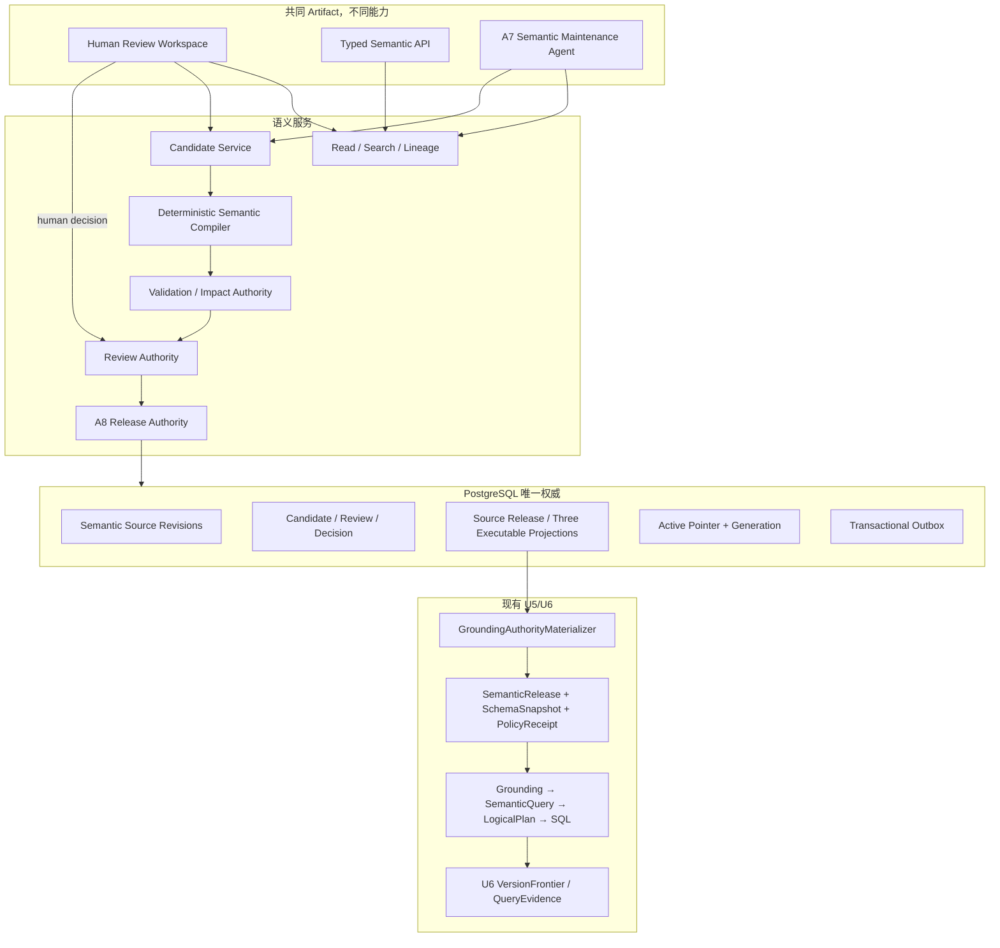
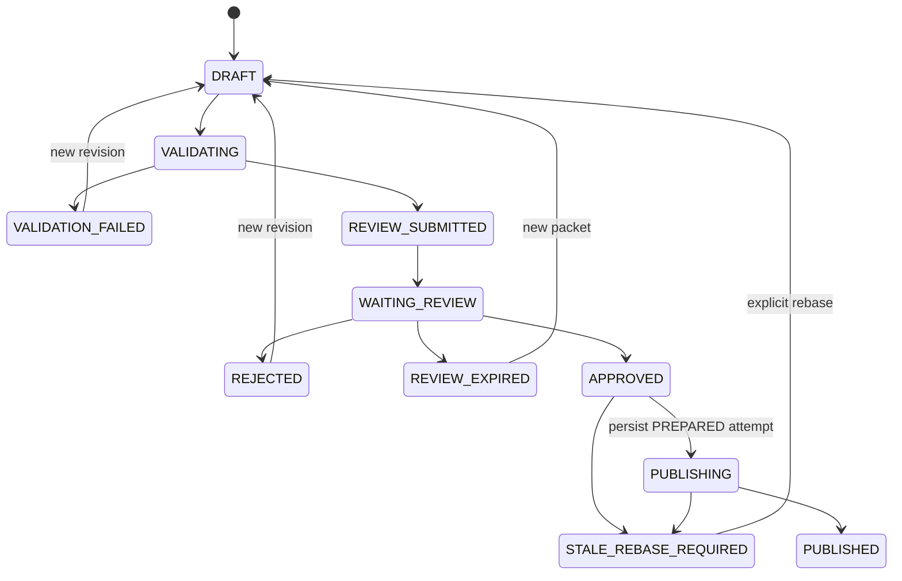

# Data Agent 可治理语义控制平面修订计划

## 目标胶囊（Goal Capsule）

- **目标：** 在不重做已完成 U5、不改写已冻结 U6 V2/C2 引用协议的前提下，把 RQ208、
  RQ297 与 RQ310 定义的可治理语义层加入 L2 纵向切片，使业务本体、指标、关系、物理
  绑定、Agent 提案、确定性验证、人工审批、发布、回滚，以及受 Ontology 约束的简单
  描述性贡献形成完整控制平面。
- **修订地位：** 本文是原计划的待审修订候选。用户批准后，它新增
  R9a/R9b/R9c/R9d、A7–A10、F8–F9、AE13–AE45、KTD16–KTD48、U10–U11 与 U13，
  并替换原计划中
  A2 的发布职责以及 U3–U9 的语义层衔接说明；批准前本文和原计划都不授权继续实施，
  当前任务停在用户审核门禁。
- **兼容不变量：** 现有 U5 `SemanticReleaseDocument`、`SchemaSnapshotDocument`、
  `PolicyReceiptDocument`、`GroundingPackage` 和 SQL 编译链不改 wire schema；U6
  `VersionFrontier` 仍只含 `SEMANTIC × SCHEMA × DATA × POLICY × IDENTITY`，
  C2 descriptor 仍为 `NOT_INSTALLABLE`，不在本修订中偷改 10600。HEAD 只有 U5
  schema/verifier 与测试 sealing helper，不把不存在的生产 factory 当成既成事实。
- **权威边界：** PostgreSQL 是 Semantic Source、Candidate、Review、Release、
  Active Pointer 和 Rollback 的唯一权威；Agent 只提出候选，具名人工只签署精确
  ReviewPacket，A8 确定性发布服务通过事务和 CAS 改变 active release。
- **首发拓扑：** PostgreSQL-only，且 production v1 只支持 Authority 与业务数据位于
  **同一个 PostgreSQL database**、DDL 与 `CatalogSnapshotFence` 可在同一事务排序的
  datasource。跨 database/外部 datasource 在独立 Catalog Authority 的单调 epoch/
  lease/LSN 协议落地前只能 Fixture 或 SHADOW；Neo4j 是后续条件准入的可重建投影，
  不属于 L2 部署、发布或正确性的必需依赖。
- **停止条件：** 若实现要求重写 U5 Grounding Authority、扩展 U6 V2
  `VersionFrontier`、把 Candidate 暴露给运行时、允许 Agent 自批/发布、让缺失
  Reviewer 自动通过、把 BusinessRelationship/贡献闭合冒充 causal edge，允许 LLM
  生成贡献数值，或让 Neo4j 成为第二权威，则停止并返回本计划复审。
- **用户审核门禁：** 本文完成 Codex 评审和独立提交后停止；只有用户明确批准才开始
  U10，且每个大任务完成后独立 Git commit。

---

## 产品契约（Product Contract）

### 摘要（Summary）

语义层不再只是 U5 中一份平铺的指标/维度配置，也不是用一张图替代数据库。它成为
Data Agent 的上游正确性控制平面：人和 Agent 都可以发现问题、提出候选、查看编译
Diff 与影响，但只有经过确定性校验、具名人工审批和 PostgreSQL CAS 发布的版本，才能
被 U5 物化为当前 Run 的可执行 `SemanticReleaseDocument`。

这次修订不改变首版产品仍是“L2 多步研究分析师 + 强 Text2SQL + 评测闭环”。因此把
语义工作拆成两个里程碑：R9a 先证明 U5-compatible 语义能改善或保持完整 L2 用户结果；
R9d 同时用一个预声明、U5-compatible 的描述性贡献 Case 证明 Ontology 不只用于消歧，
还能约束候选并形成精确对账。只有该 Evidence Gate 通过，才进入 R9b 的完整治理控制面。
它为后续 L3–L5 提供稳定
业务对象、指标、关系和版本基础，但不会把 L3 统计、L4 主动观察或 L5 因果识别伪装
为已经交付。

### 问题界定（Problem Frame）

当前 U5 已经闭合 `SemanticRelease + SchemaSnapshot + PolicyReceipt` 的 schema、
verifier、Grounding、IR、SQL 与 Gate，但生产代码尚没有负责创建、签名并提交这三个
run-scoped Artifact 的 `GroundingAuthorityMaterializer`；测试 sealing helper 不能
冒充生产 Authority。即使补齐该缺口，现有 `SemanticRelease` 也只表达执行必需的
metric、dimension 和 physical binding。原计划没有独立建模以下问题：

- 指标、公式、业务关系和物理绑定的 source-of-truth 在哪里；
- Agent 发现 schema drift 或错误 Join 后怎样提出修订；
- Candidate 如何验证、送审、拒绝、rebase、发布和回滚；
- 谁可以审、谁可以发布，如何避免提案者自批和 stale approval；
- 如何证明语义层减少了错误，而不是让模型偶然猜中；
- 多应用共享 Supabase 时，语义域、Reviewer 与 Publisher 如何隔离；
- Neo4j 什么时候才值得引入，怎样避免双权威。

把这些职责继续塞入 U5 会混淆“语义源码治理”和“Query Run 正确性”；推倒 U5 又会
破坏已完成的类型化编译与 Gate。因此采用 additive compatibility migration。

### 角色修订（Actors）

- A1. **分析用户：** 沿用原定义；可以查看 Query 解析到的 exact semantic release，
  不能编辑生产语义。
- A2. **领域负责人 / Semantic Reviewer：** 拥有业务判断权，对精确
  `SemanticReviewPacket` 作批准或拒绝决定；不直接写 active pointer，也不运行任意
  发布 SQL。原计划中“发布 Semantic Release”的执行职责移交 A8。
- A3. **平台运维者：** 沿用原定义；配置 App/Tenant/Environment、语义域、Reviewer
  Role、Quorum 与服务角色，不参与日常业务审批。
- A4. **研究主管 Agent：** 沿用原定义；只能读取 published semantics。
- A5. **SQL/Evidence Worker：** 沿用原定义；只消费 U5 已物化的 published
  executable Artifact。
- A6. **确定性验证器与通用发布门禁：** 沿用原定义；负责 Formula、Relationship、
  Binding、Compatibility、Policy 和 Result Gate 的确定性判定。
- A7. **Semantic Maintenance Agent：** 发现 drift、低覆盖、重复指标、错误关系与未
  绑定字段；创建候选、调用编译/验证/影响分析、生成审阅说明、送审和等待，但不能批准、
  发布、回滚或更改 Reviewer Policy。
- A8. **Semantic Release Authority：** 无交互式业务判断的确定性服务；在
  PostgreSQL transaction 内重验 Candidate、ReviewPacket、Quorum、Base Generation、
  Compiler/Validation currentness，CAS 发布、语义 roll-forward rollback、runtime
  activation 或 application rollback 并写 Outbox。它只持四个彼此分离的 narrow RPC
  credential，无权审批或关闭 legacy rollback window，也不持 bootstrap、issuer、
  materialization 或 legacy-contract closure capability。
- A9. **Grounding Artifact Issuers：** Semantic、Schema 与 Policy 三个独立的确定性
  issuer；分别只根据 exact Source Projection、Catalog Fence 或
  `RuntimeRestrictionProjection + platform policy revision + principal` 生成不可变
  sealed draft/receipt。任何 issuer 都不能代替另外两个签发事实。
- A10. **Grounding Bundle Coordinator：** 只验证三份 sealed issuer draft 的 scope、
  currentness、lineage 和 capability receipt，并在同库事务中提交完整 U5 bundle 与
  bridge；它不能创建、修订或重新签署任一 Authority payload。
- A11. **U13 Attribution Governance Authorities：** 不是一个全能服务，而是
  `PropertyOwnerMap Resolver`、`Contribution Release Signer`、`Conclusion Signer` 与
  `Conclusion Use Verifier` 四个分离的 NOLOGIN/narrow-RPC service principal。A3 只按
  approved policy 配置 capability assignment，A2 审核 owner-map/Conclusion Policy 内容，A8
  在 Source Release 事务中只发布 source-bound profile child；owner-map、签名 key/policy 与
  assignment 通过 10620 各自 reviewed、fenced、append-only 的 Authority transaction 发布，
  不要求为 key rotation 重发 Semantic Source。A6 校验 rule/proof；A11 不能产生数值、自批
  policy、给自己授权或变更 active pointer。M1 只使用 checked-in、
  fixture-scoped 的同结构 Authority，不复用 production credential。

### 新增需求（Requirements）

- R9a. **L2 最小可执行语义切片：** 系统必须补齐 production U5 materializer，并将
  当前 U5 可降级的 metric/dimension/relationship/physical binding 和最小
  DENY/RESTRICT 编译成 hash-stable semantic、relationship、runtime-restriction 三个
  projection；不可降级 Formula/Policy 必须 typed refusal。同一 Case 的 B0/B1/B2
  必须贯穿 U5→U6→U8，形成端到端用户结果证据。
- R9b. **可治理语义控制平面：** 系统必须版本化管理 `BusinessOntology`、
  `AnalyticalSemantics`、`RelationshipRegistry`、`PhysicalBinding`、
  `CatalogGovernance` 和 `RuntimeAuthorization` 六个平面；Agent 只能提交
  Candidate，生产发布必须经过确定性验证、具名人工审批和 A8 CAS。发布产物必须能
  确定性生成 U5 现有 `SemanticRelease` payload，并保持 U6/C2 exact reference 兼容；
  clean-start domain 必须经一次性双人授权自举，真实 datasource 必须提供可重验的
  catalog fence，且 Published-only 必须按域显式激活。
- R9c. **Authority 与评测协议闭合：** Decision、Publish、Rollback、Activation、
  Application Rollback、Legacy Contract Closure 与所有 membership/policy/dependency
  writer 必须共享 base-scope authority fence；需要 packet 时再共享 packet 锁并持锁
  重验；U5 bundle 必须由三类独立 issuer 的 sealed draft 合成；
  RuntimeAuthorization 只能收窄既有平台策略并由 Policy Authority 发行最终交集；
  Query actual SQL 必须持 shared catalog fence，SNAPSHOT proof 必须绑定 exact U6
  DataSnapshot；`GROUNDING_CAUSAL` Lane 的 B0/B1/B2 必须通过 typed arm adapter、
  逐字段信息预算、相同 canonical effective-policy content/digest、独立 run-scoped
  Receipt、隔离缓存/会话和不重叠 hidden holdout 形成可归因证据。
  `END_TO_END_PRODUCT` 与 `AUTHORIZATION_PRODUCT` 使用各自预注册 treatment，不受
  “只改变 grounding source”约束。production v1 不对跨库 fence 作能力承诺。
- R9d. **Ontology-guided 描述性贡献纵切：** 系统必须把 `BusinessOntology` 限定为
  业务意义和候选范围 Authority，不得替代指标公式、分析 Join、物理绑定、数据质量、
  Policy、贡献计算或 causal graph。M1 只消费同一 `SemanticSourceBundle@1` 编译出的
  `DescriptiveContributionProfileProjection`：profile 必须为 outcome、每个有界 driver
  与 independently observed residual 固定 additive metric ref、predicate AST/hash、
  baseline/follow-up Query Template、expected cell、同 unit/grain/time/snapshot 约束；
  `decomposition_kind` 判别 `ROW_PARTITION | FORMULA_IDENTITY`。前者以
  `RowPartitionWitness` 证明同一 canonical measure 与 declared universe 上谓词互斥完备，
  后者以 `FormulaEquivalenceWitness` 证明 canonical FormulaAST 的带符号代数恒等；未知、
  混合或未证明类型拒绝。每个 endpoint 继续走现有 U5→U6 QueryEvidence 链，确定性 U13
  Kernel 只计算 delta，并以
  `computed_closure_error=Δoutcome-ΣΔdriver-Δobserved_residual` 验证 signed closure；
  computed error 不得回写 residual，一次数值闭合也不得替代 accounting identity witness；
  任意 grouped-row、动态双窗口差分、ratio/PVM/LMDI/Shapley、topology RCA 与因果升级
  在当前 IR 下必须 typed refusal 或 `DEFERRED/HOLD`。结论等级固定为
  `CHANGE → CONTRIBUTION → ASSOCIATED_DRIVER → ROOT_CAUSE_CANDIDATE → CAUSAL_SUPPORT`，
  U13.1 仅在受控 Fixture 输出 `KERNEL_CANDIDATE_ONLY/HOLD`，不能发布产品结论；U10.3
  之后的 U13.2 才能消费 PostgreSQL active exact release 并发布最高为
  `CONTRIBUTION` 的 `ContributionItemSet`。Topology/event/anomaly 等调查线索进入未来
  独立 `InvestigationCandidateSet`，不能按贡献绝对值排序或自动成为根因候选；任何层级
  都不能使用“导致、已证实根因、反事实、应当行动”等越权文案。

下文为简洁使用 `R9` 时，表示 R9a、R9b、R9c 与 R9d 的共同约束；涉及里程碑顺序时必须
明确写 R9a、R9b、R9c 或 R9d，不能用统称掩盖 M1/M2 边界。

R9a 与 R4、R6、R7、R8 形成 **M1-Core L2 Evidence Gate**；R9d 形成并行的 **M1-F9
Attribution Feasibility Gate**，两者共享地基但互不作为进入条件。两条分支都可内部演示和量化，
但 Release Manifest 仍是 `HOLD`。M1-Core 固定给出 `ExecutionValueVerdict`、
`GovernanceNeedVerdict` 与 `IRCapabilityVerdict`：前者决定语义功能是否值得继续，
第二个只判断已识别 Authority 缺口是否仍需实施、不能声称尚未实现的治理已 READY，
第三个区分“没有价值”与“当前 U5 IR 过窄”。U10.0 生产 Authority 缺口以及已识别的
安全/正确性修复不因 ExecutionValue NO_GO 而消失；R9b 全量产品化要求
`ExecutionValueVerdict=GO + GovernanceNeedVerdict=REQUIRED` 并经用户复审。
`GovernanceReadinessVerdict` 只在 U10.2/U10.3、U11.1/U11.2、U7 published
governance/真实 mutation suite 与 U9 Hosted/Docker **pre-activation smoke**
（expand、bootstrap、SHADOW parity，不含 `PUBLISHED_ONLY` 切换）完成后生成，用于决定
activation；READY 后还必须通过 activate/application-rollback/reactivate 的
post-ready smoke 才能进入 M2 Release，不能形成自依赖。

### 新增关键流程（Key Flow）

- F8. **Agent 协同的语义发现、审批与发布**
  - **触发：** A7 或人工发现 schema drift、未绑定对象、指标重复、公式错误、Join
    风险、低 benchmark 覆盖或业务定义变化。
  - **参与者：** A2、A3、A6、A7、A8、A9、A10 与独立 bootstrap executor。
  - **步骤：**
    1. 新域先由既存 platform owner 与服务端解析的独立 domain owner 对精确
       `DomainBootstrapPacket` 双签；独立 bootstrap executor 原子创建初始
       policy/assignment/dependency pointer、membership snapshot 与 null/0 genesis
       pointer，并永久关闭该域的 bootstrap capability，写入不可重开的 `CLOSED`
       tombstone，只有未 CLOSED 且不存在任何 authoritative child row 时才能由新双签
       packet supersede 配置错误的旧 packet；
    2. 读取 active source release、current `CatalogSnapshotFence` 与 impact scope；
    3. 基于 exact base release/generation 创建不可变 Candidate Revision；
    4. 确定性编译 Candidate 级 `ExecutableSemanticProjection`、
       `ExecutableRelationshipProjection` 与只收窄的
       `RuntimeRestrictionProjection`，验证 Formula type、grain、unit、time
       domain、additivity、bounded relationship closure、binding、全依赖
       `LowerabilityProof` 与 U5 compatibility；
    5. 冻结 `SemanticReviewPacket`，绑定三个核心 projection digest、有序 profile child
       ref/digest manifest、relationship lowering
       proof、catalog fence、platform policy/review policy revision、eligible reviewer membership
       version、quorum/veto、decision expiry 与 publish expiry；
    6. A2 通过 human session 对 exact packet digest 批准或拒绝；Decision RPC 必须
       先取得与所有依赖 writer、Publish/Rollback 相同的 scope authority fence 与
       packet 事务锁，在持锁状态重验
       `window=OPEN/outcome=PENDING`、expiry、base、policy、membership 与 principal
       eligibility，再原子写 Decision；达到 quorum/veto 的 RPC 是唯一正常 closer，
       同事务写 `CLOSED+APPROVED/VETOED` 和 U4 resume，等待锁后不得复用旧检查结果；
    7. A8 用固定构建先重编译并生成带 compiler image digest 的
       `SemanticPublishAttempt`，先持久化 `PREPARED` Attempt 与 `PUBLISHING` 状态；
       随后按固定锁序只消费已 `CLOSED+APPROVED` 的 Decision window，在事务内重验
       base、packet、current membership、review policy、decision、quorum、catalog
       fence、compiler/dependency pointer 与 attempt digest，再原子发布 Source Release、
       semantic/relationship/runtime-restriction 三个核心 Projection、有序的
       content-addressed contribution-profile child manifest、Active Pointer 和
       Outbox；rollback window OPEN 时同事务提交 current
       `LegacyEquivalenceAttempt`、legacy mirror/receipt，CLOSED 时改验独立 closure
       authorization digest。A8 不能自行关闭 Decision 或 legacy rollback window；
    8. 新 Query Run 固定 published source release；Semantic、Schema、Policy issuer
       分别签发 exact、不可变 sealed draft/receipt，其中 Policy issuer 把
       `RuntimeRestrictionProjection` 与既有 platform policy 做只收窄交集；A10 只能
       校验这些 bytes 与 capability/currentness，随后在同库幂等事务中提交 run-scoped
       `SemanticReleaseDocument`、`SchemaSnapshot`、`PolicyReceipt` 与
       source-to-run bridge，成功事务再返回 materialization/bridge receipts；
    9. 若需回滚，A6 先按当前 catalog/compiler/policy 重编译历史 Source；A2 对精确
       rollback packet 逐人签署；达到 current quorum 的 Decision closer 在同一事务
       聚合 exact Decision set、计算 decision-set digest 并形成一次性
       `SemanticRollbackAuthorization`。A8 只消费该 authorization，再以新 generation
       前滚发布，不自行聚合 quorum，也不直接激活历史 payload。
  - **结果：** Draft 永不进入 Grounding；stale Candidate 必须 rebase、重编译和重审；
    发布崩溃全有或全无；旧 Run 保留精确旧版本可重放；跨库 datasource 或无法证明
    DDL/epoch 顺序的 adapter 不能进入 `PUBLISHED_ONLY`。
  - **覆盖：** R4、R5、R6、R7、R9。

- F9. **受治理的描述性贡献研究流**
  - **共享入口与触发：** F9 产品分支在标准 L2 工作台旁提供不执行贡献的
    `AttributionCapabilityDirectory@1/list_attribution_capabilities`，只在 server-resolved
    principal 的 app/tenant/environment/domain/datasource/policy scope 内显示可见支持面，
    并对猜测 ref、未授权、不存在或 policy 不确定的对象采用外部等价的
    `UNAVAILABLE_FOR_PRINCIPAL`：先按六轴鉴权再查找，不返回 object ref/name/count、精确
    原因或可区分 timing。用户提交
    “为什么变化”后先冻结原问题/身份/scope，再生成
    `AttributionEligibilityDecision@1`。只有全局 `Attribution F9=GO`、当前 release 存在
    exact profile 且 Decision=`SUPPORTED` 时才进入 U13.2 execution Route；
    `F9_NOT_REGISTERED | NO_PROFILE | NOT_LOWERABLE | STALE | UNAVAILABLE_FOR_PRINCIPAL`
    都保留原问题并返回稳定 `next_actions`。Directory、Eligibility、ProfileRequest 与
    recovery 都属于 U8/U11/U9 的 **F9 delta**，不是 M2-Core 的完成条件；M1 Fixture
    feasibility 不注册 F9 execution Route。
  - **参与者：** A1、A4、A5、A6；A7 只负责 profile Candidate 维护，不能改变当前 Run。
  - **步骤：**
    1. 将原问题冻结为 `AttributionQuestionContract`，明确 subject、outcome、scope、
       时间、允许结论等级和预算；Eligibility Decision 同时固定 question ref、
       capability directory digest、profile/release 或 typed unavailable reason 与 `next_actions`；
    2. `SUPPORTED` 后，published-only resolver 解析 exact SemanticRelease/Profile，冻结
       `SemanticAttributionContext`，并验证 Ontology、metric、Join、binding、policy、
       DataSnapshot 和 profile digest；
    3. U13 确定性 enumerator 只展开 profile 中预声明的 outcome、driver 与 independently
       observed residual 静态 endpoint template 并为当前 Run 生成 binding；每个 binding
       只有在 static capacity proof 与当前 `RunDriverBudgetAdmission@1` 同时通过后，才分别执行 baseline/follow-up 的
       现有 U5 QueryContract→QueryEvidence，全部绑定同一可覆盖两窗的
       `CONTROLLED_REVISION` visibility；
    4. 独立 lowering verifier 先依据 exact `EndpointLoweringRuleSet@1` 验证每端
       source/target node correspondence；Kernel 再从两窗 QueryEvidence 构造
       `DerivedDeltaObservationSet@1`，冻结 baseline/follow-up evidence+cell hash、减法方向、
       unit、derived delta 和 derivation image。Compiler 按 `decomposition_kind` 验证
       `RowPartitionWitness` 或 `FormulaEquivalenceWitness`。只有 kind-specific witness PASS 且
       `computed_closure_error=Δoutcome-ΣΔdriver-Δobserved_residual=0` 才产生 PASS
       `ContributionClosureReceipt`，不得用一次数值 closure 或 balancing residual 冒充
       accounting identity proof；
    5. Receipt subject hash 闭合 exact profile/release、endpoint templates/runtime bindings、
       static capacity/run admission、逐端 lowering certificates/rule-set、两端 evidence/
       DerivedDelta、accounting proof、owner-map release、method/kernel/compiler/verifier image、完整
       frontier、principal/scope 与 `closure_verdict=PASS | HOLD | REFUSE`；该字段不表示
       Attribution Feasibility。签发和消费按 origin 重验 currentness：Fixture
       看 immutable fixture manifest，Published
       才看 current active release/status
       ledger。只有 U13.2 的 PASS Receipt 可投影 `ContributionItemSet`；
       它只含同一 accounting identity
       的 signed item，按 absolute contribution、profile stable order、stable ID 排序；
       topology/event/anomaly/association 不进入该集合；
    6. A4 只能从已验签且 current 的 `ConclusionPolicyDecisionEnvelope@1`
       subject 闭合的判别联合
       `ASSERT { claim_ast } | ABSTAIN { reason_codes, unresolved_fields } | REFUSE {
       reason_codes, violated_policy }` 生成 authoritative report；只有 ASSERT ClaimAST 有
       Claim Authority。自由 LLM prose、引文、retrieved text、table/code 标为
       non-authoritative commentary。任何新关系/modality、checker abstention、越权因果
       文案、数字改写、候选越界或 Receipt subject 缺失都返回 typed refusal。
       完整 F9 Authority 留在 U13 sidecar；当结论被嵌入现有 U6 AnalysisReport 时，
       必须另有 `ConclusionProjectionBinding@1` 绑定 exact AtomicClaim/ReportManifest/
       segment hash、Decision Envelope 与 current `AttributionConclusionUseDecision@1`，否则只能显示为
       non-authoritative commentary；现有 AtomicClaim@2 不宣称无损承载双窗 delta。
  - **结果：** 用户得到可重放的 signed contribution、observed residual、closure error、
    Contribution Item、Ontology/Metric 路径和非根因/非因果披露；unsupported formula 或
    profile drift 诚实拒绝。
  - **覆盖：** R3、R4、R6、R7、R9d。

### 新增验收示例（Acceptance Examples）

- AE13. 覆盖 R4、R9：给定同一 Candidate Revision，U10 compiler 在送审前生成
  hash-stable 的 semantic、relationship、runtime-restriction 三个 executable
  projection，ReviewPacket 绑定其 digest；A8 发布时重算得到相同 digest。生产
  `GroundingAuthorityMaterializer` 按两个不同 Run ID 物化 schema-valid 的 U5
  bundle；除 run-scoped 字段外可执行 payload 相同。
- AE14. 覆盖 R9：A7 创建、编译、验证并送审 Candidate 后，尝试调用 approve、publish、
  rollback 或 raw SQL/Cypher 都被 Tool Registry 和数据库双重拒绝。
- AE15. 覆盖 R9：Proposer 与 Reviewer 是同一 principal、Reviewer role 不匹配、
  eligible reviewer 为空、quorum 未满足、A3 自授 Reviewer 或 policy proposal 降低
  最小 quorum 时，发布均失败关闭；没有“默认批准”。
- AE16. 覆盖 R9：ReviewPacket 获批后 active generation、Candidate、catalog/schema
  validation digest、compiler bundle、review policy 或 reviewer membership 任一
  变化，Candidate 进入 `STALE_REBASE_REQUIRED`；A8 分别返回稳定的
  `SEMANTIC_*_STALE` Reason Code，旧 Decision 不能复用。
- AE17. 覆盖 R4、R9：未批准 Candidate 即使编译成功，也无法成为
  `GroundingPackage.semantic_release_ref`；Query 只能解析到 published release。
- AE18. 覆盖 R5、R9：应用 A 的 Agent、Reviewer、Publisher 尝试读取、审批、发布或
  回滚应用 B/Tenant B/Environment B/SemanticDomain B 的 Artifact 时全部失败，并
  产生审计 Receipt；触及 RuntimeAuthorization/sensitive binding 的 Candidate 缺少
  independent security quorum 时也不能发布。
- AE19. 覆盖 R6、R9：同 Fixture 的 B0/B1/B2 paired run 能区分 direct-schema、
  retrieval 和 governed semantic compiler；fanout、SCD、calendar、binding drift 与
  stale approval 各有独立 Oracle。现有 U5 IR 不能表达 ratio re-aggregation 时必须
  稳定返回 `SEMANTIC_FORMULA_NOT_LOWERABLE_TO_U5`，不能伪造执行成功。同一个
  retail-revenue Case 必须贯穿 U5→U6→U8，比较类型化终态、Hypothesis verdict、
  material Claim/ReportReady、必要澄清或拒绝、覆盖率、延迟与成本。
- AE20. 覆盖 R5、R9：Hosted 与 Docker 使用同一 semantic migration manifest、
  error code、role/RLS contract 和 publish/rollback suite；Neo4j 完全未部署时仍通过。
- AE21. 覆盖 R9：发布事务在 active pointer CAS 前后注入崩溃；失败时没有新 Source
  Release、Projection 或 Outbox，且旧 Pointer/release/generation 不变；成功时发布物
  原子存在且 Pointer 恰好前进一个 generation。重复 Outbox 不产生第二个 generation。
- AE22. 覆盖 R9：若未来启用 Neo4j，projection stale/down/digest mismatch 时自动回退
  PostgreSQL，并保持相同 Release 与 Query 结果语义；bookmark 不能替代业务发布授权。
- AE23. 覆盖 R5、R9：Hosted/Docker clean start 时，未双签、自受益、zero reviewer、
  crash 或 retry 不能留下半自举域；一次有效 `DomainBootstrapPacket` 只成功一次，
  后续 bootstrap 永久拒绝，首个 Candidate 能从 null/0 进入正常 Review。
- AE24. 覆盖 R4、R9：ReviewPacket 冻结后发生真实 DDL 或 catalog epoch 变化时，A8
  在 CAS 前返回 `SEMANTIC_CATALOG_FENCE_STALE`；无法提供可重验 fence 的 datasource
  只能进入 fixture/shadow，不能激活 Published-only。
- AE25. 覆盖 R4、R5、R9：10610 以 expand-only 安装后，domain 依次完成 bootstrap、
  首个 release、shadow materialization、bridge/result parity，再通过 per-domain CAS
  切换到 Published-only；任一步失败时旧运行路径保持可用且切换有审计。
- AE26. 覆盖 R5、R9：两个真实连接交错执行 Decision 与 Publish/回滚；Decision 若在
  packet close 后才取得锁，必须重验并返回 `SEMANTIC_REVIEW_WINDOW_CLOSED`，不得写入
  Decision、`run.resumed` 或 outbox。quorum/veto/expiry 是唯一 closer，Publish 只
  消费 `CLOSED+APPROVED`。所有成功历史都能映射到唯一线性化顺序。
- AE27. 覆盖 R4、R5、R9：Semantic/Schema/Policy issuer 缺少一个、scope 不同、
  currentness token 漂移、capability receipt 互换或 coordinator 修改一个 byte 时，
  bundle commit 固定失败；逐写点 crash 后只存在完整可消费 bundle 或不可消费 staging，
  coordinator 永远不能成为三合一超级 Authority。
- AE28. 覆盖 R4、R5、R9：Hosted 与 Docker production datasource 均证明与 Authority
  同一 database；在 compile、revalidate、publish、materialize 与 Query 前分别注入
  rename/drop/type/constraint 变化，都只能重新捕获或返回 STALE。跨库 adapter 即使
  schema hash 相同也不能激活。
- AE29. 覆盖 R5、R9：`RuntimeRestrictionProjection` 只允许 DENY/RESTRICT，Policy
  Authority 把它与 exact platform policy revision 求交并签发 principal-specific
  `PolicyReceipt`；permissive RLS、owner、`BYPASSRLS`、service role、sensitive column
  与 policy drift mutation 都证明最终集合不会大于任一输入集合。restriction 的
  exact ref/hash/source/compiler/generation 必须进入 ReviewPacket/PublishAttempt，并
  与 SourceRelease、三个核心 projection、profile child manifest、pointer 同事务可见。
- AE30. 覆盖 R4、R6、R9：B0/B1/B2 各通过 typed adapter 生成 schema-valid 的 benchmark
  grounding draft 或预注册 rejection；B0/B1 无法读取 B2 Source、alias、compiled
  relationship、cache 或 conversation。运行顺序平衡、hidden holdout 一次性且与
  calibration/M2 case 不重叠，盲评者不能看到 arm label。
- AE31. 覆盖 R4、R9：Relationship proof 分别验证 `DDL_ENFORCED`、
  `SNAPSHOT_CERTIFIED` 与 `DECLARED_ONLY`；duplicate child、NULL、NOT VALID、partial
  unique、SCD overlap、late row、反向边和复合键置换只能拒绝或进入预注册 fanout-safe
  plan，不能静默放大聚合。SNAPSHOT proof 必须与 Query Run 的 exact
  `CONTROLLED_REVISION` DataSnapshot/visibility token 匹配；`NONE` 或 mutable
  visibility 不能 production 激活。
- AE32. 覆盖 R4、R6、R9：M1 fixture 是 `SemanticSourceBundle@1` 的 exact executable
  subset，不存在第二个可写 Source。M2 对全部 M1 fixture 重现相同
  `ExecutableSemanticContentDigest`；M1 固定输出 execution value、governance need
  与 IR capability verdict；governance readiness 只在 U10.2/U10.3、U11.1/U11.2、
  U7 published governance/真实 mutation 与 U9 Hosted/Docker pre-activation smoke
  完成后输出；Published-only activation 与 rollback/reactivation smoke 只在 READY 后
  执行。
- AE33. 覆盖 R5、R9：`PUBLISHED_ONLY` 激活后的每次 governed publish 在 rollback
  window 内都先生成 target-generation `LegacyEquivalenceAttempt`，并把 release、
  三 projection、attempt、legacy mirror、receipt 与 pointer 同事务提交；缺
  attempt/receipt、旧 reader/materializer version、stale mode cache 或发布/回退竞态
  必须失败关闭，
  不得回到过期 legacy semantics。Receipt 只证明 hash-pinned suite；永久关闭 legacy
  由实例、流量和 receipt 证据及独立多签 closure authorization 驱动。window CLOSED
  后的 publish 不要求新 legacy Attempt，但必须验证 activation row 的 exact closure
  digest；A8 单方关闭 window 或伪造 closure digest 失败。
- AE34. 覆盖 R5、R9：bootstrap 的 exact retry 返回同 receipt；same signer 双角色、
  两个并发 packet、CLOSED 后重开和已有 authoritative child row 后 supersede 均失败。
  只有尚未 CLOSED 且无 child rows 的错误 packet可被新的独立双签 packet替换。
- AE35. 覆盖 R6、R9：Grounding 因果 Lane 的 QueryContract 在构建 B2 前由 benchmark
  case 独立冻结，三臂共同可见，并消费规范化内容完全相同的
  `CanonicalEffectivePolicyContent@1`；每臂独立发行并验证自己的 run-scoped
  `PolicyReceipt` envelope/ref/hash，不能要求不同 Run 的完整 Receipt bytes 相同。
  B2 restriction 不改变该 Lane treatment。端到端 Lane 从同一 QuestionFrame 各自
  生成 QueryContract，权限变更进入 `AUTHORIZATION_PRODUCT`。三类报告不得互相解释为
  “只改变 grounding source”。
- AE36. 覆盖 R5、R9：membership insert/revoke、assignment/review-policy pointer、
  catalog/compiler dependency 的每个 writer 与 Publish 并发时，必须先取得同一 scope
  authority fence；结果只能是 writer 先行令 packet stale，或 publish 先行后 writer
  生效，不能出现 phantom stale publish。
- AE37. 覆盖 R4、R9：Query resolver 重验 catalog token 后、actual sandbox SQL 前注入
  受管 DDL；shared Query fence 与 exclusive DDL fence 只允许完整旧执行后 DDL，或 DDL
  先行并使 Query typed stale，不能执行 stale SQL。
- AE38. 覆盖 R4、R9d：M1 profile 必须判别为 `ROW_PARTITION | FORMULA_IDENTITY`，并为
  outcome、每个 driver 和 independently observed residual 固定可进入 semantic digest 的
  baseline/follow-up `EndpointExecutionTemplate`：同 datasource、`aggregation=sum`、
  `additivity=additive`、safe integer/minor unit、metric、predicate AST/hash、window、
  unit/grain 与 expected row0 cell 均冻结。每次 Run 再生成 `EndpointExecutionBinding`，
  绑定 exact QueryContract instance、snapshot/PolicyReceipt/principal 与五轴 VersionFrontier；
  `SameFrontierWitness` 要求所有运行时 binding 的五轴相同，但不进入静态 profile digest。每端各用一条当前 U5
  QueryContract，并由独立 verifier 为 canonical predicate/FormulaAST → QueryContract →
  GroundingPackage/LogicalPlan → SqlArtifact/parameters → QueryEvidence 签发逐次
  `EndpointLoweringCertificate@1`。未知/混合 kind、ratio/avg/min/max、grouped-row、单 Query 动态双窗或
  非线性 post-aggregate formula 稳定返回 typed refusal。
- AE39. 覆盖 R6、R9d：`ROW_PARTITION` 的 outcome/driver/residual 必须使用同一 canonical
  metric/formula、aggregation、grain、unit、null policy；Compiler 对 Region explicit
  universe 签发 `RowPartitionWitness`，证明 driver + residual predicates 两两不交且并集
  覆盖，并冻结 NULL/UNKNOWN、cast、collation、开放枚举与 `OTHER/complement`。`FORMULA_IDENTITY`
  则对 canonical FormulaAST 签发带 sign/unit/grain 的 `FormulaEquivalenceWitness`。不同
  metric 恰好闭合、下一 snapshot 失配、overlap、gap、NULL 漏行、alias/collation/cast/
  predicate mutation、generator 同时产出自洽但错误的 witness/template、certificate 与实际
  SqlArtifact/parameter 不一致，以及把 closure 当 identity/lowering proof 均失败。Formula
  leaf/formula-role 到 exact metric binding/endpoint 必须完整且无重复遗漏。给定两窗后计算 driver delta `+20/-15`、
  observed residual delta `0`、outcome delta `+5`，`computed_closure_error=0`；重复、遗漏、
  符号翻转、balancing residual 或 Agent 改数均不能 PASS。
- AE40. 覆盖 R4、R5、R9d：profile digest、release generation、principal/policy、
  schema/data snapshot、visibility token、unit/grain/time 或任一 QueryEvidence 漂移时，
  整组贡献进入 typed stale；不同 snapshot 的单项不能拼成 closure。
  先构造单一 `ContributionSubjectManifest@1`，其 canonical digest 才是
  `ContributionReceiptSubject@1`；Manifest 必须覆盖 exact profile/release、endpoint template/runtime
  binding hash、每端 lowering certificate、两端 evidence ref/result hash、accounting proof ref/content hash/version、
  method/kernel/compiler/verifier image、完整 frontier、principal/scope、input/output hash 与
  `closure_verdict=PASS | HOLD | REFUSE`（非 Attribution Feasibility），并冻结数组顺序、
  duplicate rejection 和 exact decimal encoding。调用方替换任一 subject、stale/revoked/
  superseded/wrong-scope/rollback generation 均拒绝；旧 Receipt 只保留审计效力，不能因
  rollback 到相同 release hash 自动复活。
  Profile 的 template digest 在 M1/M2 保持一致，两阶段不同的 Binding/frontier 只能进入各自
  lowering certificate/subject；把运行时 frontier 混入 profile digest 或从 digest 排除未声明字段均失败。
- AE41. 覆盖 R6、R9d：同一个 outcome 同时存在 Region 与 Channel profile 时，一次 Run
  只能选择一个 exact profile；把两个 partition axis 的贡献相加、把图召回的新节点塞入
  `ContributionItemSet` 或超过 driver/depth/budget 上限都失败。Topology/event/anomaly
  只能进入按 kind 独立准入的 `InvestigationCandidateSet`，不能用 absolute contribution
  或 path length 与 accounting item 统一排序。
- AE42. 覆盖 R3、R6、R9d：产品固定展示
  `CHANGE/CONTRIBUTION/ASSOCIATED_DRIVER/ROOT_CAUSE_CANDIDATE/CAUSAL_SUPPORT` 等级；
  authoritative content 只能由已验签且 current 的 `ConclusionPolicyDecisionEnvelope@1`
  subject 内闭合的 typed
  `ConclusionPayload` 生成，terminal 判别为
  `ASSERT | ABSTAIN | REFUSE`；`ASSERT` 的嵌套 `ClaimAST` 冻结 subject/predicate/object、
  relation/direction、span/scope、polarity、modality/realis、source chain/quotation、
  conditional/counterfactual、channel、level 与 evidence selector/ref。LLM prose、引文、
  retrieved text、table/code 只能是 non-authoritative commentary，且不能再解析回 Authority。
  `ConclusionSubjectManifest@1` 绑定 ContributionReceiptSubject、完整 payload/AST、policy
  release/digest、rule/model/data/verifier image、全部 input/evidence selectors、terminal/
  decision、principal/scope、render mapping 与 activation sequence；consumer 从 frozen owner
  map 校验 exact active policy、允许的 signer/verifier pair、currentness/revocation/
  supersession/rollback，且不得接受调用方另传 payload。Decision 必须位于可验签
  `ConclusionPolicyDecisionEnvelope@1`，冻结 signer principal/capability、key id/algorithm/
  signature bytes、verifier identity/image、issued-at/expiry/nonce 与 activation sequence；
  forged signature、wrong-role、replay、expired/rotated key 或 status lookup 不可用均失败。Checker 冻结独立 owner、schema、
  rules/model/data version、abstain/refuse 与争议流程；contrast set 覆盖显式/隐式因果、否定、
  引述、反驳、跨句、中文同义/委婉、表格/code 与 prompt injection，并按 domain/language
  在独立 holdout/red-team 上以预注册 false-negative 上界判定。把有限样本 known misses=0
  当总体保证，或将 Contribution Top-1 写成唯一根因时，Case 失败。
- AE43. 覆盖 R6、R9d：U7 自建 `retail-revenue-contribution-v1` 将真值判别为
  `ArithmeticPartitionTruth | InjectedFaultTruth | ExpertInvestigationPriorityLabel |
  SCMCausalTruth`，分别绑定 provenance、适用域和 conclusion ceiling；描述性 Case 不含
  causal truth。RCAEval 只报告其原生 fault/service/indicator Top-k，DAB/InsightBench
  继续报告端到端分析质量，不跨域合并为根因真值或不可解释总分。
- AE44. 覆盖 R3、R8、R9d：“为什么华南净收入下降”Demo 展示 exact metric/profile、
  Ontology path、QueryEvidence、signed waterfall、residual、alternatives/evidence gaps 与
  `描述性贡献 / 非根因 / 非因果结论` badge；M1 明示 Fixture feasibility/HOLD，M2 才
  展示 published-only 产品能力；用户可切换公开测试题并查看 Oracle、Trace 和拒绝原因。
- AE45. 覆盖 R5、R9d：PostgreSQL-only 的 F9、Hosted/Docker parity 和回滚可完整通过；
  Upstash 全丢失只导致重建缓存，Neo4j 缺失/stale/down/digest mismatch 不改变 profile、
  closure、ContributionItem ordering 或 conclusion level。
- AE46. 覆盖 R3、R5、R8、R9d：Web/API/Agent 对等提供两阶段能力入口。
  提问前的 `AttributionCapabilityDirectory@1/list_attribution_capabilities` 是 F9 产品分支安装后
  从标准 L2 工作台可达、
  principal/app/tenant/environment/domain/datasource/policy-filtered 的支持面目录；冻结原问题后的
  `AttributionEligibilityDecision@1` 才校验 exact release/profile/window/grain/freshness。
  Eligibility 先按同一六轴鉴权再查找；只有已授权可见 metric 才能返回
  `NO_PROFILE | NOT_LOWERABLE | STALE` 与 exact ref，猜测 ref、未授权、不存在或 policy
  不确定统一返回无 object ref/name/count、精确原因或 timing 差异的外部等价
  `UNAVAILABLE_FOR_PRINCIPAL`。`SUPPORTED` 才启动 F9；`F9_NOT_REGISTERED |
  NO_PROFILE | NOT_LOWERABLE | STALE | UNAVAILABLE_FOR_PRINCIPAL` 保留 exact question ref，
  并返回标准 L2、重试/刷新、缩小 scope、创建 `AttributionProfileRequest@1` 或取消中允许的
  稳定 `next_actions`。
- AE47. 覆盖 R3、R6、R9d：独立 `ATTRIBUTION_USER_VALUE` Lane 在同一受支持问题上以标准
  L2 AnalysisReport 为 baseline、Published F9 为 candidate，预注册主贡献项识别、证据导航
  完成率、time-to-insight、非因果边界理解、合理下一步选择、信心校准和拒绝后任务恢复；
  样本量、最小效应、阈值、CI 与停止规则在看结果前冻结，至少一次目标用户/领域专家盲测。
  参与者只通过邀请制、participant-scoped、短 TTL 的 `AttributionEvaluationSession@1` 查看
  带 `NON_AUTHORITATIVE_EVALUATION_ONLY` 标记的不可导出 candidate preview；该 Session 不属于
  产品 Route，不能调用产品 Tool 或写入 U6 权威 Report。该 Gate 与 arithmetic/safety 分栏，
  任一失败即 F9 `HOLD`，但不阻断 M2-Core。
- AE48. 覆盖 R3、R5、R8、R9d：产品状态不再使用单一 Product Release badge，
  而分别展示 `Core L2` 和 `Attribution F9` 的 `NOT_REGISTERED | HOLD | DEFERRED |
  GO`、scope、reason 与 next action；E2E 覆盖 M1 Fixture、Core GO/F9 HOLD 与
  Core GO/F9 GO。`AttributionProfileRequest@1` 绑定 original_question_ref，状态机只覆盖
  `DRAFT | SUBMITTED | DEDUPED | TRIAGED | LINKED | DECLINED | CLOSED | EXPIRED | WITHDRAWN`，
  LINKED 后只投影既有 U10 Candidate/Review/Publish 状态，不复制治理状态机。明确
  requester/Request Authority/profile-owner/A7/expiry-sweeper 独占 actor、A7/owner routing、
  U11 Inbox、撤回、通知与去重；`DEDUPED` 只生成 requester-scoped opaque subscription，
  raw canonical/question/requester/lineage 受 FORCE RLS + request-read capability 隔离；不给
  requester approve/publish 权限，并提供
  “重新检查能力并重放原问题”。所有 Contribution/Receipt/Conclusion reason code 都在
  Web/API/Tool 对等映射为必显解释、输入保留规则和允许的 `next_actions`。

### 成功标准（Success Criteria）

- 一个完整 F8 Case 能从 drift detection 走到 Candidate、Validation、Review、Publish、
  U5 Grounding，并能在拒绝、stale、崩溃和回滚路径上得到类型化终态。
- 现有 U5 全量 regression 不变；`packages/contracts/src/artifacts/grounding-authority.ts`
  的三个现有 Document schema 和 U6 `VersionFrontier` 无字段变化。
- Source Model 支持 RQ208 六平面、五类 relationship 和 typed metric/formula，
  且每类关系的权限与编译用途不互相冒充。
- L2 首发严格限定一个 `semantic_domain` 绑定一个 `datasource_id`；Source Model
  可以表达完整 FormulaAST，但只有可逐字降级为现有 U5 单列基础聚合的子集可发布。
- Agent 可完成发现、提案、编译、验证、影响分析、送审、状态查询、rebase 和解释；
  Agent 对 approve/publish/rollback/policy mutation 没有 Tool 也没有数据库权限。
- PostgreSQL-only 能完成 semantic search、受 `SemanticClosurePolicy` 限制的关系
  闭包、发布、当前验证后的回滚、L2 Query 和 benchmark slice；超限失败关闭。
- PostgreSQL-only 能从 published Ontology/Profile 生成有界贡献计划，复用 U5 scalar
  QueryEvidence 验证 exact signed closure，并发布最高为 `CONTRIBUTION` 的非因果报告；
  任意公式、动态分组或跨 snapshot 越界都以稳定 Reason Code 拒绝。
- `GROUNDING_CAUSAL` 的 B0/B1/B2 通过隔离的 typed adapter 使用相同 Case、Data
  Snapshot、canonical effective-policy content/digest、Model/Profile/Budget 与盲评
  Oracle；只有 grounding information manifest 不同，每臂 run-scoped Receipt 独立。
  `END_TO_END_PRODUCT` 与 `AUTHORIZATION_PRODUCT` 另行预注册。没有真实 paired
  evidence 和一次性 hidden holdout 前 Release Manifest 不宣称准确率提升。
- 共享 Supabase 和 Docker 的 scope、role、RLS、migration 与 rollback contract 对等。
- production v1 的 Hosted/Docker datasource 均与 Authority 位于同一 PostgreSQL
  database；跨库/外部 datasource 没有独立 Catalog Authority 前保持 `SHADOW/HOLD`。

里程碑口径：

- **M1-Core / L2 Evidence Slice：** U10.0、U10.1a、C2a、U6 remainder、U7/U8 base 与
  B2-fixture 完成；固定输出 `ExecutionValueVerdict`、`GovernanceNeedVerdict` 和
  `IRCapabilityVerdict`。它不等待 U13.0/U13.1 或 `AttributionFeasibilityVerdict`。
- **M1-F9 / Attribution Feasibility（独立分支）：** 在共享 U10.1a、C2a/U6 base 之后，
  独立完成 U13.0、前置 U7 Attribution Truth Contract、U13.1 Kernel Candidate、后置 U7
  Attribution Eval 与 U8 attribution fixture，输出 `AttributionFeasibilityVerdict`。该 Verdict 最高为
  `FEASIBLE_FOR_PUBLISHED_INTEGRATION`，不注册 F9 Route、不消费 Candidate 作为运行时
  真值、不声称产品安全或 READY；内部 Demo/量化继续显示 Release Manifest `HOLD`。
- **M2-Core / Governed L2 Release：** M1-Core
  `ExecutionValueVerdict=GO + GovernanceNeedVerdict=REQUIRED` 并经用户复审后完成
  U10.1b、U10.2/U10.3、Human Review、Agent Maintenance、B2-published parity 和 U9
  pre-activation smoke；随后 `GovernanceReadinessVerdict=READY` 才允许 activation，
  activate/application-rollback/reactivate 的 post-ready smoke 通过后才能最终 `GO`。
- **M2-F9 / Published Attribution（独立 Gate）：** 只有
  `AttributionFeasibilityVerdict=FEASIBLE_FOR_PUBLISHED_INTEGRATION` 才进入 U13.2；
  `NARROW_SCOPE | EXPAND_IR | STOP` 只让 F9 保持 `HOLD/DEFERRED`，不阻断 M2-Core。U13.2
  还必须同时通过独立 Safety Gate 与 `ATTRIBUTION_USER_VALUE` Gate，才能在 M2-Core 上注册
  F9；未通过时仍回退标准 L2 Research Report。

对外状态以能力级矩阵表达，不再使用一个含义模糊的 `Product Release`：

| 阶段 | Core L2 | Attribution F9 | 必显边界 |
| --- | --- | --- | --- |
| M1-Core | `HOLD` | `NOT_REGISTERED` | Core evidence 不等待贡献分支 |
| M1-F9 | `HOLD` | `NOT_REGISTERED` + Fixture Evidence | 只是 Kernel 可行性，没有产品归因 Route |
| M2-Core | `GO` | `NOT_REGISTERED/HOLD/DEFERRED` | 可用标准 L2，不声称贡献功能已通过 |
| M2-F9 | `GO` | `GO` | 只对 Capability/Eligibility 支持的 exact scope 执行 |

每个格子都携带 scope、reason、evidence digest 和 `next_actions`，Web/API/Agent 不得将
Core GO 折叠成 F9 GO。
- **停止条件：** M1 若出现新增 material Claim/Hypothesis 错误、不可解释覆盖下降或
  预算越界，停止语义功能激活并返回本计划复审；U10.0 和已确认的 Authority/安全缺口
  仍须修复。若失败主要来自 `NOT_LOWERABLE_TO_U5`，按预注册 decision tree 在扩 IR、
  缩 scope 或停止之间选择，不能事后改阈值。

### 范围边界（Scope Boundaries）

#### 本修订首版包含

- PostgreSQL authority、Source Model、Candidate/Review/Release/Rollback lifecycle；
- 确定性 Formula/Relationship/Binding/Compatibility compiler；
- A7 typed tools、持久维护 Run、Human Review Workspace；
- U5/U6 兼容桥、B0/B1/B2 与语义治理 mutation；
- 预声明 additive scalar contribution profile、确定性 closure、受控归因数据集与
  明示非因果的产品 Demo；
- shared Supabase/Docker 的 role、RLS、migration 和 contract tests。

#### 延后实现

- Neo4j production projection、Cypher query port、projection rebuild service；
- 自动把 Agent 建议批量发布，无论置信度多高；
- L3 统计实验、L4 主动观察、L5 因果识别内核；
- 任意维度 grouped-row/dynamic-window contribution、ratio/PVM/LMDI/Shapley、
  topology RCA、causal graph、counterfactual 与干预建议；
- 跨数据源 distributed join 与无限深图遍历；
- 复合度量、ratio post-aggregate expression 与其他需要扩展 U5 IR 的 Formula 执行；
- 第三方语义层双向同步或把外部 manifest 作为本项目写入权威。

#### 永久拒绝

- PostgreSQL 与 Neo4j 双写/双 authority；
- Agent 自批、自发版、自回滚或修改 reviewer/quorum；
- 请求体提供 `reviewer_id`、`app_id`、tenant、environment 后被服务端直接信任；
- 缺少 reviewer 自动批准；
- Candidate/Draft 被 Query Grounding 读取；
- 用平均 benchmark 分数抵消权限、治理或 correctness failure。

### 依赖（Dependencies）

- RQ208、RQ297 与 RQ298 的研究结论；其中 RQ297 的 Neo4j generation sealing TOCTOU
  尚为 HOLD，所以不能作为首版依赖。
- 当前 U5 Grounding Authority 与 U6 V2/C2 frozen contract 的 characterization
  baseline：`85c333e56bfe0ee4c3767eaf7fe6512c44d25a45`。
- U10 实施前固定 Zod/PostgreSQL 版本和 canonicalization/hash contract；不能让同一
  Candidate 在不同 runtime 产生不同 projection digest。
- M2 activation 要求 production U5 Artifact Repository 与 10610 authority 使用同一
  PostgreSQL transaction coordinator；若某部署使用跨数据库或对象存储 Artifact
  backend，只能停在 SHADOW/HOLD，不能用补偿事务冒充 bundle/bridge 原子性。
- A3 在真实托管验证前提供 Supabase/Vercel/Upstash 资源和 Secret；缺失时本地开发可
  继续，但 Hosted Release 保持 `HOLD`。

---

## 规划契约（Planning Contract）

### 新增关键技术决策（Key Technical Decisions）

- KTD16. **Context parity 不等于 Authority parity。** Web、API 和 Agent 读取同一
  Source/Candidate/Review/Release Artifact，并能完成各自获授权的相同原语；但 human
  review、deterministic publish 与 Agent proposal 故意使用不同 capability。约束 R9。
- KTD17. **Agent 只通过语义服务 Tool 操作，永不获得 raw database/graph tool。**
  首版 Tool 固定为 read/search/lineage/create/patch/compile/validate/impact/submit/
  status/rebase/explain；approve/publish/rollback/raw SQL/Cypher 不注册。约束 R2、R9。
- KTD18. **Source Model 与 U5 Executable Projection 分层，保留现有 wire schema。**
  U10 编译无 Run 的 metric/dimension projection 与 relationship sidecar；新增生产
  `GroundingAuthorityMaterializer` 用 projection、scope、Run ID、current catalog
  fence 和 principal 通过 repository transactional batch 物化现有三个 U5 Document。
  它是补齐缺失生产 Authority，不重写 U5 schema/verifier/IR/SQL。约束 R4、R9。
- KTD19. **PostgreSQL 是唯一权威，PostgreSQL-only 是完整 L2 基线。** Source、
  Candidate、Decision、Release、Pointer 与 Rollback 都在 PostgreSQL；Redis 仍非权威，
  Neo4j 仅可重建。约束 R5、R9。
- KTD20. **U6 V2 `VersionFrontier` 与 C2 descriptor 不因语义治理而扩字段。**
  Runtime 仍固定 exact `semantic_release_ref/schema_snapshot_ref/policy_receipt_ref`；
  Source Release lineage 通过平台侧可审计映射查询，不进入 U6 wire hash。约束 R4、
  R7、R9。
- KTD21. **审批只对不可变 ReviewPacket 生效，并有一个线性化点。** Packet digest
  绑定 Candidate、base generation、semantic/relationship/runtime-restriction 三个
  executable payload、lowerability/relationship proof、catalog fence、Grounding
  Authority contract、compiler/closure policy、
  review-policy revision、eligible principals 及其 membership version、role/quorum/
  veto/expiry，并绑定 original proposer、全部 revision author 和 access beneficiary
  形成的 excluded principal set；任一变化使审批 stale。达到 quorum/veto 的 Decision
  RPC 或 expiry sweeper 是唯一窗口 closer，并原子冻结 exact decision set；A8 只消费
  `CLOSED+APPROVED` 并验证事务外固定构建产生的 publish attempt，不能关闭/重开窗口；
  excluded principal 不能满足正向 approval quorum。约束 R5、R9。
- KTD22. **Neo4j 通过 benchmark 与故障门禁后才准入，bookmark 不是发布授权。**
  projection receipt 必须匹配 PostgreSQL release/generation/digest；stale/down 时回退
  PostgreSQL。未关闭 RQ297 TOCTOU 前能力状态固定 `DEFERRED/HOLD`。约束 R5、R6、R9。
- KTD23. **当前 U5 IR 是首发 Formula 能力上限。** Source Candidate 可解析完整
  FormulaAST，但首发 release 只接受能一对一降级为现有 `MetricBinding` 的单列
  `sum/count/count_distinct/avg/min/max`；其他公式以
  `SEMANTIC_FORMULA_NOT_LOWERABLE_TO_U5` 失败关闭。扩展 U5 IR 必须另立计划。约束
  R4、R7、R9。
- KTD24. **一个 L2 semantic domain 精确绑定一个 datasource。** 服务端维护
  `(app_id, tenant_id, environment, datasource_id) → semantic_domain` 唯一映射；
  genesis pointer 是 `release_id = null, generation = 0`。跨数据源域或分布式 Join
  不在本修订范围。约束 R4、R5、R9。
- KTD25. **新域用一次性 Bootstrap Authority 自举，不用默认批准。** 既存 platform
  owner 与从既有 U2 `app_data_agent.memberships` 解析的独立 domain owner 双签 exact
  `DomainBootstrapPacket`；packet 不能创建或提升这两个 root-of-trust principal。
  事务同时创建初始 review policy/assignment/membership snapshot、dependency pointer、
  datasource mapping 和 null/0 pointer，并永久封闭该域 bootstrap capability。缺少
  任一 owner、reviewer 或 dependency 时失败关闭。约束 R5、R9b。
- KTD26. **Catalog currentness 必须有物理 fence。** ReviewPacket、dependency pointer、
  relationship proof 与 publish attempt 都绑定 adapter 提供的可重验 schema epoch/
  digest；A8 在 pointer CAS 前重验。无法证明 DDL 与 fence 失效顺序的 adapter 不得
  激活 production release。约束 R4、R5、R9。
- KTD27. **Source 版本与可执行 release 版本分离。** Source Revision 是内容地址；
  每个 publish/rollback generation 的 `semantic_release_version` 由 source digest、
  compiler bundle、catalog fence、closure policy 和 target generation 确定性派生。
  同一 Source 在新依赖下重编译不会与旧 executable bytes 共用版本。约束 R4、R9。
- KTD28. **Grounding 因果 Lane 只改变 grounding source，治理故障另设零容忍 Gate。**
  B0/B1/B2 通过 typed adapter 共用预先独立冻结的 QueryContract、下游 U5 compiler、
  seven gates、sandbox、规范化 effective-policy content digest、U6/U8 与预算，只分别
  使用 direct schema、retrieved metadata、published semantic projection；每臂仍独立
  发行 run-scoped `PolicyReceipt`，其 envelope/ref/hash 按预期不同。B2
  RuntimeRestriction 不能改变该 Lane 的有效策略内容，权限治理进入独立
  `AUTHORIZATION_PRODUCT` Lane。端到端产品 Lane 另报，正式运行前冻结总体阈值。约束
  R6、R9。
- KTD29. **10610 采用 expand、shadow、per-domain activate。** 安装 migration 不自动
  改 Query 解析；只有完成 bootstrap、首发、shadow parity 和 Hosted/Docker
  pre-activation smoke 并取得 `GovernanceReadinessVerdict=READY` 的域，才能 CAS 切到
  Published-only；随后还要通过 post-ready application rollback/reactivate smoke，
  验证期保留有审计的应用回退开关。约束 R5、R9。
- KTD30. **质量 parity 比较稳定内容，不比较上下文 envelope。**
  `ExecutableSemanticContentDigest` 只绑定规范化 metric/dimension/relationship/
  physical-binding 内容；排除 release/generation、catalog fence identity、run、
  created_at、Artifact ref/hash。M1/M2 与 SHADOW 比较 content digest 和最终结果；
  context-bound `semantic_release_version`、fence、Receipt 和 Artifact hash 按预期不同，
  分开验证 lineage/currentness。约束 R6、R9。
- KTD31. **Bootstrap、Publish、Activation、Legacy Contract 与 Materialization 各有窄
  数据库 capability。**
  `semantic.bootstrap_domain` 只消费双签 bootstrap packet；
  `semantic.publish/execute_rollback` 只处理 current packet/authorization；
  `semantic.activate_runtime/application_rollback` 只按允许的 mode transition 做
  expected-generation CAS，进入 `PUBLISHED_ONLY` 还必须消费 exact current
  `GovernanceReadinessReceipt@1=READY`；
  `semantic.contract_legacy` 由独立 deployment closure executor 消费 current
  multi-sign closure authorization，A8 无权调用；
  `semantic.commit_grounding_materialization` 只验证 repository OWNER claim、run、
  fence 与 idempotency 并原子写 U5 bundle/bridge。各调用角色、function owner 与
  DML grant 独立，任何一个都不是 table owner 或 `BYPASSRLS`。约束 R5、R9。
- KTD32. **Authority 全写方共用 scope fence，Decision 是窗口唯一 closer。**
  Decision、Publish、Rollback、runtime activation、application rollback、
  legacy-contract closure、expiry sweeper 以及 membership/role、assignment、
  review-policy、catalog/compiler/closure dependency 的所有 writer 都先取得
  `scope_authority_fence`，需要 packet 时再取得 `(scope, packet_id)` lock，并按同一
  总锁序持锁重验 active release、activation generation、governance-readiness/
  legacy-equivalence receipt、closure authorization 与依赖 currentness。Decision/
  expiry RPC 原子写
  `window=CLOSED + outcome=APPROVED/VETOED/EXPIRED`；Publish 只消费
  `CLOSED+APPROVED`，不能关闭或重开窗口。数据库 trigger 与 revoked direct DML
  共同拒绝 late Decision 和 phantom stale publish。约束 R5、R9c。
- KTD33. **Issuer 签发事实，Coordinator 只提交事实。** Semantic、Schema、Policy
  issuer 各自输出 canonical sealed draft、issuer identity、scope、input hash、
  currentness token 与 capability receipt；A10 不得生成或改写 payload，只能在同库
  transaction 内验证三类 capability、bundle consistency 和 bridge lineage 后一次
  提交。跨库不得宣称普通单事务原子性。约束 R4、R5、R9c。
- KTD34. **production v1 明确收窄到同 database Catalog Authority。** Authority 与
  datasource 必须位于同一 PostgreSQL database；受管 migration/event trigger 与
  publish/materialize 通过同一 fence row/epoch 排序。跨库/外部 adapter 只有在独立
  Catalog Authority 提供可验证的 monotonic epoch/lease/LSN、failover 与 rollback
  fence 后才可另案准入；当前固定 `SHADOW/HOLD`。约束 R4、R5、R9c。
- KTD35. **RuntimeAuthorization 是只收窄的 Policy Authority 输入，不是第四个 U6
  引用。** Source compiler 生成不可变 `RuntimeRestrictionProjection`；Policy issuer
  将其与 exact platform policy revision、principal 和 current Schema/Semantic refs
  做交集，签发当前 U5 `PolicyReceipt` 的最终 `allowed_schema` 与
  `mandatory_predicates`。restriction ref/hash/source/compiler/platform-policy/
  target-generation 进入 ReviewPacket、PublishAttempt 并与 SourceRelease/三个
  projection/active pointer 原子提交；Receipt wire 保持不变，但 issuer sealed input
  与 bridge receipt 绑定它实际消费的 exact tuple。任一 missing/hash mismatch/wrong
  generation/wrong compiler/stale source/unapproved restriction 都失败关闭；Source
  无权 grant。做不到 exact binding 时该能力保持 HOLD，不修改 U6 V2 refs，也不把
  默认 permissive RLS 当成交集。约束 R5、R9c。
- KTD36. **Relationship proof 使用判别联合和准入策略。** proof kind 固定为
  `DDL_ENFORCED | SNAPSHOT_CERTIFIED | DECLARED_ONLY`；前两者必须分别绑定 exact
  constraint identity/semantics，或 U6 `CONTROLLED_REVISION` DataSnapshot ref/hash、
  validation digest、visibility token、query/result/expiry/invalidation。
  Query Command 必须在 U5 materialization 前由 DataSnapshot Authority 冻结该 binding，
  materializer、实际 sandbox SQL 与随后 U6 DATA frontier 都复用同一 hash，不允许由
  U6 事后补造；materializer 与实际 sandbox SQL 必须逐字匹配同一 snapshot；mutable
  datasource 无同一 visibility snapshot 时 production 不得使用
  `SNAPSHOT_CERTIFIED`。`DECLARED_ONLY` 永不直接激活，只能改写为预注册且独立证明的
  保守 fanout-safe plan。约束 R4、R9。
- KTD37. **M1 不是第二套 Source。** U10.1a 先冻结完整 `SemanticSourceBundle@1`
  envelope 与 `U5_EXECUTABLE_SUBSET` capability profile；M1 fixture 只是该同一只读
  Source contract 的 immutable subset。U10.1b 激活其余六平面能力但不另建可写 schema，
  且须重现 M1 的 executable content digest。约束 R4、R6、R9a、R9b、R9d。
- KTD38. **Benchmark arm 通过 typed adapter 进入同一 U5 边界。** B0/B1/B2 分别产出
  `ArmGroundingDraft + ArmInformationManifest` 或预注册 typed rejection，再由同一
  benchmark-scoped Grounding Authority 物化现有三份 U5 Artifact；B0/B1 Artifact
  永远不能 publish/activate。三臂隔离 Source、alias、relationship、cache、
  conversation 与 operator visibility。约束 R6、R9c。
- KTD39. **允许应用回退就必须持续维护 legacy 等价性。** rollback window 内的每次
  governed publish 都必须先生成 target-generation
  `LegacyEquivalenceAttempt`，再与 release、三个核心 projection、profile child manifest、mirror、receipt 和
  pointer 同事务提交；Receipt 只证明 hash-pinned suite，不声称普遍等价。无法安全
  预计算时冻结 publish 或先按 current quorum 关闭 rollback window。Query Command
  固定 activation generation、release generation 与 minimum reader/materializer
  contract version；缺 current receipt 或旧 binary 时回退失败关闭；关闭 legacy 由
  实例/流量/receipt 证据、current multi-sign closure authorization 和独立 closure
  executor 决定，A8 只能读取结果。window CLOSED 后 publish 改验 closure digest，不再
  制造不可回退的 mirror/receipt。约束 R5、R9c。
- KTD40. **Bootstrap 以独立 executor 和不可重开 tombstone 关闭。** bootstrap RPC
  使用独立 NOLOGIN/NOBYPASSRLS executor，数据库验证两位不同 session principal/
  owner role、expiry 与首位独立 reviewer；成功写 scope-unique `CLOSED` tombstone。
  仅在未 CLOSED 且没有 authoritative child row 时允许新双签 packet supersede；
  CLOSED 后只能走正常 reviewed migration。约束 R5、R9b、R9c。
- KTD41. **Grounding 因果评测与端到端产品评测分 Lane。** 当前 QueryContract 已包含
  metric/dimension identity；因此 `GROUNDING_CAUSAL` Lane 的 QueryContract 必须在
  B2 构建前由 benchmark case 独立冻结并作为三臂共同信息，且三臂必须消费独立冻结、
  内容完全相同的 `CanonicalEffectivePolicyContent@1` 与
  `EffectivePolicyContentDigest`，才能宣称只改变 grounding source。该 canonical
  content 固定 `policy_contract_version`、`platform_policy_revision`、principal、
  datasource、规范化 `allowed_schema` 和 `mandatory_predicates`，排除 `run_id`、
  Artifact/ref/hash、semantic/schema snapshot refs、created_at 等上下文 envelope；
  每臂独立发行 schema-valid、run-scoped `PolicyReceipt` 并分别验证 lineage/currentness，
  完整 Receipt bytes 预期不同。`END_TO_END_PRODUCT` Lane 从同一 QuestionFrame 开始、
  允许各臂产生不同 QueryContract，只回答整链产品效果；`AUTHORIZATION_PRODUCT`
  单独衡量 restriction/权限效果，两者都不作 grounding 单一处理变量归因。约束
  R6、R9c。
- KTD42. **Query 实际 SQL 持有 shared catalog fence 到事务结束。** 同库 Query
  transaction 取得 shared scope/catalog advisory fence，重验 epoch/token 后在同一
  connection 执行 sandbox SQL；受管 DDL 取得冲突的 exclusive fence 并推进 epoch。
  resolver 前置检查不能替代该执行期锁，timeout/连接切换/unmanaged DDL 全部失败关闭。
  约束 R4、R5、R9c。
- KTD43. **Ontology 是业务意义骨架，不是万能语义层。** `BusinessOntology` 只拥有
  Domain、BusinessEntityType、BusinessEventType、BusinessTerm、typed
  BusinessRelationship、稳定逻辑 ID/alias/owner/lifecycle 与少量稳定 reference instance；
  `FormulaAST/Grain/Unit/TimeDomain/Additivity` 属于 AnalyticalSemantics，Join 安全属于
  RelationshipRegistry，表列坐标属于 PhysicalBinding，数据正确性属于 Catalog/Data
  Oracle，Policy 与 causal graph 各有独立 Authority。Canonical property-path matrix 为每个
  path 只分配一个 owner capability：业务 name/domain/range/identity alias 属于 Ontology，
  formula/unit/grain/time/additivity 属于 AnalyticalSemantics，join key/cardinality/grain
  transition/fanout proof 属于 RelationshipRegistry，table/column/expression 属于
  PhysicalBinding，constraint/schema epoch/data snapshot/currentness 属于 CatalogGovernance，
  `ProvenanceAuthority` 拥有 used/generated/derived trace、PROV 只作交换投影；
  contribution profile 的 identity/eligibility/driver refs 归 BusinessOntology，decomposition/
  measure AST/formula/unit/grain/witness 归 AnalyticalSemantics，partition/join safety 归
  RelationshipRegistry，endpoint coordinates 归 PhysicalBinding，snapshot/currentness 归
  CatalogGovernance，principal restriction 归 RuntimeAuthorization；其 Projection 只是跨平面
  编译产物。`contribution_method.*`、`contribution_receipt.*`、`conclusion_policy.*` 与未来
  `investigation_profile.*` 分别映射到 ContributionMethodAuthority/
  ContributionReleaseAuthority/ConclusionPolicyAuthority/InvestigationPolicyAuthority，Topology 与 Causal Edge 属于未来
  独立 Authority。这些治理 owner 不新增语义平面或 VersionFrontier 轴。Alias/rename 先规范
  到 canonical target 再判冲突。跨平面晋级必须生成链式
  `RelationshipPromotionReceipt`，绑定 canonical source/target paths、owner-map release/
  digest、source/target release refs+hashes、promotion/verifier image、proof refs+hashes、
  required signer roles、actual signer/verifier pairs、parent/sequence、projection release/
  digest 与 validity/revocation/supersession。Consumer 必须从 target path 反查 target owner，
  分别重验 source release authority、target owner 和 proof/rule verifier，不能相信 Receipt
  自报 capability。Shared owner、delegation、quorum、rotation/emergency rollback 使用单调
  activation sequence；旧 delegation、alias collision、缺 proof、stale/revoked/superseded
  或 rollback generation 不允许后写/fallback 覆盖。
  约束 R4、R9b、R9d。
- KTD44. **OWL 推理、闭合验证与权限判定分权。** OWL 采用开放世界且无 Unique Name
  Assumption，只可形成带 axiom/reasoner/profile/provenance 的 derived candidate；SHACL
  只对 exact candidate/data graph、冻结 entailment regime 与 processor/version 产生
  conformance receipt，不证明数据值或业务事实为真；Runtime Policy 仍由 principal ×
  scope × action × resource × current policy 的默认拒绝 Authority 决定。约束 R5、R9d。
- KTD45. **贡献能力是发布时有界 endpoint profile，不是动态分析 DSL。**
  `DescriptiveContributionProfileProjection` 为 outcome、每个 driver 和 independently
  observed residual 固定静态 `EndpointExecutionTemplate`：additive metric、predicate
  AST/hash、baseline/follow-up Query Template、expected row0 cell、stable order/
  declared max drivers、同 datasource/unit/grain/time 约束与 exact closure equation，并判别
  `ROW_PARTITION | FORMULA_IDENTITY`；`SameFrontierWitness` 防止跨 IDENTITY/principal
  拼接。每次 Run 把 template 实例化为 `EndpointExecutionBinding`，其中 exact QueryContract、
  snapshot/PolicyReceipt/principal 与五轴 frontier 只进入 lowering certificate/Contribution
  subject，不进入静态 profile digest。前者签 `SameMeasureWitness + RowPartitionWitness`，冻结同一 canonical measure
  AST/hash、aggregation algebra、grain/unit/null policy/universe hash 与含
  NULL/UNKNOWN/cast/collation/OTHER 的 explicit universe；后者签
  `FormulaEquivalenceWitness`，证明 canonical FormulaAST 的 sign/unit/grain 恒等。Residual
  必须是显式 complement endpoint 或 FormulaAST 独立项。每个 endpoint 逐个通过现有 U5
  单 metric/单 row 证据链，并由独立 verifier 以 `EndpointLoweringCertificate@1` 逐端绑定
  canonical AST、QueryContract、GroundingPackage/LogicalPlan、SqlArtifact/parameters 和实际
  QueryEvidence 后，Kernel 才可计算 delta；Formula leaf-role 映射必须完整、无重复遗漏；
  一次 closure 不替代 accounting 或 lowering proof。预算证明分为两层：进入静态
  profile digest 的 `StaticDriverCapacityProof@1` 只绑定 U6 固定 obligation/DIAGNOSTIC
  binding/artifact-input 上限、每 endpoint 成本模型、declared bound 和 compiler version；
  `RunDriverBudgetAdmission@1` 才绑定当前 Run 剩余/预留 SQL 预算、实际 driver 数和
  run fence、question/profile hash、reservation id/idempotency key、admission sequence/expiry
  与 `RESERVED | CONSUMED | RELEASED | EXPIRED`，只进入 EndpointExecutionBinding/Receipt
  subject；reserve/consume/release 与 U4 lease/fence、Budget Ledger 同事务。运行时至少满足
  `2 * (driver_count + 2) <= reserved_sql_executions`。当前最宽的 16 SQL 预算下绝对上限
  为 6 drivers，实际值取两层证明和 profile 声明的最小值；
  超限 typed refusal，不截断或分批伪装闭合。
  约束 R4、R6、R9d。
- KTD46. **方法注册不等于执行准入。** M1 只在受控 Fixture 以 safe integer/minor-unit、
  tolerance 0 验证 endpoint-delta Kernel，并固定
  `KERNEL_CANDIDATE_ONLY/HOLD`；它不是 published runtime。grouped-row、单 Query
  paired-window delta、ratio、PVM、LMDI、Shapley 与任意 post-aggregate expression 因
  当前 U5 IR 不可 lower 而 typed refusal。U13.2 必须晚于 U10.3，只消费 PostgreSQL
  active exact release 后才可注册 F9。
  后续算法只有同时具备可执行 Formula Authority、方法适用性证明、exact/scale-aware
  closure Oracle、预算与独立批准时才能从 `DEFERRED/HOLD` 激活。约束 R4、R9d。
- KTD47. **贡献、候选与因果使用不可晋级类型。** `DESCRIPTIVE_ACCOUNTING` 是
  `ContributionClosureReceipt` 的 authority class，不属于结论等级枚举；`ContributionItemSet` 只含同一
  accounting identity 下的 signed item，按 absolute contribution → profile stable order
  → stable ID 排序，最高为 `CONTRIBUTION`。Topology/event/anomaly/association 进入按
  `candidate_kind` 独立资格、score 和不确定性的 `InvestigationCandidateSet`；不可比较
  类别分栏，不用贡献绝对值或 path length 统一排序。Ontology link、FormulaDependency、
  Lineage、topology score 或 contribution closure 都不能自动生成 causal edge；
  `CAUSAL_SUPPORT` 需要独立 causal
  model、identification、estimation、support、sensitivity/refutation。权威报告只能由
  `ConclusionPolicyDecisionEnvelope@1` 闭合的 typed
  `ConclusionPayload(ASSERT | ABSTAIN | REFUSE)` 生成；Decision subject 绑定 exact
  ContributionReceiptSubject、完整 payload/ClaimAST、policy/verifier/inputs/result、render
  mapping 与 current activation。只有该嵌套 `ClaimAST` 拥有 Claim Authority，调用方不能
  另传 payload；LLM commentary、引文、检索文本、table/code 不拥有 Authority，任何
  新关系/modality、source/scope/polarity 未解析、subject 替换或 checker abstention 都降级/
  拒绝。约束
  R3、R6、R9d。
- KTD48. **贡献 profile 是同一发布内容且不增加版本轴。** U10.1a 把 profile 编译进
  content-addressed `descriptive_contribution_profile_projection`；它作为
  `semantic_executable_projection` 的受管子投影，其 ID/digest 由
  `semantic_source_release` 在同一发布事务绑定，不增加第四个 active pointer。
  static template、accounting witness 和 `StaticDriverCapacityProof@1` 进入 semantic
  executable content digest；运行时通过 exact SemanticRelease 间接固定
  Ontology/Profile，不给 U6 `VersionFrontier` 增字段。单一
  `ContributionSubjectManifest@1` 对 exact profile projection/release、endpoint templates 与每次 Run 的
  endpoint bindings/`RunDriverBudgetAdmission@1`、`StaticDriverCapacityProof@1`、逐端 lowering
  certificates/rule-set、QueryEvidence/`DerivedDeltaObservationSet@1`、accounting proof、
  `U13PropertyOwnerMapRelease@1`、method/kernel/compiler/verifier image、完整 frontier、principal/scope、input/
  output/`closure_verdict=PASS | HOLD | REFUSE` 形成 canonical hash，并成为
  `ContributionReceiptSubject@1`；该字段不表示 Attribution Feasibility，Verifier 只能
  从该 closure 重放，签发和消费都重验 current active release、activation sequence 与
  status ledger。`ConclusionSubjectManifest@1` 再链到该 Receipt subject，并把 exact payload/
  policy/verifier/inputs/result 作为唯一 Decision subject；`ConclusionPolicyDecisionEnvelope@1`
  另冻结 signer principal/capability、key/algorithm/signature、verifier、issued-at/expiry/nonce
  和 activation sequence，Published 消费时从 append-only Decision status ledger 重验 key
  rotation/revocation/supersession/rollback。贡献与结论两个层次的 Currentness Authority 任一
  不可用都失败关闭。
  PostgreSQL 保存唯一 Source、Review、Release 与 exact driver closure；Neo4j 只能返回
  candidate ID，必须回 PostgreSQL 重验，且保持 `U12 / DEFERRED`。约束 R5、R9b、R9d。
- KTD49. **F9 是 Core L2 上的独立发布分支。** `ExecutionValueVerdict=GO` 与
  `GovernanceNeedVerdict=REQUIRED` 控制 U10/Core；`AttributionFeasibilityVerdict` 只控制
  U13.2/F9。`NARROW_SCOPE | EXPAND_IR | STOP` 令 F9 `HOLD/DEFERRED`，不得阻断已闭合的
  多步研究、Text2SQL 与治理主线。约束 R3、R9d。
- KTD50. **可计算、安全与用户价值是三个不可互抵 Gate。** F9 产品分支先提供
  principal-filtered `AttributionCapabilityDirectory@1`，冻结问题后由
  `AttributionEligibilityDecision@1` 判定 exact support；非 `SUPPORTED` 保留原问题并返回
  canonical enum
  `CONTINUE_L2 | REFRESH_ELIGIBILITY | NARROW_SCOPE | REQUEST_PROFILE |
  REPLAY_ORIGINAL_QUESTION | VIEW_EVIDENCE | VIEW_REQUEST_STATUS |
  WITHDRAW_OWN_REQUEST | WITHDRAW_SUBSCRIPTION | ABANDON` 中按 reason/principal 允许的 `next_actions`。发布 F9 还需
  独立 Safety 与预注册 `ATTRIBUTION_USER_VALUE` 盲测。任一失败只保持 F9
  `HOLD`。约束 R3、R5、R6、R8、R9d。
- KTD51. **双窗 delta 不伪装成现有 U6 observation。** `DerivedDeltaObservationSet@1`
  是 U13-owned sidecar，逐项绑定 baseline/follow-up QueryEvidence+cell hash、减法方向、unit、
  derived delta、frontier 和 derivation image；Contribution Closure 直接消费它。现有
  AtomicClaim@2 没有 operand-pair/delta binding，只能作显式标注的有损兼容摘要，
  不拥有 F9 closure Authority。若 U13 结论嵌入 U6 Report，
  `ConclusionProjectionBinding@1` 必须绑定 exact AtomicClaim/ReportManifest/report segment hash、
  Decision Envelope 和同时重验 Receipt/Conclusion status 的 current
  `AttributionConclusionUseDecision@1`；缺失时降级 non-authoritative commentary。约束 R4、R6、R9d。
- KTD52. **Lowering 证书消费规则而不只比 hash。**
  `EndpointLoweringRuleSet@1` 逐类冻结 source AST node 到 QueryContract filter、SemanticQuery
  TypedPredicate、LogicalPlan operation 和 SQL parameter binding 的允许映射，包含
  canonicalization/version、NULL/cast/collation/timezone、rule ID 和完整 node correspondence。
  Certificate 绑定 exact rule-set digest，mutation 按 rule 翻转。约束 R4、R9d。
- KTD53. **Owner 和结论验签都有可寻址 Authority 状态。**
  `U13PropertyOwnerMapRelease@1` 把 canonical path/pattern 映射到唯一 owner capability、
  required signer roles/quorum、proof-verifier role 和 delegation policy，带 active pointer、
  activation sequence 与 append-only status；`RelationshipPromotionReceipt` 绑定 exact map release。
  `ConclusionSignatureAuthority@1` 冻结 domain-separated canonical signing message、
  ConclusionPolicyRelease、SignerAssignment、VerificationKeyRevision/trust root、algorithm policy
  与 nonce state，只服务 M2 Published。M1 不搭建第二套签名 Authority，只用 checked-in
  `FixtureConclusionPolicyManifest@1` 检查 typed candidate，并由后置 U7 生成内容寻址
  `FixtureConclusionDecisionSeal@1`；Seal 不含 key/nonce/rotation，也不是产品消费授权。M2
  才在 PostgreSQL 事务中完成 currentness/验签/nonce check-and-consume。约束 R5、R9b、R9d。
- KTD54. **发布状态、ProfileRequest 和恢复动作都是能力级状态机。**
  Core L2 与 Attribution F9 分别展示 `NOT_REGISTERED/HOLD/DEFERRED/GO`。
  `AttributionProfileRequest@1` 绑定 original_question_ref、dedupe key、owner/U11 Inbox、
  candidate/release lineage、撤回/过期/通知和重放出口；requester 永不获得 approve/publish。
  每个 U13 reason code 都映射到稳定 UI state、必显解释、输入保留规则和
  Web/API/Tool 对等 `next_actions`。约束 R3、R5、R8、R9d。

### 高层技术设计（High-Level Technical Design）



### 语义对象与类型传播（Semantic Model）

`packages/semantic` 的 Source Model 采用判别联合，不用自由 JSON 表示关键类型：

```text
SemanticSourceBundle
├── BusinessOntology
│   ├── Domain
│   ├── BusinessEntityType
│   ├── BusinessEventType
│   ├── BusinessTerm
│   ├── BusinessRelationshipType
│   └── Invariant
├── AnalyticalSemantics
│   ├── Measure
│   ├── Dimension
│   ├── Metric
│   └── FormulaAST
├── RelationshipRegistry
│   ├── BusinessRelationship
│   ├── EntityLink
│   ├── AnalyticalJoin
│   ├── PhysicalJoin
│   └── FormulaDependency
├── PhysicalBinding
├── CatalogGovernance
└── RuntimeAuthorization
```

`BusinessOntology` 的 OWL/RDF export 是版本化交换与推理投影，不是第二写 Authority；
canonical Source Revision 仍在 PostgreSQL。OWL 的开放世界语义不能泄漏到 Join、DQ、
Policy 或“没查到即不存在”的业务结论。U10.1b 可以保存 exact ontology/version IRI、
axiom、reasoner/profile、SHACL shapes、entailment regime 与 PROV lineage，但推理结果只
能作为 derived proposal，经同一 Review/Publish 才可进入 executable release。

Metric 与 Formula compiler 至少传播：

```text
Grain × Unit × TimeDomain × Additivity × Cardinality × Nullability
```

任何一个维度未知或冲突，都不能降级成 warning 后发布。五类关系不能相互授权：
`BusinessRelationship` 不自动生成 Join，`PhysicalJoin` 不自动证明分析安全，
`FormulaDependency` 不自动获得 datasource 访问权。

`RuntimeAuthorization` 在首发只表达分类、用途与附加限制，不能授予数据库权限，也
不能自行签发 `PolicyReceipt`。Compiler 把它确定性编译为只含 DENY/RESTRICT 的
`RuntimeRestrictionProjection`；U5 现有 deterministic Policy Authority 以 exact
projection digest、platform policy revision、principal、Semantic/Schema refs 为签发
输入，计算集合交集并把最终 `allowed_schema` 与 `mandatory_predicates` 写入当前
`PolicyReceipt`。该 Receipt 仍由服务端 content-addressed issuance 逐字节解析验证；
bridge 额外绑定 restriction input lineage，因此不扩 U5/U6 wire。若 Policy Authority
不能证明 exact input 与 restrictive intersection，这一能力固定 `HOLD`。任何可能放宽
访问范围的 Candidate 固定拒绝；安全策略扩权只能走独立平台安全变更流程。数据库 RLS
只保护控制面 scope，不用默认 permissive `OR` policy 冒充上述业务权限交集。
当前 U5 只可执行 table/column allowlist 与有限的 mandatory comparison/null
predicates；purpose、entitlement、masking、复杂 OR/IN/ABAC、聚合阈值或自定义 claim
若不能确定性降级为该表达力，返回
`SEMANTIC_RUNTIME_RESTRICTION_NOT_EXPRESSIBLE_IN_U5` 并保持 `HOLD`，不能仅写入 lineage
后宣称运行时已执行。

`SemanticSourceBundle@1` 在 U10.1a 即冻结完整六平面 envelope 与判别联合；M1 只允许
`capability_profile = U5_EXECUTABLE_SUBSET`，不是另一个 Source schema 或写入入口。
该 profile 已包含 U5 可表达的最小 `RuntimeAuthorization` 子集：table/column
DENY/RESTRICT，以及可规范化为现有 `mandatory_predicates` 的 comparison/null
predicate；它必须在 M1 生成第三个 `RuntimeRestrictionProjection`。purpose、masking、
复杂 ABAC 或其他无法逐字映射到当前 U5 PolicyReceipt 的节点稳定返回 typed HOLD。
U10.1b 只启用同一 bundle 中其余 representable node/edge 和治理状态，不后移 M1 的
最小 restriction compiler；同一 subset 输入必须得到相同
`ExecutableSemanticContentDigest`，否则 additive migration 失败。

Source Revision 的 canonical immutable JSONB 是唯一写入权威；按对象、关系和 closure
展开的表只是带 `source_revision_id/release_generation` 的可重建索引。首发 compiler
显式区分：

- `REPRESENTABLE`：Source Model 能解析并做类型/依赖分析；
- `LOWERABLE_TO_U5`：还能一对一降级为现有单列 `MetricBinding`；
- `NOT_LOWERABLE_TO_U5`：可保留在 Candidate 历史中，但不能进入 active release。

`FormulaAST` 的 ratio、复合 measure 与 post-aggregate expression 属于第三类；本计划
不通过 sidecar 让运行时绕过 U5 IR。

M1 在同一 Source 中额外允许一个最小 `DescriptiveContributionProfile` 子集：

```text
subject_metric_ref
declared_universe_ref
decomposition_kind = ROW_PARTITION | FORMULA_IDENTITY
baseline_window_spec / followup_window_spec
outcome = EndpointExecutionTemplate(metric_ref, predicate_ast_hash, expected_cell)
driver[] = {
  ontology_ref,
  endpoint_template(metric_ref, predicate_ast_hash, expected_cell),
  stable_order
}
observed_residual = EndpointExecutionTemplate(metric_ref, predicate_ast_hash, expected_cell)
accounting_identity_witness =
  RowPartitionWitness(canonical_measure, aggregation, null/cast/collation/complement semantics)
  | FormulaEquivalenceWitness(canonical_formula_ast, signed_terms, unit/grain proof)
declared_max_drivers
static_driver_capacity_proof = StaticDriverCapacityProof@1(
  declared_max_drivers,
  U6 obligation/DIAGNOSTIC-binding/artifact-input capacity,
  fixed U6 max_sql_executions,
  endpoint cost model = 2 * (driver_count + 2),
  semantic/compiler version
)
expected = delta(outcome) == sum(delta(driver)) + delta(observed_residual)
computed_closure_error = delta(outcome) - sum(delta(driver)) - delta(observed_residual)
numeric_profile = SAFE_INTEGER_MINOR_UNIT_TOLERANCE_ZERO
conclusion_ceiling = CONTRIBUTION
```

Compiler 只把通过 Ontology identity、Relationship、lowerability、unit/grain/time、policy
以及 kind-specific accounting identity witness 的 closure 放入
`DescriptiveContributionProfileProjection`。两窗在运行时绑定同一个可覆盖两期的 exact
DataSnapshot/visibility；`observed_residual` 有自己的 endpoint evidence，不能由
computed error 事后补齐。运行时不重新做开放世界推理，也不接受 LLM/Graph 临时追加
driver。静态 `EndpointExecutionTemplate` 进入 executable semantic digest；每次 Run 的
`EndpointExecutionBinding` 才绑定 instantiated QueryContract、principal、PolicyReceipt、
snapshot/visibility 和 U6 五轴，只进入 lowering certificate 与 Receipt subject。静态
`StaticDriverCapacityProof@1` 只证明 profile 在已冻结 U6 capacity 与 endpoint cost model
下的理论上限，并进入 semantic content digest；每个 Run 另生成
`RunDriverBudgetAdmission@1`，绑定该 Run 的 `remaining_sql_executions`、为非贡献步骤保留的
SQL、实际 driver/endpoint 数、U6 binding/input capacity、run fence、question/profile hash、
reservation/idempotency/sequence/expiry/state 与 admission verdict，只进入 runtime binding/
lowering certificate/Receipt subject。同 fence retry 幂等；crash-before-consume 可恢复/过期
释放，crash-after-consume 保持计费；新 fence 重新准入，不得双扣。当前 `max_sql_executions=16` 且每
endpoint 一条 SQL 时，静态绝对上限为 6 drivers；运行时剩余预算只可进一步收紧。M1
只用该结构跑 Fixture feasibility；U10.3 后的 U13.2 才消费 published profile。

### Source 到 U5 的兼容编译契约

```text
compileSemanticSource(
  source_revision,
  catalog_snapshot_fence,
  compiler_bundle,
  target_generation
) -> {
  executable_semantic_projection,
  executable_relationship_projection,
  runtime_restriction_projection,
  descriptive_contribution_profile_projections[],
  executable_semantic_content_digest,
  lowerability_proof,
  validation_receipt,
  impact_report
}

materializeGroundingAuthority(
  origin:
    | FIXTURE { fixture_manifest_ref/hash, benchmark_scope, non_production: true }
    | PUBLISHED { source_release_ref/generation, active_pointer_ref },
  executable_semantic_projection,
  executable_relationship_projection,
  runtime_restriction_projection,
  current_catalog_snapshot,
  app_scope,
  run_id,
  server_resolved_principal
) -> {
  sealed_semantic_issuer_draft,
  sealed_schema_issuer_draft,
  sealed_policy_issuer_draft
}

commitGroundingAuthorityBundleV1(
  exact_sealed_issuer_drafts,
  materialization_input_hash
) -> {
  complete_existing_u5_bundle_refs,
  GroundingMaterializationReceipt@1
}

commitPublishedGroundingBundleV2(
  exact_sealed_issuer_drafts,
  exact_source_projection_binding_tuple,
  materialization_input_hash
) -> {
  complete_existing_u5_bundle_refs,
  semantic_runtime_projection_binding_ref,
  SemanticCompatibilityBridgeReceipt@1,
  GroundingMaterializationReceipt@1
}
```

约束：

- sealed issuer draft 只能证明各 Authority 对输入 bytes 的签发，不是“已经提交”的
  materialization receipt；两类 commit 函数在同一事务完成 U5 bundle（V2 再加 10610
  binding）后才返回 content-addressed `GroundingMaterializationReceipt@1`。事务失败
  时不存在成功 Receipt；commit response 丢失时用 idempotency key 查询同一已提交
  Receipt；

- `executable_semantic_projection` 只包含现有 `SemanticReleaseDocument` 的
  `semantic_release_version/catalog_version/datasource_id/metrics/dimensions` payload；
- 每个 `descriptive_contribution_profile_projection` 是 executable semantic projection
  的 content-addressed child；父 projection 冻结有序的 child ref/content digest，
  `semantic_source_release` 在同一发布事务绑定父 digest 与全部 child digest。它没有独立
  active pointer，也不能脱离父 release 被覆盖、热修或单独激活；
- `source_revision_version` 是 canonical Source 内容地址；`semantic_release_version`
  则从 `source_revision_digest + compiler_bundle_digest + catalog_fence_digest +
  closure_policy_digest + target_generation` 确定性派生，再写入 U5 payload。两个版本
  不互为别名；ReviewPacket 绑定 `target_generation = base_generation + 1`，stale base
  必须重编译；M1 fixture 明确使用非生产 `fixture_generation = 1`。L2 一个 release
  只允许一个 `datasource_id`；
- `ExecutableSemanticContentDigest` 对规范化 datasource logical identity、
  metric/dimension、physical binding 与 `ExecutableRelationshipEdge` 内容取 hash；
  明确排除 source release/generation、`semantic_release_version`、catalog fence ID/
  epoch、run/created_at、Artifact Reference/document hash。它只证明 executable content
  parity，不能替代 fence/currentness 或治理 lineage；
- `executable_relationship_projection` 是同一 Candidate/ReviewPacket digest 绑定的
  immutable sidecar，只包含通过 `ExecutableRelationshipEdge` 规范化 lowering 的边。
  每条边精确绑定 analytical/physical relation ID、两侧有序复合键、方向、row
  preservation、cardinality、fanout/grain proof、catalog fence 与 canonical identity；
  仅 ID 相同、仅 analytical、仅 physical 或 payload/方向不一致都不能求交成功；
- 每个 `ExecutableRelationshipEdge.proof` 是判别联合：
  - `DDL_ENFORCED` 绑定 constraint OID/definition/VALID 状态、有序复合键、NOT NULL/
    MATCH 语义、两侧 uniqueness 与 partial predicate；
  - `SNAPSHOT_CERTIFIED` 绑定 exact DataSnapshot、validation query/result digest、
    visibility/snapshot token、schema/data/fixture manifest hashes、expiry 与
    invalidation source，只能服务逐字匹配该 Query Run U6
    `CONTROLLED_REVISION` DATA frontier 的相同数据版本；`NONE` 或 mutable visibility
    不具 production capability；
  - `DECLARED_ONLY` 在 `PUBLISHED_ONLY` 永远返回
    `SEMANTIC_RELATIONSHIP_PROOF_INADMISSIBLE`；preaggregation 只能处理已证明关系的
    fanout，不能把未证明 Join 升级为安全。只有升级为前两种 proof 才可 active；
- `LowerabilityProof` 不是 Formula 的局部布尔值；它遍历 metric 的全部可达
  Formula dependency、dimension、executable relationship、grain transform 与 binding，
  并把每个 proof node/edge digest 绑定到 ReviewPacket；
- `run_id`、Artifact Reference、parent revision、producer、authority、created_at 和
  document hash 由 U10.0 新增的生产 `GroundingAuthorityMaterializer` 生成；HEAD 不
  存在该实现，测试 helper 不可复用为 production Authority；
- `FIXTURE` 与 `PUBLISHED` 是不可混淆的 materialization origin。M1/benchmark 只能用
  hash-pinned `FIXTURE` 且 database capability 禁止 publish/activate；production
  resolver 只接受 current `PUBLISHED`。两者都进入同一 U5 wire 和 verifier；
- `SchemaSnapshot` 的 tables/columns 来自 current `CatalogSnapshotFence` 对应的
  datasource capture；其
  `relationships` 必须是 current capture 与获批 relationship projection 的 exact
  交集，并重验 cardinality、方向与 column binding；SNAPSHOT proof 还要与 Query Run
  DataSnapshot/visibility exact match，缺失、漂移或执行前 data mutation 即失败关闭；
- `RuntimeRestrictionProjection` 绑定 Source restriction、platform policy revision 与
  source/compiler/target-generation 及只收窄证明；它的 exact ref/hash 进入
  ReviewPacket、PublishAttempt，并与 SourceRelease/其他两个 projection/active pointer
  原子提交。Policy issuer 用 active exact tuple、principal 和 exact Semantic/Schema
  refs 计算最终交集。`PolicyReceipt` 仍是 Query Run 内 principal-specific Artifact，
  不扩现有 wire；但 ReviewPacket、issuer sealed input 与 bridge 必须分别绑定 approved
  restriction digest、实际消费 tuple 与 Policy Authority contract version；
- source release 的 physical binding 与 current snapshot 不兼容时，U5 返回 schema
  drift/stale，不自动修复；
- `SemanticCompatibilityBridgeReceipt` 是平台 sidecar，不进入 U5/U6 wire；它绑定
  `source_release_id/generation/digest`、三个 projection ID/digest、
  `datasource_id/catalog_version/catalog_fence_digest`、`run_id`、三个 U5 Artifact
  Reference/hash、`bridge_contract_version` 与 `materialization_input_hash`；
- Semantic、Schema、Policy issuer 分别通过不可互换的 private issuance RPC 和独立
  signing/MAC key 生成 canonical sealed draft、capability receipt、exact input hash
  与 currentness token；A10 只持三份 public verification root，不持 signing key。
  Hosted/Docker Secret inventory、rotation/revocation 和伪造测试证明 trust-root 分离。
  现有 U5 Document 的 producer/authority 字段保持兼容，issuer independence 由外部
  sealed receipt 与 materialization receipt/bridge 绑定，不能私自扩 wire；
- U10.0 的 `commitGroundingAuthorityBundleV1` 在 10610 之前只通过现有 repository
  transaction 原子提交三个 U5 Artifact，并返回/归档不引用 10610 表的
  `GroundingMaterializationReceipt@1`；它服务 M1 Fixture，不声称 SourceRelease
  governance lineage。U10.3 在 10610 已安装后才启用
  `commitPublishedGroundingBundleV2`，把三个 U5 Artifact 与
  `semantic_runtime_projection_binding` 在同一 database/Unit of Work 提交。
  两版都以 `(scope, run_id, materialization_input_hash)` 幂等；逐写点 crash 后只有
  完整可消费 bundle 或不可消费 staging。跨 database 路径本计划不实现 2PC/READY，
  固定不能 production activate；
- 兼容测试以现有 Zod schema、canonical JSON、document hash 和现有 repository
  owner capability 为 Oracle，覆盖两个 Run、错误 source/projection 配对和 catalog
  drift。

### 有界关系闭包契约

PostgreSQL 支持 recursive CTE 只证明机制存在，不证明本项目 workload 已足够安全或
足够快。U10.1b 必须产出版本化 `SemanticClosurePolicy`，至少冻结：

```text
allowed_relation_types/directions
+ max_depth/max_nodes/max_edges/max_paths/max_rows/max_bytes
+ cycle_identity/path_dedup/stable_tie_break
+ statement_timeout/lock_timeout
+ overflow_reason_codes
```

超限结果只能返回 `SEMANTIC_CLOSURE_LIMIT_EXCEEDED` 或更具体的类型化失败，不能把截断
路径标记为完整 closure。数值不在计划中凭空猜测：U10.1b 用 controlled fixture、
adversarial graph 与目标数据库 benchmark 生成 `semantic-closure-policy@1.0.0` 后才
能通过兼容门禁；记录 p50/p95/p99、visited rows、temporary bytes、timeout 与 overflow
rate。

### PostgreSQL Authority Schema

C2 descriptor 已把 application migration target 精确冻结为 `[10590, 10600]`，因此不得
在两者之间插入 `10595`。U10.1a 先完成无数据库改动的兼容编译门禁；C2a 正式完成
`10600` 后，语义控制面才以独立 forward-only `10610` 落库：

`infra/supabase/apps/data-agent/migrations/20260725010610_app_data_agent_semantic_control_plane.sql`

迁移 source 放在：

`infra/supabase/apps/data-agent/migration-sources/10610/`

除共同线性化锚点外，核心表均带
`(app_id, tenant_id, environment, semantic_domain)`、不可变 ID、revision、
created_at、created_by 和 payload/digest。`semantic_authority_fence` 刻意只按
`(app_id, tenant_id, environment)` 建唯一行，使会影响多个 domain 的 U2
membership/role writer 无需在运行时枚举可能不存在的新 domain；domain packet lock
在其后提供更细粒度排序：

| 表 | 作用 | 不变量 |
| --- | --- | --- |
| `semantic_domain_registry` | domain 身份与 datasource mapping | L2 domain↔datasource 一对一；server-owned |
| `semantic_domain_bootstrap` | 一次性 bootstrap packet/capability | scope-unique CLOSED tombstone；双 owner exact packet；不可重开 |
| `semantic_authority_fence` | 每 App/Tenant/Environment 唯一线性化锚点 | bootstrap 前即存在且不可缺失；所有依赖 writer 与审发回滚共享总锁序 |
| `semantic_reviewer_policy_revision` | role/quorum/veto/expiry policy | append-only；scope/domain/version 化 |
| `semantic_reviewer_assignment` | eligible principal/semantic role | 精确绑定 membership version |
| `semantic_reviewer_policy_pointer` | current review policy | 单行 generation CAS |
| `semantic_catalog_fence` | datasource schema epoch/digest | adapter 可重验；失效只前进不复活 |
| `semantic_dependency_pointer` | current catalog/compiler/closure tuple | fence + immutable refs + generation CAS |
| `semantic_source_revision` | 完整 Source Bundle revision | append-only；base release/generation 精确 |
| `semantic_candidate` | 候选身份与状态 | proposer 不可变；一次只指向一个 current revision |
| `semantic_candidate_revision` | 候选内容、reason 与 author | append-only；payload hash 唯一；author 进入 SoD exclusion |
| `semantic_validation_receipt` | compiler/gate/impact 结果 | exact candidate + catalog + compiler |
| `semantic_review_task` | Candidate/rollback/legacy-closure 通用 exact packet、Decision window 与 outcome | `packet_kind=CANDIDATE_REVIEW/ROLLBACK_REVIEW/LEGACY_CLOSURE_REVIEW`；typed payload/digest/expiry 不可变；`decision_window_status=OPEN/CLOSED` 与 `review_outcome=PENDING/APPROVED/VETOED/EXPIRED` 正交 |
| `semantic_review_decision` | 三类 packet 的 human approve/reject | `(packet, principal, semantic_role)` 唯一、不可变；reject veto；packet kind 必须匹配 |
| `semantic_publish_attempt` | A8 持久化的耐久发布尝试 | identity 与 exact scope/packet/candidate/三个核心 projection、profile child manifest/dependency/target generation/idempotency digest 创建后不可变；OPEN window 时内嵌 sealed conditional-legacy plan（planned content-addressed id、canonical bytes、digest），它是 value commitment、不是未落库 Attempt 的 FK；仅 state 可按 `PREPARED→COMMITTED/STALE` 单向 CAS，terminal code/detail digest、committed release refs/actual legacy-attempt ref 只能随首次 terminal CAS 填充 |
| `semantic_source_release` | 已批准 Source | immutable；exact packet/quorum；绑定三个核心 projection digest 与有序 profile child ref/digest manifest |
| `semantic_executable_projection` | U5 metric/dimension payload | deterministic hash；属于一个 source release |
| `semantic_relationship_projection` | U5 relationship sidecar | exact release/datasource/catalog/digest |
| `semantic_runtime_restriction_projection` | DENY/RESTRICT policy input | exact source/platform policy/compiler/generation/digest；不可 grant；与 release 原子发布 |
| `semantic_descriptive_contribution_profile_projection` | U13 可执行 profile child | content-addressed；exact parent projection/release；只能随父 release 原子发布，无独立 pointer |
| `semantic_active_pointer` | scope 的 current release | genesis null/0；后续单行 generation CAS |
| `semantic_grounding_issuer_draft` | 三类 issuer sealed input | kind/issuer/capability/input/currentness/hash 不可变；非 READY 不可消费 |
| `semantic_runtime_projection_binding` | source 到 U5 run lineage | exact source/projection/run/U5 refs/hash |
| `semantic_runtime_activation` | per-domain resolver 与 legacy contract 状态 | mode=`LEGACY/SHADOW/PUBLISHED_ONLY`、activation generation、`rollback_window_status=OPEN/CLOSED`、`legacy_contract_status=AVAILABLE/CLOSED`、last governance-readiness receipt digest、closure authorization digest；CAS 审计回退 |
| `semantic_legacy_equivalence_attempt` | publish 前生成、publish transaction 才落 Authority 的 legacy 等价证明 | exact target generation/三个 projection/current fence/hash-pinned suite/expiry；与 release 同事务插入 |
| `semantic_legacy_compatible_mirror` | rollback window 内可由 legacy resolver 消费的兼容镜像 | exact attempt/release/target generation/content digest/minimum reader/materializer version；与 release 同事务插入 |
| `semantic_legacy_equivalence_receipt` | 已提交 release 的回退窗口证明 | 仅证明 hash-pinned suite；与 release/attempt/mirror/pointer 同事务提交 |
| `semantic_legacy_closure_authorization` | 关闭 rollback window 的独立多签授权 | exact domain/release/instance/traffic/cache/outbox/rehearsal digest；nonce/expiry 单次消费 |
| `semantic_rollback_authorization` | 聚合 rollback quorum receipt | exact from/to/current tuple/digest；nonce 单次消费 |
| `semantic_rollback_receipt` | 回滚授权与结果 | append-only；from/to/reason/decision-set digest |
| `semantic_outbox` | 语义 Authority 变更事件 | envelope 固定 scope/event id/type、`counter_kind=RELEASE/ACTIVATION`、`axis_generation`、observed release/activation generation；publish/roll-forward rollback 使用 RELEASE 轴，runtime activation/application rollback/legacy-contract closure 使用 ACTIVATION 轴，并分别和对应 Authority transaction 原子提交 |

首个实现固定 canonical immutable JSONB 为 Source Revision 的写入与 digest authority：

- typed Zod/SQL constraints 双重校验关键字段；
- normalized object/relation、查询索引与 closure 表都是可重建投影，不是第二 truth；
- relation closure 带 release id/generation，不能跨 release 混读；
- 删除通过新 revision 的 tombstone/deprecation 表达，不物理删除历史。

Domain provisioning 不能只创建 null/0 pointer。一次性 `DomainBootstrapPacket`
必须绑定 exact scope、datasource mapping、初始 review policy、reviewer assignments、
每个 reviewer membership version、catalog fence、compiler/closure dependency、
bootstrap nonce 与 expiry，并由既存 platform owner 和服务端解析的独立 domain owner
双签；两者必须是不同的 server-resolved session principal/owner role、都是 U2 既有
membership，packet 无权创建或提权。独立 `app_data_agent_semantic_bootstrapper`
NOLOGIN/NOBYPASSRLS function owner 只持 bootstrap RPC 所需 DML；runtime publisher、
materializer 和 service role 都没有 genesis capability。它在一个事务中创建
registry、policy/assignment revision 与 pointer、
dependency pointer、`release_id = null, generation = 0` 的 genesis pointer、
`runtime_mode = LEGACY` 的 activation row 和 CLOSED bootstrap receipt。bootstrap
签名本身不能计入首个业务 Review，且初始 policy 至少包含一名与两位 bootstrap signer
都不同的 eligible reviewer；事务 crash 零残留，exact retry 幂等，不同 packet 冲突，
成功后 scope-unique CLOSED tombstone 永不删除或重开。若 packet 配置错误，仅在状态
尚未 CLOSED 且 registry/policy/pointer/mapping 等 authoritative child row 全部不存在
时，才允许新的独立双签 packet 以 `supersedes_packet_digest` 替换；一旦产生任何 child
row 或 CLOSED，只能走正常 reviewed policy/mapping migration。

`semantic_authority_fence` 早于 domain bootstrap：10610 EXPAND 在 migration lock 下为
每个现存 App/Tenant/Environment scope 回填唯一 fence；后续 base-scope provisioning
必须在开放 membership/role writer 前原子创建它。Domain bootstrap 只验证并锁定该行，
无权创建缺失 fence；postcondition/ACL 在 fence 缺失时拒绝 membership、assignment、
policy/dependency、Decision、Publish 与 Rollback 的全部写 capability，不能退化为
“没有锁就继续”。

首个 Candidate 的 base 固定为 `null/0`。resolver 对 mapping 缺失、歧义、尚无
published release 与未激活 Published-only 分别返回/记录
`SEMANTIC_DOMAIN_MAPPING_NOT_FOUND`、`SEMANTIC_DOMAIN_MAPPING_AMBIGUOUS`、
`SEMANTIC_RELEASE_NOT_PUBLISHED` 与 current activation mode；LEGACY/SHADOW 不能被
UI 表述为已完成 governed cutover。

### 状态机与错误语义（State and Error Semantics）



公开 Reason Code 至少包括：

```text
SEMANTIC_VALIDATION_FAILED
SEMANTIC_REVIEWER_REQUIRED
SEMANTIC_REVIEW_QUORUM_UNMET
SEMANTIC_SELF_APPROVAL_FORBIDDEN
SEMANTIC_REVIEW_PACKET_STALE
SEMANTIC_REVIEW_PACKET_EXPIRED
SEMANTIC_REVIEW_POLICY_STALE
SEMANTIC_REVIEW_MEMBERSHIP_STALE
SEMANTIC_BASE_RELEASE_STALE
SEMANTIC_SCHEMA_DRIFT
SEMANTIC_CATALOG_FENCE_UNAVAILABLE
SEMANTIC_CATALOG_FENCE_STALE
SEMANTIC_COMPILER_BUNDLE_STALE
SEMANTIC_FORMULA_NOT_LOWERABLE_TO_U5
SEMANTIC_RUNTIME_RESTRICTION_NOT_EXPRESSIBLE_IN_U5
SEMANTIC_RELATIONSHIP_PROOF_INADMISSIBLE
SEMANTIC_CLOSURE_LIMIT_EXCEEDED
SEMANTIC_DOMAIN_BOOTSTRAP_REQUIRED
SEMANTIC_DOMAIN_BOOTSTRAP_CLOSED
SEMANTIC_DOMAIN_MAPPING_NOT_FOUND
SEMANTIC_DOMAIN_MAPPING_AMBIGUOUS
SEMANTIC_RELEASE_NOT_PUBLISHED
SEMANTIC_RUNTIME_NOT_ACTIVATED
SEMANTIC_CANDIDATE_NOT_PUBLISHED
SEMANTIC_SCOPE_DENIED
SEMANTIC_PUBLISH_CONFLICT
SEMANTIC_ROLLBACK_CONFLICT
SEMANTIC_REVIEW_WINDOW_CLOSED
SEMANTIC_CATALOG_TOPOLOGY_UNSUPPORTED
SEMANTIC_LEGACY_EQUIVALENCE_MISSING
SEMANTIC_RUNTIME_READER_VERSION_UNSUPPORTED
SEMANTIC_GRAPH_PROJECTION_UNAVAILABLE
```

进入 `WAITING_REVIEW` 后 Worker 释放 Lease；Review Decision 通过 PostgreSQL Outbox
恢复 Maintenance Run。任一 eligible `REJECT` 是终态 veto；达到 role/quorum 才能
派生 Candidate 状态 `APPROVED`。Packet 本身不用一个含混 status 同时表达窗口和结果：
`decision_window_status = OPEN | CLOSED`，
`review_outcome = PENDING | APPROVED | VETOED | EXPIRED`。Decision RPC 是 quorum/veto
的唯一正常 closer；expiry sweeper 也复用同一 scope fence、packet lock 与关闭事务。
Packet 分别冻结 `decision_expires_at` 与 `publish_expires_at`：前者只控制 OPEN 窗口，
后者限制已批准 Decision set 可被 A8 消费的最长时间；超过后者只能 stale/rebase，
不能重开原窗口。
达到 quorum 时原子写 `CLOSED + APPROVED`，veto 时写 `CLOSED + VETOED`，expiry 时写
`CLOSED + EXPIRED`。过期、关闭或已 veto 的 Packet 不再接收 Decision；相同 Decision
重放幂等，不同内容以冲突失败；旧 Fence 不能推进状态。Publish 只消费
`CLOSED + APPROVED`，不负责关闭或重开 Decision window；若 currentness 已变化，
Candidate 进入 `STALE_REBASE_REQUIRED`，原 Packet 永不重新开放。
`PUBLISHING` 不是 UI 推导值：A8 的 prepare RPC 先按 scope/packet 总锁序重验并插入
identity/inputs 不可变、state 单向推进的
`semantic_publish_attempt(state=PREPARED)`，再把 Candidate CAS 为
`PUBLISHING`。prepare 前崩溃不产生 Attempt；prepare 后崩溃由 exact idempotency digest
恢复同一 Attempt。commit 成功原子写 `COMMITTED + PUBLISHED` 与 committed release
refs；依赖变旧则以首次 terminal CAS 写 `STALE + STALE_REBASE_REQUIRED`、typed
terminal code/detail digest，不能为同一 packet/target generation 创建第二个 Attempt，
也不引入未定义的旁路 receipt。

Rollback 使用独立状态链：

```text
ROLLBACK_REQUESTED
→ ROLLBACK_VALIDATING_CURRENT
→ WAITING_ROLLBACK_AUTHORIZATION
→ ROLLING_FORWARD
→ ROLLED_FORWARD_AS_NEW_GENERATION | ROLLBACK_STALE | ROLLBACK_REJECTED
```

Rollback 复用 Review 的多签线性化机制，而不是接受一个 authorizer 字段。
`SemanticRollbackPacket` 绑定 scope、current from release/generation、历史 Source
target、当前重新编译的三个 projection digest、catalog fence/compiler/closure
policy、current domain/security review policy、eligible principal 与全部 membership
version、quorum/veto/separation、reason、expiry、nonce 与 packet digest。每个 Decision
不可变。它持久化在 `semantic_review_task(packet_kind=ROLLBACK_REVIEW)`，typed packet
payload 只保存决策前即可冻结的 from/to、current dependency tuple、nonce、
quorum/veto/expiry 与 packet digest；逐人 Decision 继续写
`semantic_review_decision`，因此聚合前崩溃可以从权威行恢复而不重签。达到 current
quorum 的 Decision RPC 在同一线性化事务写 `CLOSED + APPROVED`，由当时已经持久化的
exact Decision 集确定性计算 `decision-set digest`，并将其写入 append-only
`SemanticRollbackAuthorization`；它不是预先写入 immutable packet 的未来值。A8
只能消费已关闭且已批准的 authorization nonce，
不能自行关闭窗口。它不允许直接复用历史 executable payload；产品内紧急 rollback
也执行当前 domain/security quorum，不设单人 bypass。break-glass 属于独立运维事故
流程，不计入本产品成功路径。

### Agent Tool 与权限矩阵

| Tool / Action | A7 Agent | A2 Human Reviewer | A8 Publisher | A3 Admin |
| --- | --- | --- | --- | --- |
| `semantic.get_current_release` | 允许 | 允许 | 允许 | 允许 |
| `semantic.search/get_lineage/explain_resolution` | 允许 | 允许 | 只读 | 允许 |
| `semantic.create/patch_candidate` | 允许 | 可选人工提案 | 禁止 | 禁止 |
| `semantic.compile/validate/preview_impact` | 允许调用 deterministic service | 允许 | 只重验 | 允许诊断 |
| `semantic.submit_review/rebase` | 允许 | 仅自己有权编辑的 revision | 禁止 | 禁止 |
| `semantic.get_review_status` | 允许 | 允许 | 只读 | 允许 |
| `semantic.approve/reject` | 不注册 | human session only | 禁止 | 非业务 reviewer 时禁止 |
| `semantic.preview/request_rollback` | 不注册 | human request；不得计入自身 quorum | 禁止 | incident request；非 reviewer 不签 Decision |
| `semantic.publish/execute_rollback` | 不注册 | 只签其他 request 的授权 | deterministic internal only | 只配置 policy |
| `semantic.activate_runtime/application_rollback` | 不注册 | 禁止 | deterministic expected-generation CAS only | 只配置 deployment policy |
| `semantic.contract_legacy` | 不注册 | 只签 closure packet | 禁止 | 独立 closure executor 消费多签授权 |
| `semantic.bootstrap_domain` | 不注册 | 禁止 | 禁止 | 只提供双签 manifest |
| `semantic.commit_grounding_materialization` | 不注册 | 禁止 | 禁止 | 禁止 |
| raw SQL/Cypher | 不注册 | 不注册 | 不注册 | 运维 break-glass，脱离产品路径并审计 |

Reviewer principal、scope 和 role 从服务端 session/membership 解析。Agent Tool 输入中的
同名字段只能作为期望值与服务端结果比对，不能成为授权来源。
表中的 A8 只持 publish、roll-forward rollback、runtime activate、application rollback
四个窄 credential；独立 deployment closure executor 独占 `semantic.contract_legacy`，
独立 bootstrap executor 独占 `semantic.bootstrap_domain`，A10 coordinator 独占
`semantic.commit_grounding_materialization`，A9 的三个 issuer 各自独占私有发行
RPC/签名能力。各类 credential 彼此不能调用对方 capability。

### 发布、漂移、崩溃与回滚

发布不是在 SQL function 内运行 TypeScript compiler。A8 先在受控、固定 image 的
publisher process 中重编译 Candidate，生成 identity/inputs 不可变、state 仅可单向
CAS 的 `SemanticPublishAttempt`；Attempt 绑定 compiler image/bundle digest、catalog
fence、dependency generation、semantic、
relationship、runtime-restriction 三个 projection 的 immutable ref/hash、
restriction source/platform-policy input contract、lowerability/relationship proof
digest、target generation 与 idempotency digest；只有 rollback window 为 `OPEN` 时才
内嵌 `conditional_legacy_plan` 的 planned content-addressed id、canonical bytes 与
digest。它在 prepare 阶段只是不可变 value commitment，不是指向尚未落库
`LegacyEquivalenceAttempt` 的 relational ref/FK。prepare RPC 在第一次短事务中按总
锁序重验 packet/base/current dependency，插入唯一 `PREPARED` Attempt 并把 Candidate CAS 为
`PUBLISHING`；exact retry 返回同一 Attempt，conflicting retry 失败。随后 commit
事务锁住 Attempt 和这些依赖的 current pointer，使事务外计算与 CAS 之间不存在未检测
的 currentness 变化。发布事务伪代码：

```text
BEGIN
  ACQUIRE transaction advisory lock(scope_authority_fence)
  ACQUIRE transaction advisory lock(scope, packet_id)
  LOCK semantic_authority_fence FOR UPDATE
  LOCK semantic_active_pointer FOR UPDATE
  LOCK semantic_review_task FOR UPDATE
  LOCK semantic_publish_attempt FOR UPDATE
  LOCK semantic_runtime_activation FOR UPDATE
  ASSERT publish_attempt.state = PREPARED
  ASSERT packet.decision_window_status = CLOSED
  ASSERT packet.review_outcome = APPROVED && now < packet.publish_expires_at
  LOCK current semantic_reviewer_policy_pointer FOR UPDATE
  LOCK current semantic_dependency_pointer FOR UPDATE
  LOCK current semantic_catalog_fence FOR UPDATE
  LOCK eligible semantic_reviewer_assignment rows in principal order
  LOCK current app_data_agent.memberships rows in principal order
  LOCK semantic_review_decision rows in principal order
  ASSERT pointer.release_id/generation == packet.base
  ASSERT candidate_hash == packet.candidate_hash
  ASSERT review policy/assignment/membership versions == packet
  ASSERT validation.current && compiler.current
  ASSERT publish_attempt.catalog_fence == locked current fence && fence.current
  ASSERT eligible immutable decisions satisfy role/quorum/veto/separation
  ASSERT recomputed_packet_digest == signed_packet_digest
  ASSERT publish_attempt.compiler_image/bundle == dependency pointer
  ASSERT publish_attempt.target_generation == pointer.generation + 1
  ASSERT publish_attempt three_projection/proof/restriction digests == packet
  ASSERT restriction source/platform-policy/compiler/generation tuple is current and approved
  IF activation.rollback_window_status = OPEN:
    ASSERT activation.legacy_contract_status = AVAILABLE
    ASSERT canonical(publish_attempt.conditional_legacy_plan) == planned digest
    ASSERT conditional plan targets same generation/fence/three projections
    ASSERT conditional plan hash-pinned suite/currentness/expiry are valid
  ELSE:
    ASSERT activation.rollback_window_status = CLOSED
    ASSERT activation.legacy_contract_status = CLOSED
    ASSERT activation.closure_authorization_digest is current and consumed
  INSERT source_release, semantic_projection, relationship_projection,
         runtime_restriction_projection
  IF activation.rollback_window_status = OPEN:
    INSERT legacy_equivalence_attempt
      FROM publish_attempt.conditional_legacy_plan
    ASSERT inserted attempt id/hash == planned id/digest commitment
    INSERT legacy_compatible_mirror, legacy_equivalence_receipt
  UPDATE active_pointer SET release_id = new, generation = generation + 1
  INSERT semantic_outbox(
    counter_kind = RELEASE,
    axis_generation = new_release_generation,
    observed_release_generation = new_release_generation,
    observed_activation_generation = locked_activation_generation
  )
  UPDATE semantic_publish_attempt
    SET state = COMMITTED,
        committed_release_refs = exact_inserted_release_refs,
        committed_legacy_attempt_ref = exact_inserted_attempt_ref_or_null
  UPDATE candidate SET state = PUBLISHED
COMMIT
```

事务前或事务内 currentness 失败时，恢复 RPC 以同一总锁序把 Attempt 置为 `STALE`、
Candidate 置为 `STALE_REBASE_REQUIRED`，并在 Attempt 首次 terminal CAS 中填入 typed
terminal code/detail digest；数据库 crash 会回滚两者。commit response 丢失时按
idempotency digest 读取 `COMMITTED` Attempt 和同一 release refs，不重编译或分配新
generation。

Decision narrow RPC 也必须执行同一前缀，不能先读 OPEN 后等待：

```text
BEGIN
  ACQUIRE transaction advisory lock(scope_authority_fence)
  ACQUIRE transaction advisory lock(scope, packet_id)
  LOCK semantic_authority_fence FOR UPDATE
  LOCK semantic_review_task FOR UPDATE
  ASSERT packet.decision_window_status = OPEN
  ASSERT packet.review_outcome = PENDING && now < packet.decision_expires_at
  LOCK current policy/assignment/membership rows in canonical order
  ASSERT base/policy/membership/principal role/eligibility/exclusion are current
  INSERT immutable decision UNIQUE(scope, packet, principal, semantic_role)
  IF veto:
    UPDATE packet SET decision_window_status=CLOSED, review_outcome=VETOED
  ELSE IF quorum:
    UPDATE packet SET decision_window_status=CLOSED, review_outcome=APPROVED
  IF decision_window_status transitioned to CLOSED:
    WRITE complete U4 RESUME_RUN/event/projection/outbox
COMMIT
```

Decision、Publish、Rollback、runtime activation、application rollback、
legacy-contract closure、expiry sweeper，以及 U2 membership/role、review
assignment、review-policy pointer、catalog fence、compiler/closure dependency 的
**每一个 writer**，都先取得同一 base-scope advisory fence，再按
`base-scope advisory fence → packet lock（Decision/rollback/closure 适用时）→
scope_authority_fence row
→ active pointer → activation row → policy/dependency/catalog → assignment →
membership → decision` 总锁序执行；持锁后重新验证 current release、activation
generation、rollback window、GovernanceReadinessReceipt/
LegacyEquivalenceReceipt/closure authorization 和所有依赖 currentness。writer 若不能
参加该协议则不获 direct DML/RPC grant，只能保持离线/HOLD；catalog/ACL preflight
枚举全部 RPC、trigger owner 与 direct grant，证明无绕行路径。Decision 表禁止直接
DML；`BEFORE INSERT` 防御性 trigger 在同一锁协议下重验
`window_status=OPEN/outcome=PENDING/expiry`，保证 CLOSED/EXPIRED packet 不能出现
late row。Packet 对每个 reviewer/semantic role 只有一条 immutable Decision；veto
覆盖与相同内容 retry 规则确定性。Publish 只消费已经由 Decision/expiry 协议关闭的
窗口；等待锁后必须重新验证，不能沿用事务外 eligibility snapshot。
Serialization/deadlock 只允许 bounded retry；耗尽后返回
`SEMANTIC_PUBLISH_CONFLICT`，不能无限重试。两个真实连接覆盖 close 前后、
parent-lock wait、membership insert/revoke、assignment 变更、policy pointer 切换、
fence advance、quorum snapshot 与 rollback interleaving；每个依赖 writer 只能在
publish 前线性化并使 packet stale，或在 publish 后生效，late decision 不得产生
Decision、run resume 或 outbox。

`CatalogSnapshotFence` adapter contract 至少提供 `capture()`、`revalidate()` 与
`invalidate/advance()`；token 绑定 relation/column 的稳定 identity、DDL epoch、
capture transaction identity、adapter implementation version 和 constraint identity。
A8 在开启发布事务前重验并把 token 写入 publish attempt；事务内再锁住本地 fence row
并比较 token。

production v1 支持矩阵只有一格：Authority 与 datasource 位于同一 PostgreSQL
database，受管 migration/event trigger 在同一 DDL transaction 中先取得相同 scope
fence lock、推进 epoch，再提交 schema change；publish、materialize 与 Query resolver
均在同库读取/锁定 current epoch。Hosted 与 Docker 必须分别以真实部署拓扑证明这一点。
任何跨 database、远端或只会事后轮询 schema hash 的 adapter 均不具 production
publish/activate capability，只能用于 M1 Fixture 或 SHADOW。未来 adapter 只有独立
Catalog Authority 提供 monotonic epoch/lease/LSN、failover currentness、epoch
rollback 检测和 generation recovery 后才可另立计划准入；本计划不暗示本地 fence row
能跨库线性化。每次 U5 materialization 与 Query execution 均按同一协议重验；重启、
failover、epoch 回退或 token 不可重验时失败关闭，不把旧 binding 当 current。

Query execution 不能只在 resolver 前置重验后释放 fence。production 同库路径必须在
执行事务中取得 `pg_advisory_xact_lock_shared(catalog_fence_key)`（或已证明等价的
shared transaction lock），重验 Query Command 固定的 epoch/token，随后在**同一事务、
同一 datasource connection** 执行实际 sandbox SQL，直到 statement 完成并提交后才
释放 shared fence。受管 DDL/migration/event-trigger writer 取得相冲突的 exclusive
transaction advisory lock，在同一 DDL transaction 推进 epoch；lock timeout、
statement timeout、连接切换、无法持锁到 SQL 完成或 unmanaged DDL 都失败关闭。测试
必须把 DDL 精确注入“resolver revalidate 后、sandbox SQL 前”，Oracle 只能得到旧 Query
先完整执行后 DDL 生效，或 DDL 先线性化并使 Query 返回
`SEMANTIC_CATALOG_FENCE_STALE`，不能执行 stale SQL。

故障处理：

- transaction crash：全部回滚或全部提交；
- Outbox duplicate/reorder：每个 event 以 `event_id` 幂等；RELEASE 事件的
  `axis_generation=release_generation`，ACTIVATION 事件的
  `axis_generation=activation_generation`。consumer 分别按
  `(scope, counter_kind)` 保存 high-water mark，只更新该 counter 所有的 projection
  字段；每个 envelope 同时携带 observed release/activation generation 供审计和重建，
  但禁止跨 counter 比较大小或用一轴旧 observed 值覆盖另一轴 current state；
- active generation 在审批后变化：`STALE_REBASE_REQUIRED`；
- compiler/catalog fence/review policy/membership 变化：重新编译、重验、重审；
- Query 已接收后 active 变化：继续 exact old U5 Artifact，或由现有 Policy/Data
  currentness 机制标 STALE，不热切换；
- 错误发布：A6 先在当前 catalog fence/compiler/closure/review policy 下重编译并验证
  历史 Source；A2 逐人签 exact rollback packet，current quorum 由 Decision closer
  聚合为一次性 authorization；A8 只原子消费该 authorization，以新 generation 前滚并
  写 `SemanticRollbackReceipt`，不删除错误 release，也不直接激活旧 payload。

Human Decision 恢复 Maintenance Run 不另造第二套运行时协议。Decision narrow RPC
在写入 Decision 的同一 PostgreSQL 事务内调用 private review-resume authority，按
当前 U4 合同原子写入完整 `RESUME_RUN` command、idempotency record、`run.resumed`
event、projection 与 `app_data_agent.outbox(run.work.resume)`；确定性 key 为
`semantic-review:<task_id>:<decision_id>`。`semantic_outbox` 只承载语义 Authority
变更通知（publish、roll-forward rollback、runtime activation、application rollback
与 legacy-contract closure），不能代替 U4 resume outbox。

### 共享 Supabase 与 Docker 隔离

Authority scope：

```text
(app_id, tenant_id, environment, semantic_domain)
```

最小数据库角色：

- `app_data_agent_semantic_tool`：published read + own candidate narrow RPC；
- `app_data_agent_semantic_reviewer`：exact packet read + own decision RPC；
- `app_data_agent_semantic_publisher`：仅 internal publish、roll-forward rollback、
  runtime activation 与 application rollback 四个窄 function；不能关闭 legacy
  rollback window；
- `app_data_agent_semantic_legacy_closer`：仅消费已批准的 legacy closure
  authorization；不获 publish/rollback/activation/materialization；
- `app_data_agent_semantic_bootstrapper`：仅一次性 bootstrap function；不获 publish、
  rollback、materialization 或表级 DML；
- `app_data_agent_grounding_materializer`：仅 materialization function；不获
  bootstrap、review、publish、rollback 或表级 DML；
- migration owner：不参与 Web/Worker runtime；
- 所有产品角色均无 `BYPASSRLS`、table ownership 或 arbitrary DML。

组件到数据库身份的映射固定如下：Browser 不持有数据库 Secret；Web/Reviewer/Agent
Tool 只经服务端 scoped backend，沿用 `current_backend_authority/
revalidate_backend_authority` 模式解析 principal、scope 与 membership version；
deployment bootstrap executor、legacy closure executor、A8 publisher 与 A10
materialization coordinator 按 App/Environment 使用四组独立 credential，各自只获
对应 private RPC `EXECUTE` 并直连 PostgreSQL，不可互换；A9 三 issuer 的 signing
capability 也彼此独立且不赋给 A10。所有
语义路径禁止使用 Supabase `service_role`。Hosted Secret Store 与 Docker secret
injection 使用同一变量契约，轮换/撤销后旧凭证必须在真实 identity smoke 中失败。

所有 authority tables `ENABLE ROW LEVEL SECURITY` 且需要 owner 也受约束的表
`FORCE ROW LEVEL SECURITY`。Authority functions 位于 Data API 未暴露的 private schema，
由独立的 `NOLOGIN NOSUPERUSER NOBYPASSRLS` function-owner 持有；function-owner 不是
table owner，只获得精确 DML。所有对象名全限定，`SECURITY DEFINER` 固定安全
`SET search_path = ''`；bootstrap、legacy closure、publish/rollback/activation、
materialization function 分别由四组 NOLOGIN/NOBYPASSRLS、非 table-owner 的 function
owner 持有，并只获各自精确 DML。创建、`REVOKE ... FROM
PUBLIC/anon/authenticated/service_role` 与向各窄 runtime role 的精确
`GRANT EXECUTE` 在同一 migration transaction 完成。普通 `service_role` 不是任何
Semantic Authority capability。

Preflight/postcondition 机械检查 `pg_proc.proowner/prosecdef/proconfig/proacl`、
`pg_roles.rolsuper/rolbypassrls/rolcanlogin`、`pg_class.relowner/relrowsecurity/
relforcerowsecurity`、Data API exposed-schema 配置与 default privileges，不能只验证
“RLS 已启用”。

Hosted 与 Docker 使用同一 10610 source renderer、manifest、checksum、preflight、
postcondition、RLS assertions 和 rollback rehearsal。Upstash/Redis 只保存可丢失缓存、
rate limit 和 wakeup hint；Candidate、Decision、Pointer、Outbox 的唯一副本在
PostgreSQL。

10610 的安装与 Query 切流分离，执行以下 `DeploymentActivationContract`：
`semantic_runtime_activation` 同时持久化 resolver `mode`、单调
`activation_generation`、`rollback_window_status`、`legacy_contract_status` 与 exact
governance-readiness/closure authorization digest；这六个字段只能由下述窄 RPC 以
expected-generation CAS 推进，不能从 Receipt 是否存在反推。

`GovernanceReadinessReceipt@1` 是 A6/Release Gate 在既有 append-only Artifact
Repository 签发的确定性证据，不由 A8 生成或修改。它精确绑定 semantic domain、
current release generation、**transition 前** expected activation generation、
U10.2/U10.3、U11.1/U11.2、U7 published mutation 与 Hosted/Docker pre-activation
manifest 的 refs/hashes、verdict、expiry 和 issuer identity。Authority 与 Artifact
Repository 位于同一 PostgreSQL database；`semantic.activate_runtime` 在 scope fence
事务内读取并验证 expected receipt ref/hash、`verdict=READY`、未过期且所有绑定值
current，再把 receipt digest 写入 activation row。`HOLD/BLOCKED`、cross-scope、
digest mismatch、旧 release/activation generation 或过期 Receipt 一律拒绝。应用回退
递增 activation generation，因此旧 Receipt 自动 stale，重新激活必须取得绑定新
expected generation 的 fresh Receipt。

运行时 transition matrix 固定如下，未列出的 transition、未知 mode、stale expected
generation 一律 typed refusal：

| RPC | 允许的 from → to | 附加前置条件 | 原子结果 |
| --- | --- | --- | --- |
| `semantic.activate_runtime(target_mode=SHADOW)` | `LEGACY → SHADOW` | bootstrap/首发完成，expected release current | `activation_generation + 1`，写 activation event |
| `semantic.activate_runtime(target_mode=PUBLISHED_ONLY)` | `SHADOW → PUBLISHED_ONLY` | fresh shadow parity、Hosted/Docker pre-activation Gate、reader/materializer 版本与绑定 current generation 的 `GovernanceReadinessReceipt@1=READY` 通过 | `activation_generation + 1`，保存 readiness digest 并写 activation event |
| `semantic.application_rollback` | `PUBLISHED_ONLY → SHADOW` | window `OPEN`、current LegacyEquivalenceReceipt、兼容 binary 与 expected release current | `activation_generation + 1`，写 application-rollback event；Source release/generation 不变 |
| `semantic.activate_runtime(target_mode=PUBLISHED_ONLY)` | `SHADOW → PUBLISHED_ONLY` | 回退后重新取得 fresh parity/pre-activation Gate、expected release current 与绑定新 expected activation generation 的 fresh `GovernanceReadinessReceipt@1=READY` | `activation_generation + 1`，保存 fresh readiness digest 并写 reactivation event |
| `semantic.contract_legacy` | `PUBLISHED_ONLY/OPEN/AVAILABLE → PUBLISHED_ONLY/CLOSED/CLOSED` | current multi-sign closure authorization 与全部 closure probes 通过 | `activation_generation + 1`，消费 authorization 并写 legacy-contract event |

`PUBLISHED_ONLY → LEGACY` 永久禁止；`LEGACY` 或 `SHADOW` 调用 application rollback
无意义且必须拒绝；window `CLOSED` 后禁止 application rollback。上表每次成功更新都在
同一 Authority 事务写 `semantic_outbox`，响应丢失只允许以相同 idempotency key 取回
相同 transition receipt，不能重复推进 generation。

1. **EXPAND：** 仅创建新表、角色和 narrow functions；所有 domain activation 初始为
   `mode=LEGACY + rollback_window_status=OPEN +
   legacy_contract_status=AVAILABLE + closure_authorization_digest=null`，旧 U5 路径不受
   migration 安装影响。
2. **BOOTSTRAP：** 按 exact `DomainBootstrapPacket` 创建 policy/dependency/genesis，
   审批并发布首个 Source Release；失败不改变 runtime mode。
3. **SHADOW：** A8 先调用
   `semantic.activate_runtime(target_mode=SHADOW, expected_activation_generation,
   expected_release_generation)` 完成 `LEGACY → SHADOW`；再用同一 QueryContract
   同时运行旧 U5 materialization 与 published bridge，比较
   `ExecutableSemanticContentDigest`、规范化 relationship、SQL/U6/U8 结果、错误语义
   和资源预算；两个路径各自的 Artifact schema/hash、fence 与 lineage 单独验证，不要求
   context envelope 相同。shadow 结果不服务用户。
4. **ACTIVATE：** 只有该域 Hosted 与 Docker pre-activation contract、current
   `GovernanceReadinessReceipt@1=READY` 都通过，A8 才以
   `semantic.activate_runtime(domain, target_mode=PUBLISHED_ONLY,
   expected_activation_generation, expected_release_generation,
   expected_readiness_receipt_ref/hash)` CAS 执行
   `SHADOW → PUBLISHED_ONLY`。Resolver 为每个 Query
   Command 固定 activation generation、
   expected semantic release generation、minimum reader contract version 与 minimum
   materializer contract version；旧 binary、未知 mode 或 stale mode cache 失败关闭，
   不能静默回 legacy。
5. **APPLICATION ROLLBACK：** 验证窗口内由 A8 的独立
   `semantic.application_rollback` 提供有审计、按域、expected-generation CAS 的应用
   回退；唯一合法目标是 `PUBLISHED_ONLY → SHADOW`，回退后由 legacy 结果服务用户而
   governed path 继续 shadow。它不倒退 semantic release/generation、不删除任何治理
   Artifact，且只允许 `rollback_window_status=OPEN`、current
   `LegacyEquivalenceReceipt`、兼容 reader/materializer 与 current expected release。
   回退后重新激活必须重新取得 fresh parity/Gate，不能直接复用回退前证明。
   只要 rollback window 为 OPEN，A8 必须在发布前生成不可变
   `LegacyEquivalenceAttempt`：它绑定 target generation、staged Source/三个
   Projection/current catalog fence、legacy mirror bytes、semantic/relationship/policy
   content digest、hash-pinned case-suite/result digest、minimum reader/materializer
   version、expiry 与 currentness。发布事务重验该 Attempt 后，原子插入 release、三个
   Projection、`LegacyEquivalenceAttempt`、legacy mirror、
   `LegacyEquivalenceReceipt` 与 active pointer；不存在“先发布、后补 attempt/receipt”
   的时间窗。Receipt 只证明列明的 hash-pinned suite 和版本
   合同，不声称所有未来查询普遍等价。若不能安全预计算 mirror/Attempt，必须冻结 publish，
   或先通过独立 current quorum 生成 `LegacyClosureAuthorization`，由 deployment
   closure executor 的 `semantic.contract_legacy` 原子把
   `rollback_window_status=CLOSED`、`legacy_contract_status=CLOSED` 和 authorization
   digest 写入 activation row，并递增 activation generation、写 closure outbox event。
   A8 无权生成、签署或执行该 closure；窗口 CLOSED 后的新 publish 不再要求 legacy
   Attempt/mirror/receipt，但仍要求 closure digest current。
   缺 current receipt 的回退 CAS 固定拒绝，只能 roll forward 修复。
6. **CONTRACT：** 永久关闭 LEGACY 不依赖人工等待天数；只有所有 live instance version、
   流量 drain、mode-cache freshness、outbox catch-up、每个兼容窗口 release receipt 与
   rollback rehearsal 都可查询通过，current multi-sign closure packet 才能变为
   `CLOSED+APPROVED` 并由独立 closure executor 写不可逆 `legacy_contract_status=CLOSED`
   与 `rollback_window_status=CLOSED`；exact retry 幂等，A8/Agent/Admin 不能单方关闭。
   随后另立清理任务。

### Neo4j 条件准入契约

Neo4j 不属于 U10/U11/U13；后续单元暂记 `U12 / DEFERRED`。准入必须同时通过：

1. 固定 deep-path/impact workload 相对 PostgreSQL B2 有稳定、显著收益；
2. PostgreSQL 与 Neo4j 在 Golden/Mutation 上结果语义等价；
3. duplicate、missing、out-of-order、delete、rebuild、partition、stale bookmark、
   concurrent generation fault injection 通过；
4. projection receipt 精确匹配 source release/generation/payload digest；
5. RQ297 generation sealing/READY CAS TOCTOU 关闭；
6. Neo4j 缺失、stale 或 down 时完整回退 PostgreSQL；
7. Hosted/Docker tenancy、backup、monitoring 和成本门禁通过。

bookmark 只作为 causal read 输入，不能替代第 4 项发布可见性判断。

未来独立 U12 计划必须用可执行证据关闭 immutable generation identity、删除完整性、
seal/READY receipt、query pinning、安全回收与 duplicate/rebuild/crash 幂等；exact
Artifact schema 和锁协议不在本计划提前冻结。RQ297 的 READY CAS TOCTOU 在独立验证
前继续 `HOLD`。

### 评测契约增量（Benchmark Contract Delta）

`GROUNDING_CAUSAL` Lane 对同一 Case 固定三条 baseline，三臂只改变可见的 Grounding
信息；后文另外两条 Lane 使用自己的预注册 treatment：

- B0 `DirectSchemaArmAdapter`：只看 Question、raw catalog/constraint 与同一 Policy
  principal，不得读取 B1 index 或任意 B2 Source/alias/projection；
- B1 `RetrievalArmAdapter`：只看 Question、raw catalog 与预先冻结的 metadata index
  retrieval，不得读取 B2 Source、compiled relationship 或 B2 cache；
- B2 `GovernedSemanticArmAdapter`：读取 compiled semantic/relationship/restriction
  projection；M1 用 hash-pinned `B2-fixture`，M2 用 executable-content-identical
  `B2-published`。

三臂先产出同一判别联合 `ArmGroundingDraft`：metric/dimension candidates、relationship
closure candidates、required columns、arm origin 与 `ArmInformationManifest`，或
预注册的 typed rejection。然后由同一 benchmark-scoped Grounding Authority 和 Policy
Authority 物化 schema-valid 的现有 U5 bundle/GroundingPackage；B0/B1 不能借用 B2
Source 来“补齐 schema”，其 Artifact 只存在隔离 benchmark namespace，数据库约束禁止
publish/activate。无法形成合法 Artifact 视为该 arm 的 rejection 并按预注册 policy
计分，不能临时补 fixture。

从 U5 GroundingPackage 之后，三臂使用内容完全相同的 QueryContract、principal、
dataset snapshot、LLM model/profile/seed、tool budget、SemanticQuery/LogicalPlan/SQL
compiler、seven gates、sandbox、U6 research workflow、U8 projection 与 Result Oracle。
由于当前 QueryContract 本身包含 metric/dimension identity，这条比较明确命名为
`GROUNDING_CAUSAL` Lane：QueryContract 必须在任何 B2 Source/Projection 构建前由
benchmark case author 独立冻结，其内容列入三臂共同信息预算。另设
`END_TO_END_PRODUCT` Lane，从同一 QuestionFrame 开始由各臂分别生成 QueryContract，
再贯穿 U5→U6→U8；它衡量用户整链结果，但改变了 intent resolution 与 grounding 两个
环节，报告不得声称只有 grounding source 不同。
`GROUNDING_CAUSAL` 还必须在任何 arm 运行前由独立 Eval Custodian 冻结同一
`EffectivePolicyFixture@1`，并规范化生成同一
`CanonicalEffectivePolicyContent@1`：`policy_contract_version`、
`platform_policy_revision`、principal、datasource、排序/规范化后的 allowed-schema 与
mandatory predicates。`EffectivePolicyContentDigest` 只覆盖这份有效策略内容，排除
run、Artifact ref/hash、semantic/schema snapshot ref、created_at 等 envelope 字段。
B0/B1/B2 必须各自由 Policy Authority 发行 schema-valid 的 run-scoped
`PolicyReceipt`，分别验证自己的 ref/hash、lineage 与 currentness；不同 Run 的完整
Receipt bytes 预期不同，但解出的 canonical content 与 digest 必须完全相同。B2 的
`RuntimeRestrictionProjection` 只能作为“是否能重现这份既定最终 policy content”的
一致性检查，不能在该 Lane 里改变权限有效集合，否则它同时改变 grounding 与
authorization treatment。需要衡量 restriction/权限治理收益时，进入独立
`AUTHORIZATION_PRODUCT` Lane，以预注册的 policy mutation、deny/restrict coverage、
越权零容忍和 typed refusal 为终点；不得把其结果合并为
`GROUNDING_CAUSAL` correctness uplift。
U10.1a 的 deterministic Source→Projection compile 属于 B2 grounding 准备步骤，按同一
成本口径记录但不改变下游工具/Gate。pending leak、自批、stale approval、duplicate
publish、cross-scope 等 governance/security mutation 是单独的零容忍 Gate，不进入
B0/B1/B2 correctness uplift 归因。

`ArmInformationManifest@1` 逐字段冻结每臂可见的 source IDs、catalog fields、retrieval
documents、semantic nodes/edges、tool affordance、token/tool budget 与禁止信息；
每个 arm 使用独立 retrieval/compiler cache、conversation、process namespace 和
operator view。case×arm 顺序随机或平衡，evaluator 看不到 arm label。calibration/
public case、一次性 hidden holdout 与 M2 governance case 三者不重叠；hidden set 由
独立 Eval Custodian 加密持有，只在 `SemanticBenchmarkDecisionPolicy@1` 提交后解封，
完整 transcript、manifest 和污染检查 receipt 随 verdict 保存。

固定变量：

```text
Case ID / Question
+ Dataset Snapshot
+ Schema Snapshot
+ CanonicalEffectivePolicyContent / EffectivePolicyContentDigest
+ Per-arm run-scoped PolicyReceipt envelope/ref/hash
+ Model/Profile/Budget
+ Seed
+ Downstream Compiler/Gates/Sandbox
+ Result Oracle
```

每个 paired run 除正确性外还必须记录总延迟（p50/p95/p99）、LLM/tool call 数、
input/output token 与可归因成本、abstention/rejection、有效题覆盖率、closure
visited rows/temporary bytes/timeout/overflow。B2 不能通过降低覆盖率或无限增加
工具/Token 掩盖正确性收益。

结果 Oracle 不停在 SQL：同一 Case 必须输出 U6 Hypothesis/SupportDecision、
material Claim、Coverage/Stop、ReportReady 或 typed refusal，并由 U8 展示 exact
Artifact Trace。M1 比较 B0/B1/B2-fixture；M2 先证明 B2-published 与 B2-fixture
`ExecutableSemanticContentDigest`、规范化关系与最终结果零差异，同时把预期不同的
semantic version/fence/run Artifact lineage 单独验真，再运行 governance/security
mutation。

正式 paired suite 运行前必须生成并提交 hash-pinned
`SemanticBenchmarkDecisionPolicy@1`。该 policy 在看不到 B2 正式结果时冻结：

- 每个 benchmark/slice 的最小样本量，以及由预声明 non-inferiority margin 与 power
  analysis 推导的样本充分性；
- primary correctness endpoint、paired confidence interval 方法、B2 相对 B1 的
  correctness 非劣下界和需要改善的目标 slice；
- 最低有效覆盖率、最高 unexplained abstention/rejection increase；
- p95/p99 latency、单 Case tool/Token/cost 与 closure resource 上限；
- material Claim/Hypothesis 新增错误为零、governance/security mutation failure 为零；
- 缺样本、置信区间跨越阈值、任一预算越界或 policy 未冻结时的机器结论均为 `HOLD`。

δ、样本量和预算的具体数值由 U7 在 B0/B1 calibration 与产品预算上冻结，不能在看到
B2 结果后调参。Release Manifest 逐项保存 policy digest、阈值、观测值、confidence
interval 与 machine verdict，不能靠评审者临场解释改成 GO。

M1 的机器结论拆为：

- `ExecutionValueVerdict`：只回答 B2 在公平三臂下是否非劣/提升以及成本/覆盖是否可接受；
- `GovernanceNeedVerdict`：只回答已识别的 issuer/review/publish/scope/fence/rollback
  Authority 缺口是 `REQUIRED | NOT_JUSTIFIED | BLOCKED`，不能把未实现机制标成 READY，
  也不能由 B2 uplift 替代；
- `IRCapabilityVerdict`：始终输出
  `SUFFICIENT | EXPAND_IR | NARROW_SCOPE | STOP`；当
  `NOT_LOWERABLE_TO_U5` 集中时按预注册占比与 decision tree 判定。

U10.0 暴露的生产 Authority 缺口和安全/正确性修复不依赖 execution uplift 才成立；
只有语义功能激活与 R9b 全量投入才要求 execution value 通过。M1/M2 若使用相同 semantic
payload，只能以不重叠 case 分别证明 execution quality 与 governance，不能把看过的
M1 case 再当独立 M2 质量证据。

Mutation family：

- Metric：同名异版、Formula dependency、Unit、TimeDomain、Additivity；
- Join/Grain：fanout、chasm、many-to-many、错误方向、缺 bridge；
- Time/Ratio：calendar、timezone、window、ratio re-aggregation；
- Data Model：NULL、SCD、late arriving dimension、binding drift；
- Governance：pending leak、自批、无 reviewer、stale approval、duplicate publish；
- Security：cross-app/tenant/environment/domain、service role bypass；
- Runtime：active switch、rollback race、Outbox duplicate/reorder；
- Optional Graph：stale/down/digest mismatch。

Release Gate：

```text
intent_correct
AND semantic_correct
AND join_and_grain_correct
AND binding_current
AND policy_authorized
AND governance_valid
AND execution_valid
AND result_oracle_passed
```

任何 AND 项失败都不能被平均分抵消。真实 paired evidence 或预注册 decision policy
缺失时，B2 保持“待验证设计”，Release Manifest 为 `HOLD`。

#### 描述性贡献评测 Lane

`DESCRIPTIVE_CONTRIBUTION_PRODUCT` 不复用 `GROUNDING_CAUSAL` 名称，也不把产品“归因”
误写成因果处理效应。U7 自建 `retail-revenue-contribution-v1`，冻结：

- `ArithmeticPartitionTruth`：两窗 endpoint、decomposition kind、kind-specific accounting
  witness、declared universe/FormulaAST、signed driver、independently observed residual 和
  expected closure；
- `InjectedFaultTruth`：fault/service/indicator、注入方式与生成 provenance；
- `ExpertInvestigationPriorityLabel`：专家优先级、分歧与适用业务域；
- `SCMCausalTruth`：仅在独立 SCM/干预 Case 中保存 estimand、机制与 causal provenance；
- published profile 中 eligible/ineligible Ontology path 与 stable driver ordering；
- exact semantic/schema/data/policy snapshot 和 expected typed failures；
- public calibration、hidden holdout 与 M2 governance case 的不重叠 manifest；
- 上述 truth kind 不允许跨域转换或平均；普通描述性 Case 的 causal truth 明确为 absent。

硬不变量至少覆盖 endpoint 重算、decomposition-kind witness、逐端 lowering certificate、tolerance-zero closure、
signed cancellation、profile 单轴、partition NULL/UNKNOWN/overlap/gap/OTHER/cast/collation/
开放枚举、formula sign/equivalence、不同 metric 偶然闭合/下一 snapshot 失配、time
reversal、scale、dummy=0、Receipt subject 替换/stale/revoked/superseded/rollback、
unsupported formula refusal、Agent 不可修改数字/排序/closure。权威报告只来自 typed
`ConclusionPayload`，且必须由 `ConclusionSubjectManifest@1 →
ConclusionPolicyDecisionEnvelope@1` 绑定 exact Receipt subject、payload/policy/verifier/inputs/result；
Envelope 还必须绑定 signer/key/algorithm/signature/issued-at/expiry/nonce/activation sequence。
Conclusion Policy Authority
冻结独立 owner、允许的 signer/verifier pair、clause/span、relation、modality、speaker/
quotation、negation/counterfactual、rule/model/data version 和 abstain/refuse Receipt。
Contrast set 覆盖显式/隐式因果、否定、引述、反驳、跨句、中文同义/
委婉、表格/code 与 prompt injection；按 domain/language 在独立 holdout/red-team 上以
预注册 false-negative 上界判定，不能用有限样本 known misses=0 或一次 regex 宣称零越权。
贡献数值误差、valid coverage、typed refusal correctness、RCAEval Top-k、DAB/InsightBench
端到端质量必须分栏报告，不能平均成一个总分。

M1 新增
`AttributionFeasibilityVerdict = FEASIBLE_FOR_PUBLISHED_INTEGRATION | NARROW_SCOPE |
EXPAND_IR | STOP`。即使第一项成立，也只证明 Fixture endpoint/kind-specific accounting
witness/closure Kernel
值得在 U10.3 后接入，不能标记 F9 或产品 READY；失败不能用 B0/B1/B2 的 grounding uplift
抵消。M2 的 U13.2 另行生成 `PublishedAttributionSafetyVerdict=GO | HOLD | STOP`，要求
active exact release、published-only resolver、同 snapshot QueryEvidence、conclusion
checker 与 Hosted/Docker parity。RCAEval 只校准其原生 injected-fault Top-k，不进入
U13.1 Gate，也不提供业务 `ROOT_CAUSE_CANDIDATE` 真值。

U13.2 另设不可与 Safety 平均的 `ATTRIBUTION_USER_VALUE` Lane：对相同受支持问题，标准
L2 `AnalysisReport` 为 baseline、Published F9 为 candidate；在看结果前冻结目标角色、样本
量、最小效应、阈值、CI 与停止规则，至少一次目标用户/领域专家盲测主贡献项识别正确率、
证据导航完成率、time-to-insight、非因果边界理解率、合理下一步选择率、信心校准和拒绝后
任务恢复率。缺少预注册、样本不足或任一 primary endpoint 未达阈值时，F9 保持 `HOLD`；
M2-Core 不受该结果阻断。

### 对现有 U3–U9 的修订矩阵

| 单元 | 保留 | 新增/修改 | 禁止 |
| --- | --- | --- | --- |
| U3 | Provider、Team、typed tool policy | semantic read/propose/compile/validate/impact/submit/status/rebase/explain | approve/publish/rollback/raw DB/graph |
| U4 | persistent run、lease、outbox、resume | Semantic Maintenance Run；Decision 同事务复用完整 U4 resume protocol | 用 HTTP/Worker 生命周期或第二套语义 outbox 等待人工 |
| U5 | 已实现 schema/verifier/Grounding/IR/SQL/Gate/Sandbox | 补齐 production materializer；消费 semantic/relationship/restriction 三个编译输入 | 重写 Artifact schema、假称测试 helper 是生产 factory 或读取 Draft |
| U6 | V2 Artifact、VersionFrontier、C2 descriptor | published-only integration assertion、source release lineage query；U13 复用 ResearchBrief/Hypothesis/EvidencePlan/QueryEvidence 输入，完整双窗 delta/Decision 保留在 U13 sidecar；嵌入报告时用 ProjectionBinding | frontier 扩字段、偷改 10600、宣称 AtomicClaim 无损承载双窗 delta 或另造无迁移的 U6 wire evidence |
| U7 | Suite Adapter、Oracle separation、paired run | B0/B1/B2、Grounding/Product/Authorization 三 Lane；独立 contribution fixture/oracle/mutation 与 ATTRIBUTION_USER_VALUE | 用单一总分证明正确、用户价值或把 arithmetic truth 当 causal truth |
| U8 | Typed Run Projection、Evidence、Demo | Core：Review Inbox、Diff/Impact/Lineage；F9 delta：Capability/Fallback/Profile Request、Contribution Trace/Residual/Alternatives/Conclusion Badge | 让任一 F9 delta 成为 M2-Core Gate、仅 UI 才能完成的隐藏操作、拒绝后丢失原任务或展示未验证贡献数值 |
| U9 | sandbox、hosted/docker parity、release manifest | Core：10610 semantic migrations/roles/RLS 与 PostgreSQL-only contract；F9 delta：10620 contribution Authority 与独立 parity | 让 10620/F9 parity 阻断 M2-Core、Neo4j 作为首发必需服务或 Upstash 保存权威 Receipt |

### 目标仓库增量（Planned Repository Delta）

```text
packages/
├── contracts/
│   ├── src/artifacts/semantic-governance.ts
│   ├── src/ports/semantic-authority.ts
│   └── test/semantic-governance-contract.spec.ts
├── semantic/
│   ├── src/model/
│   ├── src/compiler/
│   ├── src/validation/
│   ├── src/impact/
│   └── test/
├── research/src/contribution/
│   ├── enumerate-ontology-candidates.ts
│   ├── compile-contribution-plan.ts
│   ├── verify-contribution-closure.ts
│   ├── conclusion-policy-verifier.ts
│   └── deterministic-conclusion-renderer.ts
├── evals/src/adapters/
│   └── attribution-user-value.ts
├── platform/src/contribution/
│   └── postgres-contribution-authority.ts
├── platform/src/semantic/
│   ├── postgres-semantic-authority.ts
│   ├── semantic-bootstrap-authority.ts
│   ├── semantic-review-authority.ts
│   ├── semantic-release-authority.ts
│   ├── grounding-materialization-authority.ts
│   └── semantic-runtime-resolver.ts
├── text2sql/src/grounding/
│   └── grounding-authority-materializer.ts
└── agent-runtime/src/tools/semantic/

apps/
├── worker/src/agents/semantic-maintenance.agent.ts
├── worker/src/workflows/semantic-maintenance.workflow.ts
├── worker/src/runs/descriptive-contribution-runner.ts
└── web/src/
    ├── app/semantic/
    ├── components/semantic/
    ├── components/analysis/ContributionTrace.tsx
    └── features/attribution/capability-view.tsx

infra/supabase/apps/data-agent/
├── migration-sources/10610/
├── migration-sources/10620/
├── migrations/20260725010610_app_data_agent_semantic_control_plane.sql
├── migrations/*_contribution_authority.sql
└── semantic-migration-maintenance-manifest.json

tests/
├── integration/semantic/
├── integration/descriptive-contribution/
├── e2e/semantic-review/
├── e2e/descriptive-contribution/
└── deployment/semantic-authority/
```

### 实施顺序（Sequencing）

```mermaid
flowchart LR
    Approval["用户批准本修订"] --> U100["U10.0 生产 U5 Materializer"]
    U100 --> U101A["U10.1a U5-Compatible Source/Compiler"]
    U101A --> Compat["四项兼容门禁"]
    Compat --> C2a["恢复并完成原 U6-C2a / 10600"]
    C2a --> U6R["完成原 U6 remainder"]
    U101A --> U130["U13.0 Contribution Contract/Profile Registry"]
    U6R --> U7B["完成原 U7 base"]
    U101A --> U7D1["U7 B0/B1/B2 Fixture 增量"]
    U130 --> U7AT["U7 Attribution Truth Fixture/Oracle/Mutation Contract"]
    U7AT --> U131["U13.1 Fixture Endpoint Kernel Candidate"]
    U6R --> U131
    U131 --> U7AV["U7 Attribution Feasibility Eval Verdict"]
    U7B --> U8B["完成原 U8 base"]
    U7D1 --> U8B
    U8B --> M1Core["M1-Core Execution / Need / IR"]
    U8B --> U8F["U8 M1-F9 Fixture Evidence Demo 增量"]
    U7AV --> U8F
    U8F --> M1Attr["M1-F9 Attribution Feasibility"]
    M1Core -->|"Execution GO + Governance REQUIRED"| U101B["U10.1b 六平面能力激活与 Closure Policy"]
    M1Attr --> AttrGate{"Attribution Feasibility"}
    AttrGate -->|"FEASIBLE"| AttrReady["允许 U13.2 等待 U10.3"]
    AttrGate -->|"NARROW/EXPAND/STOP"| F9Hold["F9 HOLD；Core 继续"]
    M1Core -->|"Execution NO_GO/HOLD"| Replan["停止功能激活；复审 IR/Scope"]
    M1Core -->|"Authority 缺口"| Repair["继续 U10.0/安全正确性修复"]
    U101B --> U102["U10.2 PostgreSQL Governance Authority / 10610"]
    U102 --> U103["U10.3 Published-only Bridge + Shared API"]
    U102 --> U10620["10620 F9 Authority Foundation / 独立"]
    U103 --> U132["U13.2 Governed Attribution Experience"]
    U10620 --> U132
    AttrReady --> U132
    U103 --> U111["U11-Core Agent Maintenance / 可并行"]
    U103 --> U112["U11-Core Human Review Workspace / 可并行"]
    U112 --> U8D["U8-Core Demo/Review 增量"]
    U103 --> U7D2["U7 Published Core Governance 增量"]
    U8D --> U9Pre["U9-Core Pre-activation Smoke / 无 Published-only 切流"]
    U103 --> U9Pre
    U7D2 --> GReady["Governance Readiness Verdict"]
    U9Pre --> GReady
    U111 --> GReady
    GReady -->|"HOLD/BLOCKED"| GovernanceRepair["修复治理协议；禁止激活"]
    GReady -->|"READY"| U9Post["U9 Post-ready Activate / Rollback / Reactivate Smoke"]
    U9Post --> Release["M2 Governed L2 Release Verification"]
    U111 --> Release
    U8D --> Release
    U132 --> U7F9["U7 Attribution Safety + User Value"]
    U132 --> U8F9["U8 Capability/Fallback/F9 Trace"]
    U7F9 --> F9Ready["M2-F9 独立 Release Gate"]
    U8F9 --> F9Ready
    Release --> F9Ready
```



恢复 C2a 的四项门禁只依赖 U10.0/U10.1a：

1. U10.0 的 production materializer 能通过现有 repository owner-capability 边界提交
   三个 schema-valid、hash-stable、bundle-consistent 的 U5 Artifact；
2. U10.1a compiler 的 semantic/relationship/runtime-restriction 三个 projection 在
   受支持 Fixture 上被 materializer 按两个 Run 物化，且错误配对、关系/权限漂移和
   catalog drift 失败关闭；
3. U5 全量 regression green；
4. U6 V2 `VersionFrontier`、research wire hashes 和 C2 descriptor 零 schema diff。

M1-Core 固定 `B2-fixture`，M1-F9 固定独立 attribution fixture；二者使用 checked-in、hash-pinned 的 Source
Fixture，经 U10.1a 编译
并由 U10.0 物化；它证明语义正确性效果，不宣称 Candidate/Review 已治理。M2 使用
`B2-published`：同一 Source/payload 经 U10.2/U10.3 发布，必须与 B2-fixture 结果零
差异且 `ExecutableSemanticContentDigest` 相同；context-bound version/fence/hash
预期不同并单独验证，再单独证明治理与安全。M1-Core 以
`ExecutionValueVerdict/GovernanceNeedVerdict/IRCapabilityVerdict` 判定；M1-F9 以独立
`AttributionFeasibilityVerdict` 判定。`Execution=GO` 与 `Need=REQUIRED` 控制用户复审后
是否进入 R9b/Core 治理实现；M1-F9 可并行或稍后完成，Attribution 只控制 U13.2/F9，不作为 U10.1b、U10.2 或
M2-Core 的依赖。执行价值失败会停止 Core 功能激活；贡献可行性失败只会缩窄、扩 IR 或
停止 F9，不会
取消 U10.0 production Authority 和已确认的安全/正确性修复。若主因是当前 IR 的
NOT_LOWERABLE，则按预注册 decision tree 返回扩 IR、缩 scope 或停止，而非归结为语义
层无价值。`GovernanceReadinessVerdict` 到 U10.2/U10.3、U11.1/U11.2、U7
published governance/真实 mutation 与 U9 Hosted/Docker pre-activation smoke 完成后
才计算；它不依赖 Published-only activation。READY 后单独运行 post-ready
activate/application-rollback/reactivate smoke，不能形成循环依赖。

Demo 必须防止把 M1 的质量证据误说成治理已完成：全局 Header 持续显示
`M1/M2`、`B2-fixture/B2-published`、`Evidence Gate: GO/NO_GO`，并使用能力矩阵分别展示
`Core L2: NOT_REGISTERED/HOLD/DEFERRED/GO` 与
`Attribution F9: NOT_REGISTERED/HOLD/DEFERRED/GO`。M1 即使 Evidence Gate=GO，Core 仍是
`HOLD`，Attribution F9 仍为 `NOT_REGISTERED` 且 Fixture Evidence 为 `HOLD`，execution
Route 不存在；M2-Core 可以为 `GO` 而 F9 继续
`HOLD/DEFERRED`。第一层展示完整 L2 结论和 material Claim
变化；第二层分栏展示 correctness、coverage、rejection、latency、cost；第三层才展示
exact semantic lineage。M1 固定提示“尚未证明 Candidate/Review/Publish 治理”；M2
单独展示 packet、decision、publish、activation 与 rollback evidence，不宣称它比相同
payload 的 M1 又产生一次质量提升。状态组合、文案和层级由 U8 Browser E2E 锁定。

### 系统级影响（System-Wide Impact）

- **数据流：** schema/catalog 与业务定义进入 Source Candidate；审批前编译
  semantic、relationship、runtime-restriction 三个核心 candidate projection 与有序的
  content-addressed contribution-profile children，并由 Packet 绑定；A8 发布时重算同
  digest 后在同一事务持久化 published projection/release/pointer；Query 仍走 U5/U6 原链。
- **错误传播：** semantic validation/review/publish 错误在 Query 前失败关闭；运行时
  schema drift 继续由 U5/U6 stale/error 语义承接。
- **状态生命周期：** 新增长期 Source/Release 与短期 Maintenance Run；WAITING_REVIEW
  不占 Worker。
- **API 一致性：** Web/API/Agent 使用同一 semantic service，不直接操作表。
- **安全：** 新增 reviewer/publisher role 与 separation-of-duty；扩大的是受控语义 API，
  不是数据库能力。
- **可观测性：** Trace 需关联 candidate、packet、decision、release、generation、
  compiled payload 和 runtime `semantic_release_ref`。
- **部署：** 在 10600 完成后增加 10610 migration/role/RLS；不增加首发基础设施种类。
- **评测：** U7 新增语义与治理 slice，但不改变各 Benchmark 自己的 Oracle。
- **归因数据流：** M1 只从 hash-pinned Fixture profile 解析有界 driver closure，并为
  outcome、每个 driver 和 independently observed residual 的 baseline/follow-up endpoint
  分别复用 U5→U6 QueryEvidence；它只产出 `KERNEL_CANDIDATE_ONLY/HOLD` 可行性证据。
  U10.3 后，U13.2 才从 published profile 重放同一静态 endpoint template、生成新的
  runtime binding、验证 closure/排序并
  投影非因果 Report；两阶段都不产生第二套 SQL 或 Evidence Authority。
- **缓存与图：** Upstash 可缓存 exact-release resolver 结果但可全部丢失；Neo4j/U12
  仍是条件投影，不能影响 profile eligibility、数值、排序或结论等级。

### 风险与缓解（Risks and Mitigations）

| 风险 | 影响 | 缓解与 Oracle |
| --- | --- | --- |
| Source Model 过度抽象，U5 无法消费 | 计划长期停在建模 | U10.1a 先做 current U5 payload compatibility；不支持对象不得进入首发 |
| Ontology 膨胀为 data+logic+action+security 全平台 | L2 主链被平台化工作拖垮 | KTD43 六 Authority 分权；M1 只发布稳定业务意义与有界 profile |
| OWL 开放世界泄漏到 Join/DQ/负事实 | “没查到”被误判为不存在或不可 Join | KTD44；开放推理只产 candidate，SHACL/SQL-DQ/Policy 分别签 Receipt |
| 多个维度贡献被重复相加 | 同一 outcome 被解释多次 | 一次 Run 只绑定一个 exact profile；cross-profile composition typed refusal、AE41 |
| 贡献 closure 被包装成根因/因果 | 用户把描述性对账当决策证据 | conclusion ceiling、禁词/语义 validator、alternatives/evidence gaps、AE42 |
| 当前 U5 IR 被 sidecar 绕过 | 无权威 dynamic delta/ratio 数值进入报告 | 预声明 baseline/follow-up endpoint template，运行时绑定 exact QueryEvidence；grouped/dynamic/formula typed refusal、AE38 |
| Candidate 被误当生产配置 | 未审批语义污染 Query | published-only resolver、独立 schema/RPC、AE17 |
| Agent confused deputy | 自批、伪造 scope/reviewer | 无危险 Tool、server session principal、DB role/RLS、AE14–AE18 |
| stale approval | 新 base 上复用旧判断 | packet digest + active generation CAS、AE16 |
| 无 Reviewer 自动通过 | 无治理发布 | eligible reviewer/quorum 零时 fail closed、AE15 |
| Decision 与 publish/rollback 并发 | late veto/approval 与已发布状态并存 | Decision/expiry 唯一 closer；Publish 只消费 CLOSED+APPROVED；scope+packet lock、持锁重验、双连接 interleaving |
| membership/policy/dependency writer 产生 phantom | 发布扫描后出现新 current 依赖，stale approval 被消费 | 每 scope authority fence 覆盖所有 writer、总锁序、ACL/RPC inventory 与逐 writer 双连接测试 |
| Publisher 变成万能 service role | RLS/SoD 绕过 | private narrow SECURITY DEFINER、owner 分离、safe search_path、显式 REVOKE 与 catalog preflight |
| Source Release 与 U5 Artifact 语义漂移 | Query 引用正确 hash 但错误 payload | deterministic projection、characterization、full U5 regression |
| FormulaAST 超出 U5 IR | 静默丢公式或生成错误 SQL | 首发 lowerable subset；其余稳定拒绝；IR 扩展另立计划 |
| 获批 Relationship 未约束 runtime Join | Query 使用未批准/已删除边 | proof kind/admissibility、复合键/fanout；SNAPSHOT proof 与 U6 DataSnapshot/visibility exact match，mutable data 默认拒绝 |
| 新域治理 authority 循环依赖 | clean start 永远不能首发或默认批准 | 独立 executor、双 owner packet、CLOSED tombstone、无 child 才可 supersede |
| datasource DDL 越过 catalog snapshot | 过期 binding 被发布或执行为 current | production 同库；Query actual SQL 持 shared fence，DDL 持 exclusive fence；跨库 adapter SHADOW/HOLD |
| Coordinator 兼任三类 issuer | confused deputy 可伪造权限/目录/语义 | 三类 sealed issuer draft/capability；coordinator 只验证提交 |
| U5 三件套或 bridge 半提交 | 重试产生孤儿 Artifact 或 lineage 缺口 | 同库 repository transactional batch、幂等键与逐写点 crash；跨库不宣称原子 |
| RuntimeAuthorization 只写 lineage或分批发布 | 运行时限制遗漏、错版本或 permissive policy 扩权 | restriction 进入 exact Review/Attempt；三个 projection/release/pointer 原子提交；issuer/bridge 绑定实际消费 tuple；超出 U5 表达力 HOLD |
| source/executable version 别名 | rollback 后不同 bytes 共享版本 | 双层版本；executable version 绑定依赖与 target generation |
| domain/datasource 映射缺失或首发无 pointer | Query 解析歧义或无法 bootstrap | 一对一 registry、完整 bootstrap、genesis null/0 pointer、typed failure |
| recursive CTE 资源放大 | 超时、临时空间或拒绝服务 | versioned closure policy、bounded timeout/size、overflow fail closed |
| Review Decision 恢复 Run 丢失 | Maintenance Run 永久 WAITING | Decision 同事务写完整 U4 RESUME_RUN/event/projection/outbox |
| 语义 migration 插入或改写 U6-C2 10600 | migration chain 与 rollback Oracle 失真 | U10.1a 无 DB 变更；先完成 10600，再用独立 10610 source/manifest/preflight |
| 安装 10610 即强制切流 | 未发布 domain 或混合版本请求中断 | expand→bootstrap→shadow→per-domain CAS activate；每命令 generation/version fence |
| 激活后回退过期 legacy | 语义/关系/权限倒退或发布后补 receipt 的空窗 | rollback window OPEN 时 publish 前生成 LegacyEquivalenceAttempt，并将 release/attempt/mirror/receipt/pointer 同事务提交；CLOSED 时验证独立 closure authorization，A8 无权关窗；缺 current attempt/receipt 不发布或不回退 |
| review backlog/candidate storm | 维护能力阻塞人工 | dedupe、impact threshold、owner routing、rate/budget、WAITING_REVIEW lease release |
| Neo4j 形成第二真相 | 发布/查询不一致 | 唯一 PG authority、projection receipt、fallback、条件准入 |
| benchmark arm 泄漏 B2、QueryContract 混淆或事后阈值 | 错误归因、临场改判 GO | typed adapter/信息 manifest/隔离 holdout；因果与端到端分 Lane；预注册总体阈值 |

### 来源与证据边界（Sources and Evidence Boundary）

- RQ208：六平面、五类关系、typed Formula/Metric、正确性合取、Agent/Authority 边界。
- RQ297：PostgreSQL 唯一权威、Neo4j 可重建投影、Proposal-only Agent、人工审批；
  其 generation sealing TOCTOU 仍为 HOLD。
- RQ298：固定 `data-agent@85c333e` 核对 U5/U6-C2，补充 dbt、PostgreSQL recursive
  CTE/transaction/RLS/SECURITY DEFINER/runtime limit、Supabase function/Data API、
  Neo4j bookmark 与 OpenMetadata approval 的当前一方文档，并形成兼容修订。
- RQ310：新增 OWL 2/SHACL 一手证据并复用 PROV-O、MetricFlow、贡献分解、PyRCA、
  RCAEval 与因果识别边界；结合当前 HEAD 确认 M1 必须使用预声明 additive scalar
  profile，而不能实现任意 grouped/dynamic contribution。
- 本计划中的 U10/U11/U13、10610 schema、工具、评测和阈值是待实现目标，不是生产事实。

---

## 实施单元（Implementation Units）

### U10. PostgreSQL Governed Semantic Control Plane

#### U10.0 生产 Grounding Authority Materializer

- **目标：** 补齐 HEAD 缺失的 production Semantic/Schema/Policy issuer 与只提交
  sealed facts 的 bundle coordinator；测试 sealing helper 继续只用于 Fixture，不被
  生产代码导入。
- **对应需求：** R4、R5、R7、R9；F2、F8；AE13、AE17、AE27、AE29。
- **依赖：** 已完成 U5 schema/verifier/repository。
- **文件：**
  - `packages/text2sql/src/grounding/grounding-authority-materializer.ts`
  - `packages/text2sql/src/grounding/grounding-authority-materializer.types.ts`
  - `packages/platform/src/semantic/grounding-artifact-issuers.ts`
  - `packages/platform/src/semantic/grounding-materialization-authority.ts`
  - `packages/text2sql/test/grounding-authority-materializer.spec.ts`
  - `packages/platform/test/integration/grounding-authority-materializer.spec.ts`
- **方法：**
  - Semantic/Schema/Policy issuer 各自注入受信 clock、ID/revision allocator 和唯一
    权威输入，生成 canonical sealed draft、issuer/capability receipt、input hash 与
    currentness token；Policy issuer 实现生产 `resolvePolicyReceiptIssuance`，只签发
    platform policy 与当前 U5 可表达 runtime restriction 的交集；
  - 三 issuer 使用不可互换 private RPC 与独立 signing/MAC key；A10 配置只读
    verification roots。最终 U5 Document 保持当前 producer/authority identity，
    外部 receipt 把 issuer kind/input 与 exact document hash 绑定；
  - A10 coordinator 无签发 key，只能读取 exact sealed drafts；新增 repository-level
    `commitGroundingAuthorityBundleV1` 原子 batch：先逐字节 verify 三件套、issuer
    capability、scope/currentness/bundle consistency 与 materialization-input
    lineage，再在同一
    PostgreSQL database 的一个 Unit of Work 提交，幂等键为
    `(scope, run_id, materialization_input_hash)`；成功提交后才返回 bundle refs 与
    content-addressed `GroundingMaterializationReceipt@1`，Receipt 不是 commit 输入；
  - 任一写点 crash、commit response 丢失或 exact retry 都只能得到完整同一 bundle；
    response 丢失后读取同一已提交 Receipt；不同 payload 复用幂等键必须冲突，数据库中
    不得留下孤儿 Artifact 或未提交成功 Receipt；
  - 输入 origin 是 `FIXTURE | PUBLISHED` 判别联合；M1 只允许 non-production Fixture，
    production resolver 只允许 current Published；
  - V1 commit 返回的 Receipt 给 U7 Evidence Trace，但不写不存在的 10610 binding、
    不改三个 Document wire，也不在 10600 前增加 migration。
- **测试场景：**
  - 两个 Run 的 deterministic payload/run-scoped identity；
  - wrong scope/run/parent/hash、stale catalog、forged principal/policy 失败；
  - 缺 issuer、issuer identity/capability 互换、coordinator 改 byte、非 OWNER
    capability、测试 helper import、逐写点 crash、response-lost retry 与 conflicting
    idempotency replay 失败关闭；
  - coordinator/OWNER 伪造 issuer_id/hash/MAC、泄露单一 key 后伪造其他 kind、key
    rotation/revocation 与 Hosted/Docker secret inventory mutation 失败；
  - Runtime restriction 的 table/column/predicate intersection、deny-all、不支持的
    purpose/masking/复杂 ABAC 与 forged issuance 失败关闭；
  - full U5 regression 与现有 repository conformance。
- **验证：** 生产代码不依赖 `packages/contracts/test/authority-fixtures.ts`；真实
  repository 只接收由三类独立 sealed issuer fact 组成的完整 bundle，且 coordinator
  不能签发任一 payload。
- **Commit：** `feat(text2sql): add production grounding authority materializer`

#### U10.1a U5-Compatible Source、Lowering 与关系投影

- **目标：** 冻结唯一 `SemanticSourceBundle@1` envelope，但只编译当前 U5 真实消费的
  metric、dimension、physical/analytical relationship、binding、U5 可表达的最小
  RuntimeAuthorization 子集与 deterministic refusal，形成 semantic、relationship、
  runtime-restriction 三个 projection，尽快闭合 L2 Evidence Slice。
- **对应需求：** R4、R6、R7、R9a、R9b、R9d；F2；AE13、AE17、AE19、AE29、AE31、AE32、
  AE35。
- **依赖：** U1、已完成 U5、U10.0。
- **文件：**
  - `packages/contracts/src/artifacts/semantic-governance.ts`
  - `packages/semantic/src/model/`
  - `packages/semantic/src/compiler/`
  - `packages/semantic/src/validation/`
  - `packages/semantic/src/impact/`
  - `packages/semantic/test/`
- **方法：**
  - 定义完整 `SemanticSourceBundle@1` envelope 与
    `capability_profile = U5_EXECUTABLE_SUBSET`；M1 只允许该 exact immutable subset，
    不创建第二个 `U5CompatibleSemanticSource` 写入 Authority，六平面其余能力留待
    U10.1b 启用；
  - typed compiler 传播当前 U5 必需的 Grain/Unit/TimeDomain/Additivity/Cardinality/
    Nullability；
  - `LowerabilityProof` 遍历所有可达 Formula/dimension/join/grain/binding；只把证明
    `LOWERABLE_TO_U5` 的 Formula 输出到 U5 metric payload，其他 Formula 阻断发布；
  - 编译 `DescriptiveContributionProfileProjection`：只允许 profile 为 outcome、每个
    driver 与 independently observed residual 固定静态 `EndpointExecutionTemplate`；每个 template
    分别绑定 LOWERABLE additive metric ref、baseline/follow-up QueryContract template、
    fixed predicate AST/hash、expected row0 cell、Ontology identity 与同 datasource/unit/
    grain/time/filter/snapshot 约束。Profile 必须判别为 `ROW_PARTITION | FORMULA_IDENTITY`：
    前者另签 `SameMeasureWitness + RowPartitionWitness`，绑定同一 canonical measure AST/
    hash、aggregation algebra、grain/unit/null policy/universe hash，并证明含
    NULL/UNKNOWN/cast/collation/OTHER 的 explicit universe 上 driver + residual
    predicates 互斥完备；后者另签带 sign/unit/grain 的 `FormulaEquivalenceWitness`。未知/
    混合 kind、不同 metric 偶然相等或 residual 非显式 complement/formula term 均拒绝。
    Profile 同时固定 stable ordering/declared max bound，并生成只绑定 U6 固定
    obligation/DIAGNOSTIC binding/artifact-input 上限、固定 `max_sql_executions`、endpoint
    cost model 与 compiler version 的 `StaticDriverCapacityProof@1`。只有
    template/accounting/static capacity proof 纳入
    `ExecutableSemanticContentDigest`；运行时 `EndpointExecutionBinding` 的 principal、snapshot、
    PolicyReceipt 和五轴不得混入 profile digest。这一步只准备 U13，不自行执行贡献；
  - 在同一 `U5_EXECUTABLE_SUBSET` 中编译最小 `RuntimeAuthorization`：table/column
    DENY/RESTRICT，以及可逐字规范化为当前 `mandatory_predicates` 的 comparison/null
    predicate；输出 immutable `RuntimeRestrictionProjection` 与 source/compiler/
    target-generation/input digest。purpose、masking、复杂 ABAC、任意 grant 或无法
    逐字表达的 predicate 返回
    `SEMANTIC_RUNTIME_RESTRICTION_NOT_EXPRESSIBLE_IN_U5` 并保持 HOLD，不能等到
    U10.1b 才发现；
  - relationship lowering 生成规范化 `ExecutableRelationshipEdge`，显式绑定
    analytical/physical ID、复合键、方向、row preservation、cardinality、fanout/grain
    proof 和 catalog fence；proof kind 固定为 `DDL_ENFORCED |
    SNAPSHOT_CERTIFIED | DECLARED_ONLY`，按 KTD36 准入；从 current fence 检查
    binding，不自行生成 SchemaSnapshot；
  - `SNAPSHOT_CERTIFIED` proof 必须额外绑定 exact
    在 U5 materialization 前由 DataSnapshot Authority 冻结的
    `DataSnapshotBinding` ref/hash、validation-result digest、visibility token、
    expiry/invalidation 与 datasource revision。materializer 仅在预冻结 binding 的
    `strategy=CONTROLLED_REVISION`，且 ref/hash、snapshot/visibility token、
    schema/data/fixture manifest hashes 与 Query Command 逐字一致时，才能写入
    `SchemaSnapshot.relationships`；随后 U6 DATA frontier 必须复制同一 binding，
    不能另行生成。
    `strategy=NONE` 或 mutable datasource 无法让验证与实际 SQL 共享同一 immutable
    visibility snapshot 时，production 固定拒绝该 proof；只能改用
    `DDL_ENFORCED` 或预注册的 conservative fanout-safe plan，catalog fence 不能冒充
    data fence；
  - 保存跨 context 稳定的 `ExecutableSemanticContentDigest`、compiler version/hash、
    deterministic validation 与最小 impact receipt；
  - checked-in Source Fixture 与 hash-pinned CatalogFence Fixture 是 M1 唯一 B2 输入，
    通过 `origin=FIXTURE` 的 benchmark-only manifest 输入 U10.0；不提供 production
    adapter、Candidate/Review 写路径，数据库 capability 禁止 Fixture ref 被 active
    pointer/Published resolver 消费；真实 fence adapter 属于 U10.2。
- **测试场景：**
  - `semantic-source-schema.spec.ts`：未知/重复对象、错误 relation discriminator 失败；
  - `formula-type-propagation.spec.ts`：当前可执行字段冲突失败；
  - `formula-u5-lowering.spec.ts`：单列基础聚合可降级；ratio/复合公式稳定拒绝；
  - `relationship-safety.spec.ts`：business/physical relationship 不能冒充 analytical join；
  - `relationship-projection.spec.ts`：获批边与 current capture exact intersection；
    同 ID 异 payload、仅 analytical、仅 physical、复合键顺序和反向边 mutation 失败；
  - `relationship-proof-admissibility.spec.ts`：constraint OID/VALID/NULL/uniqueness、
    duplicate child、partial unique、snapshot expiry、late row、SCD overlap 与 declared
    only mutation 失败或进入预注册 fanout-safe plan；认证后在 materialize 前和 sandbox
    SQL 前分别注入 duplicate key、late-arriving dimension、SCD overlap 与
    delete/reinsert，DataSnapshot/token 不 exact match 时 typed fail-closed；
  - `lowerability-proof.spec.ts`：局部 Formula 可降级但可达 join/grain/binding 不安全时
    整体仍不可降级；
  - `u5-projection-compatibility.spec.ts`：semantic/relationship projection 经 U10.0
    与 runtime-restriction projection 一起物化并通过 schema/hash；
    Fixture/PUBLISHED origin 互换、Fixture publish/activate 与 production resolver
    消费 Fixture 均失败；
  - `runtime-restriction-u5-lowering.spec.ts`：table/column deny/restrict、comparison/
    null predicate、deny-all 与 canonical ordering 得到稳定 projection/digest；
    purpose/masking/复杂 ABAC/grant 稳定 typed HOLD，policy/source/compiler/generation
    任一 mutation 改变 digest 或失败关闭；
  - `semantic-content-digest.spec.ts`：相同 executable content 在 fixture/published
    context digest 相同；metric/relation/binding/contribution-profile mutation 必须改变
    digest；
  - `descriptive-contribution-lowering.spec.ts`：完整 endpoint templates/runtime bindings、independently
    observed residual 与 kind-specific witness 可编译；缺任一 baseline/follow-up template、
    predicate hash、expected cell、same-measure/null/collation/complement/partition witness 或
    FormulaAST sign/equivalence witness，或出现未知/混合 kind、不同 metrics 偶然闭合、
    grouped/dynamic/ratio/nonlinear post-aggregate、cross-unit/grain/time 与不稳定 closure 时
    固定拒绝；
  - `semantic-source-subset.spec.ts`：M1 fixture 只能是同一 SourceBundle exact subset，
    禁止第二个可写 source；M2 compiler 必须重现 subset content digest；
  - `semantic-impact.spec.ts`：metric/relation/binding 影响可重放且 hash-stable；
  - `schema-drift.spec.ts`：binding 与 current catalog 不兼容时返回 typed stale/error。
- **验证：** current U5 Fixture 与完整 L2 Case 逐个通过；任何 U5/U6 schema diff 必须
  返回计划复审。
- **Commits：**
  - `feat(semantic): add u5-compatible source contracts`
  - `feat(semantic): add u5 semantic relationship and restriction projections`

#### U10.1b 六平面能力激活与有界 Closure Policy

- **目标：** M1 execution/need verdict 通过后，启用 U10.1a 已冻结的
  `SemanticSourceBundle@1` 六平面、五类关系与完整 FormulaAST 能力，并冻结生产关系
  闭包资源合同；不另建 Source schema，不扩现有 U5 可执行 IR。
- **对应需求：** R4、R7、R9b、R9d；F8；AE13、AE19、AE38–AE40。
- **依赖：** `ExecutionValueVerdict=GO`、`GovernanceNeedVerdict=REQUIRED`、用户复审
  与 U10.1a。`AttributionFeasibilityVerdict` 不属于 U10.1b/Core 依赖。
- **文件：**
  - `packages/contracts/src/artifacts/semantic-governance.ts`
  - `packages/semantic/src/model/`
  - `packages/semantic/src/validation/`
  - `packages/semantic/src/impact/`
  - `packages/semantic/test/semantic-closure-policy.spec.ts`
- **方法：**
  - 激活既有 Zod discriminated union 的六平面和五类关系，不改变 M1 envelope；
  - 完整 FormulaAST 可表示/分析，但 `NOT_LOWERABLE_TO_U5` 不得 active；
  - 激活分类、用途等扩展 `RuntimeAuthorization` Source 节点与影响分析；U10.1a 的最小
    restriction compiler 保持唯一 production lowering 路径，purpose/masking/复杂
    ABAC 仍不得绕过当前 U5 表达力，继续 HOLD；
  - controlled/adversarial graph benchmark 生成
    `semantic-closure-policy@1.0.0`；
  - 固定 Source canonical JSONB、normalized projection 与 tombstone 规则。
- **测试场景：**
  - 六平面判别、关系类型冒充、Formula dependency/type mutation；
  - cycle、path explosion、depth/row/byte/time 超限；
  - Source canonicalization/hash、M1 subset digest reproduction 与 projection rebuild
    equivalence。
- **验证：** closure policy 有真实 benchmark receipt；完整模型不改变 U5/U6 wire。
- **Commits：**
  - `feat(semantic): add governed six-plane source model`
  - `perf(semantic): freeze bounded relationship closure policy`

#### U10.2 Candidate、Review、Release 与 Rollback Authority

- **目标：** 在 C2a/10600 完成后交付 10610 PostgreSQL schema、RLS/roles、状态机、
  ReviewPacket、persisted PublishAttempt、publish/rollback/activation CAS 与
  transactional outbox。
- **对应需求：** R5、R9；F6、F8；AE14–AE18、AE21、AE23、AE24、AE26–AE29、
  AE33–AE34、AE36。
- **依赖：** U2、U10.1b、已完成的 U6-C2a/10600、M1 execution/need verdict 与用户复审。
- **文件：**
  - `packages/contracts/src/ports/semantic-authority.ts`
  - `packages/platform/src/semantic/`
  - `infra/supabase/apps/data-agent/migration-sources/10610/`
  - `infra/supabase/apps/data-agent/migrations/20260725010610_app_data_agent_semantic_control_plane.sql`
  - `infra/supabase/apps/data-agent/semantic-migration-maintenance-manifest.json`
  - `infra/supabase/test-support/semantic-*.test.ts`
- **方法：**
  - domain/datasource、bootstrap tombstone、review-policy/assignment、source/candidate/
    receipt/typed-packet/decision/publish-attempt/release/
    semantic-relationship-restriction projection/pointer、scope authority fence、issuer
    draft/runtime-binding/activation、legacy-equivalence-attempt/receipt/
    legacy-compatible-mirror/closure-authorization/rollback/outbox 分表；
  - 所有**实际 Authority 父子引用**使用包含四元 scope 的 composite PK/UQ/FK，scope
    非空、不可更新；`semantic_publish_attempt.conditional_legacy_plan` 是 prepare
    阶段的 sealed value commitment，不命名为 ref、也不建指向未来行的 FK。commit
    transaction 必须由该 canonical bytes 插入 `semantic_legacy_equivalence_attempt`，
    验证 planned id/digest 相等，并在首次 COMMITTED CAS 填入受 composite FK 约束的
    `committed_legacy_attempt_ref`；RLS 同时提供 `USING` 与 `WITH CHECK`；
  - M2 首版只允许由受审计 provisioning manifest 写入 append-only review-policy/
    assignment revision；manifest 需平台 owner 与 domain owner 双签。其 executor 与
    U2 membership/role writer、assignment writer、review-policy pointer writer、
    catalog fence writer、compiler/closure dependency writer 都必须取得同一
    `scope_authority_fence` 并遵循总锁序；产品内不提供绕过该 fence 的 policy mutation
    RPC/direct DML，变更走新的 reviewed deployment，且使旧 Packet stale；
  - clean-start 使用一次性 `DomainBootstrapPacket`，原子创建初始 policy/assignment/
    membership snapshot、catalog fence/dependency pointer、mapping、null/0 pointer 与
    `LEGACY/OPEN/AVAILABLE/null-digest` activation；两个 bootstrap signer 的签名不计入
    首个业务 Review，初始 policy
    必须包含至少一名与两位 signer 不同的 eligible reviewer；独立 bootstrap executor
    写 scope-unique CLOSED tombstone，只有未 CLOSED 且无 authoritative child row 时
    可由新双签 packet supersede；
  - Candidate Diff 由确定性 classifier 标出 `change_class`；触及
    `RuntimeAuthorization` 附加限制、sensitive PhysicalBinding 或安全分类时同时要求
    独立 security approver 与 domain reviewer quorum；任何 access expansion 在送审前
    固定拒绝。Reviewer/publisher credential、assignment 与 quorum policy 不属于 A7
    可 patch Source；
  - exact packet digest、server principal、role/quorum/veto/expiry/separation，
    `decision_window_status` 与 `review_outcome` 正交；original proposer、全部 revision
    author 与 access beneficiary 进入 excluded-principal set，不计正向 approval
    quorum；Decision/expiry RPC 是窗口唯一 closer，原子写
    `CLOSED+APPROVED/VETOED/EXPIRED`；Publish/Rollback 只消费 CLOSED+APPROVED。
    `semantic_review_task.packet_kind` 区分 Candidate、rollback 与 legacy closure；
    rollback typed payload 持久化 from/to/current dependency/nonce/quorum/veto/expiry，
    closure typed payload 持久化 release/instance/traffic/cache/outbox/rehearsal digest；
    三者的逐人 Decision 复用同一不可变表和恢复协议。immutable rollback packet 不保存
    尚未产生的 decision-set digest；Decision closer 从已提交 Decision 集计算该 digest，
    并与 append-only rollback authorization/outcome receipt 一起持久化；
  - Decision、Publish、Rollback、runtime activation、application rollback、
    legacy-contract closure、expiry sweeper 与全部 membership/policy/dependency writer
    先取得 scope authority fence，需要 packet 时再取 packet lock，并遵守 KTD32 总锁序；
    持锁后重验 current release、activation generation、governance-readiness/
    legacy-equivalence receipt、closure authorization 与所有依赖；trigger 拒绝
    CLOSED/EXPIRED 后的 late decision；
  - prepare RPC 持久化唯一 `semantic_publish_attempt(PREPARED)` 并把 Candidate CAS 为
    `PUBLISHING`；commit RPC 锁定 Attempt、active pointer、packet、policy/compiler/
    catalog/activation 后做 generation CAS。三个 projection（含 RuntimeRestriction）、
    release 与 pointer 同事务提交；rollback window OPEN 时还原子提交 current
    `LegacyEquivalenceAttempt`、legacy mirror/receipt，CLOSED 时改验 current closure
    authorization digest。成功写 `COMMITTED+PUBLISHED`，stale 写
    `STALE+STALE_REBASE_REQUIRED`，exact retry/response loss 恢复同一 Attempt；
  - production v1 强制 Authority/Datasource 同一 database；U10.2 交付受管 DDL 的
    exclusive fence/epoch 原语以及 compile/review/publish currentness 测试。Query
    transaction 的 shared fence 与 revalidate→actual SQL TOCTOU 由 U10.3 接入后再做
    完整组合 Gate；跨库 adapter 固定 SHADOW/HOLD；
  - rollback packet 复用当前 domain/security multi-signature quorum并持久化逐人
    Decision；聚合前 crash 可恢复，authorization 带 nonce/expiry、单次原子消费，并按
    当前依赖重编译；
  - `semantic.bootstrap_domain`、`semantic.contract_legacy`、
    `semantic.publish/execute_rollback`、
    `semantic.activate_runtime/application_rollback` 与
    `semantic.commit_grounding_materialization` 是相互隔离的 private
    SECURITY DEFINER capability；分别使用 `SET search_path = ''`、全限定对象名、独立
    NOLOGIN function owner、精确 DML 和最小调用角色 EXECUTE grant。A8 不获
    `contract_legacy`，closure executor 不获 A8 任一 RPC；
  - independent migration renderer、manifest、preflight、postcondition 和 rollback rehearsal；
  - App/Tenant/Environment/SemanticDomain RLS 与 narrow RPC。
- **测试场景：**
  - `semantic-review-separation.spec.ts`：original proposer/revision author/beneficiary
    自批、无 reviewer、wrong role/quorum 失败；修订使旧 Decision stale；
  - `semantic-policy-provisioning.spec.ts`：未双签、runtime mutation、自授予、quorum
    downgrade 失败；
  - `semantic-domain-bootstrap.spec.ts`：clean start、双签、独立初始 reviewer、crash、
    exact retry、same signer、concurrent packet、合法 supersede、child-row/CLOSED 后
    supersede 与 capability permanent close；
  - `semantic-runtime-authorization-review.spec.ts`：权限类变更缺 security quorum、
    access expansion、unsupported restriction、permissive-policy/owner/BYPASSRLS/
    service-role drift 失败；
  - `semantic-publish-cas.spec.ts`：stale base/packet/compiler/catalog/policy/membership
    失败；prepare 前/后与 commit 前/后的 crash、response loss、conflicting idempotency、
    PUBLISHING 恢复、Attempt `PREPARED/COMMITTED/STALE` 与 target-generation 唯一；
  - `semantic-catalog-fence-authority.spec.ts`：同库受管 DDL exclusive fence/epoch
    advance，与 compile/review/publish currentness 只允许唯一线性化历史；
    cross-database adapter、epoch rollback、lock timeout 和绕过 writer 均失败关闭；
  - `semantic-publish-linearization.spec.ts`：两个真实连接枚举 Decision close 前后、
    parent-lock wait、expiry、membership insert/revoke、assignment/policy pointer/
    catalog/compiler dependency change、quorum snapshot、publish、roll-forward rollback、
    runtime activation、application rollback 与 legacy-contract closure interleaving；
    每个 writer 都必须先取得 scope authority fence，stale activation/receipt/
    authorization 失败，late decision 无 row/resume/outbox；
  - `semantic-publish-crash.spec.ts`：事务 crash 全有或全无；
  - `semantic-restriction-atomicity.spec.ts`：三个 projection 的每个写点、active pointer
    前后、commit-ack-loss、old/new restriction、missing/hash mismatch/wrong generation/
    compiler/stale cache 均不产生遗漏 active DENY/RESTRICT 的 PolicyReceipt；
  - `semantic-legacy-equivalence.spec.ts`：publish 前 Attempt currentness/expiry、
    staged mirror、hash-pinned suite、三 projection digest 与 target generation 逐项
    mutation；prepare 时 future Attempt 行不存在仍可保存 sealed plan commitment，
    任何 planned id/canonical bytes/digest mutation 在 commit 失败，COMMITTED 后 actual
    ref 受 composite FK 约束；release/attempt/mirror/receipt/pointer 全有或全无，无法
    预计算时 publish 冻结；
  - `semantic-rollback-race.spec.ts`：rollback packet/逐人 Decision 聚合前 crash 可恢复，
    race 只有一个 generation 获胜；expired/replay/cross-scope/target-incompatible
    authorization 失败；
  - `semantic-tenancy.spec.ts`：跨 scope 读写审发回滚全部拒绝；
  - `semantic-scope-foreign-key.spec.ts`：own-scope child 引用 foreign-scope parent、
    scope rewrite/null scope 失败；
  - `semantic-function-hardening.spec.ts`：hostile search_path、direct RPC、function/table
    owner、BYPASSRLS、PUBLIC/anon/authenticated/service_role grant inventory 全验证；
    各窄 credential 交叉调用彼此 RPC 全拒绝；
  - `semantic-outbox.spec.ts`：publish、roll-forward rollback、runtime activation、
    application rollback 与 legacy-contract closure 事件均和对应 Authority 状态原子；
    RELEASE/ACTIVATION 两轴事件交错、duplicate/reorder 不倒退各自 high-water mark，
    release generation 10 后合法 activation generation 2 不得被误判为倒退；一轴旧
    observed 值不能覆盖另一轴 current projection，旧 mode/closure event 不能覆盖
    current activation projection；
  - `semantic-runtime-activation.spec.ts`：mode/activation generation/
    rollback-window/legacy-contract/readiness/closure digest 的完整 transition matrix；
    `LEGACY→SHADOW→PUBLISHED_ONLY`、`PUBLISHED_ONLY→SHADOW→PUBLISHED_ONLY` 合法，
    `PUBLISHED_ONLY→LEGACY`、非 PUBLISHED_ONLY application rollback 与 CLOSED-window
    rollback 固定拒绝；`HOLD/BLOCKED`、missing、cross-scope、digest mismatch、expired、
    stale release/activation generation 的 `GovernanceReadinessReceipt@1` 均拒绝首次
    activate/reactivate，fresh READY receipt 才成功；并覆盖 A8
    activate/application rollback CAS、独立 closure executor、OPEN publish 的 current
    legacy equivalence、CLOSED publish 的 closure digest、A8 单方 close 失败、
    mixed-version/stale-cache/rollback race，以及 Receipt 只声明 hash-pinned suite；
  - `semantic-c2-isolation.spec.ts`：10610 以前驱 10600 安装，只新增语义对象且不改
    10590/10600 bytes、descriptor 或 Inventory 历史。
- **验证：** PostgreSQL-only contract suite 通过；普通 Web/Worker/Reviewer/A8
  runtime role 无 table owner、BYPASSRLS 或 arbitrary DML；Hosted semantic path
  不使用 Supabase `service_role`。
- **Commits：**
  - `feat(semantic): add 10610 authority schema and isolation`
  - `feat(semantic): add one-time domain bootstrap and same-db catalog fence`
  - `feat(semantic): linearize candidate review decisions`
  - `feat(semantic): add publish cas and semantic outbox`
  - `feat(semantic): add continuous rollback compatibility`
  - `feat(semantic): add restrictive policy authority and database hardening`

#### U10.3 U5/U6 Published-only Bridge 与共享 Semantic API

- **目标：** 新 Query 固定 active source release，通过 projection 物化现有 U5
  `SemanticReleaseDocument`，证明 U6/C2 wire 零变化，并提供 Human/Agent 共用的
  Candidate/Review typed service primitives。
- **对应需求：** R4、R7、R9；F1、F2、F8；AE13、AE17、AE37。
- **依赖：** U10.0、U10.1b、U10.2、已完成 U5、当前 U6 contract。
- **文件：**
  - `packages/platform/src/semantic/semantic-runtime-resolver.ts`
  - `packages/platform/src/semantic/semantic-service.ts`
  - `packages/text2sql/src/grounding/`
  - `packages/contracts/test/semantic-u6-frontier-compatibility.spec.ts`
  - `tests/integration/semantic/published-grounding.spec.ts`
  - `tests/integration/semantic/query-catalog-fence.spec.ts`
- **方法：**
  - server-side resolver 先把 QueryContract 的 `datasource_id` 经唯一 registry 解析成
    semantic domain；仅 `PUBLISHED_ONLY` 返回 published active release 与
    semantic/relationship/runtime-restriction 三个 projection，SHADOW 双跑但只返回
    legacy 结果；
  - U10.0 的三类 issuer 继续分别拥有 run-scoped Semantic/Schema/Policy facts；
    materializer coordinator 只提交 sealed drafts，不拥有 PolicyReceipt issuance；
  - 以 `(run_id, materialization_input_hash)` 幂等，在同一 PostgreSQL Unit of Work
    经 `semantic.commit_grounding_materialization` narrow capability 执行
    `commitPublishedGroundingBundleV2`，原子提交 U10.0 三件套和
    `semantic_runtime_projection_binding`；RPC 重验 repository OWNER claim、
    三类 issuer capability、run/fence/idempotency，该 row 精确绑定 source release/
    generation/digest、三个 projection、platform policy/restriction input、catalog
    fence、run 与三个 U5 refs/hash，但不扩 U6 wire；成功事务返回 bundle refs、
    `GroundingMaterializationReceipt@1` 和
    `SemanticCompatibilityBridgeReceipt@1`，两份成功 Receipt 都不是 commit 输入；
  - current catalog capture 与 relationship sidecar 求 exact intersection 后才生成
    `SchemaSnapshot.relationships`；`SNAPSHOT_CERTIFIED` 还必须与 Query Run 的
    U5 materialization 前由 DataSnapshot Authority 冻结的
    `CONTROLLED_REVISION DataSnapshotBinding` ref/hash、snapshot/visibility token 与
    manifest hashes exact match；随后 U6 DATA frontier 必须复用同一 binding，不能
    事后创建。`NONE` 或 mutable visibility 不可 production 消费；
  - Policy issuer 从 active release 读取 exact restriction ref/hash/generation/compiler/
    platform-policy tuple；sealed input 与 `semantic_runtime_projection_binding` 记录其
    实际消费 tuple，missing/mismatch/stale 时不发行 PolicyReceipt；
  - Query execution 在同一 datasource transaction 持 shared catalog fence，重验 token
    后执行 actual sandbox SQL，再提交释放；resolver 前置 revalidation 只是第一道检查；
  - Candidate schema/RPC 永不被 runtime resolver 查询。
  - Query Command 固定 activation/release generation 与 minimum reader/materializer
    version；rollback window 内每次 publish 必须存在 current legacy mirror/equivalence
    receipt，否则 publish 或 application rollback 失败关闭。
- **测试场景：**
  - pending/rejected/stale Candidate leak；
  - domain mapping missing/ambiguous/genesis-unpublished；
  - 两个 Run、错误 source/projection、错误 datasource/catalog/version 与 bridge receipt；
  - bundle 第一/第二/第三写和 binding 写前后逐点 crash，均为零孤儿 Artifact、零缺失
    lineage；response lost retry 返回同一结果；
  - issuer 缺失/互换、coordinator payload mutation、restriction/platform-policy drift
    与同 run 不同 input hash、wrong restriction generation/compiler/stale cache 失败；
  - 已删除/反向/cardinality drift relationship 不进入 SchemaSnapshot；
    SNAPSHOT_CERTIFIED 的 wrong/expired/NONE DataSnapshot、认证后 duplicate/late-row/
    SCD overlap/delete-reinsert 失败或进入预注册保守 plan；
  - `query-catalog-fence.spec.ts` 在 resolver revalidate 后、actual sandbox SQL 前注入
    受管 DDL；shared Query fence 与 exclusive DDL fence 只能排序为完整旧执行后 DDL，
    或 DDL 先行令 Query typed stale；connection switch、lock/statement timeout、epoch
    advance 与 materialization-time stale 均失败关闭；
  - active switch 后新旧 Run 精确版本隔离；
  - Source release rollback 后新 Run 使用新 generation、旧 Run 可审计；
  - expand/SHADOW/activate/application rollback、激活后连续 publish、旧 reader/
    materializer、stale mode cache、missing equivalence 与混合版本 deployment；
  - SHADOW 比较 content digest/normalized relationship/result；context envelope/hash
    只做各自 lineage/currentness 验证；
  - U5 full regression；
  - VersionFrontier/research wire/C2 descriptor schema snapshot zero diff。
- **验证：** Published-only bridge 与已完成 10600 共存，`tests/integration/semantic/`
  显式加入 `pnpm test:integration` discovery；U5/U6 regression 和 C2
  historical Inventory 继续通过；任何零差异断言失败都停止 U10 后续实施。
- **Commits：**
  - `feat(platform): expose governed semantic service primitives`
  - `feat(text2sql): atomically consume published semantic projections`
  - `feat(platform): add shadow and per-domain semantic activation`

### U11. Agent-native Semantic Services 与 Human Review Workspace

#### U11.1 Semantic Maintenance Agent、Typed Tools 与持久 Run

- **目标：** 让 A7 自主完成发现、提案、验证、影响分析、送审、等待、rebase 和解释，
  同时证明没有治理后门。
- **对应需求：** R2、R5、R9；F3、F5、F8；AE14、AE16、AE18。
- **依赖：** U3、U4、U10.3。
- **文件：**
  - `packages/agent-runtime/src/tools/semantic/`
  - `apps/worker/src/agents/semantic-maintenance.agent.ts`
  - `apps/worker/src/workflows/semantic-maintenance.workflow.ts`
  - `packages/agent-runtime/test/semantic-tool-policy.spec.ts`
  - `tests/integration/semantic/maintenance-run.spec.ts`
- **方法：**
  - 只注册 KTD17 的 typed tools；
  - Tool server 从 session/deployment mapping 解析 scope；
  - `WAITING_REVIEW` 释放 Lease；Decision RPC 在同一事务复用 U4
    `RESUME_RUN/run.resumed/run.work.resume` 完整协议；
  - candidate dedupe、预算、impact threshold 和 owner routing；
  - rejection/stale 只能创建新 revision 或显式 rebase。
- **测试场景：**
  - Tool enumeration 不存在 dangerous action；
  - forged scope/reviewer/principal 被拒绝；
  - prompt injection 不能扩大 capability；
  - duplicate event、worker crash、stale fence、cancel/resume；
  - rejection/rebase/approval 的 Artifact 连续。
- **验证：** Agent 可以完成 F8 到 WAITING_REVIEW，但任何测试路径都不能由 Agent 使
  active generation 改变。
- **Commit：** `feat(agent): add governed semantic maintenance workflow`

#### U11.2 Human Review Workspace 与 Agent/UI/API 对等

- **目标：** 提供可审阅的 Candidate Diff、Formula/Relationship/Binding impact、
  exact packet、Decision、release lineage、current/pending 状态与回滚授权入口。
- **对应需求：** R3、R5、R9；F1、F8；AE15–AE18。
- **依赖：** 已完成 U8 base、U10.2、U10.3；不依赖 U11.1。
- **文件：**
  - `apps/web/src/app/semantic/`
  - `apps/web/src/components/semantic/`
  - `apps/web/src/server/semantic/`
  - `apps/web/tests/unit/semantic/`
  - `tests/e2e/semantic-review/`
- **方法：**
  - 一级导航是 Review Inbox，固定四组：`需我决策`、`等待他人`、`即将过期`、
    `已结束`；默认在组内按风险等级降序、到期时间升序、创建时间升序稳定排序；
  - Inbox 行级先显示 domain、change class、风险、到期时间、quorum 进度与
    current/pending；详情按“决策状态与阻断项→影响→Diff→Lineage/Audit”展开，并有
    empty、loading、load error、filter-empty、decision-success 与 next-item/return-to-
    inbox 出口；
  - Review 页面以 exact `SemanticReviewPacket` 为中心，不以聊天消息为 authority；
  - 清楚区分 active、candidate、stale、rejected、approved-not-published；
  - 展示 metric/formula/relation/binding diff、受影响 Query/Eval、reviewer/quorum；
  - A2 可以从 active release 或 rejected Candidate 启动人工提案/修订，使用类型化
    editor 依次执行 save→compile→validate→impact preview→submit/rebase；每一步显式
    显示 permission、validation、conflict、saved 与 resubmitted 状态，因此
    Reject→Revise 不依赖 U11.1；每个 revision 保存真实 human author，Packet 把
    original proposer、全部 revision author 与 access beneficiary 排除出 approval
    quorum，修订者 UI 禁用 approve/reject 并显示 SoD 原因；
  - approve/reject 必须重新认证 human session；publish 不是 UI action；
  - A7 获授权的读写原语具有 API/Tool 对等入口；approve/reject 与 rollback
    authorization 仅经重新认证的 human API，publish/rollback 仅为 A8 internal
    capability，均不注册 Agent Tool。
  - 回滚是独立用户流：A2 或 A3 经 human-only `preview/request_rollback` API 从 release
    lineage 选择历史 Source；该 capability 只触发 A6 在 current dependencies 下重编译、
    预览 impact 并冻结 packet，绝不改变 pointer。请求人不能满足自身 quorum；页面展示
    current→target、current dependencies 下重编译结果、impact、projection digest、
    policy/quorum/expiry；A2 重新认证后只签 Decision，页面追踪
    `WAITING_ROLLBACK_AUTHORIZATION→ROLLING_FORWARD→terminal`，最终链接新 generation
    与 receipt，不把签名文案写成“立即回滚”。

Authority state 到 UI action 的最小矩阵：

| Authority state | UI 状态与必显信息 | 允许动作 / 恢复出口 |
| --- | --- | --- |
| `VALIDATING` | validating、不可决策 | cancel navigation；后台完成后公告 |
| `VALIDATION_FAILED` | typed errors + failing object | edit、recompile、validate |
| `WAITING_REVIEW` | partial quorum、veto、expiry、my decision | eligible A2 re-auth 后 approve/reject |
| `REJECTED` | veto principal/reason，明确非 current | revise 或返回 Inbox |
| `REVIEW_EXPIRED` | expired，动作禁用 | 创建新 packet |
| `STALE_REBASE_REQUIRED` | stale dependency/reason | rebase→recompile→resubmit |
| re-auth pending/cancel/failure | modal/progress/error，原上下文保留 | retry/cancel；焦点回原动作 |
| `APPROVED` | approved-not-published、无 publish 按钮 | 等待 A8；允许离开并回访 |
| `PUBLISHING` | publishing + attempt/generation | 只读、自动刷新、reconnect |
| `PUBLISHED` | current/new generation/receipt | view lineage、next item |
| conflict/crash/reconnect | typed conflict 或恢复中 | reload exact packet；不重复 Decision |

可访问性不是单个 ARIA 标签：added/changed/removed 同时用文本和结构表达；键盘可以从
Inbox 进入 change object、impact、lineage 和 decision 区再返回；quorum、stale、
publishing 和 reconnect 更新通过 live status 公告；re-auth 成功、取消或失败后焦点回到
原动作；窄屏按“状态→阻断项→影响→Diff→Lineage→动作”单列重排，所有动作仍可触达。
- **测试场景：**
  - Inbox 四组、稳定排序、风险/expiry/quorum 摘要、empty/loading/error/filter-empty
    与 next-item navigation；
  - 人工 Candidate create/edit/save/compile/validate/impact/submit、Reject→Revise 和
    stale rebase，不依赖 U11.1；
  - 人工修订后 author/excluded-principal set 更新、旧 Decision stale、修订者自批失败；
  - 上述 authority-state→UI-state/action 矩阵逐行 unit/E2E 断言；
  - packet stale 后按钮失效且要求 rebase；
  - reviewer role/quorum/SoD 错误可访问但不可决策；
  - Diff 非颜色表达、键盘路径、Screen Reader announcement、re-auth focus recovery、
    窄屏阅读与动作顺序；
  - UI/API/Agent 读取相同 digest/terminal；
  - pending 不显示为 current，rollback 不删除历史；
  - rollback create→recompile→multi-sign→roll-forward 的成功、拒绝、过期、stale、
    conflict、crash 与 reconnect。
- **验证：** E2E 完整覆盖 Candidate→Reject→Revise→Approve→Publish→Grounding，以及
  stale/permission denied/crash/reconnect。
- **Commits：**
  - `feat(web): add semantic review server api`
  - `feat(web): add semantic governance workspace`
  - `test(e2e): cover semantic review and rollback flows`

### U13. Ontology-guided Descriptive Contribution

#### U13.0 Contribution Contract、Profile Registry 与兼容门禁

- **目标：** 冻结 R9d 的内部值合同、Reason Code、method applicability、conclusion
  level 和 `DescriptiveContributionProfileProjection`，不修改现有 U5/U6 wire。
- **对应需求：** R3、R4、R6、R9d；F9；AE38–AE43。
- **依赖：** U10.1a Source/Compiler contract；可以与 C2a 并行，但不能激活运行时。
- **文件：**
  - `packages/contracts/src/artifacts/semantic-governance.ts`
  - `packages/contracts/src/artifacts/descriptive-contribution.ts`
  - `packages/contracts/src/artifacts/conclusion-authority.ts`
  - `packages/semantic/src/model/descriptive-contribution-profile.ts`
  - `packages/semantic/src/model/endpoint-lowering-rule-set.ts`
  - `packages/semantic/src/model/u13-property-owner-map.ts`
  - `packages/semantic/src/compiler/compile-descriptive-contribution-profile.ts`
  - `packages/semantic/src/validation/descriptive-contribution-lowerability.ts`
  - `packages/contracts/test/semantic-governance-wire.spec.ts`
  - `packages/semantic/test/descriptive-contribution-profile.spec.ts`
  - `packages/semantic/test/descriptive-contribution-lowering.spec.ts`
- **方法：**
  - profile 是同一 `SemanticSourceBundle@1` 的受治理子结构；compiler 生成
    content-addressed `descriptive_contribution_profile_projection` child，父 executable
    semantic projection 的 canonical manifest 覆盖全部 child ref/digest，Source Release
    事务原子绑定二者。它不是第二个 Source/active pointer/version axis，也不能脱离父
    release 被单独覆盖或激活；
  - compiler 在 publish 前把 Ontology traversal 固定为有界 driver closure；outcome、每个
    driver 与 independently observed residual 一一对应 U5-compatible
    `EndpointExecutionTemplate`，每个 template 只包含 baseline/follow-up QueryContract template、
    fixed predicate AST/hash、expected row0 cell 与静态 datasource/unit/grain/time contract；
    runtime 才创建 `EndpointExecutionBinding`，实例化 QueryContract、principal/scope、
    snapshot/PolicyReceipt 与 exact `SEMANTIC × SCHEMA × DATA × POLICY × IDENTITY`
    frontier，只进入 certificate/Receipt subject 而不进入 profile digest；residual 不可省略且不得由
    closure error 回填；
  - profile 判别 `ROW_PARTITION | FORMULA_IDENTITY` 并冻结 kind-specific accounting
    witness；Row Partition 证明同 canonical measure 与含 NULL/UNKNOWN/OTHER 的 explicit
    universe，Formula Identity 证明 canonical FormulaAST signed equivalence。Accounting
    witness 与数值 closure 相互独立，任一缺失都不可执行；
  - compiler 生成 `StaticDriverCapacityProof@1`：只绑定 declared bound、U6 固定
    obligations/DIAGNOSTIC bindings/artifact inputs、固定 `max_sql_executions`、endpoint cost
    model `2 * (driver_count + 2)` 与 semantic/compiler version；该证明进入 profile digest。
    每个 Run 的实际剩余/预留 SQL 预算由 `RunDriverBudgetAdmission@1` 另行判断并只进入
    runtime subject；它绑定 fence/idempotency/reservation/expiry，并与 U4 lease/fence、Budget
    Ledger 同事务维护 `RESERVED→CONSUMED | RELEASED | EXPIRED`；当前 16 SQL 的静态绝对上限
    为 6 drivers，运行时只能收紧；
  - 冻结 `EndpointLoweringRuleSet@1`：按 node kind 规定 source predicate/FormulaAST 到
    QueryContract filter、SemanticQuery TypedPredicate、LogicalPlan operation 与 SQL parameter
    binding 的允许映射，包含 canonicalization/version、NULL/cast/collation/timezone、rule ID
    与完整 node correspondence；`EndpointLoweringCertificate@1` 逐端绑定 exact rule-set
    digest、canonical predicate/FormulaAST path、
    QueryContract instance、GroundingPackage/LogicalPlan、SqlArtifact/parameters、NULL/cast/
    collation/time 语义与实际 QueryEvidence；生成 compiler 不得自行关闭 Gate，必须由独立
    verifier capability/image 或可由独立小 checker 重放的 certificate 验证；
  - 冻结 `ContributionSubjectManifest@1` canonicalization，并把其单一 digest 作为
    `ContributionReceiptSubject@1`：覆盖 exact profile/release、endpoint template/runtime binding hashes、
    static capacity/run budget admission、逐端 lowering certificates/rule-set、两端
    QueryEvidence refs/result hashes、`DerivedDeltaObservationSet`、accounting proof
    ref/content hash/version、owner-map release、method/kernel/compiler/verifier image、
    完整 frontier、principal/scope、input/output hash 与
    `closure_verdict=PASS | HOLD | REFUSE`，同时冻结数组顺序、重复项
    拒绝与 exact decimal encoding；signer/verifier 只从该 closure 重放，消费时按 origin
    重验 currentness：Fixture 只验证 immutable fixture manifest exact digest 且禁止读
    production active pointer，Published 才验证 active release/status ledger/
    supersession/activation sequence；对应 lookup 失败即 `HOLD`；
  - 冻结 `U13PropertyOwnerMapRelease@1` 与 `ConclusionSignatureAuthority@1` contract。前者
    把 canonical property path/pattern 映射到唯一 owner capability、required signer
    roles/quorum、proof-verifier role 与 delegation policy，并定义 active pointer、activation
    sequence、append-only status 和 `RelationshipPromotionReceipt` subject；后者冻结
    domain-separated canonical signing bytes、`ConclusionPolicyRelease`、`SignerAssignment`、
    `VerificationKeyRevision`/trust root、algorithm policy、single-use nonce 与 currentness
    contract。U13.0 只定义 wire/canonicalization；M1 使用 checked-in
    `FixtureConclusionPolicyManifest@1` 与后置 U7 `FixtureConclusionDecisionSeal@1`，不实现
    key/nonce/rotation 或消费授权；M2 才由 10620 PostgreSQL Authority 持久化；
  - 冻结
    `ConclusionSubjectManifest@1 → ConclusionPolicyDecisionEnvelope@1`：Decision subject 绑定 exact
    ContributionReceiptSubject、完整 payload/ClaimAST、policy release/digest、verifier/rule/
    model/data image、inputs/evidence selectors、terminal/result、principal/scope、render mapping
    与 activation sequence；Envelope 另冻结 signer principal/capability、key id/algorithm/
    signature bytes、verifier identity/image、issued-at/expiry/nonce 和 owner-map/policy activation
    sequence；consumer 从 target path/owner-map 推导 authority，校验允许的 signer/verifier
    pair、验签结果与 currentness，不接受 Receipt 自报 owner 或调用方另传 payload；
  - 冻结 `AttributionQuestionContractValue`、`SemanticAttributionContextValue`、
    `DescriptiveContributionPlanValue` 和 `ContributionClosureValue` 纯值；它们不是新的
    U6 wire Artifact。U13 复用现有
    `ResearchBrief@2 → HypothesisSet@2 → EvidencePlan@2 → QueryEvidence@2` 作为查询与原始
    cell 证据输入；完整双窗差值另由 U13-owned `DerivedDeltaObservationSet@1` 逐项绑定
    baseline/follow-up QueryEvidence+cell hash、减法方向、unit、derived delta、五轴 frontier
    与 derivation image。现有 `AtomicClaim@2` 不具 operand-pair/delta binding，不能宣称
    无损承载 contribution closure；它最多生成明确标注为有损的兼容摘要。若 authoritative
    F9 结论嵌入 U6 AnalysisReport，必须另有 `ConclusionProjectionBinding@1` 绑定 exact
    AtomicClaim、ReportManifest/report segment hash、Decision Envelope 与 current
    `AttributionConclusionUseDecision@1`，否则仅为 non-authoritative commentary。全链保留
    `L2_NON_CAUSAL`、`BOUNDED_HYPOTHESIS_UNIVERSE`；
  - Reason Code 至少包含 `CONTRIBUTION_FORMULA_NOT_LOWERABLE`、
    `CONTRIBUTION_METHOD_NOT_APPLICABLE`、`CONTRIBUTION_PROFILE_STALE`、
    `CONTRIBUTION_ENDPOINT_BUNDLE_INCOMPLETE`、`CONTRIBUTION_PARTITION_NOT_CLOSED`、
    `CONTRIBUTION_PARTITION_PROOF_INVALID`、`CONTRIBUTION_GRAIN_OR_UNIT_MISMATCH`、
    `CONTRIBUTION_SNAPSHOT_MISMATCH`、`CONTRIBUTION_CLOSURE_FAILED`、
    `CONTRIBUTION_DECOMPOSITION_KIND_UNSUPPORTED`、
    `CONTRIBUTION_ACCOUNTING_IDENTITY_UNPROVEN`、
    `CONTRIBUTION_NULL_OR_COLLATION_SEMANTICS_UNPROVEN`、
    `CONTRIBUTION_LOWERING_EQUIVALENCE_UNPROVEN`、
    `CONTRIBUTION_LOWERING_RULE_SET_STALE`、
    `CONTRIBUTION_LOWERING_SUBJECT_MISMATCH`、
    `CONTRIBUTION_DRIVER_BUDGET_EXCEEDED`、
    `CONTRIBUTION_RUN_BUDGET_ADMISSION_FAILED`、
    `CONTRIBUTION_RECEIPT_SUBJECT_MISMATCH`、`CONTRIBUTION_RECEIPT_STALE_OR_REVOKED`、
    `CONCLUSION_POLICY_SUBJECT_MISMATCH`、`CONCLUSION_POLICY_STALE_OR_REVOKED`、
    `CONCLUSION_SIGNER_VERIFIER_NOT_ALLOWED`、
    `CONCLUSION_KEY_NOT_CURRENT`、`CONCLUSION_NONCE_REPLAYED`、
    `CONCLUSION_PROJECTION_BINDING_INVALID`、
    `CONTRIBUTION_CAUSAL_CLAIM_FORBIDDEN`；
  - 方法注册表可描述 Kitagawa/PVM/LMDI/Shapley/topology RCA 的 eligibility 和拒绝，
    但 activation 固定为 `DEFERRED/HOLD`，不得提供可绕过 U5 的 executor。
- **测试场景：** stable ID/alias、OWL open-world negative、SHACL processor/entailment
  version、profile canonical hash/release binding、driver ordering/static capacity/run admission、完整 endpoint template/runtime binding、
  independently observed residual、Row Partition same-measure/null/collation/complement 与
  Formula Identity sign/equivalence witness、逐端 lowering rule-set translation validation、U13
  owner-map/pointer/delegation/signer/key/nonce negative、DerivedDelta/ProjectionBinding、
  Receipt/Conclusion subject canonicalization/currentness、同
  datasource/unit/grain/time/filter/snapshot、base aggregate endpoint lowerability、ratio/
  grouped/dynamic refusal、U5/U6 schema/hash zero diff。
- **验证：** semantic contract/unit、U5 projection compatibility 和 U6 wire fixture
  全绿；没有新增 U6 Artifact type、VersionFrontier 字段或 10600 migration。
- **Commit：** `feat(semantic): add u5-compatible contribution profiles`

#### U13.1 Fixture Endpoint Kernel Feasibility

- **目标：** 只在 M1 受控 Fixture 验证确定性 profile enumeration、endpoint evidence
  composition、partition/closure verifier 与结论边界，输出
  `KERNEL_CANDIDATE_ONLY/HOLD` 与可供 U7 独立判定的 `AttributionKernelEvidence@1`；本单元
  不自行签发 `AttributionFeasibilityVerdict`，不注册 F9，也不生成可供用户依赖的产品
  归因结论。
- **对应需求：** R3、R4、R6、R9d；F9 feasibility（非产品注册）；AE38–AE44。
- **依赖：** U10.0、U10.1a、U13.0、C2a、U6 base/remainder，以及先于本单元冻结的 U7
  `retail-revenue-contribution-v1` Truth Fixture/Oracle/Mutation Contract；M1 只消费
  hash-pinned `origin=FIXTURE` profile；Core L2 保持 `HOLD`，Attribution F9 保持
  `NOT_REGISTERED`，Fixture Evidence 保持 `HOLD`。
- **文件：**
  - `packages/research/src/contribution/enumerate-ontology-candidates.ts`
  - `packages/research/src/contribution/compile-contribution-plan.ts`
  - `packages/research/src/contribution/verify-endpoint-lowering.ts`
  - `packages/research/src/contribution/derive-delta-observations.ts`
  - `packages/research/src/contribution/verify-contribution-closure.ts`
  - `packages/research/src/contribution/fixture-conclusion-policy-checker.ts`
  - `packages/research/src/contribution/fixture-conclusion-decision-sealer.ts`
  - `packages/research/src/contribution/conclusion-policy-verifier.ts`
  - `packages/research/src/contribution/deterministic-conclusion-renderer.ts`
  - `packages/research/test/contribution-enumerator.spec.ts`
  - `packages/research/test/contribution-plan.spec.ts`
  - `packages/research/test/contribution-closure.spec.ts`
  - `packages/research/test/derived-delta-observation.spec.ts`
  - `packages/research/test/conclusion-policy.spec.ts`
  - `apps/worker/src/runs/descriptive-contribution-runner.ts`
  - `apps/worker/test/runs/descriptive-contribution-runner.spec.ts`
- **方法：**
  - enumerator 只读取 exact profile closure，不能调用 raw ontology/graph search，也不能
    接受 Agent 提供数字或新 driver；
  - Fixture runner 为 outcome、每个 driver 和 independently observed residual，分别按
    frozen `EndpointExecutionTemplate` 创建当前 U5 能表达的 baseline 与 follow-up 单
    metric QueryContract，并生成运行时 `EndpointExecutionBinding`；
    每端 expected row0 cell、predicate AST/hash、semantic/schema/data/policy refs 必须逐字
    对齐，并以 `SameFrontierWitness` 证明五轴（含 IDENTITY）完全相同；全部 actual SQL 绑定
    exact scope、fixture release、policy 与同一 U6
    `CONTROLLED_REVISION` snapshot/visibility；
  - 运行前先验证 profile 的 `StaticDriverCapacityProof@1`，再生成
    `RunDriverBudgetAdmission@1`，绑定 Run 开始时可用 SQL、为非贡献步骤保留的 SQL、实际
    endpoint/driver 数、U6 obligation/DIAGNOSTIC binding/artifact-input capacity、run fence、
    question/profile hash、reservation/idempotency/sequence/expiry/state 与 verdict；reserve/
    consume/release 和 U4 lease/fence、Budget Ledger 同事务，crash-before-consume 可幂等恢复或
    过期释放，crash-after-consume 保持计费，新 fence 必须重新准入；
    整个 Run 有 16 SQL 可用的最宽情况下 driver 不得超过 6，任一预算被其他步骤占用时
    继续收紧；超限不分批，直接 `CONTRIBUTION_RUN_BUDGET_ADMISSION_FAILED`；
  - 独立 lowering verifier 消费 current `EndpointLoweringRuleSet@1`，为每端签发
    `EndpointLoweringCertificate@1`，逐 node 证明 canonical
    AST、QueryContract、LogicalPlan/SqlArtifact、参数和实际 QueryEvidence 等价；generator
    自洽但语义错误、大小写/collation、NULL complement、predicate parameter 或 artifact
    digest 漂移时，即使 closure=0 也失败；
  - Kernel 只能从两端 `QueryEvidence` 计算 signed delta；Agent、Ontology 或 Profile 不得
    直接提供数值。每项差值写入 `DerivedDeltaObservationSet@1`，绑定两端 evidence/cell
    hash、运算方向、unit、frontier 与 derivation image；closure verifier 只消费该 sidecar。
    `RowPartitionWitness | FormulaEquivalenceWitness` 必须先独立通过，数值 closure 不能替代
    accounting identity；现有 AtomicClaim 只允许可选、有损、非 F9-authoritative 摘要；
  - safe integer/minor unit、tolerance 0 验证
    `computed_closure_error = Δoutcome - ΣΔdriver - Δindependently_observed_residual`；
    closure PASS 要求 error 为 0。computed error、observed residual 与
    `unexplained_remainder` 是三个不同字段，任何路径不得用前者回填后两者；JS `number`
    之外的数值或未来 decimal policy 不在 M1 猜测，直接 typed refusal；
  - `ContributionItemSet` 只容纳同一 accounting identity 的 signed items，并按 absolute
    contribution、profile stable order、stable ID 排序；topology/event/anomaly/association
    不得混入该集合，而应进入未来按 kind 独立准入、独立 score 的
    `InvestigationCandidateSet`；一次 Run 只绑定一个 profile，保留 alternatives 与 gaps；
  - Receipt subject 对 profile/template/binding/evidence/proof/image/frontier/principal/scope 与
    `closure_verdict=PASS | HOLD | REFUSE` 形成 canonical hash；该字段不是 Attribution
    Feasibility。Verifier 不接受调用方注入替代 evidence，stale/revoked/
    superseded/wrong-scope/rollback generation 都拒绝；
  - M1 使用 checked-in、hash-pinned、`origin=FIXTURE` 的
    `FixtureConclusionPolicyManifest@1` 校验 U13.1 typed `FixtureConclusionCandidate@1`；后置
    U7 才把 exact Truth Contract、Kernel Evidence、candidate 与 checker version seal 为内容
    寻址 `FixtureConclusionDecisionSeal@1`。Seal 不含 key/nonce/rotation，不生成 UseDecision，
    也不能连接 10620、production active pointer 或 F9 Route；
  - M1 只从该 Seal 展示非产品 Fixture evidence；Published authoritative content 才来自
    `ConclusionPolicyDecisionEnvelope@1` subject 闭合的 typed 判别联合。只有
    `ASSERT.claim_ast` 有 Claim Authority，ABSTAIN/REFUSE 不携带可渲染 ClaimAST。M1 对
    manifest/candidate/seal 逐字段替换失败。生产 payload/policy/signer/verifier/currentness、
    伪造签名、wrong-role、nonce replay、expired/rotated key 与 Decision status 测试全部移入
    U13.2/10620，不得在 U13.1 搭建替身。LLM prose、引文、retrieved text、table/code 是
    non-authoritative commentary；M1 只生成 Fixture feasibility artifact，不能发布产品
    `ContributionItemSet`。数字、符号、排序、truth-kind 转换、新 relation/modality、checker
    abstention 或越权文案变化都使 feasibility Case 失败。
- **测试场景：** `+20/-15/residual 0/outcome +5`、cancellation、unknown/mixed kind、不同
  metrics 偶然闭合与下一 snapshot 失配、NULL/UNKNOWN/overlap/gap/OTHER/cast/collation/
  open enum、FormulaAST sign/equivalence、lowering generator-correlated/self-consistent wrong
  template、missing/duplicate/sign flip/extra driver、driver budget boundary/+1、wrong row/
  reservation crash-before/after-consume、same/new-fence retry、expiry/release、wrong row/snapshot、
  Receipt subject 替换/stale/revoked/superseded/rollback/wrong-scope、fixture manifest/candidate/
  seal tamper/mismatch、cross-profile
  double count、stable tie、graph candidate injection、显式/隐式/否定/引述/反驳/跨句因果
  语言与 Agent number mutation。
- **验证：** 本提交只要求 Research/Worker unit + integration、existing Artifact 的有损兼容
  投影测试、U5/U6 regression，以及对预冻结 U7 Truth Fixture/Oracle/Mutation Contract 的
  Kernel evidence 全绿；输出仍为 `KERNEL_CANDIDATE_ONLY/HOLD`。随后由独立 U7 提交消费
  `AttributionKernelEvidence@1` 并签发 `AttributionFeasibilityVerdict`，再由 U8 E2E 展示；
  Core L2 保持 `HOLD`，Attribution F9 保持 `NOT_REGISTERED`，Fixture Evidence 保持
  `HOLD`，F9 Route 必须不存在。
- **Commit：** `feat(research): add deterministic ontology contribution kernel`

#### U13.2 Governed Attribution Experience

- **目标：** 在 M2 把同一 profile 从 Fixture 切到 `B2-published`，补齐 PostgreSQL
  current resolver、Agent Tool、真实 mutation、Trace、Demo 和 Hosted/Docker parity。
- **对应需求：** R3、R5、R6、R9b、R9c、R9d；F8–F9；AE40–AE47。
- **依赖：** M1 的 Execution/Need/IR/Attribution Feasibility 四 Verdict 与用户复审、
  U10.2/U10.3、U13.1；只有 Attribution Feasibility=`FEASIBLE_FOR_PUBLISHED_INTEGRATION`
  才进入本单元。它必须晚于 published-only bridge，可与 U11.1/U11.2 并行，但失败只令 F9
  `HOLD`，不阻断 M2-Core。
- **文件：**
  - `infra/supabase/apps/data-agent/migration-sources/10620/`
  - `infra/supabase/apps/data-agent/migrations/*_contribution_authority.sql`
  - `packages/platform/src/contribution/postgres-contribution-authority.ts`
  - `packages/platform/src/contribution/attribution-capability-directory.ts`
  - `packages/platform/src/contribution/attribution-profile-request-authority.ts`
  - `packages/research/src/contribution/conclusion-policy-verifier.ts`
  - `packages/research/src/contribution/deterministic-conclusion-renderer.ts`
  - `packages/evals/src/adapters/attribution-user-value.ts`
  - `apps/web/src/features/attribution/capability-view.tsx`
- **方法：**
  - published resolver 只返回 current exact release/profile；Draft/Rejected/Stale 与图
    candidate 永不进入运行时；
  - Agent 只获 `plan_contribution/get_contribution_status/explain_receipt` 等窄 Tool，
    不获 profile mutation、approve/publish、数字编辑、raw SQL/Cypher；
  - F9 产品分支在标准 L2 工作台旁对 Web/API/Agent 对等提供
    `AttributionCapabilityDirectory@1/list_attribution_capabilities`。Directory 必须按
    server-resolved principal 的 app/tenant/environment/domain/datasource/policy scope 过滤；
    未授权 metric/profile 不可枚举。用户提交“为什么
    变化”后冻结 original question/identity/scope，再生成
    `AttributionEligibilityDecision@1`；它重新绑定六轴与 Directory ref/hash，先鉴权后查找，
    只有已授权可见 metric 才能返回 `NO_PROFILE | NOT_LOWERABLE | STALE` 与 exact ref；猜测
    ref、未授权、不存在或 policy 不确定统一返回无 object ref/name/count、精确原因或可区分
    timing 的外部等价 `UNAVAILABLE_FOR_PRINCIPAL`。只有全局 `Attribution F9=GO`、current exact profile
    可见且 Decision=`SUPPORTED` 才调用 U13.2 execution Route。`F9_NOT_REGISTERED |
    NO_PROFILE | NOT_LOWERABLE | STALE | UNAVAILABLE_FOR_PRINCIPAL` 均保留原问题并返回
    稳定 next action；
  - 为避免 Release Gate 自循环，U13.2 的 Safety/User Value/Hosted-Docker 验证通过独立
    `attribution_release_candidate_evaluator` capability 调用 hash-pinned release candidate，
    其 principal 不属于 Web/API/Agent 产品 scope，结果只能写 Release Evidence，不能注册
    Route 或生成用户可见权威结论；目标用户只经 `AttributionEvaluationSession@1` 的
    participant-scoped、watermarked、不可导出 preview 完成盲测，Session 绑定 protocol、
    candidate/data/policy digest、TTL 与审计且禁止产品 Tool/U6 authority projection；所有 Gate 通过并把 F9 状态原子切为 `GO` 后，产品
    execution Route 才接受 `SUPPORTED` Decision；
  - `AttributionProfileRequest@1` 不是一次性表单，也不是第二套治理状态机：它绑定 original
    question ref/hash、dedupe key、requester scope 与 owner/U11 Inbox，状态仅为
    `DRAFT | SUBMITTED | DEDUPED | TRIAGED | LINKED | DECLINED | CLOSED | EXPIRED | WITHDRAWN`。
    requester `DRAFT→SUBMITTED`；Request Authority `SUBMITTED→DEDUPED|TRIAGED`；profile owner
    独占 `TRIAGED→DECLINED`；A7 通过既有 U10 API 独占 `TRIAGED→LINKED`；Request Authority
    只在消费 U10 terminal receipt 后 `LINKED→CLOSED`。expiry/withdraw 只终结 request，不撤销
    Candidate。`DEDUPED/DECLINED/CLOSED/EXPIRED/WITHDRAWN` 为终态；DEDUPED 只生成
    requester-scoped opaque subscription，普通 requester 只能读取脱敏状态，raw canonical、
    requester/question/reason/lineage 由 FORCE RLS + request-read capability 保护。所有迁移
    expected-state CAS，与 Outbox 原子提交，交叉 actor、非法倒退/冲突 retry 拒绝，exact retry
    幂等；requester 不能 approve/publish；
  - 每个 U13 reason code 冻结 `UI state + 必显解释 + 输入保留规则 + Web/API/Tool
    next_actions` 映射：可选动作只能来自继续标准 L2 Report、刷新 currentness、缩窄
    metric/window、提交 ProfileRequest、稍后重放或取消；不可执行动作不显示；
  - 以独立 10620 migration（编号实现前复核 registry）持久化不可变
    `U13PropertyOwnerMapRelease/Pointer/Status`、owner/signer/verifier capability assignment、
    `RelationshipPromotionReceipt`、`ContributionClosureReceipt`/status、
    `DerivedDeltaObservationSet`、`ConclusionPolicyRelease`、`SignerAssignment`、
    `VerificationKeyRevision`/trust-root/status、`ConclusionPolicyDecisionEnvelope`/status、
    nonce consumption、`ConclusionProjectionBinding` 与 `AttributionProfileRequest`/status；
    所有对象都绑定 exact scope/release/generation/content digest，并由独立 A11 narrow RPC
    管理，service role/runtime resolver 无 DML；
  - `ConclusionSignatureAuthority@1` 使用 domain-separated canonical bytes，按 current
    ConclusionPolicyRelease、SignerAssignment、VerificationKeyRevision/trust root 与 algorithm
    policy 验签；消费 RPC 在同一 PostgreSQL transaction/authority fence 下完成 Decision/
    Receipt currentness、key status、activation sequence、single-use nonce check-and-consume，
    并生成单一 `AttributionConclusionUseDecision@1`。它必须同时绑定 Contribution Receipt 与
    Conclusion Decision 的 current status sequence、server-resolved principal、app/tenant/
    environment/domain/datasource、run、report/segment 或 response hash、route、purpose、audience、
    issued-at/expiry 与 nonce-consumption transaction；它不是 bearer authorization，每次权威渲染
    重新鉴权，跨上下文或撤权后重放拒绝。任一 lookup unavailable、
    wrong role、revoked/rotated key、重复 nonce 或 stale sequence 均失败关闭；
  - `B2-published` 必须重现 M1 的静态 template/profile content digest、closure 与
    ordering；runtime `EndpointExecutionBinding` 的 context/frontier ref/hash/version 按预期不同、
    有 lineage 且只进入各自 certificate/subject；
  - 只有本单元可以注册 F9，并生成
    `PublishedAttributionSafetyVerdict=GO | HOLD | STOP`；产品结论最高为
    `CONTRIBUTION`，`InvestigationCandidateSet` 与 causal support 仍不在本单元准入范围；
  - F9 authoritative content 保留在 U13 sidecar；若嵌入标准 U6 AnalysisReport，必须生成
    `ConclusionProjectionBinding@1`，绑定 exact AtomicClaim/ReportManifest/report segment
    hash、Decision Envelope 与同次 current `AttributionConclusionUseDecision@1`。该 Decision
    同时闭合 Contribution Receipt/Conclusion currentness；原生 F9 response 也绑定 exact response
    hash。缺失或 stale 时，该
    segment 必须降级为 non-authoritative commentary，不能借 AtomicClaim 获得 F9 Authority；
  - Web 展示 Core L2 与 Attribution F9 两个独立 release status，并展示 metric/profile、
    Ontology path、QueryEvidence、signed waterfall、residual、
    alternatives/gaps、conclusion badge 与题目/Oracle/Trace；所有信息也能经 API/Tool 获得；
  - PostgreSQL-only 是 READY 基线；Upstash 丢失重建，Neo4j/U12 缺失不影响能力；
  - 独立 `ATTRIBUTION_USER_VALUE` Lane 以标准 L2 报告为 baseline，目标用户/领域专家盲测
    主贡献项识别、证据导航、time-to-insight、非因果边界理解、下一步选择、校准与拒绝后
    恢复；预注册阈值/CI/停止规则，不能用 Safety 分数抵消。
- **测试场景：** published/draft/stale/rollback、cross-scope/RLS、profile generation drift、
  forged Decision signature、wrong-role、nonce replay、expired/rotated key、Decision status unavailable、
  cache loss、Neo4j stale/down/divergent、principal-filtered capability discovery/不可枚举泄漏、
  F9-not-registered/unsupported/stale eligibility、L2 fallback、profile request 去重/撤回/过期/
  发布后原问题重放、reason-code/next-action 对等、ProjectionBinding segment/status mutation、
  user-value blind test、Hosted/Docker parity、键盘/读屏/窄屏和禁词。
- **Commits：**
  - `feat(worker): compose published descriptive contribution runs`
  - `test(evals): add descriptive contribution oracle and mutations`
  - `feat(web): expose non-causal contribution evidence`
  - `test(deploy): verify postgres-only contribution parity`

#### U13.3 Advanced Decomposition 与 RCA（DEFERRED/HOLD）

不属于 M1/M2 完成条件。只有独立计划扩展 U5 或引入同等受治理的确定性 Formula
Execution Authority，并证明 method applicability、hybrid-state validity、closure、预算、
不确定性和因果边界后，才可分别激活 ratio/Kitagawa、PVM、LMDI、exact/approximate
Shapley 与 topology RCA。该单元不能借“注册表已有条目”跳过重新批准。

### U7/U8/U9 增量提交

- **U7 对应需求：** R4、R6、R9a、R9c、R9d；AE19、AE30、AE32、AE35、AE38–AE43。
- **U8 对应需求：** R3、R6、R8、R9；AE19、AE25、AE42–AE44。
- **U9 对应需求：** R5、R9；AE20、AE23、AE25、AE28、AE33–AE34、AE45。
- **U7 方法与验证：**
  - 定义 `ArmGroundingOutcome`、`ArmInformationManifest@1` 和三个 adapter；B0/B1
    repository dependency injection 不提供 B2 port，benchmark capability 不能
    publish/activate；
  - 分开实现 `GROUNDING_CAUSAL` 与 `END_TO_END_PRODUCT` Lane，前者的 QueryContract
    在 B2 构建前独立冻结，并让三臂消费 Eval Custodian 独立冻结且内容相同的
    `CanonicalEffectivePolicyContent@1`/digest；每臂的 run-scoped PolicyReceipt
    envelope/ref/hash 独立发行与验证。B2 RuntimeRestriction 只作重现检查，不改变
    treatment。另设 `AUTHORIZATION_PRODUCT` Lane 评估 restriction/权限治理，后两者
    不得作 grounding 单处理变量归因；
  - calibration/public、hidden holdout 与 M2 governance case set 不重叠；每臂独立
    cache/session/process namespace，顺序随机或平衡，盲评保存完整 transcript；
  - 独立建立 `retail-revenue-contribution-v1` Suite，不复用 U6 controlled fixture 充当
    Benchmark/Release Evidence；以判别联合分别保存 `ArithmeticPartitionTruth`、
    `InjectedFaultTruth`、`ExpertInvestigationPriorityLabel`、`SCMCausalTruth`，并为每类
    冻结 provenance、适用域、label owner、uncertainty 与 conclusion ceiling；普通描述性
    Case 明确 causal truth absent。执行 closure/metamorphic/non-causal-language Oracle；
    contribution error、RCAEval Top-k 与 DAB/InsightBench product score 分开输出。该 Suite
    的 hash-pinned Truth Fixture、Oracle contract、Mutation catalog 与 evaluator interface
    必须在 U13.1 前独立提交；U13.1 只能消费它们，不能改写 expected truth。U13.1 产生
    `AttributionKernelEvidence@1` 后，再由后置 U7 Eval 盲化运行 Oracle/mutation 并签发
    `AttributionFeasibilityVerdict`，Kernel 不能自评通过；
  - M1-Core 独立输出 Execution Value、Governance Need、IR Capability；M1-F9 独立输出
    Attribution Feasibility，不能合并成一个四项全过才继续的 Gate。Attribution 即使可行也只为
    `FEASIBLE_FOR_PUBLISHED_INTEGRATION/KERNEL_CANDIDATE_ONLY/HOLD`，不注册 F9；
    U10.2/U10.3、U11.1/U11.2、U7 published governance/真实 mutation 与 U9
    Hosted/Docker pre-activation smoke 全部完成后再输出 Governance Readiness；
    该 smoke 禁止切到 `PUBLISHED_ONLY`。READY 后的 activation/rollback/reactivation
    结果只进入 post-ready release evidence。任一缺 policy/holdout/manifest/污染
    receipt 都是 HOLD；
  - A6/Release Gate 把 verdict 连同 exact domain/release/expected activation generation、
    上述 evidence refs/hashes、issuer/expiry 固化为 append-only
    `GovernanceReadinessReceipt@1`；A8 只可通过 expected ref/hash 消费，不能签发或
    修订该 Artifact。
- **U7 Commits：**
  - `test(evals): preregister semantic benchmark decision policy`
  - `test(evals): add isolated semantic arm adapters`
  - `test(evals): separate grounding causal and product lanes`
  - `test(evals): add semantic governance zero-tolerance mutations`
  - `test(evals): freeze descriptive contribution truth oracle contract`（U13.1 前置）
  - `test(evals): evaluate descriptive contribution kernel evidence`（U13.1 后置）
- **U8 M1 Fixture Demo Commit（M1 前置）：**
  `feat(web): expose m1 semantic fixture evidence states`，只展示
  M1/M2、B2-fixture、Execution/Need/IR/Attribution Feasibility verdict、endpoint evidence、
  kind-specific `SameMeasureWitness / RowPartitionWitness | FormulaEquivalenceWitness`、逐端
  lowering certificate、SameFrontierWitness、Fixture Receipt subject/manifest digest、
  observed residual/closure error、typed refusal，并分别显示
  `Core L2: HOLD`、`Attribution F9: NOT_REGISTERED`、`Fixture Evidence: HOLD`；M1 只展示
  `FixtureConclusionDecisionSeal@1` 标记的非产品 Evidence，不渲染 Published authoritative
  content；只有 M2 Published 才允许来自已验签且 current 的
  `ConclusionPolicyDecisionEnvelope@1` 闭合判别联合，且只有 ASSERT ClaimAST 有
  Authority；F9
  Route、产品 `ContributionItemSet` 和可操作归因
  结论必须不存在，不依赖 U11.2。
- **U8 M2 Demo/Review Commit：** 若不在 U11.2 一并闭合，则
  `feat(web): expose published semantic governance lineage`
- **U9 Pre-activation Commit：**
  `feat(deploy): add semantic authority pre-activation parity`，只覆盖
  expand/bootstrap/SHADOW parity、PostgreSQL-only contribution parity 与 failure
  recovery，不切 `PUBLISHED_ONLY`；Upstash/Neo4j 缺失不影响通过。
- **U9 Post-ready Commit：**
  `test(deploy): verify semantic activation rollback parity`，只在
  `GovernanceReadinessVerdict=READY` 后覆盖
  `SHADOW→PUBLISHED_ONLY→SHADOW→PUBLISHED_ONLY`。
- 每个 commit 必须包含本单元的 Contract/Test/Docs，同一大任务未通过门禁不得以“先
  提交以后补测试”标完成。

---

## 验证契约（Verification Contract）

### Gate 矩阵

| Gate | 命令/套件 | 覆盖 | 通过条件 |
| --- | --- | --- | --- |
| 格式 | `pnpm lint` | U10–U13 | 无 Biome/Markdown 格式错误 |
| 类型 | `pnpm typecheck` | U10–U13、U6 C2 | 新包、现有 U5/U6 与 C2 typecheck 全绿 |
| U5 Materializer | text2sql/platform materializer suites | U10.0、U10.3 | 三 issuer 分权、restrictive Policy issuance、同库 atomic bundle、bridge 幂等与逐写点 crash 全绿 |
| Semantic Unit | `pnpm --filter @data-agent/semantic test:unit` | U10.1a–U10.1b | Source/Formula/Lowerability/Relationship/Closure 全绿 |
| Contribution Unit | research/worker contribution suites | U13.0–U13.2 | endpoint template/binding/rule-set lowerability、decomposition-kind accounting witness、static capacity/run budget admission、DerivedDelta、Receipt/owner/key/nonce currentness、observed residual 与 closure error 分离、tolerance-zero closure、ProjectionBinding、typed set/conclusion payload 全绿 |
| Contract | `pnpm test:contract` | U10–U13 | Artifact/Port/Reason Code/Tool schema 全绿且 U5/U6 wire zero diff |
| U5 Regression | `pnpm --filter @data-agent/text2sql test:unit && pnpm test:integration` | U10.3 | 现有 U5 行为无未批准差异 |
| PostgreSQL | `./infra/supabase/test-support/run-postgres-smoke.sh` | Core：U10.2–U10.3；F9：10620/U13.2 | Core 只要求 10600→10610、bootstrap tombstone、Decision linearization、same-db fence、RLS、CAS、Outbox 与 rollback equivalence；F9 独立追加 10620、owner/signature Authority、nonce 原子消费、request lifecycle 与 isolated test-domain transition contract。F9 失败不改变 Core 结果；两者的 pre-activation smoke 都不改变真实部署域为 `PUBLISHED_ONLY` |
| Tenancy/Security | `pnpm test:tenancy && pnpm test:security` | U10–U13 | cross-scope、SoD、injection、role bypass 全拒绝 |
| Agent Behavior | semantic maintenance integration suite | U11.1 | 可 propose/submit；不可 approve/publish/rollback |
| Browser E2E | `pnpm test:e2e` | Core：U8/U11.2；F9：U8-F9/U11-F9/U13.2 | Core 锁定标准 L2、review/rollback/accessibility；F9 独立锁定 M1/B2-fixture/Evidence Gate、Core HOLD、F9 NOT_REGISTERED、Fixture Evidence HOLD 且无 F9 Route/产品 ContributionItemSet，以及 F9 GO 后的 Contribution Trace、residual、alternatives、non-causal badge、Inbox、recovery/replay。F9 套件失败不改变 Core Gate |
| Eval | `pnpm eval:smoke` | U7 delta | typed arm/信息隔离、三 Lane；独立 contribution Lane 的 endpoint/kind-specific accounting witness/Receipt currentness/closure/metamorphic/typed refusal/权威结论零越权；四类 truth 不跨域；hidden holdout、M1 四 verdict、M2 readiness 与 B2 parity 有效 |
| Docker Pre-activation | `pnpm test:deploy:docker -- --phase pre-activation` | U9 pre | PostgreSQL-only clean start/expand/bootstrap/SHADOW parity；断言未切 `PUBLISHED_ONLY` |
| Hosted Pre-activation | `pnpm test:deploy:hosted -- --phase pre-activation` | U9 pre | 同一 pre-activation contract；缺真实资源则签名 HOLD |
| Docker Post-ready | `pnpm test:deploy:docker -- --phase post-ready` | U9 post | 仅接受 READY input；activate/query/application rollback/reactivate 全绿 |
| Hosted Post-ready | `pnpm test:deploy:hosted -- --phase post-ready` | U9 post | 仅接受 READY input；有资源则通过，缺真实资源签名 HOLD |
| Release | `pnpm verify:release` | 全部 | 缺正确性、安全、治理或真实 evidence 时不能 GO |

### 必须单独判定的 Oracle

1. **Projection Compatibility Oracle：** U10 projection 经 U10.0
   `GroundingAuthorityMaterializer` 后通过当前 Zod、canonicalization、hash、
   proof-kind admissibility 与 bundle consistency；M1 subset 经 M2 compiler 重现相同
   executable content digest。
2. **Issuer/Bundle Oracle：** 三个独立 issuer sealed draft 的 capability/currentness/
   exact bytes 均成立后，U5 Artifact 与 bridge 才能在同库事务全部提交；coordinator
   无法签发/改写 payload。同幂等键 exact replay 返回同一引用，conflicting replay
   失败；跨库路径不能给出 production READY。
3. **Content Parity Oracle：** M1 fixture、M2 published 与 SHADOW 只要求稳定
   `ExecutableSemanticContentDigest`、规范化关系、SQL/最终结果相同；context-bound
   semantic version、fence、run envelope 和 Artifact hash 必须不同且 lineage 正确。
4. **Published-only Oracle：** Draft/Rejected/Stale Candidate 的 ID/hash 不能出现在任何
   GroundingPackage、QueryEvidence 或 U6 frontier。
5. **Bootstrap/Review Authority Oracle：** bootstrap 独立 executor、双 owner、独立
   initial reviewer、scope-unique CLOSED tombstone 和“无 child 才可 supersede”通过；
   所有依赖 writer 与 Decision/Publish/Rollback/expiry 共享 scope authority fence，
   Decision 是 window 唯一 closer，Publish 只消费 CLOSED+APPROVED；双连接竞态只有
   唯一线性化历史，late decision 无 row/resume/outbox；membership insert/revoke、
   assignment/policy/catalog/compiler dependency 变化只能先行 stale 或后发生效。
6. **Catalog Fence Oracle：** production Authority/Datasource 拓扑同库；DDL/epoch 在
   compile、review、publish、materialize 或 Query 前变化均失败关闭，failover/epoch
   rollback 也拒绝；Query actual sandbox SQL 持 shared fence 到事务结束，DDL 持
   exclusive fence；revalidate 后、SQL 前注入 DDL 不能产生 stale execution。跨库/
   无协调 fence adapter 不能 production activate。
7. **Generation Oracle：** publish/rollback/crash/retry 后 active generation 严格单调，
   每个 executable generation 精确绑定一个 Source revision 与 dependency tuple；同一
   Source revision 可在不同 current dependency/target generation 下对应多个单调
   executable generation，Outbox 不产生倒退或双提交。
8. **Tenancy Oracle：** 任意 cross-scope 行为零数据泄漏、零状态变化，并有审计。
9. **U6 Compatibility Oracle：** VersionFrontier schema、wire canonical bytes/hash 与
   C2 descriptor zero diff。
10. **Benchmark Oracle：** `GROUNDING_CAUSAL` Lane 通过 typed adapter、逐字段
    information manifest、独立冻结 QueryContract 与内容相同的 canonical
    effective-policy digest 只改变 grounding source；每臂的 run-scoped
    PolicyReceipt envelope/ref/hash 独立发行与验证，B2 RuntimeRestriction 不改变该
    Lane 的权限 treatment。`END_TO_END_PRODUCT` 与 `AUTHORIZATION_PRODUCT` Lane
    单独报告。
    cache/session/operator/holdout 隔离、预注册样本量/CI/覆盖/预算成立，M1 输出
    execution/need/IR 三 verdict，M2 再输出 governance readiness；治理安全 mutation
    单独零容忍。
11. **Deployment Activation Oracle：** 10610 expand 不切流；bootstrap、shadow parity、
    Hosted/Docker pre-activation smoke 后才计算 Governance Readiness；READY 后才能按域
    CAS 激活，再以 post-ready smoke 验证 application rollback/reactivate。每命令固定
    activation/release/min-version，应用回退不倒退 semantic generation。
12. **Deployment Independence Oracle：** Neo4j 缺失时 Hosted/Docker 同一
    PostgreSQL-only contract 可完成发布、Query 和 rollback。
13. **Formula/Closure Oracle：** 超出 U5 IR 的 Formula 与超出 closure policy 的图查询
   都稳定失败关闭，不产生被标为完整的截断结果。
14. **Runtime Restriction Oracle：** Policy Authority 的最终 allowlist/predicate 集合不
    大于 platform policy 或 RuntimeRestriction 任一输入；restriction exact ref/hash/
    source/compiler/generation/platform-policy 必须在 ReviewPacket、PublishAttempt、
    release、issuer sealed input 与 bridge 对齐，三个核心 projection/profile child
    manifest/release/pointer 原子
    可见。unsupported purpose/masking/ABAC 返回 HOLD，默认 permissive RLS、
    owner/BYPASSRLS/service-role mutation 不扩权。
15. **Legacy Compatibility Oracle：** rollback window 内每个 current release 都有
    publish 前生成的 valid `LegacyEquivalenceAttempt`，并在同一事务得到 release、
    三个核心 projection、profile child manifest、attempt、legacy mirror、
    `LegacyEquivalenceReceipt` 与 pointer；
    Receipt 只声明 hash-pinned suite。缺 attempt/receipt、旧 reader/materializer、
    stale mode cache、publish/rollback race 均失败。只有实例/流量/outbox/receipt
    证据齐全才可使 `rollback_window_status=CLOSED +
    legacy_contract_status=CLOSED`。
16. **Relationship DataSnapshot Oracle：** `SNAPSHOT_CERTIFIED` proof 与 Query Run 的
    U6 `CONTROLLED_REVISION` ref/hash、visibility/snapshot token、manifest、expiry
    exact match；认证后 duplicate/late-row/SCD/delete-reinsert 只能 typed fail-close
    或进入独立证明的保守 plan。`NONE` 与 mutable visibility 不能 production activate。
17. **Ontology Authority Oracle：** OWL inference 只产生带 exact axiom/reasoner/profile/
    release provenance 的 candidate；SHACL receipt 绑定 exact shapes/data graph、processor
    与 entailment regime；Catalog/DQ、Policy 和 causal Authority 不可互换。缺失关系不被
    当 false，`owl:sameAs`/alias 不能未经 identity proof 合并业务实体。
18. **Contribution Profile Oracle：** exact published/fixture profile 判别
    `ROW_PARTITION | FORMULA_IDENTITY`，并为 outcome、每个
    driver 与 independently observed residual 固定完整静态 `EndpointExecutionTemplate`；每个
    template 的 additive metric、baseline/follow-up QueryContract template、predicate AST/hash 和
    expected row0 cell 均可由当前 U5 执行。每次 Run 的 `EndpointExecutionBinding` 再绑定
    instantiated QueryContract、snapshot/PolicyReceipt/principal 与 exact 五轴 VersionFrontier，
    `SameFrontierWitness` 防止跨 IDENTITY/principal 拼接。Row Partition 必须绑定
    `SameMeasureWitness` 的 canonical measure AST/hash、aggregation algebra、grain/unit/
    null policy/universe hash，
    并以 `RowPartitionWitness` 证明含 NULL/UNKNOWN/cast/collation/open enum/OTHER 的 explicit
    universe 上 driver + residual predicates 互斥完备；Formula Identity 必须以
    `FormulaEquivalenceWitness` 证明 canonical AST 的 signed/unit/grain 恒等。每端另由独立
    verifier 签发 AST→QueryContract→LogicalPlan/SqlArtifact→QueryEvidence 的
    `EndpointLoweringCertificate@1`；Certificate 必须绑定 current
    `EndpointLoweringRuleSet@1` 与完整 node correspondence。Residual 只可
    是显式 complement endpoint 或 formula term。`StaticDriverCapacityProof@1` 证明
    `2 * (driver_count + 2)` 不超过固定 U6 最大 SQL/capacity；每次执行的
    `RunDriverBudgetAdmission@1` 再绑定 Run 剩余与预留 SQL 并收紧上限。当前 16 SQL 的
    静态绝对 driver 上限为 6。任一
    template/binding/witness 缺失、超限、未知/混合 kind、
    不同 metric 偶然闭合，或 grouped/dynamic/ratio/nonlinear post-aggregate 都 typed refusal。
    profile 是 parent executable semantic projection 的 content-addressed child，随
    Source Release 同事务绑定；静态 template/capacity digest 进入 executable semantic
    content digest；运行时 binding/frontier/admission
    只进入 lowering certificate 与 Receipt subject。
19. **Contribution Closure Oracle：** baseline/follow-up 的全部 QueryEvidence 绑定同一 exact
    `CONTROLLED_REVISION` snapshot/visibility 后，Kernel 只能由两端 subtraction 得到 delta，
    并写入 `DerivedDeltaObservationSet@1`，逐项绑定 operand evidence/cell hash、方向、unit、
    frontier 和 derivation image；现有 AtomicClaim 不作为 lossless delta Authority。Kernel
    以 safe integer/minor unit、tolerance 0 验证
    `computed_closure_error = Δoutcome - ΣΔdriver - Δindependently_observed_residual = 0`。
    computed error、observed residual、unexplained remainder 不可互相回填；missing endpoint、
    time swap、duplicate/sign flip/extra driver、反算 residual、wrong row/snapshot/profile 或
    Agent 数字改写均不能生成 PASS Claim/Report。
20. **Receipt 与 Conclusion Authority Oracle：** `ContributionSubjectManifest@1` canonical
    hash 覆盖 exact profile/release、endpoint templates/runtime bindings、static capacity/run admission、
    逐端 lowering certificates/rule-set、两端 QueryEvidence refs/result hashes、
    DerivedDelta set、accounting proof ref/content hash/version、owner-map release、method/kernel/compiler/
    verifier image、完整 frontier、principal/
    scope、input/output/`closure_verdict=PASS | HOLD | REFUSE`，并作为唯一
    `ContributionReceiptSubject@1`；该 verdict 不是 Attribution Feasibility，Verifier 只从
    closure 重放，签发/消费按 origin 重验 Fixture manifest/status 或 Published active/status
    ledger/currentness，二者不可互换。
    任一 subject 替换、currentness unavailable 或 rollback generation 失败关闭。U13.1 只生成
    `KERNEL_CANDIDATE_ONLY/HOLD + AttributionKernelEvidence@1`；Evidence 必须显式绑定 exact
    `ContributionClosureReceipt` ref/hash/subject digest、closure verdict，并声明
    `explicit_absence=attribution_feasibility_verdict`；后置 U7 Eval 才可签发
    `AttributionFeasibilityVerdict`，两者都没有 F9 Route；U13.2 产品
    最高为 `CONTRIBUTION`。`ContributionItemSet` 只按 accounting contribution 排序；
    `InvestigationCandidateSet` 按 kind 独立准入，closure、Ontology path、Lineage 或 Top-k
    都不能升级 causal。Authoritative report 只来自 `ConclusionSubjectManifest@1 →
    ConclusionPolicyDecisionEnvelope@1` 闭合的判别联合；只有 ASSERT ClaimAST 有 Authority，
    且 exact Receipt/payload/policy/signer-verifier/inputs/result/currentness 任一替换都失败。
    `U13PropertyOwnerMapRelease@1` 必须经 current pointer/status 解析 exact owner、required signer
    roles/quorum、proof verifier 与 delegation，RelationshipPromotionReceipt 绑定该 map release。
    Published Envelope 必须按 `ConclusionSignatureAuthority@1` 的 domain-separated canonical bytes 可验签，
    并绑定 current ConclusionPolicyRelease、SignerAssignment、VerificationKeyRevision/trust root、
    key/algorithm/signature/issued-at/expiry/nonce/activation sequence；
    forged signature、wrong-role、replay、expired/rotated key 或 status unavailable 均失败。
    若 Published 报告嵌入 U6，另要求 current `ConclusionProjectionBinding@1` 精确绑定 Claim/
    Manifest/segment/Decision/`AttributionConclusionUseDecision@1`；否则只可显示为
    non-authoritative commentary。自由 prose、引文、
    retrieved text、table/code 是 non-authoritative；versioned checker 以 clause/span/
    relation/direction/polarity/modality/realis/source-chain/channel/counterfactual schema、
    abstain/refuse、跨语言 contrast set 与独立
    holdout/red-team 的预注册 false-negative 上界判定，不能以 known misses=0 代替总体
    保证。UI/API/Agent 出现 unsupported 关系或越权结论时 Case 失败。

### Codex 审核门禁

- 本计划只使用 Codex 独立 reviewer，不调用 Claude Code 审核；
- 对 Significant/High-Risk 结论执行 correctness、security、data integrity、
  reliability、scope/coherence 的文档级审查；
- reviewer 建议必须回到本地代码、RQ298/RQ310 Evidence 或当前一方文档核验，不能把评审意见
  当事实证据；
- unresolved blocker 必须保留在计划中并阻止用户审核后的实现启动。

---

## 完成定义（Definition of Done）

### 本次“方案修订”完成

- RQ298 保留既有闭环；RQ310 完成三轮独立 GPT-5.6 xhigh + AnySearch 对抗评审上限，第三轮
  `needs_learning` 的缺口已由补充研究与 Codex 文档审查修复，learning cycle 诚实记为
  `loop_capped`，不宣称获得 GPT adversarial PASS；
- 本计划完成 Codex 文档审查，没有未处理 blocker；
- 方案文档以独立 Git commit 提交；
- 最终向用户明确列出：采用项、拒绝项、U5/U6 不变量、Neo4j HOLD、实施顺序与待批准
  决策；
- 停在用户审核，不实施 U10/U11/U13，不恢复 C2a。

### 用户批准后的 M1-Core 与 M1-F9 完成

- M1-Core 的 R9a、U10.0、U10.1a、原 C2a/U6 remainder 与 U7/U8 base 按 Core 顺序闭合；
  M1-F9 的 R9d、U13.0、U7 Attribution Truth Contract、U13.1 Kernel 与 U7/U8 attribution
  fixture 按自己的分支顺序闭合；后者不是前者的进入条件；
- 三 issuer sealed facts、同库 U5 transactional bundle、U5 regression 与 U6/C2
  zero-diff 通过；
- `GROUNDING_CAUSAL` 的 B0/B1/B2-fixture 只改变 grounding source；
  三臂 `CanonicalEffectivePolicyContent@1`/digest 完全相同，各自 run-scoped
  PolicyReceipt envelope/ref/hash 独立且可验证；`END_TO_END_PRODUCT` 与
  `AUTHORIZATION_PRODUCT` 独立报告。typed adapter/信息隔离/hidden holdout/预注册
  阈值均产生可复验 L2 Evidence Report；
- Demo 分别明示 `M1-Core/M1-F9 / B2-fixture / Evidence Gate verdict / Core L2: HOLD /
  Attribution F9: NOT_REGISTERED / Fixture Evidence: HOLD`，不宣称 Candidate/Review 已治理；
- M1-F9 attribution fixture 通过 endpoint template/runtime binding/rule-set lowerability、
  static capacity/run admission、decomposition-kind accounting witness、Receipt/owner manifest
  exact digest、同 snapshot baseline/follow-up evidence 与 `DerivedDeltaObservationSet@1`、
  independently observed residual/closure error 分离、signed closure、metamorphic、typed
  refusal 与 typed `FixtureConclusionDecisionSeal@1`；Demo 明示
  `KERNEL_CANDIDATE_ONLY/HOLD`，`AttributionFeasibilityVerdict` 只能决定后续集成/缩域/扩
  IR/停止，F9 Route 和产品 `ContributionItemSet` 不存在；
- `ExecutionValueVerdict=GO` 且 `GovernanceNeedVerdict=REQUIRED` 才可在用户再次确认后
  启动 R9b；否则停止功能激活并按 `IRCapabilityVerdict` 复审，但不撤销 Authority/
  安全正确性修复。`GovernanceReadinessVerdict` 只在 U10.2/U10.3、U11.1/U11.2、
  U7 published governance/真实 mutation suite 与 U9 Hosted/Docker pre-activation
  smoke 完成后计算；`READY` 才允许 activation。随后 post-ready
  activate/application-rollback/reactivate smoke 必须通过才可最终 M2 release，不能以
  activation 或“M2 已完成”作 readiness 的循环前提。

### 用户批准后的 M2-Core 完成

- R9b/R9c、F8、AE13–AE21、AE23–AE37 全部追踪到通过证据；AE22 追踪到 U12 并保持
  `DEFERRED/HOLD`。R9d/F9/AE38–AE47 若未通过只保持独立 `HOLD`，不能伪装成 Core 能力，
  也不阻断已经闭合的 Governed L2；
- 六平面、五类 relationship、typed formula/source model 与 bounded closure 已实现；
- 标准 L2 Research Report 的 Agent/API/UI 等价、PostgreSQL-only Hosted/Docker parity
  已实现；U13.2 若未独立通过则 F9 Route 不存在，U13.3 继续 `DEFERRED/HOLD`；
- Agent proposal、human multi-sign review 与 deterministic publish/rollback 权限分离；
- 10610 bootstrap tombstone、Decision linearization、same-database catalog fence、
  all-writer scope authority fence、Query shared/DDL exclusive execution fence、
  restrictive Policy Authority、RuntimeRestriction exact review/atomic publish、
  SNAPSHOT proof/DataSnapshot exact binding、RLS/roles、CAS/Outbox、pre-publish legacy
  equivalence、shadow 与 per-domain activation 在 PostgreSQL-only 通过；
- B2-published 与 B2-fixture content digest/result parity、治理/安全 mutation 有可重放
  结果；context-bound version/fence/hash 差异有明确 lineage Oracle；
- Hosted/Docker contract 对等；Neo4j 缺失不影响 GO 条件；
- 每个大任务都有独立、测试闭合的 Git commit。

### M2-F9 独立完成

- `AttributionFeasibilityVerdict=FEASIBLE_FOR_PUBLISHED_INTEGRATION`，且 U13.2 只消费
  PostgreSQL active exact release/profile；
- AE38–AE47、Contribution Safety、Hosted/Docker parity 与独立
  `ATTRIBUTION_USER_VALUE` 盲测全部通过；机器正确性分数不能抵消用户价值 Gate；
- F9 产品分支的 `AttributionCapabilityDirectory@1` 在 Web/API/Agent 对等、按 principal/policy
  过滤且不枚举越权对象；冻结原问题后的 `AttributionEligibilityDecision@1` 只有
  `SUPPORTED` 才可进入已注册 F9。NO_PROFILE/NOT_LOWERABLE/STALE/F9_NOT_REGISTERED 后可
  继续标准 L2 Report、刷新/缩 scope 或创建具备去重、撤回、过期、通知、Candidate/Release
  lineage 与原问题重放的 `AttributionProfileRequest@1`；
- 只有此时注册 F9，产品最高为 `CONTRIBUTION`；任何缺口只令 F9 `HOLD`，不回滚 M2-Core。

### 恢复之前任务的条件

用户批准本计划，并且 U10.0/U10.1a 的四项兼容门禁通过后，立即恢复原 U6-C2a：

1. 不变更已冻结 `VersionFrontier`；
2. U10.0/U10.1a 不产生数据库 migration；语义治理 schema 在 10600 完成后使用
   10610；
3. 沿用 C2a 已有“大任务一个 commit”的节奏；
4. C2 descriptor 在正式安装前仍诚实保持 `NOT_INSTALLABLE`。
