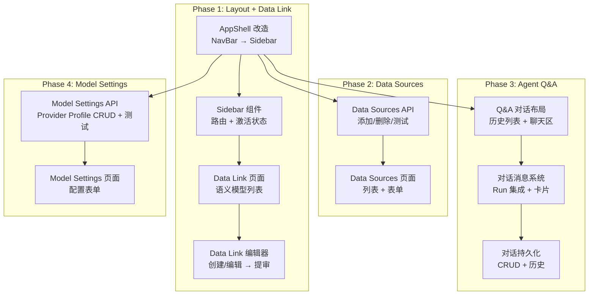
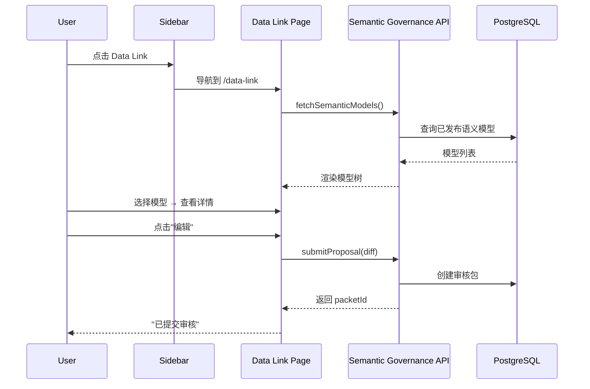

# DataFoundry 风格平台模块 — 实现计划

## Summary

四阶段渐进式构建：在现有 Data Agent 分析工作台基础上，通过布局改造（NavBar → Sidebar）、新增 Data Link 语义浏览器/编辑器、Data Sources 数据源管理、Agent Q&A 对话交互、Model 设置四个模块，形成类似 DataFoundry 的一站式数据智能平台。每阶段独立可验证，优先改造布局和 Data Link，再依次构建 Data Sources、Q&A 和 Model 设置。

---

## Problem Frame

当前 Data Agent 只有"分析工作台"和"语义审核"两个页面，导航为顶部标签栏。与 DataFoundry 等现代数据平台相比，缺少数据源管理、语义层可视化、对话式交互和模型选择四个关键能力。需求文档已定义完整的 WHAT（见 `docs/brainstorms/2026-08-05-datafoundry-platform-modules-requirements.md`），本计划定义 HOW。

---

## Scope Boundaries

- 除 PostgreSQL 和 MySQL 外的其他数据库类型不在本次范围
- OpenAI、Anthropic、DeepSeek、GLM、Kimi、Grok、Gemini 之外的模型供应商不在本次范围
- 数据库 Schema 自动发现/同步功能不在本次范围
- 数据源连接池管理、连接健康监控不在本次范围
- 语义层的自动生成（AI 辅助定义）不在本次范围
- 对话历史共享、导出、搜索不在本次范围
- 用户权限管理（RBAC）不在本次范围（保留现有权限体系）

### Deferred to Follow-Up Work

- 现有分析工作台 Workbench 页面（`apps/web/src/app/page.tsx`）的内部组件大规模重构
- 语义治理审核页面（`apps/web/src/app/semantic/page.tsx`）的 UI 优化
- 数据源连接的状态监控仪表盘

---

## Requirements

- R1. Data Sources 页面展示所有已配置的数据源连接列表
- R2. 支持通过表单添加 PostgreSQL 和 MySQL 数据源
- R3. 连接配置包含：连接名称、数据库类型、主机、端口、数据库名、用户名、密码、SSL 选项
- R4. 支持测试连接功能，验证配置是否正确
- R5. Data Link 页面浏览所有已发布的语义模型定义
- R6. 查看单个语义模型的详情（指标、维度、表映射、关系）
- R7. 通过编辑器创建新的语义定义或修改已有定义
- R8. 语义编辑提交后自动进入现有治理审核流程
- R9. Q&A 页面采用对话式交互（左侧历史列表，右侧对话区域）
- R10. Q&A 集成现有分析能力，复杂结果以卡片形式嵌入对话
- R11. Q&A 包含数据源选择器和模型选择器
- R12. 对话历史持久化存储，可查看和恢复历史对话
- R13. Settings 页面配置模型，支持 OpenAI、Anthropic、DeepSeek、GLM、Kimi、Grok、Gemini 等 provider 的模型 profile
- R14. 模型配置支持管理多个 provider 的模型 profile，可在 Q&A 中切换，并将所选模型传入 run 链路实际生效
- R15. 导航从顶部标签栏改造为左侧侧边栏
- R16. 保持现有功能完整性，融入新导航结构

---

## Key Technical Decisions

| 决策 | 选择 | 理由 |
|------|------|------|
| **凭证存储** | PostgreSQL 密钥引用模式（`packages/platform/src/secrets/`） | 现有基础设施，无需引入第三方密钥管理服务 |
| **语义编辑器 UX** | 左侧模型树 + 右侧表单/YAML 编辑面板 | 与现有语义治理审核流程一致，提交后自动进入 review 流程 |
| **Q&A 对话模型** | Conversation 作为独立实体，关联 Run 和 Event | 复用现有 `streamRunEvents` 机制，对话历史独立存储 |
| **数据源选择** | 对话级别选择（创建/切换对话时选择） | 简化 UX，避免每查询选择增加操作负担 |
| **侧边栏响应式** | zustand `sidebar-collapsed` + CSS transition | 轻量级实现，不引入额外依赖 |
| **状态管理** | 新增独立的 zustand store（不重构现有 store） | 隔离变更范围，避免影响现有功能 |
| **API 模式** | 新增 Next.js API Routes（Data Sources、Model Settings） | 与现有 `apps/web/src/app/api/` 模式一致 |
| **UI 组件** | 复用现有 `components/ui/` 基础组件 | 保持视觉一致性 |

---

## High-Level Technical Design

---

## Phase 1: Layout Refactor + Data Link

### U1. 侧边栏布局改造

**Goal:** 将 AppShell 从顶部 NavBar 布局改造为左侧 Sidebar 布局，保留现有 StatusBar 和内容区域。

**Requirements:** R15, R16

**Dependencies:** None

**Files:**
- Modify: `apps/web/src/components/layout/app-shell.tsx`
- Modify: `apps/web/src/components/layout/nav-bar.tsx` (重构为 Sidebar 或新建)
- Create: `apps/web/src/components/layout/sidebar.tsx`
- Create: `apps/web/src/components/layout/sidebar-item.tsx`
- Test: `apps/web/test/components/layout/`

**Approach:**
- AppShell 从 `flex-col` 改为 `flex-row`：Sidebar（固定宽度）+ Main（flex-1）+ StatusBar（底部）
- 侧边栏宽度：展开 240px，折叠 52px（仅图标）
- 使用 zustand store 管理折叠状态
- 当前 NavBar 中的 Data Agent 品牌标记迁移到 Sidebar 顶部
- 保留 NavBar 组件暂时不动，过渡期后移除

**Patterns to follow:**
- 现有 `AppShell` 的 flex 布局模式
- 现有 CSS 变量主题系统

**Test scenarios:**
- Happy path: 侧边栏正确渲染四个导航项（分析工作台、Data Link、Data Sources、Settings）
- Edge case: 侧边栏折叠/展开状态切换正确，内容区域自适应
- Edge case: 路径变化时，对应导航项高亮
- Integration: 所有现有页面在侧边栏布局下正常渲染

**Verification:** 页面加载后侧边栏可见，点击导航项可在不同页面间切换，当前页面高亮正确。

---

### U2. Data Link 语义模型浏览器

**Goal:** 创建 Data Link 页面，展示已发布语义模型列表和详情视图。

**Requirements:** R5, R6

**Dependencies:** U1

**Files:**
- Create: `apps/web/src/app/data-link/page.tsx`
- Create: `apps/web/src/app/data-link/models/[id]/page.tsx`
- Create: `apps/web/src/components/data-link/model-list.tsx`
- Create: `apps/web/src/components/data-link/model-detail.tsx`
- Create: `apps/web/src/components/data-link/metric-definition.tsx`
- Create: `apps/web/src/components/data-link/dimension-definition.tsx`
- Create: `apps/web/src/components/data-link/table-mapping.tsx`
- Create: `apps/web/src/lib/data-link-store.ts` (zustand store)
- Create: `apps/web/src/lib/data-link-api.ts` (API client)
- Test: `apps/web/test/components/data-link/`

**Approach:**
- 新增 zustand store `data-link-store`，管理当前选中的模型、浏览状态
- 模型列表页面：卡片式布局，展示模型名称、描述、最后更新时间
- 模型详情页面：Tab 切换（指标 / 维度 / 表映射 / 关系）
- 数据来源：通过现有 `semantic-api.ts` 的 `fetchPublishedModels()` 获取（需新增该 API，或直接查询已发布的语义定义）
- 复用现有语义类型（`semantic-types.ts` 中的 `SemanticReviewPacket` 等）

**Patterns to follow:**
- 现有 `semantic-store.ts` 的 zustand store 模式
- 现有 `semantic/page.tsx` 的页面布局

**Test scenarios:**
- Happy path: 模型列表正确渲染，点击进入详情页
- Happy path: 详情页 Tab 切换显示不同内容
- Edge case: 无模型时显示空状态
- Error path: API 请求失败时显示错误提示

**Verification:** 导航到 `/data-link` 可看到语义模型列表，点击模型进入详情页。

---

### U3. Data Link 语义编辑器

**Goal:** 创建语义定义编辑器，支持新建和修改语义定义，提交后自动进入治理审核流程。

**Requirements:** R7, R8

**Dependencies:** U2

**Files:**
- Create: `apps/web/src/app/data-link/editor/page.tsx`
- Create: `apps/web/src/app/data-link/editor/[id]/page.tsx`
- Create: `apps/web/src/components/data-link/semantic-editor.tsx`
- Create: `apps/web/src/components/data-link/editor-preview.tsx`
- Test: `apps/web/test/components/data-link/`

**Approach:**
- 编辑器采用表单式布局：左侧结构树（指标/维度/表映射），右侧编辑面板
- 编辑完成后点击"提交审核"，调用 `semantic-api.ts` 的 `createProposal()` 创建审核包
- 提交成功后跳转到语义审核页面，提示"已提交审核"
- 编辑器支持两种模式：新建（从空白创建）和修改（基于已有模型创建修订版本）
- 编辑内容格式参考现有 `SemanticDiff` 结构

**Patterns to follow:**
- `semantic-api.ts` 的 `createProposal()` 调用模式
- 现有审核流程的 `SemanticDiff` 类型

**Test scenarios:**
- Happy path: 编辑指标定义 → 提交审核 → 审核包创建成功 → 跳转到审核页面
- Happy path: 基于已有模型创建修订版本
- Edge case: 提交时网络错误，显示重试选项
- Edge case: 编辑器未保存内容时离开页面，提示确认

**Verification:** 在模型详情页点击"编辑"进入编辑器，修改后提交审核，页面提示"已提交审核"并跳转到语义审核页面。

---

## Phase 2: Data Sources

### U4. Data Sources API

**Goal:** 新增 Data Sources 管理的 Next.js API Routes，支持添加、删除、列表查询和测试连接。

**Requirements:** R1, R2, R3, R4

**Dependencies:** None (独立于 Phase 1)

**Files:**
- Create: `apps/web/src/app/api/datasources/route.ts` (GET 列表, POST 创建)
- Create: `apps/web/src/app/api/datasources/[id]/route.ts` (DELETE 删除)
- Create: `apps/web/src/app/api/datasources/test/route.ts` (POST 测试连接)
- Create: `apps/web/src/lib/datasource-api.ts` (API client)
- Create: `apps/web/src/lib/datasource-types.ts` (类型定义)
- Modify: `apps/web/src/app/globals.css` (如有新增样式)

**Approach:**
- 数据类型：`DataSourceConnection { id, name, type: 'postgresql' | 'mysql', host, port, database, username, ssl, createdAt, updatedAt }`
- 密码（password）不返回给前端，仅存储时使用
- 测试连接：后端使用 `pg` 或 `mysql2` 尝试建立连接，返回成功/失败信息
- 凭证存储：使用 `packages/platform/src/secrets/` 的密钥引用模式，实际密码加密存储到 PostgreSQL
- 数据源列表从 PostgreSQL 读取（需新增 `datasource_connections` 表或使用现有 tenancy 表）

**Patterns to follow:**
- 现有 `apps/web/src/app/api/semantic/` 的 API Routes 模式
- `packages/platform/src/secrets/secret-ref.ts` 的密钥管理

**Test scenarios:**
- Happy path: POST 创建数据源 → 返回创建成功的连接对象（不含密码）
- Happy path: GET 列表 → 返回所有已配置的数据源
- Happy path: POST 测试连接 → 连接成功返回 `{ success: true }`
- Error path: 测试连接失败 → 返回 `{ success: false, error: "..." }`
- Error path: 必填字段缺失 → 返回 400 错误

**Verification:** API 可正常创建、查询、删除数据源连接，测试连接功能可验证配置是否正确。

---

### U5. Data Sources 页面

**Goal:** 创建 Data Sources 管理页面，包含连接列表、添加/编辑表单和测试连接功能。

**Requirements:** R1, R2, R3, R4

**Dependencies:** U4

**Files:**
- Create: `apps/web/src/app/data-sources/page.tsx`
- Create: `apps/web/src/components/data-sources/connection-list.tsx`
- Create: `apps/web/src/components/data-sources/connection-form.tsx`
- Create: `apps/web/src/components/data-sources/test-connection-button.tsx`
- Create: `apps/web/src/lib/datasource-store.ts` (zustand store)
- Test: `apps/web/test/components/data-sources/`

**Approach:**
- 连接列表：表格形式展示所有数据源，列包含名称、类型、主机、状态、操作（编辑/删除/测试）
- 添加/编辑表单：对话框形式，数据库类型选择（PostgreSQL / MySQL），动态切换端口默认值
- 测试连接按钮：表单中实时测试，显示成功/失败状态
- 密码字段：输入时显示为 `******`，编辑时已保存的连接不返回密码

**Patterns to follow:**
- 现有 `components/semantic/review-inbox.tsx` 的列表+操作模式
- 现有 `components/ui/` 的基础组件

**Test scenarios:**
- Happy path: 打开页面 → 看到数据源列表 → 点击"添加连接" → 填写表单 → 测试连接成功 → 保存 → 列表刷新
- Happy path: 点击已有连接的"测试连接" → 显示当前状态
- Edge case: 列表为空时显示空状态提示
- Edge case: 删除数据源时确认对话框
- Error path: 测试连接失败时显示错误原因

**Verification:** 用户可完成从创建连接到测试连接到保存的完整流程。

---

## Phase 3: Agent Q&A

### U6. Q&A 对话布局

**Goal:** 创建 Q&A 对话页面，左侧对话历史列表，右侧对话区域，集成数据源和模型选择器。

**Requirements:** R9, R11

**Dependencies:** U1

**Files:**
- Create: `apps/web/src/app/qa/page.tsx`
- Create: `apps/web/src/components/qa/conversation-list.tsx`
- Create: `apps/web/src/components/qa/chat-area.tsx`
- Create: `apps/web/src/components/qa/chat-input.tsx`
- Create: `apps/web/src/components/qa/data-source-selector.tsx`
- Create: `apps/web/src/components/qa/model-selector.tsx`
- Create: `apps/web/src/lib/qa-store.ts` (zustand store)
- Test: `apps/web/test/components/qa/`

**Approach:**
- 页面布局：左侧对话列表（280px 面板）+ 右侧对话区域（flex-1）
- 对话列表：显示对话标题、最后更新时间、消息预览
- 对话区域：顶部为数据源+模型选择器，中间为消息列表，底部为输入框
- 数据源选择器：下拉菜单，从 Data Sources 列表获取可选数据源
- 模型选择器：下拉菜单，从 Model Settings 获取可用模型

**Patterns to follow:**
- 现有 `components/workbench/query-input-section.tsx` 的输入模式
- 现有 `components/ui/` 的基础组件

**Test scenarios:**
- Happy path: 打开 Q&A 页面 → 左侧显示对话列表（或空状态）→ 右侧显示聊天区域
- Happy path: 数据源选择器列出所有已配置的数据源
- Happy path: 模型选择器列出所有已配置的模型
- Edge case: 无数据源时显示提示"请先配置数据源"

**Verification:** Q&A 页面布局正确，数据源和模型选择器可正常使用。

---

### U7. Q&A 消息系统

**Goal:** 实现对话消息的发送和展示，集成现有分析工作台能力，复杂结果以卡片形式嵌入对话。

**Requirements:** R10

**Dependencies:** U6

**Files:**
- Create: `apps/web/src/components/qa/chat-message.tsx`
- Create: `apps/web/src/components/qa/result-card.tsx`
- Create: `apps/web/src/components/qa/result-table-card.tsx`
- Create: `apps/web/src/components/qa/result-report-card.tsx`
- Create: `apps/web/src/components/qa/result-hypothesis-card.tsx`
- Create: `apps/web/src/components/qa/loading-indicator.tsx`
- Modify: `apps/web/src/lib/workbench-store.ts` (扩展以支持对话模式)
- Test: `apps/web/test/components/qa/`

**Approach:**
- 消息类型：用户消息（question）、Agent 消息（text, table, report, hypothesis, error）
- 用户输入问题 → 调用 `createRun()` → 通过 `streamRunEvents()` 流式接收结果
- 结果卡片：复用现有 `ReportSection`、`HypothesisSection`、`EvalSection` 等组件的内部逻辑
- 消息列表：按时间顺序排列，自动滚动到底部
- 加载状态：Agent 思考时显示加载指示器

**Patterns to follow:**
- 现有 `page.tsx` 的 `createRun()` + `streamRunEvents()` 流程
- 现有工作台组件的工作区段渲染模式

**Test scenarios:**
- Happy path: 输入问题 → 显示用户消息 → 流式接收结果 → 显示结果卡片
- Happy path: 结果表格正确渲染
- Happy path: 结果报告正确渲染
- Edge case: Agent 返回错误时显示错误消息
- Edge case: 网络中断时显示重连提示

**Verification:** 用户可在 Q&A 中提问并看到 Agent 返回结果，结果以卡片形式展示。

---

### U8. Q&A 对话持久化

**Goal:** 实现对话的创建、保存、恢复和删除功能，对话历史持久化存储。

**Requirements:** R12

**Dependencies:** U7

**Files:**
- Create: `apps/web/src/app/api/qa/conversations/route.ts` (GET 列表, POST 创建)
- Create: `apps/web/src/app/api/qa/conversations/[id]/route.ts` (GET, DELETE, PATCH)
- Create: `apps/web/src/app/api/qa/conversations/[id]/messages/route.ts` (GET 消息列表)
- Modify: `apps/web/src/lib/qa-store.ts` (扩展对话管理)
- Modify: `apps/web/src/components/qa/conversation-list.tsx` (CRUD 操作)
- Test: `apps/web/test/components/qa/`

**Approach:**
- 对话数据模型：`Conversation { id, title, dataSourceId, modelId, createdAt, updatedAt }`
- 消息数据模型：`Message { id, conversationId, role: 'user' | 'agent', content, type, runId, createdAt }`
- 对话列表支持：新建对话、删除对话、点击切换对话、重命名对话
- 消息存储：User 消息直接存储，Agent 消息关联 RunId，通过 `getRun()` 获取完整结果
- 对话列表按最后更新时间降序排列

**Patterns to follow:**
- 现有 `apps/web/src/app/api/semantic/` 的 API Routes 模式
- 现有 `api-client.ts` 的请求封装模式

**Test scenarios:**
- Happy path: 创建新对话 → 输入问题 → 对话自动保存 → 刷新页面 → 对话出现在列表中
- Happy path: 点击已有对话 → 加载历史消息 → 可继续对话
- Happy path: 删除对话 → 从列表中移除
- Edge case: 对话列表为空时显示空状态

**Verification:** 对话历史持久化，刷新页面后对话和消息可恢复，Agent 结果通过 RunId 关联。

---

## Phase 4: Model Settings

### U9. Model Settings API

**Goal:** 新增 Provider 感知的模型 profile API，支持添加、删除、列表查询、设为默认和测试连接。

**Requirements:** R13, R14

**Dependencies:** None

**Files:**
- Create: `apps/web/src/app/api/models/route.ts` (GET 列表, POST 创建)
- Create: `apps/web/src/app/api/models/[id]/route.ts` (DELETE 删除)
- Create: `apps/web/src/lib/model-api.ts` (API client)
- Create: `apps/web/src/lib/model-types.ts` (类型定义)

**Approach:**
- 数据类型：`ModelConfig { id, name, apiKey(masked), baseUrl, createdAt, updatedAt }`
- API Key 加密存储，返回时仅显示前 8 位 + `****`
- 支持配置多个模型，Q&A 中可选择使用
- 支持 OpenAI、Anthropic、DeepSeek、GLM、Kimi、Grok、Gemini provider 预设

**Patterns to follow:**
- 现有 `apps/web/src/app/api/datasources/` 的 API Routes 模式

**Test scenarios:**
- Happy path: POST 创建模型配置 → 返回创建成功（API Key 已脱敏）
- Happy path: GET 列表 → 返回所有已配置的模型
- Happy path: DELETE 删除 → 模型从列表中移除
- Error path: 必填字段缺失 → 返回 400 错误

**Verification:** API 可正常管理模型配置。

---

### U10. Model Settings 页面

**Goal:** 创建 Settings 页面中的模型配置管理界面。

**Requirements:** R13, R14

**Dependencies:** U9

**Files:**
- Create: `apps/web/src/app/settings/page.tsx`
- Create: `apps/web/src/components/settings/model-config-list.tsx`
- Create: `apps/web/src/components/settings/model-config-form.tsx`
- Create: `apps/web/src/lib/settings-store.ts` (zustand store)
- Test: `apps/web/test/components/settings/`

**Approach:**
- 页面布局：简单的列表 + 添加对话框
- 模型列表：表格形式，列包含名称、Base URL、API Key 状态（已配置）、操作（删除）
- 添加表单：对话框形式，填写名称、API Key、Base URL
- 保存后模型出现在 Q&A 的模型选择器中

**Patterns to follow:**
- 现有 `components/data-sources/connection-form.tsx` 的表单模式
- 现有 `components/ui/` 的基础组件

**Test scenarios:**
- Happy path: 打开 Settings → 看到模型列表（或空状态）→ 添加模型 → 保存 → 列表刷新
- Happy path: 删除模型 → 确认后从列表移除
- Edge case: 列表为空时显示空状态提示

**Verification:** 用户可完成模型配置的添加和管理，配置后的模型出现在 Q&A 选择器中。

---

## System-Wide Impact

- **Interaction graph:** Sidebar 改造影响所有页面（`/`, `/semantic`, `/data-link`, `/data-sources`, `/qa`, `/settings`）。现有 `NavBar` 组件将被替换，所有页面布局统一通过 `AppShell` 管理。
- **Error propagation:** Data Sources 和 Model Settings 的 API 错误通过标准 HTTP 响应码传递，前端统一处理错误显示。
- **State lifecycle risks:** Data Sources 凭证存储需要确保密码不泄露到前端，API 返回时必须脱敏。Q&A 对话持久化需要考虑并发写入。
- **API surface parity:** 现有分析工作台在 Q&A 对话中复用，需确保两种模式（传统工作台和对话式）可同时存在。
- **Integration coverage:** Sidebar 导航 + 所有新页面的交互测试，特别是页面切换时 store 状态的管理。
- **Unchanged invariants:** 现有分析工作台（`apps/web/src/app/page.tsx`）和语义审核（`apps/web/src/app/semantic/page.tsx`）的功能保持不变。现有 zustand stores（`workbench-store`、`semantic-store`）不重构。

---

## Risks & Dependencies

| Risk | Mitigation |
|------|------------|
| Sidebar 改造影响现有页面布局 | 渐进式改造，先新增 Sidebar 组件，验证后再移除 NavBar |
| Data Sources 凭证安全性 | 使用现有密钥引用模式，密码加密存储，API 返回脱敏 |
| Q&A 对话模型与现有 Run 机制的集成复杂度 | Conversation 作为薄层封装 Run，不修改现有 Run 逻辑 |
| 多阶段开发可能导致代码积累不一致 | 每阶段独立验证，代码 review 确保一致性 |
| 语义编辑器 UX 需要用户反馈 | 优先实现基础表单版本，后续根据反馈迭代 |

---

## Documentation / Operational Notes

- 新增页面路由需在 Sidebar 中注册
- Data Sources 的数据库连接应遵循现有出站策略（`packages/platform/src/datasources/egress.ts`）
- Q&A 对话的消息存储在会话恢复时需正确处理 Run 的终态判断

---

## Sources & References

- **Origin document:** `docs/brainstorms/2026-08-05-datafoundry-platform-modules-requirements.md`
- **Related code:**
  - `apps/web/src/components/layout/app-shell.tsx` — 当前布局
  - `apps/web/src/components/layout/nav-bar.tsx` — 当前导航
  - `apps/web/src/lib/semantic-api.ts` — 语义治理 API
  - `apps/web/src/lib/semantic-store.ts` — 语义 store 模式
  - `apps/web/src/lib/workbench-store.ts` — 工作台 store 模式
  - `apps/web/src/lib/api-client.ts` — Run API 客户端
  - `apps/web/src/app/page.tsx` — 当前分析工作台
  - `packages/platform/src/secrets/secret-ref.ts` — 密钥引用模式
  - `packages/platform/src/datasources/egress.ts` — 数据源出站策略
- **Related plans:**
  - `docs/plans/2026-08-04-001-u11-4-postgresql-semantic-service-plan.md`
  - `docs/plans/2026-08-04-001-u8-web-frontend-sse-completion-plan.md`
