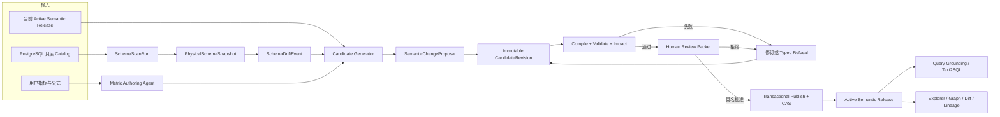

# Data Agent Semantic Layer Studio Roadmap

## 一句话结论

不要再造一套“AI 直接编辑语义层”的旁路。应在现有 PostgreSQL 语义治理控制面之上，
补齐 **展示、数据库结构快照、AI 候选生成、指标公式 Agent、运行时消费** 五段能力，
并让数据库扫描和用户输入都进入同一条受治理链路：

`输入事实/意图 → 不可变 Candidate → 确定性验证 → 人工评审 → 发布 → 运行时消费`。

首版限定 PostgreSQL，PostgreSQL 继续是唯一权威；图只是由已发布版本派生的读取视图。
AI 可以发现、解释、生成和修订候选，但不能批准、发布、回滚或修改权限策略。

## 1. 目标与成功定义

| 用户目标 | 首版产品结果 | 成功标准 |
|---|---|---|
| 展示语义层 | 在 Studio 中查看业务对象、指标、维度、公式、关系、物理绑定、版本和治理状态 | 用户可从对象定位到公式、字段、上游依赖、当前 release 和变更历史 |
| 从数据库表结构更新语义层 | 只读扫描 PostgreSQL，冻结物理结构快照，展示 drift，并由 AI 生成语义变更候选 | 扫描不写业务库；同一结构得到同一摘要；AI 不直接改变活动版本 |
| 输入指标和公式后由 Agent 新增/更新 | Agent 澄清口径、绑定字段、生成 Formula AST、校验粒度/单位/Join，并提交 Candidate | 模糊输入会追问或拒绝；合法输入生成可审查 diff；未审批内容对查询不可见 |
| 语义层可持续治理 | 候选、验证、评审、发布、回滚和运行时版本引用形成闭环 | 每次发布都能回答谁改了什么、基于哪个 schema、通过哪些 Gate、影响哪些查询 |

## 2. 当前基线与差距

本判断基于 2026-08-08 的 `HEAD 7958261a56c98725ee8395ea20d7af63ad49bcbb`。
工作区存在大量既有未提交修改；以下把 HEAD 证据和未提交脚手架严格分开。

| 能力 | 当前状态 | 判断 |
|---|---|---|
| 语义对象合同 | `packages/contracts/src/artifacts/semantic-governance.ts` 已定义 metric、dimension、relationship、formula signature、grain、unit、additivity、null/fanout policy | 可复用，不应新建第二套对象模型 |
| 候选治理 | 现有控制面已经定义 Candidate 状态、不可变 `CandidateRevision` 和 `ValidationReceipt` | 可作为所有 AI 修改的唯一入口 |
| 确定性编译 | `packages/semantic/src/compiler/u5-compiler.ts` 已覆盖 schema、引用、relationship、runtime authorization、content digest 和 lowerability 校验 | 可作为 Agent 之后的硬 Gate，但需补指标公式和 schema-drift 专项测试 |
| PostgreSQL 服务 | `PostgresSemanticGovernanceService` 已有候选、评审、发布与回滚写链 | 尚不能视为 production-ready：默认仍可落到 Mock，部分 candidate diff/digest/identity 是空值、随机值或硬编码占位 |
| 语义界面 | HEAD 的 `apps/web/src/app/semantic/page.tsx` 主要是 review inbox/detail | 缺少 Explorer、对象详情、公式、物理绑定、图、diff、lineage 和构建工作面 |
| 数据源与语义编辑脚手架 | 未提交工作区中可观察到 data-source API、Semantic Editor 和 store | 只能作为设计输入，不能当作已交付能力；连接测试目前不等于 schema introspection，进程内明文凭据也不能进入正式设计 |
| 运行时消费 | 现有 U5/U6 体系已有发布语义与查询 grounding 合同 | 需要证明 Studio 发布的 active release 真正进入每次 Query Run，而非只停在 UI/API |

因此，项目不是“从零做语义层”，而是“把已有治理内核产品化，并补上发现、创作和展示”。

## 3. 产品边界：六个平面，两个入口，一个发布闭环

### 3.1 六个语义平面

1. `BusinessOntology`：业务实体、事件、术语、别名、业务关系与 owner。
2. `AnalyticalSemantics`：指标、维度、公式、grain、unit、time domain、additivity、null/fanout policy。
3. `RelationshipRegistry`：物理、业务、分析关系及 cardinality、row-preservation 和 proof。
4. `PhysicalBinding`：语义对象到 datasource、schema、table、column 的版本化绑定。
5. `CatalogGovernance`：数据库结构快照、drift、扫描策略、敏感字段和证据来源。
6. `RuntimeAuthorization`：查询允许使用的表、列和谓词限制；它只能收窄平台权限。

本体负责业务意义，不等于完整语义层；外键不自动等于安全分析 Join；关系路径也不能
冒充贡献或因果证明。这个边界沿用 `ontology-learning` 中的 Candidate Plane / Authority
Plane、Competency Question、结构校验、版本迁移和回滚思想。

### 3.2 两个写入入口

- **Schema Discovery 入口：** 数据库事实 → `PhysicalSchemaSnapshot` → drift → AI mapping candidate。
- **Metric Authoring 入口：** 用户指标/公式 → clarification → typed metric/formula candidate。

两个入口从 Candidate 开始完全合流，不各自实现评审和发布。

### 3.3 目标架构



## 4. Semantic Layer Studio 信息架构

沿用当前 DataFoundry 风格的密度、三栏布局和视觉语言，同时保留现有业务组件、store 和
治理流程，不为了“像另一个产品”重写数据流。

### 4.1 Explorer：读活动语义版本

- 左栏：Domain / Entity / Metric / Dimension / Relationship / Datasource 树和搜索。
- 中栏：表格或关系图切换；图展示实体、指标依赖、关系和物理绑定，但节点详情来自
  PostgreSQL 活动版本，不从图数据库反向写回。
- 右栏：定义、别名、owner、公式 AST/可读表达式、grain、unit、time、null/fanout、
  physical binding、proof、版本、治理状态和影响范围。
- 辅助视图：当前版本与候选 diff、metric lineage、schema lineage、release timeline。

### 4.2 Builder：创建候选

- `From Schema`：选择 snapshot/drift，查看 AI 建议的 entity、dimension、metric、关系和
  binding，每个字段显示证据、置信度和未决假设。
- `From Metric`：用自然语言或结构化表单输入指标名称、业务定义和公式，Agent 追问
  粒度、时间字段、单位、过滤、分母、空值和 fanout 语义。
- 所有保存操作只创建或更新 candidate revision；界面始终显示“未发布，不影响查询”。

### 4.3 Govern：验证、评审和发布

- 复用现有 inbox/detail，增加编译结果、失败 Gate、schema 基线、semantic diff、影响查询、
  reviewer policy、approval expiry 和 stale/rebase 原因。
- `Approve` 只签精确 ReviewPacket；`Publish` 是独立权限和独立事务动作。
- 回滚采用 roll-forward release，不删除历史对象或改写旧 release。

## 5. 核心 Artifact 与 API

### 5.1 新增或扩展 Artifact

| Artifact | 最小字段与不变量 |
|---|---|
| `DataSourceCredentialRef` | 只保存 secret reference、scope 和 rotation metadata；API/DB/日志不得返回原始密码 |
| `SchemaScanRequest` / `SchemaScanRun` | datasource、catalog/schema allowlist、scan policy、principal、started/finished、terminal、error receipt |
| `PhysicalSchemaSnapshot` | datasource identity、engine/version、catalog/schema、tables、columns、types、nullable/default/comment、PK/FK/unique/check/index、可选统计摘要、scan time、canonical hash |
| `SchemaDriftEvent` | base/current snapshot、added/removed/changed、binding impact、severity、ack/rebase state；禁止仅凭名称变化自动删语义对象 |
| `SemanticChangeProposal` | source kind、base release/generation、schema snapshot、object-level ops、field evidence/confidence、assumptions、dedupe key、model/prompt/tool identity |
| `MetricAuthoringBrief` | 原始输入、澄清问答、business definition、formula AST、grain、unit、time、filter、null/fanout、dependencies、physical binding choices |
| `CandidateRevision` | 复用现有合同；必须保存 canonical source bundle、semantic diff、base identity、content hash 和 proposer identity，revision 不可变 |
| `ValidationReport` | schema/ref/type、unit/grain、formula、relationship/fanout、authorization、lowerability、compile、query dry-run、golden/mutation 结果和 validator identity |
| `ImpactReport` | 下游 metric/query/dashboard/case、breaking/non-breaking、required rebase、estimated blast radius |
| `ReviewPacket` / `SemanticRelease` | 绑定 exact candidate revision、snapshot、compiler/validator、diff、impact、policy/membership、expiry；任一输入变化使旧批准失效 |

样例值不是首版必需输入。若后续启用，只能按列级策略产生脱敏统计或受限样本，默认禁止把
原始业务行发送给模型。

### 5.2 推荐 API

```text
POST   /api/datasources/:id/schema-scans
GET    /api/datasources/:id/schema-scans/:runId
GET    /api/schema-snapshots/:snapshotId
GET    /api/schema-snapshots/:snapshotId/diff?base=...

GET    /api/semantic/releases/active?domain=...
GET    /api/semantic/objects/:objectId
GET    /api/semantic/objects/:objectId/lineage
GET    /api/semantic/releases/:releaseId/diff?base=...

POST   /api/semantic/proposals/from-schema
POST   /api/semantic/proposals/from-metric
POST   /api/semantic/candidates/:candidateId/revisions
POST   /api/semantic/candidates/:candidateId/validate
GET    /api/semantic/candidates/:candidateId/impact
POST   /api/semantic/candidates/:candidateId/submit-review
```

评审、发布和回滚继续调用现有治理服务，不新增一个能绕过 PostgreSQL RPC/CAS 的通用
`save semantic model` API。

### 5.3 Agent 工具和权限

Agent 可调用：

- `read_datasource_catalog`
- `read_schema_snapshot` / `compare_schema_snapshots`
- `get_active_semantic_release`
- `search_semantic_objects`
- `propose_schema_mapping`
- `propose_metric_change`
- `create_candidate_revision`
- `validate_candidate`
- `preview_candidate_impact`
- `submit_candidate_for_review`

Agent 永远没有：`approve_candidate`、`publish_release`、`rollback_release`、
`change_reviewer_policy`、`read_raw_secret`。人类在 UI 可完成的发现和提案动作也必须有
同合同的 Agent 工具，避免 UI 与 Agent 形成两套行为语义。

## 6. 状态机与并发规则

Candidate 继续复用现有状态集合，不引入平行状态机：

```text
DRAFT
  -> VALIDATING -> VALIDATION_FAILED -> DRAFT(new revision)
  -> REVIEW_SUBMITTED -> WAITING_REVIEW
  -> REJECTED | APPROVED | STALE_REBASE_REQUIRED
  -> PUBLISHING -> PUBLISHED
```

- 每次修订创建新的 immutable revision，不在原 revision 上覆盖 payload。
- `APPROVED` 绑定 base generation、schema snapshot、compiler/validator digest、review policy、
  membership 和 expiry；任何 currentness 变化都进入 `STALE_REBASE_REQUIRED`。
- 发布在 PostgreSQL 事务中重新验证所有绑定，使用 CAS 移动 active pointer，并写 outbox。
- rollback 创建新的 release 指向上一个已验证内容，不删除已发布历史。
- UI 可有本地草稿状态，但不得把它映射成新的服务端 Authority 状态。

## 7. 分阶段 Roadmap

以下为 1 个小队的相对估算，建议总周期 **12–15 周**。每个里程碑都可独立验收；若前一
阶段 Gate 未过，不以 UI 演示代替正确性闭环。

### M0 — 权威与安全地基（1–2 周）

**用户可见结果：** 评审页仍可使用，但产品明确区分 Demo/Mock 与 PostgreSQL Authority。

**范围：**

- 真实 PostgreSQL 治理服务成为非 Demo 环境的 fail-closed 路径；禁止静默降级到 Mock。
- 修复 candidate revision 的空 diff、随机 hash、错误 source revision、硬编码 proposer；
  canonical serialization 后生成稳定 digest。
- 冻结 service interface、tenant/domain/principal/RLS context 和错误终态。
- 数据源凭据改为 secret reference；连接测试与日志不泄露密码。
- 为 migration 10610、Candidate、Review、Publish、Rollback、outbox 和 active pointer 建立
  服务合同与数据库集成测试。

**Gate：** 相同 payload 得到相同 hash；不同 scope 不可读写；stale approval 不能发布；
非 Demo 配置缺失时明确失败；没有 placeholder identity/digest。

**回滚点：** 保留显式 Demo adapter，只允许在测试/本地 fixture 中选择，不影响权威表。

### M1 — PostgreSQL 只读 Schema Discovery（2 周）

**用户可见结果：** 连接一个 PostgreSQL 后，可浏览表、列、类型、约束和快照差异。

**范围：**

- 首版只支持 PostgreSQL；通过 `information_schema` 获取可移植元数据，必要时以
  `pg_catalog` 补充 comment/index/identity 等 PostgreSQL 特有字段。
- 实现 allowlist、超时、分页、cancel、最小权限和 zero-write 连接角色。
- 生成 canonical `PhysicalSchemaSnapshot`，相邻快照生成 `SchemaDriftEvent`。
- Studio 增加 Physical Schema tree、snapshot selector 和 drift diff。
- 本阶段没有 LLM；先证明确定性采集、对比和权限边界。

**Gate：** fixture 的 table/column/PK/FK/unique/null/type drift 100% 命中；重复扫描无变化时
hash 不变；只读用户无法执行写 SQL；超时和权限不足得到稳定终态。

**回滚点：** 关闭 scan scheduler 但保留最后一次可读快照；不影响活动语义版本。

### M2 — Semantic Explorer（2 周）

**用户可见结果：** 可按 Domain 查看活动语义层的树、表、图、详情、版本、diff 和 lineage。

**范围：**

- 从 PostgreSQL active release/source projection 构建统一 read model。
- Explorer 三栏界面；对象之间可导航到 metric dependencies、relationships 和 bindings。
- 图在 Web/API 内从 read model 派生，不引入 Neo4j。
- 显示 `published / candidate / stale / deprecated`，候选和活动版本视觉上不可混淆。

**Gate：** 同一 release 的 tree/table/graph/detail 对象数与 identity 一致；刷新后不会展示旧
active generation；无权字段不进入 read model；10k 对象规模下交互满足预设性能预算。

**回滚点：** feature flag 退回现有 Review Workspace；数据和发布链无迁移回滚。

### M3 — Schema-to-Semantic Candidate（2–3 周）

**用户可见结果：** 对 snapshot 或 drift 点击“生成建议”，得到带证据、置信度、未决问题和
diff 的 entity/dimension/metric/relationship/binding 候选。

**范围：**

- 先用确定性规则产生候选特征：名字、类型、PK/FK、nullable、comment、枚举/统计摘要；
  LLM 只解释和组合候选。
- 每个 proposed field 保存来源证据；低置信度和冲突项必须人工选择。
- 去重 active objects 和 open candidates，支持 accept/reject/edit per operation。
- Proposal 编译为现有 `SemanticSourceBundle` 与 `CandidateRevision`，复用验证和评审流。
- 对删除表/列默认生成 impact/stale 候选，不自动删除已发布语义对象。

**Gate：** Golden schemas 的对象映射采用率和错误率可量化；所有 AI 输出通过 schema parse；
模型超时或无模型时仍能查看 snapshot；未审批候选永远不出现在 runtime grounding。

**回滚点：** 关闭 AI generator，保留确定性 schema snapshot 和人工建模入口。

### M4 — Metric Authoring Agent（2–3 周）

**用户可见结果：** 用户可输入“新增净收入 = 实付金额 - 退款金额，按订单日统计”之类意图，
Agent 澄清口径后生成新增或更新候选，并展示公式、绑定、测试和影响。

**范围：**

- 结构化解析 `MetricAuthoringBrief`；识别新增/更新、同名冲突和依赖指标。
- 澄清 grain、unit/currency、time column/timezone、filter、aggregation、null、fanout、分母为零。
- 输出 Formula AST 和可读表达式，不把任意 SQL 字符串当作已验证公式。
- 首发 allowlist：单表 `SUM/COUNT/COUNT_DISTINCT/MIN/MAX/AVG`、已发布指标之间的简单算术与
  ratio；window、任意 SQL/Python、多事实表复杂公式在 compiler 支持前 typed refusal。
- 编译、unit/grain、dependency cycle、join/fanout、authorization、dry-run、golden SQL 和
  impact Gate 通过后才能送审。

**Gate：** curated metric suite 中合法案例稳定生成同语义 AST；模糊案例稳定追问；单位冲突、
循环依赖、未知字段、many-to-many fanout、越权字段和零分母策略缺失均被拒绝。

**回滚点：** 关闭 conversational authoring，保留结构化编辑器和已有 candidates。

### M5 — 发布到 Query Runtime（2 周）

**用户可见结果：** 已批准候选发布后，新的 Query Run 使用新 active release；用户能从回答追溯
到 exact semantic release，必要时可 roll-forward 回滚。

**范围：**

- 闭合 `CandidateRevision → ReviewPacket → SemanticRelease → active pointer → U5/U6
  GroundingPackage`。
- Query Run 冻结 semantic/schema/policy identity，不在运行中漂移到新版本。
- 发布前显示受影响的 metrics、saved queries、evaluation cases 和已知 breaking changes。
- 加入 publish/retry/outbox、stale/rebase、rollback、concurrent publish 和 query replay E2E。

**Gate：** 发布前后的同一 Query 可重放并证明版本差异；并发发布只有一个 CAS 成功；旧 Run
保持旧版本；回滚后新 Run 使用 roll-forward release；失败 publish 不产生半可见状态。

**回滚点：** CAS 切回经过验证的上一内容生成新 release；保留故障 release 和审计历史。

### M6 — 扩展与优化（后续，按证据准入）

**候选能力：** MySQL/SQL Server/Snowflake 等 connector、查询历史辅助候选、主动 drift
监控、批量 migration、Neo4j/图搜索投影、协同评论和更完整的指标公式语言。

**Neo4j 准入 Gate：** 只有当 PostgreSQL/read-model 在代表性规模上不能满足已声明的多跳
lineage、影响分析或路径查询 SLO，且增量投影、重建、对账、故障降级的总成本可接受时才引入。
它仍不能成为 Candidate、Review、Release 或 active pointer 的第二写权威。

## 8. 模块落点

| 模块 | 推荐落点 | 责任 |
|---|---|---|
| 通用合同 | `packages/contracts/src/artifacts/` | snapshot、drift、proposal、authoring brief、impact/validation artifact |
| Schema connector | 新建 `packages/catalog/` 或现有 platform 内独立模块 | PostgreSQL adapter、canonicalizer、diff、read-only policy；不依赖 Web |
| 语义编译 | `packages/semantic/src/` | source bundle、Formula AST lowering、unit/grain/join/ref validation |
| 治理服务 | `packages/platform/` 与当前 Web service boundary | Candidate/Review/Publish/Outbox/PostgreSQL Authority |
| Agent tools | 与现有 Agent/tool registry 同层 | typed request/result、permission、idempotency、trace；调用治理服务而非直写表 |
| Web API | `apps/web/src/app/api/` | 薄 adapter、session principal、schema validation；不保存 secret/Authority state |
| Studio UI | `apps/web/src/app/semantic/`、`apps/web/src/components/semantic/` | Explorer、Builder、Govern；复用现有 review components |
| 测试 Fixture | 各 package test + scripts | schema drift、metric formula、fanout、stale review、concurrency、rollback mutation suite |

在 M0 设计评审中先决定 `packages/catalog` 是否值得成为新 package；若目前只有一个 PostgreSQL
adapter，可先放入 `packages/platform/src/catalog/`，避免为未来 connector 过早抽象。

## 9. 跨阶段质量与运营指标

| 维度 | 首版 Gate |
|---|---|
| Authority | 0 条 Agent 自批/自发布路径；0 条 candidate 泄漏到 runtime；0 次 scope/RLS 越界 |
| Schema | fixture drift recall 100%；无变化 snapshot hash 稳定；扫描 zero-write |
| AI 候选 | 每字段有 evidence/confidence；parse 成功率、人工采用率、误建议率按版本记录；失败可回退到人工 |
| 指标公式 | curated suite 合法案例通过；unit/grain/cycle/fanout/authorization 负例 100% 拒绝 |
| 发布 | stale approval、并发 publish、outbox retry、rollback mutation 全部通过；无半发布状态 |
| 可追溯性 | 任一 Query Run 能解析到 exact semantic release、schema snapshot、policy 和 compiler identity |
| UX | 用户可在 3 次导航内从指标到公式与物理字段；候选和已发布状态不可误认 |

指标阈值应在 M0/M1 用真实 fixture 建立基线后冻结，不能用没有测量基础的“AI 准确率 95%”
作为伪 Gate。

## 10. 明确非目标

- 不让 LLM 直接执行 DDL、写业务库、改 active pointer、批准或发布语义。
- 不把 `information_schema`、外键或列名推断冒充业务事实。
- 不把 Ontology、Semantic Layer、Knowledge Graph、分析 Join 和因果图混成一个对象。
- 不在首版引入 Neo4j 双权威或让图数据库成为发布依赖。
- 不默认把原始业务样本、凭据或敏感列发送给模型。
- 不在 compiler 尚不支持时接受任意 SQL/Python、window、多事实表或复杂归因公式。
- 不因 UI 可展示或候选可生成就宣称运行时已经消费新语义版本。

## 11. 建议的实施切片与决策点

```text
M0 Authority hardening
  └─ M1 Schema snapshot
       ├─ M2 Semantic Explorer
       │    └─ M3 Schema-to-candidate
       │          └─ M4 Metric Authoring Agent
       └──────────────────────────────┐
M0 Governance ────────────────────────┴─ M5 Runtime closure
                                          └─ M6 Optional extensions
```

建议首个垂直领域选一个已有稳定 schema、owner 明确、指标较少且 Query fixture 充足的销售/收入
域。进入实施前只需再冻结三个产品选择：首个 datasource/schema、首发指标公式 allowlist、具名
Reviewer/Publisher 角色。它们不会改变本路线图的架构顺序。

## 12. 证据边界与研究来源

- 本文是 **planning-only** 路线图，没有实施、测试、部署或生产验证声明。
- 当前代码证据以 pinned HEAD 为准；未提交 data-source/data-link 工作区仅标记为 scaffold。
- 研究问题与 Claim/Evidence 记录在
  `/Users/lienli/Documents/work/深度调研/research/data-agent-system-design` 的 `RQ311–RQ317`。
- 本体学习参考来自
  `/Users/lienli/Documents/work/深度调研/research/ontology-learning`，重点复用候选面与权威面
  分离、Competency Question、结构验证、版本发布与回滚边界。
- 外部产品/标准参考：
  [dbt Semantic Models](https://docs.getdbt.com/docs/build/semantic-models)、
  [dbt Join Logic](https://docs.getdbt.com/docs/build/join-logic)、
  [Wren AI Model Metadata](https://docs.getwren.ai/oss/guide/modeling/model_metadata)、
  [PostgreSQL information_schema](https://www.postgresql.org/docs/18/information-schema.html)。
