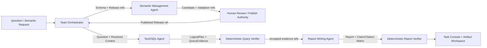
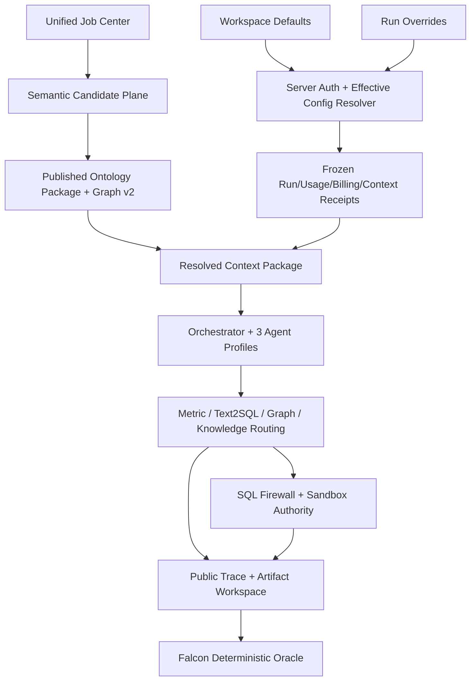
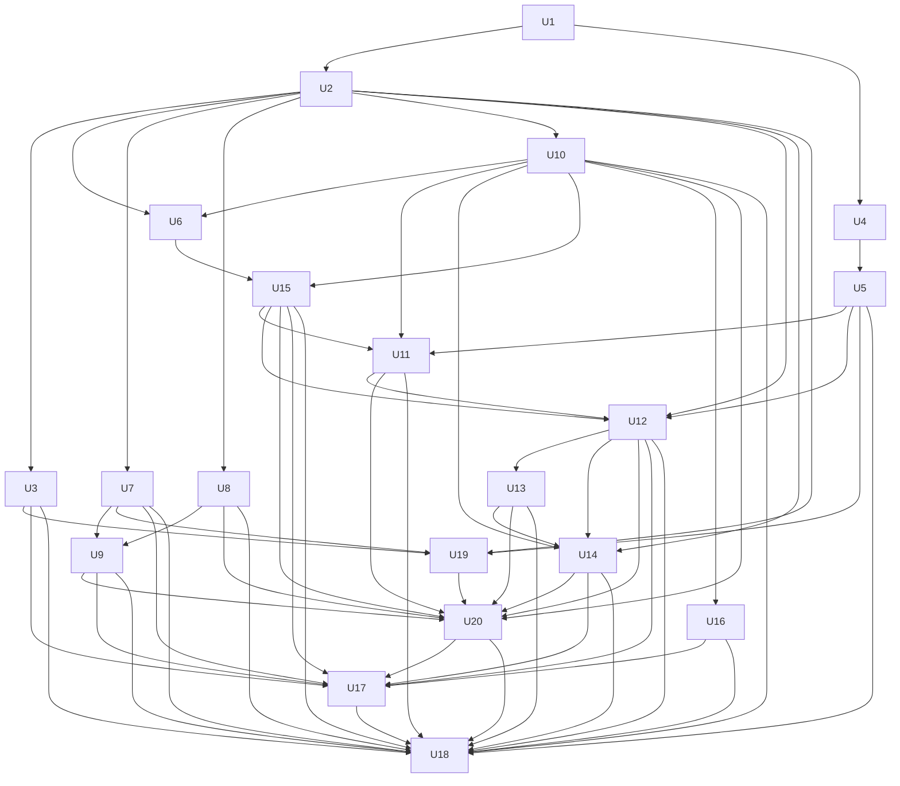
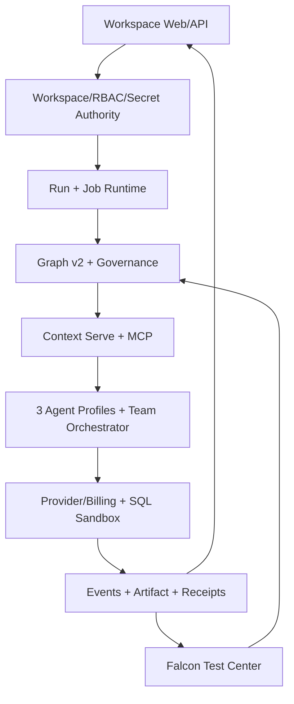

# feat: DataFoundry 能力迁移与 CoA 语义增强总计划

## Summary

本计划在保留原 M01–M18 全部平台能力的基础上，叠加 S01–S12、A01–A10、R01–R10 与
T01–T08 Agent Team 能力，
把 DataFoundry 的工作台与资源体验、CoA 的 Ontology/Metric/Context Serve 思路，收口到
`data-agent` 现有的 PostgreSQL Authority、Graph v2、治理、Worker、计费和 Test Center。
执行以一个持续 Goal 驱动多个依赖有序、可恢复、可独立提交的实施单元，并由语义管理、Text2SQL、
报告写作三类独立 Agent Profile 组成 Team；中途不请求产品决策，最终以 Falcon 题目、真实
PostgreSQL、真实 Worker、真实 Agent Team 路径和确定性 Oracle 作为 Go/No-Go 门禁。

---

## Problem Frame

早期 DataFoundry 计划只覆盖数据源、Data Link、Q&A、模型设置和导航，近期语义路线又重点扩展了
Graph v2、Semantic Studio、Agent Authoring 与 Falcon。若把新的语义清单直接替换 M01–M18，
会丢失 Run、会话、文件、Artifact、扩展中心和工作台闭环；若按 DataFoundry、CoA、
`data-agent` 各自复制一套系统，则会形成多份 Authority、任务系统、资源配置和发布状态。

本计划解决的是同一个产品的收口问题：DataFoundry 只提供产品能力与交互参考，CoA 只提供
Ontology/Metric/Context Serve 的构成参考，最终可执行事实、权限、发布、计费、SQL 与评测仍由
`data-agent` 的现有权威链决定。

首要用户是 Workspace Analyst；首要任务是用中文业务问题，在已发布语义和 Workspace 权限下得到可执行的
只读 SQL、可核验结果、证据引用和可交付报告，并能从失败/中断恢复。Semantic Maintainer/Reviewer 与
Workspace Admin 是支撑角色：前者维护并人工发布语义，后者管理 Provider、Datasource、Extension 和权限。
可观察结果不是“功能页面存在”，而是首要任务通过真实 Team/Worker/PostgreSQL/Falcon，并能由公开 Receipt
重放；平台扩展还必须通过 U17 Workspace Journey Gate，不能用 SQL 分数掩盖资源工作台缺口。

---

## Requirements

- G1. 完整保留并实施 M01–M18，不允许用 S/A/R 清单覆盖或降级原迁移范围。
- G2. 实施 S01–S12、A01–A10、R01–R10，且每个原始编号都有唯一主实施单元、验收证据和状态。
- G3. 所有 Run 资源先由服务端鉴权、解析 Workspace Defaults 与 Run Overrides，再冻结为
  `Effective Run Config`；客户端选择永远不是授权依据。
- G4. 模型选择必须贯通 Selector → Run → Worker → Provider → Usage/Billing，不能只停留在 UI
  或 Conversation 持久化。
- G5. Semantic Graph v2、`semantic-ast`、Candidate/Review/Publish/Rollback 和现有 Semantic API
  是扩展基线；不建设平行 Ontology Authority，也不静默删除旧语义入口。
- G6. PostgreSQL 是 Workspace、Run、资源、语义发布、Job、Receipt、计费和评测 Authority；
  Neo4j、Embedding Index、缓存与前端 Store 都是可重建投影。
- G7. 所有 AI 归纳、检索和诊断输出都只是 Candidate/Evidence；AI 不能批准语义、覆盖权限拒绝、
  修改 Gold/Oracle 或直接签发 GO。
- G8. 所有 Provider 集成均走服务端 API 与 SecretRef，不引入 Claude Code CLI 或参考项目运行时。
- G9. Run/Task Console 只展示可持久化、可重放、已脱敏的公开事件，不展示私有推理、系统提示、
  凭据或原始记忆。
- G10. Schema Scan、知识索引、Artifact Export、Ontology Induction、Metric Import、DataLink Rebuild
  统一进入 Job Center，不再按功能复制异步任务框架。
- G11. 一个 Goal 可从前置检查开始持续执行到最终门禁；所有选择、重试、恢复、提交和终止条件
  在本计划中预先定义，不把正常执行决策留给用户中途回答。
- G12. 最终发布必须通过 Falcon 题目门禁：真实 PostgreSQL、真实 Worker、固定 Provider/Profile、
  固定 Semantic Release/Schema Snapshot、严格结果等价 Oracle，并保留 DEMO/TUNING/HOLDOUT/TEST
  隔离。
- G13. 注册三类独立 Agent Profile：Semantic Management Agent、Text2SQL Agent、Report Writing
  Agent；每类必须冻结不同的 Tool Allowlist、Skill/Version、Workflow/Revision、Context Budget、
  Prompt/Profile 和输出合同，不能只是同一个 Agent 换名称。
- G14. 三类 Agent 通过 Team Orchestrator、`TaskEnvelope`、类型化 Artifact、受限
  `ContextProjection` 与 `HandoffReceipt` 协作；禁止在 Agent 间复制完整会话、原始记忆或无限上下文，
  `completed` 也不能替代确定性 `accepted`。

---

## Scope Boundaries

- 不复制或嵌入 DataFoundry、CoA 的服务、数据库、前端组件、AWS CDK 或运行时依赖；只借鉴已审计的
  能力边界、合同和交互模式。
- 不新增第二份语义图、Metric Authority、Datasource Authority、Job 系统或计费账本。
- 不允许 AI 自动批准或发布新的语义 Candidate；目标 Falcon Release 必须在 Goal 启动前已由授权
  Reviewer 对精确内容摘要完成审核，Goal 只做等价迁移、消费和验证。
- 不以 LLM Judge、相似度、页面可见、单测通过或 SQL 可执行替代确定性发布门禁。
- 不把 Falcon TEST 191 题声明为本地 PASS 或本地准确率；它们只生成可审计 Submission Artifact。
- 不为迁移方便删除共享数据库、Volume、已有 Migration、历史 Run、Receipt、Artifact 或 Release。
- 不在本计划顺带完成 U6 Research Platform、归因分析或其他不影响 M/S/A/R/T 闭环的历史重构。
- 不克隆 DataFoundry 的品牌、视觉身份或虚构运行数据；只复用本项目 Workspace Shell 和业务组件。
- 不把 Team Orchestrator 建成第四个拥有领域 Authority 的万能 Agent；它只负责任务图、预算、路由、
  Handoff、Checkpoint 与验收汇聚。
- Semantic Management Agent 只能产出 Candidate/Validation/Impact，不获得 Publish 权限；Text2SQL Agent
  只消费 Published Release；Report Writing Agent 只引用已验证 Evidence，不能直连原始数据源补证。

### Deferred to Follow-Up Work

- Falcon 上游版本更新、官方自动提交和 Leaderboard 同步：另立 Benchmark 生命周期任务。
- 为 Falcon 28 个数据库逐库人工建设完整 Ontology：本计划只要求已选主域的发布语义与全库物理目录。
- 面向第三方的通用插件市场、付费 Marketplace 和跨组织共享模板：在 M12/M13 的内部管理闭环稳定后另行规划。

---

## Context & Research

### Current `data-agent` Baseline

- `packages/contracts/src/runs/runtime.ts`、`packages/platform/src/events/postgres-run-event-store.ts`、
  `packages/platform/src/queue/postgres-run-queue.ts` 已提供 Durable Run、Sequence、Lease/Fence、
  Cancel/Resume 与公开事件基线。
- `packages/contracts/src/workspaces/qa-resources.ts`、10648 Resource Binding 迁移、Workspace-scoped Q&A
  API 已冻结模型和数据源选择，但文件、知识库、MCP、Skill、Semantic Release 与 Context Policy 尚未
  统一进入一个服务端 Effective Config。
- 10649–10652 与 `apps/web/src/lib/model-provider-admin.ts` 已建立 API-backed Provider 控制面；
  `packages/platform/src/billing/billing-gated-model-provider.ts` 是真实调用与账务收口模式。
- 10638–10645、`semantic-graph-v2.ts`、`semantic-governance.ts`、Semantic Studio、Authoring Worker
  已建立 Graph v2、Candidate、Review、Publish 与事件审计基线。
- `packages/evals/src/test-center/falcon-*`、`infra/falcon/v1/`、10646 Falcon Import 已固定 28 个
  PostgreSQL Schema、DEV 309、TEST 191 与严格 expected-result Oracle。
- 当前工作树有大量并行任务改动；实施时必须基于实时 HEAD/Status 建立 Owned Path Allowlist，
  不能把本计划中的观察当作已合并发布证明。
- `packages/agent-runtime/src/teams/` 已有 `TaskEnvelope`、`ContextProjection`、Tool/Network/Budget
  收窄、Handoff Receipt 与四个 L2 角色的基线；本计划扩展它，不另造一套 Team 协议。

### Reference Patterns

- DataFoundry reference `08afa7b`：`apps/api/src/run-config-resolver.ts` 的资源解析、
  `run-checkpoint-resume.ts` 的恢复、`session-branching.ts` 的引用式分支、
  `context-package-recorder.ts` 的上下文快照，以及 Knowledge/MCP/Skill/Datasource 管理只作为行为参考。
- CoA reference `4e0ad25`：Smithy 合同中的 Namespace、Ontology Induction、Metric、Serve、
  Resolution Trace 和 MCP Tools 只作为语义构成参考；其 AWS 服务拓扑不迁移。
- `data-agent` 本地规范：PostgreSQL Authority、SecretRef、Artifact Content Hash、公开 Run Event、
  Workspace/RBAC/Billing、Test Center/Sealed Oracle 与 Semantic Relationship Index 优先级高于参考项目。
- `深度调研` 本地资料中的 Multi-Agent/Handoff 与量化研究编排结论：业务级 AgentSession 和
  Provider-native 子 Agent 身份必须分离；交接使用类型化 Artifact/摘要而不是拼接自然语言；Plan/Task
  合同不可变，`completed` 需经 VerifierDecision 才能成为 `accepted`，并通过 Checkpoint/Fence/CAS
  支持恢复。这些结论用于约束 T01–T08，不引入其中项目的运行时。

### Institutional Learnings

- 模型选择持久化不等于真实切换；必须看到 Provider、Usage 与 Billing Receipt 的执行证据。
- 已有语义 API/路由必须兼容或显式标记 Paused，不能因为 Graph v2 上线而静默消失。
- Migration 必须通过 Ledger/Checksum 证明，不把 `pnpm dev` 当作迁移完成，也不以删除 Volume 恢复。
- Falcon 使用真实 PostgreSQL；Demo、Tuning、Local Holdout、Official Test 必须隔离，确定性 Oracle
  决定 PASS/FAIL。

### External Research Decision

本计划不再做开放式 Web 研究。DataFoundry 与 CoA 都有用户指定的本地固定提交，相关层在
`data-agent` 也已有明确 Authority 与实现模式；继续追逐上游最新版本会降低计划可复现性。

---

## Key Technical Decisions

| 决策面 | 选择 | 理由 |
|---|---|---|
| 统一 Run 配置 | 新增服务端 `EffectiveRunConfig` 合同与 Resolver，冻结资源版本和摘要 | M01 是 M02/M03/M11/M12/M13/S12/R01 的共同接缝 |
| 语义模型 | 向 Graph v2 增加 Package/Concept/Property/Taxonomy/Constraint 元数据 | 延续现有 Authority，不创建 CoA 平行图 |
| Formula | `semantic-ast` 继续是逻辑 Authority；SQL/SPARQL 是编译产物 | 保留多方言与确定性校验边界 |
| Ontology Package | Release 内的版本化 Manifest，绑定 Registry、Mapping、Evidence、Validation | Package 是发布边界，不是另一套数据库 |
| 异步执行 | Job Center 统一 Job/Attempt/Lease/Fence/Cancel/Retry/Artifact Receipt | 避免 Schema、Index、Ontology、Export 各建任务系统 |
| Context Serve | Metric 明确命中优先，其次 Ontology/Text2SQL，再到文档/图检索 | 能力路由优先于单一相似度 |
| SQL 安全 | 统一进入既有 SQL Firewall/Sandbox Authority | RAG/LLM fallback 不能绕过权限拒绝 |
| 可观测性 | Resolution Trace 进入同一 Durable Public Event/Artifact 链 | 支持恢复、Task Console、审计且不泄露私有推理 |
| 扩展中心 | MCP 管理面与 Run 内 Semantic MCP Tool 分层 | 管理配置和实际工具调用具有不同权限边界 |
| Agent Team | 一个非领域 Orchestrator + 三个独立 Agent Profile + 类型化 Handoff | 分离上下文与权限，同时复用已有 Team 合同和 Authority |
| Agent 完成 | Agent 调用显式 Complete/Checkpoint Tool，Verifier 决定 Accepted | 防止以助手自然语言或子任务完成冒充业务验收 |
| 迁移兼容 | Additive Schema + Read Adapter + Backfill Receipt + Cutover + Retire | 避免破坏正在并行运行的 API、Worker 和 Release |
| 最终门禁 | U17 Workspace Journey + U18 Falcon 绝对阈值/稳定性/Holdout/TEST Submission | Falcon 证明 governed Text2SQL/Report，Journey 证明其余平台能力 |
| 模型数据出境 | 所有 Chat/Embedding 请求先过 sensitivity-aware Data Projection Gate | Provenance 正确不等于允许把原始值发送给 Provider |

---

## Autonomous Goal Execution Contract

### Goal Objective

Goal 执行器应把本文件作为唯一范围入口，按 U1–U20 的依赖顺序持续实施、验证和提交；只有最终
Falcon Gate 签发 GO 且所有编号都有证据时，才能把 Goal 标记为完成。

### Preflight Before the First Mutation

以下静态检查在写代码前一次完成；任一失败都返回单一 Blocker Report，不进入“做一半再询问用户”状态：

1. 记录实时 HEAD、分支、Dirty Status、现有 Trellis 任务和仅属于本 Goal 的路径 Allowlist。
2. 确认 PostgreSQL、Migration Ledger/Checksum、Web、Worker、Indexer 和必要 SecretRef 可用。
3. 确认至少一个 API-backed Certified Model Profile 可完成真实 Provider 调用与 Billing Settlement。
4. 校验 `infra/falcon/v1/` 固定摘要、28 Schema/500 题资产、Falcon Workspace Binding 与严格 Oracle。
5. 确认授权 Reviewer Receipt 已绑定 Falcon db24 Published Release 的可执行 Package/AST/Mapping/Constraint/
   Formula canonical semantic digest，而不是只签署人类可读摘要；若没有，Goal 在任何产品改动前停止。
6. 确认现有 `packages/agent-runtime/src/teams/` 合同与 U19 Slice 所需的 Provider/Artifact/Sandbox 基础依赖
   可用；U19 先验证 Team v2 合同，三类完整可运行 Profile 属于 U20 交付物，不错误地作为实施前置。
7. 完成 PostgreSQL、MySQL、SQLite、DuckDB、ClickHouse 的驱动版本、许可证、供应链和目标平台预审，冻结
   mandatory adapter set；任一 mandatory adapter 不可合法交付则在任何产品改动前停止。
8. 在任何迁移实现前运行并持久化迁移前 Falcon Baseline Receipt，绑定代码 Commit、Migration Ledger、
   Datasource/Schema、Published Semantic Release、Provider/Profile、Prompt/Workflow、Budget、Dataset/Oracle、
   环境健康和逐题结果；Baseline 只作额外回归阻断，不能降低 U18 绝对门禁。
9. 建立一个 Trellis Parent Task，并按 U-ID 建立可独立验收的 Child Task；Parent 只聚合范围和最终门禁。

### Revalidation of Mutable Preconditions

Preflight 冻结身份和摘要，但不假设长 Goal 期间外部事实永远有效。每个 Phase 入口、每个消费相应 Authority
的 U-ID 写入前，以及 U18 启动前，必须重新核验 Workspace/RBAC/Revocation、Semantic Release 状态、
SecretRef、Provider Certification、Migration Ledger/Checksum、Worker/Indexer/Job/Neo4j/Scanner 健康，生成带
CAS/version 和有效期的 `PhaseEntryReceipt`。关键对象被撤销或漂移时，在下一次领域写入/Tool 调用前停止；
不得继续使用 Preflight 时的旧授权，也不得在原 Attempt 中偷换新版本。

### Non-Interactive Defaults

- 遇到“扩展既有合同还是新建平行合同”时，一律扩展既有合同并提供向后兼容 Reader/Projection。
- 遇到“缓存/Neo4j/索引还是 PostgreSQL”冲突时，以 PostgreSQL 为 Authority，其余重建。
- 遇到旧入口无法立即兼容时，保留只读状态并在 UI/API 返回显式 `PAUSED`/迁移原因，不删除入口。
- 遇到可重试基础设施错误时按既有 Retry/Lease/Fence 规则恢复；业务校验失败不自动降级标准。
- 遇到 Migration ID 竞争时，在执行时分配最新空闲 Ledger ID并同时生成 Source、Renderer、Rendered SQL、
  Checksum 与 Postcondition，不复用本计划撰写时观察到的编号。
- 遇到关联但不属于 G1–G14 的问题时记录 Deferred Finding，不扩张当前 Child Task。
- 需要补充参考或调研时，先检索仓库与 `深度调研` 本地资料；只有本地证据不足且结论会改变合同/门禁时
  才做外部研究，并把固定来源、版本和结论写入当前 Child Task Research Artifact，不临时询问用户。
- Report Writing Agent 发现 Evidence Gap 时只向 Orchestrator 返回类型化 Gap；Orchestrator 可创建一次
  有界 Text2SQL 子任务，禁止两个 Agent 自由对话或无限往返。
- 不执行破坏性数据库/Volume/历史 Artifact 清理；需要此类动作时保持数据并报告 Blocked。

### Progress, Recovery, and Commits

- 每个 U-ID 是一个 Trellis Child Task 和一个 Scoped Commit；只暂存该单元 Owned Paths。
- 多个 U-ID 需要递进修改同一路径时，由较晚 U-ID 只追加其声明的增量职责；不得改写较早单元已经签发的
  Contract/Receipt 历史。若必须做不兼容变更，先废止受影响 Receipt、签发 Compatibility/Invalidation Receipt，
  并按依赖图重跑所有下游 Gate，不能用“同一文件已改过”跳过回归。
- 进度来源是 Commit、Migration Ledger、Job/Run/Artifact/Oracle Receipt，不在计划中维护完成勾选。
- Goal 恢复时从最后一个已验证 Commit/Receipt 继续；已验证单元不重做，未通过门禁的单元不标记完成。
- 同一失败连续三轮仍无法产生新证据时进入深度诊断；只有确认是外部权限、凭据、服务或范围冲突后
  才报告 Blocked，不通过降低 Oracle、跳过题目或伪造 Fixture 收口。
- 一个逻辑 Parent Goal 分成 Phase Execution Segment；每个 U-ID 最多 3 个修复 Attempt，每个 Phase 最多
  2 次从 Exit Gate 回退，任何一次 Retry 都必须产生新诊断证据。达到上限写 `ResumeBlockerReceipt`，不无限循环。
- Preflight 根据 U-ID 验证清单与 Falcon 固定 Run 数估算每段 active wall time、Tool Calls、Provider Token/
  microcredit 与存储预算，并以 20% headroom 写入 Manifest；任一段不得借用下一段预算，超限停止并保留
  Checkpoint。该预算是 Goal 的运行约束，不赋予降低 Falcon 阈值或减少 mandatory scope 的权力。
- Segment 固定顺序为 Contract/Authority→Workbench+U19 Slice→Semantic/Extension+U20→Workspace Journey→
  Falcon；上一段只有签发 Exit Receipt 才创建下一段 Task，但全程属于同一个 Goal，不等待用户“继续”。

### Goal Launch Packet for Future Execution

实施时只需以一次 Goal 启动下列 Objective；本轮计划编写不创建或运行该 Goal：

```text
以当前已提交计划 docs/plans/2026-08-16-001-feat-datafoundry-coa-migration-plan.md
及其 plan commit/hash 为冻结范围，从 Preflight 开始按依赖实施 U1–U20。每个 U-ID 建立
Trellis Child Task，完成范围内验证和 scoped commit 后再推进。保留用户/并行任务改动，禁止
破坏性清理；歧义按 Non-Interactive Defaults 处理，调研优先使用仓库与 深度调研 本地资料。
只有三类 Agent Profile/Team Receipt 完整且 U18 Falcon Release Gate 签发 GO 才能 complete；
否则在穷尽有界恢复后输出单一 Blocker/Evidence Report，不中途请求普通产品决策。
```

Goal 启动器必须先生成并持久化 `GoalExecutionManifest`，至少包含：

- `plan_commit`、`plan_content_hash`、起始 HEAD/branch、Owned Path Allowlist 与 U1–U20 DAG。
- Falcon Dataset/Oracle/Workspace/Datasource/Schema Snapshot/Published Semantic Release 的固定 ID 和 Hash。
- Certified Provider/Model Profile、价格/预算、SecretRef 可用状态（只记录引用与脱敏状态）。
- 每个 U-ID 的输入 Receipt、输出 Schema、验证命令、Scoped Commit、Retry Class、Rollback 和 Exit Gate。
- 三类 Agent 的目标 Profile ID，以及 U20 Profile Registry 固定的 Tool/Skill/Workflow/Prompt/Model Revision。
- `last_accepted_unit`、当前 Task/Attempt/Fence、Artifact/Receipt 索引、失败计数和 Deferred Finding 索引。

### Autonomous Decision and Stop Table

| 情况 | 自动动作 | 是否询问用户 |
|---|---|---|
| 本地实现模式或资料不明确 | 先查仓库，再查 `深度调研`，记录固定 Research Artifact 后选与 Authority 一致的最小方案 | 否 |
| 测试暴露范围内缺陷 | 在当前最小 U-ID 修复并重跑相关 Gate，最多三轮后进入深度诊断 | 否 |
| 并行改动占用同一文件 | 读取实时 Diff，适配非冲突改动；无法安全分离时在写入前停止并给出冲突路径/所有者证据 | 只在确实冲突阻塞时停止 |
| Migration ID 冲突 | 重新分配最新空闲 ID并更新 Source/Renderer/SQL/Checksum/Postcondition | 否 |
| Provider/Worker 短暂失败 | 按 Provider Invocation Semantics、Retry/Lease/Fence 恢复；本地 Artifact/Settlement 单次接受，外部调用不虚构 exactly-once | 否 |
| 缺凭据、外部权限、服务持续不可用 | 三次有新诊断证据的恢复均失败后输出 Blocker Report，保留可恢复状态 | 终止 Goal，不做中途问答 |
| 需要人工 Semantic Publish | 只允许 Preflight 检查已发布精确 Hash；缺失则在任何产品改动前停止 | 终止 Goal，不让 Agent 代批 |
| Falcon 任一绝对 Gate 未过 | 返回最小失败题/层修复；不得降阈值、跳题或把 TEST 当本地 PASS | 否；未修复则不 complete |

每次上下文压缩或 Goal 恢复都只加载 Execution Manifest、当前 U-ID、直接依赖 Receipt、Owned Diff 与最近
失败证据；历史详情按 Artifact Ref 按需读取。由此让“实现 Goal 的编码上下文”和“产品内三类 Agent Context”
都保持有界，但二者的身份、状态与 Receipt 不混用。

---

## Capability Traceability Matrix

| ID | 唯一主实施单元（协作单元） | 必须留下的验收证据 |
|---|---|---|
| M01 | U2 | Effective Config Receipt 绑定全部资源版本与授权结果 |
| M02 | U3 | Provider/Usage/Billing 三方 Receipt 与所选 Profile 一致 |
| M03 | U6 | 文件 ACL、Hash、扫描、Scope 提升与删除回执 |
| M04 | U7 | 预览、下载、报告引用使用同一 Artifact Hash |
| M05 | U9 | Task Console 可从公开事件/Artifact/Trace 重建 |
| M06 | U8 | 刷新恢复无重复消息、Tool、Artifact 或计费 |
| M07 | U8 | Queue/Stopping/Retry 命令幂等且 Fence 正确 |
| M08 | U8 | 分支只引用父历史并重新鉴权/冻结资源 |
| M09 | U8 | Interruption ID、Run Fence、版本与回复严格绑定 |
| M10 | U9 | SQL/参数/Snapshot/Receipt/结果可追溯回原会话 |
| M11 | U15 | Knowledge Chunk/Index/Query 有 Hash、Scope、Evidence Receipt |
| M12 | U14 | MCP SecretRef、Manifest、RBAC、Tool Policy 与 Run 选择闭环 |
| M13 | U14 | Skill 来源/版本/校验/选择结果进入 Run Receipt |
| M14 | U16 | Gallery Schema 驱动表单且复用 Datasource Authority |
| M15 | U16 | 每个 Adapter 独立只读/超时/脱敏/审计认证 |
| M16 | U10 | Job 持久化、幂等、取消、重试、错误码、Artifact Receipt |
| M17 | U10（U2） | `/ready`、Capabilities、Defaults/Overrides 服务端权威 |
| M18 | U17 | Quick Start、空状态、双语、Demo/Fixture/Benchmark 隔离 |
| S01 | U4 | Namespace = app + tenant + workspace + environment |
| S02 | U4 | Package ID/版本/依赖/导入/状态/Release Binding |
| S03 | U4 | BUSINESS_SUBJECT 承载 Concept/Class/Entity/Event 角色 |
| S04 | U4 | DIMENSION 承载 Data Property 类型/单位/敏感级别/映射 |
| S05 | U4 | Edge 承载 Object Property 正反语义/Domain/Range/基数 |
| S06 | U4 | Taxonomy/Alignment 支持父子/等价/近似/互斥/别名/跨包 |
| S07 | U4 | Constraint 支持基数/必填/类型/唯一性/业务规则 |
| S08 | U4（U13） | Physical Mapping 绑定 Snapshot 并区分 Queryable/Knowledge-only |
| S09 | U4（U11） | Metric 绑定 Concept/Formula/Dimension/Grain/Time/Unit |
| S10 | U4（U13） | AST Authority 与编译产物摘要一致 |
| S11 | U4（U5） | Node/Edge/Constraint/Formula/Mapping 均有 Provenance |
| S12 | U5 | Candidate→Compile→Validate→Review→Publish→Rollback Receipt 链 |
| A01 | U11 | Schema Induction 只输出 Review-only Graph Patch |
| A02 | U11（U15） | 文档归纳输出术语/概念/关系/规则候选与原文证据 |
| A03 | U11 | Foundational Grounding 可选且只生成对齐候选 |
| A04 | U11 | Stable Object ID Resolver 避免重复概念 |
| A05 | U5（U11） | Proposal 去重后进入现有 Candidate Plane |
| A06 | U5（U11） | 确定性阻断、质量评分、人工审核三层分离 |
| A07 | U11 | Drift 只重算受影响对象并保留不变内容 |
| A08 | U11 | Metric/Formula/Query/Agent/Release 影响清单可追溯 |
| A09 | U11 | Metric Dry-run/批量验证/异步导入/版本差异 |
| A10 | U5（U11） | OSI/Ossie 仅作交换协议并转换为内部 AST/治理对象 |
| R01 | U12（U2） | Context Package 固定 Release/Snapshot/权限/证据摘要 |
| R02 | U12 | 明确名称/别名只解析 Published Metric |
| R03 | U13 | Text2SQL 只注入具有有效 Mapping 的 Queryable Concept |
| R04 | U13 | 图遍历使用 PostgreSQL Authority/Neo4j 投影与回退证据 |
| R05 | U12（U15） | Metric→Ontology/Text2SQL→Document/Graph 能力路由 |
| R06 | U13 | SQL Firewall 拒绝不可被 RAG/LLM Fallback 绕过 |
| R07 | U9（U12） | Resolution Trace 持久化、公开、脱敏、可重放 |
| R08 | U14 | Semantic MCP Tools 服从 RBAC/Tool Policy/Effective Config |
| R09 | U12（U17） | Preview 展示 Release/证据/裁剪原因/Token Budget |
| R10 | U18 | Falcon + Deterministic Oracle 签发最终结果 |
| T01 | U20（U19） | Agent Profile Registry 冻结 Profile/Tool/Skill/Workflow/Prompt/Model Revision |
| T02 | U20（U19） | Semantic Management Agent 只生成 Candidate/Validation/Impact Artifact |
| T03 | U20（U19） | Text2SQL Agent 只消费 Published Semantic Layer 并产出 Query Evidence |
| T04 | U20（U19） | Report Writing Agent 只从 Accepted Evidence 投影带引用报告 |
| T05 | U19（U20） | Team Orchestrator 维护 Task DAG、预算、Fence、Checkpoint 与 Fan-in |
| T06 | U19 | Task/Handoff 只传 Artifact Ref 与有界 Context Projection，不复制完整上下文 |
| T07 | U20（U19） | 每类 Agent 使用独立 Tool/Skill/Workflow Policy 和显式 Complete Tool |
| T08 | U18（U20） | Falcon Team Run 证明角色隔离、可恢复、可审计且上下文不失控 |

---

## Agent Team Architecture

Team 对外只有三类领域 Agent；内部 Team Orchestrator 是确定性的控制面，不拥有 Semantic、SQL、Report
或评测 Authority。三类 Agent 可以使用不同模型配置，但由 U20 Profile Registry 创建并冻结
`AgentProfileRevision`，其中引用 U2 Effective Config 与 U3 Provider/Model Receipt；每个 Task Receipt
记录实际版本。

产品语义是“同一 Orchestrator 下的两条受治理 Workflow”，不是强迫三个 Agent 共享一个问题 Context：
问答由 Text2SQL→Report 完成；Semantic Management 异步维护 Candidate，只有人工发布后才影响后续问答。
Team 共享 Task/Handoff/Artifact/Verifier 基础设施，但三类 Profile 从不共享完整上下文或互相继承权限。

| Agent Profile | 接收的最小上下文 | 注册 Tool | 注册 Skill | Workflow | 权威输出 | 明确禁止 |
|---|---|---|---|---|---|---|
| Semantic Management Agent | Schema Snapshot、Published Release、相关 Candidate/Evidence | 读 Schema/Release；建 Candidate Patch；Compile/Validate；Drift/Impact；提交 Job/Checkpoint/Complete | `schema-to-candidate`、`drift-reanalysis`、`metric-maintenance` | `semantic-candidate-lifecycle@revision` | Candidate、Validation、Impact、Job Receipt | Publish、执行 SQL、生成最终报告、读取 Falcon Gold |
| Text2SQL Agent | Question Contract、Published `ResolvedContextPackage`、SQL Policy、必要 Artifact Ref | `list_metrics`、`describe_semantic_model`、`resolve_context`、`graph_traversal`、Compile、Sandbox Query、Checkpoint/Complete | `question-to-query`、`ambiguity-resolution`、`bounded-query-repair` | `governed-text2sql@revision` | LogicalPlan、SqlArtifact、QueryEvidence、Resolution Trace | 修改语义、消费 Candidate、绕过 Firewall、签发报告或 Oracle Verdict |
| Report Writing Agent | ReportSpec、Accepted QueryEvidence/Claim/Evidence、Artifact Ref | 读 Artifact/Evidence；生成 Report/Chart Candidate；校验 Claim 引用；Checkpoint/Complete | `evidence-to-report`、`chart-selection`、`claim-citation` | `evidence-report@revision` | Report Candidate、ChartSpec、Citation/Claim Matrix | 直连数据源、修改 SQL/语义、无 Evidence 编写事实、签发 GO |

### Team Control and Handoff Rules

- Orchestrator 只依据 Task 类型、依赖和状态路由：语义维护请求进入 Semantic Management Agent；用户问题
  进入 Text2SQL Agent；只有 QueryEvidence 经确定性验证 `accepted` 后才能进入 Report Writing Agent。
- 默认问答路径为 `Question → Text2SQL → Query Verifier → Report Writing → Report Verifier`；语义维护路径
  为 `Schema/Drift → Semantic Management → Candidate/Validation → Human Review/Publish`，两条路径不混写。
- 新 Candidate 不能被当前问答 Task 消费。只有发布形成新 `PublishedReleaseRef` 后，后续 Text2SQL Task
  才能解析它；由此保留人工发布 Authority，并避免 Agent 自我强化错误语义。
- Handoff 必须包含 Task/Attempt/Run/Scope、Profile Revision、Artifact Ref、Context Projection、预算、Tool/Network
  Policy、Expected Output Schema 和 Acceptance Contract；子 Task 只能收窄这些范围。
- 跨 Agent 不传完整消息历史、私有推理、系统提示或原始记忆；Authority 字段留在 `TaskEnvelope`/内容寻址
  Artifact Ref，最多 64 KiB 的投影 `data` 始终标为 `UNTRUSTED_DATA`/`DATA_ONLY`。长任务通过
  Checkpoint/Compaction Artifact 恢复，而不是持续扩大同一 Context。
- Agent 调用 `complete_task` 仅表示产物已提交；Orchestrator 必须等待合同校验、权限校验、SQL/Claim/Oracle
  等确定性 Verifier 签发 `accepted`。失败只重开最小 Task/Attempt，且 `remaining_handoffs` 严格减少。
- 业务 `AgentSession/Task/Attempt` 身份与 Provider 原生 child/session ID 分离；Provider ID 只作为 Invocation
  Receipt 字段，不能成为 Team 的 Scope、Owner、Cancel、Resume 或 Billing 主键。
- 用户可在统一 Task Console 观察 Team DAG、角色、公开 Handoff、Artifact、预算与 Verdict；任何 Team 可做的
  已授权操作都必须有对应 UI/API/Tool 入口，但单个 Agent 只获得其最小权限子集。

### Team Context Projections



## High-Level Technical Design

> *This illustrates the intended approach and is directional guidance for review, not implementation specification. The implementing agent should treat it as context, not code to reproduce.*



---

## Implementation Units

U-ID 为稳定引用，以下段落按领域聚合便于阅读；实际执行顺序只以每单元 `Dependencies`、下图和
`GoalExecutionManifest` 为准，不按编号或文档出现顺序。



### Phase 0 — Authority Baseline and Contract Freeze

- U1. **能力账本、兼容基线与迁移骨架**

**Goal:** 把 58 个 M/S/A/R/T 编号变成机器可检查的 Capability Manifest，并冻结当前 API、Migration、
Graph v2、Falcon 和旧语义入口基线，防止执行中遗漏或以“已有”误判完成。

**Requirements:** G1, G2, G5, G11, G13, G14

**Dependencies:** None

**Files:**
- Create: `packages/contracts/src/capabilities/platform-migration.ts`
- Modify: `packages/contracts/src/capabilities/index.ts`
- Create: `docs/architecture/datafoundry-coa-capability-ledger.md`
- Test: `packages/contracts/test/platform-migration-capability.spec.ts`
- Test: `tests/datafoundry-coa-compatibility-baseline.spec.ts`

**Approach:**
- Manifest 固定 Capability ID、Owner、Authority、状态、主 U-ID、依赖和证据类型，但不把计划进度伪装成运行状态。
- 对已有 Route/Contract/Migration 建 Characterization，旧入口标记 `ACTIVE`、`COMPATIBLE` 或 `PAUSED`。
- 每个后续单元只能通过追加真实 Receipt 更新可运行 Capability Projection。

**Patterns to follow:**
- `packages/contracts/src/capabilities/deferred-artifacts.ts`
- `apps/web/test/legacy-workspace-characterization.spec.ts`

**Test scenarios:**
- Happy path: 58 个原始 ID 各出现一次且都映射到有效 U-ID 和 Evidence Kind。
- Edge case: 重复、缺失、未知 Capability ID 或循环依赖使 Manifest 校验失败。
- Integration: 旧 Data Link/Workspace/Semantic Route 的当前状态被 Characterization 固定，不因新清单消失。

**Verification:** Capability Matrix 与合同 Manifest 完全一致，后续单元可按 ID 查询依赖与证据要求。

- U2. **Effective Run Config、Workspace Defaults 与 Context Receipt 合同**

**Goal:** 服务端统一解析并冻结 Model、Datasource、Files、Knowledge、MCP、Skills、`@` Resource Mention、
Semantic Release、Context Policy、Data Egress Policy，形成 Run/Usage/Billing/Context 共同消费的权威配置。

**Requirements:** G3, G4, G6, M01, M17, R01

**Dependencies:** U1

**Files:**
- Create: `packages/contracts/src/runs/effective-config.ts`
- Create: `packages/contracts/src/workspaces/defaults.ts`
- Modify: `packages/contracts/src/workspaces/qa-resources.ts`
- Modify: `packages/contracts/src/runs/index.ts`
- Create: `packages/platform/src/runs/effective-config-resolver.ts`
- Modify: `apps/web/src/app/api/workspaces/[workspaceId]/runs/route.ts`
- Create: `apps/web/src/app/api/workspaces/[workspaceId]/defaults/route.ts`
- Modify: `apps/worker/src/runs/run-execution-context.ts`
- Create: `infra/supabase/apps/data-agent/migration-sources/<allocated-ledger-id>/`
- Test: `packages/contracts/test/effective-run-config.spec.ts`
- Test: `packages/platform/test/runs/effective-config-resolver.spec.ts`
- Test: `apps/web/test/workspace-run-effective-config.spec.ts`
- Test: `apps/worker/test/runs/run-effective-config.spec.ts`

**Approach:**
- 先解析服务端 Principal/App/Tenant/Workspace/Environment，再合并 Defaults 与 Overrides；逐资源重验 RBAC、状态和版本。
- `@` Mention 只解析已授权 Registry Resource ID，不把显示名称或客户端提供对象直接写入配置。
- 冻结 requested/effective 差异、Unavailable Reason、资源 Revision/Hash、Semantic Release、Schema Snapshot、
  Context Budget、Data Classification 与获准 Provider/Audience；运行时仍重验 revocation。
- Run 创建与 Worker 消费同一 Receipt；Worker 不重新相信客户端资源字段。

**Patterns to follow:**
- `packages/contracts/src/workspaces/qa-resources.ts`
- `apps/web/src/lib/workspace-run.ts`
- `packages/platform/src/tenancy/postgres-workspace-authority.ts`

**Execution note:** 先为 Override 越权、资源过期和 Worker 重放写失败合同，再接入创建路径。

**Test scenarios:**
- Happy path: Defaults 与合法 Overrides 合并并冻结全部资源摘要，刷新或 Worker 重启得到同一 Effective Config。
- Edge case: 显式空选择、Disabled Resource、stale version 和 Default 被删除都产生稳定 Unavailable Reason。
- Edge case: 同名 `@` Mention、已删除 Mention、跨 Workspace Mention 不会被显示名称误解析或越权绑定。
- Error path: 跨 Workspace Resource、客户端自报 Role/Release/Snapshot 被服务端拒绝。
- Error path: 客户端移除 sensitivity label、自报 provider eligibility 或请求未批准 audience 不能放宽 Egress Policy。
- Integration: Run、Worker、Usage、Billing、Context Package 引用同一个 config hash。

**Verification:** 任一 Run 都能从 PostgreSQL Receipt 完整重建最终资源选择，且无客户端授权旁路。

- U3. **真实模型切换与 Provider/Billing 闭环**

**Goal:** 将已存在的模型选择和 Provider 管理接入 U2 的冻结配置，证明不同选择会到达真实 Provider、
Usage 与 Billing Settlement。

**Requirements:** G4, G8, M02

**Dependencies:** U2

**Files:**
- Modify: `packages/contracts/src/ports/model-provider.ts`
- Modify: `packages/contracts/src/providers/index.ts`
- Modify: `packages/platform/src/billing/billing-gated-model-provider.ts`
- Modify: `apps/worker/src/runs/research-workflow-executor.ts`
- Modify: `apps/worker/src/runs/run-execution-context.ts`
- Modify: `apps/web/src/components/qa/model-selector.tsx`
- Modify: `apps/web/src/lib/qa-store.ts`
- Modify: `apps/web/src/lib/model-provider-admin.ts`
- Test: `packages/platform/test/billing/billing-gated-model-provider.spec.ts`
- Test: `apps/worker/test/runs/run-model-provider-binding.spec.ts`
- Test: `apps/web/test/qa-model-effective-config.spec.ts`

**Approach:**
- Selector 只提交 Profile ID；服务端解析 immutable environment/system model 或 enabled API-backed profile。
- Provider Invocation、Token Usage、Price/FX Snapshot、Reserve/Settle/Release 与 Run Config Hash 串联。
- 配置变化使用 expected version；Secret 只在 Provider Composition Root 解引用。
- Certified Profile 必须声明 `IDEMPOTENT_REQUEST`、`INVOCATION_STATUS_QUERY`、`BILLING_RECONCILIATION` 或
  `AT_LEAST_ONCE_ONLY` 能力。调用前先持久化 Invocation Intent/Idempotency Key；恢复先查询状态或对账。
- 不支持幂等/查询的 Provider 遇到“请求可能已送达但 Receipt 未落库”时标记
  `PROVIDER_INVOCATION_OUTCOME_UNKNOWN` 并停止自动重放；只保证本地 Artifact 与 Settlement 单次接受，
  不能宣称外部 Usage/账单 exactly-once。

**Patterns to follow:**
- `apps/web/src/lib/model-provider-admin.ts`
- `packages/platform/src/billing/postgres-model-billing.ts`
- `apps/worker/src/semantic/authoring-model-runtime.ts`

**Test scenarios:**
- Happy path: 两个不同 Profile 产生不同 Provider/Model Receipt，且选择在刷新后恢复。
- Edge case: immutable system model 不能被禁用或篡改，配置版本冲突失败关闭。
- Error path: Provider timeout/credential failure 释放或转 Review hold，不重复扣费。
- Recovery: 对四类 Invocation Capability 分别覆盖 intent 前后、请求送达前后、receipt 前后崩溃；只有
  Provider 能证明未执行或幂等时才自动重调，否则进入 outcome-unknown/对账状态。
- Integration: Selector → Run → Worker → Provider → Usage/Billing 全链引用同一 Profile/Config Version。

**Verification:** UI 选择可由真实 Provider、Usage 和账务回执反向证明，不以 Store 值作为完成证据。

- U4. **Ontology Package 与 Graph v2 语义构成扩展**

**Goal:** 在 Graph v2 内表达 Namespace、Package、Concept/Class、Data/Object Property、Taxonomy、
Constraint、Physical Mapping、Metric、Formula 和 Provenance。

**Requirements:** G5, G6, S01–S11

**Dependencies:** U1

**Files:**
- Modify: `packages/contracts/src/artifacts/semantic-graph-v2.ts`
- Modify: `packages/contracts/src/artifacts/semantic-governance.ts`
- Modify: `packages/contracts/src/artifacts/semantic-control-plane.ts`
- Create: `packages/contracts/src/artifacts/ontology-package.ts`
- Modify: `packages/semantic/src/graph-v2/canonicalize.ts`
- Modify: `packages/semantic/src/graph-v2/compiler.ts`
- Modify: `packages/semantic/src/graph-v2/validator.ts`
- Create: `infra/supabase/apps/data-agent/migration-sources/<allocated-ledger-id>/`
- Test: `packages/contracts/test/ontology-package.spec.ts`
- Test: `packages/contracts/test/semantic-graph-v2.spec.ts`
- Test: `packages/semantic/test/semantic-graph-v2.spec.ts`
- Test: `packages/platform/test/semantic/semantic-graph-migration.spec.ts`

**Approach:**
- 保留现有 Node/Edge 身份：BUSINESS_SUBJECT 增加 Concept/Class 角色，DIMENSION 增加 Data Property
  元数据，关系 Edge 增加 Object Property/Taxonomy/Alignment/Constraint 语义。
- Package Manifest 绑定 Registry、依赖、导入、Evidence、Validation 与 Release，不复制节点存储。
- 现有 `semantic-graph-source@2`/`projection@1` Payload、Hash 和 Reader 永不原地修改；新增 writer/source/
  projection/package 版本和显式 read-version matrix，通过 derived revision/release binding 迁移。
- 旧 Release 通过确定性 Adapter 读取；Backfill 只建立派生 Revision 和可证明映射，不给旧 JSON 补默认字段。
  旧/新 Web、Worker 的滚动部署顺序为 Reader/Adapter→Writer→Backfill→Cutover，Rollback 只切回旧 Binding。

**Patterns to follow:**
- `packages/contracts/src/artifacts/semantic-graph-v2.ts`
- `packages/semantic/src/graph-v2/canonicalize.ts`
- `packages/contracts/src/artifacts/semantic-governance.ts`

**Execution note:** 先固定旧 Graph v2 canonical hash 的兼容样本，再扩展新字段和 Backfill。

**Test scenarios:**
- Happy path: 完整 Package 可规范化、编译、验证并保持稳定 Hash。
- Edge case: 跨 Namespace 依赖循环、Domain/Range 不存在、基数矛盾、重复稳定 ID 被拒绝。
- Error path: Queryable Mapping 未绑定当前 Schema Snapshot 时不能进入运行时。
- Integration: 旧 Graph v2 Release 通过兼容 Reader 保持原行为，新 Package 可在 Studio 与 Runtime 读取。
- Compatibility: old Writer/new Reader、new Writer/new Reader、old Worker during cutover 的版本矩阵全部通过，
  已发布旧 Payload 的 wire hash 与 canonical hash 不变。

**Verification:** 没有第二份语义 Authority，且 S01–S11 每项都有合同、持久化和验证证据。

- U5. **语义生命周期、Proposal 合并与 Portability 收口**

**Goal:** 把 Package/Graph Patch 接入现有 Candidate→Compile→Validate→Review→Publish→Rollback，
并让 OSI/Ossie 只作为交换协议。

**Requirements:** G5, G7, S12, A05, A06, A10

**Dependencies:** U4

**Files:**
- Modify: `packages/platform/src/semantic/postgres-semantic-candidate-compile.ts`
- Modify: `packages/platform/src/semantic/postgres-semantic-graph.ts`
- Modify: `packages/platform/src/semantic/postgres-semantic-portability.ts`
- Modify: `apps/web/src/lib/postgres-semantic-governance-service.ts`
- Modify: `apps/web/src/app/api/semantic/governance/publish/route.ts`
- Modify: `apps/web/src/app/api/semantic/governance/rollback/route.ts`
- Modify: `apps/web/src/app/api/workspaces/[workspaceId]/semantic/portability/imports/route.ts`
- Test: `packages/platform/test/semantic/postgres-semantic-candidate-compile.spec.ts`
- Test: `packages/platform/test/semantic/postgres-semantic-portability.spec.ts`
- Test: `apps/web/test/postgres-semantic-governance-transaction.spec.ts`
- Test: `apps/web/test/semantic-portability-route.spec.ts`

**Approach:**
- Proposal 先按 stable object ID、base release、patch digest 去重，再进入 Candidate Plane。
- Deterministic blockers、quality score、review decision 分开持久化；只有授权 Review Receipt 可发布。
- Cutover 前生成 `SemanticEquivalenceReceipt`，证明 Reviewer 签署的 executable semantic digest 与迁移后
  Package/AST/Mapping/Constraint/Formula digest 等价；wire hash 可以变化，逻辑 digest 不得变化。无法证明的
  差异必须转成新 Candidate 并在发布前阻止 Goal，不能继承旧 Review Receipt。
- Import 先 Dry-run 转内部 Package/AST/Patch，Export 从 Published Release 投影，协议对象不成为 Authority。

**Patterns to follow:**
- `packages/contracts/src/artifacts/semantic-governance-requests.ts`
- `packages/platform/src/semantic/postgres-semantic-candidate-compile.ts`
- `apps/web/src/lib/postgres-semantic-governance-service.ts`

**Test scenarios:**
- Happy path: Candidate 编译/验证/审核/发布/回滚产生连续 Receipt 与 Release lineage。
- Edge case: 重复 Proposal 幂等返回原对象，stale base 或 review version 冲突失败。
- Error path: AI Actor、导入文件或客户端布尔值不能直接发布。
- Integration: OSI/Ossie round-trip 保留可交换语义，但运行时只消费内部 AST/Published Package。
- Error path: Backfill 默认值、Mapping 重写或 canonicalization 使 executable semantic digest 改变时，
  `SemanticEquivalenceReceipt` 拒绝 Cutover，U18 不得消费派生 Release。

**Verification:** S12 和 A05/A06/A10 均在既有 Governance Authority 中闭环。

### Phase 1 — Run Workbench and Durable Resources

- U6. **文件、附件与 Workspace 资源生命周期**

**Goal:** 提供上传、聊天附件、下载、删除、Session/Workspace Scope 与文件提升，并把文件引用纳入
Effective Config。

**Requirements:** G3, G6, M03

**Dependencies:** U2, U10

**Files:**
- Create: `packages/contracts/src/workspaces/files.ts`
- Create: `packages/platform/src/storage/postgres-workspace-files.ts`
- Modify: `packages/platform/src/storage/namespace.ts`
- Create: `packages/platform/src/storage/workspace-content-namespace.ts`
- Create: `packages/platform/src/storage/file-scan-port.ts`
- Create: `apps/worker/src/files/file-scan-job.ts`
- Create: `apps/web/src/app/api/workspaces/[workspaceId]/files/route.ts`
- Create: `apps/web/src/app/api/workspaces/[workspaceId]/files/[fileId]/route.ts`
- Create: `apps/web/src/components/qa/file-attachment-picker.tsx`
- Modify: `apps/web/src/components/qa/chat-input.tsx`
- Modify: `apps/web/src/lib/qa-store.ts`
- Modify: `compose.yaml`
- Create: `infra/supabase/apps/data-agent/migration-sources/<allocated-ledger-id>/`
- Test: `packages/contracts/test/workspace-files.spec.ts`
- Test: `packages/platform/test/storage/postgres-workspace-files.spec.ts`
- Test: `apps/web/test/workspace-file-routes.spec.ts`

**Approach:**
- 内容寻址存储 Blob；PostgreSQL 保存 Scope、Owner、Hash、MIME、Size、Scan Status、Lineage 与 tombstone。
- 复用现有私有 `data-agent-artifacts` Bucket，但新增版本化 Workspace Content Key/RLS；不可变 Blob 与
  Session/Workspace 授权引用分离，不能把现有强制 principal/run key 规则直接绕过。
- Session Attachment 提升到 Workspace 时复用 Blob、创建新授权引用，不复制或改变 Hash。
- 类型/大小、恶意内容、凭据扫描通过 U10 `FILE_SCAN` Job 完成；`FileScanPort` 首个实现使用隔离的 ClamAV
  服务加本地 credential/content policy。Scanner 未健康或结论不确定时文件保持 QUARANTINED/NOT_READY。
- `StorageRetentionPolicyRevision` 定义 quarantine、user delete、legal hold、backup expiry 与 reference-count GC；
  删除立即撤销内容访问，历史 Run 默认只保留 metadata/hash/lineage。最后一个引用释放后按冻结策略清除 Blob，
  Legal Hold 只能由授权管理员设置，并由 Deletion Receipt 证明在线副本和备份最终过期时间。

**Test scenarios:**
- Happy path: 上传→扫描→附加到 Session→提升 Workspace→下载使用同一内容 Hash。
- Edge case: 同内容重复上传去重但 ACL 引用独立，删除一个引用不破坏其他授权引用。
- Error path: 超限、类型欺骗、恶意内容、凭据命中、跨 Workspace 下载被拒绝。
- Security: 直接伪造 Object Key、绕过 RLS、TOCTOU 替换 Blob、Scanner 超时/签名过期均不能使文件可选。
- Lifecycle: 恶意/凭据命中、普通删除、仍有其他引用、Legal Hold、GC 与 Backup Expiry 分别验证立即访问撤销、
  metadata-only audit 和最终字节删除；旧 Run 不因“可审计”继续获得已删除字节。
- Integration: Effective Config 冻结 File Revision；删除后的旧 Run 只保留 metadata/hash/lineage 审计，除非
  Retention/Legal Hold 明确允许，否则不能继续读取字节，新 Run 永远不可选择。

**Verification:** 文件生命周期完整、可审计、无 Secret 泄漏且不信任客户端 MIME/Scope。

- U7. **Artifact 工作区与同 Hash 预览/导出**

**Goal:** 完成表格、图表、Markdown、SQL、报告预览和 CSV/XLSX 导出，确保预览、下载、报告引用
共享同一权威 Artifact 内容身份。

**Requirements:** G6, M04

**Dependencies:** U2

**Files:**
- Modify: `packages/contracts/src/artifacts/envelope.ts`
- Modify: `packages/contracts/src/artifacts/types.ts`
- Create: `packages/contracts/src/artifacts/export-receipt.ts`
- Create: `apps/web/src/app/api/workspaces/[workspaceId]/artifacts/[artifactId]/route.ts`
- Create: `apps/web/src/app/api/workspaces/[workspaceId]/artifacts/[artifactId]/exports/route.ts`
- Create: `apps/web/src/components/workbench/artifact-workspace.tsx`
- Modify: `apps/web/src/components/workbench/analysis-report-document.tsx`
- Test: `packages/contracts/test/artifact-export-receipt.spec.ts`
- Test: `apps/web/test/artifact-workspace.spec.tsx`
- Test: `apps/web/test/artifact-export-routes.spec.ts`

**Approach:**
- Artifact Envelope/Revision 是内容 Authority；Renderer 与 Exporter 只产生绑定源 Hash 的派生 Artifact/Receipt。
- SQL 卡、图表和报告引用使用 Artifact Reference，不把易漂移的 UI JSON 当权威。
- 所有字段按 untrusted content 渲染：Markdown 禁用/清洗原始 HTML，Label/SQL Value 转义，链接/Embed 限定，
  Preview 使用 CSP/Sandbox，下载固定安全 MIME/`Content-Disposition`；CSV/XLSX 对 `= + - @` 等公式前缀
  做可逆中和并在 Export Receipt 记录策略版本。

**Test scenarios:**
- Happy path: 同一 Artifact 预览、CSV/XLSX 下载、报告引用均可追溯到相同 source hash。
- Edge case: 大表分页/裁剪不改变源身份，导出版本明确记录 renderer/exporter version。
- Error path: 未提交、stale、跨 Workspace 或 Hash 不匹配 Artifact 不可预览/下载。
- Security: stored XSS、危险 URL/Embed、CSV/XLSX formula injection、MIME sniffing 和 inline disposition 测试失败
  时 Artifact 仍可审计但不可向用户渲染/导出。
- Integration: Run Artifact、Task Console、SQL History 和报告交叉跳转保持同一引用。

**Verification:** 任一可见结果都能反向解析到已提交 Artifact 和派生 Export Receipt。

- U8. **会话恢复、Run 控制、Checkpoint 分支与协作中断**

**Goal:** 一次完成刷新恢复、队列/停止/重试、引用式分支和版本化澄清恢复，不重复副作用或计费。

**Requirements:** G6, M06, M07, M08, M09

**Dependencies:** U2

**Files:**
- Modify: `packages/contracts/src/runs/runtime.ts`
- Create: `packages/contracts/src/runs/interruption.ts`
- Modify: `packages/platform/src/events/postgres-run-control.ts`
- Modify: `packages/platform/src/queue/postgres-run-queue.ts`
- Create: `packages/platform/src/runs/postgres-session-branch.ts`
- Modify: `apps/web/src/app/api/workspaces/[workspaceId]/runs/[runId]/commands/route.ts`
- Create: `apps/web/src/app/api/workspaces/[workspaceId]/runs/[runId]/branches/route.ts`
- Create: `apps/web/src/app/api/workspaces/[workspaceId]/runs/[runId]/interruptions/route.ts`
- Modify: `apps/web/src/lib/qa-event-assembler.ts`
- Modify: `apps/web/src/components/workbench/clarification-dialog.tsx`
- Test: `packages/contracts/test/run-interruption.spec.ts`
- Test: `packages/platform/test/events/postgres-run-control.spec.ts`
- Test: `packages/platform/test/queue/postgres-run-queue.spec.ts`
- Test: `apps/web/test/qa-run-recovery.spec.ts`

**Approach:**
- 用 durable event sequence 重建消息、状态和滚动锚点；客户端 dedupe key 保持 `(run_id, sequence)`。
- Branch 保存 parent/session/run/checkpoint 边界引用和 Effective Config revalidation receipt，不复制历史消息。
- Interruption Reply 严格绑定 interruption ID、run ID、worker fence、expected version 和 actor。

**Test scenarios:**
- Happy path: 刷新恢复 Busy/Failed/Cancelled/Waiting，分支后能继续且父历史只读可见。
- Edge case: 重复 Cancel/Resume/Reply 幂等，旧 Fence 命令不能控制新 Lease。
- Error path: 不可见 Checkpoint、跨 Workspace Branch、stale Interruption Reply 被拒绝。
- Integration: Worker 崩溃恢复不重复 Tool Call、Artifact、SQL Side Effect 或 Billing Settlement。

**Verification:** 所有会话状态可从 PostgreSQL 事件重放，恢复与分支没有复制或双计费。

- U9. **Task Console、Resolution Trace 与 SQL 历史证据面**

**Goal:** 聚合公开 Trace DAG、运行配置、工具分组、Evidence、Artifact、Context Trace 和 SQL History，
并支持跳回原会话。

**Requirements:** G9, M05, M10, R07

**Dependencies:** U7, U8

**Files:**
- Modify: `packages/contracts/src/runs/public-events.ts`
- Create: `packages/contracts/src/runs/resolution-trace.ts`
- Modify: `packages/platform/src/events/postgres-run-event-store.ts`
- Modify: `apps/web/src/components/workbench/task-console.tsx`
- Modify: `apps/web/src/components/qa/trajectory-view.tsx`
- Create: `apps/web/src/app/api/workspaces/[workspaceId]/sql-history/route.ts`
- Create: `apps/web/src/components/workbench/sql-history.tsx`
- Test: `packages/contracts/test/run-resolution-trace.spec.ts`
- Test: `packages/platform/test/events/postgres-run-event-store.spec.ts`
- Test: `apps/web/test/task-console-resolution-trace.spec.tsx`
- Test: `apps/web/test/sql-history-route.spec.ts`

**Approach:**
- 私有执行数据先经过 Public Projection/Redaction 再持久化公开事件；UI 不读取 Worker 私有载荷。
- SQL History 由 SqlArtifact、Parameters、Schema Snapshot、Execution/Oracle Receipt 和 Result Artifact 组成。
- Trace DAG 边只引用持久事件/Artifact ID，刷新后从同一序列重建。
- U9 先定义通用 Public Trace/Resolution Event Envelope；U12 后续只按该合同追加 Context Resolution 事件，
  因而 Phase 1 不反向依赖尚未实现的 Semantic Runtime。

**Test scenarios:**
- Happy path: Console 从 Run 创建到终态展示配置、工具、Context、SQL、Evidence、Artifact 与耗时。
- Edge case: SSE 重连/重复事件不重复节点，长输出裁剪仍保留 Artifact 跳转。
- Error path: Prompt、Credential、Authorization Header、私有推理命中 Redaction 并阻止持久化。
- Integration: SQL History 过滤后能回原会话与同一 Run/Receipt。

**Verification:** 公开轨迹可审计可重放，且隐私/凭据扫描测试无泄漏。

- U10. **统一 Job Center 与 Capability Readiness**

**Goal:** 为 Schema Scan、Index、Export、Induction、Metric Import、Rebuild 提供统一持久 Job 合同和
`/ready`/Capabilities 投影。

**Requirements:** G6, G10, M16, M17

**Dependencies:** U2

**Files:**
- Create: `packages/contracts/src/jobs/runtime.ts`
- Create: `packages/platform/src/jobs/postgres-job-queue.ts`
- Create: `apps/worker/src/jobs/job-worker-runner.ts`
- Modify: `apps/worker/src/run-worker-cli.ts`
- Modify: `apps/worker/src/runs/run-worker-daemon.ts`
- Modify: `apps/worker/package.json`
- Modify: `compose.yaml`
- Modify: `scripts/local-dev-runtime.ts`
- Modify: `docs/runbooks/local-development.md`
- Create: `apps/web/src/app/api/workspaces/[workspaceId]/jobs/route.ts`
- Create: `apps/web/src/app/api/workspaces/[workspaceId]/jobs/[jobId]/commands/route.ts`
- Create: `apps/web/src/app/api/ready/route.ts`
- Create: `infra/supabase/apps/data-agent/migration-sources/<allocated-ledger-id>/`
- Test: `packages/contracts/test/job-runtime.spec.ts`
- Test: `packages/platform/test/jobs/postgres-job-queue.spec.ts`
- Test: `apps/worker/test/jobs/job-worker-runner.spec.ts`
- Test: `apps/web/test/readiness-capabilities.spec.ts`

**Approach:**
- 复用 Run 的 Lease/Fence/Idempotency 思路，但 Job 与交互式 Run 分表/分合同，避免状态语义混淆。
- 每个 Job 固定 Input Hash、Authority Scope、Attempt、Output Artifact、稳定 Error Code 与取消策略。
- v1 明确与现有 Worker 进程同宿主：`run-worker-cli` 启动 Run 与 Job 两个独立 Queue Loop，使用加权调度、
  独立并发/Lease/Fence/Shutdown 和资源上限，交互式 Run 不被批量 Index/Export Job 饿死。
- Worker Health 分别报告 `run_queue_ready` 与 `job_queue_ready`；Compose/local runtime/readiness 可独立判断
  Job 子系统，不能用 Worker 端口监听冒充 Job Center 已消费。
- 容器公开 Health 只返回最小 `live/ready`，不含 Capability/Receipt/Provider/Hash；`/api/ready` 的详细诊断
  必须经登录、Workspace/Operations Action 与服务端 scope 过滤，未授权调用不能枚举内部依赖或故障。
- Readiness 由真实 Dependency/Receipt 汇总，不因 Route 存在就宣称能力 READY。

**Test scenarios:**
- Happy path: 六类 Job 使用同一队列完成、重试、取消并产生输出 Artifact Receipt。
- Edge case: 重复提交同 Input Hash 幂等，stale worker/fence 不能提交终态。
- Error path: 不支持取消、权限拒绝和非重试业务错误不会被无限重试。
- Security: 未登录/无 Operations Action 只能读取最小 liveness，不能读取 Capability 名称、Receipt ID、
  Resource Hash、SecretRef 状态或依赖错误细节。
- Integration: `/ready` 与 Capability Manifest 只在所需依赖和 Receipt 完整时变 READY。
- Recovery: 进程收到终止信号时停止领取两类任务、等待有界 drain、释放各自 Lease；重启后 Job 与 Run
  不互相复用 Fence 或终态。

**Verification:** 所有 A/M 异步能力都通过 Job Center，仓库不存在新增的旁路任务状态机。

### Phase 2 — Semantic Production and Context Serve

- U11. **归纳、Grounding、Drift、Impact 与 Metric 维护**

**Goal:** 通过 Job Center 实现结构化/文档归纳、Foundational Grounding、稳定 ID、增量 Drift、
Impact Analysis、Metric 批量导入与交换适配，全部输出 Candidate。

**Requirements:** G7, G10, A01–A10, S09

**Dependencies:** U5, U10, U15

**Files:**
- Modify: `packages/contracts/src/artifacts/semantic-candidate-generation.ts`
- Create: `packages/contracts/src/artifacts/semantic-induction.ts`
- Modify: `packages/semantic/src/candidate-generation/agent.ts`
- Modify: `packages/semantic/src/candidate-generation/reducer.ts`
- Modify: `packages/semantic/src/candidate-generation/validation.ts`
- Create: `packages/semantic/src/induction/stable-object-resolver.ts`
- Create: `packages/semantic/src/induction/impact-planner.ts`
- Modify: `packages/semantic/src/impact/impact-analyzer.ts`
- Create: `apps/worker/src/semantic/semantic-induction-job.ts`
- Create: `apps/web/src/app/api/workspaces/[workspaceId]/semantic/induction-jobs/route.ts`
- Test: `packages/contracts/test/semantic-induction.spec.ts`
- Test: `packages/semantic/test/semantic-induction.spec.ts`
- Test: `packages/semantic/test/semantic-candidate-generation.spec.ts`
- Test: `apps/worker/test/semantic-induction-job.spec.ts`

**Approach:**
- Structured 与 Document Induction 共享 Proposal Envelope/Evidence，但使用不同输入解析与泄漏防护。
- Stable ID 基于 Namespace、对象角色、规范名称、Mapping/Evidence，不使用随机 LLM 输出作身份。
- Drift Planner 以 Schema Snapshot Diff 计算受影响闭包，只重算相关对象并证明不变内容 Hash 未变。
- Metric Import 先 Dry-run/Validate/Diff，再生成 Patch；Foundational Ontology 只提供候选对齐。

**Test scenarios:**
- Happy path: Schema 与文档分别生成可审阅 Patch、Evidence、Impact 与 Job Receipt。
- Edge case: 相同概念别名合并、跨包冲突显式提示，不稳定 LLM 顺序不改变 Object ID。
- Error path: 无证据、越权数据、sealed benchmark 内容或 invalid mapping 不进入 Candidate。
- Integration: Drift 只更新受影响 Metric/Formula/Query/Agent/Release 列表，未影响对象 Hash 保持不变。

**Verification:** A01–A10 各有确定性合同/测试，且没有任何自动 Accept/Publish 路径。

- U12. **Resolved Context Package、Metric Resolver、能力路由与 Preview**

**Goal:** 产出固定 Release/Snapshot/权限/证据/预算的上下文包，按能力路由 Metric、Ontology/Text2SQL、
文档和图检索，并在 Studio 可预览。

**Requirements:** G3, G6, R01, R02, R05, R07, R09

**Dependencies:** U2, U5, U11, U15

**Files:**
- Create: `packages/contracts/src/context/resolved-context-package.ts`
- Create: `packages/semantic/src/context/metric-resolver.ts`
- Create: `packages/semantic/src/context/context-router.ts`
- Create: `packages/semantic/src/context/context-budget.ts`
- Create: `packages/platform/src/semantic/postgres-context-receipt.ts`
- Modify: `apps/worker/src/runs/research-workflow-executor.ts`
- Create: `apps/web/src/app/api/workspaces/[workspaceId]/semantic/context-preview/route.ts`
- Create: `apps/web/src/components/semantic/studio/context-preview.tsx`
- Test: `packages/contracts/test/resolved-context-package.spec.ts`
- Test: `packages/semantic/test/context-router.spec.ts`
- Test: `packages/platform/test/semantic/postgres-context-receipt.spec.ts`
- Test: `apps/web/test/semantic-context-preview.spec.tsx`

**Approach:**
- Exact name/alias 只命中 Published Metric；歧义不让相似度静默决定，转 Clarification 或下一能力层。
- Token Budget 先保留 Authority/Policy/Mapping，再裁剪低优先 Evidence，并记录保留/裁剪原因。
- Context Package 只包含经 U2 Egress Policy 与 sensitivity-aware Projection 批准的字段；Provider/Audience
  不同会产生不同 payload digest，权限通过不代表允许把原始 QueryResult/Document Chunk 出境。
- Preview 与真实 Worker 调用同一 Resolver；UI 不重实现上下文拼装。
- Preview 从 Semantic Studio 或 QA Resource Summary 输入问题，明确显示 Workspace Defaults、Run Overrides、
  Release/Snapshot、权限、Budget 与资源摘要；只有用户执行“以此配置运行”才创建冻结 Run。
- 状态合同为 `IDLE/RESOLVING/READY/PARTIAL/NEEDS_CLARIFICATION/REJECTED/STALE`：READY 可创建 Run；
  PARTIAL 显示 Mandatory/Cropped/Omitted 与按需 Ref；歧义先完成澄清；STALE 必须重新 Resolve，不能沿用旧 Hash。

**Test scenarios:**
- Happy path: Exact Metric、Ontology/Text2SQL、Knowledge、Graph 四条路由得到稳定 Context Receipt。
- Edge case: 同名 Metric、超预算、无 Mapping、Knowledge-only Concept 产生明确决策/裁剪原因。
- Interaction: loading/empty/partial/rejected/stale、澄清提交、修正资源和“以此配置运行”均保留返回路径；
  创建 Run 时重验同一输入并要求 Context Hash 与 Preview 一致，否则显示 stale 而非静默替换。
- Error path: Candidate/Unpublished Metric、跨 Workspace Evidence、stale Release/Snapshot 被拒绝。
- Integration: Studio Preview 与真实 Run 的 Context Package Hash 相同，并在 Resolution Trace 中可见。

**Verification:** R01/R02/R05/R07/R09 从服务端 Resolver 到 Worker/UI 只有一个实现来源。

- U13. **Ontology-guided Text2SQL、Graph Traversal 与 SQL Firewall**

**Goal:** 让 Published Ontology/Metric/Physical Mapping 真正进入 Text2SQL，同时保留关系遍历和统一 SQL
安全 Authority。

**Requirements:** G5, G6, G7, S08, S10, R03, R04, R06

**Dependencies:** U12

**Files:**
- Modify: `packages/contracts/src/artifacts/grounding-materializer.ts`
- Modify: `packages/contracts/src/artifacts/text2sql-primitives.ts`
- Modify: `packages/semantic/src/compiler/u5-compiler.ts`
- Modify: `packages/semantic/src/compiler/relationship-lowering.ts`
- Modify: `packages/platform/src/semantic/postgres-relationship-index.ts`
- Modify: `packages/platform/src/semantic/neo4j-relationship-index.ts`
- Modify: `packages/platform/src/sandbox/postgres-text2sql-sandbox-authority.ts`
- Modify: `packages/platform/src/sandbox/postgresql-sql-policy.internal.ts`
- Test: `packages/contracts/test/grounding-materializer.spec.ts`
- Test: `packages/semantic/test/formula-u5-lowering.spec.ts`
- Test: `packages/semantic/test/relationship-safety.spec.ts`
- Test: `packages/platform/test/sandbox/postgres-text2sql-sandbox-authority.spec.ts`

**Approach:**
- 只有 Published、Queryable、Snapshot-current Mapping 能物化到 Grounding/Logical Plan。
- AST 编译产物固定 compiler version/ast hash/query hash；LLM SQL 不能冒充权威编译结果。
- Graph Traversal 优先 PostgreSQL Authority，Neo4j 命中带 Projection Generation，过期时回退并记录。
- Firewall 在执行前统一检查只读、单语句、表列、参数、timeout/rows/bytes；拒绝是吸收态。

**Test scenarios:**
- Happy path: Governed Metric 经 AST/Mapping 编译为 PostgreSQL 并通过执行/Receipt。
- Edge case: Knowledge-only Concept 可解释但不可查询；投影过期回退 PostgreSQL。
- Error path: Unpublished/无 Mapping/跨 Snapshot/越权列、DDL/DML、多语句被确定性拒绝。
- Integration: RAG 或 LLM fallback 在 Firewall 拒绝后不能发起第二条旁路 SQL。

**Verification:** R03/R04/R06 可由真实 SQL Receipt 与安全拒绝测试证明，而不是只看到 Prompt 注入。

- U14. **MCP/Skill 管理面与 Semantic MCP Runtime**

**Goal:** 建立 MCP Server/Tool Manifest 与 Skill 版本管理，并让 Run 内 Semantic MCP Tools 服从
Effective Config、RBAC 和 Tool Policy。

**Requirements:** G3, G7, G8, M12, M13, R08

**Dependencies:** U2, U10, U12, U13

**Files:**
- Modify: `packages/contracts/src/workspaces/identity.ts`
- Create: `packages/contracts/src/extensions/mcp.ts`
- Create: `packages/contracts/src/extensions/skills.ts`
- Create: `packages/platform/src/extensions/postgres-mcp-registry.ts`
- Create: `packages/platform/src/extensions/postgres-skill-registry.ts`
- Create: `apps/worker/src/extensions/semantic-mcp-tools.ts`
- Create: `apps/web/src/app/api/workspaces/[workspaceId]/mcp-servers/route.ts`
- Create: `apps/web/src/app/api/workspaces/[workspaceId]/skills/route.ts`
- Create: `apps/web/src/components/settings/extensions-panel.tsx`
- Create: `infra/supabase/apps/data-agent/migration-sources/<allocated-ledger-id>/`
- Test: `packages/contracts/test/extension-registry.spec.ts`
- Test: `packages/platform/test/extensions/postgres-extension-registry.spec.ts`
- Test: `apps/worker/test/extensions/semantic-mcp-tools.spec.ts`
- Test: `apps/web/test/extensions-routes.spec.ts`

**Approach:**
- 管理面维护 Endpoint/SecretRef/Manifest/Version/Enabled/Policy；Run 只消费冻结后的授权工具集合。
- 新增 `EXTENSION_MANAGE` Workspace Action；只有 WORKSPACE_ADMIN/SUPER_ADMIN 可创建、替换、启停或发布
  MCP/Skill Revision，ANALYST/VIEWER 只能读取或选择已批准 Revision。Registry/Route 在事务内重验 Role/Version。
- Skill Revision 内容寻址且不可变，绑定 canonical package/dependency digest、Signer/Trusted Publisher、来源、
  能力声明与默认资源；不执行任意安装脚本，未签名、digest 漂移或 fetched bytes 不匹配一律隔离。
- `list_metrics`、`describe_semantic_model`、`resolve_context`、`graph_traversal`、`query` 调用现有服务，
  不复制业务逻辑。

**Test scenarios:**
- Happy path: 管理员配置 MCP/Skill，Run Receipt 固定版本并只暴露允许工具。
- Edge case: Manifest 变化需要新 revision；disabled/stale 工具从 Effective Config 移除并留原因。
- Error path: Token 泄漏、SSRF endpoint、普通用户启停、Skill 路径穿越、越权 query 被拒绝。
- Security: ANALYST/VIEWER mutation/publish/enable、同版本换包、Signer 撤销、Dependency Digest 漂移和
  Tool Manifest 扩权均失败关闭；历史 Run 继续引用原不可变 bytes/digest。
- Integration: M12 管理配置与 R08 实际调用分别留 Registry Receipt 和 Tool/Resolution/SQL Receipt。

**Verification:** 管理面和调用面分层清晰，Semantic MCP 不能绕过任何已有 Authority。

- U15. **Knowledge Base、文档索引与检索证据**

**Goal:** 在 U6 文件和 U10 Job 上完成文档切片、Embedding、索引重建、检索调试、Run 选择和文档归纳。

**Requirements:** G3, G6, G7, G10, M11, A02, R05

**Dependencies:** U6, U10

**Files:**
- Create: `packages/contracts/src/knowledge/knowledge-base.ts`
- Create: `packages/contracts/src/ports/embedding-provider.ts`
- Modify: `packages/contracts/src/artifacts/research/system.ts`
- Create: `packages/platform/src/knowledge/postgres-knowledge-registry.ts`
- Create: `packages/platform/src/knowledge/knowledge-index.ts`
- Create: `packages/platform/src/knowledge/neo4j-knowledge-index.ts`
- Create: `packages/platform/src/knowledge/api-embedding-provider.ts`
- Create: `packages/platform/src/agents/model-egress-projection.ts`
- Create: `apps/worker/src/knowledge/knowledge-index-job.ts`
- Create: `apps/web/src/app/api/workspaces/[workspaceId]/knowledge-bases/route.ts`
- Create: `apps/web/src/app/api/workspaces/[workspaceId]/knowledge-bases/[knowledgeBaseId]/debug/route.ts`
- Create: `apps/web/src/components/settings/knowledge-bases-panel.tsx`
- Create: `infra/supabase/apps/data-agent/migration-sources/<allocated-ledger-id>/`
- Test: `packages/contracts/test/knowledge-base.spec.ts`
- Test: `packages/platform/test/knowledge/knowledge-index.spec.ts`
- Test: `apps/worker/test/knowledge/knowledge-index-job.spec.ts`
- Test: `apps/web/test/knowledge-base-routes.spec.ts`

**Approach:**
- Chunk 绑定 Source File Hash、Parser/Chunker/Embedding Version、ACL 与 Index Generation。
- v1 选择 PostgreSQL 保存 Knowledge/Chunk/Generation/ACL Authority，复用现有 Neo4j 服务承载可重建 Vector
  Index Projection；不要求 pgvector 或第二个数据库。Neo4j 不健康时 Knowledge Capability 显式 NOT_READY，
  不静默切成另一种检索语义。
- `EmbeddingProfileRevision` 固定 API-backed Provider/Model、维度、归一化、价格、Parser/Chunker Version；
  维度/模型/ACL 变化创建新 Generation，旧 Run 继续引用旧 Generation，Indexer 支持可审计重建。
- Embedding 前必须通过 sensitivity-aware Data Projection Gate，只发送获准字段/Chunk；DLP、mask、provider
  eligibility 与 payload digest 进入 Receipt，RESTRICTED/credential/PII 不因“只做向量”而绕过出境策略。
- 检索结果是 Evidence Hit，不能写入 Published Semantic Release；A02 只从 Hit 生成带原文引用的 Candidate。
- 索引丢失可从 PostgreSQL Registry/File Artifact 重建。

**Test scenarios:**
- Happy path: 上传→索引 Job→检索调试→Run 选择→Context Receipt 全链可追溯。
- Edge case: 文件新 Revision 只使相关 Chunk/Index stale，旧 Run 仍能按冻结 Generation 审计。
- Error path: 跨 Workspace Chunk、删除文件、Embedding 失败、Prompt Injection 文档被隔离/标记。
- Error path: Neo4j generation 落后、Embedding 维度变化、Provider 不支持 Embedding、ACL Filter 未能下推或
  Indexer 不健康时返回稳定 NOT_READY/STALE，不进行无证据 fallback。
- Integration: A02 Candidate 保留 Chunk/Source Hash，R05 把命中作为 Evidence 而非 Authority。

**Verification:** M11/A02/R05 共用一套文件、Job、ACL、Evidence 与 Context Receipt。

### Phase 1B/2B — Agent Team Contract Slice and Product Integration

- U19. **Agent Team v2 合同与早期纵向切片**

**Goal:** 在大规模接入 U8–U15 之前，先用现有 Team Runtime、真实 Artifact 和现有 PostgreSQL Sandbox
证明三类 Profile、委派权限、Context Coverage、Handoff CAS、Completion/Acceptance 与中断恢复合同可行。

**Requirements:** G6, G7, G9, G13, G14, T01, T05, T06, T07

**Dependencies:** U2, U3, U5, U7

**Files:**
- Modify: `packages/agent-runtime/src/teams/roles.ts`
- Modify: `packages/agent-runtime/src/teams/contracts.ts`
- Modify: `packages/agent-runtime/src/teams/handoff.ts`
- Modify: `packages/agent-runtime/src/teams/context-projection.ts`
- Modify: `packages/agent-runtime/src/teams/index.ts`
- Create: `packages/agent-runtime/src/teams/agent-profiles.ts`
- Create: `packages/agent-runtime/src/teams/workflow-registry.ts`
- Create: `packages/agent-runtime/src/teams/team-orchestrator.ts`
- Create: `packages/agent-runtime/src/teams/task-completion.ts`
- Create: `docs/architecture/data-agent-team-profiles.md`
- Test: `packages/agent-runtime/test/agent-profiles.spec.ts`
- Test: `packages/agent-runtime/test/team-orchestrator.spec.ts`
- Test: `packages/agent-runtime/test/team-handoff.spec.ts`
- Test: `packages/agent-runtime/test/task-completion.spec.ts`

**Approach:**
- 发布 Team Contract v2：保留现有四个 L2 角色/Receipt 的 v1 Reader，增加 `data-agent-orchestrator` 控制角色、
  三类 Profile ID、`AgentProfileRevision` Schema、Expected Output、Verifier Contract 与版本化 Adapter。
- 把 `direct_tool_allowlist` 与 `delegation_ceiling` 分开。只有服务端 Orchestration Authority 能从 Ceiling 派生
  子 Task；Orchestrator Profile 的直接调用列表不含领域 Tool，子 Task 仍不能获得 Ceiling 之外的权限。
- 每个 Task 签发短期 `TaskCapability`，绑定 Profile Revision、Task/Attempt/Fence、Workspace Scope、Artifact
  集合、Operation Audience 和过期时间；Tool 入口与最末端 Domain Authority 都校验它，不信任共享 Worker 身份。
- Authority 字段留在 Envelope/Artifact Ref；投影数据始终为 `UNTRUSTED_DATA`。每类 Profile 定义
  Mandatory Context Set 与 `ProjectionCoverageReceipt`，列出候选全集、纳入/遗漏、裁剪原因和按需读取 Ref；
  Policy、Question、Mapping 或 Claim Evidence 缺失时不能接受。
- `complete_task` 只提交 typed output。`VerifierDecision` 分开记录 `schema_valid`、`scope_valid`、
  `policy_valid`、`provenance_valid`、`execution_valid`、`intent_grounded`、`oracle_verified`；非 Falcon 无法证明
  语义正确时返回 `SEMANTICALLY_UNVERIFIED`/`NEEDS_CLARIFICATION`，Report 不得升级为已验证事实。
- 早期 Slice 使用已存在的 Provider/Profile、Artifact Authority、PostgreSQL Sandbox 和固定测试语义，跑通
  `Text2SQL→Verifier→Report` 以及 `Semantic→Candidate`；它验证合同但不冒充 U20 的完整产品 Tool 接线。

**Patterns to follow:**
- `packages/agent-runtime/src/teams/contracts.ts`
- `packages/agent-runtime/src/teams/handoff.ts`
- `packages/agent-runtime/src/teams/context-projection.ts`
- `packages/agent-runtime/test/team-handoff.spec.ts`
- `.trellis/tasks/07-25-data-agent-reset-refactor/design.md` 的 Multi-Agent Team/Handoff 约束

**Test scenarios:**
- Happy path: 三个固定 Profile 具有不同 direct Tool/Skill/Workflow/Context 合同；最小 QueryEvidence 经多维
  Verifier 接受后才能交给 Report，Candidate 始终不能被 Text2SQL 消费。
- Policy: Orchestrator 可委派 Text2SQL Tool 但自身调用同一 Tool 被最末端 Authority 拒绝；三类 Agent 尝试
  经共享 `read_artifact`、Job、MCP 或组合服务越权时同样失败。
- Edge case: 100 个 Task 的每个投影不超过 64 KiB；Coverage Receipt 暴露所有遗漏，关键遗漏阻止 Accepted；
  可选 Evidence 只能通过受预算约束的按需 fetch 读取。
- Error path: Handoff 扩大 Scope/Artifact/Tool/Network/Budget、复用过期 TaskCapability、stale Fence/Profile、
  Provider child ID 冒充 Team Task，或 Agent 自报完成都失败关闭。
- Recovery: 在 Provider 调用前/后、Artifact 写入前/后和 Completion 提交前/后注入中断，恢复只接受一份本地
  Artifact/Settlement；外部调用语义按 Certified Provider 能力分类，不虚构 exactly-once。
- Compatibility: 既有 L2 Research Team v1 Task/Receipt 可继续读取和运行。

**Verification:** U19 Exit Gate 必须在真实现有 Authority 上证明 v2 Contract、delegation ceiling、末端
TaskCapability、Coverage、Checkpoint 和多维 Verifier；若 Slice 不成立，Goal 在继续 U8–U15 前停止，避免晚期返工。

- U20. **三类专职 Agent Profile 的完整 Tool/Skill/Workflow 与 Team 产品运行时**

**Goal:** 将 U19 合同接入 Semantic、Context、Text2SQL、Artifact、MCP/Skill、Report、Worker 和 Web，注册
Semantic Management、Text2SQL、Report Writing 三类可运行 Profile，并保持各自独立上下文。

**Requirements:** G3, G6, G7, G9, G13, G14, M05, M12, M13, R03, R06, R08, T02–T07

**Dependencies:** U8, U9, U10, U11, U12, U13, U14, U15, U19

**Files:**
- Modify: `packages/contracts/src/workspaces/identity.ts`
- Modify: `packages/contracts/src/artifacts/research/system.ts`
- Create: `packages/platform/src/agents/postgres-agent-profile-registry.ts`
- Create: `packages/platform/src/agents/postgres-team-run-store.ts`
- Modify: `packages/platform/src/agents/model-egress-projection.ts`
- Create: `apps/worker/src/teams/data-agent-team-runner.ts`
- Create: `apps/worker/src/teams/tools/semantic-management-tools.ts`
- Create: `apps/worker/src/teams/tools/text2sql-tools.ts`
- Create: `apps/worker/src/teams/tools/report-writing-tools.ts`
- Create: `apps/worker/src/teams/prompts/semantic-management-agent.md`
- Create: `apps/worker/src/teams/prompts/text2sql-agent.md`
- Create: `apps/worker/src/teams/prompts/report-writing-agent.md`
- Create: `apps/web/src/app/api/workspaces/[workspaceId]/agent-profiles/route.ts`
- Create: `apps/web/src/components/qa/agent-team-trace.tsx`
- Create: `docs/runbooks/data-agent-team-operations.md`
- Create: `infra/supabase/apps/data-agent/migration-sources/<allocated-ledger-id>/`
- Test: `packages/platform/test/agents/postgres-agent-team-runtime.spec.ts`
- Test: `apps/worker/test/teams/data-agent-team-runner.spec.ts`
- Test: `apps/web/test/agent-profiles-route.spec.ts`
- Test: `apps/web/test/agent-team-trace.spec.tsx`

**Approach:**
- Profile Registry 由 U20 创建实际 `AgentProfileRevision`，引用 U2 Effective Config、U3 Provider/Model Receipt、
  U14 Tool/Skill Revision，以及 Prompt/Workflow/Context/Verifier Hash；Team Run 启动后不可原地变更。
- 新增 `AGENT_PROFILE_MANAGE` Action；只有 WORKSPACE_ADMIN/SUPER_ADMIN 可创建/发布/启停 Profile，
  ANALYST/VIEWER 只可选择已批准 Revision。Registry/Route 事务内重验 Actor、Role、expected version 和 Tool Ceiling。
- 三个 Tool Catalog 只适配 U5/U7/U9/U11–U14 的原子服务。共同元工具限于 `list_capabilities`、
  `inspect_task`、`read_artifact`、`refresh_context`、`checkpoint_task`、`complete_task`；Skill/Workflow 声明的
  Tool 必须是该 Profile direct allowlist 的子集，并在最末端按 TaskCapability 再验证。
- Workflow 固定为 Semantic=`resolve→propose→compile→validate→impact→complete`；Text2SQL=
  `resolve_context→plan→compile/generate→firewall→execute→bounded_repair→complete`；Report=
  `load_accepted_evidence→claims→charts→citations→validate→complete`。每步写 Public Event/Artifact Receipt。
- Orchestrator 只管理 Task DAG、预算、Fence、Checkpoint、Handoff 和 Verifier fan-in。Report Evidence Gap
  形成一个 GapSet，最多派发一次有界 Text2SQL 回补；部分未补齐项必须在报告中标为 Unsupported。
- Semantic Release/Schema Snapshot 在 Task 内冻结；RBAC、Tool Disable、Secret Revocation 每次 Tool 调用重验。
  Policy Revision 变化终止旧 Attempt 并创建新 Task，`refresh_context` 不能原地扩大权限或偷换 Release。
- 每个 Chat/Embedding Provider 请求先产出 sensitivity-aware `AgentDataProjectionReceipt`：绑定分类、允许字段、
  Audience/Provider Policy、mask/DLP/small-group suppression、payload digest 和 policy version。Context、Handoff、
  Report、Export 只能引用批准投影，原始 QueryResult/Document Chunk 不得直接出境。
- Team Console 只展示角色、公开输入摘要、Tool Name、Artifact/Handoff/Verifier、Coverage、预算和 Checkpoint；
  不展示 Prompt、私有推理、Secret 或原始 Context，所有操作调用同一服务端 Team API。

**Test scenarios:**
- Happy path: 问题经 Text2SQL 得到 `intent_grounded + execution_valid` QueryEvidence，再由 Report 生成引用完整
  的 Report；Schema Drift 只进 Semantic Agent 并止于 Candidate/Validation/Impact。
- Policy: Semantic 无 Publish/Query/Report Tool；Text2SQL 无 Candidate Mutation/Report Tool；Report 无
  Datasource/SQL/Semantic Mutation Tool；Orchestrator 无领域 direct Tool，且所有间接服务路径同样拒绝。
- Error path: Skill/Workflow 引用未注册 Tool、Tool 被禁用、RBAC/Secret 撤销、Candidate Ref、无 Evidence Claim、
  Firewall 拒绝后的旁路查询或 Context 关键遗漏均不能推进 `ACCEPTED`。
- Security: ANALYST/VIEWER 修改 Profile、共享 Worker 冒充 Profile、PII/credential/restricted column、未获准
  Provider、small-group 风险或 Egress Policy 撤销均阻止模型/Embedding 调用并留下脱敏拒绝 Receipt。
- Prompt injection: Question、Document Chunk、MCP/Tool Output 一律标记为 `UNTRUSTED_DATA`；对抗样本不得改变
  Task Objective、Tool Target、Workspace/Schema Scope、Profile 或 Capability。只有签名 Control Envelope 可以
  改变控制字段，任何由不受信数据诱导的跨角色调用都必须被最末端 TaskCapability 校验拒绝。
- Abuse control: 按 Principal/Workspace/Profile 对 Upload、Job、MCP、SQL、Provider Token/Cost 设并发、速率和
  日/Run 总额；批量 Fan-out 在入队前预留 Budget，超额返回稳定的 RateLimit/Budget Receipt，不能靠换 Agent
  或创建子任务绕过聚合额度。
- Recovery: Checkpoint 恢复后的 Accepted-set/Artifact Hash 和本地 Billing 幂等键与无故障运行一致；外部
  Provider 是否重调由 U3 的 Certified Invocation Semantics 决定并明确显示。
- Integration: 浏览器/API/Tool 对 Team 的已授权能力一致；三份 Registration Receipt 的
  Profile/Tool/Skill/Workflow/Prompt/Model Revision 互不混淆。

**Verification:** 每个产品 Team Run 都留下 Profile、TaskCapability、Context Coverage、Handoff、Checkpoint、
Tool Invocation、Completion 和多维 VerifierDecision 链；任何单一 Agent 或共享 Worker 身份都无法跨角色取权。

### Phase 3 — Platform Extension and Product Integration

- U16. **Datasource Gallery 与分批 Adapter 认证**

**Goal:** 用动态字段 Schema 驱动 Gallery/连接向导，并在现有 Datasource Authority 下扩展 MySQL、
SQLite、DuckDB、ClickHouse 等 Adapter。

**Requirements:** G6, M14, M15

**Dependencies:** U10

**Files:**
- Create: `packages/contracts/src/datasources/adapter-capabilities.ts`
- Modify: `packages/contracts/src/ports/sandbox.ts`
- Modify: `packages/contracts/src/artifacts/l2.ts`
- Modify: `packages/semantic/src/compiler/u5-compiler.ts`
- Modify: `packages/platform/src/datasources/egress.ts`
- Modify: `packages/platform/src/datasources/postgres-datasource-egress.ts`
- Create: `packages/platform/src/datasources/adapter-registry.ts`
- Create: `packages/platform/src/datasources/adapters/`
- Modify: `apps/web/src/lib/datasource-types.ts`
- Modify: `apps/web/src/lib/datasource-route.ts`
- Modify: `apps/web/src/components/qa/data-source-selector.tsx`
- Create: `apps/web/src/components/settings/datasource-gallery.tsx`
- Test: `packages/platform/test/datasources/adapter-registry.spec.ts`
- Test: `packages/platform/test/datasources/adapter-certification.spec.ts`
- Test: `apps/web/test/datasource-gallery.spec.tsx`

**Approach:**
- Gallery 描述 Adapter Capability/Field Schema/Defaults/Docs，不保存第二份连接配置。
- Adapter 能力分为 `CONNECTION`、`SCHEMA_SCAN`、`GOVERNED_QUERY`；UI/API 逐级展示，不能把能连接或扫描
  伪装成可安全 Text2SQL。M15 READY 要求 Preflight 冻结的 mandatory set 全部达到 `GOVERNED_QUERY`。
- mandatory set 固定为 PostgreSQL、MySQL、SQLite、DuckDB、ClickHouse；Preflight 完成驱动、许可证和供应链
  预审，任一不满足即在产品改动前阻止 Goal，U16 不能在执行中静默缩小范围。
- 引入版本化 dialect-neutral Execution Permit/SqlArtifact 外壳，并为各方言独立实现 compiler lowering、parser/
  firewall、read-only、SecretRef、TLS、timeout、row/byte、identifier/parameter、结果规范化和审计。
- 现有 `trino` 类型先做 Characterization：能力保持 `COMPATIBLE`，若当前安全合同不足则 UI/API 显式
  `PAUSED` 并说明原因；不得因新列表未提及而删除或冒充 GOVERNED_QUERY。

**Test scenarios:**
- Happy path: Gallery Schema 生成连接表单并由同一 Datasource API 测试/保存/扫描。
- Edge case: 文件型 SQLite/DuckDB 与网络型连接使用各自安全字段，不显示无效配置。
- Error path: SSRF、私网策略、错误 TLS、写操作、超时、凭据输出被拒绝。
- Integration: mandatory set 各自经 Schema Scan→Effective Config→dialect Firewall→真实只读执行→Receipt
  完成独立认证；一个方言的 Parser/Driver 不得被另一个复用为“best effort”。
- Compatibility: Trino 当前行为被固定为 ACTIVE/COMPATIBLE/PAUSED 之一，旧配置和历史 Receipt 可读。

**Verification:** M14/M15 没有新 Datasource Authority；mandatory set 五类均有 GOVERNED_QUERY 认证报告，
Trino 有明确兼容状态，任何 BLOCKED/DISABLED mandatory adapter 都阻止最终平台 GO。

- U17. **统一 Workspace UX、Context Preview、双语与引导**

**Goal:** 把 Run Resources、Artifact、Job、Knowledge、Extensions、Semantic Preview、Datasource、Test Center
收口到现有 Workspace Shell，并完成中英文与真实空/错/恢复状态。

**Requirements:** G9, G13, G14, M18, R09, T05, T06, T07

**Dependencies:** U3, U7, U9, U12, U14, U15, U16, U20

**Files:**
- Modify: `apps/web/src/components/layout/workspace-shell.tsx`
- Modify: `apps/web/src/components/layout/sidebar.tsx`
- Modify: `apps/web/src/app/w/[workspaceId]/qa/page.tsx`
- Modify: `apps/web/src/app/w/[workspaceId]/semantic/page.tsx`
- Modify: `apps/web/src/app/w/[workspaceId]/platform-settings/page.tsx`
- Modify: `apps/web/src/app/w/[workspaceId]/tests/page.tsx`
- Modify: `apps/web/src/components/qa/agent-team-trace.tsx`
- Create: `apps/web/src/i18n/`
- Create: `docs/runbooks/datafoundry-coa-quick-start.md`
- Test: `apps/web/test/workspace-navigation.spec.ts`
- Test: `apps/web/test/workspace-migration-experience.spec.tsx`
- Test: `apps/web/test/i18n-workspace.spec.tsx`

**Approach:**
- 保留现有组件和真实数据流，统一入口、密度、状态语言与跨页 Deep Link，不复制参考项目组件。
- Workspace IA 固定为：`/qa` 是默认 Workbench，承载 Composer、Run Resources、Team Trace、Task Console 和
  Run-scoped Artifact 面板；`/semantic` 独占 Graph/Candidate/Review/Context Preview；`/data-sources` 独占连接/
  Schema（旧 `/data-link` 兼容或 Paused）；`/platform-settings` 承载 Model/Defaults/Files/Knowledge/Extensions/
  Workspace Jobs；`/tests` 独占 Falcon；`/results` 聚合跨 Run 的 Accepted Artifact/Report。
- Deep Link 必须保留 Workspace/Run/Task/Artifact 上下文，顶部显示 `Workspace > Surface > Run/Task` 面包屑，
  详情关闭后返回原筛选、滚动和选中节点；任何能力只有一个宿主页，其他页面使用引用和跳转。
- Context Preview、Task Console、Artifact、Job 与 Test Center 直接消费服务端 Projection。
- Team Trace 以 DAG 展示 Semantic/Text2SQL/Report Profile、Task/Handoff/Verifier/预算/Checkpoint，并对
  不同 Agent 的 Tool/Skill/Workflow Revision 提供可审计详情；不渲染私有 Prompt/Reasoning/Raw Context。
- Team Trace 交互按节点状态约束：QUEUED/RUNNING 可 Cancel；WAITING 只能回应指定 Interrupt 或 Cancel；
  CHECKPOINTED 可 Resume；COMPLETED 只表示等待 Verifier；REJECTED 仅在 Reason 可重试时从固定 Checkpoint
  Retry；ACCEPTED 只读。父 Task Cancel 级联未启动子项并向运行子项发 fenced command，已接受 Artifact 保留。
- 公共状态分四条互不折叠的轴：Task=`execution state`；Evidence=`Candidate/Validated/Accepted/Published`；
  Benchmark=`DEMO/TUNING/HOLDOUT/TEST + Oracle Verdict/Unscored Submission`；Release=`HOLD/GO`。UI 固定展示
  Authority Actor/Receipt，明确 `completed ≠ accepted`、`PASS ≠ GO`、TEST 永远是 `submission complete, unscored`。
- Demo、Fixture、Tuning、Holdout、Production 使用显式 badge/permission/registry，禁止混淆。
- Reason Code 恢复矩阵固定为：Permission→Request Access/联系管理员且不可 Retry；NOT_READY→跳到缺失依赖；
  STALE_RELEASE→重新 Preview 并创建新 Task；CHECKPOINT_AVAILABLE→Resume；PROVIDER_UNAVAILABLE→选择已认证
  Profile 后新建 Attempt；BILLING_HOLD→管理员解除；Terminal Policy Denial→只读解释，不显示 Retry。

**Test scenarios:**
- Happy path: 新 Workspace 从 Quick Start 配置资源→提问→看 Context/Trace/Artifact→进入 Falcon Test Center。
- Happy path: Semantic Maintainer 从 Semantic 入口启动 Agent Candidate→查看 Evidence/Validation/Impact→Reviewer
  处理 stale base/权限/批准或驳回→看到 Published Release；随后新 QA Run 明确显示切换后的 Release Ref。
- Edge case: 空资源、部分 Ready、Paused Legacy Route、Job Running、Run Restoring、语言切换保持状态。
- Error path: Permission、Not Ready、Stale Release、Provider/Billing Hold 提供可恢复动作但不伪装成功。
- Integration: 所有导航 URL 保持 `/w/:workspaceId` 且服务端重新核验 Workspace。
- Integration: 同一问题可从 Team DAG Deep Link 到 Text2SQL Evidence、Report Citation 与 Falcon Verdict，
  取消/恢复不会绕过服务端 Fence。
- Interaction: 对每个 Team 节点状态验证可见详情、允许/禁用动作、父子传播、pending/success/error 反馈、
  Checkpoint 来源和部分 Artifact 可用性；对每个 Reason Code 验证唯一恢复路径。

**Verification:** 中文和英文两条完整用户旅程（受治理问答/报告、语义维护/人工发布）均通过真实浏览器；
Workspace IA、返回路径、状态/Authority 词汇、旧入口兼容/Paused 和恢复矩阵无歧义，形成 U18 的
`WorkspaceJourneyGateReceipt`，不能只凭 Falcon SQL 分数替代平台体验验收。

### Phase 4 — Falcon Release Gate

- U18. **Falcon 题目端到端验收与发布证据包**

**Goal:** 用迁移后的统一配置、Published Semantic Release、Context Serve、三类专职 Agent Team、Worker、
Provider、Artifact、Trace 和 Billing 跑 Falcon 题目，签发最终 Go/No-Go。

**Requirements:** G4, G6, G7, G9, G12, G13, G14, R10, T08

**Dependencies:** U3, U5, U7, U8, U9, U10, U11, U12, U13, U14, U15, U16, U17, U20

**Files:**
- Modify: `packages/evals/src/test-center/falcon-runner.ts`
- Modify: `packages/evals/src/test-center/falcon-oracle.ts`
- Modify: `packages/evals/src/test-center/scorecard.ts`
- Modify: `packages/evals/src/test-center/falcon-semantic-context.ts`
- Create: `packages/platform/src/evals/postgres-falcon-team-run-authority.ts`
- Modify: `apps/web/src/lib/test-center-runtime.ts`
- Modify: `apps/web/src/lib/test-center-route.ts`
- Modify: `apps/web/src/app/api/workspaces/[workspaceId]/tests/runs/route.ts`
- Modify: `apps/web/src/app/api/workspaces/[workspaceId]/tests/runs/[runId]/route.ts`
- Modify: `scripts/falcon.ts`
- Create: `docs/runbooks/datafoundry-coa-falcon-release-gate.md`
- Test: `packages/evals/test/falcon-dataset.spec.ts`
- Test: `packages/evals/test/falcon-oracle.spec.ts`
- Test: `packages/platform/test/sandbox/postgres-falcon-benchmark-executor.spec.ts`
- Test: `apps/worker/test/runs/falcon-migration-acceptance.spec.ts`
- Test: `apps/web/test/falcon-migration-release-gate.spec.tsx`

**Approach:**
- 冻结同一 Provider/Profile、Effective Config、Falcon Dataset Digest、Datasource Fingerprint、Schema Snapshot、
  Published Semantic Release、Context Policy、三个 Agent Profile/Tool/Skill/Workflow Revision 与 Oracle Version。
- 每道计分题必须由 Team Orchestrator 创建 Text2SQL Task，Text2SQL Agent 只消费 Published Release；SQL
  经 Firewall 和 Falcon Oracle 接受后才成为 QueryEvidence。禁止绕回旧单 Agent/直接 Runner 路径获取分数。
- Test Center Web/API 只创建 durable per-case Team Run 并等待 Accepted QueryEvidence/Provider/Billing/Worker
  Receipt；`packages/evals` 保持纯评测层，只接收已接受候选 SQL 并调用 sealed Oracle。任何沿用
  `createSqlAgent→executeSqlBenchmarkBatch` 的 inline Web 路径、缺 Team Receipt 的 SQL 或客户端自报 PASS 都拒绝计分。
- Fixed DEMO 10 题和 db24 DEV 17 题还必须由 Report Writing Agent 从 Accepted QueryEvidence 生成简洁答案/
  报告投影，并通过 Claim-Citation/Evidence 完整性校验；报告质量不改变 Falcon SQL Oracle Verdict。
- Semantic Management Agent 在同一 Falcon Schema/Release 上完成一次只读 Coverage/Drift Dry-run，产出
  Candidate/Impact Artifact 供审计但不发布、不影响当前分数；这只验收独立 Semantic Workflow，不宣称
  三个 Agent 共同回答同一道题。人工发布链由 Preflight 的真实 Reviewer Receipt 与 U5 Equivalence Receipt 证明。
- 先跑 DEMO/TUNING 诊断并修复可证明问题，再对 Local Holdout 做隔离门禁；Holdout 内容不得进入 Prompt、
  Reflection 或优化日志。
- Local Holdout 明确拆为 model-visible `PublicHoldoutCase`（仅题面、允许 Schema/Context）与 evaluator-only
  `SealedHoldoutCase`（Gold SQL、expected result、split/registry/classification）；禁止进入模型的是 sealed 字段，
  不是执行所必需的公开题面。Taint/serializer test 证明只有 public fields 到达 Agent/Provider/Trace/Artifact。
- 公开题逐题保留 Attempt 0 和最多一次有界 Reflection；基础设施、权限、坏题、Oracle 故障不触发模型重试。
- TEST 191 只运行 Submission，生成 SQL/CSV/Trace Artifact，不进入本地准确率分母。

**Patterns to follow:**
- `packages/evals/src/test-center/falcon-dataset.ts`
- `packages/evals/src/test-center/falcon-oracle.ts`
- `.trellis/tasks/08-15-falcon-demo-eval/prd.md`

**Test scenarios:**
- Happy path: db24 主域全部 17 道 DEV 题与 db14 全部 32 道 DEV 题逐题得到严格 Oracle PASS。
- Happy path: 固定 10 道 DEMO 全部 PASS；5 道 Local Holdout 至少 4 道 post-reflection PASS。
- Happy path: DEMO 10 与 db24 17 的 Accepted QueryEvidence 均生成 Report Artifact，且每个事实 Claim 都能
  追溯到同题 Query/Result/Schema/Release Receipt。
- Edge case: unordered multiset、重复行、NULL、numeric/date/text、ordered result 均按 Oracle Version 比较。
- Error path: 越权 Schema、DDL/DML、多语句、timeout、infra failure、oracle failure、mismatch 分类互不折叠。
- Integration: DEV 309 全量任务 100% 到达确定终态并生成 ScoreCard；任何非题目质量导致的缺失/跳过都阻止 GO。
- Integration: TEST 191 全部生成可审计 Submission Artifact，UI/API 不显示本地 PASS/accuracy。
- Bypass: 现有 inline model runner、直接 eval runner、缺 Worker/Team/Billing Receipt 或伪造 SQL Artifact 的请求
  都不能取得 Oracle Verdict/ScoreCard。
- Integration: 每道题的 Team DAG 都能证明 Text2SQL Profile；DEMO/db24 还能证明 Report Profile；同一固定
  Falcon Schema 的 Semantic Dry-run 证明 Semantic Profile，三个 Profile 的 Context/Tool Policy 均保持隔离。
- Recovery: 在 Text2SQL、Report 和 Orchestrator 各注入一次 Worker 中断，本地 SQL/Artifact/Settlement 只接受
  一份且 Verdict/Accepted-set Hash 不变；外部 Provider Usage 按 U3 Capability 查询/对账，outcome unknown
  不能被伪装成“未重复”。
- Security: Gold、expected result、Local Holdout Registry/密封字段不出现在 Agent 输入、公开 API、Trace、
  Artifact Preview、Reflection、日志或模型请求。
- Security: Public/Sealed Holdout 具有不同存储/Serializer/Artifact Type；任一 sealed 字段流入 Context、
  Provider Payload 或 Report 时整轮 Gate 失败。

**Verification:** 只有满足下列 Release Gate 才可签发 GO：
- Fixed DEMO = 10/10 PASS；db24 DEV = 17/17 PASS；db14 DEV = 32/32 PASS。
- Local Holdout post-reflection pass rate ≥ 0.80（至少 4/5），且运行前后污染检查均通过。
- DEV 309 First-pass ≥ 0.70（至少 217/309），Post-reflection ≥ 0.80（至少 248/309），每个数据库
  Post-reflection ≥ 0.60；309 题全部有确定性 Verdict/Failure Classification/Cost/Latency/Receipt，不能静默
  跳题或用 Baseline 豁免绝对阈值，Permission/Security/Oracle/Infrastructure Failure 计为 Gate Failure。
- 冷重启 Worker 后独立重跑固定 Stability Suite（db24 17 + db14 32 + Local Holdout 5，重复题按 Case ID 去重），
  必须再次满足各自绝对门禁且无题级 flake；Provider 必须绑定不可变 Model Revision/采样参数，不能选择性重跑。
- TEST 191 Submission 完整，但不声明本地 PASS。
- 三类 Agent Profile Registration Receipt、Tool/Skill/Workflow Revision、Task/Handoff/Context/Completion/
  Verifier Receipt 完整；任一题绕过 Team Text2SQL 路径或上下文越界均阻止 GO。
- DEMO 10 与 db24 17 的 Report Claim-Citation Gate 全部通过；Semantic Coverage/Drift Dry-run 通过但不产生
  自动发布，Published Release Hash 在整轮 Falcon 中保持不变。
- 与迁移前固定 Baseline 相比，First-pass/Post-reflection/Recovery 无未解释回归。
- U17 `WorkspaceJourneyGateReceipt` 同时通过；Falcon 证明 governed Text2SQL/Report 质量，但不能单独替代
  Files/Knowledge/MCP/Skill/Job/Datasource/恢复/双语的真实产品旅程证据。
- Web、PostgreSQL、Migration Ledger、Worker、Indexer、Job Center、Provider/Billing、Artifact/Trace 健康证据齐全。

---

## System-Wide Impact



- **Interaction graph:** Workspace API 创建 Run/Job；Authority 解析资源；Worker 消费冻结配置；Semantic/Context
  生成受控上下文；Orchestrator 分派三类专职 Agent；Provider/SQL 产生 Receipt；Console/Test Center 只读
  公开 Projection。
- **Error propagation:** 服务端稳定 Reason Code 跨合同传播；权限拒绝和不可发布状态吸收，基础设施错误才进入
  有界 Retry，前端不自行翻译成功态。
- **State lifecycle risks:** Migration/Backfill、双写、stale Worker、重复 Event、重复 Billing、索引投影过期、
  Artifact 导出与 Context Snapshot 漂移均由 version/hash/fence/idempotency 管理。
- **API surface parity:** `/w/:workspaceId` UI、Workspace API、Worker、Semantic MCP、CLI/Runbook 和 Test Center
  必须消费同一 Contract/Projection。
- **Agent parity and isolation:** Team 的可授权能力并集对 UI/API/Tool 可达；单个 Profile 只获得完成本角色所需的
  子集。Handoff 只传有界 Projection/Artifact Ref，Team 状态在 PostgreSQL，不把任一 Agent Context 当 Authority。
- **Integration coverage:** 单层 Mock 不能证明 Effective Config、Provider/Billing、Semantic Release、SQL Firewall、
  Artifact Hash 或 Falcon Oracle；U18 必须跑真实组合。
- **Unchanged invariants:** PostgreSQL Authority、SecretRef、Graph v2 identity、人工发布、公共事件脱敏、
  Deterministic Oracle、Falcon TEST 无本地 Gold 均保持不变。

---

## Phased Delivery and Gates

| Phase | 单元 | 进入条件 | 退出 Gate |
|---|---|---|---|
| 0 Contract Freeze | U1–U5 | Preflight 全部通过 | 兼容合同、Effective Config、Provider、Ontology Package、治理生命周期全绿 |
| 1A Team Risk Slice | U7→U19 | U2/U3/U5 READY | Team v2 delegation/coverage/acceptance/recovery Slice 全绿，否则提前停止 |
| 1B Run Workbench | U10→U6；U8→U9 | Phase 0 + U7 Receipts | 文件/Artifact/恢复/Console/Job 真实持久化与恢复全绿 |
| 2 Semantic + Agent Runtime | U15→U11→U12→U13→U14→U20 | Phase 1 与 U19 Slice READY | Candidate→Published→Context→SQL/MCP/Knowledge→三 Profile 闭环全绿 |
| 3 Platform UX | U16→U17 | Runtime API 与 U20 Agent Team 稳定 | Adapter 认证与 Workspace Journey Gate、Team Trace、双语/状态完整 |
| 4 Release | U18 | 除 R10/T08 运行证据外其余 Capability Evidence READY | 生成 R10/T08 Evidence，Falcon Release Gate 签发 GO |

每个 Phase 的退出 Gate 是下一阶段的机器可验证前置；Goal 不等待用户“继续”，失败时直接回到产生该
Receipt 的最小 U-ID 修复并重跑相关门禁。

---

## Risks & Mitigations

| Risk | Likelihood | Impact | Mitigation |
|---|---|---|---|
| 共享 Dirty Tree 与并行 Migration 冲突 | High | High | 实时分配 Ledger ID、Owned Path Allowlist、每 U-ID Scoped Commit |
| 58 项范围导致大爆炸改动 | High | High | 20 个 Child Task、依赖 Gate、兼容优先、每项独立 Evidence |
| 新 Package 字段破坏旧 Release Hash | Medium | High | 旧 Canonical Characterization、确定性兼容 Reader、等价 Backfill Receipt |
| Effective Config 形成第二份资源 Authority | Medium | High | 只保存解析快照；每项仍指向原 Datasource/Model/Resource Authority |
| AI 归纳越权或自动发布 | Medium | Critical | Candidate-only、Reviewer Receipt、发布 API Actor/Version/Hash 校验 |
| Knowledge/RAG 绕过 SQL/RBAC | Medium | Critical | Evidence-only；权限拒绝吸收；所有 Query 统一走 Sandbox Authority |
| MCP/Skill 扩大攻击面 | High | High | SecretRef、SSRF 防护、Manifest Pin、Tool Policy、无任意安装脚本 |
| 三类 Agent 实为同一 Context/权限换名称 | High | Critical | 独立 Profile Revision/Tool/Skill/Workflow/Context，策略负向测试与 Registration Receipt |
| Handoff 导致上下文爆炸或自由对话死循环 | High | High | 64 KiB Projection、Artifact Ref、Checkpoint、Handoff 深度递减、Gap 最多一次回补 |
| 不受信 Context/MCP 输出诱导 Agent 越权 | High | Critical | Control/Data 分离、UNTRUSTED 标记、签名 Envelope、最末端 TaskCapability 重验与对抗测试 |
| 多 Agent/Fan-out 绕过单请求限额 | Medium | High | Principal/Workspace/Profile 聚合配额、入队预留、并发/日/Run Budget 与稳定拒绝 Receipt |
| Agent 自报完成绕过验收 | Medium | Critical | `complete_task` 只提交；Schema/SQL/Claim/Falcon Verifier 决定 `ACCEPTED` |
| 专职 Agent 能力割裂导致用户操作缺口 | Medium | High | Team 级 UI/API/Tool parity matrix，单 Agent 保持 least privilege |
| 多 Adapter 方言/只读行为不一致 | High | High | 每 Adapter 独立认证，失败类型保持 DISABLED 而非降级安全标准 |
| Falcon 题目被调优污染 | Medium | Critical | DEMO/TUNING/HOLDOUT/TEST 分层、摘要检查、Holdout 密封与一次门禁 |
| Falcon 题目受模型随机性影响 | Medium | High | 固定 Profile/参数/预算/上下文，保存 Attempt 0，仅一次有界 Reflection |
| 人工发布与无人干预冲突 | High | High | 精确 Falcon Release 审核作为 Goal 启动前置；Goal 中不产生新的审批请求 |
| 全仓历史失败掩盖本任务问题 | High | Medium | Scoped Gate 先归因，最终再跑全仓；无关失败单列但 Falcon/范围内失败不可豁免 |

---

## Operational and Rollback Notes

- 所有数据库变更采用 Additive Migration 与版本化 Backfill；Cutover 前保留旧 Reader，验证后才把旧入口转
  `COMPATIBLE` 或 `PAUSED`，不物理删除历史数据。
- 索引、Neo4j、Embedding、Context Projection 可按 Authority Receipt 重建；重建失败不影响已发布 Release，
  但相关 Capability 标记 NOT_READY。
- Provider/Adapter/Extension 可单独 Disable；历史 Run 继续引用原 Revision/Receipt。
- Run/Job 失败保留事件、Artifact 与 Billing 状态；重试创建新 Attempt/Fence，不覆写历史。
- 回滚按 `GoalExecutionManifest` 已接受单元做逆拓扑：先撤销依赖方，再撤销其依赖，不按 U-ID 数字排序；
  保留不可变 Receipt，数据库结构只通过新的补偿 Migration 前进。
- Goal 不获授权执行 Falcon Schema 重建、数据库删除或 Volume 清理；需要时另发明确的破坏性操作请求。
- Team 回滚只切回上一版 `AgentProfileRevision`/Workflow/Tool Policy，并取消新 Task；历史 Handoff、Artifact、
  Verifier 与 Billing Receipt 不覆写。恢复不得把失败 Task 的完整 Context 注入新 Attempt。

---

## Documentation Plan

- `docs/architecture/datafoundry-coa-capability-ledger.md`：能力、Authority、依赖和证据索引。
- `docs/runbooks/datafoundry-coa-quick-start.md`：Workspace 资源、模型、数据源、Semantic Release 与 Context Preview。
- `docs/runbooks/datafoundry-coa-falcon-release-gate.md`：固定输入、分层题集、Oracle、ScoreCard、Submission、诊断。
- `docs/architecture/data-agent-team-profiles.md`：三类 Agent 的 Tool/Skill/Workflow/Profile、Handoff 和验收矩阵。
- `docs/runbooks/data-agent-team-operations.md`：Team 启停、Checkpoint/Resume、Context Budget、诊断和回滚。
- 更新现有 Semantic、Run Event、Datasource、Billing、Falcon Runbook 中与新合同冲突的说明；旧文档不静默失效。

---

## Open Questions

### Resolved During Planning

- 是否用语义清单替换 M01–M18：否，M/S/A/R/T 全量合并并逐项追踪。
- 最终 Authority：`data-agent` 的 PostgreSQL、治理、执行、计费和 Oracle，不是 DataFoundry/CoA。
- Provider 接入方式：全部 API-backed，不引入 CLI runtime。
- 最终验收：Falcon 真实题目与确定性 Oracle，不以静态测试或页面可见代替。
- Falcon TEST 是否本地判分：否，只生成 Submission Artifact。
- Goal 中是否允许 AI 发布语义：否；精确已审内容作为启动前置，执行中不请求人工审批。
- Agent 是否只是 Prompt 名称不同：否；三类 Agent 各自注册不同 Tool/Skill/Workflow/Context Policy，并生成
  独立 Profile/Task/Handoff Receipt。
- 是否由三个 Agent 共享完整对话：否；Team 只通过 Artifact Ref 与有界 Context Projection 协作。
- Team Orchestrator 是否是第四个领域 Agent：否；它只维护任务图、预算、Fence、Handoff 与 Verifier fan-in。
- 报告 Agent 是否直接补查数据库：否；Evidence Gap 交回 Orchestrator，最多创建一次新的 Text2SQL Task。
- Job Center 如何部署：与现有 Worker 同宿主但独立 Queue Loop/Lease/Health/Concurrency，不新增万能进程或隐形服务。
- Knowledge Vector Backend：PostgreSQL 保存 Authority，现有 Neo4j 保存可重建向量投影，Embedding 全部 API-backed。
- mandatory Adapter：PostgreSQL、MySQL、SQLite、DuckDB、ClickHouse 均需 GOVERNED_QUERY；Trino 保持兼容或显式 Paused。
- 迁移前 Baseline 何时冻结：Preflight、任何产品 mutation 之前；只作回归阻断，不豁免绝对 Falcon 阈值。
- GO 的含义：U17 Workspace Journey 证明平台旅程，U18 Falcon 证明 governed Text2SQL/Report；两者都通过才是平台 GO。

### Deferred to Implementation

- 每次 Migration 的最终 Ledger ID：执行时按实时 Migration Ledger 分配，避免并行任务冲突。

---

## Completion Checklist

Goal 只有同时满足以下事实才能完成：

- 58 个 M/S/A/R/T Capability ID 全部有 READY Evidence，且 Capability Manifest 无缺失/重复。
- U1–U20 各自存在 Scoped Commit、验证结果和必要的 Migration/Run/Job/Artifact/Receipt。
- Workspace Defaults/Overrides、Run、Worker、Provider/Billing、Context、SQL 与公开 Trace 的 Hash 链闭合。
- Ontology Package 是 Graph v2/治理的扩展，不存在第二份语义 Authority 或自动发布旁路。
- Web、Database、Migration Ledger、Worker、Indexer、Job Center、可选服务健康分别验证，不笼统写“服务已启动”。
- 旧 API/Route 已兼容或显式 Paused，没有静默删除。
- 三类 Agent 的 Tool/Skill/Workflow/Profile 确实不同，Team 只通过有界 Context/Handoff 协作；所有
  `completed` Task 均有独立 VerifierDecision 才成为 `accepted`。
- Falcon Gate 满足 U18 的全部绝对门禁与污染检查，并签发内容寻址的 Release Evidence Package。
- 全仓 Gate 通过；若存在与本 Goal 无关的既有失败，必须有可复现归因，但任何范围内或 Falcon 失败都不能豁免。

---

## Sources & References

- Origin input: 2026-08-16 用户提供的“DataFoundry 能力迁移 + CoA 语义增强”总清单及 Falcon 最终验收补充。
- Earlier requirements: `docs/brainstorms/2026-08-05-datafoundry-platform-modules-requirements.md`
- Earlier implementation plan: `docs/plans/2026-08-05-001-datafoundry-platform-modules-plan.md`
- Semantic roadmap: `docs/plans/2026-08-08-001-semantic-layer-studio-roadmap.md`
- Falcon authority: `.trellis/tasks/08-15-falcon-demo-eval/prd.md`
- Falcon execution baseline: `.trellis/tasks/08-15-falcon-demo-eval/implement.md`
- Existing Team contracts: `packages/agent-runtime/src/teams/contracts.ts`,
  `packages/agent-runtime/src/teams/handoff.ts`, `packages/agent-runtime/src/teams/context-projection.ts` and
  `packages/agent-runtime/test/team-handoff.spec.ts`.
- DataFoundry fixed reference: commit `08afa7b`, especially `apps/api/src/run-config-resolver.ts`,
  `apps/api/src/run-checkpoint-resume.ts`, `apps/api/src/session-branching.ts`, `apps/api/src/context-package-recorder.ts`.
- CoA fixed reference: commit `4e0ad25`, especially Smithy Ontology Induction/Metric/Serve contracts and MCP tool definitions.
- External local research root: `深度调研/`.
  - `research/tutti-project-onboarding/textbook-runtime/chapters/CH012-REV001-CHD96d3d63b50b51d-11-Communication-与-Multi-Agent-协议-Handoff-和工作协作.md`
  - `research/quant-trading-agent/synthesis/textbook-build/curated/CH008.md`
