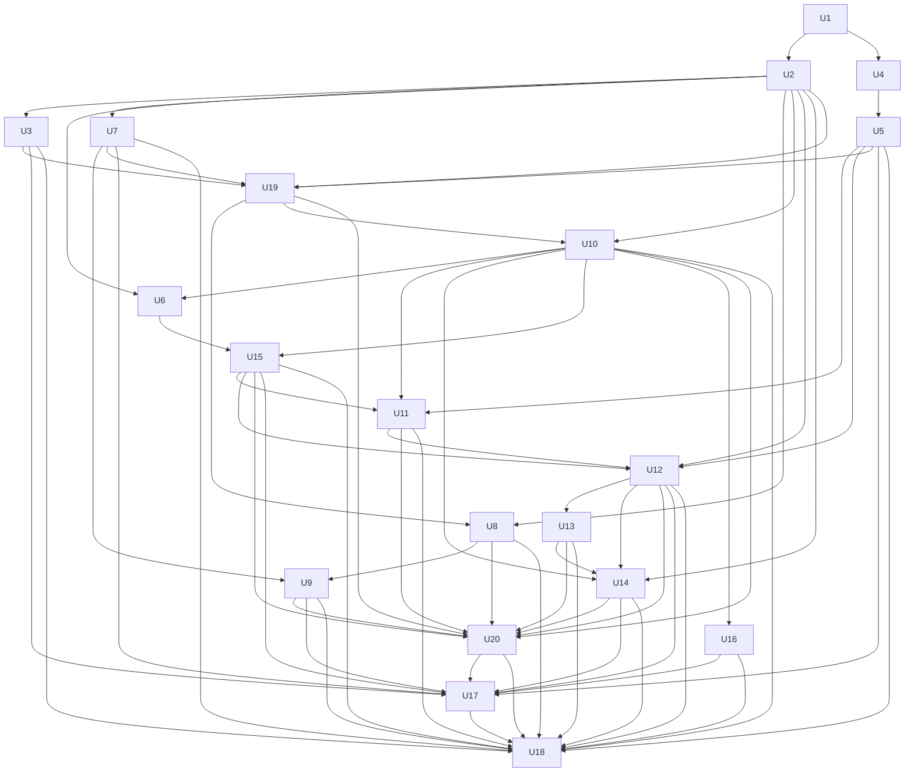
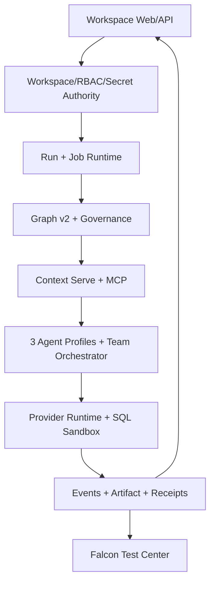

# feat: DataFoundry Greenfield 能力建设与 CoA 语义层生成总计划

## Summary

本计划把原 M01–M18 全部平台能力与 S01–S12、A01–A10、R01–R10、T01–T08 Agent Team 能力作为
一个 Greenfield 项目建设，不迁移任何历史 Workspace、Run、文件、Ontology Package、Semantic Release、
API Payload 或业务数据。DataFoundry 提供工作台与资源体验参考，CoA 提供 Ontology/Metric/Context Serve
参考；系统从新数据源 Schema 与业务资料直接生成第一版语义层，并收口到 `data-agent` 现有的 PostgreSQL
Authority、Graph v2、治理、Worker、Provider 执行和 Test Center。
执行以一个持续 Goal 驱动多个依赖有序、可恢复、可独立提交的实施单元，并由 Mastra 承载语义管理、
Text2SQL、报告写作三类独立 Agent Profile；中途不请求产品决策，最终以新生成的 Published Semantic
Release、Falcon 题目、真实 PostgreSQL、真实 Worker、真实 Agent Team 路径和确定性 Oracle 作为
Go/No-Go 门禁。

---

## Problem Frame

早期清单分别描述 DataFoundry 工作台能力与 CoA 语义能力。若用新的语义清单替换 M01–M18，会丢失
Run、会话、文件、Artifact、扩展中心和工作台闭环；若为两个参考项目各造一套系统，又会形成多份
Authority、任务系统、资源配置和发布状态。本轮按新项目处理，核心问题不再是怎样兼容或搬运旧数据，
而是怎样一次构建完整平台并从零生成可被真实查询消费的第一版语义层。

本计划解决的是同一个产品的收口问题：DataFoundry 只提供产品能力与交互参考，CoA 只提供
Ontology/Metric/Context Serve 的构成参考，最终可执行事实、权限、发布、Provider 调用、SQL 与评测仍由
`data-agent` 的现有权威链决定。

首要用户是 Workspace Analyst；首要任务是接入一个新数据源后，由系统生成并发布第一版受治理语义层，
再用中文业务问题得到可执行的只读 SQL、可核验结果、证据引用和可交付报告，并能从失败/中断恢复。
Semantic Maintainer 与 Workspace Admin 是支撑角色：前者检查生成证据和后续 Candidate，后者在 Goal 启动时
授权精确的 Greenfield Bootstrap Policy，并管理 Provider、Datasource、Extension 和权限。
可观察结果不是“功能页面存在”，而是首要任务通过真实 Team/Worker/PostgreSQL/Falcon，并能由公开 Receipt
重放；平台扩展还必须通过 U17 Workspace Journey Gate，不能用 SQL 分数掩盖资源工作台缺口。

---

## Requirements

- G1. 完整实施 M01–M18，不允许用 S/A/R/T 清单覆盖或降级原 Greenfield 平台范围。
- G2. 实施 S01–S12、A01–A10、R01–R10，且每个原始编号都有唯一主实施单元、验收证据和状态。
- G3. 所有 Run 资源先由服务端鉴权、解析 Workspace Defaults 与 Run Overrides，再冻结为
  `Effective Run Config`；客户端选择永远不是授权依据。
- G4. 模型选择必须贯通 Selector → Run → Worker → Provider → Invocation/Usage Receipt，不能只停留在 UI
  或 Conversation 持久化。
- G5. Semantic Graph v2、`semantic-ast` 与 Candidate/Validate/Publish/Rollback 合同是实现基线；新项目只
  生成新 Package/Release，不承担旧 Payload、旧 Release 或旧 Semantic API 的兼容迁移。
- G6. PostgreSQL 是 Workspace、Run、资源、语义发布、Job、Provider Invocation Receipt 和评测 Authority；
  Neo4j、Embedding Index、缓存与前端 Store 都是可重建投影。
- G7. 所有 AI 归纳、检索和诊断输出都只是 Candidate/Evidence；AI 不能批准语义、覆盖权限拒绝、
  修改 Gold/Oracle 或直接签发 GO。
- G8. 所有 Provider 集成均走服务端 API 与 SecretRef，不引入 Claude Code CLI 或参考项目运行时。
- G9. Run/Task Console 只展示可持久化、可重放、已脱敏的公开事件，不展示私有推理、系统提示、
  凭据或原始记忆。
- G10. Schema Scan、知识索引、Artifact Export、Ontology Induction、Metric Import、DataLink Rebuild
  统一进入 Job Center，不再按功能复制异步任务框架。
- G11. 一个 Goal 可从前置检查开始持续执行到最终门禁；所有选择、重试、恢复、提交和终止条件
  在本计划中预先定义，不把正常执行决策留给用户中途回答。
- G12. 最终发布必须通过 Falcon 题目门禁：真实 PostgreSQL、真实 Worker、固定 Provider/Profile、
  固定 Semantic Release/Schema Snapshot、严格结果等价 Oracle，并保留 DEMO/TUNING/HOLDOUT/TEST
  隔离。
- G13. 注册三类独立 Agent Profile：Semantic Management Agent、Text2SQL Agent、Report Writing
  Agent；每类必须冻结不同的 Tool Allowlist、Skill/Version、Workflow/Revision、Context Capacity Policy、
  Prompt/Profile 和输出合同，不能只是同一个 Agent 换名称。
- G14. 三类 Agent 通过 Team Orchestrator、`TaskEnvelope`、类型化 Artifact、受限
  `ContextProjection` 与 `HandoffReceipt` 协作；禁止在 Agent 间复制完整会话、原始记忆或无限上下文，
  `completed` 也不能替代确定性 `accepted`。
- G15. 项目以空 Workspace/空语义注册表启动；唯一语义输入是已授权的新 Datasource Schema Snapshot、
  业务资料与 Bootstrap Policy。Goal 必须生成第一版 Candidate、确定性验证并由非 Agent Release Authority
  发布首个 Semantic Release，不能要求提前存在旧 Release 或 Reviewer Receipt。首版只包含
  `MandatoryReleaseManifest` 中可由 Schema/约束/执行探针或签名业务断言机械验证的对象；其他歧义增强保留
  Candidate，不得靠 Agent 猜测，也不阻断已满足的 Physical Semantic Core。
- G16. Agent 执行层使用仓库已固定的 Mastra；参考 DeepSeek Harness 的 Durable Truth/Model View 分层、
  Context Compiler、Artifact-first、事务式 Compaction、显式 Resume 与 Subagent Provider，但业务 Task、
  Scope、Receipt、Acceptance 和发布权始终由项目合同/PostgreSQL Authority 持有。

---

## Scope Boundaries

- 不复制或嵌入 DataFoundry、CoA 的服务、数据库、前端组件、AWS CDK 或运行时依赖；只借鉴已审计的
  能力边界、合同和交互模式。
- 不新增第二份语义图、Metric Authority、Datasource Authority 或 Job 系统。
- 本计划不新增、修改或验收商业计费能力，包括 Credits、Pricing/FX、余额、额度、Hold、Settlement、
  Reconciliation、成本核算和付费 Marketplace。Provider 调用证据与技术资源上限不属于计费功能。
- 不迁移历史 Workspace、业务数据、Run、File/Artifact、Ontology Package、Semantic Release、消息或
  API Payload；不做 Backfill、Dual Read/Write、旧 Hash 保持、Compatibility Adapter 或 Cutover。
- 新项目仍需创建数据库 Schema，但这只是空库初始化 DDL，不包含历史行搬运、数据清洗或回填计划。
- AI 只能生成 Candidate/Validation/Impact，不能自行批准。首个 Release 由 Goal 启动时预授权的
  `SemanticBootstrapPolicy`、不可委托的 `PublisherGrant` 与确定性 Gate 决定发布；后续日常语义变更仍走
  人工 Review/Publish。Agent 只能看到 Policy View/Digest，永远拿不到签名原文或 Grant。
- 不以 LLM Judge、相似度、页面可见、单测通过或 SQL 可执行替代确定性发布门禁。
- 不把 Falcon TEST 191 题声明为本地 PASS 或本地准确率；它们只生成可审计 Submission Artifact。
- 不读取或修改现有生产 Workspace 作为输入；Greenfield Goal 只操作专属新 Workspace/Schema/Artifact Scope。
- 不在本计划顺带完成 U6 Research Platform、归因分析或其他不影响 M/S/A/R/T 闭环的历史重构。
- 不克隆 DataFoundry 的品牌、视觉身份或虚构运行数据；只复用本项目 Workspace Shell 和业务组件。
- 不把 Team Orchestrator 建成第四个拥有领域 Authority 的万能 Agent；它只负责任务图、运行上限、路由、
  Handoff、Checkpoint 与验收汇聚。
- Semantic Management Agent 只能产出 Candidate/Validation/Impact，不获得 Publish Tool；Bootstrap Release
  Authority 是确定性非 Agent 服务。产品/计分 Text2SQL 只消费 Published Release；唯一例外是无正式产物的
  PREPUBLISH_EVALUATION Activation。Report 只引用已验证 Evidence。

### Deferred to Follow-Up Work

- Falcon 上游版本更新、官方自动提交和 Leaderboard 同步：另立 Benchmark 生命周期任务。
- 从旧 DataFoundry/旧 `data-agent` Workspace 导入用户、文件、Run 或 Semantic Release：另立 Migration 项目。
- Trino 与其他非 mandatory Datasource Adapter：五类 Greenfield Adapter 认证后另立扩展任务。
- 为 Falcon 28 个数据库逐库人工增强完整业务 Ontology：另立优化任务；本计划仍强制在同一 Initial Release
  Set 中为 28 库各自动生成可查询、Schema-grounded 的 Package，db24/db14 额外要求业务术语/关系/Metric 增强。
- Pricing/Credits/Billing/商业额度/成本核算与付费 Marketplace：若未来需要，作为独立商业化项目规划，且不得
  重新耦合 Provider correctness 或 Falcon acceptance。
- 面向第三方的通用插件市场和跨组织共享模板：在 M12/M13 的内部管理闭环稳定后另行规划。

---

## Context & Research

### Current `data-agent` Reuse Baseline

- `packages/contracts/src/runs/runtime.ts`、`packages/platform/src/events/postgres-run-event-store.ts`、
  `packages/platform/src/queue/postgres-run-queue.ts` 已提供 Durable Run、Sequence、Lease/Fence、
  Cancel/Resume 与公开事件基线。
- `packages/contracts/src/workspaces/qa-resources.ts`、Workspace Resource Binding 与 Workspace-scoped Q&A
  API 已冻结模型和数据源选择，但文件、知识库、MCP、Skill、Semantic Release 与 Context Policy 尚未
  统一进入一个服务端 Effective Config。
- 10649–10652 与 `apps/web/src/lib/model-provider-admin.ts` 已建立 API-backed Provider 控制面；
  `packages/contracts/src/ports/model-provider.ts`、`packages/agent-runtime/src/model-provider-port.ts`、
  `packages/agent-runtime/src/mastra/model-provider-adapter.ts` 与
  `apps/worker/src/semantic/authoring-model-runtime.ts` 提供不依赖计费的真实调用、SecretRef、认证、技术上限和
  Usage 证据基线。新 Team/Falcon 路径不导入现有 `billing-gated-model-provider.ts`。
- 10638–10645、`semantic-graph-v2.ts`、`semantic-governance.ts`、Semantic Studio、Authoring Worker
  已建立 Graph v2、Candidate、Review、Publish 与事件审计基线。
- 10610 `semantic.bootstrap_semantic_domain` 已要求两个不同 signer、独立初始 reviewer，并创建
  `active_release=null/generation=0` genesis；现有 `prepare_publish_attempt` 又要求已批准 Review Task。U5 必须以
  独立窄 RPC 原子增加 system-bootstrap 首发路径并保留双签 Domain 初始化，不能只在 TypeScript 绕过数据库 Gate。
- `packages/evals/src/test-center/falcon-*`、`infra/falcon/v1/`、10646 Falcon Import 已固定 28 个
  PostgreSQL Schema、DEV 309、TEST 191 与严格 expected-result Oracle。
- 当前工作树有大量并行任务改动；实施时必须基于实时 HEAD/Status 建立 Owned Path Allowlist。这里复用的是
  代码模式和 Authority，不是旧项目数据，也不能把观察状态当成新项目已交付证明。
- `packages/agent-runtime/src/teams/` 已有 `TaskEnvelope`、`ContextProjection`、Tool/Network/Resource Limit
  收窄、Handoff Receipt 与四个 L2 角色的基线；本计划扩展它，不另造一套 Team 协议。
- `packages/agent-runtime` 已固定 `@mastra/core` 1.52.1，并通过 `src/mastra/` Bridge、Worker Composition 与
  `MastraSnapshotBinding` 把 Mastra 限制在内部执行层；公共合同不导出 Mastra 构造器。U19/U20 沿用该边界，
  不把 Mastra Memory、Thread、Workflow Snapshot 直接当业务 Authority。

### Reference Patterns

- DataFoundry reference `08afa7b`：`apps/api/src/run-config-resolver.ts` 的资源解析、
  `run-checkpoint-resume.ts` 的恢复、`session-branching.ts` 的引用式分支、
  `context-package-recorder.ts` 的上下文快照，以及 Knowledge/MCP/Skill/Datasource 管理只作为行为参考。
- CoA reference `4e0ad25`：Smithy 合同中的 Namespace、Ontology Induction、Metric、Serve、
  Resolution Trace 和 MCP Tools 只作为语义构成参考；其 AWS 服务拓扑不迁移。
- `data-agent` 本地规范：PostgreSQL Authority、SecretRef、Artifact Content Hash、公开 Run Event、
  Workspace/RBAC、Test Center/Sealed Oracle 与 Semantic Relationship Index 优先级高于参考项目。
- `深度调研` 本地资料中的 Multi-Agent/Handoff 与量化研究编排结论：业务级 AgentSession 和
  Provider-native 子 Agent 身份必须分离；交接使用类型化 Artifact/摘要而不是拼接自然语言；Plan/Task
  合同不可变，`completed` 需经 VerifierDecision 才能成为 `accepted`，并通过 Checkpoint/Fence/CAS
  支持恢复。这些结论用于约束 T01–T08，不引入其中项目的运行时。
- DeepSeek Harness reference `47f943859bef60e4160492346772ded9b24f765a`：只采用 Goal 与激活权分离、
  Durable Truth→Context Compiler→Model View、Artifact-first 大结果、`compaction/start/end` 稳定性复核、
  `TOOL_NOT_STARTED`/`TOOL_OUTCOME_UNKNOWN` 与 Subagent Provider 的父子身份/回收思想；不引入 Cordis、
  Session Store 或其插件运行时。
- Mastra reference `57b032df3c` 与 `深度调研` RQ010：Supervisor/Subagent Tool、AgentController、Workflow
  Snapshot 和 A2A 是不同通信路径。新项目只使用本地同进程 Mastra Agent/Workflow/Subagent 原语；跨服务 A2A
  不在本次范围，且 Mastra `completed`/snapshot 不能替代项目 Verifier/Receipt。

### Institutional Learnings

- 模型选择持久化不等于真实切换；必须看到 Provider/Model、Invocation 与 Token Usage Receipt 的执行证据。
- Greenfield 项目不需要旧语义兼容矩阵；真正需要证明的是空 Workspace 能从 Source Snapshot 生成首个
  Package/Release，且之后每个 Run 都固定其 Release Hash。
- 数据库只执行空库 Schema 初始化；不把 Backfill、历史 Ledger 状态或删除 Volume 作为交付步骤。
- Falcon 使用真实 PostgreSQL；Demo、Tuning、Local Holdout、Official Test 必须隔离，确定性 Oracle
  决定 PASS/FAIL。

### External Research Decision

本计划不再做开放式 Web 研究。DataFoundry 与 CoA 都有用户指定的本地固定提交，相关层在
`data-agent` 也已有明确 Authority 与实现模式；继续追逐上游最新版本会降低计划可复现性。

---

## Key Technical Decisions

| 决策面 | 选择 | 理由 |
|---|---|---|
| 统一 Run 配置 | 新增服务端 `EffectiveRunConfig` 合同与 Resolver，冻结资源版本和摘要 | M01 是 M02/M03/M11/M12/M13/S12/R01 的共同接缝 |
| 语义模型 | 向 Graph v2 增加 Package/Concept/Property/Taxonomy/Constraint 元数据 | 延续现有 Authority，不创建 CoA 平行图 |
| Formula | `semantic-ast` 继续是逻辑 Authority；SQL/SPARQL 是编译产物 | 保留多方言与确定性校验边界 |
| Ontology Package | Release 内的版本化 Manifest，绑定 Registry、Mapping、Evidence、Validation | Package 是发布边界，不是另一套数据库 |
| 异步执行 | Job Center 统一 Job/Attempt/Lease/Fence/Cancel/Retry/Artifact Receipt | 避免 Schema、Index、Ontology、Export 各建任务系统 |
| Context Serve | Metric 明确命中优先，其次 Ontology/Text2SQL，再到文档/图检索 | 能力路由优先于单一相似度 |
| SQL 安全 | 统一进入既有 SQL Firewall/Sandbox Authority | RAG/LLM fallback 不能绕过权限拒绝 |
| 可观测性 | Resolution Trace 进入同一 Durable Public Event/Artifact 链 | 支持恢复、Task Console、审计且不泄露私有推理 |
| 扩展中心 | MCP 管理面与 Run 内 Semantic MCP Tool 分层 | 管理配置和实际工具调用具有不同权限边界 |
| Agent Team | 一个非领域 Orchestrator + 三个独立 Agent Profile + 类型化 Handoff | 分离上下文与权限，同时复用已有 Team 合同和 Authority |
| Agent 完成 | Agent 调用显式 Complete/Checkpoint Tool，Verifier 决定 Accepted | 防止以助手自然语言或子任务完成冒充业务验收 |
| Greenfield 语义 Bootstrap | Source Bundle→AI Candidate→Pre-publish Gate→Bootstrap Release Authority | 一次 generation 0→1 CAS 原子发布 Initial Release Set；歧义增强不混入 v1 |
| 最终门禁 | U17 Workspace Journey + U18 Falcon 绝对阈值/稳定性/Holdout/TEST Submission | Falcon 证明 governed Text2SQL/Report，Journey 证明其余平台能力 |
| 模型数据出境 | 所有 Chat/Embedding 请求先过 sensitivity-aware Data Projection Gate | Provenance 正确不等于允许把原始值发送给 Provider |
| Agent 执行层 | Mastra Agent/Workflow/Subagent + 项目自有 Port/Receipt/PostgreSQL Authority | 利用现成 Agent 原语，但不泄漏框架身份或让 Snapshot 取代业务状态 |
| Context Runtime | Durable Truth→Context Compiler→Model View；Artifact-first；Epoch Compaction | 参考 DeepSeek Harness，避免把完整消息历史当上下文或恢复真相 |
| 商业计费 | 本期完全排除，Provider Invocation Authority 与 Billing Decorator 解耦 | 避免 Credits/价格/结算成为 Greenfield Goal 或 Falcon 的前置；仅保留执行证据与技术安全上限（session-settled: user-directed — chosen over implementing billing in this plan: the user explicitly removed billing and related commercial functions from scope） |

---

## Autonomous Goal Execution Contract

### Goal Objective

Goal 执行器应把本文件作为唯一范围入口，按 U1–U20 的依赖顺序持续实施、验证和提交：先初始化隔离的空
Journey Workspace 与 Falcon Evaluation Workspace，由 U11/U20 Semantic Agent 生成 Candidate，再由 U5
Bootstrap Authority 发布各自首版；只有 Published Release 可交给 Text2SQL/Report Agent 跑真实问答、报告与
Falcon。只有 Greenfield
Bootstrap Release、Workspace Journey 和 Falcon Gate 都签发 GO 且所有编号都有证据时，才能标记完成。

### Preflight Before the First Mutation

以下静态检查在写代码前一次完成；任一失败都返回单一 Blocker Report，不进入“做一半再询问用户”状态：

1. 记录实时 HEAD、分支、Dirty Status、现有 Trellis 任务和仅属于本 Goal 的路径 Allowlist。
2. 确认两个专属空 Scope：U17 `Journey Workspace` 与 U18 `Falcon Evaluation Workspace`；两者的 Schema/
   Artifact Namespace、Semantic Domain、Policy/Grant/Receipt 均隔离，且都未绑定历史用户数据或 Release。
   确认 PostgreSQL、Web、Worker、Indexer 和必要 SecretRef 可用；DDL 只创建空库 Schema。
3. 确认至少一个 API-backed Certified Model Profile 的 SecretRef 可用，并能完成真实 API smoke call、
   返回 Provider/Model 身份及原始 Usage 可用性状态；Preflight 不要求尚由 U3 创建的持久化
   Invocation/Usage Receipt，也不检查价格、Credits、余额或 Settlement。
4. 校验 `infra/falcon/v1/` 固定摘要、28 Schema/500 题资产、Falcon Workspace Binding 与严格 Oracle。
5. 冻结由已认证 Workspace Admin 发起、独立非 Agent Platform Attestor 联签的 `LaunchAuthorization`，其中为
   Journey/Falcon 两个 Domain 绑定允许的数据源/Schema/业务资料摘要、`MandatoryReleaseManifest`、机器可验证
   业务断言、生成范围、硬门禁、Provider、技术资源上限、预期 signer key-id 与独立初始 Reviewer Assignment。Preflight
   只验证现有 Principal/Key SecretRef/签名材料可用并记录目标 digest，不调用尚未实现的 U1/U5 Authority，
   `SemanticBootstrapPolicy`/Domain Receipt/Publisher Grant 在后续 Phase Activation 物化且不得要求用户二次确认。
6. 确认现有 `packages/agent-runtime/src/teams/` 合同与 U19 Slice 所需的 Provider/Artifact/Sandbox 基础依赖
   可用；U19 先验证 Team v2 合同，三类完整可运行 Profile 属于 U20 交付物，不错误地作为实施前置。
7. 完成 PostgreSQL、MySQL、SQLite、DuckDB、ClickHouse 的驱动版本、许可证、供应链和目标平台预审，冻结
   mandatory adapter set；任一 mandatory adapter 不可合法交付则在任何产品改动前停止。
8. 校验 Mastra 固定版本/Lockfile、内部 Bridge、Snapshot Binding 与项目公共导出边界；校验 DeepSeek Harness
   参考提交和本地研究文档可读，但不把两个参考仓库纳入运行依赖。
9. 为 Falcon 冻结两个不相交 Allowlist：`SemanticBootstrapCorpus` 只含 28 库 Schema、独立业务资料及明确
   允许的 DEMO/TUNING 断言；`CaseRuntimePublicInput` 只在单题 Text2SQL Task 中提供该题公开题面。
   Local Holdout/TEST 题面、Gold、expected、Oracle 派生反馈与 sealed 字段都不得进入 Semantic Agent、Package、
   跨题 Artifact 或优化日志。
10. 建立一个 Trellis Parent Task，并按 U-ID 建立可独立验收的 Child Task；Parent 只聚合范围和最终门禁。

### Phase Activation After Contracts Exist

- U1 合同与 Signer Key Registry 安装后，从不可变 `LaunchAuthorization` 机械物化两个
  `SemanticBootstrapPolicy`，digest 必须与启动目标一致。
- U5 Authority/RPC 安装后，以 CAS 验证 Admin/Platform Attestor 的 key-id/signature/nonce/expiry/capability，
  调用强化后的 per-domain bootstrap，配置独立 Reviewer Assignment，并签发短期、不可委托、单 audience 的
  `PublisherGrantRef`。Domain Receipt 必须 `verification_state=VERIFIED`；Policy/Grant Receipt 标记
  `SYSTEM_BOOTSTRAP_POLICY`，不得冒充 Human Reviewed，Agent/Manifest 均不持有 Bearer Material。
- U20 安装后，以 `ExpectedProfileContract` 物化三个 `AgentProfileRevision` 与 Skill/Workflow/Prompt/Model Receipt。
  只有 `PhaseActivationReceipt` 同时绑定 LaunchAuthorization、两 Domain genesis、Grant Ref 与 Materialized Profile
  Revision，U17/U18 才能启动；任何 digest 漂移 fail closed，但全程不追加用户确认。

### Revalidation of Mutable Preconditions

Preflight 冻结身份和摘要，但不假设长 Goal 期间外部事实永远有效。每个 Phase 入口、每个消费相应 Authority
的 U-ID 写入前，以及 U18 启动前，必须重新核验 Workspace/RBAC/Revocation、LaunchAuthorization（U5 前）或
已物化 Bootstrap Policy/Grant（U5 后）、Source/
Schema Digest、当前 Semantic Release（各 Domain 首次 publish 前必须为空；U17/U18 发布后分别等于其首版冻结
Hash）、SecretRef、Provider
Certification、Worker/Indexer/Job/Neo4j/Scanner 健康，生成带 CAS/version 和有效期的 `PhaseEntryReceipt`。
关键对象被撤销或漂移时，在下一次领域写入/Tool 调用前停止；不得在原 Attempt 中偷换版本。

### Non-Interactive Defaults

- 遇到“复用项目 Authority 还是采用参考框架存储”时，一律复用 PostgreSQL/Artifact/Receipt Authority；Mastra
  只在内部执行层适配，不把其 Thread/Memory/Snapshot 暴露为公共业务合同。
- 遇到“缓存/Neo4j/索引还是 PostgreSQL”冲突时，以 PostgreSQL 为 Authority，其余重建。
- 遇到尚未生成首版语义层时，Run 返回 `SEMANTIC_BOOTSTRAP_NOT_READY` 并指向生成 Job，不降级到无语义 SQL。
- 遇到可重试基础设施错误时按既有 Retry/Lease/Fence 规则恢复；业务校验失败不自动降级标准。
- 遇到关联但不属于 G1–G16 的问题时记录 Deferred Finding，不扩张当前 Child Task。
- 需要补充参考或调研时，先检索仓库与 `深度调研` 本地资料；只有本地证据不足且结论会改变合同/门禁时
  才做外部研究，并把固定来源、版本和结论写入当前 Child Task Research Artifact，不临时询问用户。
- Report Writing Agent 发现 Evidence Gap 时只向 Orchestrator 返回类型化 Gap；Orchestrator 可创建一次
  有界 Text2SQL 子任务，禁止两个 Agent 自由对话或无限往返。
- Mastra/Worker 重启后不得隐式续跑。Goal Orchestrator 只有持有原 `GoalExecutionManifest` 的自动恢复授权、
  精确 Goal Revision/Lease/ExecutionResourceLimits 且 Recovery Probe 通过时，才显式 re-arm 新 Attempt；
  unknown 外部效果先查询状态或对账。
- 不执行破坏性数据库/Volume/Artifact 清理；需要此类动作时保持数据并报告 Blocked。

### Progress, Recovery, and Commits

- 每个 U-ID 是一个 Trellis Child Task 和一个 Scoped Commit；只暂存该单元 Owned Paths。
- 多个 U-ID 需要递进修改同一路径时，由较晚 U-ID 只追加其声明的增量职责；若变更已签发的新项目合同，
  先废止受影响 Receipt、签发 Invalidation Receipt，并按依赖图重跑下游 Gate。
- 进度来源是 Commit、Job/Run/Artifact/Bootstrap/Falcon Receipt，不在计划中维护完成勾选。
- Goal 恢复时从最后一个已验证 Commit/Receipt 继续；已验证单元不重做，未通过门禁的单元不标记完成。
- 同一失败连续三轮仍无法产生新证据时进入深度诊断；只有确认是外部权限、凭据、服务或范围冲突后
  才报告 Blocked，不通过降低 Oracle、跳过题目或伪造 Fixture 收口。
- 一个逻辑 Parent Goal 分成 Phase Execution Segment；每个 U-ID 最多 3 个修复 Attempt，每个 Phase 最多
  2 次从 Exit Gate 回退，任何一次 Retry 都必须产生新诊断证据。达到上限写 `ResumeBlockerReceipt`，不无限循环。
- Preflight 根据 U-ID 验证清单与 Falcon 固定 Run 数估算每段 active wall time、Tool Calls、Provider Calls/
  Tokens、Context Bytes 与 Artifact Storage，并以 20% headroom 写入 `ExecutionResourceLimits`；任一段不得借用
  下一段上限，超限停止并保留 Checkpoint。它只防止自治运行失控，不计算价格、不扣 Credits，也不赋予降低
  Falcon 阈值或减少 mandatory scope 的权力。
- Segment 固定顺序为 Contract/Authority→U7+U19 Risk Slice→Workbench→Semantic/Extension+U20→Workspace Journey→
  Falcon；上一段只有签发 Exit Receipt 才创建下一段 Task，但全程属于同一个 Goal，不等待用户“继续”。

### Goal Launch Packet for Future Execution

实施时只需以一次 Goal 启动下列 Objective；本轮计划编写不创建或运行该 Goal：

```text
以当前已提交计划 docs/plans/2026-08-16-001-feat-datafoundry-coa-migration-plan.md
及其 plan commit/hash 为冻结范围，从 Preflight 开始按依赖实施 U1–U20。每个 U-ID 建立
Trellis Child Task，完成范围内验证和 scoped commit 后再推进。保留用户/并行任务改动，禁止
破坏性清理；歧义按 Non-Interactive Defaults 处理，调研优先使用仓库与 深度调研 本地资料。
仅操作隔离的 Journey Workspace 与 Falcon Evaluation Workspace；由 U11/U20 Mastra Semantic Agent 按预授权
Policy View 生成 Candidate，再交 U5 Bootstrap Authority 生成首个 Published Semantic Release；之后才创建
Text2SQL/Report Task。只有 Bootstrap/Journey/Falcon 三个
Gate 都签发 GO 才能 complete；
否则在穷尽有界恢复后输出单一 Blocker/Evidence Report，不中途请求普通产品决策。
```

Goal 启动器必须先生成并持久化 `GoalExecutionManifest`，至少包含：

- `plan_commit`、`plan_content_hash`、起始 HEAD/branch、Owned Path Allowlist 与 U1–U20 DAG。
- Journey/Falcon Workspace、各自 Datasource/Schema/Business Source Bundle、`LaunchAuthorization` 与目标
  Policy/Domain/Grant Hash，以及待 U1/U5 CAS 物化的 `SemanticBootstrapPolicy`、Verified Domain Receipt、
  `PublisherGrantRef/Hash` slot；另含 Falcon Bootstrap/Case/Sealed 输入隔离清单。两个 Domain 激活前都必须
  `active_release=null && generation=0`，Manifest 永不保存可用 Grant。
- Certified Provider/Model Profile、Invocation Capability、`ExecutionResourceLimits` 与 SecretRef 可用状态
  （只记录引用与脱敏状态）。
- 每个 U-ID 的输入 Receipt、输出 Schema、验证命令、Scoped Commit、Retry Class、Rollback 和 Exit Gate。
- Mastra/Core Lockfile Hash、内部 Bridge 版本与三类 Agent 的目标 Profile ID/角色边界/Required Tool-Skill-
  Workflow-Model 约束，形成不依赖尚未创建文件的 `ExpectedProfileContract`；Prompt/Skill/Workflow 实际 bytes/hash
  留待 U20 物化后以 CAS 追加 `MaterializedProfileRevisionReceipt`。Mastra 类型不得进入 Manifest 公共 Schema。
- `last_accepted_unit`、当前 Task/Attempt/Fence、Goal Revision、Event Watermark、Context Epoch、Artifact/
  Receipt 索引、unknown effect、失败计数和 Deferred Finding 索引。

Parent Trellis Task 是执行元数据所有者：在其 `research/` 中保存版本化 `goal-execution-manifest.json` 与
append-only `goal-checkpoints.jsonl`，每个 U-ID Commit/Receipt 后按 revision+hash 更新。启动动作对 plan hash 的
一次确认视为 start approval；启动器机械生成并校验 Child Task 所需的 PRD/Design/Implement/Check 上下文，
后续不再等待普通 Review。产品内 Task/Event/Artifact Authority 仍在 PostgreSQL，不能把该执行元数据混入产品状态。

### Autonomous Decision and Stop Table

| 情况 | 自动动作 | 是否询问用户 |
|---|---|---|
| 本地实现模式或资料不明确 | 先查仓库，再查 `深度调研`，记录固定 Research Artifact 后选与 Authority 一致的最小方案 | 否 |
| 测试暴露范围内缺陷 | 在当前最小 U-ID 修复并重跑相关 Gate，最多三轮后进入深度诊断 | 否 |
| 并行改动占用同一文件 | 读取实时 Diff，适配非冲突改动；无法安全分离时在写入前停止并给出冲突路径/所有者证据 | 只在确实冲突阻塞时停止 |
| 空库 Schema 初始化 DDL 与并行编号冲突 | 按仓库现行 Ledger 机制重新分配部署编号；不得因此引入数据 Backfill/兼容流程 | 否 |
| Provider/Worker 短暂失败 | 按 Provider Invocation Semantics、Retry/Lease/Fence 恢复；本地 Artifact/Invocation Effect Receipt 单次接受，外部调用不虚构 exactly-once | 否 |
| 缺凭据、外部权限、服务持续不可用 | 三次有新诊断证据的恢复均失败后输出 Blocker Report，保留可恢复状态 | 终止 Goal，不做中途问答 |
| 首版语义存在歧义或 Bootstrap Gate 未过 | Optional 歧义对象排除出 v1 并保留 Candidate；Mandatory Manifest/业务断言仍有 unresolved 则禁止发布，不得猜测或把 AI 自评当批准 | Mandatory 未满足时终止 Goal 并输出 READY_FOR_REVIEW/Blocker，不中途弱化 Gate |
| Bootstrap Publisher 被二次调用 | `active_release != null` 或 `generation != 0` 时永久拒绝；后续变更只走人工 Review | 否 |
| Mastra/Subagent 恢复遇到 unknown effect | repair/replay/reconcile，重新编译 Model View 并由 Orchestrator 显式启动新 Attempt；禁止隐式续跑 | 否；无法查证则终止 Goal |
| Falcon 任一绝对 Gate 未过 | 返回最小失败题/层修复；不得降阈值、跳题或把 TEST 当本地 PASS | 否；未修复则不 complete |

每次上下文压缩或 Goal 恢复都只加载 Execution Manifest、当前 U-ID、直接依赖 Receipt、Owned Diff 与最近
失败证据；历史详情按 Artifact Ref 按需读取。由此让“实现 Goal 的编码上下文”和“产品内三类 Agent Context”
都保持有界，但二者的身份、状态与 Receipt 不混用。

---

## Capability Traceability Matrix

| ID | 唯一主实施单元（协作单元） | 必须留下的验收证据 |
|---|---|---|
| M01 | U2 | Effective Config Receipt 绑定全部资源版本与授权结果 |
| M02 | U3 | Provider/Model、Invocation 与 Usage Receipt 和所选 Profile 一致 |
| M03 | U6 | 文件 ACL、Hash、扫描、Scope 提升与删除回执 |
| M04 | U7 | 预览、下载、报告引用使用同一 Artifact Hash |
| M05 | U9 | Task Console 可从公开事件/Artifact/Trace 重建 |
| M06 | U8 | 刷新恢复无重复消息、Tool、Artifact 或 Provider Effect |
| M07 | U8 | Queue/Stopping/Retry 命令幂等且 Fence 正确 |
| M08 | U8 | 分支只引用父历史并重新鉴权/冻结资源 |
| M09 | U8 | Interruption ID、Run Fence、版本与回复严格绑定 |
| M10 | U9 | SQL/参数/Snapshot/Receipt/结果可追溯回原会话 |
| M11 | U15 | Knowledge Chunk/Index/Query 有 Hash、Scope、Evidence Receipt |
| M12 | U14 | MCP SecretRef、Manifest、RBAC、Tool Policy 与 Run 选择闭环 |
| M13 | U14 | Skill 来源/版本/校验/选择结果进入 Run Receipt |
| M14 | U16 | Gallery Schema 驱动表单且复用 Datasource Authority |
| M15 | U16 | 每个 Adapter 独立只读/超时/脱敏/审计认证 |
| M16 | U10 | Job 持久化、幂等、取消、重试、错误码、Artifact Receipt |
| M17 | U10（U2） | `/ready`、Capabilities、Defaults/Overrides 服务端权威 |
| M18 | U17 | Quick Start、空状态、双语、Demo/Fixture/Benchmark 隔离 |
| S01 | U4 | Namespace = app + tenant + workspace + environment |
| S02 | U4 | Package ID/版本/依赖/导入/状态/Release Binding |
| S03 | U4 | BUSINESS_SUBJECT 承载 Concept/Class/Entity/Event 角色 |
| S04 | U4 | DIMENSION 承载 Data Property 类型/单位/敏感级别/映射 |
| S05 | U4 | Edge 承载 Object Property 正反语义/Domain/Range/基数 |
| S06 | U4 | Taxonomy/Alignment 支持父子/等价/近似/互斥/别名/跨包 |
| S07 | U4 | Constraint 支持基数/必填/类型/唯一性/业务规则 |
| S08 | U4（U13） | Physical Mapping 绑定 Snapshot 并区分 Queryable/Knowledge-only |
| S09 | U4（U11） | Metric 绑定 Concept/Formula/Dimension/Grain/Time/Unit |
| S10 | U4（U13） | AST Authority 与编译产物摘要一致 |
| S11 | U4（U5） | Node/Edge/Constraint/Formula/Mapping 均有 Provenance |
| S12 | U5 | 首版 Candidate→Validate→Bootstrap Admission→Publish；后续 Review→Publish→Rollback |
| A01 | U11 | Schema Induction 只输出 Review-only Graph Patch |
| A02 | U11（U15） | 文档归纳输出术语/概念/关系/规则候选与原文证据 |
| A03 | U11 | Foundational Grounding 可选且只生成对齐候选 |
| A04 | U11 | Stable Object ID Resolver 避免重复概念 |
| A05 | U5（U11） | Proposal 去重后进入现有 Candidate Plane |
| A06 | U5（U11） | 确定性阻断、质量评分、Bootstrap Policy/后续人工审核分离 |
| A07 | U11 | Drift 只重算受影响对象并保留不变内容 |
| A08 | U11 | Metric/Formula/Query/Agent/Release 影响清单可追溯 |
| A09 | U11 | Metric Dry-run/批量验证/异步导入/版本差异 |
| A10 | U5（U11） | OSI/Ossie 仅作交换协议并转换为内部 AST/治理对象 |
| R01 | U12（U2） | Context Package 固定 Release/Snapshot/权限/证据摘要 |
| R02 | U12 | 明确名称/别名只解析 Published Metric |
| R03 | U13 | Text2SQL 只注入具有有效 Mapping 的 Queryable Concept |
| R04 | U13 | 图遍历使用 PostgreSQL Authority/Neo4j 投影与回退证据 |
| R05 | U12（U15） | Metric→Ontology/Text2SQL→Document/Graph 能力路由 |
| R06 | U13 | SQL Firewall 拒绝不可被 RAG/LLM Fallback 绕过 |
| R07 | U9（U12） | Resolution Trace 持久化、公开、脱敏、可重放 |
| R08 | U14 | Semantic MCP Tools 服从 RBAC/Tool Policy/Effective Config |
| R09 | U12（U17） | Preview 展示 Release/证据/裁剪原因/Context Capacity |
| R10 | U18 | Falcon + Deterministic Oracle 签发最终结果 |
| T01 | U20（U19） | Agent Profile Registry 冻结 Profile/Tool/Skill/Workflow/Prompt/Model Revision |
| T02 | U20（U19） | Semantic Management Agent 只生成 Candidate/Validation/Impact Artifact |
| T03 | U20（U19） | 产品/计分 Text2SQL 只消费 Published Layer；隔离 PREPUBLISH_EVALUATION 不产正式 Query Evidence |
| T04 | U20（U19） | Report Writing Agent 只从 Accepted Evidence 投影带引用报告 |
| T05 | U19（U20） | Mastra 只执行；Team Orchestrator 维护 Task DAG、Execution Safety Bounds、Fence、Checkpoint 与 Fan-in |
| T06 | U19 | Context Compiler/Handoff 绑定 Goal/Event/Epoch，只传 Artifact Ref 与有界 Projection |
| T07 | U20（U19） | 每类 Agent 独立注册 Tool/Skill/Workflow，并区分 Mastra completed 与业务 accepted |
| T08 | U18（U20） | Falcon Team Run 证明角色隔离、Subagent 回收、事务压缩恢复且上下文不失控 |

---

## Agent Team Architecture

Team 对外只有三类领域 Agent；内部 Team Orchestrator 是确定性的控制面，不拥有 Semantic、SQL、Report
或评测 Authority。Mastra 只提供 Agent/Workflow/Subagent/Stream/Snapshot 执行原语，PostgreSQL 持有 Task、
Event、Artifact、Effect、Lease/Fence 和 Acceptance。三类 Agent 可使用不同模型配置，由 U20 Registry 冻结
`AgentProfileRevision`，其中引用 U2 Effective Config 与 U3 Provider/Model/Invocation Receipt；每个 Task Receipt
记录实际版本。

产品语义是“同一 Orchestrator 下的两条受治理 Workflow”，不是强迫三个 Agent 共享一个问题 Context：
问答由 Text2SQL→Report 完成；Semantic Management 先为 Greenfield Workspace 生成首版 Candidate，由一次性
Bootstrap Authority 发布后影响首轮问答，后续 Candidate 只有人工发布后才影响新 Run。
Team 共享 Task/Handoff/Artifact/Verifier 基础设施，但三类 Profile 从不共享完整上下文或互相继承权限。

| Agent Profile | 接收的最小上下文 | 注册 Tool | 注册 Skill | Workflow | 权威输出 | 明确禁止 |
|---|---|---|---|---|---|---|
| Semantic Management Agent | Schema Snapshot、Business Source Bundle、Bootstrap Policy View/Digest；后续才含 Published Release | 读 Schema/Release；建 Candidate Patch；Compile/Validate；Drift/Impact；提交 Job/Checkpoint/Complete | `schema-to-candidate`、`drift-reanalysis`、`metric-maintenance` | `semantic-bootstrap-or-candidate@revision` | Candidate、Validation、Impact、Job Receipt | 签名 Policy/Publisher Grant、Publish、执行 SQL、生成最终报告、读取 Falcon Gold/expected/sealed/derived fields |
| Text2SQL Agent | Question Contract、Published `ResolvedContextPackage`；或隔离的 PREPUBLISH_EVALUATION Activation；SQL Policy、必要 Artifact Ref | `list_metrics`、`describe_semantic_model`、`resolve_context`、`graph_traversal`、Compile、Sandbox Query、Checkpoint/Complete | `question-to-query`、`ambiguity-resolution`、`bounded-query-repair` | `governed-text2sql@revision` | LogicalPlan、SqlArtifact、QueryEvidence、Resolution Trace；预发布只产 CandidateEvaluation Evidence | 修改语义、在产品/计分 Task 消费 Candidate、绕过 Firewall、签发报告或 Oracle Verdict |
| Report Writing Agent | ReportSpec、Accepted QueryEvidence/Claim/Evidence、Artifact Ref | 读 Artifact/Evidence；生成 Report/Chart Candidate；校验 Claim 引用；Checkpoint/Complete | `evidence-to-report`、`chart-selection`、`claim-citation` | `evidence-report@revision` | Report Candidate、ChartSpec、Citation/Claim Matrix | 直连数据源、修改 SQL/语义、无 Evidence 编写事实、签发 GO |

### Team Control and Handoff Rules

- Orchestrator 只依据 Task 类型、依赖和状态路由：语义维护请求进入 Semantic Management Agent；用户问题
  进入 Text2SQL Agent；只有 QueryEvidence 经确定性验证 `accepted` 后才能进入 Report Writing Agent。
- 默认问答路径为 `Question → Text2SQL → Query Verifier → Report Writing → Report Verifier`；首建语义路径
  为 `Schema/Business Sources → Semantic Management → Candidate/Validation → Bootstrap Authority → Publish v1`；
  后续维护才是 `Drift → Candidate/Validation → Human Review/Publish`，三条路径不混写。
- 新 Candidate 不能被当前问答 Task 消费。只有发布形成新 `PublishedReleaseRef` 后，后续 Text2SQL Task
  才能解析它；首版发布 Receipt 明确标注 `SYSTEM_BOOTSTRAP_POLICY`，后续保留人工发布 Authority。
- Handoff 必须包含 Parent/Child Task、Goal Revision、Event Watermark、Context Epoch/Build Signature、Attempt/
  Run/Scope、Profile Revision、Artifact Ref、Execution Resource Limits、Tool/Network Policy、Expected Revision/
  Output/Acceptance；
  子 Task 只能收窄这些范围。
- 跨 Agent 不传完整消息历史、私有推理、系统提示或原始记忆；Authority 字段留在 `TaskEnvelope`/内容寻址
  Artifact Ref，最多 64 KiB 的投影 `data` 始终标为 `UNTRUSTED_DATA`/`DATA_ONLY`。长任务通过
  Checkpoint/Compaction Artifact 恢复，而不是持续扩大同一 Context。
- 每个 Task 独立运行 `Durable Truth → Context Compiler → Model View`：Compiler 输出 `ContextBuildManifest`、
  `BuildSignature`、`OmissionLedger` 和 `ContextEpochRef`。相同 Task/Goal/Event Watermark/Policy/Input 必须纯重建
  出相同签名；dispatch 前任一版本漂移都使旧 View stale，Provider 调用次数必须为 0。
- Context 减载固定顺序为去重→大型结果 Artifact 化→按需 Slice→确定性 prune→事务式 Compaction。
  Compaction 使用 start/summary/replace/end、CAS、lineage 和 Recovery Probe；失败继续使用旧 Epoch。KV Cache
  只记录 telemetry，不能成为 Memory、Truth 或恢复条件。
- Mastra Subagent 默认使用 fresh thread/resource，不 fork 父会话；正式回流只有类型化 Result/Artifact Ref。
  领域 Agent 禁止递归委派，只有 Orchestrator 能创建深度 1 的子 Task；取消沿 lineage 传播，迟到结果必须通过
  lease/fence/expected revision 才能进入父 Task。Mastra `messageFilter` 不作为安全边界，裁剪失败必须 fail closed。
- Agent 调用 `complete_task` 仅表示产物已提交；Orchestrator 必须等待合同校验、权限校验、SQL/Claim/Oracle
  等确定性 Verifier 签发 `accepted`。失败只重开最小 Task/Attempt，且 `remaining_handoffs` 严格减少。
- 业务 `AgentSession/Task/Attempt` 身份与 Provider 原生 child/session ID 分离；Provider ID 只作为 Invocation
  Receipt 字段，不能成为 Team 的 Scope、Owner、Cancel、Resume 或 Effect 幂等主键。
- 用户可在统一 Task Console 观察 Team DAG、角色、公开 Handoff、Artifact、资源使用/上限与 Verdict；任何 Team 可做的
  已授权操作都必须有对应 UI/API/Tool 入口，但单个 Agent 只获得其最小权限子集。

### Team Context Projections


## High-Level Technical Design

> *This illustrates the intended approach and is directional guidance for review, not implementation specification. The implementing agent should treat it as context, not code to reproduce.*


---

## Implementation Units

U-ID 为稳定引用，以下段落按领域聚合便于阅读；实际执行顺序只以每单元 `Dependencies`、下图和
`GoalExecutionManifest` 为准，不按编号或文档出现顺序。



### Phase 0 — Greenfield Authority and Semantic Bootstrap

- U1. **能力账本、Greenfield 输入合同与 Bootstrap 基线**

**Goal:** 把 58 个 M/S/A/R/T 编号变成机器可检查的 Capability Manifest，并定义空 Workspace、
Bootstrap Source Bundle、首次语义发布和 Falcon 输入隔离合同，防止把旧数据或“已有能力”当成交付。

**Requirements:** G1, G2, G5, G11, G13–G16

**Dependencies:** None

**Files:**
- Create: `packages/contracts/src/capabilities/platform-capabilities.ts`
- Modify: `packages/contracts/src/capabilities/index.ts`
- Create: `packages/contracts/src/semantic/greenfield-bootstrap.ts`
- Create: `packages/contracts/src/semantic/semantic-coverage-policy.ts`
- Create: `packages/contracts/src/authz/signer-key-registry.ts`
- Create: `packages/contracts/src/workspaces/route-authorization-matrix.ts`
- Create: `docs/architecture/datafoundry-coa-capability-ledger.md`
- Test: `packages/contracts/test/platform-capability.spec.ts`
- Test: `packages/contracts/test/greenfield-semantic-bootstrap.spec.ts`
- Test: `packages/contracts/test/semantic-coverage-policy.spec.ts`
- Test: `tests/datafoundry-coa-greenfield-bootstrap.spec.ts`

**Approach:**
- Manifest 固定 Capability ID、Owner、Authority、状态、主 U-ID、依赖和证据类型，但不把计划进度伪装成运行状态。
- Capability Evidence Kind 包含 `PROVIDER_INVOCATION`、`USAGE_TELEMETRY`、`CONTEXT_CAPACITY` 与
  `EXECUTION_RECOVERY`；不包含 Billing、Settlement、Price、Credit 或 Cost Evidence。
- `GreenfieldBootstrapInput` 固定空 Workspace 断言、Schema Snapshot、Business Source Bundle、Bootstrap Policy、
  `MandatoryReleaseManifest`、Falcon Bootstrap/Case/Sealed Boundary 与期望的首版 Release Set；不接收旧 Release、
  旧 Payload 或历史数据 Ref。Policy 的可见 View 与不可导出的 Publisher Grant 是不同合同。
- 项目级版本化 `SemanticCoveragePolicyFloor` 位于 Bootstrap Policy 之外且不可被其降低：冻结 Adapter 支持类型
  后，100% in-scope relation、PK、FK 和所有 supported queryable column 都必须映射，所有 FK 都有 Join Edge/
  Evidence；unsupported 类型只能按 Adapter Capability 给出确定性排除原因。db24/db14 另叠加业务断言。
- Schema 初始化沿用仓库 DDL Renderer/Ledger，只创建空表、RLS、RPC 与初始 Registry，不允许数据 Backfill。
- `RouteAuthorizationMatrix` 为本计划每个新增 API method 冻结 Workspace Action、允许角色、对象所有权/Scope、
  读写级别、expected-version/idempotency、Worker `TaskCapability` 与审计事件；UI/API/Tool/Worker 共用同一矩阵。
- 每个后续单元只能通过追加真实 Receipt 更新可运行 Capability Projection。

**Patterns to follow:**
- `packages/contracts/src/capabilities/deferred-artifacts.ts`
- `packages/contracts/src/runs/runtime.ts` 的 PostgreSQL/Mastra Snapshot Authority 分离

**Test scenarios:**
- Happy path: 58 个原始 ID 各出现一次且都映射到有效 U-ID 和 Evidence Kind。
- Edge case: 重复、缺失、未知 Capability ID 或循环依赖使 Manifest 校验失败。
- Integration: 新 Workspace 固定 `active_release=null && generation=0`；任何历史 Release/Run/File 引用进入
  Bootstrap Input 都失败，Public/Sealed Falcon 字段混用也失败。
- Security: 覆盖 Run/File/Artifact/Job/Semantic/Context/Knowledge/Datasource/Falcon 的跨角色、跨 Workspace、
  猜测对象 ID 与间接 Tool 调用，所有旁路都由同一 Action Matrix 拒绝。

**Verification:** Capability Matrix 与合同 Manifest 完全一致，且新项目只有显式 Bootstrap Source 可成为首版
语义层输入。

- U2. **Effective Run Config、Workspace Defaults 与 Context Receipt 合同**

**Goal:** 服务端统一解析并冻结 Model、Datasource、Files、Knowledge、MCP、Skills、`@` Resource Mention、
Semantic Release、Context Policy、Data Egress Policy，形成 Run/Provider Invocation/Usage Telemetry/Context
共同消费的权威配置。

**Requirements:** G3, G4, G6, M01, M17, R01

**Dependencies:** U1

**Files:**
- Create: `packages/contracts/src/runs/effective-config.ts`
- Create: `packages/contracts/src/workspaces/defaults.ts`
- Modify: `packages/contracts/src/workspaces/qa-resources.ts`
- Modify: `packages/contracts/src/runs/index.ts`
- Create: `packages/platform/src/runs/effective-config-resolver.ts`
- Modify: `apps/web/src/app/api/workspaces/[workspaceId]/runs/route.ts`
- Create: `apps/web/src/app/api/workspaces/[workspaceId]/defaults/route.ts`
- Modify: `apps/worker/src/runs/run-execution-context.ts`
- Create: `infra/supabase/apps/data-agent/migration-sources/<allocated-ledger-id>/`
- Test: `packages/contracts/test/effective-run-config.spec.ts`
- Test: `packages/platform/test/runs/effective-config-resolver.spec.ts`
- Test: `apps/web/test/workspace-run-effective-config.spec.ts`
- Test: `apps/worker/test/runs/run-effective-config.spec.ts`

**Approach:**
- 先解析服务端 Principal/App/Tenant/Workspace/Environment，再合并 Defaults 与 Overrides；逐资源重验 RBAC、状态和版本。
- `@` Mention 只解析已授权 Registry Resource ID，不把显示名称或客户端提供对象直接写入配置。
- 冻结 requested/effective 差异、Unavailable Reason、资源 Revision/Hash、Semantic Release、Schema Snapshot、
  Context Capacity Policy、Execution Safety Bounds、Data Classification 与获准 Provider/Audience；运行时仍重验
  revocation。
- Greenfield Workspace 在实际首发前允许 `semantic_release_ref=null`，但只能创建 Bootstrap Job，不能创建问答
  Run；各 Scope 经 U11/U20 生成 Candidate、再由 U5 Authority 发布后，Resolver 必须绑定首版 Release Hash，
  不能回退到无语义 Text2SQL。
- Run 创建与 Worker 消费同一 Receipt；Worker 不重新相信客户端资源字段。

**Patterns to follow:**
- `packages/contracts/src/workspaces/qa-resources.ts`
- `apps/web/src/lib/workspace-run.ts`
- `packages/platform/src/tenancy/postgres-workspace-authority.ts`

**Execution note:** 先为 Override 越权、资源过期和 Worker 重放写失败合同，再接入创建路径。

**Test scenarios:**
- Happy path: Defaults 与合法 Overrides 合并并冻结全部资源摘要，刷新或 Worker 重启得到同一 Effective Config。
- Edge case: 显式空选择、Disabled Resource、stale version 和 Default 被删除都产生稳定 Unavailable Reason。
- Edge case: 同名 `@` Mention、已删除 Mention、跨 Workspace Mention 不会被显示名称误解析或越权绑定。
- Error path: 跨 Workspace Resource、客户端自报 Role/Release/Snapshot 被服务端拒绝。
- Error path: 客户端移除 sensitivity label、自报 provider eligibility 或请求未批准 audience 不能放宽 Egress Policy。
- Integration: Run、Worker、Provider Invocation、Usage Telemetry 与 Context Package 引用同一个 config hash。

**Verification:** 任一 Run 都能从 PostgreSQL Receipt 完整重建最终资源选择，且无客户端授权旁路。

- U3. **真实模型切换、Provider Invocation 与 Usage Telemetry 闭环**

**Goal:** 将已存在的模型选择和 Provider 管理接入 U2 的冻结配置，证明不同选择会到达真实 Provider，并形成
绑定 Profile/Model Revision、Attempt/Fence、Dispatch Hash、响应 Hash 与终态的 Invocation/Usage Receipt。

**Requirements:** G4, G8, M02

**Dependencies:** U2

**Files:**
- Modify: `packages/contracts/src/ports/model-provider.ts`
- Modify: `packages/contracts/src/providers/index.ts`
- Create: `packages/contracts/src/providers/provider-invocation.ts`
- Create: `packages/platform/src/providers/postgres-provider-invocation-store.ts`
- Create: `apps/worker/src/providers/audited-model-provider.ts`
- Modify: `apps/worker/src/runs/research-workflow-executor.ts`
- Modify: `apps/worker/src/runs/run-execution-context.ts`
- Modify: `apps/web/src/components/qa/model-selector.tsx`
- Modify: `apps/web/src/lib/qa-store.ts`
- Modify: `apps/web/src/lib/model-provider-admin.ts`
- Create: `infra/supabase/apps/data-agent/migration-sources/<allocated-ledger-id>/`
- Test: `packages/contracts/test/provider-invocation.spec.ts`
- Test: `packages/platform/test/providers/postgres-provider-invocation-store.spec.ts`
- Test: `apps/worker/test/providers/audited-model-provider.spec.ts`
- Test: `apps/worker/test/runs/run-model-provider-binding.spec.ts`
- Test: `apps/web/test/qa-model-effective-config.spec.ts`

**Approach:**
- Selector 只提交 Profile ID；服务端解析 immutable environment/system model 或 enabled API-backed profile。
- Model Selector 固定 loading/empty/available/disabled/stale/error 状态；选项展示 Provider、Model、Profile
  Revision、Certification、Context/Output 技术上限和不可用原因，不展示价格/余额。无 Certified
  Profile 时，Analyst 只看到原因与 Request Access/联系管理员，只有 Admin 可跳转 Platform Settings。
- `AuditedModelProvider` 直接组合认证后的 `ModelProviderPort`。固定顺序为
  `Context Compiler → Data Projection/Taint Check → ProviderDispatchEnvelope 校验 → data-minimized
  Invocation Intent → Provider Transport`；未通过投影/污染/封装验证不得先写入原始请求。Dispatch 前
  CAS 写脱敏 Intent，随后提交 STARTED/COMPLETED/FAILED/OUTCOME_UNKNOWN。
- Invocation Store 只保存 tenant/workspace/run/task/attempt scope、Profile/Model Revision、Dispatch/Response
  Hash、状态/Reason Code、token availability/tool/latency telemetry 和受 ACL 保护的 Artifact Ref；禁止保存
  原始 prompt/response/messages/headers、credential、SecretRef value、sealed payload 或未授权 Context Ref。
- Usage Receipt 的存在性、关联完整性和技术上限状态是 Run 证据；Observed Token Counts 允许为
  `PROVIDER_REPORTED | ESTIMATED | UNAVAILABLE`，数值本身只用于容量、截断、重复调用检测和诊断，不参与
  价格、Credits、商业额度或 Falcon 准确率判定；仅因 Provider 不返回 token 数值不得阻止 GO。
- 最终 dispatch 在网络前用可信 counter 计算实际输入，并对 U2 `ContextCapacityPolicy`、
  `ExecutionSafetyBounds` 与已认证 Profile Context Window 取最严格上限；必须满足
  `actual_input_tokens + reserved_output_tokens <= max_context_tokens` 且
  `reserved_output_tokens <= max_output_tokens`。Context Window 未认证或超限时在 Provider 调用为 0 时
  签发非计费拒绝 Receipt；复用/抽取 `routeAvailableModel` 的 context 检查，不传 `max_cost_budget`。
- 配置变化使用 expected version；Secret 只在 Provider Composition Root 解引用。
- Certified Profile 必须声明 `IDEMPOTENT_REQUEST`、`INVOCATION_STATUS_QUERY`、`INVOCATION_RECONCILIATION` 或
  `AT_LEAST_ONCE_ONLY` 能力。调用前先持久化 Invocation Intent/Idempotency Key；恢复先查询状态或对账。
- 不支持幂等/查询的 Provider 遇到“请求可能已送达但 Receipt 未落库”时标记
  `PROVIDER_INVOCATION_OUTCOME_UNKNOWN` 并停止自动重放；只保证本地 Invocation Outcome/Artifact 单次接受，
  不能宣称外部调用 exactly-once。
- 新 Team/Falcon 路径不得构造 `ModelBillingPort`，不得读取 Billing/Pricing/Credit 表，也不得把 Price Verification
  作为 Profile 可用性或 GO 前置；仓库现有 Billing 模块保持原样且不进入本 Goal Owned Paths。
- `PublicProviderInvocationProjection` 只公开 requested/effective Profile、Provider、Model Revision、
  Certification、Attempt/Retry、`STARTED | COMPLETED | FAILED | THROTTLED | OUTCOME_UNKNOWN`、latency、
  token-count availability/source、Dispatch/Response Hash 和 Receipt Deep Link；不公开价格、余额、
  SecretRef、原始 Prompt/Response 或 Provider 凭据。

**Patterns to follow:**
- `apps/web/src/lib/model-provider-admin.ts`
- `packages/contracts/src/ports/model-provider.ts`
- `packages/agent-runtime/src/model-provider-port.ts`
- `packages/agent-runtime/src/mastra/model-provider-adapter.ts`
- `apps/worker/src/semantic/authoring-model-runtime.ts`

**Test scenarios:**
- Happy path: 两个不同 Profile 产生不同 Provider/Model/Certification/Invocation Receipt，且选择在刷新后恢复。
- Edge case: immutable system model 不能被禁用或篡改，配置版本冲突失败关闭。
- Error path: Provider timeout/credential failure 形成稳定 FAILED/THROTTLED/OUTCOME_UNKNOWN，不伪装成功。
- Recovery: 对四类 Invocation Capability 分别覆盖 intent 前后、请求送达前后、receipt 前后崩溃；只有
  Provider 能证明未执行或幂等时才自动重调，否则进入 outcome-unknown/对账状态。
- Integration: Selector → Run → Worker → Provider → Invocation/Usage Receipt 全链引用同一 Profile/Config Version。
- Boundary: Pricing=`UNVERIFIED` 不阻断调用；Context Window=`UNVERIFIED` 或实际输入+保留输出超限时
  必须在网络前拒绝并留下技术容量 Receipt。
- Boundary: 在一次性测试数据库/Schema、独立 Workspace、无生产 SecretRef、事务回滚和
  instrumented fake Provider 中设置 `billing_runtime_state=ENFORCED` 且使 Price/FX/Credit 数据为空，
  U3 `AuditedModelProvider` 仍可调用；SQL spy 证明它未访问 Billing/Pricing/Credit 表。真实
  API-backed Provider 证明与该隔离测试分开，不修改任何现有账务状态/表/记录。U20 再由
  `mastra-profile-composition.spec.ts` 证明 Team Composition 显式注入该 Provider/Invocation Store 且不导入 Billing。

**Verification:** UI 选择可由真实 Provider/Model、最终 Dispatch Hash、Invocation Outcome 和 Usage Receipt 反向证明，
不以 Store 值或 Mastra `completed` 作为完成证据。

- U4. **Greenfield Ontology Package、Graph v2 与验证合同**

**Goal:** 定义可重复的 Ontology Package/Graph v2 Candidate 合同及其 Canonicalize/Compile/Validate 边界，表达
Namespace、Concept/Class、Property、Taxonomy、Constraint、Mapping、Metric、Formula 和 Provenance；实际
`Schema/Business Sources→Candidate` 生成归 U11，Mastra Semantic Agent 编排归 U20。

**Requirements:** G5–G7, G15, S01–S11

**Dependencies:** U1

**Files:**
- Modify: `packages/contracts/src/artifacts/semantic-graph-v2.ts`
- Modify: `packages/contracts/src/artifacts/semantic-governance.ts`
- Modify: `packages/contracts/src/artifacts/semantic-control-plane.ts`
- Create: `packages/contracts/src/artifacts/ontology-package.ts`
- Modify: `packages/semantic/src/graph-v2/canonicalize.ts`
- Modify: `packages/semantic/src/graph-v2/compiler.ts`
- Modify: `packages/semantic/src/graph-v2/validator.ts`
- Create: `infra/supabase/apps/data-agent/migration-sources/<allocated-ledger-id>/`
- Test: `packages/contracts/test/ontology-package.spec.ts`
- Test: `packages/contracts/test/semantic-graph-v2.spec.ts`
- Test: `packages/semantic/test/semantic-graph-v2.spec.ts`
- Test: `packages/platform/test/semantic/semantic-graph-bootstrap.spec.ts`

**Approach:**
- Stable ID 由 Namespace + Source Object Identity + Semantic Role 确定性生成；BUSINESS_SUBJECT 承载
  Concept/Class，DIMENSION 承载 Data Property，关系 Edge 承载 Object Property/Taxonomy/Constraint。
- Package Manifest 绑定 Registry、依赖、导入、Evidence、Validation 与 Release，不复制节点存储。
- U4 用固定 Greenfield Candidate Fixture 验证 `Candidate Package → Canonicalize/Compile/Validate`；Candidate
  必须绑定 Schema Snapshot、Business Source Bundle 与 Policy Digest，相同 Candidate/版本产生相同 Package Hash，
  不读取旧 Release 或兼容 Fixture。
- Queryable Mapping 必须绑定当前 Schema Snapshot，Join Edge 必须有 FK/统计/查询探针等证据；无法确定的业务
  Metric/Formula 标记 unresolved，不允许模型猜测。只有 `MandatoryReleaseManifest` 内对象必须 unresolved=0；
  其他对象排除出 v1 并保留为后续 Candidate。db24/db14 的签名业务断言继续是其 mandatory hard Gate。

**Patterns to follow:**
- `packages/contracts/src/artifacts/semantic-graph-v2.ts`
- `packages/semantic/src/graph-v2/canonicalize.ts`
- `packages/contracts/src/artifacts/semantic-governance.ts`

**Execution note:** 先写相同 Source Bundle 纯重建得到相同 Package Hash 的失败测试，再实现生成合同。

**Test scenarios:**
- Happy path: 完整 Package 可规范化、编译、验证并保持稳定 Hash。
- Edge case: 跨 Namespace 依赖循环、Domain/Range 不存在、基数矛盾、重复稳定 ID 被拒绝。
- Error path: Queryable Mapping 未绑定当前 Schema Snapshot 时不能进入运行时。
- Security: Falcon Gold/expected/sealed Holdout 或跨 Workspace 资料出现在 Source Bundle 时生成立即失败。
- Integration: 固定 Candidate Package 能在空 Registry 的 Studio Preview 与 Validator 中使用同一 Hash；U11/U20
  再证明真实新输入生成同合同 Candidate。

**Verification:** 没有第二份语义 Authority，且 S01–S11 每项都有合同、持久化和验证证据。

- U5. **首版语义发布、Bootstrap Admission 与后续治理**

**Goal:** 允许空 Registry 从 U4 Candidate 生成首个 Published Semantic Release，并在首次发布后永久关闭
Bootstrap Publisher；后续变更恢复 Candidate→Review→Publish→Rollback，OSI/Ossie 仅作交换协议。

**Requirements:** G5–G7, G11, G15, S12, A05, A06, A10

**Dependencies:** U4

**Files:**
- Modify: `packages/platform/src/semantic/postgres-semantic-candidate-compile.ts`
- Modify: `packages/platform/src/semantic/postgres-semantic-graph.ts`
- Modify: `packages/platform/src/semantic/postgres-semantic-portability.ts`
- Create: `packages/platform/src/semantic/greenfield-bootstrap-release-authority.ts`
- Create: `packages/platform/src/authz/postgres-privileged-grant-authority.ts`
- Create: `infra/supabase/apps/data-agent/migration-sources/<allocated-ledger-id>/`
- Modify: `apps/web/src/lib/postgres-semantic-governance-service.ts`
- Modify: `apps/web/src/app/api/semantic/governance/publish/route.ts`
- Modify: `apps/web/src/app/api/semantic/governance/rollback/route.ts`
- Modify: `apps/web/src/app/api/workspaces/[workspaceId]/semantic/portability/imports/route.ts`
- Test: `packages/platform/test/semantic/postgres-semantic-candidate-compile.spec.ts`
- Test: `packages/platform/test/semantic/postgres-semantic-portability.spec.ts`
- Test: `packages/platform/test/semantic/greenfield-bootstrap-release-authority.spec.ts`
- Test: `apps/web/test/postgres-semantic-governance-transaction.spec.ts`
- Test: `apps/web/test/semantic-portability-route.spec.ts`

**Approach:**
- 首版 Proposal 允许 `base_release=null`，按 Source/Policy/Package Digest 去重进入 Candidate Plane；Semantic
  Agent 只能提交 Candidate/Validation，不获得 Review/Publish Tool。
- 非模型 Bootstrap Verifier 检查 Schema Digest、Node/Edge/Mapping/Join 覆盖、Formula AST、lowerability、
  query dry-run、unresolved 集合、来源污染和权限，生成 `SemanticBootstrapValidationReceipt`。
- 可见的 `SemanticBootstrapPolicyView` 只含 digest、Mandatory Manifest 与约束；签名原文和
  `PublisherGrant` 只由 PostgreSQL-backed `PrivilegedGrantAuthority`/独立 NOLOGIN 服务身份持有。Grant 绑定
  issuer/key-id/audience/operator/workspace/environment/release-set/policy-digest/nonce/issued-at/expires-at，最末端
  Authority 校验实时撤销版本并以 CAS 消费；Grant/Capability 均按 Semantic Domain 隔离，Manifest/日志/Artifact
  不保存 bearer material。
- 专用 security-definer RPC 在一个事务内锁定 Domain/Pointer，验证 Domain Bootstrap 双签 Receipt、Policy、
  Candidate Set、Validation Receipt、`active_release=null && generation=0`，原子写入 generation 1 Initial Release
  Set、顶层 `FirstReleaseAdmissionReceipt`、逐 Package `SemanticPackageAdmissionReceipt`、active pointer、
  `PUBLISHED_ONLY` activation、Capability tombstone 与 outbox；同 digest 重试返回同一 Receipt，任何中间失败全回滚。
  `approval_mode=SYSTEM_BOOTSTRAP_POLICY`，不能冒充人工审核，通用 Publish Route 不接受 Bootstrap Grant。
- 新的 verified domain-bootstrap RPC 从受治理 Signer Key Registry 校验 packet digest、key-id、signature、nonce、
  expiry、signer capability 与已认证 Principal，写 `verification_state=VERIFIED` 后才创建 genesis；撤销应用角色
  对旧 string-only bootstrap RPC 的执行权。首发 RPC 只接受 verified receipt，不相信 caller 提供的 signer 字符串。
- U5 用隔离 Greenfield Fixture 证明发布 Authority，不声称此时已生成最终项目语义；实际 Source→Semantic
  Agent→v1 的产品证据由 U17 完整旅程和 U18 Falcon 28 库 Bundle 产生，避免对 U20 形成循环依赖。
- 后续 Proposal 必须绑定 base release，并恢复授权 Reviewer Receipt；Bootstrap Policy 不得发布 generation 2。
- Import 先 Dry-run 转内部 Package/AST/Patch，Export 从 Published Release 投影，协议对象不成为 Authority。

**Patterns to follow:**
- `packages/contracts/src/artifacts/semantic-governance-requests.ts`
- `packages/platform/src/semantic/postgres-semantic-candidate-compile.ts`
- `apps/web/src/lib/postgres-semantic-governance-service.ts`

**Test scenarios:**
- Happy path: 空 Registry 的 Candidate Set 经确定性 Gate 原子发布 v1，治理读取/Release Resolver 返回同一
  Release Set Hash；后续人工
  Review 发布 v2 并可 roll-forward 到上一有效 Release。
- Edge case: 重复 Bootstrap 请求幂等返回同一 v1；generation 非 0、active release 已存在或 Policy 过期时拒绝。
- Idempotency precedence: RPC 先按 Domain/idempotency key/request digest 查询已提交的同一 Admission Receipt
  并返回；只有不存在精确匹配 Receipt 的新请求才应用 generation/active-release/expiry 拒绝规则。
- Error path: AI Actor、导入文件或客户端布尔值不能直接发布。
- Security: 通过 `read_artifact`、MCP、Job、共享 Worker、通用 Publish Route 或提示注入转交 Policy/Grant、
  冒充签发者、重放 nonce、错 audience/Workspace/Release Set 均被最末端 RPC 拒绝且不泄露原始 Grant。
- Security: 伪造 signer 字符串、未知/撤销 key-id、签名与 packet digest 不匹配、过期或重放 nonce、Reviewer 与
  signer 未分离均不能得到 Verified Domain Receipt；旧 bootstrap RPC 对应用身份不可执行。
- Error path: open question、无 Join/Mapping 证据、Formula 无法 lower、Source/Policy Digest 漂移或 sealed
  Falcon 字段污染时保持 Candidate/READY_FOR_REVIEW，不为一口气执行猜测业务含义。
- Integration: OSI/Ossie round-trip 保留可交换语义，但运行时只消费内部 AST/Published Package。

**Verification:** 新 Workspace 的首版 Release 可完全追溯到 Source/Policy/Candidate/Validator/Admission，发布者
不是 Agent；Bootstrap Capability 已熔断，后续治理仍需人工 Review。

### Phase 1 — Run Workbench and Durable Resources

- U6. **文件、附件与 Workspace 资源生命周期**

**Goal:** 提供上传、聊天附件、下载、删除、Session/Workspace Scope 与文件提升，并把文件引用纳入
Effective Config。

**Requirements:** G3, G6, M03

**Dependencies:** U2, U10

**Files:**
- Create: `packages/contracts/src/workspaces/files.ts`
- Create: `packages/platform/src/storage/postgres-workspace-files.ts`
- Modify: `packages/platform/src/storage/namespace.ts`
- Create: `packages/platform/src/storage/workspace-content-namespace.ts`
- Create: `packages/platform/src/storage/file-scan-port.ts`
- Create: `apps/worker/src/files/file-scan-job.ts`
- Create: `apps/web/src/app/api/workspaces/[workspaceId]/files/route.ts`
- Create: `apps/web/src/app/api/workspaces/[workspaceId]/files/[fileId]/route.ts`
- Create: `apps/web/src/components/qa/file-attachment-picker.tsx`
- Modify: `apps/web/src/components/qa/chat-input.tsx`
- Modify: `apps/web/src/lib/qa-store.ts`
- Modify: `compose.yaml`
- Create: `infra/supabase/apps/data-agent/migration-sources/<allocated-ledger-id>/`
- Test: `packages/contracts/test/workspace-files.spec.ts`
- Test: `packages/platform/test/storage/postgres-workspace-files.spec.ts`
- Test: `apps/web/test/workspace-file-routes.spec.ts`

**Approach:**
- 内容寻址存储 Blob；PostgreSQL 保存 Scope、Owner、Hash、MIME、Size、Scan Status、Lineage 与 tombstone。
- 复用现有私有 `data-agent-artifacts` Bucket，但新增版本化 Workspace Content Key/RLS；不可变 Blob 与
  Session/Workspace 授权引用分离，不能把现有强制 principal/run key 规则直接绕过。
- Session Attachment 提升到 Workspace 时复用 Blob、创建新授权引用，不复制或改变 Hash。
- 类型/大小、恶意内容、凭据扫描通过 U10 `FILE_SCAN` Job 完成；`FileScanPort` 首个实现使用隔离的 ClamAV
  服务加本地 credential/content policy。Scanner 未健康或结论不确定时文件保持 QUARANTINED/NOT_READY。
- `StorageRetentionPolicyRevision` 定义 quarantine、user delete、legal hold、backup expiry 与 reference-count GC；
  删除立即撤销内容访问，历史 Run 默认只保留 metadata/hash/lineage。最后一个引用释放后按冻结策略清除 Blob，
  Legal Hold 只能由授权管理员设置，并由 Deletion Receipt 证明在线副本和备份最终过期时间。

**Test scenarios:**
- Happy path: 上传→扫描→附加到 Session→提升 Workspace→下载使用同一内容 Hash。
- Edge case: 同内容重复上传去重但 ACL 引用独立，删除一个引用不破坏其他授权引用。
- Error path: 超限、类型欺骗、恶意内容、凭据命中、跨 Workspace 下载被拒绝。
- Security: 直接伪造 Object Key、绕过 RLS、TOCTOU 替换 Blob、Scanner 超时/签名过期均不能使文件可选。
- Lifecycle: 恶意/凭据命中、普通删除、仍有其他引用、Legal Hold、GC 与 Backup Expiry 分别验证立即访问撤销、
  metadata-only audit 和最终字节删除；旧 Run 不因“可审计”继续获得已删除字节。
- Integration: Effective Config 冻结 File Revision；删除后的旧 Run 只保留 metadata/hash/lineage 审计，除非
  Retention/Legal Hold 明确允许，否则不能继续读取字节，新 Run 永远不可选择。

**Verification:** 文件生命周期完整、可审计、无 Secret 泄漏且不信任客户端 MIME/Scope。

- U7. **Artifact 工作区与同 Hash 预览/导出**

**Goal:** 完成表格、图表、Markdown、SQL、报告预览和 CSV/XLSX 导出，确保预览、下载、报告引用
共享同一权威 Artifact 内容身份。

**Requirements:** G6, M04

**Dependencies:** U2

**Files:**
- Modify: `packages/contracts/src/artifacts/envelope.ts`
- Modify: `packages/contracts/src/artifacts/types.ts`
- Create: `packages/contracts/src/artifacts/export-receipt.ts`
- Create: `apps/web/src/app/api/workspaces/[workspaceId]/artifacts/[artifactId]/route.ts`
- Create: `apps/web/src/app/api/workspaces/[workspaceId]/artifacts/[artifactId]/exports/route.ts`
- Create: `apps/web/src/components/workbench/artifact-workspace.tsx`
- Modify: `apps/web/src/components/workbench/analysis-report-document.tsx`
- Test: `packages/contracts/test/artifact-export-receipt.spec.ts`
- Test: `apps/web/test/artifact-workspace.spec.tsx`
- Test: `apps/web/test/artifact-export-routes.spec.ts`

**Approach:**
- Artifact Envelope/Revision 是内容 Authority；Renderer 与 Exporter 只产生绑定源 Hash 的派生 Artifact/Receipt。
- SQL 卡、图表和报告引用使用 Artifact Reference，不把易漂移的 UI JSON 当权威。
- 所有字段按 untrusted content 渲染：Markdown 禁用/清洗原始 HTML，Label/SQL Value 转义，链接/Embed 限定，
  Preview 使用 CSP/Sandbox，下载固定安全 MIME/`Content-Disposition`；CSV/XLSX 对 `= + - @` 等公式前缀
  做可逆中和并在 Export Receipt 记录策略版本。

**Test scenarios:**
- Happy path: 同一 Artifact 预览、CSV/XLSX 下载、报告引用均可追溯到相同 source hash。
- Edge case: 大表分页/裁剪不改变源身份，导出版本明确记录 renderer/exporter version。
- Error path: 未提交、stale、跨 Workspace 或 Hash 不匹配 Artifact 不可预览/下载。
- Security: stored XSS、危险 URL/Embed、CSV/XLSX formula injection、MIME sniffing 和 inline disposition 测试失败
  时 Artifact 仍可审计但不可向用户渲染/导出。
- Integration: Run Artifact、Task Console、SQL History 和报告交叉跳转保持同一引用。

**Verification:** 任一可见结果都能反向解析到已提交 Artifact 和派生 Export Receipt。

- U8. **会话恢复、Run 控制、Checkpoint 分支与协作中断**

**Goal:** 一次完成刷新恢复、队列/停止/重试、引用式分支和版本化澄清恢复，不重复 Tool、Artifact、SQL 或
Provider Effect。

**Requirements:** G6, M06, M07, M08, M09

**Dependencies:** U2, U19

**Files:**
- Modify: `packages/contracts/src/runs/runtime.ts`
- Create: `packages/contracts/src/runs/interruption.ts`
- Modify: `packages/platform/src/events/postgres-run-control.ts`
- Modify: `packages/platform/src/queue/postgres-run-queue.ts`
- Create: `packages/platform/src/runs/postgres-session-branch.ts`
- Modify: `apps/web/src/app/api/workspaces/[workspaceId]/runs/[runId]/commands/route.ts`
- Create: `apps/web/src/app/api/workspaces/[workspaceId]/runs/[runId]/branches/route.ts`
- Create: `apps/web/src/app/api/workspaces/[workspaceId]/runs/[runId]/interruptions/route.ts`
- Modify: `apps/web/src/lib/qa-event-assembler.ts`
- Modify: `apps/web/src/components/workbench/clarification-dialog.tsx`
- Test: `packages/contracts/test/run-interruption.spec.ts`
- Test: `packages/platform/test/events/postgres-run-control.spec.ts`
- Test: `packages/platform/test/queue/postgres-run-queue.spec.ts`
- Test: `apps/web/test/qa-run-recovery.spec.ts`

**Approach:**
- 用 durable event sequence 重建消息、状态和滚动锚点；客户端 dedupe key 保持 `(run_id, sequence)`。
- Branch 保存 parent/session/run/checkpoint 边界引用和 Effective Config revalidation receipt，不复制历史消息。
- Interruption Reply 严格绑定 interruption ID、run ID、worker fence、expected version 和 actor。

**Test scenarios:**
- Happy path: 刷新恢复 Busy/Failed/Cancelled/Waiting，分支后能继续且父历史只读可见。
- Edge case: 重复 Cancel/Resume/Reply 幂等，旧 Fence 命令不能控制新 Lease。
- Error path: 不可见 Checkpoint、跨 Workspace Branch、stale Interruption Reply 被拒绝。
- Integration: Worker 崩溃恢复不重复 Tool Call、Artifact、SQL Side Effect 或已接受的 Provider Outcome。

**Verification:** 所有会话状态可从 PostgreSQL 事件重放，恢复与分支没有复制或重复接受 Provider Effect。

- U9. **Task Console、Resolution Trace 与 SQL 历史证据面**

**Goal:** 聚合公开 Trace DAG、运行配置、工具分组、Evidence、Artifact、Context Trace 和 SQL History，
并支持跳回原会话。

**Requirements:** G9, M05, M10, R07

**Dependencies:** U7, U8

**Files:**
- Modify: `packages/contracts/src/runs/public-events.ts`
- Create: `packages/contracts/src/runs/resolution-trace.ts`
- Modify: `packages/platform/src/events/postgres-run-event-store.ts`
- Modify: `apps/web/src/components/workbench/task-console.tsx`
- Modify: `apps/web/src/components/qa/trajectory-view.tsx`
- Create: `apps/web/src/app/api/workspaces/[workspaceId]/sql-history/route.ts`
- Create: `apps/web/src/components/workbench/sql-history.tsx`
- Test: `packages/contracts/test/run-resolution-trace.spec.ts`
- Test: `packages/platform/test/events/postgres-run-event-store.spec.ts`
- Test: `apps/web/test/task-console-resolution-trace.spec.tsx`
- Test: `apps/web/test/sql-history-route.spec.ts`

**Approach:**
- 私有执行数据先经过 Public Projection/Redaction 再持久化公开事件；UI 不读取 Worker 私有载荷。
- SQL History 由 SqlArtifact、Parameters、Schema Snapshot、Execution/Oracle Receipt 和 Result Artifact 组成。
- Trace DAG 边只引用持久事件/Artifact ID，刷新后从同一序列重建。
- U9 先定义通用 Public Trace/Resolution Event Envelope；U12 后续只按该合同追加 Context Resolution 事件，
  因而 Phase 1 不反向依赖尚未实现的 Semantic Runtime。

**Test scenarios:**
- Happy path: Console 从 Run 创建到终态展示配置、工具、Context、SQL、Evidence、Artifact 与耗时。
- Edge case: SSE 重连/重复事件不重复节点，长输出裁剪仍保留 Artifact 跳转。
- Error path: Prompt、Credential、Authorization Header、私有推理命中 Redaction 并阻止持久化。
- Integration: SQL History 过滤后能回原会话与同一 Run/Receipt。

**Verification:** 公开轨迹可审计可重放，且隐私/凭据扫描测试无泄漏。

- U10. **统一 Job Center 与 Capability Readiness**

**Goal:** 为 Schema Scan、Index、Export、Induction、Metric Import、Rebuild 提供统一持久 Job 合同和
`/ready`/Capabilities 投影。

**Requirements:** G6, G10, M16, M17

**Dependencies:** U2, U19

**Files:**
- Create: `packages/contracts/src/jobs/runtime.ts`
- Create: `packages/platform/src/jobs/postgres-job-queue.ts`
- Create: `apps/worker/src/jobs/job-worker-runner.ts`
- Create: `apps/worker/src/jobs/artifact-export-job.ts`
- Create: `apps/worker/src/jobs/datalink-rebuild-job.ts`
- Modify: `apps/worker/src/run-worker-cli.ts`
- Modify: `apps/worker/src/runs/run-worker-daemon.ts`
- Modify: `apps/worker/package.json`
- Modify: `compose.yaml`
- Modify: `scripts/local-dev-runtime.ts`
- Modify: `docs/runbooks/local-development.md`
- Create: `apps/web/src/app/api/workspaces/[workspaceId]/jobs/route.ts`
- Create: `apps/web/src/app/api/workspaces/[workspaceId]/jobs/[jobId]/commands/route.ts`
- Create: `apps/web/src/app/api/ready/route.ts`
- Modify: `apps/web/src/app/api/workspaces/[workspaceId]/artifacts/[artifactId]/exports/route.ts`
- Create: `infra/supabase/apps/data-agent/migration-sources/<allocated-ledger-id>/`
- Test: `packages/contracts/test/job-runtime.spec.ts`
- Test: `packages/platform/test/jobs/postgres-job-queue.spec.ts`
- Test: `apps/worker/test/jobs/job-worker-runner.spec.ts`
- Test: `apps/web/test/readiness-capabilities.spec.ts`

**Approach:**
- 复用 Run 的 Lease/Fence/Idempotency 思路，但 Job 与交互式 Run 分表/分合同，避免状态语义混淆。
- 每个 Job 固定 Input Hash、Authority Scope、Attempt、Output Artifact、稳定 Error Code 与取消策略。
- Artifact Export Route 只提交持久 `ARTIFACT_EXPORT` Job；`DATALINK_REBUILD` 使用独立 Handler，二者都以
  输出 Artifact/Receipt 才能把 G10 Capability 标为 READY，不能以通用队列存在冒充业务 Handler 已交付。
- v1 明确与现有 Worker 进程同宿主：`run-worker-cli` 启动 Run 与 Job 两个独立 Queue Loop，使用加权调度、
  独立并发/Lease/Fence/Shutdown 和资源上限，交互式 Run 不被批量 Index/Export Job 饿死。
- Worker Health 分别报告 `run_queue_ready` 与 `job_queue_ready`；Compose/local runtime/readiness 可独立判断
  Job 子系统，不能用 Worker 端口监听冒充 Job Center 已消费。
- 容器公开 Health 只返回最小 `live/ready`，不含 Capability/Receipt/Provider/Hash；`/api/ready` 的详细诊断
  必须经登录、Workspace/Operations Action 与服务端 scope 过滤，未授权调用不能枚举内部依赖或故障。
- Readiness 由真实 Dependency/Receipt 汇总，不因 Route 存在就宣称能力 READY。

**Test scenarios:**
- Happy path: 六类 Job 使用同一队列完成、重试、取消并产生输出 Artifact Receipt。
- Integration: Artifact Export 与 DataLink Rebuild 分别经过 Route/Job Handler/Worker/Output Receipt，刷新、
  重试与取消不退回 inline 执行。
- Edge case: 重复提交同 Input Hash 幂等，stale worker/fence 不能提交终态。
- Error path: 不支持取消、权限拒绝和非重试业务错误不会被无限重试。
- Security: 未登录/无 Operations Action 只能读取最小 liveness，不能读取 Capability 名称、Receipt ID、
  Resource Hash、SecretRef 状态或依赖错误细节。
- Integration: `/ready` 与 Capability Manifest 只在所需依赖和 Receipt 完整时变 READY。
- Recovery: 进程收到终止信号时停止领取两类任务、等待有界 drain、释放各自 Lease；重启后 Job 与 Run
  不互相复用 Fence 或终态。

**Verification:** 所有 A/M 异步能力都通过 Job Center，仓库不存在新增的旁路任务状态机。

### Phase 2 — Semantic Production and Context Serve

- U11. **归纳、Grounding、Drift、Impact 与 Metric 维护**

**Goal:** 通过 Job Center 实现 Greenfield Schema/文档归纳、Foundational Grounding、稳定 ID、增量 Drift、
Impact Analysis、Metric 批量导入与交换适配；首建和维护都只输出 Candidate。

**Requirements:** G7, G10, G15, A01–A10, S09

**Dependencies:** U5, U10, U15

**Files:**
- Modify: `packages/contracts/src/artifacts/semantic-candidate-generation.ts`
- Create: `packages/contracts/src/artifacts/semantic-induction.ts`
- Modify: `packages/semantic/src/candidate-generation/agent.ts`
- Modify: `packages/semantic/src/candidate-generation/reducer.ts`
- Modify: `packages/semantic/src/candidate-generation/validation.ts`
- Create: `packages/semantic/src/induction/stable-object-resolver.ts`
- Create: `packages/semantic/src/induction/impact-planner.ts`
- Modify: `packages/semantic/src/impact/impact-analyzer.ts`
- Create: `apps/worker/src/semantic/semantic-induction-job.ts`
- Create: `apps/web/src/app/api/workspaces/[workspaceId]/semantic/induction-jobs/route.ts`
- Test: `packages/contracts/test/semantic-induction.spec.ts`
- Test: `packages/semantic/test/semantic-induction.spec.ts`
- Test: `packages/semantic/test/semantic-candidate-generation.spec.ts`
- Test: `apps/worker/test/semantic-induction-job.spec.ts`

**Approach:**
- Structured 与 Document Induction 共享 Proposal Envelope/Evidence，但使用不同输入解析与泄漏防护。
- Bootstrap 模式接受 `base_release=null` 与 U1 Source Bundle，产出覆盖物理对象、Join、术语、Mapping/Metric
  候选的 Package Patch，是实际 `SchemaSnapshot + BusinessSourceBundle → Candidate` 的唯一生成实现；随后由
  U20 Semantic Agent 编排并交 U5 非 Agent Authority，本单元不直接发布。
- Candidate 分成 mandatory Physical Semantic Core、由签名业务断言支持的 mandatory enhancement 和 optional
  unresolved enhancement；只有前两类进入 Initial Release Set，第三类保留后续 Review Candidate。
- Stable ID 基于 Namespace、对象角色、规范名称、Mapping/Evidence，不使用随机 LLM 输出作身份。
- Drift Planner 以 Schema Snapshot Diff 计算受影响闭包，只重算相关对象并证明不变内容 Hash 未变。
- Metric Import 先 Dry-run/Validate/Diff，再生成 Patch；Foundational Ontology 只提供候选对齐。

**Test scenarios:**
- Happy path: Schema 与文档分别生成可审阅 Patch、Evidence、Impact 与 Job Receipt。
- Edge case: 相同概念别名合并、跨包冲突显式提示，不稳定 LLM 顺序不改变 Object ID。
- Error path: 无证据、越权数据、sealed benchmark 内容或 invalid mapping 不进入 Candidate。
- Security: `SemanticBootstrapCorpus` 以外的 Local Holdout/TEST 题面、Gold/expected、Oracle 派生反馈或跨题
  Artifact 进入输入即产生 taint failure，不能通过换 Agent/Profile 绕过。
- Integration: Drift 只更新受影响 Metric/Formula/Query/Agent/Release 列表，未影响对象 Hash 保持不变。

**Verification:** A01–A10 各有确定性合同/测试，且没有任何自动 Accept/Publish 路径。

- U12. **Resolved Context Package、Metric Resolver、能力路由与 Preview**

**Goal:** 产出固定 Release/Snapshot/权限/证据/Context Capacity 的上下文包，按能力路由 Metric、Ontology/Text2SQL、
文档和图检索，并在 Studio 可预览。

**Requirements:** G3, G6, R01, R02, R05, R07, R09

**Dependencies:** U2, U5, U11, U15

**Files:**
- Create: `packages/contracts/src/context/resolved-context-package.ts`
- Create: `packages/semantic/src/context/metric-resolver.ts`
- Create: `packages/semantic/src/context/context-router.ts`
- Create: `packages/semantic/src/context/context-capacity-policy.ts`
- Create: `packages/platform/src/semantic/postgres-context-receipt.ts`
- Modify: `apps/worker/src/runs/research-workflow-executor.ts`
- Create: `apps/web/src/app/api/workspaces/[workspaceId]/semantic/context-preview/route.ts`
- Create: `apps/web/src/components/semantic/studio/context-preview.tsx`
- Test: `packages/contracts/test/resolved-context-package.spec.ts`
- Test: `packages/semantic/test/context-router.spec.ts`
- Test: `packages/platform/test/semantic/postgres-context-receipt.spec.ts`
- Test: `apps/web/test/semantic-context-preview.spec.tsx`

**Approach:**
- Exact name/alias 只命中 Published Metric；歧义不让相似度静默决定，转 Clarification 或下一能力层。
- Context Capacity Policy 先保留 Authority/Policy/Mapping，再裁剪低优先 Evidence，并记录保留/裁剪原因；该容量
  只约束 bytes/tokens，不包含金额、Credits 或商业额度。
- Context Package 只包含经 U2 Egress Policy 与 sensitivity-aware Projection 批准的字段；Provider/Audience
  不同会产生不同 payload digest，权限通过不代表允许把原始 QueryResult/Document Chunk 出境。
- Preview 与真实 Worker 调用同一 Resolver；UI 不重实现上下文拼装。
- Preview 从 Semantic Studio 或 QA Resource Summary 输入问题，明确显示 Workspace Defaults、Run Overrides、
  Release/Snapshot、权限、Context Capacity 与资源摘要；只有用户执行“以此配置运行”才创建冻结 Run。
- 状态合同为 `IDLE/RESOLVING/READY/PARTIAL/NEEDS_CLARIFICATION/REJECTED/STALE`：READY 可创建 Run；
  PARTIAL 显示 Mandatory/Cropped/Omitted 与按需 Ref；歧义先完成澄清；STALE 必须重新 Resolve，不能沿用旧 Hash。

**Test scenarios:**
- Happy path: Exact Metric、Ontology/Text2SQL、Knowledge、Graph 四条路由得到稳定 Context Receipt。
- Edge case: 同名 Metric、超出 Context Capacity、无 Mapping、Knowledge-only Concept 产生明确决策/裁剪原因。
- Interaction: loading/empty/partial/rejected/stale、澄清提交、修正资源和“以此配置运行”均保留返回路径；
  创建 Run 时重验同一输入并要求 Context Hash 与 Preview 一致，否则显示 stale 而非静默替换。
- Error path: Candidate/Unpublished Metric、跨 Workspace Evidence、stale Release/Snapshot 被拒绝。
- Integration: Studio Preview 与真实 Run 的 Context Package Hash 相同，并在 Resolution Trace 中可见。

**Verification:** R01/R02/R05/R07/R09 从服务端 Resolver 到 Worker/UI 只有一个实现来源。

- U13. **Ontology-guided Text2SQL、Graph Traversal 与 SQL Firewall**

**Goal:** 让 Published Ontology/Metric/Physical Mapping 真正进入 Text2SQL，同时保留关系遍历和统一 SQL
安全 Authority。

**Requirements:** G5, G6, G7, S08, S10, R03, R04, R06

**Dependencies:** U12

**Files:**
- Modify: `packages/contracts/src/artifacts/grounding-materializer.ts`
- Modify: `packages/contracts/src/artifacts/text2sql-primitives.ts`
- Modify: `packages/semantic/src/compiler/u5-compiler.ts`
- Modify: `packages/semantic/src/compiler/relationship-lowering.ts`
- Modify: `packages/platform/src/semantic/postgres-relationship-index.ts`
- Modify: `packages/platform/src/semantic/neo4j-relationship-index.ts`
- Modify: `packages/platform/src/sandbox/postgres-text2sql-sandbox-authority.ts`
- Modify: `packages/platform/src/sandbox/postgresql-sql-policy.internal.ts`
- Test: `packages/contracts/test/grounding-materializer.spec.ts`
- Test: `packages/semantic/test/formula-u5-lowering.spec.ts`
- Test: `packages/semantic/test/relationship-safety.spec.ts`
- Test: `packages/platform/test/sandbox/postgres-text2sql-sandbox-authority.spec.ts`

**Approach:**
- 只有 Published、Queryable、Snapshot-current Mapping 能物化到 Grounding/Logical Plan。
- AST 编译产物固定 compiler version/ast hash/query hash；LLM SQL 不能冒充权威编译结果。
- Graph Traversal 优先 PostgreSQL Authority，Neo4j 命中带 Projection Generation，过期时回退并记录。
- Firewall 在执行前统一检查只读、单语句、表列、参数、timeout/rows/bytes；拒绝是吸收态。

**Test scenarios:**
- Happy path: Governed Metric 经 AST/Mapping 编译为 PostgreSQL 并通过执行/Receipt。
- Edge case: Knowledge-only Concept 可解释但不可查询；投影过期回退 PostgreSQL。
- Error path: Unpublished/无 Mapping/跨 Snapshot/越权列、DDL/DML、多语句被确定性拒绝。
- Integration: RAG 或 LLM fallback 在 Firewall 拒绝后不能发起第二条旁路 SQL。

**Verification:** R03/R04/R06 可由真实 SQL Receipt 与安全拒绝测试证明，而不是只看到 Prompt 注入。

- U14. **MCP/Skill 管理面与 Semantic MCP Runtime**

**Goal:** 建立 MCP Server/Tool Manifest 与 Skill 版本管理，并让 Run 内 Semantic MCP Tools 服从
Effective Config、RBAC 和 Tool Policy。

**Requirements:** G3, G7, G8, M12, M13, R08

**Dependencies:** U2, U10, U12, U13

**Files:**
- Modify: `packages/contracts/src/runs/runtime.ts`
- Modify: `packages/contracts/src/workspaces/identity.ts`
- Create: `packages/contracts/src/extensions/mcp.ts`
- Create: `packages/contracts/src/extensions/skills.ts`
- Create: `packages/platform/src/extensions/postgres-mcp-registry.ts`
- Create: `packages/platform/src/extensions/postgres-skill-registry.ts`
- Create: `apps/worker/src/extensions/semantic-mcp-tools.ts`
- Create: `apps/web/src/app/api/workspaces/[workspaceId]/mcp-servers/route.ts`
- Create: `apps/web/src/app/api/workspaces/[workspaceId]/skills/route.ts`
- Create: `apps/web/src/components/settings/extensions-panel.tsx`
- Create: `infra/supabase/apps/data-agent/migration-sources/<allocated-ledger-id>/`
- Test: `packages/contracts/test/extension-registry.spec.ts`
- Test: `packages/platform/test/extensions/postgres-extension-registry.spec.ts`
- Test: `apps/worker/test/extensions/semantic-mcp-tools.spec.ts`
- Test: `apps/web/test/extensions-routes.spec.ts`

**Approach:**
- 管理面维护 Endpoint/SecretRef/Manifest/Version/Enabled/Policy；Run 只消费冻结后的授权工具集合。
- 所有外部 MCP/HTTP Tool dispatch 与 Chat/Embedding 一样先生成 `AgentDataProjectionReceipt`，绑定 Server
  Revision/Trust Class/Audience、字段 Allowlist、数据分类、mask/DLP、payload digest 与 Policy Revision；
  SecretRef 值和未批准的原始 QueryResult/Document Chunk 不得作为 Tool 参数出境。
- MCP Transport 仅允许 HTTPS，每次 DNS 解析和重定向后拒绝 private/link-local/metadata 地址，并限制端口、
  响应大小、超时与重定向次数；最末端同时重验 TaskCapability 与 Projection Receipt。
- 新增 `EXTENSION_MANAGE` Workspace Action；只有 WORKSPACE_ADMIN/SUPER_ADMIN 可创建、替换、启停或发布
  MCP/Skill Revision，ANALYST/VIEWER 只能读取或选择已批准 Revision。Registry/Route 在事务内重验 Role/Version。
- Skill Revision 内容寻址且不可变，绑定 canonical package/dependency digest、Signer/Trusted Publisher、来源、
  能力声明与默认资源；不执行任意安装脚本，未签名、digest 漂移或 fetched bytes 不匹配一律隔离。
- 每个 MCP/HTTP Tool Revision 必填 `ToolEffectSemantics`：仅 `READ_ONLY`、带稳定 Idempotency Key 的
  `IDEMPOTENT_REQUEST` 或具备 `OUTCOME_STATUS_QUERY` 的工具可进入三类 Profile。Dispatch 前先持久化 Effect
  Intent；恢复先查询/对账，无法分类或查证的外部 Tool 不进入本 Goal allowlist。
- `list_metrics`、`describe_semantic_model`、`resolve_context`、`graph_traversal`、`query` 调用现有服务，
  不复制业务逻辑。

**Test scenarios:**
- Happy path: 管理员配置 MCP/Skill，Run Receipt 固定版本并只暴露允许工具。
- Edge case: Manifest 变化需要新 revision；disabled/stale 工具从 Effective Config 移除并留原因。
- Error path: Token 泄漏、SSRF endpoint、普通用户启停、Skill 路径穿越、越权 query 被拒绝。
- Security: ANALYST/VIEWER mutation/publish/enable、同版本换包、Signer 撤销、Dependency Digest 漂移和
  Tool Manifest 扩权均失败关闭；历史 Run 继续引用原不可变 bytes/digest。
- Security: 恶意 MCP、DNS rebinding、redirect SSRF、凭据转发、敏感 Tool 参数和错 Audience Projection
  都不能到达网络 dispatch。
- Recovery: READ_ONLY/IDEMPOTENT_REQUEST/OUTCOME_STATUS_QUERY 分别覆盖请求送达前后崩溃；未知远端效果只
  进入 TOOL_OUTCOME_UNKNOWN/Reconcile，不自动重放，未声明 effect semantics 的 Manifest 无法发布。
- Integration: M12 管理配置与 R08 实际调用分别留 Registry Receipt 和 Tool/Resolution/SQL Receipt。

**Verification:** 管理面和调用面分层清晰，Semantic MCP 不能绕过任何已有 Authority。

- U15. **Knowledge Base、文档索引与检索证据**

**Goal:** 在 U6 文件和 U10 Job 上完成文档切片、Embedding、索引重建、检索调试、Run 选择和文档归纳。

**Requirements:** G3, G6, G7, G10, M11, A02, R05

**Dependencies:** U6, U10

**Files:**
- Create: `packages/contracts/src/knowledge/knowledge-base.ts`
- Create: `packages/contracts/src/ports/embedding-provider.ts`
- Modify: `packages/contracts/src/artifacts/research/system.ts`
- Create: `packages/platform/src/knowledge/postgres-knowledge-registry.ts`
- Create: `packages/platform/src/knowledge/knowledge-index.ts`
- Create: `packages/platform/src/knowledge/neo4j-knowledge-index.ts`
- Create: `packages/platform/src/knowledge/api-embedding-provider.ts`
- Create: `packages/platform/src/agents/model-egress-projection.ts`
- Create: `apps/worker/src/knowledge/knowledge-index-job.ts`
- Create: `apps/web/src/app/api/workspaces/[workspaceId]/knowledge-bases/route.ts`
- Create: `apps/web/src/app/api/workspaces/[workspaceId]/knowledge-bases/[knowledgeBaseId]/debug/route.ts`
- Create: `apps/web/src/components/settings/knowledge-bases-panel.tsx`
- Create: `infra/supabase/apps/data-agent/migration-sources/<allocated-ledger-id>/`
- Test: `packages/contracts/test/knowledge-base.spec.ts`
- Test: `packages/platform/test/knowledge/knowledge-index.spec.ts`
- Test: `apps/worker/test/knowledge/knowledge-index-job.spec.ts`
- Test: `apps/web/test/knowledge-base-routes.spec.ts`

**Approach:**
- Chunk 绑定 Source File Hash、Parser/Chunker/Embedding Version、ACL 与 Index Generation。
- v1 选择 PostgreSQL 保存 Knowledge/Chunk/Generation/ACL Authority，复用现有 Neo4j 服务承载可重建 Vector
  Index Projection；不要求 pgvector 或第二个数据库。Neo4j 不健康时 Knowledge Capability 显式 NOT_READY，
  不静默切成另一种检索语义。
- `EmbeddingProfileRevision` 固定 API-backed Provider/Model、维度、归一化、Parser/Chunker Version；
  维度/模型/ACL 变化创建新 Generation，旧 Run 继续引用旧 Generation，Indexer 支持可审计重建。
- Embedding 前必须通过 sensitivity-aware Data Projection Gate，只发送获准字段/Chunk；DLP、mask、provider
  eligibility 与 payload digest 进入 Receipt，RESTRICTED/credential/PII 不因“只做向量”而绕过出境策略。
- 检索结果是 Evidence Hit，不能写入 Published Semantic Release；A02 只从 Hit 生成带原文引用的 Candidate。
- 索引丢失可从 PostgreSQL Registry/File Artifact 重建。

**Test scenarios:**
- Happy path: 上传→索引 Job→检索调试→Run 选择→Context Receipt 全链可追溯。
- Edge case: 文件新 Revision 只使相关 Chunk/Index stale，旧 Run 仍能按冻结 Generation 审计。
- Error path: 跨 Workspace Chunk、删除文件、Embedding 失败、Prompt Injection 文档被隔离/标记。
- Error path: Neo4j generation 落后、Embedding 维度变化、Provider 不支持 Embedding、ACL Filter 未能下推或
  Indexer 不健康时返回稳定 NOT_READY/STALE，不进行无证据 fallback。
- Integration: A02 Candidate 保留 Chunk/Source Hash，R05 把命中作为 Evidence 而非 Authority。

**Verification:** M11/A02/R05 共用一套文件、Job、ACL、Evidence 与 Context Receipt。

### Phase 1B/2B — Agent Team Contract Slice and Product Integration

- U19. **Agent Team v2 合同与早期纵向切片**

**Goal:** 在大规模接入 U8–U15 之前，先用仓库固定的 Mastra、真实 Artifact 和 PostgreSQL Sandbox 证明
三类 Profile、Context Compiler、Subagent 委派/回收、Handoff CAS、Completion/Acceptance 和中断恢复合同可行。

**Requirements:** G6, G7, G9, G13, G14, G16, T01, T05, T06, T07

**Dependencies:** U2, U3, U5, U7

**Files:**
- Modify: `packages/agent-runtime/src/teams/roles.ts`
- Modify: `packages/agent-runtime/src/teams/contracts.ts`
- Modify: `packages/agent-runtime/src/teams/handoff.ts`
- Modify: `packages/agent-runtime/src/teams/context-projection.ts`
- Modify: `packages/agent-runtime/src/teams/index.ts`
- Create: `packages/agent-runtime/src/teams/agent-profiles.ts`
- Create: `packages/agent-runtime/src/teams/workflow-registry.ts`
- Create: `packages/agent-runtime/src/teams/team-orchestrator.ts`
- Create: `packages/agent-runtime/src/teams/task-completion.ts`
- Create: `packages/agent-runtime/src/mastra/mastra-team-runtime.ts`
- Create: `packages/agent-runtime/src/mastra/context-compiler.ts`
- Create: `packages/agent-runtime/src/mastra/context-epoch-adapter.ts`
- Create: `packages/agent-runtime/src/mastra/subagent-controller.ts`
- Create: `packages/agent-runtime/src/mastra/provider-dispatch-envelope.ts`
- Modify: `packages/platform/src/authz/postgres-privileged-grant-authority.ts`
- Create: `packages/platform/src/agents/postgres-team-run-store.ts`
- Create: `packages/contracts/src/artifacts/sensitive-execution-artifact.ts`
- Create: `packages/platform/src/storage/sensitive-execution-artifact-authority.ts`
- Create: `infra/supabase/apps/data-agent/migration-sources/<allocated-ledger-id>/`
- Create: `docs/architecture/data-agent-team-profiles.md`
- Test: `packages/agent-runtime/test/agent-profiles.spec.ts`
- Test: `packages/agent-runtime/test/team-orchestrator.spec.ts`
- Test: `packages/agent-runtime/test/team-handoff.spec.ts`
- Test: `packages/agent-runtime/test/task-completion.spec.ts`
- Test: `packages/agent-runtime/test/mastra-team-runtime.spec.ts`
- Test: `packages/agent-runtime/test/context-compiler.spec.ts`
- Test: `packages/agent-runtime/test/context-epoch-recovery.spec.ts`
- Test: `packages/agent-runtime/test/public-surface.spec.ts`
- Test: `packages/agent-runtime/test/provider-dispatch-envelope.spec.ts`
- Test: `packages/platform/test/agents/postgres-team-run-store.spec.ts`
- Test: `packages/platform/test/storage/sensitive-execution-artifact-authority.spec.ts`

**Approach:**
- Team Contract v2 直接定义 `data-agent-orchestrator` 控制角色、三类 Profile ID、`AgentProfileRevision`、
  Expected Output 与 Verifier Contract；框架无关合同不导出 Mastra Agent/Thread/Workflow 类型。
- `MastraTeamRuntime` 适配 `@mastra/core` 固定版本的 Agent/Workflow/Subagent/Stream/Snapshot；Snapshot 仅标记
  `EXECUTION_SNAPSHOT_ONLY`，rehydration 后必须从 PostgreSQL Task/Event/Artifact/Effect 重放业务状态。
- U19 创建最小 PostgreSQL Team Store 与 DDL，持久化 Task/Attempt/Event/Effect/Lease/Fence/ContextEpoch/
  OpenObligation/Acceptance；U20 只扩展 Profile Registry 与产品接线，早期 Gate 不使用内存 Store 冒充 Authority。
- 把 `direct_tool_allowlist` 与 `delegation_ceiling` 分开。只有服务端 Orchestration Authority 能从 Ceiling 派生
  子 Task；Orchestrator Profile 的直接调用列表不含领域 Tool，子 Task 仍不能获得 Ceiling 之外的权限。
- 每个 Task 签发短期 `TaskCapability`，绑定 Profile Revision、Task/Attempt/Fence、Workspace Scope、Artifact
  集合、Operation Audience 和过期时间；Tool 入口与最末端 Domain Authority 都校验它，不信任共享 Worker 身份。
- `PrivilegedGrantAuthority` 只有持有 `TASK_CAPABILITY_ISSUE` Action 的非 Agent 服务可签发 TaskCapability；
  签名密钥只以 SecretRef 在签发端解引用，Grant 固定 issuer/key-id/audience/tenant/workspace/task/attempt/fence/
  nonce/revocation version，原始凭据不进入 Manifest、Context、Receipt 或日志。
- Authority 字段留在 Envelope/Artifact Ref；投影数据始终为 `UNTRUSTED_DATA`。每类 Profile 定义
  Mandatory Context Set 与 `ProjectionCoverageReceipt`，列出候选全集、纳入/遗漏、裁剪原因和按需读取 Ref；
  Policy、Question、Mapping 或 Claim Evidence 缺失时不能接受。
- `complete_task` 只提交 typed output。`VerifierDecision` 分开记录 `schema_valid`、`scope_valid`、
  `policy_valid`、`provenance_valid`、`execution_valid`、`intent_grounded`、`oracle_verified`；非 Falcon 无法证明
  语义正确时返回 `SEMANTICALLY_UNVERIFIED`/`NEEDS_CLARIFICATION`，Report 不得升级为已验证事实。
- 每次模型调用从 Task/Goal Revision/Event Watermark/Policy/Release/Artifact Truth 编译 Model View，写
  `ContextBuildManifest`、`BuildSignature`、`OmissionLedger`、`ContextEpochRef`；相同输入纯重建签名相同，
  dispatch 前漂移则 fail closed。Mastra Memory/messageFilter 不能成为 Scope 或敏感数据裁剪边界。
- 在所有 Mastra processor/middleware 之后、Provider Transport 之前规范化最终 messages/tool schemas/
  attachments/Profile/Model Revision 与 Projection Ref，生成 `ProviderDispatchEnvelope`；其 wire hash 必须与
  ContextBuildManifest/AgentDataProjectionReceipt 精确匹配，任何后置追加字段在网络调用前失败关闭。
- Envelope 同时带入 U3 计算的 effective context/output ceiling 与可信 token count，Mastra Bridge
  不得只信请求自报 `max_input_tokens`；容量检查与 wire-hash/污染检查一样在网络前 fail closed。
- `ProviderDispatchEnvelope` 校验通过后才能把上述字段白名单写入 U3 Invocation Store；
  Public Projection 另用字段白名单、Workspace Action/RLS 和 Artifact ACL，禁止跨 Workspace 枚举。
- 父任务通过 `DelegationContract` 创建 fresh、深度 1 的子 Task；子 Task 无父完整历史、无递归委派权，只收
  最小 ContextSlice/Artifact Ref/Capability/Context Capacity/Execution Safety Bounds/Acceptance。返回
  `SubagentResult` 后由父 Verifier 接受；
  cancel/timeout/late result 通过 lineage、lease、fence 和 expected revision 收口。
- Context 先去重/offload/slice/prune，仍超出容量才创建 Context Epoch。Compaction 用
  `start→summary→replace→end`、CAS/lineage/Probe；恢复区分 `TOOL_NOT_STARTED`、
  `TOOL_OUTCOME_UNKNOWN`、failed、succeeded，unknown 先 reconcile，不能盲目重放。
- PostgreSQL `OpenObligationLedger` 独立于模型摘要，冻结目标约束、未决澄清、权限/安全拒绝、unsupported
  claims、pending/unknown effects、子任务承诺、运行上限与剩余 Acceptance 条款；新 Epoch 激活前必须对 ledger ID/
  状态做集合等价检查，任何缺失继续使用旧 Epoch。
- `SensitiveExecutionArtifactPolicyRevision` 覆盖 Tool Result、Context Slice/Model View、Compaction Summary、
  Omission/Obligation Ledger、Handoff 与 Recovery Artifact。U19 的 `SensitiveExecutionArtifactAuthority` 使用
  私有内容寻址 Bucket 保存加密 payload，PostgreSQL 保存 Workspace/Task/Epoch Scope、key-id、cipher/plain hash、
  TTL/Legal Hold/refcount/tombstone/backup-expiry 与访问审计；密钥只由服务端 SecretRef/KMS 解引用，默认无
  Public Preview。U6 后续复用该生命周期核心，不另建安全较弱的文件路径。
- 早期 Slice 使用已存在的 Provider/Profile、Artifact Authority、PostgreSQL Sandbox 和固定测试语义，跑通
  `Text2SQL→Verifier→Report` 以及 `Semantic→Candidate`；它验证合同但不冒充 U20 的完整产品 Tool 接线。

**Patterns to follow:**
- `packages/agent-runtime/src/teams/contracts.ts`
- `packages/agent-runtime/src/teams/handoff.ts`
- `packages/agent-runtime/src/teams/context-projection.ts`
- `packages/agent-runtime/test/team-handoff.spec.ts`
- `packages/agent-runtime/src/mastra/mastra-execution-bridge.ts`
- `packages/contracts/src/runs/runtime.ts` 的 `MastraSnapshotBinding`
- `.trellis/tasks/07-25-data-agent-reset-refactor/design.md` 的 Multi-Agent Team/Handoff 约束

**Test scenarios:**
- Happy path: 三个固定 Profile 具有不同 direct Tool/Skill/Workflow/Context 合同；最小 QueryEvidence 经多维
  Verifier 接受后才能交给 Report，Candidate 不能被产品/计分 Text2SQL 消费，预发布 Activation 也不能产正式 Evidence。
- Policy: Orchestrator 可委派 Text2SQL Tool 但自身调用同一 Tool 被最末端 Authority 拒绝；三类 Agent 尝试
  经共享 `read_artifact`、Job、MCP 或组合服务越权时同样失败。
- Edge case: 100 个 Task 的每个投影不超过 64 KiB；Coverage Receipt 暴露所有遗漏，关键遗漏阻止 Accepted；
  可选 Evidence 只能通过受 Context Capacity 约束的按需 fetch 读取。
- Context: 清空进程 Memory/View Cache 后，固定 Truth 可重建相同 Build Signature；Goal/Policy/Release 在
  dispatch 前漂移时 Provider 调用为 0。大 Tool Result 只以 Artifact Slice 进入 View。
- Context: Mastra middleware 追加消息、Memory、附件或 Tool Schema 会使 ProviderDispatchEnvelope 不匹配并在
  网络前失败；相同 Epoch/Truth 的最终 wire hash 必须一致。
- Security: prompt/response/messages/header/SecretRef/sealed/cross-Workspace Context canary 在 Intent Store、
  Public Projection、Team Trace 和 Receipt API 全部不可见；未授权 Workspace 无法枚举 Invocation ID。
- Subagent: fresh child 不含父 Secret/无关历史，递归 spawn 被拒绝；cancel/lease expiry 后的迟到结果保留审计
  但不能进入父 Accepted-set。Mastra messageFilter 报错时不得回退完整父上下文。
- Compaction: 在 start/summary/replace/end/Probe 各 kill point 恢复，旧 Epoch 始终可用；pending/unknown Tool、
  Goal constraint、权限拒绝、unsupported claim、子任务承诺、剩余 Acceptance 与 Artifact Hash 不丢失；
  Obligation 集合不等价时新 Epoch 不激活，KV Cache hit/miss 不改变结果。
- Error path: Handoff 扩大 Scope/Artifact/Tool/Network/Context Capacity/Execution Safety Bounds、复用过期
  TaskCapability、stale Fence/Profile、
  Provider child ID 冒充 Team Task，或 Agent 自报完成都失败关闭。
- Recovery: 在 Provider 调用前/后、Artifact 写入前/后和 Completion 提交前/后注入中断，恢复只接受一份本地
  Artifact/Invocation Outcome；外部调用语义按 Certified Provider 能力分类，不虚构 exactly-once。
- Boundary: `packages/agent-runtime` 公共根导出不包含 Mastra 构造器、Thread、Memory 或 Snapshot 实现类型。
- Security: Context/Compaction Artifact 跨 Workspace、过期 Capability、删除后恢复、备份到期或 Public Trace
  泄漏均失败；存储只暴露脱敏摘要与内容引用。

**Verification:** U19 Exit Gate 必须在真实 Mastra+PostgreSQL Authority 上证明 v2 Contract、Context Build、
Subagent 隔离/回收、末端 TaskCapability、Epoch Recovery 和多维 Verifier；若 Slice 不成立，Goal 在继续
U8–U15 前停止。

- U20. **Mastra 三类专职 Agent、Context Runtime 与 Team 产品接线**

**Goal:** 将 U19 合同接入 Semantic、Context、Text2SQL、Artifact、MCP/Skill、Report、Worker 和 Web，用
Mastra 注册 Semantic Management、Text2SQL、Report Writing 三类 Profile，并保持独立 Context/Epoch/Subagent。

**Requirements:** G3, G6, G7, G9, G13, G14, G16, M05, M12, M13, R03, R06, R08, T01–T07

**Dependencies:** U8, U9, U10, U11, U12, U13, U14, U15, U19

**Files:**
- Modify: `packages/contracts/src/workspaces/identity.ts`
- Modify: `packages/contracts/src/artifacts/research/system.ts`
- Create: `packages/platform/src/agents/postgres-agent-profile-registry.ts`
- Modify: `packages/platform/src/agents/postgres-team-run-store.ts`
- Modify: `packages/platform/src/agents/model-egress-projection.ts`
- Create: `apps/worker/src/teams/data-agent-team-runner.ts`
- Modify: `apps/worker/src/run-worker-cli.ts`
- Modify: `apps/worker/src/runs/run-worker-daemon.ts`
- Modify: `apps/worker/src/runs/index.ts`
- Modify: `apps/worker/src/runs/research-workflow-executor.ts`
- Create: `apps/worker/src/teams/mastra-profile-composition.ts`
- Create: `apps/worker/src/teams/mastra-workflow-registry.ts`
- Create: `apps/worker/src/teams/tools/semantic-management-tools.ts`
- Create: `apps/worker/src/teams/tools/text2sql-tools.ts`
- Create: `apps/worker/src/teams/tools/report-writing-tools.ts`
- Create: `apps/worker/src/teams/prompts/semantic-management-agent.md`
- Create: `apps/worker/src/teams/prompts/text2sql-agent.md`
- Create: `apps/worker/src/teams/prompts/report-writing-agent.md`
- Create: `apps/worker/src/teams/skills/schema-to-candidate.md`
- Create: `apps/worker/src/teams/skills/drift-reanalysis.md`
- Create: `apps/worker/src/teams/skills/metric-maintenance.md`
- Create: `apps/worker/src/teams/skills/question-to-query.md`
- Create: `apps/worker/src/teams/skills/ambiguity-resolution.md`
- Create: `apps/worker/src/teams/skills/bounded-query-repair.md`
- Create: `apps/worker/src/teams/skills/evidence-to-report.md`
- Create: `apps/worker/src/teams/skills/chart-selection.md`
- Create: `apps/worker/src/teams/skills/claim-citation.md`
- Create: `apps/web/src/app/api/workspaces/[workspaceId]/agent-profiles/route.ts`
- Modify: `apps/web/src/app/api/workspaces/[workspaceId]/runs/route.ts`
- Create: `apps/web/src/components/qa/agent-team-trace.tsx`
- Create: `docs/runbooks/data-agent-team-operations.md`
- Create: `infra/supabase/apps/data-agent/migration-sources/<allocated-ledger-id>/`
- Test: `packages/platform/test/agents/postgres-agent-team-runtime.spec.ts`
- Test: `packages/contracts/test/data-agent-team-command.spec.ts`
- Test: `apps/worker/test/teams/data-agent-team-runner.spec.ts`
- Test: `apps/worker/test/teams/mastra-profile-composition.spec.ts`
- Test: `apps/worker/test/teams/profile-skill-registration.spec.ts`
- Test: `apps/worker/test/teams/mastra-context-recovery.spec.ts`
- Test: `apps/web/test/agent-profiles-route.spec.ts`
- Test: `apps/web/test/agent-team-trace.spec.tsx`

**Approach:**
- Profile Registry 由 U20 创建实际 `AgentProfileRevision`，引用 U2 Effective Config、U3 Provider/Model Receipt、
  U14 Tool/Skill Revision，以及 Prompt/Workflow/Context/Verifier Hash；Team Run 启动后不可原地变更。
- U20 将上列九个内置 Skill 作为内容寻址、签名、不可变的 Greenfield Skill Revision 注册，冻结 dependency/
  Tool digest；三个 Profile 引用互不混淆的已发布 Revision，且 Skill Tool 声明必须是 direct allowlist 子集，
  不等待管理员在 Goal 中途上传。
- Q&A Route 写入冻结的 `START_DATA_AGENT_TEAM` workflow kind；`run-worker-cli`、daemon 与 executor registry 按
  immutable kind 调度 `DataAgentTeamRunner`，Semantic Bootstrap Job 也进入同一 Team Runtime。旧
  `START_L2_RESEARCH` 保持显式独立分支，不能作为默认 fallback 或三 Profile 已接线的证据。
- 三类 Profile 由同一 Mastra Composition Root 创建，但使用不同 Agent Instance、thread/resource namespace、
  Tool Registry、Skill、Workflow、Prompt、Model、Context Capacity Policy 与 Execution Safety Bounds。Mastra
  Agent Network 不拥有动态
  Team 路由；Orchestrator DAG 是唯一派发者，禁止领域 Agent 自主创建递归子 Agent。
- 新增 `AGENT_PROFILE_MANAGE` Action；只有 WORKSPACE_ADMIN/SUPER_ADMIN 可创建/发布/启停 Profile，
  ANALYST/VIEWER 只可选择已批准 Revision。Registry/Route 事务内重验 Actor、Role、expected version 和 Tool Ceiling。
- 三个 Tool Catalog 只适配 U5/U7/U9/U11–U14 的原子服务。共同元工具限于 `list_capabilities`、
  `inspect_task`、`read_artifact`、`refresh_context`、`checkpoint_task`、`complete_task`；Skill/Workflow 声明的
  Tool 必须是该 Profile direct allowlist 的子集，并在最末端按 TaskCapability 再验证。
- Workflow 固定为 Semantic=`resolve→propose→compile→validate→impact→complete`；Text2SQL=
  `resolve_context→plan→compile/generate→firewall→execute→bounded_repair→complete`；Report=
  `load_accepted_evidence→claims→charts→citations→validate→complete`。每步写 Public Event/Artifact Receipt。
- Orchestrator 只管理 Task DAG、Execution Safety Bounds、Fence、Checkpoint、Handoff 和 Verifier fan-in。Report Evidence Gap
  形成一个 GapSet，最多派发一次有界 Text2SQL 回补；部分未补齐项必须在报告中标为 Unsupported。
- Semantic Release/Schema Snapshot 在 Task 内冻结；RBAC、Tool Disable、Secret Revocation 每次 Tool 调用重验。
  Policy Revision 变化终止旧 Attempt 并创建新 Task，`refresh_context` 不能原地扩大权限或偷换 Release。
- 每个 Chat/Embedding/外部 MCP/HTTP 请求先产出 sensitivity-aware `AgentDataProjectionReceipt`：绑定分类、
  允许字段、Audience/Provider/Server Policy、mask/DLP/small-group suppression、payload digest 和 policy version。
  Context、Handoff、Report、Export 与 Tool 参数只能引用批准投影，原始 QueryResult/Document Chunk 不得直接出境。
- Context Compiler 在每个 Mastra Step/Provider dispatch 前重建 View；Checkpoint 在 Provider dispatch、外部 Tool
  body、Tool Result/Artifact commit、Handoff、`complete_task` 和 Workflow Step 切换前 fail closed。Mastra
  stream delta 只投影到 UI，不自动进入父模型或业务 Event Truth。
- Semantic Bootstrap Task 使用 fresh 子 Task，输入只含 U1 Source Bundle、U4 Package Contract 和 U5 Policy View/Digest；
  Text2SQL/Report 不继承其 thread。Report Gap 回补由 Orchestrator 新建一个 fresh Text2SQL Task，最大一次，
  结果必须重新走 Query Verifier，不能把子 Agent 自由文本直接拼进报告。
- Team Console 只展示角色、公开输入摘要、Tool Name、Artifact/Handoff/Verifier、Coverage、资源使用/上限和 Checkpoint；
  不展示 Prompt、私有推理、Secret 或原始 Context，所有操作调用同一服务端 Team API。

**Test scenarios:**
- Happy path: 空 Workspace 的 Semantic Agent 从获准 Source Bundle 生成 Candidate/Validation；非 Agent U5
  Authority 发布 v1 后，新 Text2SQL Task 才能读取该 Release，三个 Mastra thread/resource 始终独立。
- Happy path: 问题经 Text2SQL 得到 `intent_grounded + execution_valid` QueryEvidence，再由 Report 生成引用完整
  的 Report；Schema Drift 只进 Semantic Agent 并止于 Candidate/Validation/Impact。
- Policy: Semantic 无 Publish/Query/Report Tool；Text2SQL 无 Candidate Mutation/Report Tool；Report 无
  Datasource/SQL/Semantic Mutation Tool；Orchestrator 无领域 direct Tool，且所有间接服务路径同样拒绝。
- Error path: Skill/Workflow 引用未注册 Tool、Tool 被禁用、RBAC/Secret 撤销、Candidate Ref、无 Evidence Claim、
  Firewall 拒绝后的旁路查询或 Context 关键遗漏均不能推进 `ACCEPTED`。
- Security: ANALYST/VIEWER 修改 Profile、共享 Worker 冒充 Profile、PII/credential/restricted column、未获准
  Provider/MCP Audience、small-group 风险或 Egress Policy 撤销均阻止模型/Embedding/Tool 网络调用并留下脱敏拒绝 Receipt。
- Prompt injection: Question、Document Chunk、MCP/Tool Output 一律标记为 `UNTRUSTED_DATA`；对抗样本不得改变
  Task Objective、Tool Target、Workspace/Schema Scope、Profile 或 Capability。只有签名 Control Envelope 可以
  改变控制字段，任何由不受信数据诱导的跨角色调用都必须被最末端 TaskCapability 校验拒绝。
- Execution safety: 本期 `ExecutionSafetyBounds` 只包含 Provider Context Window、单 Attempt timeout/tool-call、
  Handoff depth、单 Goal 有界重试、context/artifact/fan-out bytes 和基础设施并发上限；它们是
  不可购买、不可分配、不计价的部署安全常量，不新增 Principal/Workspace/Profile 额度管理、
  统计面板或管理 UI。现有平台级抗滥用限流只作为外部依赖读取；超出单任务/Goal 安全边界返回
  稳定 `EXECUTION_LIMIT_REACHED` Receipt，不能靠换 Agent 或创建子任务绕过。
- Recovery: Checkpoint 恢复后的 Accepted-set/Artifact Hash 和 Provider Invocation Idempotency Key 与无故障运行一致；外部
  Provider 是否重调由 U3 的 Certified Invocation Semantics 决定并明确显示。
- Recovery: Mastra Snapshot 丢失或 KV Cache 全空时仍可从 PostgreSQL Truth 重建；snapshot 存在但
  Task/Goal/Policy/Release 已 stale 时必须拒绝。恢复顺序固定为 repair→replay→reconcile unknown→rebuild
  Model View→Recovery Probe→Orchestrator 显式 resume 新 Attempt。
- Subagent: 三 Profile 的 fresh child thread/resource 互不读取；fork、递归 spawn、共享 Memory namespace、
  超过 Handoff 深度/Execution Safety Bounds 及 late result 合并均被拒绝并留下 Receipt。
- Integration: 浏览器/API/Tool 对 Team 的已授权能力一致；三份 Registration Receipt 的
  Profile/Tool/Skill/Workflow/Prompt/Model Revision 互不混淆。
- Integration: 真实 Route→Queue→Worker daemon→PostgreSQL Team Store→Mastra Profile 链分别覆盖 Semantic
  Bootstrap 与 Q&A；任何仍进入旧 Research Executor 的 `START_DATA_AGENT_TEAM` 命令都使 Gate 失败。

**Verification:** 每个产品 Team Run 都留下 Mastra Execution Ref 以及框架无关的 Profile、TaskCapability、
Context Build/Epoch、Subagent、Handoff、Checkpoint、Tool、Completion、Verifier 链；任何 Mastra/单 Agent/
共享 Worker 身份都无法跨角色取权或把 execution completed 升级为 accepted。

### Phase 3 — Platform Extension and Product Integration

- U16. **Datasource Gallery 与分批 Adapter 认证**

**Goal:** 用动态字段 Schema 驱动 Gallery/连接向导，并在现有 Datasource Authority 下扩展 MySQL、
SQLite、DuckDB、ClickHouse 等 Adapter。

**Requirements:** G6, M14, M15

**Dependencies:** U10

**Files:**
- Create: `packages/contracts/src/datasources/adapter-capabilities.ts`
- Modify: `packages/contracts/src/ports/sandbox.ts`
- Modify: `packages/contracts/src/artifacts/l2.ts`
- Modify: `packages/semantic/src/compiler/u5-compiler.ts`
- Modify: `packages/platform/src/datasources/egress.ts`
- Modify: `packages/platform/src/datasources/postgres-datasource-egress.ts`
- Create: `packages/platform/src/datasources/adapter-registry.ts`
- Create: `packages/platform/src/datasources/adapters/`
- Modify: `apps/web/src/lib/datasource-types.ts`
- Modify: `apps/web/src/lib/datasource-route.ts`
- Modify: `apps/web/src/components/qa/data-source-selector.tsx`
- Create: `apps/web/src/components/settings/datasource-gallery.tsx`
- Modify: `packages/platform/package.json`
- Modify: `pnpm-lock.yaml`
- Modify: `compose.yaml`
- Test: `packages/platform/test/datasources/adapter-registry.spec.ts`
- Test: `packages/platform/test/datasources/adapter-certification.spec.ts`
- Test: `apps/web/test/datasource-gallery.spec.tsx`

**Approach:**
- Gallery 描述 Adapter Capability/Field Schema/Defaults/Docs，不保存第二份连接配置。
- Adapter 能力分为 `CONNECTION`、`SCHEMA_SCAN`、`GOVERNED_QUERY`；UI/API 逐级展示，不能把能连接或扫描
  伪装成可安全 Text2SQL。M15 READY 要求 Preflight 冻结的 mandatory set 全部达到 `GOVERNED_QUERY`。
- mandatory set 固定为 PostgreSQL、MySQL、SQLite、DuckDB、ClickHouse；Preflight 完成驱动、许可证和供应链
  预审，任一不满足即在产品改动前阻止 Goal，U16 不能在执行中静默缩小范围。
- Adapter Implementation Matrix 已决如下；所有 semver 均精确 pin，MySQL/ClickHouse 测试镜像还必须在
  Launch Manifest 记录不可变 OCI digest，不能在 U16 临时换库或换拓扑：

| Adapter | Driver / parser | Runtime topology | 安全与认证路径 |
|---|---|---|---|
| PostgreSQL | `pg@8.22.0` + `pgsql-parser@18.1.1` | Worker in-process；现有 PostgreSQL | AST Firewall + read-only role/RLS + `EXPLAIN` + Sandbox Receipt |
| MySQL | `mysql2@3.23.2` + `node-sql-parser@5.4.0` | Worker in-process；Compose/CI MySQL 8.4 image digest | TLS/SecretRef + MySQL AST + read-only account + `EXPLAIN` |
| SQLite | Node 24 `node:sqlite` + `node-sql-parser@5.4.0` | Worker file sandbox；只读 URI/allowlisted inode | 单文件 Scope + SQLite AST + `PRAGMA query_only=ON` + progress timeout |
| DuckDB | `@duckdb/node-api@1.5.2-r.2` | Worker file/in-memory sandbox，无 sidecar | allowlisted file + native statement extraction/`EXPLAIN` + read-only external access deny |
| ClickHouse | `@clickhouse/client@1.20.0` | Worker client；Compose/CI ClickHouse image digest | HTTPS/SecretRef + readonly profile + single statement + `EXPLAIN SYNTAX` + query limits |

- 版本与 driver 选择来自当前仓库/固定本地参考；Preflight 只验证 license、Node ABI、平台二进制与镜像 digest，
  不再选择替代实现。任何一行验证失败都在第一次产品 mutation 前 Blocked，而不是运行中缩小 mandatory set。
- 引入版本化 dialect-neutral Execution Permit/SqlArtifact 外壳，并为各方言独立实现 compiler lowering、parser/
  firewall、read-only、SecretRef、TLS、timeout、row/byte、identifier/parameter、结果规范化和审计。
- Trino 不属于本次 mandatory Greenfield Adapter Set，列入 Deferred；不得用其现有代码或配置冒充本次认证。

**Test scenarios:**
- Happy path: Gallery Schema 生成连接表单并由同一 Datasource API 测试/保存/扫描。
- Edge case: 文件型 SQLite/DuckDB 与网络型连接使用各自安全字段，不显示无效配置。
- Error path: SSRF、私网策略、错误 TLS、写操作、超时、凭据输出被拒绝。
- Integration: mandatory set 各自经 Schema Scan→Effective Config→dialect Firewall→真实只读执行→Receipt
  完成独立认证；一个方言的 Parser/Driver 不得被另一个复用为“best effort”。
- Scope: Registry 只把五个 mandatory Adapter 标为可选目标；未实现的 Trino 不出现在新 Workspace Gallery。

**Verification:** M14/M15 没有新 Datasource Authority；mandatory set 五类均有 GOVERNED_QUERY 认证报告，
任何 BLOCKED/DISABLED mandatory adapter 都阻止最终平台 GO。

- U17. **统一 Workspace UX、Context Preview、双语与引导**

**Goal:** 把 Run Resources、Artifact、Job、Knowledge、Extensions、Semantic Preview、Datasource、Test Center
收口到现有 Workspace Shell，并完成中英文与真实空/错/恢复状态。

**Requirements:** G9, G13–G16, M18, R09, T05, T06, T07

**Dependencies:** U3, U5, U7, U9, U12, U14, U15, U16, U20

**Files:**
- Modify: `apps/web/src/components/layout/workspace-shell.tsx`
- Modify: `apps/web/src/components/layout/sidebar.tsx`
- Modify: `apps/web/src/app/w/[workspaceId]/qa/page.tsx`
- Modify: `apps/web/src/app/w/[workspaceId]/semantic/page.tsx`
- Modify: `apps/web/src/app/w/[workspaceId]/platform-settings/page.tsx`
- Modify: `apps/web/src/app/w/[workspaceId]/tests/page.tsx`
- Modify: `apps/web/src/components/qa/agent-team-trace.tsx`
- Create: `apps/web/src/i18n/`
- Create: `packages/contracts/src/evals/workspace-journey-evidence.ts`
- Create: `docs/runbooks/datafoundry-coa-quick-start.md`
- Test: `apps/web/test/workspace-navigation.spec.ts`
- Test: `apps/web/test/workspace-greenfield-onboarding.spec.tsx`
- Test: `apps/web/test/i18n-workspace.spec.tsx`

**Approach:**
- 保留现有组件和真实数据流，统一入口、密度、状态语言与跨页 Deep Link，不复制参考项目组件。
- Workspace IA 固定为：`/qa` 是默认 Workbench，承载 Composer、Run Resources、Team Trace、Task Console 和
  Run-scoped Artifact 面板；`/semantic` 独占 Source/Bootstrap/Graph/Candidate/Review/Context Preview；
  `/data-sources` 独占连接/Schema；`/platform-settings` 承载 Model/Defaults/Files/Knowledge/Extensions/
  Workspace Jobs；`/tests` 独占 Falcon；`/results` 聚合跨 Run 的 Accepted Artifact/Report。
- Deep Link 必须保留 Workspace/Run/Task/Artifact 上下文，顶部显示 `Workspace > Surface > Run/Task` 面包屑，
  详情关闭后返回原筛选、滚动和选中节点；任何能力只有一个宿主页，其他页面使用引用和跳转。
- Context Preview、Task Console、Artifact、Job 与 Test Center 直接消费服务端 Projection。
- Team Trace 以 DAG 展示 Semantic/Text2SQL/Report Profile、Task/Handoff/Verifier、Provider Invocation、
  Context Capacity、Execution Safety Bounds 与 Checkpoint，并对
  不同 Agent 的 Tool/Skill/Workflow Revision 提供可审计详情；不渲染私有 Prompt/Reasoning/Raw Context。
- Provider 节点仅消费 U3 `PublicProviderInvocationProjection`，显示请求/有效 Profile、Provider/Model
  Revision、Certification、Attempt/Retry、终态、latency、token-count availability/source 及 Dispatch/
  Response Hash，并链接脱敏 Receipt；不展示商业字段、SecretRef 或原始请求/响应。
- Team Trace 交互按节点状态约束：QUEUED/RUNNING 可 Cancel；WAITING 只能回应指定 Interrupt 或 Cancel；
  CHECKPOINTED 可 Resume；COMPLETED 只表示等待 Verifier；REJECTED 仅在 Reason 可重试时从固定 Checkpoint
  Retry；ACCEPTED 只读。另显式覆盖 FAILED、CANCELLED、TIMED_OUT、RECOVERING、THROTTLED、
  OUTCOME_UNKNOWN、BLOCKED：
  每态固定文案、Artifact 可用性、允许/禁止动作、父子传播、对账/重试入口及 pending/success/error 反馈；
  OUTCOME_UNKNOWN 只能 Reconcile，不能显示普通 Retry。父 Task Cancel 级联未启动子项并向运行子项发 fenced
  command，已接受 Artifact 保留，迟到结果只读审计。
- Provider `THROTTLED` 显示非商业的临时限流说明、Retry-After/下次允许时间和自动退避状态；
  未到时间禁用普通 Retry，不显示余额、额度或充值文案。
- 公共状态分四条互不折叠的轴：Task=`execution state`；Evidence=`Candidate/Validated/Accepted/Published`；
  Benchmark=`DEMO/TUNING/HOLDOUT/TEST + Oracle Verdict/Unscored Submission`；Release=`HOLD/GO`。UI 固定展示
  Authority Actor/Receipt，明确 `completed ≠ accepted`、`PASS ≠ GO`、TEST 永远是 `submission complete, unscored`。
- Demo、Fixture、Tuning、Holdout、Production 使用显式 badge/permission/registry，禁止混淆。
- Greenfield 语义状态固定为 `NO_SEMANTIC_RELEASE → SCHEMA_READY → BOOTSTRAP_RUNNING → CANDIDATE_READY →
  VALIDATION_FAILED | READY_FOR_REVIEW | PUBLISHED_V1_READY`；另列 `POLICY_MISSING/EXPIRED`，不能与 Validation
  Failure 合并。READY_FOR_REVIEW 展示 unresolved Mandatory 对象与 Blocker Evidence，禁止进入 QA/Falcon，
  只能由 Semantic Maintainer 进入人工治理流程。
  只有 PUBLISHED_V1_READY 可进入 QA/Falcon。Bootstrap v1 标注
  `SYSTEM_BOOTSTRAP_POLICY`，后续人工 Review 状态与它分开显示。
- 首建状态固定角色交接：Admin 负责 Datasource/Provider/启动授权；系统 Semantic Agent 执行 Scan/Candidate/
  Validation；Analyst 在 PUBLISHED_V1_READY 后提问和取报告；Semantic Maintainer 只处理需要人工介入的后续
  Candidate。每态定义其他角色的只读内容、唯一 CTA、通知、Deep Link 与返回路径；不得用 SUPER_ADMIN 全程
  浏览器测试掩盖 Analyst 的最小权限入口。
- `/tests` 状态机固定为 NOT_READY（缺失依赖+跳转）→READY（冻结输入+唯一 Start）→RUNNING/PARTIAL（按库/
  split 进度+取消规则）→GO/HOLD 或 BLOCKED/FAILED（Reason+诊断入口）。诊断 Run 与正式 Gate Run 分开；正式
  Gate 禁止选择性重跑，TEST 始终显示 unscored submission。
- 每个正式 Gate Run 顶部展示只读执行身份条：requested/effective Provider、Model/Profile Revision、
  Certification、Semantic ReleaseSet、Dataset Digest、Execution Safety Bounds、Usage availability 和
  Provider terminal counters，并 Deep Link 到 Team Trace/脱敏 Invocation Receipt。BLOCKED/FAILED 按
  Provider、Execution Limit、Infrastructure、Oracle、Security、Mismatch 分组。
- 响应式/无障碍合同要求窄屏按 Composer→Answer→恢复动作→Trace/Artifact 渐进展开；DAG 提供可聚焦 tree/list
  等价视图，全部动作可键盘操作，详情关闭恢复焦点，动态状态用 ARIA live，Dialog/Drawer 管理焦点，并验证
  对比度、触控目标及中英文放大文本。
- Reason Code 恢复矩阵固定为：Permission→Request Access/联系管理员且不可 Retry；NOT_READY→跳到缺失依赖；
  STALE_RELEASE→重新 Preview 并创建新 Task；CHECKPOINT_AVAILABLE→Resume；PROVIDER_UNAVAILABLE→选择已认证
  Profile 后新建 Attempt；THROTTLED→显示 Retry-After 并等待自动退避；EXECUTION_LIMIT_REACHED→显示
  limit kind、observed/max、受影响 Task、Checkpoint 和 Partial Artifact，在同一不可变上限下禁用 Resume，
  只提供“查看部分结果”与“缩小范围并新建 Run”，不提供购买/扩容入口；Terminal Policy
  Denial→只读解释，不显示 Retry。

**Test scenarios:**
- Happy path: 空 Workspace→配置 Datasource→Schema Scan→上传业务资料→Semantic Agent 生成 Candidate→
  Bootstrap Gate 发布 v1→提问→Text2SQL/Report→查看 Context/Trace/Artifact→Falcon Test Center。
- Happy path: 首版之后，Semantic Maintainer 从 Drift Candidate 查看 Evidence/Validation/Impact，经 Reviewer
  处理 stale base/权限并到达 READY_FOR_REVIEW；自动浏览器旅程不模拟生产人工批准。Review→Publish 成功分支
  只在隔离 Fixture 中使用预置、非模型测试 Reviewer Receipt 验证合同，不能成为 Goal 的运行中审批依赖。
- Golden journey: 冻结一个非 Falcon 的 Greenfield Schema/业务资料/中文问题/ReportSpec 与启动前批准的
  确定性验收包，校验必需 Claim 覆盖、事实 Result、图表类型/字段、引用完整和结论段落；不使用 LLM Judge。
- Edge case: 空资源、部分 Ready、Bootstrap Running/Failed、Job Running、Run Restoring、语言切换保持状态。
- Error path: Permission、Not Ready、Stale Release、Provider Unavailable、Execution Limit 提供唯一恢复动作但不伪装成功。
- Integration: 所有导航 URL 保持 `/w/:workspaceId` 且服务端重新核验 Workspace。
- Integration: 同一问题可从 Team DAG Deep Link 到 Text2SQL Evidence、Report Citation 与 Falcon Verdict，
  取消/恢复不会绕过服务端 Fence。
- Interaction: 对每个 Team 节点状态验证可见详情、允许/禁用动作、父子传播、pending/success/error 反馈、
  Checkpoint 来源和部分 Artifact 可用性；对每个 Reason Code 验证唯一恢复路径。
- Accessibility: 宽/窄屏、键盘、焦点恢复、ARIA live、tree/list 等价视图、中英文与 200% 文本缩放通过。
- Test Center: 每个状态刷新可重建，正式 Gate 不出现单题选择性重跑，TEST 不出现本地 accuracy/PASS。

**Verification:** 中文和英文 Greenfield 首版生成→问答/报告旅程，以及后续语义维护到 READY_FOR_REVIEW 的
只读/权限旅程均通过真实浏览器；隔离 Fixture 另证后续 Review/Publish 合同。Workspace IA、角色交接、返回路径、
Bootstrap/Review Authority、恢复与 Test Center 状态无歧义，生成内容寻址的 Goal/CI
`WorkspaceJourneyEvidenceArtifact`（不是产品 Authority Receipt）供 U18 读取；不能只凭 Falcon SQL 分数替代体验验收。

### Phase 4 — Falcon Release Gate

- U18. **Greenfield Semantic + Mastra Team + Falcon 端到端发布门禁**

**Goal:** 先由 Mastra Semantic Profile 为 Falcon 28 库从 Bootstrap Corpus 生成 Candidate Set，经隔离预发布
验证后原子冻结 Published Semantic v1；再由 Text2SQL/Report Profile、Worker、Provider Invocation/Usage
Telemetry、Artifact、Trace 与严格 Oracle 跑题，签发最终 Go/No-Go。

**Requirements:** G4, G6, G7, G9, G12–G16, R10, T08

**Dependencies:** U3, U5, U7, U8, U9, U10, U11, U12, U13, U14, U15, U16, U17, U20

**Files:**
- Create: `packages/contracts/src/evals/falcon-semantic-release-set.ts`
- Modify: `packages/evals/src/test-center/falcon-runner.ts`
- Modify: `packages/evals/src/test-center/falcon-oracle.ts`
- Modify: `packages/evals/src/test-center/scorecard.ts`
- Modify: `packages/evals/src/test-center/falcon-semantic-context.ts`
- Create: `packages/platform/src/evals/postgres-falcon-team-run-authority.ts`
- Create: `packages/platform/src/evals/prepublish-candidate-evaluation-authority.ts`
- Create: `apps/worker/src/evals/falcon-team-runner.ts`
- Modify: `apps/worker/package.json`
- Modify: `apps/worker/src/run-worker-cli.ts`
- Modify: `apps/worker/src/runs/run-worker-daemon.ts`
- Modify: `apps/worker/src/runs/index.ts`
- Modify: `apps/web/src/lib/test-center-runtime.ts`
- Modify: `apps/web/src/lib/test-center-route.ts`
- Modify: `apps/web/src/app/api/workspaces/[workspaceId]/tests/runs/route.ts`
- Modify: `apps/web/src/app/api/workspaces/[workspaceId]/tests/runs/[runId]/route.ts`
- Modify: `scripts/falcon.ts`
- Create: `docs/runbooks/datafoundry-coa-falcon-release-gate.md`
- Test: `packages/evals/test/falcon-dataset.spec.ts`
- Test: `packages/evals/test/falcon-oracle.spec.ts`
- Test: `packages/evals/test/falcon-semantic-usage.spec.ts`
- Test: `packages/platform/test/sandbox/postgres-falcon-benchmark-executor.spec.ts`
- Test: `apps/worker/test/evals/falcon-team-runner.spec.ts`
- Test: `apps/worker/test/runs/falcon-greenfield-acceptance.spec.ts`
- Test: `apps/web/test/falcon-greenfield-release-gate.spec.tsx`

**Approach:**
- Falcon 沿用一个 Workspace/Datasource/Semantic Domain，但 Initial Release Set 内含 28 个 database-scoped
  Package。`FalconSemanticBundleIndex` 固定 `database_id→schema_name→package_ref→schema_snapshot_hash→
  SemanticPackageAdmissionReceipt`，并绑定唯一 `ReleaseSetHash`/顶层 `FirstReleaseAdmissionReceipt`；不得虚构
  28 条 generation 轴或重复消费 Publisher Grant。
- 在任何发布/计分 Run 前，Semantic Management Agent 只读 `SemanticBootstrapCorpus`，为 28 库分别生成
  Schema-grounded Candidate Package。全部库必须满足 Physical Semantic Core/Queryable Mapping/Join Coverage；
  db24/db14 还必须满足启动前签名的术语、关系、Metric/Formula 业务断言。Optional unresolved 对象不进入 v1。
- 发布前使用 `PREPUBLISH_EVALUATION_ONLY` Candidate Evaluation Activation：Audience 仅限独立 Falcon
  Evaluation Authority，不可被 QA/Report/产品 API 解析；对精确 Candidate Set Hash 使用与正式运行相同的
  Context Resolver、Text2SQL Profile、Compiler/Firewall/Usage Gate 跑 DEMO/TUNING。它是 T03 Published-only
  规则的唯一隔离例外，不能产出正式 QueryEvidence/ScoreCard。
- Bootstrap Policy 内最多 2 次 Candidate 修订，只能使用公开 Schema、获准业务资料、DEMO/TUNING 断言与
  非 sealed 诊断；Local Holdout/TEST 题面、DEV 计分反馈、Gold/expected/Oracle 派生信号全部禁止。预发布阈值
  通过后签发绑定 exact Candidate Set Hash 的 `CandidateEvaluationReceipt`；U5 RPC 只发布该 Hash，一次性
  generation 0→1 并熔断。
- 冻结同一 Provider/Profile、Effective Config、Falcon Dataset Digest、Datasource Fingerprint、28 个 Schema/
  Package 与唯一 Semantic Release Set、Context Policy、Mastra/Core/Context Compiler、三个 Agent Profile/Tool/
  Skill/Workflow Revision 与 Oracle Version；发布完成后才开始 Text2SQL 计分，失败不得回到 Bootstrap 修订。
- 每道计分题必须由 Team Orchestrator 创建 Text2SQL Task，Text2SQL Agent 只消费 Published Release；SQL
  经 Firewall 和 Falcon Oracle 接受后才成为 QueryEvidence，并签发 `SemanticUsageReceipt`，记录实际解析/
  编译使用的 Package/Object/Mapping/Join/Metric 与 ReleaseSetHash。禁止裸 Schema fallback、旧单 Agent 或直接
  Runner 路径获取分数；移除声明使用的语义对象后，Context/LogicalPlan 必须失败或产生可解释差异。
- Test Center Web/API 只创建 durable per-case Team Run 并等待 Accepted QueryEvidence、Provider Invocation、
  关联正确的 Usage Receipt（token 数值可为 unavailable）与 Worker/Team Receipt；`packages/evals` 保持纯评测层，
  只接收已接受候选 SQL 并调用
  sealed Oracle。任何沿用
  `createSqlAgent→executeSqlBenchmarkBatch` 的 inline Web 路径、缺 Team Receipt 的 SQL 或客户端自报 PASS 都拒绝计分。
- `FalconTeamRunner` 由 Worker executor registry/daemon 调度：per-case Team Task 只产出 Accepted
  QueryEvidence，独立 Evaluation Authority 在 Worker 内读取 sealed dataset、调用 `FalconResultOracle`
  并提交 Verdict/ScoreCard；Web 只能 enqueue/read，无权读取 sealed payload 或在进程内组合 Oracle。
- Fixed DEMO 10 题和 db24 DEV 17 题还必须由 Report Writing Agent 从 Accepted QueryEvidence 生成简洁答案/
  报告投影，并通过 Claim-Citation/Evidence 完整性校验；报告质量不改变 Falcon SQL Oracle Verdict。
- Semantic Management Agent 的实际 Bootstrap DAG、28 份 Package Admission Receipt 与一个顶层 First Release
  Receipt 证明语义 Profile；它不和
  Text2SQL/Report 共享 thread，也不参加同一道题的回答。发布后整轮 ReleaseSetHash 不变。
- 先跑 DEMO/TUNING 诊断并修复可证明问题，再对 Local Holdout 做隔离门禁；Holdout 内容不得进入 Prompt、
  Reflection 或优化日志。
- Local Holdout 明确拆为当前题 model-visible `PublicHoldoutCase` 与 evaluator-only `SealedHoldoutCase`；
  `SealedDerivedEvaluation` 还包括 Oracle Verdict、expected-vs-actual diff、mismatch classification、derived row/
  column signal 与错误摘要。Taint/serializer test 证明 sealed 及 derived 字段不到达 Agent/Provider/Reflection/
  Public Trace/Report，也不进入后续题上下文。
- DEMO/TUNING 可按冻结反馈策略保留 Attempt 0 和一次有界 Reflection。Local Holdout 的 Attempt 1 只能在
  sealed Oracle 前基于公开题面、Published Release、候选 SQL 与非 Oracle Compiler/Firewall 诊断做盲自检；
  随后只提交一次 sealed Oracle。TEST 不接受任何 Oracle 反馈式 Reflection。基础设施、权限、坏题、Oracle
  故障不触发模型重试。
- DEV 309 使用 `DevReflectionContract`：Attempt 1 也只能基于公开题面、Published Release、Attempt 0 SQL 与
  非 Oracle Compiler/Firewall 诊断盲自检；两个候选都冻结后才调用 sealed Oracle。Verdict/diff/classification
  不进入本题重试或后续题 Context，Post-reflection 不能由 evaluator 反馈驱动。
- TEST 191 只运行 Submission，生成 SQL/CSV/Trace Artifact，不进入本地准确率分母。

**Patterns to follow:**
- `packages/evals/src/test-center/falcon-dataset.ts`
- `packages/evals/src/test-center/falcon-oracle.ts`
- `.trellis/tasks/08-15-falcon-demo-eval/prd.md`

**Test scenarios:**
- Happy path: db24 主域全部 17 道 DEV 题与 db14 全部 32 道 DEV 题逐题得到严格 Oracle PASS。
- Happy path: 固定 10 道 DEMO 全部 PASS；5 道 Local Holdout 至少 4 道 blind post-reflection PASS。
- Happy path: DEMO 10 与 db24 17 的 Accepted QueryEvidence 均生成 Report Artifact，且每个事实 Claim 都能
  追溯到同题 Query/Result/Schema/Release Receipt。
- Edge case: unordered multiset、重复行、NULL、numeric/date/text、ordered result 均按 Oracle Version 比较。
- Error path: 越权 Schema、DDL/DML、多语句、timeout、infra failure、oracle failure、mismatch 分类互不折叠。
- Integration: DEV 309 全量任务 100% 到达确定终态并生成 ScoreCard；任何非题目质量导致的缺失/跳过都阻止 GO。
- Integration: Route→Queue→Worker→Team Receipt→Accepted QueryEvidence→sealed Oracle→ScoreCard 走真实组合；
  负向测试证明 Web 进程无法读取 sealed payload 或直接提交 Verdict。
- Integration: TEST 191 全部生成可审计 Submission Artifact，UI/API 不显示本地 PASS/accuracy。
- Bypass: 现有 inline model runner、直接 eval runner、缺 Worker/Team/ProviderInvocation/DispatchEnvelope Receipt
  或伪造 SQL Artifact 的请求都不能取得 Oracle Verdict/ScoreCard。
- Boundary: Profile Pricing=`UNVERIFIED` 且 Billing/Pricing/Credit 表为空时，只要 Credential/Model/Capability/
  Context Window 已认证，Falcon Team Runtime 仍可运行；GO 明确不要求任何 Billing Receipt。
- Integration: 28 库 Bootstrap DAG 证明 Semantic Profile；每道题 DAG 证明 Text2SQL Profile，DEMO/db24 还
  证明 Report Profile；三个 Mastra thread/resource、Context Epoch 与 Tool Policy 均保持隔离。
- Recovery: 在 Text2SQL、Report 和 Orchestrator 各注入一次 Worker 中断，本地 SQL/Artifact/Invocation Outcome
  只接受一份且 Verdict/Accepted-set Hash 不变；外部 Provider Invocation 按 U3 Capability 查询/对账，
  outcome unknown 不能被伪装成“未重复”。
- Security: Gold、expected result、Local Holdout Registry/密封字段不出现在 Agent 输入、公开 API、Trace、
  Artifact Preview、Reflection、日志或模型请求。
- Security: Public/Sealed Holdout 具有不同存储/Serializer/Artifact Type；任一 sealed 字段流入 Context、
  Provider Payload 或 Report 时整轮 Gate 失败。
- Security: 任一 sealed-derived Verdict/diff/classification/signal 进入 Holdout Reflection、公开事件或后续题
  Context 时整轮失败；Bootstrap Corpus 出现 Local Holdout/TEST 题面同样失败。
- Security: DEV Oracle 在两个候选冻结前被调用，或其 derived feedback 进入 Attempt 1/后续题时整轮失败。
- Context/Subagent: 每个 Falcon Task 的 Build Signature/Omission Ledger/Epoch 可重建；三个 Profile 使用 fresh
  thread/resource，禁止 fork/递归委派。Worker kill、Context Compaction、late child result 和 unknown Tool Effect
  均按 U19/U20 恢复合同收口，不能改变 Accepted-set Hash。
- Bootstrap: 28 个 Package 的 Provenance 均只指向 Bootstrap Corpus；任一 Gold/expected/sealed/derived taint、
  缺 Physical Core/Queryable Mapping/Join/mandatory 业务断言、部分发布或 Publisher 二次使用都阻止整轮 GO。
- Semantic contribution: 每库 `SemanticCoverageReceipt` 满足不可降低的 `SemanticCoveragePolicyFloor`；每题 `SemanticUsageReceipt` 绑定实际
  对象和 ReleaseSetHash，针对声明对象的消融测试不能仍走裸 Schema 得到同一 LogicalPlan。
- Pre-publish: Evaluation Activation 不能被产品 Run/QA/Report 解析，不能产正式 Verdict；Publisher 收到与
  `CandidateEvaluationReceipt` 不同 Hash、超过两次修订或任何非 DEMO/TUNING 输入时拒绝。

**Verification:** 只有满足下列 Release Gate 才可签发 GO：
- Fixed DEMO = 10/10 PASS；db24 DEV = 17/17 PASS；db14 DEV = 32/32 PASS。
- Local Holdout blind post-reflection pass rate ≥ 0.80（至少 4/5），且运行前后污染检查均通过。
- DEV 309 First-pass ≥ 0.70（至少 217/309），Post-reflection ≥ 0.80（至少 248/309），每个数据库
  Post-reflection ≥ 0.60；309 题全部有确定性 Verdict/Failure Classification/Usage Receipt/
  Tool Calls/Latency，Usage Receipt 必须记录 token-count availability/source，但不要求非空 token 数值；不能静默
  跳题或豁免绝对阈值，Permission/Security/Oracle/Infrastructure Failure 计为 Gate Failure。
- 冷重启 Worker 后独立重跑固定 Stability Suite（db24 17 + db14 32 + Local Holdout 5，重复题按 Case ID 去重），
  必须再次满足各自绝对门禁且无题级 flake；Provider 必须绑定不可变 Model Revision/采样参数，不能选择性重跑。
- TEST 191 Submission 完整，但不声明本地 PASS。
- 三类 Agent Profile Registration Receipt、Tool/Skill/Workflow Revision、Task/Handoff/Context/Completion/
  Verifier Receipt 完整；任一题绕过 Team Text2SQL 路径或上下文越界均阻止 GO。
- 顶层 `FirstReleaseAdmissionReceipt` 原子覆盖 28 个 `SemanticPackageAdmissionReceipt` 与
  `FalconSemanticBundleIndex`；28 库 Coverage/Usage Gate、db24/db14 额外业务断言 Gate 均通过。DEMO 10 与
  db24 17 的 Report Claim-Citation Gate 全部通过，ReleaseSetHash 整轮不变。
- U17 `WorkspaceJourneyEvidenceArtifact` 同时通过；Falcon 证明 governed Text2SQL/Report 质量，但不能单独替代
  Files/Knowledge/MCP/Skill/Job/Datasource/恢复/双语的真实产品旅程证据。
- Web、PostgreSQL、空库 Schema 初始化、Worker、Indexer、Job Center、Mastra Runtime、Provider Runtime/
  Certification/Invocation Store、Artifact/Trace 健康证据齐全。

---

## System-Wide Impact



- **Interaction graph:** Workspace API 创建 Run/Job；Authority 解析资源；Worker 消费冻结配置；Semantic/Context
  生成受控上下文；Orchestrator 分派三类专职 Agent；Provider/SQL 产生 Receipt；Console/Test Center 只读
  公开 Projection。
- **Error propagation:** 服务端稳定 Reason Code 跨合同传播；权限拒绝和不可发布状态吸收，基础设施错误才进入
  有界 Retry，前端不自行翻译成功态。
- **State lifecycle risks:** 首次 Schema 初始化、并行 DDL 编号、stale Worker、重复 Event、重复 Provider Effect、
  索引投影过期、Mastra Snapshot 漂移、Context Epoch 失败和子 Task 晚到结果均由 version/hash/fence/CAS/
  idempotency 管理。
- **API surface parity:** `/w/:workspaceId` UI、Workspace API、Worker、Semantic MCP、CLI/Runbook 和 Test Center
  必须消费同一 Contract/Projection。
- **Agent parity and isolation:** Team 的可授权能力并集对 UI/API/Tool 可达；单个 Profile 只获得完成本角色所需的
  子集。Handoff 只传有界 Projection/Artifact Ref，Team 状态在 PostgreSQL，不把任一 Agent Context 当 Authority。
- **Integration coverage:** 单层 Mock 不能证明 Effective Config、Provider Invocation、Semantic Release、SQL Firewall、
  Artifact Hash 或 Falcon Oracle；U18 必须跑真实组合。
- **Unchanged invariants:** PostgreSQL Authority、SecretRef、Graph v2 identity、Agent Candidate-only、公共事件脱敏、
  Deterministic Oracle、Falcon TEST 无本地 Gold 均保持不变。唯一例外是 generation 0 由 Goal 启动时签名的
  `SemanticBootstrapPolicy` 和非模型 Bootstrap Publisher 发布；Bootstrap 成功后 generation=1 且 capability
  disabled，后续人工 Review/Publish 只能产生 generation≥2。

---

## Phased Delivery and Gates

| Phase | 单元 | 进入条件 | 退出 Gate |
|---|---|---|---|
| 0 Greenfield Contract Freeze | U1–U5 | Preflight 全部通过 | Capability/Effective Config/Provider/Ontology Package/Bootstrap Authority 合同全绿 |
| 1A Team Risk Slice | U7→U19 | U2/U3/U5 READY | Team v2 delegation/coverage/acceptance/recovery Slice 全绿，否则提前停止 |
| 1B Run Workbench | U10→U6；U8→U9 | U19 Slice READY | 文件/Artifact/恢复/Console/Job 真实持久化与恢复全绿 |
| 2 Semantic + Agent Runtime | U15→U11→U12→U13→U14→U20 | Phase 1 与 U19 Slice READY | 真实 Source→Candidate、隔离集成 v1、Context/SQL/MCP/Knowledge 与 Mastra 三 Profile 全绿 |
| 3 Platform UX | U16→U17 | U16 需 U10 READY；U17 需 U16 与 U20 READY | Adapter 认证与 Workspace Journey Evidence、Team Trace、双语/状态完整 |
| 4 Release | U18 | 除 R10/T08 运行证据外其余 Capability Evidence READY | 28 Package Initial Release Set、R10/T08 Evidence 与 Falcon Gate 共同签发 GO |

每个 Phase 的退出 Gate 是下一阶段的机器可验证前置；Goal 不等待用户“继续”，失败时直接回到产生该
Receipt 的最小 U-ID 修复并重跑相关门禁。

---

## Risks & Mitigations

| Risk | Likelihood | Impact | Mitigation |
|---|---|---|---|
| 共享 Dirty Tree 与并行 Schema 初始化编号冲突 | High | High | 实时分配 DDL Ledger ID、Owned Path Allowlist、每 U-ID Scoped Commit |
| 58 项范围导致大爆炸改动 | High | High | 20 个 Child Task、依赖 Gate、Greenfield 合同先冻结、每项独立 Evidence |
| 新语义层覆盖不完整或虽存在但未参与查询 | Medium | Critical | Mandatory Manifest、Coverage/Usage Receipt、关系与 Formula AST Gate、Join Proof、Query Dry-run 与逐题消融 |
| Effective Config 形成第二份资源 Authority | Medium | High | 只保存解析快照；每项仍指向原 Datasource/Model/Resource Authority |
| AI 归纳越权或把首版冒充人工审核 | Medium | Critical | Agent 只见 Policy View；Grant 由独立 Authority 持有并一次消费；Receipt 显式 `SYSTEM_BOOTSTRAP_POLICY`；发布 generation 1 后永久熔断 |
| Knowledge/RAG 绕过 SQL/RBAC | Medium | Critical | Evidence-only；权限拒绝吸收；所有 Query 统一走 Sandbox Authority |
| MCP/Skill 扩大攻击面或绕过出境策略 | High | Critical | SecretRef、每跳 SSRF/DNS 防护、Manifest Pin、Tool Policy、外部 Tool Projection Receipt、无任意安装脚本 |
| 三类 Agent 实为同一 Context/权限换名称 | High | Critical | 独立 Profile Revision/Tool/Skill/Workflow/Context，策略负向测试与 Registration Receipt |
| Handoff 导致上下文爆炸或自由对话死循环 | High | High | 64 KiB Projection、Artifact Ref、Checkpoint、Handoff 深度递减、Gap 最多一次回补 |
| 不受信 Context/MCP 输出诱导 Agent 越权 | High | Critical | Control/Data 分离、UNTRUSTED 标记、签名 Envelope、最末端 TaskCapability 重验与对抗测试 |
| 多 Agent/Fan-out 绕过技术资源护栏 | Medium | High | 不可购买/分配的单 Attempt/Goal 技术安全上限、基础设施并发上限与稳定 `EXECUTION_LIMIT_REACHED` Receipt；现有平台级限流只读，不引入额度产品、商业额度或成本核算 |
| Agent 自报完成绕过验收 | Medium | Critical | `complete_task` 只提交；Schema/SQL/Claim/Falcon Verifier 决定 `ACCEPTED` |
| Mastra Memory/Snapshot 被误当成业务真相 | Medium | Critical | Mastra 只保存执行快照；Task/Event/Artifact/Effect/Acceptance 仅以 PostgreSQL 为 Authority；根导出不泄漏 Mastra |
| Context 压缩丢义务或子 Agent 泄露完整父上下文 | High | Critical | Build/Omission/Obligation Ledger；Artifact-first；事务化 Context Epoch；敏感 Artifact Policy；最小 ContextSlice；禁止递归委派与晚结果写回 |
| 专职 Agent 能力割裂导致用户操作缺口 | Medium | High | Team 级 UI/API/Tool parity matrix，单 Agent 保持 least privilege |
| 多 Adapter 方言/只读行为不一致 | High | High | 每 Adapter 独立认证，失败类型保持 DISABLED 而非降级安全标准 |
| Falcon 题目或 Oracle 派生反馈污染语义/模型 | Medium | Critical | Bootstrap/Case/Sealed/SealedDerived 分层、actor-specific taint、Holdout Oracle 前盲自检与一次门禁 |
| Falcon 题目受模型随机性影响 | Medium | High | 固定 Profile/参数/Context Capacity/Execution Safety Bounds，保存 Attempt 0，按 split 固定盲自检/Reflection Policy |
| 首版发布与无人干预冲突 | High | High | Goal 启动时完成 Admin+Platform Attestor 授权；仅 generation 0、Mandatory Manifest 全部 PASS/unresolved=0 才 CAS 发布，optional 歧义留 Candidate，否则 fail-closed 到 READY_FOR_REVIEW/Blocker |
| 全仓历史失败掩盖本任务问题 | High | Medium | Scoped Gate 先归因，最终再跑全仓；无关失败单列但 Falcon/范围内失败不可豁免 |

---

## Operational and Rollback Notes

- 数据库只做 Greenfield 空 Schema 初始化：创建新表、RLS、窄 RPC、Registry 与索引声明；不读取、不搬运、
  不回填任何历史数据，也不存在 Dual Read/Write、旧 Reader 或 Cutover。
- 索引、Neo4j、Embedding、Context Projection 可按 Authority Receipt 重建；重建失败不影响已发布 Release，
  但相关 Capability 标记 NOT_READY。
- Provider/Adapter/Extension 可单独 Disable；历史 Run 继续引用原 Revision/Receipt。
- Run/Job 失败保留事件、Artifact、Invocation Intent/Outcome 与 Usage Telemetry；重试创建新 Attempt/Fence，
  不覆写历史。
- 回滚按 `GoalExecutionManifest` 已接受单元做逆拓扑：先禁用依赖方，再禁用其依赖，不按 U-ID 数字排序；
  保留不可变 Receipt。DDL 修正只追加新的 forward DDL；不删除用户数据、不伪造未发布状态。
- 首版发布后 Bootstrap Publisher 永久熔断；若首版内容有缺陷，停止新 Run 并按正常 generation≥2 人工治理流程
  发布修正版，不能重新打开 generation 0 特权。
- Goal 不获授权执行 Falcon Schema 重建、数据库删除或 Volume 清理；需要时另发明确的破坏性操作请求。
- Team 回滚只切回上一版 `AgentProfileRevision`/Workflow/Tool Policy，并取消新 Task；历史 Handoff、Artifact、
  Verifier 与 Provider Invocation Receipt 不覆写。恢复顺序固定为 repair→replay→reconcile unknown→rebuild Model View→
  Orchestrator 显式 resume 新 Attempt，不得把失败 Task 的完整 Context 注入新 Attempt。

---

## Documentation Plan

- `docs/architecture/datafoundry-coa-capability-ledger.md`：能力、Authority、依赖和证据索引。
- `docs/runbooks/datafoundry-coa-quick-start.md`：Workspace 资源、模型、数据源、Semantic Release 与 Context Preview。
- `docs/runbooks/datafoundry-coa-falcon-release-gate.md`：固定输入、分层题集、Oracle、ScoreCard、Submission、诊断。
- `docs/architecture/data-agent-team-profiles.md`：三类 Agent 的 Tool/Skill/Workflow/Profile、Handoff 和验收矩阵。
- `docs/runbooks/data-agent-team-operations.md`：Team 启停、Checkpoint/Resume、Context Capacity、Execution Safety
  Bounds、Provider Invocation 诊断和回滚。
- 更新现有 Semantic、Run Event、Datasource、Provider Invocation 和 Falcon Runbook 中与新合同冲突的说明；
  Billing Runbook 与既有 Billing 模块保持原样且不进入本 Goal Owned Paths。

---

## Open Questions

### Resolved During Planning

- 是否用语义清单替换 M01–M18：否，M/S/A/R/T 全量合并并逐项追踪。
- 最终 Authority：`data-agent` 的 PostgreSQL、治理、Provider/SQL 执行和 Oracle，不是 DataFoundry/CoA。
- 商业计费是否属于本期：否；Pricing/FX、Credits、额度、Hold、Settlement、Reconciliation、成本核算及其 UI/
  Runbook 均不实现、不读取、不作为 Team/Falcon Readiness 或 GO 证据。
- Provider 接入方式：全部 API-backed，不引入 CLI runtime。
- 最终验收：Falcon 真实题目与确定性 Oracle，不以静态测试或页面可见代替。
- Falcon TEST 是否本地判分：否，只生成 Submission Artifact。
- Goal 中如何无人干预地产生首个 Published Release：启动时完成 Admin 与独立 Platform Attestor 授权；AI 只写
  Candidate 并只见 Policy View，独立 Verifier 生成 Receipt，非模型窄权限 Publisher 用不可委托 Grant 原子执行
  generation 0→1 并永久熔断。Optional 歧义留 Candidate，mandatory 未满足则 fail closed。
- Agent 是否只是 Prompt 名称不同：否；三类 Agent 各自注册不同 Tool/Skill/Workflow/Context Policy，并生成
  独立 Profile/Task/Handoff Receipt。
- 是否由三个 Agent 共享完整对话：否；Team 只通过 Artifact Ref 与有界 Context Projection 协作。
- Team Orchestrator 是否是第四个领域 Agent：否；它只维护任务图、Execution Safety Bounds、Fence、Handoff 与
  Verifier fan-in。
- 报告 Agent 是否直接补查数据库：否；Evidence Gap 交回 Orchestrator，最多创建一次新的 Text2SQL Task。
- Job Center 如何部署：与现有 Worker 同宿主但独立 Queue Loop/Lease/Health/Concurrency，不新增万能进程或隐形服务。
- Knowledge Vector Backend：PostgreSQL 保存 Authority，现有 Neo4j 保存可重建向量投影，Embedding 全部 API-backed。
- mandatory Adapter：PostgreSQL、MySQL、SQLite、DuckDB、ClickHouse 均需 GOVERNED_QUERY；Trino 明确不在本次范围。
- Falcon 输入何时冻结：在任何语义生成或题目执行前冻结 Bootstrap Corpus、逐题 Public Input、Sealed 与
  SealedDerived 边界；Local Holdout/TEST 题面、Gold、expected、Oracle 派生反馈绝不进入语义生成或跨题上下文。
- Falcon 28 库如何首发：一个 Workspace/Datasource/Semantic Domain 的 generation 1 Initial Release Set 原子包含
  28 个 database-scoped Package，只有一个顶层 First Release Receipt，另有 28 个 Package Admission Receipt。
- Mastra 与 PostgreSQL 如何分工：Mastra 只负责三个 Profile 的 Agent/Workflow composition 和执行快照；
  Orchestrator DAG、租约/Fence、Task/Event/Artifact/Receipt/Acceptance 继续以 PostgreSQL 为唯一 Authority。
- 子 Agent 如何控 Context：父 Task 只下发最小 `ContextSlice + Artifact refs`，子 Task 使用独立 thread/resource，
  禁止递归委派；所有 Model View 都由 Context Compiler 按 watermark 重建。
- GO 的含义：U17 `WorkspaceJourneyEvidenceArtifact` 证明平台旅程，U18 Falcon 证明 governed Text2SQL/Report；
  两者都通过才是平台 GO。

### Deferred to Implementation

- 空 Schema 初始化 DDL 的具体 Ledger 编号由未来 Goal 在 Preflight 后实时分配；它只是部署排序细节，不是
  历史数据迁移门禁。

---

## Completion Checklist

Goal 只有同时满足以下事实才能完成：

- 58 个 M/S/A/R/T Capability ID 全部有 READY Evidence，且 Capability Manifest 无缺失/重复。
- U1–U20 各自存在 Scoped Commit、验证结果和必要的 Schema/Run/Job/Artifact/Receipt。
- Workspace Defaults/Overrides、Run、Worker、Provider Invocation/Usage Telemetry、Context、SQL 与公开 Trace 的
  Hash 链闭合。
- Ontology Package 是 Graph v2/治理的扩展，不存在第二份语义 Authority 或自动发布旁路。
- Web、PostgreSQL、空库 Schema 初始化、Worker、Indexer、Job Center、Mastra Runtime、Provider Runtime/
  Certification/Invocation Store 与 Artifact/Trace 健康分别验证，不笼统写“服务已启动”。
- 这是独立 Greenfield 产品面；未承诺旧 API/Route/Payload/Release 兼容，也没有静默读取或搬运历史状态。
- 三类 Agent 的 Tool/Skill/Workflow/Profile 确实不同，Team 只通过有界 Context/Handoff 协作；所有
  `completed` Task 均有独立 VerifierDecision 才成为 `accepted`。
- 每个 Model View 都可追溯到 `ContextBuildManifest + BuildSignature + OmissionLedger + ContextEpochRef`；子 Task
  不继承完整父上下文，TOOL_NOT_STARTED 与 TOOL_OUTCOME_UNKNOWN 恢复路径可区分。
- `OpenObligationLedger` 在 compaction 前后集合等价；Bootstrap/Task Grant 不进入 Agent Context，所有 API/
  Tool/Worker 路径服从同一 Route Authorization Matrix 与最末端 Grant/TaskCapability 校验。
- 唯一 Published Initial Release Set 含 28 个可查询 Package、一个 `FirstReleaseAdmissionReceipt`、28 个
  `SemanticPackageAdmissionReceipt` 与 `FalconSemanticBundleIndex`；db24/db14 的业务语义增强 Gate 额外通过。
- Journey Workspace 另有独立 `FirstReleaseAdmissionReceipt` 与 `WorkspaceJourneyEvidenceArtifact`；它与 Falcon
  Workspace 的 Domain/Policy/Grant/Release/Artifact Namespace 不混用。
- Falcon Gate 满足 U18 的全部绝对门禁与污染检查，并签发内容寻址的 Release Evidence Package。
- 全仓 Gate 必须完整运行；本 Goal 范围内与 Falcon Gate 必须全部通过。既有且与本 Goal 无关的失败可凭
  可复现基线归因单列，但不能豁免任何范围内或 Falcon 失败。

---

## Sources & References

- Origin input: 2026-08-16 用户提供的“DataFoundry 能力迁移 + CoA 语义增强”总清单及 Falcon 最终验收补充；
  同日补充将本计划改为 Greenfield 新项目、无需历史数据迁移，并指定 Mastra 三类 Agent 与 DeepSeek Harness
  上下文/子 Agent 管理作为计划要求。
- Earlier requirements: `docs/brainstorms/2026-08-05-datafoundry-platform-modules-requirements.md`
- Earlier implementation plan: `docs/plans/2026-08-05-001-datafoundry-platform-modules-plan.md`
- Semantic roadmap: `docs/plans/2026-08-08-001-semantic-layer-studio-roadmap.md`
- Falcon authority: `.trellis/tasks/08-15-falcon-demo-eval/prd.md`
- Falcon execution contract: `.trellis/tasks/08-15-falcon-demo-eval/implement.md`
- Existing Team contracts: `packages/agent-runtime/src/teams/contracts.ts`,
  `packages/agent-runtime/src/teams/handoff.ts`, `packages/agent-runtime/src/teams/context-projection.ts` and
  `packages/agent-runtime/test/team-handoff.spec.ts`.
- DataFoundry fixed reference: commit `08afa7b`, especially `apps/api/src/run-config-resolver.ts`,
  `apps/api/src/run-checkpoint-resume.ts`, `apps/api/src/session-branching.ts`, `apps/api/src/context-package-recorder.ts`.
- CoA fixed reference: commit `4e0ad25`, especially Smithy Ontology Induction/Metric/Serve contracts and MCP tool definitions.
- Mastra fixed local reference: `/Users/lienli/Documents/GitHub/agent-ref/mastra` commit `57b032df3c`; product dependency
  `@mastra/core` is pinned to `1.52.1`, and Mastra remains internal to `packages/agent-runtime`.
- Adapter fixed local references: current repo pins `pg@8.22.0`/`pgsql-parser@18.1.1` and already uses
  `mysql2@3.23.2`; local `text2sql`/DataFoundry refs use `node-sql-parser@5.4.0`; Mastra fixed commit above uses
  `@duckdb/node-api@1.5.2-r.2` and `@clickhouse/client@1.20.0` in its store packages.
- DeepSeek Harness fixed local reference: `/Users/lienli/Documents/GitHub/deepseek-harness` commit
  `47f943859bef60e4160492346772ded9b24f765a`.
- External local research root: `深度调研/`.
  - `research/agent-context-management/synthesis/series-r3-harness/articles/03-context-is-not-message-history-r2.md`
  - `research/agent-context-management/synthesis/series-r3-harness/articles/09-compaction-is-transaction.md`
  - `research/agent-context-management/synthesis/series-r3-harness/articles/10-recovery-is-not-continuation.md`
  - `research/agent-context-management/synthesis/series-r3-harness/articles/13-workflow-subagent-team.md`
  - `research/agent-team/answers/RQ010-在-Mastra-中-Agent-与-Agent-之间通过哪些调用-消息与事件路径通信-运行时又如何在保持上下文隔离的前提下共享会话-Memory-Workflow-状态和结.md`
  - `research/agent-harness-framework/synthesis/cordis-mastra-harness/article.md`
  - `research/tutti-project-onboarding/textbook-runtime/chapters/CH012-REV001-CHD96d3d63b50b51d-11-Communication-与-Multi-Agent-协议-Handoff-和工作协作.md`
  - `research/quant-trading-agent/synthesis/textbook-build/curated/CH008.md`
