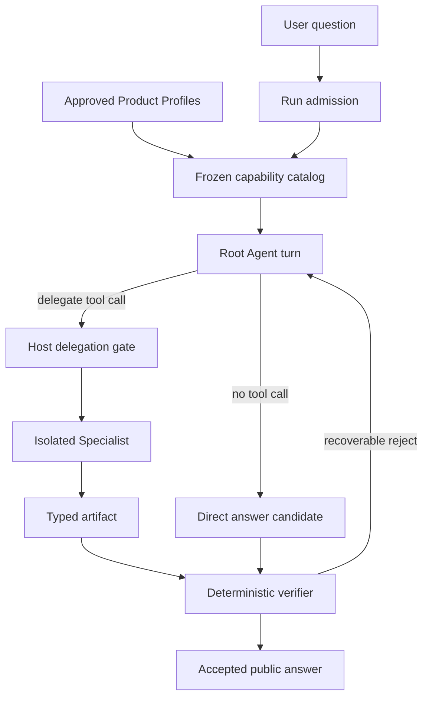
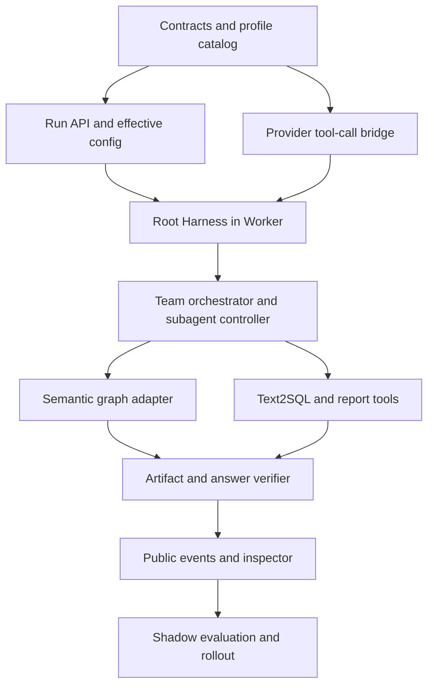
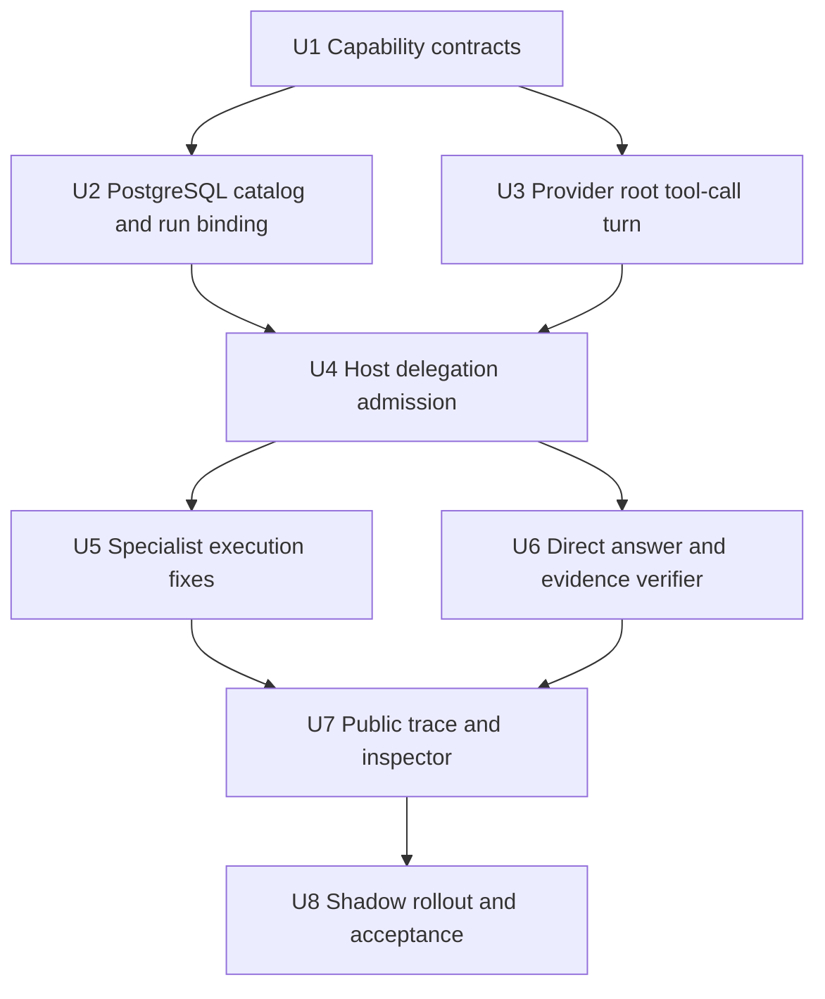

# refactor: 主 Agent 模型驱动的 Subagent Harness

## Summary

本计划移除 Q&A 主路径中“正则关键词分类 → 固定 Profile 映射”的权威路由，让主 Agent 像使用工具一样
自主决定是否调用 Semantic Management、Text2SQL、Report Writing 等 Subagent。每个 Subagent 继续使用
现有不可变 Product Profile 作为唯一身份，并在同一 Revision 中增加一份面向主 Agent 的内部能力描述：说明它擅长什么、
何时使用、输入输出 Artifact、只读/写入边界及不可做事项。该描述不是 A2A Agent Card，也不引入外部
协议、远程 Agent 发现或微服务通信。

实现参考 DeepSeek Harness 的内核：Provider 可见的是稳定的通用委派工具，主 Agent 在运行时传入
`profile_id + objective + requested_artifacts`；Profile 只定义 Worker 身份和能力上限，每次调用的目标、
上下文、权限与预算由独立合同表达；Host 对每次工具调用执行准入、收窄、持久化和验收。主 Agent 不调用
任何 Subagent 时，可直接生成回答；但涉及 Workspace 事实、语义图、数据库数据、正式报告或治理动作时，
直接回答必须携带相应受治理证据，否则 Host 拒绝把它作为已验收答案。

最终要修复的可见行为是：面对“我让你回复的是表之间的依赖关系，不是多少张表”，模型应看到 Semantic
与 Text2SQL 的能力描述，自主选择 Semantic Management Agent，并由它读取冻结 Published Semantic Release
的 relationship graph 形成证据；不得再因“多少”命中 Text2SQL，也不得回落到固定 table-count SQL。

---

## Problem Frame

当前 Q&A 路由并非 Agent 自主决策。`packages/platform/src/runs/agent-dispatch-planner.ts` 先用正则将原始问题
归入五种 `AgentQuestionClass`，再由 `selectedIds()` 将类别固定映射为 Profile。词语“多少”属于
`DATA_QUERY` 信号，而“表之间的依赖关系”不在 Semantic 规则中，因此错误选择 Text2SQL。问题进入 Worker
后，`apps/worker/src/teams/production-team-tools.ts` 又将非趋势请求固定编译为 table-count SQL，进一步把
一次路由误判变成“14 张表”的错误答案。

这不是补一个“依赖关系”关键词就能解决的问题。继续扩充关键词表会造成同义表达、上下文纠正、多意图问题和
新 Profile 上线都依赖发版；而一个没有 Host 约束的“纯 LLM Router”又会把权限、预算、Artifact 依赖和发布
边界交给概率模型。目标结构必须同时满足两点：选择是模型驱动的，执行准入是确定性的。

### 目标行为模式

| 模式 | 主 Agent 行为 | Host 验收依据 | 示例 |
|---|---|---|---|
| 直接回答 | 不调用 Subagent，直接输出 | 不声称新的受治理事实，或答案中的事实已有冻结证据 | “什么是同比？” |
| 单 Subagent | 调用一次 `delegate_to_subagent` | Profile 可用、权限/预算收窄、所需 Artifact 被接受 | “读取语义图说明表依赖” |
| 多 Subagent | 先后或并行调用多个 Subagent | Artifact 输入输出兼容、DAG 无环、每个结果独立验收 | “查询销售数据并生成报告” |
| 无可用能力 | 直接回答通用部分，或明确能力缺失/请求澄清 | 不伪造 Workspace/数据库/语义证据 | “做尚未安装的归因分析” |

---

## Requirements

- R1. Q&A 权威路径不得依据关键词、正则或固定 `question_class → profile_id` 映射决定 Subagent；
  `classifyAgentQuestion()` 只能在 Shadow 评估期作为旧基线使用，退出期后删除。
- R2. 主 Agent 必须通过模型原生工具调用选择 Subagent；Provider 响应中的 tool call 是候选决定，Host
  验证通过后才成为可执行委派。
- R3. Provider 可见工具面保持稳定，使用一个通用 `delegate_to_subagent@1`，而不是为每个 Profile 动态
  增删顶层 Tool Schema。可用 Profile 清单作为 Run 冻结的能力目录进入当前任务上下文。
- R4. 每个 Product Profile Revision 内含 `SubagentDiscoveryDescriptor`：稳定 ID、名称、描述、适用/不适用
  场景、示例、输入/输出 Artifact 类型和只读性摘要。Root 只看到由该 Revision 投影出的 Catalog Item，
  不新增第二套 Capability Profile Authority。Profile ID 是受格式和注册表约束的稳定字符串，不再是三个
  Specialist 的代码枚举；三个现有角色只是初始注册数据。
- R5. 能力描述只用于模型发现，不能自行授权。真实权限仍来自已批准 Product Profile、Workspace RBAC、
  `TaskCapabilityReceipt`、Tool Allowlist、SQL Firewall、Semantic Authority 和 Artifact Verifier。
- R6. Run 创建时冻结“主 Agent + 当前 Principal 可见的 Subagent 能力目录”，不预先冻结已选中的 Specialist；
  Specialist 的精确 Revision/Hash 在 Host 接受对应工具调用时再绑定到 Delegation Receipt。
- R7. 不调用 Subagent 是一等合法结果。主 Agent 可直接回答通用知识、解释、总结和已有上下文推理；
  “无法可靠选出 Agent”本身不等于无法回答。
- R8. 直接回答不得把受治理事实作为无来源的 accepted section。语义图、数据库、正式 QueryEvidence、报告
  或治理动作必须通过 `ARTIFACT_FACTS` 引用匹配的已接受证据；否则 Host 拒绝该 section、重试选择或返回
  能力缺失。普通 `GENERAL_TEXT` 的事实质量属于模型评测，不伪装成确定性证据保证。
- R9. Profile、每次任务、能力授权、上下文请求和调度策略必须分离；每次调用只能收窄 Profile 上限，不能扩权。
- R10. Semantic Management Agent 的只读能力必须真正接入现有 Semantic Explorer/relationship graph 端口，
  不得继续返回“已读取 Published Semantic Release”的静态说明。
- R11. Text2SQL 必须消费主 Agent 传入的明确任务和冻结语义上下文；不得根据趋势之外的默认分支生成
  table-count SQL。Report 只能消费已接受的 QueryEvidence/Analysis Artifact。
- R12. Verifier 必须校验“用户意图 → 主 Agent 决定 → 工具调用 → Specialist Artifact → 最终回答引用”的
  完整链，不得用全维度硬编码 PASS 代替实际验证。
- R13. 对外只展示公开选择摘要、Profile/Skill、工具状态与 Artifact 引用；不展示主 Agent 或 Subagent 的
  私有推理、系统提示、凭据和原始 Provider Payload。
- R14. 保持 PostgreSQL Authority、不可变 Revision/Hash、Run Lease/Fence、幂等重放和当前深度 1 的委派边界。

---

## Scope Boundaries

- 不实现 A2A，不新增 `/.well-known/agent-card.json`、JSON-RPC/gRPC/HTTP Agent Server、远程 Agent Registry、
  A2A Task/Message/Artifact 协议、JWS Card 签名或 A2A TCK。
- 不把三个 Specialist 拆成网络微服务；v1 继续使用当前 Worker 内部的 Mastra/Agent Runtime Adapter。
- 不允许任意第三方或用户输入直接成为 Subagent 能力描述。能力目录来自已批准、版本化的服务端注册表。
- 不让主 Agent自行修改 Profile、工具白名单、模型绑定、预算、Semantic Release 或发布权限。
- 不增加递归委派；Root depth 0 可以调用 Specialist depth 1，Specialist 不再调用其他 Specialist。
- 不在本计划重写 Semantic Graph、SQL Compiler、Report Renderer 的领域模型；只补齐委派入口与当前错误的
  Semantic graph read/Text2SQL 默认 SQL 路径。
- 不承诺模型每次都选择同一 Agent；确定性要求落在可用能力快照、Host 准入、证据验收和可重放结果上。

### Deferred to Follow-Up Work

- 跨进程或跨组织 Agent 互操作；若将来需要，再以独立 A2A Adapter 项目实现。
- 动态安装/市场发现任意 Subagent；本计划只支持 Workspace 已批准的内部 Profile。
- Profile 自动生成、在线学习、基于用户反馈自动改写描述或 Prompt。
- depth > 1 的递归 Subagent、动态 Fleet 和可写并行 Agent 调度。

---

## Context & Research

### Current Repository Evidence

- `packages/platform/src/runs/agent-dispatch-planner.ts` 的 `classifyAgentQuestion()` 与 `selectedIds()` 是当前
  错误选择的直接原因；`DATA_QUERY` 中包含“多少”，Semantic 仅覆盖“指标定义/口径/公式/语义层”等词。
- `packages/contracts/src/agents/dispatch.ts` 将 `question_class`、固定 Specialist 枚举、Report 的
  Text2SQL 依赖和 DIRECT=EXPLANATION 固化进权威合同，运行时无法表达“模型决定直接回答或调用 Profile”。
- Q&A Run API 在 Worker 执行前创建完整 `dispatch_plan`，因此当前顺序根本没有给主 Agent 一次选择机会。
- `apps/worker/src/providers/run-bound-provider-dispatcher.ts` 当前发送 `tool_allowlist: []`、
  `max_tool_calls: 0`；即使 Provider Transport 能返回 `tool_calls`，主 Agent 也无法调用委派工具。
- `packages/agent-runtime/src/tools/registry.ts` 已有 Server-owned Tool Registry，
  `packages/agent-runtime/src/teams/team-orchestrator.ts` 与
  `packages/agent-runtime/src/mastra/subagent-controller.ts` 已有委派授权、深度、预算、Artifact 和持久化 Handoff
  边界，适合复用而不是重造 Router 服务。
- `packages/contracts/src/agents/profile-registry.ts` 的 Product Profile 已冻结 Prompt、Workflow、Model、Tool、
  Context、Safety、Artifact 与 Verifier 引用；它是执行身份，不应复制成第二份 Authority。
- `apps/worker/src/teams/direct-answer-executor.ts` 已能走真实 Provider 直接回答，但只接受预先分类为
  EXPLANATION 的 DIRECT Plan；它应收敛为主 Agent Harness 的“无工具最终回答”分支。
- `apps/worker/src/teams/production-team-tools.ts` 的 Semantic 工具返回静态 Artifact，Text2SQL 的默认路径
  生成 table-count SQL；仅改路由而不改这两点仍无法修复用户看到的答案。

### DeepSeek Harness Reference

参考固定提交 `DeepSeek-Reasonix@668cdee703680530901c67ff3908a95b720ad0d2`，只采用以下结构思想：

- `task(profile=..., prompt=...)` 是主模型主动调用的稳定工具，而不是关键词 Router 自动派发。
- Profile 描述 Worker 如何思考及能力上限；一次调用的 `TaskSpec`、`CapabilityGrant`、`ContextRequest`、
  `SchedulerPolicy` 分离，调用参数只能收窄 Profile 的工具权限。
- 子 Agent 运行在隔离上下文中，父 Agent 只接收最终结果/稳定引用；Host 对工具调用逐次做权限与沙箱门禁。
- 能力目录与真实工具 Registry 分层；模型决定是否委派，Host 从真实动作建立验证义务。
- Provider 可见工具 Schema 保持稳定，动态 Inventory 不要求每次改写顶层 Tool Schema。

本项目不照搬 Reasonix 的 Skill 文件、文件系统写入租约、CLI、MCP 动态发现、递归深度或 Go Runtime；
只把上述 Harness 边界映射到现有 Product Profile、PostgreSQL Authority、Worker、Mastra Bridge 和 Artifact
体系。

---

## Key Technical Decisions

| 决策面 | 选择 | 理由 |
|---|---|---|
| 路由权 | 主 Agent 通过 tool call 选择，Host 验证 | 消除关键词固定映射，同时不把权限交给模型 |
| Tool 形态 | 一个稳定 `delegate_to_subagent@1` | Profile 增删不改变 Provider Tool Schema，利于缓存、版本和兼容 |
| 能力描述 | Product Profile 内嵌 `SubagentDiscoveryDescriptor`，运行时投影 Catalog Item | 增加可发现语义，不复制执行 Authority |
| Run 冻结点 | Run 创建冻结 eligible profile catalog；Worker 冻结 accepted selection | 选择前不预判 Specialist，选择后仍可精确重放 |
| 直接回答 | 主 Agent 无 tool call 的正常完成 | “不委派”是自主选择，不是 Router 异常 |
| 直接回答门禁 | 结构化 answer sections + 消息/Artifact 引用 + 服务端渲染 | 不用关键词猜是否可直答，也不允许模型自由拼接受治理事实 |
| 多 Agent 依赖 | Artifact 类型驱动、Host 构建 DAG | 去掉固定 Profile ID 依赖，但保留 Report 必须消费 accepted Evidence |
| Profile 权限 | Profile ceiling ∩ Workspace/RBAC ∩ per-call request | 主 Agent 只能提出更窄请求，不能扩权 |
| 选择解释 | 公开 `selection_summary` 枚举/短句，禁止 CoT | 可审计且不泄露私有推理 |
| A2A | 明确排除 | 这是内部 Harness 重构，不是外部互操作项目 |

### 为什么不采用其他方案

| 方案 | 结论 | 原因 |
|---|---|---|
| 增加更多关键词 | 拒绝 | 同义词、纠正语境和新 Profile 会持续产生规则洞，仍需发版维护 |
| 单独 LLM Router 再固定执行 | 拒绝 | 多一次模型调用和新状态，Router 与真正主 Agent 上下文容易漂移 |
| 每个 Subagent 一个动态顶层 Tool | 暂不采用 | Profile Inventory 变化会改变 Tool Schema；三个 Agent 尚可，但扩展性与缓存较差 |
| 模型直接执行 Profile，无 Host 准入 | 拒绝 | 无法保证 RBAC、预算、Artifact、幂等和发布边界 |
| 内部 Profile + 稳定委派工具 + Host Gate | 采用 | 最贴合 DeepSeek Harness，也最大化复用现有 Team Runtime |

---

## High-Level Technical Design

### 运行时交互



### 单轮决策协议

1. Web/API 只做服务端鉴权、Effective Config 解析，并冻结当前 Run 可见的
   `SubagentCapabilityCatalogSnapshot`；不调用关键词 classifier，不预选 Specialist。
2. Worker 给 Root Agent 一次真实 Provider turn。模型看到用户问题、必要的安全上下文、能力目录，以及稳定
   `delegate_to_subagent@1` Tool Schema。
3. 模型可以：
   - 返回由 `GENERAL_TEXT|ARTIFACT_FACTS` sections 组成的 `final_answer`；或
   - 发起一个或多个委派工具调用，参数包含 `profile_id`、`objective`、`requested_artifact_types`、可选
     `input_artifact_refs` 和更窄的预算请求。
4. Host 根据冻结目录解析 Profile Revision，验证生命周期、RBAC、工具/资源上限、上下文、Artifact 兼容和
   幂等键，提交 `SubagentDelegationReceipt` 后才启动子任务。
5. Specialist 只接收自己需要的 Context Projection 与 Task Envelope，产出类型化 Artifact；Verifier 接受后，
   结果以稳定引用回到 Root Agent。
6. Root Agent 基于已接受 Artifact 生成最终答案。Host 验证所有受治理事实都有 Artifact 引用，随后公开答案和
   脱敏活动事件。

### 核心合同边界

借鉴 DeepSeek Harness 的五段分离，但使用本项目术语：

- `SubagentDiscoveryDescriptor`：同一 Product Profile 中“谁适合做什么”的模型可见投影元数据。
- `RootAgentDecisionCandidate`：本轮选择直接回答还是调用哪些 Profile；它只是模型输出。
- `TaskEnvelope`：某次委派具体要完成的 objective、结果合同和输入 Artifact。
- `TaskCapabilityReceipt`：Workspace/RBAC、Profile ceiling 与 per-call request 的确定性交集。
- `ContextProjection + SchedulerPolicy`：子任务从什么安全上下文开始、在何种预算/并发/深度下运行。

`SubagentDiscoveryDescriptor` 不包含可执行 Prompt 正文、Credential、SecretRef 或可由模型修改的授权。
它与 Product Profile 的 Prompt/Tool/Model/Policy 引用一起进入同一个 Revision/Hash；Catalog 只投影安全字段，
Host 仍从原 Product Profile Revision 解析真正执行配置。

### 直接回答不是“路由失败”

Root Provider 的结构化响应支持两类候选：

```ts
type RootAgentTurnCandidate =
  | {
      kind: "FINAL_ANSWER";
      sections: Array<
        | {
            kind: "GENERAL_TEXT";
            text: string;
            basis: "GENERAL_KNOWLEDGE" | "PROVIDED_CONTEXT";
            source_message_refs: string[];
          }
        | {
            kind: "ARTIFACT_FACTS";
            artifact_ref: ArtifactReference;
            fact_selectors: string[];
          }
      >;
      public_summary: string;
    }
  | {
      kind: "TOOL_CALLS";
      tool_calls: DelegateToSubagentCall[];
      public_summary: string;
    };
```

Host 不需要先判断问题属于 EXPLANATION。最终文本由服务端按 `sections` 渲染：`ARTIFACT_FACTS` 只能从已接受
Artifact 的允许字段选择并生成引用；`PROVIDED_CONTEXT` 必须引用当前 Run 可见的用户消息；Root 的首轮直接回答
上下文不包含原始数据库行、Semantic Graph 或其他未形成 Artifact 的 Workspace 事实。`GENERAL_TEXT` 仍是普通
模型回答，系统不会虚构“确定性语义理解器”来证明其中每句话都正确；它的质量由模型评测负责，不能冒充受治理
事实。第一次候选因缺证据被拒绝时，Host 将结构化 `EVIDENCE_REQUIRED` 反馈给 Root Agent，允许在预算内改为
调用 Specialist；不能无限重试。

---

## System-Wide Impact



- Contracts：由“运行前完整 Dispatch Plan”改为“能力快照 + 运行中候选决定 + Host Admission Receipt”。
- Persistence：PostgreSQL 继续是 Profile 与 Run Authority；需要持久化 Catalog Snapshot、Root Decision、
  Delegation Receipt 和选择后精确绑定。
- Provider：开启一个稳定的委派 Tool Schema 和有限 tool-call budget，并让持久化 Transport 的 tool calls
  真正进入 Root Harness。
- Runtime：Root Turn 成为 Worker 的第一阶段；现有 Team Orchestrator/Subagent Controller 负责执行已准入调用。
- Specialist：Semantic read 接入真实 relationship graph；Text2SQL 删除默认 table-count 编译分支。
- Verification：从“预分类即授权”转为验证模型候选、工具调用、Artifact 与最终答案证据链。
- UI/Operations：展示公开选择摘要、Profile Revision、工具与 Artifact，不显示私有推理。

---

## Implementation Units



### U1 — 建立内部 Subagent Capability 与 Root Decision 合同

**Goal**

用内部 Harness 合同替代 A2A/Card 概念和固定 `AgentQuestionClass`，明确 Profile、调用任务、授权、上下文与
调度的边界。

**Requirements**：R3、R4、R5、R7、R8、R9、R14

**Dependencies**：无

**Files**

- 新增 `packages/contracts/src/agents/subagent-capability.ts`
- 修改 `packages/contracts/src/agents/profile-registry.ts`
- 修改 `packages/contracts/src/agents/dispatch.ts`
- 修改 `packages/contracts/src/agents/team-trace.ts`
- 修改 `packages/contracts/src/agents/index.ts`
- 修改 `packages/contracts/src/runs/effective-config.ts`
- 新增 `packages/contracts/test/subagent-capability.spec.ts`
- 修改 `packages/contracts/test/agent-dispatch.spec.ts`
- 修改 `packages/contracts/test/agent-product-profile.spec.ts`
- 修改 `packages/contracts/test/agent-team-public-trace.spec.ts`

**Approach**

1. 将现有 Product Profile Revision 升级为 v2，在其中增加 `SubagentDiscoveryDescriptor`，包含：
   - `profile_id`（沿用 Product Profile 的稳定 ID，不另建身份）；
   - `display_name`、`description`、`when_to_use`、`when_not_to_use`、`examples`；
   - `accepted_input_artifact_types`、`produced_artifact_types`；
   - `read_only` 等公开摘要；Tool/Model/Context/Budget ceiling 仍只存在于 Product Profile 的权威字段中。
2. 将 `agentSpecialistProfileIdSchema` 的三值枚举替换为格式受限的 `agentProfileIdSchema`，并删除
   `agentProductProfileListResultSchema.max(3)`、`profileOrder` 等代码级全集假设。允许数量由 Workspace/Run
   policy 控制，身份有效性由已批准 Registry 决定；内置三角色继续作为 materialized seed profiles。
3. 从已批准 Product Profile Revision 投影 `SubagentCapabilityCatalogSnapshot`，按稳定 ID 排序并绑定
   Workspace、Principal、Run、Policy 和 Hash。
   Catalog 只收录已 ENABLED、APPROVED 且 Principal 可调用的 Profile。
4. 将 `AgentDispatchPlan` v1 拆为：
   - `RootAgentDecisionCandidate`：Provider 输出，未授权；
   - `AgentDispatchAdmissionReceipt@2`：Host 接受的 DIRECT 或 TEAM 决定；
   - `SubagentDelegationReceipt`：每次调用的精确 Profile/Task/Capability/Context/Artifact/幂等绑定。
5. DIRECT 不再要求 `question_class=EXPLANATION`，而是要求 answer sections 与 evidence policy 相符。
6. 依赖关系由 Artifact 类型表达。例如 Report Profile 声明输入 `QueryEvidence|AnalysisReport`，Host 只在存在
   已接受输入 Artifact 时准入，不在合同中硬编码 Text2SQL Profile ID。
7. 旧 `AgentQuestionClass` 与 v1 Plan 保留只读解析能力用于 Shadow/历史 Run 重放，不再用于新 v2 Run。

**Test Scenarios**

- Product Profile 未批准、已禁用或 Hash 不匹配时拒绝投影进 Catalog。
- 注册第四个已批准 Profile 无需修改 TypeScript enum 或 canonical order；非法 ID/超 Workspace policy 数量拒绝。
- Profile description/examples 超长、带 Credential/Prompt 正文或非法 Artifact 类型时拒绝。
- DIRECT candidate 可用于一般解释，不要求某个 question class。
- TEAM candidate 的 Profile 必须存在于同一冻结 Catalog，且请求 Artifact/预算不能超出 ceiling。
- Report 调用没有 accepted input Artifact 时准入失败；有兼容 Artifact 时不要求来源 Profile 的固定 ID。
- 历史 v1 Dispatch Plan 仍可读取和重放，新 v2 写入不产生 `question_class`。

**Verification**

- `pnpm --filter @data-agent/contracts test -- subagent-capability agent-dispatch agent-product-profile agent-team-public-trace`
- `pnpm --filter @data-agent/contracts typecheck`

### U2 — Product Profile 发现投影与两阶段 Run Binding

**Goal**

把 Run 创建时的冻结对象从“已选 Specialist”改为“可用能力目录”，并在 Worker 接受模型工具调用后持久化
精确选择，保证并发、重试和恢复不会漂移。

**Requirements**：R5、R6、R14

**Dependencies**：U1

**Files**

- 修改 `packages/platform/src/agents/postgres-agent-profile-registry.ts`
- 修改 `packages/platform/src/runs/postgres-agent-dispatch-authority.ts`
- 修改 `packages/platform/src/runs/agent-dispatch-planner.ts`
- 修改 `apps/web/src/app/api/workspaces/[workspaceId]/agent-profiles/route.ts`
- 新增 `apps/web/src/app/api/workspaces/[workspaceId]/subagent-capabilities/route.ts`
- 修改 `apps/web/src/app/api/workspaces/[workspaceId]/qa/conversations/[conversationId]/runs/route.ts`
- 修改 `infra/supabase/apps/data-agent/migration-sources/`
- 修改 `infra/supabase/apps/data-agent/migrations/`
- 修改 `packages/platform/test/agents/postgres-agent-profile-registry.spec.ts`
- 修改 `packages/platform/test/runs/postgres-agent-dispatch-authority.spec.ts`
- 修改 `packages/platform/test/runs/agent-dispatch-planner.spec.ts`
- 修改 `apps/web/test/agent-profiles-route.spec.ts`

**Approach**

1. 扩展现有不可变 Product Profile Revision/Head 持久化以支持 v2 discovery descriptor；Description 更新
   产生新的 Product Profile Revision，不原地修改已被 Run 引用的记录，也不新建平行 Head/Registry。
2. Run API 基于 Workspace RBAC、Profile 生命周期和有效配置生成 Catalog Snapshot，并写入 v2 Team Lease；
   Lease 此时只绑定 Root Profile 与 Catalog Hash，不包含预选 Specialist。
3. Worker 收到 Root tool call 后，通过 CAS/Lease Fence 提交 `AgentDispatchAdmissionReceipt@2` 和一个或多个
   Delegation Receipt；重复投递返回同一 Receipt，参数不同则报幂等冲突。
4. `agent-dispatch-planner.ts` 在 Shadow 阶段保留为 `legacyKeywordDispatchBaseline()`，仅写比较遥测，不再生成
   可执行 Admission。退出 Shadow 后删除它及相关 v1 写路径。
5. API 返回公开 Catalog View，不返回 Profile Prompt、SecretRef、内部 Tool 参数或治理授权原文。

**Migration and Compatibility**

- Product Profile v2 与 Run v2 所需的新列/表使用 forward-only migration；不改写历史 v1 Run。
- Worker 按 Lease schema version 分流：v1 Run 使用旧执行器完成或恢复，v2 Run 使用 Root Harness。
- 不 dual-write 两份 Authority；Shadow 比较结果写评估表/Artifact，只有 v2 Admission 可驱动 v2 执行。

**Test Scenarios**

- 同一 Run 的 Catalog Snapshot 在 Profile Head 后续更新后仍保持原 Revision/Hash。
- Principal 无权调用的 Profile 不进入 Catalog；前端伪造 profile_id 无效。
- Worker 重试相同 tool call 得到同一 Delegation Receipt；相同幂等键不同参数失败。
- v1 历史 Run 仍按旧 Binding 重放；v2 Run 在 Root 决定前没有 Specialist Task。
- Shadow classifier 的错误选择不会影响实际执行。

**Verification**

- `pnpm --filter @data-agent/platform test -- postgres-agent-profile-registry postgres-agent-dispatch-authority agent-dispatch-planner`
- `pnpm --filter web test -- agent-profiles-route`
- `pnpm dev:check`

### U3 — 打通 Root Agent 的真实 Tool-Calling Turn

**Goal**

让真实 Run-bound Provider 接收稳定委派 Tool Schema、返回工具调用，并保留“无工具直接回答”的同轮分支。

**Requirements**：R2、R3、R6、R7、R13

**Dependencies**：U1

**Files**

- 新增 `packages/agent-runtime/src/teams/root-agent-harness.ts`
- 新增 `packages/agent-runtime/src/teams/subagent-delegation-tool.ts`
- 修改 `packages/agent-runtime/src/tools/registry.ts`
- 修改 `packages/agent-runtime/src/mastra/mastra-execution-bridge.ts`
- 修改 `packages/agent-runtime/src/teams/index.ts`
- 修改 `apps/worker/src/providers/run-bound-provider-dispatcher.ts`
- 修改 `apps/worker/src/providers/production-run-bound-provider-dispatcher.ts`
- 修改 `apps/worker/src/providers/persisted-model-provider-transport.ts`
- 修改 `apps/worker/src/teams/data-agent-team-runner.ts`
- 新增 `packages/agent-runtime/test/root-agent-harness.spec.ts`
- 新增 `packages/agent-runtime/test/subagent-delegation-tool.spec.ts`
- 修改 `packages/agent-runtime/test/mastra-team-runtime.spec.ts`
- 修改 `apps/worker/test/providers/run-bound-provider-dispatcher.spec.ts`
- 修改 `apps/worker/test/providers/persisted-model-provider-transport.spec.ts`
- 修改 `apps/worker/test/teams/data-agent-team-runner.spec.ts`

**Approach**

1. 注册稳定 Server-owned Tool：

   ```json
   {
     "name": "delegate_to_subagent",
     "arguments": {
       "profile_id": "string",
       "objective": "string",
       "requested_artifact_types": ["string"],
       "input_artifact_refs": [],
       "requested_budget": { "max_steps": 0, "timeout_ms": 0 }
     }
   }
   ```

   Schema 不含动态 Profile enum；有效 ID 与描述来自冻结 Catalog 的模型可见 tail/context，避免 Inventory 变化
   改写 Provider-visible Tool Schema。
2. 为 Root Turn 注册独立响应 Schema，允许 Provider 返回最终答案或 tool calls。删除当前 Root 请求中的
   `tool_allowlist: []` / `max_tool_calls: 0`，改为严格单工具 allowlist 和有限调用预算。
3. `production-run-bound-provider-dispatcher.ts` 注入 `ServerOwnedToolRegistry` 与 Root 专用响应 schema；
   `persisted-model-provider-transport.ts` 的 tool call candidate 进入 Harness，而不是只存进 Provider Artifact。
4. Root System Instruction 只说明选择原则、必须使用 Catalog 中 Profile、可直接回答和证据要求；不得放关键词
   路由规则，也不得让能力描述成为新的隐藏 Prompt 脚本。
5. 支持 Provider 无工具调用能力的确定性失败 `ROOT_TOOL_CALLING_UNSUPPORTED`，不静默回到关键词 Router。
6. 将“同一 Turn 支持 tools + auto tool choice + 结构化最终输出 + tool result continuation”加入 Model Profile
   Certification；只有认证通过的 Root Model Profile 才能启用 v2 Harness。不同 Provider 若不能同时使用
   response schema 与 tools，Adapter 必须通过同一规范化 Root Turn 合同实现，不在业务层写 Provider 分支。

**Test Scenarios**

- Provider 返回普通文本/结构化 FINAL_ANSWER 时不创建 Specialist Task。
- Provider 调用 `delegate_to_subagent` 时，Transport 保留 call ID、参数、顺序和 usage，交给 Host Gate。
- Provider 调用未允许工具、非法 Profile、超预算、混合 final+tool call 时失败。
- Catalog Inventory 变化不改变 `delegate_to_subagent` 的 canonical Tool Schema Hash。
- 重放同一 Provider Artifact 不会二次执行工具调用。
- Provider Certification 能识别不支持 tool-result continuation 或 tools+structured-output 组合的模型。

**Verification**

- `pnpm --filter @data-agent/agent-runtime test -- root-agent-harness subagent-delegation-tool mastra-team-runtime`
- `pnpm --filter worker test -- run-bound-provider-dispatcher persisted-model-provider-transport data-agent-team-runner`
- `pnpm --filter worker typecheck`

### U4 — Host 委派准入、Task 构造与恢复

**Goal**

把模型 tool call 从“建议”转成受控 Subagent Task，复用现有 Orchestrator/Controller，并保证每次调用只能收窄
权限且可持久化恢复。

**Requirements**：R2、R5、R6、R9、R14

**Dependencies**：U2、U3

**Files**

- 修改 `packages/agent-runtime/src/teams/team-orchestrator.ts`
- 修改 `packages/agent-runtime/src/mastra/subagent-controller.ts`
- 修改 `packages/agent-runtime/src/teams/handoff.ts`
- 修改 `packages/agent-runtime/src/teams/context-projection.ts`
- 修改 `packages/agent-runtime/src/teams/tool-policy.ts`
- 修改 `apps/worker/src/teams/production-team-runtime.ts`
- 修改 `apps/worker/src/teams/mastra-profile-composition.ts`
- 修改 `apps/worker/src/teams/run-workflow-executor-router.ts`
- 修改 `apps/worker/src/run-worker-cli.ts`
- 修改 `packages/agent-runtime/test/team-orchestrator.spec.ts`
- 修改 `packages/agent-runtime/test/subagent-controller.spec.ts`
- 修改 `packages/agent-runtime/test/team-handoff.spec.ts`
- 修改 `packages/agent-runtime/test/context-compiler.spec.ts`
- 修改 `apps/worker/test/teams/production-team-runtime.spec.ts`
- 修改 `apps/worker/test/teams/mastra-profile-composition.spec.ts`

**Approach**

1. `RootAgentDecisionCandidate` 进入准入器后，按 Catalog Snapshot 解析精确 Product Profile Revision/Hash。
2. 构造现有 `TaskEnvelope`，把模型提供的 objective 作为任务目标；Profile 的 Prompt/Workflow/Tool policy
   来自 Authority，绝不接受模型参数覆盖。
3. 有效权限按以下交集计算：

   `Workspace/RBAC ∩ Run Effective Config ∩ Product Profile ceiling ∩ call request`

4. Context Projection 只包含问题、必要对话纠正、冻结 Release/Schema refs 和显式 input Artifact；不复制完整
   Root Transcript 或其他 Profile 私有上下文。
5. Host 按 tool loop 增量构建执行图：同一 Provider batch 只并行准入彼此独立、输入已存在的只读调用；有依赖
   的 Report 等调用必须等上游 Artifact accepted 后，由 Root 下一 Turn 携带其引用再发起。Host 不猜测未来
   Artifact，也不接受“先声明一个尚不存在的引用”。仍保持 max depth=1。
6. 子任务 completed 后只写结果候选；Verifier accepted 后才向 Root 返回可引用 Artifact。取消、超时、失败、
   Lease 丢失与重试沿用 Run Fence/Checkpoint。

**Test Scenarios**

- Root 请求 Profile 不允许的 Tool/Context/预算时只收窄或拒绝，绝不扩权。
- Semantic 与 Text2SQL 并行请求各自得到隔离上下文和 Tool Registry。
- Report 在 QueryEvidence accepted 前不启动；上游失败后下游取消并给 Root 结构化结果。
- 同一 batch 中携带尚未存在 QueryEvidence 的 Report 调用被拒绝；下一 Root Turn 引用已接受 Evidence 后可准入。
- depth 1 Specialist 尝试再次委派时被拒绝。
- Worker 崩溃后从已提交 Delegation Receipt 恢复，不重新请求模型选择或创建重复 Task。

**Verification**

- `pnpm --filter @data-agent/agent-runtime test -- team-orchestrator subagent-controller team-handoff context-compiler tool-policy`
- `pnpm --filter worker test -- production-team-runtime mastra-profile-composition run-workflow-executor-router`

### U5 — 修复 Semantic 与 Text2SQL Specialist 的真实执行路径

**Goal**

确保正确委派之后能得到正确领域证据，消除当前静态 Semantic 响应和默认 table-count SQL。

**Requirements**：R10、R11

**Dependencies**：U4

**Files**

- 修改 `apps/worker/src/teams/production-team-tools.ts`
- 修改 `apps/worker/src/teams/tools/semantic-management-tools.ts`
- 修改 `apps/worker/src/teams/tools/text2sql-tools.ts`
- 修改 `apps/worker/src/teams/tools/report-writing-tools.ts`
- 修改 `packages/agent-runtime/src/tools/semantic-explorer.ts`
- 修改 `apps/worker/src/semantic/semantic-explorer-tool-executor.ts`
- 修改 `packages/contracts/src/artifacts/semantic-explorer.ts`
- 修改 `apps/worker/test/teams/production-team-tools.spec.ts`
- 修改 `apps/worker/test/teams/profile-tool-isolation.spec.ts`
- 修改 `packages/agent-runtime/test/semantic-explorer-tools.spec.ts`
- 修改 `packages/platform/test/semantic/postgres-semantic-explorer.spec.ts`

**Approach**

1. Semantic Profile 的 `semantic.catalog.read` 替换为真实 Semantic Explorer Adapter，支持冻结 Release 内的对象、
   relationships、lineage/dependency 查询，并返回带 release/object/edge refs 的 `AnalysisReport` 或
   `SemanticGraphEvidence`。
2. 将“表之间的依赖关系”任务编译为 relationship/lineage 查询；读取业务语义关系与物理 lineage 时保持两者
   类型区分，不把表数量当依赖答案。
3. Text2SQL 编译输入必须包含 Root objective、Resolved Context 与 frozen release refs；删除
   `intent === TREND ? trendSql : tableCountSql` 默认逻辑。若编译器不能从任务形成 SQL，返回明确失败而不是
   固定查询。
4. Table count 保留为显式意图/测试 fixture，只有目标确实要求表数量时才调用相应编译能力。
5. Report Profile 只接受已 accepted Artifact refs，不从 Root 问题重新猜数或调用越权查询工具。

**Test Scenarios**

- “表之间的依赖关系”调用 Semantic relationship read，输出边/来源引用，不调用 Text2SQL/table-count。
- “数据库有多少张表”调用 Text2SQL/schema count 能力，返回 QueryEvidence。
- “销售趋势并生成报告”先产生 QueryEvidence，再由 Report 消费同一 Artifact。
- Semantic Release 缺失、过期或 relationship 索引未就绪时 fail closed，答案不声称已读取图。
- Profile 工具隔离继续成立：Semantic 无 SQL execute，Text2SQL 无 publish，Report 无查询/治理工具。

**Verification**

- `pnpm --filter worker test -- production-team-tools profile-tool-isolation`
- `pnpm --filter @data-agent/agent-runtime test -- semantic-explorer-tools`
- `pnpm --filter @data-agent/platform test -- postgres-semantic-explorer`

### U6 — 直接回答准入与端到端证据 Verifier

**Goal**

允许主 Agent 在不需要 Specialist 时直接回答，同时阻止无证据的 Workspace/语义/数据事实成为 accepted 答案。

**Requirements**：R7、R8、R12

**Dependencies**：U4

**Files**

- 修改 `apps/worker/src/teams/direct-answer-executor.ts`
- 新增 `apps/worker/src/teams/root-answer-verifier.ts`
- 修改 `packages/agent-runtime/src/teams/task-completion.ts`
- 修改 `packages/contracts/src/agents/team-trace.ts`
- 修改 `apps/worker/src/teams/data-agent-team-runner.ts`
- 修改 `apps/worker/test/teams/direct-answer-executor.spec.ts`
- 新增 `apps/worker/test/teams/root-answer-verifier.spec.ts`
- 修改 `packages/agent-runtime/test/task-completion.spec.ts`
- 修改 `apps/worker/test/teams/data-agent-team-runner.spec.ts`

**Approach**

1. `direct-answer-executor` 不再依赖预分类 EXPLANATION Plan，而是执行/接收 Root Harness 的 FINAL_ANSWER 候选。
2. Root Prompt 要求输出结构化 answer sections；Host 做消息引用校验、Artifact scope/hash/type/acceptance 校验、
   fact selector allowlist、mutation/report policy 和引用完整性校验，服务端从 sections 渲染最终文本。
3. 通用解释/用户提供文本总结可用 `GENERAL_TEXT`；涉及本 Workspace 的关系、数值、SQL 结果、报告、治理状态
   必须用 `ARTIFACT_FACTS` 并引用匹配类型。Root 首轮不接收未 Artifact 化的 Workspace 原始事实。
4. 不用新的关键词分类器判断答案主题。Verifier 依据模型声明、实际 Tool/Artifact 轨迹、输出合同与受治理
   claim/evidence 结构；要求 Root 将受治理事实放入带 source refs 的结构化 answer sections。
5. 证据不足时最多一次 `EVIDENCE_REQUIRED` 恢复 turn，让 Root 选择合适 Subagent；仍不足则明确失败/能力缺失，
   不降级为臆测回答。
6. 删除或替换任何无输入证据就生成全 PASS 的 Verifier 路径；每个维度必须来自可检查 Receipt/Artifact。

**Test Scenarios**

- “什么是同比”无 tool call 可 accepted。
- “总结我刚才贴的定义”用 GENERAL_TEXT 并引用对应 user message 可 accepted。
- 无 Artifact 回答“数据库有 14 张表”被拒绝并触发一次 evidence recovery。
- 无 SemanticGraphEvidence 回答“表 A 依赖表 B”被拒绝。
- 有 accepted Artifact 但 scope/run/hash 不匹配时拒绝。
- Agent Task completed 但 Artifact verifier FAIL/UNVERIFIED 时最终 Run 不能显示 accepted。

**Verification**

- `pnpm --filter worker test -- direct-answer-executor root-answer-verifier data-agent-team-runner`
- `pnpm --filter @data-agent/agent-runtime test -- task-completion`

### U7 — 公开活动流、Inspector 与 Profile 管理体验

**Goal**

让用户能看见主 Agent 选择了什么、调用了哪个 Specialist、基于哪些公开 Artifact 完成回答，同时保持私有
推理与配置不泄露。

**Requirements**：R4、R13

**Dependencies**：U5、U6

**Files**

- 修改 `packages/contracts/src/agents/team-trace.ts`
- 修改 `packages/platform/src/agents/postgres-agent-team-trace.ts`
- 修改 `apps/web/src/lib/qa-event-assembler.ts`
- 修改 `apps/web/src/components/qa/agent-team-trace.tsx`
- 修改 `apps/web/src/components/qa/qa-inspector.tsx`
- 修改 `apps/web/src/app/api/workspaces/[workspaceId]/runs/[runId]/team-trace/route.ts`
- 修改 `apps/web/src/app/api/workspaces/[workspaceId]/agent-profiles/route.ts`
- 修改 `apps/web/test/qa-event-assembler.spec.ts`
- 修改 `apps/web/test/agent-team-trace.spec.tsx`
- 修改 `apps/web/test/qa-inspector-component.spec.tsx`
- 修改 `packages/platform/test/agents/postgres-agent-team-trace.spec.ts`

**Approach**

1. 新增公开事件：`root_decision_started`、`subagent_selected`、`subagent_started/completed/failed`、
   `artifact_accepted/rejected`、`root_answer_completed`。事件使用 run/task/profile/artifact refs 关联。
2. `subagent_selected` 展示 Profile 名称、Product Profile Revision、公开 `selection_summary` 与 requested artifact；
   不展示 chain-of-thought、完整系统提示、Provider 原始参数或 Credential。
3. 直接回答显示“主 Agent 直接回答”，避免 UI 把无 Subagent 错标为“未路由/失败”。
4. Profile 管理页增加能力描述、适用/不适用、示例、I/O Artifact 和只读性；保存产生新的 Product Profile
   Revision，并经批准后才进入新 Run Catalog。
5. Inspector 同时展示 Catalog Snapshot、accepted Delegation Receipts、Artifact 验收和最终 answer sections，便于
   定位“模型选错”“Host 拒绝”“Specialist 执行错”三类问题。

**Test Scenarios**

- 直接回答、单 Agent、多 Agent、Agent 失败四种轨迹均能重放并正确折叠。
- UI 不渲染 Prompt、Credential、原始 Provider Payload 或私有 reasoning 字段。
- Profile Revision 更新只影响新 Run，旧 Run Inspector 仍显示冻结版本。
- 重复 SSE 事件由 assembler 幂等归并，不重复显示 Subagent 卡片。

**Verification**

- `pnpm --filter web test -- qa-event-assembler agent-team-trace qa-inspector-component`
- `pnpm --filter @data-agent/platform test -- postgres-agent-team-trace`
- 浏览器验证四种 fixture 轨迹和窄屏布局。

### U8 — Shadow 对比、回归评测、灰度与回滚

**Goal**

用可观测 Shadow 证明模型驱动 Harness 优于当前关键词映射，逐步切换执行权，并提供可恢复回滚路径。

**Requirements**：R1、R2、R10、R11、R12、R14

**Dependencies**：U7

**Files**

- 修改 `packages/platform/src/runs/agent-dispatch-planner.ts`
- 修改 `apps/worker/src/teams/run-workflow-executor-router.ts`
- 新增 `packages/evals/src/agent-routing/harness-routing-suite.ts`
- 新增 `packages/evals/src/agent-routing/harness-routing-oracle.ts`
- 新增 `packages/evals/test/harness-routing-suite.spec.ts`
- 修改 `apps/worker/test/integration/run-runtime.spec.ts`
- 修改 `docs/architecture/data-agent-team-profiles.md`
- 修改 `docs/runbooks/data-agent-team-operations.md`

**Approach**

1. 建立固定评测集，至少覆盖：同义改写、否定/纠正、多轮上下文、多意图、一般解释、语义图关系、表数量、
   数据查询+报告、能力缺失、恶意诱导扩权。
2. Shadow 模式只比较 `legacy keyword baseline` 与 Root Harness candidate，实际仍执行旧路径；记录选择差异、
   直接回答率、证据拒绝率、恢复率、延迟、token/tool-call 数，不让 Shadow 结果影响用户答案。
3. 首个硬性 Gate 包含用户原始反例：
   - 输入：“我让你回复的是表之间的依赖关系，不是多少张表”；
   - Root accepted decision：Semantic Management Agent；
   - 必须出现 relationship graph read 与 frozen release evidence；
   - 必须没有 Text2SQL/table-count tool call；
   - 最终答案引用依赖边证据。
4. 灰度顺序：`SHADOW` → `ENFORCED_INTERNAL`（内部 Workspace）→ `ENFORCED_PERCENT` → `ENFORCED_DEFAULT`。
   每阶段以错误 accepted evidence 为零、无权限扩张、恢复/重放通过和关键路由集通过为前提。
5. 回滚只切回 v1 executor 处理新建 Run；已开始的 v2 Run 继续使用冻结 Catalog/Receipt 完成或安全失败，避免
   中途改变选择。删除关键词 Router 必须等默认期稳定且所有 v1 active Run 归零。
6. Runbook 增加三段诊断：Root 决定、Host Admission、Specialist/Artifact；明确不能再靠 `question_class`
   判断真实执行路径。

**Acceptance Matrix**

| 问题 | 允许的主 Agent 结果 | 必须出现 | 禁止出现 |
|---|---|---|---|
| 什么是同比？ | 直接回答 | GENERAL_TEXT section | 强制 Text2SQL |
| 表之间有哪些依赖关系？ | Semantic 委派 | graph/release evidence | table-count SQL |
| 我让你说依赖，不是多少张表 | Semantic 委派并遵循纠正 | conversation correction + graph evidence | 因“多少”选 Text2SQL |
| 数据库有多少张表？ | Text2SQL/Schema 委派 | QueryEvidence | 无证据直接给数字 |
| 查询月度销售趋势并写报告 | Text2SQL → Report | accepted QueryEvidence → Report | Report 先于 Evidence |
| 做归因分析（能力未安装） | 通用说明或能力缺失 | honest limitation | 冒充已执行归因 |

**Verification**

- `pnpm --filter @data-agent/evals test -- harness-routing-suite`
- `pnpm --filter worker test -- run-runtime run-workflow-executor-router`
- `pnpm --filter web test`
- `pnpm dev:check`
- 每个实施单元提交前运行 `git diff --cached --check`，只暂存本单元 owned paths。

---

## Failure and Recovery Cases

| 故障 | 行为 | 恢复 |
|---|---|---|
| Root Provider 不支持 tool calls | Run 失败并标记 capability unsupported | 切换已认证模型；不回退关键词 Router |
| Root 选择 Catalog 外 Profile | Host 拒绝候选 | 给 Root 一次结构化可用目录反馈 |
| Root 直接回答但缺证据 | Verifier 返回 `EVIDENCE_REQUIRED` | 一次恢复 turn，可改为委派 |
| Product Profile Revision 失效 | 已冻结 Run 继续用原批准 Revision；新 Run 不再可见 | 禁用 Head，不篡改历史 Revision |
| Specialist 超时/失败 | Task failed，依赖下游不启动 | 在原 Delegation Receipt/预算内重试 |
| Worker 重启 | 从 Lease、Root Decision、Delegation Receipt 与 Artifact 状态恢复 | 不重复模型选择，不重复提交 Artifact |
| Artifact completed 但未 accepted | 不回传 Root 作为事实 | Verifier 修复/重试，或明确失败 |
| 多 Tool Calls 部分成功 | 保留已 accepted Artifact，其余按 DAG 处理 | Root 基于可用结果回答或声明部分失败 |
| Profile 描述诱导越权 | 描述只作元数据，Host 权限交集拒绝 | 下线/修订 Product Profile Revision |
| v2 灰度异常 | 停止创建 v2 Run | 旧 v2 Run按冻结状态收尾，新 Run 切 v1 |

---

## Security, Reliability, and Performance

### Security

- Discovery Descriptor 是 Product Profile 内的受治理元数据，不是系统 Prompt；字段长度、字符、来源和审批
  受限，防止描述注入。
- Model tool call 永远是候选。Host 从服务端 Registry 解析执行身份，不信任模型提交的 Tool、Prompt、Model、
  SecretRef、Release 或权限字段。
- Profile ceiling 与 per-call request 取交集；任何缺失/解析失败都 fail closed。
- 语义读、SQL 执行、报告和治理继续走各自 Authority；Semantic Agent 不获得 Publish，Text2SQL 不绕过 Firewall。
- 公开事件只含摘要和引用，遵循现有 public projector/redaction 边界。

### Reliability

- Root decision、Delegation 和 Artifact 都有 idempotency key、Revision/Hash、Lease/Fence 和终态。
- Provider 原始 tool call Artifact 与 Host Admission Receipt 分离，便于判断“模型提议”和“系统实际执行”。
- v1/v2 按 Run schema version 恢复，不在一次 Run 内切换执行器。
- Evidence recovery 有严格次数/时间/token 上限，避免 Root 在 direct 与 delegation 间循环。

### Performance

- 不新增独立 Router 模型调用：直接回答只需一个 Root Turn；委派路径沿同一 Root tool loop 在 Specialist
  返回 Artifact 后继续下一 Turn 生成最终答案。
- 通用 Tool Schema 固定；Catalog 描述做长度上限和按 Run 可见性裁剪，避免 Profile 增长无限占用 Context。
- 多只读 Specialist 仅在无 Artifact 依赖且并发预算允许时并行；写入/治理继续串行。
- Shadow 期测量相对 v1 的 p50/p95 延迟、输入 token、Provider calls、Subagent calls 和直接回答率，再决定灰度。

---

## Testing Strategy

### Contract and Property Tests

- Catalog canonical ordering/hash、Revision immutability、Profile ceiling 交集、DAG 无环、Artifact 类型兼容。
- 对随机非法 tool calls 验证 Host 永不扩权、永不执行 Catalog 外 Profile。
- Provider Tool Schema Snapshot 测试，保证 Profile Inventory 变化不改变 canonical schema。

### Runtime Integration Tests

- 真实 Provider fixture → tool call → Host Admission → Subagent → Artifact → Root final 的完整双 turn。
- 无 tool call 的直接回答只执行一次 Provider，不创建 Team Task。
- 恢复测试覆盖 Provider 调用后崩溃、Admission 后崩溃、Artifact commit 后崩溃和 SSE 重放。

### Domain Acceptance Tests

- Semantic relationship、Text2SQL table count、Text2SQL+Report 三条真实 PostgreSQL/Worker 路径。
- Profile Tool Isolation 和 Semantic Published Release 固定验证。
- 受治理事实无 Artifact、错 Scope Artifact、过期 Revision 和未 accepted Artifact 均 fail closed。

### UI and Public Evidence Tests

- 公开 Trace 与 Inspector 使用持久化 fixture，不伪造成功状态。
- 事件顺序、重复 SSE、刷新恢复、折叠状态、窄屏和脱敏快照。

---

## Rollout Gates and Success Criteria

只有同时满足以下条件，才能把 `ENFORCED_DEFAULT` 设为默认：

1. 固定 Harness Routing Suite 全部关键案例通过，尤其是“依赖关系而非表数量”反例。
2. Protected Suite 中不存在“无匹配 accepted Artifact 却接受 Workspace/数据/语义事实”的结果。
3. 所有 accepted Subagent 执行都可回溯到冻结 Catalog、Product Profile Revision、Admission Receipt、
   TaskCapabilityReceipt 和 Artifact Verifier。
4. Shadow/灰度未发现权限扩张、重复执行、Run 恢复漂移或跨 Workspace Artifact 引用。
5. Semantic relationship 路径读取真实冻结 graph；Text2SQL 不再有通用 table-count 默认分支。
6. UI 能区分直接回答、模型选择、Host 拒绝、Specialist 失败与 Artifact 拒绝，且无私有信息泄露。
7. v1 回滚开关经过演练；切换不会改变已开始 v2 Run 的冻结执行身份。

---

## Documentation Updates

- `docs/architecture/data-agent-team-profiles.md`：补充 Root Harness、能力目录、通用委派工具、五段边界和
  direct-answer 规则；明确不属于 A2A。
- `docs/runbooks/data-agent-team-operations.md`：从固定三 Profile 健康检查升级为 Catalog/Root Decision/
  Admission/Specialist/Artifact 分段诊断和灰度回滚。
- API 文档：记录 `subagent-capabilities` 的公开字段、Revision 生命周期和脱敏规则。
- 删除/标记过时的 `question_class` 路由说明；历史 v1 只保留兼容与重放说明。

---

## Commit Strategy

本仓库存在并行改动。实施时每个 U-ID 使用独立 scoped commit，开始前记录 owned paths，禁止 `git add -A`，
不得包含 `.next`、`tsbuildinfo`、Falcon artifacts 或其他 Trellis 任务文件。建议提交顺序：

1. `refactor(contracts): define model-driven subagent decisions`
2. `feat(platform): persist subagent capability catalogs`
3. `feat(worker): enable root agent delegation tool calls`
4. `refactor(runtime): admit model-selected subagent tasks`
5. `fix(worker): execute semantic relationships and requested sql`
6. `feat(worker): verify direct answers against evidence`
7. `feat(web): expose public subagent selection traces`
8. `test(evals): gate model-driven harness rollout`

每次提交只在相关验证通过后创建，并先运行 `git diff --cached --check`。

---

## Final Planning Boundary

本文件是修改方案，不授权实现。执行开始后必须按 U1→U8 的依赖推进；不得把 A2A、远程 Agent、任意动态
Profile 安装或递归委派带入本次范围。若实现中发现现有 Provider 无法可靠返回 Tool Calls，唯一硬阻塞是
“缺少一个通过认证、支持所需结构化 Tool Calling 的 Root Model Profile”；不得以恢复关键词 Router 冒充完成。
