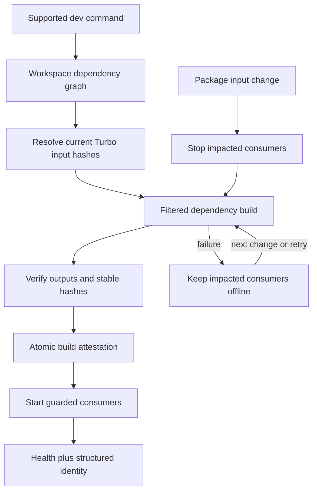
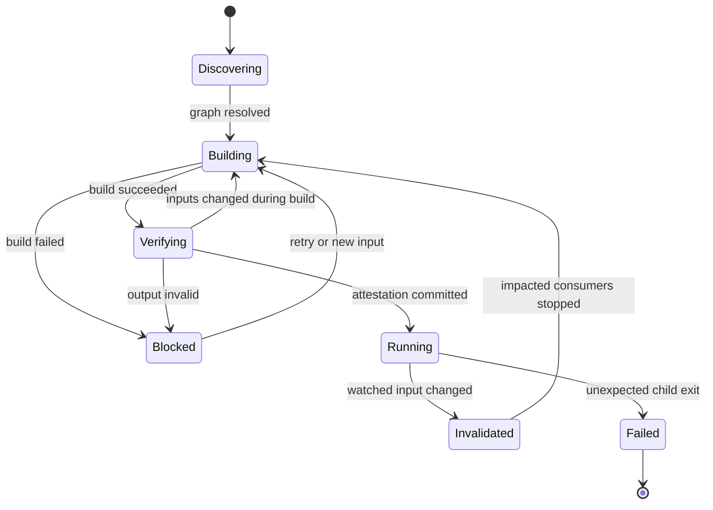
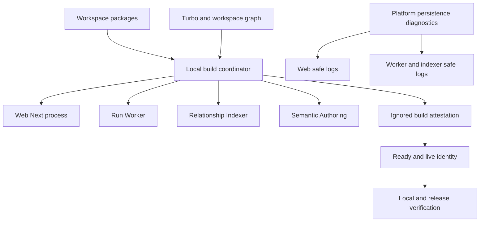
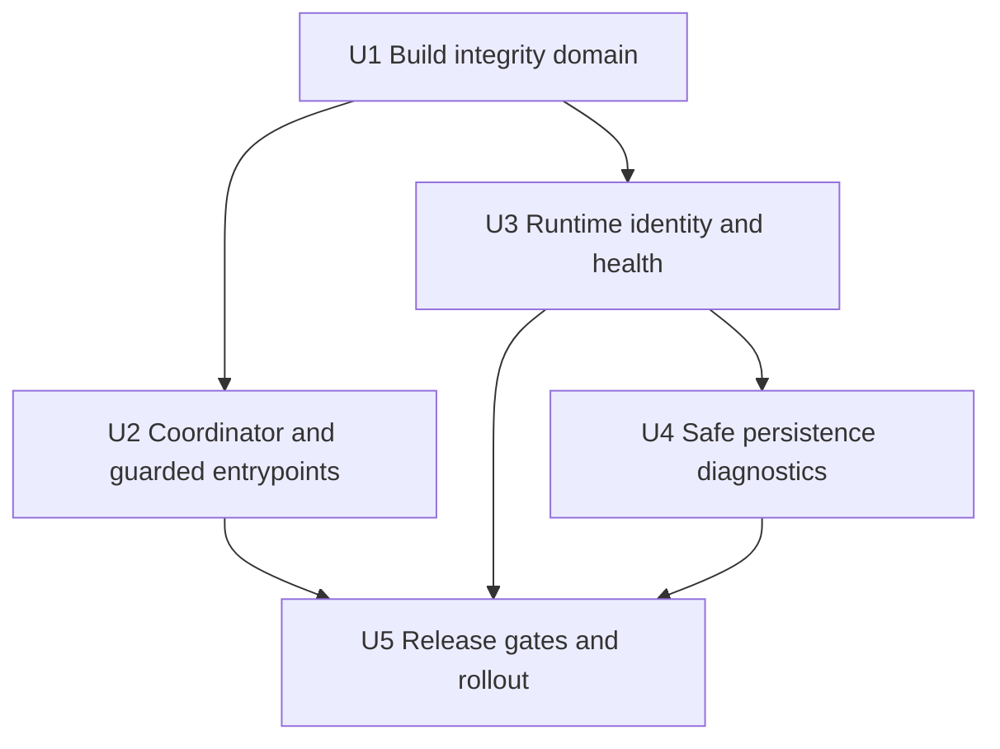

# fix: 防止 Workspace 旧构建产物被运行时重复加载

## Summary

本计划修复一种已经重复出现、且仅靠修源码无法真正关闭的问题：Workspace package 的 `src` 已经修改，
但 Web、Worker 或 Indexer 仍从 package `exports` 指向的旧 `dist` 启动，最终持续执行已经删除的 SQL、合同或
运行逻辑。当前 Q&A 页面反复出现 `PERSISTENCE_TRANSACTION_FAILED`，直接原因就是
`packages/platform/src/runs/postgres-resolution-trace.ts` 已不再读取 `runs.active_attempt_id`，而活动中的
Next 进程仍加载旧 `packages/platform/dist` 和旧服务端 chunk。

目标不是再修一次这条 SQL，而是让旧产物无法成为一个“看起来健康”的运行态：所有受支持的本地启动入口在
绑定端口前，都必须完成依赖图计算、受影响 package 构建、内容寻址证明和运行身份注入；检测到 package 构建输入
变化时，协调器先停止受影响消费者，成功重建并验证后自动重启。构建失败、构建中再次变更、证明缺失或输出被篡改时，
受影响服务保持下线，不允许继续服务旧代码。

同时保留现有公开错误脱敏边界。页面仍只收到稳定公开错误码；Web/Worker/Indexer 在服务端订阅现有 persistence
diagnostic channel，记录 `operation_name`、SQLSTATE、correlation ID、build ID 和 migration frontier 等
安全字段，使“公开响应相同”不再等于“运维侧无法区分根因”。

---

## Problem Frame

### 已确认的故障链

1. Workspace package 的 `package.json` 通过 `exports` 指向 `dist`，因此 `transpilePackages` 并不等于运行时会
   读取 package `src`。
2. 根级 `turbo.json` 已声明 `build` 依赖 `^build`，生产 Dockerfile 也使用依赖感知的 filtered build；但
   `scripts/local-dev-runtime.ts` 只启动 Next/Turbopack 与 `tsx watch`，启动前不构建、运行中也不监督 package
   `dist`。
3. Next/tsx 的应用级 watcher 不保证外部 Workspace package 的 `dist` 变化会使已加载服务端代码失效；即使
   事后手工执行 build，旧进程仍可能继续使用内存模块或旧 `.next` chunk。
4. `packages/platform/src/persistence/transaction.ts` 正确地从公开响应中移除数据库内部细节，但现有生产启动
   路径没有订阅它发布的 diagnostic channel，导致用户只看到同一个通用错误，服务端也缺少足够的安全定位字段。

### 不能接受的当前状态

| 状态 | 当前可能结果 | 目标结果 |
|---|---|---|
| `src` 新、`dist` 旧 | 服务正常绑定端口并执行旧逻辑 | 启动前自动构建；验证失败则不绑定端口 |
| 运行中 package 源码变化 | App watcher 不重载外部 package | 检测后先下线受影响消费者，构建成功再自动重启 |
| 重建失败 | 旧进程继续提供旧代码 | 受影响服务保持不可用，等待下一次变化自动恢复 |
| 构建时源码再次变化 | 混合代际输出可能被接受 | 丢弃本次证明，重新构建稳定代际 |
| 公开 persistence 错误重复 | 页面与日志都只见通用报错 | 页面继续脱敏；日志按 operation/build/sqlstate 可关联 |
| migration 未应用 | 开发者可能希望启动器“顺便修复” | 继续 fail closed，并明确提示显式 `pnpm dev:migrate` |

---

## Requirements

### Build Integrity

- R1. `pnpm dev`、`dev:apps`、`dev:web`、`dev:worker`、`dev:indexer` 和
  `dev:semantic-authoring` 在任何应用端口绑定前，必须为所选消费者的全部传递 Workspace 依赖生成并验证
  当前构建代际。
- R2. 依赖集合必须复用 `scripts/lib/workspace-architecture.ts` 的 Workspace 模块图和 Turbo task graph 推导，
  不维护第二份 Web/Worker package 白名单。
- R3. 构建新鲜度必须基于内容身份，而不是仅比较 mtime。证明至少绑定：Turbo task input hash、package 输出
  digest、package/export 元数据、根构建配置和生成时间；Git commit/dirty 是 provenance 字段，由本地 Git 或
  Docker build args 显式提供，但不代替内容 hash。

### Runtime Lifecycle

- R4. 运行中任一受监督构建输入变化时，协调器必须先停止受影响消费者，再合并变化、执行 filtered build、
  验证稳定代际并自动重启。未受影响消费者不得无故重启。
- R5. 构建失败、输出缺失、证明与当前输入不匹配、输出 digest 不匹配或构建前后 input hash 变化时必须
  fail closed；旧消费者不能留在端口上继续服务。
- R6. 现有开发命令保持兼容。应用 package 的公开 `dev*` 脚本也必须进入同一协调器；实际 Next/tsx watcher
  只作为受协调器授权的内部 raw entrypoint，避免从 package 目录启动时再次绕过门禁。

### Provenance and Diagnostics

- R7. Web、Worker、Relationship Indexer 和 Semantic Authoring 进程必须获得可验证的安全运行身份；已有健康
  响应暴露 role-specific opaque `build_id` 和 `generation_id`，没有健康端口的 Semantic Authoring 至少在启动日志
  记录它们。本地结构化日志另记录 Git SHA、dirty 标记、package hashes、built_at 和已核验 migration frontier。
  build identity 与 migration authority 是两个字段，不能把迁移状态伪装成构建事实。
- R8. 继续使用 `PERSISTENCE_TRANSACTION_FAILED` 等公开稳定错误，不向浏览器返回 SQL、参数、数据库 message、
  stack、DSN 或 Secret；服务端必须以幂等订阅方式记录现有 diagnostic event 的安全字段并附加 build identity。

### Verification and Boundaries

- R9. 干净构建、缺失输出、源码漂移、构建中漂移、失败后恢复、共享依赖影响多个消费者、重复 watcher 事件和
  诊断脱敏都必须有自动化回归；测试不得修改或依赖开发者真实 `dist`。
- R10. 生产 Docker/Release 路径继续执行 dependency-aware build，并在打包前生成/验证同一类构建证明；不得
  通过提交所有 `dist` 解决问题。
- R11. `pnpm dev` 与 health/readiness 只核验 Migration Ledger，不得自动执行迁移；Ledger 缺失或 checksum
  漂移仍返回现有 `DEV_MIGRATIONS_NOT_READY:*` 并提示显式迁移命令。
- R12. 协调器本身只能依赖 Node 内置能力、根级 tooling 与 `scripts/lib`；它不得通过尚未验证的 Workspace
  package `dist` 启动，否则门禁会形成自我依赖。

---

## Scope Boundaries

- 不向 `runs` 表重新添加 `active_attempt_id`；活动 attempt 权威继续来自 `run_attempts`。
- 不改变 PostgreSQL 是 Run 与语义 Authority、Neo4j 是可重建投影的既有边界。
- 不自动运行 migration，不修改 migration ledger 语义，不为本故障创建补丁 SQL。
- 不改变公开 persistence 错误的脱敏策略；本计划增加的是服务端诊断，不是浏览器错误详情。
- 不重写 Q&A、Resolution Trace、Next bundling 或 Worker 领域逻辑；只治理构建代际、进程生命周期与诊断连接。
- 不提交生成的 `dist`、`.next`、`.turbo` manifest、`tsbuildinfo` 或本地运行证明。
- 不承诺拦截开发者直接执行裸 `next dev`、裸 `tsx watch` 或 `node dist/...`；这些被定义为 unsupported raw
  commands。仓库公开的根级和 package-level `dev*` 命令必须全部受保护。
- 不引入另一套通用进程管理框架。协调器扩展现有 `scripts/local-dev-runtime.ts` 与 supervisor 生命周期。

---

## Context & Repository Evidence

- `turbo.json` 已使 package/app `build` 依赖 `^build` 并为通用 task 声明 `dist/**` 输出，适合成为任务输入身份
  和依赖顺序的唯一来源；Web 的 `.next/**` 尚未声明，是生产证明必须补齐的现有缺口。
- `scripts/lib/workspace-architecture.ts` 已能发现 Workspace 模块、角色和依赖图；`scripts/run-workspace-gate.ts`
  已证明根级脚本可以基于该图执行 Turbo gate。
- `scripts/local-dev-runtime.ts` 统一管理 infra、migration readiness、端口和四类本地应用进程，是构建协调与
  fail-closed 生命周期的自然 owner。
- `tests/local-dev-runtime.spec.ts` 已覆盖 process specs、env merge、migration 和 Docker topology，应扩展而不是
  另造只测 happy path 的启动测试。
- `apps/web/package.json` 和 `apps/worker/package.json` 的开发脚本目前直接启动 Next/tsx watcher；它们需要分为
  public guarded command 与 coordinator-only raw command。
- `infra/docker/Dockerfile.web` 已执行 `pnpm --filter @data-agent/web... build`；
  `infra/docker/Dockerfile.worker` 已执行 `pnpm --filter @data-agent/worker... build`。生产构建顺序正确，但缺少
  可随镜像携带的 build identity 与最终输出完整性核验。
- `packages/platform/src/persistence/transaction.ts` 已发布稳定 diagnostic channel，字段包含
  `operation_name`、`correlation_id`、`error_class`、`sqlstate` 和 `marker`；目前除测试外没有运行时 subscriber。
- `apps/web/src/lib/operations-diagnostics.ts` 已有 allowlist 与 secret/raw-error 排除模式；
  `apps/web/src/instrumentation.ts` 是 Node runtime 的幂等注册入口。
- Web `/api/ready`、Worker `/live` 与 Relationship Indexer `/live` 已存在；本计划只扩展安全 build identity，
  不新增公开运维 API。

---

## Key Technical Decisions

| 决策面 | 选择 | 理由 |
|---|---|---|
| Authority | Turbo task input hash + 成功构建后的 output digest 组成证明 | 复用真实 task graph，同时验证磁盘输出没有缺失/漂移 |
| 启动 owner | 扩展 `local-dev-runtime` 为 dependency-aware coordinator | 现有命令、端口、迁移与进程生命周期已经集中在这里 |
| 运行时变化 | 先停受影响消费者，再构建并重启 | 消除“构建失败但旧服务仍在线”的危险窗口 |
| 影响分析 | Workspace 依赖图正向求传递依赖、反向求受影响消费者 | shared package 变化可精确重启 Web/Worker/Indexer |
| 证明存储 | full attestation 原子写入 `.turbo/data-agent-dev/`，向进程传递 strict portable identity file/env | 已被 Git 忽略；应用不解析 full manifest，Docker 也不复制本地 cache |
| 稳定代际 | build 前后 input hashes 必须相同；不同则丢弃并重试 | 防止构建过程中源码变化生成混合代际 |
| Watch 可靠性 | filesystem invalidation 提供快速停止，周期性 hash audit 补偿漏事件 | watcher 负责低延迟，内容审计负责最终正确性 |
| App watcher | Next/tsx 继续处理 app 自身源码；协调器只监督 Workspace package/build inputs | 保留当前快速反馈，避免每次 app 文件变化都全量重建 |
| 诊断 | 复用 platform diagnostic channel，注册 idempotent safe subscriber | 不复制 transaction error mapping，也不泄露原始数据库异常 |
| 迁移 | 独立 readiness fact，不自动迁移、不纳入 build hash | migration 是数据库 Authority 状态，不是编译产物 |

### 为什么不采用其他方案

| 方案 | 结论 | 原因 |
|---|---|---|
| 每次手工 `pnpm build` + 重启 | 拒绝 | 依赖人的记忆，正是本故障反复发生的原因 |
| 启动前只 build 一次 | 拒绝 | 无法覆盖运行中 package 源码变化和构建失败后的旧进程 |
| 只比较 `src`/`dist` mtime | 拒绝 | Git checkout、缓存恢复、时钟偏移和保留时间戳会产生误判 |
| 开发模式直接改 package exports 指向 `src` | 拒绝 | 形成 dev/prod 两套解析语义，并把 bundler/Node 条件导出差异扩散到所有消费者 |
| 让 Next/Turbopack 自动观察 package | 拒绝 | package exports 仍指向 `dist`，且 Worker/Indexer 不是 Next；无法形成统一门禁 |
| 提交所有 `dist` | 拒绝 | 生成物与源码易产生双重 Authority，仍无法保证活动进程已加载新代际 |
| 新增独立通用 supervisor 服务 | 拒绝 | 现有 local runtime 已具备进程/端口/迁移协调能力，新增服务只会复制控制面 |

---

## High-Level Technical Design

### 构建与运行交互

### 构建证明合同

每个已接受 generation 使用一个 versioned attestation。它不是业务 Authority，也不进入 Git；它只证明
“这些消费者启动时，指定 build inputs 与 outputs 属于同一个成功代际”。字段至少包括：

- `schema_version`：便于未来 fail closed 升级；未知版本不接受。
- `generation_id`：标识一次成功的协调构建/重启周期；同一周期内受影响消费者共享该 ID。
- `build_id`：按 consumer role 对其 canonical dependency tasks、Turbo hashes 和 output digests 计算的 opaque
  digest；不同角色不要求相同。
- `consumer_ids`：本代际允许启动的 Web/Worker/Indexer/Semantic Authoring 角色。
- `package_tasks`：package ID、Turbo task hash、声明输出路径、output digest。
- `root_inputs`：lockfile、workspace、Turbo、根 tsconfig 等会影响图或构建行为的身份。
- `git_commit`、`git_dirty`、`built_at`：仅用于本地/受控日志，不作为“干净仓库”的前提；Docker build context
  不复制 `.git`，由受支持的 build wrapper/CI 通过显式 build args 注入 provenance。
- `migration_frontier` 不写入上述 build hash；协调器完成 DB readiness 后作为独立 runtime fact 注入。
- full attestation 之外生成一份符合共享 schema 的 portable runtime identity projection。本地进程从受控文件/环境
  读取；Docker runner 只复制该 projection，不复制 Turbo cache 或 full package digest manifest。

证明只有在 filtered build 退出为零、所有导出目标存在、输出 digest 可重算、且 build 前后 task hashes 完全
一致后才原子替换。失败构建不能更新时间、build ID 或旧 manifest。

### 启动状态机

`Blocked` 是可恢复的开发状态：协调器进程继续监听并输出稳定 reason code，但受影响应用端口不开放。
`Failed` 保留现有“非预期 app crash 终止监督组”的行为。预期的 invalidate/restart 不应触发 peer cascade。

### 入口收敛

- 根级 `dev*` 命令继续调用 `scripts/local-dev-runtime.ts`。
- `apps/web` 与 `apps/worker` 的公开 `dev*` script 改为回到根协调器。
- Next/tsx 原命令改名为内部 raw script；raw entrypoint 必须校验协调器注入的 generation/manifest，未授权调用
  返回稳定 `DEV_WORKSPACE_BUILD_ATTESTATION_REQUIRED`，不绑定端口。
- app 自身 `src` 变化继续由 Next/tsx watcher 热更新；package、package manifest、build tsconfig、lockfile、
  workspace/Turbo config 变化进入 generation 重建。

### 安全诊断连接

platform persistence channel 保持唯一事件来源。共享 subscriber 只接受既有 allowlist 字段，并在写日志时附加：

- `event: persistence_transaction_failed`
- `operation_name`
- `correlation_id`
- `error_class`
- `sqlstate`
- `marker`
- `build_id`
- `migration_frontier`（若启动路径已核验）
- `process_role`

明确禁止记录 `error.message`、SQL statement、parameters、stack、DSN、credential、provider payload 或任意
未 allowlist 对象。Next instrumentation 在 HMR/重复 register 时只能保留一个 subscriber；Worker/Indexer 在
process bootstrap 注册并在测试/关闭时可清理。

---

## System-Wide Impact

- Tooling：新增内容证明、filtered build 和影响分析，但不改变 package 的 `tsc` build contract。
- Process lifecycle：`local-dev-runtime` 从“一次性 spawn 后等待”升级为区分 expected restart 与 unexpected exit
  的 generation supervisor。
- Web：Next server 只在依赖证明有效时启动；instrumentation 注册安全 persistence subscriber；ready 响应增加
  opaque build identity。
- Worker/Indexer/Authoring：沿用各自业务 initialization 和 health 语义，只增加受保护启动、identity 与诊断。
- Platform：transaction wrapper 与公开错误无需改变，只增加可复用、幂等的 diagnostic log adapter。
- Docker/Release：保留 filtered dependency build，在 builder 阶段生成/验证 manifest，并将 opaque identity 注入
  runner；不把本地 `.turbo` 状态复制进镜像。
- Database：零 schema change、零自动 migration、零数据回填。

---

## Implementation Units

### U1 — 建立 Workspace 构建证明与影响分析

**Goal**

提供不依赖 Workspace `dist` 的纯 tooling domain：推导 consumer 依赖、读取 Turbo task identity、验证输出、
生成原子证明，并判断某次变化影响哪些消费者。

**Requirements**：R2、R3、R5、R7、R9、R12

**Dependencies**：无

**Files**

- 新增 `scripts/lib/workspace-build-integrity.ts`
- 修改 `scripts/lib/workspace-architecture.ts`
- 新增 `packages/contracts/src/operations/runtime-build-identity.ts`
- 新增 `packages/contracts/src/operations/index.ts`
- 修改 `packages/contracts/src/index.ts`
- 新增 `packages/contracts/test/runtime-build-identity.spec.ts`
- 新增 `tests/workspace-build-integrity.spec.ts`
- 修改 `turbo.json`（仅在需要补齐 build input/output 声明时）

**Approach**

1. 以 consumer role 为输入，从现有 Workspace graph 得到传递 package dependencies 和 reverse impact map。
2. 通过 Turbo dry-run JSON 获取实际 task hash/依赖，而不是复制 Turbo hashing 规则；对 malformed/缺失 task
   一律 fail closed。
3. build 成功后遍历 task 声明输出与 package exports，计算 canonical output digest。声明存在但实际缺失、
   export 指向 task outputs 外或输出不可读都拒绝证明。
4. 为 Web build 在 `turbo.json` 增加 package-specific `.next/**` 输出声明并排除 `.next/cache/**`；通用 package/
   Worker 继续使用 `dist/**`。生产证明必须覆盖最终 app output，不能只证明 Workspace dependencies。
5. 对 build 前后 task hashes 做 exact match；构建中变化返回
   `DEV_WORKSPACE_BUILD_CHANGED_DURING_BUILD`，不提交 manifest。
6. manifest 先写临时文件、fsync/close 后 rename，保证 watcher、并发命令或进程终止不会看到半份证明。
7. helper 接受显式 filesystem/process adapters，使测试在临时 fixture 中构造 package graph、hash 和 outputs，
   不触碰仓库真实 `dist`/`.turbo`。
8. contracts package 定义 portable runtime identity 的唯一 strict schema；tooling producer 不导入 contracts `dist`，
   但 U1 的 cross-layer fixture 必须证明其 projection 可被该 schema 解析，防止 writer/reader 漂移。

**Test Scenarios**

- Web 和 Worker 得到各自精确的传递 package 集；shared platform 变化同时影响两者及其派生角色。
- 同 input/output 生成稳定 build ID；canonical 顺序变化不改变结果。
- source/task hash 变化使旧证明返回 `DEV_WORKSPACE_BUILD_STALE`。
- output 缺失、内容变化、export 越界、未知 schema version 和 truncated manifest 均 fail closed。
- Turbo contract 同时覆盖 package/Worker `dist/**` 与 Web `.next/**`，且不把 `.next/cache/**` 纳入 portable proof。
- build 前后 hash 不同不能更新原 manifest。
- dirty worktree 可以生成证明，但 dirty 事实被记录，且 unrelated artifact 不进入 package task hash。

**Verification**

- `pnpm exec vitest run tests/workspace-build-integrity.spec.ts`
- `pnpm --filter @data-agent/contracts exec vitest run test/runtime-build-identity.spec.ts`
- fixture 断言测试结束后真实 `packages/*/dist` 与 `.turbo/data-agent-dev` 未变化。

### U2 — 将所有开发入口收敛到可恢复构建协调器

**Goal**

在端口绑定前自动建立有效 generation，并在 package 输入变化时停止、重建和重启精确受影响的消费者。

**Requirements**：R1、R4、R5、R6、R9、R11、R12

**Dependencies**：U1

**Files**

- 修改 `scripts/local-dev-runtime.ts`
- 新增 `scripts/guarded-app-entry.ts`
- 修改 `tests/local-dev-runtime.spec.ts`
- 修改 `apps/web/package.json`
- 修改 `apps/worker/package.json`
- 修改根 `package.json`

**Approach**

1. 将当前 process spec 拆为 public consumer identity 与 raw app command；所有 public `dev*` script 进入根协调器，
   raw command 由 guarded entry 校验 build ID/manifest 后才 exec Next/tsx。
2. `dev` 顺序保持：infra readiness → migration/authority/port check → initial dependency build/attestation → app spawn。
   `dev:check` 只读验证 build readiness，不写证明、不构建、不迁移。
3. watcher 监控 package source/config 与根图输入。首个 invalidation 立即停止 impacted consumers，再 debounce/coalesce
   后构建；package graph 或 lockfile 变化按“所有已选择消费者受影响”处理并刷新 watch set。
4. build/verify 成功后创建新 generation，向 affected raw children 注入 build identity 与 migration frontier 并重启。
5. build 失败后保持 affected children stopped，输出稳定 reason code 和下一步；协调器继续监听，新输入或显式 retry
   可恢复。unexpected child exit 仍终止监督组，防止静默重启掩盖业务 crash。
6. 快速 watcher 之外周期性执行轻量 hash audit；发现漏事件时走同一 invalidation path。协调器关闭时清理 child、
   watcher、timer 和临时 manifest，不删除最近一次已提交证明。

**Test Scenarios**

- 每个根级和 package-level public command 都先 build/verify 后 spawn；raw command 无证明时不绑定端口。
- platform source 变化停止并重启 Web、Worker、Indexer/Authoring 中实际依赖它的角色。
- 仅 Web app source 变化仍交给 Next，不触发 Workspace package rebuild。
- 多个快速事件只形成一个 generation；构建期间再变化会丢弃旧 generation 并重试。
- build failure 后端口保持关闭；修复源码后无需重启协调器即可恢复。
- expected restart 不触发 peer cascade；unexpected exit 仍执行现有 group shutdown。
- SIGINT/SIGTERM 在 Building、Blocked、Running 三种状态均无孤儿进程。
- migration 未就绪时不执行 build/app spawn，并继续提示 `pnpm dev:migrate`。

**Verification**

- `pnpm test:dev-runtime`
- 进程 fixture 验证启动顺序、signal、端口占用、失败恢复与环境注入。
- 本地 smoke：修改一个 platform source fixture，观察 Web/Worker 端口先下线、build 成功后 build ID 同步变化。

### U3 — 贯通运行身份与健康证据

**Goal**

让开发者和运维能确认“当前进程究竟加载了哪个已验证代际”，并将 build fact 与 migration fact 清楚分离。

**Requirements**：R7、R9、R10、R11

**Dependencies**：U1

**Files**

- 修改 `apps/web/src/app/api/ready/route.ts`
- 新增 `apps/web/test/runtime-build-identity.spec.ts`
- 修改 `apps/worker/src/runs/run-worker-daemon.ts`
- 修改 `apps/worker/src/run-worker-cli.ts`
- 修改 `apps/worker/src/semantic/relationship-indexer-cli.ts`
- 修改 `apps/worker/src/semantic/authoring-worker-cli.ts`
- 新增 `apps/worker/test/runtime-build-identity.spec.ts`
- 修改 `apps/worker/test/semantic-relationship-indexer.spec.ts`
- 修改 `apps/worker/test/semantic-authoring-worker-runner.spec.ts`

**Approach**

1. 应用使用 U1 的唯一 portable runtime identity schema，只读取协调器注入的受控 identity file/env；
   Docker 从 builder 复制 portable projection 并设置固定文件路径。应用不扫描 Git，也不解释 full `.turbo` attestation。
2. build/generation ID 缺失、格式非法或 consumer role 不匹配时，开发/生产受管理入口失败关闭；明确的 unit-test harness 可注入
   固定 test identity，不以随机 fallback 掩盖错误。
3. Web minimal ready 和 Worker/Indexer live 暴露 opaque `build_id + generation_id`；Semantic Authoring 没有健康
   端口，因此只在既有 `semantic_authoring_worker_started` 结构化日志中增加 identity。详细 Git SHA、dirty、
   package hashes 只出现在本地/受控 structured startup log，不进入公开 JSON。
4. `migration_frontier` 与 `migration_ready` 来自启动时真实 ledger/readiness 结果；不把 manifest 中的期望版本当作
   数据库已应用事实。Web 未做 DB authority check 的 minimal ready 不得伪造该字段。
5. 同一次协调构建中受影响 consumers 共享 `generation_id`，各自 `build_id` 精确绑定其依赖输出；未受影响消费者
   继续报告原 generation/build ID。无输入变化的服务重启、健康轮询和 Next HMR 不得改变 identity。

**Test Scenarios**

- valid identity 在四类进程中投影正确的 role build ID；同一次 shared-package 重建共享 generation ID。
- missing/malformed/mismatched identity 返回稳定配置错误且不监听健康端口。
- unauthenticated Web ready 只含 opaque 字段；authorized/detail 路径仍不泄露 Git dirty paths 或 package digests。
- migration frontier 只在 ledger 已核验时出现；expected migration version 不能冒充 applied frontier。
- health JSON 保持 `Cache-Control: no-store`，现有 readiness/initialized status 语义不变。

**Verification**

- `pnpm --filter @data-agent/web exec vitest run test/runtime-build-identity.spec.ts`
- `pnpm --filter @data-agent/worker exec vitest run test/runtime-build-identity.spec.ts test/semantic-relationship-indexer.spec.ts test/semantic-authoring-worker-runner.spec.ts`
- 对 ready/live JSON 做 secret 与内部路径负向断言。

### U4 — 为 persistence failure 接入幂等、安全的运行时诊断

**Goal**

保持浏览器公开响应脱敏，同时让相同 `PERSISTENCE_TRANSACTION_FAILED` 能按 operation、SQLSTATE、进程与构建代际
在服务端定位，避免再次只能靠数据库日志反推活动进程加载了什么。

**Requirements**：R7、R8、R9

**Dependencies**：U3

**Files**

- 新增 `packages/platform/src/persistence/diagnostic-logger.ts`
- 修改 `packages/platform/src/index.ts`
- 新增 `packages/platform/test/persistence/diagnostic-logger.spec.ts`
- 修改 `apps/web/src/instrumentation.ts`
- 修改 `apps/web/src/lib/operations-diagnostics.ts`
- 修改 `apps/web/test/operations-diagnostics.spec.ts`
- 修改 `apps/worker/src/run-worker-cli.ts`
- 修改 `apps/worker/src/semantic/relationship-indexer-cli.ts`
- 修改 Semantic Authoring 对应 CLI bootstrap
- 新增 `apps/worker/test/persistence-diagnostics.spec.ts`

**Approach**

1. platform adapter 订阅现有 `PERSISTENCE_TRANSACTION_DIAGNOSTIC_CHANNEL`，只投影显式 allowlist 字段，并接受
   caller 提供的 process role/build identity/logger；不接收或序列化 raw Error。
2. 使用 process-global registration key/reference count，保证 Next instrumentation 重复 register、测试重复导入和
   多 bootstrap path 不会产生重复日志。
3. Web 通过 `instrumentation.register()` 在 Node runtime 注册；Worker/Indexer/Authoring 在访问 persistence 之前
   注册，并在受控 shutdown/test teardown 清理。
4. 每条日志使用稳定 event name 和 correlation ID；SQLSTATE 缺失时记录 `null`，绝不回退到数据库 message。
5. 保留 `publicPersistenceFailure()` 的现有 message/code 测试，增加反向断言证明浏览器响应未因诊断增强而变化。

**Test Scenarios**

- 同一 transaction failure 在每个进程只产生一条结构化日志，包含 operation/sqlstate/build/process role。
- Next register 两次仍只有一个 subscriber；unsubscribe 后测试无跨 case 泄漏。
- raw error message、SQL、parameters、stack、DSN、Secret 和任意额外对象不会出现在日志。
- 无 SQLSTATE、非 Error throw、subscriber logger 自身失败都不改变公开 transaction result。
- 页面/API 仍只收到 `PERSISTENCE_TRANSACTION_FAILED` 与脱敏 message。

**Verification**

- `pnpm --filter @data-agent/platform exec vitest run test/persistence/transaction.spec.ts test/persistence/diagnostic-logger.spec.ts`
- `pnpm --filter @data-agent/web exec vitest run test/operations-diagnostics.spec.ts`
- `pnpm --filter @data-agent/worker exec vitest run test/persistence-diagnostics.spec.ts`

### U5 — 将证明纳入 Docker、Release Gate、Runbook 与验收

**Goal**

把防复发约束从本地工具提升为可持续的构建/发布合同，并用真实故障回归证明不再执行旧 `dist`。

**Requirements**：R9、R10、R11

**Dependencies**：U2、U3、U4

**Files**

- 修改 `infra/docker/Dockerfile.web`
- 修改 `infra/docker/Dockerfile.worker`
- 修改 `scripts/verify-release.ts`
- 修改根 `package.json`
- 修改 `docs/runbooks/local-development.md`
- 修改 `docs/runbooks/deployment-operations.md`
- 修改 `.trellis/spec/backend/local-runtime-modes.md`
- 修改 `tests/local-dev-runtime.spec.ts`
- 修改 `tests/ecommerce-production-suite.spec.ts`
- 修改 `scripts/test-deploy-docker.sh`

**Approach**

1. Docker builder 复制所需的 root tooling 脚本，在 filtered dependency build 后运行同一 output verifier，生成
   portable opaque build identity；runner 只复制该 identity 到固定只读路径，不复制本地 `.turbo` cache/full
   attestation。受支持的 docker wrapper/CI 显式传入 Git SHA/dirty build args，Docker context 不复制 `.git`。
2. release verification 增加 clean dependency build + integrity gate；测试明确模拟“source 已修、dist 仍旧”并要求
   启动被拒绝，而不是只断言 build 命令退出为零。
3. Runbook 记录稳定诊断顺序：health build ID → local coordinator generation → safe persistence event → migration
   frontier → PostgreSQL log；不再建议先反复刷新页面或手工猜测 cache。
4. Trellis local runtime spec 增加 build freshness 错误矩阵、必需测试和 unsupported raw command 边界，使后续改动
   必须同步 contract tests。
5. 以当前 resolution trace 回归作为验收 fixture：旧 output 中包含 `run.active_attempt_id`、新 source 不含该引用时，
   verifier 必须拒绝启动；成功 rebuild/restart 后请求只执行 `run_attempts` authority 路径。

**Test Scenarios**

- Web/Worker Docker builder 对 dependency outputs 生成有效 build identity，runner health 返回对应 opaque ID。
- 人工替换一个 built JS output 后 release verifier 非零退出。
- source 变化而未 build 时 dev/release gate 返回 `DEV_WORKSPACE_BUILD_STALE`。
- production image 不包含 Git dirty file list、本地 absolute paths、`.turbo` cache 或原始 package digests 的公开接口。
- 缺失/非法 Git provenance build arg 时受管理 release build 失败；本地 docker wrapper 自动从当前 checkout 注入。
- migration 缺失时镜像/本地运行继续提示显式 migrate，不自动执行 SQL。
- resolution trace 真实回归中不再查询 `runs.active_attempt_id`，且 safe diagnostic 能关联新 build ID。

**Verification**

- package-scoped unit/contract tests，避免根 Vitest 扫描 `apps/web/.next/standalone`。
- `pnpm build` 后执行 workspace build integrity gate。
- Docker contract/smoke 验证 Web、Worker、Indexer build identity 与启动门禁。
- `pnpm verify:release` 纳入 integrity receipt 检查。

---

## Failure and Recovery Cases

| 故障 | 稳定行为 | 恢复 |
|---|---|---|
| Turbo task graph 无 consumer/package | `DEV_WORKSPACE_BUILD_GRAPH_INVALID`，不 spawn | 修复 workspace/package metadata 后重试 |
| 初始 build 失败 | `DEV_WORKSPACE_BUILD_FAILED`，无应用端口 | 协调器继续监听；修复后自动重建 |
| 构建时 input hash 改变 | 丢弃 generation，`DEV_WORKSPACE_BUILD_CHANGED_DURING_BUILD` | 合并最新变化重新 build |
| output/export 缺失 | `DEV_WORKSPACE_BUILD_OUTPUT_MISSING`，不写证明 | 修复 package build/export |
| output digest 与证明不同 | `DEV_WORKSPACE_BUILD_OUTPUT_MISMATCH`，停止受影响消费者 | 重建并生成新证明 |
| manifest truncated/未知版本 | `DEV_WORKSPACE_BUILD_ATTESTATION_INVALID` | 原子重建证明 |
| filesystem watcher 漏事件 | 周期 hash audit 检出后进入同一 invalidation | 自动停止、重建、重启 |
| rebuild 长时间失败 | 非受影响服务可继续；受影响端口保持关闭 | 日志保留首错和最后错，后续变化/显式 retry |
| unexpected app crash | 维持现有 supervisor group shutdown | 修复业务 crash 后重新运行命令 |
| Migration Ledger 未就绪 | `DEV_MIGRATIONS_NOT_READY:*`，零自动迁移 | 显式 `pnpm dev:migrate` 后重试 |
| persistence transaction 失败 | 公开通用错误；服务端安全诊断含 build/operation/sqlstate | 按 correlation/build 定位根因 |
| diagnostic subscriber/logger 失败 | 不影响 transaction 原结果，不抛出第二故障 | 修复日志 sink；核心业务仍按原错误返回 |

---

## Security, Reliability, and Performance

### Security

- attestation 不含 Secret、环境变量值、DSN 或源码内容；Git dirty 只记录 boolean，不记录 dirty paths。
- public health 只暴露 opaque build/generation ID；Git SHA、package input/output digest 和本地绝对路径不公开。
- raw entry authorization 不是安全认证，只是防误操作门禁；不能被描述为 sandbox 或 privilege boundary。
- diagnostic logger 采用 allowlist projection；raw Error 永不进入可序列化对象。
- unknown manifest schema、consumer mismatch 和 hash mismatch 一律 fail closed。

### Reliability

- manifest 原子提交，旧 manifest 只能代表旧 generation，不能被部分覆盖伪装成新成功。
- invalidate 时先停服务，再 build；失败后不回滚到旧服务。
- fast watch + periodic content audit 形成两层检测；两者共享同一状态机，避免双重 restart。
- build identity 与 migration frontier 分离，避免“代码是新的”被误读为“数据库已经迁移”。
- coordinator 不导入 Workspace package exports，防止门禁依赖待门禁对象。

### Performance

- 初次启动使用 Turbo cache；cache hit 仍执行输出存在性/digest 与 attestation 验证。
- app-local 文件继续走 Next/tsx HMR，不触发 package graph rebuild。
- watcher 合并 burst changes；按 reverse dependency graph 只重启受影响 consumers。
- output digest 只在成功 build/verification 阶段计算；周期 audit 优先比较 task/input identity，发现变化后才计算输出。
- 记录 build duration、cache status、restart count 和 blocked duration，验证协调器没有显著恶化日常反馈时间。

---

## Testing Strategy

### Pure Tooling Tests

- 临时 Workspace fixture 覆盖 graph、canonical hash、atomic manifest、output digest、未知 schema 和并发写入。
- fake Turbo dry-run/build adapter 覆盖成功、cache hit、失败、构建中漂移和 malformed JSON。
- 所有测试明确断言不写仓库真实 `dist`、`.next`、`.turbo/data-agent-dev`。

### Process Lifecycle Tests

- fake child processes 记录 build/verify/spawn/stop/restart 顺序。
- 覆盖 expected restart 与 unexpected crash 的不同 cascade 行为。
- 覆盖 Web-only、Worker-only、all apps、Indexer 和 Semantic Authoring command compatibility。
- 覆盖 watcher burst、漏事件 audit、失败后恢复、signal cleanup 和端口不绑定。

### Diagnostics and Public Contract Tests

- public error snapshot 保持不变。
- structured logs 仅含 allowlist + build/migration/process facts。
- health JSON 只公开 opaque ID，并保持 no-store 与原 status code 语义。
- 重复 instrumentation/bootstrap 不产生重复 subscriber 或重复日志。

### End-to-End Regression

1. 在临时/隔离 fixture 中制造 platform source 与 output 不一致。
2. 证明 Web/Worker guarded startup 在端口绑定前失败。
3. 运行 filtered rebuild，得到新 build ID。
4. 启动消费者并请求 resolution trace。
5. 证明执行 SQL 来自 `run_attempts` active attempt 路径，不包含 `runs.active_attempt_id`。
6. 注入 transaction error，证明浏览器仍脱敏而服务端日志能按 build ID/correlation ID 定位。

---

## Rollout Gates and Success Criteria

按以下顺序交付，每一阶段都是独立 scoped commit，不跨单元提交用户并行改动：

1. U1 先以纯 helper/tests 落地，不改变当前启动行为。
2. U2 在 local dev 默认启用 fail-closed coordinator；若必须提供短期观察期，只允许显式
   `DATA_AGENT_DEV_BUILD_GUARD=observe`，默认仍为 enforce，且 observe 不能进入 release/Docker。
3. U3/U4 补齐 build identity、health 与 safe diagnostics 后，运行当前 Q&A 复现验证。
4. U5 将相同证明接入 Docker/release，并删除任何临时 observe 路径。

完成标准：

- 所有受支持的 dev entrypoint 都不能在 stale/missing output 下绑定应用端口。
- package source 变化后，受影响消费者停止；build 失败期间没有旧服务继续响应。
- build 修复后不重启协调器即可恢复；受影响 consumers 报告同一新 generation ID 和各自当前 build ID。
- 当前 `run.active_attempt_id` 故障回归通过，PostgreSQL 日志不再出现该旧查询。
- 页面公开错误仍不泄露数据库细节；服务端 safe log 足以关联 operation、SQLSTATE、process 和 build。
- `pnpm dev` 仍不执行 migration，所有现有 root/package public dev commands 保持可用。
- Docker/release 对被篡改或 stale output 失败关闭。

---

## Documentation and Spec Updates

- `docs/runbooks/local-development.md`：支持入口、状态机、reason codes、失败恢复、build ID 检查和 raw command 边界。
- `docs/runbooks/deployment-operations.md`：镜像 build identity、integrity gate 与安全诊断顺序。
- `.trellis/spec/backend/local-runtime-modes.md`：把 package freshness 加入契约、错误矩阵、必需测试和 Wrong/Correct。
- 若实现发现 Turbo input/output contract 的新通用约束，再更新最接近的 backend quality spec；不得把一次性实现细节
  写成永久规范。

---

## Commit Strategy

仓库是共享 dirty worktree。实现时每个 U-ID 使用一个 scoped commit，只 stage 该单元 owned paths，禁止
`git add -A`，不得包含 `apps/web/next-env.d.ts`、`tsconfig.tsbuildinfo`、Falcon artifacts、其他 Trellis task、
`dist`、`.next` 或 `.turbo` runtime files。建议提交序列：

1. `feat(tooling): attest workspace package builds`
2. `fix(dev): rebuild and restart stale workspace consumers`
3. `feat(runtime): expose verified build identity`
4. `feat(observability): log safe persistence diagnostics`
5. `test(release): reject stale workspace build outputs`

每次提交前执行该单元 package-scoped tests 与 `git diff --cached --check`。根级 Vitest 不得扫描
`apps/web/.next/standalone`；按现有规范使用 package/workspace-scoped command。

---

## Resolved During Planning

- 选择继续以 `dist` 为所有环境的 package export contract，不引入 dev-only source exports。
- 选择在变化时先停止 affected consumers，build 失败不恢复旧 generation。
- 选择 Turbo task hash 作为 build input identity，并用独立 output digest 验证磁盘产物。
- 选择扩展现有 local runtime，不引入第二套 supervisor。
- 选择公开 health 只暴露 opaque build/generation ID，详细 provenance 只写受控日志。
- 选择 migration readiness 与 build identity 分离，并继续要求显式迁移。

## Deferred to Implementation Research

- Turbo dry-run JSON 在当前 2.10.6 的字段稳定性需要以 fixture snapshot 固定；若缺少所需 output 信息，只在
  tooling adapter 内补充 package metadata 解析，不把 Turbo 内部格式扩散到 app code。
- watcher 的周期 audit 间隔以本地基准确定，默认目标是在不持续占用一个 CPU core 的前提下，于秒级发现漏事件。

---

## Final Planning Boundary

本文件只授权评审方案，不授权修改运行代码、执行 migration、清理数据或提交生成物。实施必须从 U1 开始，按
依赖推进并保留每个单元的独立验证/commit。唯一硬阻塞是：当前 Turbo 版本无法提供稳定 task input identity，
且在不复制构建规则的前提下无法得到等价内容证明；若实测出现该情况，必须暂停 U1，提交验证证据并重新评审
证明来源，不能退回 mtime、手工 build 或“相信 watcher”的弱方案。
