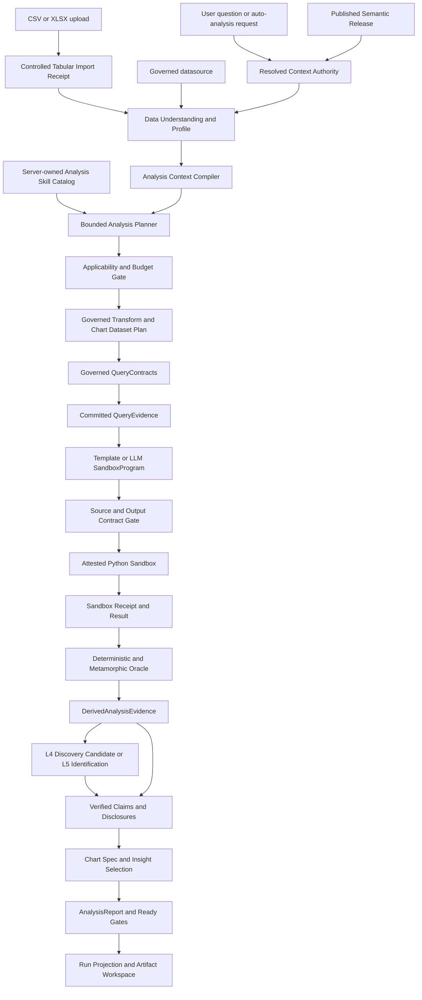
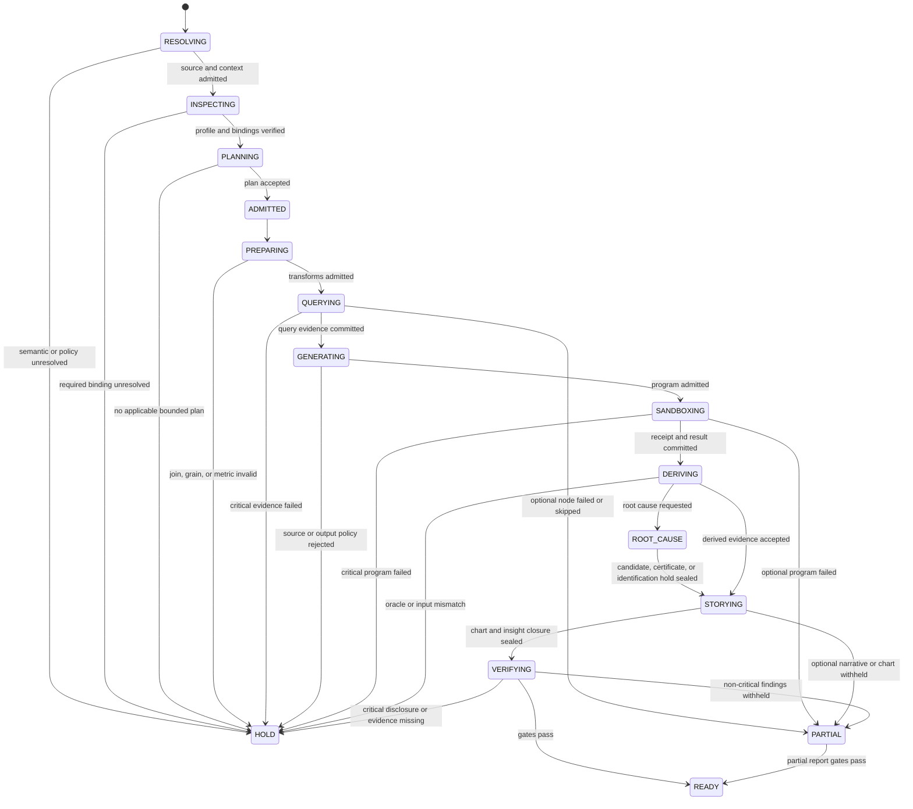
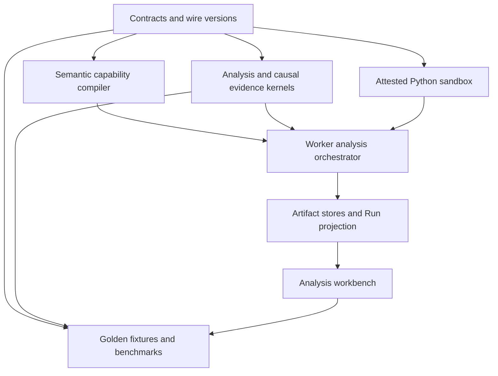
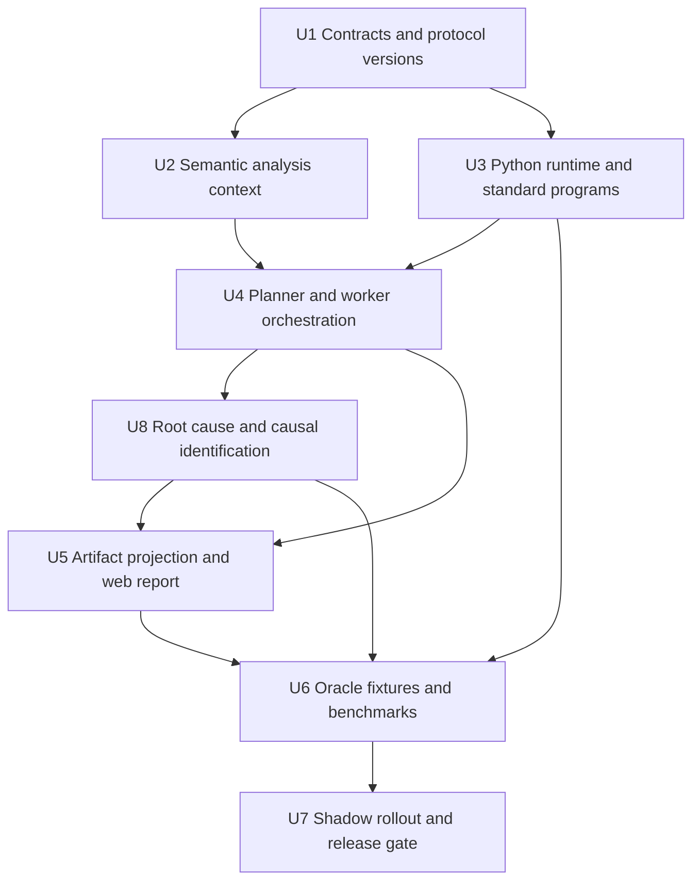

# feat: 基于本体语义层的 Python 自动分析与根因调查

## Summary

本计划为 Data Agent 增加一套“自动理解数据、生成分析程序、沙盒执行、证据化解释并尝试根因调查”的能力。产品上不把
“数据分析”压成一个 Tool，而是实现一条完整且可追溯的 Pipeline：

`数据理解 → 数据准备 → 指标计算 → 探索/诊断 → 图表数据与图表规范 → Insight → 排查建议 → 报告交付`。

其中首批标准统计内核仍覆盖五类函数：

1. 趋势与变化幅度；
2. 分组贡献与集中度；
3. 异常检测；
4. 相关、离群与完整性；
5. 基线预测与回测。

核心不是让模型直接接触数据库或宿主 Python，而是让现有本体语义层先把业务问题编译成不可歧义的
`AnalysisContext`：指标、公式、单位、粒度、时间域、可用维度、过滤条件、Join、空值策略、权限和发布版本均来自
冻结的 Published Semantic Release。LLM 可以生成受治理 SQL 和 pandas/scipy/statsmodels/scikit-learn 等 Python
分析程序，也可以在标准技能不足时设计新的统计步骤；但 SQL 必须进入现有编译/门控/QueryEvidence 链，Python 源码
必须成为内容寻址的 `SandboxProgram`，只能在独立 CPython 3.12 Sandbox 中消费已提交的 Arrow/CSV/JSON Artifact，
不能获得 DSN、网络、Secret、宿主文件或包安装权限。

运行时提供两条共享同一 Authority 的执行路径：标准能力优先使用锁版本 Python 模板，保证稳定、低成本和可回归；
开放问题允许 LLM 生成 SQL/Python Program Candidate，经 Host 校验、Sandbox 执行和确定性 Oracle 验收后成为证据。
所有源码、输入、Runtime/Dependency Lock、资源回执、输出、图表、方法、参数、局限和语义版本进入同一条 Artifact
证据链，前端只投影已接受结果，不自行重算。

根因分析采用分层证据：贡献、异常、相关、时间先后和模型重要性先生成 L4 `DiscoveryCandidate`
（产品标签为“根因候选”）；满足混杂集合、重叠性、
可识别性和反驳测试时，再进入 L5 `CausalQuestion → IdentificationPlan → CausalEstimate →
IdentificationCertificate`。系统可以主动尝试根因调查，但只有持有有效 Identification Certificate 的结论才能显示为
“因果估计”；其余统一显示为“根因候选/待验证假设”，不能因 LLM 文本或单次 pandas 结果升级为已证实原因。

---

## Problem Frame

### 用户希望得到的产品行为

用户上传文件或连接数据源后，只需提出“分析这份销售数据”“最近发生了什么”这类宽问题，系统即可自动完成：

- 检查表/文件、字段、类型、样例、空值、时间范围和物理粒度，并将其与已发布本体中的指标、维度、实体和关系绑定；
- 使用受治理 SQL/Python 完成 Filter、Sort、GroupBy、Join、Pivot、Window、Top/Bottom 和分析数据集准备；
- 识别应分析的业务指标、时间范围和可用业务维度，派生指标只复用已发布公式；
- 发现显著趋势、突变、异常区间和数据质量问题；
- 计算哪些商品、渠道、地区或人群贡献了最多变化，以及影响是否集中；
- 检查指标间相关、组内离群点与数据完整性；
- 在数据条件足够时给出基线预测、区间和回测结果；
- 根据问题与证据自动选择图表，生成摘要卡片、趋势图、贡献排名、异常标记、优先级矩阵和互补的多图叙事；
- 将 Fact、Pattern、Driver、Business Interpretation 与 Recommendation 分层输出，任何解释和建议都绑定可见计算；
- 点击任一结论都能看到指标口径、算法版本、参数、输入证据和限制条件。

### 当前底座已经具备的能力

- `packages/contracts/src/artifacts/semantic-governance.ts` 已定义指标公式、单位、粒度、时间域、可加性、空值和
  fanout 语义，不需要再用列名启发式推断业务角色。
- `packages/contracts/src/context/resolved-context-package.ts` 已冻结 Published Metric、Ontology、Relationship、
  Semantic Release、Schema Snapshot 和 Policy 上下文，可作为分析编译的唯一语义输入。
- `packages/contracts/src/artifacts/research/` 已有 `ResearchBrief@2`、`EvidencePlan@2`、
  `QueryEvidence@2`、`AtomicClaim@2`、Report Manifest 和 Report Ready 门控。
- `packages/semantic/src/compiler/contribution-profile-compiler.ts` 已对可加指标、粒度、互斥分区和贡献闭包采取
  fail-closed 降级，证明仓库已有正确的“语义先于算法”方向。
- `packages/research/src/observation.ts` 已有标量观察和受控贡献闭包验证；
  `packages/research/src/reporting.ts` 已有确定性报告投影。
- `packages/agent-runtime/src/tools/registry.ts` 已有 Server-owned Tool Registry，模型只能选择已注册工具。
- `apps/worker/src/teams/production-team-tools.ts` 已能提交 QueryEvidence、AnalysisReport 和图表工作区文档；
  `apps/web/src/components/workbench/analysis-report-document.tsx` 已从 Run Projection 渲染报告候选。
- `.trellis/spec/backend/python-sandbox-execution.md` 与现有实现已经提供独立 CPython 3.12、严格 IPC、无网络、只读输入、
  锁定依赖、资源限制、内容寻址输出和 hardened-container smoke；当前状态是 `IMPLEMENTED / HOLD`，尚需 Worker
  server-owned tool、取消/恶意容器完整回归和 PostgreSQL → Sandbox → Artifact → Oracle 端到端闭环。

### 仍缺失的关键层

1. 语义合同还没有表达“某指标允许做哪些分析、采用什么时间补齐策略、最少样本量、预测季节性”等分析能力。
2. 当前 QueryEvidence 主要证明数据库查询结果，尚无一等的“由哪些 QueryEvidence、算法和参数确定性派生”的统计证据。
3. AtomicClaim@2 只支持描述、比较和受控贡献，不能完整表达关联、异常、质量和预测结论。
4. Worker 示例路径仍是固定 table-count/monthly-trend，未形成通用技能注册、分析计划和受预算的执行 DAG。
5. 当前报告 UI 能显示声明与证据，但缺少分析方法、异常区间、贡献矩阵、回测质量和逐结论证据抽屉。
6. `packages/evals/src/test-center/analysis-agent.ts` 的确定性 CSV Profiling 是评测基线，不消费发布语义、
   QueryEvidence 或运行权限，不能直接成为生产权威路径。
7. Sandbox 镜像当前锁定 pandas/numpy/scipy/matplotlib/pyarrow，尚未包含 statsmodels、scikit-learn、NetworkX、
   DoWhy/EconML/causal-learn 等统计、机器学习和因果分析库，也未形成模型生成 Program 的验收协议。
8. L4 Discovery 和 L5 Causal Artifacts 仍为 `CONTRACT_ONLY/executable=false`，Attribution F9 仍为 NOT_REGISTERED；
   现有 Fixture Kernel 不能被当成已上线根因能力。
9. 仓库已有 TABLE 的 CSV/XLSX 确定性导出，但没有对应的受控 Spreadsheet Import Authority；Sandbox Policy 也明确禁止
   模型代码调用 `read_excel`。若要覆盖多 Sheet 上传，必须先补服务端固定解析器和 Import Receipt。

### 精品能力清单的可实现性结论

参考材料描述的能力大部分可以实现，但不能全部用同一种证据等级承诺。DeerFlow 的公开 `data-analysis` Skill 已直接证明
Schema Inspection、DuckDB SQL、统计摘要、多 Sheet/多文件 Join、Window、Pivot 和导出是可工程化的；本地固定提交的
Automated Data Analyst 进一步证明趋势、贡献、稳健异常、相关、回测预测、drill-down、waterfall、heatmap 和 Evidence
Ledger 可以由确定性流水线完成。Data Agent 的优势是不用依赖列名猜测，而是由发布语义决定业务口径和 Join closure。

| 能力层 | 本项目结论 | 首选执行面 | 关键边界 |
|---|---|---|---|
| 表/字段/类型/空值/时间范围检查 | 可直接实现 | Schema Snapshot + Python profiling | 物理结构可自动发现，业务含义必须绑定发布语义 |
| 指标/维度/实体/粒度理解 | 可直接实现且应更强 | Ontology + Published Semantic Release | 不从列名自行发明业务口径 |
| Filter/Sort/Top/Bottom/GroupBy | 可直接实现 | Governed SQL | 继续经过 Policy、Permit 和 QueryEvidence |
| Multi-table Join | 可直接实现 | Semantic Join closure + Governed SQL | 只允许已发布关系，拒绝猜 key 和 fanout |
| Pivot/Window/累计/排名 | 可直接实现 | SQL；必要时 Python | 输出粒度、排序和 null policy 进入合同 |
| Derived Metrics | 可直接实现 | Semantic metric compiler | 只复用已发布公式；模型只能建议 Metric Candidate，不能现场改口径 |
| 描述/趋势/对比/分布/贡献 | 可直接实现 | 标准 Python Program + SQL | 由 DerivedAnalysisEvidence 验证 |
| Drill-down/Slice-and-Dice | 可实现 | Ontology 邻接 + 有界 Follow-up DAG | 最大深度/分支/维度受预算和敏感性限制 |
| 异常/相关/回归/假设检验 | 可实现 | CORE/ML Python Profile | 强制样本门槛、多重检验和非因果披露 |
| 聚类/模式挖掘/模型解释 | 可实现为探索能力 | ML_DIAGNOSTIC Profile | 无独立 Oracle 时最高为 Discovery Candidate |
| 自动选图/多图故事/交互图表 | 可实现 | Chart Policy + Chart Dataset/Spec + Web renderer | 图表只能消费已接受证据，不能成为新计算 Authority |
| Fact/Pattern/Driver Insight | 可实现 | Claim compiler + evidence ranking | Fact 与解释分层；Driver 默认是贡献/关联，不是因果 |
| Business Recommendation | 可实现为排查建议 | Ontology playbook + accepted evidence | 不自动执行；无业务规则时明确标记 Candidate |
| 自动 Root Cause | 可实现为有界调查 | L4 Discovery + 统计诊断 | 默认输出“根因候选/待验证假设” |
| 可验证因果估计 | 条件实现、独立上线 | CAUSAL_L5 + Certificate | 需要机制、识别、overlap、反驳和单独 Release Gate |
| 实验设计/自动业务动作 | 后续能力，不在本计划 | 独立合同与审批 | 分析实现不授权实验或生产变更 |

对于未完成语义绑定的临时 Excel/CSV，系统可以先生成物理 Profile、Mapping Candidate 和探索性图表，但不得把列名推断
直接升级为受治理业务指标；用户确认并发布映射后，才进入完整的指标、Join、贡献和根因流水线。

---

## Goals and Success Criteria

### Functional Goals

- G1. 宽问题可自动生成一份有界 `AnalysisPlan`，覆盖适用的首批五类技能；不适用的技能返回机器可读原因。
- G2. 相同的冻结语义上下文、查询结果、Program/Runtime/Lock/seed、参数和 CPU 架构必须生成逐字节相同的统计证据与声明；
  明确声明非确定性的算法只能输出 Candidate，不能进入 Ready Claim。
- G3. 每个结果均绑定 Published Semantic Release、Schema Snapshot、Policy Receipt、QueryEvidence、SandboxProgram、
  SandboxExecutionReceipt、Runtime/Dependency Lock、算法版本和参数。
- G4. 指标可加性、单位、粒度、时间域、空值、Join 和权限不满足时 fail closed，不以“尽力而为”生成结论。
- G5. 自动报告可呈现截图中的趋势、异常、影响商品、贡献集中度、排查顺序和基线预测，但清楚标识证据等级。
- G6. 用户可从任一数字或图表反向导航到语义定义、查询证据、确定性派生过程和局限。
- G7. 自动根因调查能输出按证据等级排序的候选；条件满足时产出可重验 Causal Estimate/Certificate，条件不足时明确
  停在 hypothesis/association/HOLD。
- G8. 宽问题能够走完 Data Understanding、Transformation、Analysis、Visualization、Insight 和 Deliverable 六段流水线，
  每一段都能解释输入、输出、跳过原因和所用 Authority。

### Requirements

- R1. 所有分析必须绑定冻结的 Published Semantic Release、Schema Snapshot、Policy Receipt 和 Resolved
  Context；未发布 Candidate 或关系索引投影不能成为运行 Authority。
- R2. 首批五类标准能力和根因调查能力必须通过 Server-owned Skill Descriptor 注册；模型可以提交受限 SQL/Python
  Program Candidate 和参数，但不能提交 executor、依赖、Runtime、网络、凭据或权限。
- R3. 每个技能必须先通过指标公式、单位、粒度、时间域、可加性、空值、缺期、Join、敏感性和预算适用性检查。
- R4. 数据库观察继续使用 QueryEvidence；统计派生必须使用独立、可重算的 DerivedAnalysisEvidence，不得混淆。
- R5. 同一权威输入、Program hash、Runtime/Dependency Lock、seed 和参数必须生成相同输出/hash；未知版本、输入漂移、
  非确定性未声明和重放不一致必须 HOLD。
- R6. 趋势、贡献、异常、关联、质量和预测必须遵守各自的数学前提、样本门槛和 fail-closed reason code。
- R7. 贡献、相关、特征重要性和异常不得被直接投影为因果结论；预测必须回测，因果结论必须具备 Identification
  Certificate、假设披露、稳健性/反驳测试和适用范围。
- R8. 一个分析 Run 使用有界 DAG 和全局资源预算；单个节点不能通过拆分查询绕过 SQL/行数/时间上限。
- R9. AtomicClaim/Report 采用显式新协议版本扩展证据和 Claim Mode，历史 @2 读取语义保持不变。
- R10. UI、图表、Tooltip 和方法抽屉只消费已接受 Run/Artifact Projection，不自行重算统计或推断 Ready。
- R11. 每个公开结论都必须具备 source refs、method、parameters、coverage、limitations 和强制 disclosure。
- R12. 自动分析默认策略只枚举已配置 Primary Metrics 与已批准维度，不能无界扫描数据源或全部本体对象。
- R13. Candidate、敏感明细、原始 Provider Payload、私有推理、SQL 参数和凭据不得进入公共事件或投影。
- R14. 每项标准技能、生成代码路径和根因证据等级具备独立 Golden/Metamorphic Oracle、资源预算、Shadow 指标、
  kill switch 和发布门。
- R15. Python 只能在现有独立 Sandbox 执行，固定 CPython/Dependency Lock/Image/Policy，禁止网络、Secret、DSN、
  宿主路径、包安装和未声明输出；失败/取消/超限必须零输出提交。
- R16. 根因能力必须实现 `Candidate → Diagnostic Support → Certified Causal Estimate` 状态机；只有 L5 Certificate
  能授权 causal Claim，任何输入前沿漂移都会撤销 Ready。
- R17. 数据理解、变换、Chart Dataset、Chart Spec、Insight 和 Recommendation 都必须是有界、可回放的 Plan Node 或
  Artifact projection；不得在 UI 或最终叙述阶段偷偷执行未记录的 pandas/SQL 计算。

### Acceptance Metrics

- 在相同 CPU 架构、Runtime/Image/Lock digest 下，同一 Fixture 重放 100 次，固定 seed 的 canonical Sandbox output 与
  Analysis Artifact content hash 完全一致；跨架构只按冻结数值容差比较，并使用不同 Runtime digest，不伪装字节等价。
- 对已支持技能，Golden Fixture 的数值、排序、边界点、reason code 和 disclosure 100% 通过。
- 所有统计声明均有完整 source refs；缺任一权威输入时 Report Ready 必须 HOLD。
- 贡献闭包满足 `总变化 = 已列分组贡献 + 其他/残差`，容差由合同固定且不能由模型输入。
- 预测只有在冻结回测集上优于季节性朴素或朴素基线时才显示为“可用基线预测”；否则显示“未通过回测”。
- 未获得 Identification Certificate 的相关性、特征重要性和根因候选 100% 携带
  `STATISTICAL_ASSOCIATION_NOT_CAUSATION` disclosure。
- 已认证因果估计 100% 携带 estimand、identification assumptions、overlap、sensitivity/refutation、适用人群和有效期。
- 未发布指标、越权维度、非可加指标贡献、样本不足、窗口不齐和未知算法版本均被确定性拒绝。
- 自动报告中的每个 Fact/Pattern/Driver/Recommendation 都能回到 accepted Claim/Discovery/Derived Evidence；随机抽取
  报告进行反向追踪，证据闭包通过率 100%。

---

## Scope Boundaries

### In Scope

- 首批五类确定性分析技能及其适用性编译、执行、证据合同、报告投影和评测。
- 已发布语义指标；一个 Run 可包含多个指标，但每个 QueryContract 继续只执行一个指标，分析计划通过多个有界步骤组合。
- PostgreSQL 受治理查询路径；数据库负责聚合和裁剪，Python Sandbox 只消费有界的已验证 Artifact。
- 受控 CSV/XLSX 导入：固定解析器将 Sheet 转成内容寻址 Arrow/CSV Artifact 并提交 `TabularImportReceipt`，再进入
  Schema Snapshot/Mapping；数据库数据源不经过此路径。
- 锁版本 Python 科学计算栈、标准模板及 LLM 生成的 pandas/SQL 分析程序；Node.js 继续拥有调度和 Effect Authority。
- 受控根因候选与 L5 因果估计路径；证据不足时必须停在 Candidate/HOLD。
- 自动分析、明确问题分析和用户追问三种入口复用同一底层计划/证据协议。

### Out of Scope

- 自动修改本体、指标公式、阈值、业务规则或 Published Semantic Release。
- 自动执行退款、调价、补货、通知、工单等业务动作。
- 实时流式异常监控和在线模型训练；首版针对冻结数据窗口的批分析。
- 用户上传自定义 wheel/conda 环境、运行时 `pip install`、任意 URL/网络访问、宿主 Python 或 JavaScript 执行。
- 执行 XLSM 宏、外部链接、公式计算、嵌入对象或任意压缩包内容；公式只按静态值/文本策略读取并披露。
- 为追求通用性一次支持所有数据源方言；首版通过现有 PostgreSQL 编译/沙箱路径建立正确闭环。

### Evidence Language Boundary

| 证据类型 | 允许用语 | 禁止自动升级为 |
|---|---|---|
| 趋势/变化 | 上升、下降、环比/同比变化、拐点 | 导致、引起 |
| 贡献/集中度 | 构成变化、占变化的比例、集中于 | 根因、责任方 |
| 异常 | 相对基线显著偏离、超出区间 | 故障、欺诈 |
| 相关 | 正/负相关、稳健性一致/不一致 | 因果关系 |
| 根因候选 | 与结果同步变化、具有时间先后、条件关联仍存在 | 已证实根因 |
| 因果估计 | 在已披露假设和 estimand 下的估计影响 | 普遍因果真理、责任认定 |
| 离群/完整性 | 离群候选、缺失率、覆盖缺口 | 数据错误（未验证前） |
| 预测 | 基线预测、回测误差、预测区间 | 承诺、确定未来结果 |

---

## Open-Source Research and Adopt / Adapt / Reject

### Automated Data Analyst 固定源码结论

参考 `automated-data-analyst@1034fe96dc6fbe8f298cc3a6d0e7b8e9e63e3bc4`。其生产源码相对上游
`2005d2113161ca468162846cf653e2efc6289943` 无功能漂移，适合作为算法与交互参考。项目已经实现 Trend、
Change Driver、Leader/Concentration、Theil–Sen 异常、Pearson/Spearman 相关、IQR 离群、Completeness 及带
Backtest 的 Forecast，并将 LLM 限制在查询规划和叙述层。本项目保留其 evidence-first 思想，但按用户确认允许模型
生成受控 pandas/SQL，将“LLM 不执行代码”改为“LLM 只能提交 Candidate，Sandbox/Authority 决定是否执行和接受”。

但该项目的语义入口是单表 `ColumnRoles`，依赖列名与数据类型启发式，主要支持一个 measure/date/dimension；
固定执行分析套件，读取内存数据并对数据量做 `head()` 截断；时间序列缺期默认补零；Recommendations 多为硬编码文本。
这些做法不能直接进入 Data Agent 的受治理生产路径。

| 参考做法 | 决策 | Data Agent 映射 |
|---|---|---|
| Evidence before interpretation | 采用 | 统计内核先提交派生证据，模型后叙述 |
| Typed QueryPlan + local executor | 采用并扩展 | `AnalysisPlan` + 服务端技能目录 + Host Gate |
| 趋势、稳健异常、相关、回测基线 | 采用算法思想 | 实现为锁版本 Python 模板、Golden Fixture 与可重放 Program |
| `ColumnRoles` | 改造 | 由 Published Semantic Release 编译 `AnalysisContext` |
| 固定分析套件 | 改造 | 根据语义适用性和预算选择有界技能 DAG |
| 缺失时间自动补零 | 拒绝 | 只按指标显式 `missing_period_policy` 处理 |
| 内存读取与固定行截断 | 拒绝 | SQL pushdown + Result Budget + 失败原因 |
| 硬编码 Recommendation | 拒绝 | 仅输出排查候选；行动必须有独立业务规则/审批 |
| Contribution 等同 Cause | 改造 | 先作为根因候选；只有通过 L5 Identification Certificate 才升级因果估计 |

### 其他参考项目的用途

- DeerFlow：固定参考 `deer-flow@ee5583fe76821994974b5dd1dbd71e83093d076d` 的公开 `data-analysis` Skill；采用其
  `inspect → query/summary → export`、多 Sheet/文件同一查询上下文和 DuckDB 模式作为临时文件分析参考，但本项目的
  数据库路径继续使用受治理 SQL，文件 DuckDB 只能作为无 DSN 的 Sandbox 输入引擎，不能替代 Semantic Authority。
- PyRCA：采用其可插拔 RCA、因果图与诊断工作流思想，但输出先进入 L4 `DiscoveryCandidate`；任何因果表述仍由本项目
  Identification/Refutation/Certificate Gate 决定。
- WrenAI：参考语义建模与受语义约束的自然语言分析，不增加第二套语义 Authority。
- Data Formulator：参考模型生成可视化意图、确定性系统执行转换的职责分离。
- InsightBench：作为自动分析覆盖度、洞察质量和非重复性的外部评测思路；生产正确性仍由本地 Deterministic Oracle 判定。

---

## Key Technical Decisions

| 决策面 | 选择 | 理由 |
|---|---|---|
| 语义 Authority | PostgreSQL Published Semantic Release / Resolved Context | 避免列名猜测和第二套语义层 |
| 分析执行 | SQL pushdown + 独立 Python Sandbox | 现有 Sandbox 已 IMPLEMENTED/HOLD，完成剩余门后成为唯一 Python 执行面 |
| Python 依赖 | 冻结 scientific/ML/causal lock 与镜像 digest | 允许完整分析栈，但不允许运行时安装或用户依赖 |
| 模型职责 | 选择技能、生成 SQL/Python Candidate、解释已接受证据 | 模型可以决定分析策略，但不能决定权限、Runtime 或 Claim Ready |
| 派生证据 | 新增一等 `DerivedAnalysisEvidence@1` | 不能把统计派生结果伪装成原始 QueryEvidence |
| Claim 兼容 | 新增 AtomicClaim 协议版本，保留 @2 历史读取 | 关联/预测/质量需要新 Claim Mode，不能静默改写 v2 |
| 探索与假设 | AnalysisPlan 是 ResearchBrief 的确定性探索分支 | 不为满足 HypothesisSet 最小数量而制造虚假假设，仍复用证据/Claim/Report Authority |
| 计划形态 | 有界 DAG，每节点单技能、单指标或明确指标对 | 复用单指标 QueryContract，支持并行且便于预算/重放 |
| 时间缺口 | 由指标分析语义显式声明 | 交易流量、余额、比率对缺期含义不同 |
| 预测门槛 | 必须回测且优于朴素基线 | 防止“能拟合”被误认为“可预测” |
| 推荐 | 排查候选而非自动行动 | 统计证据不等于业务处方或审批 |
| 根因 | Candidate → Statistical Diagnostic → Causal Estimate/Certificate | 尽可能分析原因，同时避免把相关和模型重要性伪装成因果 |
| UI Authority | Run Projection + Artifact Workspace | 图表与文字必须投影同一证据，不能前端重算 |

### 为什么不采用其他方案

| 方案 | 结论 | 原因 |
|---|---|---|
| 直接嵌入 Automated Data Analyst | 拒绝 | 单表角色推断、内存执行和证据合同不满足本项目边界 |
| LLM 生成 pandas/SQL 完成开放分析 | 采用并治理 | Source/SQL、输入、Runtime、Lock、seed、Receipt、Output 和 Oracle 全部内容寻址 |
| 把所有分析结果塞入 QueryEvidence | 拒绝 | 混淆数据库观察与统计派生，无法独立校验算法版本 |
| 新建独立语义分析平台 | 拒绝 | 会形成第二 Authority，与现有本体、Context、L2 Artifact 重叠 |
| 锁定完整 Python 科学计算栈 | 采用 | 建立分档 attested runtime；每个新增 native dependency 需安全/重放/许可证门 |
| 根因分析 | 采用分层路径 | F9/L5 未 Ready 时只输出候选；通过独立因果门后才产生认证估计 |

### Python Scientific Runtime Profile

现有镜像已经锁定 `pandas`、`numpy`、`scipy`、`matplotlib` 和 `pyarrow`。本计划不把所有包无差别塞进一个通用镜像，
而是建立三个分别锁版本、做 attest 并具有独立 image/runtime/lock digest 的服务端 Runtime Profile；完整能力栈对系统
可用，但每次执行只获得当前 Skill 的最小运行面，模型不能选择或升级 Runtime：

- `CORE_ANALYSIS`：现有基础包 + `duckdb`、`statsmodels`、`seaborn`；覆盖已提交 Arrow/CSV 的 Profiling、统计检验、
  趋势、图表数据和时间序列；XLSX 由受控导入层先转换成内容寻址的 Arrow/CSV，不把任意工作簿解析器开放给代码；
- `ML_DIAGNOSTIC`：在 Core 能力上增加 `scikit-learn`、`networkx`、`shap`、`causal-learn`；因果图学习结果只用于
  探索、诊断和 L4 Discovery；
- `CAUSAL_L5`：独立因果运行时，增加 `dowhy`、`econml`；只有注册的 L5 Skill 可使用。

每个 Skill Descriptor 只能启用一个服务端 Profile；新增/升级 native library 必须更新 profile-specific requirements lock、
dependency lock digest、image digest、SBOM、许可证清单、CVE 扫描、恶意 fixture、数值 Golden 和同架构重放证据。
用户代码中的 `pip/conda`、动态 import、`ctypes`/任意 native load 和用户 wheel 继续禁止。跨架构数值结果使用冻结容差
验证，不能与同 digest 的字节稳定承诺混用。

---

## High-Level Technical Design

以下图和合同草图用于帮助评审方案形态，是方向性设计，不是要求实现者逐字复制的代码规范。

### Component Interaction



### End-to-End Runtime Flow

1. API 创建 Run，冻结 Principal、Datasource、Model Profile、Semantic Release、Schema Snapshot、Policy 和
   Resolved Context Receipt。
2. 上传文件先由固定 Import Authority 解析并提交 Arrow Artifact/Receipt；数据理解节点再读取 Schema Snapshot 和有界
   Profile，确认字段类型、空值、时间范围、候选 grain 及已发布语义绑定；
   未绑定文件只能产出 Mapping/Exploration Candidate，不能直接获得受治理指标身份。
3. `AnalysisContextCompiler` 从冻结语义构建指标级能力视图，不读取未发布 Candidate，也不依赖 Neo4j 才能成立。
4. 主 Agent 或“自动分析默认策略”从当前可用技能目录生成 `AnalysisPlanCandidate`。Host 解析稳定 Skill ID，
   收窄时间窗、维度、指标数、SQL 次数和输出行数后提交权威计划。
5. 数据准备节点把 Filter、Sort、GroupBy、Join、Pivot、Window、派生指标和 Chart Dataset 编译成受治理 SQL 或有界
   Python Transform；SQL 优先，只有已发布关系可以 Join，派生指标只能引用已发布公式。
6. 每个计划节点先执行 applicability gate。不能分析时提交 `SKIPPED` 节点结果与 reason code，而不是悄悄换算法。
7. 查询编译继续走现有 SemanticQuery → LogicalPlan → SqlArtifact → Gate/Permit → QueryEvidence 链。
8. 标准节点选择服务端冻结 Python Template；开放节点由 LLM 生成 Python Source Candidate 和声明式 Output Contract。
   二者都提交为 `SandboxProgram`，没有模板旁路或 Worker 宿主执行。
9. Host 校验 Source/Input Scope、AST/import、Runtime/Dependency Lock、seed、输出类型、资源预算和 Fence 后，通过现有
   Unix-socket IPC 调用独立 Python Sandbox。Sandbox 不接收 SQL、DSN、URL、SecretRef 或宿主路径。
10. 只有 `SUCCEEDED`、全部 hard controls=true、Fence 仍有效且输出合同通过时，Authority 才提交
   `SandboxExecutionReceipt`/`SandboxResult`；失败、取消和超限均为零输出提交。
11. Deterministic/Metamorphic Oracle 重放或校验结果 schema、数值不变量、切片/顺序稳定性、未来泄漏和空值语义，
   通过后提交 `DerivedAnalysisEvidence@1`。
12. 根因节点先构建 ontology-grounded L4 Discovery Candidate 和统计诊断；只有 L5 Identification Plan 的全部
   假设/反驳门通过时才提交 Causal Estimate/Certificate，否则保留根因候选/HOLD。
13. Research Kernel 将派生证据投影为版本化 AtomicClaim、EvidenceRelation、SupportDecision 和 Report Manifest；
   未认证的关联、重要性和根因候选均带强制非因果 disclosure。
14. Chart Policy 根据问题类型和已接受结果生成 `ChartIntent → ChartDataset → ChartSpec`，组合趋势、排名、分布、关系
   和贡献等互补视角；图表层不执行新的统计计算。
15. Insight Selector 按 `Fact → Pattern → Driver → Interpretation → Recommendation Candidate` 分级，去重并限制条数；
   每一层必须引用 accepted evidence，LLM 只负责受约束表述和候选排序。
16. `AnalysisCompletionReceipt` 证明所有 Critical 节点均有 terminal 状态、Optional 节点的缺失已披露和预算闭合；
   自动探索不伪造 HypothesisSet/ResearchStopDecision。
17. Report Ready 门控重验语义版本、输入证据、Program/Runtime/Receipt、派生 hash、Claim Mode、causal certificate、
   completion receipt 和 disclosure 后才允许 UI 显示为已验证结果。
18. 前端通过同一个 Run Projection 显示报告、图表、源码/环境摘要和证据抽屉；刷新或 SSE 重连只重放状态，不重算统计。

### Runtime State Machine



---

## Core Contracts

### 1. Ontology-Grounded Analysis Context

不新建独立持久化语义模型。`AnalysisContext` 是从 Resolved Context + Published Semantic Release 计算出的
Run-bound 派生合同，可内嵌在 Analysis Plan 并绑定 `context_hash`：

```ts
interface AnalysisMetricContext {
  metric_ref: MetricRef;
  formula_hash: ContentHash;
  unit: Unit | null;
  grain: Grain;
  time_domain: TimeDomain | null;
  time_dimension_ref: string | null;
  additivity: "additive" | "semi-additive" | "non-additive";
  null_policy: "preserve" | "coalesce-zero" | "exclude" | "propagate";
  missing_period_policy: "ZERO_IF_SEMANTICALLY_EMPTY" | "NULL" | "REJECT_GAP";
  allowed_dimension_refs: string[];
  analysis_capabilities: AnalysisCapability[];
}

interface AnalysisContext {
  schema_version: "analysis-context@1.0.0";
  resolved_context_binding: {
    package_id: string;
    package_hash: ContentHash;
    receipt_id: string;
    receipt_hash: ContentHash;
  };
  semantic_release_ref: SemanticReleaseRef;
  schema_snapshot_ref: SchemaSnapshotRef;
  policy_receipt_ref: PolicyReceiptRef;
  metrics: AnalysisMetricContext[];
  context_hash: ContentHash;
}
```

数据理解不是再造语义层，而是显式连接“物理事实”和“业务 Authority”：

```ts
interface DataProfilePayload {
  artifact_type: "DataProfile";
  protocol_version: "data-profile@1.0.0";
  schema_snapshot_ref: SchemaSnapshotRef;
  input_artifact_refs: ArtifactReference[];
  tables: Array<{
    table_ref: string;
    row_count: number;
    columns: Array<{ name: string; physical_type: string; null_count: number; distinct_estimate: number }>;
    sample_projection_ref: SensitiveArtifactRef | null;
    time_coverage: HalfOpenTimeWindow | null;
    candidate_grain: string[];
  }>;
  semantic_binding_status: "PUBLISHED" | "CANDIDATE" | "UNRESOLVED";
  profile_hash: ContentHash;
}
```

上传文件先经过 `TabularImportReceipt@1`：记录 raw artifact hash、MIME/sniffed format、parser/image version、sheet allowlist、
每 Sheet 行列数、公式/宏/外链检测、locale/date policy、Arrow output refs、拒绝/截断状态和 import hash。解析器使用独立的
server-owned 固定入口，设置文件大小、ZIP expansion ratio、Sheet/行/列/单元格长度和解析时间上限；模型既不能提供解析
代码，也不能让分析 Sandbox 直接打开 XLSX。CSV 也必须固定 encoding/delimiter/quote/date policy，不能悄悄猜错后继续。

Profile 可以观察物理类型、分布和候选 key，但“销售额是指标”“一行代表 SKU 日”“两个表按 customer_id 连接”等业务
判断只接受 Published Semantic Binding。样例数据属于 Sensitive Projection，默认不进入模型或公共事件。

`ResolvedContextPackage@1` 当前只投影 Metric ID、mapping/formula hash，并不携带完整可加性和时间语义；Compiler
必须按其中冻结的 Semantic Release identity 从 PostgreSQL Authority 解析已提交的 Source Bundle/Release Document，
不能只靠 Context 摘要推断。`missing_period_policy` 与 `analysis_capabilities` 通过显式版本化的发布材料进入
`SemanticSourceBundle@2` 并参与 release hash；Ontology Package 只增加对该版本发布材料的绑定，不复制这些字段；
`SemanticSourceBundle@1` 保持历史读取，不能
静默增加字段改变既有 hash。没有显式策略时采用最保守默认：时间缺口保持 NULL；贡献、异常和预测可因不连续而拒绝，
绝不通用补零。

### 2. Server-Owned Analysis Skill Descriptor

```ts
interface AnalysisSkillDescriptor {
  skill_id:
    | "data-profile@1"
    | "semantic-transform@1"
    | "trend-change@1"
    | "contribution-concentration@1"
    | "robust-anomaly@1"
    | "association-outlier-completeness@1"
    | "baseline-forecast-backtest@1"
    | "open-python-analysis@1"
    | "root-cause-investigation@1"
    | "visual-insight-story@1";
  input_contract_version: string;
  output_contract_version: string;
  required_capabilities: AnalysisCapability[];
  parameter_schema: JSONSchema;
  hard_limits: {
    max_metrics: number;
    max_dimensions: number;
    max_series_points: number;
    max_groups: number;
    max_sql_executions: number;
  };
  algorithm_version: string;
  program_mode: "FROZEN_TEMPLATE" | "MODEL_GENERATED" | "HYBRID";
  python_import_profile: "CORE_ANALYSIS" | "ML_DIAGNOSTIC" | "CAUSAL_L5";
  mandatory_disclosures: string[];
}
```

Descriptor 与 executor 由服务端一起注册。Provider 可以选择 Skill ID、schema 允许的参数并为
`MODEL_GENERATED/HYBRID` 节点提交 SQL/Python Candidate，但不能提交工具描述、Runtime、dependency lock、Import
Profile、资源上限或 executor。自动分析默认策略也使用同一 Registry，不走隐藏特权路径。

### 3. Analysis Plan

`AnalysisPlan@1` 是有界 DAG。每个节点声明语义输入、查询模板、技能参数、依赖、重要性和失败行为：

```ts
interface AnalysisPlanNode {
  node_id: string;
  skill_id: string;
  metric_refs: MetricRef[];
  dimension_refs: string[];
  time_window: HalfOpenTimeWindow;
  comparison_window: HalfOpenTimeWindow | null;
  parameters: JsonValue;
  execution_mode: "FROZEN_TEMPLATE" | "MODEL_GENERATED";
  output_contract: PythonOutputContractV1 | null;
  dependency_node_ids: string[];
  activation_rule:
    | { kind: "ALWAYS" }
    | { kind: "MATERIAL_CHANGE"; source_node_id: string; policy_threshold_id: string }
    | { kind: "HISTORY_SUFFICIENT"; source_node_id: string; minimum_points: number };
  criticality: "CRITICAL" | "OPTIONAL";
}

interface AnalysisPlanPayload {
  artifact_type: "AnalysisPlan";
  protocol_version: "analysis-plan@1.0.0";
  brief_ref: ResearchBriefRef;
  analysis_context_hash: ContentHash;
  nodes: AnalysisPlanNode[];
  budget: ResearchBudgetLimit;
  planner_kind: "DETERMINISTIC_DEFAULT" | "MODEL_CANDIDATE_HOST_VERIFIED";
  plan_hash: ContentHash;
}
```

默认上限建议从 `3 metrics × 5 dimensions × 16 SQL executions × 5,000 series/group rows` 起步，最终值由性能
基准冻结。时间序列节点单独限制为最多 512 个有序点，分组节点最多 5,000 组；计划不能通过把一个查询拆成多个节点
绕过总预算。条件节点只能使用服务端注册的 `activation_rule`，不能执行模型表达式；自由 Python 只存在于已提交的
SandboxProgram 中，并受独立源码/输出/资源门控。

### 4. Generated Program and Sandbox Closure

模型生成代码不是普通消息文本。Host 必须将候选规范化为 `SandboxProgram@1`，Source Artifact 只在 CANDIDATE 阶段
标注 agent producer，经过 policy gate 后由确定性组件提交可执行 revision：

```ts
interface AnalysisSandboxProgramPayload {
  artifact_type: "SandboxProgram";
  protocol_version: "analysis-sandbox-program@1.0.0";
  plan_ref: AnalysisPlanRef;
  node_id: string;
  language: "PYTHON_3_12";
  entrypoint: "main";
  source_sha256: ContentHash;
  source_text_ref: SensitiveExecutionArtifactRef;
  input_refs: ArtifactReference[];
  output_contract: PythonOutputContractV1;
  import_profile: "CORE_ANALYSIS" | "ML_DIAGNOSTIC" | "CAUSAL_L5";
  random_seed: number;
  runtime_digest: ContentHash;
  dependency_lock_digest: ContentHash;
  policy_version: string;
  program_hash: ContentHash;
}
```

- SQL Candidate 仍先编译成 SqlArtifact 并通过现有 SQL Policy/Permit，不能由 Python 持有连接后执行。
- Python 输入只允许同 Run 的 QueryEvidence 对应 Arrow/CSV/JSON Artifact；模型不能自行读取路径或发现输入。
- Source Candidate 在存储和执行前必须通过 Secret/PII/Literal 扫描；代码只能用 `context.inputs` 取值，不得把原始行、
  SQL 参数、Token、路径或用户数据复制成源码常量。源码按 Sensitive Execution Artifact 存储并受独立审阅权限控制。
- 标准模板和模型代码使用同一 `PythonExecutionRequestV2`、IPC、resource budgets、Receipt 和 output commit gate。
- 模型代码失败可在同一 Plan Node 内进行最多一次基于公开错误码/经 Secret/PII/value scrubber 净化并截断的 stderr 修复；
  修复生成新 Program Revision，
  不覆盖失败源码或回执，也不能扩大 imports/预算。
- 成功不等于正确：只有 Oracle Receipt 通过后，SandboxResult 才能进入 DerivedAnalysisEvidence/Claim。

### 5. Derived Analysis Evidence

`DerivedAnalysisEvidence@1` 明确区分数据库观察和统计派生：

```ts
interface DerivedAnalysisEvidencePayload {
  artifact_type: "DerivedAnalysisEvidence";
  protocol_version: "derived-analysis-evidence@1.0.0";
  plan_ref: AnalysisPlanRef;
  node_id: string;
  skill_id: string;
  algorithm_version: string;
  query_evidence_refs: QueryEvidenceRef[];
  sandbox_program_ref: SandboxProgramRef;
  sandbox_execution_receipt_ref: SandboxExecutionReceiptRef;
  sandbox_result_refs: SandboxResultRef[];
  runtime_digest: ContentHash;
  dependency_lock_digest: ContentHash;
  parameter_hash: ContentHash;
  input_closure_hash: ContentHash;
  result: AnalysisResultUnion;
  quality: AnalysisQualityUnion;
  limitation_codes: string[];
  derivation_hash: ContentHash;
}
```

Verifier 必须重新解析输入 Artifact、重建 canonical input、重放同一 Program/Runtime/Lock/seed 或执行等价的独立
Oracle，并比对 `derivation_hash`；只验证 Payload 自身 hash 或相信 Python 自报 JSON 不足以证明计算正确。

### 6. Versioned Claim and Report Evolution

- 保留 AtomicClaim@2、ReportManifest@2 和 AnalysisReport@2 的历史读取与现有生产语义。
- 新增 AtomicClaim@3，使 Observation Binding 可引用 `QueryEvidence | DerivedAnalysisEvidence | DiscoveryCandidate |
  CausalEstimate`，并增加 `QUALITY | ASSOCIATIVE | ROOT_CAUSE_CANDIDATE | CAUSAL_ESTIMATE | PREDICTIVE` Claim Mode。
- `DESCRIPTIVE | COMPARATIVE | DIAGNOSTIC` 保持原语义；`DIAGNOSTIC` 仍只表示封闭贡献分解，不表示因果。
- 新增 `AnalysisCompletionReceipt@1`，证明 AnalysisPlan 的 Critical/Optional 节点、预算和 limitation closure；
  它是自动探索分支的终止证据，不冒充 `ResearchStopDecision`。
- 新增 ResearchBrief@3 的 `EXPLORATORY_DETERMINISTIC` 模式，以及 ReportManifest@3 / AnalysisReport@3 的
  AnalysisPlan/Completion Receipt 输入；已有假设研究继续使用 HypothesisSet/EvidencePlan/ResearchStopDecision，
  不能静默改变 @2 Section 的解释。
- EvidenceRelation 和 Check Receipt 必须能引用 Program/Receipt/Result/派生/根因/因果证据，并验证 Runtime/Lock、
  Algorithm Version、Input Closure、Certificate 和强制披露。

### 7. Root Cause and Causal Contracts

- 不新增平行的 `RootCauseCandidate` Artifact。产品中的“根因候选”复用现有 L4 `DiscoveryCandidate`，以版本化可执行
  payload 增加 `candidate_kind=ROOT_CAUSE | CAUSAL_GRAPH`、候选因素、ontology path、时间先后、贡献/条件关联/重要性、
  竞争解释、证据等级和限制；`DiscoveryReceipt` 证明 multiple-testing、novelty、数据/语义前沿和验证状态。它永远不能
  直接承载 `CAUSAL` Claim。
- `CausalQuestion@1`：outcome、treatment、population、estimand、time zero、intervention semantics 和目标窗口。
- `IdentificationPlan@1`：发布的 causal DAG/ontology paths、adjustment set、mediator/collider exclusions、positivity、
  SUTVA/consistency、missingness 和 estimator/refuter 计划。
- `CausalEstimate@1`：ATE/ATT/CATE 等明确 estimand、点估计/区间、effective sample、overlap、balance、estimator、
  Sandbox Program/Receipt/Result 和 sensitivity/refutation outputs。
- `IdentificationCertificate@1`：确定性验证输入闭包、DAG/Adjustment Set、假设披露、placebo/negative control/bootstrap/
  sensitivity 门、当前语义/数据版本和失效条件；只有它能授权 AtomicClaim@3 `claim_mode=CAUSAL_ESTIMATE`。

当前 `packages/contracts/src/capabilities/deferred-artifacts.ts` 的 L4/L5 合同保持 `CONTRACT_ONLY`，直到对应 Slice 完成
payload、verifier、registry、Oracle、迁移和 Release Gate；计划不能仅把 `executable` 改成 true。现有 Attribution
Capability Directory、Eligibility、Safety、Truth Contract、Feasibility Verdict 和 F9 HOLD 表达必须复用，不能另建
一套 Discovery/因果 Authority。

### 8. Visualization and Insight Projection

不新增一套平行 Chart Authority。`ChartIntent` 是 AnalysisPlan 中的服务端受限参数，`ChartDataset` 是
DerivedAnalysisEvidence 的安全 TABLE/CHART projection。现有 `ArtifactWorkspaceChartDocumentV2` 只支持
LINE/BAR/PIE 且 provenance 绑定单一 QueryEvidence，因此保留其历史语义，并在同一合同族新增显式
`ArtifactWorkspaceChartDocumentV3`/`ProjectionV3`，允许绑定 QueryEvidence + DerivedAnalysisEvidence 和受限的新图形：

- 图表选择规则由问题类型、字段角色、基数和已接受 finding 决定：time→line，ranking→horizontal bar，composition→
  stacked bar/limited donut，relationship→scatter，distribution→histogram/box，contribution→waterfall/signed bar，
  two-dimensional intensity→heatmap；
- 一个 Report 最多生成冻结数量的互补图，禁止仅为“看起来丰富”重复同一结论；饼/环图只用于非负、互斥且低基数构成；
- Dataset 必须先由 SQL/Python evidence 形成，Chart Spec 只能映射字段、编码、单位、注释和交互，不能嵌入表达式重算指标；
- Tooltip、表格 fallback、异常/预测 disclosure、dataset hash 和 provenance 进入 Chart Document；交互筛选生成 Follow-up
  Plan Revision，不在浏览器改变权威结论。

Insight 不新增自由文本事实源，而是复用 AtomicClaim@3/DiscoveryCandidate/AnalysisReport：

| Insight 层 | 权威输入 | 可公开表述 |
|---|---|---|
| Fact | QueryEvidence / DerivedAnalysisEvidence | 精确数值、窗口、单位和 coverage |
| Pattern | 经过 Oracle 的 Trend/Anomaly/Distribution Claim | 连续变化、拐点、异常、分布特征 |
| Driver | Contribution/Association 或 L4 Discovery | “贡献最大/条件关联”，默认非因果 |
| Interpretation | 多个 accepted Claim + ontology path | 有证据边界的业务解释，必须列竞争解释 |
| Recommendation Candidate | accepted evidence + published playbook/rule | 下一步排查/验证，不代表批准或自动行动 |

Insight Selector 只能选择、排序、去重和受约束改写已接受内容。若 LLM 新增了数字、实体、原因或行动，Claim verifier 必须
拒绝；没有 published playbook 时，Recommendation 只能由证据生成“检查什么/补什么数据/设计什么验证”，不能给出调价、
补货、处罚等业务处方。

---

## Standard and Generated Analysis Skill Specifications

标准技能由服务端 Python 模板实现；LLM 可以在同一输入/输出合同下生成替代 Program Candidate。替代程序只有在
Oracle 与资源门通过后才能取代模板结果，失败时不会降低标准技能的证据等级。

### Skill 0: Data Understanding and Semantic Transformation

**数据理解**

- 对输入表/Sheet 生成字段、物理类型、row/non-null/distinct、样例安全投影、时间覆盖、候选 key/grain 和质量 Profile；
- 将字段映射到 Published Metric/Dimension/Entity/Relationship；自动匹配只能生成 Mapping Candidate，不能自行发布；
- 多 Sheet/多文件先由导入层生成独立内容寻址 Artifact，Join 只能使用语义层已发布关系及 fanout witness。

**数据变换**

- Filter、Sort、Top/Bottom、GroupBy、Aggregate、Pivot、Window、累计、排名和 Date Bucketing 优先编译成受治理 SQL；
- Python 只处理已裁剪 Artifact 上 SQL 不适合的统计变换、模型输入准备和 chart dataset reshaping；
- SUM/AVG/COUNT/DISTINCT/MAX/MIN/Median/Percentile 的可用性由 metric type、grain、unit、additivity 和 null policy 决定；
- Derived Metric 只能引用发布公式；模型提出的新公式进入 Semantic Candidate workflow，本 Run 不可把它当权威指标使用。

**边界**

- 未绑定数据仍可做物理 EDA，但公开结果标记 `UNRESOLVED_SEMANTICS/EXPLORATORY`；
- 禁止猜 Join key、自动选择 many-to-many、对预聚合比率求平均、静默去重或删除缺失；
- 清洗操作必须生成 audit（受影响行数、规则、前后 hash）；分析可用修复后 Artifact，但不能覆盖原输入。

### Skill A: Trend and Change Magnitude

**输入前提**

- 指标存在明确 Time Domain/Time Dimension；
- 请求 grain 不细于指标可执行 grain；
- 比较窗口按同一 Calendar、Timezone 和半开区间对齐；
- partial-period 策略明确，默认排除未完成周期并披露。

**确定性输出**

- 每周期值、绝对变化、相对变化；
- 环比、同比或用户指定基线；
- 首末值、峰谷、最大单期升降、连续上升/下降长度；
- 通过分段斜率或固定阈值识别的拐点候选；
- coverage、缺期、部分周期和分母为零状态。

**边界**

- 相对变化分母为零时输出 `RELATIVE_DELTA_UNDEFINED`，不制造无穷百分比；
- 比率和半可加指标按自身公式在目标粒度重算，不能对已聚合比率求平均；
- 时间缺口只按语义策略补齐。

### Skill B: Group Contribution and Concentration

**输入前提**

- 指标必须 additive，或存在已发布且可 lowering 的 Descriptive Contribution Profile；
- baseline/current 使用同一 metric、unit、grain、population 和 canonical predicates；
- 分组维度可查询，分组集合有稳定排序和 Other/Residual 处理。

**确定性输出**

- 每组 baseline、current、signed delta、变化占比、当前占比；
- Top-K 与 Other/Residual，完整贡献闭包；
- HHI、有效分组数 `1 / sum(share²)`、Top1/Top3/Top5 concentration；
- `impact = abs(delta)` 与 `severity` 组成的优先级矩阵数据；阈值来自版本化分析策略，不自动判根因。

**边界**

- HHI 只用于非负且份额有意义的度量；存在负值时返回 `CONCENTRATION_NOT_APPLICABLE`；
- 每个集中度结果明确声明 `CURRENT_LEVEL` 或 `ABSOLUTE_CHANGE` 计算基准，不能在报告中混用；
- 净变化接近零但正负组大幅抵消时，同时展示 gross positive/gross negative，避免份额爆炸；
- 未能证明分组互斥完备时只输出排名，不输出“贡献闭包”。

### Skill C: Robust Anomaly Detection

**首版算法**

- 对连续有序时间序列使用 Theil–Sen 趋势估计；
- 残差尺度使用 MAD/稳健尺度；
- 根据冻结 false-alarm policy 计算上下界和 anomaly score；
- 可选已发布 seasonal period；没有季节性语义时不自行猜测周期。
- Exact Theil–Sen 只接受最多 512 个有序点；超限由 SQL 按已声明 grain 聚合，不能在内核中随机抽样或截头。

**确定性输出**

- 异常点/区间、方向、偏离绝对值与相对值、稳健 z-score；
- 预期基线及置信带、连续异常长度；
- 样本量、有效覆盖、校准策略、重尾/常数序列警告。

**边界**

- 样本不足、缺口过多、常数序列或季节周期不完整时 fail closed 或降级为简单变化提示；
- 异常标签表示统计偏离，不自动标记系统故障；
- 阈值来自版本化 policy，不允许模型以自然语言覆盖。

### Skill D: Association, Outlier and Completeness

**Association**

- 两个指标必须在同一 population、时间窗口、grain 和 dimension slice 上对齐；
- 输出 Pearson r + Fisher CI、Spearman rho、有效样本量、missing pair 数；
- 同一计划扫描多个指标对时使用冻结的多重比较策略（首版 Benjamini–Hochberg q-value）并限制 pair 数；
- Pearson/Spearman 方向或强度显著不一致时标记 `OUTLIER_SENSITIVE_ASSOCIATION`；
- 禁止使用“影响”“驱动”“导致”等因果表述。

**Outlier**

- 连续数值使用 IQR fence 和 MAD score；
- 分组离群必须先按相同业务 grain 聚合，避免把原始明细大额值与聚合指标混为一谈；
- 权威证据可保留受控候选 ref，但公共投影只返回聚合组、数量和分位边界；行级 key/hash 需要独立授权 drill-down，
  不能把稳定 hash 当成匿名化数据直接公开。

**Completeness**

- 计算物理列 NULL、业务必填缺失、时间覆盖、期待分组覆盖和唯一性冲突；
- “业务必填”来自 Published Constraint，不从数据频率猜测；
- 数据质量结果是独立 finding，不能悄悄删除缺失记录后继续给出高置信分析。
- 所有分组输出执行 Policy 中的 `minimum_group_size`、小单元格抑制和 Top-K/Other；被抑制组计入 coverage/Other，
  不能从总计反推出敏感小组。

### Skill E: Baseline Forecast and Backtest

**首版候选模型**

- naive last value；
- seasonal naive（仅有已发布 seasonal period 时）；
- Theil–Sen trend；
- 可选 trend + deterministic seasonal residual，必须满足完整周期要求。
- statsmodels ETS/SARIMAX（满足规律间隔、季节周期和样本门槛时）；
- scikit-learn 的受限回归/树模型（只对已批准特征，必须使用 time-series split）。

**模型选择和回测**

- 时间顺序 Holdout 或 Rolling Origin，不允许随机切分；
- 使用 MAE、MAPE（分母安全时）、MASE 和区间覆盖率；
- 复杂候选必须显著优于冻结的 naive baseline，否则选择 naive 或返回 `FORECAST_NOT_USEFUL`；
- horizon 不超过训练窗口的冻结比例，预测区间随 horizon 扩宽；
- 结果绑定 training window、holdout window、model version、error metrics 和 backtest hash。

**边界**

- 不输出未经回测的未来曲线；
- 结构突变、历史不足、间隔不规则、缺期策略不明确时不预测；
- 预测只作为基线，不能自动转化为预算、库存或销售承诺。

### Skill F: Open Python Analysis

用于标准技能未覆盖的统计变换、回归/假设检验、PCA、聚类/分群、cohort/retention、模型比较、可视化和报告数据准备：

1. LLM 先声明问题、输入 QueryEvidence refs、预期输出 schema、方法、seed、质量检查和限制；
2. Host 将允许的列/指标/维度、最大输入字节、Import Profile 和 Output Contract 写入 Program Context；
3. LLM 生成 `def main(context)`，通过 Source Policy 后进入独立 Sandbox；
4. Program 输出结构化 JSON/Arrow/CSV、Vega-Lite/PNG 和净化 Markdown，不允许自由 HTML、pickle、Notebook 或 archive；
5. Oracle 至少检查 schema、finite number、行列预算、单位/粒度、排序、重复执行 hash 和声明的不变量；
6. 无通用 Oracle 的开放结果最高为 `EXPLORATORY_CANDIDATE`，必须由后续独立查询/程序验证后才形成 Material Claim。

开放分析仍需方法级适用性检查：检验必须声明假设、effect size、置信区间和多重比较；聚类必须披露尺度化、距离、K 选择
与稳定性；回归必须报告 design matrix、共线性、残差/泛化诊断；PCA/embedding 只能作为结构探索，不能给业务实体贴上
模型生成的事实标签。

### Skill G: Root Cause Investigation

根因调查不是单个算法，而是一个有界证据漏斗：

1. **候选生成**：从 Ontology Relationship、指标公式依赖、贡献 Top-K、异常同步、Change Point、用户/业务假设生成有限
   L4 Discovery Candidate Universe；记录未枚举边界。
2. **统计筛选**：使用 partial correlation、mutual information、分层回归、decision tree/forest importance、SHAP、
   conditional independence 和 lag tests；控制 multiple testing，并记录竞争解释。
3. **时间与机制检查**：原因必须先于结果；mediator、collider、confounder 按发布 ontology/causal graph 区分，模型不得
   仅凭列名自动决定角色。
4. **可识别性门**：没有 intervention semantics、adjustment set、positivity/overlap 或足够样本时，结果停在
   `ROOT_CAUSE_CANDIDATE`。
5. **因果估计**：在 L5 路径中使用经 Skill Descriptor 允许的 DoWhy/EconML estimator，生成 ATE/ATT/CATE 和区间；
   estimator 选择、交叉拟合、seed 和超参数全部进入 Identification Plan。
6. **反驳与敏感性**：placebo treatment、random common cause、subset/bootstrap、negative control、unobserved-confounding
   sensitivity 至少满足策略要求；任一硬门失败不发 Certificate。
7. **结论分级**：`ASSOCIATED_CANDIDATE → DIAGNOSTICALLY_SUPPORTED → CAUSAL_ESTIMATE_CERTIFIED`，UI 不允许跳级。

首版硬限制建议为最多 20 个候选、5 个统计幸存候选、2 个 estimator、策略固定的 refuter 集合和总计最多 8 次 Sandbox
执行；最终值经性能/统计评测后冻结。达到任一上限即返回已完成部分与未覆盖边界，不能让模型自行扩大搜索。

首版不自动从观测数据学习并发布 causal DAG。LLM/causal-learn 可以生成
`DiscoveryCandidate(candidate_kind=CAUSAL_GRAPH)` 供审阅或本 Run 探索，但只有发布的 Ontology/Domain Causal Policy
或明确用户假设才能进入 Identification Plan Authority。

### Skill H: Visual Story and Evidence-Grounded Insight

1. 从 accepted findings 生成问题—图表映射，优先回答“发生了什么、何时、谁贡献、分布如何、关系如何、接下来查什么”；
2. 为每张图创建有界 Chart Dataset 和现有 Chart Document 的新协议版本，dataset hash 与 evidence refs 一一闭合；
3. 组合 1 张 overview + 最多 4 张互补图；图数、点数、series 数、分类数和 annotation 数使用服务端预算；
4. 生成 Fact/Pattern/Driver/Interpretation/Recommendation Candidate 层级，数字必须复制自 accepted Claim projection；
5. 用证据 identity 和问题覆盖度去重，并把未展示 finding 保留在 Evidence Ledger；
6. 产出 Markdown/JSON/交互式 Web Report，PNG 仅作为静态导出；禁止可执行 HTML 和模型生成浏览器代码。

---

## Automatic Analysis Planning Policy

### Broad Request Default Plan

“分析这份销售数据”不会枚举所有指标和维度。Host 使用确定性候选生成器先收窄：

1. 先生成有界 Data Profile 并验证 Semantic Binding；未绑定文件停在 Exploratory/Mapping Candidate，不执行受治理 Join
   或生成正式业务结论。
2. 从 Resolved Context 选择用户明确提及的指标；若未提及，使用 Workspace 明确配置的 Primary Metrics，
   不按物理列数量猜测。
3. 为每个指标确定最近完整窗口和比较窗口；时间域不完整的指标只做质量/分布检查。
4. 按发布的 `analysis_priority` 和维度基数预算选择最多 5 个维度；敏感或越权维度不可见。
5. 编译必要的 Filter/Join/GroupBy/Window/Chart Dataset 节点，复用共享 QueryEvidence，避免每张图重复扫库。
6. 先做趋势与完整性；发现物质变化后再展开贡献与异常；存在两个可比较指标时再做关联；历史满足门槛时再做预测；
   用户询问“为什么/原因”或异常达到策略阈值时进入 Root Cause Candidate 漏斗。
7. 对重复或高度重叠 findings 做确定性去重，以 evidence identity + statement type，而不是 LLM 文本相似度为准。
8. Chart/Insight 节点按问题覆盖度选择互补视图并生成分级叙述；报告最多展示冻结数量的 material findings，其余保留在
   Evidence Ledger，可在追问时读取。

### Model-Assisted Plan

模型可根据用户问题从目录中选择技能、指标、维度、受限参数，并生成 SQL/Python Candidate，但 Host 必须：

- 验证所有 ID 来自冻结目录；
- 验证维度与指标的语义/Join closure；
- 将时间表达式解析为确定的半开区间；
- 丢弃超预算节点，不自动扩大资源；
- 为每份 Python 代码冻结 Source/Runtime/Lock/Import Profile/seed/Output Contract，只允许同 Run 输入 Artifact；
- 对生成 SQL 继续执行语义编译、SQL Policy、Permit 和 QueryEvidence，不把 SQL 字符串直接交给 Python；
- 为不可恢复错误返回结构化 clarification 或 HOLD；
- 把最终接受的计划而非原始模型输出作为重放 Authority。

---

## Concrete Example: Sales Return-Rate Investigation

用户问题：

> 分析商品销售数据，找出最近表现异常的数据，定位影响最大的商品，整理可视化排查图。

假设发布语义中已有 `return_rate`、`gross_profit`、`product`、`gender_category`、`order_month`：

1. Context Compiler 确认 `return_rate` 是 ratio/non-additive，时间 grain 为 month，缺期策略为 REJECT_GAP；
   `gross_profit` 是 additive currency。
2. Trend Skill 对 `return_rate` 在最近 6 个完整月重算月度比率，识别 4 月起的持续上升与异常区间。
3. Contribution Skill 不能直接对 return rate 做加法贡献，因此编译为已发布的 numerator/denominator decomposition，
   或返回 `NON_ADDITIVE_CONTRIBUTION_NOT_LOWERABLE`；绝不直接累加退货率。
4. 对 `gross_profit` 按 product 执行 baseline/current signed delta，得到影响金额、Top-K、Other 和闭包。
5. Concentration 计算 Top1/Top3 与有效商品数；Priority Matrix 使用影响金额和退货异常严重度显示 P0/P1/P2。
6. Association Skill 可报告商品月度退货率与利润变化的统计关联，并把供应商、尺码、商品批次等 ontology 邻接因素
   送入 Root Cause Candidate Universe。
7. LLM 可生成 pandas/statsmodels 程序，执行分层回归、lag/conditional checks 和候选稳定性排序；程序、输出和失败修复
   都进入 Sandbox Artifact 链。
8. 若语义中存在可审阅的 treatment/outcome/confounder 定义，系统再尝试 DoWhy/EconML Identification；否则供应商质量、
   尺码不适等只能显示为 `DIAGNOSTICALLY_SUPPORTED` 或待验证假设。
9. Report 生成：异常概览、趋势图、影响商品排名、品类分布、优先级矩阵、根因证据阶梯、程序/环境摘要和下一步验证。

---

## API and Tool Protocol

### Public Request

保持现有 Q&A Run 入口，只增加结构化 analysis intent，不另建绕过 Run Authority 的同步分析 API：

```json
{
  "question": "分析最近六个月商品销售异常",
  "analysis_mode": "AUTO",
  "root_cause_mode": "TRY_WHEN_SUPPORTED",
  "code_generation": "ALLOW_SANDBOXED",
  "requested_skill_ids": [],
  "time_window": null
}
```

- `AUTO`：确定性默认候选 + 可选模型计划；
- `EXPLICIT`：用户明确指定趋势、贡献、异常等技能；
- `FOLLOW_UP`：复用原 Run 的已提交 Artifact，通过新计划 Revision 增量分析。
- `root_cause_mode=TRY_WHEN_SUPPORTED`：生成候选并在可识别时尝试 L5；不保证一定获得因果证书。

### Internal Tool Calls

建议提供稳定工具面，而不是五个模型可自由改写的执行器：

```ts
analysis.plan.propose({
  skill_ids,
  metric_refs,
  dimension_refs,
  time_window,
});

analysis.plan.execute({ analysis_plan_ref });

analysis.program.propose({
  analysis_plan_ref,
  node_id,
  language: "PYTHON_3_12",
  source,
  output_contract,
});

analysis.sandbox.execute({ sandbox_program_ref });

analysis.root_cause.investigate({
  analysis_plan_ref,
  outcome_metric_ref,
  candidate_refs,
});

analysis.evidence.read({
  evidence_refs,
  projection: "SUMMARY" | "METHOD" | "CHART_DATA",
});
```

`analysis.program.propose` 只提交 Candidate，不执行。`analysis.sandbox.execute` 由 Host 解析 Program、调用现有
Python Sandbox Authority 并重新授权 Receipt/Fence/Output；模型不能直接调用 IPC、选择 socket/image/lock、读取 stdout
Artifact 或绕过 Output Contract。

### Public Events

Run Event 只公开：

- `TABULAR_IMPORT_COMPLETED/REJECTED`：格式、Sheet 数、输出 Artifact ref 和公开 reason code，不公开样例/原始单元格；
- `DATA_PROFILE_COMPLETED/SEMANTIC_BINDING_REQUIRED`：表/字段数、coverage 和 binding 状态；
- `ANALYSIS_PLAN_ACCEPTED`：技能数量、指标数量、预算摘要；
- `ANALYSIS_NODE_STARTED/COMPLETED/SKIPPED`：Skill ID、状态、公开 reason code、Artifact ref；
- `ANALYSIS_PROGRAM_ADMITTED/REJECTED`：仅公开 Program hash、Import Profile 和安全 reason code，不公开源码；
- `ANALYSIS_SANDBOX_COMPLETED/FAILED`：Runtime/Lock digest 摘要、资源摘要和公开 failure code；
- `ROOT_CAUSE_CANDIDATES_READY/IDENTIFICATION_HOLD/CAUSAL_ESTIMATE_CERTIFIED`：证据等级和 Artifact refs；
- `ANALYSIS_REPORT_READY/PARTIAL/HOLD`：报告 ref 与披露摘要。

不得公开原始 Provider Payload、私有推理、未脱敏行、SQL 参数、Policy 内容或凭据。

---

## UI Projection

### Report Layout

在现有 Analysis Workbench 上扩展，不创建第二个结果页面：

1. **数据理解与处理审计**：表/字段/类型、语义绑定、grain、时间覆盖、缺失、Join/Filter/清洗和受影响行数；
2. **分析概览**：异常数量、窗口、受影响维度、预计影响、报告状态；
3. **趋势与异常**：基线、实际、置信带、异常点、comparison series；
4. **贡献与集中度**：signed bar/waterfall、Top-K、Other、HHI/有效分组数；
5. **关联、离群与完整性**：相关矩阵/散点摘要、离群候选、质量卡；
6. **预测与回测**：训练/回测/预测分区、区间、MASE/MAPE、是否胜过 naive；
7. **优先级与排查候选**：Evidence-derived P0/P1/P2 矩阵；不显示为已批准行动；
8. **根因证据阶梯**：Candidate、统计支持、可识别性、反驳测试和认证因果估计分层展示；
9. **Insight 与建议**：Fact、Pattern、Driver、Interpretation、Recommendation Candidate 明确分层；
10. **程序与环境**：只显示净化后的方法摘要、Program hash、Python/Lock/Image/Policy、资源和 Receipt，不默认公开源码；
11. **方法与证据**：指标口径、语义版本、算法、参数、样本量、limitations、source refs。

### Projection Rules

- Chart data 从 `DerivedAnalysisEvidence` 的安全 projection 生成，前端不得重新计算 anomaly、contribution 或 forecast。
- 自动选图只能映射 accepted Chart Dataset；筛选、hover、排序是交互投影，任何改变分析人口/窗口的操作都创建 Follow-up
  Plan Revision，而不是在前端悄悄形成新结论。
- Tooltip 必须显示单位、时间语义、数据覆盖与异常/预测含义。
- 未通过回测、样本不足或不适用的技能显示原因，不用空白图误导用户。
- `READY / PARTIAL / HOLD`、`OBSERVED / ASSOCIATIVE / ROOT_CAUSE_CANDIDATE / CAUSAL_ESTIMATE /
  PREDICTIVE` 标签在刷新和 SSE 重放后保持一致。
- 颜色不能是状态的唯一载体；所有图表提供键盘可达的明细表、文本摘要和 screen-reader label，窄屏按
  “结论 → 图表 → 方法”渐进展开。
- 优先级仅表示排查顺序；行动建议若无业务规则/审批证据，统一显示“候选”。

---

## System-Wide Impact



- **Contracts**：增加 Artifact type、引用、版本化 payload、reason code、公共事件与安全 projection。
- **Semantic**：从发布语义编译分析适用性；继续以 PostgreSQL authority 为准，Neo4j 只辅助关系导航。
- **Research**：新增分析/因果证据 verifier、root-cause evidence ladder、claim/report 投影；不直接执行数据库或 Python。
- **Sandbox**：扩展锁版本科学栈、Import Profile、标准 Program、Generated Program policy 和资源/安全测试；无 Effect Authority。
- **Worker**：生成/接受有界计划和 SQL/Python Candidate，执行 QueryContract/Sandbox DAG，提交派生证据与报告。
- **Platform**：持久化新 Artifact、幂等提交、重放 Run Projection 和安全 Chart Projection。
- **Web**：仅渲染权威 projection，增加方法/证据抽屉和分析类型可视化。
- **Evals**：覆盖数学正确性、生成代码安全/正确性、根因证据等级、因果识别/拒绝、报告与端到端体验。

### Stakeholders

- 业务分析用户获得可解释的自动报告和根因调查，但必须能区分候选、统计支持与认证因果估计。
- 语义治理人员需要为指标发布分析能力、缺期、季节性、causal role/graph policy，并承担口径和机制审阅。
- 平台/算法开发者维护版本化技能、Python Runtime/Lock、Program Policy、Golden/Metamorphic Oracle 和兼容读取。
- 运维与安全团队按技能观察成本、失败、敏感投影和 kill switch，不需要读取模型私有推理。

## Output Structure

目录结构是计划范围说明；实施中若现有模块边界提供更合适的 owner，可在不改变 Authority 和合同边界的前提下调整。

```text
packages/contracts/src/artifacts/
├── tabular-import.ts
└── research/
    └── analysis.ts
packages/semantic/src/analysis/
├── context-compiler.ts
├── applicability.ts
├── transform-compiler.ts
└── index.ts
packages/research/src/analysis-evidence/
├── common.ts
├── program-verifier.ts
├── result-oracles.ts
├── root-cause.ts
├── causal-identification.ts
├── insight-selector.ts
├── verifier.ts
└── index.ts
services/sandbox/programs/standard/
├── data_profile.py
├── trend_change.py
├── contribution_concentration.py
├── robust_anomaly.py
├── association_quality.py
└── forecast_backtest.py
apps/worker/src/analysis/
├── skill-catalog.ts
├── default-plan.ts
├── plan-gate.ts
├── tabular-import.ts
├── data-profile.ts
├── chart-story.ts
├── program-admission.ts
├── sandbox-executor.ts
└── executor.ts
```

---

## Implementation Units



- U1. **Versioned Analysis Contracts**

**Goal**: 建立不破坏现有 @2 语义的分析计划、派生证据、Claim 和报告 wire 合同。

**Requirements**: R4, R5, R7, R8, R9, R11, R13, R15, R16, R17.

**Owned files**

- `packages/contracts/src/artifacts/types.ts`
- `packages/contracts/src/artifacts/research/references.ts`
- `packages/contracts/src/artifacts/research/primitives.ts`
- `packages/contracts/src/artifacts/research/analysis.ts` (new)
- `packages/contracts/src/artifacts/research/proof.ts`
- `packages/contracts/src/artifacts/research/reporting.ts`
- `packages/contracts/src/artifacts/research/wire.ts`
- `packages/contracts/src/artifacts/tabular-import.ts` (new)
- `packages/contracts/src/artifacts/export-receipt.ts`
- `packages/contracts/src/capabilities/deferred-artifacts.ts`
- `packages/contracts/src/ports/python-sandbox.ts`
- `packages/contracts/src/runs/public-events.ts`
- `packages/contracts/test/deterministic-analysis-artifacts.spec.ts` (new)

**Changes**

- Register `TabularImportReceipt`、`DataProfile`、`AnalysisPlan`、`DerivedAnalysisEvidence` and `AnalysisCompletionReceipt` as
  versioned types/refs,
  add a concrete analysis payload for the existing `SandboxProgram` system Artifact type, and reuse L4
  `DiscoveryCandidate/DiscoveryReceipt` for root-cause and causal-graph candidates.
- Add bounded result unions for standard/generated/root-cause skills, canonical hashing and unknown-version fail-closed behavior.
- Add versioned AtomicClaim/Report contracts for quality、association、prediction、root-cause candidate and certified causal
  estimate without mutating @2 semantics.
- Replace L4/L5 CONTRACT_ONLY payloads only through explicit executable versions; keep historical/deferred readers.
- Add public event schemas and stable reason/disclosure codes.
- Preserve historical readers and cross-version rejection tests.

**Tests**

- strict schemas reject extra keys, NaN/Infinity, duplicate refs, cycles, oversize arrays and unknown algorithms;
- content hashes are deterministic under canonical ordering;
- @2 documents still parse historically, @3 cannot be misread as @2;
- claims cannot cite evidence from another Run/Scope or omit mandatory disclosure.

**Dependencies**: none.

**Patterns to follow**: `packages/contracts/src/artifacts/research/wire.ts` 的 preflight、版本显式选择、引用闭包和
canonical hash 模式。

**Verification**: 新旧协议均能按各自语义解析；所有无效引用、未知版本和越界输入在进入 runtime 前被拒绝。

- U2. **Semantic Analysis Context and Applicability Compiler**

**Goal**: 将发布本体语义确定性编译为每个指标的分析能力和拒绝原因。

**Requirements**: R1, R3, R6, R7, R12, R13, R17.

**Owned files**

- `packages/contracts/src/artifacts/semantic-governance.ts`
- `packages/contracts/src/artifacts/ontology-package.ts`
- `packages/contracts/src/context/resolved-context-package.ts`
- `packages/semantic/src/analysis/context-compiler.ts` (new)
- `packages/semantic/src/analysis/applicability.ts` (new)
- `packages/semantic/src/analysis/transform-compiler.ts` (new)
- `packages/semantic/src/analysis/index.ts` (new)
- `packages/semantic/src/index.ts`
- `packages/semantic/test/analysis-context-compiler.spec.ts` (new)

**Changes**

- 以显式新版本将 missing-period、seasonality、primary metric、analysis capability、priority、causal role 和
  domain causal policy refs 加入发布语义材料，
  保持现有 `SemanticSourceBundle@1`/Ontology Package 历史读取和 hash 语义不变。
- 从权威 Resolved Context 编译 `AnalysisContext` 及 hash，不把 Neo4j projection 当作必要 Authority。
- 为每种技能返回 `APPLICABLE | NOT_APPLICABLE | REQUIRES_CLARIFICATION` 和稳定 reason code。
- 复用 Contribution Profile Lowering，禁止为非可加指标建立伪贡献闭包。
- 编译 Filter/GroupBy/Join/Pivot/Window/Derived Metric 和 Chart Dataset 所需的语义变换；未发布关系、fanout 不闭合、
  grain/unit/null policy 冲突时拒绝。
- 编译 outcome/treatment/candidate confounder/mediator/collider roles 和可审阅 ontology paths；无发布机制语义时只允许
  L4 Discovery Candidate，不生成 Identification Plan。

**Tests**

- additive/non-additive、ratio、semi-additive、无时间域、粒度冲突、时区冲突、null policy、敏感维度；
- 发布版本/hash 漂移被拒绝；Candidate 不可进入运行 Context；
- 未声明缺期策略时不补零；已声明 seasonality 才开放 seasonal forecast。
- 未发布 causal role、DAG/policy、intervention semantics、调整集不闭合或敏感维度越权时，L5 applicability fail closed。

**Dependencies**: U1.

**Patterns to follow**: `packages/semantic/src/compiler/u5-compiler.ts` 的 lowerability 结果和
`packages/semantic/src/compiler/contribution-profile-compiler.ts` 的 fail-closed witness 校验。

**Verification**: 相同发布语义生成相同 context hash；不满足时间、粒度、可加性或权限条件的技能不可进入计划。

- U3. **Attested Python Runtime and Standard Analysis Programs**

**Goal**: 将完整锁版本科学计算栈、Data Profile、五类标准 Program、Generated Program Policy 和结果 Oracle 接入现有
Sandbox。

**Requirements**: R4, R5, R6, R7, R11, R14, R15.

**Owned files**

- `services/sandbox/pyproject.toml`
- `services/sandbox/uv.lock`
- `infra/docker/python-sandbox-requirements.lock`
- `infra/docker/python-sandbox-requirements.ml.lock` (new)
- `infra/docker/python-sandbox-requirements.causal.lock` (new)
- `infra/docker/Dockerfile.python-sandbox`
- `infra/docker/Dockerfile.python-sandbox-ml` (new)
- `infra/docker/Dockerfile.python-sandbox-causal` (new)
- `infra/docker/python-sandbox-attestation.json`
- `services/sandbox/src/data_agent_sandbox/python_runtime/policy.py`
- `services/sandbox/programs/standard/*.py` (new)
- `services/sandbox/tests/test_analysis_programs.py` (new)
- `services/sandbox/tests/python_container_smoke.py`
- `packages/research/src/analysis-evidence/program-verifier.ts` (new)
- `packages/research/src/analysis-evidence/result-oracles.ts` (new)
- `packages/research/src/analysis-evidence/verifier.ts` (new)
- `packages/research/src/analysis-evidence/index.ts` (new)
- `packages/research/src/index.ts`
- `packages/research/test/analysis-evidence/*.spec.ts` (new)

**Changes**

- 建立 Core/ML/Causal 三套 profile-specific lock、attested image/runtime digest；镜像外 import、pip/conda、动态 native
  load 继续拒绝。
- 将 Data Profile 和五类标准算法实现为固定 Python Program，和模型生成代码使用相同 SDK/Input/Output/Receipt 路径。
- 为生成代码增加 AST/import、Output Contract、seed、资源、stdout/stderr 和敏感输出 policy。
- 明确数值 canonicalization、同 Runtime/架构下的 bytewise stable ordering、跨架构容差、缺失、零分母、时间对齐和
  随机性声明规则。
- 实现 schema/invariant/metamorphic/replay Oracle 及 `derivation_hash` verifier；没有足够 Oracle 的输出只保留 Candidate。

**Tests**

- 手算微型 Fixture、边界值、负值、常数序列、缺期、抵消贡献、重复时间戳、样本不足；
- 与独立 R/第二 Python 实现 Golden Fixture 比对，Oracle 与生产 Program 不共享核心计算函数；
- property tests：贡献闭包、排序稳定、平移/缩放不变量、无 NaN/Infinity、预测无未来泄漏；
- generated-program malicious fixtures：env/path/socket/subprocess/multiprocessing/ctypes/eval/exec/pickle/dynamic import/fork；
- 相同 Program/Runtime/Lock/seed 重放 hash 一致；非固定随机性、超时、取消、资源超限为零输出提交；
- 性能基准：每节点最大输入在冻结 CPU/内存预算内完成。

**Dependencies**: U1.

**Execution note**: 先补齐 Sandbox HOLD 门和独立 Golden/恶意测试，再允许任何模型生成 Program 进入 Worker。

**Patterns to follow**: `.trellis/spec/backend/python-sandbox-execution.md`、
`packages/contracts/src/ports/python-sandbox.ts` 和现有 container smoke 的 source/input/runtime/fence/output closure。

**Verification**: Sandbox 从 `IMPLEMENTED/HOLD` 达到 Analysis Ready；标准和生成 Program 的 Golden、安全、重放、取消、
资源和 Oracle 门通过，verifier 能发现 Source/Runtime/Lock/Result 篡改。

- U4. **Analysis Planner, Query Compilation and Worker Orchestration**

**Goal**: 把宽问题或模型候选收敛为有界 SQL/Python DAG，并通过治理查询、Sandbox 和 Oracle 链执行到派生证据。

**Requirements**: R1, R2, R3, R5, R8, R12, R13, R15, R17.

**Owned files**

- `packages/agent-runtime/src/tools/registry.ts`
- `packages/platform/src/research/postgres-research-authority.ts`
- `apps/worker/src/analysis/skill-catalog.ts` (new)
- `apps/worker/src/analysis/default-plan.ts` (new)
- `apps/worker/src/analysis/plan-gate.ts` (new)
- `apps/worker/src/analysis/tabular-import.ts` (new)
- `apps/worker/src/analysis/data-profile.ts` (new)
- `apps/worker/src/analysis/chart-story.ts` (new)
- `apps/worker/src/analysis/program-admission.ts` (new)
- `apps/worker/src/analysis/sandbox-executor.ts` (new)
- `apps/worker/src/analysis/executor.ts` (new)
- `apps/worker/src/runs/python-sandbox-client.ts`
- `apps/worker/src/teams/production-team-tools.ts`
- `apps/worker/src/teams/production-team-runtime.ts`
- `apps/worker/test/analysis/analysis-plan-runtime.spec.ts` (new)

**Changes**

- 注册 Tabular Import、Data Profile、Semantic Transform、标准分析、开放 Python、根因和 Visual Story Skill
  Descriptor，提供
  plan/program/sandbox/evidence 工具。
- 将 Data Understanding/Transform 节点和分析节点编译成一个或多个现有单指标 QueryContract，复用 SQL
  gate/permit/evidence 路径和共享 Chart Dataset。
- 将模板或 LLM 代码提交为 SandboxProgram，冻结 source/input/output/runtime/lock/seed/policy/budget 后调用现有客户端。
- 根据依赖关系并行无依赖节点，按全 Run 预算、timeout、row limit 和 fence 约束执行。
- 幂等提交计划、Program、Sandbox Receipt/Result、QueryEvidence、DerivedAnalysisEvidence 和 Report inputs。
- optional 节点失败可生成 PARTIAL；critical 节点失败必须 HOLD。

**Tests**

- 模型选择未知技能/Import Profile、篡改 Runtime/Lock、越权维度、超预算、DAG cycle、跨 Run refs 被拒绝；
- 同一 idempotency key 重试不重复 SQL/Python Effect；同键异 Program hash 冲突；Lease/fence 失效停止并零输出提交；
- QueryEvidence schema/hash 不匹配时不物化 Sandbox 输入；Sandbox success 但 Oracle fail 时不创建 Claim；
- 单次生成代码失败最多一次受限修复，不能扩大 imports、inputs、outputs 或资源；
- 自动计划只选择 Primary Metrics 和已批准维度，不能扫描全库。
- 猜 Join key、把未发布公式当 Derived Metric、从 UI 生成新计算或用模型叙述引入新数字均被拒绝。
- XLSX/CSV zip bomb、宏/外链、超大 Sheet、混合编码、危险公式和解析超时被固定 Import Policy 拒绝或明确降级。

**Dependencies**: U2, U3.

**Patterns to follow**: `packages/agent-runtime/src/tools/registry.ts` 的 server-owned allowlist、现有 Run Lease/Fence
和 `apps/worker/src/teams/production-team-tools.ts` 的 committed Artifact 引用。

**Verification**: 一个 E-commerce Fixture 可从 accepted plan 经过真实 SQL、Python Sandbox、Receipt、Oracle 运行到
committed derived evidence；重试、超预算、越权和 stale fence 均不会产生重复或越界副作用。

- U8. **Root Cause Evidence Ladder and L5 Causal Identification**

**Goal**: 从 ontology-grounded 根因候选推进到可识别、可反驳、可认证的因果估计，并在证据不足时 fail closed。

**Requirements**: R1, R3, R5, R6, R7, R9, R11, R12, R14, R15, R16.

**Owned files**

- `packages/contracts/src/capabilities/deferred-artifacts.ts`
- `packages/contracts/src/attribution/capability.ts`
- `packages/contracts/src/attribution/evidence.ts`
- `packages/contracts/src/attribution/safety.ts`
- `packages/contracts/src/attribution/truth-types.ts`
- `packages/contracts/src/artifacts/research/analysis.ts` (new, shared with U1)
- `packages/research/src/analysis-evidence/root-cause.ts` (new)
- `packages/research/src/analysis-evidence/causal-identification.ts` (new)
- `packages/research/test/analysis-evidence/root-cause.spec.ts` (new)
- `apps/worker/src/analysis/root-cause-executor.ts` (new)
- `apps/worker/test/analysis/root-cause-runtime.spec.ts` (new)

**Changes**

- 构建有界 L4 `DiscoveryCandidate(candidate_kind=ROOT_CAUSE)` Universe，绑定 ontology paths、时间先后、统计支持、
  竞争解释和未覆盖边界。
- 复用 Attribution Capability/Eligibility/Safety/Truth/Feasibility，不新增平行因果 Authority。
- 将 L4 Discovery 和 L5 四类 Artifact 分别从 CONTRACT_ONLY 升级为可执行版本化 payload；只有完成实现、验证和各自
  Release Gate 后才注册。
- 编译 Causal Question/Identification Plan，区分 confounder/mediator/collider 并验证 estimand、overlap 和 data sufficiency。
- 在 `CAUSAL_L5` Import Profile 内执行 DoWhy/EconML Program，提交估计、诊断、refutation 和 sensitivity 证据。
- Identification Certificate Gate 决定是否允许 AtomicClaim@3 `CAUSAL_ESTIMATE`；失败保持 Candidate/HOLD。

**Tests**

- SCM synthetic fixtures：已知正/负/零 effect、observed/unobserved confounding、mediator/collider 错调、positivity failure；
- Simpson's paradox、reverse causality、post-treatment leakage、small sample、missing-not-at-random 和 multiple testing；
- placebo/random common cause/subset/bootstrap/negative-control/sensitivity 的通过与失败路径；
- LLM/causal-learn DAG Candidate 不能自行进入 Identification Authority；无 Certificate 的 causal wording 被拒绝；
- Semantic/Schema/Policy/Program/Runtime/Lock 漂移使旧 Certificate 失效，Run replay 不把它恢复为 Ready。

**Dependencies**: U2, U3, U4.

**Patterns to follow**: 现有 `packages/research/src/attribution-fixture/` 的 evidence sealing、
`AttributionFeasibilityVerdict` 与 F9 NOT_REGISTERED/HOLD 边界；Fixture 证明不能冒充产品注册。

**Verification**: 合成 SCM 的 effect 方向/区间与拒绝行为通过独立 Oracle；观测数据不满足识别条件时系统稳定停在候选，
只有完整 Certificate chain 能授权因果用语。

- U5. **Artifact Projection and Analysis Workbench**

**Goal**: 将同一权威证据投影为报告、图表、方法与限制，重放后状态一致。

**Requirements**: R4, R7, R9, R10, R11, R13, R15, R16, R17.

**Owned files**

- `packages/contracts/src/artifacts/export-receipt.ts`
- `packages/platform/src/artifacts/derived-analysis-projection.ts` (new)
- `packages/platform/src/artifacts/artifact-workspace-service.ts`
- `packages/research/src/analysis-evidence/insight-selector.ts` (new)
- `apps/web/src/lib/run-projection.ts`
- `apps/web/src/components/workbench/analysis-report-document.tsx`
- `apps/web/src/components/workbench/deterministic-analysis-sections.tsx` (new)
- `apps/web/test/deterministic-analysis-report.spec.tsx` (new)
- `packages/platform/test/artifacts/derived-analysis-projection.spec.ts` (new)

**Changes**

- 为新证据提供 TABLE/CHART/REPORT 安全 projection，不扩大 Product Artifact 的原始数据暴露。
- 扩展 Run Projection：节点/Program/Sandbox 状态、分析 Section、方法、限制、回测、根因等级与证据 refs。
- 保留 Chart Document/Projection V2，新增 V3 绑定 DerivedAnalysisEvidence 并确定性选择互补图表；使用 VChart 渲染趋势带、异常点、signed
  contribution、priority matrix、distribution、relationship 和 forecast interval。
- 构建 Fact/Pattern/Driver/Interpretation/Recommendation Candidate 分级报告；模型不能新增 accepted Claim 中不存在的
  数字、实体或原因。
- 增加 Evidence Drawer，显示语义口径、Program/Runtime/Lock/Receipt、算法/参数、样本、因果假设/反驳和 limitations。

**Tests**

- UI 只显示 committed/accepted refs；Candidate、HOLD 或 stale refs 不能显示为 Ready；
- SSE replay、刷新和重复事件产生相同 Projection；
- 敏感 group keys、raw rows、SQL 参数和 private reasoning 不进入公共 payload；
- Python source/stdout/stderr 默认不进入公共 payload；授权源码审阅使用独立 Sensitive Artifact Route；
- 零分母、缺期、未通过回测、L4 Root Cause Discovery/Certified Causal 的视觉状态和 disclosure 清晰。
- 自动选图在低基数/负值/非互斥/高 series 情况下确定性降级；图表与文本引用同一 evidence identity。

**Dependencies**: U4, U8.

**Patterns to follow**: `packages/platform/src/artifacts/query-evidence-chart.ts` 的服务端安全 projection 和
`apps/web/src/components/workbench/analysis-report-document.tsx` 的 Run Projection-only 渲染边界。

**Verification**: 同一 Run 在实时事件、刷新和 replay 后显示相同报告；任何未提交/敏感/私有字段均无法进入 UI。

- U6. **Program Oracle, Semantic/Causal Fixtures and End-to-End Evaluation**

**Goal**: 用独立数学/Metamorphic/SCM Oracle 与带发布语义的端到端场景证明程序、根因等级和报告正确性。

**Requirements**: R3, R5, R6, R7, R10, R11, R12, R14, R15, R16, R17.

**Owned files**

- `packages/evals/src/test-center/deterministic-analysis-oracle.ts` (new)
- `packages/evals/src/test-center/generated-program-oracle.ts` (new)
- `packages/evals/src/test-center/causal-analysis-oracle.ts` (new)
- `packages/evals/src/test-center/analysis-agent.ts`
- `packages/evals/test/deterministic-analysis-oracle.spec.ts` (new)
- `scripts/build-ecommerce-deterministic-analysis-suite.ts` (new)
- `apps/worker/test/integration/deterministic-analysis-run.spec.ts` (new)
- `apps/web/src/cli/ecommerce-agent-acceptance.ts`

**Changes**

- 将现有无语义 CSV baseline 保留为 Benchmark Agent，不作为生产 executor。
- 建立带 Published Semantic Release、QueryEvidence 和 Golden Result 的 E-commerce fixtures。
- 对 Data Understanding/Transform、五类技能、开放 Python、Visual Story 和根因分层分别评估数值正确性、代码安全、
  发现覆盖、证据等级、披露和拒绝行为。
- 增加典型销售退货异常场景，验证截图式报告所需的数据结构与证据路径。

**Tests/Gates**

- unit/contract/integration/UI 全套；
- Golden hash 变更必须显式升级 algorithm version；
- 模型计划评测只衡量选择与覆盖，不参与数值 Oracle；
- generated-program gate：安全代码正确执行、恶意/越权/非确定代码拒绝、一次修复边界、Sandbox unavailable HOLD；
- adversarial cases：Simpson 候选、反向因果、collider/confounder、相关离群敏感、净变化抵消、季节泄漏、权限维度诱导。

**Dependencies**: U3, U5, U8.

**Patterns to follow**: 现有 Test Center 的冻结 Fixture/Oracle Receipt 和 E-commerce acceptance harness；生产执行器
与 Oracle 实现保持独立。

**Verification**: 标准/生成/根因能力分别有可复现分数与 hard-fail gate，销售退货场景能生成完整 Sandbox、证据阶梯和
预期 UI projection。

- U7. **Shadow Rollout and Release Gate**

**Goal**: 逐技能安全上线并提供可观测、可回退的能力注册状态。

**Requirements**: R5, R7, R13, R14, R15, R16.

**Owned files**

- `packages/contracts/src/runs/release-manifest.ts`
- `scripts/capability-probe.ts`
- `scripts/verify-release.ts`
- `docs/runbooks/deterministic-analysis-rollout.md` (new)

**Changes**

- Stage 0：只运行 Oracle Fixtures，不接用户 Run；
- Stage 1：标准 Python Template + Sandbox/Oracle Shadow，不允许 Generated Program；
- Stage 2：开放 Generated Program Shadow，比较模板/生成结果、成本、安全拒绝和一次修复；
- Stage 3：对内部 Workspace 展示标准/生成分析与 L4 Root Cause Discovery，L5 causal 仍 HOLD；
- Stage 4：按技能逐项 GA，Forecast 后启用；通过独立 L5 Gate 后再注册 Certified Causal Estimate；
- 任一技能独立 kill switch，关闭后不影响 Text2SQL/普通报告。

**Release Gates**

- Sandbox cancel/恶意容器/Worker tool/E2E HOLD 全部关闭，Runtime/Lock/Image/SBOM/CVE/许可证证据可验证；
- Program replay、数学/Metamorphic Oracle、语义拒绝、证据闭包、RBAC/egress、安全 projection 和预算全部 PASS；
- Forecast backtest leakage、Contribution closure、Association disclosure 是硬门；
- L4 Root Cause Discovery 可独立上线；Attribution F9/L5 未注册不阻塞标准分析，但 UI 必须保持根因候选，不能显示
  因果估计；
- Certified Causal 需要 SCM truth、identification/refutation/sensitivity、F9 capability/eligibility/safety 和失效重验硬门。

**Dependencies**: U6.

**Patterns to follow**: 现有 Capability Probe、Release Manifest 和 NOT_REGISTERED/HOLD 表达，未通过门的能力不可仅靠
前端 feature flag 伪装可用。

**Verification**: 每个 Skill 可独立启停；关闭或回滚新 Skill 不破坏普通 Text2SQL/AnalysisReport 路径，Release
证据能区分 Shadow、Internal 和 General Availability。

---

## Verification Matrix

| 层级 | 必须验证的内容 | 建议命令 |
|---|---|---|
| Contracts | wire version、hash、ref scope、limits、历史兼容 | `pnpm --filter @data-agent/contracts test:unit` |
| Semantic | applicability、发布版本、粒度/时间/可加性拒绝 | `pnpm --filter @data-agent/semantic test:unit` |
| Research | 数学结果、property、重算 verifier、性能 | `pnpm --filter @data-agent/research test:unit` |
| Python Sandbox | lock/attestation、标准/生成 Program、隔离、取消、恶意 fixture | `pnpm sandbox:python:attest` + sandbox test scripts |
| Worker | plan gate、预算、幂等、fence、Artifact chain | targeted Vitest + worker integration gate |
| Platform | committed authority、projection 脱敏、replay | `pnpm --filter @data-agent/platform test:unit` |
| Web | Report/Chart/Evidence Drawer、PARTIAL/HOLD | `pnpm --filter @data-agent/web test:unit` |
| Causal | SCM、identification、overlap、refutation、certificate/HOLD | dedicated causal analysis suite |
| Cross-layer | E-commerce SQL → Python → Oracle → Root Cause → Report | dedicated analysis acceptance CLI |
| Release | capability probe、security、build/typecheck | `pnpm verify:release` 的新增受控 gate |

根级 Vitest 可能扫描 `apps/web/.next/standalone`，实施时优先使用 workspace/targeted 命令；每个逻辑提交前运行
`git diff --cached --check`，只暂存当前实现单元拥有的路径。

---

## Failure and Recovery Semantics

| 失败 | 状态 | 用户可见结果 | 恢复方式 |
|---|---|---|---|
| Semantic Release/Policy 漂移 | HOLD | “分析上下文已变化” | 新 Run/新 Plan 绑定当前版本 |
| CSV/XLSX 导入拒绝或歧义 | HOLD/CLARIFICATION | 显示格式、Sheet、编码或预算原因 | 用户选择 Sheet/encoding 或缩小文件 |
| 文件物理 Profile 成功但语义未绑定 | READY/EXPLORATORY | 只显示物理 EDA 与 Mapping Candidate | 发布字段/指标/关系映射后新 Run |
| Join/grain/fanout/派生指标不合法 | SKIPPED/HOLD | 显示语义冲突，不猜连接或公式 | 修复/发布语义后新 Plan |
| 某技能不适用 | SKIPPED | 显示原因，不显示空图 | 用户改指标/窗口或发布语义能力 |
| Optional Query 失败 | PARTIAL | 已验证部分 + 缺失 Section | 有界重试或 Follow-up Plan |
| Program policy 拒绝 | SKIPPED/HOLD | 稳定公开原因，不显示源码/stderr | 缩小方法或生成一次受限 revision |
| Sandbox timeout/cancel/resource | PARTIAL/HOLD | 节点失败，零部分输出 | 同 Plan 有界重试或缩小输入 |
| Sandbox success、Oracle fail | HOLD | “程序运行成功但结果未通过验证” | 新 Program Revision/独立证据 |
| Critical Query/Claim 失败 | HOLD | 不发布结论 | 修复语义/数据/执行后新 revision |
| 派生 hash 重算不一致 | HOLD + security diagnostic | 不暴露候选结果 | 停用技能版本并调查 |
| 预测未胜过 baseline | READY with disclosure | “未通过回测，不提供预测” | 增加历史或未来升级算法 |
| 根因不可识别/反驳失败 | READY/PARTIAL | 显示候选和缺失假设，不显示因果 | 补充机制/数据或设计实验 |
| Chart/Insight closure 失败 | PARTIAL/HOLD | 保留证据表，不显示不可信图表/叙述 | 重新投影或移除无证据内容 |
| Causal Certificate 失效 | HOLD | 旧因果结论撤销 Ready 标签 | 对新语义/数据/Policy 重估 |
| SSE 中断 | 状态不变 | 重连后恢复同一 Projection | Last-Event-ID/replay，不重算 |
| Budget exhausted | PARTIAL 或 HOLD | 显示未完成技能 | 用户明确缩小范围或批准更高预算 |

Retry 只能重放同一个已接受 Plan 和同版本输入；语义、策略、Schema 或算法变化必须创建新 Plan Revision，不能在旧
Artifact 链上悄悄替换。

---

## Risks and Mitigations

### R1. “自动分析”产生过多低价值洞察

- 使用 Primary Metric、Dimension Priority、物质性阈值和总 Finding Budget；
- 去重基于证据身份与 finding type；
- InsightBench 只用于覆盖和非重复性评测，不覆盖本地正确性 Oracle。

### R2. 对非可加指标做错误贡献

- Applicability Compiler 硬检查 additivity、formula 和 lowering witness；
- Ratio 只有已发布 numerator/denominator decomposition 才允许；
- 不能 lowering 时返回稳定 reason code。

### R3. 统计数字正确但业务口径错误

- 每个节点绑定 Semantic Release/Metric Ref/Formula Hash/Grain/Time Domain；
- OED 和派生 verifier 分别检查查询语义与统计派生；
- UI 常驻显示口径与窗口，不把方法藏在日志。

### R4. 预测看起来精确但存在泄漏或无增益

- 只允许时间顺序回测；
- naive baseline 是硬比较项；
- 未胜出即不发布预测，区间和 horizon 有上限。

### R5. 协议升级破坏现有 L2

- 新协议版本与历史 reader 并存；
- 不修改 @2 的既有语义；
- U1 先完成 cross-version fixtures，再接 runtime。

### R6. 新能力扩大敏感数据暴露

- SQL 聚合优先，Top-K/Other 和 stable key hash；
- Projection 采用 allowlist，原始 rows 留在受控执行 Artifact；
- 维度在 Context Compiler 阶段先做 RBAC/sensitivity gate。

### R7. 算法版本碎片化

- Skill ID、Algorithm Version、Parameter Policy 和 Golden Hash 一起发布；
- 每个 Run 冻结版本，旧版本可重放但可通过 capability registry 禁止新调用；
- 升级算法不覆盖旧 Artifact。

### R8. LLM 生成代码扩大攻击面或产生看似合理的错误结果

- Source Artifact、AST/import、独立 OS/container、无网络/Secret/DSN、只读输入、声明式输出和硬资源限制共同防护；
- stdout/stderr 不成为成功证据，失败输出不提交；模型只收到稳定错误码和截断诊断；
- Sandbox success 之后必须经过独立 Oracle；无可验证不变量的结果最高为 Exploratory Candidate；
- 标准模板始终保留，可按 Skill 关闭 Generated Program 并回退，不影响普通 Text2SQL。

### R9. 根因分析把相关性包装成因果

- UI 和 Claim Contract 固定三层 evidence ladder，模型不能自由选择标签；
- 没有发布机制图/明确假设、adjustment set、overlap 和反驳证据就不进入 Causal Estimate；
- SHAP、feature importance、Granger/lag、conditional independence 只支持候选，不单独授权 cause；
- Certificate 绑定语义/数据/Program/Runtime/Policy，并在任何前沿漂移后失效。

### R10. 完整科学栈增加镜像、CVE、许可证和数值漂移成本

- Import Profile 最小授权，CAUSAL_L5 不向普通分析开放；
- Lock/Image/SBOM/许可证/CVE 作为 Release Artifact，升级采用显式新 Runtime digest；
- native library 升级必须重跑跨架构 Golden/Metamorphic/性能测试；旧 Run 继续绑定旧 digest 只读重放。

### R11. 自动数据理解猜错粒度、Join 或指标角色

- 物理 Profile 与业务 Binding 分开：前者可自动提交，后者只接受 Published Semantic Release；
- 未绑定数据只能 Exploratory，Join 必须有 relationship/fanout witness，Derived Metric 必须有 formula hash；
- 清洗、去重和类型转换保留前后 hash 与影响行数，不静默覆盖输入。

### R12. Spreadsheet 解析扩大文件攻击面或静默改变数据

- 固定 parser image、无宏/外链/公式执行、ZIP ratio/文件/Sheet/行列/单元格/时间硬上限和恶意样本回归；
- 每个 Sheet 转为独立 Arrow Artifact，Import Receipt 记录 parser、locale、encoding、公式策略、警告和前后 hash；
- 模型代码不能 `read_excel`，不能选择自定义 parser；有编码、日期或 Sheet 歧义时请求澄清而不是猜测。

### R13. 自动选图和 Insight 产生“视觉正确、结论错误”

- Chart Document 复用 accepted dataset 和 provenance，不允许前端表达式重新算数；
- Insight 每层绑定 accepted Claim/Discovery，模型新增数字、实体、原因和行动均由 verifier 拒绝；
- 图表选择设低基数、非负/互斥、series/point、可访问性和重复度硬规则，无合适图时优先表格而非强行画图。

---

## Recommended Delivery Slices

### Slice 1: Data Understanding and Trustworthy Minimum Loop

- 关闭现有 Python Sandbox 的 cancel、恶意容器、Worker tool 和 E2E HOLD 门；
- 受控 CSV/XLSX→Arrow Import Receipt、Data Profile、Semantic Binding、Filter/GroupBy/Join/Pivot/Window Transform 和
  清洗审计；
- Analysis Context、Plan、Program/Receipt/Result、Derived Evidence、Claim/Report、Evidence Drawer；
- 单指标、单时间维度、最多 3 个业务维度；
- 先证明语义/证据/重放闭环。

### Slice 2: Automatic EDA and Visual Story

- Summary/Ranking/Distribution + Trend/Change + Completeness 固定 Python Template；
- 自动选择 line/bar/distribution，使用同合同族的 Chart Document V3，生成 Fact/Pattern 分级 Insight；
- 首次交付 `理解 → 计算 → 图表 → 证据化报告` 的完整用户闭环。

### Slice 3: Explain the Change and Drill Down

- Additive Contribution、Top-K/Other、Concentration、Priority Matrix；
- 接入现有 Contribution Profile lowering；
- Ontology-grounded Slice-and-Dice、waterfall/heatmap 和销售退货截图场景的完整报告。

### Slice 4: Generated Python Analysis

- 开放 LLM 生成 pandas/scipy/statsmodels/scikit-learn Program Candidate；
- Output Contract、一次受限修复、Independent/Metamorphic Oracle、程序与环境审阅；
- 先 Shadow 比较标准模板与生成结果，再对内部 Workspace 开放。

### Slice 5: Detect and Relate

- Robust Anomaly、Outlier、Pearson/Spearman + CI；
- 强制关联非因果披露、异常统计边界。

### Slice 6: Forecast Honestly

- Naive/Seasonal Naive/Theil–Sen、rolling backtest、interval；
- 通过独立 release gate 后最后上线。

### Slice 7: Root Cause Discovery

- Ontology-grounded L4 Discovery Candidate Universe、统计筛选、时间/机制检查和证据阶梯；
- PyRCA/NetworkX/causal-learn 只产生候选图和诊断支持；
- 可以回答“最可能排查什么”，但不显示 Certified Causal。

### Slice 8: Certified Causal Estimate

- 实现并注册 L5 CausalQuestion/IdentificationPlan/CausalEstimate/IdentificationCertificate；
- DoWhy/EconML estimator、SCM truth、overlap/balance、refutation/sensitivity 和 Certificate expiry；
- 只有独立 Gate GO 后才从 F9/L5 NOT_REGISTERED 变为可用，失败不回滚前七个 Slice。

每个 Slice 都应是一个独立可关闭能力，不等待所有算法完成才首次交付。

---

## Definition of Done

- 五类标准技能都有版本化适用条件、固定 Python Program、Golden Fixture、资源预算和公开 limitations。
- Data Profile、语义绑定、Transform、Chart Dataset/Document V3 和 Insight 分级都有版本化合同、预算、证据 refs 和拒绝测试。
- 完整科学栈由锁文件、镜像 digest、SBOM/许可证/CVE 证据管理；模型不能安装或启用未批准依赖。
- LLM 可生成 pandas/SQL，但每次执行都有 Program/Input/Output/Runtime/Lock/Policy/Fence/Receipt/Oracle 闭包。
- 宽问题能生成有界计划；每个节点可解释为何运行、跳过或失败。
- 宽问题可走完 `Data Understanding → Processing → Analysis → Visualization → Insight → Deliverable`；未绑定文件稳定
  降级为 Exploratory，不伪造业务语义。
- 所有可见数字/图表可追溯到 Published Semantic Release、QueryEvidence、SandboxProgram、Receipt/Result 和 Oracle。
- 相同输入重放生成相同 hash；版本变化生成新 Artifact 而非覆盖旧事实。
- 非可加贡献、无证书因果化、缺期通用补零、未回测预测和未验收生成代码都有自动拒绝测试。
- 根因调查可以产出 Candidate；只有完整 L5 Certificate 能产出 Certified Causal Claim，任何缺口稳定 HOLD。
- UI 能呈现异常、趋势、贡献、质量、预测、Program/Runtime 和根因证据阶梯，并清楚显示证据等级。
- Report Ready、RBAC、sensitivity、resource budget、SSE replay 和安全 projection 全部通过。
- Capability Matrix 逐技能标记真实状态；未实现或未注册能力继续显示 HOLD/NOT_REGISTERED。

---

## Sources

- [Automated Data Analyst](https://github.com/saineshnakra/automated-data-analyst/tree/2005d2113161ca468162846cf653e2efc6289943) —
  上游固定源码 `2005d2113161ca468162846cf653e2efc6289943`；本地 checkout `1034fe96...` 仅增加中文知识图谱。
- [DeerFlow Data Analysis Skill](https://github.com/bytedance/deer-flow/blob/ee5583fe76821994974b5dd1dbd71e83093d076d/skills/public/data-analysis/SKILL.md) —
  Schema inspection、DuckDB SQL、多 Sheet/文件 Join、Window、Pivot 和导出参考。
- [PyRCA](https://github.com/salesforce/PyRCA) — 方法注册、诊断图与根因候选工作流参考。
- [DoWhy](https://github.com/py-why/dowhy) — 因果问题、识别、估计和反驳工作流参考。
- [EconML](https://github.com/py-why/EconML) — 异质处理效应和 Double Machine Learning estimator 参考。
- [WrenAI](https://github.com/Canner/WrenAI) — 语义约束的自然语言数据分析参考。
- [Data Formulator](https://github.com/microsoft/data-formulator) — AI 意图与确定性数据转换/可视化职责分离参考。
- [InsightBench](https://github.com/ServiceNow/insight-bench) — 自动分析覆盖度和洞察质量评测参考。
