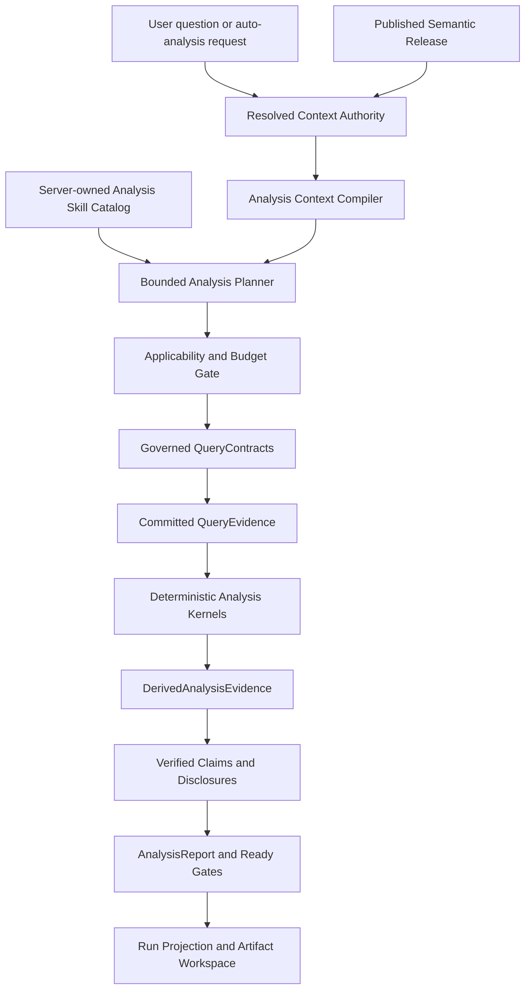
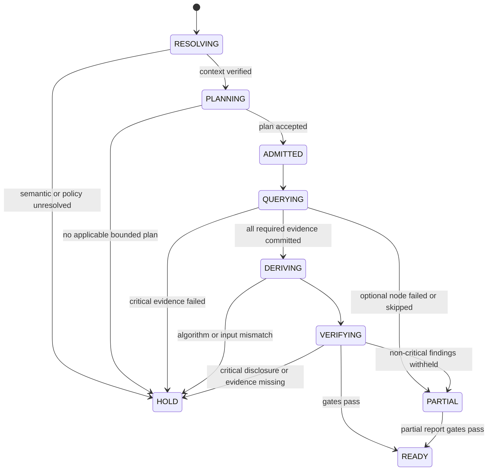
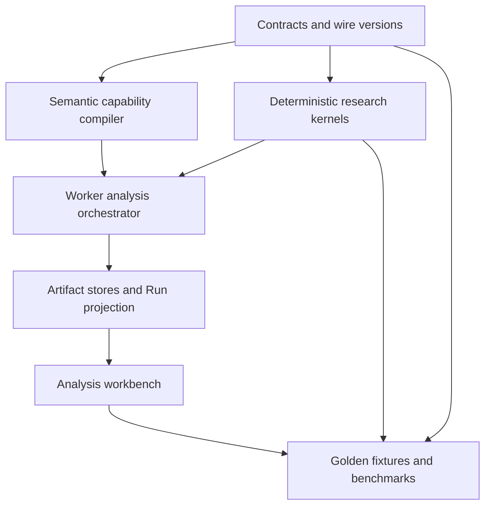
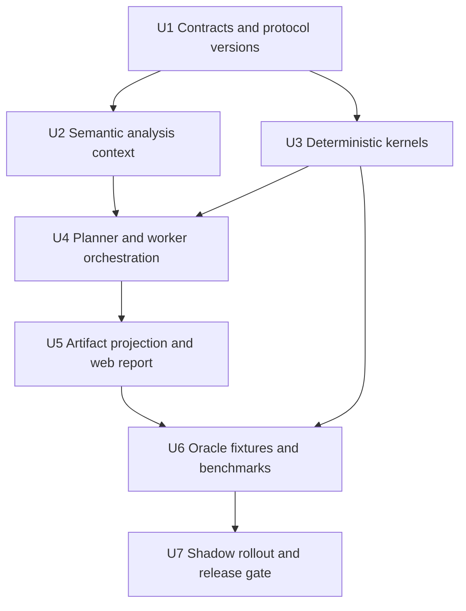

# feat: 基于本体语义层的确定性自动数据分析

## Summary

本计划为 Data Agent 增加一套“自动发现问题、确定性计算、证据化解释”的分析能力，首批覆盖五类函数：

1. 趋势与变化幅度；
2. 分组贡献与集中度；
3. 异常检测；
4. 相关、离群与完整性；
5. 基线预测与回测。

核心不是把一个通用 DataFrame Agent 接到产品里，而是让现有本体语义层先把业务问题编译成不可歧义的
`AnalysisContext`：指标、公式、单位、粒度、时间域、可用维度、过滤条件、Join、空值策略、权限和发布版本均来自
冻结的 Published Semantic Release。确定性分析技能只消费这个上下文及受治理 `QueryEvidence`，不能自行猜测列角色、
改写指标定义或越过策略边界。

运行时由主 Agent 在服务端注册的技能目录中选择分析函数，Host 再确定性校验适用条件、预算和输入合同。SQL 负责在
数据库侧完成受治理聚合，TypeScript 分析内核负责趋势、稳健统计、贡献闭包、异常、相关和回测计算；大模型只负责规划
候选与将已经封存的结论组织成自然语言。所有数字、图表、方法、参数、局限和语义版本进入同一条 Artifact 证据链，
前端只投影已接受结果，不自行重算。

首版明确不做因果归因。贡献表示“观察到的变化由哪些互斥分组构成”，相关表示“在相同粒度和窗口中的统计关联”，异常
表示“相对已声明基线的偏离”，预测表示“经过回测的基线外推”。它们都不能被系统自动升级为“问题原因”或执行建议。

---

## Problem Frame

### 用户希望得到的产品行为

用户上传文件或连接数据源后，只需提出“分析这份销售数据”“最近发生了什么”这类宽问题，系统即可自动完成：

- 识别应分析的业务指标、时间范围和可用业务维度；
- 发现显著趋势、突变、异常区间和数据质量问题；
- 计算哪些商品、渠道、地区或人群贡献了最多变化，以及影响是否集中；
- 检查指标间相关、组内离群点与数据完整性；
- 在数据条件足够时给出基线预测、区间和回测结果；
- 生成摘要卡片、趋势图、贡献排名、异常标记、优先级矩阵和排查方向；
- 点击任一结论都能看到指标口径、算法版本、参数、输入证据和限制条件。

### 当前底座已经具备的能力

- `packages/contracts/src/artifacts/semantic-governance.ts` 已定义指标公式、单位、粒度、时间域、可加性、空值和
  fanout 语义，不需要再用列名启发式推断业务角色。
- `packages/contracts/src/context/resolved-context-package.ts` 已冻结 Published Metric、Ontology、Relationship、
  Semantic Release、Schema Snapshot 和 Policy 上下文，可作为分析编译的唯一语义输入。
- `packages/contracts/src/artifacts/research/` 已有 `ResearchBrief@2`、`EvidencePlan@2`、
  `QueryEvidence@2`、`AtomicClaim@2`、Report Manifest 和 Report Ready 门控。
- `packages/semantic/src/compiler/contribution-profile-compiler.ts` 已对可加指标、粒度、互斥分区和贡献闭包采取
  fail-closed 降级，证明仓库已有正确的“语义先于算法”方向。
- `packages/research/src/observation.ts` 已有标量观察和受控贡献闭包验证；
  `packages/research/src/reporting.ts` 已有确定性报告投影。
- `packages/agent-runtime/src/tools/registry.ts` 已有 Server-owned Tool Registry，模型只能选择已注册工具。
- `apps/worker/src/teams/production-team-tools.ts` 已能提交 QueryEvidence、AnalysisReport 和图表工作区文档；
  `apps/web/src/components/workbench/analysis-report-document.tsx` 已从 Run Projection 渲染报告候选。

### 仍缺失的关键层

1. 语义合同还没有表达“某指标允许做哪些分析、采用什么时间补齐策略、最少样本量、预测季节性”等分析能力。
2. 当前 QueryEvidence 主要证明数据库查询结果，尚无一等的“由哪些 QueryEvidence、算法和参数确定性派生”的统计证据。
3. AtomicClaim@2 只支持描述、比较和受控贡献，不能完整表达关联、异常、质量和预测结论。
4. Worker 示例路径仍是固定 table-count/monthly-trend，未形成通用技能注册、分析计划和受预算的执行 DAG。
5. 当前报告 UI 能显示声明与证据，但缺少分析方法、异常区间、贡献矩阵、回测质量和逐结论证据抽屉。
6. `packages/evals/src/test-center/analysis-agent.ts` 的确定性 CSV Profiling 是评测基线，不消费发布语义、
   QueryEvidence 或运行权限，不能直接成为生产权威路径。

---

## Goals and Success Criteria

### Functional Goals

- G1. 宽问题可自动生成一份有界 `AnalysisPlan`，覆盖适用的首批五类技能；不适用的技能返回机器可读原因。
- G2. 相同的冻结语义上下文、查询结果、技能版本和参数必须生成逐字节相同的统计证据与声明。
- G3. 每个结果均绑定 Published Semantic Release、Schema Snapshot、Policy Receipt、QueryEvidence、算法版本和参数。
- G4. 指标可加性、单位、粒度、时间域、空值、Join 和权限不满足时 fail closed，不以“尽力而为”生成结论。
- G5. 自动报告可呈现截图中的趋势、异常、影响商品、贡献集中度、排查顺序和基线预测，但清楚标识证据等级。
- G6. 用户可从任一数字或图表反向导航到语义定义、查询证据、确定性派生过程和局限。

### Requirements

- R1. 所有分析必须绑定冻结的 Published Semantic Release、Schema Snapshot、Policy Receipt 和 Resolved
  Context；未发布 Candidate 或关系索引投影不能成为运行 Authority。
- R2. 首批五类能力必须通过 Server-owned Skill Descriptor 注册；模型只能选择技能和受限参数，不能提交算法、
  代码、executor 或权限。
- R3. 每个技能必须先通过指标公式、单位、粒度、时间域、可加性、空值、缺期、Join、敏感性和预算适用性检查。
- R4. 数据库观察继续使用 QueryEvidence；统计派生必须使用独立、可重算的 DerivedAnalysisEvidence，不得混淆。
- R5. 同一权威输入、算法版本和参数必须生成相同结果/hash；未知版本、输入漂移和重算不一致必须 HOLD。
- R6. 趋势、贡献、异常、关联、质量和预测必须遵守各自的数学前提、样本门槛和 fail-closed reason code。
- R7. 贡献和相关不得被投影为因果结论；预测必须回测并与 naive baseline 比较。
- R8. 一个分析 Run 使用有界 DAG 和全局资源预算；单个节点不能通过拆分查询绕过 SQL/行数/时间上限。
- R9. AtomicClaim/Report 采用显式新协议版本扩展证据和 Claim Mode，历史 @2 读取语义保持不变。
- R10. UI、图表、Tooltip 和方法抽屉只消费已接受 Run/Artifact Projection，不自行重算统计或推断 Ready。
- R11. 每个公开结论都必须具备 source refs、method、parameters、coverage、limitations 和强制 disclosure。
- R12. 自动分析默认策略只枚举已配置 Primary Metrics 与已批准维度，不能无界扫描数据源或全部本体对象。
- R13. Candidate、敏感明细、原始 Provider Payload、私有推理、SQL 参数和凭据不得进入公共事件或投影。
- R14. 每项技能具备独立 Golden Oracle、性能预算、Shadow 指标、kill switch 和发布门。

### Acceptance Metrics

- 同一 Fixture 重放 100 次，所有 Analysis Artifact content hash 完全一致。
- 对已支持技能，Golden Fixture 的数值、排序、边界点、reason code 和 disclosure 100% 通过。
- 所有统计声明均有完整 source refs；缺任一权威输入时 Report Ready 必须 HOLD。
- 贡献闭包满足 `总变化 = 已列分组贡献 + 其他/残差`，容差由合同固定且不能由模型输入。
- 预测只有在冻结回测集上优于季节性朴素或朴素基线时才显示为“可用基线预测”；否则显示“未通过回测”。
- 相关性报告 100% 携带 `STATISTICAL_ASSOCIATION_NOT_CAUSATION` disclosure。
- 未发布指标、越权维度、非可加指标贡献、样本不足、窗口不齐和未知算法版本均被确定性拒绝。

---

## Scope Boundaries

### In Scope

- 首批五类确定性分析技能及其适用性编译、执行、证据合同、报告投影和评测。
- 已发布语义指标；一个 Run 可包含多个指标，但每个 QueryContract 继续只执行一个指标，分析计划通过多个有界步骤组合。
- PostgreSQL 受治理查询路径；数据库负责聚合和裁剪，统计内核消费有界的已验证结果。
- TypeScript 纯函数统计内核；所有算法、默认参数和 reason code 由服务端版本化。
- 自动分析、明确问题分析和用户追问三种入口复用同一底层计划/证据协议。

### Out of Scope

- 因果推断、实验设计、干预效果、自动根因裁决和 Attribution F9 发布。
- 自动修改本体、指标公式、阈值、业务规则或 Published Semantic Release。
- 任意模型生成并执行 Python/SQL/JavaScript 统计代码。
- 自动执行退款、调价、补货、通知、工单等业务动作。
- 实时流式异常监控和在线模型训练；首版针对冻结数据窗口的批分析。
- 通用 AutoML、多变量深度学习预测、用户上传自定义算法包。
- 为追求通用性一次支持所有数据源方言；首版通过现有 PostgreSQL 编译/沙箱路径建立正确闭环。

### Evidence Language Boundary

| 证据类型 | 允许用语 | 禁止自动升级为 |
|---|---|---|
| 趋势/变化 | 上升、下降、环比/同比变化、拐点 | 导致、引起 |
| 贡献/集中度 | 构成变化、占变化的比例、集中于 | 根因、责任方 |
| 异常 | 相对基线显著偏离、超出区间 | 故障、欺诈 |
| 相关 | 正/负相关、稳健性一致/不一致 | 因果关系 |
| 离群/完整性 | 离群候选、缺失率、覆盖缺口 | 数据错误（未验证前） |
| 预测 | 基线预测、回测误差、预测区间 | 承诺、确定未来结果 |

---

## Open-Source Research and Adopt / Adapt / Reject

### Automated Data Analyst 固定源码结论

参考 `automated-data-analyst@1034fe96dc6fbe8f298cc3a6d0e7b8e9e63e3bc4`。其生产源码相对上游
`2005d2113161ca468162846cf653e2efc6289943` 无功能漂移，适合作为算法与交互参考。项目已经实现 Trend、
Change Driver、Leader/Concentration、Theil–Sen 异常、Pearson/Spearman 相关、IQR 离群、Completeness 及带
Backtest 的 Forecast，并将 LLM 限制在查询规划和叙述层。

但该项目的语义入口是单表 `ColumnRoles`，依赖列名与数据类型启发式，主要支持一个 measure/date/dimension；
固定执行分析套件，读取内存数据并对数据量做 `head()` 截断；时间序列缺期默认补零；Recommendations 多为硬编码文本。
这些做法不能直接进入 Data Agent 的受治理生产路径。

| 参考做法 | 决策 | Data Agent 映射 |
|---|---|---|
| Evidence before interpretation | 采用 | 统计内核先提交派生证据，模型后叙述 |
| Typed QueryPlan + local executor | 采用并扩展 | `AnalysisPlan` + 服务端技能目录 + Host Gate |
| 趋势、稳健异常、相关、回测基线 | 采用算法思想 | 重新实现为版本化 TypeScript 内核与 Golden Fixture |
| `ColumnRoles` | 改造 | 由 Published Semantic Release 编译 `AnalysisContext` |
| 固定分析套件 | 改造 | 根据语义适用性和预算选择有界技能 DAG |
| 缺失时间自动补零 | 拒绝 | 只按指标显式 `missing_period_policy` 处理 |
| 内存读取与固定行截断 | 拒绝 | SQL pushdown + Result Budget + 失败原因 |
| 硬编码 Recommendation | 拒绝 | 仅输出排查候选；行动必须有独立业务规则/审批 |
| Contribution 等同 Cause | 拒绝 | 永久使用描述性贡献并披露非因果边界 |

### 其他参考项目的用途

- PyRCA：参考可插拔分析方法与诊断图组织方式，但不引入其因果 RCA 结论作为首版能力。
- WrenAI：参考语义建模与受语义约束的自然语言分析，不增加第二套语义 Authority。
- Data Formulator：参考模型生成可视化意图、确定性系统执行转换的职责分离。
- InsightBench：作为自动分析覆盖度、洞察质量和非重复性的外部评测思路；生产正确性仍由本地 Deterministic Oracle 判定。

---

## Key Technical Decisions

| 决策面 | 选择 | 理由 |
|---|---|---|
| 语义 Authority | PostgreSQL Published Semantic Release / Resolved Context | 避免列名猜测和第二套语义层 |
| 分析执行 | SQL 聚合 + TypeScript 确定性内核 | 首版不依赖尚未落地的任意 Python Sandbox |
| 模型职责 | 选择已注册技能、提出有界参数、组织已封存结论 | 保留自动性，同时不让概率模型决定数值与权限 |
| 派生证据 | 新增一等 `DerivedAnalysisEvidence@1` | 不能把统计派生结果伪装成原始 QueryEvidence |
| Claim 兼容 | 新增 AtomicClaim 协议版本，保留 @2 历史读取 | 关联/预测/质量需要新 Claim Mode，不能静默改写 v2 |
| 探索与假设 | AnalysisPlan 是 ResearchBrief 的确定性探索分支 | 不为满足 HypothesisSet 最小数量而制造虚假假设，仍复用证据/Claim/Report Authority |
| 计划形态 | 有界 DAG，每节点单技能、单指标或明确指标对 | 复用单指标 QueryContract，支持并行且便于预算/重放 |
| 时间缺口 | 由指标分析语义显式声明 | 交易流量、余额、比率对缺期含义不同 |
| 预测门槛 | 必须回测且优于朴素基线 | 防止“能拟合”被误认为“可预测” |
| 推荐 | 排查候选而非自动行动 | 统计证据不等于业务处方或审批 |
| UI Authority | Run Projection + Artifact Workspace | 图表与文字必须投影同一证据，不能前端重算 |

### 为什么不采用其他方案

| 方案 | 结论 | 原因 |
|---|---|---|
| 直接嵌入 Automated Data Analyst | 拒绝 | 单表角色推断、内存执行和证据合同不满足本项目边界 |
| LLM 生成 pandas/SQL 完成所有分析 | 拒绝 | 不可复算，算法/权限/资源边界由模型决定 |
| 把所有分析结果塞入 QueryEvidence | 拒绝 | 混淆数据库观察与统计派生，无法独立校验算法版本 |
| 新建独立语义分析平台 | 拒绝 | 会形成第二 Authority，与现有本体、Context、L2 Artifact 重叠 |
| 首版引入完整 Python 科学计算栈 | 暂缓 | 当前 Python Sandbox 仍是冻结设计；五类基线算法可用纯 TS 实现 |
| 首版直接做根因分析 | 拒绝 | 贡献、相关与异常不能证明因果，F9 仍为 NOT_REGISTERED/HOLD |

---

## High-Level Technical Design

以下图和合同草图用于帮助评审方案形态，是方向性设计，不是要求实现者逐字复制的代码规范。

### Component Interaction



### End-to-End Runtime Flow

1. API 创建 Run，冻结 Principal、Datasource、Model Profile、Semantic Release、Schema Snapshot、Policy 和
   Resolved Context Receipt。
2. `AnalysisContextCompiler` 从冻结语义构建指标级能力视图，不读取未发布 Candidate，也不依赖 Neo4j 才能成立。
3. 主 Agent 或“自动分析默认策略”从当前可用技能目录生成 `AnalysisPlanCandidate`。Host 解析稳定 Skill ID，
   收窄时间窗、维度、指标数、SQL 次数和输出行数后提交权威计划。
4. 每个计划节点先执行 applicability gate。不能分析时提交 `SKIPPED` 节点结果与 reason code，而不是悄悄换算法。
5. 查询编译继续走现有 SemanticQuery → LogicalPlan → SqlArtifact → Gate/Permit → QueryEvidence 链。
6. 确定性内核只读取已经提交、Schema 匹配且与计划同一 Run/语义前沿的 QueryEvidence/SandboxResult。
7. 内核提交 `DerivedAnalysisEvidence@1`：输入 refs、算法、参数、输入摘要、结果、质量指标、局限和派生 hash。
8. Research Kernel 将派生证据投影为版本化 AtomicClaim、EvidenceRelation、SupportDecision 和 Report Manifest；
   任何关联/预测/异常 Claim 都带强制 disclosure。
9. `AnalysisCompletionReceipt` 证明所有 Critical 节点均有 terminal 状态、Optional 节点的缺失已披露和预算闭合；
   自动探索不伪造 HypothesisSet/ResearchStopDecision。
10. Report Ready 门控重验语义版本、输入证据、派生 hash、Claim Mode、completion receipt 和 disclosure 后才允许
   UI 显示为已验证结果。
11. 前端通过同一个 Run Projection 显示报告、图表和证据抽屉；刷新或 SSE 重连只重放状态，不重算统计。

### Runtime State Machine



---

## Core Contracts

### 1. Ontology-Grounded Analysis Context

不新建独立持久化语义模型。`AnalysisContext` 是从 Resolved Context + Published Semantic Release 计算出的
Run-bound 派生合同，可内嵌在 Analysis Plan 并绑定 `context_hash`：

```ts
interface AnalysisMetricContext {
  metric_ref: MetricRef;
  formula_hash: ContentHash;
  unit: Unit | null;
  grain: Grain;
  time_domain: TimeDomain | null;
  time_dimension_ref: string | null;
  additivity: "additive" | "semi-additive" | "non-additive";
  null_policy: "preserve" | "coalesce-zero" | "exclude" | "propagate";
  missing_period_policy: "ZERO_IF_SEMANTICALLY_EMPTY" | "NULL" | "REJECT_GAP";
  allowed_dimension_refs: string[];
  analysis_capabilities: AnalysisCapability[];
}

interface AnalysisContext {
  schema_version: "analysis-context@1.0.0";
  resolved_context_binding: {
    package_id: string;
    package_hash: ContentHash;
    receipt_id: string;
    receipt_hash: ContentHash;
  };
  semantic_release_ref: SemanticReleaseRef;
  schema_snapshot_ref: SchemaSnapshotRef;
  policy_receipt_ref: PolicyReceiptRef;
  metrics: AnalysisMetricContext[];
  context_hash: ContentHash;
}
```

`ResolvedContextPackage@1` 当前只投影 Metric ID、mapping/formula hash，并不携带完整可加性和时间语义；Compiler
必须按其中冻结的 Semantic Release identity 从 PostgreSQL Authority 解析已提交的 Source Bundle/Release Document，
不能只靠 Context 摘要推断。`missing_period_policy` 与 `analysis_capabilities` 通过显式版本化的发布材料进入
`SemanticSourceBundle@2` 并参与 release hash；Ontology Package 只增加对该版本发布材料的绑定，不复制这些字段；
`SemanticSourceBundle@1` 保持历史读取，不能
静默增加字段改变既有 hash。没有显式策略时采用最保守默认：时间缺口保持 NULL；贡献、异常和预测可因不连续而拒绝，
绝不通用补零。

### 2. Server-Owned Analysis Skill Descriptor

```ts
interface AnalysisSkillDescriptor {
  skill_id:
    | "trend-change@1"
    | "contribution-concentration@1"
    | "robust-anomaly@1"
    | "association-outlier-completeness@1"
    | "baseline-forecast-backtest@1";
  input_contract_version: string;
  output_contract_version: string;
  required_capabilities: AnalysisCapability[];
  parameter_schema: JSONSchema;
  hard_limits: {
    max_metrics: number;
    max_dimensions: number;
    max_series_points: number;
    max_groups: number;
    max_sql_executions: number;
  };
  algorithm_version: string;
  mandatory_disclosures: string[];
}
```

Descriptor 与 executor 由服务端一起注册。Provider 只能选择 Skill ID 和 schema 允许的参数，不能提交代码、工具描述、
算法版本、任意阈值或 executor。自动分析默认策略也使用同一 Registry，不走隐藏特权路径。

### 3. Analysis Plan

`AnalysisPlan@1` 是有界 DAG。每个节点声明语义输入、查询模板、技能参数、依赖、重要性和失败行为：

```ts
interface AnalysisPlanNode {
  node_id: string;
  skill_id: string;
  metric_refs: MetricRef[];
  dimension_refs: string[];
  time_window: HalfOpenTimeWindow;
  comparison_window: HalfOpenTimeWindow | null;
  parameters: JsonValue;
  dependency_node_ids: string[];
  activation_rule:
    | { kind: "ALWAYS" }
    | { kind: "MATERIAL_CHANGE"; source_node_id: string; policy_threshold_id: string }
    | { kind: "HISTORY_SUFFICIENT"; source_node_id: string; minimum_points: number };
  criticality: "CRITICAL" | "OPTIONAL";
}

interface AnalysisPlanPayload {
  artifact_type: "AnalysisPlan";
  protocol_version: "analysis-plan@1.0.0";
  brief_ref: ResearchBriefRef;
  analysis_context_hash: ContentHash;
  nodes: AnalysisPlanNode[];
  budget: ResearchBudgetLimit;
  planner_kind: "DETERMINISTIC_DEFAULT" | "MODEL_CANDIDATE_HOST_VERIFIED";
  plan_hash: ContentHash;
}
```

默认上限建议从 `3 metrics × 5 dimensions × 16 SQL executions × 5,000 series/group rows` 起步，最终值由性能
基准冻结。时间序列节点单独限制为最多 512 个有序点，分组节点最多 5,000 组；计划不能通过把一个查询拆成多个节点
绕过总预算。条件节点只能使用服务端注册的 `activation_rule`，不能执行模型表达式或自由代码。

### 4. Derived Analysis Evidence

`DerivedAnalysisEvidence@1` 明确区分数据库观察和统计派生：

```ts
interface DerivedAnalysisEvidencePayload {
  artifact_type: "DerivedAnalysisEvidence";
  protocol_version: "derived-analysis-evidence@1.0.0";
  plan_ref: AnalysisPlanRef;
  node_id: string;
  skill_id: string;
  algorithm_version: string;
  query_evidence_refs: QueryEvidenceRef[];
  parameter_hash: ContentHash;
  input_closure_hash: ContentHash;
  result: AnalysisResultUnion;
  quality: AnalysisQualityUnion;
  limitation_codes: string[];
  derivation_hash: ContentHash;
}
```

Verifier 必须重新解析输入 Artifact、重建 canonical input、调用同版本纯函数并比对 `derivation_hash`；只验证
Payload 自身 hash 不足以证明计算正确。

### 5. Versioned Claim and Report Evolution

- 保留 AtomicClaim@2、ReportManifest@2 和 AnalysisReport@2 的历史读取与现有生产语义。
- 新增 AtomicClaim@3，使 Observation Binding 可引用 `QueryEvidence | DerivedAnalysisEvidence`，并增加
  `QUALITY | ASSOCIATIVE | PREDICTIVE` 三种非因果 Claim Mode。
- `DESCRIPTIVE | COMPARATIVE | DIAGNOSTIC` 保持原语义；`DIAGNOSTIC` 仍只表示封闭贡献分解，不表示因果。
- 新增 `AnalysisCompletionReceipt@1`，证明 AnalysisPlan 的 Critical/Optional 节点、预算和 limitation closure；
  它是自动探索分支的终止证据，不冒充 `ResearchStopDecision`。
- 新增 ResearchBrief@3 的 `EXPLORATORY_DETERMINISTIC` 模式，以及 ReportManifest@3 / AnalysisReport@3 的
  AnalysisPlan/Completion Receipt 输入；已有假设研究继续使用 HypothesisSet/EvidencePlan/ResearchStopDecision，
  不能静默改变 @2 Section 的解释。
- EvidenceRelation 和 Check Receipt 必须能引用派生证据，并验证 Algorithm Version、Input Closure 和强制披露。

---

## Deterministic Skill Specifications

### Skill A: Trend and Change Magnitude

**输入前提**

- 指标存在明确 Time Domain/Time Dimension；
- 请求 grain 不细于指标可执行 grain；
- 比较窗口按同一 Calendar、Timezone 和半开区间对齐；
- partial-period 策略明确，默认排除未完成周期并披露。

**确定性输出**

- 每周期值、绝对变化、相对变化；
- 环比、同比或用户指定基线；
- 首末值、峰谷、最大单期升降、连续上升/下降长度；
- 通过分段斜率或固定阈值识别的拐点候选；
- coverage、缺期、部分周期和分母为零状态。

**边界**

- 相对变化分母为零时输出 `RELATIVE_DELTA_UNDEFINED`，不制造无穷百分比；
- 比率和半可加指标按自身公式在目标粒度重算，不能对已聚合比率求平均；
- 时间缺口只按语义策略补齐。

### Skill B: Group Contribution and Concentration

**输入前提**

- 指标必须 additive，或存在已发布且可 lowering 的 Descriptive Contribution Profile；
- baseline/current 使用同一 metric、unit、grain、population 和 canonical predicates；
- 分组维度可查询，分组集合有稳定排序和 Other/Residual 处理。

**确定性输出**

- 每组 baseline、current、signed delta、变化占比、当前占比；
- Top-K 与 Other/Residual，完整贡献闭包；
- HHI、有效分组数 `1 / sum(share²)`、Top1/Top3/Top5 concentration；
- `impact = abs(delta)` 与 `severity` 组成的优先级矩阵数据；阈值来自版本化分析策略，不自动判根因。

**边界**

- HHI 只用于非负且份额有意义的度量；存在负值时返回 `CONCENTRATION_NOT_APPLICABLE`；
- 每个集中度结果明确声明 `CURRENT_LEVEL` 或 `ABSOLUTE_CHANGE` 计算基准，不能在报告中混用；
- 净变化接近零但正负组大幅抵消时，同时展示 gross positive/gross negative，避免份额爆炸；
- 未能证明分组互斥完备时只输出排名，不输出“贡献闭包”。

### Skill C: Robust Anomaly Detection

**首版算法**

- 对连续有序时间序列使用 Theil–Sen 趋势估计；
- 残差尺度使用 MAD/稳健尺度；
- 根据冻结 false-alarm policy 计算上下界和 anomaly score；
- 可选已发布 seasonal period；没有季节性语义时不自行猜测周期。
- Exact Theil–Sen 只接受最多 512 个有序点；超限由 SQL 按已声明 grain 聚合，不能在内核中随机抽样或截头。

**确定性输出**

- 异常点/区间、方向、偏离绝对值与相对值、稳健 z-score；
- 预期基线及置信带、连续异常长度；
- 样本量、有效覆盖、校准策略、重尾/常数序列警告。

**边界**

- 样本不足、缺口过多、常数序列或季节周期不完整时 fail closed 或降级为简单变化提示；
- 异常标签表示统计偏离，不自动标记系统故障；
- 阈值来自版本化 policy，不允许模型以自然语言覆盖。

### Skill D: Association, Outlier and Completeness

**Association**

- 两个指标必须在同一 population、时间窗口、grain 和 dimension slice 上对齐；
- 输出 Pearson r + Fisher CI、Spearman rho、有效样本量、missing pair 数；
- 同一计划扫描多个指标对时使用冻结的多重比较策略（首版 Benjamini–Hochberg q-value）并限制 pair 数；
- Pearson/Spearman 方向或强度显著不一致时标记 `OUTLIER_SENSITIVE_ASSOCIATION`；
- 禁止使用“影响”“驱动”“导致”等因果表述。

**Outlier**

- 连续数值使用 IQR fence 和 MAD score；
- 分组离群必须先按相同业务 grain 聚合，避免把原始明细大额值与聚合指标混为一谈；
- 权威证据可保留受控候选 ref，但公共投影只返回聚合组、数量和分位边界；行级 key/hash 需要独立授权 drill-down，
  不能把稳定 hash 当成匿名化数据直接公开。

**Completeness**

- 计算物理列 NULL、业务必填缺失、时间覆盖、期待分组覆盖和唯一性冲突；
- “业务必填”来自 Published Constraint，不从数据频率猜测；
- 数据质量结果是独立 finding，不能悄悄删除缺失记录后继续给出高置信分析。
- 所有分组输出执行 Policy 中的 `minimum_group_size`、小单元格抑制和 Top-K/Other；被抑制组计入 coverage/Other，
  不能从总计反推出敏感小组。

### Skill E: Baseline Forecast and Backtest

**首版候选模型**

- naive last value；
- seasonal naive（仅有已发布 seasonal period 时）；
- Theil–Sen trend；
- 可选 trend + deterministic seasonal residual，必须满足完整周期要求。

**模型选择和回测**

- 时间顺序 Holdout 或 Rolling Origin，不允许随机切分；
- 使用 MAE、MAPE（分母安全时）、MASE 和区间覆盖率；
- 复杂候选必须显著优于冻结的 naive baseline，否则选择 naive 或返回 `FORECAST_NOT_USEFUL`；
- horizon 不超过训练窗口的冻结比例，预测区间随 horizon 扩宽；
- 结果绑定 training window、holdout window、model version、error metrics 和 backtest hash。

**边界**

- 不输出未经回测的未来曲线；
- 结构突变、历史不足、间隔不规则、缺期策略不明确时不预测；
- 预测只作为基线，不能自动转化为预算、库存或销售承诺。

---

## Automatic Analysis Planning Policy

### Broad Request Default Plan

“分析这份销售数据”不会枚举所有指标和维度。Host 使用确定性候选生成器先收窄：

1. 从 Resolved Context 选择用户明确提及的指标；若未提及，使用 Workspace 明确配置的 Primary Metrics，
   不按物理列数量猜测。
2. 为每个指标确定最近完整窗口和比较窗口；时间域不完整的指标只做质量/分布检查。
3. 按发布的 `analysis_priority` 和维度基数预算选择最多 5 个维度；敏感或越权维度不可见。
4. 先做趋势与完整性；发现物质变化后再展开贡献与异常；存在两个可比较指标时再做关联；历史满足门槛时再做预测。
5. 对重复或高度重叠 findings 做确定性去重，以 evidence identity + statement type，而不是 LLM 文本相似度为准。
6. 报告最多展示冻结数量的 material findings，其余保留在 Evidence Ledger，可在追问时读取。

### Model-Assisted Plan

模型可根据用户问题从目录中选择技能、指标、维度和受限枚举参数，但 Host 必须：

- 验证所有 ID 来自冻结目录；
- 验证维度与指标的语义/Join closure；
- 将时间表达式解析为确定的半开区间；
- 丢弃超预算节点，不自动扩大资源；
- 为不可恢复错误返回结构化 clarification 或 HOLD；
- 把最终接受的计划而非原始模型输出作为重放 Authority。

---

## Concrete Example: Sales Return-Rate Investigation

用户问题：

> 分析商品销售数据，找出最近表现异常的数据，定位影响最大的商品，整理可视化排查图。

假设发布语义中已有 `return_rate`、`gross_profit`、`product`、`gender_category`、`order_month`：

1. Context Compiler 确认 `return_rate` 是 ratio/non-additive，时间 grain 为 month，缺期策略为 REJECT_GAP；
   `gross_profit` 是 additive currency。
2. Trend Skill 对 `return_rate` 在最近 6 个完整月重算月度比率，识别 4 月起的持续上升与异常区间。
3. Contribution Skill 不能直接对 return rate 做加法贡献，因此编译为已发布的 numerator/denominator decomposition，
   或返回 `NON_ADDITIVE_CONTRIBUTION_NOT_LOWERABLE`；绝不直接累加退货率。
4. 对 `gross_profit` 按 product 执行 baseline/current signed delta，得到影响金额、Top-K、Other 和闭包。
5. Concentration 计算 Top1/Top3 与有效商品数；Priority Matrix 使用影响金额和退货异常严重度显示 P0/P1/P2。
6. Association Skill 可报告商品月度退货率与利润变化的统计关联，但附非因果披露。
7. Report 生成：异常概览、趋势图、影响商品排名、品类分布、优先级矩阵、证据与方法、下一步排查候选。
8. “供应商质量”“尺码不适”等只能来自已发布业务假设/规则或用户提供信息，并标为待验证假设；系统不能从
   退货率曲线直接宣称原因。

---

## API and Tool Protocol

### Public Request

保持现有 Q&A Run 入口，只增加结构化 analysis intent，不另建绕过 Run Authority 的同步分析 API：

```json
{
  "question": "分析最近六个月商品销售异常",
  "analysis_mode": "AUTO",
  "requested_skill_ids": [],
  "time_window": null
}
```

- `AUTO`：确定性默认候选 + 可选模型计划；
- `EXPLICIT`：用户明确指定趋势、贡献、异常等技能；
- `FOLLOW_UP`：复用原 Run 的已提交 Artifact，通过新计划 Revision 增量分析。

### Internal Tool Calls

建议提供稳定工具面，而不是五个模型可自由改写的执行器：

```ts
analysis.plan.propose({
  skill_ids,
  metric_refs,
  dimension_refs,
  time_window,
});

analysis.plan.execute({ analysis_plan_ref });

analysis.evidence.read({
  evidence_refs,
  projection: "SUMMARY" | "METHOD" | "CHART_DATA",
});
```

`analysis.plan.execute` 内部解析 Server-owned Descriptor 并调用真实 executor；模型不可直接调用 kernel 函数。

### Public Events

Run Event 只公开：

- `ANALYSIS_PLAN_ACCEPTED`：技能数量、指标数量、预算摘要；
- `ANALYSIS_NODE_STARTED/COMPLETED/SKIPPED`：Skill ID、状态、公开 reason code、Artifact ref；
- `ANALYSIS_REPORT_READY/PARTIAL/HOLD`：报告 ref 与披露摘要。

不得公开原始 Provider Payload、私有推理、未脱敏行、SQL 参数、Policy 内容或凭据。

---

## UI Projection

### Report Layout

在现有 Analysis Workbench 上扩展，不创建第二个结果页面：

1. **分析概览**：异常数量、窗口、受影响维度、预计影响、报告状态；
2. **趋势与异常**：基线、实际、置信带、异常点、comparison series；
3. **贡献与集中度**：signed bar/waterfall、Top-K、Other、HHI/有效分组数；
4. **关联、离群与完整性**：相关矩阵/散点摘要、离群候选、质量卡；
5. **预测与回测**：训练/回测/预测分区、区间、MASE/MAPE、是否胜过 naive；
6. **优先级与排查候选**：Evidence-derived P0/P1/P2 矩阵；不显示为已批准行动；
7. **方法与证据**：指标口径、语义版本、算法、参数、样本量、limitations、source refs。

### Projection Rules

- Chart data 从 `DerivedAnalysisEvidence` 的安全 projection 生成，前端不得重新计算 anomaly、contribution 或 forecast。
- Tooltip 必须显示单位、时间语义、数据覆盖与异常/预测含义。
- 未通过回测、样本不足或不适用的技能显示原因，不用空白图误导用户。
- `READY / PARTIAL / HOLD`、`OBSERVED / ASSOCIATIVE / PREDICTIVE` 标签在刷新和 SSE 重放后保持一致。
- 颜色不能是状态的唯一载体；所有图表提供键盘可达的明细表、文本摘要和 screen-reader label，窄屏按
  “结论 → 图表 → 方法”渐进展开。
- 优先级仅表示排查顺序；行动建议若无业务规则/审批证据，统一显示“候选”。

---

## System-Wide Impact



- **Contracts**：增加 Artifact type、引用、版本化 payload、reason code、公共事件与安全 projection。
- **Semantic**：从发布语义编译分析适用性；继续以 PostgreSQL authority 为准，Neo4j 只辅助关系导航。
- **Research**：新增纯函数统计内核、重算 verifier、claim/report 投影；不能依赖数据库或模型。
- **Worker**：生成/接受有界计划、执行 QueryContract DAG、提交派生证据与报告。
- **Platform**：持久化新 Artifact、幂等提交、重放 Run Projection 和安全 Chart Projection。
- **Web**：仅渲染权威 projection，增加方法/证据抽屉和分析类型可视化。
- **Evals**：覆盖数学正确性、语义拒绝、报告证据、模型计划质量和端到端用户体验。

### Stakeholders

- 业务分析用户获得可解释的自动报告，但需要理解“统计证据不等于根因/行动审批”的固定提示。
- 语义治理人员需要为指标发布分析能力、缺期和季节性语义，并承担口径正确性审阅。
- 平台/算法开发者维护版本化技能、Golden Oracle 和兼容读取，不维护 Workspace 私有脚本。
- 运维与安全团队按技能观察成本、失败、敏感投影和 kill switch，不需要读取模型私有推理。

## Output Structure

目录结构是计划范围说明；实施中若现有模块边界提供更合适的 owner，可在不改变 Authority 和合同边界的前提下调整。

```text
packages/contracts/src/artifacts/research/
└── analysis.ts
packages/semantic/src/analysis/
├── context-compiler.ts
├── applicability.ts
└── index.ts
packages/research/src/deterministic-analysis/
├── common.ts
├── trend.ts
├── contribution.ts
├── anomaly.ts
├── association-quality.ts
├── forecast.ts
├── verifier.ts
└── index.ts
apps/worker/src/analysis/
├── skill-catalog.ts
├── default-plan.ts
├── plan-gate.ts
└── executor.ts
```

---

## Implementation Units



- U1. **Versioned Analysis Contracts**

**Goal**: 建立不破坏现有 @2 语义的分析计划、派生证据、Claim 和报告 wire 合同。

**Requirements**: R4, R5, R7, R8, R9, R11, R13.

**Owned files**

- `packages/contracts/src/artifacts/types.ts`
- `packages/contracts/src/artifacts/research/references.ts`
- `packages/contracts/src/artifacts/research/primitives.ts`
- `packages/contracts/src/artifacts/research/analysis.ts` (new)
- `packages/contracts/src/artifacts/research/proof.ts`
- `packages/contracts/src/artifacts/research/reporting.ts`
- `packages/contracts/src/artifacts/research/wire.ts`
- `packages/contracts/src/runs/public-events.ts`
- `packages/contracts/test/deterministic-analysis-artifacts.spec.ts` (new)

**Changes**

- Register `AnalysisPlan`、`DerivedAnalysisEvidence` and `AnalysisCompletionReceipt` as L2 types and typed refs.
- Add bounded result unions for five skills, canonical hashing and unknown-version fail-closed behavior.
- Add versioned AtomicClaim/Report contracts for quality, association and prediction without mutating @2 semantics.
- Add public event schemas and stable reason/disclosure codes.
- Preserve historical readers and cross-version rejection tests.

**Tests**

- strict schemas reject extra keys, NaN/Infinity, duplicate refs, cycles, oversize arrays and unknown algorithms;
- content hashes are deterministic under canonical ordering;
- @2 documents still parse historically, @3 cannot be misread as @2;
- claims cannot cite evidence from another Run/Scope or omit mandatory disclosure.

**Dependencies**: none.

**Patterns to follow**: `packages/contracts/src/artifacts/research/wire.ts` 的 preflight、版本显式选择、引用闭包和
canonical hash 模式。

**Verification**: 新旧协议均能按各自语义解析；所有无效引用、未知版本和越界输入在进入 runtime 前被拒绝。

- U2. **Semantic Analysis Context and Applicability Compiler**

**Goal**: 将发布本体语义确定性编译为每个指标的分析能力和拒绝原因。

**Requirements**: R1, R3, R6, R7, R12, R13.

**Owned files**

- `packages/contracts/src/artifacts/semantic-governance.ts`
- `packages/contracts/src/artifacts/ontology-package.ts`
- `packages/contracts/src/context/resolved-context-package.ts`
- `packages/semantic/src/analysis/context-compiler.ts` (new)
- `packages/semantic/src/analysis/applicability.ts` (new)
- `packages/semantic/src/analysis/index.ts` (new)
- `packages/semantic/src/index.ts`
- `packages/semantic/test/analysis-context-compiler.spec.ts` (new)

**Changes**

- 以显式新版本将 missing-period、seasonality、primary metric、analysis capability 和 priority 加入发布语义材料，
  保持现有 `SemanticSourceBundle@1`/Ontology Package 历史读取和 hash 语义不变。
- 从权威 Resolved Context 编译 `AnalysisContext` 及 hash，不把 Neo4j projection 当作必要 Authority。
- 为每种技能返回 `APPLICABLE | NOT_APPLICABLE | REQUIRES_CLARIFICATION` 和稳定 reason code。
- 复用 Contribution Profile Lowering，禁止为非可加指标建立伪贡献闭包。

**Tests**

- additive/non-additive、ratio、semi-additive、无时间域、粒度冲突、时区冲突、null policy、敏感维度；
- 发布版本/hash 漂移被拒绝；Candidate 不可进入运行 Context；
- 未声明缺期策略时不补零；已声明 seasonality 才开放 seasonal forecast。

**Dependencies**: U1.

**Patterns to follow**: `packages/semantic/src/compiler/u5-compiler.ts` 的 lowerability 结果和
`packages/semantic/src/compiler/contribution-profile-compiler.ts` 的 fail-closed witness 校验。

**Verification**: 相同发布语义生成相同 context hash；不满足时间、粒度、可加性或权限条件的技能不可进入计划。

- U3. **Pure Deterministic Analysis Kernels**

**Goal**: 以纯函数实现五类可重算统计内核及派生证据 verifier。

**Requirements**: R4, R5, R6, R7, R11, R14.

**Owned files**

- `packages/research/src/deterministic-analysis/common.ts` (new)
- `packages/research/src/deterministic-analysis/trend.ts` (new)
- `packages/research/src/deterministic-analysis/contribution.ts` (new)
- `packages/research/src/deterministic-analysis/anomaly.ts` (new)
- `packages/research/src/deterministic-analysis/association-quality.ts` (new)
- `packages/research/src/deterministic-analysis/forecast.ts` (new)
- `packages/research/src/deterministic-analysis/verifier.ts` (new)
- `packages/research/src/deterministic-analysis/index.ts` (new)
- `packages/research/src/index.ts`
- `packages/research/test/deterministic-analysis/*.spec.ts` (new)

**Changes**

- 实现有界、无 I/O、无随机或固定 seed 的统计函数。
- 明确数值稳定、固定精度 canonicalization、bytewise stable ordering、相等比较、缺失、零分母和时间对齐规则；
  禁止依赖 locale 排序或运行时默认格式化参与 hash。
- 生成结构化结果与质量指标，不生成自由文本 recommendation。
- 实现从权威输入重算 `derivation_hash` 的 verifier。

**Tests**

- 手算微型 Fixture、边界值、负值、常数序列、缺期、抵消贡献、重复时间戳、样本不足；
- 与独立 Python/R Golden Fixture 比对数值，但生产包不依赖 Python/R；
- property tests：贡献闭包、排序稳定、平移/缩放不变量、无 NaN/Infinity、预测无未来泄漏；
- 性能基准：每节点最大输入在冻结 CPU/内存预算内完成。

**Dependencies**: U1.

**Execution note**: 先建立独立 Golden Fixture 和失败测试，再实现生产算法；Golden 生成器不能成为生产依赖。

**Patterns to follow**: `packages/research/src/observation.ts` 的显式错误结果、有限数检查和 authority cell 重验。

**Verification**: Golden、property、无泄漏和性能基准全部通过，且 verifier 能发现任何结果/参数/input hash 篡改。

- U4. **Analysis Planner, Query Compilation and Worker Orchestration**

**Goal**: 把宽问题或模型候选收敛为有界计划，并通过现有治理查询链执行到派生证据。

**Requirements**: R1, R2, R3, R5, R8, R12, R13.

**Owned files**

- `packages/agent-runtime/src/tools/registry.ts`
- `packages/platform/src/research/postgres-research-authority.ts`
- `apps/worker/src/analysis/skill-catalog.ts` (new)
- `apps/worker/src/analysis/default-plan.ts` (new)
- `apps/worker/src/analysis/plan-gate.ts` (new)
- `apps/worker/src/analysis/executor.ts` (new)
- `apps/worker/src/teams/production-team-tools.ts`
- `apps/worker/src/teams/production-team-runtime.ts`
- `apps/worker/test/analysis/analysis-plan-runtime.spec.ts` (new)

**Changes**

- 注册五个技能 Descriptor/executor，提供 `analysis.plan.propose/execute/evidence.read` 工具。
- 将计划节点编译成一个或多个现有单指标 QueryContract，复用 SQL gate/permit/evidence 路径。
- 根据依赖关系并行无依赖节点，按全 Run 预算、timeout、row limit 和 fence 约束执行。
- 幂等提交计划、节点状态、QueryEvidence、DerivedAnalysisEvidence 和 Report inputs。
- optional 节点失败可生成 PARTIAL；critical 节点失败必须 HOLD。

**Tests**

- 模型选择未知技能、篡改算法、越权维度、超预算、DAG cycle、跨 Run refs 被拒绝；
- 同一 idempotency key 重试不重复 SQL/Artifact；Lease/fence 失效停止提交；
- QueryEvidence schema/hash 不匹配时不运行统计内核；
- 自动计划只选择 Primary Metrics 和已批准维度，不能扫描全库。

**Dependencies**: U2, U3.

**Patterns to follow**: `packages/agent-runtime/src/tools/registry.ts` 的 server-owned allowlist、现有 Run Lease/Fence
和 `apps/worker/src/teams/production-team-tools.ts` 的 committed Artifact 引用。

**Verification**: 一个 E-commerce Fixture 可从 accepted plan 运行到 committed derived evidence；重试、超预算、
越权和 stale fence 均不会产生重复或越界副作用。

- U5. **Artifact Projection and Analysis Workbench**

**Goal**: 将同一权威证据投影为报告、图表、方法与限制，重放后状态一致。

**Requirements**: R4, R7, R9, R10, R11, R13.

**Owned files**

- `packages/contracts/src/artifacts/export-receipt.ts`
- `packages/platform/src/artifacts/derived-analysis-projection.ts` (new)
- `packages/platform/src/artifacts/artifact-workspace-service.ts`
- `apps/web/src/lib/run-projection.ts`
- `apps/web/src/components/workbench/analysis-report-document.tsx`
- `apps/web/src/components/workbench/deterministic-analysis-sections.tsx` (new)
- `apps/web/test/deterministic-analysis-report.spec.tsx` (new)
- `packages/platform/test/artifacts/derived-analysis-projection.spec.ts` (new)

**Changes**

- 为新证据提供 TABLE/CHART/REPORT 安全 projection，不扩大 Product Artifact 的原始数据暴露。
- 扩展 Run Projection：节点状态、分析 Section、方法、限制、回测与证据 refs。
- 使用 VChart 渲染趋势带、异常点、signed contribution、priority matrix 和 forecast interval。
- 增加 Evidence Drawer，显示语义口径、算法/参数、样本、版本和 limitations。

**Tests**

- UI 只显示 committed/accepted refs；Candidate、HOLD 或 stale refs 不能显示为 Ready；
- SSE replay、刷新和重复事件产生相同 Projection；
- 敏感 group keys、raw rows、SQL 参数和 private reasoning 不进入公共 payload；
- 零分母、缺期、未通过回测、非因果 disclosure 的视觉状态清晰。

**Dependencies**: U4.

**Patterns to follow**: `packages/platform/src/artifacts/query-evidence-chart.ts` 的服务端安全 projection 和
`apps/web/src/components/workbench/analysis-report-document.tsx` 的 Run Projection-only 渲染边界。

**Verification**: 同一 Run 在实时事件、刷新和 replay 后显示相同报告；任何未提交/敏感/私有字段均无法进入 UI。

- U6. **Deterministic Oracle, Semantic Fixtures and End-to-End Evaluation**

**Goal**: 用独立数学 Oracle 与带发布语义的端到端场景证明正确性、拒绝行为和产品覆盖。

**Requirements**: R3, R5, R6, R7, R10, R11, R12, R14.

**Owned files**

- `packages/evals/src/test-center/deterministic-analysis-oracle.ts` (new)
- `packages/evals/src/test-center/analysis-agent.ts`
- `packages/evals/test/deterministic-analysis-oracle.spec.ts` (new)
- `scripts/build-ecommerce-deterministic-analysis-suite.ts` (new)
- `apps/worker/test/integration/deterministic-analysis-run.spec.ts` (new)
- `apps/web/src/cli/ecommerce-agent-acceptance.ts`

**Changes**

- 将现有无语义 CSV baseline 保留为 Benchmark Agent，不作为生产 executor。
- 建立带 Published Semantic Release、QueryEvidence 和 Golden Result 的 E-commerce fixtures。
- 对五类技能分别评估数值正确性、发现覆盖、重复洞察、披露、拒绝行为和端到端报告。
- 增加典型销售退货异常场景，验证截图式报告所需的数据结构与证据路径。

**Tests/Gates**

- unit/contract/integration/UI 全套；
- Golden hash 变更必须显式升级 algorithm version；
- 模型计划评测只衡量选择与覆盖，不参与数值 Oracle；
- adversarial cases：Simpson 候选、相关离群敏感、净变化抵消、季节泄漏、权限维度诱导。

**Dependencies**: U3, U5.

**Patterns to follow**: 现有 Test Center 的冻结 Fixture/Oracle Receipt 和 E-commerce acceptance harness；生产执行器
与 Oracle 实现保持独立。

**Verification**: 五类能力分别有可复现分数与 hard-fail gate，销售退货场景能生成完整证据链和预期 UI projection。

- U7. **Shadow Rollout and Release Gate**

**Goal**: 逐技能安全上线并提供可观测、可回退的能力注册状态。

**Requirements**: R5, R7, R13, R14.

**Owned files**

- `packages/contracts/src/runs/release-manifest.ts`
- `scripts/capability-probe.ts`
- `scripts/verify-release.ts`
- `docs/runbooks/deterministic-analysis-rollout.md` (new)

**Changes**

- Stage 0：只运行 Oracle Fixtures，不接用户 Run；
- Stage 1：Shadow 生成计划和证据，不展示，比较成本、失败原因和现有报告；
- Stage 2：对内部 Workspace 展示 PARTIAL/方法抽屉，行动区保持关闭；
- Stage 3：按技能逐项启用，Forecast 最后启用；
- 任一技能独立 kill switch，关闭后不影响 Text2SQL/普通报告。

**Release Gates**

- hash replay、数学 Oracle、语义拒绝、证据闭包、RBAC/egress、安全 projection 和性能预算全部 PASS；
- Forecast backtest leakage、Contribution closure、Association disclosure 是硬门；
- Python Sandbox、Attribution F9 或自动行动未注册不阻塞本能力，但 UI 不得暗示它们存在。

**Dependencies**: U6.

**Patterns to follow**: 现有 Capability Probe、Release Manifest 和 NOT_REGISTERED/HOLD 表达，未通过门的能力不可仅靠
前端 feature flag 伪装可用。

**Verification**: 每个 Skill 可独立启停；关闭或回滚新 Skill 不破坏普通 Text2SQL/AnalysisReport 路径，Release
证据能区分 Shadow、Internal 和 General Availability。

---

## Verification Matrix

| 层级 | 必须验证的内容 | 建议命令 |
|---|---|---|
| Contracts | wire version、hash、ref scope、limits、历史兼容 | `pnpm --filter @data-agent/contracts test:unit` |
| Semantic | applicability、发布版本、粒度/时间/可加性拒绝 | `pnpm --filter @data-agent/semantic test:unit` |
| Research | 数学结果、property、重算 verifier、性能 | `pnpm --filter @data-agent/research test:unit` |
| Worker | plan gate、预算、幂等、fence、Artifact chain | targeted Vitest + worker integration gate |
| Platform | committed authority、projection 脱敏、replay | `pnpm --filter @data-agent/platform test:unit` |
| Web | Report/Chart/Evidence Drawer、PARTIAL/HOLD | `pnpm --filter @data-agent/web test:unit` |
| Cross-layer | E-commerce 自动分析 Golden Run | dedicated deterministic-analysis acceptance CLI |
| Release | capability probe、security、build/typecheck | `pnpm verify:release` 的新增受控 gate |

根级 Vitest 可能扫描 `apps/web/.next/standalone`，实施时优先使用 workspace/targeted 命令；每个逻辑提交前运行
`git diff --cached --check`，只暂存当前实现单元拥有的路径。

---

## Failure and Recovery Semantics

| 失败 | 状态 | 用户可见结果 | 恢复方式 |
|---|---|---|---|
| Semantic Release/Policy 漂移 | HOLD | “分析上下文已变化” | 新 Run/新 Plan 绑定当前版本 |
| 某技能不适用 | SKIPPED | 显示原因，不显示空图 | 用户改指标/窗口或发布语义能力 |
| Optional Query 失败 | PARTIAL | 已验证部分 + 缺失 Section | 有界重试或 Follow-up Plan |
| Critical Query/Claim 失败 | HOLD | 不发布结论 | 修复语义/数据/执行后新 revision |
| 派生 hash 重算不一致 | HOLD + security diagnostic | 不暴露候选结果 | 停用技能版本并调查 |
| 预测未胜过 baseline | READY with disclosure | “未通过回测，不提供预测” | 增加历史或未来升级算法 |
| SSE 中断 | 状态不变 | 重连后恢复同一 Projection | Last-Event-ID/replay，不重算 |
| Budget exhausted | PARTIAL 或 HOLD | 显示未完成技能 | 用户明确缩小范围或批准更高预算 |

Retry 只能重放同一个已接受 Plan 和同版本输入；语义、策略、Schema 或算法变化必须创建新 Plan Revision，不能在旧
Artifact 链上悄悄替换。

---

## Risks and Mitigations

### R1. “自动分析”产生过多低价值洞察

- 使用 Primary Metric、Dimension Priority、物质性阈值和总 Finding Budget；
- 去重基于证据身份与 finding type；
- InsightBench 只用于覆盖和非重复性评测，不覆盖本地正确性 Oracle。

### R2. 对非可加指标做错误贡献

- Applicability Compiler 硬检查 additivity、formula 和 lowering witness；
- Ratio 只有已发布 numerator/denominator decomposition 才允许；
- 不能 lowering 时返回稳定 reason code。

### R3. 统计数字正确但业务口径错误

- 每个节点绑定 Semantic Release/Metric Ref/Formula Hash/Grain/Time Domain；
- OED 和派生 verifier 分别检查查询语义与统计派生；
- UI 常驻显示口径与窗口，不把方法藏在日志。

### R4. 预测看起来精确但存在泄漏或无增益

- 只允许时间顺序回测；
- naive baseline 是硬比较项；
- 未胜出即不发布预测，区间和 horizon 有上限。

### R5. 协议升级破坏现有 L2

- 新协议版本与历史 reader 并存；
- 不修改 @2 的既有语义；
- U1 先完成 cross-version fixtures，再接 runtime。

### R6. 新能力扩大敏感数据暴露

- SQL 聚合优先，Top-K/Other 和 stable key hash；
- Projection 采用 allowlist，原始 rows 留在受控执行 Artifact；
- 维度在 Context Compiler 阶段先做 RBAC/sensitivity gate。

### R7. 算法版本碎片化

- Skill ID、Algorithm Version、Parameter Policy 和 Golden Hash 一起发布；
- 每个 Run 冻结版本，旧版本可重放但可通过 capability registry 禁止新调用；
- 升级算法不覆盖旧 Artifact。

---

## Recommended Delivery Slices

### Slice 1: Trustworthy Minimum Loop

- Trend/Change + Completeness；
- Analysis Context、Plan、Derived Evidence、Claim/Report、Evidence Drawer；
- 单指标、单时间维度、最多 3 个业务维度；
- 先证明语义/证据/重放闭环。

### Slice 2: Explain the Change

- Additive Contribution、Top-K/Other、Concentration、Priority Matrix；
- 接入现有 Contribution Profile lowering；
- 销售退货截图场景的第一版完整报告。

### Slice 3: Detect and Relate

- Robust Anomaly、Outlier、Pearson/Spearman + CI；
- 强制关联非因果披露、异常统计边界。

### Slice 4: Forecast Honestly

- Naive/Seasonal Naive/Theil–Sen、rolling backtest、interval；
- 通过独立 release gate 后最后上线。

每个 Slice 都应是一个独立可关闭能力，不等待所有算法完成才首次交付。

---

## Definition of Done

- 五类技能都有版本化适用条件、纯函数实现、Golden Fixture、性能预算和公开 limitations。
- 宽问题能生成有界计划；每个节点可解释为何运行、跳过或失败。
- 所有可见数字/图表可追溯到 Published Semantic Release、QueryEvidence 和派生算法。
- 相同输入重放生成相同 hash；版本变化生成新 Artifact 而非覆盖旧事实。
- 非可加贡献、相关因果化、缺期通用补零和未回测预测都有自动拒绝测试。
- UI 能呈现异常概览、趋势、影响排行、贡献集中、质量、预测和排查候选，并清楚显示证据等级。
- Report Ready、RBAC、sensitivity、resource budget、SSE replay 和安全 projection 全部通过。
- Capability Matrix 逐技能标记真实状态；未实现或未注册能力继续显示 HOLD/NOT_REGISTERED。

---

## Sources

- [Automated Data Analyst](https://github.com/saineshnakra/automated-data-analyst) — 固定源码参考提交
  `1034fe96dc6fbe8f298cc3a6d0e7b8e9e63e3bc4`。
- [PyRCA](https://github.com/salesforce/PyRCA) — 方法注册、诊断图与可解释 RCA 参考；首版不采用因果结论。
- [WrenAI](https://github.com/Canner/WrenAI) — 语义约束的自然语言数据分析参考。
- [Data Formulator](https://github.com/microsoft/data-formulator) — AI 意图与确定性数据转换/可视化职责分离参考。
- [InsightBench](https://github.com/ServiceNow/insight-bench) — 自动分析覆盖度和洞察质量评测参考。
