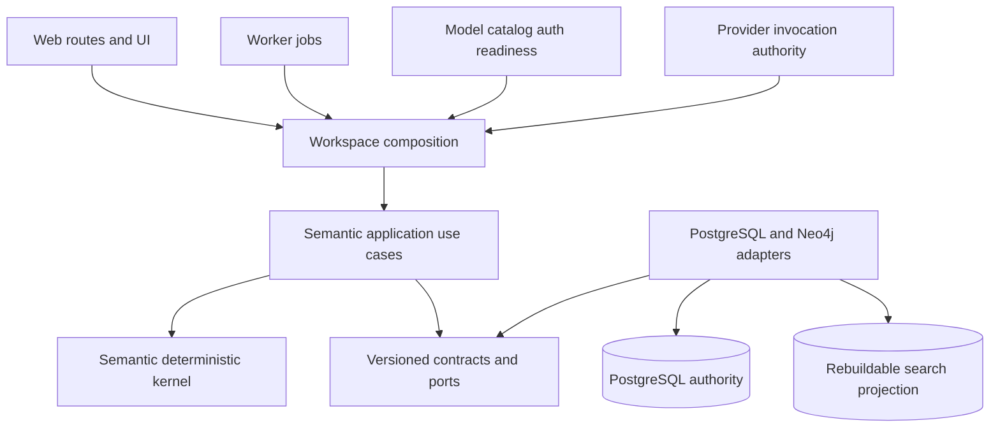
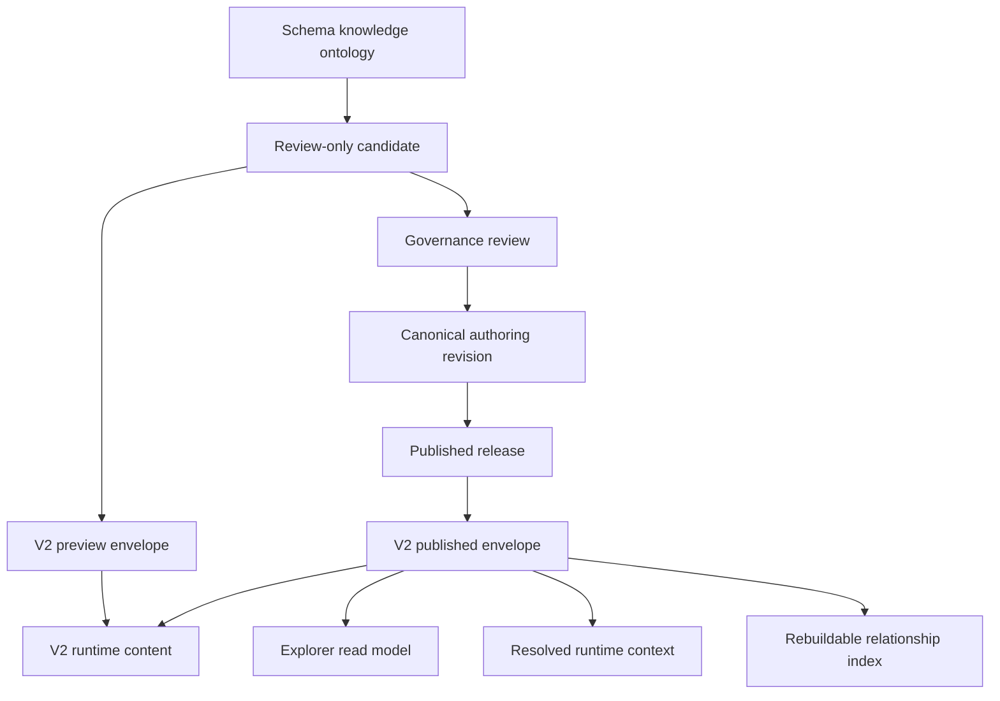
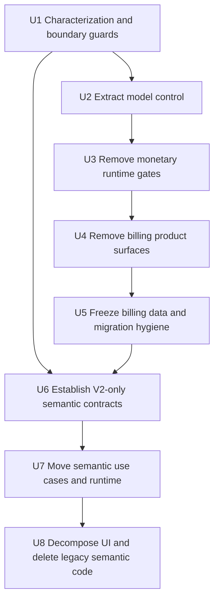
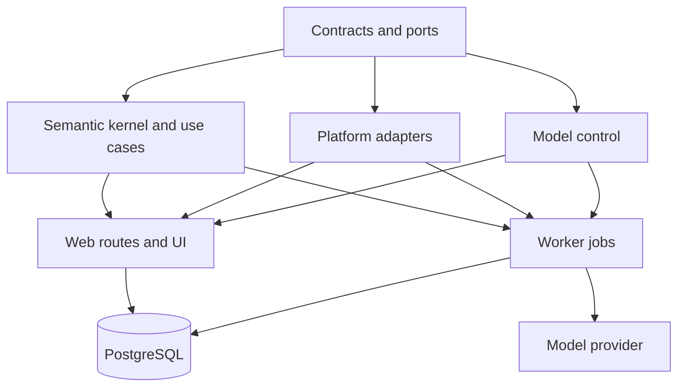

# refactor: 语义层架构收敛与计费退役

## Summary

本计划解决两类已经互相放大的维护问题：语义层在多轮迭代后形成了重复运行时、超大合同与服务文件、Web
层业务编排、遗留页面和过宽的 Package 公共面；计费则把价格、外汇、积分、账单与本应独立存在的模型目录、
供应商连接、认证和模型可用性混在同一组合同、仓储与运行时中。继续在现有结构上追加功能，会让每次语义层
迭代同时触碰 UI、Route、Web Service、Platform Adapter、SQL Migration 和计费门禁。

目标不是简单删除几个未使用文件，而是建立可持续迭代的边界：`contracts` 只表达版本化合同与 Port，
`semantic` 持有纯确定性内核和应用用例，`platform` 只实现 PostgreSQL/Neo4j Adapter，Web/Worker 只做鉴权、
组合、HTTP/SSE 与视图投影。语义 Authoring Source、Published Read Model、Relationship Search Projection
继续作为不同生命周期的对象存在；AI 生成内容始终只能进入待审 Candidate，不能直接发布。

项目采用绿地 V2-only 基线：V2 是唯一受支持的语义合同和数据模型，V1 schema、读写路径、转换器、fixture 与
公共导出直接删除，不建设兼容层、双读或 sunset window，也不迁移、回填或保留 V1 语义数据。仍依赖
V2→V1 投影的当前代码必须在同一实施单元改为原生消费 V2，验收环境从干净的 V2 数据开始。

计费功能完整退出产品和运行时，但不误删模型调用所需的非计费能力。先把模型目录、供应商连接、认证、技术
可用性与 token/context/call 限额从 `billing.ts` 和 Pricing Repository 中拆出，再移除价格、汇率、积分、
hold、账单、结算、对账、UI、API、Worker 调度和公共导出。Provider Usage Receipt 中的 token、延迟、工具调用、
结果与错误仍保留为非商业可观测性。历史计费表默认冻结为只读归档，不在本计划中物理清空或 DROP；若未来要
销毁历史数据，必须另走有备份、恢复验证和明确审批的破坏性数据任务。

## Problem Frame

### 当前结构性问题

| 问题 | 当前证据 | 后果 |
|---|---|---|
| 语义公共面过宽 | `packages/semantic/src/index.ts` 从单一根入口导出 authoring、candidate、compiler、explorer、graph、induction、read-model、relationship-index 等大量符号 | 调用方难以知道稳定边界，内部实现容易被直接依赖 |
| 合同职责混杂 | `packages/contracts/src/artifacts/semantic-control-plane.ts`、`semantic-governance.ts` 同时承载多个版本、命令、投影与 V2→V1 转换 | 修改一个生命周期容易波及不相关消费者，V1 继续污染新项目公共面 |
| Web 持有领域编排 | `apps/web/src/lib/semantic-*-service.ts`、`postgres-semantic-governance-service.ts` 与大量 route/runtime 文件共同实现治理、候选、保存、Studio、Explorer 流程 | App 越来越像第二个领域层，难以复用和独立测试 |
| 运行时重复 | `workspace-semantic-runtime.ts` 已提供 Workspace-aware 组合，但 Explorer/Governance 仍保留 env singleton、mock/postgres 分支与 route fallback | 生产路径和测试路径可能使用不同 Authority，配置错误被 fallback 掩盖 |
| UI 组件过载 | `semantic-studio.tsx`、`direct-semantic-editor.tsx` 均超过千行并混合数据请求、SSE、状态、编辑、保存、发布与渲染 | 状态转换不可局部验证，后续功能只能继续堆叠 |
| 遗留入口仍占维护面 | `/semantic/:path*`、`/data-link/:path*` 已被重定向，但旧 Review Inbox/Detail、store、mock auth、Data Link Editor 仍在代码和测试中 | 无实际用户价值，却持续增加类型、测试和认知成本 |
| 计费与模型控制耦合 | `packages/contracts/src/workspaces/billing.ts` 同时定义 provider/model catalog/auth 与 price/fx/credit/bill；`postgres-pricing-control.ts` 同时实现两类仓储 | 直接删除计费会破坏模型发现、供应商管理、认证与语义候选运行时 |
| 金额门禁渗入执行链 | Test Center、model router、认证、bootstrap、模型可用性 SQL 依赖 `pricing`、`UNBILLABLE` 或 `billing_runtime_state` | 即使 UI 隐藏计费，运行时仍受商业状态控制 |
| 数据库演进难追踪 | 语义迁移从早期版本延续到 `10699`，存在多个相同数字前缀；旧维护 manifest 只覆盖很小一部分历史 | 历史迁移不能重命名，但新维护者难以判断权威链、修复链与当前 frontier |

### 目标状态

| 关注面 | 目标状态 |
|---|---|
| 语义领域 | Canonical Authoring、Governance Workflow、Published Read Model、Runtime Context 与 Search Projection 各有明确合同和所有者 |
| 语义版本 | V2 是唯一合同、读写模型和测试基线；V1 代码与数据均不保留 |
| 应用编排 | 可复用的语义用例位于 `packages/semantic`，只依赖合同 Port；App 只做边界解析和组合 |
| 平台适配 | PostgreSQL 是持久 Authority，Neo4j 是可重建投影；Platform 不承载领域流程 |
| 运行时 | 每个请求/作业只从一个 Workspace-aware composition root 获取依赖；生产路径不存在隐式 mock/global fallback |
| 前端 | Controller/reducer、transport client 与 presentational panels 分离，状态机可单测，大组件不再承载完整工作流 |
| 计费 | 金额、价格、汇率、积分、账单、结算和对账从产品、运行时与公共 API 完整移除 |
| 模型能力 | Provider connection、model catalog、credential reference、certification、technical readiness 独立保留 |
| 调用记录 | 保留无商业字段的 Usage Receipt 和 Provider Invocation Authority；不计算或展示金额 |

## Requirements

- R1. 语义层重构后必须继续区分业务主题/实体、维度、指标、公式、物理表及其一等关系，不得退化为一个通用
  node/blob 模型。
- R2. AI、知识导入与自动归纳只能创建可审阅 Candidate；Approve/Publish 仍由现有治理 Authority 执行，不能
  因重构绕过。
- R3. PostgreSQL 继续作为 V2 Semantic Source、Revision、Candidate、Release、Job 与 Receipt 的持久 Authority；
  Neo4j/索引/前端 view model 只能是可重建投影。
- R4. `packages/semantic` 只能依赖 `packages/contracts` 和纯库；领域用例通过 Port 获取持久化、队列、模型调用与
  搜索能力，不得导入 Next.js、PostgreSQL client 或 Platform 实现。
- R5. `packages/platform` 只实现 Port 和事务/投影 Adapter，不得拥有跨步骤语义工作流；Web/Worker 只负责鉴权、
  输入输出解析、组合、HTTP/SSE 与进程生命周期。
- R6. 为语义 Authoring、Governance、Read、Runtime Context、Relationship Search 建立受控 V2 子路径公共面；
  根 barrel 不保留 V1 re-export 或版本兼容入口。
- R7. V2 是唯一 canonical write/read contract。V1 schema、读写路径、V2→V1 转换器、fixture、测试、公共导出和
  V1-only 数据库对象必须直接删除；不提供双读、兼容 adapter、数据迁移、回填或 V1 payload 解析。
- R8. 生产语义路由只能使用 Workspace-aware runtime；禁止 env singleton、隐式 mock backend 或 route 内 fallback。
- R9. 已被重定向且无活跃消费者的旧 Semantic/Data Link 页面、store、mock auth、重复 API 与组件必须删除；共享
  Explorer 组件先迁移到非 route 目录再删除旧 route 文件。
- R10. 删除 price、fx、credit、hold、bill、settlement、reconciliation 及其 UI、API、Worker、合同、平台实现、
  公共导出与运行时依赖。
- R11. Provider connection、model catalog、model authentication、certification、technical readiness 和非商业
  Usage Receipt 必须保留；token/context/output/tool-call 限额不得被误当作计费一并删除。
- R12. 模型状态不再包含 `UNBILLABLE`，运行时不得因缺少 price/fx/billing state 拒绝模型；不可用原因改为凭据、
  认证、认证证书、部署状态或技术容量等明确状态。
- R13. 历史计费数据默认只读冻结，应用账号失去写入/执行权限且没有新数据继续产生；物理 DROP/清空不属于本计划。
- R14. 历史迁移文件保持不可变；用新的 V2-only forward migration 删除最终 schema 中的 V1-only 对象和数据，不做
  数据转换；从新迁移开始强制完整 filename stem 唯一、数字序号唯一、ledger declaration 与文件名一致。
- R15. 每个实施单元先补足或保留目标主路径的 characterization coverage，再改变行为；U6 只刻画 V2 目标行为，
  不为待删除的 V1 增加保留性测试。每个单元独立验证、独立 scoped commit。

## Scope Boundaries

- 不重写 Text2SQL、Agent Team、Knowledge Registry 或 Provider Invocation 生命周期；只调整它们与语义/计费的
  接口和依赖。
- 不把 `SemanticGraphSource`、`SemanticExplorerSnapshot` 和 Relationship Index 合并为同一持久模型；它们分别
  是编辑源、发布读投影和可重建搜索投影。
- 不改变 Workspace Auth、RBAC、Capability Receipt、Provider SecretRef 与 Model API Authentication 的安全边界。
- 不引入新的微服务、消息总线、ORM 或状态管理框架。
- 不承诺一次提交完成全部重构；计划按依赖顺序交付，每个阶段都必须保持主路径可用。
- 不迁移或保留 V1 语义数据；Semantic 验收基于干净的 V2 数据集，已有 V1 记录不属于升级、回滚或验收范围。
- 不修改或重命名已经进入 migration ledger 的 SQL 文件。
- 不为 V1 数据创建 backup/restore、export/import 或 archive 流程；V2-only cleanup 的作用就是使最终 schema 和数据面
  不再包含 V1。执行范围必须先确认是本新项目环境，不得误用到另一个共享/生产数据库。
- 不物理删除历史计费表、账本或审计记录；后续若有合规删除需求，另行制定可恢复的数据处置计划。

## Context & Research

### Repository Patterns to Preserve

- `.trellis/spec/backend/directory-structure.md` 已定义依赖方向：contracts 不依赖运行时，领域包依赖合同 Port，
  platform 实现 Port，apps 只做组合和边界解析。
- `.trellis/spec/backend/semantic-induction-maintenance.md` 明确 Induction 只能生成 Candidate，PostgreSQL 是唯一
  Authority，Semantic Package 是纯确定性内核。
- `.trellis/spec/backend/provider-invocation-authority.md` 已把 Provider Usage 定义为非商业调用事实，并明确
  U3 runtime 不应依赖 Billing/Credit/Pricing；该边界是计费退役后的目标基线。
- `packages/contracts/test/dependency-boundaries.spec.ts` 与
  `packages/platform/test/contract/platform-surface.spec.ts` 已提供依赖方向和公共 surface 的测试入口，适合扩展为
  重构护栏。
- `apps/web/src/lib/workspace-semantic-runtime.ts` 是当前较新的 request-scoped 组合模式，应该成为唯一生产入口。
- `packages/semantic/src/analysis/context-compiler.ts` 仍调用 V2→V1 投影；这不是保留兼容层的理由，而是 U6 必须先
  改成原生 V2 再删除 V1 的明确消费者清单。
- `packages/semantic/src/graph-v2/compiler.ts` 当前虽然接收 Graph V2，却产出 V1 `SemanticSourceBundle`；
  `compiler/u5-compiler.ts`、contribution lowering 和多组测试也以 V1 为执行合同。现有 V2 只覆盖分析上下文，且
  invariant 仍先投影到 V1。这意味着 U6 必须建立原生 V2 runtime content/compiler，而不是仅删除转换函数。
- `scripts/local-dev-runtime.ts` 以完整 migration filename stem 和 checksum 校验 ledger；重复数字前缀不会直接覆盖
  ledger key，但会造成排序和维护歧义。

### Evidence-Based Retirement Candidates

- `apps/web/src/app/semantic/page.tsx` 及其 Review Inbox/Detail/store 只服务于已被 `next.config.mjs` 重定向的旧入口。
- `apps/web/src/hooks/use-semantic-auth.ts` 提供 mock current user，当前没有生产消费者。
- `apps/web/src/components/data-link/semantic-editor.tsx` 无活跃调用方，Data Link 页面已转到 Workspace Semantic。
- `apps/web/src/lib/semantic-governance-runtime.ts` 的 global getter、mock service/config 分支没有生产路由消费者；
  Workspace runtime 强制 PostgreSQL。
- Governance `candidates` GET 与 `inbox` GET 行为重叠，应以当前 Workspace Studio 实际调用链决定保留一个合同。
- `apps/worker/src/mastra.ts` 暴露的 legacy billing composition 没有生产调用方；pricing sync cycle 也只有测试与
  root export 消费。

### External Research Decision

不引入外部研究。这里的主要风险是本仓库特有的 Authority、migration ledger、Workspace composition 和现有
调用链；本地规范、合同、调用方与测试已经提供足够直接证据。实施中若新增第三方框架，
再针对该窄问题补充官方文档研究。

## Key Technical Decisions

| 决策面 | 选择 | 理由 |
|---|---|---|
| 重构策略 | 按实施单元小步交付，但 V1→V2 不设兼容期 | 计费和职责移动仍需分段；语义版本则在 U6 内完成消费者切换和 V1 删除 |
| 语义 canonical model | V2-only，每个生命周期一个 canonical contract | 新项目没有兼容负担，直接消除 V1/V2 双轨和长期维护成本 |
| V2 内容与 Authority | 一个生命周期中立的 V2 runtime content，加 Preview/Published 等显式 Authority envelope | Preview 需要编译但不能冒充 Published；共享内容避免再造两份指标/维度/关系结构 |
| Package 公共面 | 使用按能力命名的 subpath exports，逐步收窄 root barrel | 调用方能看出依赖的是 authoring、read 还是 runtime，不再借用内部实现 |
| 用例所有权 | 纯业务编排进入 `packages/semantic`，I/O 通过 contracts Port | 兼顾复用、确定性测试和既有依赖规则 |
| 持久化所有权 | PostgreSQL Adapter 留在 Platform；Neo4j 仅投影 | 保持现有 Authority 与可重建性边界 |
| 生产组合 | 只保留 Workspace/request/job scoped composition | 消除隐式 singleton/mock fallback 与环境漂移 |
| 计费拆除 | 先提取 model control，再切断 monetary gate，最后删计费 surface | 防止模型发现、认证和语义模型调用被误删 |
| Usage 处理 | 保留 token/latency/outcome receipt，删除 cost/price/fx 字段 | 可观测性不是计费，且 Provider Authority 需要事实回执 |
| 数据处置 | V1 语义数据直接放弃；历史计费对象仍前向冻结 | 用户明确无需语义数据迁移；计费审计数据是另一范围，继续避免未经审批的销毁 |
| 迁移编号 | 已应用文件不改名；新文件同时校验完整 stem 与数字序号唯一 | 保持 ledger checksum，降低今后重复编号风险 |

## Alternative Approaches Considered

| 方案 | 结论 | 原因 |
|---|---|---|
| 只删明显 dead code | 拒绝 | 无法修复 Web 持有领域编排、公共面过宽和 runtime fallback，废弃代码还会继续产生 |
| 一次性重写整个语义层 | 拒绝 | 跨合同、数据库、Worker、UI 的大爆炸迁移无法用现有 Authority 和 characterization 安全兜底 |
| 为 V1 建兼容 adapter 或双读 | 拒绝 | 新项目无需承受历史包袱；用户明确要求直接抛弃 V1 且不迁移数据 |
| 直接删除整个 Billing/Pricing 模块 | 拒绝 | 当前模块混有 Model Catalog、Provider Connection 和 Authentication，会让模型调用与语义候选失效 |
| 物理 DROP 所有计费表 | 本计划不采用 | 产品退役不要求不可恢复的数据销毁；历史记录需先只读冻结并接受独立处置审批 |
| 建立新边界后逐步迁移和退役 | 采用 | 每个阶段可验证、可提交、可回滚消费者，同时最终删除不需要的产品面 |

## High-Level Technical Design

下图是方向性边界，不规定具体类型名或方法签名：

语义对象生命周期保持单向：

禁止从 Candidate、Read Model、Neo4j Index 或 UI local state 反向直接写入 Published Release。所有写操作仍经
PostgreSQL command/receipt/transaction authority。

## Implementation Units

### U1 — 建立 Characterization、依赖护栏与退役清单

**Goals / requirements:** 为 R3、R4、R5、R9、R10、R14、R15 建立重构前安全网，明确每个待删除 surface 的
生产消费者、测试消费者、数据库对象和替代入口。

**Files:**

- `packages/contracts/test/dependency-boundaries.spec.ts`
- `packages/platform/test/contract/platform-surface.spec.ts`
- `scripts/lib/workspace-architecture.ts`
- `scripts/local-dev-runtime.ts`
- `apps/web/test/legacy-workspace-routes.spec.ts`
- `apps/web/test/retired-data-link-routes.spec.ts`
- `scripts/verify-workspace-migration-inventory.ts`
- `scripts/verify-workspace-migration-inventory.spec.ts`（新增）
- `docs/architecture/semantic-billing-surface-ledger.md`（新增）

**Approach:**

- 记录 Semantic/Billing 的 route、export、runtime、SQL object、UI 和活跃消费者，分类为 `KEEP`、`MOVE`、
  `COMPATIBILITY`、`DELETE`、`ARCHIVE_DATA`，每项写明替代路径与退出门槛。
- 扩展架构测试，禁止 Semantic Package 导入 Platform/App，禁止 App 重新定义公共 Semantic schema；为后续 subpath
  exports 和 billing forbidden scan 预留规则。
- 新增 migration inventory 静态校验：完整 stem 唯一、14 位序号唯一、ledger declaration 与文件名一致；历史重复
  前缀先列入 grandfathered allowlist，新迁移不得继续产生。
- 以当前 Workspace Semantic Studio/Explorer、Provider Invocation、Model Provider 管理主路径建立 characterization，
  不以旧重定向页面作为未来行为标准。

**Test scenarios:**

1. Semantic 内核引入 Platform/App 模块时，dependency boundary test 明确失败。
2. 新迁移复用已存在数字序号、stem 与声明不一致或缺少 checksum 时，静态校验失败；现有历史文件仍通过。
3. 所有标记 `DELETE` 的 surface 必须具有“无生产消费者 + 替代入口 + 相关测试处置”三项证据，否则 ledger 校验失败。
4. Workspace Semantic 与 Model Provider 活跃路由仍被 characterization tests 覆盖，避免后续删除误伤。

**Verification:** 退役清单不存在无替代路径的 `DELETE` 条目；架构与迁移规则能以受控坏例证明会失败。

### U2 — 从计费中提取 Model Control 合同与仓储

**Goals / requirements:** 实现 R10、R11，为删除计费建立非商业模型控制边界。

**Dependencies:** U1。

**Files:**

- `packages/contracts/src/workspaces/billing.ts`
- `packages/contracts/src/providers/index.ts`
- `packages/contracts/src/models/`（新增 bounded contracts）
- `packages/contracts/src/index.ts`
- `packages/platform/src/pricing/postgres-pricing-control.ts`
- `packages/platform/src/models/postgres-model-control.ts`（新增）
- `packages/platform/src/index.ts`
- `apps/web/src/lib/workspace-identity.ts`
- `apps/web/src/lib/pricing-admin.ts`
- `apps/web/src/lib/model-control-admin.ts`（新增）
- `apps/web/src/app/api/admin/model-providers/`
- `apps/web/src/app/api/admin/models/`
- `apps/web/src/app/api/models/route.ts`
- `packages/contracts/test/model-provider-connections.spec.ts`
- `packages/contracts/test/model-control.spec.ts`（新增）
- `packages/platform/test/models/postgres-model-control.spec.ts`（新增）
- `apps/web/test/model-provider-routes.spec.ts`
- `apps/web/test/model-route.spec.ts`
- `apps/web/test/model-api-secret-boundary.spec.ts`

**Approach:**

- 把 provider connection、model profile/catalog、credential/SecretRef binding、model authentication 与 certification
  合同迁入明确的 `models`/`providers` bounded surface；不携带 price、currency、fx、credit 或 bill 字段。
- 将 `postgres-pricing-control.ts` 拆为 Model Control Repository 与待退役 Pricing Repository；先让所有模型发现、
  管理、认证、Q&A resource resolution 和 bootstrap 消费新仓储。
- `workspace-identity.ts` 不再把 pricing、credit、billing repositories 聚合进通用 Workspace runtime state；Model
  Control 使用独立 getter/composition。
- Model Control 文件移动期间可保留一个薄 re-export 并在 U4 删除；它只服务非语义模型控制重命名，不构成 V1/V2
  兼容层。

**Test scenarios:**

1. 管理员创建 provider connection、绑定 SecretRef、登记模型并认证时，只访问 Model Control Repository。
2. 普通用户读取可用模型目录时不会收到 price、currency、credit 或 billing mode 字段。
3. 无效/越权 workspace、environment、provider/model binding 继续 fail closed，不因移除 Pricing Admin helper 放宽 RBAC。
4. Model Control 临时 re-export 与新 subpath 在迁移期解析到同一 schema/result，且 forbidden test 阻止新增旧 import；
   该测试不得引入任何 Semantic V1 合同。

**Verification:** 模型目录和 provider 管理的生产调用图对 Pricing/Billing Repository 为零依赖，现有鉴权与 SecretRef
边界保持不变。

### U3 — 移除模型与语义运行时中的金额门禁

**Goals / requirements:** 实现 R10、R11、R12，并保证 Semantic Candidate、Test Center、Q&A 与 Worker Provider
调用不再依赖 price/fx/billing state。

**Dependencies:** U2。

**Files:**

- `packages/contracts/src/providers/index.ts`
- `packages/agent-runtime/src/models/router.ts`
- `packages/agent-runtime/src/models/system-deployments.ts`
- `apps/web/src/lib/test-center-model-runtime.ts`
- `apps/web/src/lib/semantic-candidate-runtime.ts`
- `apps/web/src/cli/bootstrap-qa-readiness.ts`
- `apps/worker/src/semantic/authoring-model-runtime.ts`
- `apps/worker/src/providers/production-run-bound-provider-dispatcher.ts`
- `apps/worker/src/system-model-certification-cli.ts`
- `infra/supabase/apps/data-agent/migrations/20260725010651_app_data_agent_environment_model_availability.sql`（历史参考，不修改）
- `infra/supabase/apps/data-agent/migrations/20260725010669_app_data_agent_model_certification.sql`（历史参考，不修改）
- `infra/supabase/apps/data-agent/migrations/20260725010674_app_data_agent_adaptive_dispatch.sql`（历史参考，不修改）
- `packages/agent-runtime/test/model-router.spec.ts`
- `apps/web/test/model-certification-route.spec.ts`
- `apps/web/test/semantic-candidate-route.spec.ts`
- `apps/worker/test/semantic-authoring-model-runtime.spec.ts`
- `apps/worker/test/providers/run-bound-provider-dispatcher.spec.ts`
- `apps/worker/test/system-model-certification-boundary.spec.ts`

**Approach:**

- 将 `operational_constraints.pricing` 拆除；保留并明确命名 context、input/output token、provider call、tool call、
  timeout 等技术预算。
- 用 `ACTIVE`、`DISABLED` 以及凭据/认证/证书/部署技术状态表达模型可用性，删除 `UNBILLABLE` 与
  `MODEL_COST_BUDGET_NOT_SATISFIED`。
- Test Center 与 Semantic Candidate 只验证模型技术 readiness 和必要认证，不验证 VERIFIED/USD price chain。
- Provider Usage Receipt 继续记录 provider-reported token、延迟、outcome、tool calls；合同和投影 forbidden scan
  确保不出现 cost、price、fx 或余额。

**Test scenarios:**

1. 模型具有有效 connection/auth/certification 且技术预算满足，但没有任何价格或汇率记录时，可以用于 Test Center、
   Semantic Candidate 与 Q&A。
2. 缺 credential、认证过期、certification 不匹配、deployment disabled 或 token/context 超限时仍在网络调用前拒绝。
3. Provider 未返回 token 时 Receipt 使用 `UNAVAILABLE/null`，不得写 0 或计算估算金额。
4. 旧 `UNBILLABLE` 记录经前向投影后成为技术可用/不可用的确定状态，不产生隐式 fallback。

**Verification:** 全仓生产代码不再以 monetary price/fx/billing state 决定模型可用性；Provider Authority 的
preflight、dispatch、response、terminal、usage 链不变。

### U4 — 删除计费产品面与运行时代码

**Goals / requirements:** 实现 R10，并删除无运行时价值的 legacy billing composition。

**Dependencies:** U3。

**Files:**

- `packages/contracts/src/workspaces/billing.ts`
- `packages/platform/src/billing/`
- `packages/platform/src/pricing/`
- `packages/platform/src/index.ts`
- `apps/worker/src/pricing/`
- `apps/worker/src/mastra.ts`
- `apps/worker/src/index.ts`
- `apps/web/src/app/api/admin/billing/`
- `apps/web/src/app/api/admin/credits/`
- `apps/web/src/app/api/admin/prices/`
- `apps/web/src/app/api/admin/fx/`
- `apps/web/src/app/api/billing/`
- `apps/web/src/app/admin/pricing/page.tsx`
- `apps/web/src/app/settings/page.tsx`
- `apps/web/src/components/settings/credit-ledger-panel.tsx`
- `apps/web/src/components/settings/model-billing-panel.tsx`
- `apps/web/src/components/settings/pricing-control-panel.tsx`
- `apps/web/src/lib/billing-ui.ts`
- `apps/web/src/lib/billing-ui-policy.ts`
- `apps/web/src/lib/credit-admin.ts`
- `apps/web/src/lib/model-billing-admin.ts`
- `apps/web/src/lib/pricing-admin.ts`
- `apps/web/src/components/settings/operations-admin-panel.tsx`
- `packages/platform/test/contract/platform-surface.spec.ts`
- `apps/web/test/settings-billing-ui.spec.tsx`
- `apps/web/test/billing-ui.spec.ts`
- `apps/web/test/workspace-home-billing-ui.spec.tsx`
- `apps/web/test/model-provider-routes.spec.ts`
- `apps/worker/test/providers/audited-model-provider.spec.ts`

**Approach:**

- 在 U2/U3 消费者归零后，删除 price/fx/credit/hold/bill/settlement/reconciliation contracts、repositories、gates、
  schedulers、routes、panels、navigation 和 public exports。
- 删除 `createWorkerMastraComposition` 的 legacy billing path 与只被测试/root export 使用的 pricing sync；保留真正的
  Provider Invocation 与 Worker composition。
- Billing API 若经 U1 发现存在仓库外消费者，则先返回一个版本的明确 `410 Gone` tombstone；若调用图与部署清单均
  证明无外部合同，直接删除。不得无限保留隐藏 API。
- 删除只证明已退役行为的测试，保留/改写能够保护非计费 Model Control、RBAC 和 Usage Receipt 的测试。

**Test scenarios:**

1. Settings、Workspace Home、Admin navigation 不再显示计费、价格、积分或账单入口。
2. 已删除 API 不可执行任何 billing mutation；采用 tombstone 时返回稳定 410 且不访问数据库。
3. Package root 不再导出 billing/pricing symbols，新增生产 import 会被 forbidden scan 捕获。
4. Model Provider、认证、认证证书、Q&A 模型选择和 Provider 调用仍通过各自非计费测试。

**Verification:** 除历史迁移、归档说明和显式 forbidden-test fixture 外，生产 TypeScript/TSX 不再出现 Billing、
Credit、Pricing、FX、Bill Settlement 能力。

### U5 — 前向冻结历史计费对象并治理迁移链

**Goals / requirements:** 实现 R3、R13、R14，确保代码删除后数据库不再产生新计费状态，同时保留可审计历史。

**Dependencies:** U4。

**Files:**

- `infra/supabase/apps/data-agent/migrations/20260725010700_app_data_agent_billing_retirement.sql`（新增）
- `scripts/render-10700-migration.ts`（新增，若该仓库的生成模式要求 renderer）
- `infra/supabase/apps/data-agent/migration-sources/`（按现有生成模式新增源文件）
- `scripts/local-dev-runtime.ts`
- `scripts/run-postgres-smoke.sh`
- `scripts/u9-semantic-migration-maintenance-manifest.json`
- `infra/supabase/test-support/53-billing-retirement-assertions.sql`（新增）
- `infra/supabase/test-support/31-effective-run-config-authority-assertions.sql`
- `infra/supabase/test-support/32-provider-invocation-authority-assertions.sql`
- `infra/supabase/test-support/48-adaptive-dispatch-assertions.sql`
- `infra/supabase/test-support/19y-pricing-control-assertions.sql`（退役或改为归档断言）
- `infra/supabase/test-support/19zz-credit-ledger-assertions.sql`（退役或改为归档断言）
- `infra/supabase/test-support/19zzz-model-billing-settlement-assertions.sql`（退役或改为归档断言）
- `infra/supabase/test-support/19zzzzz-operations-admin-assertions.sql`
- `infra/supabase/test-support/run-postgres-smoke.sh`
- `.trellis/spec/backend/workspace-identity-billing.md`

**Approach:**

- 新增不可逆向改写历史的 forward migration：把模型 availability/certification 函数切换到非计费技术状态；停止
  自动创建 credit account、reserve/finalize/reconcile 等写入链；撤销 App Runtime 对计费 mutation function 的
  EXECUTE 和相关表写权限。
- 历史 price/fx/credit/hold/bill/audit 表保留只读归档；记录 retirement receipt、对象清单、row count/digest 与生效
  migration version。默认不 DROP table/function，以便回溯和独立审批后的后续处置。
- 对仍可能被历史客户端调用的函数，选择 revoke 或稳定 retired error，不能静默 no-op 成功。
- 扩充维护 manifest，覆盖当前语义迁移权威链、修复链、billing retirement 和最新 frontier；新迁移执行唯一编号规则。

**Test scenarios:**

1. Fresh PostgreSQL 从零应用到 `10700` 后，模型目录、Provider Invocation、Semantic Studio/Explorer 所需 RPC 可用，
   不需要 billing tables 参与运行时判断。
2. 从包含历史账单/积分/hold 的升级数据库应用 `10700` 后，历史 row count/digest 保持，应用角色不能新增或修改记录。
3. 调用 retired billing mutation 时明确拒绝或返回 retired error，不产生账本、hold、账单或审计新增行。
4. Migration ledger 校验完整 stem/checksum；编号重复、manifest 缺 frontier 或 migration 源与渲染结果漂移时失败。

**Verification:** 新部署和升级部署均不产生计费写入；历史对象只读可审计；PostgreSQL authority、RLS、NOLOGIN owner
和窄 grant 仍通过 smoke/contract 验证。

### U6 — 确立 V2-only 语义合同、生命周期与 Package 公共面

**Goals / requirements:** 实现 R1、R2、R3、R6、R7，为后续移动用例建立稳定接口。

**Dependencies:** U1、U5。合同和消费者改写可与 U2–U5 并行开发，但 V2-only 数据库清理迁移在 `10700` 之后落地。

**Files:**

- `packages/contracts/src/artifacts/semantic-control-plane.ts`
- `packages/contracts/src/artifacts/semantic-governance.ts`
- `packages/contracts/src/artifacts/semantic-authoring.ts`
- `packages/contracts/src/artifacts/semantic-explorer.ts`
- `packages/contracts/src/artifacts/semantic-graph-v2.ts`
- `packages/contracts/src/artifacts/semantic-graph-read.ts`
- `packages/contracts/src/semantic/`
- `packages/contracts/src/ports/semantic/`（新增）
- `packages/contracts/src/index.ts`
- `packages/contracts/package.json`
- `packages/semantic/src/analysis/context-compiler.ts`
- `packages/semantic/src/compiler/u5-compiler.ts`
- `packages/semantic/src/compiler/contribution-profile-compiler.ts`
- `packages/semantic/src/compiler/relationship-lowering.ts`
- `packages/semantic/src/compiler/runtime-auth-lowering.ts`
- `packages/semantic/src/graph-v2/compiler.ts`
- `packages/semantic/src/graph-v2/validator.ts`
- `packages/semantic/src/index.ts`
- `packages/semantic/package.json`
- `infra/supabase/apps/data-agent/migrations/20260725010701_app_data_agent_semantic_v2_only.sql`（新增）
- `scripts/render-10701-migration.ts`（新增，若该仓库的生成模式要求 renderer）
- `infra/supabase/apps/data-agent/migration-sources/`（按现有生成模式新增 V2-only 清理源）
- `infra/supabase/test-support/54-semantic-v2-only-assertions.sql`（新增）
- `infra/supabase/test-support/run-postgres-smoke.sh`
- `packages/semantic/test/semantic-source-schema.spec.ts`
- `packages/semantic/test/projection-compatibility.spec.ts`（删除或改写为 V2 projection 测试）
- `packages/semantic/test/semantic-graph-v2.spec.ts`
- `packages/semantic/test/analysis-context-compiler.spec.ts`
- `packages/semantic/test/formula-u5-lowering.spec.ts`
- `packages/semantic/test/relationship-safety.spec.ts`
- `packages/semantic/test/semantic-content-digest.spec.ts`
- `packages/semantic/test/fixtures/semantic-explorer.ts`
- `packages/contracts/test/semantic-authoring.spec.ts`
- `packages/contracts/test/semantic-governance.spec.ts`
- `packages/contracts/test/semantic-explorer.spec.ts`
- `packages/contracts/test/semantic-relationship-index.spec.ts`

**Approach:**

- 先按生命周期建立 contract map：Authoring Source/Revision、Candidate/Governance、Published Read、Resolved Runtime、
  Relationship Projection；禁止同一命名在多个文件表达不同 Authority。
- 从 V2 合同中提取唯一的 lifecycle-neutral runtime content，承载公式、指标、维度、关系、本体、物理绑定、治理、
  runtime authorization 与分析语义；Preview/Published 只用不同 Authority envelope 包装同一内容。Preview 不得通过
  `publication_status=PUBLISHED` 冒充发布物。
- 将 Graph V2 的 Metric/Dimension/Relationship 节点补齐生成 V2 runtime content 所需的分析元数据；缺失必填分析语义
  时产出明确 validation issue 并阻止 Publish，不静默填默认值或降级成 V1。
- 让 Graph V2 compiler、U5 compiler、formula/contribution/relationship/runtime-auth lowering 和 Analysis Context
  全部直接消费原生 V2 content/type；V2 invariant 直接验证 V2，不再通过 V2→V1 投影复用校验。
- 将超大文件按 bounded capability 拆分，以重构后的 V2 schema/version/hash 作为唯一 wire identity；不为 V1 payload
  保持解析兼容，也不新增 version bridge。由于 V1 数据不迁移，允许在 U6 内一次性收紧 V2 合同并重建干净 fixture。
- 盘点所有 V1 type/schema/helper/import，先把 `analysis/context-compiler.ts` 等真实消费者改为直接消费 V2，再在同一
  单元删除 V1 schema、V2→V1 投影函数、旧 fixture、旧测试和 root re-export。禁止保留隐藏 fallback。
- 用 `10701` forward migration 显式 DROP V1-only function/view/table/column/type 与相关 grant/trigger；不复制、不转换、
  不归档 V1 rows。迁移必须先断言 app/environment 属于本绿地项目，并记录删除对象清单，避免作用于错误数据库。
- 为 `@data-agent/semantic/authoring`、`/governance`、`/read-model`、`/runtime-context`、`/relationship-index` 建立受控
  V2 exports；消费者切换后立即收窄根入口，不设置兼容窗口。

**Test scenarios:**

1. 干净 V2 fixture 能完成 Authoring → Candidate → Preview compile → Release → Explorer/Runtime/Relationship Index
   全链；Preview 与 Published 使用同一 runtime content，但 Authority envelope 不可互换。
2. V1 schema、类型、转换函数或 root export 被重新引用时，forbidden/architecture test 失败。
3. Graph V2 缺少 V2 必填分析元数据时，Preview 返回定位到对象/字段的 validation issue，Publish fail closed；系统
   不生成默认值，也不投影到 V1。
4. V2 runtime content 通过 U5/formula/contribution/relationship/runtime-auth compiler 时保留 analysis metadata，并得到
   与 V2 content digest 绑定的确定结果。
5. Fresh PostgreSQL 应用完整历史迁移和 `10701` 后，最终 catalog 中不存在 V1-only object/grant/trigger，V2 主链可用。
6. 带 V1 fixture rows 的绿地测试库执行 `10701` 后，V1 objects/rows 被删除且没有产生 V2 backfill；scope 断言不匹配时
   migration fail closed。
7. 新 Candidate 不能调用 publish port；只有 Governance command 在授权后产生 Revision/Release。
8. Authoring Source 投影到 Explorer/Runtime/Relationship Index 时保持业务对象类型和一等关系，不丢失 formula、grain、
   physical binding 或 evidence identity。

**Verification:** 每个合同有唯一生命周期和所有者；公共 subpath 与真实消费者对应；生产代码、测试基线与最终
PostgreSQL catalog 中的 V1 symbol、V2→V1 projection、V1 fixture/runtime row、V1-only object 和 re-export 均为 0。

### U7 — 将语义应用用例移出 Web 并统一生产运行时

**Goals / requirements:** 实现 R2、R4、R5、R8，消除 App 领域层和重复 runtime。

**Dependencies:** U6。

**Files:**

- `packages/semantic/src/application/`（新增）
- `packages/semantic/src/authoring/`
- `packages/semantic/src/candidate-generation/`
- `packages/semantic/src/explorer/`
- `packages/semantic/src/read-model/`
- `packages/platform/src/semantic/`
- `apps/web/src/lib/postgres-semantic-governance-service.ts`
- `apps/web/src/lib/semantic-governance-service.ts`
- `apps/web/src/lib/semantic-candidate-service.ts`
- `apps/web/src/lib/semantic-candidate-save-service.ts`
- `apps/web/src/lib/semantic-studio-service.ts`
- `apps/web/src/lib/semantic-explorer-service.ts`
- `apps/web/src/lib/workspace-semantic-runtime.ts`
- `apps/web/src/lib/semantic-governance-runtime.ts`
- `apps/web/src/lib/semantic-explorer-runtime.ts`
- `apps/web/src/app/api/semantic/`
- `apps/web/src/app/api/workspaces/[workspaceId]/semantic/`
- `packages/semantic/test/semantic-authoring.spec.ts`
- `packages/semantic/test/semantic-candidate-generation.spec.ts`
- `packages/semantic/test/semantic-explorer.spec.ts`
- `packages/platform/test/semantic/postgres-semantic-authoring.spec.ts`
- `packages/platform/test/semantic/postgres-semantic-explorer.spec.ts`
- `apps/web/test/semantic-governance-compose.spec.ts`
- `apps/web/test/semantic-candidate-save-route.spec.ts`
- `apps/web/test/semantic-explorer-route.spec.ts`

**Approach:**

- 将 Candidate compile/save、Governance inbox/decision/publish/rollback、Studio read/write、Explorer query/diff 等纯用例
  从 Web service 移入 `packages/semantic/src/application`，以 U6 Port 表达事务、repository、queue、provider 和 index。
- Platform 中拆分大 Postgres Adapter，使每个 Adapter 对应一个 Port/aggregate；不得把跨 Adapter 流程重新塞入
  Platform。
- Web route 统一执行：workspace auth → capability resolution → request parse → use case → response mapping。Route
  不创建 mock、不读取 fallback singleton、不复制 schema。
- `workspace-semantic-runtime.ts` 成为 Web 唯一组合入口；Worker 建立等价 job-scoped composition。显式 fixture 在测试
  中注入，不再通过生产 env 切换 mock backend。
- 合并 Governance candidates/inbox 重复 GET 合同；删除旧 endpoint 前先迁移 Studio 调用方并验证权限/分页/错误语义
  等价。

**Test scenarios:**

1. 同一 Governance/Candidate/Explorer use case 在 memory fake ports 与 Postgres adapters 下通过相同 conformance fixture。
2. 缺 workspace header、READ/WRITE capability 或 authority mismatch 时，Route 在调用 use case/SQL 前失败。
3. 生产环境未配置显式 runtime 依赖时 fail closed，不创建 global mock/postgres singleton。
4. Candidate 创建、人工 review、publish、rollback、Explorer read 与 Relationship Search 保持跨层集成行为；AI Candidate
   无法绕过 review publish。
5. 重复 inbox endpoint 退役后，Studio 使用唯一合同并保持分页、筛选、empty/error 状态。

**Verification:** Web `semantic-*service` 只剩边界 adapter 或被删除；核心用例可在无 Next.js/PostgreSQL 的 Semantic
Package tests 中运行；所有生产 route 走 Workspace composition。

### U8 — 分解 Semantic UI、迁移共享组件并删除遗留代码

**Goals / requirements:** 实现 R8、R9，降低未来 Studio/Explorer 迭代的局部复杂度并完成文档收口。

**Dependencies:** U7。

**Files:**

- `apps/web/src/components/semantic/studio/semantic-studio.tsx`
- `apps/web/src/components/semantic/studio/direct-semantic-editor.tsx`
- `apps/web/src/components/semantic/explorer/explorer-workspace.tsx`
- `apps/web/src/components/semantic/studio/controller/`（新增）
- `apps/web/src/components/semantic/studio/panels/`（新增）
- `apps/web/src/components/semantic/explorer/`
- `apps/web/src/app/w/[workspaceId]/semantic/`
- `apps/web/src/app/data-link/`
- `apps/web/src/app/w/[workspaceId]/data-link/`
- `apps/web/src/app/semantic/page.tsx`
- `apps/web/src/app/semantic/explorer/page.tsx`
- `apps/web/src/components/semantic/review-inbox.tsx`
- `apps/web/src/components/semantic/review-detail.tsx`
- `apps/web/src/lib/semantic-store.ts`
- `apps/web/src/hooks/use-semantic-auth.ts`
- `apps/web/src/components/data-link/semantic-editor.tsx`
- `apps/web/src/lib/workspace-client-state.ts`
- `apps/web/next.config.mjs`
- `.trellis/spec/backend/workspace-identity-billing.md`
- `.trellis/spec/backend/semantic-induction-maintenance.md`
- `.trellis/spec/backend/directory-structure.md`
- `apps/web/test/semantic-studio-model.spec.ts`
- `apps/web/test/semantic-studio-route.spec.ts`
- `apps/web/test/semantic-studio-agent-only.spec.ts`
- `apps/web/test/semantic-explorer-state.spec.ts`
- `apps/web/test/legacy-workspace-routes.spec.ts`
- `apps/web/test/workspace-client-state.spec.ts`

**Approach:**

- 把 Studio 的 transport/SSE lifecycle、server snapshot、selection/filter、editor draft、save/publish command 分为可测试
  controller hooks/reducer；panel 只渲染 props 和发出用户意图。
- Direct Editor 与 Studio 共享 schema-driven editor state 和 command adapter，不再复制保存/校验逻辑；避免建立新的
  全局 client authority。
- 把 Explorer page component 从旧 route 文件迁到 `components/semantic/explorer`，Workspace route 直接引用；然后删除
  已被全局 redirect 覆盖的旧 `/semantic` route、Review Inbox/Detail/store/mock auth 和无消费者 Data Link Editor。
- Workspace 切换状态只重置仍存在的 Workspace-scoped stores；删除对旧 semantic store 的兼容 reset。
- 更新 Trellis 规范：把 Workspace Identity/Model Control 与已退役 Billing 拆开；记录新的语义层目录、唯一 runtime、
  Candidate/Publish 边界和历史计费数据只读策略。

**Test scenarios:**

1. Studio SSE 重连、重复事件、stale revision、保存冲突、publish 成功/失败都由 reducer/controller 得到确定状态，panel
   不直接篡改 server authority。
2. Workspace 切换后 draft、selection、SSE connection 与错误状态被正确隔离，不残留上一个 workspace 数据。
3. Workspace Semantic Studio/Explorer 可导航并覆盖 loading、empty、error、read-only、editing、publishing 状态；键盘和
   aria 语义不因拆组件退化。
4. `/semantic/:path*` 与 `/data-link/:path*` 兼容重定向仍有效，但旧页面/组件/store 不再进入 bundle 或测试依赖图。
5. 删除旧 mock auth 后，所有写操作都从真实 Workspace request/capability 获得身份。

**Verification:** Semantic Studio/Editor/Explorer 的状态与渲染职责可独立测试；旧入口只剩明确 redirect 配置；文档与
architecture tests 描述同一套边界。

## System-Wide Impact

- **Contracts:** 当前 V2 wire identity 与 payload hash 是唯一边界；无需解析 V1 payload，也不对 V1 hash 或数据库记录
  提供兼容保证。
- **Web:** Semantic 与 Model Admin 路由会减少，但 Workspace/RBAC 门禁保持；删除 Billing UI 时要同步 navigation、
  loading state、client cache 和 route tests。
- **Worker:** 语义 authoring/induction/relationship jobs 保留；pricing sync 与 legacy billing gate 删除；Provider
  Invocation receipt 保留且不得引入金额字段。
- **Database:** `10700` 先让运行时不再读取计费状态并冻结旧写入，`10701` 再直接清理 V1-only Semantic 对象和数据。
  发布顺序错误会造成新代码访问旧函数或旧代码继续写入，因此必须用部署交叠窗口和 Go/No-Go 查询验证。
- **Search projection:** Neo4j/relationship index 可按 Published Release 重建，重构期间不得把其 digest 与 Source
  Revision digest 混为同一比较域。
- **Observability:** 删除 billing metrics/dashboard 后仍要保留 provider invocation count、tokens unavailable rate、
  latency、terminal outcome、semantic job failure/retry 和 projection lag。

## Rollout and Operational Sequence

1. **Guard phase:** 交付 U1，冻结现有主路径行为与待删 surface ledger。
2. **Model decoupling phase:** 交付 U2/U3，双入口仅用于代码兼容，不双写商业状态；验证无价格数据时模型和语义主路径
   正常。
3. **Billing code retirement phase:** 交付 U4，确认生产构建、部署清单和访问日志中没有 billing caller。
4. **Database retirement phase:** 交付 U5，先应用 forward migration，再部署只使用非计费路径的最终代码；验证零新增
   billing rows 和历史 digest 不变。
5. **Semantic boundary phase:** U6 的合同/消费者改写可提前并行，但 `10701` 在 `10700` 后落地；U7 在 V2-only 合同稳定后
   迁移用例，U8 最后删除旧入口和拆 UI。
6. **Exit gate:** U6 在同一单元完成 V2 消费者切换与 V1 删除；不存在 compatibility export、双读观察期或旧 payload
   写入门槛。其他 legacy route/API 仍按各自调用证据退出，不与 V1 版本兼容混为一谈。

## Success Metrics

- Production dependency scan 中，Semantic Package 对 App/Platform 的反向依赖为 0，Web 领域 service 实现归零或只剩
  边界 mapping。
- 所有生产 Semantic Route 和 Worker Job 都通过显式 Workspace/job-scoped composition；global/mock fallback 调用为 0。
- Billing/Pricing/Credit/FX/Settlement 生产 route、UI、Worker scheduler、Package export 和运行时 import 为 0。
- 无 price/fx/credit/billing fixture 时，Model Catalog、Provider Authentication、Q&A、Test Center、Semantic Candidate
  和 Provider Invocation 的正向场景通过。
- 升级到 retirement migration 后，历史计费表 digest 不变，应用角色的计费写入为 0，retired function 调用 fail closed。
- V2 canonical payload 的 schema version/hash 与 V2 fixtures 一致；V1 symbol、fixture、转换器、runtime data dependency
  与最终 PostgreSQL V1-only object 均为 0；Candidate 无法直接发布，Published Release 可以重建
  Explorer/Resolved Context/Relationship Index。
- Legacy `/semantic`、`/data-link` 页面代码不再进入 bundle，兼容 redirect 仍通过；Studio/Explorer 的关键状态转换有
  独立 controller/reducer 覆盖。

### Rollback posture

- U2/U3 回滚只允许切回非语义的 Model Control 临时 adapter，不能重新启用价格/积分扣减。
- U4 删除代码后若发现未知 Billing API caller，可临时恢复只返回 410 的 tombstone，不恢复 mutation。
- U5 不提供自动 reverse migration。回滚应用版本时，旧计费写路径因权限已撤销会 fail closed；需要恢复写权限属于新的
  明确审批操作。
- U6/U7 与 `10701` 不提供 V1 rollback。回滚以完整单元提交和重新创建干净 V2 数据库为边界；不回填或恢复 V1
  对象与数据。
- U8 UI 回滚只能恢复 Workspace route 上的前一版组件；不恢复已重定向的 legacy authority/mock auth。

## Risks and Mitigations

| 风险 | 影响 | 缓解 |
|---|---|---|
| 把模型控制误当计费删除 | Provider/语义候选/Q&A 全部不可用 | U2 先拆 Model Control，U3 以无价格数据的正向用例作为硬门槛 |
| V2 消费者仍暗中依赖 V1 投影 | 删除 V1 后编译或运行失败 | U6 先列出并改写全部 V1 import/call site，再用 forbidden scan 和干净 V2 全链验证 |
| V2-only 清理运行在错误数据库 | 不可恢复地删除不在本计划范围内的数据 | `10701` 先校验 app/environment/greenfield marker 与对象 inventory，不匹配即 fail closed |
| 大规模移动导致循环依赖 | 构建失败或 Apps/Platform 反向进入领域层 | U1 architecture guard；Semantic 只依赖 contracts Port |
| 隐式 runtime fallback 被误用 | 测试通过而生产使用错误 Authority | 生产 composition 必须显式；缺依赖 fail closed；mock 只通过 test injection |
| Billing DB 仍被旧进程写入 | 退役后继续产生账单/积分状态 | 部署前 drain 旧 Worker，U5 revoke mutation grants，并验证 row count/digest |
| 旧 API 存在未知外部调用者 | 删除后客户端报错 | U1 consumer/access-log inventory；必要时一个版本 410 tombstone |
| UI 拆分产生 SSE/草稿竞态 | 重复提交、stale publish、跨 Workspace 泄漏 | reducer/controller characterization，使用 revision/attempt identity 拒绝 stale event |
| 一次性 PR 过大难审阅 | 回归定位困难 | 每个 U 单独 scoped commit，先合同/护栏后迁移消费者，禁止跨 U 顺手清理 |

## Resolved During Planning

- “移除计费”指移除商业计费能力，而不是移除模型调用的技术配额、Provider Auth 或 Usage Receipt。
- 历史计费数据不在本计划中物理删除；产品与运行时退役通过断依赖、撤权限和只读冻结完成。
- V2 是唯一受支持的语义版本；V1 合同、代码、fixture 与数据直接放弃，不建立兼容层，也不做迁移或回填。
- 历史 migration 文件不重写；`10701` 负责让最终数据库状态 V2-only，并直接删除 V1-only 对象和 rows。
- 语义层不是压成一个 Package/文件；重构重点是生命周期、依赖和公共面的清晰，而不是减少概念数量。
- 已应用 migration 不改名；新迁移从 `10700` 起恢复唯一数字序号并加自动校验。
- 现有 Workspace Semantic Studio/Explorer 是未来入口；旧 `/semantic` 与 `/data-link` 页面只承担兼容重定向。

## Deferred to Implementation

- U1 需用部署访问日志或网关清单确认 Billing API 是否有仓库外调用者；这决定直接删除还是短期保留 410 tombstone，
  不改变“计费 mutation 必须退役”的产品决策。
- U5 根据现有 migration renderer 约定决定 `10700` 是否拆分源文件；最终 SQL 文件名、ledger declaration 和 checksum
  必须一致。
- UI 大组件拆分的具体 panel 粒度由 characterization tests 和交互职责决定，不预设组件数量或引入新框架。

## Documentation Updates

- 更新 `.trellis/spec/backend/workspace-identity-billing.md`：拆为 Workspace Identity/Model Control 当前规范和 Billing
  Retirement 历史说明，避免继续把已删除能力当新代码标准。
- 更新 `.trellis/spec/backend/directory-structure.md`：加入 `packages/semantic` 的 application/kernel/port 边界与 subpath
  export 约束。
- 更新 `.trellis/spec/backend/semantic-induction-maintenance.md`：引用统一 Candidate/Governance Port 与 Workspace/Worker
  composition，并声明 V2-only、无 V1 兼容或数据迁移。
- 保持 `.trellis/spec/backend/provider-invocation-authority.md` 的非商业 Usage Receipt 规则，并加入 billing forbidden scan
  的当前文件范围。
- 新增 `docs/architecture/semantic-billing-surface-ledger.md` 作为实施期的迁移/退役事实表；计划完成后把最终状态收敛进
  Trellis spec，ledger 转为历史记录。

## Sources & References

- `.trellis/workflow.md`
- `.trellis/spec/backend/directory-structure.md`
- `.trellis/spec/backend/port-conformance.md`
- `.trellis/spec/backend/semantic-induction-maintenance.md`
- `.trellis/spec/backend/semantic-relationship-index.md`
- `.trellis/spec/backend/provider-invocation-authority.md`
- `.trellis/spec/backend/model-api-authentication.md`
- `.trellis/spec/backend/resolved-context-authority.md`
- `.trellis/spec/backend/workspace-identity-billing.md`
- `scripts/lib/workspace-architecture.ts`
- `scripts/local-dev-runtime.ts`
- `packages/contracts/src/workspaces/billing.ts`
- `packages/contracts/src/artifacts/semantic-control-plane.ts`
- `packages/contracts/src/artifacts/semantic-governance.ts`
- `packages/semantic/src/index.ts`
- `packages/platform/src/index.ts`
- `apps/web/src/lib/workspace-semantic-runtime.ts`
- `apps/web/src/lib/workspace-identity.ts`
- `apps/web/src/components/semantic/studio/semantic-studio.tsx`
- `apps/web/src/components/semantic/studio/direct-semantic-editor.tsx`
- `infra/supabase/apps/data-agent/migrations/20260725010651_app_data_agent_environment_model_availability.sql`
- `infra/supabase/apps/data-agent/migrations/20260725010669_app_data_agent_model_certification.sql`
- `docs/plans/2026-08-08-001-semantic-layer-studio-roadmap.md`
- `docs/plans/2026-07-30-001-refactor-governed-semantic-control-plane-plan.md`
