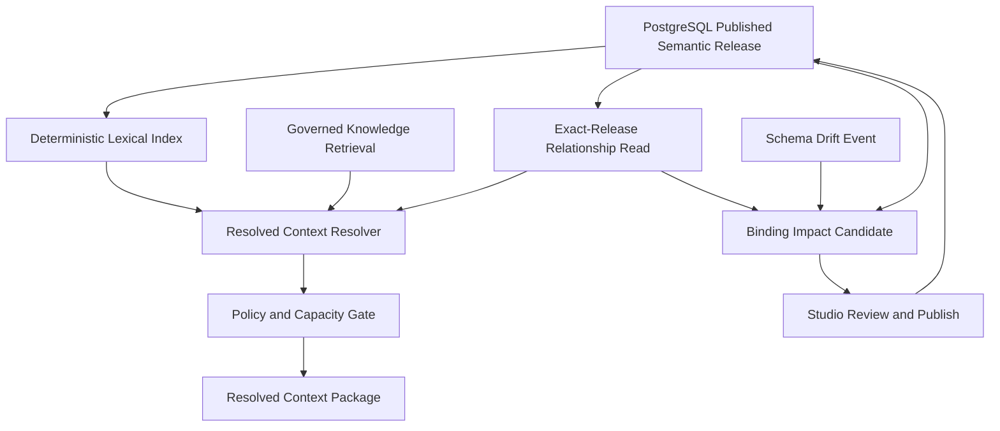
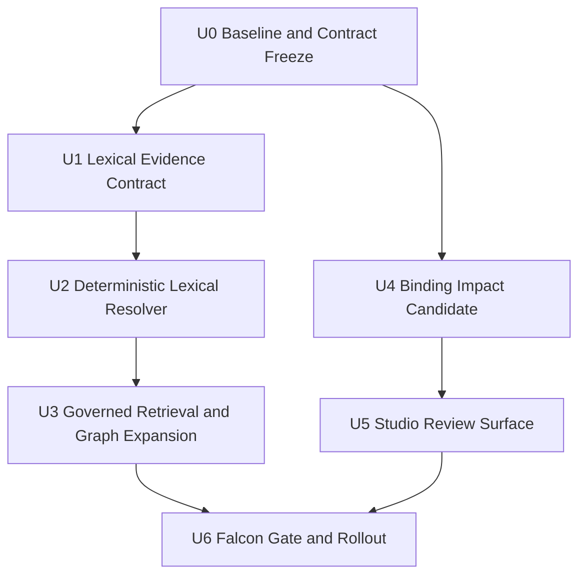
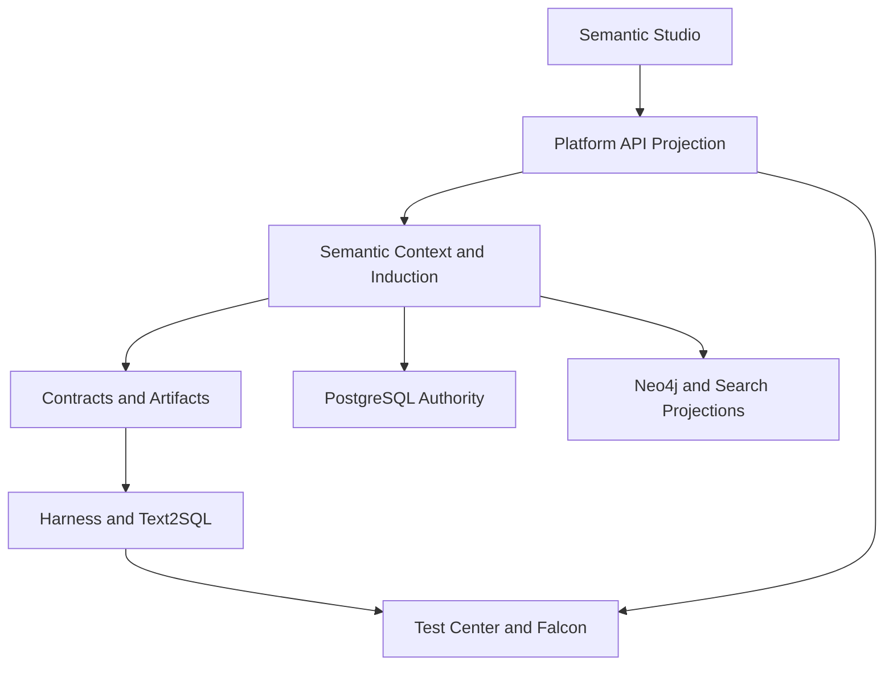

# TIS 本体实践借鉴与定向重构方案

## 1. 结论摘要

本方案不把 TIS 的本体模型、Neo4j 同步或 ChatBI 链路整体移植进 Data Agent，也不另建一套语义权威。建议只吸收三类经过边界改造的能力：

1. 在 `Published Semantic Release` 上建立确定性的词汇解析，再接受治理的知识召回与关系扩展；
2. 把已有 schema drift 与语义依赖闭包组合成可审阅的“绑定影响候选”，不自动重绑、不自动发布；
3. 将 TIS 的检索与 Falcon 测试思路纳入现有 Test Center / Falcon release gate，而不是复制其脚本与直接 SQL 执行链。

Data Agent 已经拥有更完整的关系优先语义图、Formula AST、发布语义版本、PostgreSQL 权威、Neo4j 可重建投影、Candidate 治理和证据链。重做 ObjectType/Property/Glossary/Linker 核心不仅收益低，还会造成双模型和双权威。因此，本次定位是“解析层与维护层增强”，不是“本体核心替换”。

## 2. 参考快照与证据边界

本方案基于以下只读固定快照，后续实施前如上游发生重要变化，应重新做差异核验：

| 来源 | 固定快照 | 用途 |
|---|---|---|
| `datavane/tis` | `21edc599e6b7d1532ac8ceda982f201a084177c7` | README、ChatBI/GraphRAG/Neo4j 同步设计、核心本体抽象 |
| `qlangtech/plugins` | `1ba03fe0615b551862df99bde263552e90ef080d` | `tis-ontology-plugin` 的实际检索、推理、同步、绑定切换与测试实现 |

上游均按 Apache-2.0 许可核验。当前结论来自源码与测试静态检查，没有把上游测试通过情况当作运行时证明。

关键上游入口：

- TIS：`README.md`、`design/chat-bi/00-overview.md`、`design/chat-bi/03-graphrag-retrieval.md`、`design/chat-bi/06-neo4j-ontology-sync.md`、`tis-plugin/src/main/java/com/qlangtech/tis/plugin/ontology/`
- TIS 插件：`tis-ontology-plugin/src/main/java/com/qlangtech/tis/plugin/ontology/` 下的 `graphrag/DefaultGraphRAGService.java`、`graphrag/PromptSerializer.java`、`sync/OntologyNeo4jSyncService.java`、`chatbi/DefaultChatBIService.java`、推理与绑定切换实现

完整分阶段附件见 [TIS 借鉴实施大纲](tis-ontology-adoption/0%20大纲.md)。

## 3. 问题定义

### 3.1 当前真实缺口

Data Agent 当前 `packages/semantic/src/context/context-router.ts` 对本体对象主要依赖名称和 aliases 的确定性短语命中；未命中时，知识召回与图遍历仍以 `*_DEFERRED` 状态存在。`packages/semantic/src/context/resolver.ts` 在 GRAPH 路径上按前 128 条关系取样，没有先做词汇落点、关系相关性选择和已发布版本校验下的图扩展。

另一方面，`packages/contracts/src/catalog/schema-drift.ts` 已能表达列、类型、约束、外键和索引变化，但 `binding_impact` 仍固定为 `UNKNOWN`。`packages/semantic/src/induction/impact-planner.ts` 已能计算语义依赖闭包，却尚未把物理漂移映射成可审阅的语义绑定影响。

这两个缺口与 TIS 的 GraphRAG 多路召回、Linker 展开和 Binding Switch Report 有真实交集，适合定向借鉴。

### 3.2 不属于本方案的问题

- 不重新定义 `BUSINESS_SUBJECT / DIMENSION / METRIC / FORMULA / PHYSICAL_* / GLOSSARY_TERM`；
- 不把维度、指标降格为 Property 的 semantic role；
- 不以 XML、插件文件或 Neo4j 作为语义事实权威；
- 不用原始 SQL 字符串替换 Formula AST 或受治理的物理映射；
- 不改写 Root Harness、Text2SQL 执行器、QueryEvidence 或 Provider 运行链；
- 不自动接受 LLM 推断结果，不自动切换绑定，不绕过人工评审和发布门禁；
- 不在当前语义架构重构的未提交重叠文件上直接施工。

## 4. 需求与约束

### 4.1 功能需求

- **R1 发布版本词汇索引**：只从精确 `Published Semantic Release` 构造规范名、alias、glossary preferred/synonym/abbreviation 的确定性索引；Candidate、草稿和未发布知识不得进入运行时权威。
- **R2 明确消歧**：多个同级命中必须返回 typed clarification，不得按分数、数组顺序或模型偏好静默选中。
- **R3 受治理多路召回**：确定性词汇命中优先；知识/向量召回只产生候选证据；图扩展必须走现有 semantic relationship read service，并绑定 release/checkpoint/digest。
- **R4 有界上下文**：所有候选都进入既有 context capacity、egress policy、ACL 和 canonical ordering；不得把整个图或原始 provider payload 塞进上下文。
- **R5 绑定影响候选**：schema drift 必须可推导受影响物理绑定、语义对象与依赖闭包，产出 immutable receipt / Candidate；不得直接改写 Published Release。
- **R6 人工治理**：绑定修复建议须经过验证、差异预览、人工接受和发布；自动化只能生成候选与证据。
- **R7 可解释 UI**：Studio 显示匹配类型、发布版本、关系路径、漂移操作、受影响对象和建议动作；不显示 raw prompt、raw SQL、数据库连接信息或 provider 私有载荷。
- **R8 可回归发布**：Falcon/Test Center 覆盖精确词、同义词、缩写、歧义、无命中、图回退、漂移影响与稳定性；增强能力不得降低现有确定性基线。

### 4.2 非功能约束

- PostgreSQL 继续是权威；Neo4j、词汇索引和向量索引均为可重建投影。
- 同一请求绑定精确 workspace/datasource/release/schema snapshot/policy/provider，不允许 latest 漂移。
- 相同输入必须得到相同排序、hash、reason code 和 receipt。
- 图扩展遵守既有 hop/node/edge/capacity 上限及 fail-closed/fallback reason code。
- 所有公共 trace 只暴露安全投影和持久 artifact reference。
- 每个实施单元先补失败测试，完成定向验证后做一个 scoped commit。

### 4.3 价值门禁与最小交付

- U1–U2 是可独立交付的最小切片，先证明显式词汇关系比当前 exact-only 路由增加有效命中，同时不增加静默误选。
- U3 不是默认必做项。只有离线回放与 Falcon 数据证明 M1 之后仍存在可量化的关系/知识召回缺口，且该缺口不能由补充 glossary/alias 解决，才进入 governed retrieval 实现。
- U4 是独立维护能力，不依赖 U3；其价值以“提前识别受影响发布对象、减少人工逐项排查”为准，而不是以自动修复率为准。
- U5–U6 只覆盖已通过前述门禁的能力；不为暂缓的 U3 预建空 UI、通用插件框架或专用向量后端。

## 5. TIS 能力采用矩阵

| TIS 实践 | Data Agent 决策 | 处理方式 | 原因 |
|---|---|---|---|
| ObjectType / Property / SemanticRole | 不采用 | 保留现有一等业务主体、维度、指标、公式 | 现有关系优先模型表达力更强，迁入会形成双模型 |
| Glossary 多目标关联 | 部分借鉴 | 复用现有 `GLOSSARY_TERM` 与 typed term role，补词汇索引 | 无需新增第二种 Glossary 权威 |
| SharedProperty / ValueType | 不单独采用 | 继续使用 Ontology Package constraint、维度与指标契约 | 现有契约已覆盖且治理边界更完整 |
| Linker / Cardinality | 思路借鉴 | 继续使用 typed semantic edges、join proof、relationship index | 不退化为通用 `LINKED_TO` |
| 字典 + 多路向量召回 | 改造采用 | exact-first；其余只作为受治理候选，统一去重与容量裁剪 | 分数不是权威，向量命中不可绕过发布与权限 |
| GraphRAG 关系展开 | 改造采用 | 走现有 exact-release relationship read service | 禁止直接读取可变 Neo4j 或无界展开 |
| PromptSerializer | 不采用 | 继续构造 Resolved Context Package 与证据摘要 | 避免 raw SQL、全量 schema 和不可审计 Markdown 提示 |
| Binding Switch Report | 改造采用 | 形成 schema drift → semantic impact Candidate/receipt | TIS 报告粒度不足，且不得自动切换 |
| LLM 本体推断 | 仅作交互参考 | 保持 Candidate → validate → review → publish | 不让模型输出进入运行时权威 |
| ChatBI 直接 SQL 生成/执行 | 不采用 | 保留 Harness、Text2SQL、sandbox、QueryEvidence | 避免旁路既有安全、证据和恢复机制 |
| XML/file authority + Neo4j sync | 不采用 | PostgreSQL authority + sealed rebuildable projection | 防止双写和投影反客为主 |
| Falcon 测试分层 | 借鉴 | 纳入现有 Falcon semantic release gate / Test Center | 保留统一 oracle、artifact 和发布门禁 |

## 6. 高层技术设计

设计上分成两条互不混淆的链：

- **运行时解析链**：Published Release → deterministic lexical grounding → 可选知识候选/关系扩展 → policy/capacity → Resolved Context Package；
- **维护治理链**：Schema Drift → 物理绑定匹配 → 语义依赖闭包 → Candidate/receipt → Studio 人审 → 新 Published Release。

任何知识或图投影失败，都只能触发 typed fallback、PARTIAL、NEEDS_CLARIFICATION 或 REJECTED；不得退回未版本化 latest 数据。

## 7. 实施单元与依赖

### U0：基线冻结与采用门禁

**目标**：把参考快照、采用矩阵、现有行为基线和重叠施工门禁固定下来。

**涉及文件**：

- `docs/plans/2026-08-23-001-refactor-tis-ontology-adoption-plan.md`
- `docs/plans/tis-ontology-adoption/*.md`

**前置条件**：当前 `refactor/semantic-v2-billing-retirement` 已在 `858446e` 形成可识别基线；受影响路径无未归属的重叠编辑。若仍有并行工作，使用独立 worktree。

**验收**：参考 commit 可复现；采用/拒绝项有证据；不包含实现代码；所有后续单元都有测试路径、失败模式与回滚边界。

### U1：词汇检索证据契约

**目标**：为 exact、preferred、synonym、abbreviation、knowledge candidate、graph expansion 定义稳定的 typed evidence，而不是只返回字符串 reason code。

**主要路径**：

- 新增 `packages/contracts/src/context/semantic-retrieval.ts`
- 修改 `packages/contracts/src/context/resolved-context-package.ts`
- 修改 `packages/contracts/src/context/index.ts`
- 修改 `packages/platform/src/semantic/postgres-resolved-context.ts`
- 新增 `infra/supabase/apps/data-agent/migration-sources/10705/`（已确认并实现）
- 新增 `scripts/render-10705-migration.ts` 与 `infra/supabase/apps/data-agent/migrations/20260725010705_app_data_agent_resolved_context_lexicon.sql`
- 修改 `infra/supabase/test-support/41-resolved-context-authority-assertions.sql`
- 新增 `packages/contracts/test/semantic-retrieval.spec.ts`
- 修改 `packages/contracts/test/resolved-context-package.spec.ts`
- 修改 `packages/platform/test/semantic/postgres-resolved-context.spec.ts`

**契约要点**：release ref、object/term id、term role、match kind、canonical phrase、evidence hash、projection checkpoint、relationship path、score availability、fallback reason；数组必须 canonical sort，hash 必须可验证。当前 authority snapshot 没有 preferred/synonym/abbreviation 的独立投影，因此 migration 必须从已发布语义图生成 `published_lexicon`，不能由 Web 或模型临时拼接。

严格 schema 不原地扩字段：`resolved-context-authority-snapshot@2.0.0` 与 shape 同步变化的 route/package 原子替换旧契约；shape 未变化的 request/receipt/commit/Text2SQL binding 不做机械版本号翻新。仓库内消费者、fixture、导出和调用点同批切换，旧 Snapshot/Route/Package 不再解析。PostgreSQL 保持一组稳定 RPC 名称并用 forward-only DDL 原位替换实现，不建立 V1/V2 双 RPC，也不复制、回填或迁移旧数据；历史 migration 文件本身保持不可变。

**验收场景**：重复项拒绝、乱序拒绝、hash 篡改拒绝、跨 release ref 拒绝、分数缺失可表达、Candidate/未发布对象不能构造 runtime evidence。

### U2：确定性词汇解析器

**目标**：替换“仅 name/aliases 扫描”的窄路由，但保持 exact-first 和显式消歧。

**主要路径**：

- 新增 `packages/semantic/src/context/lexical-resolver.ts`
- 修改 `packages/semantic/src/context/context-router.ts`
- 修改 `packages/semantic/src/context/resolver.ts`
- 新增 `packages/semantic/test/lexical-resolver.spec.ts`
- 修改 `packages/semantic/test/context-router.spec.ts`

**行为顺序**：规范名/指标 exact → preferred term → alias/synonym → abbreviation → 无确定命中。`related` 只可作为扩展提示，不得自动等同；同一优先级多命中进入 clarification。

**验收场景**：中英文名称、大小写/空白规范化、同义词、缩写冲突、指标与本体同名、不可查询对象、无 mapping、未发布对象、稳定排序与稳定 reason code。

### U3：受治理多路召回与关系扩展

**目标**：在确定性落点之后，按需加入知识候选和相关关系子图，替换 `KNOWLEDGE_RETRIEVAL_DEFERRED` / `GRAPH_TRAVERSAL_DEFERRED` 的占位行为。

**进入门禁**：先用 U2 的固定回放数据统计 unresolved/clarification/正确命中变化。若补齐显式 glossary/alias 已达到批准的目标，U3 维持暂缓；不得仅因为 TIS 存在四路召回就实施，也不得为对照保留旧 runtime resolver。

**主要路径**：

- 新增 `packages/semantic/src/context/governed-retrieval.ts`
- 修改 `packages/semantic/src/context/resolver.ts`
- 复用 `packages/semantic/src/relationship-index/service.ts`
- 必要时扩展 `packages/contracts/src/ports/semantic/application.ts`
- 新增 `packages/semantic/test/governed-retrieval.spec.ts`
- 修改 `packages/semantic/test/semantic-relationship-service.spec.ts`

**边界**：知识/向量结果只是候选；必须与 exact release 中对象交集；图读取绑定 release/checkpoint/digest；结果按类型、确定性优先级和 id 排序；继续经过 context capacity 与 egress policy。

**验收场景**：索引禁用、索引陈旧、digest 不一致、Neo4j 不可用、容量裁剪、重复命中、无关高分命中、ACL 隔离、hop/node/edge 超限；每种失败均有 typed fallback，不能读取 latest。

### U4：Schema Drift 到语义绑定影响候选

**目标**：把 `binding_impact: UNKNOWN` 提升为可验证的独立 artifact，同时保持原 drift event 事实不可变。

**主要路径**：

- 新增 `packages/contracts/src/artifacts/semantic-binding-impact.ts`
- 修改 `packages/contracts/src/catalog/schema-drift.ts`
- 新增 `packages/semantic/src/induction/binding-impact-planner.ts`
- 复用 `packages/semantic/src/induction/impact-planner.ts`
- 新增 `packages/platform/src/semantic/postgres-semantic-binding-impact.ts`
- 新增 `packages/platform/test/semantic/postgres-semantic-binding-impact.spec.ts`
- 新增 `infra/supabase/apps/data-agent/migration-sources/10706/`、`scripts/render-10706-migration.ts` 与 `infra/supabase/apps/data-agent/migrations/20260725010706_app_data_agent_semantic_binding_impact.sql`（暂定编号，实施前确认未被并行任务占用）
- 新增 `packages/contracts/test/semantic-binding-impact.spec.ts`
- 新增 `packages/semantic/test/binding-impact-planner.spec.ts`

**artifact 内容**：drift event ref、base/current snapshot hash、semantic release ref、直接受影响 mapping、传递受影响对象、未受影响 hash、风险等级、建议动作、不可自动决策原因、Candidate ref。PostgreSQL 使用 append-only receipt 表和幂等提交 RPC；现有 drift event 保持不可变，不把 `UNKNOWN` 历史值原地更新为派生结论。

**验收场景**：列删除、类型/可空性变化、FK/唯一约束变化、仅注释变化、新增未绑定列、多映射歧义、陈旧 snapshot、跨 datasource、循环依赖、重复运行幂等；不得直接产生发布写入。

### U5：Studio 证据与修复评审面

**目标**：让用户看到“为什么命中”和“哪些绑定会受影响”，并沿现有 Candidate 工作流审阅，而不是新增旁路编辑器。

**主要路径**：

- 修改 `apps/web/src/components/semantic/studio/context-preview-workbench.tsx`
- 修改 `apps/web/src/components/semantic/explorer/candidate-comparison-band.tsx`
- 修改 `apps/web/src/lib/semantic-studio-route.ts`
- 修改 `apps/web/src/app/api/workspaces/[workspaceId]/context/preview/route.ts`
- 新增 `apps/web/src/lib/semantic-binding-impact-route.ts`
- 新增 `apps/web/src/app/api/workspaces/[workspaceId]/semantic/binding-impacts/[impactId]/route.ts`
- 修改 `apps/web/test/semantic-context-preview.spec.tsx`
- 修改 `apps/web/test/semantic-candidate-route.spec.ts`
- 新增 `apps/web/test/semantic-binding-impact.spec.tsx`

**交互状态**：loading、无命中、确定命中、需要消歧、投影回退、影响未知、影响已计算、Candidate 待审、验证失败、可发布。键盘操作、焦点、状态文本和颜色对比需通过现有 UI 规范。

**用户流**：用户从 Context Preview 查看“本次命中依据”，有歧义时先选择候选再预览；从 schema drift/通知进入 Candidate comparison，先看风险与直接影响，再展开传递影响，最后选择拒绝、返回编辑或提交现有验证/发布流程。关闭或返回时不产生语义写入；只查看证据允许现有只读角色，创建/提交 Candidate 继续使用现有 workspace WRITE capability。

**验收场景**：发布版本与匹配类型可见；关系路径有界；同名消歧可选；漂移操作与受影响对象可追溯；raw prompt、SQL、DSN、provider payload 不进入 DOM 或 API 响应。

### U6：Falcon/Test Center 门禁与渐进启用

**目标**：证明新增能力在准确性、确定性、回退和治理上优于或不劣于现有基线。

**主要路径**：

- 修改 `packages/contracts/src/evals/falcon-semantic-release-set.ts`
- 修改 `packages/contracts/test/falcon-semantic-release-set.spec.ts`
- 新增 `packages/semantic/test/semantic-retrieval-falcon.spec.ts`
- 修改 `apps/web/test/falcon-agent-gate-boundary.spec.ts`
- 在既有 Test Center projection 中增加 retrieval/binding-impact 安全摘要

**对比基线**：B0 现有 exact-only；B1 exact + lexical；B2 exact + lexical + governed retrieval/graph。B2 只有在 B1 不降级且 ambiguity、stale、fallback、capacity 门禁全部通过时才允许进入运行路径。

**验收指标**：exact 命中零回退；歧义静默误选为零；跨 release 污染为零；冷重启结果 hash 稳定；索引故障可回退；Falcon first/final pass 不低于已批准基线；所有新增 artifact 可由 public ref 定位。

## 8. 系统级影响

- **数据流**：新证据进入 Resolved Context Package；绑定影响进入独立 Candidate/receipt。两者不能互相替代，也不能直接改写 Published Release。
- **错误传播**：投影/知识故障归一为 reason code 与 PARTIAL/REJECTED；权威不一致必须 fail closed；UI 只消费安全错误分类。
- **生命周期**：Published Release 发布后构建词汇与图投影；schema drift 落库后异步生成影响候选；候选验证与人工接受后才发布新版本。
- **缓存与一致性**：缓存键至少包含 workspace、datasource、semantic release hash、schema snapshot hash、policy hash；发布或漂移后旧缓存不可被新请求复用。
- **可观测性**：记录公开 artifact id/hash、命中类型、候选数、裁剪数、fallback reason、延迟和投影 checkpoint；不记录用户原问题全文、原始 prompt/SQL/rows/DSN。
- **单版本切换**：发生 shape 变化的 contract、authority、resolver、consumer 与 fixture 同批原子切换；结构未变协议保持版本，避免无价值 churn。删除旧 reason code 映射、旧读路径和兼容导出；评估对照只使用固定 fixture/Falcon artifact，不在运行时双读或双算。

### 8.1 计划级威胁模型

| 威胁 | 具体利用路径 | 必须落实的防护 |
|---|---|---|
| 跨 workspace/release 语义注入 | 恶意或错误检索结果引用其他租户、草稿或旧 release 对象并进入上下文 | PostgreSQL scope capability、exact release 交集校验、versioned ref/hash、无匹配 fail closed |
| 检索放大导致拒绝服务 | 超长问题、超多同义词或高连接节点触发大规模候选与图展开 | 输入长度、候选数、hop/node/edge、token 和超时上限；先裁剪后序列化；按 scope 限流 |
| 证据/影响面泄露敏感元数据 | API、DOM 或 trace 暴露原始问题、SQL、列样本、DSN 或 provider payload | workspace READ/WRITE 鉴权、安全 DTO allowlist、artifact projection、日志字段 allowlist 与负向测试 |

所有新增 workspace API 必须复用 `authorizeWorkspaceRequest` 和现有 role/capability 规则；只读证据与创建/提交 Candidate 分离授权。外部检索若后续引入新 provider，必须另行定义凭据、最小出站数据、轮换和不可用回退，本方案不预先授权该集成。

## 9. 测试策略

### 9.1 合同与单元测试

- Zod strict object、canonical order、hash verification、版本引用一致性；
- 词汇优先级、歧义、去重、同名跨 kind、未发布隔离；
- schema operation → direct binding → dependency closure 的确定性映射；
- 同一输入重复执行 artifact hash 一致。
- current resolved-context 的 parse、commit、canonical hash、跨 release 拒绝，以及仓库内旧 schema/RPC/export 引用归零。

### 9.2 集成与故障测试

- PostgreSQL exact release 与 Neo4j sealed build 一致、陈旧、缺失、digest mismatch；
- 知识/向量投影超时、空结果、越权结果、重复结果；
- context capacity 截断、mandatory exceeded、egress provider 不允许；
- drift event 与 semantic release/schema snapshot 不一致；
- Candidate 保存、验证、拒绝、接受、发布的事务与幂等性。

### 9.3 浏览器与公共投影测试

- 消歧与影响评审的完整键盘路径；
- loading/empty/error/stale/partial/ready 状态；
- API/DOM 中不出现 raw prompt、raw SQL、parameters、DSN、provider payload；
- artifact reference 可打开对应安全预览。

### 9.4 性能预算

- U0 先记录当前 exact-only route 的固定 fixture 与本地/CI p50、p95，所有相对目标以该记录为基线；
- 词汇 exact lookup 目标 p95 不超过现有 route 的 1.5 倍；
- 默认图扩展沿用现有 bounded read 上限，不在本方案另开无界配置；
- 大 release 的索引构建与查询分别压测，构建不阻塞权威发布事务；
- Studio DOM 继续有界，仅渲染当前选择、搜索结果和问题节点。

## 10. 发布、回滚与运维

1. **离线门禁**：在固定 fixture/Falcon 中比较 exact 与 lexical，不运行旧 resolver 生产分支；
2. **Lexical cutover**：contracts、authority、resolver 与消费者原子切换到唯一当前版本；
3. **Governed retrieval gate**：只有离线缺口门禁批准后才实现 U3；投影故障在当前版本内降级到 lexical authority；
4. **Binding impact preview**：仅展示和创建 Candidate，不允许自动应用；
5. **General availability**：Falcon/Test Center、稳定性与安全门禁通过后完成交付。

代码回滚只能回退整个 scoped commit，不保留运行时旧实现、feature flag 或 compatibility adapter。已产生的新 artifact 保留只读审计；Published Release 与 drift event 不做破坏性回写。若 current contract 已被外部消费者采用，必须在同一变更中更新该消费者，不能恢复旧读路径。

数据库变更全部 forward-only：不得修改已安装的 `10663` resolved-context migration 或历史 schema-drift migration。M1 已使用 `10705`；后续任务实施时仍须重新扫描 migration inventory。新 DDL 不搬运旧数据，并显式删除不再使用的旧 runtime RPC/表面。

## 11. 风险与缓解

| 风险 | 触发方式 | 缓解 |
|---|---|---|
| 双语义模型 | 复制 TIS ObjectType/Property 权威 | 明确不采用；只扩展已有 graph/context contract |
| 向量分数变成事实 | 高分候选直接路由 | 候选必须回交 exact release，歧义必须澄清 |
| Neo4j 反客为主 | 直接按 latest 图读取 | 复用 exact release/checkpoint/digest service，PG 可重建 |
| 上下文膨胀 | 多路召回全量合并 | canonical dedupe + policy/capacity + bounded expansion |
| 自动修复污染发布 | drift 后自动 rebind | Candidate-only、验证、人审、发布事务 |
| 当前重构冲突 | 在大量未提交语义文件上施工 | 等待受影响路径基线稳定，独立 worktree、单元 scoped commit |
| 敏感信息泄露 | 复制 TIS prompt/trace 做法 | 安全 artifact projection，禁止 raw SQL/prompt/DSN/provider payload |
| 测试“有结果即通过” | 弱断言掩盖错误 | 使用确定性 oracle、hash、reason code、故障注入和浏览器验收 |

## 12. 完成定义

- U1–U6 全部完成各自失败测试、实现、定向验证和 scoped commit；
- 运行时只使用精确 Published Release，Candidate/草稿/陈旧投影无法进入上下文；
- 消歧、fallback、capacity 和 policy 都有 typed evidence 与稳定 reason code；
- schema drift 能产生可验证、可追溯、不可自动发布的绑定影响 Candidate；
- Studio 提供完整审阅路径且公共投影无敏感载荷；
- Falcon/Test Center 证明 B1/B2 不低于批准基线，冷重启与投影故障场景通过；
- PostgreSQL 权威、Neo4j 可重建投影、Formula AST、QueryEvidence、Harness 边界均未被绕过。

## 13. 暂缓决策

- 是否增加独立向量索引后端：先复用现有知识检索端口做 B2 试验，只有证据表明召回不足且运营收益明确时再提单独 ADR；
- 是否把词汇索引物化到 PostgreSQL：先以可重建投影实现并测量 release 规模、构建时间和 p95；
- 是否自动生成修复 patch：本方案只允许建议动作和 Candidate，自动 patch 需另立安全设计；
- 是否扩展多语言形态学：先覆盖中文、英文规范化与显式词汇关系，不引入不可解释的语言模型改写。
