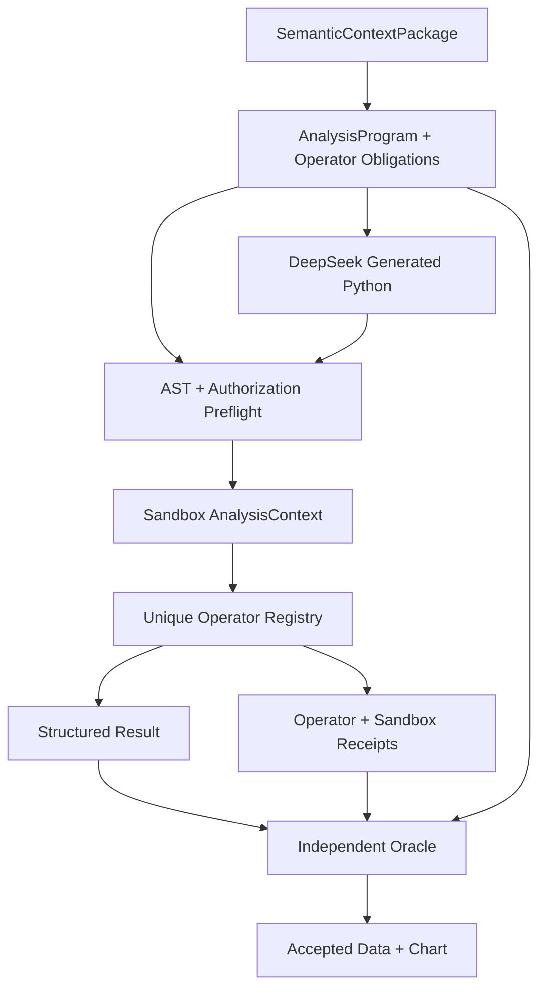
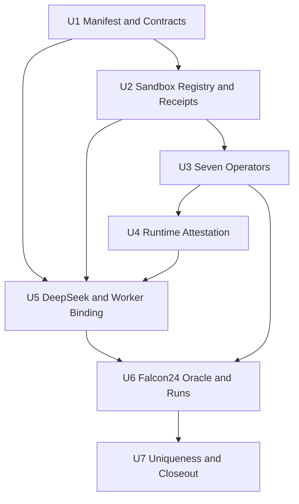
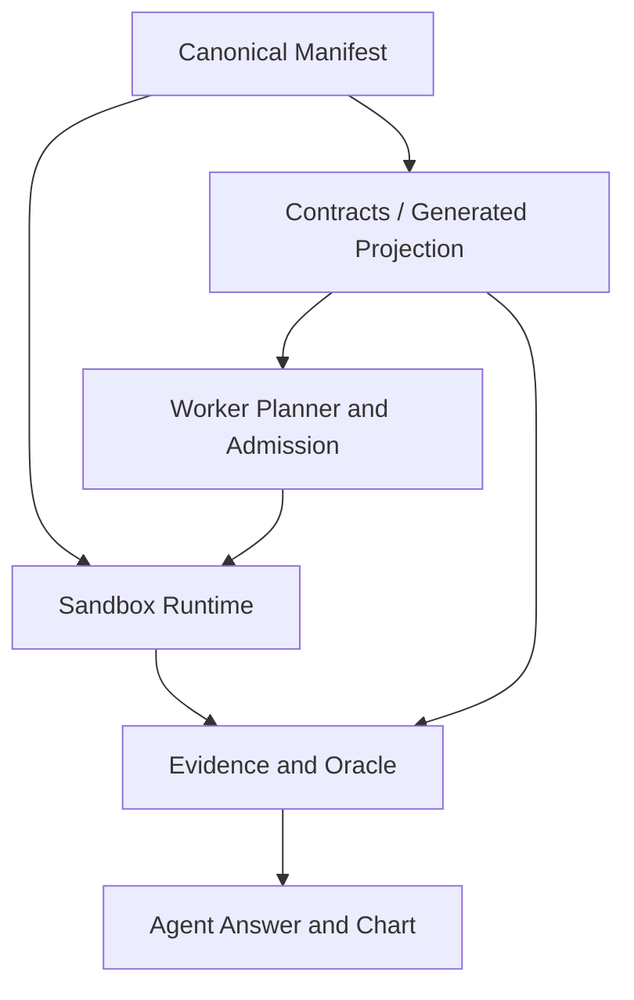

# feat: 唯一 Sandbox 统计算子与 DeepSeek 编排边界

## Summary

本计划把 BH-FDR、Theil-Sen、Mann-Kendall、HAC、Shapley、分群留存及 Falcon24 Q2 必需的
binomial-logit/Wald 固化为 Sandbox 内唯一、版本化、可证明的统计算子。DeepSeek 继续生成真实 Python，负责数据准备、
分组、变换、算子编排、结果组装、解释和图表输入；它不再重复实现这些受治理方法的底层公式，也不能绕过算子回执把
手写结果升级为已接受证据。

该切换直接修改当前尚未发布的 `AnalysisProgram@1`、`SandboxProgram@2` 和 Python IPC v2 合同，不增加兼容解析、
双执行、旧公式 fallback、未版本化别名或冻结 Python 模板。历史可追溯性由不可变 Image/Runtime/Lock/Implementation
digest 与回执保存，而不是在当前运行时保留旧实现。

## Problem Frame

### 当前问题不是单纯的 DeepSeek 超时

Falcon24 的真实运行已经证明 Sandbox 可以在既有预算内成功完成复杂题目；近期失败主要来自生成程序的结构和方法实现：

- Q3/Q4 近期失败以 `ANALYSIS_ORACLE_FAILED` 和一次 `PROGRAM_POLICY_REJECTED` 为主，没有出现资源超时；
- Q5 首次程序完成了主要计算，却在写出后返回非 `None`，触发
  `PYTHON_ENTRYPOINT_RETURN_MUST_BE_NONE`；
- Q5 修复尝试把完整程序退化成缺少 pandas 别名的短骨架，随后触发 `PYTHON_NAME_ERROR`；
- Q3/Q4 的方法提示目前逐行描述 Theil-Sen、Mann-Kendall、BH 和 HAC 公式，模型既要理解业务语义、准备数据，又要重新
  编写和调试数值算法，提示长度、错误面和 Oracle 失败概率都被放大；
- 相同方法在不同题目中以自然语言重复，库版本、默认参数、tie-breaking、缺失值策略和 family scope 没有一个可查询的
  运行时权威。

因此，问题既不是“DeepSeek 模型不行”，也不能只靠提高 timeout 解决。模型应该保留 Python 自主性，但把需要治理、
重放和统计前提判断的方法下沉到受证明的 Sandbox 算子。

### “唯一版本”需要解决的四层漂移

1. **数学语义漂移**：Theil-Sen 的 x 语义和 intercept 定义、Mann-Kendall 的 ties/continuity、HAC 的 kernel、
   correction、maxlags 和 z/t inference 都会改变结果。
2. **依赖默认漂移**：即使直接调用同一库，默认参数和版本升级仍可能改变行为。
3. **模型实现漂移**：模型可能遗漏初始化、错位 lag、提前过滤 BH family、错误累计全局异常字段或在 repair 时删掉必要代码。
4. **证据漂移**：当前成功 Receipt 能证明“某段 Python 在某镜像执行”，但不能证明最终字段确实来自指定统计算子和指定参数。

## Requirements

- **R1 — 唯一执行权威。** 每个受治理统计方法在当前 Sandbox Runtime 中只能有一个可执行实现和一个精确版本 ID；
  不提供未版本化名称、alias、旧实现、模板旁路或允许 overwrite 的注册入口。
- **R2 — 单一清单。** Operator Manifest 是方法元数据的唯一手工维护权威，定义 ID、输入/输出契约、显式参数、适用性、
  确定性、implementation source set、Runtime Profile、资源上限和语义公式引用；implementation/registry digest 由构建对
  canonical manifest、实现源码和 lock 派生，TypeScript 只消费带 source hash 的生成投影，避免手填 digest 自引用。
- **R3 — 程序级授权。** `AnalysisProgram` 节点必须声明完整 operator obligations、registry digest 和 server-derived
  generated-source policy，即使 obligations 为空也不能省略；`SandboxProgram`、IPC Request、Sandbox Receipt 和 Derived
  Evidence 必须闭合同一组引用与 digest。模型和调用方都不能提交 import roots。
- **R4 — 结果级闭包。** 成功不仅要求“调用过算子”，还要求 required call、输入摘要、输出摘要及最终结构化结果的绑定全部
  闭合；漏调、越权调用、调用后忽略、跨题重用或 registry 漂移均失败关闭。
- **R5 — DeepSeek 保留 Python。** `deepseek-v4-flash` 继续输出完整 `main(context)`，可以使用 pandas/numpy 完成去重、
  过滤、分组、lag 对齐、dummy encoding、补充变换、结果组装、解释和图表数据准备。
- **R6 — 不手写治理公式。** 对 operator-bound 节点，DeepSeek 不直接导入或重写相同受治理统计方法；Prompt 提供短小的
  operator cards、数据准备合同和输出绑定，不再展开底层公式。
- **R7 — 适用性先于数值。** 每个算子返回 `PASS`、`ASSUMPTION_BOUND` 或 `HOLD` 的适用性结果；模型不能删除限制或把
  `HOLD` 数值升级为业务结论。Mann-Kendall 的自相关/季节性、HAC 的 rank/sample、GLM 的收敛/分离、BH 的 family/
  dependence 等必须显式处理。
- **R8 — 独立验收。** 生产算子不能导入 sealed Oracle；Oracle 也不能复用生产算子的实现函数。Oracle 是 N-version
  verifier，不是第二条执行路径，只有 Sandbox 算子能生成受接受的生产数值。
- **R9 — 可重放供应链。** Manifest digest、operator implementation digest、Python/Dependency Lock、Image digest、
  target platform 和 resolved parameters 全部进入回执。仅 seed 相同不足以证明重放一致。
- **R10 — 原子切换。** 当前协议尚未发布到 `dev`，实施时直接替换现有合同和所有消费者；同一提交边界删除 Falcon24
  手写公式提示、无算子回执的验收路径和旧测试 fixture，不保留 compatibility layer。

## Scope Boundaries

### In Scope

- 首批七个受治理统计算子、唯一 Manifest/Registry、SDK 调用面、授权与回执闭包；
- AnalysisProgram、SandboxProgram、Python IPC、Derived Evidence 和 Falcon24 Oracle 的跨层绑定；
- DeepSeek generation/repair Prompt 与 AST preflight；
- Falcon24 五题的算子映射、独立数值 Oracle、图表闭包和 30 次真实运行门禁；
- Runtime/Lock/Image/Policy attestation 更新及旧路径扫描。

### Out of Scope

- 把所有 pandas/numpy 操作变成 DSL 或算子；
- 取消 DeepSeek 生成 Python，或改成宿主端把 DSL 编译为完整 Python；
- 允许用户上传自定义算子、wheel、脚本或 Runtime；
- 在本轮引入 approximate Shapley、seasonal/modified Mann-Kendall、BY FDR、clustered covariance 或新的因果估计；
- 把 Semantica 的图分析模块迁入统计 Runtime；Semantica 只继续作为语义生产、图扩展和生命周期参考。

### Model vs. Operator Boundary

| 工作 | DeepSeek Python | Governed Operator | Host / Oracle |
|---|---|---|---|
| 去重、筛选、排序、分组、reshape | 负责 | 不负责 | 校验输入证据边界 |
| lag 对齐、控制变量构造、dummy encoding | 负责 | 校验矩阵与标签 | 校验题目合同 |
| BH、Theil-Sen、MK、HAC、GLM、Shapley、留存口径 | 只编排 | 唯一计算权威 | 独立验算与接受 |
| 缺失值、family、窗口和适用性选择 | 按语义合同准备 | 强制校验 | 决定 PASS/HOLD |
| 结论、限制、图表数据组装 | 负责 | 提供方法证据 | 禁词、闭包和 chart hash 门禁 |
| 网络、数据库、文件路径、包安装、权限 | 无权 | 无权 | Server-owned authority |

## Context and Research

### Repository Findings

- `services/sandbox/src/data_agent_sandbox/python_runtime/policy.py` 已使用真实 Python AST 并有分层 import profile；适合扩展
  为 operator call、constant ID、entrypoint return 和 source capability 的静态门，而不是另建正则检查器。
- `services/sandbox/src/data_agent_sandbox/python_runtime/sdk.py` 的 `AnalysisContext` 已是 capability-shaped API；算子应通过
  context 暴露，不允许模型导入 `data_agent_sandbox` 内部实现。
- `services/sandbox/src/data_agent_sandbox/python_runtime/worker.py` 已固定 `main(context)` 必须返回 `None`，但当前 AST
  preflight 未提前拒绝有值 return；Q5 的一次 Sandbox 尝试因此可在执行前避免。
- `packages/contracts/src/artifacts/research/analysis.ts` 已让 AnalysisProgram 节点绑定 output contract、runtime profile 和
  dependency lock，但尚未表达算子 obligations、registry digest 或 result binding。
- `packages/contracts/src/ports/python-sandbox.ts` 已形成严格 IPC 和零部分输出语义，适合在同一 Receipt 内增加 bounded
  operator receipts，而不是另设未绑定日志。
- `apps/worker/src/analysis/deepseek-program-source.ts` 仍要求 DeepSeek 生成完整源码；本计划保留这一点，只缩小需要模型正确
  手写的数学表面积。
- `apps/worker/src/evals/falcon24-analysis-program.ts` 当前重复下发底层公式；这里应改成 operator obligations、输入准备、
  业务分类和解释合同。
- `apps/worker/src/evals/falcon24-arrow-backed-analysis-oracle.ts` 已有独立 TypeScript 数值检查。保留其独立性，避免生产与
  Oracle 共用核心计算函数。
- `Semantica@6c2ccfd` 提供 ontology、graph analytics、export 和 reasoning 参考，但固定源码中没有可用于本需求的统计
  operator registry；不应为“参考开源”而移植无关架构。
- `docs/plans/2026-07-30-001-refactor-governed-semantic-control-plane-plan.md` 曾把 advanced Shapley 标为
  `DEFERRED/HOLD`，要求另行证明 eligibility、closure、预算和不确定性。本计划正是该独立激活与验收工作，不借“已有
  注册表”跳过批准。

### External Findings That Change the Design

- SciPy 1.15.3 的 BH API 明确区分 BH/BY、按 axis 分 family，并要求 p 值位于 `[0,1]`；因此 family scope、方法和
  stable label mapping 必须由 Operator Contract 固定，不能把一列裸 p 值交给模型自由处理。
- SciPy 1.15.3 的 Theil-Sen slope 是 pairwise slopes 的中位数，但 intercept 有 `joint` 与 `separate` 两种定义；
  Falcon24 只需要 slope，首版算子应明确不输出 intercept，避免无业务价值的默认漂移。
- statsmodels HAC 要显式给出 maxlags，并存在 Bartlett/uniform、small-sample correction 和 normal/t inference 的选择；
  Runtime 当前锁定 0.14.5，因此算子必须显式传入全部选择并绑定该 lock，不能依赖库默认。
- Original Mann-Kendall 不处理 serial correlation 或 seasonality；算子仍可按 Falcon24 冻结公式返回 assumption-bound
  结果，但必须把前提状态写入 Receipt，禁止模型把它描述为无条件显著性。
- DeepSeek 官方 Tool Calls 文档明确由调用方执行函数，模型只生成结构化调用；这支持“模型负责编排、平台负责执行”。
  但 strict mode 仍是 Beta，JSON mode 官方也提示偶发空内容，所以本计划不把安全或正确性依赖在 provider strict mode，
  仍以本地 schema、AST、一次有界 repair 和 Sandbox Receipt 为权威。
- Apache Arrow 的 FunctionRegistry 展示了命名注册、显式 options、签名 dispatch、禁止默认 overwrite 和 manifest listing
  的成熟形状；本项目只借鉴这些原则，不引入 Arrow C++ Registry。
- NumPy 的 RNG policy 明确说明精确重放需要固定 NumPy 版本，不能只依靠 seed；这支持继续绑定 Runtime、Lock、Image 与
  target platform。

## Key Technical Decisions

| Decision | Choice | Why | Rejected Alternative |
|---|---|---|---|
| 执行权威 | Sandbox 内 server-owned Operator Registry | 同时具备隔离、锁版本、资源门和回执 | Worker/模型直接调用 SciPy/Statsmodels |
| 模型接口 | `AnalysisContext` 的 capability-shaped operator call | 模型看不到内部包和 executor | 允许导入 `data_agent_sandbox` |
| 元数据权威 | 一个 canonical manifest，TS 为 generated projection | 消除 Python/TS 手工双写 | 两端各维护常量表 |
| 程序绑定 | 计划期 obligations + 运行期 call/result closure | 证明最终字段来自授权算子 | 只检查源码是否出现函数名 |
| Source 权限 | 非空 obligations 自动绑定 dataframe-orchestration policy | 可信算子可用科学库，生成源码不能绕过 | 让模型或请求传 import allowlist |
| 版本策略 | 当前 Runtime 每个逻辑算子只有一个 active version | 满足唯一性并阻止隐式 fallback | @1/@2 同时注册或无版本 alias |
| 历史重放 | 依靠不可变镜像与 implementation digest | 不让历史负担污染当前执行面 | 当前源码保留旧实现 |
| 模型能力 | 保留完整 Python 与普通变换 | 维持 Agent 自主分析能力 | 只输出 DSL，Host 生成全部代码 |
| 开放分析 | 允许非 operator-bound exploratory Python，但不能宣称受治理方法 | 保留未知问题探索能力，治理声明仍唯一 | 全局禁用 scipy/statsmodels |
| 验收 | 独立 Oracle + operator receipts | 检测实现错误而不创建第二生产权威 | Oracle 复用生产函数 |
| Provider strict | 不依赖 Beta strict/tool execution | 避免外部 Beta 成为安全门 | 由 Provider schema 代替本地门控 |

## Initial Operator Catalog

Operator ID 是唯一调用名称；首版不提供短名或 alias。所有参数都由 Manifest 声明并在 Receipt 中记录 resolved value，
禁止读取底层库默认。

| Operator ID | Frozen semantics | Applicability / failure boundary | Falcon usage |
|---|---|---|---|
| `multiple-testing.bh-fdr@1` | labeled family、p/ID 稳定排序、反向 running-min、q 映射回 ID | 空 family、重复 ID、非有限或越界 p 失败；dependence 未证明为 `ASSUMPTION_BOUND` | Q3 全商品 family；Q4 每个 outcome family |
| `robust-trend.theil-sen-slope@1` | 显式 x/y、所有 pairwise slopes 的线性 p50；只返回 slope | x 不唯一/不递增、样本不足、非有限值失败；不隐式生成 timestamp ordinal | Q3 每商品 12 月 damage rate |
| `trend.mann-kendall-original@1` | original MK、exact-value ties variance、continuity correction、two-sided normal p | 样本不足/全 ties 有稳定退化；serial correlation 或 seasonality 未证明时标记限制 | Q3 每商品趋势 p |
| `regression.ols-hac@1` | OLS coefficient + Newey-West HAC；Bartlett、maxlags、correction、normal inference 全显式 | 非等间隔、n/k 不足、rank deficient、目标列缺失或数值失败为 HOLD | Q4 0–4 周 lag fits |
| `regression.binomial-logit-wald@1` | binomial logit、固定优化/收敛门、目标系数 two-sided Wald inference | 非二元 y、rank deficient、完全分离、不收敛、样本不足为 HOLD | Q2 delayed 与低评分关联 |
| `decomposition.product-shapley-exact@1` | named multiplicative factors、全排列 exact marginal average、stable order、closure | factor 非有限、数量超界、观察变化与重构不闭合失败；无 approximate 模式 | Q1 buyers × frequency × AOV |
| `cohort.registration-retention-m0-m6@1` | 注册月 cohort、M0–M6、primary/sensitivity denominator、zero-order customers、全局异常常量 | 缺月、denominator 漂移、重复组、全局异常列不恒定失败；primary 不可靠可作为正确 HOLD 输出 | Q5 retention/repeat/spend/experience |

### Cohort Operator Is Deliberately Business-Semantic

分群留存不是一个裸统计公式。Falcon24 要求注册 cohort、未下单客户保留在分母、首单早于注册者只从 sensitivity 分母排除、
全局异常不能按每行重复累加，而且 primary 结论必须 HOLD。把它拆成几个通用 ratio helper 会再次把最危险的分母和数据质量
逻辑留给模型，因此首版保留一个绑定 `formula.cohort_retention`、时间语义和 DQ refs 的复合算子。未来出现不同业务定义时，
必须新增并审核新的逻辑算子版本，不能用 options 偷偷改写同一 ID 的含义。

### Applicability Semantics

- `PASS`：方法前提、数据形状和参数均满足，可进入正常结论；
- `ASSUMPTION_BOUND`：数值可重放，但存在必须披露的统计前提，例如 original MK 的 seasonality/serial-correlation 未被充分
  证明；可进入受限统计信号，不能省略 limitation；
- `HOLD`：数据或算法条件不足。数值即使可计算也不能进入 accepted business conclusion；
- 数据质量导致的“业务结论 HOLD”与执行失败不同。Q5 正确地产出 `primary_reliable=false` 和 sensitivity 是 PASS 的分析
  结果，不应被误判为 Sandbox 失败。

## High-Level Technical Design

以下是方向性数据流，不规定具体函数签名：

### Authority and Evidence Closure

1. Semantic compiler chooses required operator IDs from the accepted question/method contract; the model cannot add capability.
2. AnalysisProgram binds the exact registry digest, required stable call IDs, allowed multiplicity/batch bounds、generated-source policy 和
   final-result bindings。动态分组不依赖 Python taint tracking，而以 operator 输出的稳定 label collection 与最终结果同标签
   collection 做整体闭包，避免逐行 JSON pointer 或不可实现的对象来源追踪。
3. DeepSeek receives concise operator cards and writes Python that prepares labeled inputs and invokes only those obligations.
4. AST preflight requires literal operator/call IDs, rejects non-`None` entrypoint return, internal module access, undeclared calls and forbidden
   source imports before a Sandbox attempt is consumed.
5. Sandbox resolves the ID only from the process-local registry；算子只接收有大小上限的 scalar、labeled vector/matrix/table canonical
   values，不接收 callback、文件对象、模块或任意 Python object；随后校验 input/output/options/applicability、计算 canonical
   input/output hashes 并记录 bounded Operator Receipt，Receipt 不包含原始行。
6. Output commit verifies required calls、no extra calls、registry digest、result bindings、output contract 和 zero partial commit。
7. Worker 把 Operator Receipt closure 纳入 SandboxExecutionReceipt/DerivedAnalysisEvidence；独立 Oracle 再验数值、不变量、限制、
   method evidence、result hash 与 chart dataset hash。

### Generated Source Capability

Operator-bound 节点仍运行在包含锁定 SciPy/Statsmodels 的镜像中，但其 server-derived source policy 只给生成源码 dataframe
orchestration 所需的 import 能力。内部算子由可信 Runtime 加载科学库；模型源码不能直接调用相同治理库或 Registry
internals。非 operator-bound 的开放
探索节点可以保留 ML_DIAGNOSTIC 库访问，但其结果不能声明 Manifest 中的 governed method，也不能满足 Falcon24 硬门。
这不是兼容路径：两者具有不同的声明权限，受治理方法只有 Registry 一条生产执行路径。

### Failure Taxonomy

在现有安全/资源错误码基础上增加稳定的算子失败分类：

- registry/manifest/runtime digest mismatch；
- operator 未注册、未授权、漏调或额外调用；
- operator 参数或输入 schema 无效；
- operator applicability HOLD；
- operator numeric/convergence failure；
- operator receipt/result binding 不闭合；
- entrypoint value-return 在执行前被 policy 拒绝。

这些错误进入 scrubbed repair 时只包含 operator ID、字段路径、稳定 reason code 和限制说明，不回传原始数据、依赖栈、
provider payload 或内部源码。

## Implementation Units

### U1 — Freeze the Canonical Operator Manifest and Cross-Layer Contracts

- **Goal:** 建立单一 Operator Manifest 与从 Program 到 Evidence 的必需绑定，先把“谁有权算、必须调用什么、如何证明”固定。
- **Requirements:** R1、R2、R3、R4、R9、R10。
- **Files:**
  - `services/sandbox/src/data_agent_sandbox/python_runtime/operators/manifest.json`
  - `packages/contracts/src/generated/statistical-operators.ts`
  - `scripts/generate-statistical-operator-contracts.ts`
  - `packages/contracts/src/artifacts/research/analysis.ts`
  - `packages/contracts/src/ports/python-sandbox.ts`
  - `packages/contracts/src/artifacts/research/wire.ts`
  - `packages/research/src/analysis-evidence/program-verifier.ts`
  - `packages/contracts/test/deterministic-analysis-artifacts.spec.ts`
  - `packages/contracts/test/python-sandbox-v2.spec.ts`
- **Approach:** canonical manifest 声明七个 operator 的 schema、参数、适用性和 digest material；生成的 TS projection 带
  `DO NOT EDIT` 与 source hash，check 模式发现漂移即失败。把 obligations/registry digest/source policy/receipt closure 设为
  现有未发布协议的 required fields，不增加 optional defaults 或旧 shape parser。
- **Test scenarios:** duplicate ID、alias、overwrite、manual TS edit、manifest hash drift、Program/Sandbox/IPC 任一漏字段、
  cross-run receipt、operator set/order/multiplicity mismatch、unknown field 全部失败；empty obligations 只有明确非治理节点可通过。
- **Verification outcome:** Python 和 TypeScript 对同一 manifest 产生相同 registry digest；仓库只存在一个手工维护清单。
- **Commit boundary:** `feat(analysis): bind programs to governed operators`

### U2 — Build the Sandbox Registry, Capability API and Receipt Closure

- **Goal:** 让模型只能通过 `AnalysisContext` 调用已授权 operator，并让每次调用成为可验证证据。
- **Requirements:** R1、R3、R4、R6、R7、R8。
- **Files:**
  - `services/sandbox/src/data_agent_sandbox/python_runtime/operators/registry.py`
  - `services/sandbox/src/data_agent_sandbox/python_runtime/sdk.py`
  - `services/sandbox/src/data_agent_sandbox/python_runtime/models.py`
  - `services/sandbox/src/data_agent_sandbox/python_runtime/policy.py`
  - `services/sandbox/src/data_agent_sandbox/python_runtime/worker.py`
  - `services/sandbox/src/data_agent_sandbox/python_runtime/supervisor.py`
  - `services/sandbox/tests/test_python_runtime.py`
  - `services/sandbox/tests/test_operator_registry.py`
- **Approach:** Registry 启动时校验 manifest、实现集合和 digest；Context 接收 server-owned authorization，不允许源码传入
  executor。AST 校验 literal operator/call IDs、required calls、entrypoint return 和 server-derived import capabilities；调用面
  只接受 bounded canonical scalars/arrays/tables，拒绝 callback 和任意对象；每次调用做 canonical hash、schema/option/
  applicability 检查并生成 bounded receipt。只有全部 required calls 与 label-collection output binding 闭合后才提交输出。
- **Test scenarios:** dynamic operator ID、unauthorized/extra/missing call、duplicate call ID、ignored result binding、tampered output、
  direct internal import、non-None return、exception/timeout/cancel after operator call、receipt raw-row leakage、idempotent replay。
- **Verification outcome:** 无 operator closure 的程序即使数值正确也不能成功；失败、取消或 stale fence 均零输出和零可接受回执。
- **Commit boundary:** `feat(sandbox): execute governed statistical operators`

### U3 — Implement and Certify the Seven Initial Operators

- **Goal:** 落地首批唯一数值实现，并用 golden、metamorphic、property 和 adversarial fixtures 证明边界。
- **Requirements:** R1、R2、R7、R8、R9。
- **Files:**
  - `services/sandbox/src/data_agent_sandbox/python_runtime/operators/multiple_testing.py`
  - `services/sandbox/src/data_agent_sandbox/python_runtime/operators/robust_trend.py`
  - `services/sandbox/src/data_agent_sandbox/python_runtime/operators/regression.py`
  - `services/sandbox/src/data_agent_sandbox/python_runtime/operators/decomposition.py`
  - `services/sandbox/src/data_agent_sandbox/python_runtime/operators/cohort.py`
  - `services/sandbox/tests/operators/`
  - `services/sandbox/pyproject.toml`
- **Approach:** SciPy/statsmodels 仅在可信 operator implementation 内按显式 options 调用；MK、exact product Shapley 和 cohort
  口径实现为 server-owned audited code。每个算子支持 bounded labeled batch，返回稳定 label mapping、sample/family/rank/
  convergence/applicability evidence，禁止 NaN/Infinity 和静默 coercion。
- **Test scenarios:**
  - BH：原论文/SciPy vector、ties、input permutation invariance、family split mutation、invalid p；
  - Theil-Sen：odd/even slope count、x shift/scale、duplicate x、outlier robustness、timestamp ordinal mutation；
  - MK：ties、S 正负零、continuity mutation、constant series、serial/seasonality limitation；
  - HAC：frozen statsmodels 0.14.5 parity、maxlags/kernel/correction/use_t mutation、rank/sample/order failure；同一 OLS coefficient
    也覆盖 Q4 spend-over-week 的正斜率分类，DeepSeek 不另写第二个 OLS slope；
  - GLM：known coefficient fixture、category-column permutation、complete separation、non-convergence、rank deficiency；
  - Shapley：factor permutation symmetry、dummy factor、baseline=current、exact closure、approximate mode rejection；
  - Cohort：M0–M6 completeness、zero-order denominator、pre-registration sensitivity、global constant non-summing、duplicate group、
    primary HOLD with accepted sensitivity。
- **Verification outcome:** 每个 manifest vector 和 mutation gate 通过；生产 operator 与 sealed Oracle 无 import/call dependency。
- **Commit boundary:** `feat(sandbox): add certified statistical operator catalog`

### U4 — Rebuild Runtime, Lock and Supply-Chain Attestations

- **Goal:** 把新增实现纳入真实镜像身份，防止“源码已变、digest 未变”的伪证明。
- **Requirements:** R2、R9。
- **Files:**
  - `infra/docker/Dockerfile.python-sandbox`
  - `infra/docker/Dockerfile.python-sandbox-ml`
  - `infra/docker/python-sandbox-requirements.lock`
  - `infra/docker/python-sandbox-requirements.ml.lock`
  - `infra/docker/python-sandbox-attestation.json`
  - `infra/docker/python-sandbox-supply-chain-attestation.json`
  - `apps/worker/src/analysis/skill-catalog.ts`
  - `services/sandbox/tests/python_container_smoke.py`
- **Approach:** 重新计算 implementation/registry/runtime/lock/image digests，镜像启动校验 registry digest 与 target platform；
  生成源码 import policy 与可信 operator dependencies 分离；固定数值线程环境，避免 BLAS/OpenMP 并发设置造成同镜像内漂移。
  任何旧 digest 常量必须替换，不保留接受旧值的分支。
- **Test scenarios:** source/manifest/lock/image/platform 任一 mutation、无网络、只读 root、无 Secret/host path、operator internal import
  可用而 generated direct import 被拒、跨架构 digest 不同。
- **Verification outcome:** hardened container smoke 证明真正运行新 Registry；Worker attestation 与容器自报、manifest 和 lock 完全一致。
- **Commit boundary:** `build(sandbox): attest governed operator runtime`

### U5 — Make DeepSeek an Operator-Orchestrating Python Author

- **Goal:** 保留模型的 Python 分析能力，同时删除底层统计公式重复和 repair 扩权。
- **Requirements:** R3、R4、R5、R6、R7、R10。
- **Files:**
  - `apps/worker/src/analysis/deepseek-program-source.ts`
  - `apps/worker/src/analysis/program-admission.ts`
  - `apps/worker/src/analysis/sandbox-executor.ts`
  - `apps/worker/src/analysis/executor.ts`
  - `apps/worker/src/analysis/skill-catalog.ts`
  - `apps/worker/src/evals/falcon24-analysis-program.ts`
  - `apps/worker/test/analysis/deepseek-program-source.spec.ts`
  - `apps/worker/test/analysis/analysis-program-runtime.spec.ts`
- **Approach:** Prompt 输入短 operator cards、required call IDs、数据准备/输出/解释合同和 limitation policy；删除 BH/MK/HAC/
  Shapley 等公式长文。生成结果仍是完整 Python source。Admission 校验 operator obligations、source capability 和 registry digest；
  repair 只能修复原 Program 的 source，不能更改 operator set、input/output、runtime、预算或 evidence scope，并必须先过同一 preflight。
- **Test scenarios:** DeepSeek 生成带 pandas 变换和 operator calls 的完整程序；手写治理公式但不调用 operator、错误 ID、动态 ID、
  non-None return、repair 删除 import/call/output、repair 扩大 capability、empty/truncated provider JSON 全部在稳定边界处理。
- **Verification outcome:** 每题 Source 仍为 `MODEL_GENERATED`；方法公式只存在于 Sandbox operator/独立 Oracle，不再存在于
  DeepSeek method prompt 或 Worker executor。
- **Commit boundary:** `feat(analysis): orchestrate governed operators from DeepSeek`

### U6 — Rebind Falcon24 Oracles, Charts and Real-Run Acceptance

- **Goal:** 用五题证明 operator authority 在真实 Agent 链中可用、稳定且不牺牲图表交付。
- **Requirements:** R4、R5、R7、R8、R9、R10。
- **Files:**
  - `apps/worker/src/evals/falcon24-governed-agent-analysis.ts`
  - `apps/worker/src/evals/falcon24-arrow-backed-analysis-oracle.ts`
  - `packages/evals/src/test-center/falcon24-analysis-oracles.ts`
  - `packages/evals/src/test-center/falcon24-agent-analysis-suite.ts`
  - `apps/worker/test/analysis/falcon24-arrow-backed-analysis-oracle.spec.ts`
  - `apps/web/test/falcon-agent-gate-boundary.spec.ts`
  - `artifacts/falcon24-agent-analysis/`
- **Approach:**
  - Q1 requires exact product Shapley receipt and revenue decomposition binding；
  - Q2 requires binomial-logit/Wald receipt and association-only language；
  - Q3 requires Theil-Sen + original MK + BH receipts，BH family 必须覆盖过滤前全商品；
  - Q4 requires OLS-HAC + BH receipts，spend-over-week slope 也取自同一 OLS-HAC operator 的 coefficient，按 outcome family
    闭合，lag/控制变量仍由 DeepSeek 构造；
  - Q5 requires cohort operator receipt，primary HOLD 与 sensitivity 均由同一语义口径输出；
  - 五题仍由独立 TypeScript Oracle 验数值、不变量和方法回执，并将同次 accepted result 投影为 V3 图表。
- **Test scenarios:** operator receipt missing/tampered、正确数值但错误 method ID、正确 method 但错误 final binding、applicability
  limitation 被删除、chart dataset 与 accepted result 漂移、COLD/WARM replay digest 漂移。
- **Verification outcome:** `falcon_db_24` + `deepseek-v4-flash` 完成 5/5；每题 COLD 3 次 + WARM 3 次，共 30 次真实
  Agent Run；generated Python 30/30、required operator closure 30/30、Oracle 30/30、chart 30/30，result/chart dataset hash
  在同题同冻结输入下稳定。
- **Commit boundary:** `test(falcon): certify operator-driven agent analysis`

### U7 — Delete Old Statistical Paths and Close the Lifecycle Task

- **Goal:** 证明当前源码、运行时和公开事件中只剩唯一算子路径，并完成 M5/M6 后续门禁。
- **Requirements:** R1、R8、R10。
- **Files:**
  - `tests/model-control-boundary.spec.ts`
  - `packages/contracts/test/semantic-v2-only-architecture.spec.ts`
  - `.trellis/spec/backend/python-sandbox-execution.md`
  - `.trellis/tasks/08-24-falcon24-semantic-lifecycle/design.md`
  - `.trellis/tasks/08-24-falcon24-semantic-lifecycle/implement.md`
  - `.trellis/tasks/08-24-falcon24-semantic-lifecycle/semantica-plan/M5 DeepSeek Python Agent.md`
  - `.trellis/tasks/08-24-falcon24-semantic-lifecycle/semantica-plan/M6 Falcon24 验收与迭代.md`
- **Approach:** architecture scan 禁止 Falcon24/Worker 中的 BH/MK/Theil/HAC/Shapley/cohort 手写生产实现、旧 formula prompt、
  unversioned operator name、registry alias/overwrite、optional operator obligations 和无回执 acceptance；更新规范、任务证据与
  plan-to-production 状态。保留独立 Oracle 的数值实现并以目录/import boundary 明确其非生产权威。
- **Test scenarios:** 注入第二 registry、alias、旧 formula helper、无 receipt fixture、旧 digest、template fallback 或 sealed Oracle
  import，boundary gate 必须失败。
- **Verification outcome:** old-path scan 为零；全 package build/type/unit/integration/release/browser gates 通过；按原任务要求合并
  `dev` 后在 dirty base 复验，且不吸收 `apps/web` 生成文件或未归属 artifacts。
- **Commit boundary:** `chore(analysis): enforce unique operator authority`

## Verification Matrix

| Layer | Required proof | Hard failure examples |
|---|---|---|
| Manifest | single source、generated projection hash、no alias/overwrite | duplicate ID、manual projection drift |
| Contracts | Program → Sandbox → IPC → Receipt → Evidence exact closure | optional field、unknown operator、digest mismatch |
| AST/Policy | literal calls、return None、source import restriction | dynamic dispatch、internal import、value return |
| Numeric | golden + metamorphic + mutation + finite output | wrong ties、wrong family、wrong HAC correction |
| Applicability | PASS/ASSUMPTION_BOUND/HOLD visible and immutable | MK limitation hidden、GLM separation ignored |
| Runtime | lock/image/platform/implementation attested | source changed with old digest |
| Oracle | independent implementation and result/receipt binding | production helper imported by Oracle |
| Agent | real model-generated Python orchestrates operators | host template masquerades as generated source |
| Product | accepted data and same-run chart both exposed | missing chart、cross-run ref、dataset hash drift |
| Uniqueness | source/runtime scans and negative fixtures | old formula path、compat adapter、fallback |

### Acceptance Criteria for This Plan

- [ ] Registry 当前只包含上表七个 exact active operator IDs，同一逻辑方法没有第二版本、alias 或 overwrite。
- [ ] Manifest 是唯一手工维护元数据；Python Registry 与 generated TS projection 的 digest 完全一致。
- [ ] AnalysisProgram、SandboxProgram、IPC、Receipt、Derived Evidence 全部绑定同一 registry digest 和 exact obligations。
- [ ] 缺 operator call、额外 call、调用后未与最终字段闭合、tampered receipt 均无法提交 accepted output。
- [ ] DeepSeek 每题仍生成真实 Python；Prompt 和生产 Worker 不再含七个方法的底层公式实现。
- [ ] Q1–Q5 分别出现预期 operator receipts，适用性/限制不可由模型删除。
- [ ] 七个算子的 golden、metamorphic、mutation 和 adversarial suites 全绿，生产与 sealed Oracle 无共享计算代码。
- [ ] 新 Runtime/Lock/Image/Policy/Implementation digests 经 hardened-container smoke 证明，不复用旧 attestation。
- [ ] Falcon24 5/5、30 次真实运行、generated Python 30/30、operator closure 30/30、Oracle 30/30、chart 30/30、flake=0。
- [ ] 旧公式生产路径、旧 fixture、模板 fallback、compat adapter、双 registry 和未版本化调用扫描为零。
- [ ] 全量验证通过且按任务提交政策形成范围清晰的原子 commits；最终合并 `dev` 并在原 dirty checkout 复验。

## System-Wide Impact

- **Contracts:** 当前未发布协议 shape 会原子变化，所有 fixture 和 writer 必须同批更新；不能只升级 Sandbox。
- **Worker:** Program hash、repair equality、skill catalog、runtime attestation 和 Oracle input 都会纳入 operator material。
- **Sandbox:** SDK/Policy/Worker/Supervisor 和镜像均改变，必须重建真实容器，不能只跑 host unit tests。
- **Evidence:** Receipt 体积增加但只保存 hashes、parameters、counts、warnings，不保存 raw rows；需要设置调用数和字节上限。
- **Evals:** Oracle 保留独立实现，增加 method-receipt closure；数字相同但路径错误也判 FAIL。
- **Web:** 无需展示内部源码；方法抽屉可投影 operator ID、版本、参数、applicability 和 limitation，回答仍同时展示数据和图表。
- **Operations:** registry mismatch 或 operator startup failure 使 Python Sandbox health=`HOLD`；不得降级为手写公式或旧镜像。

## Risks and Mitigations

| Risk | Consequence | Mitigation |
|---|---|---|
| Registry 元数据与实现漂移 | 错误版本被证明为正确 | 启动时集合/digest 校验，build attestation，generated projection check |
| 模型调用 operator 后忽略结果 | 形式调用绕过唯一权威 | Program 预声明 result binding，output commit 验 receipt/result closure |
| Operator 过度业务化 | 难以复用或 options 偷换口径 | 仅 cohort 明确绑定业务语义；新口径必须新审核版本，不能用自由 options |
| Operator 过度通用 | 把危险 callable/DSL 暴露给模型 | Shapley 只支持 product identity；不接受任意 Python callback |
| Batch 输入过大 | 内存/Receipt 膨胀 | manifest per-operator row/group/call/receipt budgets，Receipt 仅 hashes/counts |
| MK 前提不满足 | p 值被过度解释 | `ASSUMPTION_BOUND` + 强制 disclosure；不自动换成另一个 MK 版本 |
| GLM/HAC 数值不稳定 | 运行间波动或错误显著性 | frozen solver/options、rank/convergence gates、same-platform hash、cross-platform tolerance |
| BLAS/OpenMP 并发漂移 | 同镜像重放仍出现尾数或耗时波动 | 固定线程环境并纳入 runtime attestation；同平台 hash、跨平台 tolerance 分开验收 |
| 独立 Oracle 被误认为双实现 | 唯一性边界模糊 | Oracle 无生产 import、无 Agent 调用入口、只能接受/拒绝，不能产出业务结果 |
| 修改未发布协议仍漏消费者 | 部分路径运行旧 shape | strict unknown/required fields、全仓扫描、cross-layer tests、原子提交 |
| Provider repair 再次删代码 | 第二次失败浪费运行 | repair 前后 obligations/import/output structural invariant + same AST preflight |

## Rollout and Rollback

- 本计划不做双轨 rollout。每个 unit 可以独立提交和验证，但直到 U1–U5 同时闭合前，Falcon24 operator-bound capability 保持
  HOLD，不能用旧公式路径服务请求。
- Registry/Runtime 一旦启用，只接受新 obligations 和新 digest。旧 Program/Receipt fixture 直接删除或重建，不提供转换器。
- 任一 gate 失败时回滚整个相关 commit 或镜像部署；不得开启模板 fallback、放宽 operator set 或接受旧 digest。
- 旧运行的审计依靠其已保存的 source/input/runtime/image/implementation receipts；当前 runtime 不保留旧 executor。
- 完成 30 次真实运行和全量门禁后，才更新 Falcon24 lifecycle task 的 M5/M6 为完成并进入 `dev` 合并。

## Resolved During Planning

- **为什么不把 DeepSeek 改成只输出 DSL？** 用户明确要求保留 Python 编写和数据分析库能力；DSL-only 会把分析程序权威移到
  Host compiler，也降低未知变换的表达力。
- **为什么不固定完整 Python 模板？** 模板会让五题看似稳定，但失去 Agent 自主编排，并形成模型路径与模板路径两套实现。
- **为什么不能只 pin SciPy/statsmodels？** pin 只能固定依赖，不能固定 family、参数、业务适用性、输出绑定和模型是否真的使用
  该结果；需要 Operator Contract + Receipt。
- **为什么 Q2 GLM 也在首批？** 否则五题中仍有一个核心推断方法由模型决定底层统计实现，无法满足统一职责边界。
- **为什么 Oracle 可以保留独立公式？** Oracle 没有生产调用入口，只能拒绝结果；独立实现是避免共同错误的验收手段，不是第二
  个 runtime authority。
- **为什么当前协议不另加兼容版本？** 这些协议只存在于尚未合并的生命周期分支，目标 `dev` 尚无该版本；直接替换能满足
  用户的唯一性要求，并避免在正式发布前制造历史包袱。

## Deferred to Follow-Up Work

- Seasonal/modified Mann-Kendall、BY FDR、cluster/HC covariance、approximate Shapley、bootstrap 和 Bayesian operators；
- Operator 候选的语义层生产、人审和发布 UI；首批 manifest 仍是代码审查发布；
- 面向所有数据集的自动 method selection 学习；首批由 Published Semantic Contract 和 AnalysisProgram 编译器决定；
- 历史镜像的长期归档/恢复 SLA；本轮只要求 receipts 足以定位 immutable image digest。

## Sources and References

### Repository Sources

- `.trellis/tasks/08-24-falcon24-semantic-lifecycle/prd.md`
- `.trellis/tasks/08-24-falcon24-semantic-lifecycle/implement.md`
- `.trellis/spec/backend/python-sandbox-execution.md`
- `docs/plans/2026-07-30-001-refactor-governed-semantic-control-plane-plan.md`
- `apps/worker/src/evals/falcon24-analysis-program.ts`
- `apps/worker/src/evals/falcon24-arrow-backed-analysis-oracle.ts`
- `packages/contracts/src/artifacts/research/analysis.ts`
- `packages/contracts/src/ports/python-sandbox.ts`
- `services/sandbox/src/data_agent_sandbox/python_runtime/`

### External Primary / Official Sources

- [SciPy 1.15.3 `false_discovery_control`](https://docs.scipy.org/doc/scipy-1.15.3/reference/generated/scipy.stats.false_discovery_control.html)
- [SciPy 1.15.3 `theilslopes`](https://docs.scipy.org/doc/scipy-1.15.3/reference/generated/scipy.stats.theilslopes.html)
- [statsmodels 0.14.5 linear model source](https://github.com/statsmodels/statsmodels/blob/v0.14.5/statsmodels/regression/linear_model.py)
- [statsmodels 0.14.5 sandwich covariance source](https://github.com/statsmodels/statsmodels/blob/v0.14.5/statsmodels/stats/sandwich_covariance.py)
- [pyMannKendall original implementation and method variants](https://github.com/mmhs013/pyMannKendall)
- [DeepSeek Tool Calls](https://api-docs.deepseek.com/guides/tool_calls/)
- [DeepSeek JSON Output](https://api-docs.deepseek.com/guides/json_mode/)
- [Apache Arrow Compute Function Registry](https://arrow.apache.org/docs/cpp/api/compute.html)
- [NumPy NEP 19 RNG policy](https://numpy.org/neps/nep-0019-rng-policy.html)
- [Benjamini–Hochberg original paper](https://rss.onlinelibrary.wiley.com/doi/10.1111/j.2517-6161.1995.tb02031.x)
