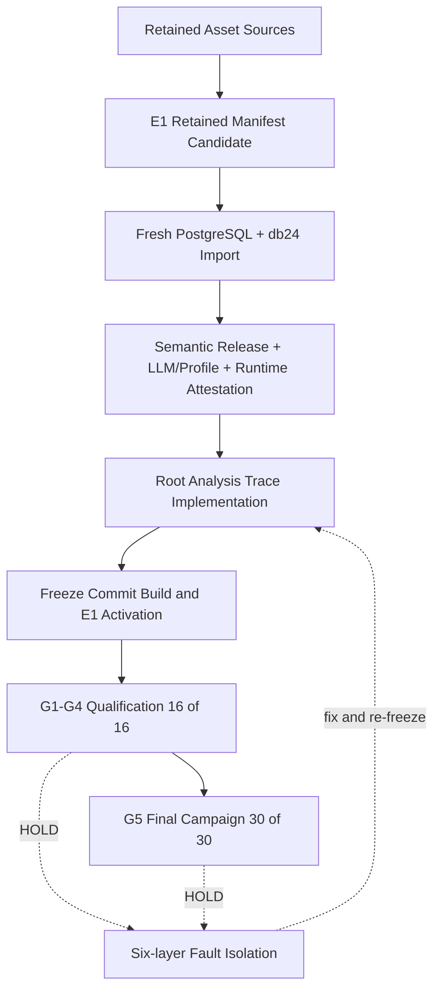
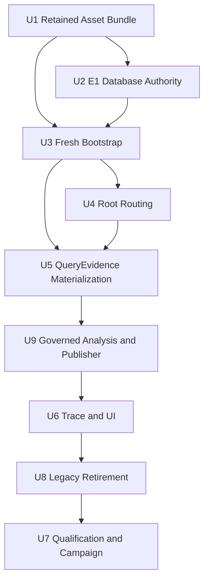
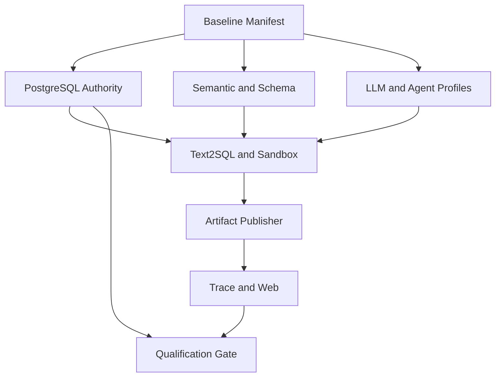

# refactor: Falcon24 E1 Authority Reset 与 Root Agent 生产链重建

## Summary

本计划不继续修补 v12–v14 的运行记录、Artifact 断链和旧 Campaign 状态，而是建立全新的
`Authority Epoch E1`。E1 只继承用户明确要求的定义性资产，所有运行身份、Published Semantic Release、
Profile materialization、认证回执、Qualification、Campaign、Run、Artifact、Trace 与 Sandbox 回执均重新生成。

实施从当前已提交 HEAD 与本计划提交开始；现有脏 worktree 只作为只读参考，不整体搬运未提交改动。实施时应建立新的
隔离 worktree 实施 E1，保留当前暂停现场以便查阅，但不把其中未提交的 `10775`–`10777`、本地运行数据或历史验收
Artifact 带入新分支。

这次可以采用硬切换，而此前任务没有采用，原因不是技术上做不到，而是约束不同：此前方案把 v12–v14 的 Campaign、
Run、Trace 和提交边界当成必须连续保留的权威状态，因此只能做前向修复、恢复和兼容性核验；现在用户明确放弃 Agent
运行记录，只保留六类定义资产，最困难的 backfill、旧引用闭包、旧 deep link、旧 receipt parser 和跨版本恢复都不再是
要求。执行风险因此从“修复历史状态且不得破坏引用”下降为“验证固定资产后，在空运行面重建唯一生产链”。

验收按 G1–G5 逐层放大范围；链路排障与正式门禁分开。出现问题时，先沿 Authority、Root、Text2SQL、QueryEvidence、
Analysis、Trace/UI 六层定位并排除，再创建一次干净的门禁执行；不允许在正式 slot 中边修边试。

## Outcome at a Glance

| 面向 | E1 处理 | 不再处理 |
| --- | --- | --- |
| 数据集 | 重新导入 hash 固定的 `falcon_db_24` Schema 与数据 seed | 旧数据库实例、旧 import receipt |
| 题目 | 保留 Falcon source manifest 与五题精确文本/规则 | 旧 run manifest、旧 slot identity |
| 语义 | 从 canonical source bundle 发布全新 Generation 1 Release | 旧 release ID、current pointer、历史候选/审计 |
| LLM | 重放无敏感 Provider/Model/Profile 配置，重新绑定 SecretRef 并认证 | API key、旧 credential ref、旧 certification receipt |
| 分析运行时 | 保留 Operator Manifest、实现、lock、image attestation 与方法定义 | 旧 Sandbox、Journal、Stage、Operator Result/Receipt |
| Agent 执行 | Root V3 是唯一 Router，生产只走通用 Text2SQL/Analysis/Report | Direct QA、正则路由、固定 `query_kind`、Falcon case runtime |
| 验收 | G1–G4 共 16 次分层资格；G5 为 `E1-C1` 30-slot Campaign | 把正式 Campaign 当调试循环、v12–v15 历史成绩 |

## Retention Boundary

### 必须保留的六类资产

1. **Falcon 题目与来源 Manifest**
   - `infra/falcon/v1/source-manifest.json`
   - `infra/falcon/v1/public-cases.json`
   - `infra/falcon/v1/test-cases.json`
   - `infra/falcon/v1/bundle-checksums.sha256`
   - E1 运行只激活 `source-manifest.json` 中 `db_id=24` 的数据库；其余 27 个 bundle 可继续留在 Git 中作为固定上游
     资产，但不导入 E1 运行数据库，也不进入 E1 active baseline。

2. **Falcon 冻结数据库、确定性 seed、sealed Oracle 与验收规则**
   - `infra/falcon/v1/bundles/falcon_db_24.sql.gz` 同时承载固定 Schema 与确定性数据内容；E1 必须验证
     `bundle_sha256`、`content_digest`、9 表、70 列、121445 行等 manifest 事实后再签发新 import receipt。
   - `infra/falcon/v1/sealed/dev-cases.json` 只允许 evaluator/Worker 私有边界读取；公开 Prompt、Trace、Artifact、Report
     和 Web 均不得获得 sealed payload。
   - `packages/evals/src/test-center/falcon-dataset.ts` 与 `packages/contracts/src/evals/falcon.ts` 保留 source、public、sealed
     分离和 hash 校验规则。

3. **语义层业务定义**
   - `packages/evals/src/test-center/falcon24-agent-analysis-suite.ts` 中 9 表/70 列蓝图、8 个 Join、公式、时间与质量策略。
   - `apps/worker/src/evals/falcon24-semantic-catalog.ts` 中指标、维度、公式 AST、Join、粒度、时间口径、质量规则。
   - `apps/worker/src/evals/falcon24-semantic-change-set.ts` 中 physical table/column binding、competency case 与可发布
     change set。
   - 重置前对当前 Published Falcon24 Release 做一次只读规范化导出，与以上 source bundle 按 canonical key 比对。
     数据库中存在而 source bundle 缺失或同 key 内容不同的定义必须形成 review diff；不得静默丢弃或让数据库旧 ID
     成为 E1 输入。

4. **LLM Provider、Model、Profile 的非敏感配置**
   - 保留 `vendor_id`、`runtime_provider`、`display_name`、HTTPS `base_url`、`model_id`、capabilities、default flag 和
    逻辑 Profile 绑定。
   - 不保留 API key、Bearer material、credential value、旧 `credential_ref` identity、health、actor、时间戳、版本历史、
    认证或调用回执。E1 中重新创建 Provider/Model/Profile，再由服务器 Secret Resolver 绑定有效 SecretRef。
   - `apps/web/src/lib/model-provider-catalog.ts`、`packages/contracts/src/models/index.ts` 和当前 PostgreSQL 配置的无敏感
    投影共同形成待审核输入；环境 UUID 不作为业务身份直接迁移。

5. **Operator Registry、Sandbox image lock 与分析方法定义**
   - `services/sandbox/src/data_agent_stats/manifest.json` 是唯一 Operator Manifest。
   - `packages/contracts/src/generated/statistical-operators.ts` 只作为由 manifest 生成的投影。
   - `infra/docker/opensandbox-analysis-*-requirements.lock`、两个 OpenSandbox Dockerfile、
     `infra/docker/opensandbox-analysis-attestation.json` 与实现源码共同决定 runtime/registry/image identity。
   - 五题 `required_methods`、operator obligations 和独立 Oracle 规则保留；旧 operator invocation/result/receipt 不保留。

6. **原五个验收问题**
   - 精确保留 `packages/evals/src/test-center/falcon24-agent-analysis-suite.ts` 中以下 case 和问题文本：

     | Case ID | Canonical question |
     | --- | --- |
     | `falcon24-business-review-18m` | 帮我复盘最近18个完整月的经营表现，重点看订单收入、订单量和客单价的变化趋势。找出收入下降最明显的月份，并从客户类型、商品品类和支付方式几个角度分析主要影响因素，说明到底是购买人数、购买频次还是客单价发生了变化。 |
     | `falcon24-delivery-experience-12m` | 最近一年的配送表现有没有明显恶化？请结合配送时效、订单金额、商品品类、客户类型和客户反馈进行分析，找出差评或低评分主要集中在哪些场景，并判断配送延迟是否是客户体验下降的主要关联因素。 |
     | `falcon24-inventory-damage-12m` | 最近12个完整月里，哪些商品存在比较突出的库存损坏问题？请结合商品销量、入库量、损坏量和品类整体水平，找出“销量较高但损坏情况持续恶化”的商品，并给出最值得优先排查的商品和品类。 |
     | `falcon24-marketing-lag-effect` | 过去一年多的营销投入效果怎么样？请比较不同渠道和目标人群的曝光、点击、转化、投入和回报趋势，并结合同期订单收入、新增客户和订单量，判断哪些渠道的投入增长与后续业务增长关系最明显，哪些渠道可能存在投入增加但效果没有改善的问题。 |
     | `falcon24-cohort-retention-m0-m6` | 帮我分析不同批次新客户的留存和复购表现。按客户注册月份观察其后6个月的下单、消费、配送体验和反馈变化，比较不同客户类型的差异，找出留存明显变差的客户批次及可能原因。如果数据本身存在注册时间、订单时间或客户关系异常，请先说明这些问题会不会影响分析结论。 |

   - 问题文本、required semantic keys、required methods/operators、disclosures、quality findings、chart contract 和 expected
     terminal 一起计算 suite hash；不能只复制自然语言问题。

### 明确丢弃的状态

- v12、v13、v14 及未创建的 v15 Campaign/Qualification identity、slot、HOLD 和成绩；
- Conversation、Message、Run、Run Event、Team Task/Handoff/Context Epoch、Outbox、Lease 与 recovery marker；
- SqlArtifact、QueryEvidence、AnalysisProgram、Generated Python、Operator Result/Receipt、Derived Evidence、Completion、
  Chart、Report、Trace、UI Receipt、Reclamation Receipt 及 current pointer；
- 旧 Published Semantic Release ID/hash、Candidate、review/audit/projection、resolved context、schema snapshot 与 release pointer；
- 旧 Provider invocation、usage、certification、model performance、credential binding 与 billing/commercial 历史；
- 旧 Sandbox、egress、Context Journal、Binding Cell、Stage 和临时对象；
- 旧 API deep link、历史 Trace viewer、旧 contract parser、dual read/write、archive reader 和 backfill。

### 必须重新创建但不属于“迁移”的基础状态

新数据库仍需要 App/Environment、Super Admin、Workspace、Datasource、成员关系、SecretRef metadata 和 migration ledger。
这些对象由 E1 bootstrap 重新创建，只是系统运行前提，不继承旧 identity、旧历史或旧凭据值。

## Requirements

- **R1 — 单一 E1 基线。** E1 必须由一个内容寻址 `falcon24-authority-baseline@1.0.0` 绑定数据集、题目、语义、LLM
  配置、Operator/Sandbox、验收合同、最终代码 commit 和 Web build；缺一项不得激活。代码 commit 在 U1–U6、U8、U9 以及
  U7-A 的 Qualification/Campaign 实现完成后冻结，运行时 baseline manifest 随后生成并写入 PostgreSQL，不把“包含自身
  commit”的动态 manifest 提前提交到 Git。
- **R2 — 无运行数据迁移。** 不实现历史 Run/Artifact/Trace/Campaign backfill、兼容读取或 archive surface；任何旧运行行
  出现在 E1 激活数据库都必须失败关闭。
- **R3 — Epoch 传递。** Run 创建时冻结 `authority_epoch=E1` 与 baseline hash；Effective Config、Qualification、Campaign
  直接绑定它。Artifact 通过同一 `run_id` 在 PostgreSQL 事务中解析 Epoch，不要求每个 Artifact payload 重复自报 Epoch。
- **R4 — PostgreSQL 唯一权威。** E1 current pointer、baseline activation、Run、Artifact revision/current、slot、receipt、HOLD
  和 outbox 仍由 PostgreSQL 仲裁；Neo4j、索引、模型上下文和 UI 都是可重建投影。
- **R5 — 定义保留、身份重生。** Retained bundle 保留 canonical bytes 和 content hash，但 Release、Profile、Receipt、Run、
  Artifact 与 Campaign ID 必须在 E1 重新派生；任何旧 ID 被送入 E1 command 都拒绝。
- **R6 — Root 是唯一 Router。** `QUESTION_RUN` 只走 Root V3。Root 根据冻结 Agent Cards 自主 direct/delegate；Host 只做
  admission、权限、预算、安全和证据提交，不按关键词、正则、case ID 或 `query_kind` 路由。
- **R7 — 唯一通用生产链。** 数据分析题只走 `Root -> Text2SQL -> QueryEvidence -> Governed Analysis -> Oracle ->
  Publisher -> Trace/UI -> Sandbox reclamation`；Evaluator 不得拥有第二个简化执行器。
- **R8 — 语义先于分析。** Text2SQL 与 Analysis 必须消费 E1 Published Release 的 exact context，指标、维度、公式、Join、
  粒度、时间、质量和 physical binding 均有 hash 闭包；不能从结果列类型猜业务语义。
- **R9 — 模型负责计划，Host 负责治理。** DeepSeek 可生成 SQL/Python 和分析计划，但不得重写受治理算子公式、读取 sealed
  Oracle、持有凭据或直接发布结果。模型输出始终是 candidate。
- **R10 — 原子发布。** Oracle PASS 后，Derived Evidence、Completion、Chart、Report、Artifact current 和 outbox 在同一
  PostgreSQL fence/transaction 下提交；任何 crash 只能观察 all-old 或 all-new。
- **R11 — 无历史兼容的真实 UI。** Web 只显示 E1 Run 的 durable public events 和 exact ArtifactReference；无旧 run lookup、
  latest-by-id、raw payload/path fallback。每个成功验收 Run 必须在真实轨迹页面核对内容和 identity。
- **R12 — 五级综合门禁。** `E1-Q1` 包含 G1 单链路探针 1 次、G2 五题最小版 5 次、G3 五题完整版 5 次和 G4 冷启动资格
  5 次，共 16 次；16/16 后才能创建 G5 `E1-C1`，执行五题 × COLD/WARM × 3 共 30 次。任一正式 attempt 的
  slot 首次失败即 HOLD，不在原 attempt 内修复、重试、跳过或续跑。
- **R13 — 可证明的空基线。** E1 激活前后都要证明历史运行表、Artifact store、Campaign、Journal、Stage 与 Sandbox 残留为
  零；仅保留/recreate 清单中的配置与定义性资产。
- **R14 — 计划与实施分离。** 方向批准不自动启动实施；用户明确要求开始前，不 reset 当前 worktree、不删除旧数据库、
  不创建新 worktree、不生成 E1 manifest、不启动 G1。
- **R15 — 环境声明真实。** 本地/开发 E1 可以绑定当前已验证的 locked local Sandbox attestation，但必须保留
  `production_isolation_proven=false` 和 production HOLD；`E1-C1=30/30` 只证明目标环境中的产品链通过，不自动升级为
  生产隔离 GO。生产部署另需满足 release image 与 Kata/gVisor/Cilium 等既定隔离门禁。
- **R16 — 排障与门禁分离。** 已知链路故障未关闭时，gate runner 必须拒绝 claim slot。正式门禁失败后先退出 gate runner，
  使用聚焦测试或探针定位并排除根因，再创建新的 immutable attempt；诊断结果不计入 G1–G5，禁止跨 attempt 拼接 PASS，
  也禁止在失败 Run 上热修后续跑。

## Scope Boundaries

### In Scope

- retained asset export、规范化、hash、diff 与单一 E1 baseline manifest；
- fresh PostgreSQL 安装、`falcon_db_24` 定向导入、E1 activation authority 与 clean bootstrap；
- Falcon24 Semantic Release、LLM config、Agent Cards、Operator/Sandbox attestation 的重新 materialize/certify；
- Root V3、自主 Subagent 路由、通用 Text2SQL、治理分析、独立 Oracle、原子 Publisher；
- E1-only Trace/API/UI、Sandbox 回收、六层链路排障、G1–G4 的 16 次资格与 G5 的 30-slot 最终 Campaign；
- E1 通过后删除旧运行时、旧 parser、旧 Campaign surface 和过时文档。

### Out of Scope

- 迁移或展示任何历史 Agent 运行记录；
- 恢复旧 deep link、旧 Trace、旧 Campaign 成绩或 v12–v15 编号；
- 迁移 API key、凭据值、旧 SecretRef identity 或认证回执；
- 导入/激活 `falcon_db_01`–`23`、`25`–`28`；
- 为 MySQL、ClickHouse、SQLite、DuckDB 接生产 Secret Resolver 或做真实验收；
- 在本任务内把本地 OpenSandbox 验收升级为生产级隔离认证；
- 重做整个 Q&A 视觉设计、Semantic Studio 或非 Falcon24 产品功能；
- 为清理而重写与 E1 生产链无关的研究、知识库或管理端模块。

## Context and Research

### Existing Repo Assets We Will Reuse

- `packages/contracts/src/semantic/greenfield-bootstrap.ts` 已定义空 Workspace、generation 0、Falcon corpus/public/sealed
  输入隔离，证明 repo 已有 greenfield 语义边界，不需要发明兼容导入模型。
- `infra/docker/import-falcon.sh` 已有固定 digest、幂等 import receipt、reader role 和 drift 检查；E1 只需收窄为 db24，并让
  import receipt 绑定 E1 baseline。
- `packages/agent-runtime/src/teams/builtin-profile-assets.ts` 已用冻结 discovery、prompt、workflow、tool allowlist、skill 和 model
  ref 生成 Agent Product Profiles；适合在 E1 重建，不应复制旧 PostgreSQL profile rows。
- `packages/evals/src/test-center/falcon24-agent-analysis-suite.ts` 已把五题、语义依赖、方法、算子、披露、质量和图表合同收敛到
  单一 suite；它应成为 E1 five-case source，而不是历史 run manifest。
- `services/sandbox/src/data_agent_stats/manifest.json`、generated TS projection 和 attestation verifier 已形成唯一算子供应链；
  E1 重新验证 digest，不迁移运行回执。
- 当前 committed Root V3 路由、通用 Text2SQL 和 Team runtime 是新执行面的起点；当前未提交的 Publisher/Trace 大改只按
  文件与测试逐项评估，不整体 cherry-pick。

### Why No External Research Was Needed

本计划的关键选择由用户给出的保留边界和仓库内已冻结合同决定，不依赖会随时间变化的第三方 API 行为。OpenSandbox、
DeepSeek、统计库与 Falcon 的版本都已经由本地 commit、lock、image 和 manifest 固定；此阶段再引入泛化外部最佳实践不会
改变 E1 是否可执行，反而会扩大评审范围。

## Key Technical Decisions

| Decision | Choice | Rationale | Rejected Alternative |
| --- | --- | --- | --- |
| 重置单位 | 新数据库运行面 + 新 `Authority Epoch E1` | 无历史数据迁移，最小化断链和 backfill 风险 | 在 v14 上继续修补或重跑 |
| 安装方式 | 从当前 migration chain fresh install，再应用 E1 migration | 复用已验证 schema/RLS/role，不在本任务顺带 squash 全库 | 立即重写一个巨型 squashed baseline |
| 旧运行表 | E1 激活前撤销旧 reader/writer；只删除已证明无消费者的旧表/RPC | 冻结 commit 必须已经是最终唯一链，不能验收后再改代码 | 为了“看起来干净”先删除所有共享对象 |
| Epoch 绑定 | Run 直接绑定 E1；Artifact 经 run authority 传递 | 保证全链可验证，又避免改写所有 Artifact wire schema | 只靠新 UUID 猜测属于 E1 |
| retained identity | 保留 canonical bytes/hash，重新生成数据库 identity | 消除旧 scope/current pointer/receipt 污染 | 复制旧 Release/Profile/Receipt ID |
| Falcon 数据 | Git 保留完整 upstream manifest；E1 只导入 db24 | 满足当前验收且缩短 fresh bootstrap | 导入 28 库后只用一个 |
| 语义来源 | code/source bundle 为 canonical；旧 Published Release 只做 diff | 既保留业务定义，也不让旧数据库成为运行权威 | 直接 dump/restore semantic tables |
| LLM 配置 | secret-free manifest + 新 SecretRef + 新 certification | 保留配置且不迁移秘密/过期认证 | 复制 credential_ref 和旧 PASS receipt |
| 分析选择 | 模型从语义/方法 registry 计划，Host 验证 obligations | 支持新问题且无 case-specific runtime | 按 case ID/关键词选择固定 program |
| Oracle | evaluator-only 独立重算 | 防止模型/生产实现自证正确 | 生产算子与 Oracle 共用实现 |
| 资格编号 | `E1-Q1` / `E1-C1` | 历史成绩已丢弃，编号应体现新权威基线 | 延续 v15 制造虚假连续性 |
| 故障处理 | 六层链路排障在门禁外完成；G1–G5 只计分 | 先定位单层故障，再用干净 attempt 验证综合链路 | 在正式 slot 中边修边 retry，污染成绩 |
| 当前脏现场 | 保留为只读参考，新 worktree 从 committed HEAD 开始 | 避免把半完成跨层补丁误当 E1 基线 | reset 当前 worktree 或整体复制 diff |
| 激活后变更 | 任一 code/contract/build/frozen asset 变化创建下一 Epoch | Epoch baseline 必须 immutable，失败后不能替换 E1 内容 | 在 E1 内偷偷换 baseline 后创建 `E1-Q2` |

## High-Level Technical Design

下图表达权威顺序，不规定具体函数签名：



### E1 Baseline Manifest

新 `falcon24-authority-baseline@1.0.0` 至少包含以下内容寻址引用：

```text
identity
  authority_epoch = E1
  baseline_id / baseline_hash / source_commit

dataset
  Falcon source commit/digest
  full upstream manifest hash + active db24 subset hash
  db24 bundle_sha256/content_digest
  schema inventory hash + deterministic seed hash

questions
  upstream source/public/sealed manifest hashes
  active db24 public/sealed subset hashes
  five-case suite hash + exact case IDs

semantics
  canonical source bundle hash
  expected inventory counts and competency closure hash

llm
  secret-free provider/model/profile manifest hash

analysis_runtime
  operator manifest hash + registry digest
  Dockerfile/lock/base image/SDK hashes
  analysis-method registry hash

acceptance
  Oracle contract hash
  qualification policy hash
  final campaign policy hash
  trace/UI/reclamation contract hashes
```

U1 的 retained asset builder 只产生不含代码 commit 的 source manifest；U1–U6、U8、U9 与 U7-A 完成并形成冻结 commit/Web
build 后，U7-B 再构造运行时 baseline candidate。PostgreSQL activation 必须在同一事务中读取并锁定 staging receipts，确认
dataset、semantic、model、profile、operator、sandbox、contract、commit 与 Web build 全部对应 candidate hash 后，才把 E1
从 `STAGED` 推进为 `ACTIVE`。E1 激活前禁止创建 Question Run、Qualification 或 Campaign。

### Epoch and Reference Rules

1. `authority_epochs` 只有一个 ACTIVE current row；E1 activation 使用 compare-and-set。
2. `runs`、Effective Config、Qualification 和 Campaign 保存 `authority_epoch`、`baseline_hash`、`gate_id` 与 immutable
   `attempt_id`，并有复合 FK/constraint。
3. Artifact commit 从已锁 Run 解析 Epoch；请求 payload 不得自行选择 Epoch。
4. 所有 external input refs（Semantic Release、Schema Snapshot、Model Profile、Operator Registry、Sandbox image）必须等于
   E1 baseline 已激活的 exact ref/hash。
5. 旧 Epoch、缺 Epoch、不同 baseline hash、未激活 baseline、错误 gate/attempt 或跨 Run reference 在 I/O 前失败。

### Runtime Path

```text
Question
  -> E1 Effective Config + frozen Agent Card catalog
  -> Root V3 direct answer or native delegation
  -> Text2SQL candidate
  -> Host schema/semantic/policy/target validation
  -> governed PostgreSQL read -> SqlArtifact -> QueryEvidence
  -> model-authored AnalysisProgram + generated Python
  -> fixed Operator Registry / Binding Cell / Context Journal
  -> independent Oracle
  -> one fenced PostgreSQL publication transaction
  -> public trace + exact Artifact preview
  -> sandbox/egress reclamation residual=0
```

五个验收问题必须走这条生产链。Evaluator 只在 Run 终态后按 case manifest 和 sealed Oracle 验证，不向生产 Worker 注入
case-specific SQL、program、Python 或答案。

## Implementation Units



执行顺序以依赖图为准，U 编号是稳定工作包标识而不是自然数流水号：`U9` 在 `U6` 前执行，`U8` 在 `U7` 前执行。
这样可以继续引用已评审过的工作包名称，同时保证“先冻结唯一代码面、再激活和验收”的时序不被编号误导。

### U1 — 冻结 Retained Asset Bundle 与 E1 Baseline Contract

**Purpose:** 把六类保留内容变成一个可审核、可重建、无秘密的输入集合；在删除任何状态前证明所需定义已完整落盘。

**Requirements:** R1、R2、R5、R13、R14。

**Files:**

- Create: `packages/contracts/src/evals/falcon24-authority-baseline.ts`
- Modify: `packages/contracts/src/evals/index.ts`
- Create: `packages/contracts/test/falcon24-authority-baseline.spec.ts`
- Create: `scripts/build-falcon24-e1-baseline.ts`
- Create: `scripts/export-falcon24-retained-assets.ts`
- Create: `scripts/verify-falcon24-retained-assets.ts`
- Create: `infra/falcon/e1/README.md`
- Create: `infra/falcon/e1/llm-provider-model-profile.json`
- Create: `infra/falcon/e1/retained-assets-manifest.json`

**Approach:**

- 定义 strict、content-addressed baseline schema，禁止 unknown fields、credential-shaped fields、旧 runtime IDs 和旧 receipts。
- 从 Git 资产同时计算完整 Falcon upstream manifest hash 和 E1 active db24 subset hash；题目也分别计算 upstream
  public/sealed hash 与 db24 active subset hash。由此既保留固定上游来源，又不会把未激活的 27 个库误报成 E1 运行闭包。
- 从 Git 资产计算 dataset/question/operator/sandbox/oracle hashes；从当前 PostgreSQL 只读导出 Falcon24 Published Release 和
  LLM config 的安全投影。
- 语义导出按 canonical key 排序并与 code source bundle比较；LLM 导出移除 credential refs、health、history、actor、时间戳和
  environment-bound UUID，转为逻辑 key。
- 生成 retained asset manifest 前输出 retained/discarded inventory 和 semantic diff。存在 unresolved semantic diff 时停止，
  不进入 U2。
- source-controlled JSON 必须可从源重新构建且等价检查通过；不得手工编辑 hash。包含最终 code commit/Web build 的运行时
  baseline 由 U7 在冻结 commit 之后生成到 PostgreSQL/验收输出，不进入该 commit，避免自引用。

**Test scenarios:**

1. 相同六类资产不论文件遍历顺序如何都产生同一 baseline hash。
2. 完整 upstream manifest 与 active db24 subset 分别可验证；db24 bundle、五题文本、required method、semantic formula、
  operator manifest、lock 或 model capability 任一 byte 变化都会改变对应子 hash 和 baseline hash。
3. 导出中出现 `api_key`、token、credential value、SecretRef identity、历史 Run/Release/Receipt ID 时 strict parser 拒绝。
4. 当前 Published Release 与 source bundle 完全相同则 diff 为空；缺 key、同 key 内容不同或多余 Falcon24 key 时明确 HOLD。
5. sealed payload 只进入私有 hash/locator；public projection 不能反序列化 expected result 或 gold SQL。

**Verification outcome:** 用户可在一个 JSON 中看到 E1 将保留的精确内容与 hash；当前数据库尚未发生写入或删除。

**Dependencies:** 无。

### U2 — 建立 E1 PostgreSQL Authority 与空运行面门禁

**Purpose:** 让 Epoch/baseline 成为 Run 和验收的数据库权威，并明确拒绝在含历史运行状态的数据库上激活 E1。

**Requirements:** R2、R3、R4、R5、R13。

**Files:**

- Create: `infra/supabase/apps/data-agent/migration-sources/10775/`
- Create: `infra/supabase/apps/data-agent/migrations/20260725010775_app_data_agent_falcon24_e1_authority.sql`
- Modify: `scripts/migration-manifests.json`
- Modify: `tests/workspace-migration-inventory.spec.ts`
- Create: `infra/supabase/test-support/56-falcon24-e1-authority-assertions.sql`
- Create: `packages/contracts/src/runs/authority-epoch.ts`
- Modify: `packages/contracts/src/runs/index.ts`
- Create: `packages/contracts/test/authority-epoch.spec.ts`
- Create: `packages/platform/src/runs/postgres-authority-epoch.ts`
- Create: `packages/platform/test/runs/postgres-authority-epoch.spec.ts`

**Approach:**

- 新建 immutable baseline、staging receipt、gate attempt 和 current epoch tables/RPC；只有一个 E1 baseline 可以 ACTIVE，
  HOLD attempt 不可复活。
- 为 Run/effective config/qualification/campaign 增加数据库拥有的 Epoch/baseline binding；Artifact commit 在事务内通过 Run 解析。
- Migration preflight 对运行、Artifact、Campaign、Journal、Stage/outbox 等表做零行断言。该 migration 只支持 fresh install；
  发现旧运行数据立即失败，不 backfill、不 truncate、不暗中删除。
- 当前暂停 worktree 的未提交 `10775`–`10777` 不复制到新分支；E1 使用 committed chain 后的首个版本 `10775`。
- 旧表即使暂时存在，也撤销 E1 runtime role 的旧入口；新 run creation 必须经 E1-aware RPC。

**Test scenarios:**

1. fresh PostgreSQL 17 全 migration 后 E1 为 `STAGED`/未激活，Question Run 创建被拒绝。
2. 写入一条旧 Run、Artifact、Campaign、Journal 或 Stage fixture 后应用 E1 preflight，稳定失败且不删除任何行。
3. baseline receipts 不完整、hash 不一致或重复 ACTIVE 时 activation 原子拒绝。
4. E1 激活后创建 Run，数据库强制写入 exact Epoch/baseline/gate/attempt；伪造 E0/E2、缺字段或旧 ID 被拒绝。
5. 同一 Run Artifact commit 成功；跨 Epoch/baseline/run reference 在 I/O 前拒绝。
6. 并发 activation/Run creation 只能观察未激活或完整 E1，不能观察部分 baseline。

**Verification outcome:** fresh DB 只有 E1-aware authority surface，但 current Epoch 尚未激活，所有业务 Run 被拒绝；旧记录
不能被“顺便迁移”进入新运行面。

**Dependencies:** U1。

### U3 — Fresh Bootstrap：db24、Semantic Release、LLM/Profile 与 Runtime Attestation

**Purpose:** 实现并演练从 retained bundle 重建 E1 inputs 的 deterministic bootstrap，但不复制任何旧 identity/receipt，也不在
实现尚未冻结时提前激活最终环境。

**Requirements:** R1、R4、R5、R8、R9、R13、R15。

**Files:**

- Create: `infra/docker/import-falcon24-e1.sh`
- Modify: `infra/docker/init-db.sh`
- Modify: `compose.yaml`
- Modify: `packages/contracts/src/evals/falcon.ts`
- Modify: `packages/contracts/test/falcon-contract.spec.ts`
- Modify: `packages/evals/src/test-center/falcon-dataset.ts`
- Create: `packages/platform/src/semantic/falcon24-e1-bootstrap.ts`
- Create: `packages/platform/test/semantic/falcon24-e1-bootstrap.spec.ts`
- Create: `apps/web/src/cli/bootstrap-falcon24-e1.ts`
- Modify: `apps/web/package.json`
- Modify: `scripts/verify-opensandbox-analysis-attestation.ts`
- Create: `apps/web/test/bootstrap-falcon24-e1.spec.ts`
- Modify: `.trellis/spec/backend/agent-team-runtime.md`
- Modify: `.trellis/spec/backend/python-sandbox-execution.md`

**Approach:**

- 在 clean volume 中运行 committed migrations；重新创建 platform/App/Workspace/Datasource/reader role。
- 为 E1 定义独立的 db24-scoped import receipt，不伪造旧 `falcon-import@1.0.0` 的 28 库闭包。migration container 通过显式
  E1 import mode 选择新 importer；默认非 E1 模式仍保持原 28 库行为，测试证明两者不会同时执行。
- 只导入 `falcon_db_24.sql.gz`，随后从 PostgreSQL catalog 重算 9 表、70 列、行数和 content inventory，与 manifest 匹配后
  通过 U2 staging RPC 写入 E1 import receipt。
- 从 semantic retained source 生成 candidate/change set，通过既有 greenfield publication authority 发布全新 Generation 1
  Release；再从发布结果编译 Context Package 和 schema snapshot，禁止复用旧 release hash/ID。
- 从 secret-free LLM manifest 创建新 Provider/Model/Profile；由服务器重新绑定可用 SecretRef 并执行认证。旧 certification
  PASS 不可复用，凭据不可进入 baseline 文件、日志或 Artifact。
- U3 的 disposable rehearsal 只证明 builtin Agent Product Profile builder 可消费新的 model refs；最终 Agent Product Profiles
  要等 U4/U8 的 Agent Cards、prompt、workflow、tool 与 skill 完全冻结后，由 U7 在最终 fresh environment 重新 materialize。
- 重跑 OpenSandbox attestation verifier，固定 Operator registry、Dockerfiles、requirements locks、SDK/base image。local/dev
  baseline 可以保留 `production_gate=HOLD` 和 `production_isolation_proven=false` 并完成 E1 功能验收，但 UI、receipt 和最终
  报告必须明确它不代表生产隔离 GO；生产环境 activation 需要另行提供满足既定隔离要求的 release image receipt。
- U3 在 disposable fresh environment 写 staging receipts 并验证恢复，不调用最终 activation。最终环境由 U7-B 在 U1–U6、U8、U9
  与 U7-A 完成后重新创建并重放相同 bootstrap，以便绑定冻结代码 commit、contract、Agent Product Profiles 与 Web build。

**Test scenarios:**

1. db24 bundle hash 正确且 catalog inventory 精确时生成 READY staging receipt；多/少表列、行数或 hash 漂移时 HOLD。
2. E1 migration container 只导入 db24，另外 27 个 schema 不存在；默认 Falcon 模式仍导入 28 库，两个 importer 互斥。
3. Semantic source 可重建 exact expected key set；Release 是 Generation 1 且旧 release ID/hash 从未出现。
4. secret-free config 可重放 Provider/Model/Profile；无 SecretRef 时 E1 可配置但 readiness 为 HOLD，不能调用模型。
5. 新 SecretRef 与 model certification PASS 后 readiness 前进；旧 certification receipt 即使 shape/hash 合法也拒绝。
6. Operator manifest、generated projection、implementation、lock、Dockerfile、base image、SDK 任一不一致都阻止 activation。
7. crash 发生在任一 staging 步骤后，恢复只重验/复用同一 staging identity，不重复发布或形成半激活 E1；U3 结束时 current
   Epoch 仍未激活。

**Verification outcome:** disposable fresh environment 能从 Git + secret provision 重建同一组 staged business/runtime inputs；
Question Run 仍被拒绝，环境随后可销毁，等待 U7 在最终 clean environment 重放并原子激活。

**Dependencies:** U1、U2。

### U4 — 将 Root V3 收敛为 E1 唯一生产 Router

**Purpose:** 在新基线上恢复真正的 Agent 自主路由，删除 Host 意图分类和旧执行旁路。

**Requirements:** R3、R6、R7、R8、R9。

**Files:**

- Modify: `packages/agent-runtime/src/teams/root-agent-harness.ts`
- Modify: `packages/agent-runtime/src/teams/builtin-profile-assets.ts`
- Modify: `packages/agent-runtime/src/model-provider-port.ts`
- Modify: `packages/agent-runtime/src/mastra/mastra-execution-bridge.ts`
- Modify: `apps/worker/src/providers/direct-run-bound-provider-dispatcher.ts`
- Modify: `apps/worker/src/teams/data-agent-team-runner.ts`
- Modify: `apps/worker/src/teams/production-team-runtime.ts`
- Modify: `apps/worker/src/teams/production-team-tools.ts`
- Modify: `apps/worker/src/run-worker-cli.ts`
- Modify: `apps/worker/test/teams/production-team-runtime.spec.ts`
- Modify: `apps/worker/test/teams/production-team-tools.spec.ts`
- Modify: `apps/worker/test/providers/direct-run-bound-provider-dispatcher.spec.ts`
- Create: `apps/worker/test/teams/falcon24-e1-root-routing.spec.ts`

**Approach:**

- Root turn 只读取 E1 Effective Config 和该 Run 冻结的 Agent Card catalog；工具选择保持 server-owned `AUTO`。
- Root 可 direct answer，或原生委派 Semantic、Text2SQL、Governed Analysis、Report；Host 只验证 catalog、profile revision/hash、
  tool/artifact allowlist、budget 与 dependency。
- 数据、聚合、趋势和排行进入 Text2SQL；定义、关系、Join、依赖和血缘进入 Semantic；统计归因/检验/留存进入 Analysis；
  Report 只能消费 accepted evidence。边界写在 Agent Cards，不写问题关键词。
- 删除/拒绝 Direct QA、`asksForRelationships`、`classifyAgentQuestion`、固定 `query_kind`、模板 SQL 和 Falcon case resolver 的
  生产 import。测试 fixture 也不能作为第二 runtime 回流。
- retry/recovery 使用同一 E1 catalog/context/schema/model binding，不重新读取 live profile 替换冻结选择。

**Test scenarios:**

1. “解释什么是同比增长”由 Root direct，零 Subagent、SQL 和 Artifact。
2. “订单与客户实体如何关联”只选择 Semantic Agent，返回 E1 Release 的 exact relationship/lineage evidence，零 SQL。
3. 简单数据库聚合走 Root -> Text2SQL，真实 adapter 执行后才公开 QueryEvidence。
4. 五个 Falcon24 问题均由 Root 原生发出 Text2SQL -> Governed Analysis 的有依赖 delegation；Host 不读取 case ID 决定路径。
5. 请求正式报告时 Report 等待 accepted QueryEvidence/Derived Evidence，不允许先写报告后补证据。
6. catalog、Epoch、Profile、schema snapshot 或 datasource binding 漂移在 provider/database I/O 前失败。
7. 仓库扫描与 import-boundary test 证明生产不再引用正则 Router、fixed query kind、case-bound SQL/program runtime。

**Verification outcome:** 任意 E1 Question Run 只有 Root 选择的 Agent 才产生 task/tool/event，且所有数据结论来自已执行证据。

**Dependencies:** U3。

### U5 — 闭合通用 QueryEvidence 与 typed Arrow 数据准备

**Purpose:** 先独立证明 SQL 结果具有正确业务语义和稳定 typed Arrow 表达，再允许分析运行时消费；不把数据准备与统计执行
混在一个交付单元中。

**Requirements:** R7、R8、R9、R13。

**Files:**

- Modify: `packages/contracts/src/artifacts/product-team-artifact.ts`
- Modify: `packages/contracts/src/artifacts/analysis-input-materialization.ts`
- Modify: `packages/semantic/src/analysis/published-context-compiler.ts`
- Create: `packages/platform/src/datasources/adapters/postgresql-query-evidence-semantic-binding.ts`
- Modify: `packages/platform/src/research/postgres-research-authority.ts`
- Modify: `apps/worker/src/analysis/product-team-query-port.ts`
- Modify: `apps/worker/src/analysis/governed-analysis-input.ts`
- Modify: `apps/worker/src/analysis/input-materializer.ts`
- Modify: `packages/contracts/test/product-team-artifact.spec.ts`
- Modify: `packages/contracts/test/analysis-input-materialization.spec.ts`
- Create: `packages/platform/test/datasources/postgresql-query-evidence-semantic-binding.spec.ts`
- Modify: `apps/worker/test/analysis/input-materializer.spec.ts`
- Modify: `apps/worker/test/analysis/product-team-query-port.spec.ts`

**Approach:**

- Text2SQL 输出通用 SQL candidate；Host 从 exact physical snapshot/semantic context 构造 allowlist，执行只读 adapter，提交
  `SqlArtifact -> QueryEvidence`。QueryEvidence 的 semantic binding 必须证明列、metric/dimension、formula、aggregate、grain、
  time window、release/context、schema snapshot 和 datasource identity。
- 从 accepted QueryEvidence 生成唯一 input materialization receipt，把列类型、nullability、row/byte bounds、source ref/hash 和
  semantic binding 固定后再编码 typed Arrow；不能按“一列 STRING + 一列 NUMBER”猜 metric/dimension。
- Analysis port 只能加载当前 E1 Run 的 exact QueryEvidence revision；无旧 artifact mirror、latest lookup、case-specific query port
  或 evaluator-provided rows。
- 对五题需要的宽表、多序列、分组、时间和 cohort 数据形状建立通用 fixtures；生产实现不知道 Falcon case ID。

**Test scenarios:**

1. Text2SQL 真实执行成功后才提交 `SqlArtifact -> QueryEvidence`；policy/EXPLAIN/timeout/row/byte failure 产生零证据。
2. `QueryEvidence -> typed Arrow` 保留数值/字符串/日期/null 类型、column order 和 E1 semantic binding。
3. 错 metric、dimension、grain、formula、aggregate、time window、release、schema、datasource、Run 或 Epoch hash 在 materialization
   前失败。
4. 重复/缺列、类型漂移、NaN/Infinity、超 row/byte bound、Artifact reference A/payload B 和 current revision 漂移均拒绝。
5. 同一 QueryEvidence 重放产生同一 Arrow/input hash；不同 QueryEvidence 即使 rows 相同也不能复用 receipt。
6. 五题数据形状均可通过通用 materializer 表达，仓库扫描证明没有 case-specific query/materialization runtime。

**Verification outcome:** accepted QueryEvidence 可以稳定生成语义正确的 typed Arrow 和输入回执；尚未调用模型 Python、Operator、
Oracle 或 Publisher。

**Dependencies:** U1、U3、U4。

### U9 — 闭合治理分析、独立 Oracle 与原子 Publisher

**Purpose:** 在 U5 的可信数据准备之上建立唯一通用分析实现，不再为旧 Artifact/Trace 做兼容；把最容易失败的分析/发布闭包
作为独立交付和提交边界。

**Requirements:** R7、R9、R10、R13。

**Files:**

- Modify: `packages/contracts/src/artifacts/research/analysis.ts`
- Modify: `packages/contracts/src/ports/analysis-authority-commit.ts`
- Create: `packages/contracts/src/ports/analysis-oracle.ts`
- Create: `apps/worker/src/analysis/governed-analysis-runtime.ts`
- Modify: `apps/worker/src/analysis/analysis-program-compiler.ts`
- Modify: `apps/worker/src/analysis/analysis-tool-loop.ts`
- Modify: `apps/worker/src/analysis/governed-result-bridge.ts`
- Modify: `apps/worker/src/analysis/result-publisher.ts`
- Modify: `apps/worker/src/evals/falcon24-analysis-data-oracle.ts`
- Create: `infra/supabase/apps/data-agent/migration-sources/10776/`
- Create: `infra/supabase/apps/data-agent/migrations/20260725010776_app_data_agent_e1_analysis_publication.sql`
- Create: `infra/supabase/test-support/57-e1-analysis-publication-assertions.sql`
- Modify: `packages/contracts/test/analysis-governed-lifecycle.spec.ts`
- Modify: `apps/worker/test/analysis/analysis-lifecycle-authority.spec.ts`
- Modify: `apps/worker/test/analysis/analysis-program-compiler.spec.ts`
- Modify: `apps/worker/test/analysis/analysis-tool-loop.spec.ts`
- Modify: `apps/worker/test/analysis/governed-result-bridge.spec.ts`
- Modify: `apps/worker/test/analysis/result-publisher.spec.ts`
- Modify: `apps/worker/test/evals/falcon24-analysis-data-oracle.spec.ts`

**Approach:**

- Analysis model 从 semantic method registry 和 objective 生成通用 `AnalysisProgram`；Host 验证 node dependencies、source policy、
  operator obligations、registry digest 和 output schema。生产代码不按 Falcon case ID 选择 program。
- U9 只消费 U5 已验证的 exact materialization；server-authored Binding Cell 把 host-verified operator result 送回同一 Sandbox Context；
  PostgreSQL Context Journal 支持 crash replay，确定性义务不重复执行。
- Operator 是受治理方法的唯一生产计算实现。DeepSeek 负责数据准备、补充变换、编排和解释，不得重写 BH-FDR、Theil-Sen、
  Mann-Kendall、HAC、Shapley、cohort 等冻结算法。
- 独立 Oracle 从 authoritative input/receipts 重算并校验；sealed material 永不进入模型或生产 Artifact。
- Oracle PASS 后用单一 E1 publication transaction 提交 Derived Evidence、Completion READY、Chart、Report、current pointers 与
  outbox。Oracle reject、stale fence、hash mismatch 或 crash 都保持零部分公开结果。

**Test scenarios:**

1. AnalysisProgram 可表达通用单序列和五题多节点分析；删除依赖、重复 node、越权 operator 或重写受治理公式时拒绝。
2. operator result committed 后 Binding 前 crash，恢复复用同一 result/receipt；Binding 后 crash 从 Journal 恢复同符号/hash。
3. Oracle reject、Publisher crash、stale worker fence 和 outbox failure 均只能观察全无或完整 publication bundle。
4. 五个独立 Oracle 验证窗口、方法、质量/披露、operator receipt closure、chart dataset 与 expected terminal；生产实现篡改时
   至少一个 Oracle 稳定失败。
5. model/provider request、public trace 和 Artifact preview 不包含 raw rows、sealed data、prompt、stdout、path、credential、target。
6. Sandbox/egress 回收前 publication 已 durable；回收失败另记事故但不覆盖首个业务失败。

**Verification outcome:** 五题所需算法链可以从 accepted QueryEvidence 通用执行并原子发布，不依赖历史 Artifact 或 Falcon 专用 runtime。

**Dependencies:** U5。

### U6 — E1-only Resolution Trace、Artifact Preview 与真实 UI Gate

**Purpose:** 让用户和验收系统从同一 PostgreSQL Authority 看到 Root、SQL、分析、Oracle 与发布证据，不读取旧 Trace。

**Requirements:** R4、R10、R11、R13。

**Files:**

- Modify: `packages/platform/src/runs/postgres-resolution-trace.ts`
- Modify: `packages/platform/src/artifacts/artifact-workspace-service.ts`
- Modify: `apps/web/src/cli/falcon24-resolution-trace-gate.ts`
- Modify: `apps/web/src/cli/falcon24-browser-trace-gate.ts`
- Modify: `apps/web/src/components/qa/resolution-trace-view.tsx`
- Modify: `apps/web/src/components/workbench/artifact-workspace.tsx`
- Modify: `apps/web/test/falcon24-resolution-trace-gate.spec.ts`
- Create: `apps/web/test/falcon24-e1-browser-trace-gate.spec.ts`
- Create: `infra/supabase/apps/data-agent/migration-sources/10777/`
- Create: `infra/supabase/apps/data-agent/migrations/20260725010777_app_data_agent_falcon24_e1_trace.sql`
- Create: `infra/supabase/test-support/58-falcon24-e1-trace-assertions.sql`

**Approach:**

- Trace loader 先验证 Run 的 E1 Epoch/baseline，再在同一 `REPEATABLE READ` snapshot 解析 Root delegation、SqlArtifact、
  QueryEvidence、AnalysisProgram、Derived Evidence、Completion、Chart、Report 与关键 evidence edges。
- Detail/Preview 只接受完整 App/Tenant/Environment/Run/Artifact/Revision/Hash identity；无 latest-by-id、镜像表、raw document 或
  path fallback。
- Web 切换 Conversation/Run 时清除 stale ready/detail/preview/selection；旧 promise 不得回填新 Run DOM。
- browser gate 对 exact Conversation/Run 逐项打开七类工件，验证 Detail hash、图表与同源表格、Web build、无错误横幅和 E1
  baseline identity；截图/DOM hash 写入新 UI receipt。
- Trace/UI receipt 与 residual=0 reclamation receipt 是 slot PASS 的必要输入，但都不能单独宣称业务成功。

**Test scenarios:**

1. 完整 E1 chain 产生唯一 Root/SQL/Analysis/Oracle/Publisher/Artifact edge 集和 exact trace/detail hash。
2. 对每条关键 evidence edge、inner hash、system artifact、Schema Snapshot 或 Sandbox Result 逐项删除/篡改，Trace fail-closed。
3. E0/缺 Epoch/不同 baseline 的 Run 或 Artifact 即使 shape/hash 自洽也不可显示为 READY。
4. 快速切换两个 Run 后，旧 Detail/Preview promise 不能回填；DOM 只含当前 exact Run identity。
5. 不支持/缺失/损坏 Artifact 显示明确错误，零 raw payload/path fallback；图表坏 hash 不降级成“成功空图”。
6. 1440px 与 390px 真浏览器均可打开 exact artifact、返回触发项、查看同源表格，控制台无新增错误。

**Verification outcome:** backend、UI 和 browser receipt 对同一 E1 Run/Trace/Artifact identity 达成一致，旧历史完全不可见。

**Dependencies:** U9。

### U7 — 分层排障与 G1–G5 综合门禁

**Purpose:** 先定位并排除具体链路故障，再用全新 immutable attempt 验证完整生产链；前四级资格不冒充最终 30 次验收。

**Requirements:** R1、R7、R11、R12、R13、R15、R16。

**Files:**

- Modify: `packages/contracts/src/evals/falcon24-qualification.ts`
- Modify: `packages/contracts/src/evals/falcon24-acceptance-campaign.ts`
- Modify: `packages/platform/src/runs/postgres-falcon24-qualification.ts`
- Modify: `packages/platform/src/runs/postgres-falcon24-acceptance-campaign.ts`
- Modify: `apps/web/src/cli/falcon24-qualification.ts`
- Modify: `apps/web/src/cli/falcon24-agent-acceptance.ts`
- Modify: `apps/worker/src/evals/falcon24-acceptance-execution-policy.ts`
- Modify: `packages/contracts/test/falcon24-qualification.spec.ts`
- Modify: `packages/contracts/test/falcon24-acceptance-campaign.spec.ts`
- Modify: `packages/platform/test/runs/postgres-falcon24-qualification.spec.ts`
- Modify: `packages/platform/test/runs/postgres-falcon24-acceptance-campaign.spec.ts`
- Create: `infra/supabase/test-support/59-falcon24-e1-qualification-campaign-assertions.sql`
- Modify: `.trellis/spec/backend/falcon-agent-release-gate.md`

**Approach:**

- U7 分成两个不可颠倒的阶段。`U7-A` 先在 U8 之后实现本节列出的 gate 合同、CLI、持久化和测试，重跑
  production import boundary，再把 U1–U6、U8、U9 与 U7-A 的全部代码、migration、contract、spec 和 Web build 固定为一个不再
  变化的 implementation commit；`U7-B` 才允许做 final clean bootstrap、E1 activation 和正式门禁运行。
- 在最终 clean volume 从完整 migration chain 重新安装数据库，重放 U3 bootstrap，materialize 最终 Agent Product Profiles；
  disposable rehearsal 的 staging identity/receipt 不复制到最终环境。从冻结 commit、Web build 和最终 staging receipts 构建
  `falcon24-authority-baseline@1.0.0` 并通过 U2 activation RPC 原子激活 E1。
- `E1-Q1` 与 `E1-C1` 的每次正式执行都有 immutable `attempt_id` 和 manifest hash；失败 attempt 不能复活、续跑或覆盖。
- G1–G4 严格按用户定义执行：G1 单链路探针 1 次；G2 五题最小版 5 次；G3 原始五题完整版 5 次；G4 新会话、新 Run、
  新 Sandbox 的冷启动资格 5 次，共 16 次。所有 slot 调用同一 Root V3 production path，G4 attempt 内无修复、无重试、无残留。
- G1–G4 在同一 qualification attempt 中 16/16 后才创建 G5 `E1-C1`：五题 × COLD/WARM × 3 共 30 slots，严格串行。
- gate preflight 发现已知链路问题或必要 receipt 缺失时，在 slot claim 前拒绝，不创建门禁 Run。slot 一旦 claim，任何模型、SQL、
  Operator、Oracle、Publisher、Trace/UI 或 reclamation 首败都使当前 attempt 原子 HOLD，后续 slot 不启动。
- HOLD 后必须退出 gate runner，按六层链路从上到下排查：Authority/Environment、Root/Delegation、Semantic/Text2SQL、
  QueryEvidence/Arrow、Analysis/Oracle/Publisher、Trace/UI/Reclamation。排障使用聚焦测试或单层探针，结果不计入门禁成绩。
- 根因排除并完成受影响层验证后，创建新的门禁 attempt。Qualification 从 G1 重新开始，Campaign 从 30 个 slot 的第一个重新
  开始，禁止跨 attempt 拼接 PASS。若修复改变 code、contract、Web build、frozen asset 或 baseline component，则创建 E2 并从
  G1 开始；只有已证明 baseline bytes 不变的外部瞬态故障，才允许在同一 Epoch 下创建新 attempt。
- 每个成功 slot 必须有表格/报告/图表、backend trace、真实 UI、Sandbox residual=0 和 PostgreSQL atomic PASS。

**Test scenarios:**

1. 已知链路故障、必要 receipt 缺失、commit/Web build 漂移或环境 attestation 声明不实时，preflight 在 claim 前拒绝。
2. 聚焦测试或单层探针即使 PASS 也不能计入 G1–G5；门禁 Run/Artifact 也不能被排障过程改写或复用。
3. G1 验证一个指标、一个时间维度、一个趋势判断和一张图，六层闭合、轨迹可读且 Sandbox residual=0；否则 attempt HOLD。
4. G2 精确生成五个核心版 slot，各验证核心指标、核心维度、一张图以及表/Join/口径；任一失败不启动下一门禁。
5. G3 逐题运行五个 canonical 原文，要求 5/5 Oracle PASS、治理算子闭合和归因完整；Evaluator 不注入生产 SQL/program。
6. G4 为五题分别创建新 Conversation/Run/Sandbox，5/5 且无修复、无重试、无残留；任何 identity 或 residual 复用都失败。
7. G1–G4 未在同一 attempt 达到 16/16 时 G5 创建拒绝；通过后 G5 精确生成 30 个唯一有序 slot。
8. G5 的 COLD/WARM 各三次 answer/chart/operator closure 一致且 flake=0；任一失败立即 HOLD，剩余 slot 未 claim。
9. HOLD attempt 不能 resume/retry/overwrite；排障关闭根因后只能创建新 attempt。Qualification 新 attempt 从 G1 开始，Campaign
   新 attempt 从 slot 1 开始，跨 attempt 拼接 16/16 或 30/30 被拒绝。
10. frozen component 改变强制进入 E2；已证明的外部瞬态故障不改变 baseline hash，但新 attempt 仍使用新 identity 且完整
    重跑所属阶段。
11. business terminal `HOLD_WITH_SENSITIVITY` 的 Q5 在 Oracle contract 满足时算题目 PASS，不与 gate attempt 的失败 HOLD 混淆。
12. Campaign 结束后数据库、management API 和 Docker observation 都证明 Sandbox/egress residual=0。

**Verification outcome:** 同一 frozen E1 baseline 的 winning qualification attempt 达到 G1–G4 16/16，随后 winning G5 attempt
达到 30/30。失败 attempt 保持可审计但不参与成绩，所有成功结果可在真实 UI 核对。

**Dependencies:** U8。

### U8 — E1 激活前退役旧运行时并收敛唯一代码面

**Purpose:** 在新链的静态/集成证明完成后、baseline 激活前，删除不再需要的代码和 surface，使 E1 绑定的 commit 本身已经
只可能包含唯一生产链；最终 commit/build 冻结由 U7-A 在 Qualification/Campaign 代码也完成后执行。

**Requirements:** R2、R6、R7、R11、R14。

**Files:**

- Delete after import scan: 无生产引用的 Direct QA、Falcon case-bound runtime、旧 query-kind/template SQL、旧 trace/campaign parser。
- Modify: `.trellis/tasks/08-25-restore-root-agent-routing/prd.md`
- Modify: `.trellis/tasks/08-25-restore-root-agent-routing/design.md`
- Modify: `.trellis/tasks/08-25-restore-root-agent-routing/implement.md`
- Create from paused-worktree reference: `.trellis/tasks/08-25-restore-root-agent-routing/handoff-2026-08-26.md`
- Modify: `.trellis/spec/backend/agent-team-runtime.md`
- Modify: `.trellis/spec/backend/python-sandbox-execution.md`
- Modify: `.trellis/spec/backend/resolution-trace.md`
- Modify: `.trellis/spec/backend/falcon-agent-release-gate.md`
- Create: `docs/runbooks/falcon24-e1-bootstrap-and-acceptance.md`
- Create: `infra/supabase/apps/data-agent/migration-sources/10778/`
- Create: `infra/supabase/apps/data-agent/migrations/20260725010778_app_data_agent_e1_legacy_runtime_retirement.sql`
- Create: `infra/supabase/test-support/60-e1-legacy-runtime-retirement-assertions.sql`
- Modify: architecture/import-boundary tests and migration inventory tests implicated by actual deletions.

**Approach:**

- 以生产 import graph 和 public export inventory 为准删除旧代码，不按文件名猜测；任何仍被 E1 引用的 shared kernel 保留。
- 撤销旧 RPC/grant/reader；对已由 import graph 和数据库 inventory 证明无消费者的旧空表使用 forward-only cleanup migration
  删除，不迁移行、不提供 tombstone API。仍被 shared kernel 使用的表保留，但 E1 runtime role 不得拥有旧入口。
- 旧 task 文档保留历史叙述，但首页标明已由本计划批准的 E1 path 取代；implement checklist 以新 U-ID 和真实证据重写。
- Runbook 记录 fresh provision、secret rebind、activation、qualification/campaign、HOLD 诊断和 cleanup，明确禁止对当前含历史
  记录的数据库直接执行 E1 activation。

**Test scenarios:**

1. production import graph 不再包含 Direct QA、regex router、fixed query kind、Falcon case resolver 或旧 receipt parser。
2. 旧 RPC/API/CLI 调用稳定返回 unsupported/not found，不 fallback 到 E1 或读取旧表。
3. 全 package typecheck/build、focused tests 与 fresh PostgreSQL migration/smoke 在删除后通过；真实 browser gate 在 U7 激活后
   使用同一冻结 commit 执行。
4. 文档、CLI help、错误码和 UI 不再提 v12–v15 为 current，也不把历史 smoke 当 E1 证据。

**Verification outcome:** 进入 U7-A 的代码面只保留 E1 生产链和当前合同；旧路径既不可执行，也不会被文档误导性地描述为可用。

**Dependencies:** U6。

## System-Wide Impact



### Request and Event Flow

- Q&A request 在接收时冻结 E1 config/catalog/schema/semantic/model，之后重试不重新绑定。
- Root decision、Subagent task、tool call、Artifact 和 terminal 仍通过 durable event/outbox；UI 不拥有状态推进权。
- 旧 Conversation/Run URL 不迁移。E1 Web 只列出新创建的 Conversation/Run。

### Failure Propagation

- baseline 未 ACTIVE：请求在 Run 创建前失败；无 provider/database/Sandbox I/O。
- gate preflight 发现已知链路故障：不 claim 正式 slot，不产生门禁成绩。
- Root/Text2SQL/Analysis 失败：Run/slot 失败，Publisher 零部分提交；若正式 slot 已 claim，整个 attempt HOLD。
- Oracle reject：保留内部诊断引用但不公开 Derived/Chart/Report。
- Publisher transaction 失败：恢复同 fence/idempotency，不能逐 Artifact 补写。
- UI gate 或 reclamation 失败：业务结果不可被 Campaign 记为 PASS；首个业务失败和回收事故分开保存。
- attempt HOLD 后 gate runner 退出；故障定位和修复只通过门禁外诊断进行。原 attempt 永不 resume，修复完成后创建新 attempt。

### State Lifecycle and Recovery

- retained source 是 immutable Git/content-hash 资产；staging receipt 可幂等重建。
- E1 activation 只有一次 current CAS；不支持降回 E0。
- 每个 Run 的 config/catalog/context/schema/model/operator/image refs 固定不变。
- Context Journal 恢复 deterministic obligation；已提交 operator/result/publication 不重跑。
- 排障证据与 gate attempt 分开记录；修复不能改写既有 gate result。
- Projection/Neo4j/index 可清空重建，不进入最终判定。

### Security and Privacy

- sealed Oracle、gold SQL、raw provider payload、prompt、CoT、credentials、connection target、raw rows、stdout 和 temp path 不进入
  public surface。
- LLM manifest 的 `base_url` 必须是无 userinfo/query/fragment 的 HTTPS 地址；credential-shaped key 一律拒绝。
- PostgreSQL roles、RLS、security-definer search path、Secret Resolver 和 egress authority 在 fresh smoke 中重新证明。

## Layered Fault Isolation and Formal Gates

正式门禁验证的是综合链路，不负责定位问题。启动或重新启动门禁前，先按以下六层排除已知故障；这些聚焦测试、探针和
人工核对不计入 G1–G5 成绩。

| 链路层 | 先排除的问题 |
| --- | --- |
| L1 Authority / Environment | E1 baseline、db24、Schema、Semantic Release、Model/Profile、Operator/Image refs 是否一致且 READY |
| L2 Root / Delegation | Effective Config、Agent Cards、Root decision、Subagent task/handoff 是否绑定同一 Run |
| L3 Semantic / Text2SQL | 语义口径、Join、粒度、时间、physical binding、SQL policy 和真实只读执行是否闭合 |
| L4 QueryEvidence / Arrow | Artifact revision/hash、列语义、类型、null、row/byte bound 和 materialization 是否闭合 |
| L5 Analysis / Oracle / Publisher | Sandbox、治理算子、Binding/Journal、独立 Oracle 和原子发布是否闭合 |
| L6 Trace / UI / Reclamation | durable event、exact Artifact detail、图表/表格、真实页面和 Sandbox/egress residual=0 是否闭合 |

正式门禁固定为：

| 门禁 | 运行数 | 内容 | 通过条件 |
| --- | --: | --- | --- |
| G1 单链路探针 | 1 | 一个指标、一个时间维度、一个趋势判断、一张图 | 六层全部闭合，轨迹页面可读，Sandbox=0 |
| G2 五题最小版 | 5 | 每题只验证核心指标、核心维度和一张图 | 5/5 通过，验证表、Join、口径和图表 |
| G3 五题完整版 | 5 | 依次执行原始五题，每次只运行一题 | 5/5 Oracle 通过，治理算子与归因完整 |
| G4 冷启动资格 | 5 | 新会话、新 Run、新 Sandbox，五题各一次 | 5/5 无修复、无重试、无残留 |
| G5 最终验收 | 30 | 5 题 × COLD/WARM × 3 | 30/30；任意一条失败立即 HOLD |

G1–G4 属于 `E1-Q1`，合计 16 次；只有 16/16 才能创建 G5 `E1-C1`。G5 的 30 次不复用前四级 Run，也不把资格证据计入
最终成绩。

### 门禁失败后的处理

1. 当前 attempt 立即 HOLD，后续 slot 不 claim，保留首个失败层、Run、Artifact 和回收状态。
2. 退出 gate runner，按 L1–L6 找到最早未闭合层；排障只运行聚焦测试或单层探针，不继续消耗门禁 slot。
3. 修复后先完成受影响层以及所有下游层的验证，再创建新的 immutable gate attempt。
4. Qualification attempt 重新从 G1 开始；G5 Campaign attempt 重新从第一个 slot 开始，禁止拼接多个 attempt 的 PASS。
5. 若修复改变代码、合同、Web build、冻结资产或 baseline component，则进入下一 Authority Epoch；只有已证明 baseline bytes
   不变的外部瞬态故障，才允许在同一 Epoch 下重新执行门禁。

## Acceptance Sequence

1. **Plan approval**：retention matrix、只激活 db24、`E1-Q1/E1-C1` 编号和 G1–G5 分层门禁已确认。
2. **Asset freeze**：retained manifest 生成且 semantic diff 已解决；当前数据库未改动。
3. **Fresh DB/staging**：fresh migrations、零历史运行状态、db24 import、Semantic/LLM/Profile/Runtime staging、scope/role/RLS
   通过；E1 仍未激活。
4. **Static/integration/retirement**：Root、Text2SQL、Analysis、Publisher、Trace/UI、Qualification/Campaign focused tests 与
   package build/typecheck 通过；旧 runtime/RPC/parser 已退役，形成冻结 implementation commit 与 Web build。
5. **Final clean bootstrap and activation**：在新 clean volume 重放 retained bootstrap 和最终 Agent Product Profiles；运行时
   baseline 绑定全部最终 staging receipts、commit、contract 和 Web build，并原子激活 E1。
6. **Pre-gate isolation**：按 L1–L6 排除已知问题；诊断结果只决定能否开始门禁，不计分。
7. **E1-Q1**：依次执行 G1 1/1、G2 5/5、G3 5/5、G4 5/5，共 16/16。
8. **E1-C1 / G5**：30/30 串行通过，真实 UI 全覆盖，Sandbox/egress residual=0；local/dev 结果不宣称生产隔离 GO。
9. **Completion**：E1 identity、16/16、30/30、环境级 Sandbox 声明和完整证据清单写入最终验收报告；不再修改 E1 代码。

任一正式门禁失败都按“门禁失败后的处理”退出并排障。不得为了继续而提高 retry、添加 fallback、修改 frozen hash、放宽
Oracle 或绕过 UI/reclamation。

## Risks and Mitigations

| Risk | Impact | Mitigation |
| --- | --- | --- |
| 当前 Published Release 有未落入 source 的业务定义 | reset 后语义缺失 | U1 canonical diff 是删除前硬门；未解决不进入 U2 |
| Provider 配置无秘密但 SecretRef 不可重新绑定 | E1 无法调用真实模型 | config 可先重建但 readiness HOLD；凭据由服务器重新 provision/certify |
| 当前 attestation 只证明 local probe 且 production gate=HOLD | 本地通过被误报为生产就绪 | baseline 绑定 target environment；local/dev 可验功能但保留 production HOLD，生产 activation 另需 release image/isolation receipt |
| migration 10775 误用于含历史数据的 DB | 旧状态被混入或删除 | preflight 只读零行断言，失败不 truncate；只支持 fresh DB |
| 整体复制当前 dirty diff | 把半完成 trace/publisher/迁移带入 E1 | 新 worktree 从 committed HEAD + plan commit；逐文件重新验证，不整体 cherry-pick |
| 删除旧代码导致 shared kernel 丢失 | E1 实现被破坏 | U8 只在新链静态/集成通过后按 import graph 删除，再由 U7 用同一冻结 commit 做真实验收 |
| 模型仍按题目记忆走固定方法 | 泛化失败/假 Agent | 生产不接收 case ID，方法由 semantic registry + model plan 决定，Host 验证 obligations |
| Oracle 与生产算子共用实现 | 错误自证正确 | 包级 import boundary 与 independent implementation tests |
| E1 编号仍沿用 v15 | 误导为历史连续升级 | 全部新 identity 使用 Epoch scoped `E1-Q1/E1-C1` |
| E1 激活后再清理代码 | baseline 绑定的 commit 立刻过期 | 所有 legacy retirement 在 U8 完成；U7 激活后代码变化必须进入 E2 |
| browser gate 只看页面存在 | 断链或陈旧数据被误判 | exact Run/Artifact/revision/hash/detail/DOM/build/screenshot 全绑定 |
| 把综合门禁当作排障工具 | 反复在首个 slot HOLD，成绩被调试行为污染 | 先按 L1–L6 排障；门禁失败后退出 runner，修复并验证后用新 attempt 从阶段起点重跑 |

## Resolved During Planning

1. **不需要迁移 Agent 运行记录。** 用户已明确放弃，因此不设计 backfill/archive reader。
2. **E1 只激活 db24。** 完整 Falcon upstream manifest 仍保留在 Git，但当前 runtime 不导入另外 27 库。
3. **旧 semantic/model/operator identity 不保留。** 只保留定义和配置的 canonical bytes/hash；所有 authority identity 重建。
4. **不复用 v15。** 新验收从 `E1-Q1/E1-C1` 起步。
5. **当前 dirty worktree 不 reset。** 它保留作为参考；批准后另开隔离 worktree。
6. **不先做 migration squash。** fresh install 复用当前链，E1 成功后再决定是否另立数据库 baseline 优化安装时间。
7. **E1 激活后 immutable。** 任何代码、合同、build 或 frozen asset 修复都进入 E2，不在 E1 内替换 baseline。
8. **门禁分为 G1–G5。** G1–G4 共 16 次资格，G5 是独立 30 次最终验收；链路排障不计入门禁成绩。

## Approved Decisions

用户已于 2026-08-26 确认：

1. E1 运行数据库只导入/激活 `falcon_db_24`，其余 27 个 Falcon bundle 仅保留在 Git。
2. 资格/最终验收使用 `E1-Q1` / `E1-C1`，彻底放弃 v15 连续编号。
3. 在新的隔离 worktree 实施，当前暂停 worktree 保留到 E1-C1 通过后再决定删除。
4. 门禁采用 G1–G5 分层；出现问题时先退出门禁完成链路排障，再重新执行正式门禁任务。

## Success Criteria

- retained manifest 可重复构建且只含六类资产，无秘密、旧 runtime identity 或旧 receipt；
- fresh DB 中历史 Run/Artifact/Campaign/Journal/Stage 为零，`falcon_db_24` 与 manifest 精确一致；
- E1 Semantic Release 覆盖全部指标、维度、公式、Join、粒度、时间、质量与 physical binding；
- LLM Provider/Model/Profile 配置恢复，SecretRef 重新绑定并得到新 certification；
- Operator registry、Sandbox image/lock/SDK/implementation attestation 全闭合；
- 生产代码没有 Direct QA、正则 Router、fixed `query_kind`、模板 SQL、Falcon case runtime 或第二 evaluator executor；
- 五题均走 Root -> Text2SQL -> QueryEvidence -> Governed Analysis -> Oracle -> Publisher -> UI -> reclamation；
- G1–G4 依次达到 1/1、5/5、5/5、5/5；G5 达到 30/30，每次成功有数据、表格/报告、图表、exact trace/UI receipt，flake=0；
- 门禁失败时先按 L1–L6 排除链路问题，再用新 attempt 从阶段起点重跑；诊断 PASS 不计入正式成绩；
- local/dev E1-C1 与 production isolation readiness 分开报告，不把 `production_isolation_proven=false` 包装为生产 GO；
- 最终 Sandbox/egress residual=0，PostgreSQL 是唯一 Campaign/Artifact/current/outbox Authority；
- 所有实现按小任务验证和 scoped commit，绝不 stage 当前 worktree 的生成文件、本地数据或无关改动。

## Sources and References

### Origin and Handoff

- `.trellis/tasks/08-25-restore-root-agent-routing/handoff-2026-08-26.md`
- `.trellis/tasks/08-25-restore-root-agent-routing/prd.md`
- `.trellis/tasks/08-25-restore-root-agent-routing/design.md`
- `.trellis/tasks/08-25-restore-root-agent-routing/implement.md`

### Retained Asset Authorities

- `infra/falcon/v1/source-manifest.json`
- `infra/falcon/v1/bundle-checksums.sha256`
- `infra/falcon/v1/bundles/falcon_db_24.sql.gz`
- `infra/falcon/v1/public-cases.json`
- `infra/falcon/v1/sealed/dev-cases.json`
- `packages/evals/src/test-center/falcon-dataset.ts`
- `packages/evals/src/test-center/falcon24-agent-analysis-suite.ts`
- `packages/evals/src/test-center/falcon24-analysis-oracles.ts`
- `apps/worker/src/evals/falcon24-semantic-catalog.ts`
- `apps/worker/src/evals/falcon24-semantic-change-set.ts`
- `services/sandbox/src/data_agent_stats/manifest.json`
- `infra/docker/opensandbox-analysis-attestation.json`
- `scripts/verify-opensandbox-analysis-attestation.ts`
- `apps/web/src/lib/model-provider-catalog.ts`
- `packages/contracts/src/models/index.ts`

### Architecture and Standards

- `packages/contracts/src/semantic/greenfield-bootstrap.ts`
- `packages/agent-runtime/src/teams/builtin-profile-assets.ts`
- `.trellis/spec/backend/database-guidelines.md`
- `.trellis/spec/backend/artifact-authority.md`
- `.trellis/spec/backend/agent-team-runtime.md`
- `.trellis/spec/backend/python-sandbox-execution.md`
- `.trellis/spec/backend/falcon-agent-release-gate.md`
- `.trellis/spec/frontend/agent-public-events.md`

## Planning Boundary

本计划已于 2026-08-26 获得方向批准并按 G1–G5 分层门禁完成修订，状态为 `active`。本次只修改计划文档；在用户明确要求
开始实施之前，不创建新 worktree、不执行数据库 reset、manifest 生成、secret rebind、资格运行或 Campaign。
