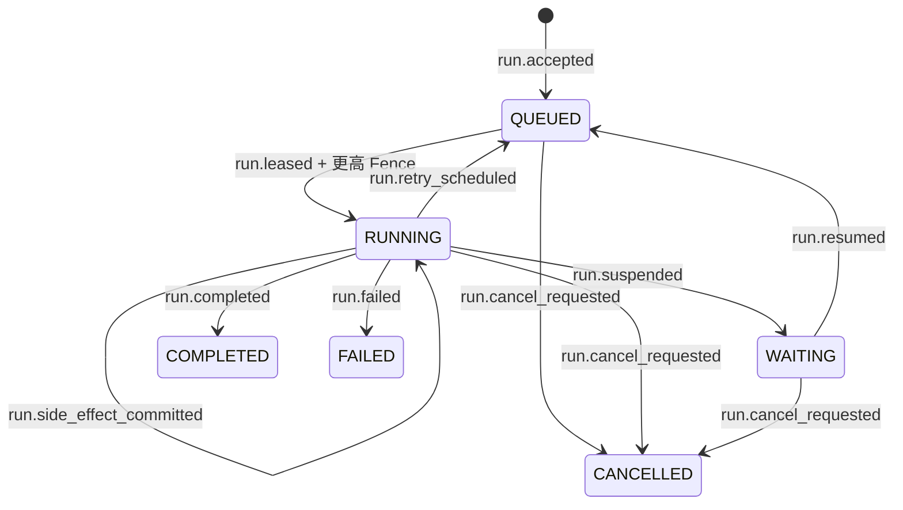
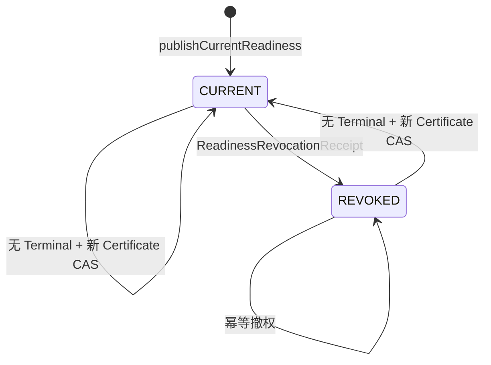

# 持久 Run 运行时操作手册

## 1. 交付边界

U4 交付的是 L2 分析任务的持久执行底座，不代表 L2 报告已经达到 `READY`，也不代表
L3–L5 已交付。它解决以下问题：

- HTTP 请求结束后，Worker 仍可继续执行；
- Worker 崩溃后，新 Worker 可用更高 Fence 接管；
- Suspend、Resume、Retry、Cancel 与 Event Replay 使用同一持久 Run；
- SQL/Eval 的结果提交使用内容寻址 Receipt，避免 Receipt 已提交后的重复执行；
- Mastra Snapshot 只用于恢复执行，不成为业务正确性权威。

U4 建立 PostgreSQL Event/Projection 与可恢复的事件序号。HTTP SSE Route、断线重连界面
和浏览器交互在 U8 暴露；U8 必须从 PostgreSQL Event Sequence/Projection Version
补齐缺口，不能把 Redis 通知当作完整事件流。

## 2. Reset-only 安装边界

U4 是本项目“彻底重置版”的新 Runtime Schema，不是旧 Text2SQL Runtime 的在线升级包。
Data Agent 的 U4–U9 App Migration 唯一目录为
`infra/supabase/apps/data-agent/migrations/`；不得在
`packages/platform/migrations/` 或 `infra/supabase/platform/migrations/` 建立同一
App Schema 的第二条迁移链。
安装 `20260725010500_app_data_agent_runtime_foundation` 前，
`runs / commands / run_events / outbox` 必须在 Data Agent 私有 Schema 内全局为空；否则
迁移以 `DA_U4_RESET_REQUIRES_EMPTY_RUNTIME` 失败关闭。共享 Supabase 项目可以保留
Platform、Deployment、Tenant 与其他 App 数据，但仅新建 Environment 不足以绕过该前置条件：
必须先归档并清空旧 Data Agent Runtime 行，或在新的 Supabase 项目执行安装。

发布前必须完成：

1. 导出旧 Run、Command、Event、Outbox 与 Artifact，记录导出 Hash 和恢复位置；
2. 对 Data Agent 私有 Schema 做跨 Environment 空表检查，再执行完整迁移演练；
3. 验证旧 `submit_command` API 已对所有运行角色撤销执行权限；Platform Registry 是
   Append-only 历史登记，旧行存在不代表端点仍可调用；
4. 仅把旧数据作为只读历史归档，不把旧事件回放成新 L2 的 READY 证据；
5. 先读取 `platform.migration_ledger` 并校验已登记 Migration 的 Name/Hash，只按顺序执行
   尚未登记的 `10500..10570`。`assert_migration_checksum` 在同名同 Hash 时只返回
   `false`，不会自动跳过文件后续 DDL；禁止在已有 U2 环境直接重放 `10100..10400`
   或把 clean-DB Smoke 脚本当成生产 Migrator；
6. `10500` 在提交新 Queue Schema 前同时撤销旧 Browser Runtime API、Backend 直写表
   权限与旧 Outbox/Fence 函数；`10505` 只安装前向 Browser 实现，仍不恢复写权限。
   `10570` 才一次性恢复 `authenticated` 的受治理接收入口和 Backend 窄函数授权。
   迁移中断在 `10500 / 10505 / 10510 / 10560` 任一前缀时都必须失败关闭；写入口必须
   从执行 `10500` 前持续停用到 `10570` 完成，不能在文件间提前恢复流量；
7. 如需将来支持生产原地升级，另立 expand/backfill/contract 迁移，使用分批提交、
   `CREATE INDEX CONCURRENTLY`、`NOT VALID + VALIDATE` 和生产规模锁/WAL 演练。

因此，U4 的 PostgreSQL Smoke 证明的是空 Runtime 安装与新契约，不证明已有生产数据的
零停机升级或回滚。回滚边界是撤销新 Environment 并恢复归档，不是逆向改写事件。
Hosted Migrator、OCI 镜像与 Worker Daemon 由 U9 交付；在它们完成真实环境验证前，
生产部署状态保持 `HOLD / NOT_RUN`。

## 3. 权威矩阵

| 对象 | 权威存储 | 作用 | 不能替代它的对象 |
| --- | --- | --- | --- |
| Command / Idempotency | PostgreSQL | 接收一次用户意图 | HTTP Request、内存 Map |
| Outbox / Run Attempt / Lease | PostgreSQL | 至少一次调度、Heartbeat、Retry、Fence | Redis Queue、进程锁 |
| Run Event | PostgreSQL | 不可变生命周期事实 | 日志、Mastra Event |
| Run Projection | PostgreSQL，由 Durable Event 推导 | 当前可查询状态 | Chat Message、UI 本地状态 |
| Artifact Revision | PostgreSQL Metadata + 内容寻址对象 | 分析正确性与证据链 | Mastra Snapshot |
| Historical RunTerminal | PostgreSQL，append-only | 记录当时为何 `READY/非 READY` | 当前可读性、缓存状态 |
| CurrentReadiness | PostgreSQL Current Readiness Authority | `CURRENT | REVOKED` 当前授权 | 历史 READY、UI `ready=true` |
| ReportReadGrant | PostgreSQL，单次 CAS | 当前报告读取/展示/下载授权 | Certificate、HTTP Session |
| Mastra Snapshot | PostgreSQL | opaque 执行恢复数据 | Run/Event/Artifact Authority |
| SQL/Eval Receipt | PostgreSQL | 内容寻址结果提交与重用 | “函数已经调用过”的进程内标记 |
| Redis / Upstash | 非权威 | 可丢失的唤醒、缓存与 Projection 加速 | Fence、Replay、发布判断 |

## 4. 状态与事件



`COMPLETED` 仅表示 Workflow 执行结束，Event 中固定写入
`completion_kind=WORKFLOW_EXECUTION_ONLY`。它不等价于 `AnalysisReport READY`；
U6 中的 `STOP_READY` 也不是公共终态。公共 `READY` 必须在四张独立 Evidence Gate
和 `ReportReadyCertificate@2` 已提交后，由 server-only `consumeCurrentReady` 在同一
PostgreSQL 事务中核验 exact Certificate、current Semantic/Schema/Data/Policy/Identity
Frontier 与 Revocation Head，随后才能提交。Mastra Checkpoint、Redis Cache、UI
携带的 `ready=true` 或历史 Certificate 都不能替代这次原子消费。

U6 不改变本节 Durable Runtime 的“终态之后无 lifecycle Event”规则。历史
`RunTerminal=READY` 一旦提交便保持不可变；Current Readiness 单独使用
`CURRENT | REVOKED`：



- Publication 只在尚无 Domain Terminal 时允许；相同已撤 Certificate 不得复活。
- READY 提交前，只有 DOMAIN_TERMINAL consume 与撤权竞争且后者先胜出时，同一事务
  才能提交唯一 `STALE` RunTerminal，且不能提交 READY 或 Grant；独立 revoke 不创建
  Terminal。
- READY 提交后，只更新 CurrentReadiness、Revocation Head、Receipt 与 Audit；不得改写
  历史 READY，也不得在 `run.completed/run.failed` 后追加新的 Run lifecycle Event。
- API/UI 必须同时投影“历史 READY”和“当前 REVOKED”；REVOKED 禁止新的读取、展示、
  下载和 Release `GO`，不能继续显示为当前成功。

通用 `authorizeRunTerminal` 永久拒绝 U6 拥有的
`READY/PARTIAL/NEEDS_MORE_RESEARCH/INCONCLUSIVE/STALE`；`READY/STALE` 固定返回
`CURRENT_READY_CONSUMPTION_REQUIRED`，三个 Research Stop 终态固定返回
`RESEARCH_STOP_TERMINAL_COMMIT_REQUIRED`。三个停止终态只能由
`commitResearchStopTerminal` 在 PostgreSQL 事务内消费 exact Strict StopDecision，
按 `STOP_PARTIAL -> PARTIAL/EVIDENCE_PARTIAL`、
`STOP_NEEDS_MORE_RESEARCH -> NEEDS_MORE_RESEARCH/EVIDENCE_COVERAGE_INSUFFICIENT`、
`STOP_INCONCLUSIVE -> INCONCLUSIVE/ANALYSIS_INCONCLUSIVE` 提交。V1 只允许显式
`readHistorical*`；
Writer/Committer/Research Artifact Authority 固定
`L2_WIRE_VERSION_WRITE_UNSUPPORTED`，current-ready、Grant、RunTerminal 与 Release
`GO` 固定 `READINESS_PROTOCOL_VERSION_UNSUPPORTED`。

报告读取的线性化顺序固定为：

1. Grant Issue 事务核验 current V2 Certificate 并创建短 TTL、单次待消费 Grant；
2. Grant Consume CAS 事务再次锁定 CurrentReadiness、排序 Frontier 与 Revocation
   Head；Consume 只授权服务端物化绑定响应；
3. Grant Response CAS 再次重验 CurrentReadiness、Frontier、Revocation，并从 exact
   Report 重跑固定版本 Deterministic Projector，与 Issue 时服务端生成的 immutable
   `canonical-response@1.0.0` Projection 逐字节比较；提交为 `RESPONDED` 后才发送
   绑定字节。Issue/Response 都不接受调用方自报 Digest 或 Bytes。

Grant Issue 还必须锁定并验证同 Run、同 Certificate 的不可变
`READY/RUN_READY` Domain Terminal；仅发布 CURRENT、只有 STOP_READY 或历史
Certificate 都不能提前读取。

撤权在 Response 提交前胜出时，Grant 必须失败且不得发送字节；Response 已提交后的
单次响应无法撤回，但撤权阻断之后所有新 Issue/Consume/Response。Release `GO` 同样必须在决策事务中
current-V2 revalidate Certificate、material Claim/Schema Frontier、CurrentReadiness、
Revocation Head 与绑定同一 Certificate 的 `READY/RUN_READY` Domain Terminal，不能
只验证历史 Certificate。相同 GO 幂等键重放也先做上述检查；GO 后撤权时历史 GO 只可
审计读取，重放返回 `CURRENT_READINESS_REVOKED`。

## 5. 正常执行路径

1. 控制面在一个事务内提交 Run、Command、Principal 作用域的 Idempotency Record、
   `run.accepted`、Outbox 与 Audit。初始接收只允许
   `kind=START_L2_RESEARCH`；`RESUME_RUN` 只能由受治理的 Resume 控制路径创建。
   Event 的 `occurred_at` 保留规范化调用时间；Run、Command、Idempotency、Outbox、
   Audit 等接收元数据统一使用 PostgreSQL 签发的 `accept_at`，其中 Outbox
   `available_at=accept_at`。因此，即使调用方提交未来的 Event 时间，已接收任务也能
   立即领取。
   Browser API 与 Backend Repository 对同一
   `app_id + tenant_id + environment + run_id` 使用完全相同的事务 Advisory Lock；
   Browser↔Browser、Browser↔Backend 和 Backend↔Backend 并发首写都只允许一个胜者。
   胜者提交后，败者稳定返回不可重试的 `DA_RUN_ALREADY_EXISTS`，事务回滚且不保留任何
   败者部分行。
   对已有 Run 追加 Outbox 的所有入口必须先 `FOR UPDATE` 锁定同一 `runs` 行；
   创建新 Run 的入口则在同一未提交事务内把首条 Outbox 固定为序号 `1`，并把
   `runs.next_queue_sequence` 初始化为 `2`。已有 Run 在持锁期间原子递增这个
   每 Run Counter，并把递增前的值写入 Outbox；禁止直接写 Outbox 或修改 Counter，
   以免不同连接的 Sequence Cache 改写真实入队顺序。数据库同时维护随 Lease 状态变化的
   `claimable_at`。Claim 用 `claimable_at` 做跨 Run 调度、用不可变的每 Run
   `queue_sequence` 做严格 FIFO；
   延迟或尚未过期的 Head 仍会阻止同 Run Follower，但不会阻止其他 Run。
2. Worker 调用 `claim_run_work`，PostgreSQL 使用 `FOR UPDATE SKIP LOCKED` 领取一条
   可执行 Outbox，创建 Attempt，并单调提升 Lease Token 与 Run Fence。正常任务与已耗尽
   重试预算的清理分别走有序 Partial Index；`requested_limit` 只统计真实 Lease。
3. Worker 先提交 `run.leased`，再调用项目自有 `RunWorkflowExecutorPort`。领域层只看到
   项目 Port，不直接依赖 Mastra Store。
4. Runner 在 `run.leased` 后立即 Heartbeat，并按 `min(15 秒, Lease Duration / 3)`
   自动续租；Executor 仍可在阶段边界主动 Heartbeat。Lease 携带数据库签发的
   `lease_duration_ms`，因此允许的最短 5 秒 Lease 不会误用 15 秒间隔。每次写 Event、
   Snapshot、Artifact 或 Receipt 前都重新检查当前 Projection 与 Fence。
   自动 Heartbeat 与总 Deadline 在读取最新 Snapshot 前就启动；恢复完成后必须再次
   Heartbeat，确认 Lease 仍有效，才允许启动 Executor。
   Executor 会收到总执行 Deadline 与 `AbortSignal`，Side Effect 会收到独立 Deadline 与
   `AbortSignal`；默认分别为 300 秒和 60 秒，可在 Worker Composition 中显式收紧。
5. Worker 先提交 Snapshot/Receipt，再提交引用它的 Event。Snapshot 的请求正文不包含
   `snapshot_hash`；PostgreSQL 对持久正文计算权威 Hash、写入并返回完整 Binding，
   Worker 只能传播返回值。读取时 Adapter 同时核对 Binding 内 Hash、独立持久列和
   PostgreSQL 重算值；TypeScript 的本地 Canonical Hash 不能替代该数据库权威。
   `run.checkpointed` 还必须绑定提交 Snapshot 时的 Projection Version 和完全相同的
   `active_artifact_ref`，因此 intervening Event 或 Artifact 换绑都会失败关闭。
   `run.suspended`、
   `run.retry_scheduled`、`run.completed` 与 `run.failed` 的 Event、Projection、
   Attempt、Outbox、Command 和 Run 结算在同一 PostgreSQL 事务完成；之后的
   `complete/retry` 调用只是带 Fence 的幂等确认。

读取 `get_run` 时，所有权/Principal 谓词必须并入首次 Run 查询；未授权 Run 与不存在
Run 都返回 `DA_RUN_NOT_FOUND`，不能用不同错误泄露对象是否存在。

## 6. 崩溃、重试与接管

- 未确认的 Lease 到期前，其他 Worker 不能领取同一 Work。
- Lease 到期后，新 Worker 创建新 Attempt，并取得严格更高的 Fence。
- Retry Delay 最小为 1 秒，单个 Outbox 最多自动交付 5 次。Lease 同时携带 Run 全局
  单调的 `attempt_no` 和当前 Outbox 的 `delivery_attempt_no`；预算只消费后者。第 5 次
  交付显式请求 Retry、返回无效 Executor Result，或第 5 个未确认 Lease 到期后再次
  Claim 时，PostgreSQL 都会确定性写入 `run.failed`，并把 Outbox 原子转为
  `DEAD_LETTER`；不得自动签发第 6 次交付。
- 显式 Resume 会创建新 Outbox，重置 `delivery_attempt_no`，但 `attempt_no` 继续单调
  增长。这样人工恢复不会继承旧 Command 的自动重试债务，也不能让同一 poison Outbox
  无限自旋。
- Claim 只在真实签发 Lease 后计入 `requested_limit`。过期的第 5 次投递可被原子收敛为
  Dead-letter，但不能吞掉同一轮后方仍可运行的 Work，也不能因队首锁或重复 Run 窗口
  错报全队列空闲。
- Executor 超过总执行 Deadline 时，Runner 先发送 `AbortSignal`，再以最小退避提交
  `RUN_EXECUTION_TIMEOUT` Retry；若已到第 5 个 Attempt，则直接写入
  `RUN_ATTEMPT_BUDGET_EXHAUSTED`。Heartbeat 发现 Cancel/Takeover 也会中止旧 Executor。
- 如果 Worker 在领取 Lease 后、提交 `run.leased` 前崩溃，Attempt 编号可以跳跃；
  Projection 必须采用权威 `run.leased.payload.attempt`，不能按已投影值简单加一。
- 新 Worker 从最新已提交的 Snapshot 和 Artifact Reference 恢复；它不能相信进程内
  状态，也不能把 Snapshot 内容直接发布为业务结论。
- 旧 Worker 的 Heartbeat、Checkpoint、Receipt、Artifact Commit、Completion 与 Queue
  Ack 必须因 Attempt/Lease/Fence 不匹配而失败。
- 如果 Receipt 已提交但对应 Event 尚未提交，新 Attempt 先按
  `run_id + effect_kind + input_hash` 查找并重用 Receipt，再按
  `App Scope + Run + Event Idempotency Key` 精确查询是否已经投影；该路径使用唯一索引，
  不能为每个 Side Effect 重新加载整个 Run Event 历史。
- SQL/Eval 本身必须是只读或可安全重放的受限操作。Worker 会根据
  `Scope + Run + Effect Kind + Input Hash` 生成跨 Attempt 稳定的幂等键并传给 Executor。
  Content-Addressed Receipt 保证的是“已提交结果不重复执行”；外部调用完成但 Receipt
  尚未提交时崩溃，只有目标系统真正执行该幂等键、只读语义或目标事务，才能避免物理副作用
  重复，不能把 PostgreSQL Receipt 伪称为严格 Exactly-once。
- `AbortSignal` 是 Provider/SQL/Eval Adapter 的强制协作契约，不是 JavaScript 对任意
  Promise 的强制终止。Adapter 必须把 Signal 继续传给底层客户端；不遵守该契约的外部
  调用可能在后台继续消耗资源，但它仍不能越过 Fence 提交任何权威结果。

## 7. Suspend、Resume 与 Cancel

### Suspend / Resume

Suspend 是协作式 Checkpoint：

1. Executor 返回 `SUSPENDED` 与 Checkpoint；
2. Worker 先提交 Snapshot，使用 PostgreSQL 返回的权威 Hash 追加
   `run.checkpointed`，再追加 `run.suspended`；checkpoint Event 只能引用提交时的
   Projection Version 与同一 Active Artifact；
3. Resume 控制命令只允许从 `WAITING` 进入 `QUEUED`，并创建新的
   `RESUME_RUN` Outbox；
4. 新 Attempt 用更高 Fence 领取任务，从 opaque Snapshot 恢复。

项目不依赖 Mastra 进程内 Pause 或同进程 Cancel 来保证正确性。

### Cancel

Cancel 是 PostgreSQL 权威命令：

- 从 `QUEUED`、`RUNNING` 或 `WAITING` 进入 `CANCELLED`；
- 原子提升 Fence，使当前 Worker 立即过期；
- Worker 可尽力中断 Provider Stream，但即使 Provider 继续返回，迟到的 Receipt、
  Checkpoint、Artifact 与 `run.completed` 也必须被数据库拒绝；
- 相同 Idempotency Key 只重放原控制命令，不能改绑另一个 Event 或 Run。

## 8. Replay 与 Projection Stream

Replay 按 `sequence` 从 `run.accepted` 开始应用全部 Durable Event。每一步都检查：

- App/Tenant/Environment/Run 相同；
- Sequence 连续；
- Fence 单调且符合事件类型；
- 状态迁移合法；
- 终态之后没有迟到 Event；
- Event、Projection 与 Snapshot 的 Canonical SHA-256 匹配。

这里的“匹配”以各自持久化权威为准：Event/Projection 由 PostgreSQL Reducer 复算；
Snapshot 由 PostgreSQL 在 Commit/Load 时签发和重算。不能要求任意 IEEE-754 数值在
TypeScript `JSON.stringify` 与 PostgreSQL `jsonb` 之间产生相同字节。

面向 SSE 的游标是 Event Sequence/Projection Version，不是 Redis Stream ID。U8 的
服务端 Route 接受最后已见 Sequence，先从 PostgreSQL 补齐 Durable Event，再订阅可丢失
的唤醒信号。U4 已提供 Scope-Bound 的 `listEvents(after_sequence)` 持久补洞契约，
每批默认最多 256、上限 500 条，调用方必须推进 Sequence 游标；HTTP Content Type、
Backpressure、重连与可访问性界面仍由 U8 交付。

Worker 追加 Event 时把刚刚校验过的 `RunProjectionRecord` 一并交给 Store Adapter。
Adapter 先校验 Projection 的 Scope、Run 与 Content Hash，再计算下一 Projection；
PostgreSQL 函数仍会重新锁定权威 Projection，并独立复算状态机与 Hash。这样避免同一
Event 在 Worker 与 Adapter 之间重复读取 Projection，但不会把调用方记录提升为数据库权威。

## 9. 常用诊断

所有查询都必须在已建立 App Capability 的事务中运行，并显式带
`app_id + tenant_id + environment + run_id` 条件。

未映射的 PostgreSQL/本地事务异常对外仍固定返回
`PERSISTENCE_TRANSACTION_FAILED`，但 Platform 会向
`data-agent.platform.persistence.transaction.failure` diagnostics channel 发布只含
`operation_name / correlation_id / error_class / sqlstate / DA_* marker` 的结构化诊断；
不得把原始数据库消息、SQL 参数或 Credential 写入日志。Worker 进程在 U9 接入日志系统时
必须订阅该 channel。

```sql
select sequence, event_type, worker_fence, created_at
from app_data_agent.run_events
where app_id = $1
  and tenant_id = $2
  and environment = $3
  and run_id = $4
order by sequence;
```

```sql
select attempt_no, worker_id, worker_fence, status, lease_expires_at
from app_data_agent.run_attempts
where app_id = $1
  and tenant_id = $2
  and environment = $3
  and run_id = $4
order by attempt_no;
```

```sql
select status, version, worker_fence, projection_hash
from app_data_agent.run_projections
where app_id = $1
  and tenant_id = $2
  and environment = $3
  and run_id = $4;
```

健康信号：

- 同一 Run 同时最多一个 `ACTIVE` Attempt；
- Projection Version 等于最后 Event Sequence；
- `runs.active_fence` 不小于 Projection Fence；
- 已完成的 Queue Work 的 `final_event_sequence` 与 Event 尾部一致；
- 相同 Side Effect 内容键只有一个 Receipt。
- `DEAD_LETTER` Outbox 必须对应 `run.failed`、FAILED Projection/Run/Command 和稳定
  `error_code`，且 Outbox `attempt_count` 不超过 5。
- 高频 Outbox 状态迁移会产生 Dead Tuple；生产环境必须同时监控
  `pg_stat_user_tables.n_dead_tup / last_autovacuum` 与 Claim p95。60k 合成状态更新的
  本地探针在 Vacuum 前后分别约为 `25.891ms / 0.241ms`，这只是容量校准而非生产 SLO；
  只有真实负载证据才能决定是否下调表级 Autovacuum Threshold/Scale Factor。

需要停止发布并调查的信号：

- Event Sequence 缺口或 Replay Hash 不一致；
- 一个 Run 出现多个活动 Attempt；
- 旧 Fence 成功写入 Snapshot、Receipt、Artifact 或 Completion；
- `CANCELLED` 后出现 Success Event；
- Snapshot 被当作 Report/Artifact Authority；
- 系统因 Redis 不可用而无法 Replay。

## 10. 验证命令

```bash
pnpm lint
pnpm typecheck
pnpm build
pnpm test:unit
pnpm test:contract
pnpm test:integration
pnpm test:security
infra/supabase/test-support/static-check.sh
infra/supabase/test-support/run-postgres-smoke.sh
```

真实 Provider Credential Smoke 仍按
`docs/runbooks/provider-credentialed-certification.md` 单独执行。没有 Credential 时
保持 `NOT_RUN/UNVERIFIED`，不能用 U4 的离线或数据库测试替代。
