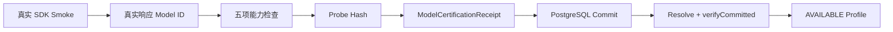

# Provider 真实凭证认证运行手册

## 目的

`pnpm capability:probe` 只执行静态配置检查和无网络 Conformance，不会把任何
Provider 标记为 `AVAILABLE`。只有本手册中的显式命令完成真实 SDK Smoke、
PostgreSQL 回执提交和回读校验后，Provider 才能获得 `AVAILABLE` 状态。

真实 Smoke 会向所选 Provider 发起请求并产生相应 API 成本。普通构建、单元测试、
`pnpm test:providers` 和 `pnpm capability:probe` 均不会触发这些请求。

## 前置条件

- 已运行 U2 Migration，并存在一个属于目标 Principal 的 Run。
- Run 的当前 `active_fence` 已知，执行身份拥有目标 App/Tenant 的写权限。
- 明确选择至少两个 Provider。
- 为每个所选 Provider 指定当前部署确认过的真实 Model ID。仓库中的默认 Model ID
  仅是 `UNVERIFIED_DEPLOYMENT_DEFAULT`，不能作为在线可用证据。
- Provider Credential 只通过对应的服务端环境变量注入，不能写入命令参数、日志、
  数据库回执或报告。

## 必需环境变量

| 环境变量 | 含义 |
| --- | --- |
| `DATA_AGENT_CREDENTIAL_SMOKE_CONFIRM` | 必须精确为 `YES`；否则命令返回 `NOT_RUN`，且不读取 Provider Credential |
| `DATA_AGENT_DATABASE_URL` | 用于 PostgreSQL Authority 与 Receipt 持久化的服务端连接 |
| `DATA_AGENT_DEPLOYMENT_ID` | U2 已注册的 Deployment UUID |
| `DATA_AGENT_TENANT_ID` | 目标 Tenant UUID |
| `DATA_AGENT_PRINCIPAL_ID` | 目标 Principal UUID |
| `DATA_AGENT_RUN_ID` | 已存在的 Run UUID |
| `DATA_AGENT_WORKER_FENCE` | 该 Run 当前 Worker Fence，必须为非负安全整数 |
| `DATA_AGENT_CREDENTIAL_SMOKE_PROVIDERS` | 至少两个、逗号分隔的 Provider，例如 `openai,anthropic` |
| `DATA_AGENT_MODEL_PROVIDER_OVERRIDES` | JSON 数组；每个所选 Provider 都必须绑定明确的真实 Model ID |

Provider Credential 使用以下既有服务端变量：

| Provider | Credential 环境变量 |
| --- | --- |
| OpenAI | `OPENAI_API_KEY` |
| Anthropic/Claude | `ANTHROPIC_API_KEY` |
| DeepSeek | `DEEPSEEK_API_KEY` |
| GLM | `ZAI_API_KEY` |
| Kimi | `MOONSHOT_API_KEY` |
| Grok | `XAI_API_KEY` |
| Gemini | `GOOGLE_GENERATIVE_AI_API_KEY` |

## 执行

先在受控环境中设置变量，再运行：

```bash
pnpm capability:probe:credentialed
```

未设置确认变量时，命令只输出：

```json
{
  "schema_version": "1.0.0",
  "terminal": "NOT_RUN",
  "reason_code": "EXPLICIT_CONFIRMATION_REQUIRED"
}
```

显式确认后，每个所选 Provider 依次经过以下链路：



五项检查为 Request Shape、Structured Output、强制 Tool Call、Streaming 和错误归一化。
任一检查失败、响应缺少真实 Model ID、Model ID 与部署覆盖不一致、Fence 过期、回执提交
失败或回读不一致，都会失败关闭。

## 结果解释

- `PASS`：至少两个 Provider 的真实 Smoke 与权威回执链全部完成。
- `HOLD`：少于两个 Provider 成功，或 Authority、Fence、Receipt、配置任一环节失败。
- `NOT_RUN`：没有精确显式确认；此状态不是失败，也不是认证成功。
- `UNVERIFIED`：没有提供对应 Credential，不能参与 `AVAILABLE` 路由。
- `UNAVAILABLE`：已尝试但 Smoke、关联或权威回执校验失败。

报告只包含 Provider、Model ID、状态、原因码和 Artifact Reference，不包含 Credential
或上游错误正文。没有真实凭据和已提交回执时，发布状态必须继续保持 `HOLD`。
